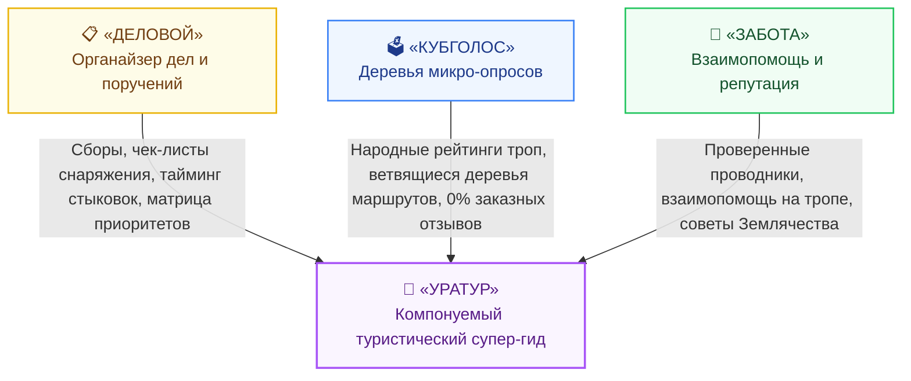

# Мастер-план серии презентаций «Флагманские приложения платформы Турбаза»
## Квартет прикладного суверенитета: «Деловой», «КубГолос», «Забота» и компонуемый супер-гид «УраТур»

---

## 🎯 Миссия и цели серии

Серия презентаций **«Флагманские приложения платформы Турбаза»** (`applications_presentations/`) создана для демонстрации того, как базовые архитектурные принципы платформы «Турбаза» (автономные Хранилища `%Repository`, реляционные схемы баз данных `%Database`, внешние ключи `%ForeignKey`, Общественные Оболочки `%API` и экономика $1/N$) работают на практике в реальных прикладных сценариях для людей, семей, дворов, районов и путешественников.

Главная цель — показать не абстрактные концепции, а живые, взаимосвязанные и взаимодополняющие сервисы, готовые к моментальному старту:
1. **«Деловой»** — персональный и семейный органайзер задач, встреч и поручений.
2. **«КубГолос»** — народная платформа версионных микро-опросов «снизу вверх».
3. **«Забота»** — социальная сеть взаимной поддержки граждан, добрососедства и открытых репутационных схем.
4. **«УраТур»** — флагманский туристический планер и путеводитель, рожденный из синергии трех базовых приложений.

---

## ⏱️ Стандарты формата и визуального стиля

* **Количество презентаций в серии:** Ровно **4 презентации**.
* **Количество слайдов:** Ровно **12 слайдов** в каждой презентации.
* **Целевой хронометраж:** **9:00 – 10:00 минут** (40–45 сек речи на слайд + паузы).
* **Визуальный стиль:** **«Суверенный Горизонт» (Sovereign Horizon Explainer)**:
  - Сланцевый глубокий фон (`#0a0f1d`).
  - Верхний серийный маркер: `🏔️ ПЛАТФОРМА ТУРБАЗА | ПРИКЛАДНОЙ СУВЕРЕНИТЕТ`.
  - Эффект Glassmorphism с индивидуальными цветовыми кодами для каждого приложения.
  - Билборд-типографика ($\ge 50$px заголовки, $\ge 24$px основной текст, $\ge 54$px KPI-числа).

---

## 🧭 Каталог серии презентаций

| № | Директория презентации | Название и тема | Цветовой код | Ключевой слоган и концептуальный фокус |
| :---: | :--- | :--- | :---: | :--- |
| **01** | `01_delovoy_app_presentation/` | **«Деловой»: Органайзер приоритетов и поручений** | Золотой янтарь (`#f59e0b` / `#fbbf24`) | *«Управление делами человека и семьи: матрица срочно/важно, фактор случайности и поручения без центральных серверов»* |
| **02** | `02_kubgolos_app_presentation/` | **«КубГолос»: Народные деревья микро-опросов** | Неоновый циан (`#00f0ff` / `#38bdf8`) | *«Голос общества снизу вверх: версионные ветвящиеся микро-опросы, комбинаторика вопросов и 0% ботов»* |
| **03** | `03_zabota_app_presentation/` | **«Забота»: Сеть взаимопомощи и открытая репутация** | Изумрудная хвоя (`#10b981` / `#34d399`) | *«Доверенное добрососедство, подъездная выручка и открытые схемы репутации для всех форумов экосистемы»* |
| **04** | `04_uratur_app_presentation/` | **«УраТур»: Суверенный туристический планер и путеводитель** | Пурпурный аметист (`#a855f7` / `#e879f9`) | *«Путешествия со смыслом: планирование сборов от „Делового“, народные маршруты от „КубГолоса“ и помощь местных от „Заботы“ 100% офлайн»* |

---

## 🧩 Синергетическая архитектура: Как «УраТур» объединяет три базовых приложения



---

## 🏗️ Структура директорий репозитория

```
applications_presentations/
├── turbase_applications_master_plan.md          # Мастер-план серии приложений
├── AGENTS.md                                   # Правила и спецификации для агентов
├── 01_delovoy_app_presentation/                 # «Деловой»
│   └── docs/presentation_outline.md
├── 02_kubgolos_app_presentation/                # «КубГолос»
│   └── docs/presentation_outline.md
├── 03_zabota_app_presentation/                  # «Забота»
│   └── docs/presentation_outline.md
└── 04_uratur_app_presentation/                  # «УраТур»
    └── docs/presentation_outline.md
```
