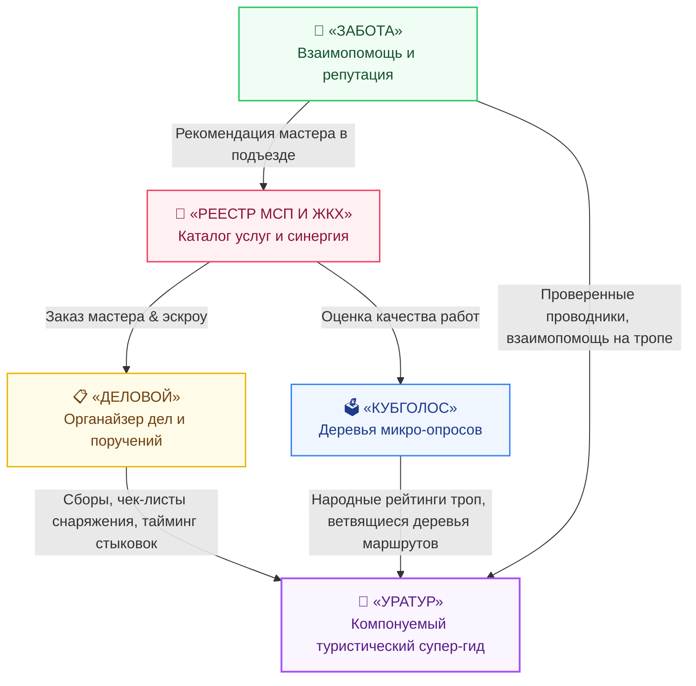

# Мастер-план серии презентаций «Флагманские приложения платформы Турбаза»
## Цикл из 5 начальных сервисов прикладного суверенитета: «Деловой», «КубГолос», «Забота», «УраТур» и «Локальный реестр МСП и ЖКХ»

---

## 🎯 Миссия и цели серии

Серия презентаций **«Флагманские приложения платформы Турбаза»** (`applications_presentations/`) создана для демонстрации того, как базовые архитектурные принципы платформы «Турбаза» (автономные Хранилища `%Repository`, реляционные схемы баз данных `%Database`, внешние ключи `%ForeignKey`, Общественные Оболочки `%API` и экономика $1/N$) работают на практике в реальных прикладных сценариях для людей, семей, дворов, районов и путешественников.

Серия состоит из **5 взаимосвязанных презентаций**, которые показывают законченную среду повседневной цифровой жизни:
1. **«Деловой»** — персональный и семейный органайзер задач, встреч и поручений.
2. **«КубГолос»** — народная платформа версионных микро-опросов «снизу вверх».
3. **«Забота»** — социальная сеть взаимной поддержки граждан, добрососедства и открытых репутационных схем.
4. **«УраТур»** — флагманский туристический планер и путеводитель, рожденный из синергии трех базовых приложений.
5. **«Локальный реестр МСП и ЖКХ»** — каталог услуг шаговой доступности и сквозная прикладная синергия всей экосистемы.

После завершения данного цикла из 5 презентаций будет развернут **цикл из 7 специализированных презентаций, детально покрывающий всю архитектурную информацию о платформе «Турбаза»**.

---

## ⏱️ Стандарты формата и визуального стиля

* **Количество презентаций в серии:** Ровно **5 презентаций**.
* **Количество слайдов:** Ровно **15 слайдов** в каждой презентации (строгий стандарт платформы, 75 слайдов в сумме).
* **Целевой хронометраж:** **11:00 – 12:30 минут** (40–45 сек речи на слайд + паузы).
* **Голос озвучки:** Microsoft Edge Neural TTS (`ru-RU-DmitryNeural`, темп `-9%`, тон `-5Hz`).
* **Визуальный стиль:** **«Суверенный Горизонт» (Sovereign Horizon Explainer)**:
  - Сланцевый глубокий фон (`#0a0f1d`).
  - Верхний серийный маркер: `🏔️ ПЛАТФОРМА ТУРБАЗА | ПРИКЛАДНОЙ СУВЕРЕНИТЕТ`.
  - Эффект Glassmorphism с индивидуальными цветовыми кодами для каждого приложения.
  - Билборд-типографика ($\ge 50$px заголовки, $\ge 24$px основной текст, $\ge 54$px KPI-числа).
* **Медиа-пакет каждого трека:**
  - Интерактивный Web-дек (`generated/outputs/web_deck/index.html`) на базе `shared_templates/platform_overview_deck/`.
  - Дикторская озвучка Edge Neural TTS (`ru-RU-DmitryNeural`).
  - Раздаточный A4-буклет (`generated/outputs/pdf/handout.pdf`).
  - Чистовая 16:9 Landscape PDF-дека (`generated/outputs/pdf/slides.pdf`).
  - Эксплейнер-Whitepaper (`generated/outputs/pdf/whitepaper.pdf`).
  - Видеоролик (`generated/outputs/video/`).

---

## 🧭 Каталог серии презентаций (5 частей по 15 слайдов)

| № | Директория презентации | Название и тема | Цветовой код | Ключевой слоган и концептуальный фокус |
| :---: | :--- | :--- | :---: | :--- |
| **01** | `01_delovoy_app_presentation/` | **«Деловой»: Органайзер приоритетов и поручений** | Золотой янтарь (`#f59e0b` / `#fbbf24`) | *«Матрица Эйзенхауэра 2.0, гравитационные сферы задач, алгоритм Serendipity против ступора, семейные поручения %Family, внешние ключи %ForeignKey и локальный SQLite <1 мс»* (15 слайдов) |
| **02** | `02_kubgolos_app_presentation/` | **«КубГолос»: Народные деревья микро-опросов** | Неоновый циан (`#00f0ff` / `#38bdf8`) | *«Голос общества снизу вверх: 6 граней и 3 фактора куба голосования, ветвящиеся деревья вопросов %Tree, взвешивание критериев, 0% ботов и децентрализованная агрегация без централизованных баз данных»* (15 слайдов) |
| **03** | `03_zabota_app_presentation/` | **«Забота»: Сеть взаимопомощи и открытая репутация** | Изумрудная хвоя (`#10b981` / `#34d399`) | *«Доверенное добрососедство, подъездная взаимовыручка, очные QR-поручительства соседей, многомерный Web-of-Trust без соцрейтинга и переиспользуемые схемы репутации для форумов»* (15 слайдов) |
| **04** | `04_uratur_app_presentation/` | **«УраТур»: Суверенный туристический планер и путеводитель** | Пурпурный аметист (`#a855f7` / `#e879f9`) | *«Путешествия со смыслом: сборы от „Делового“, народные тропы от „КубГолоса“ и проводники от „Заботы“ — 100% офлайн в горах/тайге по SQLite и ячеистым BLE-сетям»* (15 слайдов) |
| **05** | `05_local_services_presentation/` | **«Локальный реестр МСП и ЖКХ: Прикладная синергия»** | Рубиновый коралл (`#f43f5e` / `#fb7185`) | *«Мастера шаговой доступности за 2 мс, расчеты в Цифровом рубле (эскроу) без налога платформ 30% и сквозная синергия всех 5 приложений экосистемы»* (15 слайдов) |

---

## 🧩 Синергетическая архитектура: Квинтет приложений



---

## 🏗️ Структура директорий репозитория

```
applications_presentations/
├── turbase_applications_master_plan.md          # Мастер-план серии приложений (5 частей)
├── AGENTS.md                                   # Правила и спецификации для агентов
├── 01_delovoy_app_presentation/                 # «Деловой»
│   └── docs/presentation_outline.md
├── 02_kubgolos_app_presentation/                # «КубГолос»
│   └── docs/presentation_outline.md
├── 03_zabota_app_presentation/                  # «Забота»
│   └── docs/presentation_outline.md
├── 04_uratur_app_presentation/                  # «УраТур»
│   └── docs/presentation_outline.md
└── 05_local_services_presentation/              # «Локальный реестр МСП и ЖКХ»
    └── docs/presentation_outline.md
```
