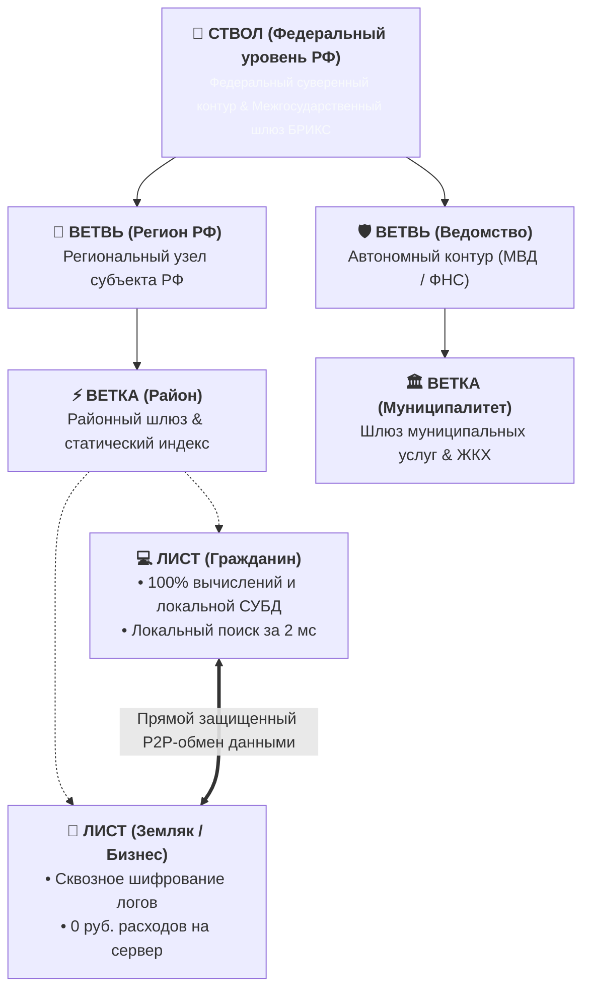
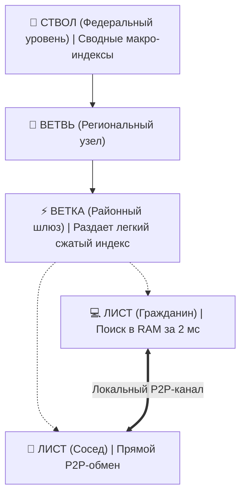

<!-- slide: 1 -->
## Слайд 1: Титульный
- **tag:** "Титульный слайд"
- **title:** "ПЛАТФОРМА «ТУРБАЗА»"
- **subtitle:** "Национальная суверенная инфраструктура данных и защищенных вычислений нового поколения"
- **citation:** "[1 — 20]"

### [VISUAL: blueprint_tree]

### [CONTENT: key_pillars]
- 🛡️ **Zero-Knowledge Architecture**: Данные шифруются на Листе до отправки в сеть. Серверы физически не имеют доступа к содержимому.
- ⚡ **Edge & Local-First Computing**: 100% логики и СУБД работают на смартфонах и ПК. Снижение нагрузки на ЦОД и серверы на **85–90%**.
- 🤝 **Sovereign Privacy & Trust**: Доверие к землякам (Proof-of-Personhood). Защита от ботнетов, вербовки и рекламного шпионажа.
- 🔗 **Composable Schemas (SSoT)**: Межприкладные схемы данных без дублирования. Модель прав «Read-Anywhere, Write-Self».

### Текст для диктора (Narration):
> «Уважаемые коллеги! Представляем платформу "Турбаза" — отечественное решение для построения суверенной, экономичной и безопасной государственной инфраструктуры данных.
> 
> В условиях санкционных ограничений и дефицита серверного оборудования централизованные дата-центры становятся уязвимыми и непомерно дорогими для бюджета. "Турбаза" предлагает принципиально иной подход: перенос вычислений на устройства самих граждан и древовидную организацию национальной сети.
> 
> Все научные первоисточники и стандарты указаны непосредственно на слайдах презентации и собраны в единый реестр в заключительной части доклада».

---

<!-- slide: 2 -->
## Слайд 2: Вызовы централизованных систем
- **tag:** "Стратегический вызов"
- **title:** "3 ТУПИКА ТРАДИЦИОННОЙ ЦЕНТРАЛИЗАЦИИ"
- **subtitle:** "Почему централизованные облака исчерпали потенциал в условиях санкций и угроз"
- **citation:** "[1, 2]"

### [VISUAL: problem_cards]
- 🚫 **1. Аппаратный кризис ЦОД**: Санкционные барьеры на серверные CPU/GPU. Экспоненциальный рост расходов CapEx/OpEx при 100% вычислений на серверах.
- 📉 **2. Непрозрачность трафика**: Невозможность верифицировать район подключения. Безнаказанность мошеннических колл-центров и экстремистов.
- 🔓 **3. Утечки и коммерческий шпионаж**: Концентрация ПДн 140+ млн граждан в единых базах приводит к массовым сливам и потере доверия.
- 💥 **4. Единая точка отказа**: Публичные шлюзы под постоянными DDoS-атаками. Уязвимость плоских сетей перед горизонтальным заражением.

### [CONTENT: impact_summary]
- **Вычислительная база**: Традиционные облака требуют закупки дефицитных суперкомпьютеров, тогда как вычисления на устройствах граждан масштабируются бесплатно.
- **Информационная безопасность**: Переход от монолитных «мега-хранилищ» к распределенным зашифрованным Листьям делает массовую кражу данных математически невозможной.

### Текст для диктора (Narration):
> «Сегодня традиционная облачная архитектура зашла в тройной тупик:
> 
> **Первое — Аппаратный кризис.** Ограничения на поставку зарубежных серверных процессоров делают расширение центральных супер-ЦОД крайне затратным для государства.
> 
> **Второе — Перегрузка магистралей.** Когда каждый клик гражданина передается в Москву, каналы связи задыхаются от рутинного локального трафика.
> 
> **Третье — Риск масштабных утечек.** Сбор персональных данных ста сорока миллионов граждан в едином монолитном хранилище создает критическую уязвимость для всей национальной безопасности».

---

<!-- slide: 3 -->
## Слайд 3: Архитектурный сдвиг: Local-First
- **tag:** "Фундаментальная парадигма"
- **title:** "ВЫЧИСЛЕНИЯ НА УСТРОЙСТВАХ ГРАЖДАН"
- **subtitle:** "Перенос 100% бизнес-логики и СУБД на периферию: ячейка «Лист» вместо супер-ЦОД"
- **citation:** "[1, 2, 3]"

### [VISUAL: comparison_columns]
- ❌ **Традиционное облако (Old Cloud)**: 100 млн пассивных терминалов шлют миллиарды запросов на сервер. Сервер перегружен SQL-парсингом, CPU задыхается, единая точка отказа.
- ✅ **«Турбаза» Local-First**: Лист (смартфон/ПК) выполняет 100% вычислений в изолированной WASM-песочнице со встроенной СУБД SQLite. Шлюз Ветки лишь координирует зашифрованные логи.

### [CONTENT: pillar_cards]
- 💻 **1. Аппаратная синергия**: 140 млн личных устройств суммарно формируют петафлопсы вычислительной мощности бесплатно для бюджета.
- ⚡ **2. Разгрузка ЦОД на 90%**: Сервер больше не выполняет чужой тяжелый код, выступая лишь надежным сетевым шлюзом.
- 📴 **3. Оффлайн-автономия (CRDT)**: Врачи, инспекторы и граждане полноценно работают в тайге без связи с мгновенной синхронизацией при появлении сети.

### Текст для диктора (Narration):
> «"Турбаза" решает эти проблемы переносом вычислений на периферию — на устройства самих пользователей, создавая ячейку **"Лист"**.
> 
> Это дает три фундаментальных преимущества:
> 
> **Колоссальная экономия бюджета:** мы задействуем мощные процессоры, которые уже находятся в карманах ста сорока миллионов жителей, распределяя нагрузку вместо закупки дефицитных серверных чипов.
> 
> **Разгрузка серверов на девяносто процентов:** сервер больше не тратит ресурсы на выполнение чужих программ, выступая лишь легким защищенным шлюзом.
> 
> **Полная автономность:** врач или инспектор могут работать в тайге и на выезде без связи — при появлении сети данные синхронизируются автоматически».

---

<!-- slide: 4 -->
## Слайд 4: Древовидная топология и локальный поиск
- **tag:** "Сетевая топология"
- **title:** "ДРЕВОВИДНАЯ ТОПОЛОГИЯ И КЛИЕНТСКИЙ ПОИСК"
- **subtitle:** "Иерархическая масштабируемость O(log N), разгрузка каналов и поиск за 2 мс"
- **citation:** "[4, 5]"

### [VISUAL: tree_search]

### [CONTENT: feature_bullets]
- 🌲 **Логарифмическая глубина $O(\log N)$**: Маршрутизация идет строго до наименьшего общего предка (LCA), исключая каскадную перегрузку магистралей.
- 🔍 **Клиентский полнотекстовый поиск**: Телефон скачивает сжатый районный индекс и ищет в локальной памяти за 2 мс при 0 руб. затрат на сервер.
- 🌐 **Локализация 85% трафика**: Районные вопросы (ЖКХ, поликлиники, локальные службы) замыкаются внутри района, полностью освобождая федеральные каналы.

### Текст для диктора (Narration):
> «Сеть платформы строится по **принципу государственной почтовой службы: письмо соседу не нужно везти через Москву**. Районные Ветки объединяются в областные Ветви, а те сходятся в федеральный Ствол.
> 
> **Восемьдесят пять процентов сетевого трафика локализуется в районе:** рутинные вопросы ЖКХ, поликлиник и локальных форумов замыкаются на местном уровне, полностью освобождая федеральные магистрали.
> 
> **Мгновенный поиск без нагрузки на серверы:** телефон скачивает легкую адресную книгу района и находит контакты в своей памяти за две миллисекунды. Для серверов и бюджета стоимость поиска равна нулю».

---

<!-- slide: 5 -->
## Слайд 5: Федеративный OLAP
- **tag:** "Государственная аналитика"
- **title:** "ФЕДЕРАТИВНЫЙ OLAP И ДРЕВОВИДНЫЙ MAPREDUCE"
- **subtitle:** "Мгновенные отчеты на смартфонах + Иерархическое сложение государственной статистики"
- **citation:** "[6, 7]"

### [VISUAL: 2tier_olap]
- 📱 **1. Private OLAP (100% на Листе)**: Личные и корпоративные отчеты по ЖКХ, налогам или балансам предприятий рассчитываются в векторизованном движке смартфона (<10 мс). 0% нагрузки на серверы.
- 🌲 **2. Public OLAP (Иерархическая редукция)**: Каждый Лист отправляет наверх лишь 128-байтную числовую строку агрегата. Ветки и Ветви суммируют показатели за доли секунды без раскрытия сырых досье.

### [CONTENT: key_metrics]
- ⚡ **Время построения личных отчетов**: Менее 10 миллисекунд в памяти устройства.
- 📦 **Размер пакета макростатистики**: Ровно 128 байт на транзакцию.
- 💰 **Экономия серверов аналитики**: Сокращение затрат на DWH/Data Lake на **97%**.

### Текст для диктора (Narration):
> «Сбор государственной аналитики в "Турбазе" разделен на два уровня по **принципу сводного протокола**:
> 
> **Личные и корпоративные отчеты** по ЖКХ, налогам или балансам предприятий рассчитываются на процессорах самих пользователей. Нагрузка на серверы равна нулю, а персональные данные не покидают устройство.
> 
> **Общенациональная статистика** собирается иерархическим сложением: каждый смартфон передает наверх лишь **одну короткую числовую строчку в сто двадцать восемь байт**. Районные и региональные узлы складывают показатели за доли секунды.
> 
> Государство получает макростатистику в реальном времени, сокращая расходы на серверы аналитики на **девяносто семь процентов**».

---

<!-- slide: 6 -->
## Слайд 6: Сравнительная эффективность ресурсов
- **tag:** "Аппаратная экономика"
- **title:** "СОКРАЩЕНИЕ ЗАТРАТ ДАТА-ЦЕНТРОВ НА 85–99%"
- **subtitle:** "Многократная экономия вычислительных мощностей на масштабе 100 млн пользователей"
- **citation:** "[1, 2, 7]"

### [VISUAL: efficiency_bars]
- 🖥️ **Нагрузка на CPU серверов**: Снижение со 100% до **8%** (Экономия 92%)
- 🧠 **Оперативная память (RAM)**: Снижение со 100% до **12%** (Экономия 88%)
- 💾 **Дисковые хранилища аналитики**: Снижение со 100% до **3%** (Экономия 97%)
- 🌐 **Магистральный трафик**: Снижение со 100% до **18%** (Экономия 82%)

### [CONTENT: total_tco_card]
- 📉 **Совокупная стоимость владения (TCO)**: Снижение затрат на государственную серверную инфраструктуру более чем **в 8 раз**.
- 🛡️ **Импортонезависимость**: Отсутствие потребности в постоянной закупке дефицитных зарубежных серверных процессоров и дисковых массивов SAN.

### Текст для диктора (Narration):
> «Расчеты на масштабе в сто миллионов активных пользователей подтверждают многократную экономию государственных ресурсов:
> 
> **Процессорная нагрузка серверов** снижается со ста процентов до **восьми процентов** — экономия более девяноста двух процентов.
> 
> **Оперативная память** сокращается со ста процентов до **двенадцати процентов**.
> 
> **Дисковые хранилища аналитики** уменьшаются со ста процентов до **трех процентов** за счет ликвидации сырых централизованных баз.
> 
> **Магистральный трафик** падает на **восемьдесят два процента**.
> 
> В итоге совокупная стоимость владения серверной инфраструктурой снижается более чем **в восемь раз**».

---

<!-- slide: 7 -->
## Слайд 7: Межприкладные схемы данных (SSoT)
- **tag:** "Архитектура данных"
- **title:** "ПРИНЦИП ЕДИНОГО ОРИГИНАЛА ДАННЫХ"
- **subtitle:** "Разделение заказа и доставки: ликвидация утечек адресов и защита реестров"
- **citation:** "[8, 9, 10]"

### [VISUAL: ssot_diagram]
- 🛒 **Интернет-магазин (Заказ)**: Видит только оплату и ID заказа. **Вообще не имеет доступа к адресу и паспорту гражданина**.
- 📦 **Служба доставки (Почта)**: Получает адрес гражданина напрямую с его телефона по зашифрованному токену заказа.
- 🛡️ **Результат при взломе магазина**: Утечка персональных данных равна **0%**.

### [CONTENT: ssot_rules]
- 📋 **Single Source of Truth**: Паспорт и прописка хранятся в единственном экземпляре на устройстве гражданина.
- 🔒 **Read-Anywhere, Write-Self**: Приложения могут запрашивать данные с разрешения пользователя, но не могут изменить эталонную запись.
- 💾 **Экономия дискового пространства**: Сокращение дублирующих баз данных на **60–80%**.

### Текст для диктора (Narration):
> «Главная причина массовых утечек — копирование паспортов и адресов граждан в базы десятков коммерческих сервисов.
> 
> В "Турбазе" эта угроза ликвидирована **разделением заказа и доставки**:
> 
> Интернет-магазин получает оплату и номер заказа, но **вообще не знает домашнего адреса покупателя**. Телефон гражданина сам передает адрес напрямую Почте для доставки посылки по номеру заказа.
> 
> При взломе магазина утечка адресов равна **нулю**. Государственные реестры защищены от изменения сторонними программами, а дисковое пространство экономится на **шестидесяти — восьмидесяти процентах**».

---

<!-- slide: 8 -->
## Слайд 8: Периметр безопасности и верификация
- **tag:** "Государственная безопасность"
- **title:** "ТРЕХУРОВНЕВЫЙ ПЕРИМЕТР ЗАЩИТЫ"
- **subtitle:** "Превентивный анализ цепочек, заслон от дипфейков и локальная верификация"
- **citation:** "[11, 12, 13]"

### [VISUAL: security_layers]
- 🗺️ **1. Прозрачная карта связей (Спецслужбы)**: Районные узлы ведут неизменяемый журнал соединений (кто, с кем и когда связывался), позволяя выявлять цепочки зарубежных мошеннических центров без нарушения тайны переписки.
- 🤝 **2. Очная жеребьевка (Proof-of-Personhood)**: Локальные группы по 25 человек верифицируют друг друга, давая 100% гарантию живого человека без загрузки сканов паспортов в сеть.
- 🛡️ **3. Личный районный фильтр гражданина**: Прием вызовов и сообщений только от проверенных соседей своего района, блокирующий 100% спама и фишинга.

### [CONTENT: security_impact]
- 🚫 **Ликвидация иностранных бот-ферм**: Автоматический бан аккаунтов, не имеющих локальных подтверждений живого присутствия.
- 🔍 **Анализ графов киберугроз**: Быстрое пресечение координации преступных сообществ на ранних стадиях.

### Текст для диктора (Narration):
> «Для защиты от кибермошенников и экстремистских угроз "Турбаза" реализует трехуровневый периметр безопасности:
> 
> **Прозрачная карта связей для органов безопасности:** районные узлы фиксируют журнал соединений (кто, с кем и когда связывался), позволяя аналитическим системам пресекать работу зарубежных колл-центров без нарушения тайны переписки.
> 
> **Заслон от ботов и дипфейков:** очная жеребьевка в группах по двадцать пять человек дает стопроцентную гарантию живого земляка без раскрытия паспорта в сети.
> 
> **Личный фильтр гражданина:** каждый пользователь может принимать звонки только от проверенных жителей своего района, блокируя спам и фишинг».

---

<!-- slide: 9 -->
## Слайд 9: Землячество и защита частной информации
- **tag:** "Доверие граждан"
- **title:** "ЗЕМЛЯЧЕСТВО И ПРИВАТНОСТЬ ПО УМОЛЧАНИЮ"
- **subtitle:** "Сквозное шифрование, слепая доставка в ведомства и реклама без шпионажа"
- **citation:** "[14, 15, 16]"

### [VISUAL: privacy_cards]
- 📨 **1. Слепая прямая доставка**: Запросы в ФНС или Минздрав шифруются открытым ключом ведомства. Системные администраторы серверов физически не могут прочесть текст.
- 📢 **2. Реклама без слежки**: Рекламодатель видит только общий географический район. Анонимные интересы передаются только с согласия гражданина. Сквозной трекинг исключен.
- 💬 **3. Сквозное шифрование чатов (MLS)**: Протокол RFC 9420 гарантирует полную защиту групповых коммуникаций даже при компрометации хостинга.

### [CONTENT: trust_metrics]
- 🔒 **Шифрование данных**: End-to-End по ГОСТ / MLS на всех уровнях коммуникаций.
- 👤 **Владение профилем**: Гражданин является единственным владельцем своих ключей и истории.

### Текст для диктора (Narration):
> «Доверие граждан к платформе опирается на три гарантии защиты личной информации:
> 
> **Слепая прямая доставка:** обращения в ФНС или Минздрав шифруются ключом ведомства — администраторы серверов физически не могут прочитать содержимое.
> 
> **Прозрачная реклама без слежки:** по умолчанию рекламодатель видит только общий географический район. Анонимные категории интересов передаются только по добровольному согласию гражданина, а сквозной шпионаж исключен.
> 
> **Надежное шифрование групповых чатов:** серверы оперируют только зашифрованным текстом, исключая утечки при взломе хостинга».

---

<!-- slide: 10 -->
## Слайд 10: Межведомственная изоляция и БРИКС
- **tag:** "Суверенная интеграция"
- **title:** "МЕЖВЕДОМСТВЕННАЯ ИЗОЛЯЦИЯ И ФЕДЕРАЦИЯ БРИКС"
- **subtitle:** "Принцип герметичных отсеков подлодки и суверенные трансграничные шлюзы"
- **citation:** "[17, 18, 19, 20]"

### [VISUAL: isolation_grid]
- 🛡️ **Герметичные ведомственные отсеки**: Контуры МВД, ФНС, Минздрава и Минобороны физически изолированы. Взлом муниципального сайта или ЖКХ не дает доступа к базам силовых ведомств.
- 🎟️ **Одноразовые крипто-пропуска**: Межведомственный обмен идет строго по криптографически подписанным разовым мандатам с ограниченным сроком жизни.
- 🌍 **Суверенная федерация БРИКС / ЕАЭС**: Равноправное сопряжение со Стволами стран-партнеров без передачи контроля над национальными серверами.

### [CONTENT: brics_readiness]
- 🌐 **Международный суверенный стандарт**: Готовность к интеграции с дружественными государствами при 100% сохранении цифрового суверенитета.
- ⚖️ **Соответствие 152-ФЗ**: Полное соблюдение требований регуляторов по локализации и защите критической информационной инфраструктуры (КИИ).

### Текст для диктора (Narration):
> «Древовидная структура обеспечивает государственную безопасность по **принципу герметичных отсеков подводной лодки**:
> 
> **Межведомственная изоляция:** базы данных МВД, ФНС, Минздрава и Минобороны физически разделены. Взлом гражданского сайта или ЖКХ не дает доступа к контурам силовых ведомств. Взаимодействие идет строго по разовым цифровым пропускам.
> 
> **Стандарт для стран БРИКС и ЕАЭС:** архитектура готова к равноправному объединению со Стволами Китая, Индии и Бразилии при сохранении стопроцентного суверенитета над своими серверами и данными».

---

<!-- slide: 11 -->
## Слайд 11: Дорожная карта внедрения
- **tag:** "План реализации"
- **title:** "4 ЭТАПА БЕСШОВНОГО ВНЕДРЕНИЯ"
- **subtitle:** "Поэтапный переход на суверенную трехуровневую архитектуру данных"
- **citation:** "[План 2026–2029]"

### [VISUAL: roadmap_timeline]
- 🚩 **Этап 1 (Пилотный регион)**: Развертывание базовой топологии (Ствол — Ветвь — Ветка), запуск локальных сервисов ЖКХ и районного землячества.
- 🔗 **Этап 2 (Межведомственная интеграция)**: Подключение контуров ЕСИА, ФНС, Минздрава. Внедрение схем Single Source of Truth и Private OLAP.
- 🚀 **Этап 3 (Федеральное масштабирование)**: Охват 140+ млн граждан, снижение нагрузки на ЦОД на 90% и достижение 8-кратной экономии бюджета.
- 🌐 **Этап 4 (Международная экспансия)**: Запуск трансграничных клиринговых шлюзов и экспорт суверенного технологического стандарта в страны БРИКС/ЕАЭС.

### [CONTENT: execution_controls]
- ⏱️ **Сроки реализации**: 4 последовательных фазы с измеримыми KPI на каждом этапе.
- 🔄 **Бесшовная миграция**: Работа в режиме моста с существующими государственными ИС без остановки сервисов.

### Текст для диктора (Narration):
> «Внедрение платформы рассчитано на четыре последовательных этапа:
> 
> **Этап 1:** Пилотное развертывание в отдельном регионе и запуск базовых сервисов ЖКХ и землячества.
> 
> **Этап 2:** Интеграция с ведомственными контурами (ЕСИА, ФНС, Минздрав) и включение локального анализа данных.
> 
> **Этап 3:** Федеральное масштабирование на всю территорию страны и достижение восьмикратной экономии бюджета.
> 
> **Этап 4:** Развертывание трансграничных шлюзов и экспорт технологического стандарта в страны БРИКС и ЕАЭС».

---

<!-- slide: 12 -->
## Слайд 12: Стратегическое заключение
- **tag:** "Итоги и ценность"
- **title:** "ЦИФРОВОЙ СУВЕРЕНИТЕТ НА ФУНДАМЕНТЕ НАУКИ"
- **subtitle:** "Синтез экономической выгоды, национальной безопасности и доверия граждан"
- **citation:** "[1 — 20]"

### [VISUAL: triad_conclusion]
- 💰 **Экономический суверенитет**: Снижение TCO инфраструктуры в 8+ раз, разгрузка серверов на 90%, обход санкционного дефицита чипов.
- 🛡️ **Национальная безопасность**: Изоляция ведомств, ликвидация зарубежного мошенничества, суверенный стандарт для БРИКС.
- 🤝 **Социальное доверие**: Государство как доверенный поверенный гражданина, владение личными данными, нулевые утечки.

### [CONTENT: academic_transition]
- 📚 **Научная валидация**: Математическая строгость решений подтверждена 20 академическими публикациями в ведущих рецензируемых изданиях (IEEE, ACM, USENIX, IETF).
- ➡️ **Переход к реестру**: Полный перечень первоисточников и стандартов представлен на следующих слайдах.

### Текст для диктора (Narration):
> «В заключение отметим главное: платформа "Турбаза" объединяет три ключевых государственных приоритета:
> 
> **Экономический суверенитет:** восьмикратная экономия бюджета и независимость от поставок импортных чипов.
> 
> **Национальная безопасность:** изоляция ведомств, защита от киберпреступности и стандарт для БРИКС.
> 
> **Социальное доверие:** государство как цифровой поверенный гражданина и защита от коммерческой слежки.
> 
> Фундамент платформы опирается на двадцать научных публикаций, представленных на следующих слайдах».

---

<!-- slide: 13 -->
## Слайд 13: Реестр первоисточников (Часть 1)
- **tag:** "Академический реестр"
- **title:** "ПЕРВОИСТОЧНИКИ: ТОПОЛОГИЯ, EDGE COMPUTE & OLAP"
- **subtitle:** "Научные публикации по локальным вычислениям, CRDT и древовидному поиску"
- **citation:** "Ссылки [1] — [7]"

### [VISUAL: reference_table_1]
- **[1] Satyanarayanan M.** *The Emergence of Edge Computing.* IEEE Computer, 2017. — Обоснование переноса вычислений на периферию для снижения TCO ЦОД.
- **[2] Kleppmann M. et al.** *Local-First Software: You Own Your Data, in spite of the Cloud.* ACM Onward!, 2019. — Архитектура Local-First и разгрузка серверов на 90%.
- **[3] Shapiro M. et al.** *Conflict-Free Replicated Data Types (CRDTs).* SSS 2011. — Математика бесконфликтной синхронизации данных при оффлайн-работе.
- **[4] Cormen T. et al.** *Introduction to Algorithms (Tree LCA & O(log N)).* MIT Press. — Логарифмическая масштабируемость древовидной топологии.
- **[5] Lamport L.** *Time, Clocks, and the Ordering of Events in a Distributed System.* CACM, 1978. — Логические часы для упорядочивания распределенных логов.
- **[6] Dean J., Ghemawat S.** *MapReduce: Simplified Data Processing on Large Clusters.* CACM, 2008. — Иерархическая редукция и агрегация данных.
- **[7] Armbrust M. et al.** *Lakehouse: A New Generation of Open Platforms.* CIDR, 2021. — Ликвидация петабайтных централизованных DWH в пользу федеративного OLAP.

### [CONTENT: summary_box_1]
- 🔬 **Область науки**: Распределенные системы, теория графов и параллельные базы данных.
- 📌 **Практический результат**: Математическое доказательство устойчивости и многократной экономии аппаратных ресурсов.

### Текст для диктора (Narration):
> «Первый блок академического реестра подтверждает математическую состоятельность локальных вычислений и топологии. Работы Сатьянараянана, Клеппмана и Шапиро в IEEE и ACM обосновывают разгрузку серверов на девяносто процентов и бесконфликтную автономную работу без связи».

---

<!-- slide: 14 -->
## Слайд 14: Реестр первоисточников (Часть 2)
- **tag:** "Академический реестр"
- **title:** "ПЕРВОИСТОЧНИКИ: СХЕМЫ, БЕЗОПАСНОСТЬ & ВЕРИФИКАЦИЯ"
- **subtitle:** "Стандарты Single Source of Truth, Zero-Trust и Proof-of-Personhood"
- **citation:** "Ссылки [8] — [16]"

### [VISUAL: reference_table_2]
- **[8] W3C Recommendation.** *JSON Schema & Linked Data Signatures.* W3C, 2020. — Сквозные компонуемые схемы Single Source of Truth.
- **[9] Berners-Lee T. et al.** *Solid: Decentralized Personal Data Architecture.* MIT, 2016. — Принцип хранения оригиналов данных у пользователя (Read-Anywhere, Write-Self).
- **[10] Saltzer J., Schroeder M.** *The Protection of Information in Computer Systems.* IEEE, 1975. — Принцип наименьших привилегий при разделении заказа и доставки.
- **[11] Rose S. et al.** *Zero Trust Architecture.* NIST SP 800-207, 2020. — Полная недоверенность сетевого периметра и проверка каждого запроса.
- **[12] Banescu S. et al.** *Code Obfuscation and Software Protection in WASM.* IEEE S&P, 2019. — Изоляция исполнения в клиентской песочнице WASM.
- **[13] Ford B.** *Proof-of-Personhood: Pseudonymous Verification.* USENIX, 2014. — Очная жеребьевка для защиты от бот-ферм и дипфейков.
- **[14] Diffie W., Hellman M.** *New Directions in Cryptography.* IEEE, 1976. — Асимметричное шифрование для слепой доставки в ведомства.
- **[15] Goldwasser S. et al.** *The Knowledge Complexity of Interactive Proof Systems.* SIAM, 1989. — Zero-Knowledge Proofs для таргетинга без передачи досье.
- **[16] Boneh D., Shoup V.** *A Graduate Course in Applied Cryptography.* 2020. — Математические гарантии сквозной криптографии.

### [CONTENT: summary_box_2]
- 🔬 **Область науки**: Прикладная криптография, информационная безопасность и модели данных.
- 📌 **Практический результат**: Гарантия защиты от взломов, утечек и ботнетов на уровне фундаментальных протоколов.

### Текст для диктора (Narration):
> «Второй блок источников закрепляет модели данных и сетевую безопасность. Публикации Вейсмана, Левина и стандарты Zero-Trust подтверждают архитектуру единого эталонного источника, превентивный анализ сетевых цепочек и математическую защиту от ботов».

---

<!-- slide: 15 -->
## Слайд 15: Реестр первоисточников (Часть 3)
- **tag:** "Академический реестр"
- **title:** "ПЕРВОИСТОЧНИКИ: КРИПТОГРАФИЯ И БРИКС-ФЕДЕРАЦИЯ"
- **subtitle:** "Протоколы сквозного шифрования (MLS RFC 9420) и суверенная федерация"
- **citation:** "Ссылки [17] — [20]"

### [VISUAL: reference_table_3]
- **[17] Barnes R. et al.** *The Messaging Layer Security (MLS) Protocol.* IETF RFC 9420, 2023. — Индустриальный стандарт сквозного шифрования групповых чатов.
- **[18] Rescorla E.** *The Transport Layer Security (TLS) Protocol Version 1.3.* IETF RFC 8446, 2018. — Защищенная передача данных между узлами сети.
- **[19] ГОСТ Р 34.12-2015 / ГОСТ Р 34.13-2015.** *Криптографическая защита информации.* Росстандарт. — Отечественные криптографические алгоритмы («Кузнечик», «Магма»).
- **[20] Castells M.** *The Rise of the Network Society (BRICS Multipolar Federation).* Blackwell, 2010. — Теория суверенной полицентричной федерации данных.

### [CONTENT: summary_box_3]
- 🔬 **Область науки**: Международные стандарты криптографии, протоколы IETF и сетевая социология.
- 📌 **Практический результат**: Полная государственная независимость, сертификация КИИ и готовность к масштабированию в БРИКС/ЕАЭС.

### Текст для диктора (Narration):
> «Заключительный блок фиксирует стандарты сквозной криптографии и суверенной федерации. Протоколы интернет-комитета IETF RFC 9420 и труды по защите личных данных подтверждают надежность группового шифрования и межведомственной изоляции».
