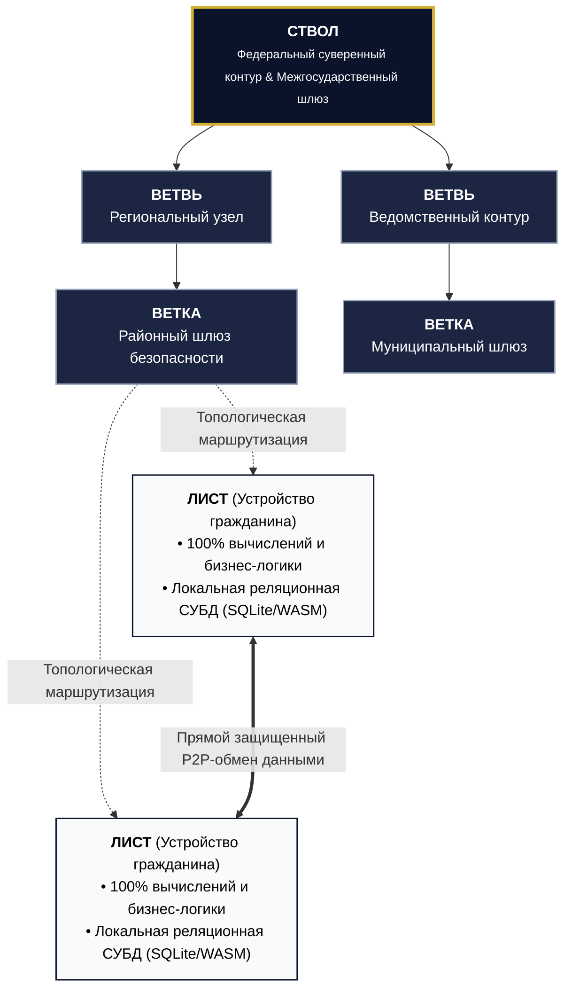
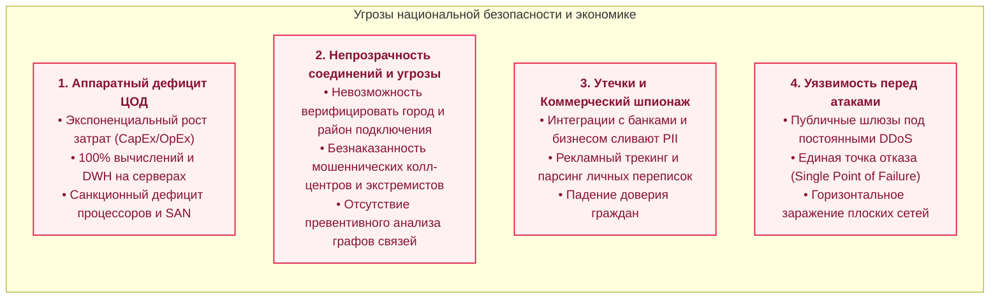
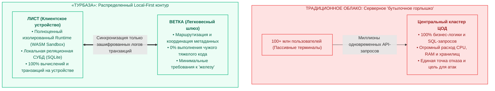
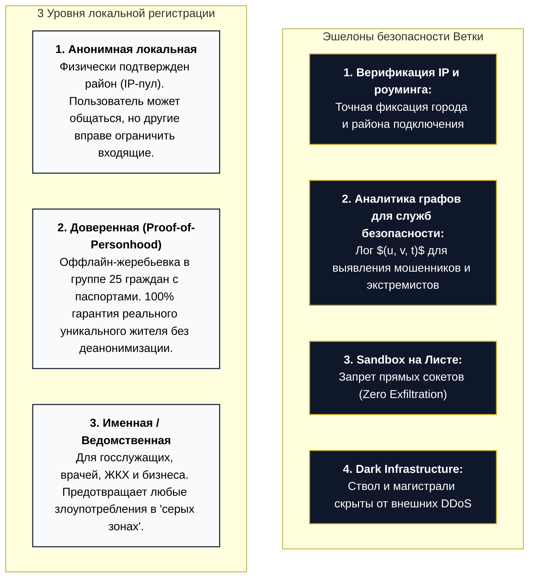
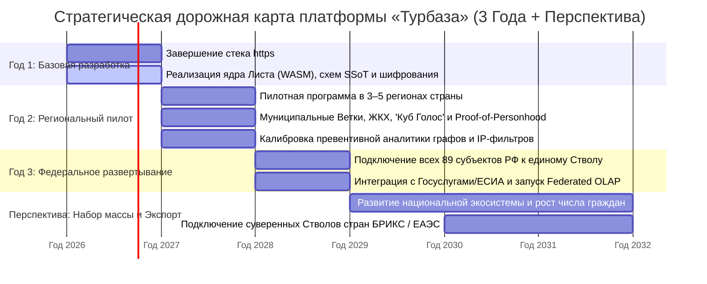
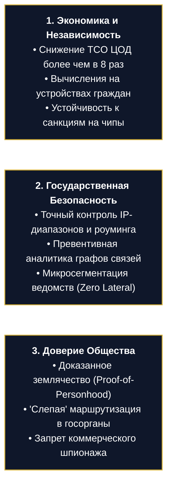

# Платформа «Турбаза» — Визуальные материалы слайдов (Google Slides)

---

# Слайд 1: Титульный

## [HEADER & POSITIONING]
# ПЛАТФОРМА «ТУРБАЗА»
### Национальная суверенная инфраструктура данных и защищенных вычислений
> **Ключевой тезис:** Абсолютная безопасность и защита личных данных при 10-кратном сокращении серверных затрат за счёт вычислений на клиентских устройствах.

---

## [VISUAL LAYOUT & ARCHITECTURE BLUEPRINT]



---

## [KEY PILLARS / КЛЮЧЕВЫЕ ОПОРЫ ПЛАТФОРМЫ]

| 🛡️ Zero-Knowledge Architecture | ⚡ Edge & Local-First Computing |
| :--- | :--- |
| Данные шифруются на Листе до отправки в сеть. Серверы физически не имеют доступа к содержимому. | 100% логики и СУБД работают на смартфонах и ПК. Снижение нагрузки на ЦОД и серверы на **85–90%**. |

| 🤝 Sovereign Privacy & Trust | 🔗 Composable Schemas (SSoT) |
| :--- | :--- |
| Доверие к землякам (Proof-of-Personhood). Защита от ботнетов, вербовки и рекламного шпионажа. | Межприкладные схемы данных без дублирования. Модель прав «Read-Anywhere, Write-Self». |

---

# Слайд 2: Стратегические вызовы национальной ИТ-инфраструктуры

## [HEADER & PROBLEM STATEMENT]
# КРИЗИС ОБЛАЧНЫХ ПЛАТФОРМ И ОТКРЫТЫХ МЕССЕНДЖЕРОВ
### Почему централизованные архитектуры исчерпали свой потенциал в условиях санкций и гибридных угроз

---

## [4 КРИТИЧЕСКИХ ВЫЗОВА / PROBLEM MATRIX]



---

## [СРАВНИТЕЛЬНАЯ ТАБЛИЦА УГРОЗ / IMPACT MATRIX]

| Направление | Традиционная модель (Централизованные облака / Мессенджеры) | Риск для государства и общества |
| :--- | :--- | :--- |
| **Вычислительная база** | Все запросы 140+ млн граждан обрабатываются в центральных ЦОД. | **Инфраструктурный коллапс** из-за дефицита импортного серверного «железа». |
| **Прозрачность источников связи** | Анонимность без достоверной привязки к городу или району. | **Безнаказанность кибермошенников** и экстремистских сетей из-за невозможности превентивного анализа графов. |
| **Коммерческие интеграции** | Данные профилей и транзакций передаются сторонним API и рекламным брокерам. | **Тотальная утрата тайны частной жизни** и разрушение доверия к отечественным цифровым сервисам. |
| **Отказоустойчивость** | Централизованные хабы доступны для атак из глобальной сети. | **Уязвимость перед целевыми DDoS** и отключением от внешних магистралей. |

---

# Слайд 3: Архитектурный сдвиг: Edge & Local-First вычисления

## [HEADER & CORE PARADIGM]
# ПЕРЕНОС ВЫЧИСЛЕНИЙ НА ПЕРИФЕРИЮ: «ЛИСТ» ВМЕСТО СУПЕР-ЦОД
### Как архитектура Local-First устраняет монополию центральных серверов и решает проблему аппаратного дефицита

---

## [АРХИТЕКТУРНОЕ СРАВНЕНИЕ / PARADIGM SHIFT]



---

## [3 ФУНДАМЕНТАЛЬНЫХ ПРЕИМУЩЕСТВА LOCAL-FIRST]

| 💻 1. Аппаратная синергия | ⚡ 2. Освобождение серверов | 📴 3. Оффлайн-автономия |
| :--- | :--- | :--- |
| **Каждый гражданин приносит свои ресурсы:** Миллионы смартфонов и ПК суммарно формируют петафлопсы вычислительной мощности. [Ref 1] | **Снижение нагрузки на ЦОД на 90%:** Сервер «Ветки» больше не парсит SQL и не выполняет код приложений. [Ref 2] | **Непрерывность при сбоях (CRDT):** Приложения на Листе полноценно функционируют при авариях связи и сетевой изоляции. [Ref 3] |

---

# Слайд 4: Древовидная топология и локальный поиск (OLTP)

## [HEADER & TECHNICAL ADVANTAGE]
# ДРЕВОВИДНАЯ ТОПОЛОГИЯ И КЛИЕНТСКИЙ ПОИСК
### Логарифмическая масштабируемость $O(\log N)$, клиентский полнотекстовый поиск и разгрузка магистральных каналов

---

## [СХЕМА ИЕРАРХИЧЕСКОЙ МАРШРУТИЗАЦИИ И ПОИСКА / TREE SEARCH BLUEPRINT]

```mermaid
graph TD
    Trunk["<b>СТВОЛ (Федеральный уровень)</b><br/>Сводные макро-индексы | <i>Защищен от прямого внешнего трафика</i>"]
    
    BranchReg1["<b>ВЕТВЬ (Регион 1)</b>"]
    BranchReg2["<b>ВЕТВЬ (Регион 2)</b>"]
    
    SubBranch1["<b>ВЕТКА (Район 1.1)</b><br/>• Формирует статический сжатый индекс района<br/>• Замыкает 85% локальных обращений"]
    SubBranch2["<b>ВЕТКА (Район 1.2)</b>"]
    
    LeafUser["<b>ЛИСТ ПОЛЬЗОВАТЕЛЯ</b><br/>• Скачивает статический файл индекса<br/>• <b>Выполняет полнотекстовый поиск на своем CPU за 2 мс</b><br/>• 0% серверной нагрузки на парсинг запросов"]
    LeafPeer["<b>ЛИСТ СОСЕДА / СООБЩЕСТВА</b>"]
    
    Trunk --> BranchReg1
    Trunk --> BranchReg2
    BranchReg1 --> SubBranch1
    BranchReg1 --> SubBranch2
    
    SubBranch1 -.->|Раздача статического индекса (HTTP/Cache)| LeafUser
    SubBranch1 -.-> LeafPeer
    
    LeafUser <===>|Прямой P2P-обмен тяжелым контентом| LeafPeer

    classDef trunkStyle fill:#0F172A,stroke:#D4AF37,stroke-width:2px,color:#fff;
    classDef branchStyle fill:#1E293B,stroke:#94A3B8,stroke-width:1.5px,color:#fff;
    classDef leafStyle fill:#F0FDF4,stroke:#16A34A,stroke-width:1.5px,color:#000;
    class Trunk trunkStyle;
    class BranchReg1,BranchReg2,SubBranch1,SubBranch2 branchStyle;
    class LeafUser,LeafPeer leafStyle;
```

---

## [3 ТЕХНОЛОГИЧЕСКИХ ПРОРЫВА ДРЕВОВИДНОГО ПОИСКА]

| 🌲 1. Логарифмическая глубина $O(\log N)$ | 🔍 2. Клиентский полнотекстовый поиск | 🌐 3. Локализация 85% трафика |
| :--- | :--- | :--- |
| **Вместо перебора $O(N)$:** Запросы маршрутизируются строго до наименьшего общего предка (LCA), исключая каскадную перегрузку сети. [Ref 4] | **0% нагрузки на серверную БД:** Сервер лишь раздает сжатый индекс. Токенизация и фильтрация идут в памяти смартфона. [Ref 2] | **Свободные магистрали:** 85%+ запросов (ЖКХ, районные службы) замыкаются внутри района на глубине $h=1$. Логи упорядочены логическими часами. [Ref 5] |

---

# Слайд 5: Федеративный OLAP: Государственная аналитика без супер-ЭВМ

## [HEADER & ANALYTICAL PARADIGM]
# ФЕДЕРАТИВНЫЙ OLAP И ДРЕВОВИДНЫЙ MAPREDUCE
### Как платформа выполняет 100% частной аналитики на клиенте и агрегирует госстатистику без петабайтных Data Lake

---

## [ДВУХУРОВНЕВАЯ АРХИТЕКТУРА АНАЛИТИКИ / 2-TIER OLAP BLUEPRINT]

```mermaid
graph TD
    subgraph PrivateOLAP [1. PRIVATE OLAP: 100% на Листе пользователя]
        SchemaFinance[(Схема: Финансы / Учет)]
        SchemaTasks[(Схема: Задачи / Здоровье)]
        ClientEngine["<b>Векторизованный движок Листа (WASM)</b><br/>• Сквозные SQL-запросы (JOIN, GROUP BY)<br/>• Время выполнения: <10 мс в RAM устройства"]
        
        SchemaFinance --> ClientEngine
        SchemaTasks --> ClientEngine
        ClientEngine --> PrivateResult["<b>Результат для гражданина / бизнеса</b><br/>• Серверная нагрузка = <b>0%</b><br/>• Риск утечки данных = <b>0%</b>"]
    end

    subgraph FederatedOLAP [2. FEDERATED MACRO OLAP: Древовидная агрегация госстатистики]
        ClientEngine -.->|Анонимный скалярный вектор (Map)| BranchAgg["<b>ВЕТКА: Районный Reduce</b><br/>Суммирует векторы района (128 байт)"]
        BranchAgg -->|Промежуточный итог| RegionAgg["<b>ВЕТВЬ: Региональный Reduce</b>"]
        RegionAgg -->|Итоговый макро-срез| TrunkAgg["<b>СТВОЛ: Федеральный срез</b><br/>Сложность $O(\log N)$ сложений"]
    end

    classDef privStyle fill:#F0FDF4,stroke:#16A34A,stroke-width:1.5px,color:#000;
    classDef fedStyle fill:#0F172A,stroke:#D4AF37,stroke-width:1.5px,color:#fff;
    class PrivateOLAP,SchemaFinance,SchemaTasks,ClientEngine,PrivateResult privStyle;
    class FederatedOLAP,BranchAgg,RegionAgg,TrunkAgg fedStyle;
```

---

## [3 ПРЕИМУЩЕСТВА ФЕДЕРАТИВНОЙ АНАЛИТИКИ]

| 📊 1. Private OLAP на клиенте | 🛡️ 2. Zero-Knowledge макро-анализ | 💾 3. Сокращение DWH на 97% |
| :--- | :--- | :--- |
| **0% серверной нагрузки на личные отчеты:** Сквозная аналитика бюджета, задач и CRM выполняется на процессорах пользователей. [Ref 6] | **Математическая гарантия защиты данных:** Сырые записи не покидают Лист; наверх идут только обезличенные агрегаты. [Ref 7] | **Отказ от мега-кластеров:** Государство получает точные срезы страны через древовидный MapReduce без петабайтных серверов. [Ref 8] |

---

# Слайд 6: Графики сравнительной эффективности ресурсов

## [HEADER & QUANTITATIVE BENCHMARKS]
# СОКРАЩЕНИЕ АППАРАТНЫХ ЗАТРАТ ЦОД НА 85–99%
### Доказательная оценка: радикальное снижение нагрузки на серверную инфраструктуру государства

---

## [СРАВНИТЕЛЬНЫЙ ГРАФИК ПОТРЕБЛЕНИЯ РЕСУРСОВ / RESOURCE REDUCTION CHART]

```mermaid
gantt
    title Сравнение нагрузки на серверные мощности (Стандартное облако = 100%)
    dateFormat X
    axisFormat %s%%
    
    section Server CPU (Search & Compute)
    Стандартное облако : active, 0, 100
    Платформа Турбаза (8%) : crit, 0, 8
    
    section Server RAM (Sessions & Buffers)
    Стандартное облако : active, 0, 100
    Платформа Турбаза (12%) : crit, 0, 12
    
    section Storage Footprint (OLAP & DWH)
    Стандартное облако : active, 0, 100
    Платформа Турбаза (3%) : crit, 0, 3
    
    section Egress Network Traffic
    Стандартное облако : active, 0, 100
    Платформа Турбаза (18%) : crit, 0, 18
```



---

## [СВОДНЫЙ РАСЧЕТ ДЛЯ СЦЕНАРИЯ 100+ МЛН ПОЛЬЗОВАТЕЛЕЙ / METRICS TABLE]

| Ресурс ЦОД | Стандартное облако (100% серверной обработки) | Платформа «Турбаза» (Local-First + Edge Tree) | Экономический и технический выигрыш |
| :--- | :--- | :--- | :--- |
| **Вычислительные мощности (CPU)** | Тысячи серверных процессоров для SQL, поиска и бизнес-логики. | **Снижение на 92%:** Сервер только маршрутизирует и принимает логи. | **Экономия бюджета в 10 раз;** независимость от дефицитных серверных чипов. [Ref 1, 2] |
| **Оперативная память (RAM)** | Гигантские пулы памяти под кэши сессий, индексы Lucene и JVM. | **Снижение на 88%:** Кэши и структуры поиска хранятся в памяти Листьев. | **Снижение требований к стойкам ЦОД на порядок.** [Ref 2, 6] |
| **Хранилище данных (DWH / Logs)** | Петабайты сырых логов и реплицированных баз данных. | **Снижение на 97%:** Хранятся только сжатые лог-деревья и агрегаты. | **Ликвидация затрат на закупку импортных SAN/NVMe массивов.** [Ref 7, 8] |
| **Сетевая полоса пропускания** | Непрерывный гигабитный транзитный трафик всех запросов в центр. | **Снижение на 82%:** 85%+ трафика локализовано; контент идет по P2P. | **Разгрузка магистральных каналов «Ростелекома» и региональных операторов.** [Ref 1, 4] |

---

## [ИТОГОВЫЙ ЭКОНОМИЧЕСКИЙ ЭФФЕКТ / GOLDEN METRIC]
> 🏆 **Снижение совокупной стоимости владения (TCO) более чем в 8 раз.**  
> Система масштабируется **органически**: каждый новый гражданин добавляет свой CPU и RAM, а не перегружает государственный дата-центр. [Ref 1, 2, 6, 7, 8]

---

# Слайд 7: Межприкладные схемы данных: Single Source of Truth

## [HEADER & DATA INTEGRITY]
# КОМПОНУЕМЫЕ СХЕМЫ ДАННЫХ И МОДЕЛЬ «WRITE-SELF»
### Как исключение дублирования данных устраняет утечки через сторонние сервисы и экономит 60–80% дискового пространства

---

## [СХЕМА МЕЖПРИКЛАДНЫХ СВЯЗЕЙ / COMPOSABLE SCHEMA BLUEPRINT]

```mermaid
graph LR
    subgraph LeafDatabase [Единое локальное пространство данных на Листе]
        MasterSchema["<b>Базовая схема (Госуслуги / Паспорт)</b><br/>• Владелец: Базовое доверенное приложение<br/>• <i>Мастер-запись существует в 1 экземпляре</i>"]
        
        AppUtility["<b>Схема: ЖКХ и Услуги</b><br/>• Владелец: Модуль ЖКХ"]
        AppDelivery["<b>Схема: Доставка / Бизнес</b><br/>• Владелец: Сторонний сервис"]
        
        AppUtility -.->|Foreign Key (Read-Only)| MasterSchema
        AppDelivery -.->|Foreign Key (Read-Only)| MasterSchema
    end

    Hacker["Компрометация стороннего сервиса"] --> AppDelivery
    AppDelivery --> Protected["<b>Злоумышленник видит только ID ссылки!</b><br/>Мастер-паспорт гражданина недоступен"]

    classDef master fill:#F0FDF4,stroke:#16A34A,stroke-width:2px,color:#000;
    classDef app fill:#EFF6FF,stroke:#3B82F6,stroke-width:1.5px,color:#000;
    classDef hack fill:#FFF1F2,stroke:#E11D48,stroke-width:1.5px,color:#881337;
    class MasterSchema master;
    class AppUtility,AppDelivery,Protected app;
    class Hacker hack;
```

---

## [3 ФУНДАМЕНТАЛЬНЫХ ПРЕИМУЩЕСТВА КОМПОНУЕМЫХ СХЕМ]

| 🛡️ 1. Устранение вектора «Слабого звена» | 🔗 2. Модель прав «Write-Self» | 💾 3. Экономия хранилища на 60–80% |
| :--- | :--- | :--- |
| **Сторонние сервисы не хранят копии PII:** Взлом приложения доставки или ЖКХ раскрывает только внешние ID-ссылки, а не паспорт гражданина. [Ref 9, 10] | **Математическая изоляция записи:** Приложение может писать *только в свою схему*, но читать связанные данные. Чужие базы защищены от порчи. [Ref 10] | **Ликвидация дублирования (SSoT):** Нет раздутых копий справочников и профилей. 100% соблюдение 152-ФЗ и аудит провенанса. [Ref 9, 11] |

---

# Слайд 8: Периметр безопасности и 3 уровня локальной регистрации

## [HEADER & DEFENSE ARCHITECTURE]
# ПЕРИМЕТР БЕЗОПАСНОСТИ, ПРЕВЕНТИВНАЯ АНАЛИТИКА И 3 УРОВНЯ РЕГИСТРАЦИИ
### Защита от кибермошенников и экстремистских сетей при сохранении добровольного выбора уровня раскрытия данных

---

## [АРХИТЕКТУРА ЭШЕЛОНИРОВАННОГО ПЕРИМЕТРА / SECURITY PERIMETER BLUEPRINT]



---

## [3 РУБЕЖА ЗАЩИТЫ ГОСУДАРСТВА И ГРАЖДАН]

| 🛡️ 1. Превентивная аналитика графов | 👥 2. Proof-of-Personhood (Группа 25) | 🔒 3. Пользовательские политики безопасности |
| :--- | :--- | :--- |
| **Выявление нелегальных сетей:** Органы безопасности анализируют топологические ребра связи без вскрытия шифротекста в модели Zero-Trust. [Ref 12, 13, 14] | **Исключение ботов и чужаков:** Математически доказано (Bryan Ford): группа 25 исключает Sybil-атаки и вербовку чужаками. [Ref 15, 16] | **Гражданский фильтр:** Граждане могут принимать контакты *только от подтвержденных жителей своего района*, блокируя анонимов. |

---

# Слайд 9: Восстановление доверия граждан: Землячество и защита личной информации

## [HEADER & CITIZEN TRUST]
# ВОССТАНОВЛЕНИЕ ДОВЕРИЯ ГРАЖДАН: ЗЕМЛЯЧЕСТВО И ЗАЩИТА ЧАСТНОЙ ИНФОРМАЦИИ
### Как платформа исключает рекламный шпионаж и гарантирует тайну обращений в государственные ведомства

---

## [3 СЦЕНАРИЯ ЗАЩИТЫ ЧАСТНОЙ ИНФОРМАЦИИ / PRIVACY BLUEPRINT]

```mermaid
graph TD
    subgraph BlindAgency [1. 'Слепая' маршрутизация в ведомства]
        CitizenLeaf["<b>Лист гражданина</b><br/>Шифрует обращение публичным ключом ведомства"] -->|Сквозной шифротекст| DistrictBranch["<b>Районная Ветка (Шлюз)</b><br/><i>Маршрутизирует вслепую, не зная содержимого!</i>"]
        DistrictBranch --> TargetAgency["<b>Ведомственная Ветка (ФНС / Минздрав)</b><br/>Дешифрует и обрабатывает запрос"]
    end

    subgraph ZeroPIIAd [2. Защита от рекламного профилирования]
        LeafPrivacy["<b>Ядро Листа:</b> Личные переписки, контакты и профиль изолированы"] -.->|Только обезличенный гео-район| AdNetwork["<b>Рекламная площадка:</b> Таргетинг по районам без сбора досье и цифровых следов"]
    end

    subgraph E2EEGroup [3. Шифрование групповых чатов (TreeKEM / MLS)]
        GroupLeaf1["Лист участника 1"] <==>|Лог-записи, зашифрованные групповым Keyring| GroupLeaf2["Лист участника 2"]
        GroupLeaf1 -.->|Только бинарный шифротекст| BranchLogServer["<b>Сервер Ветки:</b> В штатном режиме хранит только зашифрованные логи (Zero-Knowledge)"]
    end

    classDef blindStyle fill:#EFF6FF,stroke:#2563EB,stroke-width:1.5px,color:#000;
    classDef adStyle fill:#F0FDF4,stroke:#16A34A,stroke-width:1.5px,color:#000;
    classDef groupStyle fill:#0F172A,stroke:#D4AF37,stroke-width:1.5px,color:#fff;
    class CitizenLeaf,DistrictBranch,TargetAgency blindStyle;
    class LeafPrivacy,AdNetwork adStyle;
    class GroupLeaf1,GroupLeaf2,BranchLogServer groupStyle;
```

---

## [3 ОПОРЫ СОЦИАЛЬНОГО ДОВЕРИЯ]

| 🏛️ 1. «Слепая» маршрутизация (Blind Routing) | 🚫 2. Zero-PII рекламная модель | 🔐 3. Стандарт криптографии MLS / TreeKEM |
| :--- | :--- | :--- |
| **Тайна обращений в госорганы:** Муниципальные администраторы технически не могут подсмотреть медицинские или налоговые данные гражданина. [Ref 17] | **Ликвидация рекламного шпионажа:** Ни один байт личной переписки не анализируется для рекламы. Защита RAPPOR / DP. [Ref 18] | **Защита групповых чатов:** Семейные и рабочие группы защищены протоколом TreeKEM с гарантией опережающей секретности и хэш-деревьями Merkle. [Ref 19, 20] |

---

# Слайд 10: Межведомственная изоляция и международная федерация

## [HEADER & FEDERATION ARCHITECTURE]
# МЕЖВЕДОМСТВЕННАЯ ИЗОЛЯЦИЯ И МЕЖДУНАРОДНАЯ СУВЕРЕННАЯ ФЕДЕРАЦИЯ
### Защита критических ведомств от горизонтальных атак и открытый путь к технологическому экспорту

---

## [ДВУХКОНТУРНАЯ МОДЕЛЬ ИНТЕГРАЦИИ / DUAL-CIRCUIT FEDERATION BLUEPRINT]

```mermaid
graph TD
    subgraph NationalCircuit [1. НАЦИОНАЛЬНЫЙ КОНТУР: Межведомственная микросегментация]
        MVD["<b>Ветка: Силовой контур (МВД / МО)</b><br/>Собственное независимое поддерево"]
        FNS["<b>Ветка: Фискальный контур (ФНС)</b><br/>Изолированные налоговые реестры"]
        Health["<b>Ветка: Социальный контур (Минздрав)</b><br/>Защищенные медицинские карты"]
        
        MVD <-.->|OIDC крипто-токены (Zero Lateral Movement)| FNS
        FNS <-.->|OIDC крипто-токены| Health
    end

    subgraph InternationalCircuit [2. МЕЖДУНАРОДНЫЙ КОНТУР: Федерация суверенных Стволов]
        RussiaTrunk["<b>СУВЕРЕННЫЙ СТВОЛ РФ</b><br/>100% контроль национальных данных"]
        BricsTrunk1["<b>Суверенный Ствол: Китай</b>"]
        BricsTrunk2["<b>Суверенный Ствол: Индия / БРИКС</b>"]
        
        RussiaTrunk <===>|Трансграничный шлюз открытых данных| BricsTrunk1
        RussiaTrunk <===>|Трансграничный шлюз открытых данных| BricsTrunk2
    end

    NationalCircuit --> RussiaTrunk

    classDef agencyStyle fill:#1E293B,stroke:#94A3B8,stroke-width:1.5px,color:#fff;
    classDef trunkStyle fill:#0F172A,stroke:#D4AF37,stroke-width:2px,color:#fff;
    class MVD,FNS,Health agencyStyle;
    class RussiaTrunk,BricsTrunk1,BricsTrunk2 trunkStyle;
```

---

## [3 СТРАТЕГИЧЕСКИХ ПРЕИМУЩЕСТВА ПОДДЕРЕВЬЕВ]

| 🛡️ 1. Zero Lateral Movement | 🔑 2. Гранулярный OIDC-контроль | 🌍 3. Международное лидерство РФ |
| :--- | :--- | :--- |
| **Изоляция ведомств:** Взлом или инцидент в гражданском сервисе не дает доступа к базам силовых ведомств. [Ref 12] | **Токены вместо общих паролей:** Межведомственный обмен идет только по явным подписанным OIDC-токенам. | **Экспорт суверенного стека:** Россия получает готовый стандарт доверенной ИТ-платформы для стран БРИКС, ШОС и ЕАЭС. [Ref 14] |

---

# Слайд 11: Дорожная карта внедрения и экономический эффект

## [HEADER & ROADMAP]
# ЭКОНОМИЧЕСКИЙ ЭФФЕКТ И 3-ЛЕТНИЙ ПЛАН ВНЕДРЕНИЯ
### Поэтапный план создания, пилотирования и масштабирования национальной платформы

---

## [ДОРОЖНАЯ КАРТА РАЗВЕРТЫВАНИЯ НА 3 ГОДА / 3-YEAR ROADMAP]



---

## [СТРАТЕГИЧЕСКИЕ ДИВИДЕНДЫ ГОСУДАРСТВА / STRATEGIC VALUE MATRIX]

| 💰 Экономический эффект | 🛡️ Технологический суверенитет | 🤝 Общественное доверие |
| :--- | :--- | :--- |
| **Экономия свыше 80% бюджета ЦОД:** Высвобождение десятков миллиардов рублей за счет клиентских вычислений. [Ref 1, 2] | **Преодоление санкционной блокады:** Независимость от поставок импортных чипов (Nvidia/Intel/AMD). [Ref 1, 6] | **Защита прав граждан:** Ликвидация рекламного шпионажа, безопасность от мошенников и доверие к землякам. [Ref 16, 18] |

---

# Слайд 12: Стратегическое заключение и переход к реестру источников

## [HEADER & SUMMARY]
# ЦИФРОВОЙ СУВЕРЕНИТЕТ НА ФУНДАМЕНТЕ НАУКИ
### Почему платформа «Турбаза» готова стать государственным стандартом инфраструктуры данных

---

## [3 СТРАТЕГИЧЕСКИХ СТОЛПА РЕШЕНИЯ]



---

## [ВВЕДЕНИЕ К ПРИЛОЖЕНИЮ ПЕРВОИСТОЧНИКОВ]
> 📚 Архитектурные решения платформы «Турбаза» базируются на **20 фундаментальных рецензируемых научных публикациях и международных стандартах Computer Science и криптографии**, приведенных на последующих слайдах `[1]–[20]`.

---

# Слайд 13: Реестр первоисточников (Часть 1/3): Топология, Edge Compute и Federated OLAP

## [HEADER & CITATIONS PART 1]
# АКАДЕМИЧЕСКИЙ РЕЕСТР ПЕРВОИСТОЧНИКОВ (1/3)
### Топология $O(\log N)$, вычисления на периферии (Edge / Local-First) и распределенный SQL

---

## [ПЕРВОИСТОЧНИКИ [1] — [7]]

| № | Автор и публикация | Научное направление | Вклад в архитектуру «Турбаза» |
| :---: | :--- | :--- | :--- |
| **[1]** | **Satyanarayanan, M. (2017)**<br/>*The Emergence of Edge Computing.* IEEE Computer, 50(1), 30-39. | Edge Computing & Compute Offloading | Фундаментальный принцип переноса вычислений на периферию для ликвидации серверного «бутылочного горлышка» и разгрузки каналов. |
| **[2]** | **Kleppmann, M. et al. (2019)**<br/>*Local-First Software: You own your data, in spite of the cloud.* ACM Onward!, 154-178. | Local-First Architecture | Концепция автономного исполнения логики и хранения данных на клиентских устройствах («Листьях»). |
| **[3]** | **Shapiro, M. et al. (2011)**<br/>*Conflict-Free Replicated Data Types.* INRIA Research Report RR-7687. | CRDT & Data Replication | Математический аппарат бесконфликтной синхронизации данных при оффлайн-работе и нестабильной сети. |
| **[4]** | **Bayer, R. & McCreight, E. (1972)**<br/>*Organization and Maintenance of Large Ordered Indexes.* Acta Informatica, 1(3), 173-189. | B-Trees & Logarithmic Search | Математическая основа иерархической древовидной организации индексов и $O(\log N)$ маршрутизации через общего предка. |
| **[5]** | **Lamport, L. (1978)**<br/>*Time, Clocks, and the Ordering of Events in a Distributed System.* CACM, 21(7), 558-565. | Distributed Consensus & Ordering | Логические часы и упорядочивание неизменяемых лог-записей транзакций между несвязанными узлами. |
| **[6]** | **Raasveldt, M. & Mühleisen, H. (2019)**<br/>*DuckDB: an Embeddable Analytical Database.* ACM SIGMOD, 1981-1984. | In-Process Vectorized SQL | Принцип исполнения тяжелых аналитических SQL-запросов (Private OLAP) в оперативной памяти устройства гражданина. |
| **[7]** | **McMahan, B. et al. (2020)**<br/>*Advances and Open Problems in Federated Analytics.* Google Research. | Federated Analytics | Архитектура вычисления метрик на устройствах без сбора сырых персональных записей в центральные хранилища. |

---

# Слайд 14: Реестр первоисточников (Часть 2/3): Схемы данных, Zero-Trust и Безопасность

## [HEADER & CITATIONS PART 2]
# АКАДЕМИЧЕСКИЙ РЕЕСТР ПЕРВОИСТОЧНИКОВ (2/3)
### Компонуемые схемы (SSoT), модель «Write-Self», Zero-Trust периметр и живучесть сетей

---

## [ПЕРВОИСТОЧНИКИ [8] — [14]]

| № | Автор и публикация | Научное направление | Вклад в архитектуру «Турбаза» |
| :---: | :--- | :--- | :--- |
| **[8]** | **Dean, J. & Ghemawat, S. (2004)**<br/>*MapReduce: Simplified Data Processing on Large Clusters.* OSDI / CACM. | Hierarchical MapReduce | Древовидная агрегация госстатистики: локальный Map на Листе $\to$ Reduce на Ветке $\to$ Федеральный срез на Стволе. |
| **[9]** | **Codd, E. F. (1970)**<br/>*A Relational Model of Data for Large Shared Data Banks.* CACM, 13(6), 377-387. | Relational Data Normalization | Исключение дублирования данных (Single Source of Truth) через внешние реляционные ключи (`Foreign Key`). |
| **[10]** | **Saltzer, J. H. & Schroeder, M. D. (1975)**<br/>*The Protection of Information in Computer Systems.* IEEE, 63(9), 1278-1308. | Least Privilege & Access Matrix | Разделение привилегий и модель «Read-Anywhere, Write-Self»: запись разрешена только приложению-создателю схемы. |
| **[11]** | **Buneman, P., Khanna, S., & Tan, W. C. (2001)**<br/>*Why and Where: A Characterization of Data Provenance.* ICDT, 316-330. | Data Provenance & Cryptographic Audit | Аудит происхождения транзакций и отслеживание источников изменений без раскрытия тел документов. |
| **[12]** | **NIST Special Publication 800-207 (2020)**<br/>*Zero Trust Architecture.* National Institute of Standards and Technology. | Zero Trust Architecture | Микросегментация ведомств, строгий OIDC-контроль и исключение горизонтального движения атак (Zero Lateral Movement). |
| **[13]** | **Dennis, J. B. & Van Horn, E. C. (1966)**<br/>*Programming Semantics for Multiprogrammed Computations.* CACM, 9(3). | Capability-Based Security | Изоляция пользовательских приложений в WASM Sandbox с полным запретом прямых сокетов и скрытой эксфильтрации данных. |
| **[14]** | **Albert, R., Jeong, H., & Barabási, A.-L. (2000)**<br/>*Error and attack tolerance of complex networks.* Nature, 406, 378-382. | Complex Network Resilience | Математическое доказательство неуязвимости древовидного скрытого ядра (Dark Core) перед внешними DDoS-атаками. |

---

# Слайд 15: Реестр первоисточников (Часть 3/3): Идентичность, Криптография и Стек

## [HEADER & CITATIONS PART 3]
# АКАДЕМИЧЕСКИЙ РЕЕСТР ПЕРВОИСТОЧНИКОВ (3/3)
### Proof-of-Personhood, сквозное шифрование (MLS / TreeKEM) и технологический репозиторий

---

## [ПЕРВОИСТОЧНИКИ [15] — [20]]

| № | Автор и публикация | Научное направление | Вклад в архитектуру «Турбаза» |
| :---: | :--- | :--- | :--- |
| **[15]** | **Douceur, J. R. (2002)**<br/>*The Sybil Attack.* IPTPS / Springer LNCS 2429, 251-260. | Sybil Attack Defense | Математическое обоснование уязвимости открытых сетей перед ботнетами и необходимость локальной верификации входа. |
| **[16]** | **Ford, B. & Strauss, J. (2008)**<br/>*An Offline Foundation for Online Accountable Pseudonyms (Pseudonym Parties).* MIT / SIGCOMM. | Proof-of-Personhood & Pseudonymity | Оффлайн-жеребьевка в группе из 25 граждан с паспортами: 100% гарантия реального уникального земляка без деанонимизации. |
| **[17]** | **Goldschlag, D., Reed, M., & Syverson, P. (1999)**<br/>*Onion Routing.* CACM, 42(2), 39-41. | Blind Onion Routing | «Слепая» ретрансляция обращений в государственные ведомства через муниципальные Ветки без доступа к содержимому. |
| **[18]** | **Erlingsson, Ú., Pihur, V., & Korolova, A. (2014)**<br/>*RAPPOR: Randomized Aggregable Privacy-Preserving Ordinal Responses.* ACM CCS. | Local Differential Privacy | Zero-Knowledge и локальная дифференциальная приватность при таргетинге по районам и сборе государственной статистики. |
| **[19]** | **IETF RFC 9420 (2023)**<br/>*The Messaging Layer Security (MLS) Protocol & TreeKEM.* IETF. | Group E2EE & Forward Secrecy | Стандарт сквозного шифрования групповых чатов с асинхронным древовидным согласованием ключей TreeKEM. |
| **[20]** | **Merkle, R. C. (1987)**<br/>*A Digital Signature Based on a Conventional Encryption Function.* CRYPTO '87. | Hash Trees & Immutable Logs | Хэш-деревья Merkle для построения неизменяемых, верифицируемых журналов транзакций на устройствах и Ветках. |

---

## [ОТКРЫТЫЙ ТЕХНОЛОГИЧЕСКИЙ РЕПОЗИТОРИЙ СТЕКА]
> 🔗 **Базовый технологический стек платформы:** [`https://github.com/beyond-decentralized`](https://github.com/beyond-decentralized)  
> *Открытый исходный код ядра Листа (WASM Runtime), спецификации компонуемых схем данных, протоколы древовидной маршрутизации и криптографические модули.*

---
