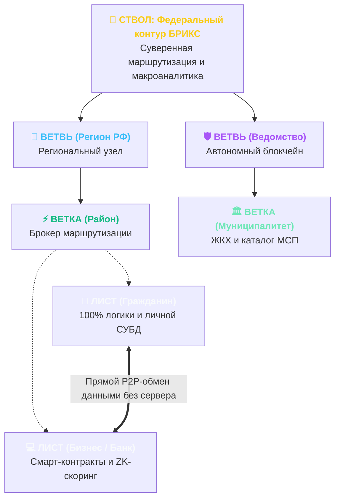

<!-- slide: 1 -->
## Слайд 1: Титульный
- **tag:** "Суверенная архитектура"
- **title:** "ПЛАТФОРМА «ТУРБАЗА»"
- **subtitle:** "Суверенная архитектура данных и справедливая цифровая экономика"
- **badge:** "СУВЕРЕННЫЙ ЦИФРОВОЙ КОНТУР"

### [VISUAL: diagram_tree]

### [CONTENT: key_pillars]
- 🛡️ **Zero-Knowledge Architecture**: Личные файлы отправляются на Ветку зашифрованными. Серверы не имеют ключей дешифрования.
- ⚡ **140 млн узлов суперкомпьютера**: Вычисления перенесены на процессоры смартфонов и ПК граждан. Снижение нагрузки на ЦОД на **85–90%**.
- 🤝 **Землячество и доверие**: Очная верификация соседей (Proof-of-Personhood) исключает спам-ботов и телефонных мошенников.
- 💰 **Экономика без монополий**: 0 руб. затрат на серверы для МСП, отказ от комиссий 30% и справедливая доля от рекламы пользователю.

### Текст для диктора (Narration):
> «Здравствуйте! Мы представляем платформу «Турбаза» — принципиально новую архитектуру национального цифрового пространства. 
> 
> Платформа объединяет государственные интересы, потребности бизнеса и права граждан на владение собственной информацией. 
> 
> В этой презентации мы подробно раскроем, какие измеримые выгоды получает каждый участник экосистемы — от отдельного жителя и малого предприятия до банков, силовых структур и органов государственной власти».

---

<!-- slide: 2 -->
## Слайд 2: Системные кризисы ИТ-модели
- **tag:** "Анализ рисков"
- **title:** "3 СИСТЕМНЫХ КРИЗИСА ИТ-МОДЕЛИ"
- **subtitle:** "Предел масштабирования централизованных облаков и платформенных монополий"
- **badge:** "ИНФРАСТРУКТУРНЫЙ ТУПИК"

### [VISUAL: 3crisis_cards]
- 🚫 **1. Санкционный барьер ЦОД**: Экспоненциальный рост расходов на серверное «железо». Невозможность бесконечно закупать дефицитные зарубежные чипы.
- 🔓 **2. Катастрофические утечки баз**: Централизованные хранилища на 140+ млн граждан создают легкую мишень для взлома и разгула зарубежного мошенничества.
- 💸 **3. Налог монополий 30%**: Цифровые гиганты забирают треть выручки бизнеса и 100% рекламных доходов, разоряя малый бизнес и МСП.

### [CONTENT: crisis_impact]
- **Бюджет**: Вынужденные триллионные траты на расширение дата-центров.
- **Безопасность**: Ежегодный рост мошеннических хищений с банковских счетов граждан.
- **Экономика**: Отток капитала и подавление региональных предпринимателей.

### Текст для диктора (Narration):
> «Традиционная модель централизованных супер-ЦОД и платформенных монополий зашла в тупик. 
> 
> Во-первых, санкционный дефицит серверных процессоров делает бесконечное наращивание дата-центров непосильным бременем для бюджета. 
> 
> Во-вторых, концентрация миллионов персональных данных в корпоративных базах неизбежно приводит к массовым утечкам и разгулу телефонного мошенничества. 
> 
> В-третьих, цифровые гиганты взимают до тридцати пяти процентов комиссий, монополизируя рекламные доходы и подавляя отечественный бизнес».

---

<!-- slide: 3 -->
## Слайд 3: Архитектурный сдвиг: Лист — Ветка — Ствол
- **tag:** "Архитектурный сдвиг"
- **title:** "ДЕЦЕНТРАЛИЗАЦИЯ ВЫЧИСЛЕНИЙ"
- **subtitle:** "Смена парадигмы: вычисления на устройствах граждан и Single Source of Truth"
- **badge:** "EDGE & LOCAL-FIRST"

### [VISUAL: architecture_shift]
- 💻 **Лист (Клиентское устройство)**: 100% бизнес-логики, личная реляционная СУБД SQLite/WASM. Обработка всех данных на процессоре смартфона.
- ⚡ **Ветка (Районный узел)**: Легковесный брокер маршрутизации. Не хранит сырые досье и не исполняет чужой код.
- 🌲 **Ствол (Федеральный контур)**: Сводная макроаналитика за 3 секунды и шлюзы интеграции с БРИКС.

### [CONTENT: shift_benefits]
- 🌐 **P2P-каналы**: Прямой защищенный обмен данными между гражданами и бизнесом.
- 🔗 **Single Source of Truth**: Паспорт и прописка существуют в одном эталонном экземпляре на Листе.
- 🚀 **Петафлопсы мощности**: 140 млн процессоров суммарно работают как распределенный суперкомпьютер.

### Текст для диктора (Narration):
> «Турбаза решает эти вызовы через смену парадигмы. Вся бизнес-логика, хранение и реляционные индексы переносятся на конечные устройства пользователей — так называемые «Листья». 
> 
> Серверы районных «Веток» служат исключительно защищенными брокерами маршрутизации и не имеют доступа к содержимому данных. 
> 
> Приложения обмениваются информацией напрямую по протоколу P2P, используя открытые сквозные схемы данных. Это превращает сто сорок миллионов пользовательских устройств в единый, колоссальный по мощности суперкомпьютер».

---

<!-- slide: 4 -->
## Слайд 4: Выгоды для граждан и семей
- **tag:** "Стейкхолдер: Граждане"
- **title:** "ВЛАДЕНИЕ СВОЕЙ ИНФОРМАЦИЕЙ"
- **subtitle:** "Абсолютная приватность, нулевые утечки и справедливая доля от рекламы"
- **badge:** "ЗАЩИТА ГРАЖДАН"

### [VISUAL: citizen_cards]
- 🔒 **1. Нулевые утечки**: Файлы хранятся на Ветке зашифрованными. Расшифровка только на личном смартфоне гражданина.
- 🤝 **2. Район без спама («Забота»)**: Очная верификация жителей исключает телефонных мошенников и фейковые аккаунты.
- 💰 **3. Доход от рекламы**: До 50% рекламного бюджета перечисляется напрямую гражданину в токенах на оплату связи и услуг.

### [CONTENT: privacy_summary]
- 📦 **Слепая доставка**: Магазин не знает домашний адрес — телефон передает адрес напрямую Почте.
- 📴 **Оффлайн-доступ**: Все документы и выписки доступны даже при аварии сети и в тайге.

### Текст для диктора (Narration):
> «Главный бенефициар платформы — гражданин. Личные файлы и документы отправляются на Ветку для зашифрованного хранения, расшифровываются исключительно на устройствах пользователя и помещаются в локальную базу данных для работы приложений. 
> 
> Трехуровневая верификация и механизм «Землячество» исключают спам-звонки и мошенников: на районных форумах гарантированно общаются только реальные соседи. 
> 
> При покупках адрес не передается магазинам, а доход от персонализированной рекламы справедливо делится между операторами инфраструктуры, разработчиками приложений и пользователем, автоматически покрывая затраты на хранение данных и принося токены на оплату связи и цифровых сервисов».

---

<!-- slide: 5 -->
## Слайд 5: Выгоды для бизнеса и МСП
- **tag:** "Стейкхолдер: Бизнес и МСП"
- **title:** "НУЛЕВЫЕ СЕРВЕРЫ И ПРЯМЫЕ КЛИЕНТЫ"
- **subtitle:** "0 руб. на бэкенд, отказ от комиссий 30% и снятие рисков 152-ФЗ"
- **badge:** "СВЕРХЭКОНОМИЯ ДЛЯ БИЗНЕСА"

### [VISUAL: business_metrics]
- 💰 **0 руб. расходов на серверы**: Вся обработка заказов и каталогов идет на процессорах покупателей.
- ⚡ **Поиск за 2 миллисекунды**: Телефон клиента скачивает сжатый каталог района и ищет в RAM мгновенно.
- 🚫 **0% комиссий маркетплейсов**: Прямые продажи жителям района без платформенного налога 20–35%.
- ⚖️ **0 рисков по 152-ФЗ**: Бизнес физически не хранит чужие персональные данные.

### [CONTENT: business_impact]
- 🏪 **Локальный рынок**: Мгновенный выход малого бизнеса на жителей своего дома и квартала.
- 🧾 **Прозрачная касса**: Автоматическая фискализация без покупки дорогостоящих серверов учета.

### Текст для диктора (Narration):
> «Малый и средний бизнес получает фундаментальное конкурентное преимущество. 
> 
> Затраты на серверную инфраструктуру снижаются до нуля — все вычисления выполняются на процессорах клиентов. 
> 
> Предприниматели освобождаются от кабальных комиссий маркетплейсов в двадцать-тридцать процентов и получают мгновенный доступ к жителям своего района через локальный каталог. 
> 
> А так как бизнес больше не хранит чужие персональные данные, риски штрафов по закону о защите персональных данных полностью исчезают».

---

<!-- slide: 6 -->
## Слайд 6: Выгоды для разработчиков (Экономика API)
- **tag:** "Стейкхолдер: IT-Разработчики"
- **title:** "ЭКОНОМИКА API И СКВОЗНЫЕ СХЕМЫ"
- **subtitle:** "Сквозная компонуемость данных и гарантированные роялти по смарт-контрактам"
- **badge:** "СПРАВЕДЛИВАЯ IT-МОДЕЛЬ"

### [VISUAL: dev_ecosystem]
- 🧩 **Single Source of Truth**: Создание модулей поверх общих схем данных без написания монолитных бэкендов.
- 📜 **Автоматические роялти**: Смарт-контракты фиксируют стек вызовов и делят доход между авторами UI, логики и схем.
- 🛡️ **Защита от поглощения**: Математическая модель теории игр защищает независимых авторов от диктата корпораций.

### [CONTENT: dev_benefits]
- 🚀 **Быстрый time-to-market**: Разработка клиентского модуля за дни вместо месяцев настройки серверных кластеров.
- 💵 **Постоянный пассивный доход**: Роялти от каждого вызова схемы данных в масштабах страны.

### Текст для диктора (Narration):
> «Для АйТи-индустрии «Турбаза» открывает рынок кооперативной разработки. Создавая узкоспециализированный модуль или схему данных, независимый программист подключается к общей экосистеме. 
> 
> Доходы платформы от рекламы и подписок справедливо распределяются с разработчиками. 
> 
> Смарт-контракты фиксируют стек выполнения и делят вознаграждение между создателем экранного интерфейса и авторами всех вызванных модулей и схем логики. 
> 
> При этом математическая модель теории игр защищает разработчиков от ценового диктата и попыток рейдерского захвата их решений крупными игроками».

---

<!-- slide: 7 -->
## Слайд 7: Выгоды для рекламодателей
- **tag:** "Стейкхолдер: Рекламодатели"
- **title:** "ZERO-KNOWLEDGE ADTECH"
- **subtitle:** "0% бот-трафика и On-Device AI-таргетинг без утечки персональных данных"
- **badge:** "ЧЕСТНЫЙ МАРКЕТИНГ"

### [VISUAL: adtech_cards]
- 🛡️ **0% скликивания ботами**: Каждый просмотр криптографически подписывается реальным верифицированным Листом.
- 🤖 **On-Device AI-таргетинг**: Нейросеть на смартфоне подбирает рекламу под контекст пользователя без передачи досье на сервер.
- 🍪 **Решение проблемы Cookies**: Полный отказ от сторонних трекеров при сохранении 100% точности попадания в аудиторию.

### [CONTENT: adtech_kpi]
- 🎯 **Proof-of-Impression**: Математическое доказательство контакта с живым человеком.
- 📈 **Рост ROI**: Оплата исключительно за подтвержденные показы реальным целевым покупателям.

### Текст для диктора (Narration):
> «Рекламный рынок избавляется от главной проблемы современного интернета — скликивания и бот-трафика. 
> 
> Каждый показ криптографически заверяется реальным устройством живого пользователя. 
> 
> Локальный искусственный интеллект на смартфоне сопоставляет предложения рекламодателей со 100% точностью контекста, не раскрывая персональные данные в сеть. 
> 
> Рекламодатель платит только за подтвержденный контакт с целевой аудиторией, получая криптографическое доказательство реального показа живому человеку без накруток ботами».

---

<!-- slide: 8 -->
## Слайд 8: Выгоды для банков и финтеха
- **tag:** "Стейкхолдер: Банки и Финтех"
- **title:** "МГНОВЕННЫЙ СКОРИНГ И ЦИФРОВОЙ РУБЛЬ"
- **subtitle:** "ZK-скоринг за 1 секунду без передачи выписок и нативные смарт-контракты B2B"
- **badge:** "ФИНТЕХ-ИННОВАЦИИ"

### [VISUAL: fintech_grid]
- ⚡ **Zero-Knowledge скоринг за 1 сек**: Смартфон заемщика подтверждает доход криптоподписью ФНС без раскрытия детальных выписок.
- 🪙 **Смарт-контракты Цифрового рубля**: Нативная интеграция безопасных сделок, факторинга и B2B-эскроу.
- 🛡️ **Снижение затрат на антифрод**: Невозможность оформления кредита дропами и мошенниками благодаря очной верификации.

### [CONTENT: banking_advantages]
- 🏦 **Open Banking по умолчанию**: Бесшовная интеграция банковских сервисов в схемы данных платформы.
- 📉 **Снижение невозвратов**: Достоверная верификация заемщика по неизменяемым криптографическим реестрам.

### Текст для диктора (Narration):
> «Банковский сектор резко сокращает операционные расходы и риски мошенничества. 
> 
> Кредитный скоринг с нулевым разглашением позволяет одобрить заявку за одну секунду: устройство заемщика подтверждает уровень дохода криптографической подписью ФНС без передачи выписок по счетам. 
> 
> Платформа нативно поддерживает стандарты открытого банкинга и смарт-контракты Цифрового рубля, автоматизируя факторинг, безопасные B2B-сделки с эскроу и прямые P2P-платежи без посредников».

---

<!-- slide: 9 -->
## Слайд 9: Выгоды для структур безопасности
- **tag:** "Стейкхолдер: Органы безопасности"
- **title:** "ЛИКВИДАЦИЯ КИБЕРУГРОЗ И МОШЕННИЧЕСТВА"
- **subtitle:** "Блокировка иностранных кол-центров, изоляция ведомств и неизменяемый аудит"
- **badge:** "ЩИТ БЕЗОПАСНОСТИ"

### [VISUAL: security_organs]
- 🚫 **Блокировка мошеннических центров**: Зарубежные злоумышленники физически не могут сымитировать локальное присутствие на Ветке.
- 🧱 **Принцип отсеков подлодки**: Базы МВД, ФСБ и ФНС изолированы в суверенных блокчейн-репозиториях.
- 📜 **Неизменяемый журнал аудита**: Хранение логов транзакций формирует юридически значимую доказательную базу.

### [CONTENT: state_security]
- 🛡️ **0% риска массовой утечки**: Отсутствие централизованной базы данных делает хищение всех досье разом невозможным.
- 🔍 **Превентивное выявление угроз**: Анализ графов соединений позволяет пресекать экстремистские сети на этапе вербовки.

### Текст для диктора (Narration):
> «Правоохранительные органы и службы безопасности получают мощный превентивный щит. 
> 
> Зарубежные мошеннические кол-центры физически не способны сымитировать локальное присутствие на районной Ветке. 
> 
> В системе отсутствует централизованная база данных — украсть все данные разом невозможно. 
> 
> Ведомственные контуры МВД, ФСБ и ФНС изолированы в суверенных блокчейн-репозиториях по принципу «герметичных отсеков», а неизменяемый журнал транзакций формирует безупречную доказательную базу».

---

<!-- slide: 10 -->
## Слайд 10: Выгоды для государства и регионов
- **tag:** "Стейкхолдер: Государство"
- **title:** "СНИЖЕНИЕ TCO В 8 РАЗ И FEDERATED OLAP"
- **subtitle:** "Преодоление санкционного дефицита чипов и сбор макростатистики за 3 секунды"
- **badge:** "ГОСУДАРСТВЕННЫЙ СУВЕРЕНИТЕТ"

### [VISUAL: state_tco]
- 📉 **Снижение TCO в 8+ раз**: Сокращение аппаратных затрат на серверы и дата-центры на 87.5%.
- ⏱️ **Макросводка по стране за 3 сек**: Иерархическое сложение 128-байтных отчетов со смартфонов граждан.
- 🇷🇺 **Полная импортонезависимость**: Обход санкций на поставку зарубежных процессоров за счет использования клиентских устройств.

### [CONTENT: regional_benefits]
- 🏛️ **Управление регионами**: Губернаторы получают точную картину цен, запасов медикаментов и занятости в реальном времени.
- 💡 **Бюджетная оптимизация**: Высвобождение триллионов рублей на развитие реального сектора экономики.

### Текст для диктора (Narration):
> «Для государства «Турбаза» — это преодоление санкционного дефицита оборудования и колоссальная бюджетная экономия. 
> 
> Совокупные затраты на закупку серверного оборудования и содержание ЦОД снижаются более чем в восемь раз. 
> 
> Уникальный механизм федеративной аналитики позволяет руководству страны и губернаторам получать точные сводки по ценам, запасам лекарств и занятости за три секунды, суммируя компактные стодвадцативосьмибайтные отчеты напрямую с устройств граждан».

---

<!-- slide: 11 -->
## Слайд 11: Пилотный этап: Флагманская триада
- **tag:** "Фаза 1: Запуск"
- **title:** "ФЛАГМАНСКАЯ ТРИАДА СЕРВИСОВ"
- **subtitle:** "Мгновенный запуск с первого дня без ожидания стороннего прикладного ПО"
- **badge:** "СТАРТОВЫЙ ПАКЕТ"

### [VISUAL: 3flagship_services]
- 🏘️ **1. Соцсеть «Забота»**: Домовые и районные форумы взаимопомощи, обмен вещами и услуги соседей без спама и мошенников.
- 🏪 **2. Каталог услуг МСП и ЖКХ**: Прямой заказ сантехников, электриков и локальных товаров без наценок и комиссий.
- 🗳️ **3. Опросы «КубГолос»**: Оценка работы управляющих компаний и экспресс-опросы без накруток ботами.

### [CONTENT: pilot_results]
- 🚀 **Быстрый старт**: Внедрение в пилотном регионе за 3 месяца.
- 📈 **Органический охват**: Высокая вовлеченность жителей благодаря решению насущных бытовых проблем.

### Текст для диктора (Narration):
> «Развертывание платформы дает измеримый результат с первого же дня благодаря флагманской триаде сервисов. 
> 
> Социальная сеть «Забота» предоставляет жителям доверенные домовые и районные форумы взаимопомощи без спама. 
> 
> Муниципальный каталог позволяет вызвать проверенного мастера или заказать доставку без наценок. 
> 
> А система «КубГолос» обеспечивает прямую обратную связь с жителями района, гарантируя объективность каждого опроса и достоверность мнения граждан без накруток ботами».

---

<!-- slide: 12 -->
## Слайд 12: Этап межведомственной интеграции
- **tag:** "Фаза 2: Интеграция"
- **title:** "ГОСУСЛУГИ И МЕДИЦИНА НА ЛИСТЕ"
- **subtitle:** "Цифровой паспорт ЕСИА, электронная медкарта офлайн и слепой E-Commerce"
- **badge:** "МЕЖВЕДОМСТВЕННЫЙ МОСТ"

### [VISUAL: integration_blocks]
- 🪪 **Цифровой паспорт ЕСИА**: Паспорт хранится на телефоне. Селективное подтверждение возраста без показа номера документа.
- 🏥 **Электронная медкарта офлайн**: Врач скорой помощи видит аллергии и группу крови через P2P даже без интернета.
- 📦 **Слепой E-Commerce**: Полное разделение заказа и доставки, ликвидирующее утечки домашних адресов.

### [CONTENT: integration_kpi]
- 🔒 **100% приватность**: Ведомственные базы не объединяются в опасный монолит, а связываются сквозными схемами.
- ⏱️ **Мгновенный доступ**: Госуслуги работают на устройстве без ожидания ответа центральных серверов.

### Текст для диктора (Narration):
> «На следующем этапе подключаются государственные реестры и отраслевые ведомства. 
> 
> Цифровой паспорт и медицинская карта загружаются в зашифрованную базу на телефоне гражданина. 
> 
> Врач скорой помощи считывает историю болезни через P2P-канал даже при полном отсутствии связи в отдаленном районе. 
> 
> В электронной коммерции реализуется слепое разделение: магазин принимает оплату, а домашний адрес передается напрямую службе доставки, гарантируя стопроцентную защиту тайны частной жизни».

---

<!-- slide: 13 -->
## Слайд 13: Энергоэффективность и живучесть
- **tag:** "Устойчивость инфраструктуры"
- **title:** "GREEN COMPUTING И ТЕРРИТОРИАЛЬНАЯ ЖИВУЧЕСТЬ"
- **subtitle:** "Разгрузка энергосетей, Mesh-сети в условиях ЧС и работа на смартфонах с 2 ГБ ОЗУ"
- **badge:** "ЭНЕРГОЭФФЕКТИВНОСТЬ"

### [VISUAL: green_resilience]
- 🌱 **Green Computing**: Рассеянные микровычисления исключают необходимость строительства мегаваттных дата-центров в городах.
- 📡 **Mesh-сети в условиях ЧС**: Автономная P2P-связь между смартфонами спасателей и жителей при аварии магистралей.
- 📱 **Доступность**: Оптимизированная СУБД стабильно работает даже на бюджетных смартфонах с 2 ГБ RAM.

### [CONTENT: survivability_kpi]
- 🔋 **Энергосбережение**: Экономия гигаватт-часов электроэнергии в национальном масштабе.
- 🏔️ **Крайний Север**: Бесперебойная работа в отдаленных поселках и на месторождениях.

### Текст для диктора (Narration):
> «Платформа демонстрирует исключительную физическую и энергетическую живучесть. 
> 
> Рассеянные микровычисления разгружают энергосети мегаполисов, устраняя необходимость строительства мегаваттных дата-центров. 
> 
> В перспективе в труднодоступных районах Крайнего Севера или в зоне чрезвычайных ситуаций устройства платформы будут формировать автономные локальные Mesh-сети, обеспечивая связь даже при отсутствии интернета. 
> 
> А оптимизированное ядро стабильно работает даже на ультрабюджетных смартфонах с двумя гигабайтами оперативной памяти».

---

<!-- slide: 14 -->
## Слайд 14: Горизонт 2030–2050 (Постквант, ИИ, БРИКС)
- **tag:** "Стратегический горизонт"
- **title:** "КВАНТОВАЯ ЗАЩИТА, ИИ И КЛИРИНГ БРИКС"
- **subtitle:** "Постквантовая криптография ГОСТ на 30+ лет, персональный ИИ и контур БРИКС"
- **badge:** "ТЕХНОЛОГИЧЕСКИЙ ЛИДЕР"

### [VISUAL: future_pillars]
- 🔐 **Постквантовая криптография ГОСТ**: Защита на базе математических решеток от взлома будущими квантовыми ЭВМ на 30+ лет.
- 🤖 **Agentic AI на клиенте**: Персональные ИИ-ассистенты автоматизируют рутину без передачи персональных данных корпорациям.
- 🌐 **Клиринговый контур БРИКС / ЕАЭС**: Сопряжение суверенных Стволов для международных расчетов без SWIFT.

### [CONTENT: future_readiness]
- 🚗 **Умный транспорт V2X**: Координация беспилотных автомобилей через локальные ячейки Листьев.
- 🏛️ **Цифровой суверенитет**: Полная независимость финансовой и информационной системы РФ на десятилетия.

### Текст для диктора (Narration):
> «Архитектура «Турбазы» спроектирована с запасом прочности на десятилетия вперед. 
> 
> В перспективе внедрение постквантовой криптографии на базе математических решеток защитит государственные тайны от будущих квантовых суперкомпьютеров на тридцать лет вперед. 
> 
> Персональные AI-агенты будут безопасно автоматизировать рутину граждан, а микроузлы интернета вещей обеспечат управление умным транспортом. 
> 
> В дальнейшем объединение суверенных Стволов создаст независимый контур внешнеторгового клиринга в пространстве БРИКС без использования SWIFT».

---

<!-- slide: 15 -->
## Слайд 15: Стратегическое заключение
- **tag:** "Итоги и дорожная карта"
- **title:** "«ТУРБАЗА» — СТАНДАРТ ЦИФРОВОГО БУДУЩЕГО"
- **subtitle:** "Готовность к НИОКР, пилотному внедрению и национальному масштабированию"
- **badge:** "ГОТОВНОСТЬ К ВНЕДРЕНИЮ"

### [VISUAL: final_summary]
- 📉 **TCO снижено в 8+ раз**: Освобождение триллионов рублей бюджета.
- 🔒 **0 утечек данных**: Гражданин — единственный владелец своей информации.
- 🚀 **140 млн узлов**: Суперкомпьютер на устройствах жителей страны.
- 🇷🇺 **Суверенный стандарт**: Полная готовность к развертыванию в РФ и БРИКС.

### [CONTENT: next_steps]
- 📋 **Стадия проекта**: Архитектура и математическая модель полностью выверены.
- 🏁 **Следующий шаг**: Опытно-конструкторская разработка (НИОКР) и запуск пилота.

### Текст для диктора (Narration):
> «Платформа «Турбаза» закладывает основу новой цифровой модели: 
> 
> Она не забирает данные у граждан, а закрепляет за ними статус полноправных владельцев собственной информации. 
> 
> Она не требует триллионов на закупку дефицитных серверов, а объединяет вычислительную мощь миллионов устройств. 
> 
> Архитектура проекта математически выверена и готова к стадии опытно-конструкторской разработки, пилотному внедрению в регионе и последующему масштабированию. 
> 
> Благодарим за внимание».
