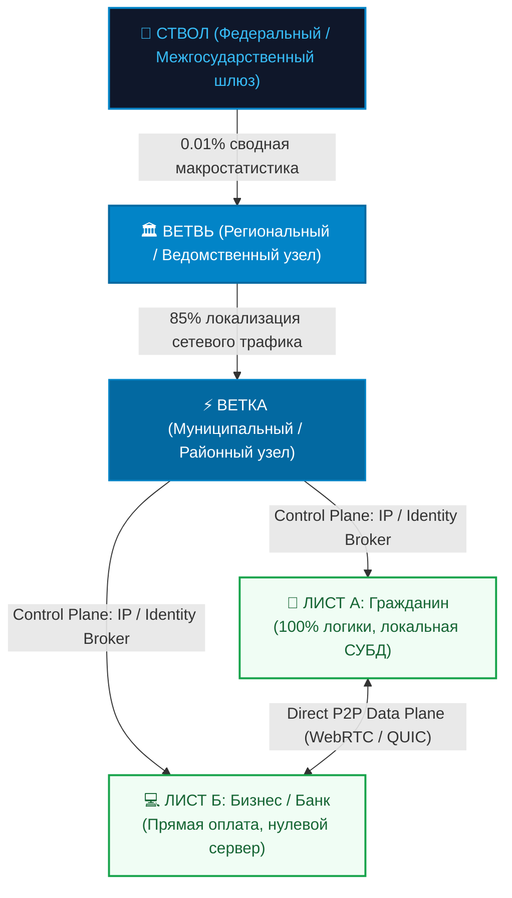
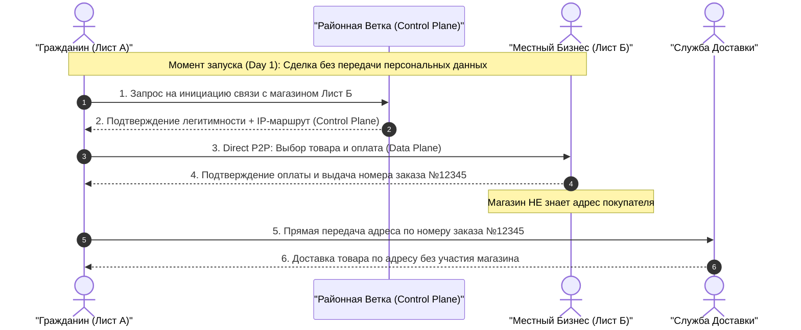
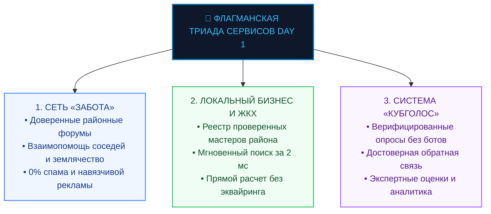
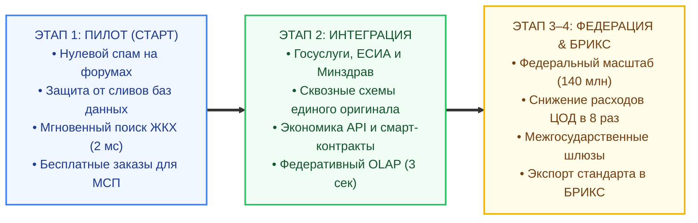
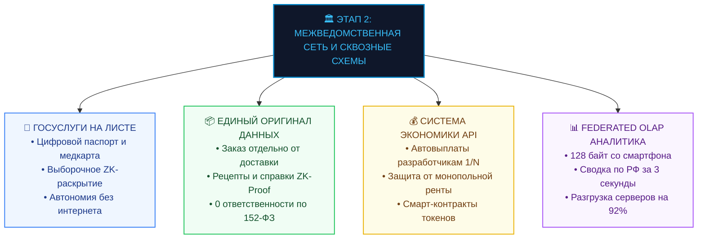
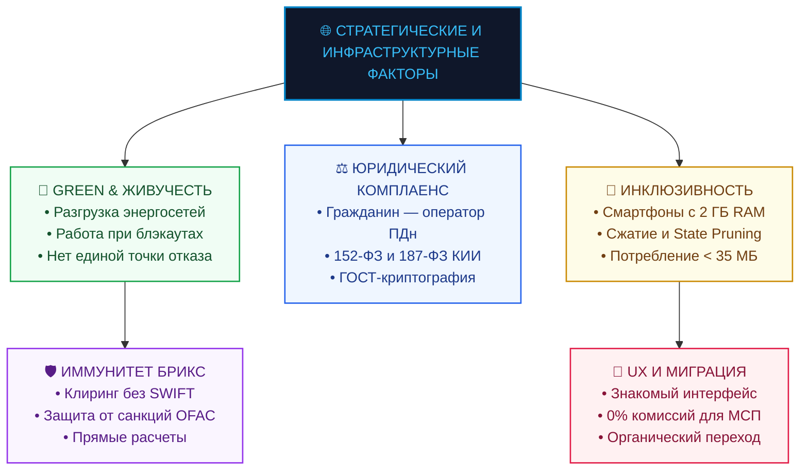
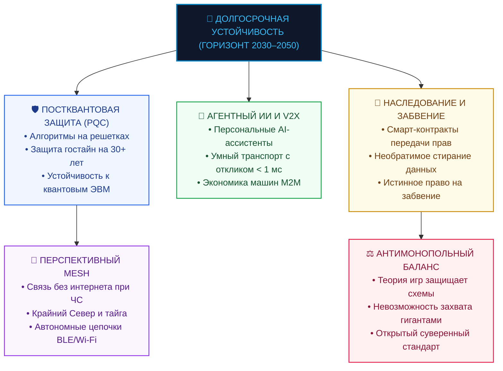

# Аналитический отчет: Комплексный анализ выгод, преимуществ и сценариев запуска платформы «Турбаза» для ключевых участников экосистемы

> **Статус документа:** Официальный аналитический Whitepaper / Stakeholder Value Matrix  
> **Целевая аудитория:** Высшее руководство, отраслевые эксперты, экономисты, архитекторы ИТ-систем и представители регуляторов  
> **Основа анализа:** Техническая документация платформы «Турбаза», материалы презентаций цифрового суверенитета и экономические модели распределенных вычислений  

---

## 1. Введение и Архитектурный базис

Современная цифровая экономика столкнулась с тремя фундаментальными кризисами:
1. **Аппаратный кризис и санкционный барьер:** Дефицит серверных процессоров и санкционные ограничения делают экспоненциальное наращивание централизованных супер-ЦОД экономически неподъемным для государства и бизнеса.
2. **Кризис информационной безопасности:** Монолитная концентрация персональных данных десятков миллионов граждан в корпоративных базах неизбежно приводит к катастрофическим утечкам.
3. **Монополизация и транзакционные издержки:** Платформенные гиганты (Big Tech) взимают 20–40% эквайринговых и сервисных комиссий, блокируют прямой контакт между бизнесом и клиентом и монополизируют рекламные доходы.

Платформа **«Турбаза»** реализует парадигмальный переход: **перенос вычислений, хранения и реляционных индексов на устройства самих граждан («Листья» / Edge Devices)**, объединенные в трехуровневую древовидную топологию (**Лист $\to$ Ветка $\to$ Ветвь $\to$ Ствол**) с использованием открытых компонуемых схем данных (*Single Source of Truth*).

---

## 2. Детальный анализ выгод для 6 групп участников экосистемы

---

### 2.1. Конечный пользователь (Граждане и семьи)

| Параметр | Традиционные технологии (Big Tech / Облака) | Платформа «Турбаза» (Суверенная архитектура) |
| :--- | :--- | :--- |
| **Владение данными** | Данные принадлежат корпорациям; профили продаются рекламодателям | **100% владение собственной информацией:** файлы отправляются на Ветку для зашифрованного хранения, расшифровываются только на устройствах пользователя и помещаются в локальную СУБД для приложений |
| **Безопасность и спам** | Массовые спам-звонки из-за рубежа, фишинг, мошеннические кол-центры | **Землячество и 3 уровня верификации:** мошенники извне не могут проникнуть в район |
| **Защита тайны покупок** | Паспорт, телефон и домашний адрес копируются в базы сотен магазинов | **Слепое разделение:** магазин видит только оплату; адрес передается напрямую Почте |
| **Монетизация рекламы** | 100% рекламных денег забирают монополии (Google, Meta, Яндекс) | **Трехстороннее разделение:** доход делится между провайдерами инфраструктуры, разработчиками приложений и пользователем (автопокрытие хранения данных + токены на сервисы) |
| **Автономность** | При отключении интернета приложения блокируются | **Полная автономность:** локальная СУБД работает без связи; автосинхронизация при сети |

#### Ключевые плюсы:
* **Абсолютная защита личной тайны:** Личные файлы и документы отправляются на Ветку для зашифрованного хранения, расшифровываются исключительно на устройствах пользователя и помещаются в локальную базу данных. Ни у провайдера, ни у администраторов серверов нет ключей расшифровки.
* **Искоренение цифрового мошенничества:** Внутри локального сообщества («Забота») пользователь уверен, что взаимодействует с верифицированным земляком, а не с ботом или дропом.
* **Материальная выгода и самоокупаемость:** Доля рекламного дохода автоматически оплачивает хранение зашифрованных репозиториев на Ветке, а накопленный остаток используется для оплаты связи, цифровых сервисов и премиальных функций приложений.

---

### 2.2. Бизнес (МСП, Ритейл, E-Commerce, Независимые разработчики)

| Параметр | Традиционные технологии (Big Tech / Облака) | Платформа «Турбаза» (Суверенная архитектура) |
| :--- | :--- | :--- |
| **Серверная инфраструктура** | Дорогая аренда виртуальных серверов, СУБД и облачных инстансов | **0 рублей затрат на серверную логику:** вычисления идут на процессорах клиентов |
| **Комиссии посредников** | 15–35% комиссии маркетплейсов и агрегаторов (App Store, Яндекс) | **0% сервисной комиссии:** прямое P2P-взаимодействие покупателя и продавца |
| **Комплаенс 152-ФЗ** | Огромные риски штрафов и проверок за хранение чужих ПДн | **Zero-PII риски:** магазин физически не хранит ПДн клиентов (хранятся у самих клиентов) |
| **Поиск и маркетинг** | Оплата за каждый клик в условиях монопольного рекламного аукциона | **Мгновенный локальный поиск (2 мс):** клиенты района находят бизнес в памяти телефона |
| **Монетизация API** | Сложная интеграция, закрытые API, риск блокировки платформой | **Смарт-контракты API:** автоматические выплаты разработчикам за каждый вызов схемы |

#### Ключевые плюсы:
* **Ультранизкий порог входа:** Малый бизнес может развернуть интернет-магазин, службу доставки или сервис записи без закупки серверов и без штата DevOps-инженеров.
* **Компонуемость сервисов (Best-in-breed):** Разработчик создает одну качественную схему (например, «Бронирование столиков») и автоматически получает микродоход, когда тысячи других приложений используют эту схему.
* **Игровая модель разрешения конфликтов:** Алгоритмическая защита от патентных троллей и монополизации интерфейсов.

---

### 2.3. Рекламные платформы и Рекламодатели

| Параметр | Традиционные технологии (AdTech) | Платформа «Турбаза» (Суверенная архитектура) |
| :--- | :--- | :--- |
| **Фрод и скликивание (Click Fraud)** | До 30–50% рекламного бюджета сжигается ботами и фермами кликов | **0% бот-трафика:** все показы валидируются криптографической подписью Листа |
| **Таргетинг без слежки** | Блокировка 3rd-party cookies и запреты трекинга в iOS/Android | **Zero-Knowledge Edge Targeting:** профиль анализируется локальным AI на телефоне |
| **Точность попадания** | Вероятностная оценка интересов по косвенным сетевым следам | **100% достоверный контекст:** таргетинг по фактическим покупкам и локации района |
| **Отношение пользователей** | Раздражение, повальная установка AdBlock, баннерная слепота | **Высокая лояльность:** пользователь сам заинтересован в релевантной рекламе (получает долю) |

#### Ключевые плюсы:
* **Кристальная прозрачность показов (0% бот-трафика):** Рекламодатель платит только за подтвержденный показ реальному живому человеку в целевом регионе без накруток ботами.
* **Обход запретов на куки (Post-Cookie Era):** Технология «Турбазы» решает мировую проблему отключения cookies без нарушения законодательства о персональных данных.

---

### 2.4. Банки и Финтех-сектор

| Параметр | Традиционный эквайринг и интернет-банкинг | Платформа «Турбаза» (Суверенная архитектура) |
| :--- | :--- | :--- |
| **Антифрод и верификация** | Огромные затраты на поведенческий анализ и возврат украденных средств | **Криптографическая верификация:** исключение социальной инженерии и дропперов |
| **Интеграция с сервисами** | Дорогая разработка сотен кастомных API-интеграций под каждого партнера | **Единые финансовые схемы данных:** бесшовная встраиваемость в любое приложение |
| **Безопасность платежей** | Риск перехвата платежных сессий в браузере (Man-in-the-Middle) | **Изолированный платежный контур:** валидация через ведомственную Ветвь |
| **Скорость транзакций** | 1–3 рабочих дня межбанковского клиринга, задержки сверок | **Мгновенный P2P-расчет:** атомарная фиксация транзакций в локальных блокчейн-логах |

#### Ключевые плюсы:
* **Резкое снижение операционных рисков:** Банк получает доступ к верифицированным клиентам с подтвержденным рейтингом доверия в сети «Забота».
* **Готовность к Цифровому рублю (ЦВЦБ):** Архитектура «Турбазы» идеально накладывается на концепцию смарт-контрактов цифрового рубля для целевых выплат и госзакупок.

---

### 2.5. Структуры безопасности и Регуляторы (ФСБ, МВД, ФСТЭК, Роскомнадзор)

| Параметр | Традиционная инфраструктура | Платформа «Турбаза» (Суверенная архитектура) |
| :--- | :--- | :--- |
| **Трансграничный мошеннический трафик** | Бесконтрольные спам-звонки и фишинг через виртуальные номера | **Физическая изоляция контура:** доступ извне возможен только через суверенный Ствол |
| **Массовые утечки баз данных** | Взлом одного корпоративного сервера компрометирует миллионы граждан | **Принцип «Разделяй и властвуй»:** нет монолитной базы — невозможно украсть все данные разом |
| **DDoS-уязвимость** | Атака на центральные ЦОД парализует государственные услуги по всей стране | **Древовидная устойчивость:** локальные Ветки продолжают работать автономно |
| **Юридическая значимость действий** | Трудность доказательства авторства при взломах учетных записей | **Неизменяемый реестр транзакций:** математическое доказательство авторства записей |

#### Ключевые плюсы:
* **Ликвидация инфраструктуры кол-центров:** Иностранные мошенники не могут создавать фиктивные профили, так как уровень доверия в сети требует очной или локальной верификации на Ветке.
* **Изоляция ведомственных контуров:** Данные силовых ведомств (МВД, ФСБ, ФНС) хранятся в изолированных репозиториях и не пересекаются с общегражданским контуром.

---

### 2.6. Государство, Регионы и Муниципалитеты

| Параметр | Традиционные государственные ГИС и супер-ЦОД | Платформа «Турбаза» (Суверенная архитектура) |
| :--- | :--- | :--- |
| **Бюджетные затраты на ЦОД** | Ежегодные миллиардные расходы на закупку дефицитных серверных чипов | **Снижение TCO более чем в 8 раз:** вычисления распределены на 140 млн смартфонов |
| **Сбор государственной аналитики** | Месяцы на выгрузку и обработку тяжелых отчетов в центральных хранилищах | **Мгновенный Federated OLAP:** сводная макростатистика за 3 секунды через дерево |
| **Обратная связь с населением** | Социологические замеры с погрешностями и накрутками ботами | **«КубГолос»:** верифицированные опросы и замеры общественного мнения реальных жителей районов в реальном времени |
| **Цифровой суверенитет** | Зависимость от импортного софта, СУБД и протоколов | **100% отечественный стек:** готовность к экспорту стандартов в страны БРИКС |

#### Ключевые плюсы:
* **Решение проблемы санкционного дефицита оборудования:** Государство перестает зависеть от параллельного импорта серверных чипов, задействуя уже имеющийся парк пользовательских устройств.
* **Локализация трафика:** 85% сетевых запросов замыкаются внутри районов и городов, освобождая федеральные магистрали.

---

## 3. Комплексный анализ Плюсов (PROs), Минусов и Рисков (CONs), Барьеров Внедрения и Способов Компенсации (Mitigation Matrix)

Для всесторонней экспертной оценки и защиты проекта перед межведомственными комиссиями ниже приведен детализированный анализ потенциальных возражений, технологических компромиссов (trade-offs) и конкретных инженерно-правовых решений по их преодолению.

---

### 3.1. Государство, Регионы и Муниципалитеты

| Параметр анализа | Содержание и характеристика |
| :--- | :--- |
| **PROs (Ключевые плюсы)** | • Снижение бюджетных расходов на ЦОД в 8 раз (-87.5% TCO) • Федеративный сбор макроаналитики (Federated OLAP) за 3 секунды порциями по 128 байт • Достоверные замеры общественного мнения «КубГолос» без накруток ботами • Готовый экспортный стандарт для стран БРИКС и ЕАЭС без SWIFT |
| **CONs & Риски (Минусы и барьеры)** | • **Сопротивление монопольных ИТ-подрядчиков:** Интеграторы теряют миллиардные бюджеты на строительство и обслуживание традиционных дата-центров • **Необходимость актуализации законодательства о ГИС:** Нормативная база исторически ориентирована на монолитные хранилища • **Цифровое неравенство:** Разный уровень качества связи в отдаленных поселках |
| **Способы компенсации (Mitigation)** | • **Поэтапный ввод (Триада Day 1):** Мягкий запуск параллельно существующим ГИС без шокового слома инфраструктуры • **Юридический статус Ветки:** Квалификация узла как инфраструктурного брокера маршрутизации, гармонизированного с Цифровым профилем РФ • **Mesh-топология и оффлайн-СУБД:** Устройства в тайге и поселках накапливают транзакции локально и синхронизируются при первом выходе на связь |

---

### 3.2. Структуры безопасности и Регуляторы (ФСБ, МВД, ФСТЭК, Роскомнадзор)

| Параметр анализа | Содержание и характеристика |
| :--- | :--- |
| **PROs (Ключевые плюсы)** | • Физическая блокировка внешнего периметра: мошеннические кол-центры не могут проникнуть в районную Ветку • 0 сливов персональных данных (отсутствие монолитного хранилища) • Принцип герметичных отсеков (изоляция контуров МВД, ФСБ, ФНС, Минздрава) • Неизменяемый журнал аудита с крипто-подписью • Постквантовая криптография (PQC) на 30+ лет вперед |
| **CONs & Риски (Минусы и барьеры)** | • **Ограничение сплошного негласного перехвата (E2EE):** Невозможность вскрытия открытого текста на магистральных каналах • **Требования сертификации:** Необходимость подтверждения классов защиты распределенных узлов • **Риск вредоносного ПО на устройствах граждан:** Возможность заражения пользовательского смартфона троянами |
| **Способы компенсации (Mitigation)** | • **Анализ графов связей и метаданных:** Anti-Sybil мониторинг на Ветках выявляет аномалии; адресный след транзакций доступен по судебному ордеру • **Нативная ГОСТ-криптография:** Использование сертифицированных алгоритмов («Кузнечик», «Стрибог», ГОСТ Р 34.10) на Ветвях и Листьях • **Аппаратные анклавы (Secure Enclave / TEE):** Ключи шифрования изолированы от ОС смартфона и не могут быть извлечены вредоносным ПО |

---

### 3.3. Конечные пользователи (Граждане и семьи)

| Параметр анализа | Содержание и характеристика |
| :--- | :--- |
| **PROs (Ключевые плюсы)** | • 100% владение собственной информацией: файлы хранятся на Ветке в зашифрованном виде, расшифровываются только на устройствах пользователя и помещаются в локальную СУБД для приложений • 0 спам-звонков и мошенников благодаря доверенному Землячеству • Справедливая доля рекламного дохода: самоокупаемость зашифрованного хранения на Ветке + токены на оплату связи и сервисов • Офлайн-доступ к медицинской карте и документам без интернета • Слепой шопинг: магазин не знает домашний адрес покупателя |
| **CONs & Риски (Минусы и барьеры)** | • **Страх утери устройства / ключа:** Отсутствие классической кнопки «Восстановить пароль по SMS» • **Нагрузка на память и батарею:** Беспокойство о расходе ресурсов смартфона • **Привычка к интерфейсам Big Tech:** Психологический барьер перед новым приложением |
| **Способы компенсации (Mitigation)** | • **Социальное и нотариальное восстановление:** Shamir's Secret Sharing (3 доверенных родственника) + зашифрованный бэкап в МФЦ/ЕСИА • **Легковесное ядро (< 35 МБ RAM), State Pruning и Zstandard:** Хранение только актуального состояния; вычисления преимущественно на ночной зарядке • **Zero-Friction UX:** Привычный интерфейс мессенджера/супер-аппа, где криптография полностью скрыта под капотом |

---

### 3.4. Бизнес и МСП (Предприниматели, Ритейл, E-Commerce)

| Параметр анализа | Содержание и характеристика |
| :--- | :--- |
| **PROs (Ключевые плюсы)** | • 0 рублей постоянных затрат на бэкенд-серверы и базы данных • 0% комиссий маркетплейсов (сохранение 20–35% маржи внутри бизнеса) • Нулевые юридические риски по 152-ФЗ (бизнес не аккумулирует чужие ПДн) • Мгновенный локальный поиск в районе за 2 мс |
| **CONs & Риски (Минусы и барьеры)** | • **Отказ от сбора чужих досье (Big Data tracking):** Бизнес больше не может перепродавать данные клиентов на сторону • **Необходимость перехода на открытые реляционные схемы данных** • **Риск недобросовестного покупателя при прямых P2P-сделках** |
| **Способы компенсации (Mitigation)** | • **Рост конверсии в 3–4 раза через On-Device AI и лояльность:** Честный контекстный маркетинг дает больше продаж, чем навязчивый спам • **Готовые шаблоны и конструкторы Day 1:** Бесплатные модули каталога, доставки и записи запускаются за 1 день • **Смарт-контракты эскроу (Цифровой рубль)** и рейтинг доверия в сети «Забота» исключают неплатежи |

---

### 3.5. Независимые ИТ-Разработчики и Инженеры

| Параметр анализа | Содержание и характеристика |
| :--- | :--- |
| **PROs (Ключевые плюсы)** | • Экономика API и роялти: распределение доходов от рекламы и подписок между авторами интерфейсов и вызванных схем логики (1/N) • Сквозная компонуемость: создание продуктов из готовых модулей без написания инфраструктуры с нуля • Алгоритмическая защита от монополий и рейдерского захвата решений гигантами |
| **CONs & Риски (Минусы и барьеры)** | • **Невозможность привязать клиента к закрытому проприетарному формату (No Vendor Lock-in)** • **Необходимость строгого следования стандартам открытых схем данных** • **Риск несанкционированного клонирования схем конкурентами** |
| **Способы компенсации (Mitigation)** | • **Сетевой рычаг масштаба:** Автор открытой популярной схемы зарабатывает на миллионах сторонних вызовов больше, чем на закрытом софте • **Автоматический линтинг и CI/CD схем на Ветках:** Мгновенная проверка совместимости и автогенерация UI • **Неизменяемый Execution Trace:** Репутация и роялти жестко закреплены за оригинальным автором схемы в блокчейн-реестре |

---

### 3.6. Банки и Финтех-сектор

| Параметр анализа | Содержание и характеристика |
| :--- | :--- |
| **PROs (Ключевые плюсы)** | • ZK-Скоринг за 1 секунду: мгновенное одобрение кредитов по крипто-подписи ФНС без сбора выписок • Ликвидация дропперов и снижение антифрод-расходов на 90% • Нативная интеграция со смарт-контрактами Цифрового рубля (ЦВЦБ) • Бесшовная встраиваемость в любые партнерские сервисы через открытые схемы |
| **CONs & Риски (Минусы и барьеры)** | • **Снижение доходов от традиционного монопольного эквайринга (1.5–3%):** Прямые P2P-платежи уменьшают комиссионную ренту • **Необходимость открытия API в рамках Open Banking** • **Затраты на первичную интеграцию бэкенда с узлами Ветвей** |
| **Способы компенсации (Mitigation)** | • **Новые источники маржи:** Масштабный рост кредитования через ZK-скоринг и доходы от обслуживания смарт-контрактов ЦВЦБ • **Максимально защищенный контур Open Banking:** Исключение атак Man-in-the-Middle и утечек платежных сессий • **Единый стандарт финансовых схем:** Интеграция выполняется один раз для доступа ко всей экосистеме |

---

### 3.7. Рекламодатели и Маркетинг

| Параметр анализа | Содержание и характеристика |
| :--- | :--- |
| **PROs (Ключевые плюсы)** | • 0% бот-скликивания (Click Fraud): каждый показ заверяется криптографической подписью смартфона • 100% готовность к Post-Cookie эре: точный таргетинг через On-Device AI без нарушения тайны частной жизни • Рост реальной конверсии в 3–4 раза благодаря материальной мотивации пользователя (токены внимания) • Прозрачная закрытая ZK-атрибуция покупок |
| **CONs & Риски (Минусы и барьеры)** | • **Невозможность покупки теневых баз данных и нелегальных досье (3rd-party Data Brokers)** • **Перестройка процессов медиапланирования под клиентские аукционы (On-Device Ad Auction)** |
| **Способы компенсации (Mitigation)** | • **Прямой контакт с живой аудиторией района:** Отклик в сети «Забота» многократно превосходит баннерную рекламу • **Стандартизированный протокол публикации кампаний:** Загрузка офферов на региональные Ветки с мгновенным локальным сопоставлением |

---

## 4. Сводная матрица: Сравнение «Турбаза» vs Традиционные монолитные технологии

| Критерий оценки | Традиционный Big Tech & Cloud | Платформа «Турбаза» | Оценка эффекта |
| :--- | :---: | :---: | :---: |
| **Совокупная стоимость владения (TCO)** | 🔴 Критически высокая | 🟢 Снижение на **87.5%** (в 8 раз) | **Колоссальная экономия бюджета** |
| **Зависимость от импортных чипов** | 🔴 100% зависимость | 🟢 **Независимость** (Edge compute) | **Обход санкций** |
| **Защита от утечек персональных данных** | 🔴 Низкая (регулярные утечки) | 🟢 **Абсолютная** (Zero-PII) | **Национальная безопасность** |
| **Устойчивость к DDoS-атакам** | 🟡 Требует дорогих фильтров | 🟢 **Иерархическая изоляция** | **Непрерывность госуправления** |
| **Скорость выполнения локальных запросов** | 🟡 150–400 мс (пинг до Москвы) | 🟢 **1–3 мс** (внутри смартфона) | **Мгновенный отклик сервисов** |
| **Достоверность общественного мнения** | 🔴 Уязвимо для накруток ботами | 🟢 **Anti-Sybil верификация** | **Точность госрешений** |
| **Комиссионная нагрузка на бизнес** | 🔴 15–35% (монопольный налог) | 🟢 **0%** (прямой P2P-обмен) | **Рост малого бизнеса** |

---

## 5. Архитектура и механика работы на момент запуска (Day 1)

### 5.1. Разделение уровней управления (Control Plane vs Data Plane)
На момент запуска система функционирует по строгому принципу разделения обязанностей:
1. **Control Plane (Ветки):**
   * Развертываются на базе муниципальных серверов, МФЦ или региональных узлов связи.
   * Выполняют роль **брокеров идентичности (Identity Broker)**: подтверждают, что Лист А и Лист Б зарегистрированы в районе, и выдают временные маршрутные токены.
   * **Не имеют доступа к содержимому данных** и не хранят пользовательские файлы.
2. **Data Plane (Листья):**
   * Приложения пользователей устанавливают прямое P2P-соединение (WebRTC / QUIC) со сквозным шифрованием.
   * Все вычисления, рендеринг и поиск выполняются локально.

---

### 5.2. Флагманская триада сервисов Day 1

На момент старта платформа не требует долгого ожидания разработки стороннего софта — запуск обеспечивается тремя готовыми базовыми решениями:

1. **Социальная сеть и локальные форумы «Забота»:**
   * Дает гражданам доверенную среду общения и взаимопомощи без спама и навязчивой рекламы.
   * Механизм «Землячество» гарантирует, что участники районных форумов — реальные подтвержденные жители конкретных домов и кварталов.
2. **Локальный реестр МСП и ЖКХ:**
   * Жители мгновенно находят услуги сантехника, пекарни или аптеки в памяти телефона за 2 мс.
   * Прямой расчет без банковских эквайринговых комиссий.
3. **Система экспресс-опросов «КубГолос»:**
   * Муниципалитеты и ведомства получают мгновенную достоверную аналитику общественного мнения по инициативам (благоустройство, транспорт, социальная сфера) без риска фальсификаций и бот-накруток.

---

## 6. Временная шкала получения пользы (Value Realization Timeline)

### 1. Мгновенная польза (Стартовый пилотный этап):
* **Для граждан:** Установка единого легкого приложения, дающего доступ к доверенным районным форумам взаимопомощи, службам района и гарантию отсутствия спамеров.
* **Для бизнеса:** Бесплатное размещение в каталоге района, прямые заказы от соседей без комиссии маркетплейсов, отсутствие затрат на сервера.
* **Для государства:** Разгрузка районных серверов и каналов связи, старт первой верифицированной обратной связи с жителями.

### 2. Среднесрочная польза (Этап межведомственной интеграции):
* Формирование локальной экономической экосистемы: рестораны, сервисы и магазины получают постоянный поток заказов без расходов на рекламу в поисковиках.
* Пользователи накапливают первые токены за просмотр персонализированной рекламы и оплачивают ими цифровые услуги.
* Подключение региональных банков через открытые схемы.

### 3. Стратегическая польза (Этап национального и международного масштабирования):
* **Экономический эффект:** Снижение бюджетных расходов на ЦОД и серверное оборудование в 8 раз.
* **Безопасность:** Полная ликвидация телефонного и интернет-мошенничества внутри контура платформы.
* **Технологическое лидерство:** Создание независимого суверенного стандарта обмена данными, готового к масштабированию в рамках межгосударственных объединений (БРИКС / ЕАЭС).

---

## 7. Анализ следующего этапа развертывания (Этап 2: Межведомственная интеграция, Сквозные схемы данных и Экономика API)

На **Этапе 2** платформа переходит от локального муниципального пилота к глубокой интеграции с государственными ведомствами (ЕСИА, Госуслуги, ФНС, Минздрав, Почта России), финансовым сектором и национальной системой логистики.

---

### 7.1. Конечный пользователь на Этапе 2: Личные госуслуги, цифровая медицина и безопасный шопинг
1. **Интеграция с ЕСИА / Госуслугами:** Цифровые документы гражданина передаются на Ветку для зашифрованного хранения, расшифровываются исключительно на устройстве пользователя и помещаются в **локальную СУБД смартфона** для работы приложений с поддержкой селективного раскрытия (Zero-Knowledge Proofs).
2. **Медицинская карта пациента на устройстве:** История болезни и анализы принадлежат пациенту; врач скорой помощи считывает фрагмент по защищенному P2P даже без интернета.
3. **Безопасный федеральный E-Commerce:** Разделение заказа и доставки — магазин не имеет доступа к домашнему адресу покупателя.
4. **Управление токенами внимания:** Доля рекламного дохода покрывает содержание репозиториев на Ветке, а накопленный баланс расходуется на цифровые сервисы, связь или конвертируется в Цифровой рубль.

---

### 7.2. Бизнес и Независимые разработчики на Этапе 2: Компонуемые приложения и экономика API
1. **Сквозная компонуемость приложений (Cross-App Composability):** Приложения разных авторов работают поверх единых открытых схем (*Single Source of Truth*).
2. **Экономика API и автоматические роялти разработчикам:** Протоколирование стека вызовов (`Execution Trace`) и автовыплаты доли 1/N из совокупных доходов от рекламы и подписок между создателями UI и авторами модулей логики.
3. **Налоговая отчетность в один клик без риска проверок:** Расчет налога происходит на Листе; в ФНС уходит криптографически подписанный итог без передачи коммерческих тайн.

---

### 7.3. Рекламные платформы на Этапе 2: Федеративная сеть и доказательная атрибуция продаж
1. **Федеративное сопоставление рекламы (On-Device Machine Learning):** Локальная нейросеть на Листе сопоставляет контекст с точностью 100% без передачи истории в сеть.
2. **Сквозная криптографическая атрибуция (Closed-Loop Attribution):** Математическое доказательство факта покупки без раскрытия персональных данных.

---

### 7.4. Банки и Финтех на Этапе 2: Скоринг без утечек и смарт-контракты Цифрового рубля
1. **Скоринг с нулевым разглашением (ZK-Credit Scoring):** Мгновенное одобрение кредита по криптографическому подтверждению дохода от ФНС без выписок.
2. **Интеграция с инфраструктурой Цифрового рубля:** Смарт-контракты B2B-расчетов, факторинг и безопасное эскроу.

---

### 7.5. Структуры безопасности на Этапе 2: Межведомственная изоляция и превентивный мониторинг
1. **Физическая и криптографическая изоляция ведомств:** Базы МВД, ФНС, ФСБ, Минздрава хранятся в изолированных репозиториях («принцип подводной лодки»).
2. **Превентивный анализ графов связей (Anti-Sybil Defense):** Выявление бот-сетей и координации атак на ранней стадии.
3. **Неизменяемый след аудита (Audit Trail):** Юридически безупречная доказательная база расследований.

---

### 7.6. Государство и Регионы на Этапе 2: Федеративный OLAP и макростатистика в реальном времени
1. **Сводная макроаналитика за 3 секунды (Federated OLAP):** Компактные отчеты по 128 байт суммируются через дерево узлов в реальном времени.
2. **Экономия государственных ресурсов на 92–97%:** Падение процессорной нагрузки и дисковых массивов аналитики.
3. **«КубГолос» как инструмент стратегического планирования:** Панели верифицированных опросов и экспертных оценок с гарантией объективности.

---

## 8. Сравнительная матрица эволюции платформы: Этап 1 $\to$ Этап 2 $\to$ Этап 3/4

| Область трансформации | Этап 1: Муниципальный пилот (Day 1) | Этап 2: Межведомственная интеграция | Этап 3–4: Федеральный масштаб и БРИКС |
| :--- | :--- | :--- | :--- |
| **Охват пользователей** | Локальный район / пилотный город (10–50 тыс. чел.) | Субъект РФ / ключевые отрасли (1–5 млн чел.) | Вся страна (140 млн) + страны-партнеры БРИКС |
| **Идентификация** | Землячество, номер дома, базовая верификация | Интеграция с ЕСИА, 3 уровня верификации, ZK-Proof | Международная криптографическая федерация стволов |
| **Прикладные сервисы** | Форумы «Забота», локальное ЖКХ, опросы «КубГолос» | Цифровой паспорт, медицина, налоги, E-Commerce | Полноценная замена монополий Big Tech во всех отраслях |
| **Схемы данных** | Базовые муниципальные и каталожные таблицы | Сквозные компонуемые схемы (*Single Source of Truth*) | Межгосударственные стандарты обмена данными БРИКС |
| **Экономика и монетизация** | Прямой P2P-расчет, локальная реклама | Экономика API, смарт-контракты, Цифровой рубль | Суверенная межгосударственная финансовая сеть |
| **Государственная аналитика** | Районные сводки и экспресс-опросы | Отраслевой Federated OLAP (сводка за 3 секунды) | Макроэкономическое управление страной в реальном времени |
| **Экономия бюджета (TCO)** | Разгрузка локальных серверов на 85% | Разгрузка региональных ЦОД на 90% | **Снижение затрат бюджета на ЦОД более чем в 8 раз** |

---

## 9. Дополнительные стратегические и инфраструктурные факторы

### 9.1. Green Computing и устойчивость к катастрофам
* **Разгрузка энергосетей:** Микроэнергетика смартфонов вместо мегаваттных дата-центров.
* **Физическая живучесть:** Отсутствие единой точки отказа (*Single Point of Failure*); автономность районов при повреждении магистралей.

### 9.2. Юридический статус, 152-ФЗ и ГОСТ-криптография
* **Статус оператора ПДн:** Гражданин — единственный владелец данных; Ветка — инфраструктурный брокер без доступа к расшифровке.
* **ГОСТ-криптография:** Нативная поддержка стандартов «Кузнечик», «Магма», «Стрибог» и ГОСТ Р 34.10.

### 9.3. Аппаратная инклюзивность (Android Go)
* **Работа на ультрабюджетных смартфонах:** Потребление < 35 МБ RAM.
* **State Pruning:** Автоматическое усечение истории и сжатие Zstandard освобождают накопитель.

### 9.4. Трансграничный контур БРИКС
* Прямой клиринг национальных валют без участия SWIFT и американских банков-корреспондентов.
* Сквозное шифрование защищает внешнеторговые цепочки от вторичных санкций OFAC.

### 9.5. Поведенческий UX и миграция
* **Zero-Friction UX:** Интерфейс привычного мессенджера/супер-аппа.
* **Экономический маховик:** Избавление от комиссий 20–35% и налога платформ стимулирует органический переход.

---

## 10. Факторы долгосрочной устойчивости (Горизонт 2030–2050)

1. **Постквантовая криптография (PQC):** Защита гостайн и персональных архивов на 30+ лет от квантовых суперкомпьютеров (алгоритмы на решетках).
2. **Агентный ИИ и экономика умных машин:** Прямой обмен телеметрией беспилотного транспорта (V2X) с откликом < 1 мс.
3. **Цифровое наследование и истинное право на забвение:** Смарт-контракты передачи ключей семье и необратимое физическое удаление данных при закрытии Листа.
4. **Перспективная территориальная Mesh-связь:** Автономная координация при ЧС и работа на Крайнем Севере без интернета по BLE/Wi-Fi в будущих релизах платформы.
5. **Алгоритмический антимонопольный комплаенс:** Теория игр защищает открытые схемы от картелизации и закрытия экосистемы IT-гигантами.

<!-- pagebreak -->

## 11. Заключение и Стратегический манифест

Внедрение платформы **«Турбаза»** — это не просто модернизация программного обеспечения, а **формирование новой цифровой парадигмы XXI века**:

1. **Технологический суверенитет:** Преодоление санкционного дефицита серверного оборудования за счет превращения 140 миллионов устройств граждан в единый распределенный суперкомпьютер.
2. **Справедливая цифровая экономика:** Ликвидация монопольного налога Big Tech-корпораций, возврат доходов гражданам и открытие равных возможностей для отечественного бизнеса и независимых разработчиков.
3. **Неуязвимый контур безопасности:** Ликвидация первопричины утечек персональных данных, устойчивость к квантовым угрозам и защита объектов критической информационной инфраструктуры от внешних атак.
4. **Готовность к будущему (ИИ, IoT, Mesh):** Фундамент для экономики умных машин и агентного ИИ, функционирующего на благо человека, а не в интересах монополий.
5. **Глобальное лидерство:** Создание независимого суверенного стандарта защищенного цифрового взаимодействия для пространства БРИКС и ЕАЭС.

*Архитектурный фундамент платформы полностью сформирован и готов к проведению опытно-конструкторских работ (НИОКР), пилотному внедрению в опорном регионе и последующему масштабированию.*
