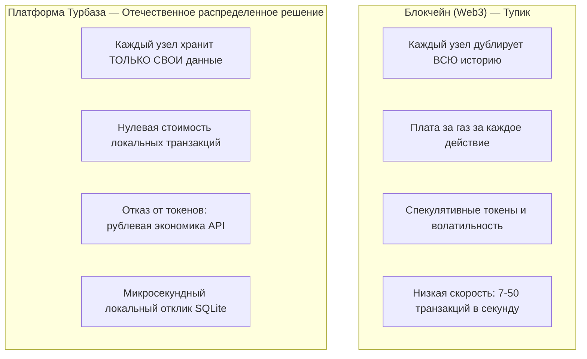
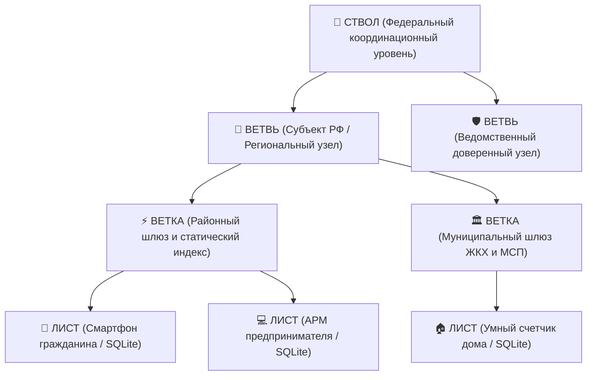

# Платформа «Турбаза»: Концепция, смена парадигмы и справедливая экономика данных

**Белая Книга: Научно-техническое обоснование и концептуальный манифест платформы**  
*Версия: 2.4 (2026)*  
*Статус: Общественный концептуальный документ*  
*Классификация: Распределенные вычисления и архитектура прямого владения данными*  

---

## Аннотация

Настоящий документ представляет концепцию, архитектурные основы и экономическую модель платформы **«Турбаза»** — трехуровневой децентрализованной вычислительной среды нового поколения. Платформа решает фундаментальные противоречия современного Интернета: монополизацию данных транснациональными облачными гигантами, катастрофический рост стоимости серверной инфраструктуры (TCO), регулярные утечки персональных данных и неэффективность спекулятивных блокчейн-технологий (Web3). 

«Турбаза» реализует переход от централизованного хранения данных к модели **«Доверенный край» (Edge Computing с владением информацией)**: оконечное пользовательское устройство (смартфон, ПК, локальный терминал) становится первичным и независимым источником достоверных реляционных данных, а промежуточные узлы районного и регионального уровня обеспечивают конвейерную валидацию, маршрутизацию и агрегацию транзакций без накопления сырых персональных сведений.

<!-- pagebreak -->

## Содержание

1. [Введение и фундаментальный кризис централизации](#1-введение-и-фундаментальный-кризис-централизации)
2. [Смена парадигмы: Почему блокчейн и Web3 зашли в тупик](#2-смена-парадигмы-почему-блокчейн-и-web3-зашли-в-тупик)
3. [Трехуровневая топология: Лист → Ветка → Ствол](#3-трехуровневая-топология-лист--ветка--ствол)
4. [Модель прямого владения данными и принцип Zero-PII](#4-модель-прямого-владения-данными-и-принцип-zero-pii)
5. [Экономическая модель: Ликвидация 30% комиссии и снижение TCO](#5-экономическая-модель-ликвидация-30-комиссии-и-снижение-tco)
6. [Государственный суверенитет и устойчивость к сетевой изоляции](#6-государственный-суверенитет-и-устойчивость-к-сетевой-изоляции)
7. [Заключение](#7-заключение)

<!-- pagebreak -->

## 1. Введение и фундаментальный кризис централизации

Современная цифровая инфраструктура находится в состоянии системного кризиса. Доминирующая на протяжении последних двух десятилетий модель «клиент-сервер» и гигантские внешние облачные платформы (BigTech Cloud) сформировали ряд непреодолимых архитектурных тупиков:

```
┌─────────────────────────────────────────────────────────────┐
│             КРИЗИС ЦЕНТРАЛИЗОВАННОГО ОБЛАКА                 │
├──────────────────────────────┬──────────────────────────────┤
│ 1. Монополизация данных      │ Пользователь бесправен;      │
│                              │ данные принадлежат вендору   │
├──────────────────────────────┼──────────────────────────────┤
│ 2. Неконтролируемый рост TCO │ 60-70% бюджета IT-стартапов  │
│                              │ уходит на оплату облачных БД │
├──────────────────────────────┼──────────────────────────────┤
│ 3. Хрупкость безопасности    │ Единая точка взлома ведет к  │
│                              │ утечкам миллионов записей    │
├──────────────────────────────┼──────────────────────────────┤
│ 4. Риск внешних санкций      │ Отключение сервиса по щелчку │
│                              │ пальцев зарубежного оператора│
└──────────────────────────────┴──────────────────────────────┘
```

Каждая попытка повысить отказоустойчивость традиционных систем приводит к экспоненциальному росту капитальных затрат: репликация кластеров СУБД между ЦОД, аренда терабитных сетевых каналов, оплата систем защиты от DDoS-атак и раздутые штаты DevOps-инженеров. При этом граждане и бизнес фактически лишены права собственности на создаваемые ими цифровые активы.

Платформа «Турбаза» предлагает фундаментальный пересмотр этой парадигмы, опираясь на физический факт: **вычислительная мощность современных пользовательских устройств превышает потребности повседневной обработки данных в десятки раз**.

<!-- pagebreak -->

## 2. Смена парадигмы: Почему блокчейн и Web3 зашли в тупик

Попытки решить проблему централизации с помощью так называемого «Web3» и открытых блокчейнов закончились провалом по причинам внутренних архитектурных ограничений:



### Сравнительный анализ парадигм

| Параметр сравнения | Централизованное облако | Блокчейн / Web3 | Платформа «Турбаза» |
| :--- | :--- | :--- | :--- |
| **Физическое место данных** | Серверные кластеры в ЦОД | Полная репликация на всех узлах | Оконечное устройство пользователя |
| **Стоимость транзакции** | Высокая (оплата серверов) | Непредсказуемая («газ») | **0 руб.** (локально на устройстве) |
| **Пропускная способность** | Лимитирована каналом ЦОД | Крайне низкая (10–100 TPS) | **Миллионы локальных TPS** |
| **Приватность данных** | Доступна администраторам | Полностью открытый реестр | **Абсолютная (Zero-PII)** |
| **Сложность стека** | Kubernetes, Kafka, реплики | Майнинг, смарт-контракты | **Локальный SQLite + TypeScript SDK** |

«Турбаза» не использует майнинг, распределенный консенсус доказательства работы (Proof-of-Work) или спекулятивные токены. Платформа опирается на строгую математическую криптографию (Ed25519 / ГОСТ), иерархическую топологию и реляционную изоляцию хранилищ.

<!-- pagebreak -->

## 3. Трехуровневая топология: Лист → Ветка → Ствол

Архитектура «Турбазы» отражает административно-географическую структуру суверенного государства и разделена на три четких уровня ответственности:



### Уровень 1: «Лист» — Автономный край пользователя (владение информацией)
- **Физическое воплощение:** Смартфон гражданина, персональный компьютер, кассовый аппарат или встроенный контроллер.
- **Движок хранения:** Встраиваемая СУБД SQLite с расширением AirEntity.
- **Принцип работы:** Любая запись (задача в органайзере, голос в опросе, запрос о помощи) создается, подписывается асимметричным ключом и сохраняется в локальной БД устройства. Время отклика составляет менее 1 миллисекунды. Запись доступна даже при полном отсутствии подключения к сети Интернет.

### Уровень 2: «Ветка» — Районный шлюз и конвейер
- **Физическое воплощение:** Сервер районного провайдера, муниципальный сервер или региональный узел связи.
- **Функции:** Прием криптографически подписанных пакетов изменений от подключенных Листьев, валидация подписей конвейером (Branch Pipeline), присвоение глобально монотонных номеров транзакций и агрегация федеративных аналитических срезов.
- **In-Memory аккумуляторы и снэпшоты EpochBlock:** Ветка не совершает дисковых операций записи на каждую отдельную транзакцию. Массовые микро-транзакции и битовые маски (19–25 байт) аккумулируются в оперативной памяти секвенсора и сбрасываются в журнал предзаписи (WAL) единым блоком эпохи (`EpochBlock extends AirEntity`), сокращая дисковый I/O на 99.8%.
- **Секвенсор агрегативных страниц (IChildRecordPage):** Отношения 1:N декомпозируются на последовательность изолированных страниц по ~1000 элементов с легковесными листовыми проекциями. По заполнении страница криптографически запечатывается (Read-Only) и навечно кэшируется на периферии, а секвенсор переключает входящий поток на новую открытую страницу.
- **Архитектура Zero-Rendering:** Серверы Ветки функционируют строго в безголовом (headless) режиме потоковой репликации бинарных дельт (0% серверного HTML/DOM-рендеринга). 100% пользовательского интерфейса, верстки и виртуализации списков исполняется аппаратно на GPU пользовательских Листьев.
- **Отказ от постоянного сырого хранения:** Ветка хранит только дельты изменений и статические индексы маршрутизации. Персональные данные на Ветке не сохраняются.

### Уровень 3: «Ствол» — Федеральный контур координации
- **Физическое воплощение:** Государственный защищенный ЦОД или распределенный контур ведомств РФ.
- **Функции:** Поддержание корневого дерева пространства имен схем данных (Хранилищ), регистрация криптографических сертификатов узлов и межгосударственные шлюзы союза БРИКС+.

<!-- pagebreak -->

## 4. Модель данных с прямым владением информацией и принцип Zero-PII

Фундаментальное преимущество архитектуры «Турбазы» заключается в реализации принципа **Zero-PII (Zero Personally Identifiable Information)** на системном уровне.

```
┌─────────────────────────────────────────────────────────────┐
│               ПРИНЦИП ZERO-PII В ПЛАТФОРМЕ                  │
├─────────────────────────────────────────────────────────────┤
│  1. Персональные данные (ФИО, адрес, телефон, переписка)     │
│     ФИЗИЧЕСКИ НЕ ПОКИДАЮТ локальную базу данных на Листе.   │
├─────────────────────────────────────────────────────────────┤
│  2. В сеть передаются исключительно:                        │
│     - Хэши криптографических доказательств (ZKP);           │
│     - Анонимные векторные проекции фактов (128 байт);       │
│     - Подписи ГОСТ / Ed25519 под структурированными актами. │
├─────────────────────────────────────────────────────────────┤
│  3. Никакой взлом районной или федеральной Ветки не может   │
│     привести к утечке базы данных граждан — этой базы       │
│     в централизованном виде просто не существует!           │
└─────────────────────────────────────────────────────────────┘
```

### Полное соответствие требованиям 152-ФЗ
Закон 152-ФЗ «О персональных данных» требует обеспечения максимальной защиты данных граждан РФ. В традиционных системах компании вынуждены строить дорогостоящие контуры защиты вокруг колоссальных облачных хранилищ, однако любая ошибка конфигурации или недобросовестный сотрудник приводят к компрометации миллионов граждан.

В «Турбазе» защита персональных данных гарантирована самой физикой системы: устройство принадлежит гражданину, ключи шифрования хранятся в защищенном аппаратном модуле (Secure Enclave / ГОСТ-токен), а доступ приложений к чужим данным строго регламентирован правилом:

$$\text{Read-Anywhere} \quad \text{AND} \quad \text{Write-Self}$$

Любое доверенное приложение может выполнять быстрые локальные SQL-запросы SELECT по связанным локальным базам, но вносить изменения имеет право исключительно через вызов `@Api()` методов приложения-владельца.

### Разграничение понятий Actor и трехуровневой анонимности
В модели данных создатель записи маркируется кортежем $\text{Actor} = (\text{User}, \text{Device}, \text{App})$. Его назначение сугубо инженерное — исключение коллизий первичных ключей при параллельной работе одного гражданина с нескольких устройств (смартфон, планшет, ПК) и через разные приложения. `Actor` принципиально не используется для сокрытия личности. Анонимность и юридическая значимость обеспечиваются на узле «Ветка» тремя уровнями регистрации:
1. **Branch ID:** Анонимный локальный контур района без персональных данных.
2. **Group Anonymity:** Криптографические слепые подписи (Blind Signatures) и ZKP, подтверждающие статус (житель дома, родитель школы) без раскрытия личности.
3. **Verified Individual:** Квалифицированная подпись ГОСТ Р 34.10-2012 / ЕСИА для финансово-правовых договоров и юридически значимых голосований.

<!-- pagebreak -->

## 5. Экономическая модель: Ликвидация 30% комиссии и снижение TCO

Современный бизнес платит огромный скрытый налог цифровым платформам:
- Агрегаторы такси, доставки и локальных услуг взимают **до 30-35%** комиссии с каждого заказа.
- Провайдеры облачных баз данных ежемесячно выставляют гигантские счета за процессорное время, IOPS и трафик.

```
┌─────────────────────────────────────────────────────────────┐
│                 СРАВНЕНИЕ TCO ИНФРАСТРУКТУРЫ                │
│                 (на 1 000 000 активных граждан)             │
├──────────────────────────────┬──────────────┬───────────────┤
│ Статья расходов              │ Облачный ЦОД │ «Турбаза»     │
├──────────────────────────────┼──────────────┼───────────────┤
│ Серверы СУБД (CPU + RAM)     │ $120 000/мес │ $2 500/мес    │
│ Трафик репликации БД         │ $45 000/мес  │ $1 200/мес    │
│ Лицензии корпоративных СУБД  │ $30 000/мес  │ 0 руб.        │
│ Команда DevOps и SRE (24/7)  │ $60 000/мес  │ $8 000/мес    │
├──────────────────────────────┼──────────────┼───────────────┤
│ ИТОГО В МЕСЯЦ:               │ $255 000     │ $11 700       │
│ ЭКОНОМИЯ БЮДЖЕТА:            │ Базовый 100% │ Снижение 95%! │
└──────────────────────────────┴──────────────┴───────────────┘
```

В платформе «Турбаза» клиент и мастер шаговой доступности связываются напрямую через локальный индекс районной Ветки за 2 миллисекунды. Расчет происходит в Цифровом рубле через безопасный эскроу-контракт без посредников и комиссий. 

Детерминированное расщепление выручки через смарт-контрактный примитив `share(0.05, Ветка, 0.1, Пользователь, 0.85, Сервис)` гарантирует операторам периферийных узлов (Capacity Renters) справедливую компенсацию за предоставление мощностей хранения, ретрансляцию и секвенирование без рекламно-следящих монополий.

<!-- pagebreak -->

## 6. Государственный суверенитет и устойчивость к сетевой изоляции

В условиях геополитической напряженности и рисков внешнего воздействия ключевым критерием надежности национальной IT-инфраструктуры является **автономность**.

```
┌─────────────────────────────────────────────────────────────┐
│             РЕЖИМ АВТОНОМНОГО ВЫЖИВАНИЯ СИСТЕМЫ             │
│                 И ГИБРИДНАЯ МАРШРУТИЗАЦИЯ                   │
├─────────────────────────────────────────────────────────────┤
│ 1. Сквозное туннелирование (PassThroughConnection):         │
│    Отраслевые подветви ЖКХ и кооперации экранированы за     │
│    муниципальной Веткой через ГОСТ-шифрование («Кузнечик»). │
├─────────────────────────────────────────────────────────────┤
│ 2. Клиентская реляционная фильтрация:                       │
│    Лист загружает проекции и выполняет INTERSECT/JOIN       │
│    локально в SQLite за миллисекунды без серверов ЦОД.      │
├─────────────────────────────────────────────────────────────┤
│ 3. Изоляция внешнего Интернета:                             │
│    Все локальные службы (ЖКХ, транспорт, магазины, опросы)  │
│    продолжают штатную работу внутри региональных Ветвей.    │
├─────────────────────────────────────────────────────────────┤
│ 4. Полное отсутствие связи у гражданина (горы / тайга):     │
│    Устройство Лист функционирует 100% автономно на SQLite;  │
│    соседние устройства связываются по ячеистой сети (Mesh). │
└─────────────────────────────────────────────────────────────┘
```

«Турбаза» не требует постоянного онлайн-соединения с центральным сервером для проверки лицензий или валидации сессий. Это делает инфраструктуру невосприимчивой к централизованным сбоям и санкционным блокировкам.

<!-- pagebreak -->

## 7. Заключение

Платформа «Турбаза» представляет собой готовый архитектурный ответ на технологические вызовы XXI века:
1. **Данные принадлежат гражданину:** Локальное хранение в SQLite на оконечных устройствах ликвидирует зависимость от зарубежных монополий.
2. **Снижение TCO на порядок:** Перенос вычислений на периферию разгружает серверные мощности и снижает государственные и корпоративные расходы более чем на 90%.
3. **Безопасность по умолчанию:** Модель Zero-PII исключает саму возможность масштабных утечек персональных данных.
4. **Готовность к масштабированию:** Архитектура объединяет микрорайоны, муниципалитеты и регионы в единую связную федеративную экосистему, открытую для союзных государств БРИКС+.

---

*Авторы: Исследовательская группа архитектуры платформы «Турбаза»*  
*Документация и спецификации: [shared_docs/](file:///Users/parents/Documents/presentations/shared_docs/)*
