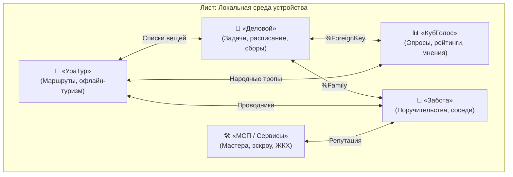
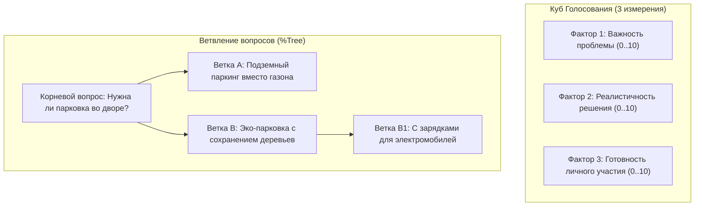
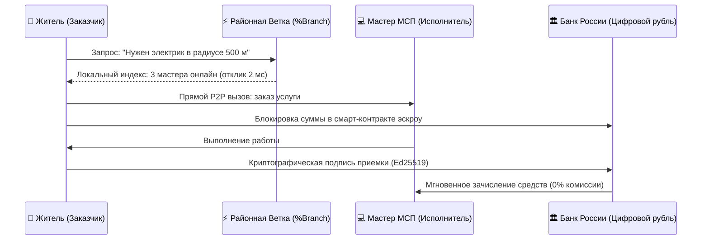
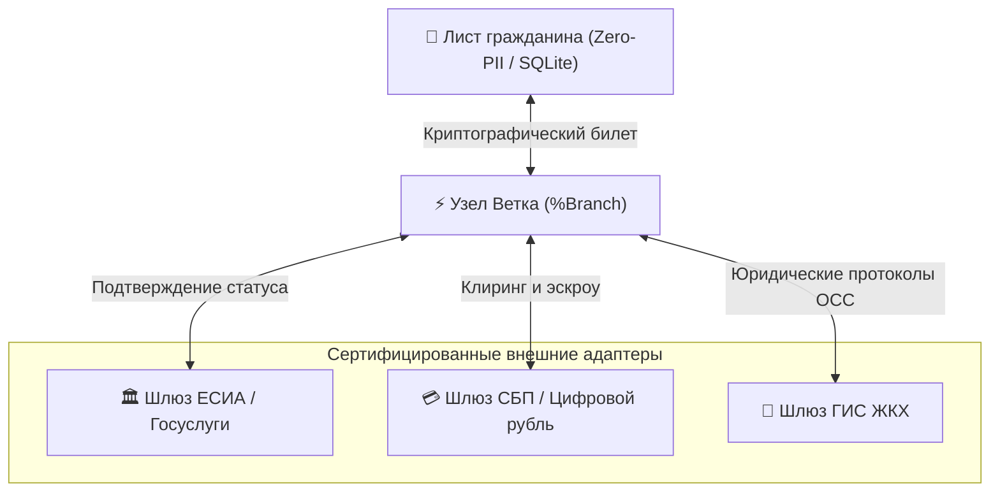

# Флагманская прикладная экосистема платформы «Турбаза»

**Белая Книга: Архитектура, прикладные алгоритмы и интеграционные шлюзы флагманских сервисов**  
*Версия: 2.4 (2026)*  
*Статус: Публичная техническая спецификация*  
*Классификация: Прикладные распределенные сервисы и интеграционные шлюзы*  

---

## Аннотация

В настоящей Белой Книге детально рассматривается прикладной уровень суверенной платформы **«Турбаза»** — флагманский комплекс из пяти взаимосвязанных приложений: персонального органайзера **«Деловой»**, системы децентрализованных опросов **«КубГолос»**, сети взаимопомощи и открытой репутации **«Забота»**, суверенного путеводителя **«УраТур»** и локального реестра сервисов МСП и ЖКХ. 

Документ описывает прикладные алгоритмы (матрицу Эйзенхауэра 2.0, эвристику Serendipity, многомерный куб взвешивания голосов, граф очных поручительств Web-of-Trust), правила совместного использования данных через композитные внешние ключи (`%ForeignKey`), а также архитектуру интеграционных шлюзов узла «Ветка» (`%Branch`) с государственными информационными системами РФ: **ЕСИА (Госуслуги)**, **СБП / Цифровой рубль** и **ГИС ЖКХ** в строгом соответствии с концепцией Zero-PII.

<!-- pagebreak -->

## Содержание

1. [Архитектурная модель прикладного слоя «Турбазы»](#1-архитектурная-модель-прикладного-слоя-турбазы)
2. [«Деловой»: Суверенный органайзер приоритетов и поручений](#2-деловой-суверенный-органайзер-приоритетов-и-поручений)
3. [«КубГолос»: Многомерные деревья волеизъявления без ботов](#3-кубголос-многомерные-деревья-волеизъявления-без-ботов)
4. [«Забота»: Сеть доверенного добрососедства и открытая репутация](#4-забота-сеть-доверенного-добрососедства-и-открытая-репутация)
5. [«УраТур»: Офлайн-навигатор и синергетический путеводитель](#5-уратур-офлайн-навигатор-и-синергетический-путеводитель)
6. [Локальный реестр МСП и расчёты в Цифровом рубле](#6-локальный-реестр-мсп-и-расчёты-в-цифровом-рубле)
7. [Внешние шлюзы Ветки: ЕСИА, СБП и ГИС ЖКХ](#7-внешние-шлюзы-ветки-есиа-сбп-и-гис-жкх)
8. [Заключение](#8-заключение)

<!-- pagebreak -->

## 1. Архитектурная модель прикладного слоя «Турбазы»

В отличие от традиционных изолированных мобильных приложений («data silos»), где каждая программа хранит данные на собственном изолированном сервере, приложения в «Турбазе» взаимодействуют на едином локальном устройстве (Листе) по принципу **симбиотической синергии данных**:



### Фундаментальные принципы взаимодействия приложений:
1. **Единое локальное реляционное пространство:** Каждое приложение является владельцем своего репозитория (`%Repository`), но данные физически размещаются в единой высокопроизводительной локальной базе SQLite на устройстве гражданина.
2. **Безопасные кросс-схемные связи (`%ForeignKey`):** Приложения могут связывать записи через композитные ключи (`RepositoryId`, `ActorId`, `ActorRecordId`), не дублируя данные.
3. **Строгая изоляция модификаций (`Write-Self`):** Органайзер «Деловой» может напрямую прочитать статус поручительства из «Заботы» через SQL `SELECT`, но создать новое поручительство может только через официальный интерфейс `@Api()` приложения «Забота».

<!-- pagebreak -->

## 2. «Деловой»: Суверенный органайзер приоритетов и поручений

Органайзер «Деловой» решает проблему потери фокуса и перегрузки современного человека хаотичными списками дел.

```
┌─────────────────────────────────────────────────────────────┐
│                 МАТРИЦА ЭЙЗЕНХАУЭРА 2.0                    │
├──────────────────────────────┬──────────────────────────────┤
│ КВАДРАНТ I: КРИЗИСЫ          │ КВАДРАНТ II: СТРАТЕГИЯ      │
│ Срочно и Важно               │ Важно, но Не срочно          │
│ • Сдача отчета сегодня       │ • Обучение и спорт           │
│ • Авария водопровода дома    │ • Семейные цели на год       │
├──────────────────────────────┼──────────────────────────────┤
│ КВАДРАНТ III: СУЕТА          │ КВАДРАНТ IV: ПОГЛОТИТЕЛИ     │
│ Срочно, но Не важно          │ Не срочно и Не важно         │
│ • Внезапные звонки           │ • Бессмысленный скроллинг    │
│ • Рутинные согласования      │ • Пустые обсуждения          │
└──────────────────────────────┴──────────────────────────────┘
```

### Ключевые алгоритмические инновации «Делового»:
1. **Гравитационные сферы влияния:** Задачи группируются по жизненным доменам (Работа, Семья, Здоровье, Творчество), при этом баланс времени визуализируется в реальном времени.
2. **Алгоритм Serendipity против ступора:** Когда у пользователя накапливается более 30 задач и наступает ступор выбора, эвристический генератор предлагает случайную важную задачу из Квадранта II с ограничением по времени (15 минут).
3. **Семейный контур поручений (`%Family`):** Задачи внутри семьи синхронизируются напрямую между устройствами Листьями без отправки расписания семьи на публичные облачные серверы.
4. **Мгновенный локальный отклик:** Любая операция создания или фильтрации задач занимает **менее 1 мс** благодаря локальному SQLite.

<!-- pagebreak -->

## 3. «КубГолос»: Многомерные деревья волеизъявления без ботов

Традиционные интернет-опросы и онлайн-голосования дискредитированы накрутками ботов, упрощенными бинарными вопросами («Да / Нет») и непрозрачностью серверных баз данных. «КубГолос» предлагает принципиально новую математическую модель волеизъявления:



### Защита от накруток и ликвидация централизованных баз:
- **0% бот-трафика:** Право голоса подтверждается очными поручительствами соседей из сети «Забота» и шлюзом ЕСИА. Фальшивые аккаунты физически не имеют криптографического билета жителя района.
- **Ветвление формулировок (%Tree):** Если гражданин не согласен с формулировкой вопроса, он не бойкотирует опрос, а создает дочернюю ветку с уточненным решением.
- **Децентрализованная агрегация:** Каждый голос хранится локально на устройстве жителя. Районная Ветка суммирует математические векторы за 3 секунды без накопления реестров персональных мнений.

<!-- pagebreak -->

## 4. «Забота»: Сеть доверенного добрососедства и открытая репутация

«Забота» — это суверенная социально-бытовая сеть взаимной поддержки жителей одного подъезда, дома или микрорайона.

```
┌─────────────────────────────────────────────────────────────┐
│                 МНОГОМЕРНЫЙ ГРАФ ДОВЕРИЯ                    │
│                     (Web-of-Trust)                          │
├─────────────────────────────────────────────────────────────┤
│  1. Очное поручительство через QR-код:                      │
│     Соседи подтверждают факт личного знакомства при очной   │
│     встрече, подписывая публичные ключи друг друга.         │
├─────────────────────────────────────────────────────────────┤
│  2. Многомерная репутация (без карательного соцрейтинга):   │
│     Репутация не сводится к единой абстрактной цифре;       │
│     учитываются контекстные факты помощи: «Помощь с детьми»,│
│     «Ремонт сантехники», «Авто-выручка», «Пожилые соседи». │
├─────────────────────────────────────────────────────────────┤
│  3. Полная защита от деанонимизации:                        │
│     Номер квартиры и телефон открываются только тем         │
│     соседям, чью заявку на помощь вы приняли лично.        │
└─────────────────────────────────────────────────────────────┘
```

Репутационные схемы приложения «Забота» являются открытыми и переиспользуемыми: сторонние форумы жильцов, ТСЖ и локальные кооперативы могут валидировать доверие без создания собственных баз данных.

<!-- pagebreak -->

## 5. «УраТур»: Офлайн-навигатор и синергетический путеводитель

«УраТур» объединяет возможности всех приложений экосистемы для организации автономных путешествий по отдаленным регионам России (Алтай, Байкал, Камчатка, Урал, Карелия):

```
┌─────────────────────────────────────────────────────────────┐
│               СИНЕРГИЯ ЭКОСИСТЕМЫ В «УРАТУР»                │
├──────────────────────────────┬──────────────────────────────┤
│ 💼 Сборы от «Делового»       │ Автоматический чек-лист      │
│                              │ снаряжения с учетом сезона   │
├──────────────────────────────┼──────────────────────────────┤
│ 📊 Маршруты от «КубГолоса»   │ Проверенные народные тропы,  │
│                              │ оцененные туристами без спама│
├──────────────────────────────┼──────────────────────────────┤
│ 🤝 Проводники от «Заботы»    │ Локальные проводники с очным │
│                              │ поручительством землячества  │
├──────────────────────────────┼──────────────────────────────┤
│ 🌲 100% Автономность SQLite  │ Карты, треки и описания      │
│                              │ работают без сотовой связи   │
└──────────────────────────────┴──────────────────────────────┘
```

В экстремальных условиях отсутствия мобильного интернета устройства туристов связываются по ячеистому радиоканалу Bluetooth Low Energy (BLE Mesh), передавая сообщения об опасности и взаимные координаты по цепочке от одного смартфона к другому.

<!-- pagebreak -->

## 6. Локальный реестр МСП и расчёты в Цифровом рубле

Современные самозанятые мастера, репетиторы, автомеханики и фермеры отдают посредническим сервисам и маркетплейсам до 30% своего дохода за каждого приведенного клиента.

«Турбаза» исключает посредника за счет прямого соединения заказчика и исполнителя шаговой доступности:



Малый бизнес получает постоянный поток локальных заказов без платы за рекламу, а жители — проверенных мастеров из соседнего дома с подтвержденной добрососедской репутацией.

<!-- pagebreak -->

## 7. Внешние шлюзы Ветки: ЕСИА, СБП и ГИС ЖКХ

Для обеспечения полной легитимности и бесшовной интеграции с государственной инфраструктурой РФ на районных и муниципальных узлах «Ветка» (`%Branch`) развертываются стандартизированные **сервисные адаптеры-шлюзы**:



### 1. Адаптер ЕСИА (Единая система идентификации и аутентификации):
- **Сценарий:** Гражданину необходимо подтвердить, что он является реальным совершеннолетним жителем конкретного муниципалитета.
- **Механизм Zero-PII:** Пользователь авторизуется в ЕСИА один раз. Branch-адаптер проверяет квалифицированную электронную подпись и генерирует для смартфона гражданина криптографический слепой билет (Blind Signature Token). 
- **Результат:** Никакие паспортные данные, СНИЛС или номер телефона не хранятся в приложениях «Турбазы». Приложение предъявляет только математическое доказательство того, что голос принадлежит верифицированному жителю дома.

### 2. Адаптер СБП и платформы Цифрового рубля Банка России:
- **Сценарий:** Оплата локальных услуг МСП, сбор средств на благоустройство двора или оплата членских взносов кооператива.
- **Механизм:** Узел Ветка выступает доверенным медиатором безопасной сделки (Escrow Coordinator). Средства депонируются на номинальном счете или в смарт-контракте Цифрового рубля до момента криптографического подписания акта выполненных работ.

### 3. Адаптер ГИС ЖКХ:
- **Сценарий:** Проведение Общих собраний собственников (ОСС) многоквартирных домов через «КубГолос».
- **Механизм:** После завершения многомерного опроса в «КубГолосе» протокол голосования, подписанный ключами ГОСТ/Ed25519 реальных собственников квартир, автоматически конвертируется в XML-схему ГИС ЖКХ и передается в государственную систему с формированием юридически обязывающего акта.

<!-- pagebreak -->

## 8. Заключение

Флагманский комплекс приложений «Турбазы» демонстрирует, как суверенная распределенная архитектура меняет повседневную жизнь граждан и работу бизнеса:
1. **Единая среда вместо сотен разрозненных сервисов:** Задачи, опросы, добрососедство и локальные услуги работают как единый слаженный организм на устройстве пользователя.
2. **Нулевая зависимость от зарубежных облаков:** Все приложения функционируют в локальном реляционном движке SQLite и не требуют постоянного интернета.
3. **Бесшовная интеграция с госсервисами:** Branch-адаптеры ЕСИА, СБП и ГИС ЖКХ обеспечивают юридическую силу и финансовую надежность без нарушения приватности (Zero-PII).
4. **Возврат экономической выгоды людям:** Ликвидация платформенных поборов до 30% оставляет миллиарды рублей в экономике микрорайонов и карманах граждан.

---

*Авторы: Прикладная рабочая группа платформы «Турбаза»*  
*Спецификации интерфейсов SDK: [shared_docs/](file:///Users/parents/Documents/presentations/shared_docs/)*
