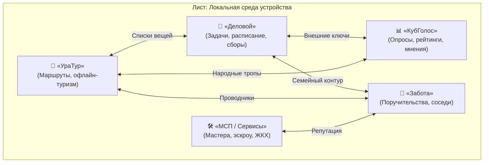
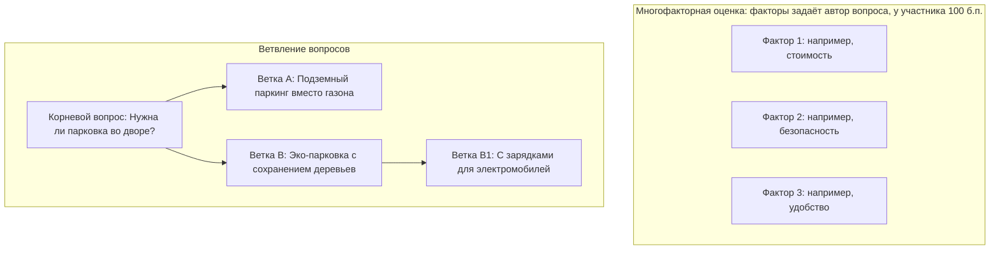
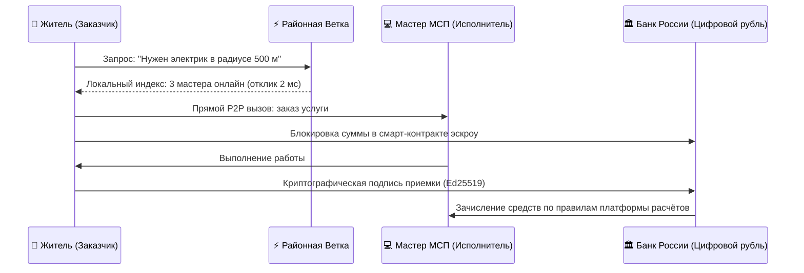
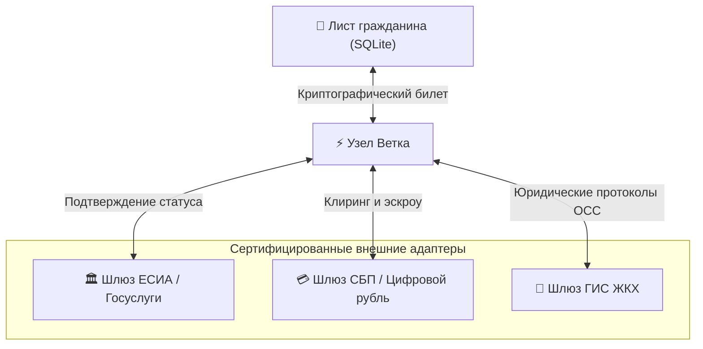

# Флагманская прикладная экосистема платформы «Турбаза»

**Белая Книга: Архитектура, прикладные алгоритмы и интеграционные шлюзы флагманских сервисов**  
*Версия: 2.4 (2026)*  
*Статус: Общественная техническая спецификация*  
*Классификация: Прикладные распределенные сервисы и интеграционные шлюзы*  

---

## Аннотация

В настоящей Белой Книге детально рассматривается прикладной уровень отечественной платформы **«Турбаза»** — флагманский комплекс из пяти взаимосвязанных приложений: персонального органайзера **«Деловой»**, системы децентрализованных опросов **«КубГолос»**, сети взаимопомощи и открытой репутации **«Забота»**, автономного путеводителя **«УраТур»** и локального реестра сервисов МСП и ЖКХ. 

Документ описывает прикладные алгоритмы (матрицу Эйзенхауэра 2.0, эвристику Serendipity, многомерный куб взвешивания голосов, граф очных поручительств (сеть доверия)), правила совместного использования данных через композитные внешние ключи, а также архитектуру интеграционных шлюзов узла «Ветка» с государственными информационными системами РФ: **ЕСИА (Госуслуги)**, **СБП / Цифровой рубль** и **ГИС ЖКХ** в соответствии с концепцией «частное остаётся частным».

<!-- pagebreak -->

## Содержание

1. [Архитектурная модель прикладного слоя «Турбазы»](#1-архитектурная-модель-прикладного-слоя-турбазы)
2. [«Деловой»: Автономный органайзер приоритетов и поручений с владением информацией](#2-деловой-автономный-органайзер-приоритетов-и-поручений-с-владением-информацией)
3. [«КубГолос»: Многомерные деревья волеизъявления без ботов](#3-кубголос-многомерные-деревья-волеизъявления-без-ботов)
4. [«Забота»: Сеть доверенного добрососедства и открытая репутация](#4-забота-сеть-доверенного-добрососедства-и-открытая-репутация)
5. [«УраТур»: Офлайн-навигатор и синергетический путеводитель](#5-уратур-офлайн-навигатор-и-синергетический-путеводитель)
6. [Локальный реестр МСП и расчёты в Цифровом рубле](#6-локальный-реестр-мсп-и-расчёты-в-цифровом-рубле)
7. [Внешние шлюзы Ветки: ЕСИА, СБП и ГИС ЖКХ](#7-внешние-шлюзы-ветки-есиа-сбп-и-гис-жкх)
8. [Заключение](#8-заключение)

<!-- pagebreak -->

## 1. Архитектурная модель прикладного слоя «Турбазы»

В отличие от традиционных изолированных мобильных приложений («data silos»), где каждая программа хранит данные на собственном изолированном сервере, приложения в «Турбазе» взаимодействуют на едином локальном устройстве (Листе) по принципу **симбиотической синергии данных**:


```mermaid
graph TD
    subgraph Leaf_Device ["Лист: Локальная среда устройства"]
        D["💼 «Деловой»<br>(Задачи, расписание, сборы)"]
        K["📊 «КубГолос»<br>(Опросы, рейтинги, мнения)"]
        Z["🤝 «Забота»<br>(Поручительства, соседи)"]
        U["🧭 «УраТур»<br>(Маршруты, офлайн-туризм)"]
        S["🛠️ «МСП / Сервисы»<br>(Мастера, эскроу, ЖКХ)"]

        D <-->|Внешние ключи| K
        D <-->|Семейный контур| Z
        U <-->|Списки вещей| D
        U <-->|Народные тропы| K
        U <-->|Проводники| Z
        S <-->|Репутация| Z
    end
```

### Фундаментальные принципы взаимодействия приложений:
1. **Единое локальное реляционное пространство:** Каждое приложение является владельцем своего хранилища, но данные физически размещаются в единой высокопроизводительной локальной базе SQLite на устройстве гражданина.
2. **Безопасные кросс-схемные связи:** Приложения могут связывать записи через композитные ключи (`RepositoryId`, `ActorId`, `ActorRecordId`), не дублируя данные.
3. **Строгая изоляция модификаций («пиши только своё»):** Органайзер «Деловой» может напрямую прочитать статус поручительства из «Заботы» через SQL `SELECT`, но создать новое поручительство может только через официальный интерфейс `@Api()` приложения «Забота».

<!-- pagebreak -->

## 2. «Деловой»: Автономный органайзер приоритетов и поручений с владением информацией

Органайзер «Деловой» решает проблему потери фокуса, балласта отложенных дел и тягостного бремени выбора современного человека.

```
┌─────────────────────────────────────────────────────────────┐
│                 МАТРИЦА ЭЙЗЕНХАУЭРА 2.0                    │
├──────────────────────────────┬──────────────────────────────┤
│ КВАДРАНТ I: КРИТИЧЕСКИЙ ФОКУС│ КВАДРАНТ II: СТРАТЕГИЯ      │
│ Срочно и Важно               │ Важно, но Не срочно          │
│ • Сдача отчета сегодня       │ • Обучение и спорт           │
│ • Авария водопровода дома    │ • Семейные цели на год       │
├──────────────────────────────┼──────────────────────────────┤
│ КВАДРАНТ III: СУЕТА          │ КВАДРАНТ IV: ПОГЛОТИТЕЛИ     │
│ Срочно, но Не важно          │ Не срочно и Не важно         │
│ • Внезапные звонки           │ • Бессмысленный скроллинг    │
│ • Рутинные согласования      │ • Пустые обсуждения          │
└──────────────────────────────┴──────────────────────────────┘
```

### Ключевые архитектурные и алгоритмические инновации:
1. **Композиция Дела и древо Задач:** Дело выступает единым узлом, объединяющим стратегические Цели (`Goal`) и коренную Задачу (`Task`). Задачи ветвятся на под-задачи, при этом любая под-задача может быть повышена в независимое Дело со своим Хранилищем.
2. **Изоляция Дел и ролевые ключи доступа:** В платформе исключены монолитные базы-агрегаторы: каждое Дело создаётся в обособленном Хранилище со своим ключом. Внутри совместного Дела действуют ролевые группы ключей, а сторонние приложения расширяют сущности через внешние ключи и динамические виртуальные таблицы (подробно архитектура межприложенческих схем раскрывается в материалах Реестра сервисов МСП).
3. **Гравитационные сферы и угасание просрочки:** Интерактивные сферы визуализируют баланс доменов жизни. По мере приближения срока дело смещается в зону Q1, а при некритичной просрочке его приоритет экспоненциально угасает ($T_{1/2}$), устраняя чувство вины.
4. **Алгоритм Serendipity против бремени выбора:** Эвристический «Случайный шаг» выбирает одно актуальное дело из пула Q2 на 15 минут, мгновенно снимая когнитивный ступор.
5. **Когнитивное сито 5W1H и Общественный API:** Структурирование замысла без неполноты, а сторонние городские сервисы передают поручения через стандартизированный API с согласия пользователя.

<!-- pagebreak -->

## 3. «КубГолос»: Многомерные деревья волеизъявления без ботов

Традиционные интернет-опросы и онлайн-голосования дискредитированы накрутками ботов, упрощенными бинарными вопросами («Да / Нет») и непрозрачностью серверных баз данных. «КубГолос» предлагает принципиально новую математическую модель волеизъявления:


```mermaid
graph TD
    subgraph Voting_Cube ["Многофакторная оценка: факторы задаёт автор вопроса, у участника 100 б.п."]
        F1["Фактор 1: например, стоимость"]
        F2["Фактор 2: например, безопасность"]
        F3["Фактор 3: например, удобство"]
    end
    subgraph Tree_Branching ["Ветвление вопросов"]
        Q["Корневой вопрос: Нужна ли парковка во дворе?"]
        Q --> A1["Ветка A: Подземный паркинг вместо газона"]
        Q --> A2["Ветка B: Эко-парковка с сохранением деревьев"]
        A2 --> A2_1["Ветка B1: С зарядками для электромобилей"]
    end
```

### Защита от накруток и хранение голосов без центральной базы:
- **Многоуровневая защита от накруток:** Принадлежность к району подтверждает районная Ветка; возможны групповая регистрация через соседей и жеребьёвку и внешние шлюзы, например ЕСИА. Квоты и ограничение частоты снижают выгоду массовой накрутки; полностью исключить её без централизованного удостоверения нельзя.
- **Ветвление формулировок:** Если гражданин не согласен с формулировкой вопроса, он не бойкотирует опрос, а создает дочернюю ветку с уточненным решением.
- **Децентрализованная агрегация:** Каждый голос хранится в хранилище участника. Районная Ветка суммирует векторы факторов (целевой показатель — единицы секунд для крупного города), а частные опросы групп считаются на Листах участников.

<!-- pagebreak -->

## 4. «Забота»: Сеть доверенного добрососедства и открытая репутация

«Забота» — это доверенная социально-бытовая сеть взаимной поддержки жителей одного подъезда, дома или микрорайона.

```
┌─────────────────────────────────────────────────────────────┐
│                 МНОГОМЕРНЫЙ ГРАФ ДОВЕРИЯ                    │
│                     (сеть доверия)                          │
├─────────────────────────────────────────────────────────────┤
│  1. Очное поручительство через QR-код:                      │
│     Соседи подтверждают факт личного знакомства при очной   │
│     встрече, подписывая открытые ключи друг друга.         │
├─────────────────────────────────────────────────────────────┤
│  2. Многомерная репутация (рейтинг по темам):               │
│     Репутация не сводится к единой абстрактной цифре;       │
│     учитываются контекстные факты помощи: «Помощь с детьми»,│
│     «Ремонт сантехники», «Авто-выручка», «Пожилые соседи». │
├─────────────────────────────────────────────────────────────┤
│  3. Защита частной информации:                              │
│     Номер квартиры и телефон открываются только тем         │
│     соседям, чью заявку на помощь вы приняли лично.        │
└─────────────────────────────────────────────────────────────┘
```

Репутационные схемы приложения «Забота» являются открытыми и переиспользуемыми: сторонние форумы жильцов, ТСЖ и локальные кооперативы могут валидировать доверие без создания собственных баз данных.

<!-- pagebreak -->

## 5. «УраТур»: Офлайн-навигатор и синергетический путеводитель

«УраТур» объединяет возможности всех приложений экосистемы для организации автономных путешествий по отдаленным регионам России (Алтай, Байкал, Камчатка, Урал, Карелия):

```
┌─────────────────────────────────────────────────────────────┐
│               СИНЕРГИЯ ЭКОСИСТЕМЫ В «УРАТУР»                │
├──────────────────────────────┬──────────────────────────────┤
│ 💼 Сборы от «Делового»       │ Автоматический чек-лист      │
│                              │ снаряжения с учетом сезона   │
├──────────────────────────────┼──────────────────────────────┤
│ 📊 Маршруты от «КубГолоса»   │ Народные тропы, оценённые    │
│                              │ туристами по причинам        │
├──────────────────────────────┼──────────────────────────────┤
│ 🤝 Проводники от «Заботы»    │ Локальные проводники с очным │
│                              │ поручительством соседей      │
├──────────────────────────────┼──────────────────────────────┤
│ 🌲 Автономность SQLite       │ Карты, треки и описания      │
│                              │ работают без сотовой связи   │
└──────────────────────────────┴──────────────────────────────┘
```

В экстремальных условиях отсутствия мобильного интернета устройства туристов связываются по ячеистому радиоканалу Bluetooth Low Energy (ячеистая сеть BLE), передавая сообщения об опасности и взаимные координаты по цепочке от одного смартфона к другому.

<!-- pagebreak -->

## 6. Локальный реестр МСП и расчёты в Цифровом рубле

Самозанятые мастера, репетиторы, автомеханики и фермеры нередко работают через посреднические сервисы и маркетплейсы, которые берут плату за каждого приведённого клиента.

«Турбаза» предлагает дополнительный вариант: прямое соединение заказчика и исполнителя шаговой доступности:


```mermaid
sequenceDiagram
    participant C as 📱 Житель (Заказчик)
    participant B as ⚡ Районная Ветка
    participant M as 💻 Мастер МСП (Исполнитель)
    participant R as 🏛️ Банк России (Цифровой рубль)

    C->>B: Запрос: "Нужен электрик в радиусе 500 м"
    B-->>C: Локальный индекс: 3 мастера онлайн (отклик 2 мс)
    C->>M: Прямой P2P вызов: заказ услуги
    C->>R: Блокировка суммы в смарт-контракте эскроу
    M->>C: Выполнение работы
    C->>R: Криптографическая подпись приемки (Ed25519)
    R->>M: Зачисление средств по правилам платформы расчётов
```

Малый бизнес получает возможность принимать локальные заказы напрямую, а жители — видеть оценки мастеров из соседнего дома по подтверждённому опыту.

<!-- pagebreak -->

## 7. Внешние шлюзы Ветки: ЕСИА, СБП и ГИС ЖКХ

Для обеспечения полной легитимности и бесшовной интеграции с государственной инфраструктурой РФ на районных и муниципальных узлах «Ветка» развертываются стандартизированные **сервисные адаптеры-шлюзы**:


```mermaid
graph TD
    Leaf["📱 Лист гражданина (SQLite)"]
    Branch["⚡ Узел Ветка"]

    subgraph Adapters ["Сертифицированные внешние адаптеры"]
        A_ESIA["🏛️ Шлюз ЕСИА / Госуслуги"]
        A_SBP["💳 Шлюз СБП / Цифровой рубль"]
        A_GIS["🏢 Шлюз ГИС ЖКХ"]
    end

    Leaf <-->|Криптографический билет| Branch
    Branch <-->|Подтверждение статуса| A_ESIA
    Branch <-->|Клиринг и эскроу| A_SBP
    Branch <-->|Юридические протоколы ОСС| A_GIS
```

### 1. Адаптер ЕСИА (Единая система идентификации и аутентификации):
- **Сценарий:** Гражданину необходимо подтвердить, что он является реальным совершеннолетним жителем конкретного муниципалитета.
- **Механизм «частное остаётся частным»:** Пользователь авторизуется в ЕСИА один раз. Адаптер Ветки проверяет квалифицированную электронную подпись и генерирует для смартфона гражданина криптографический слепой билет (Blind Signature Token). 
- **Результат:** Никакие паспортные данные, СНИЛС или номер телефона не хранятся в приложениях «Турбазы». Приложение предъявляет только математическое доказательство того, что голос принадлежит верифицированному жителю дома.

### 2. Адаптер СБП и платформы Цифрового рубля Банка России:
- **Сценарий:** Оплата локальных услуг МСП, сбор средств на благоустройство двора или оплата членских взносов кооператива.
- **Механизм:** Узел Ветка выступает доверенным медиатором безопасной сделки (Escrow Coordinator). Средства депонируются на номинальном счете или в смарт-контракте Цифрового рубля до момента криптографического подписания акта выполненных работ.

### 3. Адаптер ГИС ЖКХ:
- **Сценарий:** Проведение Общих собраний собственников (ОСС) многоквартирных домов через «КубГолос».
- **Механизм:** После завершения многомерного опроса в «КубГолосе» протокол голосования, подписанный ключами ГОСТ/Ed25519 реальных собственников квартир, автоматически конвертируется в XML-схему ГИС ЖКХ и передается в государственную систему с формированием юридически обязывающего акта.

<!-- pagebreak -->

## 8. Заключение

Флагманский комплекс приложений «Турбазы» демонстрирует, как распределенная архитектура и прямое владение данными меняют повседневную жизнь граждан и работу бизнеса:
1. **Единая среда вместо сотен разрозненных сервисов:** Задачи, опросы, добрососедство и локальные услуги работают как единый слаженный организм на устройстве пользователя.
2. **Нулевая зависимость от зарубежных облаков:** Все приложения функционируют в локальном реляционном движке SQLite и не требуют постоянного интернета.
3. **Интеграция с госсервисами:** Адаптеры Ветки ЕСИА, СБП и ГИС ЖКХ проектируются так, чтобы сохранять приватность и опираться на юридически значимые механизмы.
4. **Возможная экономическая выгода:** Прямое взаимодействие заказчика и исполнителя может уменьшить посреднические расходы; размер эффекта в этой книге не оценивается.

---

*Авторы: Прикладная рабочая группа платформы «Турбаза»*  
*Спецификации интерфейсов SDK: [shared_docs/](file:///Users/parents/Documents/presentations/shared_docs/)*
