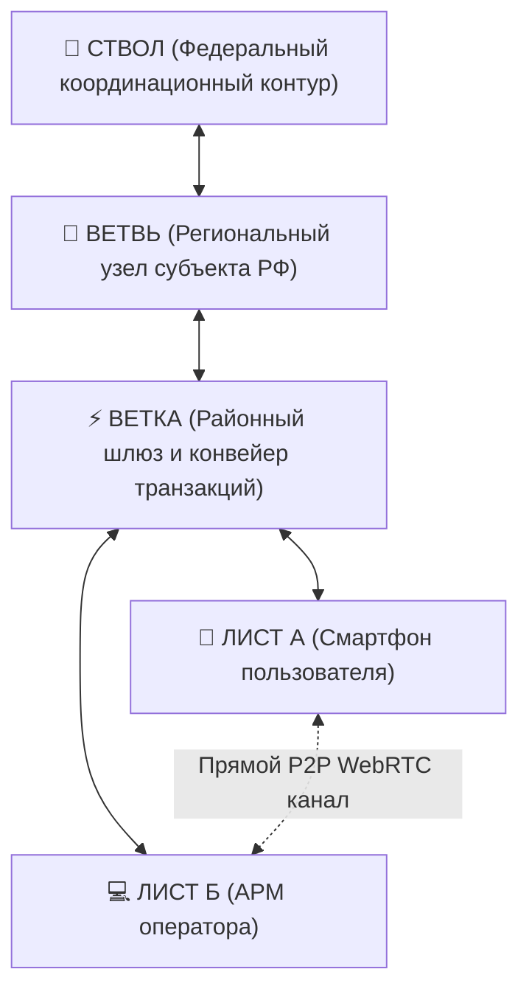
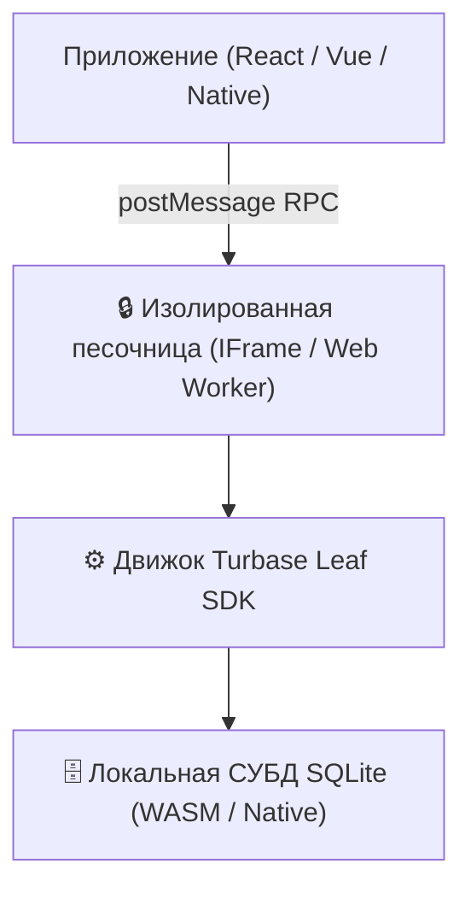
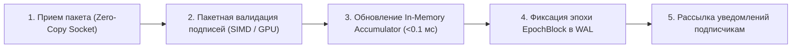
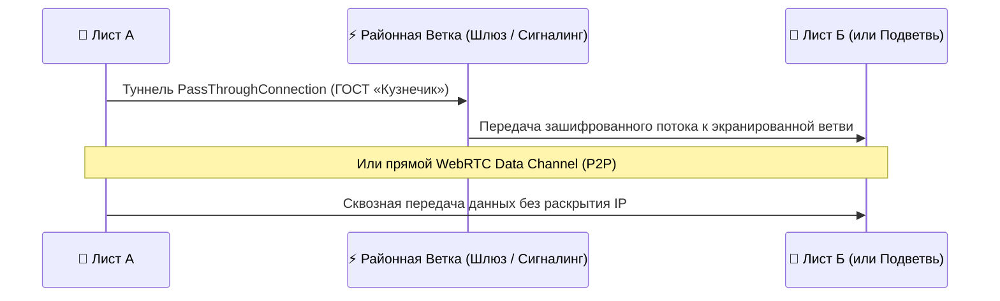

# Инженерная спецификация платформы «Турбаза»

**Белая Книга: Трехуровневая топология, модель AirEntity, Leaf Storage Engine, Branch Pipeline и TreeSearch**  
*Версия: 2.4 (2026)*  
*Статус: Общественная инженерная спецификация*  
*Классификация: Системная архитектура, распределенные СУБД, криптография*  

---

## Аннотация

Настоящий документ содержит детальное техническое описание инженерных компонентов и системных протоколов платформы **«Турбаза»**. Спецификация охватывает модель реляционных данных **AirEntity** с тройным составным первичным ключом, архитектуру встраиваемого движка **Leaf Storage Engine** на базе SQLite в изолированной песочнице, фундаментальный протокол разграничения прав **«Read-Anywhere, Write-Self»**, устройство высокопроизводительного конвейера узла «Ветка» (**Branch Pipeline**), гибридную сквозную маршрутизацию **P2P / WebRTC**, распределенный поисковый движок **TreeSearch** и криптографическую API-экономику.

<!-- pagebreak -->

## Содержание

1. [Общая топология и физическое разделение уровней](#1-общая-топология-и-физическое-разделение-уровней)
2. [Модель данных AirEntity и тройной составной ключ](#2-модель-данных-airentity-и-тройной-составной-ключ)
3. [Leaf Storage Engine: Встраиваемый SQLite и песочница](#3-leaf-storage-engine-встраиваемый-sqlite-и-песочница)
4. [Принцип «Read-Anywhere, Write-Self» и безопасность SDK](#4-принцип-read-anywhere-write-self-и-безопасность-sdk)
5. [Branch Pipeline: Конвейер валидации и фиксации транзакций](#5-branch-pipeline-конвейер-валидации-и-фиксации-транзакций)
6. [Сквозная маршрутизация P2P и трансляция сквозь NAT](#6-сквозная-маршрутизация-p2p-и-трансляция-сквозь-nat)
7. [TreeSearch и Federated OLAP: Аналитика за 3 секунды](#7-treesearch-и-federated-olap-аналитика-за-3-секунды)
8. [Криптографическая безопасность и API-экономика](#8-криптографическая-безопасность-и-api-экономика)
9. [Заключение](#9-заключение)

<!-- pagebreak -->

## 1. Общая топология и физическое разделение уровней

Архитектура «Турбазы» отказывается от плоской топологии P2P-сетей (где каждый узел перегружен чужим трафиком) и централизованных серверных ферм в пользу строгого **иерархического контура**:



### Разделение функциональных обязанностей:
- **Узел Лист:** Первичный генератор транзакций и постоянное место хранения реляционных данных пользователя.
- **Узел Ветка:** Высокопроизводительный конвейер транзакций, проверка криптографических подписей, присвоение глобального порядка транзакций (Sequence Number) и раздача статических индексов.
- **Узел Ствол:** Регистрация глобальных пространств имен схем данных (Хранилищ) и сертификатов удостоверяющих центров.

<!-- pagebreak -->

## 2. Модель данных AirEntity и тройной составной ключ

В традиционных реляционных базах данных каждая таблица использует автоинкрементный суррогатный ключ (`ID INT AUTO_INCREMENT`). В распределенной среде это приводит к неизбежным коллизиям номеров при создании записей на разных автономных устройствах.

В платформе «Турбаза» каждая запись расширяет абстрактный класс **AirEntity** и идентифицируется детерминированным тройным составным ключом:

```
┌─────────────────────────────────────────────────────────────┐
│             СТРУКТУРА ПЕРВИЧНОГО КЛЮЧА AIRENTITY            │
├─────────────────────────────────────────────────────────────┤
│  1. RepositoryId (GUID / Hash)                              │
│     Идентификатор логического хранилища (базы данных).      │
├─────────────────────────────────────────────────────────────┤
│  2. ActorId (GUID / Public Key Hash)                        │
│     Идентификатор субъекта создания: Actor = (User, Dev, App)│
├─────────────────────────────────────────────────────────────┤
│  3. ActorRecordId (BIGINT / Монотонный счетчик)             │
│     Локальный инкрементный счетчик записей данного автора.  │
└─────────────────────────────────────────────────────────────┘
```

### Назначение Actor и декомпозиция связей 1:N:
1. **Канонический Actor = (User, Device, App):** Идентификатор `Actor` решает сугубо инженерную задачу предотвращения коллизий первичных ключей при параллельной работе одного пользователя с нескольких устройств (телефон, ПК, планшет) и через разные приложения. `Actor` принципиально не используется для анонимизации (анонимность обеспечивается уровнями регистрации на Ветке).
2. **Агрегативные страницы связей 1:N (`IChildRecordPage`):** Для исключения деградации производительности при росте дочерних записей (комментарии, голоса, отклики) связь 1:N разбивается на цепочку изолированных страниц по ~1000 элементов:
   - **Листовые проекции (Shallow Leaf Projections):** Страница хранит только компактные атрибуты для отрисовки в UI (`childEntityId`, `childRepoId`, `title`, `createdAt`, `status`), а полные тела сущностей загружаются лениво из собственных хранилищ.
   - **Каскадные дельты (`childRecordUpdate`):** При обновлении названия или статуса сущности секвенсор Ветки рассылает легковесную дельту в агрегативную страницу.
   - **Самозапечатывание:** По заполнении (~1000 элементов) страница запечатывается (Read-Only) и навечно кэшируется на Листьях и CDN.
3. **Бесшовные композитные внешние ключи:** Связи между таблицами поддерживаются через триплеты (`TargetRepositoryId`, `TargetActorId`, `TargetActorRecordId`) со ссылочной целостностью в SQLite.
4. **Версионирование изменений:** Каждая модификация фиксируется в журнале изменений (WAL) с цифровой подписью конкретного `ActorId`.

<!-- pagebreak -->

## 3. Leaf Storage Engine: Встраиваемый SQLite и песочница

Клиентский движок хранения **Leaf Storage Engine** функционирует непосредственно на пользовательском устройстве:



### Характеристики движка Leaf:
- **Латентность доступа:** Чтение и запись выполняются локально в оперативной памяти и флеш-хранилище устройства за **0.3 – 1.2 мс**.
- **Автономность:** 100% функциональность без подключения к Интернету.
- **Изоляция:** Код сторонних приложений не имеет прямого доступа к файловой системе устройства — все операции проходят строгую фильтрацию в изолированном контексте песочницы.

<!-- pagebreak -->

## 4. Принцип «Read-Anywhere, Write-Self» и безопасность SDK

Безопасность кросс-приложенческого взаимодействия в «Турбазе» обеспечивается фундаментальным правилом:

$$\mathbf{Read\text{-}Anywhere} \quad \wedge \quad \mathbf{Write\text{-}Self}$$

```
┌─────────────────────────────────────────────────────────────┐
│                 ПРАВИЛО РАЗГРАНИЧЕНИЯ ДОСТУПА               │
├──────────────────────────────┬──────────────────────────────┤
│ ОПЕРАЦИЯ ЧТЕНИЯ (SELECT)     │ ОПЕРАЦИЯ ЗАПИСИ (MUTATION)   │
├──────────────────────────────┼──────────────────────────────┤
│ • Свободный SQL-доступ       │ • Запрет прямого SQL INSERT/ │
│ • Быстрые локальные JOIN     │   UPDATE в чужие таблицы     │
│ • Нулевые накладные расходы  │ • Модификация исключительно  │
│ • Аналитика в реальном       │   через вызов официальных    │
│   времени на Листе           │   методов @Api() владельца   │
└──────────────────────────────┴──────────────────────────────┘
```

Декоратор `@Api()` гарантирует, что приложение-владелец валидирует входные параметры, бизнес-правила и права вызывающей стороны перед фиксацией транзакции в хранилище.

<!-- pagebreak -->

## 5. Branch Pipeline: Конвейер валидации и фиксации транзакций

Узел «Ветка» не хранит сырые пользовательские базы, а работает как высокопроизводительный асинхронный конвейер обработки пакетов изменений:



### Характеристики и оптимизации конвейера Ветки:
- **Пропускная способность:** До **100 000 транзакций в секунду** на стандартном недорогом 8-ядерном сервере (против 8 000–12 000 TPS у связки Kafka + реляционная СУБД).
- **In-Memory Accumulators и снэпшоты EpochBlock:** Высокочастотные микро-транзакции (учет голосов, счетчики, битовые маски 19–25 байт) обрабатываются в оперативной памяти секвенсора без дискового I/O на каждое событие. Периодически состояние сбрасывается в журнал WAL единым блоком-снэпшотом `EpochBlock extends AirEntity`, сокращая дисковую нагрузку на 99.8%.
- **Динамические квоты (`user_factor_quotas`):** Пропускная способность для каждого Листа квотируется с учетом коэффициента верификации (`user_factor`), исключая DoS-атаки.
- **Архитектура Zero-Rendering:** Ветка функционирует исключительно как безголовый (headless) ретранслятор бинарных логов (0% серверного HTML/DOM-рендеринга). 100% пользовательского интерфейса, стилей и виртуализации списков исполняется аппаратно на GPU Листьев.

<!-- pagebreak -->

## 6. Сквозная маршрутизация P2P, PassThroughConnection и локальный JOIN

Для передачи объемных данных и защиты отраслевых сервисов используется гибридная маршрутизация:



### Механизмы взаимодействия:
1. **PassThroughConnection (ГОСТ Р 34.12-2015 «Кузнечик»):** Специализированные отраслевые ветви (доски «Забота», реестры ЖКХ) развертываются в виде скрытых подветвей за муниципальной Веткой. Соединение Листа туннелируется через защищенный шлюз, скрывая сервис от сканирования из Интернета.
2. **Клиентская реляционная фильтрация:** Лист загружает легковесные проекции из независимых хранилищ (географического и категориального) и выполняет реляционные объединения (`INTERSECT`, `JOIN`) локально в SQLite/IndexedDB за миллисекунды.
3. **P2P WebRTC Data Channel:** Передача тяжелых медиафайлов производится напрямую между Листьями, минуя серверы Ветки.

<!-- pagebreak -->

## 7. TreeSearch, префиксные Trie-индексы и On-Device SLM

Для выполнения поисковых запросов и социологических срезов по миллионам пользователей в «Турбазе» реализован трехуровневый движок **TreeSearch**:

```
┌─────────────────────────────────────────────────────────────┐
│             АРХИТЕКТУРА FEDERATED TREESEARCH                │
├─────────────────────────────────────────────────────────────┤
│ 1. In-Memory Trie-индексы на Ветке:                         │
│    Секвенсор Ветки держит в RAM префиксный Trie-индекс      │
│    по метаданным хранилищ: отклик автодополнения <0.5 мс.   │
├─────────────────────────────────────────────────────────────┤
│ 2. On-Device SLM (In-flight дедупликация на Листе):         │
│    Локальная малая нейросеть анализирует смысл черновика    │
│    и предлагает существующие темы ДО отправки в сеть.       │
├─────────────────────────────────────────────────────────────┤
│ 3. Федеративное сложение векторов (OLAP за 3 секунды):      │
│    Иерархическая агрегация 128-байтных анонимных векторов   │
│    снизу вверх без передачи персональных данных.            │
├─────────────────────────────────────────────────────────────┤
│ 4. Отвязка от страниц: TreeSearch индексирует заголовки,    │
│    а детализация списков делегирована IChildRecordPage.     │
└─────────────────────────────────────────────────────────────┘
```

<!-- pagebreak -->

## 8. Криптографическая безопасность, трехуровневая анонимность и экономика

Безопасность и экономическая устойчивость платформы поддерживаются встроенными криптографическими алгоритмами:

1. **Отечественные стандарты ГОСТ:** ГОСТ Р 34.12-2015 («Кузнечик» / «Магма») для шифрования и ГОСТ Р 34.10-2012 / ГОСТ Р 34.11-2012 для электронных подписей.
2. **Асимметричная криптография Ed25519:** Сверхбыстрые 64-байтные подписи для мобильных устройств.
3. **Трехуровневая анонимность регистрации на Ветке:**
   - *Уровень 1 (Branch ID):* Локальный анонимный идентификатор района.
   - *Уровень 2 (Group Anonymity):* Криптографические слепые подписи (Blind Signatures) и ZKP, подтверждающие право участия в группе без раскрытия личности.
   - *Уровень 3 (Verified Individual):* Квалифицированная подпись ГОСТ / ЕСИА для финансово-правовых договоров.
4. **Смарт-контракты как минимальные механизмы состояний (FSM):** Финансовая цепь обслуживает только атомарные переходы состояний и кошельки. Вся богатая логика исполняется на Листьях в локальном SQL-контуре.
5. **Контрактные оболочки-прокси (Wrappers):** Защита финансовой тайны через маскирование номеров кошельков и привязка сменяемых целевых идентификаторов, исключающих риски при утере устройств.
6. **Вознаграждение операторов мощностей (Capacity Renters):** Детерминированное смарт-контрактное расщепление `share(0.05, Ветка, 0.1, Пользователь, 0.85, Сервис)` обеспечивает финансирование узлов за хранение, секвенирование и маршрутизацию без рекламно-следящих монополий.

<!-- pagebreak -->

## 9. Заключение

Инженерная архитектура «Турбазы» доказывает возможность построения сверхнадежной, независимой и экономически эффективной цифровой среды:
- Модель **AirEntity** гарантирует отсутствие конфликтов при локальном создании данных.
- Движок **Leaf SQLite** обеспечивает отклик менее 1 мс и 100% офлайн-работу.
- Конвейер **Branch Pipeline** снижает нагрузку на серверы в 10 раз по сравнению с традиционными брокерами сообщений.
- **TreeSearch** открывает эпоху мгновенной федеративной аналитики без риска утечки персональных данных.

---

*Авторы: Инженерный совет разработчиков платформы «Турбаза»*  
*Архитектурное хранилище: [architecture_presentations/](file:///Users/parents/Documents/presentations/architecture_presentations/)*
