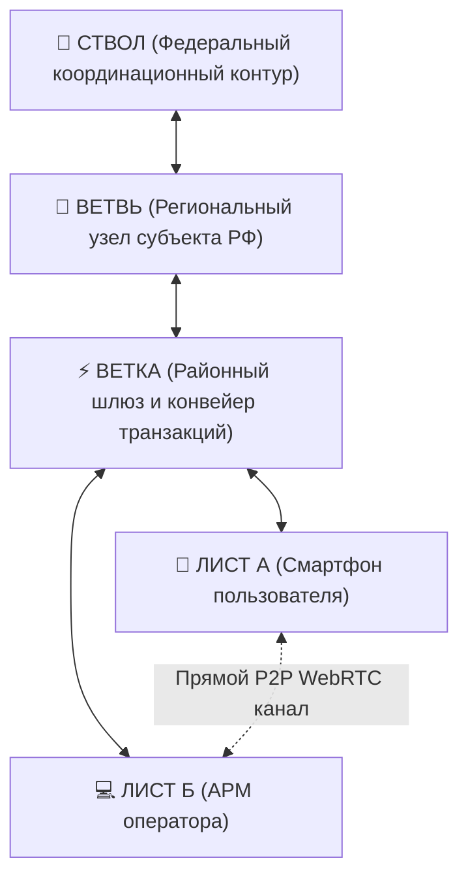
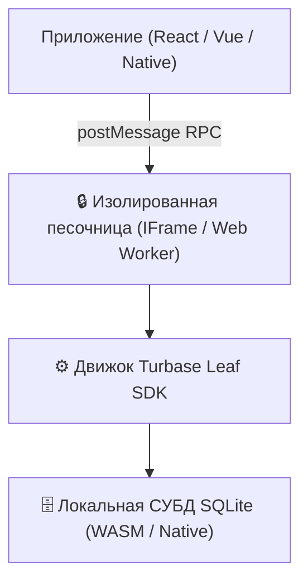
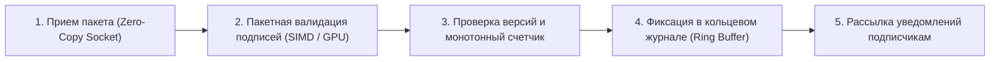
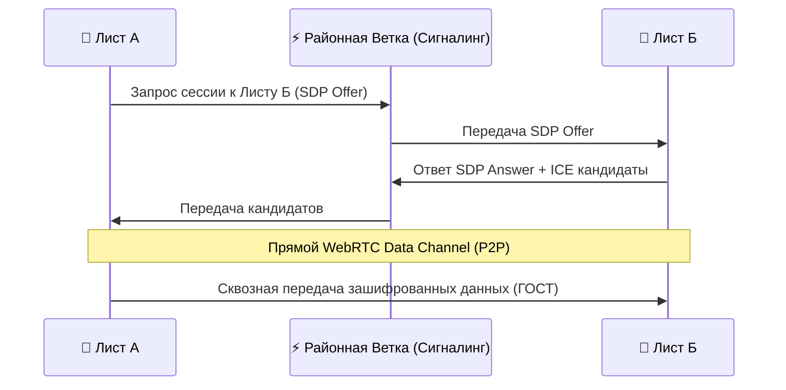

# Инженерная спецификация платформы «Турбаза»

**Белая Книга: Трехуровневая топология, модель AirEntity, Leaf Storage Engine, Branch Pipeline и TreeSearch**  
*Версия: 2.4 (2026)*  
*Статус: Общественная инженерная спецификация*  
*Классификация: Системная архитектура, распределенные СУБД, криптография*  

---

## Аннотация

Настоящий документ содержит детальное техническое описание инженерных компонентов и системных протоколов платформы **«Турбаза»**. Спецификация охватывает модель реляционных данных **AirEntity** с тройным составным первичным ключом, архитектуру встраиваемого движка **Leaf Storage Engine** на базе SQLite в изолированной песочнице, фундаментальный протокол разграничения прав **«Read-Anywhere, Write-Self»**, устройство высокопроизводительного конвейера узла «Ветка» (**Branch Pipeline**), гибридную сквозную маршрутизацию **P2P / WebRTC**, распределенный поисковый движок **TreeSearch** и криптографическую API-экономику.

<!-- pagebreak -->

## Содержание

1. [Общая топология и физическое разделение уровней](#1-общая-топология-и-физическое-разделение-уровней)
2. [Модель данных AirEntity и тройной составной ключ](#2-модель-данных-airentity-и-тройной-составной-ключ)
3. [Leaf Storage Engine: Встраиваемый SQLite и песочница](#3-leaf-storage-engine-встраиваемый-sqlite-и-песочница)
4. [Принцип «Read-Anywhere, Write-Self» и безопасность SDK](#4-принцип-read-anywhere-write-self-и-безопасность-sdk)
5. [Branch Pipeline: Конвейер валидации и фиксации транзакций](#5-branch-pipeline-конвейер-валидации-и-фиксации-транзакций)
6. [Сквозная маршрутизация P2P и трансляция сквозь NAT](#6-сквозная-маршрутизация-p2p-и-трансляция-сквозь-nat)
7. [TreeSearch и Federated OLAP: Аналитика за 3 секунды](#7-treesearch-и-federated-olap-аналитика-за-3-секунды)
8. [Криптографическая безопасность и API-экономика](#8-криптографическая-безопасность-и-api-экономика)
9. [Заключение](#9-заключение)

<!-- pagebreak -->

## 1. Общая топология и физическое разделение уровней

Архитектура «Турбазы» отказывается от плоской топологии P2P-сетей (где каждый узел перегружен чужим трафиком) и централизованных серверных ферм в пользу строгого **иерархического контура**:



### Разделение функциональных обязанностей:
- **Узел Лист:** Первичный генератор транзакций и постоянное место хранения реляционных данных пользователя.
- **Узел Ветка:** Высокопроизводительный конвейер транзакций, проверка криптографических подписей, присвоение глобального порядка транзакций (Sequence Number) и раздача статических индексов.
- **Узел Ствол:** Регистрация глобальных пространств имен схем данных (Хранилищ) и сертификатов удостоверяющих центров.

<!-- pagebreak -->

## 2. Модель данных AirEntity и тройной составной ключ

В традиционных реляционных базах данных каждая таблица использует автоинкрементный суррогатный ключ (`ID INT AUTO_INCREMENT`). В распределенной среде это приводит к неизбежным коллизиям номеров при создании записей на разных автономных устройствах.

В платформе «Турбаза» каждая запись расширяет абстрактный класс **AirEntity** и идентифицируется детерминированным тройным составным ключом:

```
┌─────────────────────────────────────────────────────────────┐
│             СТРУКТУРА ПЕРВИЧНОГО КЛЮЧА AIRENTITY            │
├─────────────────────────────────────────────────────────────┤
│  1. RepositoryId (GUID / Hash)                              │
│     Идентификатор логического хранилища (базы данных).      │
├─────────────────────────────────────────────────────────────┤
│  2. ActorId (GUID / Public Key Hash)                        │
│     Уникальный идентификатор устройства / автора записи.    │
├─────────────────────────────────────────────────────────────┤
│  3. ActorRecordId (BIGINT / Монотонный счетчик)             │
│     Локальный инкрементный счетчик записей данного автора.  │
└─────────────────────────────────────────────────────────────┘
```

### Преимущества композитного ключа:
1. **Создание записей офлайн без коллизий:** Любое устройство создает новые записи с собственным `ActorRecordId`, гарантируя глобальную уникальность строки во всем мире без запроса к серверу.
2. **Бесшовные композитные внешние ключи:** Приложения связывают данные через триплеты (`TargetRepositoryId`, `TargetActorId`, `TargetActorRecordId`), сохраняя ссылочную целостность в локальном SQLite.
3. **Версионирование изменений:** Каждая модификация фиксируется в журнале изменений (WAL) с указанием цифровой подписи конкретного `ActorId`.

<!-- pagebreak -->

## 3. Leaf Storage Engine: Встраиваемый SQLite и песочница

Клиентский движок хранения **Leaf Storage Engine** функционирует непосредственно на пользовательском устройстве:



### Характеристики движка Leaf:
- **Латентность доступа:** Чтение и запись выполняются локально в оперативной памяти и флеш-хранилище устройства за **0.3 – 1.2 мс**.
- **Автономность:** 100% функциональность без подключения к Интернету.
- **Изоляция:** Код сторонних приложений не имеет прямого доступа к файловой системе устройства — все операции проходят строгую фильтрацию в изолированном контексте песочницы.

<!-- pagebreak -->

## 4. Принцип «Read-Anywhere, Write-Self» и безопасность SDK

Безопасность кросс-приложенческого взаимодействия в «Турбазе» обеспечивается фундаментальным правилом:

$$\mathbf{Read\text{-}Anywhere} \quad \wedge \quad \mathbf{Write\text{-}Self}$$

```
┌─────────────────────────────────────────────────────────────┐
│                 ПРАВИЛО РАЗГРАНИЧЕНИЯ ДОСТУПА               │
├──────────────────────────────┬──────────────────────────────┤
│ ОПЕРАЦИЯ ЧТЕНИЯ (SELECT)     │ ОПЕРАЦИЯ ЗАПИСИ (MUTATION)   │
├──────────────────────────────┼──────────────────────────────┤
│ • Свободный SQL-доступ       │ • Запрет прямого SQL INSERT/ │
│ • Быстрые локальные JOIN     │   UPDATE в чужие таблицы     │
│ • Нулевые накладные расходы  │ • Модификация исключительно  │
│ • Аналитика в реальном       │   через вызов официальных    │
│   времени на Листе           │   методов @Api() владельца   │
└──────────────────────────────┴──────────────────────────────┘
```

Декоратор `@Api()` гарантирует, что приложение-владелец валидирует входные параметры, бизнес-правила и права вызывающей стороны перед фиксацией транзакции в хранилище.

<!-- pagebreak -->

## 5. Branch Pipeline: Конвейер валидации и фиксации транзакций

Узел «Ветка» не хранит сырые пользовательские базы, а работает как высокопроизводительный асинхронный конвейер обработки пакетов изменений:



### Производительность конвейера Ветки:
- **Пропускная способность:** До **100 000 транзакций в секунду** на стандартном недорогом 8-ядерном сервере (против 8 000–12 000 TPS у связки Kafka + реляционная СУБД).
- **Пакетная верификация подписей:** Использование векторных инструкций процессора (AVX2/AVX-512) позволяет проверять до 50 000 криптографических подписей Ed25519/ГОСТ в секунду.
- **Минимальное энергопотребление:** Конвейер не производит дорогостоящих операций парсинга SQL на стороне сервера.

<!-- pagebreak -->

## 6. Сквозная маршрутизация P2P и трансляция сквозь NAT

Для передачи объемных медиафайлов (фотографии документов, видеозаписи, архивы) узлы Листья используют прямые P2P-каналы связи без перегрузки магистральных серверов:



Ветка выступает исключительно координатором установления соединения (Signaling & ICE broker), после чего данные идут напрямую между смартфонами пользователей со скоростью локального Wi-Fi или сотовой вышки.

<!-- pagebreak -->

## 7. TreeSearch и Federated OLAP: Аналитика за 3 секунды

Для выполнения поисковых запросов и социологических срезов по миллионам пользователей без создания централизованной базы данных в «Турбазе» разработан движок **TreeSearch**:

```
┌─────────────────────────────────────────────────────────────┐
│                 ДВИЖОК FEDERATED TREESEARCH                 │
├─────────────────────────────────────────────────────────────┤
│ 1. Иерархический запрос:                                    │
│    Ствол отправляет аналитический предикат Ветвям регионов; │
│    Ветви транслируют запрос на Ветки районов.               │
├─────────────────────────────────────────────────────────────┤
│ 2. Локальная свертка на Листьях:                            │
│    Лист вычисляет локальный агрегат и возвращает анонимный  │
│    128-байтный вектор в районный конвейер.                 │
├─────────────────────────────────────────────────────────────┤
│ 3. Слияние снизу вверх:                                     │
│    Каждый узел Ветка производит математическое сложение     │
│    векторов. Итоговый общенациональный срез формируется     │
│    всего за 3 секунды без передачи персональных данных!     │
└─────────────────────────────────────────────────────────────┘
```

<!-- pagebreak -->

## 8. Криптографическая безопасность и API-экономика

Безопасность и экономическая устойчивость платформы поддерживаются встроенными криптографическими алгоритмами:

1. **Отечественные стандарты ГОСТ:** Полная совместимость с ГОСТ Р 34.12-2015 («Кузнечик» / «Магма») для шифрования данных и ГОСТ Р 34.10-2012 для электронных цифровых подписей.
2. **Асимметричная криптография Ed25519:** Быстрые и компактные подписи (64 байта) для мобильных устройств.
3. **Внутренняя API-экономика:** Взаимные расчеты между сервисами за вызовы методов производятся микро-платежами в национальном рублевом контуре (Цифровой рубль). Это исключает спам-атаки и балансирует нагрузку на инфраструктуру по законам теории игр.
4. **Смарт-контракты как минимальные механизмы состояний (FSM):** Финансовая цепь разгружена от тяжелых бизнес-вычислений и обслуживает только базовые переходы состояний и кошельки. Вся богатая бизнес-логика выполняется на Листьях, агрегирующих микро-цепи в локальный реляционный SQL-контур.
5. **Контрактные оболочки-прокси (Wrappers):** Защита финансовой тайны через маскирование номеров кошельков и привязка сменяемых целевых идентификаторов, исключающих риски компрометации мастер-счетов при утере мобильного устройства.

<!-- pagebreak -->

## 9. Заключение

Инженерная архитектура «Турбазы» доказывает возможность построения сверхнадежной, независимой и экономически эффективной цифровой среды:
- Модель **AirEntity** гарантирует отсутствие конфликтов при локальном создании данных.
- Движок **Leaf SQLite** обеспечивает отклик менее 1 мс и 100% офлайн-работу.
- Конвейер **Branch Pipeline** снижает нагрузку на серверы в 10 раз по сравнению с традиционными брокерами сообщений.
- **TreeSearch** открывает эпоху мгновенной федеративной аналитики без риска утечки персональных данных.

---

*Авторы: Инженерный совет разработчиков платформы «Турбаза»*  
*Архитектурное хранилище: [architecture_presentations/](file:///Users/parents/Documents/presentations/architecture_presentations/)*
