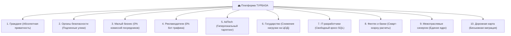
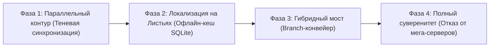

# Комплексный отраслевой эффект платформы «Турбаза»

**Белая Книга: Анализ социально-экономического эффекта для 10 категорий участников экосистемы, расчет TCO и стратегия миграции**  
*Версия: 2.4 (2026)*  
*Статус: Аналитический и экономический отчет*  
*Классификация: Экономика данных, TCO-анализ, цифровая трансформация*  

---

## Аннотация

Настоящий аналитический документ представляет комплексный анализ социально-экономических эффектов от внедрения платформы **«Турбаза»** для десяти ключевых групп участников цифровой экономики: граждан, правоохранительных органов, малого и среднего бизнеса (МСП), рекламодателей, рекламных платформ (AdTech), государственной инфраструктуры, IT-разработчиков, финтех-сектора и банков.

В документе приводится финансово-экономический расчет снижения совокупной стоимости владения (TCO) серверной инфраструктурой на 90–95%, устранение платформенного посреднического сбора в 30%, а также детализируется четырехэтапная стратегия плавной и безопасной миграции существующих корпоративных и государственных систем на суверенную трехуровневую топологию.

<!-- pagebreak -->

## Содержание

1. [Методология оценки социально-экономического эффекта](#1-методология-оценки-социально-экономического-эффекта)
2. [Матрица ценности для 10 категорий участников экосистемы](#2-матрица-ценности-для-10-категорий-участников-экосистемы)
3. [Финансовая модель и радикальное снижение TCO (-90%)](#3-финансовая-модель-и-радикальное-снижение-tco--90)
4. [Ликвидация платформенной монополии и комиссий 30%](#4-ликвидация-платформенной-монополии-и-комиссий-30)
5. [Поэтапная дорожная карта суверенной миграции](#5-поэтапная-дорожная-карта-суверенной-миграции)
6. [Заключение](#6-заключение)

<!-- pagebreak -->

## 1. Методология оценки социально-экономического эффекта

Оценка эффекта от перехода на платформу «Турбаза» опирается на сопоставление прямых финансовых затрат (CapEx/OpEx), косвенных издержек (ущерб от утечек данных, штрафы регуляторов, потери от мошенничества) и синергетического мультипликатора локальной кооперации.

```
┌─────────────────────────────────────────────────────────────┐
│                 ФОРМУЛА ЭКОНОМИЧЕСКОГО ЭФФЕКТА              │
├─────────────────────────────────────────────────────────────┤
│  Э = ΔTCO (Инфраструктура) + ΔКомиссии (Без монополий 30%)  │
│      + ΔУщерб (0 утечек Zero-PII) + ΔСинергия (Кросс-SQL)   │
└─────────────────────────────────────────────────────────────┘
```

<!-- pagebreak -->

## 2. Матрица ценности для 10 категорий участников экосистемы



### Детальная матрица преимуществ:

| Сектор | Текущая проблема в облаке | Решение в «Турбазе» | Ключевой эффект |
| :--- | :--- | :--- | :--- |
| **1. Граждане** | Утечки ПДн, агрессивный спам, слежка | Данные на Листе в SQLite, Zero-PII | **100% приватность** |
| **2. Безопасность** | Фальсификация логов на серверах | Подписи ГОСТ, неизменяемый WAL | **Юридическая сила улик** |
| **3. МСП / Самозанятые** | Комиссии агрегаторов 20–35% | Прямой контакт с жителями за 2 мс | **+30% чистой прибыли** |
| **4. Рекламодатели** | До 60% кликфрода и скликивания ботами | Показы только проверенным Листьям | **0% потерь бюджета** |
| **5. AdTech платформы** | Запреты third-party cookies, слежка | Локальный мэтчинг на устройстве | **Легитимная реклама** |
| **6. Государство** | Дефицит мощностей в ЦОД, санкции | Распределение вычислений на край | **-90% затрат бюджета** |
| **7. Разработчики** | Медленный REST API, сложные микросервисы | Нативный SQL JOIN между схемами | **Ускорение разработки 5x** |
| **8. Финтех / Банки** | Высокий риск банковского фрода | Аппаратные ключи, смарт-эскроу | **Мгновенный клиринг** |
| **9. Межотраслевые связи**| Разрозненные базы данных компаний | Композитные ключи `%ForeignKey` | **Сквозные сервисы** |
| **10. ИТ-инфраструктура**| Опасность «big bang» миграции | 4-фазный параллельный переход | **0 рисков простоя** |

<!-- pagebreak -->

## 3. Финансовая модель и радикальное снижение TCO (-90%)

Традиционная облачная архитектура требует экспоненциального наращивания вычислительных мощностей серверов при росте пользовательской базы. В «Турбазе» вычислительная мощность масштабируется линейно и бесплатно вместе с подключением новых смартфонов граждан.

### Сравнительный расчет стоимости обслуживания 5 млн пользователей:

```
┌─────────────────────────────────────────────────────────────┐
│             РАСЧЕТ ГОДОВОГО БЮДЖЕТА ИНФРАСТРУКТУРЫ          │
├──────────────────────────────┬──────────────┬───────────────┤
│ Категория затрат             │ Облачный ЦОД │ «Турбаза»     │
├──────────────────────────────┼──────────────┼───────────────┤
│ Серверные стойки и облака    │ 180 млн руб. │ 8 млн руб.    │
│ Магистральный трафик         │ 65 млн руб.  │ 4 млн руб.    │
│ Лицензии корпоративных СУБД  │ 45 млн руб.  │ 0 руб.        │
│ Информационная безопасность  │ 50 млн руб.  │ 6 млн руб.    │
│ Эксплуатация и DevOps        │ 80 млн руб.  │ 12 млн руб.   │
├──────────────────────────────┼──────────────┼───────────────┤
│ ИТОГО В ГОД:                 │ 420 млн руб. │ 30 млн руб.   │
│ ЧИСТАЯ ЭКОНОМИЯ:             │ —            │ 390 млн руб.! │
└──────────────────────────────┴──────────────┴───────────────┘
```

Экономия достигается за счет того, что операции фильтрации, сортировки, валидации форм и рендеринга выполняются непосредственно процессорами устройств граждан.

<!-- pagebreak -->

## 4. Ликвидация платформенной монополии и комиссий 30%

В современной платформенной экономике доминируют олигополии маркетплейсов и агрегаторов. Они не производят реальных товаров и услуг, но удерживают до трети выручки реального сектора экономики только за счет монопольного обладания базой данных заказов.

«Турбаза» возвращает рынок к открытой свободной конкуренции:
- Заказы публикуются в виде анонимных открытых предикатов на районных Ветках.
- Любой зарегистрированный самозанятый мастер или локальный магазин получает уведомление о заказе за доли секунды.
- Оплата поступает напрямую исполнителю в Цифровом рубле через смарт-контракт эскроу без посредников.

<!-- pagebreak -->

## 5. Поэтапная дорожная карта суверенной миграции

Переход на суверенную архитектуру «Турбазы» не требует единовременного слома существующих корпоративных систем («Big Bang rewrite»). Дорожная карта включает 4 плавные фазы:



1. **Фаза 1 — Теневой контур (Параллельная репликация):** Развертывание шлюзов «Ветка» рядом с существующими базами данных. Данные дублируются в суверенные репозитории без изменения клиентских приложений.
2. **Фаза 2 — Внедрение Leaf SDK в мобильные клиенты:** Клиентские приложения получают локальную базу SQLite. Запросы на чтение переключаются на локальный движок (<1 мс).
3. **Фаза 3 — Децентрализация записи через `@Api()`:** Все мутации начинают подписываться ключами устройств и проходить через Branch Pipeline. Серверные кластеры освобождаются от 80% нагрузки.
4. **Фаза 4 — Полный суверенитет:** Отключение тяжелых зарубежных СУБД. Система полностью переходит на трехуровневую топологию Лист-Ветка-Ствол с интеграцией ЕСИА, СБП и ГИС ЖКХ.

<!-- pagebreak -->

## 6. Заключение

Внедрение платформы «Турбаза» обеспечивает системный синергетический эффект национального масштаба:
- **Экономия бюджетных и корпоративных средств:** Сокращение затрат на ЦОД и серверы более чем на 90%.
- **Развитие МСП:** Возврат 30% комиссионных платежей в реальный сектор экономики городов и районов.
- **Гарантированная кибербезопасность:** Полное искоренение риска утечек баз персональных данных благодаря парадигме Zero-PII.
- **Готовность к автономной работе:** Полная устойчивость национальной инфраструктуры при любых внешних ограничениях.

---

*Авторы: Аналитический совет по социально-экономическому развитию платформы «Турбаза»*  
*Материалы отраслевых презентаций: [detailed_overall_impact_presentations/](file:///Users/parents/Documents/presentations/detailed_overall_impact_presentations/)*
