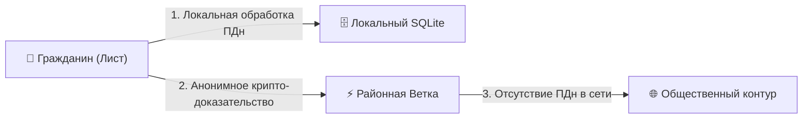
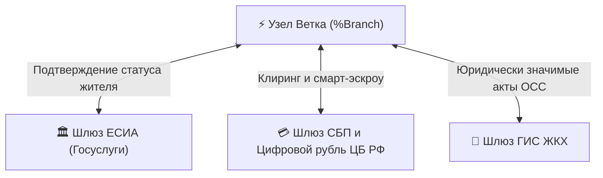

# Государственно-правовое регулирование и суверенитет данных платформы «Турбаза»

**Белая Книга: Соответствие 152-ФЗ, архитектура Zero-PII, государственные шлюзы ЕСИА/СБП/ГИС ЖКХ и стандарты БРИКС+**  
*Версия: 2.4 (2026)*  
*Статус: Правовой и регуляторный меморандум*  
*Классификация: Государственное регулирование, кибербезопасность, доверенные вычисления*  

---

## Аннотация

Настоящий регуляторный документ формулирует государственно-правовые основы применения платформы **«Турбаза»** в качестве национального стандарта суверенных распределенных вычислений. Документ содержит строгое правовое обоснование концепции **Zero-PII** в свете требований Федерального закона № 152-ФЗ «О персональных данных», регламентирует механизмы защиты тайны частной жизни и коммерческой тайны, описывает архитектуру сертифицированных государственных шлюзов (ЕСИА / Госуслуги, СБП, платформа Цифрового рубля, ГИС ЖКХ) и определяет контур интероперабельности союза БРИКС+.

<!-- pagebreak -->

## Содержание

1. [Правовой кризис облачных баз данных и вызовы 152-ФЗ](#1-правовой-кризис-облачных-баз-данных-и-вызовы-152-фз)
2. [Концепция Zero-PII: Архитектурное соответствие закону](#2-концепция-zero-pii-архитектурное-соответствие-закону)
3. [Интеграция с государственными системами через Branch-шлюзы](#3-интеграция-с-государственными-системами-через-branch-шлюзы)
4. [Правовой статус электронных доказательств и подписей ГОСТ](#4-правовой-статус-электронных-доказательств-и-подписей-гост)
5. [Суверенный шлюз БРИКС+: Трансграничное доверие без гегемонии](#5-суверенный-шлюз-брикс-трансграничное-доверие-без-гегемонии)
6. [Заключение](#6-заключение)

<!-- pagebreak -->

## 1. Правовой кризис облачных баз данных и вызовы 152-ФЗ

Ежегодно в Российской Федерации фиксируются сотни крупных утечек персональных данных. Причина этих инцидентов носит не человеческий, а фундаментально **архитектурный характер**: централизованные облачные хранилища представляют собой привлекательную единую мишень для злоумышленников и иностранных разведок.

Традиционные регуляторные меры (наложение оборотных штрафов, обязательная сертификация ЦОД) исчерпали свою эффективность, поскольку концентрация терабайтов данных в одном месте физически провоцирует атаки.

```
┌─────────────────────────────────────────────────────────────┐
│                 АРХИТЕКТУРНЫЙ ТУПИК ОБЛАКОВ                 │
├──────────────────────────────┬──────────────────────────────┤
│ Классический ЦОД             │ Платформа «Турбаза»          │
├──────────────────────────────┼──────────────────────────────┤
│ 100 000 000 записей в одной  │ Данные децентрализованы:     │
│ централизованной таблице БД. │ 1 запись на 1 личном Листе.  │
│ Ошибка сисадмина ведет к     │ Взлом отдельного узла Листа  │
│ компрометации всей страны.   │ раскрывает данные только     │
│                              │ одного этого устройства.     │
└──────────────────────────────┴──────────────────────────────┘
```

<!-- pagebreak -->

## 2. Концепция Zero-PII: Архитектурное соответствие закону

Платформа «Турбаза» снимает противоречие между доступностью цифровых сервисов и требованиями 152-ФЗ за счет модели **Zero-PII (Нулевой объем передаваемых персональных данных)**:



### Юридический статус данных в «Турбазе»:
1. **Персональные данные не покидают владение субъекта:** Обработка ФИО, паспортных данных, адреса проживания и биометрии происходит исключительно внутри защищенной локальной среды устройства гражданина (ст. 6 и 9 152-ФЗ).
2. **Внешние узлы не являются операторами персональных данных:** Районные узлы «Ветка» и координационный узел «Ствол» оперируют исключительно математическими векторами (ZKP, хэши подписей, агрегаты), которые не позволяют идентифицировать личность гражданина без закрытого ключа на его личном устройстве.
3. **Исключение оборотных штрафов:** Организации и разработчики прикладных сервисов на базе SDK «Турбазы» полностью защищены от рисков утечек персональных данных, так как они физически не аккумулируют базы данных клиентов.

<!-- pagebreak -->

## 3. Интеграция с государственными системами через Branch-шлюзы

Платформа не противопоставляется государственным информационным системам, а органично дополняет их, разгружая магистральные каналы и обеспечивая высший уровень доверия:



### 1. Шлюз ЕСИА (Госуслуги):
- Однократная связка учетной записи ЕСИА с открытым ключом Листа гражданина.
- Выдача криптографического билета жителя конкретного района/дома.
- Полная анонимность голосов при 100% подтверждении факта проживания гражданина.

### 2. Шлюз СБП и Цифровой рубль ЦБ РФ:
- Прямое проведение расчетов между гражданами и локальным бизнесом (МСП).
- Использование смарт-контрактов эскроу Банка России для автоматического расчета при наступлении условий приемки работ.
- Нулевые комиссии и исключение зарубежных эквайринговых провайдеров.

### 3. Шлюз ГИС ЖКХ:
- Интеграция с модулями электронного голосования собственников многоквартирных домов.
- Формирование юридически легитимных протоколов Общих собраний собственников (ОСС) по ГОСТ Р 34.10-2012 без риска подделки подписей управляющими компаниями.

<!-- pagebreak -->

## 4. Правовой статус электронных доказательств и подписей ГОСТ

Любое юридически значимое действие в платформе «Турбаза» сопровождается формированием криптографического акта:
- Подписание транзакций усиленной квалифицированной электронной подписью (УКЭП) по отечественным стандартам **ГОСТ Р 34.10-2012** и **ГОСТ Р 34.12-2015**.
- Неизменяемость истории в распределенном журнале (WAL), заверенном последовательными временными метками доверенных узлов «Ветка».
- Признание транзакций в судах РФ в качестве непреложных цифровых доказательств в соответствии с Федеральным законом № 63-ФЗ «Об электронной подписи».

<!-- pagebreak -->

## 5. Суверенный шлюз БРИКС+: Трансграничное доверие без гегемонии

В рамках союза государств БРИКС+ платформа «Турбаза» предоставляет архитектурный базис для создания трансграничного доверенного пространства данных:

```
┌─────────────────────────────────────────────────────────────┐
│                 МЕЖГОСУДАРСТВЕННЫЙ ШЛЮЗ БРИКС+              │
├─────────────────────────────────────────────────────────────┤
│ 1. Равноправие участников:                                  │
│    Каждое суверенное государство развертывает собственный   │
│    национальный Ствол (%Trunk) и управляет своей сетью.     │
├─────────────────────────────────────────────────────────────┤
│ 2. Взаимное признание электронных подписей:                 │
│    Федеративные шлюзы обеспечивают кросс-валидацию цифровых │
│    сертификатов участников международной торговли.          │
├─────────────────────────────────────────────────────────────┤
│ 3. Расчеты в национальных цифровых валютах:                 │
│    Клиринг контрактов между контрагентами из РФ, Китая,     │
│    Индии, Бразилии и ЮАР без использования SWIFT.           │
└─────────────────────────────────────────────────────────────┘
```

<!-- pagebreak -->

## 6. Заключение

Платформа «Турбаза» формирует нормативно-технический базис подлинного цифрового суверенитета:
1. **Полное соответствие законодательству РФ:** Выполнение требований 152-ФЗ, 63-ФЗ и Доктрины информационной безопасности РФ.
2. **Гарантия защиты от утечек:** Ликвидация централизованных массивов персональных данных исключает риски массового компрометирования граждан.
3. **Бесшовная гармонизация с госсистемами:** Сертифицированные Branch-адаптеры ЕСИА, СБП и ГИС ЖКХ связывают платформу с национальной инфраструктурой.
4. **Геополитическая независимость:** Готовность к развертыванию суверенных межгосударственных узлов в контуре БРИКС+.

---

*Авторы: Правовой совет и рабочая группа по нормативному регулированию платформы «Турбаза»*  
*Мастер-обзоры и документы: [overall_presentations/](file:///Users/parents/Documents/presentations/overall_presentations/)*
