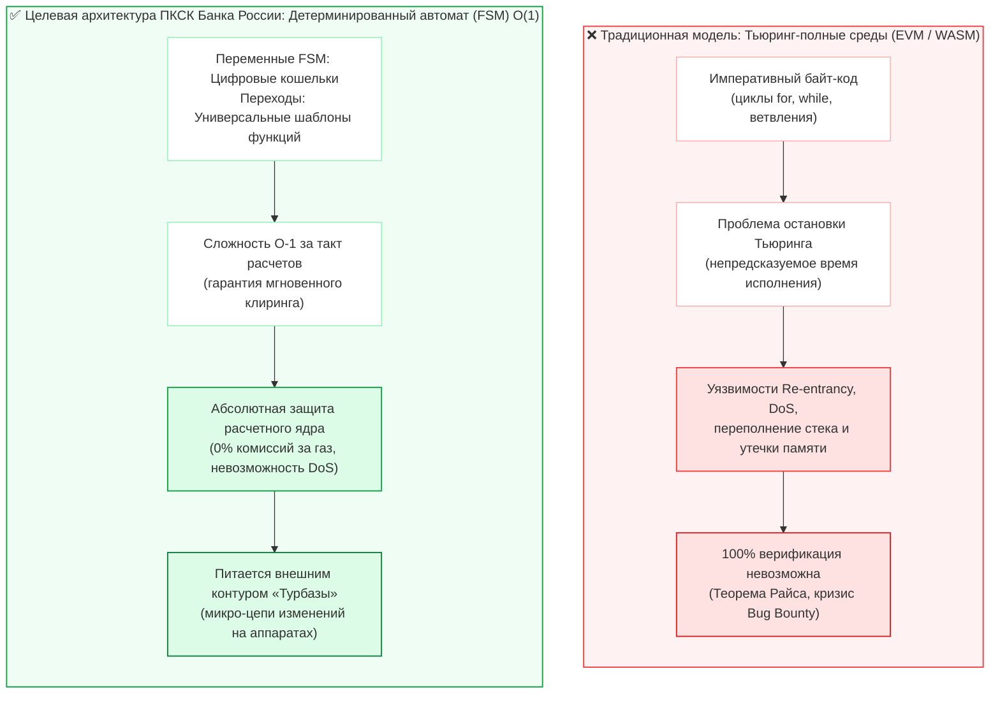
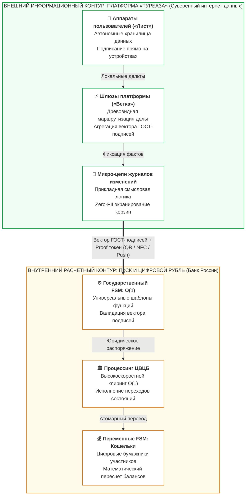
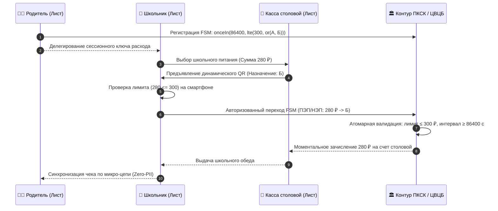
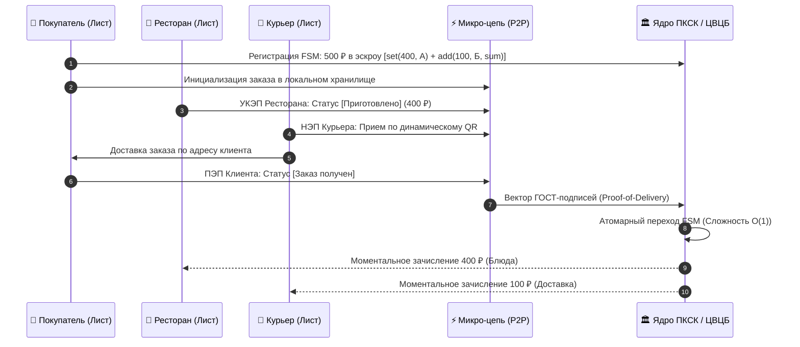
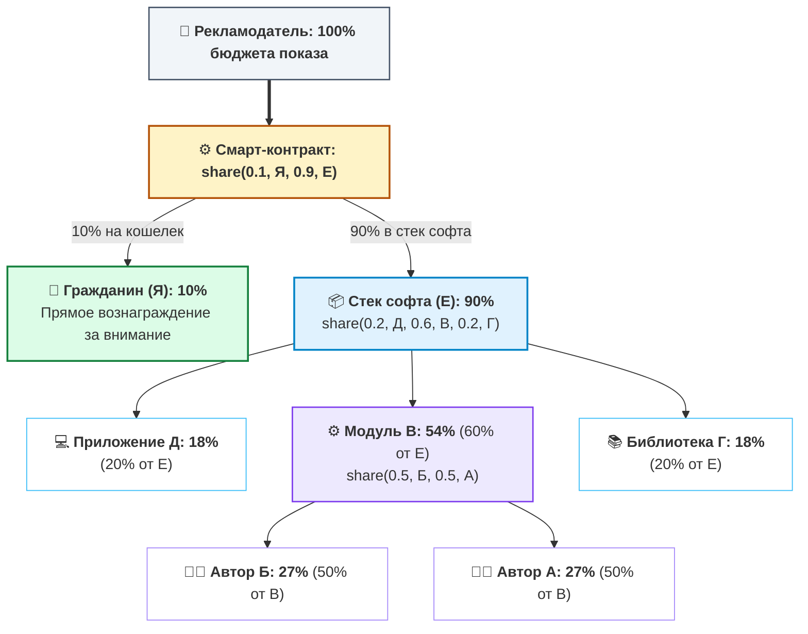
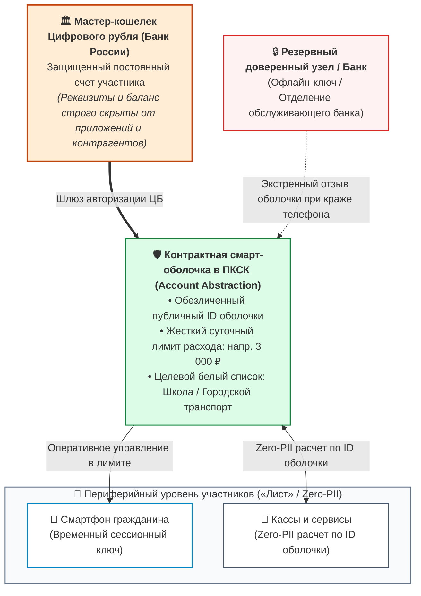
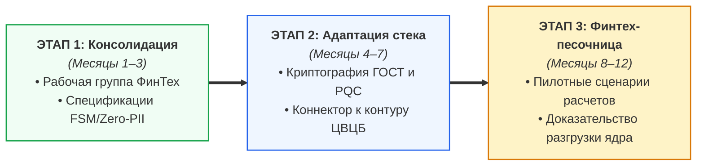

# Архитектура национальной платформы коммерческих смарт-контрактов: Детерминированные конечные автоматы (FSM), распределенный внешний контур и суверенная экономика API

**Научно-практическое экспертное заключение на проект Банка России «Концепция платформы коммерческих смарт-контрактов» (ПКСК)**  
*Классификация: Национальная цифровая платежная инфраструктура, Цифровой рубль, Суверенные вычисления (Zero-PII), Информационная безопасность*  
*Автор: Артём Владимирович Шамсутдинов, разработчик платформы «Турбаза» — интернет суверенных и частных данных / Открытый стек AIRport* ([https://github.com/beyond-decentralized/AIRport](https://github.com/beyond-decentralized/AIRport))  
*Методология подготовки: Концептуальное видение, принципы и базовые направления сформированы автором; детальная научно-техническая проработка, формализация и подготовка документа выполнены искусственным интеллектом под руководством автора.*

---

## Аннотация

Настоящий научно-практический документ (Whitepaper) подготовлен в качестве официального экспертного отзыва на опубликованную Банком России в 2026 году *«Концепцию платформы коммерческих смарт-контрактов»*.

Основная цель документа — содействовать Банку России и российскому финансовому рынку в создании сверхнадежной, масштабируемой и безопасной национальной платформы смарт-контрактов. Документ опирается на методологию Банка международных расчетов (BIS): строгое разграничение концепций **«Programmable Money»** (несущей риски фрагментации денежной массы и появления суррогатов) и **«Programmable Payments»** (условных расчетов без искажения природы суверенной валюты по ст. 75 Конституции РФ).

Автор показывает Банку России, что при наличии внешних платформ данных, работающих как **«Турбаза»** (интернет суверенных и частных данных: древовидные структуры шлюзов и аппаратов пользователей, автономно обрабатывающих локальные хранилища как микро-цепи журналов изменений с криптографическим подписанием прямо на устройствах), функция государственной платформы смарт-контрактов (ПКСК) может быть сведена к **детерминированному конечному автомату (FSM) O(1)**. Этот государственный FSM производит математические вычисления между переменными — цифровыми кошельками участников, используя универсальные шаблоны функций, тогда как связывание их прикладной смысловой логикой осуществляют приложения во внешнем контуре. Документ содержит развернутые ответы на 7 официальных вопросов ЦБ РФ и предложение совместного пилота в Финтех-песочнице.

<!-- pagebreak -->

## Содержание

<div class="toc-container">
  <div class="toc-row"><span class="toc-title">1. <a href="#1-официальное-обращение-к-банку-россии-и-преамбула" class="doc-link">Официальное обращение к Банку России и преамбула</a></span><span class="toc-page">Стр. 3</span></div>
  <div class="toc-row"><span class="toc-title">2. <a href="#2-архитектурный-вызов-ловушка-тьюринг-полноты-evm-vs-детерминированный-конечный-автомат-fsm" class="doc-link">Архитектурный вызов: Ловушка Тьюринг-полноты (EVM) vs Конечные автоматы (FSM)</a></span><span class="toc-page">Стр. 4</span></div>
  <div class="toc-row"><span class="toc-title">3. <a href="#3-двухконтурная-архитектура-внутренний-расчетный-и-внешний-информационный-контуры" class="doc-link">Двухконтурная архитектура: «Внутренний расчетный» и «Внешний информационный» контуры</a></span><span class="toc-page">Стр. 5</span></div>
  <div class="toc-row"><span class="toc-title">4. <a href="#4-математический-аппарат-минимальных-fsm-контрактов-и-прикладные-сценарии" class="doc-link">Математический аппарат минимальных FSM-контрактов и прикладные сценарии</a></span><span class="toc-page">Стр. 6</span></div>
  <div class="toc-row" style="padding-left: 14px;"><span class="toc-title">4.1. <a href="#41-целевые-социальные-выплаты-и-школьное-питание-конфиденциальность-без-слежки" class="doc-link">Целевые социальные выплаты и школьное питание: Zero-PII</a></span><span class="toc-page">Стр. 7</span></div>
  <div class="toc-row" style="padding-left: 14px;"><span class="toc-title">4.2. <a href="#42-b2cb2b-безопасная-сделка-для-мсп-p2p-консенсус-без-тяжелых-гис" class="doc-link">B2C/B2B «Безопасная сделка» для МСП: P2P-консенсус и Proof-of-Delivery</a></span><span class="toc-page">Стр. 8</span></div>
  <div class="toc-row" style="padding-left: 14px;"><span class="toc-title">4.3. <a href="#43-рекурсивное-распределение-выручки-разработчиков-и-прямое-вознаграждение-пользователя" class="doc-link">Сплитование выручки по Вектору Шепли share(...) и налоговое агентирование</a></span><span class="toc-page">Стр. 9</span></div>
  <div class="toc-row"><span class="toc-title">5. <a href="#5-информационная-безопасность-абстракция-учетных-записей-и-защита-кошельков" class="doc-link">Информационная безопасность, абстракция учетных записей и защита кошельков</a></span><span class="toc-page">Стр. 10</span></div>
  <div class="toc-row" style="padding-left: 14px;"><span class="toc-title">5.1. <a href="#51-контрактные-оболочки-wrappers-и-двухуровневая-модель-комплаенса-115-фз-vs-152-фз" class="doc-link">Контрактные оболочки (Wrappers) и изоляция реквизитов</a></span><span class="toc-page">Стр. 10</span></div>
  <div class="toc-row" style="padding-left: 14px;"><span class="toc-title">5.2. <a href="#52-сменяемые-прокси-оболочки-при-компрометации-клиентских-аппаратов" class="doc-link">Сменяемые прокси-оболочки при утере устройств</a></span><span class="toc-page">Стр. 10</span></div>
  <div class="toc-row" style="padding-left: 14px;"><span class="toc-title">5.3. <a href="#53-100-формальная-верификация-fsm-против-кризиса-bug-bounty" class="doc-link">100% формальная верификация FSM против кризиса Bug Bounty</a></span><span class="toc-page">Стр. 11</span></div>
  <div class="toc-row" style="padding-left: 14px;"><span class="toc-title">5.4. <a href="#54-постквантовая-криптографическая-защита-pqc-на-горизонте-50-лет" class="doc-link">Постквантовая криптографическая защита (ТК 26 / PQC)</a></span><span class="toc-page">Стр. 11</span></div>
  <div class="toc-row"><span class="toc-title">6. <a href="#6-развернутые-экспертные-ответы-на-7-вопросов-банка-россии" class="doc-link">Развернутые экспертные ответы на 7 вопросов Банка России</a></span><span class="toc-page">Стр. 12</span></div>
  <div class="toc-row"><span class="toc-title">7. <a href="#7-предложение-о-сотрудничестве-и-дорожная-карта-совместного-пилотирования" class="doc-link">Предложение о сотрудничестве и дорожная карта совместного пилотирования</a></span><span class="toc-page">Стр. 15</span></div>
</div>

## Ключевые архитектурные показатели (Executive Scorecard)

<div class="scorecard-grid">
  <div class="scorecard-card">
    <div class="scorecard-metric">O(1)</div>
    <div class="scorecard-title">Детерминизм и защита ядра ПКСК (FSM)</div>
    <div class="scorecard-desc">
      Сведение ядра ПКСК к конечному автомату O(1) над переменными цифровых кошельков. Расчеты по универсальным шаблонам функций без циклов, газа и уязвимостей Тьюринг-полноты.
    </div>
  </div>
  <div class="scorecard-card">
    <div class="scorecard-metric">-90% ЦОД</div>
    <div class="scorecard-title">Разгрузка ядра платформой «Турбаза»</div>
    <div class="scorecard-desc">
      Вынос прикладной логики и хранилищ на аппараты пользователей («Турбаза» / микро-цепи). В ядро ЦБ передается лишь O(1) вектор криптографических подписей по 63-ФЗ.
    </div>
  </div>
  <div class="scorecard-card">
    <div class="scorecard-metric">share(...)</div>
    <div class="scorecard-title">Справедливое роялти по Вектору Шепли</div>
    <div class="scorecard-desc">
      Алгоритмическое сплитование микроплатежей между разработчиками модулей и пользователями. Встроенное налоговое агентирование (13% НДФЛ / 4–6% НПД) и 0% за эквайринг.
    </div>
  </div>
</div>

<!-- pagebreak -->

## 1. Официальное обращение к Банку России и преамбула

**В Департамент финансовых технологий Центрального банка Российской Федерации**  
*На консультативный документ «Концепция платформы коммерческих смарт-контрактов» (2026 г.)*

Уважаемые коллеги!

Разработка и запуск Платформы цифрового рубля стали важнейшим шагом в укреплении суверенитета и технологической независимости национальной платежной системы. Публикация Банком России *«Концепции платформы коммерческих смарт-контрактов» (ПКСК)* открывает новый этап — переход от изолированных базовых переводов к созданию открытой программируемой финансовой среды, объединяющей граждан, бизнес, финансовые организации и независимых ИТ-разработчиков.

В настоящем экспертном отзыве выражается искренняя поддержка инициативе Банка России. Документ подготовлен разработчиком платформы **«Турбаза» — интернет суверенных и частных данных** — **Артёмом Владимировичем Шамсутдиновым**. Автор задал концептуальное направление, базовую архитектурную модель и ключевые принципы системы, тогда как детальная научно-техническая проработка, математическая формализация и подготовка аналитического текста произведены искусственным интеллектом под его непосредственным руководством. Центр клиентского реляционного движка («Лист») открыт сообществу в репозитории **AIRport (Application Information Repository Port)**:  
👉 [https://github.com/beyond-decentralized/AIRport](https://github.com/beyond-decentralized/AIRport).

Главная цель настоящего экспертного заключения — предостеречь регулятора от повторения ошибок зарубежных центробанков (включая проект Digital Pound Lab Банка Англии на Hyperledger Besu) и опереться на выводы совместных исследований **BIS Project Rosalind** и Сингапурского **Project Orchid (MAS)**: смарт-контракт должен быть безопасным внешним условием платежа (Programmable Payments), а не монолитным Тьюринг-полным кодом в ядре эмиссии.

Автор демонстрирует, что при взаимодействии с внешними распределенными платформами суверенных данных (такими как «Турбаза») государственная платформа смарт-контрактов Банка России может быть сведена к минимальному **детерминированному конечному автомату (FSM) O(1)**. Расчетное ядро выполняет элементарные математические переходы между переменными цифровых кошельков по универсальным функциональным шаблонам, тогда как вся богатая прикладная смысловая логика исполняется во внешних микро-цепях на устройствах участников.

> **🏛️ Фундаментальные принципы экспертного отзыва:**
> 1. **Programmable Payments вместо Programmable Money:** Сохранение конституционного статуса цифрового рубля как единственного и неделимого расчетного средства (ст. 75 Конституции РФ, ст. 27 86-ФЗ) без фрагментации ликвидности и выпуска квазивалютных суррогатов;
> 2. **Принцип Zero-PII и банковская тайна (152-ФЗ, ст. 26 395-1):** Расчетное ядро Банка России полностью освобождается от накопления товарных корзин, чеков и персональных сведений граждан;
> 3. **Безотзывность и окончательность расчетов (161-ФЗ):** Сложность O(1) за такт гарантирует соблюдение моментов наступления окончательности (ч. 10 ст. 5) и исключает аукционы комиссий Gas;
> 4. **Интеграция с рынком ЦФА (259-ФЗ):** Архитектура ПКСК как межоператорского шлюза DvP («поставка против платежа») без расчетного риска Херштатта.

<!-- pagebreak -->

## 2. Архитектурный вызов: Ловушка Тьюринг-полноты (EVM) vs Детерминированный конечный автомат (FSM)

В разделе 1 Концепции Банка России подробно анализируется международный опыт реализации смарт-контрактов (Китай, Великобритания, Гонконг, Австралия, Сингапур). При этом регулятор отмечает, что проект Банка Англии использует платформу смарт-контрактов на базе блокчейна **Hyperledger Besu (EVM)**, а в разделе 7 фиксирует критические риски:
> *«Риски: высокая нагрузка на инфраструктуру ввиду неоптимального кода разработчика... размещение недобросовестными разработчиками смарт-контрактов с уязвимостями...»* (Концепция ЦБ РФ, с. 21).

Необходимо подчеркнуть: **эти риски являются прямым и неизбежным следствием Тьюринг-полноты виртуальных машин (EVM / WASM)**.



Фундаментальная неприменимость Тьюринг-полных сред в государственном платежном контуре доказана строго:
* **Теорема Райса и Проблема остановки:** Семантические свойства произвольного императивного кода алгоритмически неразрешимы — аудит и Bug Bounty не способны исключить логические дедлоки и реентрантность (The DAO $60 млн, мосты Wormhole $326 млн, Ronin $624 млн).
* **Несовместимость Gas со ст. 5, 8 161-ФЗ:** Аукционы комиссий, MEV-манипуляции и сбои `Out of Gas` нарушают юридический момент наступления безотзывности (ч. 7) и окончательности (ч. 10) перевода, генерируя операционный риск по Положению № 716-П и срывая регламент бесперебойности № 779-П (RTO ≤ 2 ч).
* **Уроки BIS Project Rosalind:** Опыт Банка Англии доказал: ядро CBDC должно исполнять лишь стандартизированные атомарные инструкции, вынося сложную логику во внешний прикладной периметр.

**Вывод:** Государственная платформа коммерческих смарт-контрактов (ПКСК) Банка России должна строиться строго на **детерминированных конечных автоматах (FSM) со сложностью O(1)** над переменными цифровых кошельков, опираясь на внешние платформы суверенных данных для выноса прикладной сложности.

<!-- pagebreak -->

## 3. Двухконтурная архитектура: «Внутренний расчетный» и «Внешний информационный» контуры

В основе архитектуры лежит строгое разделение ответственности:



### Принципы распределения функций:
1. **Внутренний расчетный контур (ПКСК и Цифровой рубль ЦБ РФ):**
   * Обслуживает государственный детерминированный FSM со сложностью O(1), где переменные — цифровые кошельки участников, а переходы — универсальные функции.
   * Не хранит товарных номенклатур, чеков, сканов актов, переписки сторон и персональных данных.
   * Обеспечивает гарантированный SLA расчетов (сотни тысяч TPS) без риска перегрузки ЦОД и уязвимостей Тьюринг-полноты.
2. **Внешний информационный контур («Турбаза» / открытый стек AIRport):**
   * Древовидная сеть шлюзов и аппаратов участников, автономно обрабатывающих хранилища как микро-цепи изменений с локальным подписанием.
   * Реализует прикладную смысловую логику приложений (заказы, корзины, контракты), связывающую вызовы расчетных функций.
   * Гарантирует принцип минимизации обработки (ст. 5 152-ФЗ Zero-PII): в ядро ЦБ направляется лишь O(1) вектор ГОСТ-подписей по 63-ФЗ.

<!-- pagebreak -->

## 4. Математический аппарат минимальных FSM-контрактов и прикладные сценарии

В расчетном контуре ПКСК Банка России смарт-контракт формализуется как **детерминированный автомат Мили (Deterministic Mealy Machine)**:

$$M = \langle Q, \Sigma, \Delta, \delta, \lambda, q_0, F \rangle$$

где:
* **$Q$** — вектор **переменных FSM (цифровых кошельков/оболочек)** участников: $Q \subseteq \mathbb{R}^n_{\ge 0} \times \mathcal{M}$;
* **$\Sigma$** — входной алфавит: вектор подписей ГОСТ (63-ФЗ) из внешних микро-цепей «Турбазы» и предикатов;
* **$\Delta$** — выходной алфавит: атомарные распоряжения на клиринг в платформе ЦБ (Указание № 6497-У);
* **$\delta: Q \times \Sigma \to Q$** — функция переходов, построенная из **универсальных шаблонов функций**;
* **$\lambda: Q \times \Sigma \to \Delta$** — выходная функция финансовых списаний между переменными-кошельками;
* **$q_0 \in Q$** — начальное состояние распределения средств (эскроу / лимит);
* **$F \subseteq Q$** — множество терминальных состояний (клиринг завершен / возврат по таймауту).

Прикладная смысловая логика, связывающая события сделки и вызовы функций FSM, реализуется приложениями в микро-цепях участников.

**Алгебраические свойства и инварианты:**
1. **Моноид переходов и замкнутость:** Множество отображений переходов образует конечный моноид относительно композиции. Композиция примитивов замкнута в классе автоматов Мили, исключая побочные эффекты.
2. **Балансовый инвариант (Safety):** $\forall t \ge 0: \sum \text{Assets}_{\text{Input}} \equiv \sum \text{Assets}_{\text{Output}} + \text{Escrow}_t$.
3. **Отсутствие зависаний (Liveness):** Для любого состояния гарантирован детерминированный возврат по таймауту TrueTime: $\delta(S, \text{Timeout}) = S_{\text{Refund}}$.

| Категория | Функция / Примитив | Семантическое назначение | Сложность |
| :--- | :--- | :--- | :---: |
| **Время** | `onceIn(seconds, condition)` | Квантование частоты операций по TrueTime | O(1) |
| **Лимиты** | `lte(a, b)`, `gte(a, b)` | Проверка числовых ограничений: a ≤ b и a ≥ b | O(1) |
| **Предикаты** | `or(a, b)`, `and(a, b)` | Дизъюнкция и конъюнкция адресов / условий | O(1) |
| **Баланс** | `set(amount, account)` | Инициализация баланса или эскроу-счета | O(1) |
| **Агрегация** | `add(amount, account, target)` | Накопительное сложение финансовых обязательств | O(1) |
| **Роялти** | `share(r1, a1, r2, a2, ...)` | Рекурсивное сплитование микроплатежей | O(1) |

Каждый примитив имеет строго доказанную сложность O(1), не содержит циклов и верифицируется SMT-сольверами до публикации.

<!-- pagebreak -->

### 4.1. Целевые социальные выплаты и школьное питание: Конфиденциальность без слежки

В Концепции (с. 6–7) Банк России приводит успешные пилоты 2025 года в Чувашии и Татарстане по целевым выплатам на школьное питание и форму. Однако в классической схеме возникает дилемма: либо банк видит детальную номенклатуру каждой покупки ребенка (нарушение тайны частной жизни), либо контроль расходования является формальным.

**Сценарий на базе FSM Банка России и внешнего контура «Турбаза»:**
Родитель формирует смарт-контракт целевых школьных расходов из универсальных функциональных шаблонов:
```
onceIn(86400, lte(300, or(А, Б)))
```
Где:
* `onceIn(86400, ...)` — условие: расходование разрешено не чаще одного раза в 24 часа;
* `lte(300, ...)` — лимит: сумма транзакции не превышает 300 рублей;
* `or(А, Б)` — абстрактные адреса-заполнители целевого назначения: **А** — школьный завтрак, **Б** — комплексный обед.



**Преимущества подхода:**
1. **Абсолютная конфиденциальность (152-ФЗ Zero-PII):** Регулятор и банк видят только факт списания средств по правилу **Б**. Состав блюд и калораж остаются строго в приватной микро-цепи семьи и школы.
2. **Казначейский надзор (ст. 242.14 БК РФ):** Лимит 300 ₽ резервирует право расхода целевой субсидии. В 23:59:59 неиспользованный остаток обнуляется, исключая нецелевое использование и блокировку средств.
3. **Кэширование шаблонов и офлайн-устойчивость:** Хэш контракта регистрируется один раз в ЦБ, а локальная микро-цепь кассы обеспечивает расчеты даже при временном сбое связи с процессингом.

<!-- pagebreak -->

### 4.2. B2C/B2B «Безопасная сделка» для МСП: P2P-консенсус без тяжелых ГИС

В Концепции (с. 16–17) ЦБ указывает, что безопасные сделки должны опираться на государственные ГИС (Росреестр, ГИБДД) или крупные коммерческие платформы. Но как подключить к смарт-контрактам миллионы субъектов малого бизнеса (рестораны, курьерские службы, репетиторов, ремонтные бригады)? Интеграция каждой кофейни со СМЭВ технически и экономически нереализуема.

**Сценарий на базе FSM Банка России и внешнего контура «Турбаза» (Кейс: Доставка еды):**  
Заказ формируется в микро-цепи журнала изменений автономного хранилища, синхронизируемого на аппаратах трех участников: покупатель открывает хранилище на смартфоне, ресторан **А** подтверждает статус `Приготовлено`, курьер **Б** — `Доставлен`, покупатель **Я** — `Получено`. Все подписи формируются прямо на устройствах. В ядре ПКСК Банка России конечный автомат выполняет элементарные расчеты между переменными-кошельками: `sum = set(400, А); add(100, Б, sum)`.



**Преимущества и защита от дедлоков (Deadlock-Freedom):**
1. **Безотзывность и окончательность (ст. 5, 8 161-ФЗ):** Юридический факт безотзывности наступает при валидации динамического Proof-of-Delivery токена. Вектор взаимных подписей сторон (УКЭП ресторана, НЭП курьера, ПЭП клиента) инициирует атомарный расчет в ядре ЦБ без GPS-трекинга.
2. **Гарантия авто-возврата по таймауту:** Если заказ не выдан в срок, срабатывает детерминированный переход `onceIn(T_timeout, refund(Покупатель))` — средства мгновенно возвращаются клиенту, исключая блокировку в эскроу.
3. **Гибридный арбитраж при спорах:** При разногласиях (брак, недовоз) FSM исполняет альтернативную ветку сплита `Payout = or(and(Σ_Ресторан, Σ_Курьер, Σ_Клиент), and(Σ_Арбитр, Π_Решение))`, где УКЭП медиатора платформы распределяет средства справедливо.

<!-- pagebreak -->

### 4.3. Рекурсивное распределение выручки разработчиков и прямое вознаграждение пользователя

Вопрос №4 Банка России прямо посвящен поиску моделей монетизации разработчиков смарт-контрактов. В настоящем отзыве предлагается математически выверенная модель **композитных микророялти через универсальный шаблон функции `share(...)`**.

В современной разработке программы строятся из готовых библиотек. Доход от монетизации распределяется алгоритмически между всеми звеньями цепочки создания ценности, включая гражданина за внимание:
```text
В = share(0.5, Б, 0.5, А)            # Модуль В: по 27% разработчикам Б и А
Е = share(0.2, Д, 0.6, В, 0.2, Г)    # Стек Е: 18% Д, 54% В, 18% Г
share(0.1, Я, 0.9, Е)                # 10% человеку Я за внимание, 90% в дерево софта Е
```



**Математические гарантии и сведение к O(1) при клиринге:**
* **Вектор Шепли и ацикличность DAG:** Сплитование удовлетворяет 4 аксиомам Шепли (эффективность, симметрия, dummy, аддитивность). Алгоритм Кана исключает взаимную рекурсию при регистрации в ЦБ.
* **Схлопывание дерева (Tree Flattening):** Дерево компилируется в плоский массив выплат: расчет в ядре ЦБ занимает O(M) простых умножений $W(T_j) = \prod w_e$ без стека.
* **Целочисленный баланс (метод Гамильтона):** Распределение неделимых копеек по методу наибольшего остатка гарантирует строгий баланс $\sum \text{Payout}_i \equiv \text{Amount}$ с нулевой дисперсией.
* **Налоговое агентирование (НК РФ):** Автоматическое расщепление налога на уровне банка-эквайера: удержание 13% НДФЛ для граждан и 4–6% НПД для самозанятых разработчиков софта.

<!-- pagebreak -->

## 5. Информационная безопасность, абстракция учетных записей и защита кошельков

### 5.1. Контрактные оболочки (Wrappers) и двухуровневая модель комплаенса (115-ФЗ vs 152-ФЗ)
Прямое указание реквизитов счетов в смарт-контрактах создает критические риски деанонимизации и финансовой разведки. Технология **контрактных оболочек (Account Abstraction Wrappers)** гармонизирует требования антиотмывочного надзора и защиту персональных данных:
1. **Финансово-надзорный контур (115-ФЗ, Положение ЦБ № 809-П):** Для Банка России и Росфинмониторинга система абсолютно прозрачна. Все мастер-кошельки Цифрового рубля открываются банками с полной идентификацией (KYC) через ЕСИА / ЕБС. Смарт-оболочки привязаны к мастер-счетам в реестре ЦБ: при превышении пороговых сумм (≥ 1 000 000 ₽ по ст. 6 115-ФЗ) предикат `gte(Amount, 1_000_000)` автоматически инициирует обязательный контроль и сверку с платформой «Знай своего клиента» (ЗСК) Банка России.
2. **Гражданско-информационный контур (152-ФЗ Zero-PII, ст. 26 395-1 «Банковская тайна»):** Смарт-оболочки экранируют балансы и номера счетов от контрагентов и приложений. Детализация товарных чеков хранится в зашифрованных микро-цепях на смартфонах. Регулятор освобожден от сбора терабайтов персональных данных, соблюдая принцип минимизации обработки (ст. 5 152-ФЗ).

### 5.2. Сменяемые прокси-оболочки при компрометации клиентских аппаратов
Хранение мастер-ключей на смартфонах несет критический риск безвозвратной потери средств при краже или взломе устройства.  
В предлагаемой архитектуре к аппаратам пользователей привязываются легковесные **прокси-оболочки с жесткими суточными лимитами**:
* Смартфон выступает лишь временным сессионным манипулятором оболочки;
* При утере или краже телефона пользователь с резервного узла (или через отделение банка) отзывает скомпрометированную оболочку в один клик;
* Основной кошелек Цифрового рубля в Банке России остается нетронутым, а на новом аппарате мгновенно генерируется новая оболочка без изменения мастер-реквизитов.



<!-- pagebreak -->

### 5.3. 100% формальная верификация FSM против кризиса Bug Bounty
В Концепции Банк России выносит на обсуждение возможность размещения смарт-контрактов на отечественных платформах **Bug Bounty** (BI.ZONE, Standoff 365 / Positive Technologies) для отлова уязвимостей.

В настоящем исследовании подчеркивается критический риск: **Bug Bounty не способен обеспечить абсолютную надежность Тьюринг-полных смарт-контрактов**. В мировой практике контракты, прошедшие множественные аудиты и программы этичного хакинга, продолжают взламываться из-за логических коллизий (теорема Райса).

В целевой парадигме детерминированного конечного автомата (FSM) Банка России проверка строится принципиально иначе:
1. **Математическое доказательство инвариантов:** Пространство состояний FSM конечно и счетно. С помощью аппарата Bounded Model Checking (глубина k ≤ 4), автоматических SMT-сольверов (Z3, CVC5) и спецификаций на языке TLA+ до развертывания шаблона в Витрине математически доказываются:
   * Отсутствие недостижимых состояний и тупиков (Deadlock-freedom);
   * Инвариант строгого сохранения баланса: `∑ Assets(Input) ≡ ∑ Assets(Output)`;
   * Гарантия завершения исполнения за фиксированное число шагов (O(1)).
2. **Истинная роль Bug Bounty:** Программы Bug Bounty должны привлекаться не для тестирования прикладных формул контрактов, а для верификации **низкоуровневого криптографического периметра платформы**:
   * Аудит аппаратных реализаций шифров ГОСТ Р 34.12-2015 («Кузнечик», «Магма»);
   * Тестирование устойчивости к атакам по сторонним каналам (Side-Channel Timing Attacks);
   * Пентест пиринговых протоколов WebRTC / DTLS районных узлов («Ветка»).

---

### 5.4. Постквантовая криптографическая защита (PQC) на горизонте 50 лет
В Концепции Банка России упущен горизонт долгосрочной квантовой устойчивости. Классическая асимметричная криптография на эллиптических кривых теоретически уязвима к алгоритму Шора («Harvest Now, Decrypt Later»).

Во внешнем контуре платформы «Турбаза» и архитектуре ПКСК предлагается внедрение гибридного криптографического контура в строгом соответствии с рекомендациями **ТК 26 «Криптографическая защита информации»**: транзакции и микро-цепи защищаются связкой из ГОСТ Р 34.12-2015, ГОСТ Р 34.10-2012 VKO и постквантовых алгоритмов на алгебраических решетках (Lattice-based PQC KEM/DSA), обеспечивая сертификацию СКЗИ по классам КС2/КС3/КВ ФСБ России и юридическую чистоту долгосрочных государственных контрактов на 50+ лет вперед.

<!-- pagebreak -->

## 6. Развернутые экспертные ответы на 7 вопросов Банка России

Ниже приводятся экспертные ответы на вопросы для общественных консультаций, сформулированные в разделах 3, 4 и 7 Концепции ПКСК (с. 13–14, 16, 22), подготовленные разработчиком платформы «Турбаза».

<div class="cbr-question-block">
  <div class="cbr-question-badge-row">
    <span class="cbr-question-badge">ВОПРОС №1 · МОДЕЛЬ И ФУНКЦИИ ОПЕРАТОРА</span>
    <span class="cbr-question-source">Концепция ПКСК Банка России, с. 13</span>
  </div>
  <div class="cbr-question-quote">
    «Согласны ли вы с предлагаемой моделью ПКСК? Согласны ли вы с предложенным в концепции перечнем функций оператора ПКСК? Какие дополнительные функции он может выполнять?»
  </div>
  <div class="cbr-answer-title">Экспертная позиция и рекомендации:</div>

В настоящем отзыве поддерживается выполнение роли оператора ядра ПКСК Банком России на начальном этапе. Однако в соответствии с Федеральным законом № 161-ФЗ («О национальной платежной системе») функции оператора должны быть строго разграничены:
1. **Исключение исполнения произвольного кода:** Оператор расчетного ядра ЦБ не должен исполнять тяжелый пользовательский байт-код, исключая риски DoS и отказов в доступности;
2. **Функция Ведения Реестра верифицированных FSM-хэшей:** Оператор платформы регистрирует хэши стандартизированных шаблонов конечных автоматов, прошедших формальную верификацию;
3. **Функция клиринга каналов состояний (State Channels):** Оператор обеспечивает пакетный нетто-клиринг агрегированных микротранзакций, радикально снижая пиковую нагрузку на ядро расчетов Цифрового рубля.
</div>

<div class="cbr-question-block">
  <div class="cbr-question-badge-row">
    <span class="cbr-question-badge">ВОПРОС №2 · ФУНКЦИОНАЛЬНЫЕ ВОЗМОЖНОСТИ ПКСК</span>
    <span class="cbr-question-source">Концепция ПКСК Банка России, с. 13</span>
  </div>
  <div class="cbr-question-quote">
    «На ваш взгляд, какие дополнительные функциональные возможности ПКСК необходимо предусмотреть при ее реализации?»
  </div>
  <div class="cbr-answer-title">Экспертная позиция и рекомендации:</div>

Необходимо предусмотреть в целевом дизайне платформы:
1. **Поддержку минимальных детерминированных FSM-контрактов:** Сложность O(1), математический запрет неразрешимости и циклов;
2. **Нативный межоператорский DvP-шлюз (Delivery versus Payment):** Атомарный расчет в цифровых рублях против поставки цифровых финансовых активов (ЦФА по 259-ФЗ) при взаимодействии с внешними операторами информационных систем (Атомайз, Сбер, Альфа-Банк), устраняющий расчетный риск Херштатта;
3. **Абстракцию учетных записей (Account Abstraction Wrappers):** Выпуск сменяемых контрактных смарт-оболочек с целевыми суточными мандатами для клиентских устройств без риска компрометации мастер-счета;
4. **Криптографическое кэширование шаблонов:** Повторное использование однажды верифицированного хэша FSM неограниченным числом участников без аудита каждого экземпляра.
</div>

<!-- pagebreak -->

<div class="cbr-question-block">
  <div class="cbr-question-badge-row">
    <span class="cbr-question-badge">ВОПРОС №3 · СТИМУЛИРОВАНИЕ ПОЛЬЗОВАТЕЛЕЙ</span>
    <span class="cbr-question-source">Концепция ПКСК Банка России, с. 13</span>
  </div>
  <div class="cbr-question-quote">
    «Какие возможные модели стимулирования использования смарт-контрактов конечными пользователями вы можете предложить?»
  </div>
  <div class="cbr-answer-title">Экспертная позиция и рекомендации:</div>

Массовое вовлечение граждан и субъектов МСП обеспечивается четырьмя стимулами:
1. **Нулевая комиссия оператора ядра (0% эквайринг):** Законодательное закрепление 0% комиссии государственной платформы для социально значимых платежей МСП вместо банковских 1.5–2.5%;
2. **Прямое вознаграждение от AdTech-рынка (`share(0.1, Я, 0.9, Е)`):** 10% рекламного бюджета перечисляется напрямую гражданину за внимание в Цифровых рублях, а 90% финансирует разработчиков софта;
3. **Гарантия соблюдения 152-ФЗ Zero-PII и банковской тайны (ст. 26 395-1):** Товарная номенклатура и личные чеки не передаются третьим лицам;
4. **Аппаратная офлайн-устойчивость:** Возможность локального криптографического подписания шагов контракта через QR/NFC в торговых точках при разрыве связи с процессингом.
</div>

<div class="cbr-question-block">
  <div class="cbr-question-badge-row">
    <span class="cbr-question-badge">ВОПРОС №4 · МОНЕТИЗАЦИЯ РАЗРАБОТЧИКОВ И ОРАКУЛОВ</span>
    <span class="cbr-question-source">Концепция ПКСК Банка России, с. 14</span>
  </div>
  <div class="cbr-question-quote">
    «Какие модели и подходы к монетизации должны быть доступны разработчикам смарт-контрактов и оракулам? Следует ли оператору ограничивать предельный размер комиссий? Как их рассчитать?»
  </div>
  <div class="cbr-answer-title">Экспертная позиция и рекомендации:</div>

1. **Модель композитных микророялти через функцию `share(...)`:** Алгоритмическое сплитование микроплатежей между цепочкой зависимостей модулей по вектору Шепли с компиляцией в плоский массив выплат и автоматическим налоговым агентированием (НДФЛ 13% / НПД 4-6%);
2. **Методика тарификации оракулов Cost-Plus:** Для государственных ГИС и бирж предельный тариф должен рассчитываться по формуле экономически обоснованных издержек: `Fee_max = C_infra × (1 + Margin_cap)` с ограничением предельной рентабельности `Margin_cap ≤ 10%`;
3. **Регулирование коммерческих роялти:** Свободное ценообразование независимых авторов с обязательной фиксацией ставки в декларативном заголовке контракта и предельным порогом не более 0.5% для социальных транзакций.
</div>

<!-- pagebreak -->

<div class="cbr-question-block">
  <div class="cbr-question-badge-row">
    <span class="cbr-question-badge">ВОПРОС №5 · ИСТОЧНИКИ ВНЕШНИХ ДАННЫХ И РАНЖИРОВАНИЕ</span>
    <span class="cbr-question-source">Концепция ПКСК Банка России, с. 14</span>
  </div>
  <div class="cbr-question-quote">
    «Получение данных из каких именно источников внешней информации необходимо предусмотреть? Стоит ли вводить ранжирование по степени доверия?»
  </div>
  <div class="cbr-answer-title">Экспертная позиция и рекомендации:</div>

1. **Реестр доверенных оракулов:** Государственные ГИС (ЕГРН, ЕИС Закупки, ГИБДД, ГИС ЭПД Минтранса, ГИС ЖКХ, АСК НДС), биржевые системы (MOEX, СПбМТСБ, курсы ЦБ) и P2P-консенсус в микро-цепях «Турбазы» (взаимный консенсус подписей сторон прямо на аппаратах участников без нагрузки на госорганы);
2. **Трехуровневое ранжирование доверия:** Уровень 1 (*Branch ID* — базовые бытовые расчеты), Уровень 2 (*Group Verified* — верификация ЕСИА / ЕБС), Уровень 3 (*State Qualified* — УКЭП ГОСТ по 63-ФЗ и государственные ГИС).
</div>

<div class="cbr-question-block">
  <div class="cbr-question-badge-row">
    <span class="cbr-question-badge">ВОПРОС №6 · КРИТЕРИИ К ОТКРЫТЫМ ИСТОЧНИКАМ ДАННЫХ</span>
    <span class="cbr-question-source">Концепция ПКСК Банка России, с. 14</span>
  </div>
  <div class="cbr-question-quote">
    «Какие критерии к открытым источникам информации вы считаете необходимым применять при подключении к ПКСК?»
  </div>
  <div class="cbr-answer-title">Экспертная позиция и рекомендации:</div>

К открытым поставщикам данных должны предъявляться требования:
1. **Криптографический конверт ГОСТ:** Применение СКЗИ класса КС2/КС3 (приказ ФСБ № 378) и подписи УКЭП по 63-ФЗ;
2. **Штамп доверенного времени TSP:** Фиксация меток времени по 63-ФЗ для защиты от опережающих транзакций (front-running);
3. **Византийская медианная агрегация:** Использование формулы медианы от M независимых источников ($M \ge 3$) для биржевых цен;
4. **Теоретико-игровой залог (Nash Slashing):** Финансовый стейкинг в цифровых рублях на счете в ЦБ, сгорающий при доказательстве фальсификации.
</div>

<div class="cbr-question-block">
  <div class="cbr-question-badge-row">
    <span class="cbr-question-badge">ВОПРОС №7 · РАСКРЫТИЕ ИСХОДНОГО КОДА ПОТРЕБИТЕЛЮ</span>
    <span class="cbr-question-source">Концепция ПКСК Банка России, с. 14</span>
  </div>
  <div class="cbr-question-quote">
    «Нужно ли предоставлять доступ конечному потребителю к исходному коду смарт-контракта?»
  </div>
  <div class="cbr-answer-title">Экспертная позиция и рекомендации:</div>

Публикация байт-кода не обеспечивает защиты граждан. Предлагается стандарт **«Двухуровневого цифрового паспорта смарт-контракта»**:
1. **Юридический слой:** Текстовый формуляр условий на русском языке в соответствии с Законом РФ «О защите прав потребителей»;
2. **Декларативный слой:** Графическая визуализация FSM-автомата в мобильном банке: *«Лимит: 300 ₽ в сутки на цели [Завтрак, Обед]»*;
3. **Сверка хэша шаблона:** Проверка криптографического хэша FSM в реестре Банка России;
4. **Защита ноу-хау разработчиков:** Алгоритмы библиотек могут оставаться закрытыми под защитой Федерального закона № 98-ФЗ («О коммерческой тайне»).
</div>

<!-- pagebreak -->

## 7. Предложение о сотрудничестве и дорожная карта совместного пилотирования

Объединение усилий Банка России, финансового сообщества и отечественных исследователей позволит России создать самую передовую, надежную и масштабируемую платформу смарт-контрактов в мире.

### Текущее состояние разработок и открытый стек:
* **Архитектурный фундамент:** Полностью спроектирована платформа суверенных данных «Турбаза» (древовидная топология шлюзов и аппаратов, локальные микро-цепи журналов изменений), математический аппарат детерминированных автоматов (FSM) над переменными цифровых кошельков для ПКСК ЦБ и модель Zero-PII.
* **Открытая кодовая база ядра:** Реляционный клиентский движок («Лист») открыт сообществу: [AIRport (GitHub)](https://github.com/beyond-decentralized/AIRport).
* **Честная оценка статуса:** Прототип развивается в исследовательском формате и требует интеграции ГОСТ-криптографии, профилирования и нагрузочных тестов.

### Предложение к Банку России и Ассоциации ФинТех:
1. **Безвозмездная передача открытых спецификаций:** Передать Банку России математические спецификации детерминированных FSM для расчетного ядра, протоколы интеграции с внешними микро-цепями и модель контрактных оболочек;
2. **Формирование совместной экспертной группы:** Войти в профильную группу Ассоциации ФинТех для формирования стандарта смарт-контрактов ЦВЦБ;
3. **Дорожная карта пилотирования в Финтех-песочнице ЦБ РФ:** Развертывание прототипа и проведение пилотных расчетов:



---

*Автор выражает искреннюю благодарность Департаменту финансовых технологий Банка России за глубокую аналитическую работу над Концепцией и выражает готовность к экспертному сотрудничеству на благо суверенной финансовой системы России.*

**Контакты для экспертного взаимодействия:**  
*Артём Владимирович Шамсутдинов, разработчик платформы «Турбаза» — интернет суверенных и частных данных*  
*Открытый репозиторий проекта: [https://github.com/beyond-decentralized/AIRport](https://github.com/beyond-decentralized/AIRport)*  
*Ответ на консультативный доклад направлен на официальный адрес: **fintech@cbr.ru***
