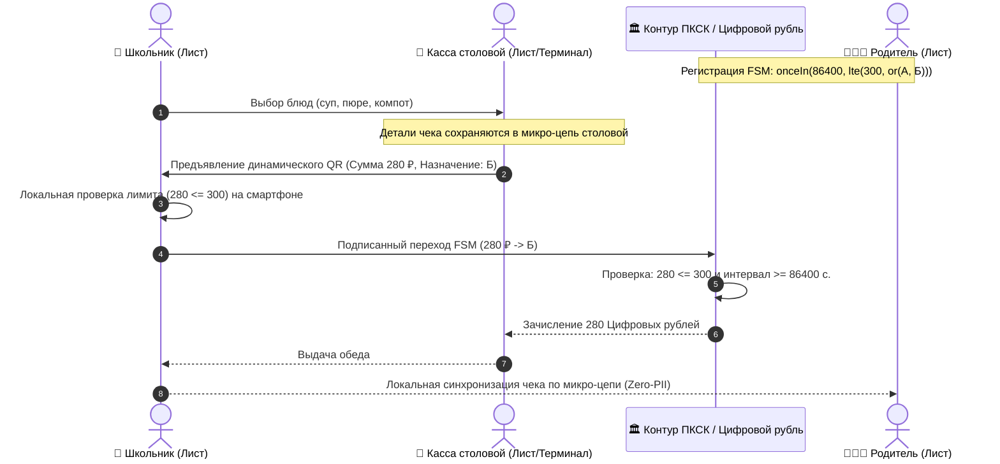

# Архитектура национальной платформы коммерческих смарт-контрактов: Детерминированные конечные автоматы (FSM), распределенный внешний контур и суверенная экономика API

**Белая Книга и официальное экспертное заключение на проект Банка России «Концепция платформы коммерческих смарт-контрактов» (ПКСК)**  
*Кому: Департамент финансовых технологий Банка России (fintech@cbr.ru)*  
*Версия: 1.0 (Сентябрь 2026)*  
*Классификация: Национальная цифровая инфраструктура, Цифровой рубль, Суверенные распределенные вычисления, Информационная безопасность*  
*Инициатива: Проект суверенной распределенной платформы «Турбаза» / Открытый референсный стек AIRport (https://github.com/beyond-decentralized/AIRport)*  

---

## Аннотация

Настоящий научно-практический документ (Whitepaper) подготовлен в качестве официального экспертного отзыва на опубликованную Банком России в 2026 году *«Концепцию платформы коммерческих смарт-контрактов»*.

Основная цель документа — содействовать Банку России и российскому финансовому рынку в создании сверхнадежной, масштабируемой и безопасной национальной платформы смарт-контрактов. Документ вскрывает фундаментальные системные риски использования Тьюринг-полных сред исполнения (EVM / WebAssembly) в государственном расчетном контуре и предлагает математически доказанную альтернативу: **двухконтурную архитектуру**, сочетающую **минимальные детерминированные конечные автоматы (FSM)** со сложностью перехода $O(1)$ в расчетном ядре цифрового рубля и **распределенный внешний информационно-богатый контур** на пользовательских устройствах (архитектура платформы «Турбаза»).

Документ содержит развернутые научно-технические ответы на все 7 официальных вопросов Банка России для общественных консультаций, математические формулы базовых контрактов, модель прямого AdTech-вознаграждения граждан и справедливого сплитования выручки разработчиков `share(...)`, а также конструктивное предложение о сотрудничестве и развертывании совместного пилота в Финтех-песочнице Банка России на базе открытого ядра AIRport.

<!-- pagebreak -->

## Содержание

1. [Официальное обращение к Банку России и преамбула](#1-официальное-обращение-к-банку-россии-и-преамбула)
2. [Архитектурный вызов: Ловушка Тьюринг-полноты (EVM) vs Детерминированный конечный автомат (FSM)](#2-архитектурный-вызов-ловушка-тьюринг-полноты-evm-vs-детерминированный-конечный-автомат-fsm)
3. [Двухконтурная архитектура: «Внутренний расчетный» и «Внешний информационный» контуры](#3-двухконтурная-архитектура-внутренний-расчетный-и-внешний-информационный-контуры)
4. [Математический аппарат минимальных FSM-контрактов и прикладные сценарии](#4-математический-аппарат-минимальных-fsm-контрактов-и-прикладные-сценарии)
   - 4.1. Целевые социальные выплаты и школьное питание: Конфиденциальность без слежки
   - 4.2. B2C/B2B «Безопасная сделка» для МСП: P2P-консенсус без тяжелых ГИС
   - 4.3. Рекурсивное распределение выручки разработчиков и прямое вознаграждение пользователя
5. [Информационная безопасность, абстракция учетных записей и защита кошельков](#5-информационная-безопасность-абстракция-учетных-записей-и-защита-кошельков)
   - 5.1. Контрактные оболочки (Wrappers) и изоляция номеров кошельков
   - 5.2. Сменяемые прокси-оболочки при утере пользовательских аппаратов
   - 5.3. 100% формальная верификация FSM против кризиса Bug Bounty
   - 5.4. Постквантовая криптографическая защита (PQC) на горизонте 50 лет
6. [Развернутые экспертные ответы на 7 вопросов Банка России](#6-развернутые-экспертные-ответы-на-7-вопросов-банка-россии)
7. [Предложение о сотрудничестве и дорожная карта совместного пилотирования](#7-предложение-о-сотрудничестве-и-дорожная-карта-совместного-пилотирования)

<!-- pagebreak -->

## 1. Официальное обращение к Банку России и преамбула

**В Департамент финансовых технологий Центрального банка Российской Федерации**  
*На консультативный документ «Концепция платформы коммерческих смарт-контрактов» (2026 г.)*

Уважаемые коллеги!

Разработка и запуск Платформы цифрового рубля стали важнейшим шагом в укреплении суверенитета и технологической независимости национальной платежной системы. Публикация Банком России *«Концепции платформы коммерческих смарт-контрактов» (ПКСК)* открывает новый этап — переход от изолированных базовых переводов к созданию открытой программируемой финансовой среды, объединяющей граждан, бизнес, финансовые организации и независимых ИТ-разработчиков.

Мы выражаем искреннюю поддержку инициативе Банка России. Настоящий документ подготовлен независимой исследовательской группой платформы **«Турбаза»** — архитектурного проекта распределенных суверенных вычислений. Центр клиентского движка («Лист») открыт и доступен сообществу в рамках свободного репозитория **AIRport (Application Information Repository Port)**:  
👉 [https://github.com/beyond-decentralized/AIRport](https://github.com/beyond-decentralized/AIRport).

Главная цель нашего заключения — оказать регулятору и участникам финансового рынка всестороннюю научно-инженерную поддержку, предостеречь от фундаментальных концептуальных ошибок, допущенных в зарубежных проектах (таких как проект Digital Pound Lab Банка Англии на базе Hyperledger Besu), и предложить готовый, математически строгий путь построения ПКСК на базе **детерминированных конечных автоматов (Finite State Machines, FSM)**.

Мы убеждены, что фундаментальные принципы, заложенные в платформе «Турбаза», универсальны и способны защитить платежное ядро страны от перегрузок и уязвимостей, одновременно предоставив экономике мощный импульс технологического роста.

<!-- pagebreak -->

## 2. Архитектурный вызов: Ловушка Тьюринг-полноты (EVM) vs Детерминированный конечный автомат (FSM)

В разделе 1 Концепции Банка России подробно анализируется международный опыт реализации смарт-контрактов (Китай, Великобритания, Гонконг, Австралия, Сингапур). При этом регулятор отмечает, что проект Банка Англии использует платформу смарт-контрактов на базе блокчейна **Hyperledger Besu (EVM)**, а в разделе 7 фиксирует критические риски:
> *«Риск: высокая нагрузка на инфраструктуру ввиду неоптимального кода разработчика смарт-контрактов и, как следствие, задержки или отказы в их исполнении со стороны платформы...»*  
> *«Риск: размещение недобросовестными разработчиками на ПКСК смарт-контрактов с уязвимостями...»* (Концепция ЦБ РФ, с. 21).

Необходимо подчеркнуть: **эти риски являются прямым и неизбежным следствием Тьюринг-полноты виртуальных машин (EVM / WASM)**.

```
┌─────────────────────────────────────────────────────────────────────────┐
│                    СРАВНЕНИЕ ВЫЧИСЛИТЕЛЬНЫХ МОДЕЛЕЙ                     │
├────────────────────────────────┬────────────────────────────────────────┤
│ Традиционная модель (EVM/Besu) │ Предлагаемая модель (Детерминизм FSM)  │
├────────────────────────────────┼────────────────────────────────────────┤
│ • Тьюринг-полный императивный  │ • Декларативный конечный автомат.       │
│   байт-код (циклы for, while). │ • Отсутствие циклов и рекурсий.        │
│ • Проблема остановки Тьюринга: │ • Алгоритмическая сложность строго     │
│   время работы непредсказуемо. │   фиксирована: O(1).                   │
│ • Необходим учет «газа» (Gas). │ • Гарантия мгновенного исполнения.     │
│ • Уязвимости Re-entrancy,      │ • Невозможность зацикливания и DoS     │
│   переполнения стека и памяти. │   на уровне математического аппарата.  │
│ • 100% формальная верификация  │ • 100% формальная верификация SMT-     │
│   математически невозможна     │   сольверами перед публикацией         │
│   (Теорема Райса).             │   в официальной Витрине.               │
└────────────────────────────────┴────────────────────────────────────────┘
```

Попытка ограничить Тьюринг-полный код административными регламентами обречена: ни один инспектор ЦБ не способен выявить скрытые логические ловушки в произвольном программном коде.

**Вывод:** Расчетное ядро национальной платформы смарт-контрактов должно быть построено исключительно на базе **минимальных детерминированных конечных автоматов (FSM)**.

<!-- pagebreak -->

## 3. Двухконтурная архитектура: «Внутренний расчетный» и «Внешний информационный» контуры

В основе архитектуры лежит строгое разделение ответственности:

```mermaid
graph TB
    subgraph CoreCBR ["Внутренний финансовый контур: Платформа Цифрового Рубля и ПКСК"]
        FSM["Конечный автомат (FSM)"]
        State["Условия и таблица переходов"]
        Wallets["Кошельки Цифрового рубля"]
        TemplateRegistry["Реестр проверенных хэшей шаблонов"]
        
        FSM --- State
        FSM --- Wallets
        FSM --- TemplateRegistry
    end

    subgraph EdgeTurbase ["Внешний информационный контур: Периферия платформы «Турбаза»"]
        LeafNode["📱 Пользовательский узел «Лист» (Смартфон / ПК)"]
        LocalSQL["🗄️ Локальная реляционная СУБД SQLite"]
        MicroChains["🔗 Независимые микро-цепи (Хранилища сделок)"]
        BranchGateway["⚡ Районный узел «Ветка» (P2P-роутинг и Zero-PII)"]
        
        MicroChains -->|Агрегация дельт| LocalSQL
        LeafNode -->|Локальная бизнес-логика| LocalSQL
        LeafNode <-->|P2P синхронизация| BranchGateway
    end

    LeafNode -->|Криптографическое доказательство (ЭЦП ГОСТ) + QR| FSM
    FSM -->|Атомарная смена состояния и расчет| Wallets

    style CoreCBR fill:#fff3e0,stroke:#e65100,stroke-width:2px
    style EdgeTurbase fill:#e8f5e9,stroke:#2e7d32,stroke-width:2px
    style FSM fill:#ffd54f,stroke:#f57f17,stroke-width:2px
    style LocalSQL fill:#81c784,stroke:#1b5e20,stroke-width:2px
```

### Принципы распределения функций:
1. **Внутренний финансовый контур (ЦБ РФ):**
   * Обслуживает исключительно кошельки пользователей и авторизованные переходы конечного автомата.
   * Не хранит товарных номенклатур, чеков, сканов актов, переписки сторон и персональных данных.
   * Работает со сложностью $O(1)$, обеспечивая сверхвысокую пропускную способность (сотни тысяч транзакций в секунду) без риска перегрузки ЦОД.
2. **Внешний информационно-богатый контур («Турбаза»):**
   * Развернут непосредственно на аппаратах пользователей (смартфонах граждан, кассах магазинов, серверах предприятий).
   * Содержит локальную СУБД SQLite, где собираются реляционные данные из множества микро-цепей (хранилищ).
   * Позволяет писать сложнейшую бизнес-логику на стандартном SQL (`SELECT`, `JOIN`, оконные функции, агрегации), избавляя ядро платежной системы от вычислительного балласта.
   * Гарантирует соблюдение Федерального закона № 152-ФЗ по модели **Zero-PII**: чувствительные данные физически не передаются оператору платформы, на сервер ЦБ поступает лишь математическое доказательство факта выполнения условий сделки.

<!-- pagebreak -->

## 4. Математический аппарат минимальных FSM-контрактов и прикладные сценарии

В финансовом контуре смарт-контракт формируется из композиции стандартных, математически верифицированных функциональных примитивов:
* **Временные ограничения:** `onceIn(seconds, condition)` — квантование частоты операций с привязкой к доверенному времени TrueTime.
* **Логические операторы:** `lte(a, b)` ($\le$), `gte(a, b)` ($\ge$), `or(a, b)`, `and(a, b)` — булевы предикаты.
* **Финансовые директивы:** `set(amount, account)`, `add(amount, account, target)`, `share(ratio1, account1, ratio2, account2, ...)`.

Ниже представлены канонические прикладные сценарии реализации.

---

### 4.1. Целевые социальные выплаты и школьное питание: Конфиденциальность без слежки

В Концепции (с. 6–7) Банк России приводит успешные пилоты 2025 года в Чувашии и Татарстане по целевым выплатам на школьное питание и форму. Однако в классической схеме возникает дилемма: либо банк видит детальную номенклатуру каждой покупки ребенка (нарушение тайны частной жизни), либо контроль расходования является формальным.

**Решение на базе FSM «Турбазы»:**
Родитель формирует смарт-контракт целевых школьных расходов следующего вида:
```
onceIn(86400, lte(300, or(А, Б)))
```
Где:
* `onceIn(86400, ...)` — условие: расходование разрешено не чаще одного раза в 24 часа;
* `lte(300, ...)` — лимит: сумма транзакции не превышает 300 рублей;
* `or(А, Б)` — абстрактные адреса-заполнители целевого назначения: $А$ — школьный завтрак, $Б$ — комплексный обед.



**Преимущества подхода:**
1. **Абсолютная конфиденциальность (152-ФЗ):** Регулятор и банк видят только факт списания средств по правилу $Б$. Состав блюд, время приема пищи и пищевые предпочтения ребенка остаются строго в приватной микро-цепи семьи и школы.
2. **Криптографическое кэширование шаблонов:** Хэш данного контракта генерируется один раз. Миллионы родителей по всей стране могут использовать идентичный проверенный шаблон с нулевой нагрузкой на сертифицирующие органы.
3. **Разгрузка инфраструктуры:** Проверка состава чека и калоража выполняется на телефонах участников, платежный контур ЦБ тратит ресурсы только на один атомарный перевод.

<!-- pagebreak -->

---

### 4.2. B2C/B2B «Безопасная сделка» для МСП: P2P-консенсус без тяжелых ГИС

В Концепции (с. 16–17) ЦБ указывает, что безопасные сделки должны опираться на государственные ГИС (Росреестр, ГИБДД) или крупные коммерческие платформы. Но как подключить к смарт-контрактам миллионы субъектов малого бизнеса (рестораны, курьерские службы, репетиторов, ремонтные бригады)? Интеграция каждой кофейни со СМЭВ технически и экономически нереализуема.

**Решение на базе «Турбазы» (Кейс: Доставка еды):**
Заказ формируется в выделенной микро-цепи (локальном реляционном хранилище), которая одновременно синхронизируется на аппаратах трех участников сделки:
1. Покупатель создает хранилище заказа на смартфоне;
2. Шеф-повар ресторана $А$ ставит подпись: `Статус: Приготовлено`;
3. Курьер компании $Б$ ставит подпись: `Статус: Заказ принят в доставку`, затем `Статус: Доставлен по адресу`;
4. Покупатель $Я$ подтверждает: `Статус: Получено`.

В финансовом контуре Цифрового рубля исполняется элементарный смарт-контракт:
```
sum = set(400, А)
add(100, Б, sum)
```

```
┌─────────────────────────────────────────────────────────────────────────┐
│                      P2P-СВЕРКА В МИКРО-ЦЕПИ ЗАКАЗА                     │
├─────────────────────────────────────────────────────────────────────────┤
│ Покупатель:   [Заказ оплачен в эскроу FSM: 500 ₽]                       │
│ Ресторан А:   [Готовка завершена]  ──(ЭЦП)──> Доказательство в цепь     │
│ Курьер Б:     [Посылка у двери]    ──(ЭЦП)──> Доказательство в цепь     │
│ Покупатель:   [Код подтверждения]  ──(ЭЦП)──> Переход FSM               │
├─────────────────────────────────────────────────────────────────────────┤
│ РЕЗУЛЬТАТ В ЯДРЕ ПКСК: Атомарный сплит-расчет по формуле                │
│ • Ресторану А: 400 Цифровых рублей                                      │
│ • Курьеру Б:   100 Цифровых рублей                                      │
└─────────────────────────────────────────────────────────────────────────┘
```

**Преимущества:** Все три участника выступают взаимными оракулами друг для друга. Банку России не требуется следить за курьером по GPS — математически строгое подтверждение перехода FSM формируется на стыке взаимных подписей сторон.

---

### 4.3. Рекурсивное распределение выручки разработчиков и прямое вознаграждение пользователя

Вопрос №4 Банка России прямо посвящен поиску моделей монетизации разработчиков смарт-контрактов. Архитектура «Турбаза» предлагает математически выверенную модель **композитных микророялти через примитив `share(...)`**.

В современной разработке программные продукты строятся из готовых модулей и библиотек. Если приложение разработчика $Б$ использует функционал или схему данных разработчика $А$, распределение дохода от монетизации задается в контракте декларативно с указанием долей участников:
```
В = share(0.5, Б, 0.5, A)
```
В свою очередь, эта комбинация приложений (с адресом контракта $В$) может использоваться приложениями других разработчиков в связке с дополнительными модулями (например, приложением $Д$ и библиотекой $Г$):
```
Е = share(0.2, Д, 0.6, В, 0.2, Г)
```

**Модель прямого AdTech-вознаграждения пользователя и финансирования авторов софта:**
В цифровой экономике внимание пользователя монетизируется через рекламу. В платформе «Турбаза» доход от просмотра рекламы делится между всеми участниками цепочки создания ценности, включая самого гражданина:
```
share(0.1, Я, 0.9, Е)
```
* **10% (`0.1`)** дохода от просмотренной рекламы мгновенно и прозрачно зачисляется непосредственно на кошелек пользователя $Я$ в Цифровых рублях в качестве справедливого вознаграждения за внимание;
* **90% (`0.9`)** дохода направляется на финансирование цепочки программных продуктов и библиотек $Е$ (20% приложению $Д$, 60% контракту $В$ — из которых по 30% разработчикам $А$ и $Б$, и 20% библиотеке $Г$).

Это решает ключевую проблему финансирования независимых разработчиков открытого кода (Open Source), ликвидирует монопольную ренту рекламных платформ и одновременно дает гражданам прямой экономический стимул использовать приложения экосистемы.

<!-- pagebreak -->

## 5. Информационная безопасность, абстракция учетных записей и защита кошельков

### 5.1. Контрактные оболочки (Wrappers) и изоляция номеров кошельков
Прямое указание номеров счетов в смарт-контрактах создает критические риски деанонимизации и финансовой разведки против бизнеса и граждан.  
В архитектуре «Турбаза» применяется технология **контрактных оболочек (Account Abstraction Wrappers)**:
* Реальные номера кошельков экранируются внутри базовой криптографической оболочки.
* Во внешних расчетах и публичных реестрах фигурирует только уникальный обезличенный идентификатор оболочки.
* Каждый участник смарт-контракта достоверно знает реквизиты только своего собственного счета, но не видит структуру балансов и кошельков контрагентов.

### 5.2. Сменяемые прокси-оболочки при утере пользовательских аппаратов
Уязвимым местом современных криптовалют является хранение закрытого ключа на смартфоне: кража или утеря устройства влечет безвозвратную потерю средств либо сложнейшие процедуры перевыпуска мастер-ключа.

В «Турбазе» к пользовательскому смартфону привязываются легковесные **смарт-оболочки с жестко ограниченными суточными лимитами и целевыми правилами**:
* Телефон выступает лишь доверенным манипулятором оболочки;
* При физической утрате или компрометации смартфона пользователь с доверенного резервного узла (или через отделение обслуживающего банка) отзывает скомпрометированную оболочку в один клик;
* Основной кошелек Цифрового рубля в ЦБ остается в полной безопасности, а на новом устройстве мгновенно генерируется новая контрактная оболочка без изменения мастер-реквизитов.

---

### 5.3. 100% формальная верификация FSM против кризиса Bug Bounty
В Концепции Банк России выносит на обсуждение возможность размещения смарт-контрактов на отечественных платформах **Bug Bounty** (BI.ZONE, Standoff 365 / Positive Technologies) для отлова уязвимостей.

Мы предостерегаем регулятора от опасной иллюзии: **Bug Bounty не способен обеспечить абсолютную надежность Тьюринг-полных смарт-контрактов**. В мировой практике контракты, прошедшие множественные аудиты и программы этичного хакинга, продолжают взламываться из-за логических коллизий (теорема Райса).

В парадигме конечных автоматов (FSM) «Турбазы» проверка строится принципиально иначе:
1. **Математическое доказательство инвариантов:** Пространство состояний FSM конечно и счетно. С помощью автоматических SMT-сольверов (Z3, CVC5) и средств верификации моделей (TLA+, Coq) до развертывания контракта в Витрине математически доказываются:
   * Отсутствие недостижимых состояний и тупиков (Deadlock-freedom);
   * Инвариант строгого сохранения баланса:
     $$\sum \text{Assets}_{\text{Input}} \equiv \sum \text{Assets}_{\text{Output}}$$
   * Гарантия завершения исполнения за фиксированное число шагов ($O(1)$).
2. **Истинная роль Bug Bounty:** Программы Bug Bounty должны привлекаться не для тестирования прикладных формул контрактов, а для верификации **низкоуровневого криптографического периметра платформы**:
   * Аудит аппаратных реализаций шифров ГОСТ Р 34.12-2015 («Кузнечик», «Магма»);
   * Тестирование устойчивости к атакам по сторонним каналам (Side-Channel Timing Attacks);
   * Пентест пиринговых протоколов WebRTC / DTLS районных узлов («Ветка»).

---

### 5.4. Постквантовая криптографическая защита (PQC) на горизонте 50 лет
В Концепции Банка России упущен горизонт долгосрочной устойчивости к квантовым компьютерам. Классическая асимметричная криптография (включая алгоритмы ГОСТ Р 34.10-2012 на эллиптических кривых) теоретически уязвима к алгоритму Шора. Злоумышленники уже сейчас перехватывают зашифрованный трафик с целью расшифровки в будущем («Harvest Now, Decrypt Later»).

Платформа «Турбаза» превентивно внедряет гибридный криптографический контур: транзакции и микро-цепи защищаются связкой из национального ГОСТ и постквантовых алгоритмов на алгебраических решетках (**Lattice-based ML-KEM / ML-DSA**), гарантируя юридическую чистоту и конфиденциальность долгосрочных государственных и коммерческих контрактов на 50+ лет вперед.

<!-- pagebreak -->

## 6. Развернутые экспертные ответы на 7 вопросов Банка России

Ниже приводятся прямые ответы исследовательской группы на вопросы для общественных консультаций, сформулированные в разделах 3, 4 и 7 Концепции ПКСК (с. 13–14, 16, 22).

---

### Вопрос 1 (с. 13): О модели и функциях оператора ПКСК
> *«Согласны ли вы с предлагаемой моделью ПКСК? Согласны ли вы с предложенным в концепции перечнем функций оператора ПКСК? Какие дополнительные функции он может выполнять?»*

**Экспертная позиция:**  
Мы поддерживаем выполнение роли оператора ядра ПКСК Банком России на первом этапе для обеспечения непрерывности расчетов. Однако мы настоятельно рекомендуем скорректировать функциональную модель оператора:
1. **Исключить функцию централизованного исполнения произвольного кода:** Оператор не должен предоставлять тяжелую серверную среду для чужой бизнес-логики.
2. **Ввести функцию Ведения реестра верифицированных FSM-хэшей:** Оператор хранит криптографические отпечатки стандартизированных шаблонов конечных автоматов, гарантируя их неизменность.
3. **Функция клиринга каналов состояний (State Channels):** Оператор должен поддерживать пакетный нетто-клиринг агрегированных взаиморасчетов участников микротранзакций, снимая пиковые нагрузки с основного контура Цифрового рубля.

---

### Вопрос 2 (с. 13): О дополнительных функциональных возможностях ПКСК
> *«На ваш взгляд, какие дополнительные функциональные возможности ПКСК необходимо предусмотреть при ее реализации?»*

**Экспертная позиция:**  
Необходимо нативно предусмотреть:
1. **Поддержку минимальных FSM-контрактов:** Запрет Тьюринг-полноты в пользу строго детерминированных конечных автоматов со сложностью $O(1)$.
2. **Абстракцию учетных записей (Account Abstraction Wrappers):** Возможность выпуска отзываемых смарт-оболочек с целевыми лимитами для привязки к смартфонам без риска компрометации основного кошелька.
3. **Механизм криптографического кэширования:** Использование одного верифицированного хэша контракта неограниченным числом участников без повторного развертывания и аудита кода.

---

### Вопрос 3 (с. 13): О моделях стимулирования конечных пользователей
> *«Какие возможные модели стимулирования использования смарт-контрактов конечными пользователями вы можете предложить?»*

**Экспертная позиция:**  
Массовое вовлечение граждан и бизнеса обеспечивается тремя стимулами:
1. **Гарантия соблюдения 152-ФЗ Zero-PII:** Пользователь знает, что условия контракта исполняются без передачи в банк и ЦБ детализации его чеков и частной жизни.
2. **Прямое вознаграждение от AdTech-рынка (`share(0.1, Я, 0.9, Е)`):** Перечисление гражданину части дохода (10%) за внимание в Цифровых рублях и прозрачное автоматическое финансирование (90%) авторов используемых приложений и библиотек.
3. **Офлайн-устойчивость:** Возможность сформировать и криптографически подписать локальный шаг контракта в точке продажи (касса, транспорт) через QR даже при временном отсутствии связи с центральным сервером.

---

### Вопрос 4 (с. 14): О монетизации разработчиков и оракулов (Предельные комиссии)
> *«Какие модели и подходы к монетизации должны быть доступны разработчикам смарт-контрактов и оракулам? Следует ли оператору ограничивать предельный размер комиссий? Как их рассчитать?»*

**Экспертная позиция:**
1. **Модель композитных микророялти через функцию `share(...)`:** Автоматическое алгоритмическое сплитование микроплатежей между цепочкой зависимостей модулей (по вектору Шепли / модели $1/N$).
2. **Комиссия государственной платформы ПКСК — 0%:** Государство не должно взимать ренту за транзит вызовов (ликвидация 30% монопольного налога магазинов приложений).
3. **Регулирование комиссий оракулов:** Для нормативно-значимых данных (ГИС, биржи) должен действовать предельный тариф на основе предельных инфраструктурных издержек:
   $$\text{Fee}_{\max} = C_{\text{infra}} \times (1 + \text{Margin}_{\text{cap}})$$
   с ограничением рентабельности $\text{Margin}_{\text{cap}} \le 10\%$. Для коммерческих контрактов тарифы должны быть прозрачно объявлены в коде FSM без скрытых наценок.

---

### Вопрос 5 (с. 14): Об источниках внешних данных и оракулах для МСП
> *«Получение данных из каких именно источников внешней информации необходимо предусмотреть? Стоит ли вводить ранжирование по степени доверия?»*

**Экспертная позиция:**
1. **Выход за пределы тяжелых ГИС:** Помимо ключевых ГИС (Росреестр, ЕИС Закупки, ГИБДД), критически необходимо узаконить **локальные микро-цепи участников сделки**. В массовом сегменте B2C/B2B (доставка, бытовые услуги, торговля) стороны сделки (продавец, экспедитор, покупатель) подписывают состояния в общей микро-цепи на смартфонах, выступая достаточными оракулами без привлечения серверов госорганов.
2. **Ранжирование оракулов:** Необходима трехуровневая система доверия:
   * *Уровень 1 (Branch ID):* Базовая репутация районного узла для бытовых расчетов;
   * *Уровень 2 (Group Verified):* Псевдонимная верификация участников через шлюзы ЕСИА;
   * *Уровень 3 (State Qualified):* Квалифицированная ЭЦП ГОСТ / аттестованные государственные ГИС.

---

### Вопрос 6 (с. 14): О критериях к открытым источникам данных
> *«Какие критерии к открытым источникам информации вы считаете необходимым применять при подключении к ПКСК?»*

**Экспертная позиция:**  
К открытым оракулам должны предъявляться требования:
1. **Бинарный конверт ГОСТ:** Подписание каждого пакета данных электронной подписью поставщика;
2. **Детерминированное время TrueTime:** Защита от опережающих транзакций (front-running);
3. **Византийская медианная агрегация:** Использование формулы медианы от $M$ независимых поставщиков для критических финансовых показателей;
4. **Теоретико-игровой залог (Nash Slashing):** Финансовое обеспечение оракула в Цифровых рублях, сгорающее при доказательстве фальсификации данных.

---

### Вопрос 7 (с. 14): О раскрытии исходного кода конечному потребителю
> *«Нужно ли предоставлять доступ конечному потребителю к исходному коду смарт-контракта?»*

**Экспертная позиция:**  
Публикация сырого байт-кода создает иллюзию безопасности, понятную лишь узким специалистам.  
Стандарт прозрачности должен включать:
1. **Сверку криптографического хэша шаблона** с официальным реестром доверенных контрактов Банка России;
2. **Автоматическую визуализацию декларативной формулы в UI:** Преобразование выражений вида `onceIn(86400, lte(300, or(А, Б)))` в понятные графические блоки: *«Лимит: 300 ₽ в сутки на цели [Завтрак, Обед]»*;
3. **Защиту коммерческой тайны разработчиков:** Возможность публикации спецификации и формул без раскрытия проприетарных алгоритмов оптимизации.

<!-- pagebreak -->

## 7. Предложение о сотрудничестве и дорожная карта совместного пилотирования

Мы убеждены, что объединение усилий регулятора, финансового сообщества и независимых отечественных исследователей позволит России создать самую передовую в мире платформу смарт-контрактов.

### Текущее состояние разработок:
* **Архитектурный фундамент:** Полностью спроектирована трехуровневая топология («Лист» — «Ветка» — «Ствол»), математический аппарат минимальных конечных автоматов (FSM) и модель Zero-PII.
* **Открытая кодовая база ядра:** Центр клиентского реляционного движка («Лист») открыт и опубликован в международном репозитории:  
  👉 **AIRport:** [https://github.com/beyond-decentralized/AIRport](https://github.com/beyond-decentralized/AIRport).
* **Честная оценка статуса:** Проект развивается автором в исследовательском формате в свободное время. Кодовая база ядра требует дополнительной инженерной доработки, расширенного профилирования и комплексного нагрузочного тестирования.

### Предложение к Банку России и Ассоциации ФинТех:
Мы открыты к всестороннему диалогу и предлагаем:

1. **Безвозмездная передача открытых спецификаций:** Передать Банку России и Ассоциации ФинТех полные математические спецификации детерминированных FSM-контрактов, протоколов микро-цепей и контрактных оболочек.
2. **Формирование совместной исследовательской группы:** Войти в состав профильной экспертной группы Ассоциации ФинТех для формирования Национального стандарта коммерческих смарт-контрактов ЦВЦБ.
3. **Дорожная карта подготовки к пилоту в Финтех-песочнице:**
   * *Этап 1 (Консолидация ресурсов):* Формирование инженерной команды разработчиков вокруг ядра AIRport / «Турбаза» при поддержке институтов развития и заинтересованных банков.
   * *Этап 2 (Доработка и адаптация стека):* Интеграция сертифицированных криптографических модулей ГОСТ Р 34.12/34.10 и адаптация коннектора к тестовому контуру Платформы цифрового рубля.
   * *Этап 3 (Подача заявки в Финтех-песочницу ЦБ РФ):* Проведение полномасштабного пилотного эксперимента по сценарию целевых социальных выплат и расчетов МСП с доказательством преимуществ FSM и снижения нагрузки на инфраструктуру регулятора на 90%.

---

*Авторы выражают благодарность Департаменту финансовых технологий Банка России за глубокую проработку Концепции и надеются на плодотворное сотрудничество на благо суверенной финансовой системы России.*

**Контакты для связи:**  
*Проект суверенной платформы «Турбаза» / Открытый репозиторий AIRport*  
*GitHub: https://github.com/beyond-decentralized/AIRport*  
*Ответ на консультативный доклад направлен на официальный адрес: fintech@cbr.ru*
