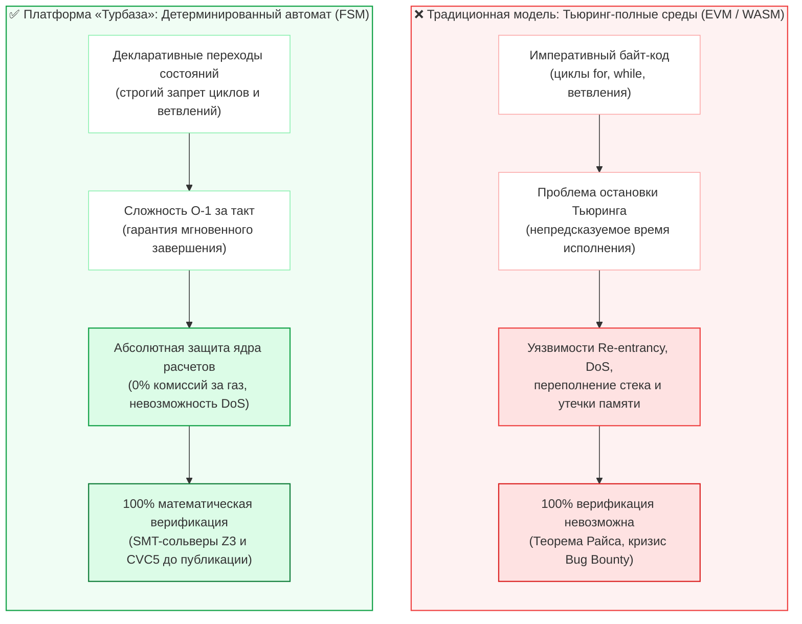
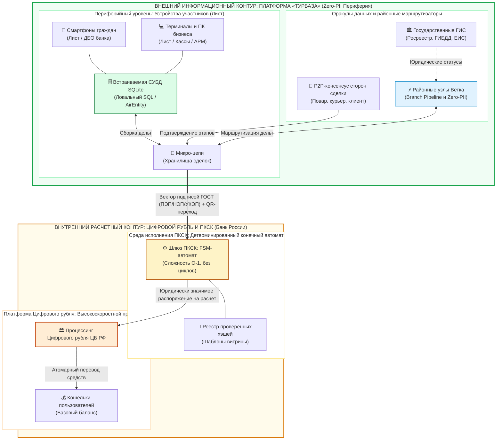
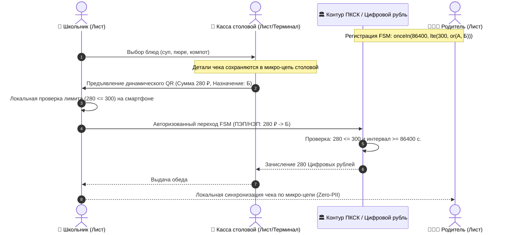
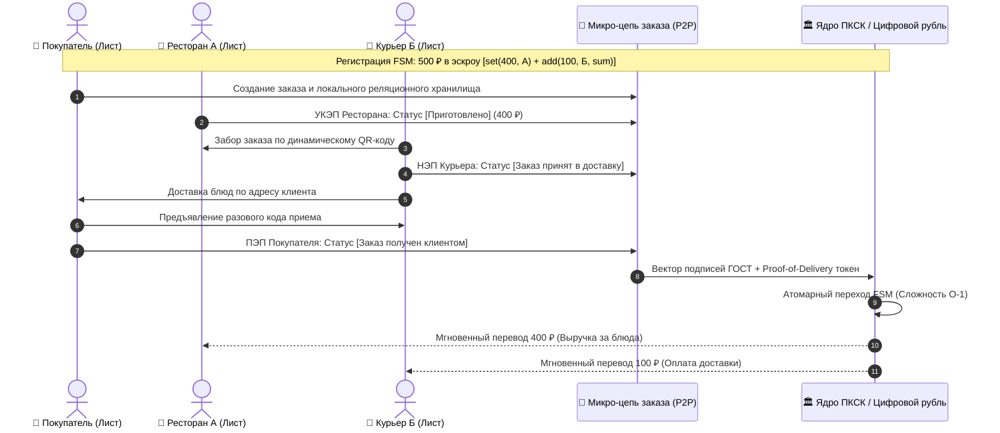
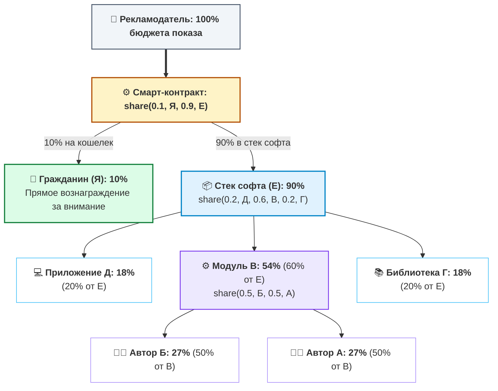
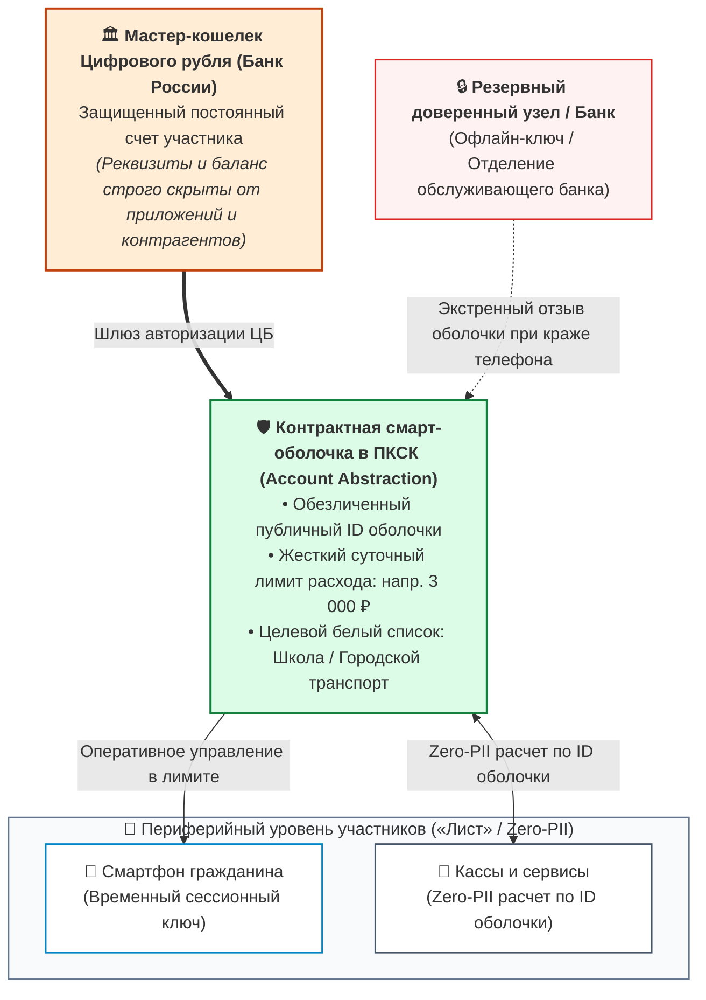
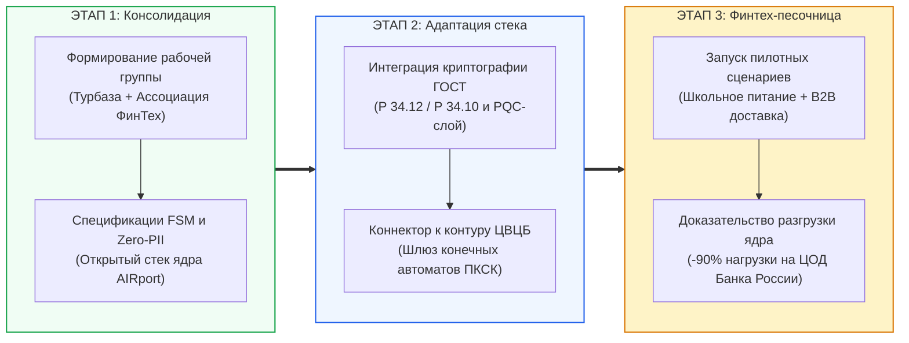

# Архитектура национальной платформы коммерческих смарт-контрактов: Детерминированные конечные автоматы (FSM), распределенный внешний контур и суверенная экономика API

**Белая Книга и официальное экспертное заключение на проект Банка России «Концепция платформы коммерческих смарт-контрактов» (ПКСК)**  
*Кому: Департамент финансовых технологий Банка России (fintech@cbr.ru)*  
*Версия: 1.0 (Сентябрь 2026)*  
*Классификация: Национальная цифровая инфраструктура, Цифровой рубль, Суверенные распределенные вычисления, Информационная безопасность*  
*Инициатива: Проект суверенной распределенной платформы «Турбаза» / Открытый референсный стек AIRport (https://github.com/beyond-decentralized/AIRport)*  

---

## Аннотация

Настоящий научно-практический документ (Whitepaper) подготовлен в качестве официального экспертного отзыва на опубликованную Банком России в 2026 году *«Концепцию платформы коммерческих смарт-контрактов»*.

Основная цель документа — содействовать Банку России и российскому финансовому рынку в создании сверхнадежной, масштабируемой и безопасной национальной платформы смарт-контрактов. Документ опирается на методологию Банка международных расчетов (BIS): строгое разграничение концепций **«Programmable Money»** (несущей риски фрагментации денежной массы и появления суррогатов) и **«Programmable Payments»** (условных расчетов без искажения природы суверенной валюты по ст. 75 Конституции РФ).

Документ вскрывает системные риски Тьюринг-полных сред (EVM / WASM) в расчетном ядре и предлагает доказанную альтернативу: **двухконтурную архитектуру**, сочетающую **минимальные детерминированные конечные автоматы (FSM)** со сложностью O(1) в расчетном контуре цифрового рубля и **распределенный внешний информационный контур** на аппаратах участников («Турбаза» / открытый стек AIRport). Документ содержит развернутые ответы на 7 официальных вопросов ЦБ РФ и предложение совместного пилота в Финтех-песочнице.

<!-- pagebreak -->

## Содержание

1. [Официальное обращение к Банку России и преамбула](#1-официальное-обращение-к-банку-россии-и-преамбула)
2. [Архитектурный вызов: Ловушка Тьюринг-полноты (EVM) vs Детерминированный конечный автомат (FSM)](#2-архитектурный-вызов-ловушка-тьюринг-полноты-evm-vs-детерминированный-конечный-автомат-fsm)
3. [Двухконтурная архитектура: «Внутренний расчетный» и «Внешний информационный» контуры](#3-двухконтурная-архитектура-внутренний-расчетный-и-внешний-информационный-контуры)
4. [Математический аппарат минимальных FSM-контрактов и прикладные сценарии](#4-математический-аппарат-минимальных-fsm-контрактов-и-прикладные-сценарии)
   - 4.1. Целевые социальные выплаты и школьное питание: Конфиденциальность без слежки
   - 4.2. B2C/B2B «Безопасная сделка» для МСП: P2P-консенсус без тяжелых ГИС
   - 4.3. Рекурсивное распределение выручки разработчиков и прямое вознаграждение пользователя
5. [Информационная безопасность, абстракция учетных записей и защита кошельков](#5-информационная-безопасность-абстракция-учетных-записей-и-защита-кошельков)
   - 5.1. Контрактные оболочки (Wrappers) и изоляция номеров кошельков
   - 5.2. Сменяемые прокси-оболочки при утере пользовательских аппаратов
   - 5.3. 100% формальная верификация FSM против кризиса Bug Bounty
   - 5.4. Постквантовая криптографическая защита (PQC) на горизонте 50 лет
6. [Развернутые экспертные ответы на 7 вопросов Банка России](#6-развернутые-экспертные-ответы-на-7-вопросов-банка-россии)
7. [Предложение о сотрудничестве и дорожная карта совместного пилотирования](#7-предложение-о-сотрудничестве-и-дорожная-карта-совместного-пилотирования)

<!-- pagebreak -->

## 1. Официальное обращение к Банку России и преамбула

**В Департамент финансовых технологий Центрального банка Российской Федерации**  
*На консультативный документ «Концепция платформы коммерческих смарт-контрактов» (2026 г.)*

Уважаемые коллеги!

Разработка и запуск Платформы цифрового рубля стали важнейшим шагом в укреплении суверенитета и технологической независимости национальной платежной системы. Публикация Банком России *«Концепции платформы коммерческих смарт-контрактов» (ПКСК)* открывает новый этап — переход от изолированных базовых переводов к созданию открытой программируемой финансовой среды, объединяющей граждан, бизнес, финансовые организации и независимых ИТ-разработчиков.

Мы выражаем искреннюю поддержку инициативе Банка России. Настоящий документ подготовлен исследовательской группой платформы **«Турбаза»** — архитектурного проекта распределенных суверенных вычислений. Центр клиентского реляционного движка («Лист») открыт сообществу в репозитории **AIRport (Application Information Repository Port)**:  
👉 [https://github.com/beyond-decentralized/AIRport](https://github.com/beyond-decentralized/AIRport).

Главная цель нашего заключения — предостеречь регулятора от повторения ошибок зарубежных центробанков (включая проект Digital Pound Lab Банка Англии на Hyperledger Besu) и опереться на выводы совместных исследований **BIS Project Rosalind** и Сингапурского **Project Orchid (MAS)**: смарт-контракт должен быть безопасным внешним условием платежа (Programmable Payments), а не монолитным Тьюринг-полным кодом в ядре эмиссии.

Мы предлагаем готовый математический путь построения ПКСК на базе **детерминированных конечных автоматов (FSM)**. Эти принципы защитят платежное ядро страны от перегрузок и DoS-атак, обеспечив высочайший в мире уровень финансовой надежности.

<!-- pagebreak -->

## 2. Архитектурный вызов: Ловушка Тьюринг-полноты (EVM) vs Детерминированный конечный автомат (FSM)

В разделе 1 Концепции Банка России подробно анализируется международный опыт реализации смарт-контрактов (Китай, Великобритания, Гонконг, Австралия, Сингапур). При этом регулятор отмечает, что проект Банка Англии использует платформу смарт-контрактов на базе блокчейна **Hyperledger Besu (EVM)**, а в разделе 7 фиксирует критические риски:
> *«Риски: высокая нагрузка на инфраструктуру ввиду неоптимального кода разработчика... размещение недобросовестными разработчиками смарт-контрактов с уязвимостями...»* (Концепция ЦБ РФ, с. 21).

Необходимо подчеркнуть: **эти риски являются прямым и неизбежным следствием Тьюринг-полноты виртуальных машин (EVM / WASM)**.



Фундаментальная неприменимость Тьюринг-полных сред в государственном платежном контуре доказана строго:
* **Теорема Райса и Проблема остановки:** Семантические свойства произвольного императивного кода алгоритмически неразрешимы — аудит и Bug Bounty не способны исключить логические дедлоки и реентрантность (The DAO $60 млн, мосты Wormhole $326 млн, Ronin $624 млн).
* **Несовместимость Gas со ст. 5, 8 161-ФЗ:** Аукционы комиссий, MEV-манипуляции и сбои `Out of Gas` нарушают юридический момент наступления безотзывности (ч. 7) и окончательности (ч. 10) перевода, генерируя операционный риск по Положению № 716-П и срывая регламент бесперебойности № 779-П (RTO ≤ 2 ч).
* **Уроки BIS Project Rosalind:** Опыт Банка Англии доказал: ядро CBDC должно исполнять лишь стандартизированные атомарные инструкции, вынося сложную логику во внешний прикладной периметр.

**Вывод:** Расчетное ядро национальной платформы должно строиться строго на **детерминированных конечных автоматах (FSM) со сложностью O(1)**.

<!-- pagebreak -->

## 3. Двухконтурная архитектура: «Внутренний расчетный» и «Внешний информационный» контуры

В основе архитектуры лежит строгое разделение ответственности:



### Принципы распределения функций:
1. **Внутренний расчетный контур «Ствол» (ЦБ РФ):**
   * Обслуживает исключительно кошельки участников и детерминированные переходы конечного автомата.
   * Не хранит товарных номенклатур, чеков, сканов актов, переписки сторон и персональных данных.
   * Работает со сложностью O(1), обеспечивая гарантированный SLA расчетов (сотни тысяч TPS) без риска перегрузки ЦОД.
2. **Внешний информационный контур («Лист» и «Ветка»):**
   * Развернут на аппаратах участников («Лист» / SQLite / WASM) и районных маршрутизаторах («Ветка»).
   * Содержит встраиваемую СУБД (AirEntity), собирая реляционные данные из множества локальных микро-цепей.
   * Выполняет бизнес-логику на стандартном SQL (`SELECT`, `JOIN`, оконные функции) без нагрузки на клиринг ЦБ.
   * Гарантирует принцип минимизации обработки (ст. 5 152-ФЗ Zero-PII): в ядро ЦБ направляется лишь вектор подписей ГОСТ участников (ПЭП, НЭП, УКЭП по 63-ФЗ) и булев результат проверки условий.

<!-- pagebreak -->

## 4. Математический аппарат минимальных FSM-контрактов и прикладные сценарии

В расчетном контуре Цифрового рубля смарт-контракт формализуется как **детерминированный автомат Мили (Deterministic Mealy Machine)**:
```text
M = (Q, Σ, Δ, δ, λ, q_0, F)
```
где:
* **Q** — конечное множество расчетных состояний (`|Q| < ∞`);
* **Σ** — входной алфавит событий: вектор подписей участников (ПЭП, НЭП, УКЭП по 63-ФЗ) и булевых предикатов;
* **Δ** — выходной алфавит финансовых действий: атомарные распоряжения на клиринг в платформе ЦБ (Указание № 6497-У);
* **δ: Q × Σ → Q** — детерминированная функция переходов состояний: `S_{t+1} = δ(S_t, σ)`;
* **λ: Q × Σ → Δ** — выходная функция финансовых списаний;
* **q_0 ∈ Q** — начальное состояние (эскроу / авторизация);
* **F ⊆ Q** — множество терминальных состояний (клиринг завершен / возврат по таймауту).

**Алгебраические свойства и инварианты:**
1. **Моноид переходов и замкнутость:** Множество отображений переходов образует конечный моноид относительно композиции. Композиция примитивов замкнута в классе автоматов Мили, исключая побочные эффекты.
2. **Балансовый инвариант (Safety):** `∀ t ≥ 0: ∑ Assets_{Input} ≡ ∑ Assets_{Output} + Escrow_t`.
3. **Отсутствие зависаний (Liveness / Deadlock-Freedom):** Для любого состояния гарантирован детерминированный возврат по таймауту TrueTime: `δ(S, Timeout) = S_{Refund}`.

| Категория | Функция / Примитив | Семантическое назначение | Сложность |
| :--- | :--- | :--- | :---: |
| **Время** | `onceIn(seconds, condition)` | Квантование частоты операций по TrueTime | O(1) |
| **Лимиты** | `lte(a, b)`, `gte(a, b)` | Проверка числовых ограничений: a ≤ b и a ≥ b | O(1) |
| **Предикаты** | `or(a, b)`, `and(a, b)` | Дизъюнкция и конъюнкция адресов / условий | O(1) |
| **Баланс** | `set(amount, account)` | Инициализация баланса или эскроу-счета | O(1) |
| **Агрегация** | `add(amount, account, target)` | Накопительное сложение финансовых обязательств | O(1) |
| **Роялти** | `share(r1, a1, r2, a2, ...)` | Рекурсивное сплитование микроплатежей | O(1) |

Каждый примитив имеет строго доказанную сложность O(1), не содержит циклов и верифицируется SMT-сольверами до публикации.

<!-- pagebreak -->

### 4.1. Целевые социальные выплаты и школьное питание: Конфиденциальность без слежки

В Концепции (с. 6–7) Банк России приводит успешные пилоты 2025 года в Чувашии и Татарстане по целевым выплатам на школьное питание и форму. Однако в классической схеме возникает дилемма: либо банк видит детальную номенклатуру каждой покупки ребенка (нарушение тайны частной жизни), либо контроль расходования является формальным.

**Решение на базе FSM «Турбазы»:**
Родитель формирует смарт-контракт целевых школьных расходов следующего вида:
```
onceIn(86400, lte(300, or(А, Б)))
```
Где:
* `onceIn(86400, ...)` — условие: расходование разрешено не чаще одного раза в 24 часа;
* `lte(300, ...)` — лимит: сумма транзакции не превышает 300 рублей;
* `or(А, Б)` — абстрактные адреса-заполнители целевого назначения: **А** — школьный завтрак, **Б** — комплексный обед.



**Преимущества подхода:**
1. **Абсолютная конфиденциальность (152-ФЗ Zero-PII):** Регулятор и банк видят только факт списания средств по правилу **Б**. Состав блюд и калораж остаются строго в приватной микро-цепи семьи и школы.
2. **Казначейский надзор (ст. 242.14 БК РФ):** Лимит 300 ₽ резервирует право расхода целевой субсидии. В 23:59:59 неиспользованный остаток обнуляется, исключая нецелевое использование и блокировку средств.
3. **Кэширование шаблонов и офлайн-устойчивость:** Хэш контракта регистрируется один раз в ЦБ, а локальная микро-цепь кассы обеспечивает расчеты даже при временном сбое связи с процессингом.

<!-- pagebreak -->

### 4.2. B2C/B2B «Безопасная сделка» для МСП: P2P-консенсус без тяжелых ГИС

В Концепции (с. 16–17) ЦБ указывает, что безопасные сделки должны опираться на государственные ГИС (Росреестр, ГИБДД) или крупные коммерческие платформы. Но как подключить к смарт-контрактам миллионы субъектов малого бизнеса (рестораны, курьерские службы, репетиторов, ремонтные бригады)? Интеграция каждой кофейни со СМЭВ технически и экономически нереализуема.

**Решение на базе «Турбазы» (Кейс: Доставка еды):**  
Заказ формируется в микро-цепи (реляционном хранилище), синхронизируемой на аппаратах трех участников: покупатель открывает хранилище на смартфоне, ресторан **А** подтверждает статус `Приготовлено`, курьер **Б** — `Доставлен`, покупатель **Я** — `Получено`. В ядре Цифрового рубля исполняется минимальный контракт: `sum = set(400, А); add(100, Б, sum)`.



**Преимущества и защита от дедлоков (Deadlock-Freedom):**
1. **Безотзывность и окончательность (ст. 5, 8 161-ФЗ):** Юридический факт безотзывности наступает при валидации динамического Proof-of-Delivery токена. Вектор взаимных подписей сторон (УКЭП ресторана, НЭП курьера, ПЭП клиента) инициирует атомарный расчет в ядре ЦБ без GPS-трекинга.
2. **Гарантия авто-возврата по таймауту:** Если заказ не выдан в срок, срабатывает детерминированный переход `onceIn(T_timeout, refund(Покупатель))` — средства мгновенно возвращаются клиенту, исключая блокировку в эскроу.
3. **Гибридный арбитраж при спорах:** При разногласиях (брак, недовоз) FSM исполняет альтернативную ветку сплита `Payout = or(and(Σ_Ресторан, Σ_Курьер, Σ_Клиент), and(Σ_Арбитр, Π_Решение))`, где УКЭП медиатора платформы распределяет средства справедливо.

<!-- pagebreak -->

### 4.3. Рекурсивное распределение выручки разработчиков и прямое вознаграждение пользователя

Вопрос №4 Банка России прямо посвящен поиску моделей монетизации разработчиков смарт-контрактов. Архитектура «Турбаза» предлагает математически выверенную модель **композитных микророялти через примитив `share(...)`**.

В современной разработке программы строятся из готовых библиотек. Доход от монетизации распределяется алгоритмически между всеми звеньями цепочки создания ценности, включая гражданина за внимание:
```text
В = share(0.5, Б, 0.5, A)          # Модуль В: по 27% разработчикам Б и А
Е = share(0.2, Д, 0.6, В, 0.2, Г) # Стек Е: 18% Д, 54% В, 18% Г
share(0.1, Я, 0.9, Е)             # 10% человеку Я за внимание, 90% в дерево софта Е
```



**Математические гарантии и сведение к O(1) при клиринге:**
* **Вектор Шепли и ацикличность DAG:** Сплитование удовлетворяет 4 аксиомам Шепли (эффективность, симметрия, dummy, аддитивность). Алгоритм Кана исключает взаимную рекурсию при регистрации в ЦБ.
* **Схлопывание дерева (Tree Flattening):** Дерево компилируется в плоский массив выплат: расчет в ядре ЦБ занимает O(M) простых умножений $W(T_j) = \prod w_e$ без стека.
* **Целочисленный баланс (метод Гамильтона):** Распределение неделимых копеек по методу наибольшего остатка гарантирует строгий баланс $\sum \text{Payout}_i \equiv \text{Amount}$ с нулевой дисперсией.
* **Налоговое агентирование (НК РФ):** Автоматическое расщепление налога на уровне банка-эквайера: удержание 13% НДФЛ для граждан и 4–6% НПД для самозанятых разработчиков софта.

<!-- pagebreak -->

## 5. Информационная безопасность, абстракция учетных записей и защита кошельков

### 5.1. Контрактные оболочки (Wrappers) и двухуровневая модель комплаенса (115-ФЗ vs 152-ФЗ)
Прямое указание реквизитов счетов в смарт-контрактах создает критические риски деанонимизации и финансовой разведки. Технология **контрактных оболочек (Account Abstraction Wrappers)** гармонизирует требования антиотмывочного надзора и защиту персональных данных:
1. **Финансово-надзорный контур (115-ФЗ, Положение ЦБ № 809-П):** Для Банка России и Росфинмониторинга система абсолютно прозрачна. Все мастер-кошельки Цифрового рубля открываются банками с полной идентификацией (KYC) через ЕСИА / ЕБС. Смарт-оболочки привязаны к мастер-счетам в реестре ЦБ: при превышении пороговых сумм (≥ 1 000 000 ₽ по ст. 6 115-ФЗ) предикат `gte(Amount, 1_000_000)` автоматически инициирует обязательный контроль и сверку с платформой «Знай своего клиента» (ЗСК) Банка России.
2. **Гражданско-информационный контур (152-ФЗ Zero-PII, ст. 26 395-1 «Банковская тайна»):** Смарт-оболочки экранируют балансы и номера счетов от контрагентов и приложений. Детализация товарных чеков хранится в зашифрованных микро-цепях на смартфонах. Регулятор освобожден от сбора терабайтов персональных данных, соблюдая принцип минимизации обработки (ст. 5 152-ФЗ).

### 5.2. Сменяемые прокси-оболочки при компрометации клиентских аппаратов
Хранение мастер-ключей на смартфонах несет критический риск безвозвратной потери средств при краже или взломе устройства.  
В «Турбазе» к смартфону привязываются легковесные **прокси-оболочки с жесткими суточными лимитами**:
* Смартфон выступает лишь временным сессионным манипулятором оболочки;
* При утере или краже телефона пользователь с резервного узла (или через отделение банка) отзывает скомпрометированную оболочку в один клик;
* Основной кошелек Цифрового рубля в Банке России остается нетронутым, а на новом аппарате мгновенно генерируется новая оболочка без изменения мастер-реквизитов.



<!-- pagebreak -->

### 5.3. 100% формальная верификация FSM против кризиса Bug Bounty
В Концепции Банк России выносит на обсуждение возможность размещения смарт-контрактов на отечественных платформах **Bug Bounty** (BI.ZONE, Standoff 365 / Positive Technologies) для отлова уязвимостей.

Мы предостерегаем регулятора от опасной иллюзии: **Bug Bounty не способен обеспечить абсолютную надежность Тьюринг-полных смарт-контрактов**. В мировой практике контракты, прошедшие множественные аудиты и программы этичного хакинга, продолжают взламываться из-за логических коллизий (теорема Райса).

В парадигме конечных автоматов (FSM) «Турбазы» проверка строится принципиально иначе:
1. **Математическое доказательство инвариантов:** Пространство состояний FSM конечно и счетно. С помощью аппарата Bounded Model Checking (глубина k ≤ 4), автоматических SMT-сольверов (Z3, CVC5) и спецификаций на языке TLA+ до развертывания шаблона в Витрине математически доказываются:
   * Отсутствие недостижимых состояний и тупиков (Deadlock-freedom);
   * Инвариант строгого сохранения баланса: `∑ Assets(Input) ≡ ∑ Assets(Output)`;
   * Гарантия завершения исполнения за фиксированное число шагов (O(1)).
2. **Истинная роль Bug Bounty:** Программы Bug Bounty должны привлекаться не для тестирования прикладных формул контрактов, а для верификации **низкоуровневого криптографического периметра платформы**:
   * Аудит аппаратных реализаций шифров ГОСТ Р 34.12-2015 («Кузнечик», «Магма»);
   * Тестирование устойчивости к атакам по сторонним каналам (Side-Channel Timing Attacks);
   * Пентест пиринговых протоколов WebRTC / DTLS районных узлов («Ветка»).

---

### 5.4. Постквантовая криптографическая защита (PQC) на горизонте 50 лет
В Концепции Банка России упущен горизонт долгосрочной квантовой устойчивости. Классическая асимметричная криптография на эллиптических кривых теоретически уязвима к алгоритму Шора («Harvest Now, Decrypt Later»).

Платформа «Турбаза» внедряет гибридный криптографический контур в строгом соответствии с рекомендациями **ТК 26 «Криптографическая защита информации»**: транзакции и микро-цепи защищаются связкой из ГОСТ Р 34.12-2015, ГОСТ Р 34.10-2012 VKO и постквантовых алгоритмов на алгебраических решетках (Lattice-based PQC KEM/DSA), обеспечивая сертификацию СКЗИ по классам КС2/КС3/КВ ФСБ России и юридическую чистоту долгосрочных государственных контрактов на 50+ лет вперед.

<!-- pagebreak -->

## 6. Развернутые экспертные ответы на 7 вопросов Банка России

Ниже приводятся прямые ответы исследовательской группы на вопросы для общественных консультаций, сформулированные в разделах 3, 4 и 7 Концепции ПКСК (с. 13–14, 16, 22).

---

### Вопрос 1 (с. 13): О модели и функциях оператора ПКСК
> *«Согласны ли вы с предлагаемой моделью ПКСК? Согласны ли вы с предложенным в концепции перечнем функций оператора ПКСК? Какие дополнительные функции он может выполнять?»*

**Экспертная позиция:**  
Мы поддерживаем выполнение роли оператора ядра ПКСК Банком России на начальном этапе. Однако в соответствии с Федеральным законом № 161-ФЗ («О национальной платежной системе») функции оператора должны быть строго разграничены:
1. **Исключение исполнения произвольного кода:** Оператор расчетного ядра ЦБ не должен исполнять тяжелый пользовательский байт-код, исключая риски DoS и отказов в доступности;
2. **Функция Ведения Реестра верифицированных FSM-хэшей:** Оператор платформы регистрирует хэши стандартизированных шаблонов конечных автоматов, прошедших формальную верификацию;
3. **Функция клиринга каналов состояний (State Channels):** Оператор обеспечивает пакетный нетто-клиринг агрегированных микротранзакций, радикально снижая пиковую нагрузку на ядро расчетов Цифрового рубля.

---

### Вопрос 2 (с. 13): О дополнительных функциональных возможностях ПКСК
> *«На ваш взгляд, какие дополнительные функциональные возможности ПКСК необходимо предусмотреть при ее реализации?»*

**Экспертная позиция:**  
Необходимо предусмотреть в целевом дизайне платформы:
1. **Поддержку минимальных детерминированных FSM-контрактов:** Сложность O(1), математический запрет неразрешимости и циклов;
2. **Нативный межоператорский DvP-шлюз (Delivery versus Payment):** Атомарный расчет в цифровых рублях против поставки цифровых финансовых активов (ЦФА по 259-ФЗ) при взаимодействии с внешними операторами информационных систем (Атомайз, Сбер, Альфа-Банк), устраняющий расчетный риск Херштатта;
3. **Абстракцию учетных записей (Account Abstraction Wrappers):** Выпуск сменяемых контрактных смарт-оболочек с целевыми суточными мандатами для клиентских устройств без риска компрометации мастер-счета;
4. **Криптографическое кэширование шаблонов:** Повторное использование однажды верифицированного хэша FSM неограниченным числом участников без аудита каждого экземпляра.

---

### Вопрос 3 (с. 13): О моделях стимулирования конечных пользователей
> *«Какие возможные модели стимулирования использования смарт-контрактов конечными пользователями вы можете предложить?»*

**Экспертная позиция:**  
Массовое вовлечение граждан и субъектов МСП обеспечивается четырьмя стимулами:
1. **Нулевая комиссия оператора ядра (0% эквайринг):** Законодательное закрепление 0% комиссии государственной платформы для социально значимых платежей МСП вместо банковских 1.5–2.5%;
2. **Прямое вознаграждение от AdTech-рынка (`share(0.1, Я, 0.9, Е)`):** 10% рекламного бюджета перечисляется напрямую гражданину за внимание в Цифровых рублях, а 90% финансирует разработчиков софта;
3. **Гарантия соблюдения 152-ФЗ Zero-PII и банковской тайны (ст. 26 395-1):** Товарная номенклатура и личные чеки не передаются третьим лицам;
4. **Аппаратная офлайн-устойчивость:** Возможность локального криптографического подписания шагов контракта через QR/NFC в торговых точках при разрыве связи с процессингом.

---

### Вопрос 4 (с. 14): О монетизации разработчиков и оракулов (Предельные комиссии)
> *«Какие модели и подходы к монетизации должны быть доступны разработчикам смарт-контрактов и оракулам? Следует ли оператору ограничивать предельный размер комиссий? Как их рассчитать?»*

**Экспертная позиция:**
1. **Модель композитных микророялти через функцию `share(...)`:** Алгоритмическое сплитование микроплатежей между цепочкой зависимостей модулей по вектору Шепли с компиляцией в плоский массив выплат и автоматическим налоговым агентированием (НДФЛ 13% / НПД 4-6%);
2. **Методика тарификации оракулов Cost-Plus:** Для государственных ГИС и бирж предельный тариф должен рассчитываться по формуле экономически обоснованных издержек: `Fee_max = C_infra × (1 + Margin_cap)` с ограничением предельной рентабельности `Margin_cap ≤ 10%`;
3. **Регулирование коммерческих роялти:** Свободное ценообразование независимых авторов с обязательной фиксацией ставки в декларативном заголовке контракта и предельным порогом не более 0.5% для социальных транзакций.

---

### Вопрос 5 (с. 14): Об источниках внешних данных и оракулах для МСП
> *«Получение данных из каких именно источников внешней информации необходимо предусмотреть? Стоит ли вводить ранжирование по степени доверия?»*

**Экспертная позиция:**
1. **Нормативный реестр доверенных источников:**
   * *Государственные ГИС:* ФГИС «ЕГРН» (218-ФЗ — недвижимость), ЕИС Закупки (44-ФЗ / 223-ФЗ), ФИС ГИБДД (транспорт), ГИС ЭПД (электронные накладные Минтранса), ГИС ЖКХ, АСК НДС / ОФД (ФНС);
   * *Биржевые системы:* ПАО Московская Биржа (MOEX), СПбМТСБ, официальные курсы Банка России, аккредитованные БКИ;
   * *P2P-оракулы («Турбаза»):* Консенсус взаимных цифровых подписей участников микро-цепи (клиент, продавец, курьер) на смартфонах без нагрузки на инфраструктуру госорганов.
2. **Трехуровневое ранжирование доверия:**
   * *Уровень 1 (Branch ID):* Базовая репутация районного узла для бытовых расчетов;
   * *Уровень 2 (Group Verified):* Псевдонимная верификация через шлюзы ЕСИА / ЕБС;
   * *Уровень 3 (State Qualified):* УКЭП ГОСТ по 63-ФЗ / аттестованные государственные ГИС.

---

### Вопрос 6 (с. 14): О критериях к открытым источникам данных
> *«Какие критерии к открытым источникам информации вы считаете необходимым применять при подключении к ПКСК?»*

**Экспертная позиция:**  
К открытым поставщикам данных должны предъявляться требования:
1. **Криптографический конверт ГОСТ:** Применение СКЗИ класса не ниже КС2/КС3 (приказ ФСБ № 378) и подписи УКЭП по 63-ФЗ;
2. **Штамп доверенного времени TSP:** Фиксация меток времени по 63-ФЗ для защиты от опережающих транзакций (front-running);
3. **Византийская медианная агрегация:** Использование формулы медианы от M независимых источников (M ≥ 3) для биржевых цен;
4. **Теоретико-игровой залог (Nash Slashing):** Финансовый стейкинг в цифровых рублях на счете в ЦБ, сгорающий при доказательстве фальсификации данных.

---

### Вопрос 7 (с. 14): О раскрытии исходного кода конечному потребителю
> *«Нужно ли предоставлять доступ конечному потребителю к исходному коду смарт-контракта?»*

**Экспертная позиция:**  
Публикация байт-кода не обеспечивает защиты рядовых пользователей. Предлагается стандарт **«Двухуровневого цифрового паспорта смарт-контракта»**:
1. **Юридический слой:** Текстовый формуляр условий на русском языке в соответствии с Законом РФ «О защите прав потребителей»;
2. **Декларативный слой:** Графическая визуализация FSM-автомата в мобильном банке: *«Лимит: 300 ₽ в сутки на цели [Завтрак, Обед]»*;
3. **Сверка хэша шаблона:** Проверка криптографического хэша FSM в реестре Банка России;
4. **Защита ноу-хау разработчиков:** Алгоритмы библиотек могут оставаться закрытыми под защитой Федерального закона № 98-ФЗ («О коммерческой тайне»).

<!-- pagebreak -->

## 7. Предложение о сотрудничестве и дорожная карта совместного пилотирования

Мы убеждены, что объединение усилий регулятора, финансового сообщества и независимых отечественных исследователей позволит России создать самую передовую в мире платформу смарт-контрактов.

### Текущее состояние разработок:
* **Архитектурный фундамент:** Полностью спроектирована трехуровневая топология («Лист» — «Ветка» — «Ствол»), математический аппарат минимальных конечных автоматов (FSM) и модель Zero-PII.
* **Открытая кодовая база ядра:** Центр клиентского реляционного движка («Лист») открыт и опубликован в международном репозитории:  
  👉 **AIRport:** [https://github.com/beyond-decentralized/AIRport](https://github.com/beyond-decentralized/AIRport).
* **Честная оценка статуса:** Проект развивается автором в исследовательском формате в свободное время. Кодовая база ядра требует дополнительной инженерной доработки, расширенного профилирования и комплексного нагрузочного тестирования.

### Предложение к Банку России и Ассоциации ФинТех:
Мы открыты к всестороннему диалогу и предлагаем:

1. **Безвозмездная передача открытых спецификаций:** Передать Банку России и Ассоциации ФинТех полные математические спецификации детерминированных FSM-контрактов, протоколов микро-цепей и контрактных оболочек.
2. **Формирование совместной исследовательской группы:** Войти в состав профильной экспертной группы Ассоциации ФинТех для формирования Национального стандарта коммерческих смарт-контрактов ЦВЦБ.
3. **Дорожная карта подготовки к пилоту в Финтех-песочнице:**  
   Поэтапный план развертывания прототипа на базе открытого ядра AIRport / «Турбаза» с интеграцией ГОСТ-криптографии и проведением пилотных расчетов в Финтех-песочнице Банка России:



---

*Авторы выражают благодарность Департаменту финансовых технологий Банка России за глубокую проработку Концепции и надеются на плодотворное сотрудничество на благо суверенной финансовой системы России.*

**Контакты для связи:**  
*Проект суверенной платформы «Турбаза» / Открытый репозиторий AIRport*  
*GitHub: https://github.com/beyond-decentralized/AIRport*  
*Ответ на консультативный доклад направлен на официальный адрес: fintech@cbr.ru*
