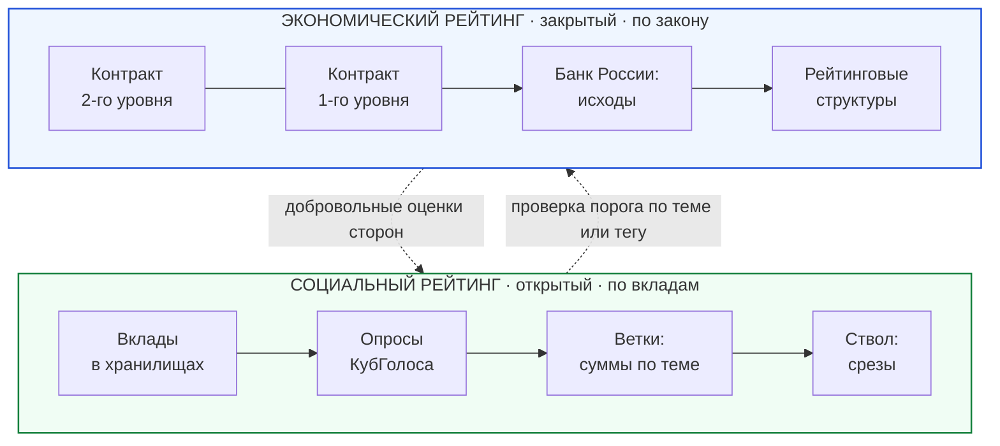
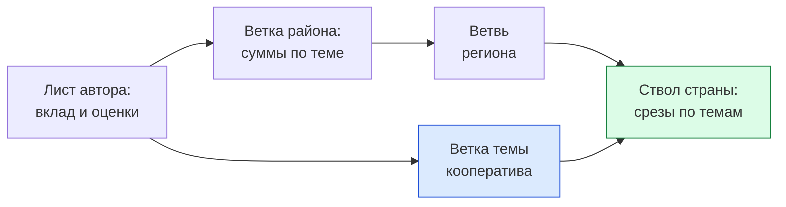
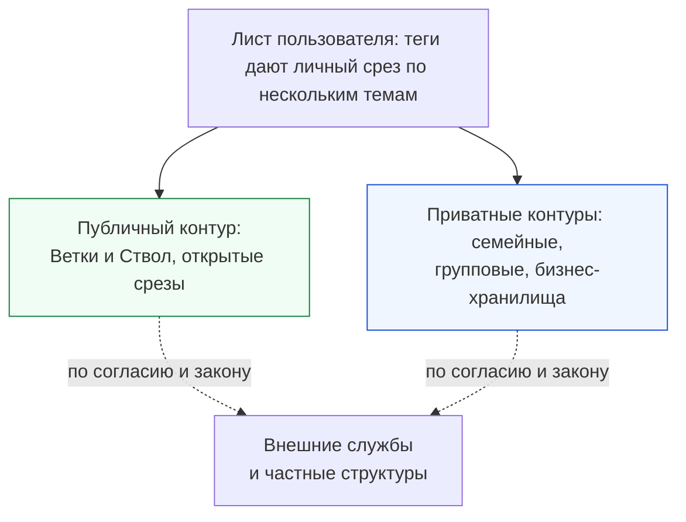
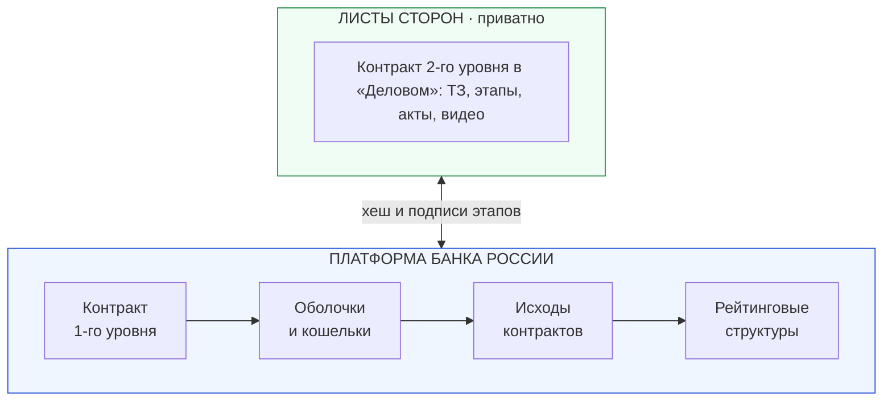
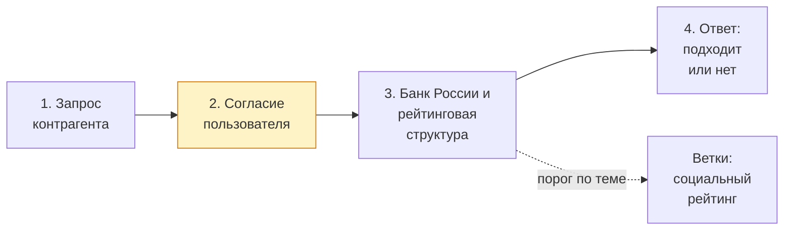
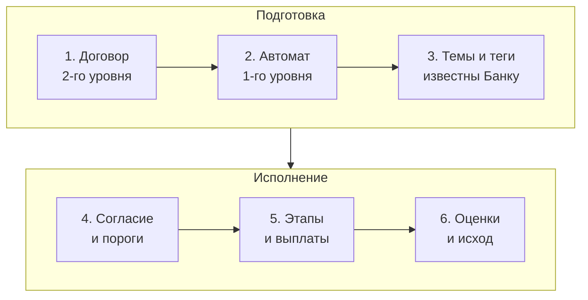
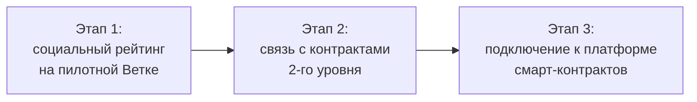

# Два рейтинга для суверенной экономики доверия: открытый социальный рейтинг вкладов и защищённый экономический рейтинг на платформе коммерческих смарт-контрактов

**Белая Книга: Концептуальные основы, архитектура агрегации и нормативная модель двух рейтингов**  
*Версия: 1.0 (2026)*  
*Статус: Общественный концептуальный документ*  
*Классификация: Социальные и экономические рейтинги, суверенные данные*  
*Автор: Артём Владимирович Шамсутдинов, разработчик платформы «Турбаза» — интернета суверенных и частных данных / открытого стека AIRport.*  
*Методология подготовки: модель двух рейтингов, принципы открытости социального рейтинга, передачи экономического рейтинга Банку России, политики оператора темы и уровней регистрации сформированы автором. Планирование документа выполнено моделью Claude Sonnet 5.5; схема агрегации вкладов по дереву Веток и четыре механизма разрыва цикла предложены ею в ходе работы над документами и приняты автором. Детальная проработка текста выполнена моделью Gemini 3.8 Flash.*

---

## Аннотация

Настоящий аналитический документ представляет проектную концепцию архитектуры доверия для платформы «Турбаза», основанную на строгом институциональном и техническом разделении социального и экономического рейтингов. Платформа задаёт универсальный распределённый механизм вычислений, тогда как содержательную политику по каждой теме определяет оператор темы в установленных законом границах. Единого универсального балла человека по умолчанию не выводится: репутация формируется независимо по предметным сферам.

Социальный рейтинг опирается на объективные индивидуальные вклады участников (реплики, идеи, подтверждённый практический опыт и выполненные дела) и открыт для всех как их общественное лицо. Экономический рейтинг формируется по фактическим исходам коммерческих смарт-контрактов в защищённом контуре платформы Банка России и рассчитывается подключёнными по закону рейтинговыми структурами. Доступ контрагентов к проверке экономического рейтинга возможен только с явного согласия пользователя под конкретную операцию. Взаимодействие двух контуров обеспечивается через проверку пороговых условий, гарантируя тайну счетов, сохранность личных сведений и суверенитет данных.

<!-- pagebreak -->

## Содержание

  
1. <a href="#1-задача-и-принципы" class="doc-link">Задача и принципы: доверие без монополии и единого балла</a>Стр. 3

  
2. <a href="#2-модель-двух-рейтингов" class="doc-link">Модель двух рейтингов: открытый социальный и защищённый экономический</a>Стр. 4

  
3. <a href="#3-социальный-рейтинг-объект-и-источники" class="doc-link">Социальный рейтинг: объект оценки и источники прикладных вкладов</a>Стр. 5

  
4. <a href="#4-агрегация-по-дереву" class="doc-link">Агрегация по дереву: структура узлов Веток и байесовская формула</a>Стр. 6

  
5. <a href="#5-целостность-разрыв-цикла-и-защита-от-накруток" class="doc-link">Целостность социального рейтинга: разрыв цикла и защита от накруток</a>Стр. 7

  
6. <a href="#6-права-пользователя-доступ-и-приватные-контуры" class="doc-link">Права пользователя, доступ к источникам и приватные контуры</a>Стр. 8

  
7. <a href="#7-экономический-рейтинг" class="doc-link">Экономический рейтинг: двухуровневые контракты и контур Банка России</a>Стр. 9

  
8. <a href="#8-согласие-и-проверка-порогов" class="doc-link">Согласие, проверка порогов и защита от направленного зондирования</a>Стр. 10

  
9. <a href="#9-связка-двух-рейтингов-сквозной-сценарий" class="doc-link">Связка двух рейтингов: сквозной сценарий исполнения подряда</a>Стр. 11

  
10. <a href="#10-практические-примеры" class="doc-link">Практические примеры: бытовая помощь, мебельная артель и двор</a>Стр. 12

  
11. <a href="#11-нормативная-карта" class="doc-link">Нормативная карта: правовое регулирование и роли участников</a>Стр. 13

  
12. <a href="#12-риски-открытые-вопросы-дорожная-карта" class="doc-link">Риски, открытые вопросы и этапы практического развёртывания</a>Стр. 14

  
13. <a href="#13-заключение-и-открытое-приглашение" class="doc-link">Заключение и открытое приглашение к сотрудничеству</a>Стр. 15

## Ключевые показатели

  

    
2

    
независимых рейтинга

    

      Разделение открытого социального рейтинга вкладов и закрытого экономического рейтинга Банка России.
    

  

  

    
0

    
единых баллов по умолчанию

    

      Отказ от одномерной оценки личности: репутация формируется независимо по отдельным предметным темам.
    

  

  

    
3

    
приложения-источника

    

      Первичные вклады и экспертные оценки создаются в приложениях «КубГолос», «Забота» и «Деловой».
    

  

<!-- pagebreak -->

## 1. Задача и принципы

Существующие институты оценки благонадёжности — бюро кредитных историй, банковский скоринг, системы отзывов на торговых площадках и зарубежные модели социального рейтингования — решили важнейшую историческую задачу. Они открыли гражданам и малым предприятиям доступ к заёмному финансированию, сформировали механизмы дистанционного доверия и повысили предсказуемость сделок в цифровой среде.

Вместе с тем развитие этих систем выявило ряд естественных архитектурных особенностей. В традиционных подходах оценка нередко сводится к единому скаляру, сглаживающему профессиональные различия; отзывы бывают оторваны от подтверждённых фактов исполнения договорённостей; субъекты ограничены в инструментах ответа, а давние ошибки могут оказывать бессрочное влияние на статус человека. Централизованное накопление подробных сведений в единых базах создаёт риски утечек. В настоящем исследовании предлагается свод идей, способных органично дополнить действующие подходы.

| Характеристика модели | Подход платформы «Турбаза» | Традиционные централизованные модели |
| :--- | :--- | :--- |
| **Объект оценивания** | Конкретный объективный вклад (дело, идея, решение) | Личность или организация в целом как субъект |
| **Структура показателя** | Многомерный срез по независимым темам и тегам | Единый скалярный балл или кредитный рейтинг |
| **Публичность данных** | Социальный рейтинг открыт; экономический защищён | Зачастую закрытая коммерческая база данных |
| **Основа доверия** | Проверяемые практические результаты и акты приёмки | Формализованные анкетные и финансовые показатели |
| **Владение данными** | Данные хранятся на устройствах владельцев | Данные централизованно аккумулируются оператором |

Архитектура рейтингов в платформе «Турбаза» базируется на пяти ключевых принципах:
* **Вклад, а не человек, как объект оценки:** авторитет формируется как производная от объективных результатов созидательного труда, а не из анкетных характеристик.
* **Тематическая дифференциация:** единицей измерения выступает тема; признание в инженерном деле не переносится автоматически на медицину или педагогику.
* **Верховенство закона над регламентами операторов:** операторы тем задают правила их ведения строго в границах действующего законодательства.
* **Защищённый экономический контур по согласию:** экономический рейтинг ведётся в контуре Банка России и проверяется контрагентами только при адресном согласии субъекта.
* **Экономика как вспомогательный усилитель:** платформа сохраняет самостоятельную пользу при обычном обмене данными, а смарт-контракты подключаются по необходимости.

<!-- pagebreak -->

## 2. Модель двух рейтингов

В платформе «Турбаза» реализовано строгое институциональное и техническое разграничение двух независимых контуров репутации: открытого социального рейтинга вкладов и защищённого экономического рейтинга исполнения обязательств. Такое разделение исключает монополизацию оценки граждан и защищает тайну личной жизни.

| Параметр сравнения | Открытый социальный рейтинг вкладов | Защищённый экономический рейтинг |
| :--- | :--- | :--- |
| **Объект оценки** | Полезные вклады: идеи, практический опыт, дела | Исходы исполнения смарт-контрактов |
| **Первичная запись** | Локальные хранилища участников (уровень Листа) | Платформа смарт-контрактов Банка России |
| **Механизм сбора** | Агрегация по дереву Веток (подтема → тема → Ствол) | Расчёт рейтинговыми структурами по методикам ЦБ |
| **Режим доступа** | Открытый общедоступный контур («общественное лицо») | Закрытый контур; доступ строго по согласию сторон |
| **Идентификация** | Идентификатор профиля (анонимный или поимённый) | Временная оболочка, привязанная к счёту ЦБ |

Первичные свидетельства социального рейтинга формируются в локальных базах на устройствах и поступают в опросы «КубГолоса». Ветки суммируют отклики, передавая агрегаты на уровень региона и Ствола страны. Экономический рейтинг опирается на смарт-контракты: платёжный автомат первого уровня фиксирует исходы в Банке России, а детальные условия сохраняются во втором уровне на Листах сторон.

<!-- pagebreak -->

## 3. Социальный рейтинг: объект и источники

Социальный рейтинг формируется на основе практической активности участников в трёх прикладных сервисах платформы: «КубГолос», «Забота» и «Деловой». Приложения в первую очередь служат для надёжного хранения и обмена данными, а система рейтингов выступает надстройкой над их рабочими журналами:
* **«КубГолос»:** проводит опросы по структурированным факторам, рассчитывает позиции участников на отрезке $[-1; +1]$ и формирует блоки эпох на Ветках со шкалами «Результат», «Эксперты» и «Народ».
* **«Забота»:** аккумулирует жизненные Случаи взаимопомощи, коллективные Идеи, подтверждённый практический Опыт («Speak» — аудиозапись с расшифровкой на устройстве, «Show» — видеоинструкция) и содержательные реплики в обсуждениях.
* **«Деловой»:** фиксирует завершённые Дела, поручения и подписанные акты приёмки работ с использованием тематических тегов.

| Приложение | Разновидность учитываемого вклада | Состав участников оценивания |
| :--- | :--- | :--- |
| **«КубГолос»** | Оценка идей, предложений, инициатив | Пользователи Ветки по правилам опроса |
| **«Забота»** | Случаи взаимопомощи, Опыт, реплики | Все участники тематического обсуждения |
| **«Деловой»** | Выполненные задачи, этапы подряда, акты | Исключительно участники конкретного дела |

Записи создаются непосредственно авторами в рамках принципа прямого авторского владения (Write-Self): участник подписывает свой вклад личным криптографическим ключом, чужие записи изменить невозможно, а оценки третьих лиц формируются как их самостоятельные записи.

Вся частная информация хранится в изолированных хранилищах на пользовательских устройствах (Листах) и никогда не попадает на Ветки. Ветки индексируют только общедоступные структуры (темы, теги, страницы публичных тредов). Благодаря этому узлы сети «Турбаза» не выступают операторами персональных данных.

Социальный рейтинг ведётся для трёх установленных режимов участия:
1. **Полная анонимность:** личность неизвестна сети, фиксируется лишь идентификатор района (Branch ID) для участия в местных инициативах.
2. **Социальная анонимность:** персональные данные в открытый контур не выводятся, но уникальность человека подтверждена через Банк России (один кошелёк на человека) либо процедуру поручительства соседей.
3. **Поимённая регистрация:** гражданин осознанно публикует своё имя в общественном контуре, о чём приложение предупреждает на отдельном экране до подтверждения регистрации.

<!-- pagebreak -->

## 4. Агрегация по дереву

Агрегация социального рейтинга строится на принципах аддитивности и локальной проверяемости. Промежуточные узлы сети (Ветки) не накапливают подробных протоколов взаимодействия и не хранят прямых связей с отдельными персональными хранилищами. Вместо этого они агрегируют обезличенные числовые массы свидетельств снизу вверх: от района через региональные Ветви к Стволу страны.

Для каждого отдельного вклада $c$ голоса участников $i$ преобразуются в положительную $R_c$ и отрицательную $S_c$ компоненты с учётом нормализованной позиции $s_i \in [-1; +1]$ и веса голосующего $w_i$:
$$R_c = \sum_i w_i\,\frac{1+s_i}{2},\qquad S_c = \sum_i w_i\,\frac{1-s_i}{2}$$

Узел Ветки по участнику $p$ и предметной теме $T$ накапливает суммы $R_T(p)$ и $S_T(p)$ по фиксированным корзинам эпох. Родительский узел вычисляет сумму дочерних узлов точно так же, как «КубГолос» агрегирует результаты голосований. При чтении накопленных данных применяется экспоненциальное затухание устаревающих оценок с периодом полураспада $T_{1/2}$, задаваемым оператором темы:
$$\text{множитель затухания} = 2^{-\Delta t / T_{1/2}}$$

Итоговый показатель доверия $E$ в теме рассчитывается по регуляризованной байесовской формуле с априорным средним $a=0{,}5$ и весом базового ожидания $W=2$:
$$E = \frac{R + aW}{R + S + W} = \frac{R + 1}{R + S + 2}$$

В публичном пространстве всегда публикуются одновременно два значения: показатель $E$ и совокупная масса свидетельств $R+S$. Это исключает иллюзию высокого авторитета у новичка с единственным положительным отзывом.

| Свидетельства по теме | Масса положительных $R$ | Масса отрицательных $S$ | Показатель доверия $E$ |
| :--- | :---: | :---: | :---: |
| **Исходное состояние (нет данных)** | 0 | 0 | 0,50 (нейтрально) |
| **Один положительный отклик** | 1 | 0 | 0,67 |
| **Три положительных отклика** | 3 | 0 | 0,80 |
| **18 положительных, 2 отрицательных** | 18 | 2 | 0,86 |
| **100 положительных подтверждений** | 100 | 0 | 0,99 |

Принцип согласованности гарантирует, что вычисление авторитета по тегам на клиентском устройстве (Листе) и расчёт на Ветке темы дают строго тождественный результат на одинаковом массиве вкладов. Единый обобщённый балл гражданина по умолчанию не формируется.

<!-- pagebreak -->

## 5. Целостность: разрыв цикла и защита от накруток

Для устранения циклической зависимости, при которой авторитет определяет вес голоса, а голоса формируют авторитет, разработаны четыре взаимосвязанных механизма:
1. **Дискретизация по эпохам:** голос участника в текущую эпоху $N$ взвешивается его авторитетом, зафиксированным в блоке завершённой эпохи $N-1$. Пересчёт авторитета исключает циклические зависимости внутри одного периода.
2. **Ограничение мнений материальными свидетельствами:** субъективные мнения не могут бесконечно повышать авторитет без подтверждённых результатов труда (принятых идей, практического опыта или актов сдачи-приёмки работ):
$$M_{\text{мн}}^{\text{эфф}} = \min\bigl(M_{\text{мн}},\;\kappa\,M_{\text{вн}} + m_0\bigr)$$
Начальные параметры установлены как $\kappa=1$ и $m_0=2$. Попытка накрутки исключительно взаимными отзывами блокируется математическим потолком.
3. **Сублинейный вес голосующего:** влияние авторитета эксперта масштабируется через функцию квадратного корня с гарантированным базовым порогом $w_{\min}=0{,}1$:
$$w_i = w_{\min} + (1 - w_{\min})\sqrt{b_i},\qquad b_i = \frac{R_i}{R_i + S_i + W}$$
При этом базовый показатель $b_i$ рассчитывается строго по теме обсуждаемого треда.
4. **Подавление сговора:** самооценка блокируется. При взаимных оценках в одном расчётном окне их вес снижается вдвое ($\rho=0{,}5$). Для групп с высокой плотностью внутренних связей активируется штрафной коэффициент кластеризации.

| Класс потенциальной угрозы | Архитектурный механизм защиты платформы |
| :--- | :--- |
| **Кольцевая накрутка голосов** | Окно эпох, дисконт взаимных оценок и штраф за кластеризацию |
| **Имитация активности ботами** | Разделение режимов регистрации и опора на материальные акты приёмки |
| **Эмоциональная месть за отзыв** | Слепое одновременное раскрытие оценок сторон после завершения этапа |
| **Накачка мелкими действиями** | Нормирование веса свидетельства по материальному объёму и содержанию |

> Приведённые параметры алгоритмов представляют собой начальные инженерные ориентиры по умолчанию. Операторы тем вправе адаптировать их под специфику отраслей, а окончательная калибровка подлежит уточнению методами имитационного моделирования.

Платформа параллельно выводит две метрики: «Народ» (прямой подсчёт голосов без весов) и «Эксперты» (взвешивание авторитетом участников в теме). Расхождение между ними отражает профессиональную специфику оценки.

<!-- pagebreak -->

## 6. Права пользователя, доступ и приватные контуры

Архитектура платформы «Турбаза» защищает права граждан на неприкосновенность частной жизни и охрану деловой репутации. Открытость социального рейтинга уравновешивается развитой системой процедурных гарантий и разделением пространств видимости:
* **Право на мотивированный ответ:** в приложении «Забота» участник или организация при получении критической оценки могут опубликовать официальный ответ, отображаемый совместно с исходным отзывом.
* **Аудит рейтинга до первичного источника:** обобщённые суммы на Ветках не содержат ссылок на клиентские устройства. Для детального разбора участник может выполнить спуск через поиск по тегам на собственном Листе, что требует локальных ресурсов аппарата.
* **Границы операторов тем:** оператор настраивает параметры затухания и пороги шкал строго в рамках закона; неправомерные или порочащие сведения не подлежат публикации.

Наряду с публичным контуром поддерживаются герметичные приватные хранилища (семейные, где Ветка является слепым ретранслятором, и корпоративные), а также параллельные частные ветви организаций, взаимодействующие с внешними системами по согласию сторон. Смена статусов регистрации подчиняется строгим правилам: полностью анонимный рейтинг не переносится (защита от торговли профилями), тогда как социально анонимный рейтинг может быть переведён в поимённый, так как уникальность гражданина уже подтверждена.

<!-- pagebreak -->

## 7. Экономический рейтинг

Экономический рейтинг в концепции платформы «Турбаза» служит инструментом оценки платёжной и контрактной дисциплины. В отличие от социального рейтинга, этот показатель строго конфиденциален, вычисляется на основе завершённых смарт-контрактов и функционирует в правовом поле специализированных институтов.

Основой контрактной модели выступает разделение сделки на два скоординированных уровня:
* **Контракт 2-го уровня (L2) в приложении «Деловой»:** располагается в изолированных хранилищах на устройствах сторон. Содержит полный объём содержательной информации: техническое задание, промежуточные этапы, смету, акты приёмки и переписку.
* **Контракт 1-го уровня (L1) на платформе Банка России:** детерминированный конечный автомат (FSM) $O(1)$ в системе коммерческих смарт-контрактов. Автомат оперирует суммами расчётов, контрольными хеш-суммами этапов и состояниями («ожидание», «исполнено», «расторгнуто»).

Для изоляции платёжных реквизитов используются временные контрактные оболочки — сменяемые криптографические адреса, привязанные к реальному цифровому счёту в Банке России. Стороны контракта не видят счетов друг друга, сохраняя коммерческую тайну, однако регулятор располагает достоверной информацией об участниках и фактических исходах сделок.

В экономической активности допускается социальная анонимность: участник сохраняет конфиденциальность перед контрагентом, тогда как Банк России однозначно верифицирует владельца счёта по правилу «один кошелёк на человека» (деанонимизация возможна только по решению суда). В предлагаемой модели расчёт экономического рейтинга выполняют Банк России и подключённые им рейтинговые структуры. Разработчик платформы предлагает развить категорию доверенных поставщиков данных концепции ПКСК Банка России, включив в неё специализированные рейтинговые организации.

<!-- pagebreak -->

## 8. Согласие и проверка порогов

Фундаментальным условием использования экономического рейтинга выступает соблюдение законодательства о защите личной информации и кредитных историй. Любая проверка финансовой благонадёжности может производиться исключительно при наличии предварительного информированного согласия гражданина или предпринимателя под конкретную операцию.

Процедура проверки соответствия контрагента условиям сделки включает четыре шага:
1. **Запрос контрагента:** инициатор сделки указывает минимальный порог рейтинга, необходимый для заключения договора подряда или предоставления коммерческого кредита.
2. **Согласие пользователя:** проверяемая сторона получает уведомление с указанием заявителя, цели и срока действия проверки, подтверждая запрос цифровой подписью.
3. **Обработка запроса:** Банк России совместно с рейтинговой структурой сопоставляет фактические параметры участника с заявленным порогом. При необходимости Банк запрашивает у тематических Веток проверку порога социального рейтинга по теме контракта.
4. **Минимально достаточный ответ:** заявитель получает машиночитаемый ответ («соответствует требованиям» либо «не соответствует» без раскрытия балла и расшифровки причин).

Ограничение содержания ответа двоичной формой («подходит / не подходит») исключает утечку профиля и предотвращает необоснованную дискриминацию участников оборота. В соответствии с законодательством гражданам гарантируется право на оспаривание решений, принятых на основе исключительно автоматизированной обработки данных.

Существенной угрозой выступает направленное зондирование (пробинг): попытка контрагента серией запросов с плавающим порогом вычислить точный рейтинг участника. Для противодействия архитектура предусматривает:
* Квотирование числа проверочных запросов между парой контрагентов на календарный период;
* Огрубление шкалы порогов с дискретным шагом проверочных диапазонов;
* Ведение защищённого журнала проверок, доступного владельцу рейтинга на клиентском устройстве для выявления несанкционированного сбора сведений.

<!-- pagebreak -->

## 9. Связка двух рейтингов: сквозной сценарий

Практическая сила предлагаемой архитектуры проявляется в скоординированном взаимодействии социального и экономического контуров на примере договора подряда:

Исполнение договора осуществляется в шесть согласованных этапов:
1) **Договор L2 в «Деловом»:** стороны фиксируют смету, вехи и техническое задание на Листах;
2) **Автомат L1 в Банке России:** средства заказчика блокируются на защищённом счёте эскроу;
3) **Передача тегов:** расчётное ядро уведомляется об идентификаторах тем предстоящих работ;
4) **Проверка порогов:** с согласия сторон проверяются платёжеспособность и опыт мастера;
5) **Поэтапные расчёты:** акты в «Деловом» разблокируют соответствующие транши эскроу;
6) **Фиксация и отзывы:** исход сделки фиксируется в ЦБ, а в «КубГолосе» выставляются оценки.

| Контур системы | Содержание фиксируемых данных | Уровень доступности информации |
| :--- | :--- | :--- |
| **Приватный L2 («Деловой»)** | Чертежи, акты, текстовая переписка, видео | Строго конфиденциально (только стороны) |
| **Расчётный L1 (Банк России)** | Суммы этапов, временные метки, факт исполнения | Банк России и рейтинговые структуры |
| **Социальный (Ветки темы)** | Оценка соблюдения сметы, качества и сроков | Открыто для всех в структуре темы |

Тематические теги связывают контракт со срезом репутации. Социальный рейтинг обогащает экономическое решение, а финансовые сведения остаются надёжно защищёнными.

<!-- pagebreak -->

## 10. Практические примеры

Жизнеспособность модели двух рейтингов подтверждается практическими примерами из руководств по социально-экономическому влиянию платформы «Турбаза»:

### 1. Бытовая взаимопомощь: адаптация жилья для маломобильного дедушки
Сосед-инженер публикует в «Заботе» подробную видеоинструкцию («Show») по сборке деревянного пандуса и переоборудованию санузла. Семья привлекает недостающие 30 000 рублей через беспроцентный заём внутри семейного круга в цифровых рублях с автоматическим возвратом по графику.
* **Вклад и оценивание:** видеоинструкция оценивается применившими её соседями и участниками темы.
* **Социальный след:** рост авторитета инженера в теме «доступная среда» в открытом контуре района.
* **Экономический след:** расчёты происходят в приватном семейном контуре; попадание данных во внешний экономический рейтинг зависит исключительно от закона и согласия участников (по умолчанию изолировано).

### 2. Производственная кооперация: мебельная артель
Артель из шести мастеров выполняет индивидуальный заказ на изготовление кухни стоимостью 350 000 рублей по трёхэтапному договору в приложении «Деловой» (проект — 50 000 руб., материалы — 150 000 руб., монтаж по чек-листу — 150 000 руб.) с эскроу цифрового рубля.
* **Вклад и оценивание:** выполнение работ по этапам с подписанием цифровых актов; отклики заказчика в «КубГолосе» по факторам точности, качества сборки и чистоты монтажа.
* **Социальный след:** артель накапливает открытые оценки по теме «производство мебели» с правом ответа.
* **Экономический след:** Банк России фиксирует исполнение контракта без споров, а рейтинговая структура учитывает исход при последующей оценке финансовой дисциплины артели.

### 3. Местное самоуправление: установка шлагбаума во дворе
Жители дома выносят в «КубГолос» предложение об ограничении транзитной парковки. В голосовании взвешиваются три фактора: доступность мест (+95), расходы на обслуживание (−45) и проезд экстренных служб (−30). ТСЖ компенсирует расходы пенсионеров за счёт аренды фасада, проект одобряется 88% голосов.
* **Вклад и оценивание:** инициатива и расчёт сметы по содержанию шлагбаума.
* **Социальный след:** автор идеи получает признание соседей в теме «благоустройство двора».
* **Экономический след:** отсутствует. Пример показывает высокую самостоятельную ценность социального рейтинга без привлечения финансовых инструментов.

| Практический сценарий | Первичный вклад | Социальный след в теме | Экономический след в контрактах |
| :--- | :--- | :--- | :--- |
| **Пандус для дедушки** | Видеоинструкция монтажа | Рост авторитета в теме доступной среды | Приватный заём без внешнего раскрытия |
| **Мебельная артель** | Сданный объект по чек-листу | Открытый рейтинг в теме производства | Подтверждённый контракт в Банке России |
| **Шлагбаум во дворе** | Инициатива и расчёт сметы | Локальный авторитет в самоуправлении | Отсутствует (чисто социальный контур) |

<!-- pagebreak -->

## 11. Нормативная карта

Интеграция распределённых систем доверия в правовое поле Российской Федерации опирается на гармонизацию с нормативной базой, регулирующей обращение данных, финансовые инструменты и кредитные отношения:

| Отрасль законодательства | Предмет нормативного регулирования | Соответствие модели двух рейтингов платформы «Турбаза» |
| :--- | :--- | :--- |
| **Кредитные истории** | Формирование и выдача отчётов об исполнении обязательств | Запрос экономического рейтинга допускается только при адресном согласии субъекта с ограниченным сроком |
| **Кредитные рейтинговые агентства** | Требования к методологиям и независимости агентств | Законодательство ориентировано на организации; применение аналогичных методик к гражданам требует правовой оценки |
| **Персональные данные** | Минимизация обработки и защита прав субъектов данных | Данные хранятся на Листах, Ветки не накапливают личных сведений; запрет автоматических решений без права возражения |
| **Противодействие отмыванию доходов** | Идентификация участников расчётов и прозрачность потоков | Прозрачность для регулятора в Банке России при защите реквизитов от третьих лиц сменными оболочками |
| **Коммерческие смарт-контракты** | Проектные регламенты платформы смарт-контрактов | Разделение сделки на L1 (детерминированный FSM Банка России) и L2 (содержательная логика в «Деловом») |

Институциональная структура распределения ответственности включает следующие роли:
* **Банк России:** оператор платформы коммерческих смарт-контрактов, обеспечивающий расчёты в цифровых рублях, ведение реестра состояний контрактов и допуск аккредитованных рейтинговых организаций.
* **Рейтинговые структуры:** аккредитованные регулятором организации, рассчитывающие экономические рейтинги по утверждённым стандартам и дающие ответы на пороговые запросы.
* **Операторы Веток (кооперативы):** сопровождают узлы сети, определяют политику тем в границах закона, обеспечивают хранение сумм без доступа к персональным базам граждан.
* **Государственные ведомственные Ветки:** выступают доверенными тематическими узлами либо внешними шлюзами взаимодействия с государственными системами.

> Окончательная правовая квалификация предлагаемых архитектурных механизмов и порядок их аккредитации закрепляются за Банком России и уполномоченными органами государственной власти. Настоящий документ представляет собой научно-техническое концептуальное исследование и не заменяет официального правового заключения.

Для ознакомления с актуальными редакциями нормативных актов рекомендуется обращаться к официальным государственным порталам: Центрального банка Российской Федерации ([cbr.ru](https://cbr.ru)) и Официальному интернет-порталу правовой информации ([pravo.gov.ru](http://pravo.gov.ru)).

<!-- pagebreak -->

## 12. Риски, открытые вопросы и дорожная карта

Проектирование суверенной инфраструктуры доверия требует учёта системных рисков и открытых задач:
* **Сведение к единому баллу:** архитектура противостоит этому, не формируя единого агрегата на уровне протокола.
* **Зондирование порогов:** попытки вычисления балла через частые запросы нейтрализуются квотированием и огрублением.
* **Множественные профили:** создание нескольких анонимных профилей не даёт преимуществ: рейтинги не объединяются.
* **Разногласия политик тем:** потребность в стандартах взаимодействия между независимыми кооперативными Ветками.
* **Статус публичных реестров:** необходимость правового анализа открытой индексации в контексте защиты данных.

Задачи будущих исследований: протоколы управляемого забвения данных, криптозащита от пробинга и моделирование затухания.

Программа поэтапного внедрения архитектуры включает три стадии без привязки к фиксированным датам:
* **Этап 1. Локальный социальный контур:** развёртывание агрегации вкладов в приложениях «Забота» и «КубГолос» на базе пилотной территориальной Ветки района.
* **Этап 2. Контрактная интеграция второго уровня:** отработка взаимодействия дел в приложении «Деловой» с формированием предметных рейтингов и аудитом по тегам.
* **Этап 3. Подключение к государственной платформе смарт-контрактов:** тестирование связки с платформой Банка России, рейтинговыми структурами и процедурами проверки порогов.

> Практическая реализация представленных проектных этапов напрямую зависит от привлечения необходимой материальной поддержки, формирования сильной инженерной команды и наличия достаточного времени на разработку. Наступят ли эти необходимые условия и в какие сроки, в настоящее время объективно неизвестно.

<!-- pagebreak -->

## 13. Заключение и открытое приглашение

Представленная проектная концепция двух рейтингов для платформы «Турбаза» закладывает технологические основы для формирования справедливой и децентрализованной экономики доверия. Главные итоги аналитического исследования сводятся к пяти фундаментальным положениям:
1. **Баланс открытости и конфиденциальности:** разделение открытого социального рейтинга полезных вкладов и закрытого экономического рейтинга исключает монополизацию оценки граждан и защищает тайну личной жизни.
2. **Оценка дел вместо оценки личности:** первичным объектом анализа выступают проверяемые результаты созидательного труда — идеи, подтверждённый практический опыт, выполненные поручения и сданные работы.
3. **Многомерность взамен одномерного балла:** отказ от сведения репутации человека к единому универсальному числу гарантирует объективное признание заслуг в конкретных жизненных сферах без риска поражения в правах.
4. **Приоритет закона над локальными регламентами:** платформа предоставляет нейтральные криптографические алгоритмы, тогда как правила ведения тем задаются операторами строго в границах правового поля страны.
5. **Самостоятельная ценность прикладной экосистемы:** ключевое общественное назначение платформы заключается в удобном обмене информацией, взаимопомощи и защищённом хранении данных, а экономические смарт-контракты служат инструментом усиления взаимодействия.

Разработчик платформы приглашает к открытому экспертному диалогу и сотрудничеству научные организации, профильные ведомства, независимых разработчиков, математиков, юристов и операторов кооперативных сетей.

Архитектура платформы «Турбаза» создаётся в открытых стандартах с опорой на исходный код ядра реляционных репозиториев AIRport. Первым практическим шагом сотрудничества видится проведение открытого пилотного эксперимента по развёртыванию социального рейтинга на базе территориальной районной Ветки при формировании необходимых материальных, кадровых и организационных условий, обозначенных в настоящем докладе.
