# «КубГолос»: измерять и складывать

**Белая книга № 08: форма оценки, счётчики и сложение вверх по дереву**  
*Версия: 1.0 (2026)*  
*Статус: проектная концепция*  
*Классификация: прикладной уровень платформы «Турбаза»*  

> *Автор: Артём Владимирович Шамсутдинов, разработчик платформы цифрового суверенитета государства «Турбаза» — интернета автономных и частных данных / открытого стека AIRport.*  
> *Методология подготовки: замысел приложения «КубГолос», его место в платформе, принципы работы с оценками, счётчиками и деревьями Веток, режимы регистрации и двухконтурная модель сформированы автором. Планирование документа выполнено моделью Claude Sonnet 5.5; распределение понятий между тремя книгами комплекта и порядок изложения предложены ею для утверждения автором. Детальная проработка текста выполнена моделью Gemini 3.8 Flash.*

---

## Аннотация

Настоящая Белая книга открывает прикладную серию платформы цифрового суверенитета государства «Турбаза» и посвящена первому из трёх системообразующих приложений — системе многофакторной оценки «КубГолос». Главное назначение книги состоит не в описании пользовательских экранов или возможностей программы как отдельного коммерческого продукта, а в детальном раскрытии фундаментального вклада приложения в общую платформенную архитектуру. Именно на «КубГолосе» отрабатываются и доводятся до инженерной строгости ключевые примитивы распределённой обработки данных: форма многомерной оценки со строго ограниченным бюджетом влияния участников, непрерывные счётчики в оперативной памяти координационных узлов, квантование времени блоками эпох, иерархическое суммирование показателей снизу вверх по территориальным и категориальным деревьям, а также модель разделения общественного и частного контуров со слепым ретранслятором.

Документ описывает математический аппарат двух метрик результата — значимости фактора и позиции участников по нему, исключающий сведение сложного общественного мнения к единственному скалярному показателю. В книге представлена модель трёх независимых шкал консенсуса («Народ», «Эксперты», «Результат»), позволяющая сопоставлять массовую демократическую поддержку с квалифицированным суждением и внешними подтверждениями практикой. Подробно разобраны три режима регистрации участников, многоуровневая система снижения стимулов к искусственной накрутке и объективные пределы устойчивости децентрализованных систем перед лицом атак Сивиллы. Показано, каким образом прикладные механизмы приложения естественным путём преобразуются в готовые базовые модули платформы, доступные сторонним разработчикам. Материал изложен как свод проектных концепций и решений, прошедших первичную отладку в исследовательских прототипах.

### Как читать эту книгу

Книга подготовлена как самостоятельный документ открытой публикации, не требующий обязательного предварительного знакомства с другими материалами серии. Все необходимые системные и архитектурные понятия поясняются непосредственно в тексте при их первом появлении.

Для последовательного восприятия материала текст разбит на тематические блоки. Главы 1–3 вводят задачу приложения, его место в экосистеме платформы, устройство многофакторного волеизъявления и связь предлагаемых решений с контекстом жизненных ситуаций. Главы 4–8 раскрывают вычислительное ядро: принцип формирования записей, работу оперативных счётчиков, выпуск блоков эпох, математику древовидного суммирования, префиксный поиск и три шкалы согласования. Главы 9–12 сосредоточены на безопасности, режимах анонимности, разделении контуров приватности, юридической фиксации срезов и экономике вычислительных узлов. Главы 13–15 демонстрируют практические сценарии применения, систематизируют переход прикладных конструкций в общие платформенные модули ядра и очерчивают границы архитектурной роли приложения.

---

## 1. Задача и место приложения в платформе

Совместная деятельность людей на всех уровнях общественной жизни — от принятия решений внутри одной семьи до обустройства общего двора, согласования правил в товариществе собственников жилья или выбора приоритетов развития городского района — неизбежно требует выявления общего согласия. Классические формы опросов и голосований, основанные на простом бинарном выборе («да» или «нет») либо линейном выборе одного варианта из предложенного перечня, внесли колоссальный вклад в развитие институтов управления, социологии и коллективного планирования. Однако таким формам присуща фундаментальная особенность: они фиксируют лишь конечное направление предпочтения, но оставляют скрытыми мотивы участников, силу их убеждённости и готовность к компромиссу. Бинарный опрос показывает, сколько людей проголосовало против того или иного предложения, но не даёт ответа на вопрос, почему они заняли такую позицию — из-за высокой финансовой стоимости, сомнений в надёжности, неудобных сроков или опасений за безопасность. В результате организаторам приходится либо начинать дорогостоящую серию повторных исследований, либо принимать решение в условиях скрытого социального напряжения.

Многофакторная оценка в архитектуре «Турбазы» проектируется не как противопоставление или замена проверенных временем социологических инструментов, а как их естественное аналитическое дополнение. Платформе цифрового суверенитета государства, в которой первичные данные сохраняются непосредственно на клиентских аппаратах граждан в режиме прямого автономного владения (Self-Custody), требовался полигон для отработки общих механизмов децентрализованного сбора, фильтрации и обобщения данных в условиях высоких пиковых нагрузок и максимально простой структуры записей. «КубГолос» стал именно таким системообразующим приложением: на задаче выражения мнений отрабатываются универсальные алгоритмы, которые впоследствии ложатся в основу всей инфраструктуры социальных рейтингов, распределённого поиска и взаимодействия с внешними расчётными системами.

Для ясного понимания дальнейшего изложения необходимо кратко определить базовые элементы трёхуровневой топологии платформы «Турбаза». Нижний уровень образуют Листы — пользовательские устройства (смартфоны, персональные компьютеры), на которых локально функционирует встраиваемая база данных и криптографический модуль; Лист полностью автономен и хранит персональные данные владельца. Промежуточный уровень формируют Ветки — специализированные серверные узлы районов, городов, ведомств или тематических сообществ, выполняющие роль шлюзов координации, маршрутизации и агрегации без доступа к закрытым личным файлам. Узлы, объединяющие группы Веток на уровне региона или крупной отрасли, именуются Ветвями. Верхний уровень представляет Ствол — доверенный координационный узел страны, обеспечивающий глобальную адресацию и защищённое межгосударственное взаимодействие. Базовой единицей хранения и изоляции информации в платформе выступает хранилище — автономный массив структурированных данных по конкретной теме со своим собственным журналом криптографически подписанных изменений.

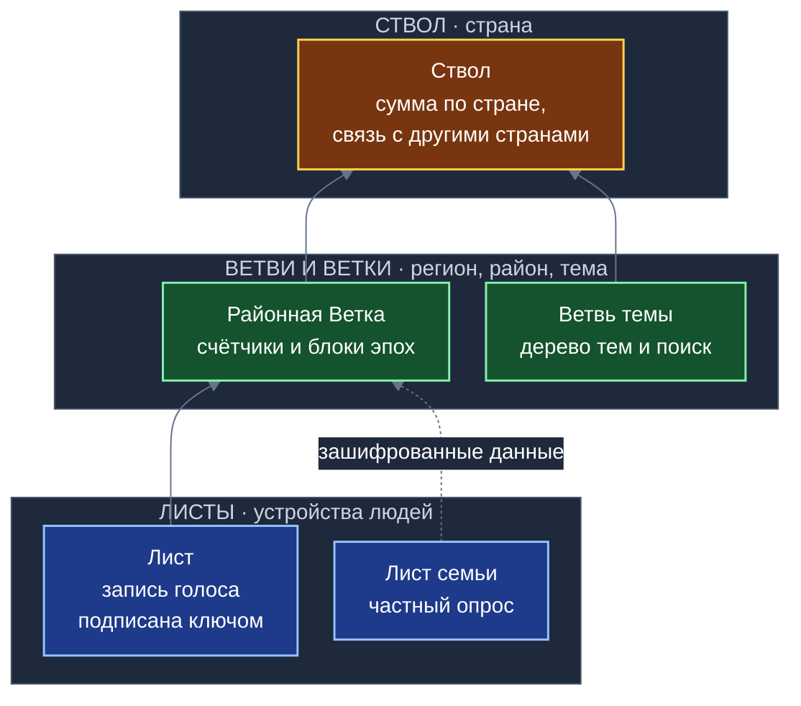
*Схема 1. Потоки данных между топологическими уровнями платформы «Турбаза» при обработке открытых и зашифрованных опросов.*

Отработка прикладных механизмов в рамках «КубГолоса» даёт платформе целый спектр стандартизированных модулей, представленных в таблице ниже.

| № | Прикладной вклад «КубГолоса» | Назначение в качестве общего модуля платформы | Глава описания |
|---|---|---|:---:|
| 1 | Многофакторная оценка со 100 базисными пунктами бюджета и двумя метриками | Универсальный формат оценки любых объектов, идей и результатов труда | 2 |
| 2 | Контекстное связывание «Идея в ситуации», версионирование и единое дерево тем | Тематический классификатор и механизм ветвления смысловых сущностей | 3 |
| 3 | Принцип «Пиши только своё», бесконфликтное переголосование и режим только добавления | Базовый регламент формирования проверяемых и некорректируемых журналов записей | 4 |
| 4 | Оперативные счётчики в памяти Ветки и выпуск периодических блоков эпох | Высокопроизводительный примитив расчёта агрегатов, индексов и согласий | 5 |
| 5 | Иерархическое сложение числовых сумм вверх по территориальным и тематическим деревьям | Общеплатформенная модель безопасного масштабирования аналитических показателей | 6 |
| 6 | Навигация по дереву тем, префиксный поиск по буквам и локальная дедупликация | Каркас распределённого каталога и смысловой фильтрации потока запросов | 7 |
| 7 | Три независимые шкалы согласования: «Народ», «Эксперты» и «Результат» | Стандарт параллельного представления прямого мнения, квалифицированного веса и практики | 8 |
| 8 | Дифференцированные режимы регистрации и многоуровневая защита от накруток | Общесистемный контур идентификации участников и управления доверием на узлах | 9 |
| 9 | Общественный и частный контуры с использованием слепого ретранслятора | Единый шаблон защиты приватности для групповых, семейных и корпоративных данных | 10 |
| 10 | Выпуск юридически значимого подписанного блока отсечки и режим автономной работы | Модуль сопряжения с внешними государственными реестрами и локальный консенсус | 11 |
| 11 | Экономика распределённых узлов и детерминированное распределение выручки | Экономическая модель самоокупаемости вычислительных мощностей платформы | 12 |

На уровне архитектуры данных соблюдается строгий принцип однонаправленной зависимости: схема таблиц и сущностей «КубГолоса» полностью автономна и не зависит от прикладных схем сети взаимопомощи «Забота» или органайзера «Деловой». Напротив, последующие сервисы опираются на идентификаторы и примитивы «КубГолоса». При этом на уровне пользовательского интерфейса действует принцип независимой блочной композиции: графические карточки оценки, миниатюрные кубы факторов и диаграммы распределения могут беспрепятственно встраиваться в интерфейсы любых сторонних приложений платформы.

---

## 2. Форма оценки: многофакторный голос

В основе механизма оценки лежит разделение любого обсуждаемого вопроса на конкретную Идею и набор связанных с ней факторов — ключевых аспектов, критериев или аргументов, определяющих отношение человека к предложенному решению. В стандартной конфигурации рассматриваются три ведущих фактора (образующих смысловой базис трёхмерного пространства), а в расширенном представлении общее число оцениваемых факторов может достигать семи. По каждому из выбранных факторов голосующий выражает свою позицию: знак («за» либо «против») и меру своей поддержки или неприятия.

Принципиальным проектным ограничением выступает бюджет влияния: каждому участнику на один вопрос выделяется строго фиксированный ресурс, равный 100 базисным пунктам (б.п.), что эквивалентно 100% располагаемого влияния. Человек не может искусственно завысить свой вес, поставив наивысший балл сразу по всем доступным направлениям. Если участник считает критически важной исключительно финансовую сторону проекта, он вправе отдать все 100 базисных пунктов фактору стоимости. Если же его в равной степени волнуют экологическая безопасность, сроки реализации и удобство эксплуатации, бюджет распределяется между ними (например, 40, 30 и 30 базисных пунктов). Более того, по каждой конкретной оси действует фундаментальное логическое правило: невозможно одновременно выразить максимальное согласие и максимальное несогласие с одним и тем же критерием.

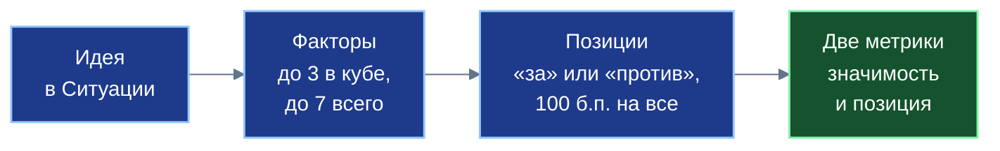
*Схема 2. Логическая цепочка многофакторного анализа: от исходного предложения к раздельному формированию метрик значимости и позиции.*

Наглядным физическим воплощением этого принципа служит метафора трёхмерного куба. Противоположные стороны куба по любой из трёх пространственных осей соответствуют полярным позициям одного фактора («за» и «против»). Человек, вращающий куб в пространстве, физически не может видеть обе противоположные грани одновременно: приближение одной грани неизбежно скрывает противоположную. Видимая площадь проекции граней на плоскость взгляда определяет распределение долей внимания между факторами, а суммарная видимая площадь всегда равна единице (ста процентам бюджета). В экранном интерфейсе метафора реализуется через интерактивные карточки: переворот карточки меняет знак позиции на противоположный, а горизонтальное смещение ползунка регулирует долю выделяемых базисных пунктов. Дополнительные вспомогательные факторы вне основного трёхмерного ядра регулируются отдельными шкалами, пропорционально уменьшая общий объём бюджета, выделенный на ведущую тройку.

Результат голосования группы участников рассчитывается не в виде плоского скалярного рейтинга, а через две независимые метрики по каждому фактору $j$:
1. Значимость фактора $\bar W_j$ — отражает среднюю долю бюджета влияния, которую сообщество выделило данному аспекту среди всех остальных:
$$\bar W_j = \frac{1}{N} \sum_{i=1}^N W_{ij}, \quad \text{где } \sum_j \bar W_j = 100\%$$
2. Позиция сообщества $\bar V_j$ — показывает средневзвешенное отношение участников к данному фактору в диапазоне от $-100\%$ до $+100\%$, причём в расчёте учитываются голоса только тех участников, которые признали данный фактор значимым ($W_{ij} > 0$):
$$\bar V_j = \frac{\sum_{i=1}^N W_{ij} v_{ij}}{\sum_{i=1}^N W_{ij}}$$
3. Общий итоговый индекс идеи формируется как сумма произведений значимостей на соответствующие позиции:
$$I = \sum_j \bar W_j \bar V_j$$

Разделение результата на значимость и позицию позволяет моментально диагностировать глубинную структуру общественного мнения. Если некий фактор имеет позицию, близкую к нулю, это может означать две совершенно разные ситуации: либо участники к нему полностью равнодушны, либо в сообществе произошёл острый раскол (ровно половина решительно за, а вторая половина — категорически против). Метрика значимости позволяет безошибочно различить эти случаи.

Продемонстрируем работу алгоритма на численном примере с участием четырёх граждан, оценивающих инициативу по трём факторам: стоимости (A), срокам реализации (B) и экологической чистоте (C). Каждый гражданин распределил свои 100 базисных пунктов и указал полярность ($v_{ij} = +1$ для позиции «за», $v_{ij} = -1$ для позиции «против»).

| Участник | Вес A | Вес B | Вес C | Позиция A | Позиция B | Позиция C |
|:---:|:---:|:---:|:---:|:---:|:---:|:---:|
| 1 | 50 б.п. | 30 б.п. | 20 б.п. | за (+1) | против (-1) | за (+1) |
| 2 | 20 б.п. | 20 б.п. | 60 б.п. | против (-1) | за (+1) | против (-1) |
| 3 | 70 б.п. | 30 б.п. | 0 б.п. | за (+1) | против (-1) | не выбран |
| 4 | 0 б.п. | 40 б.п. | 60 б.п. | не выбран | за (+1) | за (+1) |

Выполним расчёт показателей:
- Значимость факторов:
$$\bar W_A = \frac{50 + 20 + 70 + 0}{4} = 35\%, \quad \bar W_B = \frac{30 + 20 + 30 + 40}{4} = 30\%, \quad \bar W_C = \frac{20 + 60 + 0 + 60}{4} = 35\%$$
- Позиции сообщества по факторам:
$$\bar V_A = \frac{50 \cdot (+1) + 20 \cdot (-1) + 70 \cdot (+1)}{50 + 20 + 70} = \frac{100}{140} \approx +71{,}4\%$$
$$\bar V_B = \frac{30 \cdot (-1) + 20 \cdot (+1) + 30 \cdot (-1) + 40 \cdot (+1)}{30 + 20 + 30 + 40} = \frac{0}{120} = 0{,}0\%$$
$$\bar V_C = \frac{20 \cdot (+1) + 60 \cdot (-1) + 60 \cdot (+1)}{20 + 60 + 60} = \frac{20}{140} \approx +14{,}3\%$$
- Итоговый индекс согласия:
$$I = 0{,}35 \cdot 71{,}4\% + 0{,}30 \cdot 0{,}0\% + 0{,}35 \cdot 14{,}3\% = 25{,}0\% + 0{,}0\% + 5{,}0\% = 30{,}0\%$$

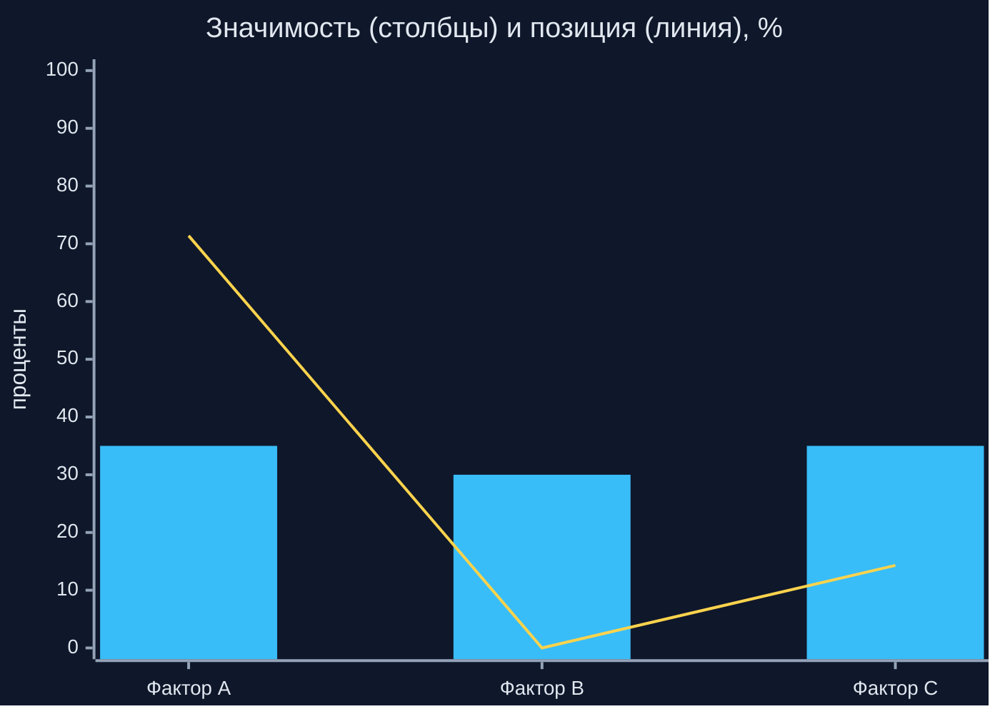
*Схема 3. Раздельное отображение структуры консенсуса: фактор B имеет высокую важность (30%), но нулевую результирующую позицию из-за равного раскола голосов.*

Этот расчёт со всей очевидностью доказывает аналитическую глубину метода: фактор B занимает 30% всего общественного внимания, однако позиция по нему равна нулю. Если бы организаторы оперировали лишь итоговым числом «30%», они бы упустили, что проект рискует натолкнуться на ожесточённое сопротивление именно по фактору B, требующему безотлагательного поиска компромисса.

Для решения проблемы «холодного старта» при публикации новой инициативы автор предложения обязан зафиксировать своё начальное распределение: указать от одной до трёх базовых причин с исходными пропорциями (например, 50%, 30% и 20%) и положительной полярностью. Сторонние участники могут предлагать свои факторы, которые первоначально получают статус «кандидата» и доступны в поиске. Если за фактор-кандидат голосует установленное число независимых участников или его утверждает автор вопроса, он переходит в статус «официального» и включается в общую колоду для всех голосующих.

Если в процессе дискуссии возникает сомнение в истинности самого предложенного фактора (например, выдвинуто спорное техническое утверждение), платформа поддерживает процедуру вложенного рекурсивного опроса («обосновать в кубе»). Фактор выделяется в самостоятельный вопрос, где голосующие оценивают достоверность исходного тезиса. Если по итогам голосования утверждение признаётся несостоятельным, ему присваивается статус «оспорено сообществом», а его вес во всех родительских инициативах принудительно обнуляется.

---

## 3. Контекст и версии: Ситуация, Идея, дерево тем

Любая оценка, оторванная от контекста, неизбежно теряет практическую ценность. В реальной жизни не существует абстрактно «хороших» или «плохих» решений: проект, доказавший исключительную пользу в тихом спальном районе, может оказаться неприемлемым или бесполезным в промышленной зоне или историческом центре города. Архитектура «КубГолоса» решает эту проблему через строгое разделение двух сущностей — Ситуации и Идеи.

Ситуация описывает внешние условия, проблему или текущее состояние среды. Она может носить общий характер (обобщённая задача упорядочивания парковки в жилых кварталах) либо частный характер (проблема конкретного двора по улице Ленина с дефицитом машиномест из-за соседства со станцией метро). Идея представляет собой предлагаемый метод изменения ситуации (установка механического шлагбаума, строительство многоуровневого паркинга, организация кругового движения). Оценка выставляется не абстрактной идее как таковой, а конкретной конструкции «Идея в ситуации». Благодаря этому исключается порочная практика искусственного усреднения разнородных условий: в контексте собственного двора жители могут поддержать шлагбаум на 95%, тогда как в контексте сквозного проезда общего пользования поддержка составит менее 5%.

Вместо устаревших жестких многоуровневых каталогов в платформе применяется единая самоссылающаяся древовидная структура тем. Каждая тема может содержать дочерние подтемы произвольной глубины вложенности, что позволяет локализовать обсуждения с высокой точностью (например: «Городское хозяйство» $\to$ «Транспортная инфраструктура» $\to$ «Парковочные пространства» $\to$ «Дворовые территории»).

Критически важным достоинством архитектуры выступает механизм версионирования вопросов (ветвления). Если участник согласен с проблематикой ситуации, но не удовлетворён формулировкой идеи или набором предложенных факторов, ему не требуется вступать в бесплодный спор с автором. Участник создаёт ответвление (версию вопроса) в форме отдельного хранилища данных. Новая версия сохраняет криптографическую ссылку на вопрос-прототип и наследует накопленный контекст, образуя прозрачное дерево смысловых вариантов.

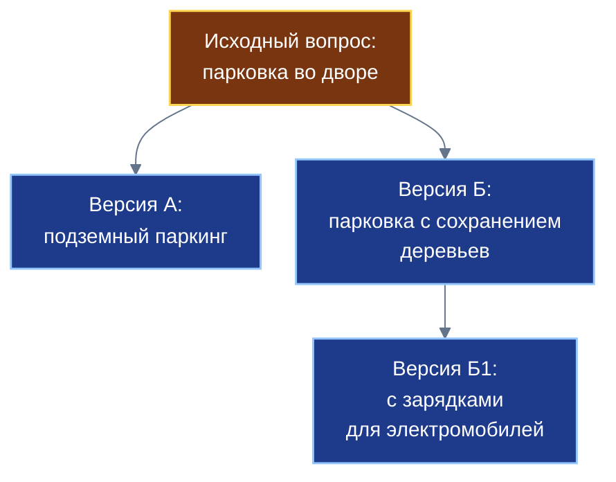
*Схема 4. Древовидное ветвление смысловых версий: возможность создания независимых вариантов решения с сохранением преемственности.*

Для общественной приоритизации проблем и предложений используется двухуровневая пятибалльная матрица оценки:
- Для Ситуаций оцениваются **срочность и важность**. Срочность отражает скорость ухудшения обстановки при бездействии, а важность — масштаб ущерба или глубину воздействия проблемы на сообщество.
- Для Идей оцениваются **срочность и приоритет**. Приоритет характеризует системную глубину устранения первопричины проблемы, тогда как срочность фиксирует эффективность меры в качестве неотложной первой помощи.

Отметим, что личная матрица расстановки приоритетов дел отдельного человека строится на иных психологических принципах и подробно раскрывается в Белой книге № 10 «Деловой». Общественная же матрица «КубГолоса» формирует интегральный срез мнения жителей для муниципальных и коллективных органов.

---

## 4. Голос как собственная запись

Фундаментальный принцип автономного владения данными (Self-Custody) в платформе «Турбаза» формулируется как правило «Пиши только своё». В традиционных базах данных голосование устроено через изменение счётчиков в строке самого вопроса или добавление записей в централизованную таблицу чужой базы данных. В «Турбазе» участник никогда не имеет физического права изменять или дополнять чужие файлы. При голосовании гражданин формирует на собственном Листе независимую криптографическую запись, содержащую его личное волеизъявление.

Каждая запись голоса обладает строгим составным идентификатором, включающим номер хранилища, идентификатор субъекта (связку конкретного приложения и пользовательского устройства) и локальный порядковый номер операции. Идентификатор субъекта служит исключительно для бесконфликтной синхронизации записей гражданина, вносимых с разных устройств (смартфона и планшета), и сам по себе не раскрывает персональные данные владельца.

Поскольку взгляды человека могут меняться под воздействием новых фактов и аргументов, система обеспечивает возможность свободного переголосования без угрозы двойного учёта. Когда участник изменяет своё решение, его Лист вычисляет дельту между новым и старым состоянием голоса и отправляет её на координационную Ветку. Узел Ветки производит атомарную операцию замены: из накопленной суммы вычитается старый вектор голоса и прибавляется новый:
$$\text{Итог} \leftarrow \text{Итог} - \text{Голос}_{\text{старый}} + \text{Голос}_{\text{новый}}$$
После успешной обработки Ветка возвращает Листу цифровую квитанцию с подтверждением замены. Повторный учёт предотвращается протоколом квитанций и структурой журнала транзакций.

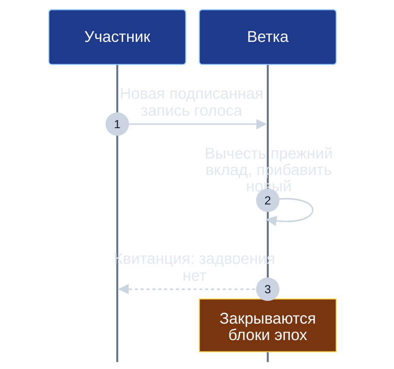
*Схема 5. Процедура бесконфликтного переголосования с атомарной заменой вектора и выдачей квитанции.*

В системе последовательно проведён принцип работы «только добавление» (append-only). Записи в журналах не подлежат физическому удалению. Если автор решает отозвать фактор или идею, запись не уничтожается: фактор просто наделяется нулевым весом, а в журнале фиксируется соответствующая отметка. Опросы не «закрываются» внезапно административным решением: они непрерывно квантуются блоками временных эпох.

Такое устройство обеспечивает полную устойчивость к перерывам связи: если гражданин находился вне зоны доступа сети в течение нескольких дней или недель, сделанные им отметки сохраняются в локальной базе Листа. При восстановлении связи дельты голосов передаются на Ветку и детерминированно встраиваются в текущие счётчики без конфликтов и потерь. Криптографическая подпись личным ключом гарантирует, что запись не была модифицирована или подменена в процессе передачи через каналы связи.

---

## 5. Счётчики и блоки эпох

Одной из центральных инженерных инноваций, отработанных на «КубГолосе», стало архитектурное переосмысление роли промежуточного серверного узла. Ветка платформы «Турбаза» принципиально не выполняет роль традиционного веб-сервера: она не занимается генерацией страниц пользовательского интерфейса, не хранит сессии браузеров и не рисует графику. Ветка выступает легковесным координационным шлюзом, задачи которого строго ограничены маршрутизацией зашифрованных сообщений, поддержанием поисковых индексов метаданных и агрегацией числовых потоков.

В условиях, когда миллионы граждан одновременно выражают свои позиции, прямая синхронная запись каждого голоса на постоянный накопитель сервера привела бы к параличу дисковой подсистемы из-за взаимных блокировок таблиц. Для предотвращения этой проблемы в «КубГолосе» реализован механизм специализированных счётчиков в оперативной памяти (RAM). Входящие дельты весов и позиций принимаются в оперативную память без обращения к постоянным дисковым накопителям, благодаря чему узел способен обрабатывать тысячи обновлений в секунду с субмиллисекундным временем отклика.

Непрерывный поток вычислений квантуется во времени интервалами, именуемыми эпохами. Для высокодинамичных городских вопросов длительность эпохи может составлять один час, тогда как для стандартных плановых голосований принимаются суточные эпохи. По завершении временного интервала Ветка фиксирует накопленные в оперативной памяти суммы и формирует неизменяемый блок эпохи.

```mermaid
%%{init: {"theme":"base","themeVariables":{"background":"#0f172a","fontFamily":"Arial, Helvetica, sans-serif","fontSize":"15px","primaryColor":"#1e3a8a","primaryTextColor":"#ffffff","primaryBorderColor":"#93c5fd","secondaryColor":"#14532d","tertiaryColor":"#1e293b","lineColor":"#64748b","textColor":"#94a3b8","mainBkg":"#1e3a8a","nodeBorder":"#93c5fd","clusterBkg":"#1e293b","clusterBorder":"#475569","titleColor":"#cbd5e1","edgeLabelBackground":"#1e293b"},"themeCSS":"foreignObject *{font-family:Arial,Helvetica,sans-serif !important}","flowchart":{"curve":"basis","htmlLabels":true,"nodeSpacing":26,"rankSpacing":40,"padding":12,"useMaxWidth":true}}}%%
flowchart LR
    L1["Лист<br/>подписанная запись<br/>голоса"] --> B["Ветка<br/>проверка и счётчики<br/>в памяти"] --> E["Блок эпохи<br/>снимок сумм<br/>за час или сутки"] --> L2["Листы<br/>график мнений<br/>во времени"]
    class L1,L2 leaf
    class B branch
    class E trunk
    classDef leaf fill:#1e3a8a,stroke:#93c5fd,stroke-width:1.5px,color:#ffffff
    classDef branch fill:#14532d,stroke:#86efac,stroke-width:1.5px,color:#ffffff
    classDef trunk fill:#78350f,stroke:#fcd34d,stroke-width:1.5px,color:#ffffff
    classDef bank fill:#4c1d95,stroke:#c4b5fd,stroke-width:1.5px,color:#ffffff
    classDef priv fill:#334155,stroke:#cbd5e1,stroke-width:1.5px,color:#ffffff
    classDef risk fill:#7f1d1d,stroke:#fca5a5,stroke-width:1.5px,color:#ffffff
```
*Схема 6. Архитектурный конвейер координационного узла: от входящих дельт Листов через оперативную агрегацию к выпуску компактных блоков эпох.*

Блок эпохи представляет собой компактный числовой слепок состояния вопроса. В проектной спецификации его размер составляет всего порядка 150 байт. В структуру блока входят: криптографический хеш предыдущего блока, временная метка, общее число активных участников, контрольные суммы распределения весов и результирующие показатели значимости и позиции по каждому фактору. Благодаря исключительной компактности, годовой архив суточных блоков по одному вопросу занимает всего около 55 килобайт:
$$150 \text{ байт} \times 365 \text{ дней} = 54\,750 \text{ байт} \approx 55 \text{ Кбайт}$$
Даже при часовых эпохах годовой объём не превышает 1,3 мегабайта.

Сформированные блоки эпох реплицируются стандартным журналом изменений на клиентские Листы пользователей. Получив цепочку блоков эпох, Лист участника строит наглядный динамический график изменения настроений сообщества во времени непосредственно на экране устройства. Блок эпохи служит детерминированной точкой отсечки для взвешивания голосов в последующих циклах (что подробно раскрывается в главе 8).

Служебные реестры контроля частоты обращений и проверки лимитов ведутся локально на сервере Ветки и не засоряют сетевой трафик Листов. Сам исходящий пакет голоса с Листа оптимизирован с помощью битовой маски факторов до проектного размера 19–25 байт (16 байт идентификатора вопроса, 1 байт маски активных факторов, от 1 до 7 байт значений весов и позиций и 1 байт резерва). Для защиты мобильных устройств от сетевых перегрузок и разряда батареи Ветка рассылает обновления агрегированных показателей пакетами с периодичностью один раз в 1–5 минут вместо непрерывного потока оповещений.

В результате платформа получает законченный базовый примитив счётчика: независимый модуль, способный принимать потоковые числовые дельты, суммировать их в памяти и регулярно сбрасывать в неизменяемые журнальные блоки.

---

## 6. Сложение вверх по дереву

Ключевой вызов масштабирования крупномасштабных систем голосования заключается в обеспечении быстрой аналитической сводки по мегаполису, региону и стране в целом без стягивания миллионов сырых пользовательских записей в единую централизованную базу данных. «КубГолос» решает эту задачу с помощью иерархического древовидного сложения числовых сумм.

В основе алгоритма лежит фундаментальное математическое правило: вышестоящие узлы сети обязаны суммировать накопленные суммы и количества участников, а не готовые средние значения. Усреднение средних величин (среднее от средних) математически некорректно и приводит к грубейшим искажениям результата при разной численности участников в группах.

Поясним это наглядным числовым примером. Предположим, по некоему вопросу анализируются позиции двух районов:
- В районе X приняли участие $N_X = 100$ граждан, их средняя позиция составила $+80$ пунктов. Сумма баллов равна $100 \cdot 80 = 8000$.
- В районе Y приняли участие $N_Y = 900$ граждан, их средняя позиция составила $+20$ пунктов. Сумма баллов равна $900 \cdot 20 = 18000$.

Если ошибочно сложить средние значения, получится результат:
$$\frac{80 + 20}{2} = 50 \quad \text{(грубая ошибка, искажающая волю большинства)}$$
Корректное сложение сумм через дерево Веток даёт строго верный математический результат:
$$\frac{\text{Сумма}_X + \text{Сумма}_Y}{N_X + N_Y} = \frac{8000 + 18000}{100 + 900} = \frac{26000}{1000} = 26$$

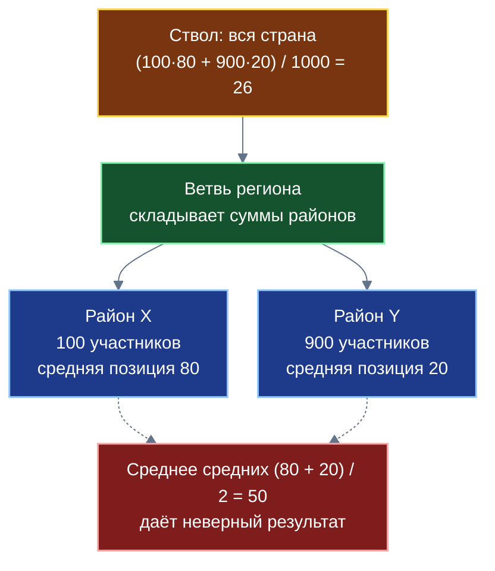
*Схема 7. Иерархия агрегации: восходящее сложение сумм обеспечивает математическую точность и полную изоляцию первичных данных.*

В топологии «Турбазы» функционирует двойная иерархия узлов:
1. Территориальные Ветки — выстроены в административно-географическую вертикаль: районные Ветки объединяются Ветвью города, городские — Ветвью региона, а региональные замыкаются на суверенный Ствол государства. Территориальная Ветка принимает подключения жителей района, проверяет локальный ценз принадлежности и экранирует вычислительные мощности от внешней сети.
2. Категориальные Ветки сообществ и кооперативов — организованы по смысловому дереву тем произвольной глубины. Вопросы накапливаются в категориальных узлах, а агрегированные срезы кэшируются на родительских уровнях каталога.

Взаимодействие между деревьями осуществляется по схеме гибридного запроса. Когда Лист гражданина запрашивает аналитику, он связывается со своей районной Веткой, забирает локальный территориальный срез, а затем через сквозной доверенный канал получает тематический срез из категориального дерева. Пересечение этих двух проекций (фильтрацию темы внутри конкретного района) Лист производит самостоятельно в собственной локальной базе данных. Это устраняет необходимость в тяжелых межсерверных шлюзах и исключает дублирование кэшей.

На государственном уровне передача данных между уровнями осуществляется в рамках федеративной аналитики (Federated OLAP): узлы обмениваются компактными векторными агрегатами объёмом порядка 128 байт. Проектная цель платформы состоит в получении целостной аналитической сводки по крупному городу за единицы секунд без концентрации персональных данных. При проведении международных голосований суверенный Ствол обменивается весовыми суммами с узлами других государств по глобальным идентификаторам вопросов, в то время как формулировки факторов локализуются на национальных языках.

---

## 7. Поиск по дереву и дедупликация

При открытом создании вопросов миллионами граждан ключевым риском децентрализованной среды становится хаотическое засорение пространства: возникновение сотен смысловых дубликатов на одну и ту же тему распыляет внимание сообщества и фрагментирует волеизъявление. Архитектура «КубГолоса» предлагает системное решение этой проблемы через сочетание древовидной навигации, префиксного текстового поиска и локальной дедупликации на устройствах.

Базовым сценарием обнаружения тем выступает естественный спуск по дереву категорий. На каждом узловом уровне каталога пользователю выводятся наиболее резонансные и актуальные инициативы данного сегмента. Если участник предпочитает прямой текстовый поиск по ключевым словам, система задействует префиксное буквенное дерево (trie). Создатель каждого фактора выбирает нормализованные ключевые слова, которые индексируются посимвольно. Для русского языка поисковый алгоритм производит автоматическое отсечение падежных и грамматических окончаний (стемминг), обеспечивая нахождение смысловых корней, а для иероглифических языков задействуется фонетическая транслитерация (пиньинь и её международные аналоги). Проектный ориентир скорости автодополнения поискового запроса по префиксному дереву составляет менее одной миллисекунды.

Логика интерфейса спроектирована так, что путь поиска непрерывно подталкивает человека к присоединению к уже существующим дискуссиям. Создание нового вопроса становится доступным только как финальный шаг, если поисковая выдача подтвердила отсутствие аналогичной темы.

Более того, на стадии создания черновика инициативы в работу вступает модуль дедупликации на лету. На устройстве пользователя задействуется малая локальная нейросетевая модель, работающая непосредственно на процессоре смартфона без передачи сырого текста на удалённые сервера. Модель формирует компактный семантический вектор введённого текста и сверяет его с легковесным индексом векторов, предоставленным районной Веткой. Если система обнаруживает смысловое совпадение, пользователю выдаётся интерактивная подсказка: «Похожая проблема уже обсуждается в вашем районе (смысловое совпадение 87%). Желаете присоединиться к существующему вопросу или предложить свой фактор в текущую колоду?». Согласно проектным оценкам спецификации, такой превентивный барьер способен сократить генерацию бессмысленных дубликатов на 60–80%.

Если же близкий по смыслу дубликат всё же был опубликован и начал собирать голоса, процедура модерации сообщества позволяет произвести бесконфликтное объединение тем. Повторный вопрос преобразуется в прозрачную ссылку-перенаправление на основной вопрос, а все ранее поданные по нему дельты голосов и цепочки факторов автоматически суммируются в едином координационном узле.

---

## 8. Три шкалы консенсуса

Для предотвращения манипуляций общественным мнением в платформе заложен фундаментальный архитектурный принцип: взвешенный и невзвешенный результаты голосования обязаны всегда отображаться рядом. Никакой аналитический алгоритм не вправе подменять собой прямое демократическое волеизъявление. Для этого итог оценки разделяется на три взаимодополняющие шкалы консенсуса:

1. Шкала **«Народ»** — классическое прямое волеизъявление. Здесь строго действует правило: один гражданин — один голос — сто базисных пунктов бюджета. Все участники обладают равным удельным весом независимо от опыта, социального статуса или стажа в системе.
2. Шкала **«Эксперты»** — меритократическое измерение. Голос каждого участника взвешивается его персональным социальным рейтингом в конкретной теме, к которой относится обсуждаемый вопрос. При этом вес берётся строго по блоку предыдущей эпохи, что исключает спекулятивную накачку веса внутри текущего цикла. При расчёте экспертного веса самооценка алгоритмически исключена, взаимные симметричные оценки участников дисконтируются, а рост влияния ограничен сублинейной зависимостью (логарифмическим насыщением), исключающей концентрацию влияния в руках узкой группы лиц.
3. Шкала **«Результат»** — объективное практическое свидетельство. В архитектуре «КубГолоса» шкала «Результат» представляет собой стандартизированный слот (интерфейсное посадочное место) для приёма внешних данных из смежных прикладных систем. Сюда поступают зафиксированные факты практического Опыта (подтверждённые акты выполнения работ, успешные решения бытовых проблем, зафиксированные в сети взаимопомощи), а также подтверждение автора исходной проблемы, что предложенное решение принесло реальный положительный эффект.

Для объединения трёх шкал в целостную оценку применяется вероятностная формула синтеза на основе принципов Байеса:
$$P = \big(1 - W_{\text{р}}(n)\big) \cdot \big(w_{\text{э}} \cdot \text{Эксперты} + w_{\text{н}} \cdot \text{Народ}\big) + W_{\text{р}}(n) \cdot \text{Результат}$$
где начальные проектные параметры распределения теоретического веса установлены как $w_{\text{э}} = 0{,}6$ (вес экспертного сообщества) и $w_{\text{н}} = 0{,}4$ (вес прямого массового голосования). Вес практического свидетельства $W_{\text{р}}(n)$ нелинейно возрастает по мере накопления подтверждённых практикой случаев $n$:
$$W_{\text{р}}(n) = W_{\max} \cdot \frac{n}{n + k}, \quad \text{где } W_{\max} = 0{,}8, \quad k = 3$$

Подчеркнём: показатель $P$ трактуется в платформе именно как сводный интегральный индекс согласованности, а не как строгая математическая вероятность объективной истины.

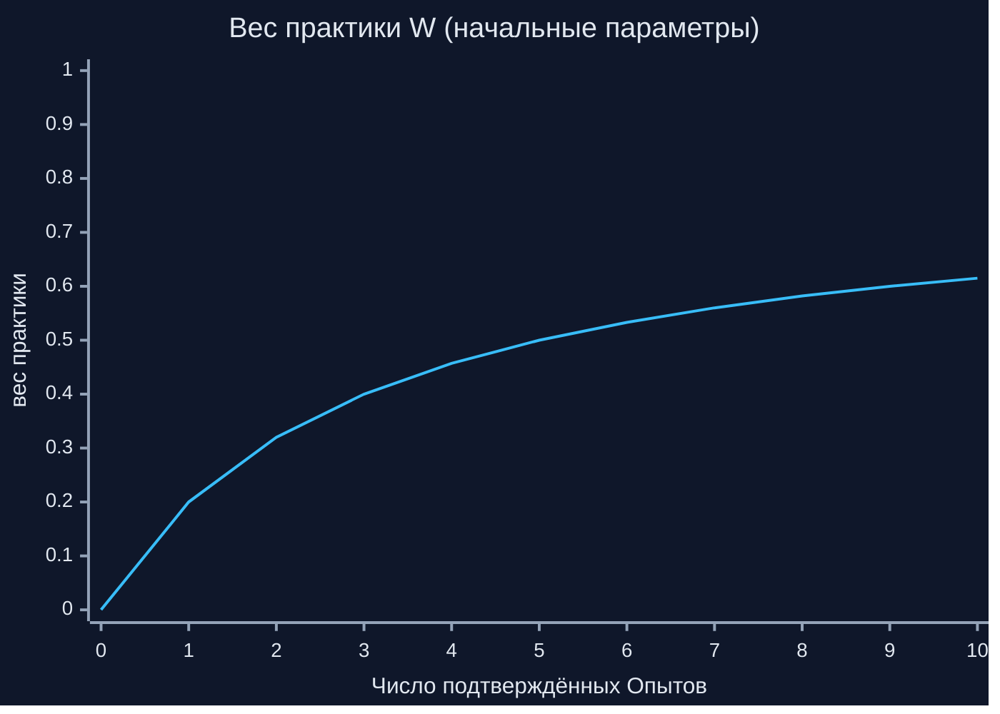
*Схема 8. Зависимость удельного веса шкалы «Результат» от количества накопленных подтверждённых свидетельств практики.*

Рассмотрим поведение формулы на численной модели при постоянных значениях шкалы Экспертов $0{,}7$ и шкалы Народа $0{,}5$. Базовая теоретическая часть составляет:
$$0{,}6 \cdot 0{,}7 + 0{,}4 \cdot 0{,}5 = 0{,}42 + 0{,}20 = 0{,}62$$

В таблице ниже показано, как изменяется итоговый сводный показатель $P$ в зависимости от числа поступивших подтверждённых практических опытов $n$ при позитивном практическом результате ($\text{Результат} = 0{,}9$) и при провале идеи на практике ($\text{Результат} = 0{,}2$).

| Число опытов $n$ | Вес практики $W_{\text{р}}(n)$ | Сводный $P$ при Результате = 0,9 | Сводный $P$ при Результате = 0,2 |
|:---:|:---:|:---:|:---:|
| 0 | 0,000 | 0,620 | 0,620 |
| 1 | 0,200 | 0,676 | 0,536 |
| 2 | 0,320 | 0,710 | 0,486 |
| 3 | 0,400 | 0,732 | 0,452 |
| 4 | 0,457 | 0,748 | 0,428 |
| 5 | 0,500 | 0,760 | 0,410 |
| 7 | 0,560 | 0,777 | 0,385 |
| 10 | 0,615 | 0,792 | 0,362 |
| 21 | 0,700 | 0,816 | 0,326 |

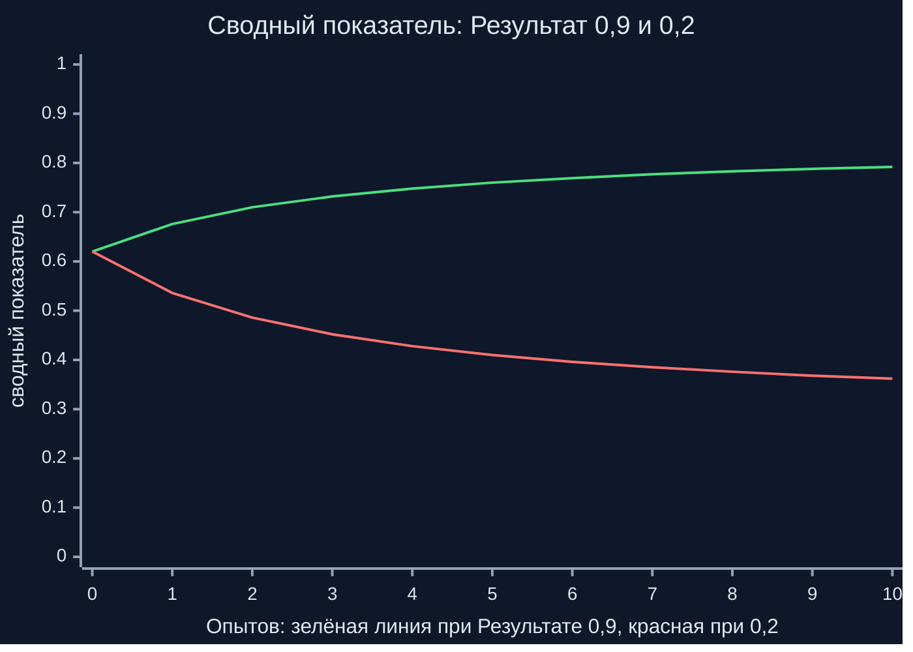
*Схема 9. Динамика сводного показателя $P$: при столкновении с отрицательной практикой (красная линия) оценка резко снижается, преодолевая первоначальный теоретический консенсус.*

Представленные графики и табличные расчеты со всей строгостью иллюстрируют ключевой балансирующий эффект: пока практических данных нет ($n = 0$), сводный показатель целиком определяется балансом мнений Экспертов и Народа ($0{,}620$). Однако по мере накопления практических результатов шкала практики постепенно подчиняет себе общий итог. Если решение на практике терпит неудачу ($\text{Результат} = 0{,}2$), сводный показатель падает до $0{,}362$ при $n = 10$, несмотря на то, что народ и эксперты продолжают верить в состоятельность замысла.

---

## 9. Регистрация и защита от накруток

В открытых электронных системах фундаментальный компромисс всегда пролегает между простотой доступа и устойчивостью к искусственным искажениям. В «КубГолосе» этот компромисс решается через введение трёх четко разграниченных режимов регистрации на координационной Ветке:

1. **Полная анонимность.** Пользователь получает случайный криптографический идентификатор при физическом подключении к локальной сети района. Ветка не знает никаких персональных данных, фиксируя лишь территориальную принадлежность к данному узлу. Данный режим идеален для сбора первичных мнений, но обладает минимальным уровнем институционального доверия.
2. **Социальная анонимность.** В общественном контуре гражданин выступает под псевдонимом, однако его правомочность экономически гарантирована наличием кошелька Банка России (в модели один кошелёк на человека) либо подтверждена доверенной группой соседей через процедуру очной жеребьёвки. Ветка видит криптографическое доказательство того, что номер принадлежит легитимному гражданину группы N, но сопоставить запись с паспортными данными технически невозможно. Личность может быть раскрыта исключительно в судебном порядке при совершении доказанного тяжкого правонарушения.
3. **Поимённая регистрация.** Фамилия и имя гражданина открыто отображаются рядом с его публикациями и голосами. Переход в поимённый режим сопровождается обязательным отдельным экраном-предупреждением и завершается только после явного и осознанного согласия пользователя.

Репутация и социальный рейтинг начисляются во всех трёх режимах, однако правила их конвертации исключают возникновение теневых спекуляций. Рейтинг, накопленный в режиме полной анонимности, не конвертируется при привязке кошелька или переходе в другие режимы: это лишает злоумышленников экономической мотивации генерировать фермы анонимных аккаунтов для последующей продажи. Напротив, рейтинг из режима социальной анонимности свободно переносится в поимённый профиль при добровольном раскрытии имени.

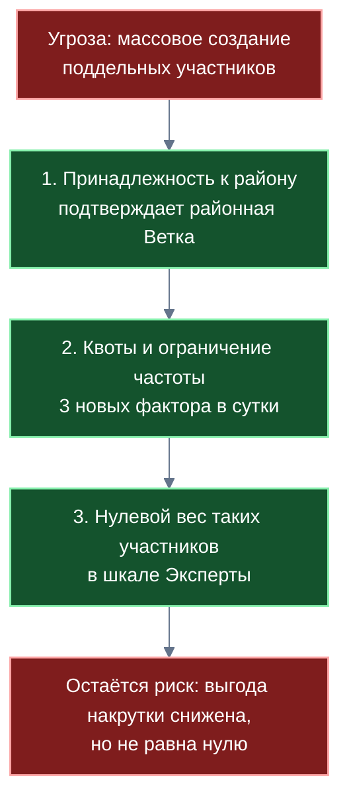
*Схема 10. Архитектура эшелонированной защиты от массовых фальсификаций и фиксация остаточного риска.*

Для нейтрализации скоординированных атак накрутки задействован комплекс фильтров, систематизированный в таблице:

| Потенциальная угроза | Защитный механизм платформы | Остаточный риск |
|---|---|---|
| Массовое создание поддельных участников (атака Сивиллы) | Территориальный ценз при регистрации на Ветке; лимиты частоты; нулевой вес неподтверждённых профилей в шкале «Эксперты» | Без логически централизованного реестра абсолютная защита невозможна; стимулы к атаке снижаются, но не обнуляются |
| Подмена или повторный учёт волеизъявления | Криптографическая подпись записи ключом устройства; атомарная замена вклада с выдачей квитанции | Подпись защищает целостность записи, но не удостоверяет факт того, что за устройством стоит реальный гражданин |
| Спам-генерация новых факторов | Квота: не более трёх новых факторов в сутки на участника по одному вопросу; суточный мораторий при исчерпании | Скоординированная группа злоумышленников может параллельно использовать несколько десятков регистраций |
| Искусственное дублирование тем | Локальная нейросетевая подсказка на Листе; слияние дубликатов через прозрачное перенаправление | Эффективность подсказки опирается на актуальность локального индекса и качество малой модели |
| Внутригрупповой сговор при жеребьёвке | Групповая анонимность, ротация участников проверочных групп | Зависит от добросовестности и независимости участников исходной ячейки соседей |
| Массовая накрутка шкалы «Народ» | Ценз района; параллельный показ некоррумпируемой шкалы «Результат» | Шкала «Народ» остаётся уязвимой для массовой активности; для компенсации рядом всегда отображаются остальные шкалы |

### Анализ остаточных рисков

Научная строгость требует открытого признания технологических ограничений децентрализованных систем. В классической фундаментальной работе Джона Дусера («The Sybil Attack», Microsoft Research, 2002) строго доказана математическая теорема: в любой распределённой вычислительной системе без доверенного логически централизованного удостоверяющего центра полная защита от атаки Сивиллы (бесконечного размножения фиктивных сущностей) математически невозможна, кроме заведомо нереалистичных сценариев абсолютного равенства вычислительных и пространственных ресурсов участников.

Платформа «Турбаза» не претендует на магическое преодоление фундаментальных теорем теории распределённых систем. Архитектурный подход состоит в экономической и процессуальной нейтрализации выгоды от накруток:
1. Защитные механизмы делают атаку чрезвычайно трудоёмкой и экономически бессмысленной: даже если злоумышленник создаст сотни виртуальных профилей в режиме полной анонимности, их влияние будет ограничено шкалой «Народ», их вес в шкале «Эксперты» окажется равным нулю, а шкала «Результат» остаётся надёжно защищённой от программных манипуляций.
2. Групповая анонимность через соседей напрямую зависит от добросовестности локального сообщества и отсутствия монопольного сговора на уровне подъезда или дома.
3. Территориальный ценз опирается на корректность первичного установления связи Листа с районным узлом.
4. Достоверность шкалы «Результат» всецело обусловлена честностью внешних свидетельств, поступающих из прикладной сети «Забота», защита которой детально проектируется в Белой книге № 09.
5. Физический гражданин гипотетически может обладать несколькими устройствами и регистрациями; однако рейтинги разных аккаунтов никогда не объединяются, что препятствует концентрации репутационного капитала.

---

## 10. Два контура: общественный и частный

Критическим требованием к архитектуре голосований выступает разграничение публичных гражданских процессов и деликатных внутренних обсуждений. «КубГолос» реализует строгую двухконтурную модель, разделяющую информационное пространство на общественный и частный контуры.

В **общественном контуре** проводятся открытые городские, районные и тематические опросы. Здесь все вопросы публичны, дельты голосов подписываются участниками, а координационные Ветки открыто накапливают суммы весов в оперативной памяти и фиксируют публичные блоки эпох. Общественный контур открыт для мониторинга, индексации и муниципального анализа.

В **частном контуре** организуются опросы закрытых социальных групп: семейные советы (выбор места отдыха, планирование бюджета), внутришкольные опросы, закрытые голосования жильцов одного подъезда или распределение задач в коммерческой проектной команде. Вся информация в частном контуре шифруется надёжным симметричным ключом группы непосредственно на аппаратах участников перед отправкой в сеть.

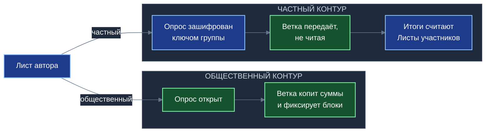
*Схема 11. Двухконтурная организация волеизъявления: открытый подсчёт на Ветках против вычислений на Листах через слепой ретранслятор.*

В частном контуре координационная Ветка выполняет роль **слепого ретранслятора** (blind relay). Узел Ветки не имеет криптографических ключей группы, не способен расшифровать передаваемые пакеты и не ведёт никаких промежуточных счётчиков. Ветка просто пересылает зашифрованные дельты между устройствами участников группы. Агрегация и расчёт результирующих показателей происходят исключительно на Листах: каждый клиентский аппарат расшифровывает полученные сообщения домочадцев или коллег и строит локальный баланс мнений внутри закрытого хранилища.

В платформе последовательно выдержан принцип: «частное остаётся частным, общественное индексируется». Частные хранилища исключены из каталогов Веток и не индексируются серверами. Ветки оперируют исключительно общедоступными индексами тем, тегов и обезличенными векторами факторов открытого контура. Персональное имя гражданина попадает в сферу общественной информации исключительно при осознанном выборе поимённого режима регистрации. Благодаря этому серверная инфраструктура Ветки физически не накапливает массивы персональных данных граждан, что кардинально минимизирует риски утечек информации и снимает с операторов бремя хранения чувствительных сведений в соответствии с нормами законодательства о защите личной информации (152-ФЗ), что подтверждается профильными юридическими консультациями.

---

## 11. Время и право: подписанный блок, работа без сети

Любая система выявления мнений обретает институциональный вес лишь тогда, когда её результаты могут быть признаны в качестве официальных юридических документов или служить основанием для принятия решений государственными и муниципальными органами.

В реальной административной практике волеизъявление всегда имеет регламентированные законом временные рамки. Классический пример — общее собрание собственников многоквартирного дома, которое по жилищному законодательству должно завершиться в строго определённую дату и час. В платформе этот юридический императив гармонизирован с непрерывным характером обработки данных. В установленный регламентом срок Ветка формирует специальный **блок отсечки**. Координационный узел фиксирует точные накопительные суммы на момент окончания установленного срока, удостоверяет блок усиленной квалифицированной электронной подписью (УКЭП) по стандарту ГОСТ Р 34.10-2012 и выгружает юридически обязывающий протокол в государственные информационные системы (ГИС ЖКХ, ведомственные реестры). При этом мониторинг мнений не прерывается: со следующей секунды Ветка открывает новый блок эпохи, фиксирующий дальнейшую динамику настроений жителей, однако результаты закрытого официального среза остаются неизменяемыми. Механизм проектируется для прямого признания судебными инстанциями и жилищными инспекциями в качестве надёжного электронного протокола.

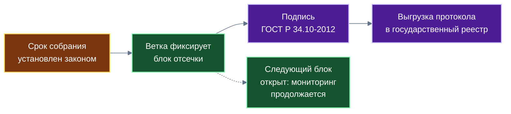
*Схема 12. Временная фиксация юридического среза: выпуск неизменяемого протокола с подписью ГОСТ без остановки процесса мониторинга.*

Вторым важнейшим свойством выступает способность к полноценной **автономной работе без внешней связи**. Жизненные обстоятельства нередко требуют принятия коллективных решений в экранированных помещениях (сход жителей в подвале дома при аварии инженерных сетей, собрание в удалённом сельском клубе при обрыве оптоволоконной магистрали). В такой обстановке клиентские Листы устанавливают прямое локальное соединение через доступные беспроводные протоколы (локальный Wi-Fi без выхода в интернет, Bluetooth). Если поблизости присутствует микро-узел Ветки (например, на переносном компьютере председателя), он берёт на себя координацию эпох. Участники продолжают полноценно выражать позиции и обмениваться дельтами. Локальный блок эпохи фиксирует выработанный консенсус. Когда связь с внешним миром восстанавливается, накопленный пакет журналов передаётся на районную Ветку и бесконфликтно встраивается в общее состояние благодаря строгому соблюдению принципа «Пиши только своё».

---

## 12. Экономика узлов

Для обеспечения долгосрочной жизнеспособности и технологического суверенитета государства инфраструктура распределённых узлов платформы «Турбаза» не может зависеть от благотворительности или постоянных государственных субсидий: она обязана обладать внутренней самоокупаемостью.

В качестве держателей координационных Веток выступают потребительские кооперативы, товарищества собственников жилья, муниципальные предприятия и аккредитованные арендаторы вычислительных мощностей. Экономическая модель исключает торговлю персональными данными граждан или навязчивое профилирование. Доходы формируются за счёт показа контекстных информационных сообщений без сбора персонального цифрового следа и предоставления специализированных аналитических сервисов.

Поступающий доход распределяется между всеми участниками процесса на базе детерминированной функции распределения выручки (`share(...)`), реализующей теоретико-игровые принципы вектора Шепли со строгой алгоритмической сложностью $O(1)$ (подробное математическое обоснование представлено в Белой книге № 06 по смарт-контрактам). Ключевое правило платформы закрепляет прямое финансовое вознаграждение самого гражданина: **гражданину причитается фиксированная десятина — 10% от рекламного бюджета** за внимание, уделяемое взаимодействию с платформой при подтверждении обезличенного профиля потребностей. Оставшаяся часть бюджета распределяется строго заданной функцией между площадкой встраивания опроса (городской портал, электронное СМИ), арендаторами вычислительных узлов Ветки, предоставившими мощности, и рекурсивно направляется разработчикам открытого программного стека и авторам используемых математических библиотек.

Инженерное преимущество архитектуры состоит в создании защищённого контура вычислительных мощностей. Серверы агрегации Веток спрятаны во внутреннем доверенном периметре и не имеют прямых публичных сетевых адресов в глобальном интернете. Доступ к ним возможен исключительно через внешние шлюзы районных Веток по защищённым протоколам. Это кардинально снижает капитальные и операционные расходы операторов на организацию дорогостоящей защиты от распределённых атак отказа в обслуживании (DDoS).

Для интеграции с внешней цифровой экосистемой реализован механизм санкционированной выгрузки данных для поисковых систем. Вместо неконтролируемого и хаотичного сканирования серверов ботами-пауками Ствол платформы передаёт структурированные дайджесты обновлений аккредитованным отечественным поисковым службам через стандартизированные программные интерфейсы, сохраняя государственный контроль над распространением информации. Вопрос правового статуса и регламентов ответственности полностью независимых коммерческих Веток остаётся предметом проектирования последующих этапов развития платформы.

---

## 13. Три практических примера

Для демонстрации прикладной эффективности многофакторного анализа рассмотрим три практических сценария, заимствованных из руководства по экосистемному влиянию и адаптированных в качестве условных иллюстративных примеров.

### Пример 1. Городская среда: установка шлагбаума во дворе (ЖКХ)

- **Контекст ситуации:** Большой жилой двор расположен в 300 метрах от пересадочного узла метрополитена. Дворовая территория ежедневно заполняется автомобилями транзитных пассажиров, лишая местных жителей парковочных мест и блокируя проезд уборочной техники.
- **Предложенная идея:** Монтаж автоматического шлагбаума с системой оптического распознавания государственных номеров и управлением через мобильное приложение.
- **Факторы и распределение позиций:**
  1. *Доступность парковочных мест:* значимость $\bar W_1 = 45\%$, позиция $\bar V_1 = +95\%$ (высокое единодушие автовладельцев дома);
  2. *Финансовые затраты на установку и абонентское обслуживание:* значимость $\bar W_2 = 35\%$, позиция $\bar V_2 = -45\%$ (острое неприятие жильцов старшего возраста и семей без автомобилей, не желающих оплачивать установку);
  3. *Надёжность и беспрепятственный проезд экстренных служб:* значимость $\bar W_3 = 20\%$, позиция $\bar V_3 = -30\%$ (опасения сбоев автоматики при вызове скорой помощи или пожарной охраны).
- **Диагностика и найденное решение:** Обычное бинарное голосование вызвало бы глубокий конфликт между автовладельцами и пенсионерами. Двухфакторная метрика «КубГолоса» позволила совету дома точно локализовать ключевой социальный барьер — нежелание жильцов без машин нести финансовое бремя. Руководство товарищества предложило компромиссный регламент: полностью освободить квартиры не имеющих личного транспорта граждан от сборов на установку и обслуживание, покрыв расходы за счёт целевого фонда от сдачи в аренду фасадных площадей дома провайдерам связи.
- **Результат:** В условном примере руководства проект был утверждён подавляющим большинством в 88% голосов с соблюдением легитимного кворума.

### Пример 2. Частный контур: выбор формата семейного отпуска

- **Контекст ситуации:** Семья из пяти человек (родители, двое детей 6 и 12 лет, пожилая бабушка) обсуждает план летнего отдыха при фиксированном совокупном бюджете в 150 000 рублей.
- **Предложенная идея:** Семейное путешествие на автомобиле с ночёвками в палаточных лагерях по природным заповедникам.
- **Факторы и распределение позиций (внутри частного контура):**
  1. *Финансовая доступность:* значимость 40%, позиция имеет баланс $+70\%$ «за» и $-30\%$ «против» (бюджет полностью укладывается в возможности);
  2. *Комфорт, санитарные условия и здоровье:* значимость 35%, позиция составляет $+40\%$ «за» и $-80\%$ «против» (острейшее неприятие старшего поколения, нуждающегося в медицинском комфорте);
  3. *Эмоциональная ценность и приключения:* значимость 25%, позиция $+95\%$ «за» и $-45\%$ «против» (высокий восторг подростков).
- **Диагностика и найденное решение:** Подсчёт дельт на Листах через слепой ретранслятор наглядно показал, что при высокой эмоциональной привлекательности проект несёт критический риск по шкале комфорта для бабушки. Семья приняла скорректированное решение: сократить автопробег вдвое, отказавшись от палаток в пользу аренды благоустроенного гостевого дома в сосновом бору. Конфликт был предотвращён на стадии замысла.

### Пример 3. Муниципальное управление: реконструкция транспортного узла

- **Контекст ситуации:** Сложный перекрёсток улиц Ленина и Заречной создаёт регулярные заторы до 40 минут в утренние часы пик.
- **Предложенная идея:** Ликвидация светофорного регулирования и организация кругового саморегулируемого движения.
- **Факторы и распределение позиций:**
  1. *Пропускная способность для автотранспорта:* значимость 50%, позиция $+80\%$ (поддержка автолюбителей);
  2. *Безопасность пешеходов и школьников:* значимость 35%, позиция $-85\%$ (поблизости расположена средняя школа; жители категорически против нерегулируемого перехода многополосного кольца);
  3. *Бюджет и сроки строительных работ:* значимость 15%, позиция $-60\%$ (опасения транспортного коллапса на время реконструкции).
- **Результат:** Администрация района заблаговременно увидела, что реализация исходной идеи вызовет волну протестов родителей школьников. В проектную документацию до объявления торгов было внесено обязательное требование: дополнить кольцевое движение строительством надземного или безопасного кнопочного перехода, что позволило гармонизировать интересы пешеходов и автомобилистов.

---

## 14. Что станет базовым модулем; границы роли

### 14.1. Трансформация прикладных находок в платформенные модули

«КубГолос» выполнил для экосистемы «Турбаза» роль фундаментального исследовательского полигона. Инженерные решения, изначально создававшиеся ради обслуживания пользовательских опросов, доказали свою универсальность и в настоящее время выделяются в базовые платформенные модули ядра, предоставляемые всем сторонним прикладным разработчикам «из коробки».

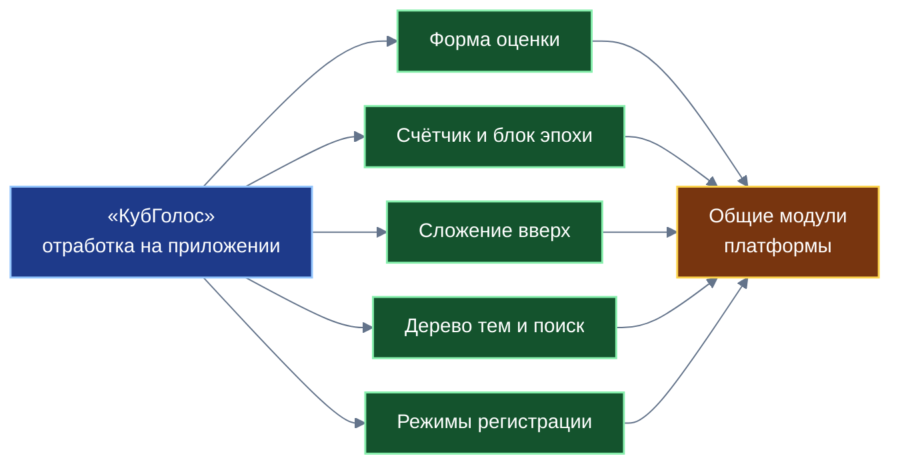
*Схема 13. Преобразование отработанных прикладных компонентов «КубГолоса» в системные модули открытого ядра платформы.*

Соответствие между прикладными разработками и общеплатформенными модулями систематизировано в таблице:

| Отработано на «КубГолосе» | Статус в качестве базового модуля платформы |
|---|---|
| Многофакторная форма со 100 б.п. бюджета | Универсальный интерфейсный и логический модуль многомерной оценки любых объектов |
| Счётчики в памяти Ветки и выпуск блоков эпох | Общеплатформенный примитив потоковой аналитики, расчёта рейтингов и фиксации согласий |
| Иерархическое восходящее сложение числовых сумм | Базовый алгоритм масштабирования аналитических показателей по территориальным деревьям |
| Дерево тем и префиксный поиск по буквам | Единый тематический каркас каталогизации и локальной префиксной фильтрации |
| Нейросетевая подсказка о дубликатах на Листе | Встраиваемый модуль дедупликации пользовательских текстовых сущностей |
| Три режима регистрации (полная, социальная, поимённая) | Стандартная подсистема идентификации и разграничения уровней доверия на узлах Ветки |
| Слепой ретранслятор частного контура | Унифицированный транспортный режим для сквозного шифрования в корпоративных и семейных сервисах |
| Подписанный блок отсечки ГОСТ | Модуль формирования юридически обязывающих электронных протоколов для внешних систем |

### 14.2. Границы архитектурной роли приложения

Во избежание завышенных ожиданий и методологических ошибок необходимо чётко очертить границы функциональной роли «КубГолоса»:
- «КубГолос» не вычисляет интегральный «социальный балл» человека и принципиально не ведёт единого обобщённого персонального рейтинга.
- Приложение не хранит репутационные паспорта как самостоятельные сущности: рейтинг человека существует исключительно как тематический срез в конкретной области знаний или труда.
- Приложение не затрагивает сферу финансово-экономического рейтинга граждан: экономический рейтинг формируется за рамками платформы Банком России и аккредитованными организациями по статистике исполнения обязательств.
- Сервис никогда не принимает административных решений за человека или коллективные органы управления, выступая исключительно аналитическим советником.
- Частные голосования ни при каких условиях не индексируются координационными узлами.

### 14.3. Что передаётся следующим книгам комплекта

Технология самозапечатывающихся страниц, делящих связи «один ко многим» для безопасного отображения и индексации миллионов записей, а также математическая модель открытого социального рейтинга вкладов человека по темам детально рассматриваются в следующей книге комплекта — **Белой книге № 09 «Забота»**; система гибких персональных тегов, группы опросов и архитектура расчётных контрактов второго уровня раскрываются в **Белой книге № 10 «Деловой»**.

### 14.4. Открытые научно-инженерные вопросы

Проектная концепция «КубГолоса» ставит ряд открытых исследовательских вопросов, требующих широкой дискуссии:
1. Определение регламентов формирования типовых отраслевых наборов факторов и порядка наделения полномочиями операторов тем.
2. Точная калибровка временных окон эпох, динамических квот на генерацию факторов и величин штрафов за кластеризацию методами имитационного математического моделирования.
3. Правовая гармонизация юридических протоколов блоков отсечки с требованиями процессуального законодательства и регламентами государственных надзорных органов.
4. Разработка института подотчётности и сертификации независимых коммерческих Веток при их масштабном развёртывании.

---

## 15. Заключение и связь с комплектом

Подведём итог архитектурному анализу первого системообразующего приложения платформы цифрового суверенитета государства «Турбаза» в пяти ключевых выводах:

1. **Многофакторность вместо упрощения.** «КубГолос» доказывает жизнеспособность перехода от бинарного продавливания позиций к многомерному анализу мотивов и барьеров, позволяя выявлять скрытый консенсус и разрешать общественные противоречия ещё на этапе проектирования инициатив.
2. **Оперативная масштабируемость.** Механизм потоковых счётчиков в оперативной памяти и выпуск компактных 150-байтных блоков эпох снимает проблему взаимных блокировок накопителей и открывает дорогу к обработке миллионов волеизъявлений в режиме реального времени.
3. **Безопасная восходящая агрегация.** Иерархическое суммирование сумм по территориальным и категориальным деревьям обеспечивает мгновенное получение городской и общенациональной аналитики без концентрации персональных данных в едином центре.
4. **Реалистичная модель безопасности.** Отказ от иллюзий абсолютной защиты от атак Сивиллы в пользу многоуровневого экономического и процессуального обесценивания накруток создаёт прагматичную основу доверия в открытых сетях.
5. **Экосистемный трамплин.** Все ключевые примитивы, отработанные на приложении — от формы оценки до слепого ретранслятора, — органично переходят в разряд базовых модулей децентрализованного ядра платформы.

Концептуальные решения «КубГолоса» закладывают фундамент для всей трилогии прикладных сервисов: подготовленная форма оценки и механизм блочной фиксации находят своё прямое развитие в репутационной ткани сети взаимопомощи «Забота» и исполнительской архитектуре органайзера «Деловой».

Разработчик платформы приглашает математиков, специалистов по распределённым системам, социологов, юристов и инженеров к совместному исследованию, аудиту представленных алгоритмов и участию в практической отладке открытого программного ядра.
