# «Забота»: вкладывать и просматривать

**Белая книга № 09: страницы, вклады и открытый рейтинг вкладов**  
*Версия: 1.0 (2026)*  
*Статус: проектная концепция*  
*Классификация: прикладной уровень платформы «Турбаза»*  
*Автор: Артём Владимирович Шамсутдинов, разработчик платформы цифрового суверенитета государства «Турбаза» — интернета автономных и частных данных / открытого стека AIRport.*  
*Методология подготовки: замысел приложения «Забота», его место в платформе, модель двух рейтингов, принципы открытости социального рейтинга, политики оператора темы и режимов регистрации сформированы автором. Математическая и алгоритмическая спецификация репутационной системы разработана интеллектуальным агентом Antigravity (Google DeepMind) на основе замысла и архитектурных инвариантов автора и при его методическом руководстве. Планирование документа выполнено моделью Claude Sonnet 5.5; распределение понятий между тремя книгами комплекта и порядок изложения предложены ею и приняты автором. Детальная проработка текста выполнена моделью Gemini 3.8 Flash.*

---

## Аннотация

Настоящий аналитический документ представляет проектную концепцию и архитектурную модель второго системообразующего сервиса платформы «Турбаза» — приложения взаимной поддержки «Забота» (от японского слова «сапото» — поддержка). В отличие от привычных каналов оперативного общения, где ценный опыт неизбежно растворяется в общем потоке сообщений, приложение «Забота» создаёт среду структурированного взаимодействия вокруг конкретных жизненных ситуаций. В этой среде ключевыми единицами выступают созидательные вклады людей: описания проблемных случаев, предложения идей, объективные вопросы и подтверждённые практикой свидетельства.

На примере сервиса «Забота» платформа отрабатывает фундаментальные архитектурные решения, которые затем выводятся на уровень базовых платформенных модулей: технологию самозапечатывающихся страниц для масштабирования неограниченных связей «один ко многим», антимонопольную составную конструкцию прикладных данных, фиксацию практического опыта через мультимодальные форматы «Голос» и «Показ», а также математический аппарат агрегации открытого социального рейтинга вкладов по предметным темам. Документ подробно раскрывает механизмы защиты целостности репутации, исключающие автокаталитические накрутки, правила переноса репутационного следа между режимами регистрации и границы применимости прикладных алгоритмов.

### Как читать этот документ

Настоящая Белая книга представляет собой самостоятельное исследование, ориентированное на широкий круг исследователей распределённых систем, корпоративных и государственных архитекторов, специалистов по социотехническим платформам и организаторов локальных сообществ. Адресат документа не ограничен конкретным ведомством: материалы публикуются в открытом доступе как свод инженерных и организационных идей.

В книге соблюдается принцип уважения к труду исследователей и инженеров, создавших существующие институты доверия: бюро кредитных историй, алгоритмы скоринга, отраслевые системы профессиональной аттестации и государственные реестры. Предлагаемые платформой «Турбаза» механизмы не противопоставляются действующим институтам, а рассматриваются как возможное органичное дополнение, расширяющее возможности граждан и добросовестных организаций в сфере открытого сотрудничества.

### Из предыдущих книг комплекта

Для удобства читателя, начинающего знакомство с платформой с настоящего документа, ниже приведены пять базовых понятий, введённых в Белой книге № 08 «КубГолос»:
1. **Многофакторная оценка и сто базисных пунктов:** метод структурированного оценивания проблем и решений по нескольким настраиваемым осям, где общий бюджет влияния участника ограничен ровно 100 базисными пунктами (подробно — в Белой книге № 08 «КубГолос»).
2. **Счётчики в памяти и блок эпохи:** механизм скоростного накопления числовых сумм и дельт в оперативной памяти распределённых узлов с периодической фиксацией неизменяемых криптографических снимков по завершении эпохи (подробно — в Белой книге № 08 «КубГолос»).
3. **Сложение сумм вверх по дереву Веток:** децентрализованная агрегация векторных показателей от локальных узлов к районным, городским и региональным уровням без перемещения исходных приватных записей (подробно — в Белой книге № 08 «КубГолос»).
4. **Принцип «Пиши только своё»:** фундаментальное правило платформы, согласно которому каждый участник создаёт и заверяет собственной электронной подписью исключительно персональные записи в собственном хранилище и не имеет права напрямую перезаписывать данные других пользователей (подробно — в Белой книге № 08 «КубГолос»).
5. **Режимы регистрации и два контура:** сосуществование открытого общественного контура с тремя градациями идентификации (полная анонимность, социальная анонимность, поимённая регистрация) и изолированного частного контура со слепыми ретрансляторами (подробно — в Белой книге № 08 «КубГолос»).

---

## 1. Задача и место приложения: вклады вместо потока сообщений

Современные средства обмена быстрыми сообщениями, социальные сети и форумы выполняют колоссальную общественную работу, обеспечивая моментальную связь между миллионами людей. Однако при возникновении сложных жизненных вопросов — от организации ремонта в подъезде или поиска проверенного мастера до ухода за пожилыми родственниками — традиционные ленты сообщений проявляют свои естественные особенности. В едином хронологическом потоке содержательные предложения перемежаются эмоциональными реакциями, непроверенные домыслы внешне неотличимы от профессионального опыта, а найденные успешные решения быстро уходят вниз по ленте и теряются для соседей.

Приложение «Забота» создано как институциональный инструмент взаимной поддержки граждан информацией и делами. Слово «сапото», давшее рабочее название проекту, отражает концепцию конструктивной опоры: приложение организует общение не в виде бесконечной ленты, а вокруг конкретных жизненных Случаев. Случай представляет собой зафиксированное описание практической задачи или проблемы, требующей решения. Внутри каждого Случая разворачивается структурированный Разговор (тред), где каждое высказывание имеет строго определённую функциональную роль.

Важнейшей опорой взаимопомощи выступает топологическая структура платформы «Турбаза». Благодаря древовидной иерархии вычислительных узлов («Лист» $\to$ «Ветка» $\to$ «Ствол») система позволяет подтвердить территориальную принадлежность участника к конкретному дому, микрорайону или населённому пункту. Это подтверждение выполняется районной Веткой без сбора паспортных данных или геолокационных треков: жители одного квартала могут объединяться для решения общих задач, будучи уверенными в локальном статусе соседей.

В общем архитектурном стеке платформы «Турбаза» три системообразующих приложения образуют единую восходящую последовательность функциональных возможностей. Если первое приложение «КубГолос» решает задачу «измерять и складывать» (предоставляя форму многофакторного волеизъявления, счётчики и механизмы сложения сумм по дереву), то приложение «Забота» решает задачу «вкладывать и просматривать». Именно здесь возникают первичные содержательные вклады граждан, отрабатываются механизмы постраничного масштабирования списков и закладываются алгоритмы открытого социального рейтинга.

| № | Прикладной вклад «Заботы» | Что платформа получает как общий модуль |
|---|---|---|
| 1 | Составная конструкция данных (Ситуация + Случай + Разговор) | Архитектурный приём независимой сборки сервисов из открытых схем |
| 2 | Четыре типа функциональных реплик, Рецепты и Уточнённый контекст | Стандартизированный протокол структурированных обсуждений |
| 3 | Практический Опыт («Голос» и «Показ») как свидетельство исхода | Механизм верификации гипотез фактическими результатами |
| 4 | Самозапечатывающиеся страницы коллекций | Платформенный примитив масштабирования связей «один ко многим» |
| 5 | Взвешивание мнений внутри треда по социальному авторитету | Двухшкальный алгоритм сопоставления мнений сообщества и экспертов |
| 6 | Применение субъективной логики и алгоритмов затухания | Единый математический язык работы с неполной информацией |
| 7 | Распределённый социальный рейтинг по предметным темам | Алгоритмическое ядро агрегации репутации на узлах Веток |
| 8 | Четыре барьера целостности и дефлятор кластеризации | Комплексная защита репутации от накруток, сговоров и давления |
| 9 | Гарантированное право ответа и прозрачный спуск к источникам | Институциональный регламент защиты прав участников платформы |
| 10 | Регламент конвертации репутации между режимами регистрации | Правила предотвращения теневого оборота анонимных профилей |
| 11 | Общедоступные открытые схемы данных | Базовый стандарт для независимых прикладных разработчиков |

---

## 2. Составная конструкция и антимонопольная композиция

Одной из главных проблем современных программных экосистем является монополизация: централизованные платформы вынуждают прикладных разработчиков принимать всю монолитную инфраструктуру целиком, включая серверные базы данных, закрытые протоколы аутентификации и навязанные форматы хранения. В противоположность этому в архитектуре «Турбазы» последовательно реализуется принцип разделения данных и интерфейсов, получивший название антимонопольной составной конструкции.

В приложении «Забота» ключевой объект взаимодействия — жизненный Случай — не является монолитной таблицей в единой базе данных. Он формируется как композиция трёх независимых структурных компонентов:
1. **Общая Ситуация:** абстрактная категориальная сущность, заимствованная из схемы приложения «КубГолос». Ситуация объединяет произвольное число аналогичных проблем, возникающих у разных людей (например, «Промерзание угловых швов в панельных домах типовой серии»).
2. **Собственно Случай:** персональная запись конкретного пользователя, описывающая частные обстоятельства возникшей проблемы в конкретном месте и времени (например, «Угол промёрз на кухне в квартире 42 дома 15 по улице Ленина»). Эта запись создаётся и подписывается исключительно автором в его личном хранилище.
3. **Разговор (тред):** общеплатформенный унифицированный механизм древовидных бесед, обеспечивающий синхронизацию реплик, цитирование и ветвление обсуждения без привязки к конкретной предметной области.

В графическом интерфейсе приложения к этой триаде подключается дополнительный слой: Дело из органайзера «Деловой», которое привносит параметры срочности, персональной ответственности и приоритета исполнения.

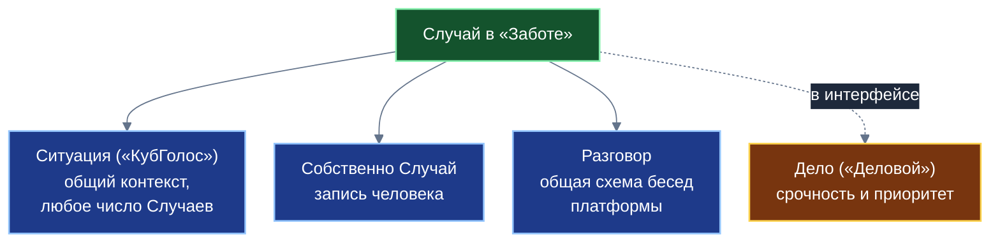
*Случай как децентрализованная сборка независимых схем данных платформы*

Смысл составной конструкции заключается в правиле: каждое приложение и каждый разработчик берут из экосистемы только то, что действительно необходимо для решения прикладной задачи. Если сторонний коллектив создаёт специализированную платформу для дискуссий жильцов коттеджных посёлков, ему нет необходимости переносить весь код приложения «Забота» или соглашаться с его интерфейсными решениями. Достаточно использовать открытую схему Разговора, подключив к ней собственную сущность Дискуссии. Это радикально снижает затраты вычислительных мощностей, исключает дублирование сетевого трафика и предотвращает монополизацию платформенных сервисов.

Сторонние сервисы могут обращаться к программным оболочкам приложений «КубГолос» и «Забота», порождая новые Ситуации и Случаи из собственных рабочих процессов. Далеко не каждый вопрос и не каждая дискуссия зарождаются внутри интерфейсов базовых сервисов: они могут возникать в корпоративных системах учёта, муниципальных порталах или отраслевых приложениях, свободно ссылаясь на универсальные схемы данных.

Здесь уместно раскрыть важнейший архитектурный инвариант платформы «Турбаза» — структурную асимметрию между слоем хранения данных и слоем пользовательского интерфейса. На уровне схем данных зависимость выстроена строго однонаправленно: схема «КубГолоса» абсолютно автономна и ничего не знает о «Заботе»; схема «Заботы» опирается на «КубГолос», но полностью изолирована от «Делового»; схема «Делового» опирается на обе предшествующие. Однако на уровне интерфейсов компоненты всех трёх приложений разложены на независимые визуальные блоки. Пользовательский интерфейс «Заботы» свободно отображает карточку Дела из «Делового», не порождая при этом циклической или обратной зависимости в реляционных схемах локальных баз данных.

---

## 3. Вклады: четыре вида реплик, Рецепт и Уточнённый контекст

Чтобы обсуждение в треде приводило к практическому результату, а не превращалось в бесконечный обмен мнениями, система разделяет все сообщения в Разговоре на четыре строго типизированных вида вкладов: Идея, Опыт, Вопрос и Комментарий. Каждый вид имеет собственную структуру, алгоритмы оценки и характер влияния на социальный рейтинг участника.

| Измерение анализа | Идея | Опыт | Вопрос | Комментарий |
|---|---|---|---|---|
| **Функциональная природа** | Предписывающая: конструктивное предложение действий | Описательная: свидетельство практического результата | Запрос недостающих исходных сведений | Общее обсуждение и уточняющие реплики |
| **Способ оценки** | Голосование в «КубГолосе» по набору причин | Подтверждение или опровержение участниками | Отметка полезности автором Случая | Обычные реакции сообщества |
| **Оценка срочности** | Пятибалльная шкала приоритета решения | Достоверность полученного исхода | Критичность для понимания сути проблемы | Не оценивается |
| **Структура вклада** | Дерево обоснований (до трёх ключевых причин) | Текст, аудиозапись «Голос» или видео «Показ» | Набор из восьми вопросительных маркеров | Свободный текст с цитированием |
| **Доступные действия** | Обоснование в опросе или перевод в Дело | Проверка и валидация выдвинутых Идей | Ответ автора и переход в статус «Отвечен» | Ответная реплика в тред |
| **Влияние на рейтинг** | Отражает проницательность и качество решений | Формирует массив объективных свидетельств | Свидетельствует о конструктивной активности | Не оказывает прямого влияния |

Особую роль в структурировании фактов играют Вопросы. Для предотвращения неясных формулировок Вопрос опирается на восемь вопросительных маркеров русского языка: *Что, Какой, Кто, Где, Почему, Когда, Как, Чей*. Когда автор Случая публикует ответ на поступивший Вопрос, система переводит реплику в статус «Отвечен» и автоматически извлекает ключевые сведения в специальный блок карточки — «Уточнённый контекст». В результате каждый вновь подключившийся к обсуждению сосед или специалист сразу видит проверенные исходные параметры ситуации, избавляясь от необходимости перечитывать десятки сообщений.

Если предложенная в треде Идея успешно реализуется на практике и подтверждается проверяемым Опытом участников, автор Случая переводит его в статус «Решён». В этот момент триада компонентов — исходная Ситуация, принятая Идея и подтверждённый практическими свидетельствами Опыт — закрепляется в общественном каталоге темы в качестве проверенного «Рецепта» (наилучшей практики). Создание Рецепта не закрывает тред навсегда: обсуждение остаётся доступным, позволяя участникам предлагать ещё более экономичные или быстрые способы решения проблемы.

Срочность и важность каждого Случая оцениваются участниками по пятибалльной шкале. Если ситуация признаётся локальным сообществом общественно значимой, участники могут принять решение о трансформации Случая в конкретное Дело в органайзере «Деловой», распределив задачи и материальные ресурсы. Любая реплика в треде может быть отмечена простым сигналом одобрения («плюс»), что помогает алгоритмам интерфейса ранжировать полезные материалы при первичном просмотре.

---

## 4. Опыт: «Голос» и «Показ» и замыкание цикла

В традиционных цифровых средах главным объектом взаимодействия остаётся мнение: пользователи спорят о достоинствах теоретических концепций, не имея возможности подтвердить свои слова делом. В приложении «Забота» ключевой ценностью выступает Опыт — объективное свидетельство того, что произошло в физической реальности в результате тех или иных действий. Опыт может фиксироваться и как предыстория (что человек уже предпринял самостоятельно до публикации проблемы), и как отчёт о проверке предложенных решений.

Платформа поддерживает три формата фиксации Опыта: классический текст, структурированную аудиозапись («Голос») и видеофиксацию («Показ»). Запись мультимедийных материалов выполняется через стандартные интерфейсы мобильного устройства без установки сторонних программных модулей. При этом соблюдается строгий принцип автономности данных и приватности (Self-Custody): преобразование речи в текст осуществляется непосредственно на самом пользовательском устройстве (локально). Исходный звук не направляется на внешние облачные серверы для транскрибации, обеспечивая конфиденциальность личного пространства. Исходные медиафайлы сохраняются в распределённом блоб-хранилище территориальных Веток, а в режиме отсутствия связи передаются между соседями напрямую по локальной беспроводной сети. Мультимодальный ввод обеспечивает доступность сервиса для пожилых граждан и людей, испытывающих сложности с набором длинных текстов на клавиатуре.

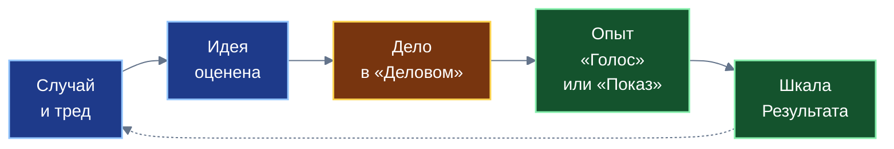
*Жизненный цикл вклада: от формулирования проблемы до объективного свидетельства практикой*

Связь между Опытом и Идеей строго подчиняется принципу «Пиши только своё». Публикуемый Опыт не вносит изменений в тело исходной Идеи: он оформляется как отдельная запись в личном хранилище автора Опыта, содержащая криптографическую ссылку на Идею. В этой записи автор Опыта даёт предметную оценку каждой из причин, выдвинутых автором Идеи: подтвердилась ($+1$), не оказала влияния ($0$) или опровергнута ($-1$). Сумма этих свидетельств агрегируется счётчиками узлов и направляется в третью шкалу консенсуса «КубГолоса» — шкалу «Результат».

Тем самым замыкается полный практический цикл взаимодействия:
1. Гражданин публикует Случай и привязывает его к общей Ситуации.
2. Сообщество выдвигает Идеи с указанием причинно-следственных обоснований.
3. Происходит взвешивание предложений, автор выбирает наиболее перспективную Идею и нажимает кнопку «Взять как задачу», создавая поручение в приложении «Деловой».
4. Исполнитель выполняет намеченные мероприятия в физическом мире.
5. Сервис предлагает участникам зафиксировать фактический Опыт с помощью текста, голоса или видео.
6. Полученные свидетельства проверяют справедливость исходных доводов Идеи, обновляя объективную шкалу Результата в опросе и социальный рейтинг автора решения.

---

## 5. Страницы: фундаментальный примитив масштабирования коллекций

В Белой книге № 08 «КубГолос» концепция самозапечатывающихся страниц была обозначена как фундаментальный платформенный примитив, рождающийся на стыке задач волеизъявления и публичных обсуждений. Однако именно в приложении «Забота», где сотни тысяч граждан ведут локальные диалоги, публикуют случаи и обмениваются репликами, технология страниц раскрывает своё решающее значение для устойчивости децентрализованной архитектуры.

### 5.1. Архитектурная проблема неограниченных связей «один ко многим»

В традиционных реляционных базах данных с централизованным сервером отношение «один ко многим» реализуется тривиально: родительская таблица содержит первичный ключ, а в миллионах дочерних строк проставляется внешний ключ. Серверная СУБД выполняет постраничную выборку через стандартные операторы смещения и лимита. В децентрализованных системах, где каждый пользователь хранит свои данные на персональном устройстве («Листе»), хранилище представляет собой неделимую единицу синхронизации, проверки криптографических подписей и разграничения доступа.

Если попытаться хранить дочерние записи популярной темы, обширной Ситуации или активного треда в рамках одного монолитного распределённого хранилища, возникают три непреодолимых барьера:
1. **Катастрофическое разрастание журнала изменений:** история операций хранилища непрерывно увеличивается в объёме. Чтобы отобразить пользователю смартфона первые десять реплик, клиентское приложение вынуждено скачать и верифицировать всю многолетнюю историю изменений родительского объекта, что делает работу на мобильных устройствах невозможной.
2. **Конфликты параллельной записи:** одновременная публикация сотен сообщений независимыми пользователями приводит к постоянным конфликтам сериализации транзакций. Процедуры автоматического слияния версий требуют огромных накладных расходов процессора и памяти.
3. **Разрушение неизменяемости и потеря кэширования:** любое добавление новой реплики изменяет состояние и криптографический хеш родительского хранилища. В результате промежуточные узлы сети («Ветки») и клиентские устройства не могут долговременно закэшировать даже историческую часть диалога, будучи обязанными непрерывно запрашивать обновления по сети.

### 5.2. Самозапечатывающаяся страница как хранилище-список

Платформа «Турбаза» решает эту проблему через введение концепции самозапечатывающейся страницы. Связь «один ко многим» искусственно разделяется на цепочку строго ограниченных по ёмкости страниц. Принципиальной особенностью платформы является то, что сама страница оформлена как полноценное децентрализованное хранилище. Однако она аккумулирует не тяжёлые исходные записи с медиафайлами, а компактные проекции («листовую информацию»): числовой идентификатор, заголовок, статус и краткое резюме.

Реализация страницы в форме стандартного хранилища обеспечивает важнейшие системные преимущества:
* На клиентском устройстве («Листе») обработка страниц идёт по единому стандартному конвейеру: локальная репликация в компактную встроенную базу данных, криптографическая проверка подписей, кэширование и выполнение прямых запросов на выборку.
* Отпадает необходимость в изобретении специализированных сетевых протоколов постраничной навигации: страницы передаются, синхронизируются и версионируются стандартными механизмами платформенного журнала изменений.
* Списки сообщений и случаев остаются полностью доступными для чтения и поиска на устройстве даже при полном отсутствии подключения к сети интернет.

Внутренняя структура страницы разделена на две функциональные зоны: зону полезной нагрузки (массив проекций дочерних записей) и зону навигационных ссылок, связывающих страницы в самобалансирующееся дерево. Для зоны полезной нагрузки установлен мягкий системный предел: около 1000 записей. При приближении к этому количеству страница переводится в статус «запечатана».

В момент запечатывания финальный криптографический хеш страницы жёстко фиксируется, после чего страница становится абсолютно неизменяемой. Это даёт колоссальный инфраструктурный выигрыш: запечатанная страница кэшируется на Ветках и устройствах пользователей навсегда. Любое повторное обращение к исторической части треда или архиву случаев извлекается из локального кэша за доли миллисекунды, не создавая ни единого байта сетевого трафика.

Понятие «мягкого предела» означает, что если в силу сетевых задержек на страницу поступит чуть больше записей (например, 1015), структурная целостность данных не нарушится. Главный инвариант состоит в том, что размер страницы гарантированно ограничен константой $O(1)$. Запечатанные страницы не требуют фоновых процедур сжатия или дефрагментации: каждая из них представляет собой законченный, неизменяемый архивный блок.

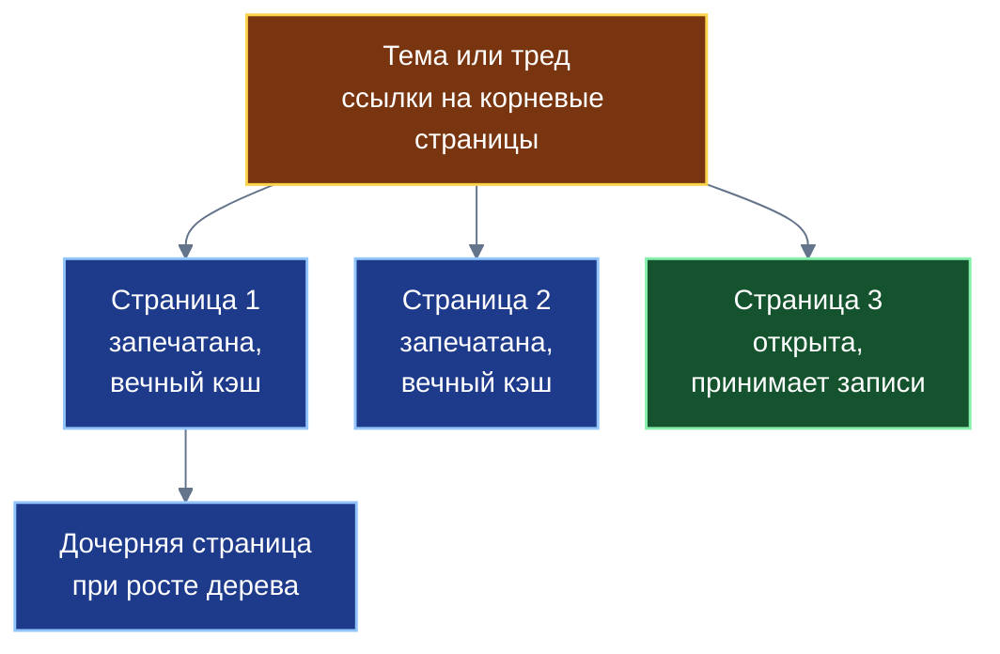
*Древовидная организация самозапечатывающихся страниц при росте коллекции данных*

### 5.3. Распределение страниц по дереву Веток

В архитектуре «Турбазы» темы, Ситуации и территориальные срезы распределены по иерархическим уровням дерева Веток. Каждая Ветка администрирует закреплённый за ней узел данных. Ответственная Ветка строго последовательно ведёт текущую открытую страницу и заблаговременно инициализирует создание следующей страницы при заполнении предыдущей, благодаря чему маршрут добавления записей остаётся детерминированным.

Для одной и той же темы Ветка может параллельно вести несколько независимых потоков страниц различных типов. Например, поток страниц общих ситуаций «КубГолоса» и поток страниц конкретных бытовых случаев «Заботы» ведутся раздельно, не смешиваясь в едином хранилище, но оставаясь привязанными к общему тематическому узлу.

### 5.4. Разделение обязанностей: Лист и Ветка

Между клиентскими устройствами («Листами») и узлами координации («Ветками») действует строгое функциональное разделение труда при работе со страницами.

| Участник процесса | Возложенные функции и ограничения |
|---|---|
| **Клиентский узел («Лист»)** | Создаёт, подписывает и хранит полную версию собственной записи (Случая, реплики) в своём локальном хранилище. Отправляет на Ветку транзакцию со ссылкой на родительскую сущность. **В сами страницы Лист ничего не пишет и не имеет права их модифицировать.** При отображении интерфейса Лист запрашивает страницы последовательно, показывая лёгкие карточки из кэша и подгружая новые блоки по мере прокрутки экрана. |
| **Узел координации («Ветка»)** | Управляет жизненным циклом страниц темы: принимает ссылки от Листов, находит текущую открытую страницу соответствующего типа и добавляет в неё компактную проекцию записи. При заполнении запечатывает страницу, порождает новую и фиксирует ссылку на неё в корневом оглавлении. При изменении автором названия или статуса записи Ветка транслирует обновление в соответствующую проекцию страницы. |

Благодаря тому, что страницы содержат только компактные проекции записей, отображение даже многотысячных списков на смартфонах происходит мгновенно. Полный текст записи и прикреплённые медиафайлы подгружаются из сети только тогда, когда пользователь непосредственно открывает карточку конкретного случая.

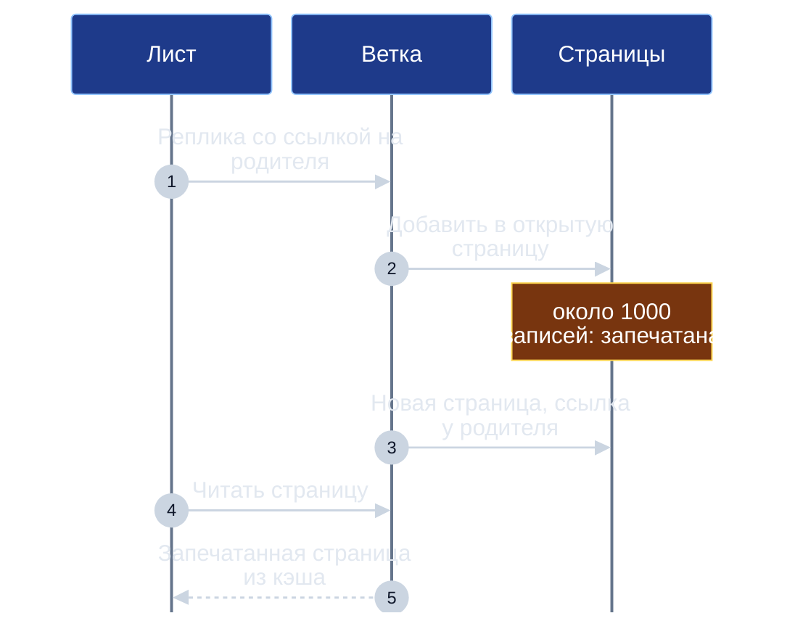
*Взаимодействие Листа и Ветки при наполнении и чтении страниц*

### 5.5. Архитектурное сопоставление проблемы и решения

| Проблема неограниченных связей в сети | Архитектурное решение через технологию страниц |
|---|---|
| Журнал изменений разрастается, первая синхронизация медленная | Каждая страница строго ограничена по объёму; Лист скачивает только нужный экранный срез |
| Конфликты блокировок при одновременной записи сотнями участников | Новые записи направляются только в текущую открытую страницу; Ветка ведёт её последовательно |
| Любая новая запись меняет состояние родителя и сбрасывает кэш | Заполненная страница запечатывается навсегда, оставаясь неизменяемым блоком в локальном кэше |
| Необходимость разработки отдельных сетевых протоколов для списков | Страница представляет собой стандартное платформенное хранилище с единым конвейером обработки |
| Недоступность структуры коллекций и истории при отсутствии связи | Страницы реплицируются в локальную базу данных Листа, гарантируя полноценную работу офлайн |

### 5.6. Изоляция частных контуров и открытый контракт

Механизм открытых самозапечатывающихся страниц применяется исключительно в общественном контуре платформы. К персональным, семейным и групповым хранилищам, защищённым сквозным шифрованием ключами участников, публичные страницы не применяются. Частные хранилища сохраняют полную структурную герметичность: Ветки не имеют технической возможности прочитать их содержимое и не включают их в публичные деревья страниц.

Для сторонних разработчиков технология страниц оформлена как открытый контракт ядра платформы. Любое внешнее приложение, размещающее собственные специализированные сервисы на территориальных Ветках, может использовать стандартный жизненный цикл страниц, получая возможность неограниченного горизонтального масштабирования собственных коллекций данных без усложнения клиентского кода. При этом полнотекстовый поиск по коллекциям осуществляется через специализированные деревья поиска, тогда как страницы отвечают за детерминированное постраничное чтение. Неизменяемость запечатанных страниц гарантирует строгую историческую воспроизводимость репутационных показателей: срез рейтинга на заданный момент времени может быть верифицирован любым независимым аудитором.

---

## 6. Голосование внутри треда: взвешивание мнений участников

Внутри каждого обсуждения в приложении «Забота» предусмотрен механизм оценивания выдвинутых предложений и свидетельств. Однако в отличие от закрытых корпоративных систем или голосований по поручениям в приложении «Деловой» (где право голоса имеют исключительно непосредственные исполнители и заказчики конкретного Дела), в «Заботе» в обсуждении и оценке могут участвовать все участники треда.

Чтобы исключить искажение результатов согласованными группами или ботами, влияние голоса участника не является механически равным: оно математически взвешивается по его социальному авторитету в теме обсуждаемого Случая. При этом используется ключевой принцип платформы: вес голоса в текущий момент опирается на показатель доверия, который был официально зафиксирован в блоке предыдущей закрытой эпохи (час для срочных вопросов или сутки для плановых тем). Это исключает возможность манипуляций за счёт мгновенного наращивания рейтинга в ходе одного и того же голосования.

Вес голоса $w_i$ участника $i$ рассчитывается по сублинейной формуле с гарантированным нижним порогом:
$$w_i = w_{\min} + (1 - w_{\min})\sqrt{b_i}$$
где $b_i = \frac{R_i}{R_i + S_i + W}$ — накопленный показатель доверия голосующего в соответствующей теме на конец предыдущей эпохи, $w_{\min} = 0{,}1$ — минимальный базовый вес любого участника, $W = 2$ — параметр неопределённости.

Сублинейная зависимость через квадратный корень имеет принципиальное социотехническое значение:
* Новичок без накопленной истории участия не лишён права голоса: его мнение гарантированно учитывается с весом не менее $0{,}1$, что обеспечивает открытость системы для новых граждан.
* Влияние опытных участников с высоким авторитетом растёт существенно медленнее их формального рейтинга, а максимальный вес строго ограничен единицей ($w \le 1{,}0$). Ни один признанный эксперт не может единолично подавить консолидированное мнение группы рядовых участников.

В алгоритмах оценивания действуют строгие ограничения: самооценка категорически исключена (автор реплики не может оценивать собственный вклад), а взаимные оценки участников, часто взаимодействующих друг с другом, подвергаются автоматическому дисконтированию.

Результаты оценивания отображаются интерфейсом приложения в виде двух параллельных шкал, расположенных рядом:
1. **Шкала «Народ»:** невзвешенное волеизъявление участников по демократическому принципу «один человек — один голос» с единичными весами.
2. **Шкала «Эксперты»:** волеизъявление, взвешенное по коэффициентам предметного авторитета участников в данной сфере.

Сопоставление двух шкал несёт важнейшую аналитическую информацию: если мнение большинства жителей кардинально расходится с оценкой признанных специалистов района, это сигнализирует о необходимости дополнительного разъяснения или пересмотра критериев решения. Шкала фактического «Результата» формируется третьим независимым потоком — на основе практических свидетельств Опыта.

---

## 7. Язык доверия: субъективная логика и затухание свидетельств

В основе математического аппарата оценки доверия в приложении «Забота» лежит формализм субъективной логики (Subjective Logic), разработанный учёным А. Йёсангом. В отличие от классической бинарной логики или традиционной теории вероятностей, субъективная логика предназначена для моделирования суждений в условиях фундаментальной неполноты информации, явно разделяя знание и неопределённость.

Суждение (мнение) участника или системы относительно надёжности некоторого утверждения или субъекта формализуется кортежем $\omega = (b, d, u, a)$, где:
* $b \in [0, 1]$ — степень веры (belief), отражающая массу положительных свидетельств;
* $d \in [0, 1]$ — степень сомнения (disbelief), отражающая массу отрицательных свидетельств;
* $u \in [0, 1]$ — степень неопределённости (uncertainty), отражающая дефицит эмпирических данных;
* $a \in [0, 1]$ — базовая априорная вероятность (base rate), принимаемая в системе по умолчанию равной $0{,}5$.

При этом строго соблюдается аддитивный инвариант:
$$b + d + u = 1$$

Математическое ожидание истинности суждения (ожидаемая надёжность) выражается формулой:
$$E = b + a \cdot u$$

Связь между накопленными положительными свидетельствами $r$, отрицательными свидетельствами $s$ и компонентами суждения выражается каноническими соотношениями:
$$b = \frac{r}{r + s + W}, \quad d = \frac{s}{r + s + W}, \quad u = \frac{W}{r + s + W}$$
где $W = 2$ представляет собой априорный вес неопределённости (эквивалент двух ненаблюдаемых испытаний).

Если об объекте нет никаких данных ($r = 0, s = 0$), неопределённость максимальна ($u = 1$), вера и сомнение равны нулю ($b = 0, d = 0$), а ожидание надёжности строго нейтрально: $E = 0 + 0{,}5 \cdot 1 = 0{,}5$. По мере накопления практических свидетельств неопределённость стремится к нулю, а показатель $E$ всё точнее отражает фактическую частоту успешных исходов.

| Положительные свидетельства $r$ | Отрицательные свидетельства $s$ | Вера $b$ | Сомнение $d$ | Неопределённость $u$ | Ожидание $E$ |
|:---:|:---:|:---:|:---:|:---:|:---:|
| 0 | 0 | 0,000 | 0,000 | 1,000 | 0,500 |
| 1 | 0 | 0,333 | 0,000 | 0,667 | 0,667 |
| 0 | 1 | 0,000 | 0,333 | 0,667 | 0,333 |
| 3 | 0 | 0,600 | 0,000 | 0,400 | 0,800 |
| 5 | 1 | 0,625 | 0,125 | 0,250 | 0,750 |
| 80 | 20 | 0,784 | 0,196 | 0,020 | 0,794 |
| 100 | 0 | 0,980 | 0,000 | 0,020 | 0,990 |

В качестве положительных свидетельств в приложении «Забота» выступают: решение проблемы по предложенной автором Идее, подтверждённый сообществом практический Опыт, успешно выполненная Задача или Дело в органайзере «Деловой», а также добровольная высокая оценка заказчика. Отрицательными свидетельствами служат: опровергнутые практикой рекомендации, документально зафиксированные срывы обязательств или обоснованные отрицательные отзывы участников взаимодействия. При этом исходы финансовых смарт-контрактов в данной модели напрямую не учитываются: они формируют отдельный защищённый экономический рейтинг Банка России.

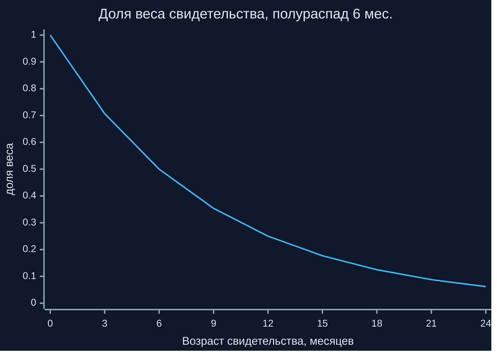
*Экспоненциальное затухание веса свидетельств во времени при полураспаде 6 месяцев*

Важнейшим принципом живого доверия является забывание давних событий: социальный статус человека не должен быть вечным пожизненным бременем. Для этого в платформе реализован механизм экспоненциального затухания свидетельств:
$$r(t) = r_0 \, e^{-\lambda \Delta t}, \quad \lambda = \frac{\ln 2}{T_{1/2}}$$
где $T_{1/2}$ — период полураспада свидетельств.

Для бытовых вопросов и локальной взаимопомощи базовый период полураспада принимается равным 6 месяцам (конкретное значение устанавливается оператором соответствующей темы). Через полгода вес положительного или отрицательного свидетельства уменьшается вдвое, через год составляет 25%, а через два года нивелируется до 6%. Благодаря этому былые ошибки человека естественным образом сглаживаются, а накопленный авторитет требует регулярного подтверждения созидательным участием в жизни сообщества.

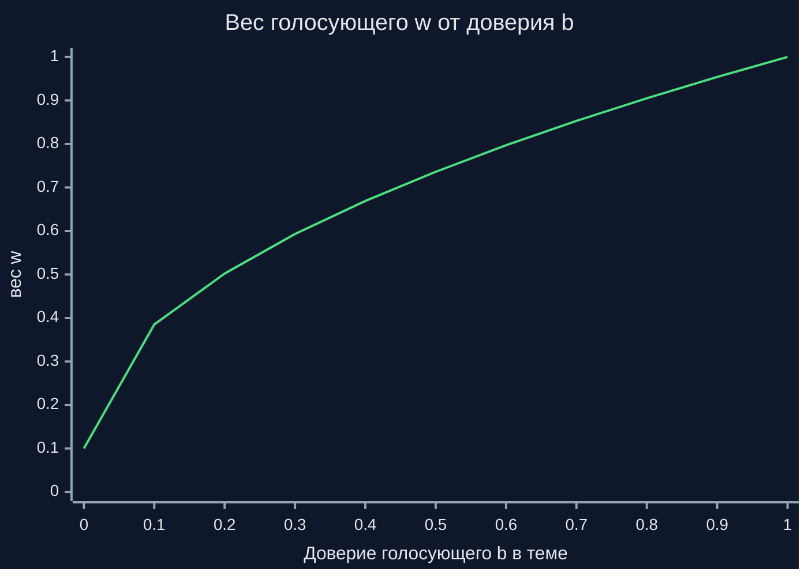
*Сублинейный рост веса голосующего в зависимости от накопленного доверия*

| Доверие голосующего $b$ | Эффективный вес голоса $w$ |
|:---:|:---:|
| 0,000 | 0,100 |
| 0,100 | 0,385 |
| 0,300 | 0,593 |
| 0,500 | 0,736 |
| 0,571 ($R=8, S=4$) | 0,780 |
| 0,800 | 0,905 |
| 0,960 | 0,982 |
| 1,000 | 1,000 |

Формула показателя темы $E = \frac{R + aW}{R + S + W}$ математически строго совпадает с ожиданием мнения субъективной логики при агрегированных массах свидетельств $R$ и $S$. Это означает, что используемая в платформе формула репутации представляет собой не эвристическую выдумку, а прямое следствие аппарата субъективной логики. При этом действует фундаментальный принцип: **рейтинг всегда публикуется в виде пары чисел — показатель темы $E$ и совокупная масса свидетельств $R + S$**. Единичный положительный отзыв ($E = 0{,}667$ при массе 1) никогда не будет выглядеть в глазах сообщества идентично устойчивой репутации мастера со ста положительными отзывами ($E = 0{,}990$ при массе 100).

Предметная компетентность строго изолирована по темам: высокий авторитет участника в вопросах садоводства или ремонта кровли не переносится автоматически в тему юридических консультаций или медицинского ухода. Для новых участников («холодный старт») предусмотрена поэтапная траектория: авторитет накапливается шаг за шагом — от участия в простых бытовых обсуждениях и подтверждения добрососедской помощи к решению комплексных задач микрорайона.

---

## 8. Социальный рейтинг вкладов: узлы Веток и сложение по дереву

Фундаментальный принцип децентрализованной архитектуры доверия состоит в том, что объектом оценивания всегда выступает конкретный объективный вклад (реплика, идея, практический опыт, выполненная задача), а не личность человека как таковая. Вклады пользователей группируются по предметным темам дерева каталога и пользовательским тегам.

Все первичные записи оценок физически создаются и хранятся в персональных хранилищах авторов оценок. Сбор оценок осуществляется через интерфейсные опросы сервиса «КубГолос». Для каждого отдельного вклада $c$ вычисляются агрегированные массы положительных ($R_c$) и отрицательных ($S_c$) свидетельств:
$$R_c = \sum_{i: s_i > 0} w_i \cdot s_i, \quad S_c = \sum_{i: s_i < 0} w_i \cdot |s_i|$$
где $s_i \in [-1, +1]$ — нормализованная позиция $i$-го оценщика, а $w_i$ — его эффективный вес.

Рассмотрим пересчитанный практический пример. Предположим, некоторый вклад оценили четыре участника со следующими позициями и уровнем доверия в данной теме:

| Участник | Доверие $b$ | Вес $w = 0{,}1 + 0{,}9\sqrt{b}$ | Позиция $s$ | Вклад в массу $R$ | Вклад в массу $S$ |
|:---:|:---:|:---:|:---:|:---:|:---:|
| 1 | 0,800 | 0,905 | +1,0 | 0,905 | 0,000 |
| 2 | 0,500 | 0,736 | +1,0 | 0,736 | 0,000 |
| 3 | 0,100 | 0,385 | −1,0 | 0,000 | 0,385 |
| 4 | 0,000 | 0,100 | +0,5 | 0,075 | 0,025 |

По итогам обработки получаем совокупные массы: $R = 1{,}716$ и $S = 0{,}410$. Показатель темы составляет:
$$E = \frac{1{,}716 + 0{,}5 \cdot 2}{1{,}716 + 0{,}410 + 2} = \frac{2{,}716}{4{,}126} \approx 0{,}658$$
при массе свидетельств $R + S = 2{,}126$. Читатель видит, что показатель вклада умеренно положительный, однако небольшая масса свидетельств указывает на сохраняющуюся неопределённость.

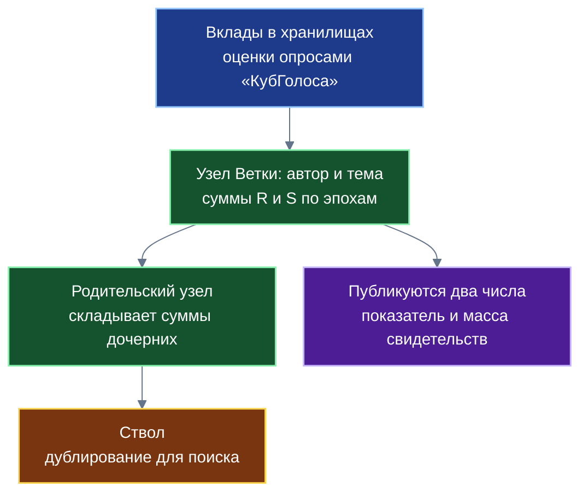
*Иерархическая агрегация узлов социального рейтинга от хранилищ до Ствола*

Агрегированные показатели аккумулируются в специальных индексных узлах распределённых Веток. Ключом индексной записи выступает составной кортеж `(идентификатор_регистрации_автора, тема)`. Внутри узла значения $R$ и $S$ раскладываются по временным корзинам соответствующих эпох. Родительские узлы (городские Ветви, региональные центры и Ствол страны) вычисляют агрегированные значения путём прямого сложения векторов дочерних узлов — по тем же алгоритмам векторного сложения, которые используются в «КубГолосе» для ответов на опросы.

Экспоненциальное затухание применяется динамически в момент чтения данных: при запросе показателя система умножает исторические корзины на соответствующий весовой коэффициент давности. Допустим, корзины эпох участника содержат следующие массы (возраст в месяцах: положительные, отрицательные): (0 мес: 2, 0), (3 мес: 1, 0), (6 мес: 1, 1), (12 мес: 2, 0). Без учёта фактора времени простые суммы составили бы $R = 6, S = 1$, давая $E = \frac{6 + 1}{6 + 1 + 2} = 0{,}778$. С учётом полураспада за 6 месяцев коэффициенты давности составляют: для 0 мес — 1,0; для 3 мес — 0,707; для 6 мес — 0,5; для 12 мес — 0,25. Скорректированные массы равны:
$$R = 2 \cdot 1{,}0 + 1 \cdot 0{,}707 + 1 \cdot 0{,}5 + 2 \cdot 0{,}25 = 3{,}707$$
$$S = 0 \cdot 1{,}0 + 0 \cdot 0{,}707 + 1 \cdot 0{,}5 + 0 \cdot 0{,}25 = 0{,}500$$
В результате с учётом затухания эффективная масса равна $4{,}207$, а показатель темы составляет $E = \frac{3{,}707 + 1}{3{,}707 + 0{,}5 + 2} \approx 0{,}758$.

В системе действует строгий математический инвариант согласованности: вычисление рейтинга на клиентском устройстве Листа на основе локального сбора первичных записей по тегам и чтение готового агрегированного узла с Ветки при одинаковом наборе учтённых вкладов дают строго идентичный результат. При этом агрегированный узел Ветки не сохраняет прямых связей с персональными идентификаторами хранилищ, защищая приватность участников.

Принципиальным институциональным правилом платформы является категорический отказ от сведения репутации к единому числу: **ни узлы Веток, ни корневой Ствол никогда не формируют и не публикуют одномерного «универсального балла человека»**. Допустимы исключительно специализированные многомерные срезы по предметным темам, регионам и пользовательским тегам.

---

## 9. Целостность рейтинга: разрыв цикла, дефлятор кластеризации и защита от накруток

Фундаментальной уязвимостью любой репутационной системы, в которой авторитет участников определяет вес их голосов, является угроза возникновения автокаталитического замкнутого круга самоусиления: привилегированная группа участников может систематически завышать оценки друг другу, неограниченно наращивая собственный вес и подавляя внешнюю критику.

Для гарантированного устранения этой угрозы в архитектуре «Заботы» реализованы четыре взаимосвязанных защитных барьера.

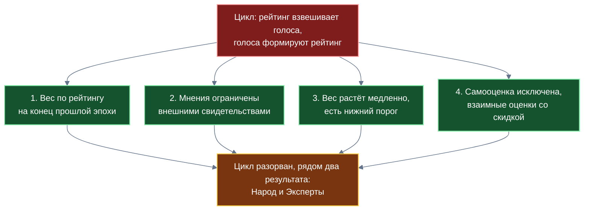
*Четыре структурных механизма гарантированного разрыва автокаталитического цикла*

### 9.1. Четыре механизма разрыва автокаталитического цикла

1. **Эпохальная дискретизация весов:** вес голоса участника в текущей эпохе $N$ рассчитывается строго по криптографически зафиксированному срезу рейтинга на конец предшествующей эпохи $N-1$. Любые оценки, полученные внутри текущей эпохи, не могут повлиять на вес собственного голоса в этом же временном интервале.
2. **Ограничение вклада мнений внешними практическими свидетельствами:** совокупный объём учитываемых субъективных мнений $M_{\text{мн}}$ жёстко ограничен сверху объёмом объективно подтверждённых практических свидетельств $M_{\text{вн}}$ (успешно закрытых Дел, принятых Рецептов, верифицированных актов приёмки):
   $$M_{\text{мн}}^{\text{эфф}} = \min(M_{\text{мн}}, \, \kappa M_{\text{вн}} + m_0)$$
   где базовые параметры принимаются равными $\kappa = 1$ и $m_0 = 2$. Если участник не имеет практических результатов реальной деятельности, никакое количество хвалебных отзывов в сети не позволит поднять его репутацию выше начального порога $m_0$.

| Масса субъективных мнений $M_{\text{мн}}$ | Масса внешних свидетельств $M_{\text{вн}}$ | Эффективно учитываемая масса мнений $M_{\text{мн}}^{\text{эфф}}$ |
|:---:|:---:|:---:|
| 10 | 0 | 2 |
| 10 | 1 | 3 |
| 10 | 3 | 5 |
| 2 | 5 | 2 |

3. **Сублинейный рост веса с гарантированным минимумом:** формула $w_i = w_{\min} + (1 - w_{\min})\sqrt{b_i}$ не позволяет авторитетным участникам концентрировать монопольный вес при голосовании.
4. **Запрет самооценки и дисконтирование взаимности:** оценки самого себя блокируются протоколом, а оценки между регулярно взаимодействующими контрагентами дисконтируются со стандартным коэффициентом $0{,}5$.

### 9.2. Штраф за кластеризацию и защита от сговора

Для противодействия организованным группам, систематически выставляющим друг другу максимальные баллы («кольца взаимного восхваления»), алгоритм вычисляет коэффициент локальной связности графа взаимодействий:
$$C(A, B) = \frac{2 |\Delta(A, B)|}{k_A \cdot k_B}$$
где $|\Delta(A, B)|$ — число общих контрагентов у участников $A$ и $B$, а $k_A, k_B$ — общее число их связей.

Если коэффициент кластеризации превышает установленный порог ($C > C_{\text{порог}}$), система идентифицирует изолированное сообщество и экспоненциально дисконтирует вес взаимных оценок участников:
$$w_{\text{эфф}} = w_0 \, \exp(-\beta(C - C_{\text{порог}}))$$
Конкретные калибровочные значения коэффициента $\beta$ определяются посредством имитационного моделирования.

Для защиты от эмоционального шантажа и мести при расторжении договорённостей применяется протокол двойного слепого раскрытия: взаимные отзывы сторон сделки или спора публикуются одновременно только после того, как обе стороны подписали и отправили свои независимые оценки в зашифрованном виде. Ни одна из сторон не может скорректировать свой отзыв в ответ на критику оппонента. При возникновении неустранимых разногласий процедура передаётся в институт независимого разбора.

Для защиты участников от скоординированной травли («набегов») действует правило: суждения участников, не имевших с автором подтверждённого практикой совместного Опыта взаимодействия, получают предельную неопределённость $u \to 1$ и отсекаются алгоритмом слияния мнений.

### 9.3. Анализ остаточных системных рисков

Проектируя защитные механизмы, разработчики обязаны трезво оценивать границы применимости криптографических и алгоритмических инструментов:
1. Как показано в фундаментальной работе Дж. Дусера (2002), в децентрализованных системах без единого логически централизованного органа удостоверения личности абсолютная математическая защита от атак Сивиллы принципиально недостижима. Предлагаемые алгоритмы многоуровневой защиты не гарантируют «нулевой риск», но радикально снижают экономическую выгоду искусственных накруток.
2. Алгоритмы выявления сговора опираются на топологию графа связей; высокоорганизованные скрытые сговоры с распределением ролей могут потребовать длительного времени для их статистического обнаружения.
3. Подтверждённый Опыт с видеозаписью существенно сложнее сфабриковать, чем короткий текстовый отзыв, однако риск фальсификации реальных событий не может быть исключён полностью.
4. Начальные численные параметры системы (минимальный вес $w_{\min}$, порог $m_0$, коэффициент затухания) требуют регулярной калибровки на основе практических данных.
5. Наличие нескольких анонимных регистраций у одного человека предотвращается отсутствием механизма слияния их репутаций: вес каждой виртуальной личности остаётся минимальным.

---

## 10. Права пользователя, контуры приватности и оператор темы

В архитектуре «Турбазы» репутация рассматривается не как инструмент внешнего административного контроля, а как продолжение автономной цифровой правосубъектности человека. Система предоставляет участникам комплекс институциональных гарантий защиты своих прав.

Ключевой гарантией выступает неотъемлемое право ответа: любой гражданин или представитель организации имеет возможность опубликовать официальный мотивированный ответ на любую полученную критическую оценку. Интерфейс приложений гарантирует, что ответ автора отображается непосредственно рядом с исходным отзывом, обеспечивая всестороннее освещение ситуации.

Пользователь имеет техническую возможность осуществить разбор репутации до первоисточника: с помощью собственных клиентских тегов на Листе он может запросить и верифицировать цепочку исходных хранилищ, на основе которых был сформирован конкретный показатель.

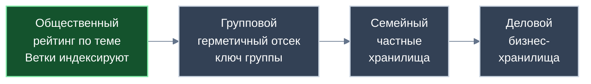
*Разграничение уровней видимости и контуров приватности в платформе*

Важнейшим институтом платформы выступает оператор темы. Оператором темы является кооператив участников, поддерживающий соответствующую тематическую Ветвь, либо разработчик отраслевого прикладного каталога. Оператор темы определяет правила модерации, регламент затухания свидетельств и перечень факторов оценки строго в рамках действующего законодательства Российской Федерации. Материалы, прямо запрещённые законом к распространению, безусловно исключаются из публичной индексации.

| Предмет решения | Компетентный субъект принятия решений |
|---|---|
| Политика отображения негативных оценок и сроки их публикации | Оператор темы в соответствии с правилами каталога и законом |
| Период полураспада свидетельств, весовые квоты и факторы оценки | Оператор темы совместно с разработчиками прикладных схем |
| Доступ к приватным и корпоративным контурам | Исключительно участники контура на основании личного согласия |
| Регламент защиты прав на общедоступный репутационный след | Согласованные правила сообщества и правовые нормы законодательства |
| Соблюдение запретов на распространение противоправных сведений | Обязательное исполнение всеми узлами платформы в силу закона |

В платформе предусмотрено создание герметичных отсеков сообществ: жильцы конкретного подъезда, дачные товарищества или объединения родителей могут организовывать закрытые группы. Все данные в таких группах шифруются общими симметричными ключами участников; узлы распределённой сети («Ветки») передают зашифрованные пакеты вслепую, не имея возможности дешифровать текст или включить приватные обсуждения в общественные каталоги.

Модерация общедоступных деревьев данных организована на двух независимых уровнях:
* **Кооперативный уровень:** контроль операторов за строгим соблюдением требований законодательства РФ в общедоступных каталогах.
* **Репутационный уровень:** саморегуляция сообщества, при которой мотивированные жалобы участников с высоким социальным авторитетом автоматически понижают позицию сомнительных материалов в списке отображения, исключая навязчивую рекламу и спам без механического удаления записей из распределённого журнала.

---

## 11. Регистрация и перенос рейтинга: правила конвертации

Сохраняя преемственность с архитектурой «КубГолоса», сервис «Забота» поддерживает три базовых режима регистрации участников в общественном контуре:
1. **Полная анонимность:** личность участника не раскрывается ни сообществу, ни государственным институтам. Подтверждается исключительно территориальный ценз проживания в районе с помощью локальной жеребьёвки и подтверждения соседей.
2. **Социальная анонимность:** личность участника удостоверена доверенной государственной структурой или банком (например, привязкой кошелька цифрового рубля с правилом «один кошелёк на человека»), однако для широкой общественности и соседей пользователь выступает под защищённым псевдонимом. Разновидностью социальной анонимности является групповая регистрация через сход соседей без привязки финансовых инструментов.
3. **Поимённая регистрация:** участник добровольно открывает своё подлинное имя для всех пользователей общественного контура.

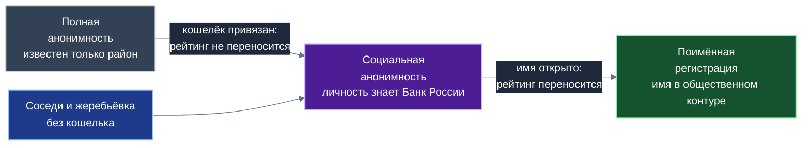
*Маршруты перехода между режимами регистрации и правила конвертации репутации*

Социальный рейтинг вкладов рассчитывается во всех трёх режимах, однако правила переноса и конвертации накопленной репутации строго регламентированы для предотвращения злоупотреблений.

| Режим регистрации | Степень идентификации субъекта | Регламент конвертации социального рейтинга |
|---|---|---|
| **Полная анонимность** | Известен только район проживания | Рейтинг учитывается за анонимным ключом. **Конвертация в социальную анонимность при привязке кошелька запрещена:** это исключает возможность коммерческой торговли «прокачанными» анонимными аккаунтами. |
| **Социальная анонимность** | Обществу имя неизвестно; личность удостоверена банком | Рейтинг накапливается за псевдонимом. При добровольном решении гражданина открыть имя накопленный авторитет **полностью переносится в поимённый профиль**. |
| **Групповая регистрация** | Подтверждено членство в группе соседей | Рейтинг накапливается за локальным идентификатором без доступа к банковским реквизитам. |
| **Поимённая регистрация** | Подлинное имя общедоступно в контуре | Рейтинг ведётся открыто под реальным именем. Перед подтверждением перехода интерфейс выводит обязательное предупреждение о публичности. |

Принцип институционального разграничения знаний гарантирует защиту прав человека: Банк России удостоверяет личность гражданина для финансовых расчётов, не располагая сведениями о его бытовых дискуссиях в приложении «Забота»; районная Ветка подтверждает факт проживания в микрорайоне, не имея доступа к банковским счетам и операциям пользователя.

---

## 12. Открытые схемы и общее использование платформенной репутации

Важнейшим системным эффектом разработки приложения «Забота» является создание общедоступного открытого стандарта описания прикладных сущностей. Сторонние разработчики получают готовые, выверенные схемы данных (Случай, Опыт, структурированная реплика, самозапечатывающаяся страница), избавляясь от необходимости проектировать закрытые проприетарные форматы.

Накопленный в «Заботе» социальный рейтинг вкладов становится универсальным ресурсом доверия для всей прикладной экосистемы платформы:
* **В «КубГолосе»:** рейтинг участника в теме определяет вес его мнения на экспертной шкале при проведении социологических и муниципальных опросов.
* **В «Деловом»:** высокий социальный авторитет постановщика повышает приоритет создаваемой задачи в общем распределённом реестре поручений (подробно — в Белой книге № 10 «Деловой»).
* **В «УраТуре»:** проверенные авторы видеомаршрутов и опытные проводники получают верифицированный статус на основе подтверждённого Опыта путешественников.
* **В Локальном реестре МСП и ЖКХ:** рейтинг частных мастеров, слесарей, электриков и сервисных компаний формируется не по анонимным отзывам, а по проверяемым практическим актам приёмки и свидетельствам соседей.
* **В инфраструктуре Веток:** качество маршрутизации и надёжность вычислительных узлов оцениваются на основе аналогичных репутационных механизмов.

При этом сохраняется фундаментальный экономический инвариант: **основная ценность сервиса сосредоточена в бескорыстном обмене полезной информацией и взаимной поддержке**. Экономические смарт-контракты подключаются исключительно как вспомогательный инструмент по мере необходимости, не превращая общественную платформу в коммерческую биржу.

---

## 13. Три практических сценария применения

Для наглядной иллюстрации работы описанных механизмов рассмотрим три прикладных сценария из руководства по социально-экономическому влиянию сервиса «Забота». Приведённые числовые параметры носят характер условных примеров.

### Сценарий 1. Оборудование дачного участка для маломобильного члена семьи

Семья сталкивается с необходимостью обустройства безопасного пандуса и переоборудования санузла на даче для дедушки, передвигающегося на инвалидной коляске. Доступный бюджет крайне ограничен, а типовые коммерческие решения требуют непосильных затрат.
* **Вклад:** сосед по посёлку, имеющий квалификацию инженера-строителя, публикует в «Заботе» проверенное решение: подробную видеоинструкцию («Показ») по сборке надёжного деревянного пандуса из стандартных пиломатериалов с расчётом угла уклона.
* **Фиксация Рецепта:** семья успешно собирает конструкцию, публикуя подтверждающий Опыт. Триада закрепляется в теме «Доступная среда» как готовый Рецепт.
* **Репутационный эффект:** инженер получает рост положительных свидетельств в теме «Малоэтажное строительство и адаптация жилья», повышая свой социальный авторитет в районе.
* **Финансирование:** недостающие 30 000 рублей семья привлекает в рамках проектного предложения беспроцентного займа внутри родственного круга (данный механизм относится к финансовым смарт-контрактам и подробно рассматривается в Белых книгах № 07 и № 10).

### Сценарий 2. Ликвидация коммунальной аварии в многоквартирном доме

В период сильных зимних морозов происходит аварийный прорыв стояка отопления в подъезде многоквартирного дома. Городские коммунальные службы перегружены вызовами.
* **Вклад:** житель повреждённого подъезда публикует Случай с наивысшим баллом срочности по пятибалльной шкале: «Срочно требуется доступ в тепловой пункт и сварочный аппарат».
* **Координация в сети:** житель соседнего подъезда оперативно сообщает прямой телефон дежурного инженера, а житель первого этажа предоставляет необходимое оборудование. При временном отключении внешней связи координация жильцов поддерживается через локальную ячеистую сеть подъезда.
* **Переход в Дело:** решение проблемы оформляется как оперативная коллективная задача; жильцы локализуют аварию собственными силами.
* **Репутационный след:** все участники, оказавшие реальную практическую помощь, получают подтверждённые положительные свидетельства в теме «Благоустройство и ЖКХ».

### Сценарий 3. Выбор специалиста по присмотру за детьми

Семья с двухлетним ребёнком ищет няню в своём микрорайоне. Родители опасаются доверять ребёнка специалистам с коммерческих агрегаторов из-за распространённости заказных платных отзывов.
* **Вклад:** родители обращаются к локальному каталогу темы «Раннее развитие и уход за детьми» в приложении «Забота». Они видят не абстрактный пятизвёздочный рейтинг, а конкретные подтверждённые свидетельства Опыта других семей своего квартала.
* **Защита от фальсификаций:** алгоритм дисконтирования кластеризации исключает накрутку отзывов со стороны родственников специалиста; отзывы без подтверждённого практикой совместного опыта отсекаются по критерию неопределённости.
* **Право ответа:** при наличии спорных ситуаций родители видят аргументированные ответы специалиста, формируя взвешенное суждение.

---

## 14. Базовые модули платформы и границы роли приложения

Опыт проектирования и практической эксплуатации приложения «Забота» позволяет выделить совокупность ключевых конструкций, которые переносятся из прикладного сервиса непосредственно в системное ядро платформы «Турбаза» в качестве общеплатформенных модулей.

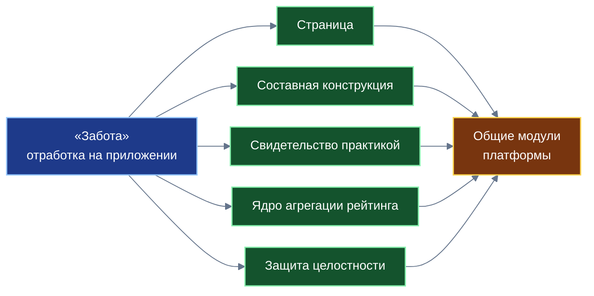
*Перенос прикладных механизмов приложения «Забота» в базовые модули платформы*

### 14.1. Трансформация прикладных механизмов в системные модули

| Прикладное решение в «Заботе» | Базовый общесистемный модуль платформы «Турбаза» |
|---|---|
| Деление неограниченных списков на запечатываемые блоки | Платформенные самозапечатывающиеся страницы коллекций данных |
| Триада «Ситуация + Случай + Разговор» | Универсальный протокол составной антимонопольной сборки сервисов |
| Мультимодальные форматы «Голос» и «Показ» с локальным распознаванием | Системный модуль фиксации эмпирических свидетельств практикой |
| Узлы репутации с эпохальными корзинами и экспоненциальным затуханием | Распределённое ядро агрегации социального рейтинга по дереву тем |
| Четыре защитных барьера и дефлятор кластеризации связей | Общесистемный модуль защиты целостности распределённых оценок |
| Регламент разделения прав и запрет конвертации анонимного статуса | Унифицированные правила регистрации и защиты от оборота аккаунтов |
| Институт мотивированного ответа и верификация исходных хранилищ | Платформенный стандарт защиты прав пользователей на достоверность данных |

### 14.2. Границы институциональной роли приложения

Для формирования корректных ожиданий необходимо строго очертить границы функциональной роли сервиса:
1. Приложение «Забота» принципиально не рассчитывает кредитных рейтингов, не оценивает платёжеспособность и не ведёт финансовых скорингов: эти функции всецело относятся к защищённому экономическому рейтингу, рассчитываемому уполномоченными структурами Банка России.
2. Сервис никогда не сводит репутацию человека к одномерному скаляру или единому «гражданскому баллу».
3. Приведённые в инженерных спецификациях проектные предложения относительно лимитов финансирования, залоговых инструментов, взаимных касс взаимопомощи (РОСКА) и транзитивного поручительства представляют собой гипотетические модели для внешних финансовых организаций и не являются функционалом базовой платформы.
4. Правила модерации и параметры затухания определяются операторами конкретных тем в строгих границах законодательства Российской Федерации.

### 14.3. Что передаётся следующей книге комплекта

Теги, группы опросов и контракты второго уровня, на которых открытый социальный рейтинг практически соединяется с защищённым экономическим рейтингом Банка России, подробно описаны в Белой книге № 10 «Деловой»; фундаментальная концептуальная картина двух независимых рейтингов представлена в Белой книге № 07.

### 14.4. Открытые вопросы для дальнейших исследований

Развитие платформы ставит ряд глубоких научно-технических и организационных вопросов:
* Разработка типовых нормативных каталогов факторов оценки для различных отраслей экономики и социальной сферы;
* Проведение широкомасштабных имитационных симуляций для оптимизации численных параметров затухания, длительности эпох и штрафов за кластеризацию;
* Совершенствование нормативно-правового статуса открытых цифровых репутаций в законодательстве РФ;
* Проектирование институтов третейского и народного арбитража при разрешении межличностных и хозяйственных споров.

---

## 15. Заключение и связь с комплектом

Приложение «Забота» демонстрирует принципиально новую парадигму взаимодействия граждан в цифровую эпоху. Переход от хаотичного информационного шума традиционных мессенджеров к культуре структурированных созидательных вкладов позволяет обществу эффективно накапливать проверенный жизненный опыт, трансформируя локальные проблемы в тиражируемые Рецепты.

Архитектурные новации сервиса закладывают надёжный фундамент для развития всей распределённой платформы:
* **Самозапечатывающиеся страницы** гарантируют неограниченное масштабирование децентрализованных коллекций данных с константной вычислительной сложностью $O(1)$ и вечным локальным кэшированием.
* **Антимонопольная составная конструкция** защищает экосистему от диктата монополий, позволяя собирать прикладные сервисы из открытых независимых схем.
* **Аппарат субъективной логики** обеспечивает математически строгое взвешивание суждений в условиях неопределённости, исключая субъективизм и автокаталитические накрутки.
* **Институциональное разделение двух рейтингов** защищает неприкосновенность личной жизни граждан, сохраняя открытый характер общественной репутации.

В рамках трёхчастного комплекта системообразующих приложений Белая книга № 09 занимает центральное связующее место: опираясь на математический базис «КубГолоса» (№ 08), она вводит структуры вкладов, страниц и репутации, передавая эти механизмы на следующий уровень — в интеллектуальный органайзер «Деловой» (№ 10), где замыкается цикл исполнения реальных хозяйственных дел и контрактов доверия.

Автор платформы и разработчики приглашают профильные научно-исследовательские центры, корпоративных архитекторов и организаторов локальных сообществ к открытому экспертному диалогу и совместной апробации представленных решений.
