# «Деловой»: исполнять и связывать
**Белая книга № 10: Дело как хранилище и контракт, теги, группы опросов и связь двух рейтингов**
*Версия: 1.0 (2026)*
*Статус: проектная концепция*
*Классификация: прикладной уровень платформы «Турбаза»*

> *Автор: Артём Владимирович Шамсутдинов, разработчик платформы цифрового суверенитета государства «Турбаза» — интернета автономных и частных данных / открытого стека AIRport.*
> *Методология подготовки: замысел приложения «Деловой», его место в платформе, идея контрактов второго уровня и связки социального и экономического рейтингов, модель двух рейтингов, принципы открытости социального рейтинга, передачи экономического рейтинга Банку России и режимы регистрации сформированы автором. Планирование документа выполнено моделью Claude Sonnet 5.5; распределение понятий между тремя книгами комплекта и порядок изложения предложены ею для утверждения автором. Детальная проработка текста выполнена моделью Flash 3.8.*

---

## Аннотация

Настоящая Белая книга представляет проектную концепцию и инженерную архитектуру приложения «Деловой» — третьего компонента системообразующей триады прикладных решений платформы цифрового суверенитета государства и распределённых данных «Турбаза». Если «КубГолос» решает задачу измерения общественного согласия через многофакторную оценку, а «Забота» служит средой накопления структурированного жизненного опыта и взаимной поддержки, то «Деловой» выступает исполнительским и связующим ядром платформы. На этом приложении отрабатываются фундаментальные платформенные механизмы: изоляция жизненных планов в модели «одно Дело — одно хранилище», безопасное объединение разнородных источников на устройстве гражданина в оперативной памяти без межпрограммных утечек, платформенные многомерные теги, защищённый мандатами общественный программный интерфейс поручений, многоуровневая проверка и экономически мотивированный взаимный аудит чужого кода, а также контракты второго уровня. Главным системным вкладом приложения становится формирование связного узла двух независимых рейтингов: открытого социального рейтинга вкладов по темам, индексируемого на распределённых узлах сети, и защищённого экономического рейтинга Банка России, рассчитываемого на основе объективных исходов исполнения смарт-контрактов. Документ адресован широкому кругу исследователей, архитекторов распределённых систем, специалистов по информационной безопасности и институциональных экспертов в области цифровой экономики.

---

## Как читать эту книгу

Настоящее исследование входит в завершающую часть цикла из трёх прикладных Белых книг (№ 08 «КубГолос», № 09 «Забота», № 10 «Деловой»), однако спроектировано как полностью автономный труд. Читателю не требуется предварительное изучение смежных документов для понимания излагаемых технических и социально-экономических решений: все ключевые концепции снабжены необходимыми пояснениями при первом упоминании.

В книге принят академический, доказательный и уважительный тон изложения. Разработчики действующих облачных сервисов управления задачами, корпоративных систем планирования и банковских кредитных бюро проделали колоссальную созидательную работу, заложив основы современной цифровой координации. Архитектура «Турбазы» не противопоставляет себя существующим инструментам и не объявляет их устаревшими, а предлагает иное инженерное устройство: переход от централизованного хранения персональных планов на удалённых серверах к прямому автономному владению данными (Self-Custody) на аппаратах граждан.

Количественные показатели, приведённые в тексте, отражают целевые проектные ориентиры платформы и результаты лабораторных исследований; практические сценарии носят характер условных иллюстраций. Документ содержит строго концептуальные и функциональные описания: в соответствии со стандартами представительской документации платформы в текст не включаются фрагменты исходного программного кода, служебные описания баз данных и программные имена классов.

> [!NOTE]
> **Из предыдущих книг комплекта: базовые концепции платформы**
> * **Многофакторная оценка (Белая книга № 08 «КубГолос»):** метод волеизъявления, при котором участник распределяет сто базисных пунктов своего веса влияния между несколькими независимыми факторами проблемы, фиксируя свою позицию и степень значимости каждого довода.
> * **Счётчики оперативной памяти и блоки эпох (Белая книга № 08):** архитектурный приём, при котором промежуточные суммы голосов аккумулируются в оперативной памяти связных узлов («Веток») и фиксируются криптографическими подписями через регулярные интервалы времени (эпохи).
> * **Сложение сумм вверх по дереву Веток (Белая книга № 08 и № 09):** иерархическая агрегация векторов мнений от районных узлов к городским и общенациональным уровням без централизованной базы данных.
> * **Принцип «Пиши только своё» (Белая книга № 08 и № 09):** базовый инвариант распределённого ядра, согласно которому каждый участник создаёт и подписывает исключительно собственные записи в своём локальном журнале изменений и физически не способен изменить или удалить чужие данные.
> * **Двухконтурность и слепой ретранслятор (Белая книга № 08):** разделение взаимодействия на открытый общественный контур, доступный для индексации, и защищённый частный контур, где промежуточный сервер передаёт шифрованные блоки, не имея ключей для чтения их содержимого.
> * **Режимы регистрации (Белая книга № 08 и № 09):** три градации удостоверения субъекта — полная криптографическая анонимность, социальная анонимность (удостоверение принадлежности к сообществу без раскрытия паспортных данных) и поимённое участие.
> * **Самозапечатывающиеся страницы (Белая книга № 09 «Забота»):** модульный способ хранения списков и обсуждений порциями примерно по тысяче записей, предотвращающий разрастание неделимых журналов изменений.
> * **Социальный рейтинг вкладов по теме и оператор темы (Белая книга № 09):** открытая децентрализованная мера доверия, вычисляемая по подтверждённым полезным действиям человека в конкретной предметной области; правила предметной области и параметры угасания свидетельств определяет оператор темы — сообщество или профильная артель.

---

## 1. Задача и место приложения в платформе

Повседневная деятельность современного человека неизбежно фрагментирована между множеством разрозненных информационных систем. Служебные поручения фиксируются в корпоративных трекерах задач, бытовые договорённости и списки покупок растворяются в неструктурированных семейных чатах мессенджеров, заказы частным мастерам ведутся через доски объявлений, а взаимодействие с коммунальными службами и соседскими объединениями требует регулярного переключения в специализированные локальные сервисы.

Традиционные централизованные планировщики задач и облачные платформы продуктивности отлично справляются с задачами синхронизации в рамках единой организации или индивидуального расписания. Однако их устройство опирается на концентрацию данных на внешних серверах поставщика услуги и требует непрерывного подключения к сети связи. В таких условиях пользователь вынужден либо доверять детальную картину своей частной, семейной и предпринимательской жизни сторонним операторам, либо мириться с разобщённостью инструментов, при которой рабочие планы изолированы от домашних обязательств.

Платформа «Турбаза» реализует принципиально иную парадигму. Вместо создания единого универсального хранилища в облаке архитектура переносит центр обработки данных непосредственно на персональное устройство пользователя — уровень «Листа». Приложение «Деловой» создаётся не как очередной обособленный планировщик, а как фундаментальная прикладная лаборатория, на которой платформа отрабатывает комплексные системные модули исполнения и координации.

Главная институциональная и инженерная роль «Делового» в триаде системообразующих приложений платформы заключается в замыкании жизненного цикла человеческого взаимодействия:

$$«КубГолос»\;(\text{Измерение согласия}) \longrightarrow «Забота»\;(\text{Структурирование опыта}) \longrightarrow «Деловой»\;(\text{Практическое исполнение}) \longrightarrow «Забота»\;(\text{Свидетельство}) \longrightarrow «КубГолос»\;(\text{Результат})$$

В архитектуре платформы строго соблюдается принцип асимметрии слоёв. На уровне схем данных зависимость остаётся строго однонаправленной: структуры данных «КубГолоса» не содержат ссылок на «Заботу», а схемы «Заботы» не зависят от «Делового». Приложение «Деловой» опирается на открытые структуры нижних уровней. Однако на уровне пользовательского интерфейса все три приложения представляют собой набор независимых визуальных оболочек, которые могут свободно встраиваться друг в друга. Это позволяет организовывать сквозные сценарии взаимодействия без нарушения модульности и технологической автономии каждого компонента.

| № | Направление отработки в «Деловом» | Назначение для платформы | Общий системный модуль | Глава |
| :---: | :--- | :--- | :--- | :--- |
| 1 | **Дело как автономное хранилище** | Изоляция контекстов выполнения, независимый жизненный цикл, предотвращение компрометации | Модуль атомарных реляционных хранилищ | 2 |
| 2 | **Сборка на Листе без утечек** | Объединение личных, семейных и служебных планов на одном экране в оперативной памяти | Модуль клиентской федеративной агрегации | 3 |
| 3 | **Многомерные теги** | Каталогизация без жёстких иерархий, внешние метки на чужих записях, тематические срезы | Платформенная служба префиксных тегов | 4 |
| 4 | **Мандатный интерфейс поручений** | Контролируемый приём задач от доверенных внешних служб без возможности спама | Общественный интерфейс входящих поручений | 5 |
| 5 | **Группы опросов и прикладной цикл** | Координация коллективных решений и обогащение шкалы результатов подтверждённым опытом | Межприложенческий координационный контур | 6 |
| 6 | **Безопасная композиция чужого кода** | Трёхзвенная верификация модулей и экономически мотивированный взаимный аудит разработчиков | Инфраструктура доверенного исполнения модулей | 7 |
| 7 | **Контракт второго уровня** | Разделение конфиденциального состава работ и публичных состояний расчётов | Двухуровневый контрактный контур | 8 |
| 8 | **Связка двух рейтингов** | Соединение открытых социальных оценок качества с закрытым экономическим скорингом | Институциональный узел децентрализованного доверия | 9 |
| 9 | **Экономическая ступень доверия** | Защита номеров счетов, контролируемая проверка порогов и предотвращение зондирования | Протокол пороговой аутентификации | 10 |
| 10 | **Личный когнитивный слой** | Снижение тревожности, приоритизация и преодоление паралича выбора | Математический модуль затухания приоритета | 11 |

---

## 2. Дело и его хранилище

В прикладной архитектуре «Делового» центральной единицей организации деятельности выступает Дело. Дело представляет собой высокоуровневую конструкцию, объединяющую стратегические Цели человека или коллектива и коренную Задачу, которая может ветвиться в иерархическое дерево или направленный ациклический граф взаимосвязанных подзадач.

Базовые сущности Цели и Задачи не являются закрытой собственностью приложения «Деловой». Они принадлежат общесистемному открытому уровню платформы «Турбаза» и определены в стандартном платформенном модуле целеполагания. Любое стороннее приложение экосистемы способно напрямую взаимодействовать с этими сущностями. Приложение «Деловой» надстраивает над ними прикладную логику исполнения, привязывая к Задаче прагматический смысловой каркас: определение ответственных, сроков, места действия, конкретных шагов и критериев завершения.

Ключевой структурный механизм декомпозиции в «Деловом» — операция повышения подзадачи в самостоятельное Дело. Когда в процессе выполнения комплексного проекта выясняется, что отдельный шаг требует привлечения сторонних исполнителей, собственного бюджета или независимого согласования, пользователь в одно действие трансформирует выбранную подзадачу в полноценное Дело. В этот момент подзадача становится коренной Задачей нового автономного образования, сохраняя родительскую связь с исходной Целью, но приобретая собственный автономный контур управления.

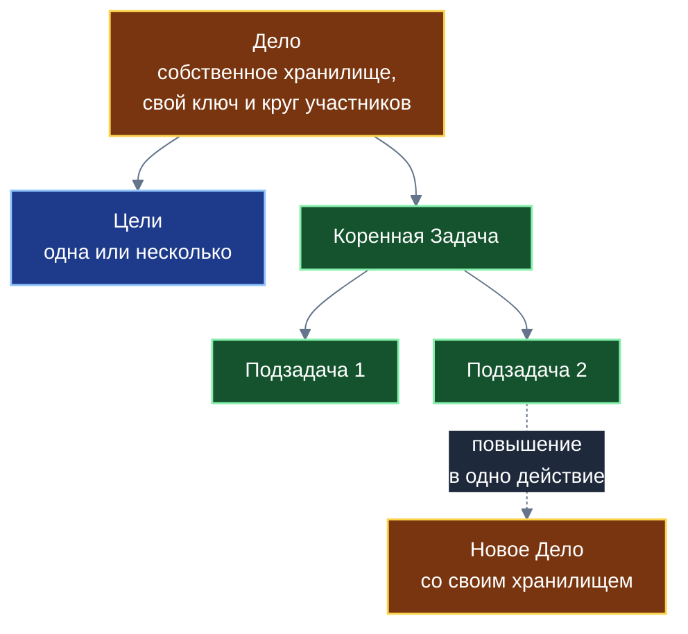
*Схема 1. Конструкция Дела: объединение Целей, коренной Задачи и механизм повышения подзадачи в самостоятельное Дело.*

Фундаментальный архитектурный принцип приложения формулируется как «одно Дело — одно хранилище». Каждое создаваемое Дело развёртывается в изолированном реляционном хранилище данных с уникальным криптографическим идентификатором, собственным ключом симметричного шифрования, локальным журналом изменений и строго очерченным кругом участников.

В архитектуре «Делового» намеренно исключено создание всеобъемлющих «монолитных баз» — например, общего семейного или единого корпоративного хранилища, куда помещались бы все задачи подряд. Отказ от монолитов продиктован требованиями информационной безопасности:
* **Изоляция рисков компрометации:** предоставление доступа внешнему подрядчику к Делу «Ремонт ванной комнаты» открывает ему криптографический ключ исключительно данного конкретного хранилища. Подрядчик физически не может получить доступ к семейным планам на отпуск или личным медицинским поручениям.
* **Автономия жизненного цикла:** каждое Дело завершается, архивируется или удаляется независимо от остальных сущностей, не загромождая единый журнал транзакций.
* **Гибкая адресация прав:** состав участников каждого Дела настраивается индивидуально путём обмена асимметричными ключами доступа при формировании хранилища.

В проектировании структур данных задействован принцип антимонопольной композиции схем. Сложные комплексные связи между Целями, Задачами, исполнителями и временными шкалами формируются не через раздувание единой монопольной схемы данных, а через связывание небольших специализированных таблиц. Поскольку встроенная реляционная СУБД на Листе функционирует непосредственно в оперативной памяти устройства, выполнение распределённых соединений занимает доли миллисекунды, гарантируя мгновенный отклик интерфейса без ущерба для модульности архитектуры.

| Вид Дела | Характерный пример | Круг участников с доступом | Режим видимости для промежуточных узлов (Веток) |
| :--- | :--- | :--- | :--- |
| **Личное** | Контроль здоровья, самообучение | Исключительно владелец устройства | Содержимое полностью зашифровано; Ветка передаёт слепые блоки |
| **Семейное** | Совместный ремонт, домашние закупки | Члены семьи, добавленные в список участников Дела | Данные зашифрованы общим ключом семьи; узлы сети их не читают |
| **Служебное** | Выполнение этапа рабочего проекта | Назначенные сотрудники и руководитель группы | Контролируется политиками контура предприятия; шифрование на Листах |
| **Заказ мастера** | Договор бытового подряда на изготовление мебели | Заказчик, исполнитель, привлекаемый эксперт | Детали скрыты; на уровень смарт-контракта передаются только факты этапов |
| **Общественное** | Благоустройство сквера, инициатива жильцов дома | Жители микрорайона, участники домового сообщества | Общедоступные сведения открыты для индексации локальной Веткой |

---

## 3. Один экран, много хранилищ: сборка на Листе

Архитектура «Делового» воплощает пользовательский принцип «все дела на одном экране без потери конфиденциальности». Гражданин видит в едином интерфейсе задачи самого разного происхождения: срочные поручения от работодателя, домашние дела, заказы клиентов в рамках самозанятости и общественные инициативы своего подъезда. Однако за этим визуальным единством стоит строгая изоляция данных.

Сборка картины дня происходит исключительно в оперативной памяти персонального устройства (Листа). При запуске приложение считывает открытые ключи и расшифровывает записи из десятков локальных хранилищ, находящихся на устройстве или синхронизируемых по защищённым каналам. Движок интерфейса объединяет разнородные Задачи в единый рабочий список, вычисляет их пространственное распределение по матрице приоритетов и формирует персональные рапорты продуктивности. Вся аналитика — статистика завершения дел, распределение сил по сферам жизни, выявление просрочек — рассчитывается строго локально. Ни один байт сводной статистики продуктивности не отправляется на внешние серверы.

При внесении изменений — например, когда пользователь отмечает выполнение пункта в семейном списке покупок или сдвигает срок по рабочему проекту — ядро «Делового» точно идентифицирует, к какому именно хранилищу относится изменённая запись. Дельта журнала формируется, подписывается личным ключом участника и направляется исключительно в адрес целевого хранилища.

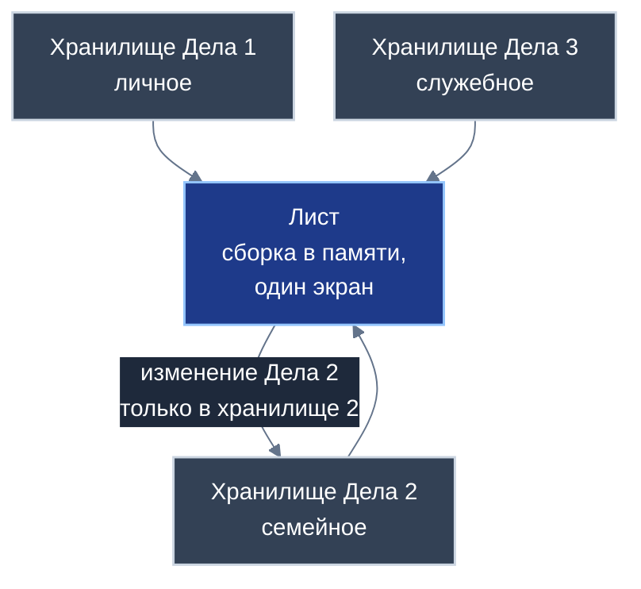
*Схема 2. Федеративная агрегация на Листе: чтение из множества изолированных хранилищ и строго изолированный возврат изменений.*

Предотвращение перекрёстных утечек между одновременно открытыми хранилищами обеспечивается системой из четырёх последовательных защитных заслонов. В проектировании систем распределённых данных невозможно опираться на иллюзию абсолютной неуязвимости, поэтому платформа выстраивает эшелонированную оборону.

| № | Защитный заслон | Механизм действия | Статус реализации |
| :---: | :--- | :--- | :--- |
| **1** | **Изоляция потоков записи** | Ядро базы данных на аппаратном уровне среды исполнения разрешает сохранять дельту транзакции исключительно в хранилище-источник конкретной записи. Перекрёстная запись данных одного Дела в хранилище другого заблокирована. | Базовый инвариант распределённого ядра AIRport |
| **2** | **Многоуровневая проверка кода** | Статический анализ путей распространения переменных и проверка кода специализированными языковыми моделями гарантируют отсутствие скрытых каналов передачи данных между модулями. | Проектный регламент верификации кода |
| **3** | **Контроль допуска через Ветку** | Сетевой узел района допускает к загрузке в браузер или на устройство только модули, обладающие действующей подписью аудита, и блокирует несанкционированные сетевые обращения политиками безопасности. | Архитектурный инвариант контура исполнения |
| **4** | **Независимое криптографическое разделение** | Каждое хранилище зашифровано собственным симметричным ключом. Компрометация ключа одного Дела не нарушает стойкость шифрования соседних баз данных. | Реляционный криптографический стандарт платформы |

Для сетевой коммуникации платформа использует двойную топологию. Корпоративные пользователи и крупные организации развёртывают собственные выделенные серверные узлы («Ветки предприятий»), к которым сотрудники подключаются напрямую. Малый бизнес, самозанятые специалисты и частные лица не несут расходов на администрирование собственной инфраструктуры: они подключаются через общественные районные Ветки.

При работе через районную Ветку активируется механизм «невидящей Ветки» (слепого ретранслятора). Промежуточный сервер обслуживает маршрутизацию пакетов, организует виртуальные «почтовые ящики» для доставки сообщений временно отключённым устройствам и хранит зашифрованные резервные копии. При этом Ветка физически лишена криптографических ключей от приватных баз данных и не может прочесть передаваемую информацию. В системе действует двухуровневая криптография: симметричный ключ хранилища защищает конфиденциальность содержания, а личный асимметричный ключ участника удостоверяет авторство каждой строки журнала, исключая возможность отказа от совершённых действий.

В пределах домохозяйства или офиса обмен транзакциями между смартфонами и компьютерами осуществляется по прямому одноранговому протоколу через локальную сеть Wi-Fi или интерфейс Bluetooth. В этом режиме синхронизация Дел функционирует полностью автономно даже при физическом отключении внешнего сегмента интернета. Завершённые дела формируют Семейную летопись — неизменяемый локальный архив совместных достижений с достоверными долговременными метками времени.

---

## 4. Теги (платформенный механизм каталогизации)

Тегирование представляет собой универсальный способ многомерной организации информации, свободный от ограничений жёстких иерархических папок и каталогов. В архитектуре платформы «Турбаза» именно приложение «Деловой» выступает владельцем и полигоном отработки концепции тегов, создавая системный модуль, который затем используется всеми смежными сервисами — в частности, «Заботой» для тематической группировки вкладов и Банком России для указания предмета смарт-контракта.

Все операции с тегами производятся непосредственно на устройствах пользователей. В локальных хранилищах тегов развёртываются оптимизированные префиксные деревья поиска. Поиск по начальным буквам и контекстное автодополнение выполняются в пределах долей миллисекунды (целевой проектный ориентир — менее половины миллисекунды), что обеспечивает предельный комфорт набора на мобильных устройствах.

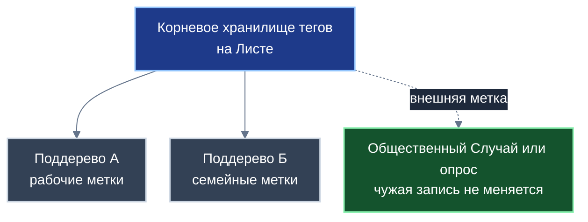
*Схема 3. Иерархия хранилищ тегов, ветвление поддеревьев и механизм внешних меток на общественные объекты.*

Система поддерживает три уровня видимости тегов:

| Уровень видимости | Физическое размещение | Доступность и конфиденциальность | Назначение |
| :--- | :--- | :--- | :--- |
| **Персональные теги** | Локальное хранилище тегов на Листе владельца | Доступны исключительно автору; не передаются по сети | Индивидуальные ассоциативные метки («срочно_разобрать», «идея_для_статьи») |
| **Семейные теги** | Семейное хранилище тегов, синхронизируемое между домочадцами | Видны всем подтверждённым членам семьи | Координация домашнего хозяйства («детский_сад», «загородный_дом», «автомобиль») |
| **Групповые и корпоративные** | Хранилище тегов рабочей группы, артели или организации | Доступны участникам конкретного рабочего контура | Проектные маркеры («объект_северный», «монтаж_вентиляции», «клиент_петрова») |
| **Внешние метки** | Локальное хранилище тегов инициатора метки | Видны только тому, кто присвоил метку | Личная классификация публичных обсуждений без изменения чужих записей |

По мере накопления данных объём связей «тег — задача» неизбежно возрастает. Чтобы индекс сохранял мгновенное быстродействие, в архитектуре реализован механизм ветвления хранилищ тегов. При достижении проектного порога порядка 50 000 связей корневое хранилище автоматически порождает изолированные дочерние хранилища поддеревьев, распределяя индексы по префиксам или предметным доменам. При выполнении поискового запроса клиентское ядро на Листе прозрачно опрашивает связанные поддеревья в оперативной памяти, сохраняя для пользователя ощущение единого целостного пространства.

Чрезвычайно важным концептуальным решением платформы является механизм внешних меток на чужих записях. В классических системах добавление тега к общественному документу требует изменения самого документа, что порождает конфликты правок и риск замусоривания общего пространства. В «Турбазе» соблюдается принцип «Пиши только своё»: когда гражданин хочет пометить общественный Случай в сети «Забота» или открытый опрос «КубГолоса» собственным тегом (например, «важно_для_моей_дачи»), система создаёт локальную запись-ссылку в персональном хранилище тегов пользователя. Исходный общественный объект остаётся полностью неизменным; его автор и другие участники не видят чужих меток. При этом личный поисковый индекс гражданина мгновенно находит общественный документ по его индивидуальным тегам.

В общесистемной инфраструктуре рейтингов теги выполняют три ключевые функции:
1. **Формирование многомерных личных срезов:** гражданин может отфильтровать репутацию контрагента по пересечению нескольких независимых предметных тегов (например, «сантехника» и «срочный_выезд»).
2. **Спуск от агрегата к первоисточнику:** публичный узел сети хранит лишь свернутые суммы оценок по теме; через систему тегов Лист пользователя может в фоновом режиме запросить открытые страницы хранилищ и удостовериться в подлинности первичных оценок.
3. **Параметризация договоров:** при формировании смарт-контракта в контуре Банка России стороны фиксируют предмет обязательств именно через утверждённый набор тегов.

В долгосрочной перспективе архитектура платформы предусматривает концепцию общественных тегов. Их реализация видится через создание специализированных серверов древовидного временного листинга, обеспечивающих поиск по дереву на любую историческую глубину. Сборка сложных многотеговых запросов мыслится на распределённых вычислительных узлах, начиная с наименее многочисленных меток и передавая промежуточный результат следующим фильтрам в децентрализованной сети артелей провайдеров тегов. Поскольку детальная инженерная спецификация общественных тегов находится в стадии исследовательской проработки, в рамках текущей версии платформы они рассматриваются на уровне концептуального замысла.

---

## 5. Ссылки, снимок контекста и общественный API поручений

В распределённой архитектуре недопустимо дублирование сущностей. Если Задача связана с рецептом приготовления блюда, чеком на стройматериалы, электронным билетом или свидетельством о поверке счётчика воды, она не копирует эти объекты внутрь себя.

Взаимодействие организуется через межприложенческие ссылки. Каждая ссылка опирается на стандартный трёхкомпонентный ключ платформы:

$$\text{Ссылка} = \langle \text{Идентификатор хранилища},\; \text{Идентификатор субъекта},\; \text{Идентификатор записи} \rangle$$

Поскольку внешнее хранилище может быть временно недоступно — например, если устройство контрагента выключено или отсутствует канал связи — в Задаче сохраняется автономный снимок контекста. Снимок включает в себя краткое текстовое наименование объекта, указание его предметной области и криптографический контрольный хеш оригинальной записи. Пользователь всегда видит, на основании какого документа сформирована Задача, и может однозначно верифицировать подлинность оригинала при восстановлении сетевого соединения.

```mermaid
%%{init: {"theme":"base","themeVariables":{"background":"#0f172a","fontFamily":"Arial, Helvetica, sans-serif","fontSize":"15px","primaryColor":"#1e3a8a","primaryTextColor":"#ffffff","primaryBorderColor":"#93c5fd","secondaryColor":"#14532d","tertiaryColor":"#1e293b","lineColor":"#64748b","textColor":"#94a3b8","mainBkg":"#1e3a8a","nodeBorder":"#93c5fd","clusterBkg":"#1e293b","clusterBorder":"#475569","titleColor":"#cbd5e1","edgeLabelBackground":"#1e293b"},"themeCSS":"foreignObject *{font-family:Arial,Helvetica,sans-serif !important}","flowchart":{"curve":"basis","htmlLabels":true,"nodeSpacing":26,"rankSpacing":40,"padding":12,"useMaxWidth":true}}}%%
flowchart LR
    X["Внешний сервис<br/>курьер, управляющая<br/>компания"] --> M["Мандат<br/>срок, число задач,<br/>область"] --> I["Входящие<br/>на согласование"] --> U["Решение человека<br/>принять, изменить,<br/>заблокировать"]
    class X branch
    class M bank
    class I,U leaf
    classDef leaf fill:#1e3a8a,stroke:#93c5fd,stroke-width:1.5px,color:#ffffff
    classDef branch fill:#14532d,stroke:#86efac,stroke-width:1.5px,color:#ffffff
    classDef trunk fill:#78350f,stroke:#fcd34d,stroke-width:1.5px,color:#ffffff
    classDef bank fill:#4c1d95,stroke:#c4b5fd,stroke-width:1.5px,color:#ffffff
    classDef priv fill:#334155,stroke:#cbd5e1,stroke-width:1.5px,color:#ffffff
    classDef risk fill:#7f1d1d,stroke:#fca5a5,stroke-width:1.5px,color:#ffffff
```
*Схема 4. Поступление внешней задачи через общественный API, фильтрация мандатом и буфер согласования человека.*

В повседневной жизни многие задачи инициируются извне: курьерская служба сообщает интервал доставки посылки, управляющая компания напоминает о сроке передачи показаний счётчиков, сервисный центр информирует о готовности автомобиля к выдаче. Для безопасной автоматизации таких процессов в «Деловом» разработан общественный программный интерфейс поручений (API поручений).

Принципиальное отличие платформенного решения от традиционных push-уведомлений и почтовых рассылок заключается в ограничении входящих потоков мандатами. Внешний сервис не имеет технической возможности напрямую вписать задачу в рабочий график человека. Доставка поручений возможна исключительно на основании предварительно выданного мандата.

| Параметр мандата | Содержание и системные ограничения |
| :--- | :--- |
| **Временной срок действия** | Мандат выставляется строго на ограниченный период (например, на одни сутки для конкретной курьерской доставки). По истечении срока мандат аннулируется автоматически. |
| **Квота количества задач** | Задаётся предельное число поручений, которое сервис вправе направить (например, ровно одна задача с интервалом приезда курьера). |
| **Предметная спецификация** | Разрешение строго ограничивается предметной областью (например, тегом «жкх_поверка»), исключая подмешивание рекламных сообщений. |
| **Буфер согласования** | Входящее поручение помещается в карантинную зону входящих; пользователь лично решает: принять задачу в план, изменить её приоритет или отклонить. |
| **Безотзывная блокировка** | Пользователь в любой момент может в одно действие отозвать мандат и навсегда заблокировать цифровой идентификатор источника. |

Интерфейс поручений безукоризненно соблюдает базовый постулат «Пиши только своё». Внешняя служба не производит записей в личные структуры пользователя. Она создаёт предложение Задачи в своём собственном исходящем буфере, а в персональный органайзер гражданина задача переносится исключительно локальной транзакцией, подписанной самим гражданином в момент одобрения входящего поручения.

---

## 6. Группы опросов и цикл трёх приложений

Ни одно серьёзное общественное, производственное или семейное Дело не выполняется изолированно. Ему предшествует согласование интересов участников, выбор наилучшего пути реализации и распределение обязанностей. Для интеграции процессов коллективного принятия решений с практическим исполнением в «Деловом» реализован механизм групп опросов.

Группа опросов представляет собой специализированную платформенную структуру, связывающую Дело в целом или его отдельную веху с произвольным количеством микро-опросов системы «КубГолос». Например, при подготовке к капитальному ремонту общего имущества в многоквартирном доме к Делу прикрепляется комплексная группа опросов: выбор цветового решения фасада, утверждение предельной стоимости сметы и согласование допустимого графика шумных работ.

Механизм обеспечивает раздельный расчёт консенсуса на разных уровнях:
* **На устройствах участников (Листах):** вычисляется персональная мера соответствия обсуждаемых вариантов личным предпочтениям конкретного гражданина на основе ранее настроенных им весов значимости факторов.
* **На вычислительных узлах организаций и ведомств:** на серверных Листах обработки данных рассчитываются многомерные байесовские распределения, выявляющие компромиссные зоны между всеми участниками процесса без раскрытия их индивидуальных бюллетеней.

*Схема 5. Полный институциональный цикл взаимодействия: от согласования через исполнение к валидации результата и формированию опыта.*

Взаимодействие «Делового» с сетью взаимной поддержки «Забота» строится через соединительную сущность «Дело — Случай». Общественный Случай в «Заботе» фиксирует проблему или задачу сообщества. В момент создания Случая сообщество может прикрепить к нему канонический публичный шаблон Дела — детальный план практических действий, проверенный предшествующим опытом других граждан (например, пошаговый порядок оформления документов или регламент утепления балкона). Любой гражданин может скопировать этот шаблон в свой органайзер: он получает готовое приватное Дело, где все подзадачи уже выстроены в логическую последовательность и снабжены необходимыми инструкциями.

Внутри обсуждений «Заботы» действует функция «Взять как задачу». Если участник диалога предложил конструктивную реплику-Идею, читатель может в одно касание превратить её в персональную Задачу внутри соответствующего Дела.

Замыкание сквозного цикла экосистемы происходит в момент завершения Дела. Платформа принципиально исключает механическое начисление рейтингов или автоматическое создание последующих задач: каждый переход требует осознанного решения человека. Когда гражданин отмечает Дело как успешно завершённое, приложение предлагает ему зафиксировать полученный результат в сети «Забота», сформировав свидетельство Опыта (в форме реплики-Опыта «Голос» с текстовым пояснением или «Показ» с приложением фото- и видеофиксации). Это свидетельство попадает в систему «КубГолос», где наполняет объективными данными шкалу Результата для исходной Идеи, и одновременно пополняет социальный рейтинг полезных вкладов исполнителя по соответствующей теме.

| Этап цикла | Приложение | Сущность | Роль человека в переходе |
| :---: | :--- | :--- | :--- |
| **1. Оценка** | «КубГолос» | Многофакторный опрос | Гражданин взвешивает важность проблемы и реалистичность предлагаемой идеи |
| **2. Структурирование** | «Забота» | Общественный Случай и тред | Сообщество формирует план решения и публикует шаблон Дела |
| **3. Принятие** | «Деловой» | Копирование шаблона в Дело | Человек лично решает взять задачу на исполнение кнопкой «Взять как задачу» |
| **4. Исполнение** | «Деловой» | Поэтапное выполнение подзадач | Исполнитель завершает вехи, прикрепляя акты и свидетельства выполнения |
| **5. Свидетельство** | «Забота» | Публикация реплики-Опыта | Человек добровольно формирует публичный отчёт о полученном опыте («Голос»/«Показ») |
| **6. Валидация** | «КубГолос» | Заполнение шкалы Результата | Свидетельство валидирует предпосылки идеи и начисляет социальный рейтинг вкладов |

---

## 7. Безопасная композиция чужого кода

Приложение «Деловой» содержит сложный, высокопроизводительный исполнительский каркас, оптимизированный для одновременной работы с десятками независимых реляционных хранилищ в оперативной памяти мобильного устройства. Чтобы избежать дублирования аналогичного кода в других прикладных разработках, программная оболочка «Делового» оформлена как открытый компонент повторного использования.

Сторонние прикладные решения экосистемы — туристический навигатор «УраТур», реестр услуг малого бизнеса, системы управления локальным ЖКХ или дневники контроля здоровья — не пишут собственные движки управления расписаниями и списками. Они встраивают стандартизированную оболочку «Делового» в качестве готового исполнительского ядра. Такой подход обеспечивает радикальное сокращение объёма исполняемого кода на клиентских устройствах и кратно повышает надёжность системы: чем больше разработчиков применяют единый каркас, тем тщательнее он протестирован в реальной эксплуатации.

Однако повсеместная композиция разнородных программных модулей порождает существенные риски внедрения скрытых уязвимостей, утечек персональной информации и несанкционированного межсетевого взаимодействия. Для парирования этих угроз в «Турбазе» проектируется трёхзвенная система верификации чужого кода.

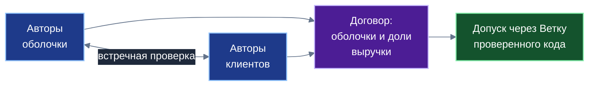
*Схема 6. Механизм доверенной композиции: встречный взаимный аудит разработчиков, договор распределения выручки и допуск через Ветку.*

| Звено проверки | Предмет контроля | Инструменты и исполнители | Статус гарантий |
| :--- | :--- | :--- | :--- |
| **1. Статический анализ потоков данных** | Анализ путей распространения переменных, проверка изоляции указателей, верификация того, что код записывает изменения исключительно в хранилище-источник конкретной записи. | Платформенный компилятор и загрузчик сред исполнения | Математически верифицируемый базовый фильтр платформы |
| **2. Семантический аудит моделями ИИ** | Поиск скрытых каналов передачи данных, недокументированных побочных эффектов, попыток несанкционированного вызова внешних сетевых интерфейсов или манипуляций памятью. | Специализированные аудиторские модели искусственного интеллекта | Вспомогательный эвристический фильтр; абсолютных гарантий не даёт |
| **3. Взаимный аудит разработчиков** | Встречная проверка исходного кода: авторы базовой оболочки инспектируют код встраиваемого модуля, а авторы модуля проверяют код оболочки на предмет корректности расчёта долей. | Разработчики взаимодействующих прикладных систем | Экономически мотивированная взаимная инспекция |

Особое внимание уделено третьему звену — экономически мотивированному взаимному аудиту. В платформе «Турбаза» применение чужих программных оболочек оформляется соглашением о совместном использовании, предусматривающим прозрачное долевое распределение выручки (подробный математический аппарат распределения долей изложен в Белой книге № 06 «Смарт-контракты ЦВЦБ»). Доходы от подписок на сервисы или целевых вознаграждений делятся между авторами базовых оболочек и разработчиками конечных прикладных модулей по строгой формуле.

Благодаря этой схеме возникает взаимная экономическая заинтересованность: автор оболочки не допустит подключения непроверенного клиентского приложения, способного скомпрометировать безопасность пользователей и лишить его репутации, а разработчик клиентского приложения лично проверяет код оболочки, гарантируя защиту своих прав на доход. Ни одно приложение не может получить доступ к платформенному пулу распределения выручки без прохождения встречной верификации обеими сторонами.

Окончательным шлюзом выступает районная Ветка. Серверный узел района, обслуживающий веб-портал доступа и поставляющий программный код на устройства пользователей, обладает исключительным правом допуска. Ветка проверяет цифровые подписи аудита и допускает к исполнению исключительно верифицированные модули. Все сетевые обращения ограничиваются строгими платформенными политиками безопасности браузера, исключая несанкционированные утечки во внешний интернет. Весь программный код остаётся полностью открытым, обеспечивая возможность независимой инспекции любыми внешними экспертами.

---

## 8. Контракт второго уровня

В деловой практике любое исполнение договорённостей между людьми — будь то изготовление кухни мебельной артелью, ремонт квартиры, репетиторство или сложный подряд на разработку проектной документации — требует фиксации обязательств. Традиционно стороны вынуждены выбирать между не имеющей юридической силы устной договорённостью в мессенджере и громоздким бумажным документооборотом с открытием банковских аккредитивов.

В архитектуре «Делового» Дело способно трансформироваться в полноценный исполняемый контракт между сторонами. При этом платформа последовательно реализует двухуровневую контрактную модель, обеспечивающую гармоничное сочетание надёжной конфиденциальности частной жизни и строгого надзора за финансовыми расчётами.

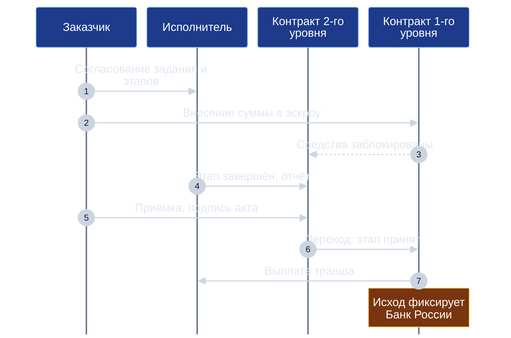
*Схема 7. Последовательность исполнения двухуровневого контракта: приёмка этапа на Листах и расчёты в Банке России.*

Два уровня контракта строго разграничены по физическому размещению и объёму обрабатываемых сведений:
* **Контракт второго уровня (L2):** развёртывается в изолированном приватном хранилище на устройствах (Листах) договаривающихся сторон. Он содержит подробное техническое задание, чертежи, графики производства, сметные расчёты, промежуточные фото- и видеоотчёты, переписку сторон и электронные акты приёмки. Это хранилище никогда не передаётся на внешние серверы и недоступно для чтения сетевым узлам (Веткам). Внутри «Делового» контракт распадается на сбалансированные пулы задач для обеих сторон: исполнитель видит задачи по производству и фотофиксации, заказчик — задачи по своевременному обеспечению доступа к объекту и приёмке этапов.
* **Контракт первого уровня (L1):** функционирует вне платформы «Турбаза» — в доверенном контуре платформы цифрового рубля Банка России. Он представляет собой детерминированный конечный автомат (FSM), оперирующий исключительно финансовыми сущностями: формулой расчёта, условиями эскроу-блокировки средств, правилами сплита платежей и идентификаторами состояний.

Связь между уровнями поддерживается посредством взаимных ссылок: контракт второго уровня хранит публичный идентификатор смарт-контракта в Банке России и контрольный криптографический хеш его расчетной формулы. По мере завершения работ стороны не пересылают в банк тяжелые файлы чертежей или видеозаписи: заказчик подписывает локальный электронный акт своим личным ключом, формируя компактную криптографическую транзакцию перехода состояния. Эта транзакция направляется на платформу Банка России, после чего публичный автомат первого уровня автоматически перечисляет причитающийся транш исполнителю.

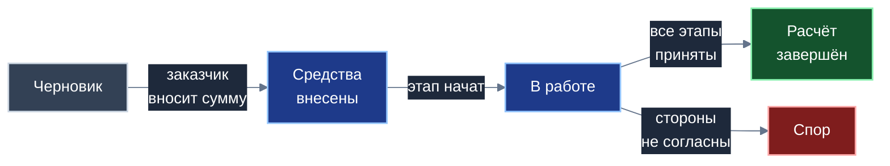
*Схема 8. Граф состояний конечного автомата исполнения договора.*

| Состояние автомата | Содержание процесса на втором уровне | Событие перехода на первый уровень | Кто инициирует переход |
| :--- | :--- | :--- | :--- |
| **Черновик** | Стороны согласуют техническое задание, смету, этапы и критерии приёмки | Подписание проекта обеими сторонами | Обе стороны |
| **Средства внесены** | Заказчик переводит средства на эскроу-счёт; средства блокируются в ЦВЦБ | Подтверждение блокировки платформой Банка России | Заказчик и Банк России |
| **В работе** | Подрядчик выполняет задачи первого этапа, формируя фотоотчёты в Деле | Активация задач этапа на Листе исполнителя | Исполнитель |
| **Расчёт завершён** | Все этапы приняты, электронные акты подписаны, претензии отсутствуют | Выплата финального транша подрядчику | Подписи обеих сторон |
| **Спор** | Стороны разошлись в оценке качества; привлечение арбитра или возврат остатка | Перевод автомата в ветку урегулирования споров | Любая из сторон или арбитр |

В контракте может быть предусмотрена роль независимого арбитра или профильного эксперта (например, инженера строительного контроля), чей открытый ключ включается в список участников Дела. В случае разногласий эксперт знакомится с материалами второго уровня и выносит заключение, переводя автомат в состояние урегулирования.

В качестве перспективного проектного предложения рассматривается возможность автоматического налогового агентирования. При осуществлении выплат через смарт-контракт система платформы способна применить функцию удержания налога на профессиональный доход: 4% при расчётах с физическими лицами или 6% при расчётах с индивидуальными предпринимателями и юридическими лицами (в полном соответствии со статьёй 10 Федерального закона № 422-ФЗ). Средства перечисляются непосредственно в бюджетную систему, избавляя самозанятого гражданина от необходимости ручного формирования чеков. Подчёркивается, что данная возможность носит характер проектного предложения и требует отдельного нормативно-правового решения уполномоченных государственных органов.

---

## 9. Связка социального и экономического рейтингов

Институциональным ядром настоящей Белой книги является детальное проектирование связки двух независимых рейтингов. В существующих проектных документациях эта связка декларировалась в материалах сети «Забота», однако её подлинное инженерное воплощение осуществляется именно в приложении «Деловой» через механизмы двухуровневого контракта.

В модели платформы действуют два полностью самостоятельных, институционально и технически изолированных рейтинга:
1. **Социальный рейтинг вкладов по теме:** открытый децентрализованный показатель, формируемый на основе объективных полезных действий человека (создание конструктивных реплик, подтверждённый Опыт, выполнение общественных задач). Рейтинг рассчитывается и индексируется на распределённых узлах сети («Ветках»). Единого универсального балла человека по умолчанию не существует: репутация всегда привязана к конкретной теме или тегу.
2. **Экономический рейтинг Банка России:** защищённая мера финансовой благонадёжности, вычисляемая исключительно на основе фактических исходов исполнения смарт-контрактов первого уровня (своевременность закрытия обязательств, отсутствие дефолтов, объём успешно закрытых расчётов). Рейтинг формируется вне платформы «Турбаза» на инфраструктуре Банка России уполномоченными рейтинговыми структурами. Он закрыт от посторонних глаз и может проверяться контрагентами исключительно по специальному запросу и только с прямого согласия гражданина.

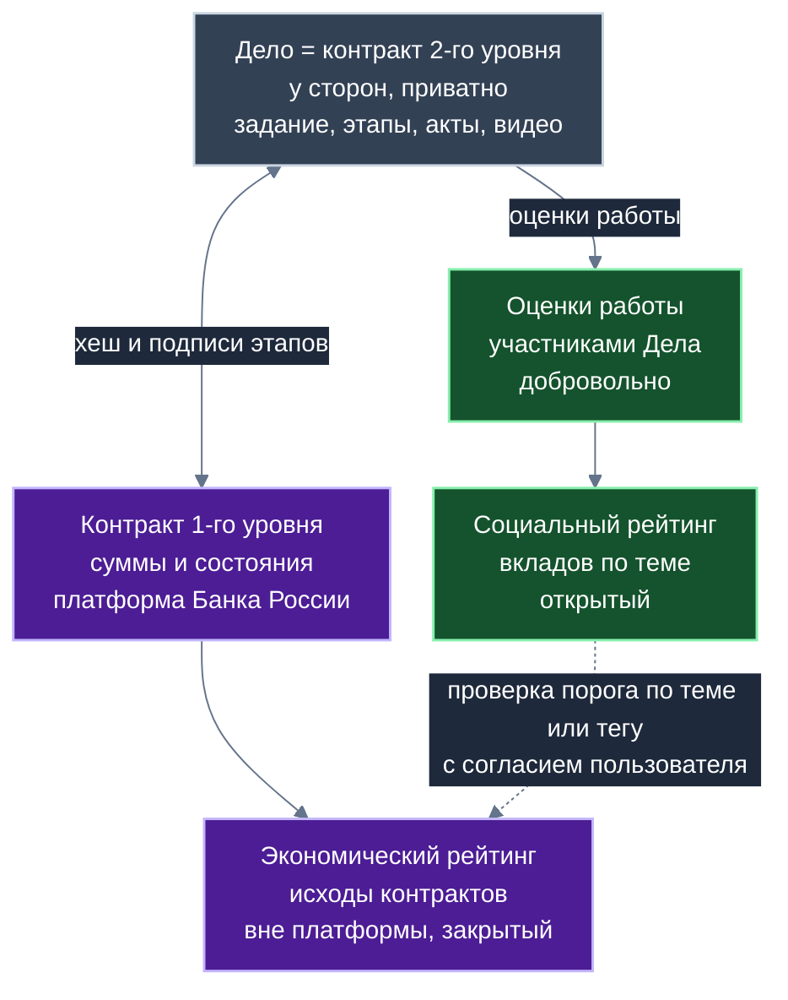
*Схема 9. Дело как связный узел двух рейтингов: разделение информационного, финансового и репутационного слоёв.*

Дело выступает связным узлом, где эти две системы взаимодействуют без взаимной компрометации. Процесс разворачивается в трёх независимых плоскостях:
* **Плоскость исполнения (приватная):** технические условия, проектная переписка, промежуточные фотоотчёты и электронные акты остаются в хранилище второго уровня на устройствах сторон.
* **Финансовая плоскость (регуляторная):** на платформу Банка России поступают только сведения о движении средств и состояния конечного автомата.
* **Репутационная плоскость (открытая):** по завершении Дела стороны получают возможность добровольно оценить качество взаимодействия через опрос «КубГолоса» по соответствующей теме. Право голоса имеют строго подтверждённые участники данного Дела. Оценки поступают в открытый социальный рейтинг мастера по теме (например, «изготовление мебели»). В случае несправедливой оценки мастер пользуется гарантированным правом ответа в сети «Забота».

Социальный рейтинг служит дополнительным входным фильтром при инициации экономической сделки. При создании смарт-контракта в платформе Банка России стороны указывают перечень предметных тем или тегов. Инфраструктура Банка России имеет защищённый сетевой шлюз к Веткам для считывания агрегированных социальных показателей. Заказчик или банк может выставить условие: «контракт активируется, если социальный рейтинг мастера по теме не ниже заданного порога, а экономический рейтинг подтверждает благонадёжность».

Сквозной сценарий взаимодействия включает шесть последовательных шагов:
1. **Инициация:** стороны создают контракт второго уровня в «Деловом» и регистрируют черновик смарт-контракта в платформе Банка России, связывая их криптографическим хешем.
2. **Параметризация:** контракту присваиваются предметные теги, которые передаются в систему первого уровня для определения профиля сделки.
3. **Двухпороговая проверка:** с согласия пользователя система запрашивает проверку экономического рейтинга в Банке России и считывает агрегат социального рейтинга с профильной Ветки, выдавая контрагенту ответ о соблюдении порогов.
4. **Исполнение и расчёт:** этапы работ выполняются на Листах, фиксируются актами и закрываются перечислением траншей цифрового рубля в Банке России.
5. **Социальная фиксация:** стороны добровольно оценивают качество сотрудничества через «КубГолос», обогащая открытый тематический социальный рейтинг.
6. **Экономическая фиксация:** факт успешного или дефолтного завершения обязательства заносится в закрытый реестр Банка России для последующего расчёта экономического рейтинга.

| Участник экосистемы | Что достоверно знает | Чего принципиально не знает |
| :--- | :--- | :--- |
| **Стороны контракта** | Всё содержание договора второго уровня, чертежи, сметы, переписку, открытые идентификаторы друг друга | Номера реальных банковских кошельков друг друга (видят только контрактные оболочки) |
| **Сетевые узлы (Ветки)** | Общественные теги, темы, страницы и открытые агрегаты социального рейтинга вкладов | Содержимое частных хранилищ, детали договоров, суммы расчётов на первом уровне |
| **Банк России** | Суммы, состояния смарт-контрактов, факт участия гражданина в сделке и её объективный исход | Детальное содержание работ, чертежи, фотоотчёты, частную переписку сторон |
| **Рейтинговые структуры** | Агрегированные финансовые метрики в рамках утверждённых методик и согласия клиента | Персональные детали сделок, не относящиеся к расчёту кредитного риска |
| **Общество в целом** | Открытые социальные рейтинги вкладов участников по конкретным темам | Закрытый экономический рейтинг, состояние счетов, реальные имена при социальной анонимности |

Принципиальный системный инвариант архитектуры гласит: открытый социальный рейтинг обогащает экономическое решение, но обратное влияние в архитектуру не закладывается. Финансовая состоятельность гражданина, размер его банковского счёта или объём закрытых контрактов не могут прибавлять вес его голосу в вопросах общественного консенсуса, оценки идей или местного самоуправления. Платформа распределённых данных способна полноценно функционировать без финансового контура, однако функционирование сложных коммерческих контрактов невозможно без надёжной платёжной платформы регулятора.

> [!IMPORTANT]
> **Отказ от юридической консультации и нормативная компетенция**
> Архитектурные предложения, изложенные в настоящей главе, представляют собой инженерный замысел автора платформы по развитию института доверенных поставщиков внешних данных и расширению функциональности прикладных коммерческих смарт-контрактов. Настоящий документ не является официальным толкованием законодательства Российской Федерации, нормативным актом или согласованной позицией Банка России. Окончательная правовая квалификация статуса рейтинговых структур, порядка использования цифрового рубля и режимов хранения кредитных историй относится к исключительной компетенции Банка России, Министерства финансов РФ и уполномоченных органов государственной власти.

---

## 10. Режимы регистрации, согласие и пороги

Участие человека в хозяйственных операциях требует надёжной правовой идентификации, исключающей мошенничество и уклонение от обязательств. Вместе с тем открытая публикация банковских реквизитов граждан несет критические риски социальной инженерии, хищения средств и адресного давления. Для разрешения этого противоречия в «Деловом» спроектирован механизм временных контрактных оболочек.

Контрактная оболочка представляет собой временный криптографический прокси-идентификатор, выпускаемый пользователем для конкретной сделки или серии операций. Оболочка математически связана с кошельком гражданина в Банке России, однако сторонний наблюдатель или контрагент не способны вычислить номер основного счёта по открытому ключу оболочки. Стороны договора удостоверяются в том, что оболочка контрагента легитимно привязана к подтверждённому кошельку цифрового рубля и обладает полномочиями на совершение сделки. При физической утере или компрометации смартфона гражданин в одно действие отзывает выпущенные оболочки через резервный канал, при этом средства на основном счёте в Банке России остаются в полной неприкосновенности.

В архитектуре доверия платформы выделяется экономическая ступень регистрации:

| Режим регистрации в системе | Наличие экономической ступени | Что известно Банку России | Что доступно обществу и контрагентам |
| :--- | :---: | :--- | :--- |
| **Полная криптографическая анонимность** | Нет | Ничего; операции в ЦВЦБ заблокированы законом | Только сгенерированный псевдоним и принадлежность к району |
| **Социальная анонимность (без кошелька)** | Нет | Ничего; субъект подтверждён соседями или жеребьёвкой | Принадлежность к проверенной группе жителей |
| **Социальная анонимность (с кошельком)** | **Есть** | Личность владельца удостоверена через единый кошелёк ЦВЦБ | Обществу лицо неизвестно; контрагент видит статус подтверждения |
| **Поимённый режим** | **Есть** | Личность удостоверена банковским протоколом | Имя и публичный статус открыты в общественном контуре |

Гражданин, зарегистрированный в режиме полной анонимности, может подключить к профилю свой кошелёк цифрового рубля. В этот момент он автоматически переходит на ступень социальной анонимности: Банк России удостоверяет личность гражданина в соответствии с требованиями банковского законодательства, однако для общества и контрагентов его персональные данные остаются закрытыми. При этом рейтинг, накопленный в режиме полной анонимности, принципиально не переносится в новый профиль во избежание торговли анонимными аккаунтами и злоупотреблений.

Проверка финансовой благонадёжности строится на строгом протоколе пороговых проверок. Платформа отвергает практику передачи контрагентам полных кредитных отчётов или числовых скоринговых баллов.

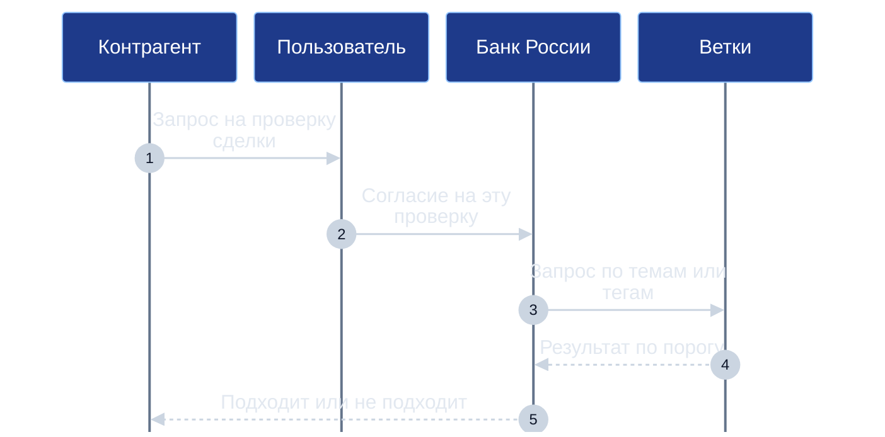
*Схема 10. Протокол проверки пороговых условий с получением разового согласия гражданина.*

Процедура проверки исключает несанкционированный доступ:
1. Контрагент формирует запрос на проверку соблюдения условий сделки (например, «наличие рейтинга не ниже категории Б для договора подряда»).
2. Запрос поступает гражданину во входящий буфер приложения «Деловой».
3. Гражданин лично подтверждает согласие на разовую проверку под данную конкретную сделку.
4. Рейтинговая система Банка России производит внутреннее вычисление и возвращает контрагенту исключительно бинарный ответ: «подходит» или «не подходит». Никаких сведений о конкретном значении балла, суммах на счетах или истории других операций контрагент не получает.

Серьёзной угрозой для бинарных проверок является атака направленного зондирования (подбора порога). Если недобросовестный субъект имеет возможность многократно отправлять запросы с произвольно варьируемыми пороговыми значениями, то методом двоичного поиска на дискретной шкале из 1000 градаций точное значение закрытого рейтинга человека можно вычислить всего за 10 запросов:

$$\lceil \log_2 1000 \rceil = 10$$

Для нейтрализации угрозы зондирования в архитектуре платформы предусматривается комплекс защитных мер:
* **Лимиты частоты проверок:** ограничение количества запросов к профилю гражданина в единицу времени.
* **Огрубление шкал:** проверка допускается только по фиксированным широким тарифным категориям, исключающим точечную подгонку порогов.
* **Прозрачный аудит:** гражданин имеет доступ к непрерывному журналу всех запросов на проверку с фиксацией идентификаторов инициаторов, что позволяет оперативно выявлять попытки направленного сбора сведений.

---

## 11. Личный слой: матрица, затухание и «Случайный шаг»

Наряду с высокоуровневыми институциональными механизмами приложение «Деловой» содержит прикладной личный слой когнитивной поддержки. Его задача — помочь человеку преодолеть прокрастинацию, структурировать приоритеты и довести намеченные дела до завершения. Для платформы «Турбаза» этот слой представляет интерес прежде всего как источник математического аппарата затухания приоритетов, переносимого впоследствии в базовые модули платформы.

Осмысление любого замысла в «Деловом» начинается со структурирования по классическому вопросительному каркасу: определение субъектов (кто), сути действия (что), контекста (где, когда), целей (зачем) и способов реализации (как). Приложение поддерживает сократический диалог, побуждая пользователя задать себе вопрос «зачем?» на два-три шага вглубь: если выясняется, что задача навязана извне и не соотносится с личными ценностями, она безболезненно отсекается. Для критических решений применяется тест «цена бездействия»: человеку предлагается честно ответить, что произойдёт, если данное дело не будет выполнено никогда.

При формулировании сложных шагов используется психологический механизм намерений реализации вида «если наступит условие X, то я выполню действие Y». В обширном мета-анализе 94 независимых исследований П. Гольвитцера и П. Ширана (Gollwitzer & Sheeran, 2006, 8461 участник) было показано, что применение таких конструкций демонстрирует устойчивый положительный эффект среднего и крупного размера ($d = 0{,}65$). В исследованиях П. Гольвитцера и В. Брандштеттера (Gollwitzer & Brandstätter, 1997) было зафиксировано, что сложные жизненные цели при наличии сформированного намерения реализации достигались в лабораторных условиях примерно втрое чаще (рост доли успешных исходов с 22% до 62% и с 32% до 71%), тогда как для простых бытовых задач разница была несущественной. В «Деловом» этот приём встроен непосредственно в форму создания Задачи.

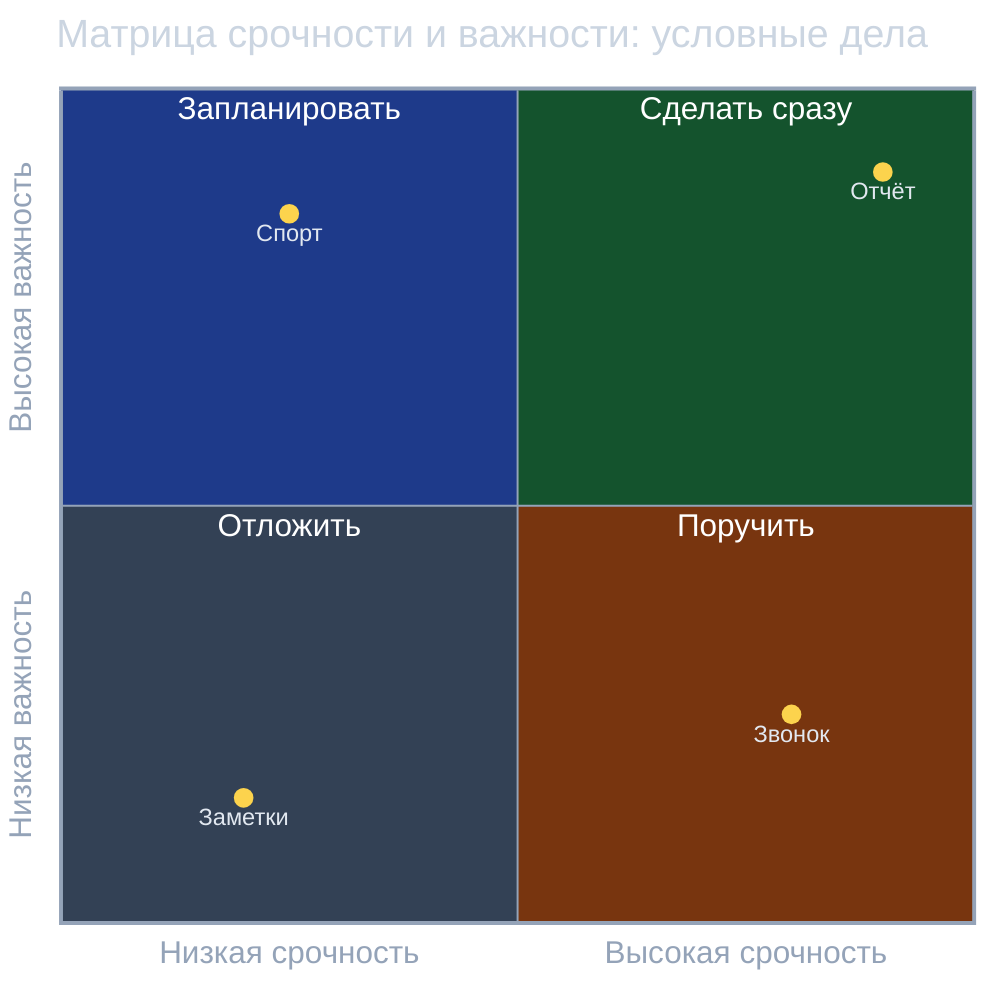
*Схема 11. Матрица срочности и важности: распределение условных задач по четырём квадрантам внимания.*

Для распределения внимания используется классическая четырёхклеточная матрица, известная под именем Эйзенхауэра (19 августа 1954 года Д. Эйзенхауэр в публичной речи процитировал мысль безымянного президента университета: «срочные дела редко бывают важными, а важные — срочными»; четырёхчастная схема была окончательно оформлена и популяризована С. Кови в 1989 году). Оценка срочности и приоритета производится по пятибалльной шкале. Задачи распределяются по четырём квадрантам:
* **Квадрант 1 (Срочно и важно):** кризисные ситуации, требующие немедленного личного включения.
* **Квадрант 2 (Важно, но не срочно):** стратегическое развитие, обучение, здоровье; зона, наиболее подверженная вытеснению текучкой.
* **Квадрант 3 (Срочно, но не важно):** рутинные звонки и мелкие поручения, которые следует делегировать или автоматизировать.
* **Квадрант 4 (Не срочно и не важно):** потеря времени, подлежащая исключению или архивированию.

В отличие от традиционных трекеров, где просроченные задачи накапливаются красным списком, порождая чувство вины, в «Деловом» реализован математический закон затухания приоритета просроченных дел. Если установленный срок $T_{\text{срок}}$ наступил, а задача не выполнена, её приоритет со временем непрерывно снижается по формуле экспоненциального полураспада:

$$P(t) = \max \left( 0,\; \left\lfloor P_{\text{base}} \cdot e^{-\ln 2 \cdot \frac{t - T_{\text{срок}}}{T_{1/2}}} \right\rfloor \right) \quad \text{при } t > T_{\text{срок}}$$

где $P_{\text{base}}$ — исходный приоритет задачи по пятибалльной шкале, а $T_{1/2}$ — период полураспада.

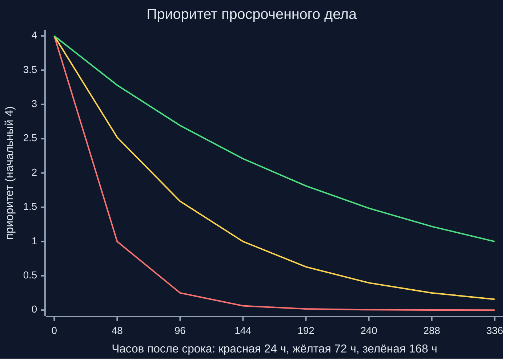
*Схема 12. Динамика затухания приоритета просроченного дела при различных режимах полураспада.*

| Режим затухания | Период $T_{1/2}$ | 0 часов | 24 часа | 72 часа | 168 часов | 336 часов | Характерное применение |
| :--- | :---: | :---: | :---: | :---: | :---: | :---: | :--- |
| **Быстрый** | 24 часа | 4 | 2 | 0 | 0 | 0 | Оперативные бытовые задачи, закупка продуктов |
| **По умолчанию** | 72 часа | 4 | 3 | 2 | 0 | 0 | Стандартные рабочие поручения и бытовые проекты |
| **Плавный** | 168 часов | 4 | 3 | 2 | 2 | 1 | Аналитические задачи, чтение профильной литературы |
| **Фиксированный** | $\infty$ | 4 | 4 | 4 | 4 | 4 | Налоговые обязательства, судебные сроки, смарт-контракты |

В визуальном пространстве экрана задачи отображаются в виде «гравитационных сфер»: диаметр шара отражает текущий приоритет, цвет кодирует квадрант и срочность, а расположение формируется органически с мягким притяжением к центру экрана. По мере затухания просроченная сфера сжимается и смещается на периферию. Когда приоритет достигает нуля ($P=0$), система не упрекает человека, а инициирует спокойный диалог: пользователю предлагается либо актуализировать срок и подтвердить важность, либо отправить задачу в архив без чувства вины.

Для преодоления паралича воли при наличии множества конкурирующих дел разработан алгоритм «Случайный шаг». Из пула подготовленных задач первого и второго квадрантов ($Q1 \cup Q2$) система выбирает одно случайное дело с вероятностью, пропорциональной квадрату приоритета и срочности:

$$w_k = (P_k + 1)^2 \cdot (U_k + 1)$$

Пользователю предлагается заключить внутренний договор: посвятить выбранному делу ровно 15 минут по таймеру. Практика показывает, что преодоление барьера первого шага позволяет человеку втянуться в работу и успешно довести начатое до конца.

---

## 12. Практические примеры применения

Для демонстрации работы описанных механизмов в реальной экономике ниже рассмотрены три условных прикладных сценария, составленных на основе материалов руководства по социально-экономическому влиянию платформы.

### Пример 1. Мебельная артель: безопасный подряд и репутация мастеров
Артель из шести мастеров (проектировщик, раскройщик, маляр, кромщик, сборщик и монтажник) заключает договор на проектирование, изготовление и монтаж индивидуального кухонного гарнитура стоимостью 350 000 рублей.
* **Применение механизмов книги:** стороны формируют контракт второго уровня в «Деловом». Техническое задание, карты раскроя, визуализации и детальная смета хранятся на устройствах мастеров и заказчика; районная Ветка передаёт данные как слепой ретранслятор. Контракт разбит на три транша: 50 000 рублей (проект и визуализация), 150 000 рублей (закупка материалов и фасадов по ссылкам на накладные поставщиков) и 150 000 рублей (монтаж и подписание электронного акта приёмки из 25 пунктов чек-листа).
* **Контур расчётов и рейтингов:** средства заказчика депонируются в эскроу платформы Банка России (контракт L1). По завершении каждого этапа заказчик подписывает акт, высвобождая очередной транш. После монтажа стороны через «КубГолос» выставляют друг другу оценки: в открытый социальный рейтинг артели по теме «изготовление мебели» поступает подтверждённый положительный отзыв, а в закрытый контур Банка России заносится запись об успешном закрытии обязательства на сумму 350 000 рублей без споров и просрочек.

### Пример 2. Ремонт детской комнаты: координация семьи и опыт соседей
Семья с двумя детьми планирует переоборудование комнаты, располагая семейным бюджетом в 200 000 рублей. В работах помогает дедушка, берущий на себя сборку мебели и электромонтаж.
* **Применение механизмов книги:** задействуется полный цикл трёх приложений. В «КубГолосе» семья проводит многофакторный опрос вариантов зонирования; в «Заботе» мама находит подтверждённый опыт соседей по эффективной звукоизоляции стен; в «Деловом» создаётся семейное Дело «Ремонт детской».
* **Контур расчётов и рейтингов:** задачи декомпозируются по исполнителям (закупки — папа, текстиль — мама, электрика — дедушка). Синхронизация внутри квартиры происходит по локальной сети Wi-Fi без выхода во внешний интернет. Завершённое Дело отправляется в несгораемую Семейную летопись. Финансовый контур Банка России не задействуется; мама публикует в сети «Забота» свидетельство Опыта по звукоизоляции, пополняя свой социальный рейтинг в теме «благоустройство жилья».

### Пример 3. Установка шлагбаума во дворе: общественная инициатива
Инициативная группа 120-квартирного жилого дома организует установку автоматического шлагбаума и системы видеонаблюдения во дворе.
* **Применение механизмов книги:** жильцы формируют в «КубГолосе» группу опросов для выбора подрядчика и утверждения предельной стоимости. После голосования в «Деловом» открывается общественное Дело, привязанное к Случаю «Заботы». Четверо уполномоченных соседей распределяют задачи: согласование с муниципальными службами, заключение договора, приёмка фундамента и монтаж электроники.
* **Контур расчётов и рейтингов:** промежуточные вехи фиксируются фотоотчётами, доступными всем жильцам дома через районную Ветку. Каждый этап сопровождается электронным актом. Подрядчик получает расчёт через контракт первого уровня, а жильцы получают прозрачную подтверждённую историю расходов без посреднических наценок.

| Параметр анализа | Пример 1 (Мебельная артель) | Пример 2 (Ремонт детской) | Пример 3 (Дворовый шлагбаум) |
| :--- | :--- | :--- | :--- |
| **Категория Дела** | Коммерческий подряд (малый бизнес) | Семейное Дело (домохозяйство) | Общественное Дело (местное сообщество) |
| **Режим видимости L2** | Приватный (мастера и заказчик) | Семейный (круг домочадцев) | Общественный в контуре района |
| **Связь с ЦВЦБ (L1)** | Да (трёхэтапный эскроу-контракт) | Нет (прямые семейные расходы) | Да (расчёт с подрядчиком через эскроу) |
| **Социальный рейтинг** | Оценка артели по теме «мебель» | Опыт мамы по теме «звукоизоляция» | Оценки инициативной группе и подрядчику |
| **Экономический рейтинг** | Факт закрытия подряда на 350 тыс. руб. | Не формируется | Факт исполнения договора подрядчиком |

---

## 13. Что станет базовым модулем платформы и границы роли приложения

Приложение «Деловой» разрабатывается как полигон передовых прикладных практик. По мере стабилизации проектных решений и накопления опыта эксплуатации отработанные программные компоненты отчуждаются от прикладного интерфейса и переходят в состав открытых базовых модулей ядра платформы «Турбаза».

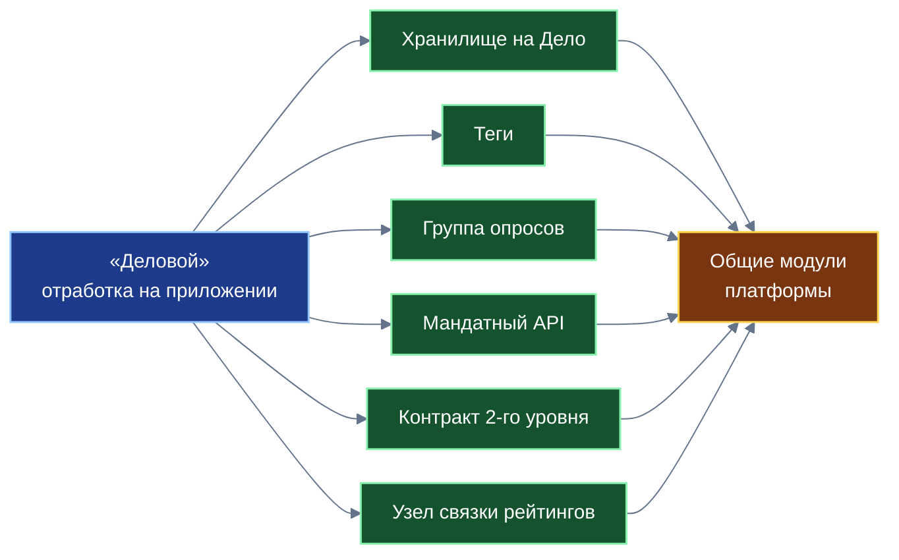
*Схема 13. Трансформация прикладных разработок «Делового» в общесистемные базовые модули ядра платформы «Турбаза».*

| Отработано в «Деловом» | Целевой общесистемный модуль платформы «Турбаза» |
| :--- | :--- |
| **Изоляция «одно Дело — одно хранилище»** | Системный модуль федеративного управления множественными локальными базами данных на Листе |
| **Система префиксных деревьев тегов** | Общеплатформенная служба тегирования, внешних меток и тематических срезов |
| **Группы опросов к вехам и проектам** | Межприложенческий модуль коллективного принятия решений |
| **Мандатный интерфейс поручений** | Платформенный шлюз контролируемой доставки входящих задач от внешних аккредитованных служб |
| **Межприложенческие трёхкомпонентные ссылки** | Стандарт распределённых ссылок с автономным снимком контекста для всех прикладных систем |
| **Трёхзвенная верификация чужого кода** | Общесистемный протокол безопасной композиции программных оболочек и взаимного аудита |
| **Двухуровневая модель контракта (L1/L2)** | Универсальный адаптер коммерческих смарт-контрактов для взаимодействия с Банком России |
| **Связка социального и экономического рейтингов** | Институциональный протокол пороговой верификации благонадёжности без раскрытия счетов |
| **Математика экспоненциального затухания** | Общесистемная библиотека расчёта актуальности свидетельств и приоритизации потоков данных |

Вместе с тем архитектура чётко очерчивает объективные границы роли приложения:
1. **«Деловой» не рассчитывает и не публикует экономический рейтинг:** приложение является клиентским органайзером и средой исполнения контрактов второго уровня. Расчёт финансового рейтинга выполняется исключительно регулятором и аккредитованными организациями.
2. **«Деловой» не подменяет государственную платёжную систему:** расчёты в цифровых рублях осуществляются на платформе Банка России; в приложении фиксируются только электронные акты, порождающие транзакции перехода состояний.
3. **«Деловой» не монополизирует право на ведение дел:** параллельные коммерческие структуры (банковские сервисы, корпоративные трекеры) могут функционировать рядом с платформой в рамках действующего законодательства.

Перед исследователями и разработчиками платформы остаётся ряд открытых инженерных и регуляторных вопросов:
* **Инфраструктура общественных тегов:** необходимость детальной проработки протоколов взаимодействия децентрализованных артелей провайдеров тегов и алгоритмов временного листинга.
* **Математическая оптимизация пороговых проверок:** определение оптимальной дискретности тарифных шкал и лимитов частоты запросов для минимизации риска зондирования рейтингов.
* **Нормативная гармонизация:** согласование статуса двухуровневых смарт-контрактов и электронных актов с нормами Гражданского кодекса РФ, а также определение порядка взаимодействия с бюро кредитных историй.
* **Правовой режим налогового агентирования:** определение юридической модели, позволяющей платформенным смарт-контрактам удерживать и перечислять налог на профессиональный доход самозанятых граждан в автоматическом режиме.

---

## 14. Заключение и связь с комплектом Белых книг

Белая книга № 10 «Деловой: исполнять и связывать» завершает фундаментальную трилогию исследований, посвящённых системообразующим прикладным сервисам платформы цифрового суверенитета государства «Турбаза».

Триада прикладных решений раскрывает целостную институциональную картину цифрового суверенитета государства:
* **«КубГолос» (Белая книга № 08)** дал платформе математический аппарат многофакторного измерения общественной воли, алгоритмы агрегации мнений вверх по дереву связных узлов, счётчики оперативной памяти и блоки эпох, решив задачу объективного выявления согласия.
* **«Забота» (Белая книга № 09)** сформировала социальное пространство взаимной поддержки, ввела самозапечатывающиеся страницы, четыре вида структурированных реплик, свидетельства Опыта и децентрализованный социальный рейтинг полезных вкладов, решив задачу накопления и верификации жизненного опыта граждан.
* **«Деловой» (Белая книга № 10)** предоставил исполнительский каркас, связав намерения и опыт с практической созидательной деятельностью человека. Через изоляцию хранилищ, многомерные теги, мандатные интерфейсы поручений, безопасную композицию чужого кода и контракты второго уровня приложение превратило Дело в автономный узел взаимодействия открытого социального доверия общества и защищённой финансовой инфраструктуры Банка России.

Концептуальные положения настоящей работы органично дополняют системные выкладки Белой книги № 06 («Смарт-контракты ЦВЦБ для Банка России») в части практического развёртывания двухуровневых контрактов и служат прикладным фундаментом для независимой Белой книги № 07 («Социальный и экономический рейтинги платформы «Турбаза»»).

Автор платформы выражает глубокую признательность всем исследователям, разработчикам и экспертам, чей созидательный труд формирует современную экосистему отечественных цифровых технологий. Представленные проектные решения открыты для конструктивной академической дискуссии, независимого аудита и совместной практической реализации на благо укрепления научно-технологического и экономического суверенитета Отечества.
