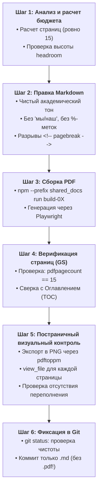

# AGENTS.md — shared_docs/whitepapers

## 🎯 Назначение и область применения (Scope)
Данная директория содержит официальный комплект **Белых Книг (Whitepapers)** платформы суверенных распределенных данных **«Турбаза»** — фундаментальные научно-технические, архитектурные, экономические и регуляторные аналитические доклады, подготовленные для профильных институциональных читателей:
* Банка России и Департамента финансовых технологий;
* Ассоциации развития финансовых технологий (Ассоциация ФинТех);
* Регуляторов и профильных ведомств (Минцифры, ФСТЭК, ФСБ, ФАС);
* Корпоративных архитекторов, финтех-разработчиков и академического сообщества.

Каждый документ компилируется из канонического исходного Markdown (`.md`) в представительский публикационный PDF-документ полиграфического качества формата А4 с помощью движка [`scripts/core/whitepaper_pdf_builder.js`](file:///Users/parents/Documents/presentations/scripts/core/whitepaper_pdf_builder.js).

---

## 📚 Полный каталог Белых Книг

| № | Исходный файл (.md) | Локальный скомпилированный PDF | Ключевая тематика и целевой фокус | Бюджет страниц |
| :---: | :--- | :--- | :--- | :---: |
| **01** | [`01_platform_overview_whitepaper.md`](file:///Users/parents/Documents/presentations/shared_docs/whitepapers/01_platform_overview_whitepaper.md) | `01_platform_overview_whitepaper.pdf` | **Смена парадигмы децентрализации:** Трёхуровневая топология («Лист» $\to$ «Ветка» $\to$ «Ствол»), суверенитет данных, 152-ФЗ Zero-PII и снижение TCO серверной инфраструктуры на 90%. | 15 стр. |
| **02** | [`02_applications_suite_whitepaper.md`](file:///Users/parents/Documents/presentations/shared_docs/whitepapers/02_applications_suite_whitepaper.md) | `02_applications_suite_whitepaper.pdf` | **Флагманский стек приложений:** Прикладная микро-логика («Деловой», «КубГолос», «Забота», «УраТур», МСП) и Branch-адаптеры ЕСИА, СБП и ГИС ЖКХ. | 15 стр. |
| **03** | [`03_engineering_architecture_whitepaper.md`](file:///Users/parents/Documents/presentations/shared_docs/whitepapers/03_engineering_architecture_whitepaper.md) | `03_engineering_architecture_whitepaper.pdf` | **Инженерная архитектура ядра:** Модель AirEntity, встраиваемый SQLite/WASM на Листе, Read-Anywhere Write-Self, Branch Pipeline, P2P-потоки, TreeSearch и открытое ядро AIRport. | 15 стр. |
| **04** | [`04_ecosystem_impact_whitepaper.md`](file:///Users/parents/Documents/presentations/shared_docs/whitepapers/04_ecosystem_impact_whitepaper.md) | `04_ecosystem_impact_whitepaper.pdf` | **Отраслевой и экономический эффект:** Матрица ценности 10 категорий участников, расчет TCO (экономия сотен млн руб./год) и 4-фазная дорожная карта миграции. | 15 стр. |
| **05** | [`05_sovereign_governance_whitepaper.md`](file:///Users/parents/Documents/presentations/shared_docs/whitepapers/05_sovereign_governance_whitepaper.md) | `05_sovereign_governance_whitepaper.pdf` | **Правовой суверенитет и госрегулирование:** Юридический комплаенс 152-ФЗ (минимизация данных), криптография ГОСТ Р 34.10-2012 (63-ФЗ), доверенная госинфраструктура и контур БРИКС+. | 15 стр. |
| **06** | [`06_cbr_smart_contracts_fsm_whitepaper.md`](file:///Users/parents/Documents/presentations/shared_docs/whitepapers/06_cbr_smart_contracts_fsm_whitepaper.md) | `06_cbr_smart_contracts_fsm_whitepaper.pdf` | **Смарт-контракты ЦВЦБ для Банка России:** Ответ на консультационный доклад ЦБ РФ по ПКСК: детерминированные механизмы состояний (FSM) $O(1)$, Zero-PII, бестерминальность/IOU, Collaborative Apps, ответы на 7 вопросов ЦБ и 3-летний план. | 15 стр. |

---

## 📐 Архитектурные и визуальные стандарты (Visual & Layout Invariants)

Любой агент или разработчик, редактирующий существующий вайтпейпер или создающий новый, **ОБЯЗАН строго соблюдать следующие инварианты верстки**:

### 1. Инвариант фиксированного бюджета страниц и оглавления (TOC Alignment)
- Каждый документ имеет **строго фиксированный бюджет страниц** (по умолчанию **ровно 15 страниц**, от `Стр. 1 из 15` до `Стр. 15 из 15`).
- **Синхронизация Оглавления (Page 2):** Номера страниц в таблице Оглавления на Странице 2 обязаны **с точностью до единицы** соответствовать фактическим страницам начала глав в скомпилированном PDF.
- **Инвариант отсутствия вертикального переполнения (Zero-Overflow):** Содержимое каждой страницы до разделителя `<!-- pagebreak -->` обязано полностью укладываться в видимую область (`scrollHeight <= clientHeight`). Не допускается образование «висячих» строк, случайных пустых страниц или автоматических переносов заголовков на следующую страницу.

### 2. Вертикальный запас высоты (Headroom Margin)
- Каждая страница должна иметь **запас свободного пространства снизу не менее 80–150px** (при масштабе рендеринга A4 150 DPI). Это гарантирует стабильность верстки в Chrome/Playwright при изменении шрифтов или стилей заголовков на разных ОС.
- Разделители страниц оформляются исключительно явным HTML-комментарием:
  ```markdown
  <!-- pagebreak -->
  ```

### 3. Типографическая шкала (A4 Executive Scale)
Верстка рассчитана на строгий официальный стиль аналитического доклада:
* **Основной заголовок документа (Обложка, Page 1):** `# ...` $\to$ `.doc-main-title` (21–24pt, межстрочный интервал 1.3, жирный 700, акцент темно-синий/индиго `#0c2340` / `#1e3a8a`);
* **Заголовки разделов и глав:** `## N. Заголовок` $\to$ `.section-title` (15–17pt, полужирный 600, отступ сверху 14–18px, снизу 8–10px);
* **Подзаголовки параграфов:** `### Заголовок` $\to$ `<h3>` (12.5–13.5pt, полужирный 600);
* **Основной текст параграфов:** 10–10.5pt, `line-height: 1.45–1.52`, выравнивание по ширине (justify), цвет `#1e293b`;
* **Таблицы:** 9–9.5pt, компактные отступы `padding: 5px 8px`, строгая «зебра» для четкого восприятия.

### 4. Оптимизация векторных схем Mermaid для печати А4
* **Компактная ориентация:** Предпочтение отдается горизонтальным потокам `flowchart LR` (для дорожных карт и линейных этапов) либо компактным вертикальным графам `flowchart TD` с лаконичными подграфами `subgraph`.
* **Ограничение габаритов:**
  * Ширина диаграммы не должна превышать **680px**;
  * Высота диаграммы, делящей страницу с текстом, не должна превышать **240–300px**;
  * Текст внутри узлов оформляется ёмко (2–3 строки максимум на узел, с тегами `<br/>• ...`).
* **Цветовая палитра диаграмм:** Высококонтрастная деловая гамма (синий `#1d4ed8`, изумрудный `#15803d`, серый сланец `#334155`), белые или светлые фоны узлов, четкие темные рамки и контрастный шрифт внутри (11–12px).

### 5. Оформление математических формул (KaTeX / Unicode)
* Блочные формулы обрамляются в `$$ ... $$` (`.math-display`);
* Внутристрочные формулы обрамляются в `$ ... $` (`.math-inline`);
* Все формулы предварительно парсятся движком и рендерятся через встроенный KaTeX либо подставляются проверенными Unicode-символами с HTML-индексами (`O(1)`, `\sum`, `\forall`, `share(...)`);
* **Запрещено:** оставлять сырые незакрытые LaTeX-выражения или нечитаемые конструкции вида `\phi_i(v) = \frac{1}{...}` без проверки рендеринга.

### 6. Представительские карточки вопросов и плашки (Callouts & Cards)
Движок `whitepaper_pdf_builder.js` автоматически трансформирует семантические конструкции в стилизованные представительские карточки:
* **Вопросы регулятора (Chapter 6):** Блоки вопросов ЦБ оформляются с карточками `.question-card` и бейджами категорий (`badge-operator`, `badge-o1`, `badge-privacy`, `badge-incentive`, `badge-oracle`, `badge-openness`, `badge-security`);
* **Сноски рисков (Callouts):** Цитаты с упоминанием рисков EVM/WASM трансформируются в `.callout-risk` (красно-бордовый акцент `#b91c1c` с мягким фоном `#fef2f2`);
* **Нормативные сноски:** Цитаты с нормативными ссылками (161-ФЗ, 259-ФЗ, Банк России) получают класс `.callout-cbr` (синий акцент `#2563eb` с фоном `#eff6ff`).

---

## ✍️ Редакционные стандарты и авторская атрибуция

1. **Единый статус автора (Single Author):**
   * Все материалы разрабатываются от лица автора архитектуры: **Артём Владимирович Шамсутдинов**, разработчик платформы суверенных данных «Турбаза», автор реляционного ядра AIRport.
   * **Строгий запрет на «мы/наш»:** Категорически исключаются коллективные формулировки («мы разработали», «наша команда», «в нашей платформе»). Используются нейтральные академические и институциональные конструкции: *«здесь»*, *«в настоящем исследовании»*, *«разработчик платформы предлагает»*, *«архитектура предусматривает»*, *«платформа решает задачу»*.

2. **Правило 9 (`AGENTS.md`) — Запрет семантических меток с префиксом процента:**
   * Метки в [`shared_docs/comments/LABELS.md`](file:///Users/parents/Documents/presentations/shared_docs/comments/LABELS.md) (такие как Repository, Tree, ForeignKey, API, SmartContract, StateMachine, MicroBlockchain, Wallet и др.) служат **исключительно для внутренней навигации в папке `comments/`**;
   * **В тексте Белых Книг использование префикса процента перед терминами СТРОЖАЙШЕ ЗАПРЕЩЕНО.** Все понятия должны быть изложены литературным русским и общепринятым техническим языком.

3. **Правило 5 (`AGENTS.md`) и `.gitignore` — Запрет коммита PDF-файлов в Git:**
   * Скомпилированные файлы `*.pdf` являются детерминированными артефактами сборки;
   * **Файлы PDF НИКОГДА не должны попадать в Git.** Они глобально исключены в `.gitignore` (`*.pdf`, `**/*.pdf`, `shared_docs/**/*.pdf`). В репозиторий коммитятся **только исходные Markdown-файлы (`.md`) и документация**.

---

## 🛠️ Пошаговый регламент работы над Белой Книгой (SOP)

Когда поступает задача отредактировать существующий или создать новый Whitepaper, агент обязан следовать данному 6-шаговому процессу:



### Команды консоли для каждого шага:

#### 1. Сборка конкретного вайтпейпера:
```bash
# Для документа 06:
npm --prefix shared_docs run build-06

# Или глобальным раннером:
node scripts/build_whitepaper_pdf.js shared_docs/whitepapers/06_cbr_smart_contracts_fsm_whitepaper.md shared_docs/whitepapers/06_cbr_smart_contracts_fsm_whitepaper.pdf
```

#### 2. Проверка точного количества страниц через Ghostscript:
```bash
gs -q -dNODISPLAY -c "(shared_docs/whitepapers/06_cbr_smart_contracts_fsm_whitepaper.pdf) (r) file runpdfbegin pdfpagecount = quit"
# Результат обязан быть: 15
```

#### 3. Постраничный экспорт в PNG для визуальной проверки:
```bash
# Экспорт страниц в высоком разрешении 150 DPI:
pdftoppm -png -r 150 shared_docs/whitepapers/06_cbr_smart_contracts_fsm_whitepaper.pdf scratch/v_check_page

# Просмотр проблемных страниц инструментом view_file:
# view_file AbsolutePath=".../scratch/v_check_page-15.png"
```

#### 4. Проверка отсутствия семантических меток `%...` (Правило 9):
```bash
# Поиск любых некорректных токенов (не должен вернуть результатов):
rg "%[A-Za-zА-Яа-я]" shared_docs/whitepapers/
```

#### 5. Проверка статуса Git перед коммитом (Правило 5):
```bash
# Убедиться, что в изменениях НЕТ файлов .pdf:
git status
git ls-files "*.pdf"   # Должно вернуть пустоту!
```

---

## 💡 Полезные советы по верстке страниц при правках

1. **Если страница переполняется на 1–2 строки:**
   - Сократите многословные вводные обороты в абзацах;
   - Замените многострочный пересказ компактным маркированным списком;
   - Для диаграмм Mermaid уменьшите вертикальные паддинги или используйте горизонтальную ориентацию `flowchart LR`.
2. **Если страница полупустая (заполнена менее чем на 50%):**
   - Добавьте представительскую врезку (`.callout-cbr` или `.math-callout`) с ключевыми выводами раздела;
   - Либо объедините два коротких подраздела на одной странице, убрав промежуточный `<!-- pagebreak -->`, скорректировав номера в Оглавлении (TOC).
3. **Если изменилась структура глав:**
   - Обязательно откройте Страницу 2 (`02. Оглавление`) в Markdown и синхронизируйте номер страницы для каждой строки таблицы.
