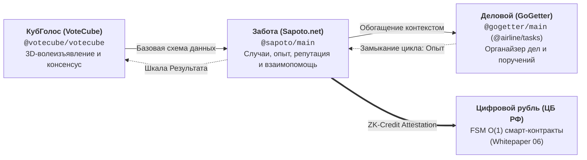
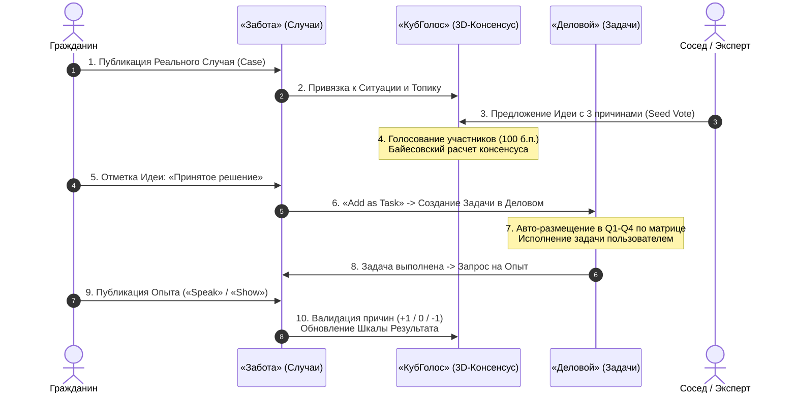

# Прикладной стек экосистемы «Турбаза» и DIN (Applications Suite)
## Архитектурные спецификации, аналитические руководства и белые книги флагманских приложений

Данная директория содержит полный комплекс научно-технических спецификаций, руководств по социально-экономическому воздействию и концептуальных документов по **системообразующим прикладным сервисам** платформы цифрового суверенитета данных **«Турбаза»** и распределенной сети **Data Independence Network (DIN)**.

Документы разработаны на основе авторских архитектурных заметок разработчика ([`shared_docs/comments/`](../../comments/)), нормативных спецификаций реляционного ядра [AIRport](https://github.com/beyond-decentralized/AIRport), материалов консультационного отзыва для Банка России ([`06_cbr_smart_contracts_fsm_whitepaper.md`](../06_cbr_smart_contracts_fsm_whitepaper.md)) и флагманского вайтпейпера прикладного стека ([`02_applications_suite_whitepaper.md`](../02_applications_suite_whitepaper.md)).

---

## 🎯 Архитектурная триада системообразующих приложений

В основе прикладного слоя экосистемы лежит фундаментальная **триада взаимосвязанных приложений**, образующая замкнутый когнитивный цикл от выявления проблем до практического действия и накопления проверенного опыта:

### Однонаправленная иерархия схем данных:
$$\text{КубГолоса (VoteCube)} \longleftarrow \text{Забота (Sapoto)} \longleftarrow \text{Деловой (GoGetter)}$$

1. **`@votecube/votecube`** — абсолютно независимая базовая схема данных: универсальное дерево топиков (`Topic`), абстрактные ситуации (`Situation`), идеи (`Idea`), факторы ($X, Y, Z$), причины (`Reason`), соглашения (`Agreement`) и расчет байесовского консенсуса.
2. **`@sapoto/main`** — прикладная схема взаимной поддержки и децентрализованной репутации: расширяет абстрактные ситуации до Реальных Случаев (`Case`), привязывает треды обсуждений (`Conversation`), масштабирует реплики через страницы (`ReplyPage`), накапливает мультимодальный Опыт («Speak» / «Show»), формирует суверенный социальный и кредитный капитал (EBSL) и поставляет ZK-Credit Attestation для FSM смарт-контрактов Цифрового рубля.
3. **`@gogetter/main` (на базе `@airline/tasks`)** — персональный и семейный исполнительский контур: связывает Реальные Случаи с потенциальными Делами (`Goal`), наделяя их Срочностью и Приоритетом по матрице Эйзенхауэра 2.0, формирует конкретные Задачи (`Task`) и поручения.

---

## 📁 Каталог прикладных направлений

| Приложение | Папка | Ключевые документы | Назначение и предметная область |
| :--- | :--- | :--- | :--- |
| **КубГолос (VoteCube)** | [`votecube/`](votecube/) | • [`VoteCube_architecture_and_functionality.md`](votecube/VoteCube_architecture_and_functionality.md) • [`VoteCube_Ecosystem_Impact_Guide.md`](votecube/VoteCube_Ecosystem_Impact_Guide.md) • [`README.md`](votecube/README.md) • [`AGENTS.md`](votecube/AGENTS.md) | Система многомерного 3D-волеизъявления, преодолевающая кризис бинарных голосований («Да/Нет»). Распределение 100 б.п. между 3 факторами, байесовский многошкальный консенсус (Результат / Эксперты / Народ), самозапечатывающиеся страницы `IChildRecordPage`, трехуровневая анонимность Веток и On-Device TreeSearch. |
| **Забота (Sapoto.net)** | [`sapoto/`](sapoto/) | • [`Sapoto_architecture_and_functionality.md`](sapoto/Sapoto_architecture_and_functionality.md) • [`Sapoto_Reputation_and_Credit_System_Specification.md`](sapoto/Sapoto_Reputation_and_Credit_System_Specification.md) • [`Sapoto_Ecosystem_Impact_Guide.md`](sapoto/Sapoto_Ecosystem_Impact_Guide.md) • [`README.md`](sapoto/README.md) • [`AGENTS.md`](sapoto/AGENTS.md) | Децентрализованная сеть взаимной поддержки, проверенного опыта и суверенной репутации. Фиксация Случаев, мультимодальный опыт («Speak»/«Show»), математический движок доверия EBSL, народный социальный рейтинг (защита от дистопии) и народный кредитный рейтинг для Цифрового рубля ЦБ РФ (ZK-Credit Attestation, снижение залогов со 150% до 0%, бланковые P2P-займы). |
| **Деловой (GoGetter)** | [`gogetter/`](gogetter/) | • [`README.md`](gogetter/README.md) • [`AGENTS.md`](gogetter/AGENTS.md) | Интеллектуальный персональный и семейный органайзер дел, задач и поручений. Матрица Эйзенхауэра 2.0, гравитационные сферы («Gravity Balls»), алгоритм случайного выбора (Serendipity Task), локальный отклик SQLite < 1 мс, семейный контур поручений и Общественная Оболочка (API) внешних сервисов. |

### Сквозные сервисы экосистемы:
* **«УраТур» (UraTur / UraRun)** — туристический планер и автономный путеводитель, рожденный из синергии базовой триады: чек-листы сборов из «Делового», народные тропы из «КубГолоса» и практические советы путешественников из «Заботы» (см. [`applications_presentations/04_uratur_app_presentation/`](file:///Users/parents/Documents/presentations/applications_presentations/04_uratur_app_presentation/README.md)).
* **«Локальный реестр МСП и ЖКХ»** — каталог услуг шаговой доступности, связывающий расписание самозанятых мастеров и управляющих компаний с календарями жителей через районные Ветки (см. [`applications_presentations/05_local_services_presentation/`](file:///Users/parents/Documents/presentations/applications_presentations/05_local_services_presentation/README.md)).

---

## ⚡ Ключевые платформенные инварианты

Все прикладные сервисы строго подчиняются фундаментальным правилам архитектуры «Турбаза»:

1. **Инвариант «Write-Self»:**
   Пользователь никогда не мутирует строки, созданные другим пользователем. Голоса, реплики, задачи и оценки создаются как независимые записи со своим `ActorId`, а агрегаты вычисляются динамически (`@Transient()`).
2. **Самозапечатывающиеся страницы (`IChildRecordPage`):**
   Агрегативные хранилища для масштабирования связей 1:N блоками ~1000 записей (`TopicPage`, `SituationPage`, `ReplyPage`). Хранят лишь «листовую» (списочную) информацию дочерних объектов (название, поля для UI list view) и получают обновления при их редактировании. Использование стандартного механизма хранилищ унифицирует их репликацию и реактивную обработку (`live queries`) на Листах. При заполнении страница криптографически запечатывается и переводится в неизменяемый CAS-кэш.
3. **Трехуровневая топология (Лист $\to$ Ветка $\to$ Ствол):**
   * **Лист (смартфон/клиент):** 100% пользовательских запросов, локальная база SQLite / AIRport WASM, отклик < 1 мс.
   * **Ветка (район/город/кооператив):** шлюз координации данных без рендеринга HTML (Zero-Rendering), аккумуляция счетчиков в RAM (`EpochBlock extends AirEntity`), mTLS-маршрутизация и ZKP-проверка локальности.
   * **Ствол (федерация):** глобальный консенсус, фиксация контрольных хешей и выпуск обновлений схем.
4. **Конфиденциальность Zero-PII и 152-ФЗ:**
   Персональные данные, ключи и приватные заметки хранятся исключительно на устройствах граждан (Self-Custody). Шлюзы Веток оперируют только обезличенными векторами и ZKP-доказательствами.
5. **Детерминированный сплит $O(1)$ смарт-контракта `share(...)`:**
   Этичная монетизация без слежки: рекламные доходы и подписки алгоритмически распределяются между Гражданином ($w_1$), Хост-порталом ($w_2$), Деревом ПО ($w_3$) и Арендаторами мощностей ($w_4$).

---

## 🔄 Сквозной пользовательский сценарий

---

## 📚 Связанные материалы хранилища

* [**`AGENTS.md`**](AGENTS.md) — Инженерное руководство для агентов по структуре прикладного раздела, стандартам и регламентам.
* [**Белая книга № 02: Флагманский стек приложений**](../02_applications_suite_whitepaper.md) — Официальный представительский вайтпейпер прикладной серии (15 страниц А4).
* [**Серия презентаций `applications_presentations/`**](../../../applications_presentations/README.md) — 5 интерактивных презентаций (75 слайдов) с дикторской озвучкой:
  * [`01_kubgolos_app_presentation`](../../../applications_presentations/01_kubgolos_app_presentation/README.md) — «КубГолос»
  * [`02_zabota_app_presentation`](../../../applications_presentations/02_zabota_app_presentation/README.md) — «Забота»
  * [`03_delovoy_app_presentation`](../../../applications_presentations/03_delovoy_app_presentation/README.md) — «Деловой»
  * [`04_uratur_app_presentation`](../../../applications_presentations/04_uratur_app_presentation/README.md) — «УраТур»
  * [`05_local_services_presentation`](../../../applications_presentations/05_local_services_presentation/README.md) — «Локальный реестр МСП и ЖКХ»
* [**Авторские концептуальные заметки `shared_docs/comments/`**](../../comments/README.md) — Первоисточники замысла разработчика платформы.
