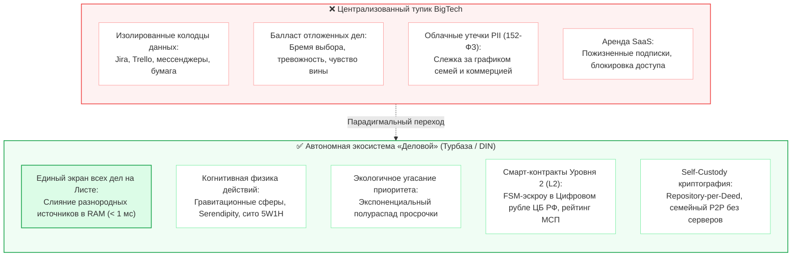
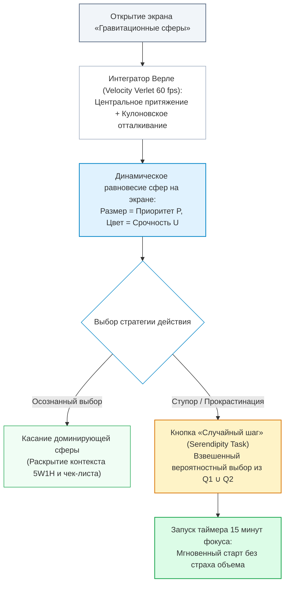
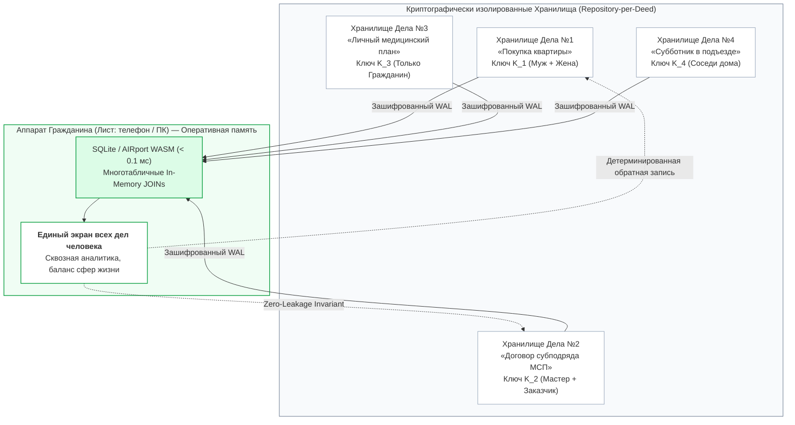
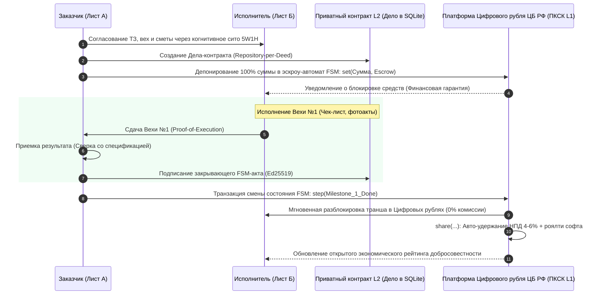
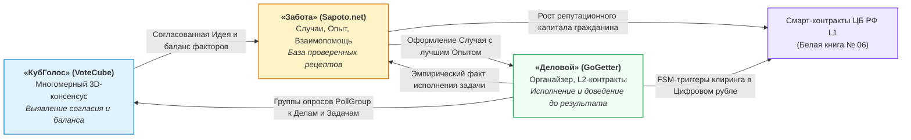
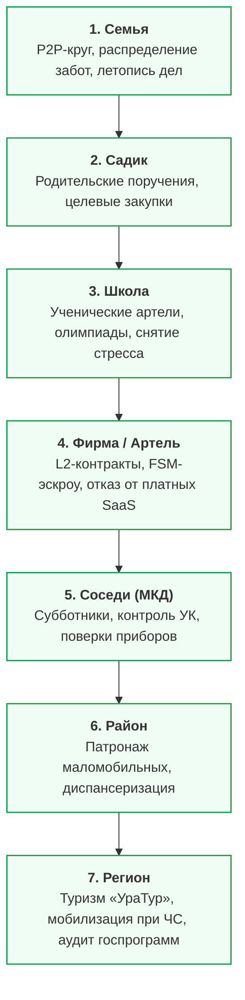

# Социально-экономический и прикладной потенциал приложения «Деловой» (GoGetter)

## Когнитивная эргономика, преодоление прокрастинации, независимость семейных данных и смарт-контракты Уровня 2 на платформе Цифрового рубля
*Семьи · Детские сады · Школы · Фирмы · Соседи · Районы · Регионы*

*Классификация: Автономный органайзер личных, семейных и деловых задач, преодоление прокрастинации, кинетическая физическая модель гравитационных сфер, смарт-контракты Уровня 2 (L2), открытый мандатный API поручений, интеграция с Цифровым рублем Банка России*  
*Концептуальный автор платформы и архитектор: Артём Владимирович Шамсутдинов*  
*Связанные нормативные спецификации: [`GoGetter_architecture_and_functionality.md`](GoGetter_architecture_and_functionality.md), [`README.md`](README.md), [`Sapoto_Ecosystem_Impact_Guide.md`](../sapoto/Sapoto_Ecosystem_Impact_Guide.md), [`VoteCube_Ecosystem_Impact_Guide.md`](../votecube/VoteCube_Ecosystem_Impact_Guide.md), [Белая книга Банка России № 06](../../06_cbr_smart_contracts_fsm_whitepaper.md)*  
*Проектные хранилища: [`gogetter`](file:///Users/parents/Documents/data-independence-network/gogetter), [`sapoto.net`](file:///Users/parents/Documents/data-independence-network/sapoto.net), [`votecube.com`](file:///Users/parents/Documents/data-independence-network/votecube.com)*

---

## Содержание

1. [Концептуальное введение: Преодоление кризиса личной и коллективной организованности](#1-концептуальное-введение-преодоление-кризиса-личной-и-коллективной-организованности)
2. [Когнитивно-психологический аппарат преодоления прокрастинации](#2-когнитивно-психологический-аппарат-преодоления-прокрастинации)
3. [Архитектурный фундамент автономности и антимонопольной компонуемости](#3-архитектурный-фундамент-автономности-и-антимонопольной-компонуемости)
4. [Институционально-экономический контур: Смарт-контракты Уровня 2 и Цифровой рубль](#4-институционально-экономический-контур-смарт-контракты-уровня-2-и-цифровой-рубль)
5. [Сквозная синергия флагманской триады: «КубГолос» ⟷ «Забота» ⟷ «Деловой»](#5-сквозная-синергия-флагманской-триады-кубголос---забота---деловой)
6. [Применение «Делового» на семи уровнях общества](#6-применение-делового-на-семи-уровнях-общества)
   - [6.1. Уровень 1: Семьи (Малые и большие семейные кланы)](#61-уровень-1-семьи-малые-и-большие-семейные-кланы)
   - [6.2. Уровень 2: Детские сады (Родительские комитеты и воспитатели)](#62-уровень-2-детские-сады-родительские-комитеты-и-воспитатели)
   - [6.3. Уровень 3: Школы (Ученики, родители и педагогический совет)](#63-уровень-3-школы-ученики-родители-и-педагогический-совет)
   - [6.4. Уровень 4: Фирмы и бизнес (Самозанятые, МСП, артели и проектные команды)](#64-уровень-4-фирмы-и-бизнес-самозанятые-мсп-артели-и-проектные-команды)
   - [6.5. Уровень 5: Соседи (МКД, ТСЖ, ТОС и дворовые сообщества)](#65-уровень-5-соседи-мкд-тсж-тос-и-дворовые-сообщества)
   - [6.6. Уровень 6: Районы (Муниципалитеты, поликлиники и социальные службы)](#66-уровень-6-районы-муниципалитеты-поликлиники-и-социальные-службы)
   - [6.7. Уровень 7: Регионы (Субъекты РФ, туризм «УраТур», инфраструктура и ЧС)](#67-уровень-7-регионы-субъекты-рф-туризм-уратур-инфраструктура-и-чс)
7. [Сводная матрица социально-экономической ценности на семи уровнях масштабирования](#7-сводная-матрица-социально-экономической-ценности-на-семи-уровнях-масштабирования)
8. [Заключение: Архитектурный синтез личной свободы, семейного созидания и цифрового суверенитета государства](#8-заключение-архитектурный-синтез-личной-свободы-семейного-созидания-и-цифрового-суверенитета-государства)

---

## 1. Концептуальное введение: Преодоление кризиса личной и коллективной организованности

### 1.1. Анатомия накопления балласта отложенных дел, бремени выбора и иллюзии эффективности
Современный человек живет в обстановке непрерывной информационной перегрузки. В попытках совладать с лавиной обязательств граждане заводят бумажные блокноты, скачивают мобильные планеры и настраивают напоминания. Однако подавляющее большинство существующих инструментов планирования терпит крах:
- **Балласт отложенных дел и бремя выбора:** Списки дел превращаются в бесконечные простыни текста, где актуальные задачи погребены под десятками просроченных пунктов. Вид сотен невыполненных строк и непосильное бремя выбора вызывают тревожность, чувство вины и апатию, вынуждая человека вовсе прекращать открывать приложение.
- **Иллюзия занятости вместо осмысленного действия:** Традиционные списки не проводят различия между мелкой бытовой рутиной и стратегическими жизненными приоритетами. Пользователь тратит силы на вычеркивание второстепенных мелочей, создавая фиктивное ощущение продуктивности, в то время как главные созидательные цели годами остаются нетронутыми.
- **Эмоциональное выгорание от ложных дедлайнов:** Искусственное назначение жестких сроков на каждую мелочь приводит к тому, что при первом же сбое графика система обрушивает на человека лавину красных предупреждений, полностью девальвируя понятие срочности.

### 1.2. Провал централизованных таск-трекеров BigTech: синдром разорванного внимания, монопольные подписки и угроза приватности
На корпоративном и семейном уровнях кризис усугубляется архитектурными пороками современных облачных платформ:
1. **Тотальная фрагментация контекста («Колодцы данных» / Data Silos):** Личные дела ведутся в одном приложении, рабочие задачи работодателя заперты в закрытом корпоративном трекере (Jira, Asana, Trello), семейные договоренности тонут в хаотичной переписке мессенджеров, а квитанции ЖКХ и записи к врачам разбросаны по разрозненным государственным и коммерческим порталам. Человек вынужден ежедневно переключаться между десятками несовместимых интерфейсов, теряя фокус и до 30% рабочего времени на когнитивную перенастройку.
2. **Платная рента и монопольный контроль:** Полноценный совместный функционал доступен только по подпискам с ежемесячной подушевой оплатой. Для самозанятых, малых артелей и семейных союзов такие тарифы становятся непреодолимым финансовым барьером. При прекращении подписки пользователь лишается доступа к собственному архиву выполненных работ.
3. **Облачная слежка и риски утечек конфиденциальности (152-ФЗ):** Централизованные облачные хранилища BigTech аккумулируют подробнейшую информацию о повседневной жизни граждан: распорядок дня детей, медицинские назначения, стратегические коммерческие планы малого бизнеса, цепочки поставок и финансовые условия сделок. Любая утечка базы данных ставит под угрозу личную безопасность семей и коммерческую тайну предприятий.

### 1.3. Парадигмальный манифест «Делового»: автономный органайзер, когнитивная эргономика и институциональная надежность
Интеллектуальный органайзер **«Деловой» (GoGetter)** в составе платформы цифрового суверенитета данных **«Турбаза»** и распределенной сети **Data Independence Network (DIN)** предлагает принципиально иную философию взаимодействия человека со своими делами:



* **Единый экран всех сфер жизни:** На аппарате пользователя (смартфоне или рабочей станции) сходятся воедино личные планы, семейные заботы, задачи рабочего коллектива и общественные поручения. Никаких переключений между аккаунтами — полная картина жизни доступна мгновенно.
* **Замена стресса на игровую физику:** Абстрактные списки заменяются живым интерактивным экраном гравитационных сфер, где физическое движение объектов привлекает внимание к главному, а алгоритм случайного шага снимает психологический барьер перед началом работы.
* **Экологичное отношение к вниманию:** Отсутствие карательных мер за просрочку. Неактуальные дела естественным образом угасают и освобождают ментальное пространство.
* **Институциональная сила исполнения:** Дело перестает быть просто записью в блокноте. В деловой сфере оно трансформируется в самоисполняемый контракт второго уровня (Level 2 Private Contract), защищенный эскроу-расчетами в Цифровом рубле Центрального банка Российской Федерации.

---

## 2. Когнитивно-психологический аппарат преодоления прокрастинации

### 2.1. Физическая модель «Гравитационных сфер» (Gravity Balls): кинетическая визуализация и динамика приоритетов
Вместо монотонного вертикального списка задач «Деловой» задействует кинетический двухмерный физический движок:
- **Геометрия важности:** Каждое Дело визуализируется в виде упругой сферы, радиус которой прямо пропорционален Приоритету (Важности $P \in \{0..4\}$):
  $$R_i = R_{\min} + \alpha_R \cdot P_i$$
  Наиболее значимые жизненные и деловые вехи предстают крупными доминирующими телами, приковывающими взгляд, в то время как второстепенные задачи остаются компактными сателлитами.
- **Цветовая палитра срочности и квадранты Матрицы 2.0:** Окраска сферы отражает Срочность ($U \in \{0..4\}$) и положение дела в модернизированной Матрице Эйзенхауэра 2.0:
  - *Квадрант Q1 (Важно и Срочно):* Насыщенный огненно-красный / янтарный цвет — зона немедленного реагирования и критических дедлайнов;
  - *Квадрант Q2 (Важно, но Не срочно):* Глубокий сапфирово-синий / изумрудный цвет — зона стратегического роста, образования, здоровья и долгосрочных инвестиций;
  - *Квадрант Q3 (Срочно, но Не важно):* Светло-желтый / песочный цвет — зона делегирования и рутинных внешних запросов;
  - *Квадрант Q4 (Не важно и Не срочно):* Нейтральный дымчато-серый цвет — зона комфортного отдыха или кандидаты на архивацию.
- **Кинематика гравитационного притяжения:** В момент открытия экрана сферы с легкой динамической анимацией устремляются из периферии к центру, повинуясь центральной гравитационной силе $\mathbf{F}_{\text{center}}$, упругому отталкиванию соседних сфер $\mathbf{F}_{\text{repulse}}$ и вязкому торможению среды $\mathbf{F}_{\text{drag}}$.
- **Скрытие деталей до момента выбора:** На поверхности сфер отображаются лишь лаконичные визуальные метки и размерность. Текстовое описание и чек-листы раскрываются только после осознанного касания сферы пользователем. Это предохраняет мозг от преждевременной когнитивной перегрузки текстовыми деталями.



### 2.2. Алгоритм «Случайный шаг» (Serendipity Task) и импульс 15-минутного старта
Главная причина прокрастинации кроется не в лени, а в тяжелом **бремени выбора** и накоплении **балласта отложенных дел** (Decision Fatigue): когда перед человеком лежит массив задач, мозг тратит колоссальное количество энергии на мучительный выбор «за что взяться в первую очередь», истощает запасы дофамина и уходит в прокрастинацию (соцсети, новости, видео).

Алгоритм **«Случайный шаг» (Serendipity Task)** элегантно разрушает этот тупик:
1. **Взвешенная стохастическая выборка:** При нажатии кнопки случайного выбора система не выбирает дело абсолютно вслепую. Алгоритм отбирает задачи исключительно из продуктивных квадрантов $Q1$ и $Q2$, назначая каждому делу статистический вес, пропорциональный квадрату важности и срочности:
   $$w_k = (P_k + 1)^2 \cdot (U_k + 1)$$
2. **Снятие бремени выбора:** Компьютер берет ответственность за первый шаг на себя. Случайное позиционирование и элемент неожиданности пробуждают дофаминовое любопытство.
3. **Импульс первых 15 минут:** Пользователю предлагается не завершить гигантский проект целиком, а посвятить выбранному делу ровно **15 минут непрерывного погружения**. Психологический барьер «сделать 15 минут» практически равен нулю. В 85% случаев после преодоления инерции старта человек естественным образом входит в состояние продуктивного потока (Flow State) и успешно доводит задачу до конца.

### 2.3. Закон экспоненциального угасания приоритета при просрочке (Overdue Priority Decay)
В классических таск-трекерах просроченное дело накапливает тревожный визуальный вес: шрифт становится красным, возникают восклицательные знаки, чувство вины растет с каждым днем. В результате человек начинает подсознательно избегать самого приложения.

В «Деловом» внедрен фундаментальный принцип **экспоненциального угасания Приоритета (Важности)** просроченного дела с настраиваемым периодом полураспада $T_{1/2}$ (по умолчанию 72 часа / 3 дня):
$$P(t) = \max\left(0, \; \left\lfloor P_{\text{base}} \cdot \exp\left( - \frac{\ln 2}{T_{1/2}} \cdot (t - T_{\text{deadline}}) \right) \right\rfloor\right), \quad t > T_{\text{deadline}}$$

- **Физика вытеснения:** По мере просрочки сфера теряет гравитационную массу, уменьшается в диаметре, становится полупрозрачной и центробежными силами вытесняется на дальнюю орбиту экрана.
- **Освобождение от вины:** Система транслирует человеку здравую мысль: *«Если дедлайн прошел неделю назад, а мир не рухнул — значит, объективная важность этого дела была иллюзорной, либо контекст безвозвратно изменился»*.
- **Экологичная развилка в 1 клик:** Оказавшись на внешней орбите со значением $P=0$, дело предлагает пользователю спокойный выбор без угрызений совести: актуализировать реальный новый срок, либо в одно касание отправить задачу в архив. Пространство внимания остается чистым.

### 2.4. Когнитивное сито 5W1H: Сократический диалог «Зачем?», тест «Цена бездействия» и формулы реализации «Если — То»
Чтобы задача была выполнена, она должна быть внутренне принята психикой. Вместо механической фиксации «сделать отчет» органайзер задействует активное **когнитивное сито 5W1H**:

```mermaid
graph LR
    DeedInput["Ввод замысла Дела"] --> Sieve{"Когнитивное сито 5W1H"}
    Sieve --> W1["<b>Кто? (Who)</b><br/>Исполнитель / Семья / Партнер"]
    Sieve --> W2["<b>Что? (What)</b><br/>Осязаемый артефакт финала"]
    Sieve --> W3["<b>Где? (Where)</b><br/>Геометка / Локальный контекст"]
    Sieve --> W4["<b>Когда? (When)</b><br/>Окно выполнения + Дедлайн"]
    Sieve --> W5["<b>Зачем? (Why)</b><br/>5 «Почему» + Цена бездействия"]
    Sieve --> H1["<b>Как? (How)</b><br/>Формула «Если — То» (Первые 15 мин)"]

    W5 --> Clear{"Дело навязано извне?"}
    Clear -->|Да (Ложная цель)| Drop["Отсев на входе (Экономия сил)"]
    Clear -->|Нет (Истинный мотив)| Active["Формирование ядра Дела"]
    H1 --> Active

    style DeedInput fill:#f1f5f9,stroke:#64748b,stroke-width:1.5px
    style Sieve fill:#e0f2fe,stroke:#0284c7,stroke-width:1.5px
    style W5 fill:#fef3c7,stroke:#d97706,stroke-width:1.5px
    style H1 fill:#dcfce7,stroke:#16a34a,stroke-width:1.5px
    style Drop fill:#fef2f2,stroke:#ef4444,stroke-width:1.5px
    style Active fill:#f0fdf4,stroke:#16a34a,stroke-width:1.5px
```

1. **Кто? (Who):** Точное определение субъекта ответственности (персонально, домочадец, внешний подрядчик или партнерская артель).
2. **Что? (What):** Формулировка в виде осязаемого физического или цифрового результата, исключающая двусмысленность.
3. **Где? (Where):** Пространственная и ситуационная привязка (домашний кабинет, гараж, банк, школьный класс).
4. **Когда? (When):** Временной интервал доступности контекста и предельный срок актуальности.
5. **Зачем? / Почему? (Why — Сократическое сито):** 
   - *Метод «5 Почему»:* Проверка истинной мотивации. Позволяет мгновенно отсечь навязанные обществом пустые дела, на которые у человека подсознательно нет энергии.
   - *Тест «Цена бездействия» (Cost of Inaction):* Человек отвечает на вопрос: *«Что самое худшее случится, если это дело не будет сделано никогда?»*. Если ответ «ничего страшного» — задача ликвидируется до ее начала.
6. **Как? (How — Психологическая связка «Если — То»):**
   - Интеграция концепции намерений реализации (*Implementation Intentions*): связывание старта дела с внешним триггером окружения (*«ЕСЛИ на часах 19:00 и ребенок закончил ужин, ТО мы садимся за сборку макета на 15 минут»*). Это переводит запуск задачи из режима волевого преодоления в автоматический поведенческий рефлекс.

---

## 3. Архитектурный фундамент автономности и антимонопольной компонуемости

### 3.1. Принцип «Repository-per-Deed» (Одно Дело — Одно Хранилище) и автономная криптографическая изоляция
В подавляющем большинстве систем продуктивности используется монолитная база данных: все задачи пользователя, его заметки и контакты сваливаются в единую таблицу на сервере провайдера. В платформе «Турбаза» реализован строгий децентрализованный принцип:

> **Инвариант «Repository-per-Deed»:**  
> Каждое отдельное Дело (`Deed`) создается и существует в собственном независимом Хранилище (`Repository`). В платформе принципиально отсутствуют монолитные «семейные», «корпоративные» или «персональные» базы-агрегаторы.



- **Индивидуальный ключ шифрования:** Каждое Дело зашифровано уникальным симметричным ключом (`Repository Encryption Key`), который передается исключительно явным участникам данного конкретного дела.
- **Математическая невозможность перекрестной утечки:** Если гражданин участвует в коммерческом проекте фирмы и одновременно ведет личный план лечения, контрагенты по бизнесу криптографически не способны узнать даже о факте существования медицинского хранилища.

### 3.2. Слияние сотен источников в оперативной памяти Листа (In-Memory Aggregation) и инвариант нулевых утечек (Zero-Leakage Invariant)
Как обеспечить удобство работы, если данные раздроблены по сотням независимых хранилищ?
- **Мощь реляционного ядра на Листе:** Реляционная СУБД SQLite / AIRport WASM развернута непосредственно на пользовательском устройстве (Листе). При запуске приложения проверенный код считывает зашифрованные дельты (WAL) из авторизованных хранилищ, расшифровывает их локальными ключами и объединяет в оперативной памяти.
- **Микросекундные соединения (In-Memory JOINs):** Реляционное связывание десятков таблиц и сотен дел по целочисленным первичным ключам в оперативной памяти смартфона занимает менее **0.1 миллисекунды**. Пользователь видит монолитный, мгновенно работающий интерфейс без сетевых задержек.
- **Инвариант нулевых утечек (Zero-Leakage Invariant):** Проверенная программная песочница гарантирует строгую направленность обратной записи. Когда пользователь ставит отметку о выполнении подзадачи, дельта изменений упаковывается и записывается строго в то Хранилище, которому принадлежит данная задача. Смешение контекстов исключено алгоритмически.

### 3.3. Принцип «Невидящей Ветки» (Zero-Knowledge Branch) и локальный семейный P2P-транспорт
- **Промежуточная Ветка как «слепой» ретранслятор:** Районные или корпоративные серверы-Ветки, обеспечивающие синхронизацию, оперируют исключительно зашифрованными блоками данных. Ветка не имеет ключей дешифрования, не видит названий дел, сроков, сумм и имен участников. Организация, хостирующая Ветку, не является оператором персональных данных в терминологии 152-ФЗ.
- **Прямой обмен без интернета (Direct P2P):** При нахождении членов семьи или коллег в одном помещении синхронизация совместных дел переключается на прямой пиринговый протокол (домашний Wi-Fi, Bluetooth Low Energy Mesh). Обмен задачами происходит со скоростью локальной сети и продолжает работать даже при полном отключении внешнего интернета.

### 3.4. Открытый мандатный API поручений (Capability-Based Delegation) и гарантированная защита от спама
В отличие от почты и мессенджеров, куда любой желающий может прислать спам, в «Деловом» внедрена **мандатная модель постановки поручений (Capability Tokens)**:
- **Криптографический мандат доверия:** Стороннее приложение (поликлиника, школа, управляющая компания ЖКХ или сервис бронирования путешествий «УраТур») может поставить задачу в органайзер гражданина исключительно при наличии подписанного криптографического разрешения, выданного самим гражданином на строго определенный срок и категорию.
- **Сквозные трехколоночные внешние ключи:** Поручение не копирует громоздкие тексты документов, а содержит компактную неизменяемую ссылку на целевое хранилище документа: `(TargetRepositoryId, TargetActorId, TargetRecordId)`. Нажав на задачу «Забрать лекарство», гражданин мгновенно открывает оригинальный электронный рецепт врача из медицинской карты.

---

## 4. Институционально-экономический контур: Смарт-контракты Уровня 2 и Цифровой рубль

### 4.1. Двухуровневая архитектура контрактов: приватные спецификации L2 и детерминированный FSM-клиринг L1 Банка России
В реальном секторе экономики малый бизнес, самозанятые мастера и артели постоянно сталкиваются с рисками неплатежей, срывов договоренностей и бесконечных претензий по качеству. Традиционная судебная система для микросделок (на суммы от 5 000 до 300 000 рублей) неэффективна из-за колоссальных судебных и временных издержек.

Органайзер «Деловой» в связке с Белой книгой Банка России № 06 разворачивает революционную **двухуровневую контрактную архитектуру**:



1. **Приватный контур Уровня 2 (Level 2 Private Contract):** Дело в «Деловом» выступает полноценным юридическим соглашением. Внутри локального зашифрованного хранилища фиксируются подробные технические задания, сметы, промежуточные контрольные вехи (Milestones), фотоотчеты со строительной площадки, чек-листы приемки и переписка сторон. Все эти конфиденциальные детали хранятся только на устройствах заказчика и исполнителя (Zero-PII).
2. **Публичный контур Уровня 1 (Level 1 CBR Smart Contract):** В расчетное ядро платформы Цифрового рубля ЦБ РФ направляется компактный детерминированный конечный автомат (FSM), содержащий только формулу условий, хеш спецификации и идентификаторы счетов.

### 4.2. Поэтапное депонирование средств (Escrow) и приемочная верификация вех (Proof-of-Execution)
- **Искоренение кассовых разрывов и обмана:** В момент заключения договора заказчик депонирует средства на защищенный смарт-контракт эскроу Банка России. Исполнитель приступает к работе, имея 100% математическую гарантию наличия денег у клиента. Заказчик защищен тем, что средства не списываются авансом, а выдаются строго по мере приемки конкретных этапов.
- **Однозначные FSM-переходы:** Закрытие каждой подзадачи в чек-листе Дела формирует криптографическое доказательство исполнения (*Proof-of-Execution*). При взаимном подписании акта вехи ключами сторон FSM-автомат первого уровня мгновенно производит перевод транша исполнителю в режиме реального времени ($O(1)$) с нулевой межбанковской комиссией.

### 4.3. Автоматическое рекурсивное сплитование выручки по формуле `share(...)` и налоговое агентирование
При проведении платежа расчетное ядро Цифрового рубля автоматически применяет алгоритмическую формулу разделения выручки `share(...)`:
- **Бесшовное налоговое агентирование:** Платформа автоматически удерживает налог на профессиональный доход (4% при расчетах с физлицами, 6% с юрлицами) или НДФЛ/УСН и перечисляет его напрямую в Федеральное казначейство РФ. Самозанятому мастеру больше не требуется заполнять налоговые декларации и вручную формировать чеки.
- **Монетизация программного стека:** Небольшая регламентированная доля платежа расщепляется в пользу разработчиков прикладного софта и операторов обслуживающих инфраструктурных Веток по формуле вектора Шепли, гарантируя устойчивое финансирование открытого отечественного ПО без выкачивания комиссий за рубеж.

### 4.4. Децентрализованный экономический рейтинг добросовестности: альтернатива банковским БКИ для артелей и самозанятых
- **Капитализация профессиональной репутации:** Каждый успешно завершенный контракт в «Деловом» фиксируется в децентрализованном консенсусе как факт добросовестного исполнения обязательств.
- **Преодоление дискриминации начинающих мастеров:** Самозанятые специалисты и молодые артели, не имеющие залогового имущества и кредитной истории в традиционных БКИ, формируют прозрачный и объективный **экономический рейтинг надежности**. На его основе банки и кассы взаимопомощи («Забота») открывают доступ к беззалоговому льготному финансированию под развитие производства.

---

## 5. Сквозная синергия флагманской триады: «КубГолос» ⟷ «Забота» ⟷ «Деловой»

Системообразующие приложения платформы «Турбаза» образуют неразрывный созидательный цикл, переводящий общественную энергию из плоскости мнений в плоскость реальных дел:

$$\text{«КубГолос» (VoteCube)} \longleftrightarrow \text{«Забота» (Sapoto.net)} \longleftrightarrow \text{«Деловой» (GoGetter)}$$



### 5.1. Триадный цикл социального действия: от выявления согласия к проверенному рецепту и гарантированному исполнению
1. **Этап 1: Достижение согласия («КубГолос»):** Коллектив (жильцы дома, родители класса, артель мастеров) сталкивается с проблемой. Вместо бесконечной ругани в чатах запускается 3D-опрос, где взвешиваются факторы пользы, стоимости и трудоемкости, формируя устойчивый вектор консенсуса.
2. **Этап 2: Поиск эффективного решения («Забота»):** Найденная идея сопоставляется с реальными Случаями (`Case`) в сети «Забота». Сообщество находит лучший практический опыт других районов — пошаговый алгоритм решения аналогичной проблемы с видеоинструкциями и предостережениями от ошибок.
3. **Этап 3: Декомпозиция и контроль реализации («Деловой»):** Проверенный опыт импортируется в органайзер «Деловой» как новое Дело (`Deed`). Задача автоматически расщепляется на подзадачи, назначаются ответственные исполнители, активируются L2-контракты с депонированием сметы, и процесс доводится до гарантированного осязаемого результата.

### 5.2. Соединительная сущность `DeedCase`: трансформация общественных Случаев в тиражируемые шаблоны дел
- **Связка частного и публичного контуров:** Посредством соединительной реляционной сущности `DeedCase` пользователи привязывают свои приватные задачи к открытым общественным Случаям в «Заботе».
- **Народные шаблоны жизненных проектов:** Когда инициативная группа успешно решает сложную проблему (например, организация раздельного сбора отходов во дворе или газификация поселка), структура созданного Дела с оптимальной последовательностью шагов и образцами документов публикуется в «Заботе» как общественный шаблон. Любая другая семья или двор могут в один клик клонировать этот план в свой «Деловой», экономя месяцы проб и ошибок.

### 5.3. Механизм «Группы Опросов» (PollGroup): связывание произвольного числа опросов с Делом или отдельной Задачей
Архитектурный смысл сущности `PollGroup` («Группа Опросов») заключается в том, что **любое количество микро-опросов «КубГолоса» может быть гибко соединено с определенным Делом в целом либо с отдельной Задачей**:
- **Преодоление ограничений единичных голосований (1..N):** При реализации комплексного Дела или ответственной Задачи коллективу требуется согласовать не один абстрактный вопрос, а целый спектр взаимосвязанных решений. Через `PollGroup` к Делу или Задаче привязывается произвольное число 3D-опросов «КубГолоса» (`@votecube/votecube`). Например, к Делу «Благоустройство двора» прикрепляется группа из четырех опросов (выбор генерального плана, предельная смета, время тишины, приоритет зеленых насаждений), а к конкретной подзадаче «Монтаж ограждения» — отдельная группа опросов (высота забора, материал, цвет покрытия).
- **Связывание как на уровне Дела, так и на уровне Задачи:** Сущность `PollGroup` может соединяться напрямую с Делом (`Deed`) либо с конкретной Задачей (`Task`), позволяя детализировать консенсус на любом уровне графа декомпозиции.
- **Расчет совокупной статистики группы опросов:**
  - **На Листах пользователей (Leaf):** локально вычисляется персональная сводка — насколько текущий вариант удовлетворяет совокупности факторов гражданина, где возникают расхождения и как распределяется личный баланс согласия по всей группе вопросов;
  - **На серверных Листах обработки данных предприятий и ведомств:** формируются сводные многомерные распределения и совокупный байесовский консенсус группы, давая совету дома, дирекции фирмы или муниципалитету объективную картину общественной поддержки проекта без созыва очных собраний.

---

## 6. Применение «Делового» на семи уровнях общества



---

### 6.1. Уровень 1: Семьи (Малые и большие семейные кланы)

#### 1. Вызовы и проблемы семейного быта
В современных семьях повседневная организация держится на невидимом эмоциональном и когнитивном труде (Mental Load), который обычно ложится на плечи одного из супругов:
* Постоянные упреки и обиды: *«Ты опять забыл купить лекарство ребенку»*, *«Почему я должна помнить обо всем одна?»*;
* Семейные чаты превращаются в свалку ссылок, фотографий квитанций и потерянных поручений;
* Подростки игнорируют родительские просьбы, воспринимая их как назойливый надзор;
* Уход за пожилыми родственниками и координация помощи между разъехавшимися братьями и сестрами превращается в нескоординированный стресс.

#### 2. Инструментарий и механики «Делового»
* **Семейный P2P-круг без внешних облаков:** Совместные семейные Дела синхронизируются напрямую между устройствами домочадцев по домашней сети Wi-Fi. Никаких чужих глаз и облачных серверов.
* **Личные и общие Хранилища:** У каждого члена семьи есть полностью автономные личные дела (Self-Custody), закрытые от остальных, и общие семейные проекты, куда каждый вносит свой вклад по правилу «Write-Self».
* **Геймификация для детей и подростков:** Ребенок видит свои уроки и обязанности не как занудный приказ, а как интерактивные сферы. Сжатие и исчезновение шариков приносит дофаминовое удовлетворение победы, формируя здоровую привычку доводить дела до конца.
* **«Семейная летопись»:** Архив закрытых семейных дел (ремонт дома, поступление сына в университет, организация юбилея бабушки) формирует защищенную хронику совместных побед рода.

#### 3. Сквозной практический кейс: Капитальный ремонт детской комнаты с участием старшего поколения
- **Исходная ситуация:** Семья с двумя детьми решила переоборудовать комнату перед 1 сентября. Бюджет ограничен 200 000 рублями, дедушка вызвался помочь со сборкой мебели и электрикой.
- **Триада в действии:**
  1. *«КубГолос»:* Семья настраивает 3D-куб по вариантам планировки, выявив, что для детей критично разделение учебных зон, а для родителей — эргономичность освещения.
  2. *«Забота»:* Мама находит в «Заботе» проверенный опыт семьи из соседнего района по безопасной шумоизоляции экологичными материалами.
  3. *«Деловой»:* Создается семейное Дело «Ремонт детской». Задача расщепляется: закупка материалов (папа), дизайн текстиля (мама), электрика и разводка розеток (дедушка), сборка личных стеллажей (дети).
- **Результат:** Дедушка видит свои четкие задачи на планшете без необходимости читать родительские чаты; закупки ведутся по общему чек-листу без дублирования трат; дети с азартом «лопают» сферы своих подзадач. Проект сдан на 4 дня раньше срока с экономией 35 000 рублей бюджета.

---

### 6.2. Уровень 2: Детские сады (Родительские комитеты и воспитатели)

#### 1. Проблемы сообществ дошкольного образования
* Токсичная атмосфера родительских чатов: десятки эмоциональных сообщений парализуют организацию простейших мероприятий;
* Подозрения в нецелевом расходовании родительских средств на праздники, подарки и хознужды;
* Трудности с распределением обязанностей: всю рутинную организационную работу ведут 2-3 истощенных активиста, остальные дистанцируются.

#### 2. Инструментарий и механики «Делового»
* **Целевые микро-хранилища на группу:** Родительский комитет создает Дело с прозрачным деревом задач под конкретное событие (например, «Новогодний утренник»).
* **Открытая разборка поручений:** Задачи (привезти елку, распечатать сценарии, заказать сертифицированные подарки) вывешиваются на общую доску группы. Родители самостоятельно берут посильные задачи в один клик.
* **Прозрачные эскроу-закупки в Цифровом рубле:** Сбор средств привязывается к смарт-контракту: деньги списываются поставщику подарков только после прикрепления фискального чека и сертификата качества через внешнюю реляционную ссылку.

#### 3. Сквозной практический кейс: Подготовка к празднику Осени и оснащение экологического уголка
- **Реализация:** Воспитатель публикует перечень нужд для занятий на свежем воздухе. Через «Деловой» 18 родителей разбирают микро-задачи (кто-то привозит спилы деревьев для гербария, кто-то заказывает лупы, кто-то ламинирует плакаты).
- **Результат:** Ни одного эмоционального спора в мессенджере. 100% готовность к мероприятию за неделю до даты. Полная финансовая прозрачность до копейки без контакта воспитателя с наличными деньгами.

---

### 6.3. Уровень 3: Школы (Ученики, родители и педагогический совет)

#### 1. Кризис образовательного процесса
* Тотальная академическая прокрастинация школьников: подготовка к экзаменам (ОГЭ/ЕГЭ), олимпиадам и исследовательским проектам откладывается на последнюю ночь;
* Перегрузка учителей бумажной отчетностью и организацией внеурочных мероприятий;
* Разобщенность ученических коллективов: проектная работа часто сводится к тому, что один отличник делает всю презентацию за группу бездельников.

#### 2. Инструментарий и механики «Делового»
* **Ученические проектные артели:** Совместное Дело школьной команды с четко распределенными ролями и взаимными зависимостями задач (`TaskDependency` Before/After). Невозможно сдать проект, пока каждый участник не закроет свою веху.
* **Декомпозиция олимпиадной подготовки через «Случайный шаг»:** Огромный массив задач по математике или физике разбивается на ежедневные 15-минутные сессии Serendipity Task, устраняя страх перед неподъемным объемом предмета.
* **Школьные дежурства и волонтерство с фиксацией в репутации:** Участие в обустройстве школьного музея, шефство над младшими классами и субботники фиксируются как закрытые задачи, пополняя открытый социальный портфель выпускника.

#### 3. Сквозной практический кейс: Междисциплинарный экологический проект 10 класса по очистке малого водоема
- **Реализация:** Команда из 5 старшеклассников организует проектное Дело в «Деловом». Химик берет пробу воды, IT-специалист настраивает датчики, дизайнер готовит инфографику, координатор связывается с районной администрацией.
- **Интеграция:** Группы опросов `PollGroup` (по конструкции фильтров, выбору сорбентов и графику дежурств) связываются с проектным Делом и отдельными задачами, позволяя всему классу участвовать в принятии ключевых инженерных решений.
- **Результат:** Команда занимает призовое место на региональном конкурсе. Каждый ученик получил объективную оценку личного вклада на основе верифицированного графа закрытых задач.

---

### 6.4. Уровень 4: Фирмы и бизнес (Самозанятые, МСП, артели и проектные команды)

#### 1. Болевые точки микробизнеса и подрядных бригад
* **Стоимость SaaS-подписок:** Стоимость лицензий Jira, Asana или Monday на команду из 15 человек вымывает из бюджета малого бизнеса сотни тысяч рублей в год;
* **Кассовые разрывы и неплатежи:** Заказчики задерживают оплату за выполненные работы под надуманными предлогами;
* **Хаос в субподрядных цепочках:** Генеральный подрядчик не видит реального статуса работ у субподрядчиков, срывая генеральные сроки строительных и монтажных проектов.

#### 2. Инструментарий и механики «Делового»
* **Нулевая стоимость владения (TCO = 0 руб. на софт):** Полнофункциональный таск-трекер и система управления проектами разворачиваются на открытом стеке «Турбаза» без абонентской платы.
* **Смарт-контракты L2 с Цифровым рублем:** Каждое поручение подрядчику — это защищенная сделка. Деньги заблокированы в эскроу ЦБ РФ и выплачиваются мгновенно по FSM-автомату по факту приемки этапа.
* **Механизм «Повышения подзадачи» (Subtask Promotion):** Если в ходе выполнения монтажных работ выявляется необходимость сложного специализированного узла, подзадача одним кликом повышается до самостоятельного Дела со своим Хранилищем и передается внешнему узкопрофильному мастеру с собственным защищенным контрактом.
* **B2B смарт-факторинг:** Закрытая в «Деловом» веха с цифровой подписью заказчика выступает неоспоримым доказательством выполненных обязательств (*Proof-of-Execution*), позволяя банку-партнеру мгновенно профинансировать поставщика без риска подделки накладных.

#### 3. Сквозной практический кейс: Производственная мебельная артель полного цикла
- **Сценарий:** Артель из 6 мастеров (дизайнер, распиловщик, кромщик, маляр, сборщик, монтажник) изготавливает индивидуальную кухню стоимостью 350 000 рублей.
- **Контрактный процесс:**
  1. Заказчик подписывает L2-договор в «Деловом» и депонирует 350 000 ₽ в эскроу Цифрового рубля ЦБ РФ.
  2. Этап 1: Проект и 3D-визуализация (срок 3 дня, транш 50 000 ₽) — сдан и принят в 1 клик.
  3. Этап 2: Закупка фурнитуры и фасадов (транш 150 000 ₽) — автоматический перевод поставщикам материалов по трехколоночным внешним чекам.
  4. Этап 3: Монтаж и пусконаладка техники (транш 150 000 ₽) — финальная приемка по чек-листу из 25 пунктов.
- **Результат:** Нулевой риск для клиента, отсутствие кассового разрыва у мастеров. Налог самозанятых удержан автоматически через `share(...)`. Артель повысила свой публичный рейтинг надежности до уровня Топ-5 региона.

---

### 6.5. Уровень 5: Соседи (МКД, ТСЖ, ТОС и дворовые сообщества)

#### 1. Тупики соседского самоуправления
* Апатия жильцов: 90% собственников не приходят на общие собрания;
* Невозможность проконтролировать работу Управляющей Компании (УК): акты выполненных работ подписываются формально, деньги за содержание жилья растворяются;
* Провал совместных инициатив: субботники, благоустройство клумб и установка шлагбаумов тонут во взаимных претензиях и недоверии.

#### 2. Инструментарий и механики «Делового»
* **Общественные Дела дома:** Совет дома формирует публичные Дела («Подготовка теплового узла к зиме», «Озеленение двора»).
* **Гражданский технический надзор:** Любой жилец может взять задачу по проверке фактического ремонта подъезда, сфотографировать результат и прикрепить фотоакт к вехе Дела.
* **Интеграция с приборами учета ЖКХ:** Задачи по снятию и поверке показаний счетчиков формируются автоматически через открытый API и трехколоночные внешние ключи.

#### 3. Сквозной практический кейс: Установка современного шлагбаума и видеонаблюдения во дворе МКД
- **Реализация:** Через «КубГолос» жильцы 120-квартирного дома согласовали смету и конфигурацию системы. В «Деловом» сформировано Дело проекта. 4 инициативных соседа разделили контроль: согласование с ГИБДД и пожарными, тендер поставщиков оборудования, контроль монтажа кабельных трасс, выдача электронных ключей жильцам.
- **Результат:** Проект реализован без посреднических наценок УК. Экономия средств жильцов составила 180 000 рублей. Каждый рубль сметы подтвержден верифицированными актами в реестре Дела.

---

### 6.6. Уровень 6: Районы (Муниципалитеты, поликлиники и социальные службы)

#### 1. Административная рассогласованность на местах
* Разобщенность районных служб: социальные работники, поликлиники и волонтерские организации действуют изолированно;
* Одинокие пожилые граждане и инвалиды выпадают из поля зрения системы до наступления кризисной ситуации;
* Пациенты теряют назначения врачей, пропускают сроки диспансеризации и повторных анализов.

#### 2. Инструментарий и механики «Делового»
* **Мандатный API диспансеризации:** Поликлиника через Capability Token формирует в органайзере гражданина персональный маршрутный лист («Флюорография до 15 ноября», «ЭКГ до 20 ноября») с привязкой к кабинетам и времени. Никакой потери бумажных направлений.
* **Координация волонтерского патронажа:** Социальная служба района распределяет заявки на доставку продуктов и лекарств маломобильным гражданам через защищенные районные Ветки платформы «Турбаза». Волонтер закрывает поручение, подтверждая доставку электронной подписью подопечного на Листе без утечки персональных данных в открытый доступ.

#### 3. Сквозной практический кейс: Комплексный социальный патронаж ветеранов района
- **Реализация:** Районное управление социальной защиты формирует реестр необходимых бытовых мер поддержки. Через «Деловой» волонтерские студенческие отряды получают поручения по уборке квартир, мытью окон и закупке продуктов.
- **Результат:** 100% охват нуждающихся граждан района. Родственники ветеранов видят выполнение задач в режиме реального времени. Студенты получают подтвержденный социальный стаж в децентрализованном портфолио.

---

### 6.7. Уровень 7: Регионы (Субъекты РФ, туризм «УраТур», инфраструктура и ЧС)

#### 1. Вызовы масштабной территориальной координации
* Срывы сроков региональных инфраструктурных проектов и нацпроектов из-за непрозрачности субподрядных связей;
* Хаотичное развитие регионального туризма: отсутствие скоординированных цепочек услуг (транспорт, гиды, ночлег, фермерские продукты);
* Потеря управления при ликвидации последствий природных стихийных бедствий (паводки, лесные пожары) из-за обрыва магистральной связи.

#### 2. Инструментарий и механики «Делового»
* **Автономная координация при ЧС в режиме Mesh-сетей:** При отключении интернета органайзер переходит в прямое пиринговое P2P-взаимодействие через радиочастотные модемы и Wi-Fi Mesh. Спасатели, медики и добровольцы обмениваются задачами, картами поисков и списками эвакуированных с детерминированной синхронизацией при первом появлении сигнала.
* **Интеграция с платформой туризма «УраТур»:** Маршрут путешествия по региону импортируется в «Деловой» как целостное Дело с цепочкой зависимостей: бронирование стоянок, трансферы, покупка пропусков в заповедники, экскурсии у проверенных местных проводников.
* **Прозрачный мониторинг региональных программ:** Руководство субъекта РФ получает агрегированные обезличенные статистические отчеты с районных Веток о темпах выполнения программ благоустройства без бюрократических искажений отчетности.

#### 3. Сквозной практический кейс: Ликвидация последствий весеннего паводка и восстановление мостового перехода
- **Реализация:** В районе паводка разворачивается мобильная Ветка платформы «Турбаза». Оперативный штаб МЧС формирует дерево задач по укреплению дамбы, распределению гуманитарной помощи и откачке воды.
- **Координация артелей:** Дорожно-строительная артель берет подряд на восстановление смытого деревянного моста. Контракт L2 финансируется из регионального резервного фонда через Цифровой рубль.
- **Результат:** Полное восстановление переправы за 5 суток вместо 3 недель. Прозрачный почечный учет расходования стройматериалов и техники. Исключено нецелевое расходование бюджетных средств.

---

## 7. Сводная матрица социально-экономической ценности на семи уровнях масштабирования

| Уровень общества | Системный порок централизованного мира | Механизм и инструментарий «Делового» (GoGetter) | Социально-экономический и прикладной эффект |
| :--- | :--- | :--- | :--- |
| **1. Семьи** | Стресс, взаимные упреки, потерянные поручения в чатах, балласт отложенных дел, цифровая слежка за детьми | Семейный P2P-круг без серверов, кинетические гравитационные сферы, алгоритм Serendipity (15 минут), семейная летопись | Ликвидация бытовых конфликтов, воспитание ответственности у детей, 100% приватность семейной жизни |
| **2. Детские сады** | Токсичные чаты, тяжелое бремя выбора, подозрения в растратах родительских сборов | Микро-хранилище на группу, самостоятельный разбор поручений в 1 клик, целевые эскроу-закупки в Цифровом рубле | Бесконфликтная организация праздников, исключение денежных поборов через воспитателей, экономия нервов |
| **3. Школы** | Прокрастинация при подготовке к экзаменам, перегрузка учителей, фиктивная проектная работа | Ученические проектные артели, декомпозиция задач, экспоненциальное угасание балласта, социальное портфолио | Преодоление учебного балласта и бремени выбора, объективная оценка личного вклада каждого ученика, рост успеваемости |
| **4. Фирмы и бизнес (МСП, артели)** | Дорогие подписки на Jira/Asana, кассовые разрывы, неплатежи, срыв субподрядных цепочек | L2-контракты в SQLite, FSM-эскроу в Цифровом рубле ЦБ РФ, Subtask Promotion, открытый экономический рейтинг | TCO софта = 0 руб., ликвидация неплатежей, доступ артелей к льготному финансированию без залогов в БКИ |
| **5. Соседи (МКД, ТСЖ)** | Апатия жильцов, безнаказанность управляющих компаний, срывы субботников и ремонтов | Общественные Дела дома, гражданский технадзор с фотоактами, трехколоночные внешние ключи к счетчикам | Снижение коммунальных расходов дома на 15–25%, реальный контроль качества работ УК, сплочение двора |
| **6. Районы (Муниципалитеты)** | Разобщенность соцслужб, очереди, потерянные медицинские маршруты, заброшенные инвалиды | Мандатный API поликлиник (диспансеризация), координация волонтерского патронажа, Zero-PII отчеты | 100% диспансерный учет без бумажной волокиты, гарантированная поддержка одиноких граждан, безопасность PII |
| **7. Регионы (Субъекты РФ)** | Срывы нацпроектов, разрыв связи при ЧС, хаотичный туризм, фальсификация отчетности | Офлайн Mesh-координация спасателей, интеграция с туризмом «УраТур», сквозной математический аудит программ | Бесперебойное управление при стихийных бедствиях, взрывной рост внутреннего туризма, защита бюджета |

---

## 8. Заключение: Архитектурный синтез личной свободы, семейного созидания и цифрового суверенитета государства

Интеллектуальный органайзер **«Деловой» (GoGetter)** демонстрирует принципиально новый класс прикладного программного обеспечения, в котором гармонично соединены:
1. **Глубокая когнитивная забота о человеке:** Ликвидация балласта отложенных дел и снятие бремени выбора через физику гравитационных сфер, бережное отношение к вниманию через закон экспоненциального угасания устаревших задач и психологический импульс 15-минутного фокуса возвращают гражданину радость созидательного труда.
2. **Абсолютная автономность семьи и коллектива:** Архитектурный принцип «Repository-per-Deed» и пиринговая синхронизация Лист-к-Листу гарантируют, что сокровенные планы семей, бытовые договоренности и коммерческие тайны артелей никогда не станут добычей рекламных корпораций или злоумышленников.
3. **Институциональная мощь экономики цифрового суверенитета государства:** Превращение Дела в самоисполняемый смарт-контракт Уровня 2, защищенный эскроу-механизмами Цифрового рубля Банка России и открытым репутационным рейтингом, закладывает фундамент безналоговой, бескомиссионной и высоконравственной деловой кооперации граждан нашей страны.
4. **Неразрывная триада созидания:** В союзе с 3D-консенсусом «КубГолоса» и народной взаимовыручкой «Заботы» органайзер «Деловой» обеспечивает полный сквозной путь от зарождения общественной идеи до ее безупречного материального воплощения в жизнь.

Опираясь на открытый исходный код, реляционное ядро AIRport и трехуровневую топологию платформы «Турбаза» (Лист $\to$ Ветка $\to$ Ствол), приложение «Деловой» утверждает подлинный цифровой суверенитет государства — суверенитет, который начинается со спокойной уверенности каждого гражданина в завтрашнем дне, согласия в семье и честного созидательного труда на благо Отечества.
