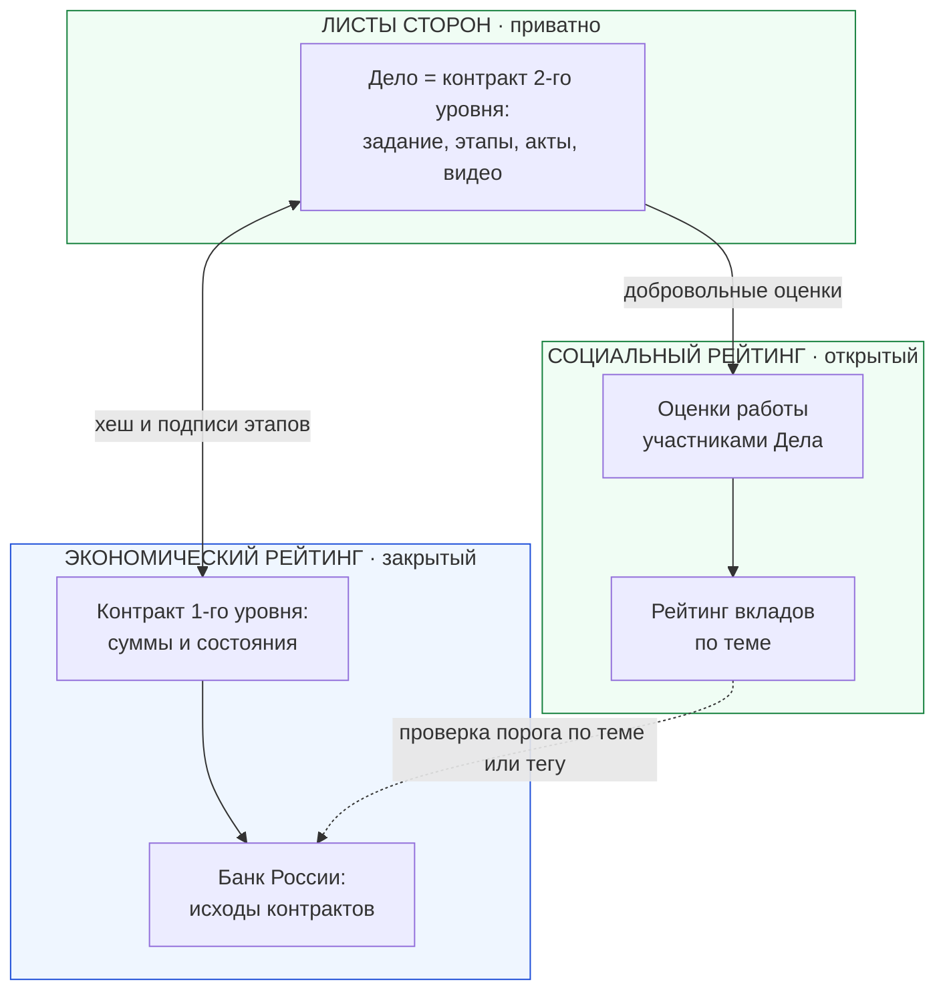

# «Деловой» как связной узел рейтингов: Дела, контракты второго уровня и теги

> **Категория:** [Прикладной стек (Applications Suite)](../README.md) · Фокусированный документ (шаг 3 из 3)  
> **Автор архитектуры:** Артём Владимирович Шамсутдинов  
> **Статус:** проектная концепция; сроки реализации не указываются и зависят от материальной поддержки, команды и времени  
> **Связанные документы:**  
> • [../votecube/VoteCube_Role_in_Rating_Infrastructure.md](../votecube/VoteCube_Role_in_Rating_Infrastructure.md) — шаг 1: «КубГолос»  
> • [../sapoto/Sapoto_Role_in_Rating_Infrastructure.md](../sapoto/Sapoto_Role_in_Rating_Infrastructure.md) — шаг 2: «Забота»  
> • [GoGetter_architecture_and_functionality.md](GoGetter_architecture_and_functionality.md) — разделы 9 и 10  
> • [../sapoto/Sapoto_architecture_and_functionality.md](../sapoto/Sapoto_architecture_and_functionality.md) — разделы 5.3 и 5.4

---

## 1. Назначение документа

«КубГолос» даёт форму оценки и счётчики, «Забота» даёт вклады и треды. «Деловой» замыкает цепочку: именно в нём Дело может стать **живым контрактом второго уровня** между сторонами. Этот контракт связан с публичным контрактом первого уровня на платформе Банка России. Поэтому Дело становится **связным узлом**, где социальные рейтинги соединяются с экономическими: сведения о проведённой работе остаются у сторон, суммы и состояния уходят в систему Банка России, а оценки работы попадают в открытый рейтинг по теме.

Кроме того, «Деловой» даёт **теги**, с помощью которых рейтинг можно собрать по нескольким темам сразу.

Документ подаётся как свод идей. Часть из них проектируется для России, но может пригодиться и в других ситуациях.

## 2. Что «Деловой» даёт рейтингам

| Строительный блок | Что это | Зачем он рейтингам |
|---|---|---|
| Дело как контракт второго уровня | Приватное хранилище сторон: задание, этапы, акты, видео приёмки | Вся информация о проведённой работе остаётся у сторон и не уходит на Ветки |
| Связь с контрактом первого уровня | Публичный автомат на платформе Банка России: формула, суммы, состояния | Исход контракта попадает в систему Банка России, где ведётся экономический рейтинг |
| Оценка работы участниками Дела | Микро-опросы КубГолоса, привязанные к Делу или Задаче (группа опросов) | Социальная составляющая: добровольные отзывы по темам и факторам, как в современных системах отзывов |
| Голосование только участников Дела | Вес голоса определяется составом дела | Защита от посторонних оценок |
| Связь Дела со Случаем | Соединительная сущность между Делом и Случаем «Заботы»; общественный Случай порождает пример Дела | Социальный и действенный слой связаны: решение из треда превращается в Дело, а результат возвращается в тред как Опыт |
| Теги | Метки на уровне личных, семейных и групповых хранилищ; в перспективе общественные теги | Позволяют собрать рейтинг по нескольким темам и сообщить Банку России темы контракта |
| Срок и исполнение | Этапы, сроки, подписанные акты | Внешние свидетельства для социального рейтинга: закрытое Дело, подписанный акт |

## 3. Как Дело связывает два рейтинга

1. Стороны создают приватное Дело и связывают его с публичным контрактом первого уровня.
2. Банку России сообщаются темы или теги контракта; он может учесть социальный рейтинг по теме как дополнительный вход при проверке с согласия пользователя.
3. Этапы закрываются подписанными актами; переходы автомата и выплаты проходят на стороне Банка России.
4. По итогам участники добровольно оценивают работу; оценки идут в социальный рейтинг вклада по теме.
5. Исход контракта фиксируется у Банка России и входит в экономический рейтинг. «Деловой» этот рейтинг не рассчитывает и не публикует.

## 4. Теги

Теги пока описываются без технических деталей.

- **Сегодня.** Теги ставятся и используются на Листах пользователей, семей и групп через хранилища с деревом поиска. Когда хранилище становится большим, создаются дополнительные хранилища с поддеревьями. Пользователи, семьи и группы могут добавлять теги и к общественным хранилищам в своих тегах.
- **Назначение для рейтингов.** Тег позволяет собрать срез рейтинга, если он охватывает несколько тем, и сообщить Банку России темы контракта. Спуск от общего рейтинга по теме к хранилищам и приложениям, где оценка поставлена, выполняется через теги в режиме Листа.
- **Перспектива.** Предусматриваются общественные теги. Общая идея: сервер древовидного по времени листинга, позволяющий искать по дереву любую дату, и сборка тегов на специализированных серверах, начиная с самых малочисленных тегов и переходя к более крупным; запрос передаёт накопленный результат предыдущих фильтров следующему серверу тега. Предполагается, что это делается децентрализованно артелями провайдеров тегов. Детали проектирования в этот документ не входят.

## 5. Границы роли «Делового»

- Экономический (кредитный) рейтинг ведёт Банк России; он закрыт и выдаётся только с согласия пользователя на конкретную проверку. Ответ контрагенту определяется законом.
- Контракт второго уровня хранит всю информацию, кроме обменных сумм; платформа без экономики существует, но двухуровневые контракты без неё невозможны.
- Приватные контракты могут оставаться в частных хранилищах; параллельные частные структуры (банки, крупный бизнес) допускаются в рамках закона.
- Риск подбора порога проверки повторными запросами и юридические рамки приватных структур прорабатываются отдельно.

## 6. Что получается в сумме

| Слой | Приложение | Что готово после этого шага |
|---|---|---|
| Оценка и счётчики | «КубГолос» | Форма оценки, суммы на Ветках, агрегация вверх |
| Вклады и просмотр | «Забота» | Треды, голосование, страницы, спуск к источнику |
| Связь рейтингов | «Деловой» | Контракты второго уровня, группы опросов, теги |

Вместе они создают техническую основу, на которой становятся возможными открытый социальный рейтинг вкладов и его использование наряду с закрытым экономическим рейтингом Банка России.

## 7. Открытые вопросы

- Технические детали общественных тегов и серверов тегов; состав и правила артелей провайдеров тегов.
- Параметры проверки порога по теме или тегу и меры против подбора порога.
- Юридическая оценка рейтингов на основе исходов контрактов, а также приватных структур.

## 8. Источники

Авторские заметки: «Деловой» (разделы «Теги», «Интеграция с КубГолосом», «Интеграция с Заботой», «Контракты второго уровня»), «Экономический потенциал», «Смарт контракты»; `GoGetter_architecture_and_functionality.md`: разделы 9.1, 9.2, 9.4, 10.1–10.3.
