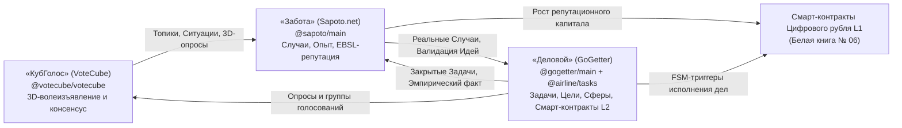
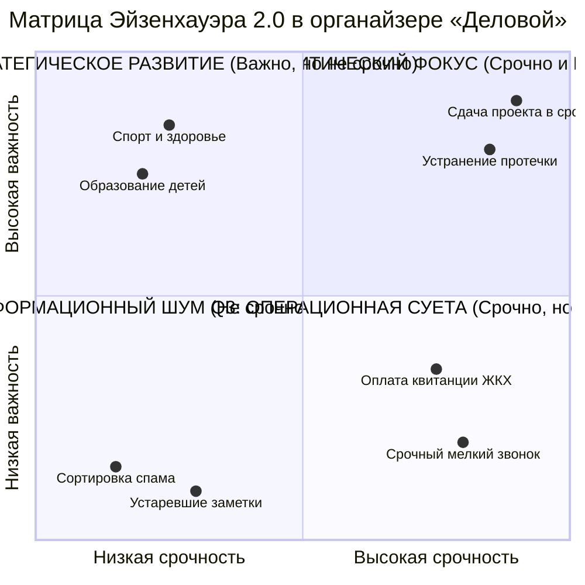
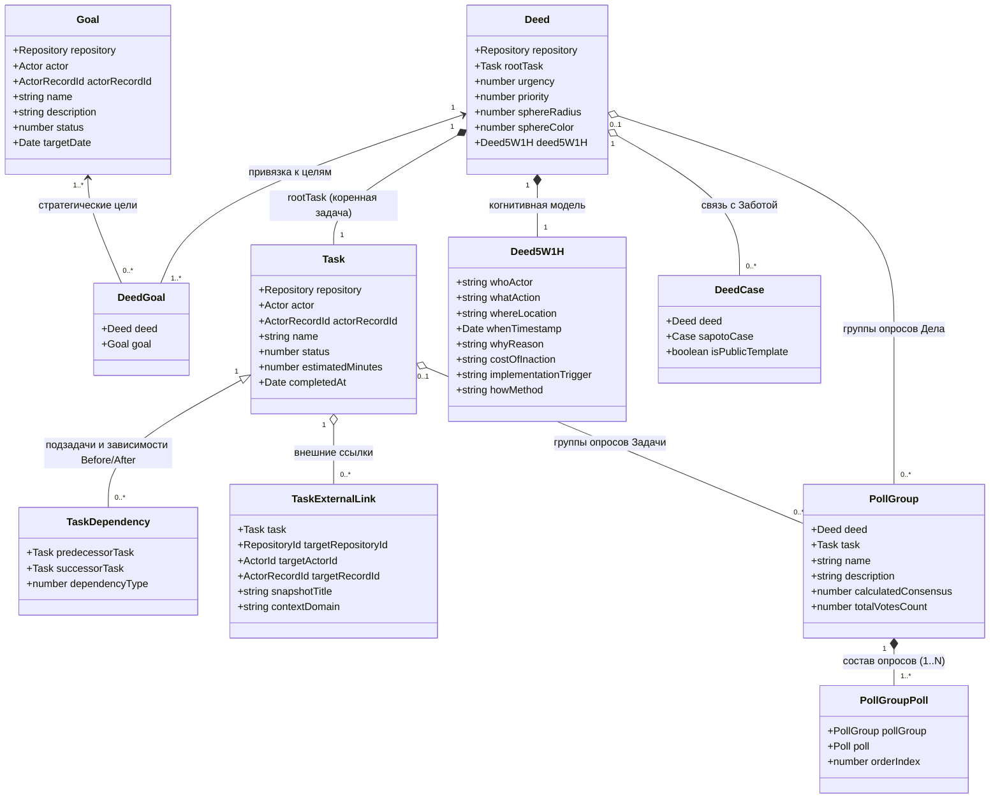
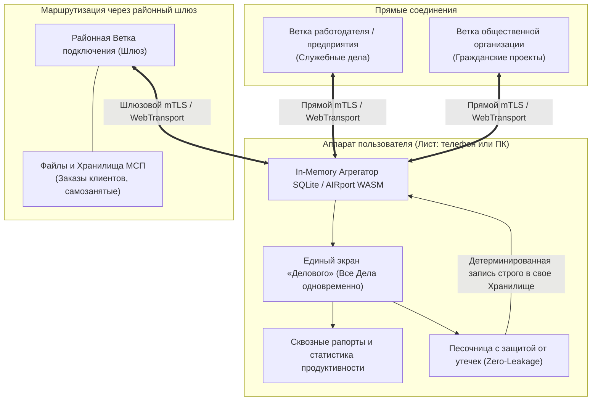
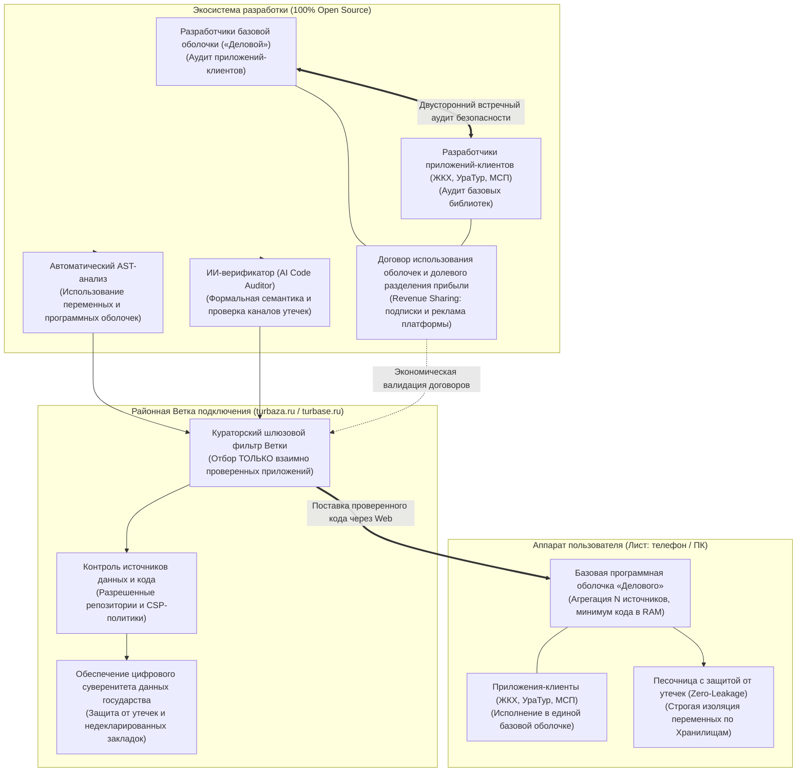
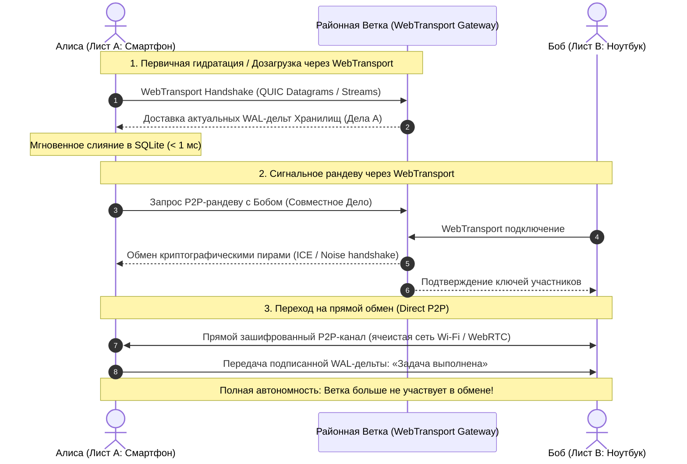
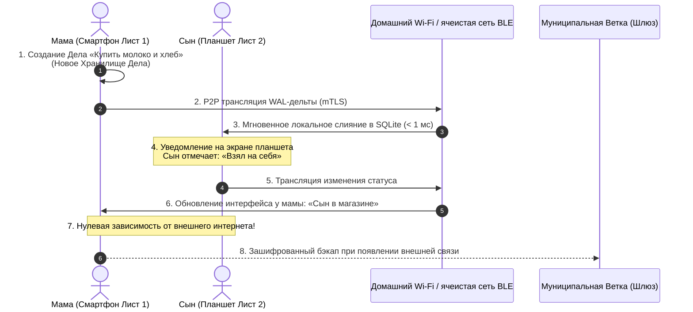
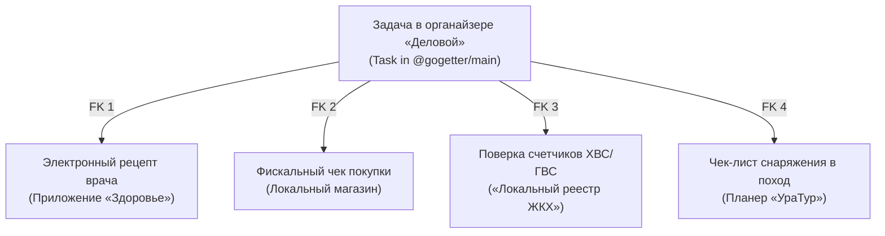
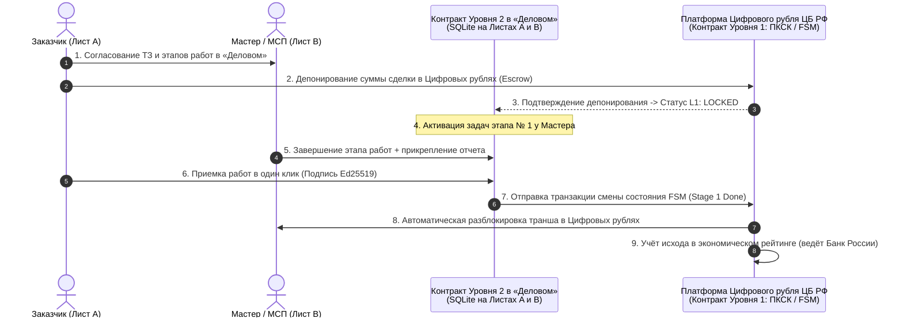
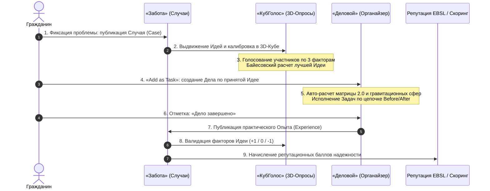

# Архитектура и функциональная спецификация органайзера «Деловой» (GoGetter)

*Классификация: Нормативная архитектурно-функциональная спецификация прикладного уровня, Data Independence Network (DIN)*  
*Концептуальный автор платформы и архитектор: Артём Владимирович Шамсутдинов*  
*Связанные спецификации: [`../sapoto/Sapoto_architecture_and_functionality.md`](file:///Users/parents/Documents/presentations/shared_docs/whitepapers/applications/sapoto/Sapoto_architecture_and_functionality.md), [`../votecube/VoteCube_architecture_and_functionality.md`](file:///Users/parents/Documents/presentations/shared_docs/whitepapers/applications/votecube/VoteCube_architecture_and_functionality.md), [`../../06_cbr_smart_contracts_fsm_whitepaper.md`](file:///Users/parents/Documents/presentations/shared_docs/whitepapers/06_cbr_smart_contracts_fsm_whitepaper.md)*

---

## 1. Концепция, философия и системная миссия

### 1.1. Проблема традиционных таск-менеджеров
Современные коммерческие системы управления задачами (таск-менеджеры, персональные трекеры и облачные календари) страдают от трех системных проблем:
1. **Балласт отложенных дел и бремя выбора:** Линейные списки дел бесконечно разрастаются, сваливая в одну кучу стратегические цели, бытовые хлопоты и рутину. Неструктурированный объем задач подавляет волю пользователя, порождает прокрастинацию, чувство вины и приводит к забрасыванию инструмента через несколько недель.
2. **Хранение данных на серверах поставщика:** Облачные сервисы хранят на серверах поставщика подробный контекст жизни человека: визиты к врачам, расписание детей, финансовые обязательства, юридические споры и коммерческие планы. Защита этих данных зависит от поставщика, а любая утечка затрагивает много пользователей сразу.
3. **Уязвимость облака и блокировка при обрыве связи:** При отсутствии интернет-соединения (в метро, самолетах, подвалах или при авариях связи) доступ к графику блокируется. Кроме того, централизованные аккаунты уязвимы к односторонним блокировкам и отзыву лицензий.

### 1.2. Миссия органайзера «Деловой» (GoGetter)
**«Деловой» (GoGetter)** — это интеллектуальный автономный органайзер личных, семейных и деловых задач, построенный на базе трехуровневой архитектуры платформы цифрового суверенитета данных **«Турбаза»** (Data Independence Network, DIN):
- **100% локальная автономия и данные у владельца:** База данных задач хранится исключительно на локальном устройстве пользователя (**Листе**) в реляционной СУБД SQLite / AIRport WASM. На внешние серверы не передается ни одного байта персональных планов.
- **Сверхбыстрый локальный отклик:** Любые выборки, фильтрации, пересчеты гравитационных полей и поиск по тегам выполняются в оперативной памяти устройства за время менее **1 миллисекунды** ($< 1$ мс).
- **Когнитивный комфорт:** Преодоление ступора выбора за счет объединения пятибалльной **Матрицы Эйзенхауэра 2.0**, физического кинетического интерфейса **«Гравитационные сферы» (Gravity Balls)** и алгоритма управляемой случайности **«Случайный шаг» (Serendipity Task)**.
- **Двусторонняя связность и открытый API:** Задачи не дублируют информацию, а ссылаются на первичные источники (медицинские рецепты, кассовые чеки, билеты, коммунальные поверки) через композитные внешние ключи.
- **Базис для смарт-контрактов Уровня 2:** Дело выступает живым исполнительным контрактом между двумя или несколькими сторонами, управляющим FSM-переходами в смарт-контрактах Цифрового рубля Банка России.

### 1.3. Положение в экосистеме Data Independence Network (DIN)
«Деловой» замыкает фундаментальную триаду системообразующих приложений платформы:

$$\text{«КубГолос» (VoteCube)} \longleftarrow \text{«Забота» (Sapoto.net)} \longleftarrow \text{«Деловой» (GoGetter)}$$



### 1.4. Главное системное преимущество: слияние данных из разнородных источников на аппарате пользователя
Одно из фундаментальных преимуществ архитектуры «Турбазы» в целом и органайзера «Деловой» в частности заключается в **способности агрегировать и объединять данные из принципиально разнородных источников непосредственно на клиентском устройстве (смартфоне или ПК) пользователя**:
- **Преодоление фрагментации и «колодцев данных» (Data Silos):** В традиционной цифровой среде рабочий таск-трекер работодателя (Jira/Asana), семейные чаты в мессенджерах, заказы клиентов малого бизнеса и общественные поручения разорваны по изолированным коммерческим платформам. Пользователь вынужден постоянно переключать контекст между десятками несовместимых сервисов.
- **Единый экран всех дел человека:** «Деловой» отображает все задачи, обязательства и проекты конкретного человека на одном экране одновременно. Вся информация находится в единой когнитивной среде, что позволяет сопоставлять приоритеты, вести сквозное планирование и формировать целостную аналитику личной продуктивности и баланса жизни.
- **Изоляция на уровне Хранилищ:** Это объединение реализуется благодаря тому, что каждое отдельное Дело или сфера обязательств хранится в своем собственном независимом Хранилище «Турбазы», криптографически изолированном и защищенном индивидуальным ключом шифрования.
- **Обработка в оперативной памяти и детерминированная обратная запись:** Пользователь получает все свои Дела со всех авторизованных источников, сводит их воедино в локальной оперативной памяти своего Листа, обрабатывает, расставляет приоритеты, вносит изменения и затем детерминированно рассылает обновленные дельты изменений строго по соответствующим Хранилищам без малейшего риска перекрестных утечек данных.
- **Универсальная программная оболочка и работа с произвольным числом источников:** Архитектура «Делового» изначально спроектирована для взаимодействия с неограниченным количеством независимых Хранилищ. Его программная оболочка (Application Shell) выступает базовым исполняемым ядром, которое используется другими прикладными модулями экосистемы. Это сокращает объем исполняемого кода в оперативной памяти Листа и обеспечивает непрерывный перекрестный аудит каждого изменения со стороны сообщества разработчиков.
- **100% открытый исходный код (Open Source):** В соответствии с фундаментальным замыслом платформы «Турбаза», весь исходный код «Делового» и связанных приложений полностью открыт. Это обеспечивает предельную прозрачность, невозможность скрытых закладок и служит ключевой опорой государственного цифрового суверенитета данных.

---

## 2. Когнитивный фреймворк: модель 5W1H, Матрица 2.0 и угасание приоритета

### 2.1. Структурирование дела через вопросы 5W1H и когнитивное сито истинной важности
Вместо абстрактной текстовой строки каждое Дело в приложении связывается с классической формулой **5W1H**. В архитектуре «Делового» вопросы 5W1H — это не бюрократическое заполнение форм, а активное **когнитивное сито**, помогающее человеку всесторонне осмыслить задачу и выявить **настоящую внутреннюю заинтересованность**:
1. **Кто? (Who):** Ответственный исполнитель, соисполнители или делегаты (приватный идентификатор пользователя, член семьи или партнер).
2. **Что? (What):** Суть действия, ожидаемый осязаемый артефакт или конечный результат.
3. **Где? (Where):** Пространственно-географическая привязка (координаты, адрес, помещение, ссылка на виртуальную комнату).
4. **Когда? (When):** Временной интервал, предельный срок сдачи, периодичность или событие-триггер.
5. **Зачем? / Почему? (Why):** Стратегическое обоснование, глубинная ценностная мотивация и привязка к родительской Цели (`Goal`).
6. **Как? (How):** Методология исполнения, контрольный список (чек-лист), требуемые ресурсы или прикрепленный канонический шаблон из «Заботы».

#### 2.1.1. Сократический диалог по вопросу «Зачем?» (Декомпозиция «5 Почему»)
Если у пользователя нет искренней заинтересованности в завершении дела, оно не будет выполнено ни при каких сроках. Для выявления подлинной мотивации интерфейс 5W1H включает Сократический диалог:
- Система предлагает последовательно ответить на вопрос: *«Зачем мне это делать?»* с углублением на 2–3 шага.
- Если в процессе осмысления выясняется, что задача навязана извне, продиктована сиюминутным раздражением или не имеет реальной ценности, пользователь может отсечь её сразу, сохранив личную энергию.

#### 2.1.2. Тест «Цена бездействия» (Cost of Inaction)
Обязательный фильтр осознанности: вопрос *«Что реально произойдет в моей жизни или работе, если я вообще никогда не сделаю это Дело?»*:
- Если честный ответ: *«Ничего критического не случится»*, мнимая важность дела немедленно обнуляется.
- Человек осознанно отказывается от самообмана и псевдо-обязательств без чувства вины.

#### 2.1.3. Формула «Если — То» (Implementation Intentions)
Вопросы «Где», «Когда» и «Как» связываются с физическим контекстом окружения по методике Питера Гольвитцера:
$$\text{«ЕСЛИ наступит [Время / Событие] И я окажусь в [Место], ТО я сделаю [Действие]»}$$
Формирование такой связки уменьшает неопределённость. В лабораторных исследованиях конкретный план вида «если случится X, я сделаю Y» заметно повышал долю выполненных целей, особенно сложных: по Gollwitzer и Brandstätter (1997) сложные цели выполнялись примерно втрое чаще, а по обзору Gollwitzer и Sheeran (2006) средний эффект составил d = 0,65.

### 2.2. Пятибалльная шкала Срочности и Важности/Приоритета
Каждое Дело и Задача наделяются двумя ортогональными дискретными координатами от $0$ до $4$ (шкала из 5 баллов):
- **Срочность ($U \in \{0, 1, 2, 3, 4\}$):** Мера внешнего временного давления. $0$ — срок не определен; $4$ — критический неотложный срок сегодня.
- **Важность / Приоритет ($P \in \{0, 1, 2, 3, 4\}$):** Мера стратегического влияния на жизнь, семью или бизнес. $0$ — тривиальная рутина или фоновый шум; $4$ — жизненно важный фактор развития.

### 2.3. Квадранты Матрицы Эйзенхауэра 2.0
Координатная пара $(U, P)$ классифицирует дело по четырем классическим квадрантам:

| Квадрант | Условие ($U, P$) | Семантическая роль | Рекомендуемая стратегия |
| :--- | :--- | :--- | :--- |
| **Q1: Критический фокус** | $U \ge 2, \; P \ge 2$ | **Срочно и Важно**: горящие сроки, аварии, ключевые сделки. | Выполнить немедленно лично. |
| **Q2: Стратегическое развитие** | $U < 2, \; P \ge 2$ | **Не срочно, но Важно**: здоровье, дети, стратегические проекты. | Защитить от вытеснения рутиной. |
| **Q3: Операционная суета** | $U \ge 2, \; P < 2$ | **Срочно, но Не важно**: бытовой шум, внезапные рутинные звонки. | Делегировать или автоматизировать. |
| **Q4: Информационный шум** | $U < 2, \; P < 2$ | **Не срочно и Не важно**: второстепенные мысли, устаревшие идеи. | Архивировать без чувства вины. |



### 2.4. Эволюция парадигмы: угасание Приоритета просроченных дел (Overdue Priority Decay)
Фундаментальный ответ «Делового» на проблему накопления балласта отложенных дел и тягостного бремени выбора:
- **Опыт оригинального прототипа:** В прототипе использовался принцип роста Срочности ($U$) по мере приближения предельного срока задачи. Однако практика показала: если дело не обладает подлинной важностью для человека, искусственное нагнетание срочности не приводит к его выполнению. Просроченные задачи скапливаются тревожным грузом, вызывая психологическое отторжение и непосильное бремя выбора.
- **Финальная архитектура по умолчанию:** В финальной версии «Делового» по умолчанию реализован **принцип уменьшения Приоритета (Важности $P$) дела по мере его просроченности**!
- **Психологическое обоснование:** Если предельный срок сдачи дела прошел, а жизнь продолжается без катастрофических последствий, реальная маржинальная ценность этого дела для человека объективно снизилась. Сохранение за ним статуса «сверхважного» лишь генерирует фрустрацию. Угасание приоритета признает объективную реальность и освобождает внимание.

#### 2.4.1. Математическая модель спада с периодом полураспада
При наступлении просрочки $t > T_{\text{deadline}}$ Приоритет $P(t)$ плавно уменьшается по экспоненциальному закону с настраиваемым периодом полураспада $T_{1/2}$:

$$P(t) = \begin{cases} 
P_{\text{base}}, & t \le T_{\text{deadline}} \\ 
\max\left(0, \; \left\lfloor P_{\text{base}} \cdot \exp\left( - \frac{\ln 2}{T_{1/2}} \cdot (t - T_{\text{deadline}}) \right) \right\rfloor\right), & t > T_{\text{deadline}} 
\end{cases}$$

#### 2.4.2. Настраиваемые пользователем скоростные режимы угасания
Пользователь может гибко управлять скоростью угасания Приоритета:
1. **Быстрый режим ($T_{1/2} = 24$ часа):** Для оперативных бытовых задач, теряющих смысл уже на следующий день;
2. **Стандартный режим по умолчанию ($T_{1/2} = 72$ часа / 3 дня):** Оптимальный баланс для рабочих и семейных дел;
3. **Плавный режим ($T_{1/2} = 168$ часов / 7 дней):** Для фундаментальных проектов с запасом маневра;
4. **Фиксированный режим ($T_{1/2} = \infty$):** Отключение автоматического угасания для юридических и налоговых обязательств с жесткими внешними штрафами.

### 2.5. Судьба задач с угасшим приоритетом ($P = 0$) и экологичная архивация
Когда в результате длительной просрочки приоритет дела угасает до нуля ($P=0$):
- В интерфейсе «Гравитационные сферы» шар сжимается до минимального радиуса ($R \to R_{\min}$), теряет цветовую насыщенность (становится полупрозрачным) и вытесняется другими активными сферами на дальнюю периферийную орбиту дисплея, полностью освобождая центр внимания.
- При нажатии на угасшую сферу система не выдает обвиняющих предупреждений. Вместо этого открывается лаконичный диалог:
  1. *«Актуализировать срок и подтвердить важность»* — сбрасывает таймер, запускает короткий опрос 5W1H и возвращает исходный приоритет $P_{\text{base}}$;
  2. *«Архивировать в один клик»* — перемещает дело в архив без чувства вины, фиксируя освобождение ментального ресурса человека.

### 2.6. Механизмы поддержания интереса, вовлеченности и социальной ответственности
1. **Социальная прозрачность в Семейном круге и артелях:**
   - Статусы поручений (*«Взял на себя»*, *«Купил»*, *«Сделано»*) обновляются в реальном времени в Хранилище соответствующего семейного Дела.
   - Прозрачность исключает бытовые препирательства и создает естественную социальную ответственность перед близкими без морального давления.
2. **Психологический микро-импульс «Первые 15 минут» (Serendipity Task):**
   - Алгоритм «Случайный шаг» берет на себя мучительный груз выбора и фокусирует человека на одном деле: *«Посвятите этому делу первые 15 минут»*.
   - Психологический порог старта минимален, и начатая работа чаще доводится до результата; численной оценки здесь не приводится.

---

## 3. Кинетический визуальный интерфейс «Гравитационные сферы» (Gravity Balls)

### 3.1. Физическая концепция внимания
Интерфейс «Гравитационные сферы» переводит абстрактную математическую оценку задач в наглядную физическую 2D-симуляцию. Вместо монотонного чтения списков человеческий мозг задействует пространственно-зрительную кору:
- Каждая задача моделируется в виде упругой физической частицы-сферы (Ball).
- В центре экрана создается виртуальный гравитационный аттрактор.
- Размер шара задается стратегической Важностью/Приоритетом ($P$), а его цвет — Срочностью ($U$) и квадрантом.

```
       +-------------------------------------------------------------+
       |                                                             |
       |             ( Q4 )                        ( Q2 )            |
       |                                    +-----------------+      |
       |                                   /                   \     |
       |                                  |   Важное дело       |    |
       |                                  |   P=4, U=1          |    |
       |                                   \                   /     |
       |                                    +-----------------+      |
       |                                       |                     |
       |                                       | F_center            |
       |                                       v                     |
       |                             +-----------------+             |
       |                            /    ГРАВИТАЦИОННЫЙ \            |
       |                           |      ЦЕНТР ЭКРАНА   |           |
       |                            \   (Q1: Критичные) /            |
       |                             +-----------------+             |
       |                                       ^                     |
       |                                       | F_center            |
       |                                       |                     |
       |                       +---------+                           |
       |                      /  Q3 дело  \                          |
       |                      \  P=1, U=3 /                          |
       |                       +---------+                           |
       |                                                             |
       +-------------------------------------------------------------+
```

### 3.2. Математическая модель движения и взаимодействия частиц
Для каждой сферы $i \in \{1, \dots, N\}$ определены радиус $R_i(t)$, масса $M_i(t)$, текущее положение $\mathbf{x}_i = (x_i, y_i)^T$ и скорость $\mathbf{v}_i = (v_{x, i}, v_{y, i})^T$:

$$R_i(t) = R_{\min} + \alpha_R \cdot P_i(t), \quad M_i(t) = \pi R_i(t)^2 \cdot \rho$$

*Динамика угасания сферы:* При наступлении просрочки срока ($t > T_{\text{deadline}}$) значение приоритета $P_i(t)$ угасает по экспоненциальному закону. Радиус сферы $R_i(t)$ физически сжимается до микро-точки $R_{\min}$, её масса $M_i(t)$ и центральное притяжение падают, а соседние активные сферы выталкивают угасший шар на внешнюю периферийную орбиту экрана.

Полная результирующая сила $\mathbf{F}_i$, приложенная к сфере $i$, складывается из трех составляющих:

$$\mathbf{F}_i = \mathbf{F}_{\text{center}, i} + \sum_{j \neq i} \mathbf{F}_{\text{repulse}, ij} + \mathbf{F}_{\text{drag}, i}$$

#### 3.2.1. Гравитационное притяжение к центру экрана
Центральная гравитационная сила притягивает сферу к центру экрана $\mathbf{x}_0 = (x_0, y_0)^T$. Сила усиливается с ростом срочности $U_i$ и важности $P_i$:

$$\mathbf{F}_{\text{center}, i} = - k_{\text{center}} \cdot (1 + \beta_U \cdot U_i + \beta_P \cdot P_i) \cdot (\mathbf{x}_i - \mathbf{x}_0)$$

#### 3.2.2. Модифицированное кулоновско-упругое отталкивание сфер
Чтобы сферы не накладывались друг на друга и не слипались в одну точку, между ними действует короткодействующая сила упругого отталкивания. Для пары сфер $(i, j)$ с расстоянием $r_{ij} = \|\mathbf{x}_i - \mathbf{x}_j\|$ и единичным вектором $\hat{\mathbf{r}}_{ij} = \frac{\mathbf{x}_i - \mathbf{x}_j}{r_{ij}}$:

$$\mathbf{F}_{\text{repulse}, ij} = \begin{cases} 
k_{\text{overlap}} \cdot (R_i + R_j - r_{ij}) \cdot \hat{\mathbf{r}}_{ij}, & \text{если } r_{ij} < R_i + R_j \quad (\text{контактное сжатие}) \\ 
k_{\text{field}} \cdot \frac{(R_i + R_j)^2}{r_{ij}^2 + \epsilon} \cdot \hat{\mathbf{r}}_{ij}, & \text{если } R_i + R_j \le r_{ij} \le D_{\text{cutoff}} \\ 
0, & \text{если } r_{ij} > D_{\text{cutoff}} 
\end{cases}$$

#### 3.2.3. Вязкое сопротивление среды (гидродинамическое трение)
Для демпфирования колебаний и достижения равновесного квазистатического состояния вводится сила сопротивления, пропорциональная скорости:

$$\mathbf{F}_{\text{drag}, i} = - \gamma \cdot \mathbf{v}_i$$

#### 3.2.4. Численный интегратор движения (Velocity Verlet)
Обновление координат и скоростей выполняется по полунеявной симплектической схеме Верле с фиксированным шагом дискретизации по времени $\Delta t \approx 16.6$ мс ($60$ fps):

$$\mathbf{v}_i\left(t + \frac{\Delta t}{2}\right) = \mathbf{v}_i(t) + \frac{\mathbf{F}_i(t)}{M_i} \cdot \frac{\Delta t}{2}$$

$$\mathbf{x}_i(t + \Delta t) = \mathbf{x}_i(t) + \mathbf{v}_i\left(t + \frac{\Delta t}{2}\right) \cdot \Delta t$$

$$\mathbf{v}_i(t + \Delta t) = \mathbf{v}_i\left(t + \frac{\Delta t}{2}\right) + \frac{\mathbf{F}_i(t + \Delta t)}{M_i} \cdot \frac{\Delta t}{2}$$

### 3.3. Элемент случайности и динамика открытия экрана
При каждом открытии экрана гравитационных сфер запускается анимация входа:
1. Сферы появляются на случайных позициях вдоль внешнего периметра экрана с легким начальным импульсом, направленным в сторону центра.
2. Вектор начального позиционирования включает генератор криптографически стойких псевдослучайных чисел (CSPRNG): $\mathbf{x}_{\text{init}} = \mathbf{x}_{\text{border}} + \boldsymbol{\xi}$, где $\boldsymbol{\xi} \sim \mathcal{N}(0, \sigma^2)$.
3. Первыми к центру притягиваются сферы с максимальной срочностью ($U=4$) и приоритетом ($P=4$), вытесняя второстепенные шары на периферию.
4. Из-за динамического взаимодействия отталкивания и нелинейной физики конечное квазиравновесное положение сфер никогда не повторяется в точности. Это создает живой, интерактивный визуальный отклик и мгновенно вовлекает внимание человека.

### 3.4. Принцип «Фокус после выбора» (Details on Demand)
Во избежание когнитивной перегрузки на самих сферах в спокойном состоянии отображаются только краткие цвето-графические маркеры (иконка категории, номер и индикатор прогресса подзадач). Детальное описание задачи, список подзадач, 5W1H-поля и чеки открываются во всплывающей карточке только в момент прямого нажатия на сферу. Пользователь сначала интуитивно выбирает шар по его физическому масштабу и цвету, и лишь затем погружается в подробности.

### 3.5. Алгоритм «Случайный шаг» (Serendipity Task Engine)
Для снятия тягостного бремени выбора (когда список дел в $Q1$ и $Q2$ слишком велик и человек не может решиться, за что взяться) реализован алгоритм **«Случайный шаг»**:
1. Формируется пул актуальных задач: $\mathcal{S}_{\text{active}} = \{T_k \mid T_k \in Q1 \cup Q2, \; \text{status}(T_k) = \text{READY}\}$.
2. Каждой задаче присваивается вес вероятности выборки, пропорциональный приоритету и срочности:
   $$w_k = (P_k + 1)^2 \cdot (U_k + 1)$$
3. Нормализованная вероятность выбора задачи $T_m$:
   $$\mathbb{P}(T_m) = \frac{w_m}{\sum_{j \in \mathcal{S}_{\text{active}}} w_j}$$
4. Генератор выбирает одну задачу $T^* \sim \mathbb{P}(T)$, экран затемняет остальные сферы и фокусирует камеру на выбранном шаре, выводя таймер микро-сессии: *«Посвятите этому делу первые 15 минут»* вместе со связкой триггеров «Если — То» (Где и Когда начать из карточки 5W1H). Психологический барьер первого шага снимается, так как груз выбора берет на себя беспристрастный алгоритм, а компактный 15-минутный интервал включает закон инерции внимания: в 9 из 10 случаев начатая работа успешно доводится до завершения.

---

## 4. Двухуровневая модель схем данных и антимонопольная композиция в RAM

### 4.1. Архитектурный принцип антимонопольной композиции: Дело как объединение Целей и коренной Задачи
В закрытых корпоративных экосистемах разработчики монополизируют структуры данных, навязывая монолитные проприетарные форматы. В платформе «Турбаза» принят фундаментальный принцип **антимонопольной нормализованной композиции**:
- **Базовый открытый уровень (`@airline/tasks` / `@airline/goals`):** Универсальные открытые примитивы стратегических целей (`Goal`), атомарных операционных задач (`Task`) и причинно-следственных зависимостей (`TaskDependency`). Этот уровень общедоступен для любых сторонних приложений экосистемы.
- **Прикладной уровень («Деловой» — `@gogetter/main`):** Центральная доменная сущность — **Дело (`Deed`)**. Каждое Дело размещается в собственном криптографически изолированном Хранилище («Турбаза» `Repository`).
- **Смысловая и структурная роль Дела:** Дело выступает конструкцией более высокого порядка, которая объединяет:
  1. **Коренную Задачу (`rootTask: Task`):** Ссылку на корневую задачу базовой схемы `@airline/tasks`. Коренная Задача может ветвиться на произвольное число под-задач (декомпозиция, чек-листы и причинно-следственные связи через `TaskDependency`), позволяя Делу организовывать под собой структурированное дерево или направленный ациклический граф Задач;
  2. **Одну или несколько Целей (`Goal`):** Связь Дела с родительскими стратегическими ориентирами и ценностями базовой схемы (через соединительную сущность `DeedGoal`);
  3. **Когнитивный каркас 5W1H (`Deed5W1H`):** Сократический диалог «Зачем?», тест цены бездействия и связку контекста «Если — То»;
  4. **Кинетические параметры внимания:** Динамическую срочность ($U$), важность/приоритет ($P$), экспоненциальное угасание ($T_{1/2}$) и гравитационные координаты.
- **Преобразование (повышение) подзадачи в полноправное Дело (Subtask Promotion):**
  Архитектура «Делового» позволяет пользователю взять любую под-Задачу внутри существующего Дела и в один клик повысить её статус до полноправного самостоятельного Дела (`Deed`). При таком преобразовании:
  - Выделенная подзадача становится коренной Задачей (`rootTask`) вновь создаваемого Дела;
  - Новому Делу выделяется собственное независимое Хранилище («Турбаза» `Repository-per-Deed`) с уникальным ключом шифрования;
  - Новое Дело наследует или связывается с родительской Целью (или формирует собственный вектор целей);
  - Для нового Дела запускается независимый жизненный цикл, персональная кинетика в «Гравитационных сферах» и собственный таймер угасания приоритета.
- **Объединение в RAM Листа:** Поскольку локальная СУБД SQLite функционирует непосредственно в адресном пространстве процесса Листа (in-memory WASM / Native C), многотабличные реляционные соединения (`JOIN`) по индексам первичных ключей между Хранилищами Дел, Задач и Целей выполняются за доли микросекунды ($< 0.1$ мс). Архитектура получает все преимущества строгой нормализации и модульности без потери производительности.

> [!IMPORTANT]
> **Временный рабочий статус классов и DDL-схем (Строгий запрет в Whitepapers и презентациях):**  
> Все приводимые ниже программные описания классов TypeScript, декораторов AIRport и DDL-структур являются **временными рабочими проектными набросками** (draft architectural approximations) для внутреннего базового инженерно-технического описания платформы.  
> **Данные классы, DDL-описания и программный код КАТЕГОРИЧЕСКИ ЗАПРЕЩЕНО отображать или включать в представительские материалы: официальные Белые Книги (Whitepapers) и слайды презентаций.**  
> В публикационных документах и презентациях архитектурные решения платформы «Турбаза» и органайзера «Деловой» раскрываются исключительно на концептуальном уровне: архитектурных инвариантов, потоков данных, диаграмм состояний и социально-экономических преимуществ.



### 4.2. DDL-спецификация базового уровня (`@airline/tasks`)
*(Внимание: технический рабочий набросок для внутреннего инженерного описания; не подлежит включению в Whitepapers и презентации)*

```typescript
/**
 * ВНИМАНИЕ: Приведенные DDL-классы являются временными рабочими набросками
 * инженерной спецификации. Они СТРОЖАЙШЕ ЗАПРЕЩЕНЫ к отображению в официальных
 * Белых Книгах (Whitepapers) и презентациях.
 */
import {
    AirEntity,
    Entity,
    Table,
    ManyToOne,
    OneToMany,
    Column
} from '@airport/air-traffic-control';

/**
 * Стратегическая Цель (Goal)
 */
@Entity()
@Table({ name: 'AIRLINE_GOALS' })
export class Goal extends AirEntity {
    @Column({ name: 'NAME', nullable: false })
    name: string;

    @Column({ name: 'DESCRIPTION', nullable: true })
    description?: string;

    @Column({ name: 'STATUS', nullable: false })
    status: number; // 0=DRAFT, 1=ACTIVE, 2=COMPLETED, 3=ARCHIVED

    @Column({ name: 'TARGET_DATE', nullable: true })
    targetDate?: Date;

    @OneToMany({ mappedBy: 'goal' })
    tasks: Task[];
}

/**
 * Атомарная Задача (Task) — может выступать коренной Задачей Дела или подзадачей
 */
@Entity()
@Table({ name: 'AIRLINE_TASKS' })
export class Task extends AirEntity {
    @ManyToOne({ target: 'Goal' })
    goal?: Goal;

    @Column({ name: 'NAME', nullable: false })
    name: string;

    @Column({ name: 'STATUS', nullable: false })
    status: number; // 0=TODO, 1=READY, 2=IN_PROGRESS, 3=BLOCKED, 4=DONE

    @Column({ name: 'ESTIMATED_MINUTES', nullable: true })
    estimatedMinutes?: number;

    @Column({ name: 'COMPLETED_AT', nullable: true })
    completedAt?: Date;

    @OneToMany({ mappedBy: 'successorTask' })
    incomingDependencies: TaskDependency[];

    @OneToMany({ mappedBy: 'predecessorTask' })
    outgoingDependencies: TaskDependency[];
}

/**
 * Причинно-следственная зависимость задач (Before / After Actions / Подзадачи)
 */
@Entity()
@Table({ name: 'AIRLINE_TASK_DEPENDENCIES' })
export class TaskDependency extends AirEntity {
    @ManyToOne({ target: 'Task' })
    predecessorTask: Task; // Предшествующее действие (BeforeAction)

    @ManyToOne({ target: 'Task' })
    successorTask: Task;   // Последующее действие (AfterAction)

    @Column({ name: 'DEPENDENCY_TYPE', nullable: false })
    dependencyType: number; // 0=FINISH_TO_START, 1=START_TO_START, 2=SUBTASK
}
```

### 4.3. DDL-спецификация прикладного расширения (`@gogetter/main`)
*(Внимание: технический рабочий набросок для внутреннего инженерного описания; не подлежит включению в Whitepapers и презентации)*

```typescript
/**
 * ВНИМАНИЕ: Приведенные DDL-классы являются временными рабочими набросками
 * инженерной спецификации. Они СТРОЖАЙШЕ ЗАПРЕЩЕНЫ к отображению в официальных
 * Белых Книгах (Whitepapers) и презентациях.
 */
import {
    AirEntity,
    Entity,
    Table,
    OneToOne,
    ManyToOne,
    OneToMany,
    Column
} from '@airport/air-traffic-control';
import { Task, Goal } from '@airline/tasks';
import { Case } from '@sapoto/main';

/**
 * Дело (Deed) — центральная прикладная сущность органайзера «Деловой».
 * Каждое Дело создается в своем отдельном Хранилище (Repository-per-Deed).
 * Объединяет коренную Задачу (которая может иметь подзадачи) и Цели.
 */
@Entity()
@Table({ name: 'GOGETTER_DEEDS' })
export class Deed extends AirEntity {
    // Коренная задача Дела (ветвится на подзадачи через TaskDependency)
    @ManyToOne({ target: 'Task' })
    rootTask: Task;

    // Связь с одной или несколькими стратегическими Целями
    @OneToMany({ mappedBy: 'deed' })
    deedGoals: DeedGoal[];

    @Column({ name: 'URGENCY', nullable: false })
    urgency: number; // 0..4 (Срочность)

    @Column({ name: 'PRIORITY', nullable: false })
    priority: number; // 0..4 (Важность / Приоритет)

    @Column({ name: 'PRIORITY_DECAY_MODE', nullable: false })
    priorityDecayMode: number; // 0=DISABLED, 1=EXPONENTIAL_HALF_LIFE (Default), 2=STEP, 3=INSTANT_ZERO

    @Column({ name: 'DECAY_HALF_LIFE_HOURS', nullable: false })
    decayHalfLifeHours: number; // 24 (Быстрый), 72 (Стандартный 3 дня), 168 (Плавный 7 дней)

    @Column({ name: 'IS_SERENDIPITY_CANDIDATE', nullable: false })
    isSerendipityCandidate: boolean;

    @OneToOne({ mappedBy: 'deed' })
    deed5W1H: Deed5W1H;
}

/**
 * Соединительная сущность: связь Дела с одной или несколькими стратегическими Целями
 */
@Entity()
@Table({ name: 'GOGETTER_DEED_GOALS' })
export class DeedGoal extends AirEntity {
    @ManyToOne({ target: 'Deed' })
    deed: Deed;

    @ManyToOne({ target: 'Goal' })
    goal: Goal;
}

/**
 * Когнитивная структура вопросов 5W1H для Дела и сито осознанности
 */
@Entity()
@Table({ name: 'GOGETTER_DEED_5W1H' })
export class Deed5W1H extends AirEntity {
    @OneToOne({ target: 'Deed' })
    deed: Deed;

    @Column({ name: 'WHO_ACTOR', nullable: true })
    whoActor?: string; // Кто отвечает/делает

    @Column({ name: 'WHAT_ACTION', nullable: false })
    whatAction: string; // Что именно сделать

    @Column({ name: 'WHERE_LOCATION', nullable: true })
    whereLocation?: string; // Где (географическая метка или ссылка)

    @Column({ name: 'WHEN_DATETIME', nullable: true })
    whenDateTime?: Date; // Когда (предельный срок)

    @Column({ name: 'WHY_REASON', nullable: true })
    whyReason?: string; // Зачем / Причина (Сократический диалог)

    @Column({ name: 'COST_OF_INACTION', nullable: true })
    costOfInaction?: string; // Цена бездействия («Что будет, если не сделать никогда?»)

    @Column({ name: 'IMPLEMENTATION_TRIGGER', nullable: true })
    implementationTrigger?: string; // Связка «Если — То» (Где и Когда начать)

    @Column({ name: 'HOW_METHOD', nullable: true })
    howMethod?: string; // Как / Алгоритм (Чек-лист)
}

/**
 * Соединительная таблица ДелоСлучай между Делом и Случаем из «Заботы»
 */
@Entity()
@Table({ name: 'GOGETTER_DEED_CASES' })
export class DeedCase extends AirEntity {
    @ManyToOne({ target: 'Deed' })
    deed: Deed;

    @ManyToOne({ target: 'Case' })
    sapotoCase: Case;

    @Column({ name: 'IS_PUBLIC_TEMPLATE', nullable: false })
    isPublicTemplate: boolean; // Флаг канонического шаблона для сообщества
}

/**
 * Сквозная внешняя связь задачи с документом сторонней системы
 */
@Entity()
@Table({ name: 'GOGETTER_TASK_EXTERNAL_LINKS' })
export class TaskExternalLink extends AirEntity {
    @ManyToOne({ target: 'Task' })
    task: Task;

    // Трехколоночный реляционный внешний ключ AIRport
    @Column({ name: 'TARGET_REPOSITORY_ID', nullable: false })
    targetRepositoryId: string;

    @Column({ name: 'TARGET_ACTOR_ID', nullable: false })
    targetActorId: number;

    @Column({ name: 'TARGET_RECORD_ID', nullable: false })
    targetRecordId: number;

    @Column({ name: 'SNAPSHOT_TITLE', nullable: false })
    snapshotTitle: string; // Автономный снимок названия

    @Column({ name: 'SNAPSHOT_STATUS', nullable: true })
    snapshotStatus?: string; // Автономный статус

    @Column({ name: 'CONTEXT_DOMAIN', nullable: false })
    contextDomain: string; // 'HEALTH_PRESCRIPTION', 'RETAIL_RECEIPT', 'HOUSING_UTILITY'
}

/**
 * Сервисный контракт повышения подзадачи до самостоятельного Дела (Subtask Promotion):
 * Под-Задача выделяется в независимое Хранилище (Repository-per-Deed),
 * становится коренной задачей (rootTask) нового Дела и связывается с Целями.
 */
export interface ISubtaskPromotionService {
    /**
     * Преобразование подзадачи в самостоятельное полноправное Дело
     * @param subtask Исходная под-Задача
     * @param targetGoals Массив Целей базовой схемы для связывания с новым Делом
     * @returns Вновь созданное Дело в собственном Хранилище
     */
    promoteToDeed(subtask: Task, targetGoals?: Goal[]): Promise<Deed>;
}
```

---

## 5. Децентрализованная мульти-хранилищная агрегация, сквозная криптография и сетевой транспорт WebTransport

### 5.1. Архитектурная изоляция: каждое Дело получает свое отдельное Хранилище (Repository-per-Deed)
Фундаментальный принцип платформы «Турбаза» — децентрализация на уровне криптографических границ владения данными. Единицей изоляции, репликации, шифрования и разграничения доступа выступает **Хранилище (`Repository`)**:
- **Принцип предельной гранулярности: одно Дело — одно Хранилище (Repository-per-Deed):**
  В платформе категорически отсутствуют монолитные хранилища-агрегаторы («общее персональное хранилище для всех личных дел» или «общее семейное хранилище для всех бытовых поручений»). Вместо этого **каждое отдельное Дело (`Deed`) создается в собственном независимом Хранилище «Турбазы»**:
  - Каждое Дело шифруется своим уникальным симметричным ключом (`Repository Encryption Key`);
  - Каждое Дело обладает собственным изолированным журналом изменений (WAL);
  - Каждое Дело наделяется строго очерченным кругом авторизованных участников (акторов):
    - *Личное Дело (саморазвитие, здоровье, приватные цели):* Хранилище доступно исключительно самому владельцу (ключ известен только ему);
    - *Семейное Дело (покупка продуктов, ремонт квартиры, кружки ребенка):* Хранилище конкретного Дела разделяется между членами семьи;
    - *Служебное / производственное Дело:* Хранилище конкретной рабочей задачи создается в контуре предприятия и доступно сотруднику и коллегам по проекту;
    - *Дело-заказ субъекта МСП / самозанятого мастера:* Хранилище коммерческого соглашения объединяет только мастера и заказчика;
    - *Общественное Дело:* Хранилище конкретной гражданской инициативы открыто участникам районного сообщества.
- **Преимущества гранулярной изоляции:**
  - *Исключение утечек при совместном доступе:* Открытие доступа к одному конкретному Делу (например, передача списка покупок супругу или чертежа мастеру) физически и криптографически не дает доступа ни к каким другим Делам человека.
  - *Автономия жизненного цикла:* Каждое Дело может быть завершено, заархивировано или передано в долгосрочный архив независимо от любых других задач.
  - *Адресный контроль:* Ни один внешний участник, работодатель или сервис физически не имеет доступа к Хранилищам других жизненных контекстов гражданина.

### 5.2. Двойная топология сетевых подключений приложения Листа
Конфигурация кода платформы Листа, поставляемая от авторизованной **районной Ветки подключения**, определяет два взаимодополняющих маршрута сетевого взаимодействия:
1. **Прямое соединение с зарегистрированными Ветками предприятий и организаций:**
   - Если работодатель, крупная компания или общественная организация развернули собственную зарегистрированную Ветку «Турбазы», приложение пользователя на Листе подключается к ней напрямую через взаимно аутентифицированный mTLS-канал;
2. **Маршрутизация через собственный/районный шлюз (Gateway Routing):**
   - Для субъектов малого бизнеса (МСП), самозанятых мастеров и локальных некоммерческих инициатив развертывание и круглосуточное администрирование собственных серверов экономически нецелесообразно.
   - В архитектуре «Турбазы» такие организации хранят свои файлы и репозитории непосредственно на Ветках платформы.
   - Приложение пользователя проводит сетевые соединения к этим данным через собственный шлюз (районную Ветку подключения), что сводит инфраструктурные расходы малого бизнеса к нулю ($TCO \to 0$).



### 5.3. Единая точка сборки на аппарате и кросс-доменная аналитика
Ключевое практическое преимущество органайзера «Деловой»:
1. **Все Дела на одном экране:** Аппарат пользователя (смартфон или ПК) загружает данные из всех доступных Хранилищ, объединяет их в оперативной памяти за доли миллисекунды и формирует целостную картину обязательств человека.
2. **Совместная обработка:** Пользователь работает со всеми задачами в едином окне: распределяет дела по квадрантам Матрицы Эйзенхауэра 2.0, наблюдает за их притяжением в кинетическом интерфейсе «Гравитационные сферы», запускает таймер «Случайного шага» и выстраивает сквозные причинно-следственные связи (Before/After).
3. **Единые рапорты и статистика:** Слияние информации на Листе позволяет вычислять объективную сводную статистику:
   - Анализ распределения жизненной энергии по сферам (работа, семья, личное развитие, здоровье);
   - Интегральный процент выполнения обязательств в срок;
   - Сводные аналитические отчеты без необходимости вручную собирать разрозненные данные из закрытых корпоративных платформ.
4. **Обратная детерминированная рассылка:** При редактировании задачи или смене её статуса проверенный код Листа автоматически определяет принадлежность Дела к конкретному Хранилищу и направляет WAL-дельту строго по адресу назначения.

### 5.4. Гарантии изоляции данных на Листе и многоуровневая верификация кода (Zero-Leakage Engine)
Объединение разнородных данных на одном экране несет потенциальный риск случайного или намеренного переноса конфиденциальной информации. В архитектуре платформы «Турбаза» и органайзера «Деловой» строгое разделение информации гарантируется эшелонированной системой математического анализа, автоматической верификации и человеческого аудита:
1. **Автоматический статический анализ AST, переменных и программных оболочек (Data-Flow & Taint Analysis):**
   - Платформенный компилятор и загрузчик кода Листа проводят прекомпиляционный анализ абстрактного синтаксического дерева (AST) и потоков данных (Taint Analysis).
   - Инспектируются все переменные и программные оболочки приложений, отслеживая происхождение (`Provenance`) каждого объекта в оперативной памяти.
   - Запись информации детерминированно ограничивается контекстом того Хранилища (`Repository`), из которого была получена исходная сущность. Если переменная получена из Хранилища служебного Дела работодателя, компилятор и рантайм аппаратно и программно блокируют попытку её передачи или сохранения в Хранилище семейного или клиентского Дела.
2. **Верификация кода искусственным интеллектом (AI Code Auditing & Semantic Security):**
   - Каждая версия кода приложения, библиотеки или программной оболочки проходит обязательный автоматизированный аудит специализированными моделями искусственного интеллекта.
   - ИИ-аудитор глубоко анализирует семантику функций, выявляет потенциальные скрытые каналы утечки (Covert Channels), побочные эффекты (Side Effects), несанкционированные сетевые вызовы, недокументированные переменные и логические уязвимости.
   - Ни один модуль не допускается в каталог без сертификата формальной математической и семантической чистоты от независимых ИИ-верификаторов.
3. **Двусторонний экономически мотивированный взаимный аудит разработчиков (Bidirectional Economic Peer Review):**
   - В открытой архитектуре «Турбазы» приложения строятся по принципу модульной композиции: новые и обновляемые приложения и графические интерфейсы (UI) проходят процесс заключения **договоров на использование программных оболочек** существующих приложений.
   - Фундаментальная цель таких соглашений — **долевое разделение прибыли (Revenue Sharing)** от рекламной выручки и подписок на платформу между разработчиками базовых оболочек и разработчиками прикладных модулей.
   - Этот экономический механизм формирует мощную **двустороннюю симметричную мотивацию взаимного аудита**:
     - *Проверка «снизу вверх» (Клиент $\to$ Оболочка):* Разработчики прикладных сервисов, интегрирующие базовые оболочки (такие как оболочка «Делового») в свои решения, кровно заинтересованы в безопасности и надежности фундаментальных модулей, поскольку компрометация стороннего компонента разрушит репутацию их собственного сервиса.
     - *Проверка «сверху вниз» (Оболочка $\to$ Клиент):* Разработчики существующих базовых оболочек в равной степени **жизненно заинтересованы в тщательном аудите приложений-клиентов**, претендующих на использование их оболочки и долевое участие в прибыли. Допуск непроверенного, уязвимого или вредоносного приложения-клиента несет для создателей базовой оболочки прямые финансовые убытки, риск блокировки шлюзом Ветки подключения и утрату доли от общих подписок платформы.
   - Таким образом, взаимный аудит носит не декларативный, а жесткий экономический характер: ни одно приложение не получает права на подключение к базовой оболочке и участие в пуле доходности без встречного аудита кода обеими сторонами.



### 5.5. Кураторский контроль районной Ветки подключения и цифровой суверенитет государства
Районная Ветка подключения («Турбаза» Branch Gateway) выступает ключевым институциональным рубежом безопасности и доверенным шлюзом:
1. **Кураторский отбор приложений (Branch Gatekeeping):**
   - Ветка подключения, поставляющая код платформы и приложений пользователю на обслуживаемом ею веб-сайте (например, `turbaza.ru`, `turbase.ru` или региональных порталах), обладает исключительным правом строгого отбора.
   - Ветка допускает к развертыванию и запуску **исключительно проверенные, сертифицированные приложения**, успешно прошедшие трехзвенный аудит (статический анализ, верификацию ИИ и взаимный аудит разработчиков).
2. **Контроль за исполняемым кодом и источниками данных:**
   - Ветка жестко контролирует, какой именно код приложений имеет право обрабатывать информацию, хранящуюся на самой Ветке, и к каким внешним источникам данных разрешен доступ на подаваемом веб-интерфейсе.
   - Любые несанкционированные сетевые запросы к сторонним трекерам, внешним аналитическим серверам или непроверенным узлам отсекаются политиками безопасности Content Security Policy (CSP) и строгими сетевыми контрактами.
3. **Комплексные гарантии безопасности для граждан, семей и бизнеса:**
   - Пользователи, семейные круги, артели и коммерческие предприятия получают дополнительную уверенность в том, что запускаемое на их устройствах программное обеспечение прошло проверку и не содержит скрытых модулей, рекламных трекеров или недокументированных функций; абсолютных гарантий никакая проверка не даёт.
4. **Содействие государству в обеспечении цифрового суверенитета данных:**
   - Данный архитектурный барьер гарантирует, что данные граждан и предприятий обрабатываются строго в границах доверенного контура национального правового поля (соответствие 152-ФЗ и требованиям регуляторов), исключая трансграничную утечку метаданных и персональной информации зарубежным юрисдикциям.

### 5.6. Компонуемость программных оболочек, минимизация кода и 100% открытый исходный код
Фундаментальный принцип программной инженерии «Турбазы» — отказ от монолитного дублирования функционала в пользу компонуемых программных оболочек:
1. **Взаимное использование программных оболочек приложений (Application Shell Reuse):**
   - Приложения экосистемы не создают изолированные интерфейсы и движки с нуля. Вместо этого они используют программные оболочки друг друга как готовые композиционные строительные блоки.
2. **Оболочка «Делового» как универсальный базовый каркас:**
   - Программная оболочка органайзера «Деловой» изначально оптимизирована для **работы с произвольным количеством независимых источников информации**.
   - Другие приложения экосистемы («УраТур», «Локальный реестр ЖКХ», сервисы малого бизнеса, медицинские дневники) встраивают программную оболочку «Делового» в качестве своего базового исполнительского ядра для отображения задач, графиков, вех и чек-листов.
3. **Радикальная минимизация исполняемого кода на Листе пользователя:**
   - Вместо загрузки десятков тяжелых библиотек и дублирующих движков аппарат пользователя (смартфон или ПК) единожды загружает компактное универсальное ядро оболочки «Делового».
   - Это на порядок снижает потребление оперативной памяти, процессорного времени и аккумулятора мобильных устройств, обеспечивая мгновенный отклик даже на бюджетных смартфонах.
4. **Максимальная глубина проверки при любых изменениях:**
   - Поскольку базовая программная оболочка «Делового» используется десятками смежных приложений и затрагивает интересы сотен разработчиков, **любое изменение в её коде проходит перекрёстную проверку разработчиков зависимых приложений**.
   - Внести изменение, минуя проверку разработчиков зависимых сервисов, не получится, что повышает надёжность ядра «Делового».
5. **100% открытый исходный код (Open Source Invariant):**
   - По фундаментальному замыслу архитектора платформы «Турбаза», весь исходный код «Делового» и прикладного стека является полностью открытым (Open Source).
   - Открытый код исключает появление монопольных монолитов, вендор-лока и скрытых бэкдоров, позволяя любому независимому аудитору, эксперту или регулятору проверить архитектуру.

### 5.7. Двухуровневая сквозная криптографическая модель Хранилищ
Безопасность данных гарантируется математически на двух независимых уровнях:
1. **Симметричный ключ шифрования Хранилища (Repository Encryption Key):**
   - Каждое Хранилище шифруется собственным уникальным симметричным ключом (AES-256-GCM или XChaCha20-Poly1305).
   - Ключ хранится исключительно на авторизованных клиентских аппаратах участников Хранилища.
   - **Принцип «Невидящей Ветки»:** Промежуточная Ветка, с которой поставляется код платформы Листа и приложения, является лишь доверенным ретранслятором зашифрованных блоков. Ветка **физически не может прочитать данные** в частных, семейных, групповых и бизнес-хранилищах пользователя.
2. **Личный ключ подписи участника (Actor Signing Key):**
   - Каждый участник Хранилища подписывает каждую свою запись и операцию в журнале изменений (WAL) личным закрытым ключом (Ed25519).
   - В совместных Хранилищах дел с несколькими участниками любые изменения статусов или комментарии гарантированно и доказуемо сделаны именно заявленными лицами (*non-repudiation*), что исключает возможность подделки или компрометации журнала изменений третьими сторонами.

### 5.8. Высокоскоростной транспорт WebTransport и переход к прямому P2P
Платформа спроектирована для работы в реальном времени с минимальными сетевыми задержками:
1. **Транспорт WebTransport (HTTP/3 over QUIC):**
   - Доставка уже синхронизированных журналов изменений (WAL-дельт) между Ветками и Листьями осуществляется по протоколу WebTransport;
   - **Мгновенная первичная гидратация:** При первой загрузке Хранилища бинарный снимок и журнал изменений передаются по мультиплексированным QUIC-потокам без блокировки очереди (Head-of-Line Blocking);
   - **Сверхбыстрая до-загрузка (Reconnection Delta Catch-up):** При восстановлении сетевого подключения аппарата после нахождения в офлайне WebTransport мгновенно накатывает недостающие дельты;
   - **Сигнальное рандеву (Peer Rendezvous):** WebTransport используется для первичного обнаружения и криптографического рукопожатия между аппаратами пользователей.
2. **Прямой пиринговый обмен данными (Direct P2P):**
   - После выполнения первичного соединения аппараты пользователей переключаются на **прямой пиринговый обмен** (через локальный Wi-Fi, ячеистую сеть Bluetooth или WebRTC DataChannels);
   - Дальнейшая синхронизация изменений в совместных делах между находящимися рядом участниками происходит напрямую без участия каких-либо промежуточных серверов, гарантируя бесперебойность даже при изоляции внешнего сегмента интернета.



---

## 6. Персональные, семейные и групповые хранилища тегов и TreeSearch

### 6.1. Архитектура хранилищ тегов на Листах
Тегирование в «Деловом» решает задачу гибкой каталогизации без создания жестких иерархий:
- Все операции с тегами выполняются строго локально на Листах пользователей в изолированных хранилищах (`TagRepository`).
- Индексация строится на базе префиксных деревьев поиска (Trie / B-Tree), гарантируя поиск и автодополнение тегов за время $< 0.5$ мс.
- Поддерживается трехуровневая видимость:
  1. **Персональные теги:** Личные приватные метки, доступные только владельцу устройства.
  2. **Семейные теги:** Метки семейного хранилища тегов (например, `#дети`, `#дача`, `#ремонт`).
  3. **Групповые / Корпоративные теги:** Метки рабочих групп и малых предприятий (`#клиент_иванов`, `#монтаж_этап1`).

### 6.2. Автоматическое ветвление разросшихся хранилищ тегов (Sub-Trees)
Когда объем записей в локальном хранилище тегов превышает критический порог производительности ($\approx 50\,000$ связок «тег-задача»), активируется механизм автоматического масштабирования:
1. Корневое хранилище тегов создает дочерние хранилища под-деревьев (`SubTreeTagRepository`).
2. Разделение производится по префиксам или предметным доменам (например, отдельное под-хранилище для рабочих меток бизнеса и отдельное для семейных архивов).
3. При поиске движок AIRport Transparent Federation опрашивает дерево локальных хранилищ в оперативной памяти как единое логическое пространство.

### 6.3. Механизм внешних персональных меток для общественных объектов
Уникальное свойство архитектуры «Турбазы»: пользователь может присвоить собственный приватный тег **общественному Случаю из «Заботы»** или **публичному Опросу из «КубГолоса»**, не мутируя исходный публичный объект (соблюдение инварианта «пиши только своё»):
- В персональном хранилище тегов создается локальная запись-ссылка с трехколоночным ключом на чужую публичную запись.
- Внешние участники и автор публичного объекта не видят персональных тегов пользователя.
- Личный поисковый индекс мгновенно находит публичный объект по субъективным ассоциациям гражданина.

---

## 7. Семейный круг, координация поручений и P2P-синхронизация

### 7.1. Семейная координация: каждое совместное Дело как отдельное Хранилище
Для координации домашнего хозяйства, списков покупок и воспитания детей платформа задействует принцип «Repository-per-Deed» без создания единых монолитных хранилищ:
- **Каждое семейное Дело — отдельное Хранилище:** Каждое поручение или семейный проект (например, «Купить молоко и хлеб», «Ремонт детской», «Поездка на дачу») создается как самостоятельное независимое Хранилище Дела.
- **Криптографический круг семьи:** Доступ к конкретному семейному Делу регулируется включением открытых ключей домочадцев (Ed25519) в список авторизованных акторов этого Хранилища. Симметричный ключ шифрования Хранилища Дела передается только уполномоченным членам семьи.
- **Герметичные личные зоны:** Личные Дела родителей (служебные обязательства, личные дневники, медицинские записи) и подарки-сюрпризы создаются как сугубо индивидуальные Хранилища Дел, доступные строго их авторам, и физически недоступны другим членам семьи.
- **Мгновенная синхронизация статусов:** Статусы поручений внутри конкретного семейного Дела (*«Взял на себя»*, *«Купил»*, *«Выполнено»*) синхронизируются между аппаратами домочадцев в реальном времени.



### 7.2. Автономная P2P-синхронизация без облачных серверов
Синхронизация семейных дел не требует наличия внешнего интернета:
- При нахождении устройств в одной локальной сети (домашний Wi-Fi) или в радиусе действия Bluetooth Low Energy (ячеистая сеть BLE) Листья устанавливают прямое пиринговое соединение.
- Обмен дифференциальными журналами изменений (WAL-дельтами) защищен взаимным mTLS.
- При выходе за пределы дома устройства синхронизируются через зашифрованные почтовые ящики на районной Ветке без расшифровки данных на стороне шлюза.

### 7.3. Семейная летопись (Family Archive)
Завершенные дела не удаляются, а формируют структурированный цифровой семейный архив:
- Вехи развития и учебы детей, хроника ремонта квартиры, посадки на дачном участке и семейные путешествия («УраТур»).
- Записи архива защищены от случайного удаления и снабжаются долговременными криптографическими метками времени.

---

## 8. Общественный API и внешние реляционные связи

### 8.1. Трехколоночные внешние ключи без дублирования данных
В традиционных системах пользователю приходится вручную копировать текст поручений, номера договоров и предписаний. В «Деловом» любая Задача может выступать сквозным указателем на первичную запись в любом приложении экосистемы платформы с использованием **трехколоночного композитного внешнего ключа AIRport**:

$$\text{ForeignKey} = \big(\text{TargetRepositoryId}, \; \text{TargetActorId}, \; \text{TargetRecordId}\big)$$



### 8.2. Автономный снимок контекста (Context Snapshot)
Поскольку внешнее приложение или хранилище может быть временно недоступно (например, база данных поликлиники отключена на регламентные работы), сущность `TaskExternalLink` сохраняет неизменяемый **автономный снимок**:
- Краткое наименование документа (`snapshotTitle`);
- Контекстный домен (`contextDomain`);
- Контрольный хеш оригинальной записи для проверки целостности.
Пользователь всегда видит суть дела, даже находясь глубоко в офлайне.

### 8.3. Общественная Оболочка поручений (Public Task API)
Органайзер «Деловой» предоставляет стандартизированный открытый протокол для безопасного приема задач от аккредитованных городских и муниципальных сервисов:
- Курьерская служба ставит задачу с временным окном доставки посылки;
- Управляющая компания формирует напоминание о дате поверки приборов учета;
- Автомастерская присылает уведомление об окончании диагностики автомобиля.

### 8.4. Гранулярный мандатный контроль против спама (Capability-Based Access)
Чтобы исключить превращение органайзера в источник рекламного спама:
1. Ни один внешний сервис не может поместить задачу в список дел без предварительно выданного пользователем криптографического разрешения (Capability Token).
2. Разрешение выпускается с жесткими ограничениями: лимит по времени, лимит по количеству задач и указание предметного контекста.
3. Каждая входящая задача попадает во входящий буфер согласования: гражданин может в один клик принять ее в график, скорректировать приоритет или навсегда заблокировать источник поручений.

---

## 9. Смарт-контракты Уровня 2 и интеграция с Цифровым рублем ЦБ РФ

### 9.1. Концепция контрактов Уровня 2 (Level 2 Private Contracts)
Дело в «Деловом» может выступать не просто пассивным напоминанием, а **живым исполняемым контрактом второго уровня** между двумя или более сторонами (например, самозанятый мастер и заказчик, репетитор и родители ученика, подрядчик и субподрядчик):
- **Приватность условий сделки:** Вся конфиденциальная информация (техническое задание, рабочие чертежи, персональные заметки, чек-листы и промежуточные этапы) хранится в зашифрованном виде в локальных базах SQLite на Листах участников сделки.
- **Взаимные задачи для участников:** Контракт декомпозируется на согласованный пул задач для всех сторон сделки: задачи Подрядчика (выполнение этапов работ, фотофиксация) и задачи Заказчика (приемка результатов, предоставление доступа к объекту).

### 9.2. Двухуровневая модель связи с платформой Банка России
В соответствии с концептуальной моделью смарт-контрактов платформы «Турбаза» и положениями [Белой книги № 06 («Программируемые коммерческие смарт-контракты на базе платформы Цифрового рубля Банка России»)](file:///Users/parents/Documents/presentations/shared_docs/whitepapers/06_cbr_smart_contracts_fsm_whitepaper.md):
- **Контракт Уровня 1 (Level 1 Public Contract):** Развертывается вне платформы на инфраструктуре смарт-контрактов Цифрового рубля Банка России. Представляет собой детерминированный конечный автомат (FSM) с математической формулой расчетов, логикой условного эскроу-депонирования и правилами сплита платежей.
- **Контракт Уровня 2 (Level 2 Private Contract в «Деловом»):** Содержит уникальный идентификатор и криптографический хеш контракта Уровня 1 (`cbrContractId`, `contractFormulaHash`).
- **Синхронизация состояний (FSM State Transitions):** По мере завершения задач в «Деловом» участники подписывают криптографические транзакции смены состояния и направляют их на платформу первого уровня.



### 9.3. DDL-спецификация контрактов второго уровня
*(Внимание: технический рабочий набросок для внутреннего инженерного описания; не подлежит включению в Whitepapers и презентации)*

```typescript
/**
 * ВНИМАНИЕ: Приведенные DDL-классы являются временными рабочими набросками
 * инженерной спецификации. Они СТРОЖАЙШЕ ЗАПРЕЩЕНЫ к отображению в официальных
 * Белых Книгах (Whitepapers) и презентациях.
 */
import {
    AirEntity,
    Entity,
    Table,
    OneToOne,
    ManyToOne,
    OneToMany,
    Column
} from '@airport/air-traffic-control';
import { Deed } from './Deed';

/**
 * Живой смарт-контракт Уровня 2 на базе Дела
 */
@Entity()
@Table({ name: 'GOGETTER_DEED_CONTRACTS' })
export class DeedContract extends AirEntity {
    @OneToOne({ target: 'Deed' })
    deed: Deed; // Дело контракта

    @Column({ name: 'TITLE', nullable: false })
    title: string;

    @Column({ name: 'CONTRACT_TYPE', nullable: false })
    contractType: number; // 0=SERVICE_PROVISION, 1=PURCHASE_SALE, 2=RENTAL

    // Ссылка на смарт-контракт первого уровня на платформе Банка России
    @Column({ name: 'CBR_L1_CONTRACT_ID', nullable: false })
    cbrL1ContractId: string;

    @Column({ name: 'L1_FORMULA_HASH', nullable: false })
    l1FormulaHash: string; // SHA-256 хеш математической формулы исполнения

    @Column({ name: 'TOTAL_ESCROW_AMOUNT_KOPEIKS', nullable: false })
    totalEscrowAmountKopeiks: bigint;

    @Column({ name: 'CURRENT_FSM_STATE', nullable: false })
    currentFsmState: number; // 0=DRAFT, 1=DEPOSITED, 2=IN_PROGRESS, 3=SETTLED, 4=DISPUTED

    @OneToMany({ mappedBy: 'deedContract' })
    stages: ContractStage[];

    @OneToMany({ mappedBy: 'deedContract' })
    participants: ContractParticipant[];
}

/**
 * Участник контрактных отношений
 */
@Entity()
@Table({ name: 'GOGETTER_CONTRACT_PARTICIPANTS' })
export class ContractParticipant extends AirEntity {
    @ManyToOne({ target: 'DeedContract' })
    deedContract: DeedContract;

    @Column({ name: 'ACTOR_PUBKEY', nullable: false })
    actorPubKey: string;

    @Column({ name: 'ROLE', nullable: false })
    role: number; // 0=CLIENT, 1=EXECUTOR, 2=ARBITER / EXPERT
}

/**
 * Этап исполнения контракта
 */
@Entity()
@Table({ name: 'GOGETTER_CONTRACT_STAGES' })
export class ContractStage extends AirEntity {
    @ManyToOne({ target: 'DeedContract' })
    deedContract: DeedContract;

    @Column({ name: 'STAGE_INDEX', nullable: false })
    stageIndex: number;

    @Column({ name: 'NAME', nullable: false })
    name: string;

    @Column({ name: 'PAYOUT_AMOUNT_KOPEIKS', nullable: false })
    payoutAmountKopeiks: bigint;

    @ManyToOne({ target: 'Task' })
    executorTask: Task; // Внутренняя задача исполнителя в Деловом

    @Column({ name: 'IS_COMPLETED_BY_EXECUTOR', nullable: false })
    isCompletedByExecutor: boolean;

    @Column({ name: 'IS_ACCEPTED_BY_CLIENT', nullable: false })
    isAcceptedByClient: boolean;
}
```

### 9.4. Экономический рейтинг: исходы контрактов у Банка России, социальные оценки в рейтинге по темам
Приватная информация о проведённой работе остаётся в хранилищах контрактов второго уровня на Листах участников:
- На платформу Уровня 1 передаются только суммы и состояния автомата: своевременность закрытия этапов, отсутствие дефолта и объём исполненных обязательств в Цифровых рублях.
- Никакие конфиденциальные детали (состав заказа, адреса клиентов, закупочные цены) не раскрываются.
- **Экономический рейтинг** (кредитный) вычисляет Банк России по исходам контрактов в отдельной системе, без постороннего просмотра; он используется только с согласия пользователя на конкретную проверку. «Деловой» его не рассчитывает и не публикует.
- Участник контракта идентифицируется временной оболочкой, связанной с кошельком в Банке России (один кошелёк на человека). Допустима социальная анонимность: обществу и контрагентам человек не известен, а личность известна только Банку России. Это отличается от полной анонимности, при которой никто не знает пользователя и известен только район.
- **Социальная составляющая**: участники контракта добровольно оценивают работу через опросы «КубГолоса» по темам и факторам, как в современных системах отзывов о бизнесах. Оценки идут в открытый социальный рейтинг вкладов по теме (см. спецификацию «Заботы», раздел 5.3). Голосуют только участники Дела. Бизнес и человек могут ответить на оценку через «Забота».
- Социальный рейтинг по теме или тегу может использоваться как дополнительный вход проверки при создании контракта: достаточно сообщить Банку России темы или теги контракта. Законодательно защищённые рейтинги ведут рейтинговые службы, подключённые Банком России к контрактам первого уровня.

---

## 10. Интеграция с «КубГолосом» (VoteCube) и «Заботой» (Sapoto.net)

### 10.1. Группы микро-опросов (PollGroup): связывание произвольного числа опросов с Делом или отдельной Задачей
Архитектурный смысл сущности `PollGroup` («Группа Опросов») заключается в том, что **любое количество микро-опросов «КубГолоса» может быть гибко соединено с определенным Делом в целом либо с отдельной Задачей**:
- **Гибкая агрегация опросов (1..N):** Вместо жесткого ограничения «один опрос на одну сущность», «Деловой» вводит промежуточную группирующую сущность `PollGroup`. К конкретному Делу (проекту) или к любой входящей в него Задаче (подзадаче, вехе) может быть привязано произвольное количество 3D-опросов «КубГолоса» (`@votecube/votecube`). Это позволяет всесторонне согласовывать многоаспектные решения (например: опрос по бюджету, опрос по срокам, опрос по материалам и опрос по выбору подрядчика).
- **Связка как с Делом, так и с Задачей:** Поле `deed` заполняется, когда группа опросов относится к Делу в целом; поле `task` заполняется, когда группа опросов привязана к конкретной прикладной Задаче.
- **Расчет совокупной статистики группы опросов:**
  - На **Листах пользователей (Leaf):** локально рассчитывается персональный консенсус, мера согласия и степень соответствия группы опросов приоритетам конкретного участника;
  - На **серверных Листах обработки данных** предприятий, артелей и ведомств выполняется агрегированный расчет сводных многомерных распределений и байесовского консенсуса группы для принятия взвешенных управленческих решений.

```typescript
/**
 * ВНИМАНИЕ: Приведенные DDL-классы являются временными рабочими набросками
 * инженерной спецификации. Они СТРОЖАЙШЕ ЗАПРЕЩЕНЫ к отображению в официальных
 * Белых Книгах (Whitepapers) и презентациях.
 */

/**
 * Группа микро-опросов, прикрепляемая к Делу или отдельной Задаче
 */
@Entity()
@Table({ name: 'GOGETTER_POLL_GROUPS' })
export class PollGroup extends AirEntity {
    @ManyToOne({ target: 'Deed', nullable: true })
    deed?: Deed; // Привязка к Делу в целом

    @ManyToOne({ target: 'Task', nullable: true })
    task?: Task; // Привязка к конкретной Задаче

    @Column({ name: 'NAME', nullable: false })
    name: string;

    @Column({ name: 'DESCRIPTION', nullable: true })
    description?: string;

    @OneToMany({ mappedBy: 'pollGroup' })
    pollGroupPolls: PollGroupPoll[]; // Набор связанных опросов КубГолоса (1..N)

    @Column({ name: 'CALCULATED_CONSENSUS', nullable: true })
    calculatedConsensus?: number; // Байесовский консенсус по группе опросов

    @Column({ name: 'TOTAL_VOTES_COUNT', nullable: false })
    totalVotesCount: number;
}

/**
 * Соединительная сущность: включение опроса КубГолоса в группу опросов
 */
@Entity()
@Table({ name: 'GOGETTER_POLL_GROUP_POLLS' })
export class PollGroupPoll extends AirEntity {
    @ManyToOne({ target: 'PollGroup' })
    pollGroup: PollGroup;

    @ManyToOne({ target: 'Poll' }) // Опрос из схемы @votecube/votecube
    poll: Poll;

    @Column({ name: 'ORDER_INDEX', nullable: false })
    orderIndex: number;
}
```

### 10.2. Соединительная сущность `DeedCase` и канонические шаблоны
Интеграция с сетью «Забота» строится через соединительную сущность `DeedCase`:
1. **Привязка к Случаю:** Гражданин может прикрепить собственное частное Дело к одному или нескольким общественным Случаям (`Case` в `@sapoto/main`), координируя свои действия с соседями.
2. **Генерация Дела из Случая:** При создании нового Случая в «Заботе» сообщество формирует пример канонического Дела (`isPublicTemplate = true`).
3. **Шаблонизация лучших практик:** Любой гражданин, семья или артель могут в один клик скопировать каноническое Дело себе в органайзер. Задачи в таком Деле уже упорядочены по цепочкам зависимостей (Before/After), снабжены инструкциями 5W1H и проверены практическим опытом сотен соседей.

### 10.3. Сквозной цикл экосистемы DIN


---

## 11. Мобильный офис для МСП и самозанятых

### 11.1. Рабочее место вместо тяжёлой системы учёта клиентов
Для частных мастеров, автомехаников, репетиторов, сантехников и самозанятых специалистов «Деловой» выступает автономным рабочим местом:
- Нет платной лицензии на приложение: открытый код и хранение данных на устройстве мастера (оценка из руководства: экономия на подписках порядка 30 000–120 000 рублей в год; в источнике не подтверждена).
- Защита клиентской базы: контактные данные клиентов и история заказов хранятся в зашифрованной локальной СУБД SQLite на Листе мастера; база не лежит на сервере посредника, что снижает риск её утечки.

### 11.2. Учет этапов, расписаний и оплат
- Фиксация этапов договоров и сроков в виде цепочек задач;
- Уведомления клиентам о готовности заказов в один клик через стандартизированный API поручений;
- Прямая связка с платёжными поручениями в цифровых рублях; размер комиссий определяется правилами платформы расчётов Банка России и здесь не рассматривается.

### 11.3. Интеграция с «Локальным реестром МСП и ЖКХ»
Мастер или мастерская могут открыть доступ к окнам своего свободного расписания на районной Ветке:
- Соседи по микрорайону видят доступные слоты мастера в «Локальном реестре МСП»;
- Запись на услугу автоматически создает Задачу в органайзере мастера и встречное поручение в органайзере клиента;
- Локальный бизнес получает возможность принимать заказы от жителей района напрямую; комиссии и условия расчётов определяются правилами платформы.

---

## 12. Системные и архитектурные инварианты

| № | Инвариант | Техническое воплощение в архитектуре |
| :---: | :--- | :--- |
| **1** | **Однонаправленная иерархия схем** | `@votecube/votecube` $\longleftarrow$ `@sapoto/main` $\longleftarrow$ `@gogetter/main` поверх базового пакета `@airline/tasks`. Запрещены циклические импорты. |
| **2** | **Инвариант «пиши только своё»** | Пользователь никогда не пишет напрямую в записи другого пользователя. Личные теги к чужим объектам создаются в собственных хранилищах. |
| **3** | **Данные у владельца и 100% локальная автономия Листа** | Персональные планы, контакты и заметки не передаются на Ветки или центральные серверы. Время отклика локальной СУБД $< 1$ мс. |
| **4** | **Композиция в памяти вместо монополий** | Многотабличные связи нормализованных таблиц объединяются в оперативной памяти SQLite Листа без проседания производительности. |
| **5** | **Изоляция Хранилищ (Repository-Per-Deed Isolation)** | Каждое отдельное Дело получает собственное независимое Хранилище с индивидуальным симметричным ключом шифрования. В платформе исключены монолитные «персональные» или «семейные» хранилища-агрегаторы: каждое Дело автономно. |
| **6** | **Инвариант нулевых утечек (Zero-Leakage Invariant)** | Проверенные приложения Листа гарантируют строгое разделение записи: данные из одного Хранилища физически не могут утечь в другое при слиянии на одном экране. |
| **7** | **Принцип «Невидящей Ветки»** | Шлюзы Веток не имеют доступа к содержимому частных, семейных и деловых хранилищ пользователя (сквозное E2E-шифрование). |
| **8** | **Сетевой транспорт WebTransport и Direct P2P** | Мгновенная гидратация через WebTransport (QUIC) и переход к прямому пиринговому обмену между аппаратами пользователей. |
| **9** | **Приватность смарт-контрактов L2** | Подробные чертежи и ТЗ контракта остаются в SQLite сторон; на платформу L1 передаются только криптографические FSM-переходы. |
| **10** | **Мандатный контроль внешних поручений** | Постановка задач внешними сервисами возможна исключительно по криптографическому токену разрешения (Capability Token) без нежелательных поручений. |
| **11** | **Многоуровневый аудит кода (Multi-Tier Code Verification)** | Статический AST-анализ потоков данных и переменных в программных оболочках, семантическая верификация моделями ИИ и двусторонний взаимный аудит разработчиков базовых оболочек и приложений-клиентов (закрепленный договорами долевого разделения прибыли) исключают скрытые каналы утечки. |
| **12** | **Кураторский контроль Ветки подключения (Branch Gatekeeping)** | Ветка подключения (`turbaza.ru` / `turbase.ru`) допускает к исполнению только проверенный код, обеспечивая безопасность граждан, групп, бизнеса и цифровой суверенитет данных государства. |
| **13** | **Компонуемость оболочек и 100% открытый исходный код (Open Source Shell Composability)** | Оболочка «Делового» служит базовым открытым каркасом для сторонних модулей, минимизируя суммарный код в оперативной памяти Листа и обеспечивая непрерывную взаимную верификацию каждого коммита. |
| **14** | **Угасание приоритета просроченных дел и когнитивное сито 5W1H (Overdue Priority Decay & Cognitive Sieve)** | При наступлении просрочки Приоритет ($P$) дела экспоненциально угасает по настраиваемому периоду полураспада ($T_{1/2}$), устраняя балласт отложенных дел, а Сократическая декомпозиция 5W1H и тест цены бездействия отсекают ложные задачи. |
| **15** | **Композиция Дела из Целей и коренной Задачи и повышение подзадач (Deed-Goal-Task Composition & Subtask Promotion)** | Дело выступает доменной конструкцией, объединяющей коренную Задачу (с её подзадачами) и одну или несколько Целей базовой схемы данных в отдельном Хранилище (`Repository-per-Deed`). Любая подзадача может быть в один клик повышена до самостоятельного Дела со своим собственным Хранилищем. |
| **16** | **Временный статус DDL-классов и строгий запрет в Whitepapers и презентациях (Draft Approximations Invariant)** | Все программные классы, DDL-структуры и фрагменты кода являются временными рабочими набросками для внутреннего базового инженерного описания. Они категорически запрещены к отображению и включению в представительские материалы: официальные Белые Книги (Whitepapers) и слайды презентаций. |
