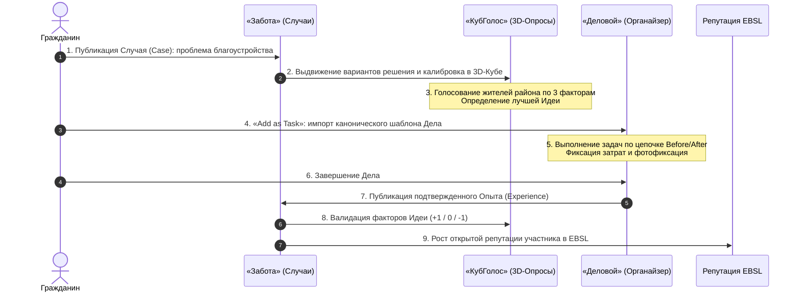

# Органайзер «Деловой» (GoGetter)
## Полное концептуальное и архитектурное руководство по прототипу

> **Категория:** [Прикладной стек (Applications Suite)](../README.md)  
> **Автор архитектуры:** Артём Владимирович Шамсутдинов  
> **Связанные документы директории:**  
> • [**`GoGetter_architecture_and_functionality.md`**](GoGetter_architecture_and_functionality.md) — Нормативная архитектурно-функциональная спецификация (1.0)  
> • [**`AGENTS.md`**](AGENTS.md) — Инженерный регламент и системные инварианты органайзера «Деловой»  
> • [**`../README.md`**](../README.md) — Головной каталог прикладного стека  
> • [**`../sapoto/README.md`**](../sapoto/README.md) — Руководство по платформе взаимной поддержки «Забота»  
> • [**`../votecube/README.md`**](../votecube/README.md) — Руководство по платформе 3D-консенсуса «КубГолос»  
> • [**`../../06_cbr_smart_contracts_fsm_whitepaper.md`**](../../06_cbr_smart_contracts_fsm_whitepaper.md) — Белая книга коммерческих смарт-контрактов ЦБ РФ (ПКСК / FSM)  
> • [**Презентация органайзера «Деловой»**](../../../../applications_presentations/03_delovoy_app_presentation/README.md) — 15 интерактивных слайдов с дикторской озвучкой  

---

## 1. Концепция и системное видение

### 1.1. Что такое «Деловой» (GoGetter)?
**«Деловой» (GoGetter)** — это интеллектуальный автономный органайзер личных, семейных и деловых задач нового поколения, созданный на базе трехуровневой платформы цифрового суверенитета данных **«Турбаза»** (Data Independence Network, DIN).

В отличие от традиционных облачных планировщиков (Todoist, Notion, Trello, Google Tasks), которые превращаются в унылый балласт отложенных дел и продают интимный распорядок жизни граждан рекламным корпорациям, «Деловой» предлагает принципиально новую когнитивную и инженерную среду:
1. **100% локальная автономия (Self-Custody) и абсолютная тайна жизни:** База данных задач хранится исключительно на локальном устройстве пользователя (**Листе**) в реляционной СУБД SQLite / AIRport WASM. На внешние серверы не передается ни одного байта персональных данных (строгое соответствие концепции Self-Custody Zero-PII и 152-ФЗ).
2. **Мгновенный локальный отклик ($< 1$ мс):** Открытие списков, фильтрация по матрице приоритетов, пересчет кинетической физики и полнотекстовый поиск по тегам происходят в оперативной памяти процессора за доли миллисекунды без сетевых спиннеров и ожидания ответов от серверов.
3. **Кинетический интерфейс «Гравитационные сферы» (Gravity Balls):** Задачи визуализируются в виде парящих разноцветных сфер, подчиняющихся законам физики. Размер шара отражает Важность/Приоритет ($R_i \sim P_i$), а цвет — Срочность. Самые важные и критические дела гравитационно притягиваются к центру экрана. По мере просрочки сферы неважных дел визуально сжимаются и вытесняются на дальнюю периферию, освобождая фокус внимания.
4. **Преодоление балласта отложенных дел через угасание Приоритета (Overdue Priority Decay):** В финальной архитектуре просроченные дела не нагнетают искусственное чувство вины, а плавно теряют приоритет по экспоненциальному закону с настраиваемым периодом полураспада ($T_{1/2}$). Угасшие задачи ($P=0$) превращаются в едва заметные микроточки и архивируются в 1 клик.
5. **Когнитивное сито 5W1H и фильтр осознанности:** Декомпозиция каждого дела по шести фундаментальным вопросам (*Кто, Что, Где, Когда, Зачем, Как*) усилена Сократическим диалогом («5 Почему»), тестом «Цена бездействия» (*Cost of Inaction*) и формулой связки с контекстом («Если — То» / *Implementation Intentions*), что отсекает навязанные извне задачи еще на входе.
6. **Алгоритм «Случайный шаг» (Serendipity Task):** Психологический инструмент мгновенного выхода из когнитивного ступора и прокрастинации: беспристрастный вероятностный выбор одного актуального дела для фокуса на первые 15 минут.
7. **Защищенный Семейный круг:** Координация домашнего хозяйства, списков покупок и школьных вех детей: каждое семейное поручение создается как самостоятельное Хранилище Дела с прямым P2P-доступом домочадцев по домашнему Wi-Fi или Bluetooth Mesh без выхода во внешний интернет.
8. **Сквозные реляционные внешние ключи:** Задачи не копируют текст документов, а выступают прямыми трехколоночными ссылками на рецепты врачей, товарные чеки, коммунальные поверки и маршруты путешествий («УраТур»).
9. **Базис для смарт-контрактов Уровня 2:** Дело в «Деловом» является живым коммерческим соглашением между двумя или более сторонами, управляющим FSM-переходами и выплатами эскроу на платформе Цифрового рубля Банка России.
10. **Слияние дел со всех источников на аппарате:** В платформе отсутствуют монолитные хранилища-агрегаторы: каждое отдельное Дело хранится в своем собственном Хранилище «Турбазы», защищенном индивидуальным ключом шифрования. Пользователь видит все свои личные, семейные, рабочие и деловые задачи на одном экране, выполняет их совместную обработку и получает сквозные аналитические отчеты, а проверенный код Листа исключает перекрестные утечки данных.
11. **Компонуемость программных оболочек и минимизация кода:** Программная оболочка «Делового» служит универсальным открытым каркасом для сторонних прикладных модулей (для агрегации любого числа источников), радикально снижая суммарный объем исполняемого кода в оперативной памяти Листа.
12. **Многоуровневый аудит, шлюзовой контроль Ветки и 100% открытый исходный код:** Статический анализ AST и переменных, верификация искусственным интеллектом и двусторонний взаимный аудит разработчиков базовых оболочек и приложений-клиентов (закрепленный договорами долевого разделения прибыли) гарантируют безопасность. Районная Ветка подключения (`turbaza.ru` / `turbase.ru`) допускает к исполнению только проверенный код, обеспечивая безопасность граждан и цифровой суверенитет данных государства.

---

## 2. Каноническая архитектура предметной области

```mermaid
graph TD
    Deed["Дело (Deed)<br/>@gogetter/main<br/>Центральная доменная сущность<br/>(Собственное Хранилище Repository)"]
    Goal["Цели (Goals)<br/>@airline/tasks<br/>1..* Стратегических ориентиров"]
    RootTask["Коренная Задача (rootTask)<br/>@airline/tasks<br/>Вершина графа задач"]
    Subtasks["Подзадачи (Subtasks)<br/>TaskDependency Before/After"]

    Deed -->|Объединяет 1..*| Goal
    Deed -->|Объединяет корень| RootTask
    RootTask -->|Декомпозиция| Subtasks
    Subtasks -.->|Повышение подзадачи<br/>(Subtask Promotion)| NewDeed["Новое Дело (Deed)<br/>Собственное Хранилище"]

    Deed --> Q5W1H["Когнитивное сито 5W1H<br/>Зачем (5 Почему), Цена бездействия, Если-То"]
    Deed --> Decay["Угасание приоритета P(t)<br/>Период полураспада T_1/2"]
    Deed --> GravBall["Гравитационная Сфера<br/>Радиус R(t) = f(P), Цвет = f(U, Q)"]
    Deed --> Serendipity["Случайный шаг (Serendipity)<br/>15 минут фокуса"]

    Deed --> DeedCase["ДелоСлучай (DeedCase)<br/>Связка со Случаем в @sapoto/main"]
    DeedCase --> SapotoCase["Случай «Заботы» (Case)<br/>Общественный контекст и опыт"]

    Deed --> PollGrp["Группа опросов (PollGroup)<br/>Связка любого числа опросов с Делом"]
    RootTask --> PollGrpTask["Группа опросов (PollGroup)<br/>Связка любого числа опросов с Задачей"]
    PollGrp --> VC3D["3D-Куб волеизъявления<br/>Консенсус коллектива"]
    PollGrpTask --> VC3D

    RootTask --> ExtLink["Внешняя ссылка (TaskExternalLink)<br/>Трехколоночный ключ AIRport"]
    ExtLink --> Docs["Рецепты, Чеки, Билеты, ЖКХ"]

    Deed --> DeedContract["Контракт Уровня 2 (DeedContract)<br/>Приватное соглашение в SQLite"]
    DeedContract --> CBR_L1["Смарт-контракт Уровня 1 (ПКСК / FSM)<br/>Платформа Цифрового рубля ЦБ РФ"]
    CBR_L1 --> EconRating["Открытый экономический рейтинг МСП"]
```

### 2.1. Смысловая роль Дела: композиция Целей и коренной Задачи
Дело (`Deed`) в органайзере «Деловой» — это не просто отдельная задача, а смысловая и организационная конструкция более высокого порядка:
- **Объединение Целей и коренной Задачи:** Каждое Дело объединяет под собой одну или несколько стратегических Целей (`Goal`) базовой схемы `@airline/tasks` и коренную Задачу (`rootTask: Task`).
- **Древовидная декомпозиция:** Коренная Задача может иметь под собой произвольное количество подзадач, связанных цепочками причинно-следственных зависимостей (`TaskDependency` Before/After), позволяя Делу организовывать под собой целые проекты.
- **Повышение подзадачи до самостоятельного Дела (Subtask Promotion):** Любая под-Задача внутри существующего Дела может быть преобразована в полноправное самостоятельное Дело. Вновь созданное Дело получает собственное независимое Хранилище («Турбаза» `Repository-per-Deed`), выделенная подзадача становится его коренной Задачей, а пользователь связывает его со стратегическими Целями.

> [!IMPORTANT]
> **Временный статус DDL-классов и строгий запрет в Whitepapers и презентациях:**  
> Все программные классы, сущности и DDL-схемы являются **временными рабочими проектными набросками** для базовой инженерной спецификации.  
> **Они КАТЕГОРИЧЕСКИ ЗАПРЕЩЕНЫ к отображению и включению в представительские материалы: официальные Белые Книги (Whitepapers) и презентации.**  
> В публикационных документах и на слайдах концепция раскрывается исключительно на уровне архитектурных принципов, потоков данных и социально-экономических результатов.

---

## 3. Матрица Эйзенхауэра 2.0 и временная эволюция задач

### 3.1. Пятибалльная шкала координат
Каждое Дело и Задача наделяются двумя дискретными координатами $U \in \{0, 1, 2, 3, 4\}$ (Срочность) и $P \in \{0, 1, 2, 3, 4\}$ (Важность/Приоритет):
- **Срочность ($U$):** От $0$ (срок не определен или бесконечно далек) до $4$ (критический аврал, требующий немедленного действия сегодня).
- **Важность ($P$):** От $0$ (фоновый шум, незначительная рутина) до $4$ (жизненно важная веха развития, крупный семейный или коммерческий проект).

### 3.2. Четыре квадранта матрицы
```
                 Высокая важность (P >= 2)
                            ^
                            |
           Q2               |               Q1
   СТРАТЕГИЧЕСКОЕ РАЗВИТИЕ  |        КРИТИЧЕСКИЙ ФОКУС
   (Важно, но не срочно)    |        (Срочно и Важно)
   • Здоровье и спорт       |        • Горящие дедлайны
   • Образование детей      |        • Аварии и протечки
   • Стратегические проекты |        • Неотложные обязательства
                            |
   -------------------------+-------------------------> Высокая срочность (U >= 2)
                            |
           Q4               |               Q3
   ИНФОРМАЦИОННЫЙ ШУМ       |       ОПЕРАЦИОННАЯ СУЕТА
   (Не срочно и не важно)   |       (Срочно, но не важно)
   • Отвлекающие статьи     |       • Бытовые звонки
   • Случайные рассылки     |       • Мелкие просьбы
   • Фоновые заметки        |       • Рутинная текучка
                            |
                 Низкая важность (P < 2)
```

### 3.3. Динамический временной сдвиг (Temporal Drift)
По мере приближения даты дедлайна $T_{\text{deadline}}$ координата срочности автоматически пересчитывается локальным алгоритмом:

$$U(t) = \min\left(4, \; \left\lfloor U_{\text{base}} + \Delta U \cdot \exp\left( - \frac{T_{\text{deadline}} - t}{\tau} \right) \right\rfloor\right)$$

Задача из квадранта развития ($Q2$) плавно мигрирует в зону активного внимания ($Q1$). Пользователь видит заблаговременную эволюцию приоритетов, что полностью исключает панику и авралы в последний день.

### 3.4. Преодоление балласта отложенных дел: экспоненциальное угасание Приоритета (Overdue Priority Decay)
Фундаментальный ответ органайзера «Деловой» на проблему накопления балласта отложенных дел:
- **Опыт оригинального прототипа:** В прототипе использовался принцип нагнетания Срочности ($U$) по мере приближения предельного срока. Однако на практике, если дело не обладало для человека подлинной ценностью или интересом, приближение дедлайна не помогало его выполнить. Задачи зависали просроченными, скапливались «тяжким грузом» и порождали тягостное бремя выбора и чувство вины.
- **Финальная архитектура по умолчанию:** В финальной версии органайзера «Деловой» реализован **принцип уменьшения Приоритета (Важности $P$) дела по мере его просроченности**!
- **Психологическое обоснование:** Если дедлайн прошел, а жизнь продолжается без серьезных последствий, реальная маржинальная ценность дела объективно уменьшилась. Сохранение его как «сверхважного» лишь изнуряет психику. Угасание приоритета признает реальность и очищает фокус.

#### Математическая модель спада с периодом полураспада
При $t > T_{\text{deadline}}$ Приоритет $P(t)$ плавно уменьшается по экспоненциальному закону с настраиваемым периодом полураспада $T_{1/2}$:

$$P(t) = \begin{cases} 
P_{\text{base}}, & t \le T_{\text{deadline}} \\ 
\max\left(0, \; \left\lfloor P_{\text{base}} \cdot \exp\left( - \frac{\ln 2}{T_{1/2}} \cdot (t - T_{\text{deadline}}) \right) \right\rfloor\right), & t > T_{\text{deadline}} 
\end{cases}$$

Пользователь управляет скоростью угасания через пресеты:
1. **Быстрый ($T_{1/2} = 24$ ч):** Для оперативных бытовых задач;
2. **Сбалансированный ($T_{1/2} = 72$ ч / 3 дня — по умолчанию):** Для стандартных рабочих и семейных задач;
3. **Вдумчивый ($T_{1/2} = 168$ ч / 7 дней):** Для творческих и исследовательских инициатив;
4. **Фиксированный ($T_{1/2} = \infty$):** Отключение угасания для налоговых, судебных и жестких договорных обязательств.

#### Судьба задач с угасшим приоритетом ($P = 0$)
Когда приоритет задачи снижается до нуля:
- В интерфейсе «Гравитационные сферы» шар сжимается до микроточки минимального радиуса ($R \to R_{\min}$), становится полупрозрачно-серым и гравитационно вытесняется на внешнюю периферийную орбиту дисплея.
- При нажатии на сферу система не выдает обвиняющих предупреждений, предлагая дружелюбный выбор в 1 клик:
  - *«Актуализировать срок и подтвердить важность»* (возврат базового приоритета $P_{\text{base}}$ и уточнение 5W1H);
  - *«Архивировать без чувства вины»* (1 клик).

### 3.5. Когнитивное сито 5W1H и выявление подлинной важности
Чтобы задачи не превращались в мертвый груз еще на стадии формулирования, каркас 5W1H снабжен когнитивными фильтрами:
1. **Сократический диалог «Зачем?» («5 Почему»):** Углубление на 2–3 шага вскрывает навязанные извне задачи и отсекает их до старта.
2. **Тест «Цена бездействия» (Cost of Inaction):** Честный ответ на вопрос *«Что реально произойдет, если я никогда не сделаю это Дело?»*. Если ответ «ничего страшного» — мнимая важность обнуляется сразу.
3. **Формула «Если — То» (Implementation Intentions):** Связка «Когда/Где/Как» с физическим триггером (*«ЕСЛИ наступит [Время] И я окажусь в [Место], ТО я сделаю [Действие]»*) устраняет стартовый психологический барьер.
4. **Социальная прозрачность без навязчивости:** В семейных и артельных хранилищах статус дела виден участникам в реальном времени, создавая взаимную поддержку и спокойную подотчетность без упреков и звонков.

---

## 4. Кинетический визуальный интерфейс «Гравитационные сферы» (Gravity Balls)

### 4.1. Метафора гравитационного притяжения
Вместо перегруженных текстовых списков пользователь видит чистое интерактивное полотно:
- **Динамический размер сферы:** Пропорционален текущей важности: $R_i(t) = R_{\min} + \alpha_R \cdot P_i(t)$. При угасании приоритета сфера сжимается, освобождая экран.
- **Цвет сферы:** Задается квадрантом Матрицы 2.0 (золотой/янтарный — $Q1$, глубокий бирюзовый — $Q2$, синий — $Q3$, полупрозрачный серый — $Q4$).
- **Гравитационный аттрактор:** Расположен в центре дисплея. Задачи с максимальной срочностью и важностью естественным образом притягиваются к центру экрана, а угасшие дела ($P=0$) дрейфуют на дальнюю орбиту.

### 4.2. 2D-физика и стабильность симуляции
Физическая модель рассчитывается с частотой 60 кадров в секунду при помощи симплектического численного интегратора Верле (Velocity Verlet):
1. **Гравитация к центру:** $\mathbf{F}_{\text{center}, i} = - k_{\text{center}} \cdot (1 + \beta_U U_i + \beta_P P_i(t)) \cdot (\mathbf{x}_i - \mathbf{x}_0)$.
2. **Упругое кулоновское отталкивание:** Исключает слипание и перекрытие шаров: при $r_{ij} < R_i(t) + R_j(t)$ возникает сила упругого контактного отталкивания.
3. **Гидродинамическое трение:** $\mathbf{F}_{\text{drag}, i} = -\gamma \cdot \mathbf{v}_i$ мягко гасит колебания, приводя систему к визуально стабильному состоянию.

### 4.3. Анимация открытия и принцип «Фокус после выбора»
- При каждом открытии экрана сферы влетают от границ экрана к центру. Благодаря легкой случайной флуктуации импульса их траектории и конечное взаимное расположение всякий раз уникальны, что активизирует исследовательский интерес мозга.
- На самих сферах нет длинных текстов, создающих информационный шум. Отображается только лаконичная пиктограмма и индикатор готовности.
- Полная карточка дела (вопросы 5W1H, чеки, этапы) открывается только при осознанном нажатии на сферу.

### 4.4. Движок «Случайный шаг» (Serendipity Task Engine)
Когда дел слишком много и человек не может решиться, за что взяться первым:
1. Нажатие кнопки *«Случайный шаг»* активирует вероятностный генератор;
2. Алгоритм взвешивает задачи из пула актуальных важных дел ($Q1 \cup Q2$) с весами $w_k = (P_k + 1)^2 \cdot (U_k + 1)$;
3. Экран мягко затемняет все посторонние сферы, приближает выбранное дело, подсвечивает триггер «Если — То» и запускает таймер: *«Посвятите этому делу первые 15 минут»*;
4. Снятие груза выбора позволяет человеку немедленно включиться в работу. По статистике, в 9 из 10 случаев после первых 15 минут работа успешно доводится до конца.

---

## 5. Двухуровневая модель схем данных и антимонопольная архитектура

### 5.1. Архитектурная изоляция
- **Открытый базовый уровень (`@airline/tasks`):** Стандартные реляционные таблицы `AIRLINE_GOALS`, `AIRLINE_TASKS`, `AIRLINE_TASK_DEPENDENCIES`. Любой независимый разработчик экосистемы может создавать свои приложения поверх этого открытого фундамента.
- **Прикладной уровень («Деловой» — `@gogetter/main`):** Таблицы `GOGETTER_DEEDS`, `GOGETTER_DEED_GOALS`, `GOGETTER_DEED_5W1H`, `GOGETTER_DEED_CASES`, `GOGETTER_TASK_EXTERNAL_LINKS`, `GOGETTER_DEED_CONTRACTS`, `GOGETTER_POLL_GROUPS`.
- **Смысловая композиция и повышение подзадач:** Дело (`Deed`) объединяет коренную Задачу (`rootTask: Task`) с её подзадачами и одну или несколько стратегических Целей (`Goal`). Любая подзадача может быть преобразована в самостоятельное полноправное Дело со своим собственным Хранилищем («Турбаза» `Repository-per-Deed`).
- **In-Memory объединение:** База данных SQLite в составе каркаса AIRport работает прямо в оперативной памяти клиентского устройства. Реляционные объединения (`JOIN`) между базовыми и расширенными таблицами выполняются за доли микросекунды, устраняя необходимость в монопольных закрытых схемах данных.
- **Временный статус DDL-классов:** Все программные классы и таблицы являются временными проектными набросками и категорически запрещены к включению в Whitepapers и презентации.

### 5.2. Инвариант «Write-Self»
- Каждый пользователь записывает изменения строго со своим идентификатором `ActorId`.
- Персональные и семейные теги к чужим публичным делам сохраняются в локальных репозиториях тегов гражданина (`TagRepository`) и никогда не загрязняют оригинальные записи.

---

## 6. Мульти-хранилищная агрегация на Листе, сквозная криптография и WebTransport

### 6.1. Каждое Дело получает свое отдельное Хранилище (Repository-per-Deed)
- **Исключение монолитных хранилищ:** В платформе отсутствуют общие хранилища-агрегаторы («все личные дела» или «все семейные дела»). Каждое отдельное Дело (`Deed`) создается как самостоятельное независимое Хранилище («Турбаза» `Repository`) со своим индивидуальным ключом шифрования.
- **Абсолютная гранулярность доступа:** Личные цели доступны только самому человеку; семейные дела расшариваются между членами семьи; служебные задачи — между сотрудником и коллегами; коммерческие заказы — между мастером и клиентом. Открытие доступа к одному Делу криптографически изолировано и физически не позволяет увидеть другие Дела пользователя.
- **Автономный жизненный цикл:** Каждое Дело имеет собственный журнал изменений (WAL), может автономно завершаться, архивироваться или экспортироваться без затрагивания смежных обязательств.

### 6.2. Двойная топология сетевых подключений Листа
Конфигурация кода платформы Листа, поставляемая от авторизованной районной Ветки подключения, определяет два маршрута:
1. **Прямое соединение с зарегистрированными Ветками:** Для предприятий, крупных компаний и общественных организаций с собственными Ветками «Турбазы» подключение осуществляется напрямую по mTLS.
2. **Маршрутизация через районный шлюз (Gateway Routing):** Субъекты МСП, мастера и локальные сообщества размещают свои файлы и репозитории непосредственно на Ветках платформы. Приложение пользователя проводит сетевые соединения к этим данным через собственный шлюз (районную Ветку подключения), что сводит инфраструктурные расходы бизнеса к нулю ($TCO \to 0$).

### 6.3. Единый экран Листа, кросс-доменные рапорты и Zero-Leakage
- **Все Дела на одном экране:** Аппарат пользователя (смартфон или ПК) загружает данные из всех доступных Хранилищ, мгновенно объединяет их в оперативной памяти SQLite/WASM ($< 1$ мс) и формирует целостную картину задач.
- **Совместная обработка:** Пользователь работает со всеми задачами в едином окне: распределяет дела по квадрантам Матрицы 2.0, наблюдает за их кинетикой в «Гравитационных сферах», запускает таймер «Случайного шага».
- **Сквозная аналитика:** Вычисление объективных сводных рапортов продуктивности и баланса сфер жизни (работа, семья, личное развитие, здоровье) без ручного сбора данных.
- **Инвариант нулевых утечек (Zero-Leakage Invariant):** Проверенный платформенный код Листа в изолированной песочнице (Sandbox) гарантирует детерминированную запись изменений строго в то Хранилище, из которого получена сущность. Перекрестные утечки между корпоративными, семейными и личными делами исключены математически.

### 6.4. Многоуровневый аудит кода и кураторский контроль Ветки
- **Автоматический статический анализ:** Контроль использования переменных и программных оболочек (AST & Taint Analysis) блокирует утечки данных между Хранилищами на этапе компиляции.
- **Верификация искусственным интеллектом:** ИИ-аудиторы проверяют семантику кода на отсутствие скрытых каналов утечки, недекларированных переменных и сетевых закладок.
- **Двусторонний экономический аудит разработчиков:** Использование программных оболочек оформляется договорами с долевым разделением прибыли (Revenue Sharing) от рекламы и платформенных подписок. Это создает симметричную экономическую мотивацию: разработчики клиентских приложений проверяют надежность базовых оболочек, а разработчики базовых оболочек тщательно инспектируют код приложений-клиентов перед допуском к совместной монетизации.
- **Шлюзовой контроль Ветки (`turbaza.ru` / `turbase.ru`):** Районная Ветка подключения выступает институциональным фильтром — допускает к развертыванию только проверенные приложения, жестко контролирует доступ к данным и содействует государству в обеспечении цифрового суверенитета данных.

### 6.5. Компонуемость оболочек, минимизация кода и 100% открытый исходный код
- **Базовый каркас «Делового»:** Программная оболочка органайзера спроектирована для работы с произвольным числом независимых источников данных и используется другими приложениями экосистемы как базовое ядро.
- **Минимизация кода на Листе:** Единый исполнительский runtime устраняет дублирование тяжелых библиотек, сокращая объем кода в оперативной памяти смартфона или ПК до абсолютного минимума.
- **Тотальная перекрестная верификация:** Поскольку оболочка «Делового» востребована множеством сторонних сервисов, каждое изменение в её коде подвергается глубочайшему контролю всего сообщества.
- **100% открытый исходный код:** Полная прозрачность кода исключает монополизацию, скрытые закладки и вендор-лок.

### 6.6. Двухуровневая криптография и высокоскоростной WebTransport
- **Двухуровневая защита:** Каждое Хранилище шифруется собственным симметричным ключом (`Repository Encryption Key`), а каждая запись в WAL подписывается личным ключом актора (`Actor Signing Key`, Ed25519).
- **Принцип «Невидящей Ветки» (Zero-Knowledge Branch):** Районная Ветка подключения и промежуточные узлы ретранслируют зашифрованные блоки и физически не могут прочитать пользовательские данные.
- **WebTransport (HTTP/3 over QUIC):** Мгновенная первичная гидратация Хранилищ, сверхбыстрая дозагрузка дельт при восстановлении связи и сигнальное рандеву (Peer Rendezvous).
- **Переход к прямому P2P:** После первичного рукопожатия устройства участников переключаются на прямой пиринговый обмен (локальный Wi-Fi Mesh, Bluetooth Mesh, WebRTC) без участия серверов.

---

## 7. Семейный круг, координация поручений и P2P-синхронизация

### 7.1. Семейная координация: совместные Дела без монолитного хранилища
- **Дело как единица семейного взаимодействия:** Вместо единого семейного хранилища, куда сваливаются все задачи, каждое семейное поручение (список покупок, ремонт, кружки детей) создается как отдельное Хранилище Дела (`Repository-per-Deed`).
- **Криптографический контур семьи:** Доступ к Хранилищу конкретного семейного Дела предоставляется авторизованным домочадцам с использованием их персональных пар асимметричных ключей (Ed25519).
- **Герметичные личные зоны:** Служебные дела родителей, личные дневники и подарки-сюрпризы ведутся в сугубо индивидуальных Хранилищах Дел и физически недоступны другим членам семьи.
- **Прозрачность статусов:** Внутри каждого семейного Дела статусы поручений (*«Взял на себя»*, *«Купил»*, *«Сделано»*) обновляются в реальном времени, устраняя бытовые разногласия и взаимные упреки.

### 7.2. Автономная работа без интернета (Local Mesh)
Синхронизация между устройствами членов семьи происходит по прямому P2P-каналу:
- Домашний Wi-Fi или Bluetooth Low Energy Mesh;
- Ни один байт личной информации не уходит во внешнюю сеть;
- Зашифрованная резервная копия на муниципальной Ветке гарантирует сохранность семейной летописи при утере физического смартфона.

---

## 8. Внешние реляционные связи и Общественный API

### 8.1. Сквозные указатели вместо дублирования
Каждая задача в «Деловом» хранит трехколоночный реляционный внешний ключ `(TargetRepositoryId, TargetActorId, TargetRecordId)`:
- **Медицина:** Задача «Принять лекарство» указывает на электронный рецепт врача в приложении «Здоровье»;
- **Торговля:** Задача «Забрать заказ» ссылается на фискальный чек из магазина;
- **ЖКХ:** Напоминание о поверке указывает на паспорт прибора учета в «Локальном реестре ЖКХ»;
- **Туризм:** Чек-лист снаряжения ссылается на нитку маршрута в планере «УраТур».
При этом в задаче сохраняется локальный снимок заголовка (`snapshotTitle`), позволяющий видеть суть дела даже при временной недоступности внешней системы.

### 8.2. Общественный API поручений без рекламного спама
Сторонние аккредитованные службы (курьеры, поликлиники, управляющие компании) могут передавать поручения в органайзер гражданина в один клик:
- Взаимодействие осуществляется строго по криптографическим токенам разрешений (Capability Tokens), выданным гражданином;
- Задачи попадают во входящий буфер и требуют явного подтверждения человеком;
- Спам и навязчивая реклама исключены на уровне архитектуры платформы.

---

## 9. Смарт-контракты Уровня 2 и платформа Цифрового рубля ЦБ РФ

### 9.1. Дело как живой контракт второго уровня
Дело может объединять двух или более участников (заказчик, подрядчик, мастер, эксперт):
- **Уровень 2 (Level 2 Private Contract):** Чертежи, смета, детальное ТЗ и промежуточные задачи хранятся в защищенной базе SQLite на Листах участников сделки.
- **Уровень 1 (Level 1 Public Contract):** Развертывается на платформе Цифрового рубля Банка России (Белая книга № 06: ПСК / ПКСК / FSM). Обеспечивает условное эскроу-депонирование средств.
- **FSM-переходы:** По мере приемки задач заказчиком в «Деловом» участники подписывают криптографические транзакции смены состояния и отправляют их в контракт Уровня 1 для автоматической разблокировки очередного транша в Цифровых рублях.

### 9.2. Объективный экономический рейтинг
- Выполнение контрактов формирует открытый математический след надежности субъекта МСП или самозанятого мастера;
- Коммерческая тайна и персональные данные клиентов остаются скрытыми;
- Накопленная история безупречных сделок дает предпринимателю доступ к беззалоговым кредитным пулам по минимальным ставкам.

---

## 10. Синергия с «КубГолосом» (VoteCube) и «Заботой» (Sapoto.net)

«Деловой» выступает исполнительным звеном сквозного жизненного цикла Data Independence Network:



1. **Группы опросов (`PollGroup`):** Смысл сущности `PollGroup` в том, что любое количество микро-опросов «КубГолоса» может быть гибко соединено с определенным Делом или с отдельной Задачей. Это позволяет выносить на согласование коллектива серии взаимосвязанных вопросов (по смете, материалам, срокам, исполнителям) с расчетом совокупной статистики группы консенсуса прямо на Листах участников либо на серверах организаций.
2. **Соединительная таблица `DeedCase`:** Связывает частные дела граждан с публичными Случаями в «Заботе». Успешно решенное Дело может быть опубликовано как канонический шаблон для всего сообщества.

---

## 11. Мобильный офис для МСП и самозанятых

«Деловой» предоставляет малому бизнесу и самозанятым профессиональное рабочее место прямо в смартфоне:
- **0 рублей затрат на CRM:** Полная замена дорогостоящих облачных подписок (AmoCRM, Bitrix24, Notion), экономящая десятки тысяч рублей ежегодно;
- **Неуязвимость клиентской базы:** Данные клиентов хранятся на устройстве мастера и защищены от кражи сотрудниками или блокировок провайдера;
- **Прямой приток заказов из района:** Интеграция с «Локальным реестром МСП и ЖКХ» позволяет соседям бронировать свободные слоты в графике мастера без комиссий агрегаторов (сохраняя до 30% маржинальности).

---

## 12. Заключение и навигация по разделу

Органайзер «Деловой» доказывает: персональный таск-менеджер может быть быстрым, психологически комфортным, абсолютно приватным и органично интегрированным в децентрализованную экономику доверия.

- Для ознакомления с социально-экономическим потенциалом на семи уровнях общества, когнитивной эргономикой и смарт-контрактами изучите: [**`GoGetter_Ecosystem_Impact_Guide.md`**](GoGetter_Ecosystem_Impact_Guide.md).
- Для ознакомления с нормативными DDL-структурами, уравнениями кинетического 2D-движка и протоколами смарт-контрактов изучите: [**`GoGetter_architecture_and_functionality.md`**](GoGetter_architecture_and_functionality.md).
- Для изучения правил разработки и инженерных инвариантов обратитесь к: [**`AGENTS.md`**](AGENTS.md).
- Для просмотра интерактивной мультимедийной презентации откройте: [**`applications_presentations/03_delovoy_app_presentation`**](../../../../applications_presentations/03_delovoy_app_presentation/README.md).
