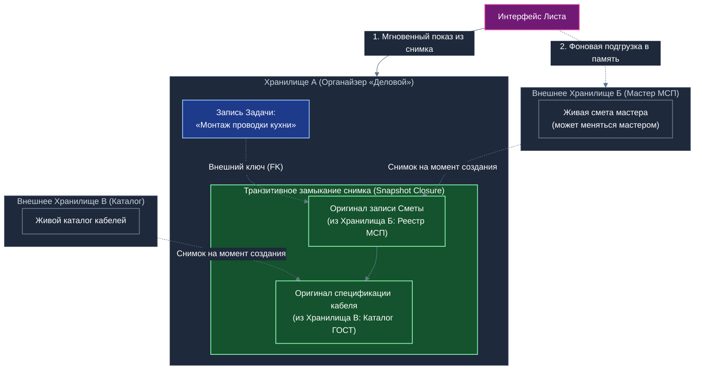

# Автономные взаимозависимые хранилища (AIR), транзитивное замыкание снимков по внешним ключам и бесконфликтная архитектура данных

## Концептуальный документ дознания и фундаментальных исходных данных для Белой книги и прикладной презентации «Локальный реестр сервисов МСП и ЖКХ»

---

## 1. Исторические истоки и патентный фундамент технологии AIR

Архитектурная концепция **автономных взаимозависимых хранилищ** (Autonomous Interdependent Repositories, AIR), лежащая в основе платформы «Турбаза», формировалась на протяжении многолетних теоретических исследований и практических апробаций:

1. **Первоначальная концепция малых хранилищ (2017 год):**
   Базовые принципы модульной изоляции распределённых данных были впервые публично сформулированы 19 февраля 2017 года в исследовательской публикации блога *Autonomous Interdependent Repositories* в статье [«Small Repositories»](https://autonomousinterdependentrepositories.wordpress.com/2017/02/19/small-repositories/). В ней был обоснован отказ от монолитных серверных баз данных в пользу атомарных, мелкозернистых хранилищ с однородными правами доступа для группы участников.
2. **Патентное закрепление изобретения (Патент США US10902016B2):**
   Архитектура децентрализованной федеративной базы данных на основе автономных хранилищ, разделения схем приложений и трёхкомпонентных идентификаторов была официально запатентована в Бюро по патентам и товарным знакам США:
   - **Номер патента:** [US 10,902,016 B2](https://patents.google.com/patent/US10902016B2);
   - **Название:** *«Autonomous interdependent repositories»*;
   - **Дата подачи заявки:** 12 февраля 2018 года;
   - **Дата выдачи патента:** 26 января 2021 года;
   - **Автор и изобретатель:** А. В. Шамсутдинов (Artem Shamsutdinov).
3. **Открытая кодовая база и спецификации:**
   Инженерное развитие архитектуры представлено в открытом репозитории экосистемы [`beyond-decentralized.world`](https://github.com/beyond-decentralized/beyond-decentralized.world/tree/main/dist/public).
4. **Технический документ платформы для Минцифры России и концептуальная проверка через искусственный интеллект (2026 год):**
   В начале 2026 года после первоначального проявления интереса в электронной переписке со стороны Минцифры России автором без использования ИИ был разработан основополагающий труд — [«Технический документ платформы Турбаза»](https://github.com/beyond-decentralized/beyond-decentralized.world/blob/main/dist/public/2026/%D0%A2%D0%B5%D1%85%D0%BD%D0%B8%D1%87%D0%B5%D1%81%D0%BA%D0%B8%D0%B9%20%D0%B4%D0%BE%D0%BA%D1%83%D0%BC%D0%B5%D0%BD%D1%82%20%D0%BF%D0%BB%D0%B0%D1%82%D1%84%D0%BE%D1%80%D0%BC%D1%8B%20%D0%A2%D1%83%D1%80%D0%B1%D0%B0%D0%B7%D0%B0.md) (локальный файл в репозитории: [`shared_docs/Технический документ платформы Турбаза.md`](shared_docs/Технический%20документ%20платформы%20Турбаза.md)), который был отправлен в министерство (после чего ответа со стороны ведомства не последовало). Концептуальные архитектурные решения платформы в начале 2026 года были дополнительно подтверждены и верифицированы автором через онлайн-интерфейс Google Gemini в веб-браузере.

---

## 2. Базовые принципы архитектуры AIR

Традиционные реляционные СУБД строятся вокруг единой глобальной базы данных, где целостность данных поддерживается межтабличными внешними ключами и распределёнными транзакционными блокировками (ACID). В децентрализованных и оффлайн-системах такой подход приводит к возникновению «распределённого монолита» с неприемлемыми сетевыми задержками и частыми тупиковыми блокировками.

Архитектура AIR решает эту проблему через четыре системных принципа:

1. **Хранилище как первичная единица владения и репликации (Repository as First-Class Entity):**
   Всё информационное пространство экосистемы квантуется на компактные, автономные хранилища (микро-блокчейны). Каждое хранилище обслуживает ровно одну группу участников или одну замкнутую прикладную задачу (Дело, проект ремонта, семейный бюджет, туристический маршрут).
2. **Ограничение транзакций границами одного хранилища (`One Transaction per Repository`):**
   Любая атомарная транзакция модификации выполняется строго внутри одного хранилища. Межхранилищные транзакции физически исключены на уровне протокола ядра, что снимает необходимость в тяжеловесном двухфазном коммите (2PC) и гарантирует мгновенную фиксацию изменений на клиентском Листе.
3. **Единые права участников в пределах хранилища:**
   Все участники совместного хранилища наделяются равными правами на модификацию его записей (в рамках назначенных ролевых ключей), что исключает необходимость в сложных серверных механизмах динамического разграничения доступа.
4. **Трёхкомпонентный глобальный составной ключ:**
   Каждая строка в таблицах любого приложения идентифицируется детерминированным кортежем:
   $$\text{Глобальный идентификатор записи} = \langle \text{RepositoryId},\; \text{ActorId},\; \text{ActorRecordId} \rangle$$
   где $\text{RepositoryId}$ — идентификатор хранилища, $\text{ActorId}$ — идентификатор автора/устройства, а $\text{ActorRecordId}$ — локальный порядковый номер записи в журнале автора.

---

## 3. Межхранилищные связи по внешним ключам и вызов децентрализации

Приложения экосистемы («Деловой», «КубГолос», «Забота», «УраТур», «Локальный реестр МСП») развёртывают свои таблицы в общей реляционной базе данных на Листе пользователя. Записи одного приложения неизбежно ссылаются на сущности других приложений, расположенные в иных хранилищах (например, подзадача ремонта в органайзере «Деловой» ссылается по внешнему ключу на смету мастера в «Локальном реестре МСП» или на кулинарный рецепт в сети «Забота»).

Однако в децентрализованной среде постоянное динамическое обновление связанных внешних записей порождает критические угрозы:
1. **Каскадные конфликты версий (Cascading Conflicts):** если внешнее хранилище обновляется другим пользователем в P2P-сети, попытка автоматической актуализации связанных полей в чужом хранилище приводит к неразрешимым коллизиям слияния версий.
2. **Задержка отображения (Render Latency):** если для отрисовки страницы задачи мобильное приложение обязано предварительно скачать и расшифровать все связанные внешние хранилища по сети, интерфейс зависает на секунды, особенно при слабом сигнале связи.
3. **Разрушение исторической основы соглашения:** изменение прейскуранта или условий во внешнем источнике не должно задним числом менять смету уже зафиксированного договора.

---

## 4. Транзитивное замыкание снимков по внешним ключам

Для преодоления указанных вызовов в платформе спроектирован фундаментальный механизм: **транзитивное включение оригинальных копий связанных записей (Transitive Snapshot Closure)**.

### 4.1. Механизм инкапсуляции оригинальной копии
Если запись в таблице Хранилища $A$ определяет внешний ключ к записи в таблице Хранилища $B$ другого приложения:
- **Оригинальная копия внешней записи из Хранилища $B$** в том точном виде, в каком Лист пользователя видел её в момент создания связи, **физически инкапсулируется (включается как неизменяемый снимок) внутрь Хранилища $A$**.
- Если данная внешняя запись из Хранилища $B$ сама содержит внешние ключи к записям в Хранилищах $C, D, \dots$, то **весь транзитивный граф связанных записей** («как они отображались на Листе пользователя в то время») целиком копируется и внедряется в состав локального снимка Хранилища $A$.

*Схема 1. Архитектура транзитивного замыкания снимков по внешним ключам между независимыми хранилищами.*

### 4.2. Четыре системных эффекта архитектуры снимков
1. **Мгновенная отрисовка экрана (Zero-Latency Instant Page Render):**
   При открытии задачи клиентское приложение на Листе извлекает всю связанную информацию (наименование сметы, позиции материалов, реквизиты договора) прямо из своего локального Хранилища $A$. Пользователь видит полностью заполненную страницу мгновенно (менее 10 миллисекунд), без задержек ожидания сети.
2. **Асинхронная ленивая регидратация (Background Lazy Hydration):**
   Одновременно с мгновенным показом страницы клиентское ядро в фоновом режиме отправляет запросы на подгрузку актуальных внешних Хранилищ $B$ и $C$ в оперативную память устройства. Если пользователь решит выполнить интерактивные действия (перейти к живому диалогу с мастером или проверить статус гарантии), внешние сущности уже будут подготовлены в памяти Листа.
3. **Историческая неизменяемость и достоверность контекста (Point-in-Time Provenance):**
   Инкапсулированный снимок навсегда сохраняет точное состояние внешнего мира на момент фиксации соглашения («каким его видел пользователь в то время»). Если мастер впоследствии изменит свои расценки в Хранилище $B$, это никак не повлияет на исторический оригинал, зафиксированный в Хранилище $A$.
4. **Устранение каскадных конфликтов в децентрализованной сети:**
   Постоянная динамическая мутация внешних связей в оффлайн- и P2P-среде невозможна без распределённых блокировок. Архитектурное решение сохранять оригиналы снимков гарантирует, что каждое хранилище остаётся строго автономным, самодостаточным и свободным от внешних конфликтов версий.

---

## 5. Научно-теоретический базис и индустриальные аналоги

Предлагаемая модель базируется на признанных принципах проектирования масштабируемых и распределённых информационных систем:

1. **Domain-Driven Design (Эрик Эванс, Вон Вернон):**
   - Концепция **границы согласованности агрегата** (*Aggregate as Consistency Boundary*). Агрегаты не могут ссылаться друг на друга через прямые объектные ссылки; взаимодействие разрешено исключительно через глобальные идентификаторы.
   - Замена ссылок на внешние сущности внедрением **неизменяемых объектов-значений** (*Value Object Snapshot Embedding*). Классический пример: строка оформленного заказа в интернет-магазине копирует наименование и цену товара из каталога, изолируя заказ от последующих изменений цен в каталоге.
2. **Event-Driven Architecture и CQRS (Мартин Фаулер, Грег Янг):**
   - Локальные материализованные проекции (*Materialized Read Models*). Читающая модель хранит денормализованный срез данных, оптимизированный для мгновенной отдачи пользовательскому интерфейсу, а синхронизация с источником правды выполняется асинхронно через события.
3. **Local-First Software (Мартин Клеппманн, лаборатория Ink & Switch):**
   - Приоритет доступности и локального владения данными. Отказ от распределённых синхронных блокировок в пользу автономных локальных снимков с причинно-следственным версионированием.
4. **Борьба с антипаттерном «Распределённого монолита» (Distributed Monolith Anti-Pattern):**
   - Доказано, что попытка поддержания классической ссылочной целостности реляционных баз данных через границы независимых микросервисов или распределённых хранилищ разрушает автономность компонентов и приводит к лавинообразным сбоям.

---

## 6. Итоги и интеграция в экосистему

Концепция автономных взаимозависимых хранилищ (AIR), защищённая Патентом США US10902016B2 и систематизированная в Техническом документе платформы «Турбаза», находит своё логическое завершение в механизме транзитивного замыкания снимков по внешним ключам:
- Она обеспечивает бескомпромиссную отзывчивость мобильных приложений на Листе;
- Гарантирует юридическую и историческую неизменяемость соглашений между гражданами;
- Устраняет распределённые конфликты версий, сохраняя децентрализованную природу платформы «Турбаза».

Данные материалы служат концептуальной проектной основой для Белой книги «Локальный реестр сервисов МСП и ЖКХ» и официальных архитектурных спецификаций платформы.
