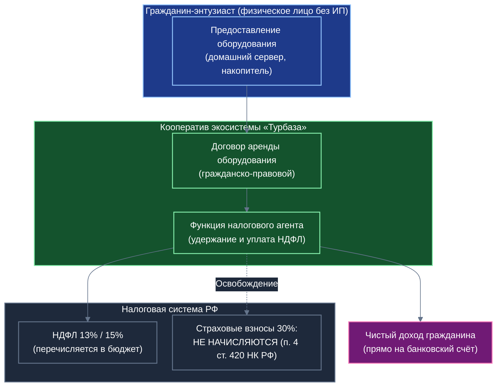
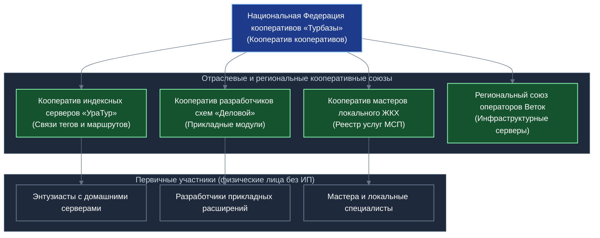

# Кооперативная экономика экосистемы, правовая модель участия граждан без ИП и ограничение сложности смарт-контрактов L1 Банка России

## Концептуальный документ дознания и социально-экономических исходных данных для Белой книги и прикладной презентации «Локальный реестр сервисов МСП и ЖКХ»

---

## 1. Социально-экономическая миссия кооперативов в экосистеме «Турбазы»

Платформа «Турбаза» объединяет миллионы автономных узлов: смартфоны граждан (Листья), районные серверы ретрансляции (Ветки) и краевые реестры (Ствол). На прикладном уровне («Деловой», «КубГолос», «Забота», «УраТур», «Локальный реестр сервисов МСП») действуют тысячи независимых разработчиков модулей, авторов туристических маршрутов, операторов индексных серверов и поставщиков бытовых услуг.

Если каждый такой участник выступает как разрозненный индивидуальный агент, возникают три системных барьера:
1. **Асимметрия рыночной силы:** Одиночный энтузиаст или самодеятельный программист не обладает весом для заключения институциональных договоров с муниципалитетами, региональными операторами ЖКХ или крупными торговыми сетями.
2. **Административно-налоговые издержки:** Необходимость самостоятельного ведения бухгалтерского учёта, сдачи налоговой отчётности и регистрации юридических лиц отпугивает подавляющее большинство технических энтузиастов и активных граждан.
3. **Отсутствие координации стандартов:** Разрозненные операторы узлов не могут согласовать единые протоколы качества обслуживания, порождая фрагментацию инфраструктуры.

Объединение участников в **кооперативы** формирует институциональный фундамент суверенной цифровой экономики, трансформируя разрозненных энтузиастов в коллективных собственников экосистемы.

---

## 2. Правовая модель участия граждан без статуса ИП по законодательству РФ

Ключевой вызов проектирования децентрализованной экономики — предоставить возможность любому гражданину законно получать доход от участия в работе сети (например, от сдачи домашнего компьютера в аренду под индексный узел тегов в «УраТуре» или за создание прикладного расширения в «Деловом») **без необходимости регистрироваться в качестве индивидуального предпринимателя (ИП)**.

Законодательство Российской Федерации предоставляет для этого выверенные институциональные механизмы.

*Схема 1. Правовая и налоговая модель аренды вычислительных мощностей гражданина без статуса ИП.*

### 2.1. Правовой режим аренды вычислительного оборудования (п. 4 ст. 420 НК РФ)
Когда энтузиаст предоставляет свой домашний стационарный компьютер или сервер для работы индексного узла тегов в «УраТуре» либо хостинга схем «Локального реестра сервисов»:
1. Отношения между гражданином и кооперативом оформляются **договором аренды оборудования (вычислительных мощностей)** в соответствии с главой 34 Гражданского кодекса РФ.
2. В соответствии с **пунктом 4 статьи 420 Налогового кодекса РФ**, выплаты по гражданско-правовым договорам, связанным с передачей в пользование имущества, **не признаются объектом обложения страховыми взносами**. Это освобождает кооператив от начисления обременительных страховых тарифов (30%).
3. С арендной платы удерживается исключительно налог на доходы физических лиц (**НДФЛ** по базовой ставке 13% или 15% при превышении порога доходов).
4. **Кооператив выступает налоговым агентом** (ст. 226 НК РФ): он самостоятельно рассчитывает налог, удерживает его при выплате и перечисляет в бюджет Федерального казначейства, а также подает установленную отчетность.
5. Гражданин получает полностью легальный, «чистый» доход, не несет риска претензий со стороны налоговых органов о «незаконном предпринимательстве» и освобожден от необходимости заполнять декларации 3-НДФЛ.

### 2.2. Модель производственного кооператива (ФЗ № 41-ФЗ)
В случаях, когда участники вносят непосредственный творческий или инженерный вклад (разработка прикладных схем, модерация реестров услуг):
- Деятельность регламентируется Федеральным законом от 08.05.1996 № 41-ФЗ «О производственных кооперативах».
- Согласно **статье 12 ФЗ № 41-ФЗ**, прибыль распределяется между членами кооператива в соответствии с их личным трудовым участием, а также пропорционально размеру их паевого взноса (паевая часть не может превышать 50% распределяемой прибыли).
- Доход, распределяемый пропорционально паевым взносам, классифицируется как дивидендный доход: он облагается НДФЛ и **не подлежит обложению страховыми взносами**.

### 2.3. Модель потребительского общества (Закон РФ № 3085-1)
Для некоммерческой координации и обеспечения членов кооператива вычислительными услугами задействуется Закон РФ от 19.06.1992 № 3085-1 «О потребительской кооперации (потребительских обществах, их союзах) в Российской Федерации»:
- Пайщики вносят вступительные и паевые взносы (включая передачу прав пользования оборудованием и программными разработками). Внесение и возврат паевого взноса не признаются реализацией и не облагаются налогами.
- Кооперативные выплаты (ст. 24 Закона № 3085-1) распределяются между пайщиками пропорционально их участию в хозяйственной деятельности потребительского общества.

---

## 3. Экосистема как «Кооператив кооперативов» (Многоуровневая федерация)

При масштабировании системы на миллионы пользователей и тысячи прикладных сервисов централизованное управление единственным гигантским кооперативом привело бы к бюрократическому коллапсу. 

Экосистема «Турбаза» строится по институциональному принципу **«Кооператива кооперативов»** (федерации автономных производственных и потребительских союзов), аналогично признанным мировым и отечественным образцам:
- Мондрагонской кооперативной корпорации (Mondragon Corporation, Испания) — объединяющей свыше сотни автономных промышленных и технологических кооперативов в общую федерацию с собственной финансово-клиринговой структурой;
- Исторической системе Центросоюза потребительской кооперации России;
- Принципам Международного кооперативного альянса (ICA).

*Схема 2. Многоуровневая структура «Кооператива кооперативов» экосистемы.*

Каждый первичный кооператив автономен в своих внутренних правилах, тарифах и критериях оценки вклада, но делегирует представительские функции и участие в общем протоколе Национальной Федерации.

---

## 4. Ограничение комбинаторной сложности смарт-контрактов L1 Банка России

### 4.1. Архитектурный императив L1 в контуре цифрового рубля
Инфраструктура платформы цифрового рубля Банка России предъявляет строжайшие требования к надёжности, детерминизму и вычислительной емкости:
- Смарт-контракты уровня расчётов L1 проектируются как **минимальные конечные автоматы (FSM)** с ограниченным объёмом состояний;
- Недопустимы непредсказуемые циклы, динамическое выделение памяти и разветвлённые деревья участников внутри одной транзакции;
- Все переходы состояний должны допускать строгое математическое доказательство завершимости (Formal Verification).

### 4.2. Катастрофа «плоской» модели прямого разделения выплат
Представим наивную схему, в которой платформа пытается распределять доход от каждого прикладного микроплатежа (например, за вызов мастера в «Локальном реестре» или за навигационный запрос в «УраТуре») напрямую между всеми сотнями тысяч конечных участников:
- Арность транзакции расщепления платежа возрастает пропорционально числу участников:
  $$\text{Сложность расщепления} = O(N), \quad \text{где } N \sim 10^5 - 10^6$$
- FSM смарт-контракта вынужден хранить миллионы адресных балансов и проверять подписи сотен тысяч субъектов в одном блоке;
- Происходит перегрузка валидаторов расчетного контура Банка России, исчерпание вычислительного лимита газа/тактов и отказ системы в обслуживании (Denial of Service).

### 4.3. Иерархическое агрегирование долей в многоуровневой схеме
Многоуровневая кооперативная архитектура элегантно решает эту фундаментальную проблему, разделяя расчётный контур на строго изолированные звенья с константной емкостью:

```mermaid
%%{init: {"theme":"base","themeVariables":{"background":"#0f172a","fontFamily":"Arial, Helvetica, sans-serif","fontSize":"15px","primaryColor":"#1e3a8a","primaryTextColor":"#ffffff","primaryBorderColor":"#93c5fd","secondaryColor":"#14532d","tertiaryColor":"#1e293b","lineColor":"#64748b","textColor":"#94a3b8","mainBkg":"#1e3a8a","nodeBorder":"#93c5fd","clusterBkg":"#1e293b","clusterBorder":"#475569","titleColor":"#cbd5e1","edgeLabelBackground":"#1e293b"},"themeCSS":"foreignObject *{font-family:Arial,Helvetica,sans-serif !important}","flowchart":{"curve":"basis","htmlLabels":true,"nodeSpacing":26,"rankSpacing":40,"padding":12,"useMaxWidth":true}}}%%
flowchart LR
    TX["Прикладной платёж<br/>в цифровых рублях"] --> L1

    subgraph LEVEL1["Контур расчётов L1 (Банк России)"]
        direction TB
        L1["Минимальный FSM контракт L1<br/>(Строго 4 участника: O(1))"]
        L1 --> POOL1["Пул Федерации «Турбаза»"]
        L1 --> POOL2["Пул Банка-эквайера"]
        L1 --> POOL3["Федеральный налог"]
    end

    subgraph LEVEL2["Контур распределения L2 (Ветка / Клиринг)"]
        direction TB
        L2["Контракт L2 Федерации<br/>(Распределение по 12 кооперативам)"]
        L2 --> C_TAG["Кооператив тегов «УраТур»"]
        L2 --> C_DEV["Кооператив разработчиков"]
    end

    subgraph LEVEL3["Внутренний реестр кооператива L3"]
        direction TB
        L3["Внутренний расчёт кооператива<br/>(Начисление аренды членам)"]
        L3 --> U1["Энтузиаст Иванов (Лист)"]
        L3 --> U2["Энтузиаст Петров (Лист)"]
    end

    POOL1 --> L2
    C_TAG --> L3

    classDef l1 fill:#1e3a8a,stroke:#93c5fd,stroke-width:1.5px,color:#ffffff
    classDef l2 fill:#14532d,stroke:#86efac,stroke-width:1.5px,color:#ffffff
    classDef l3 fill:#1e293b,stroke:#64748b,stroke-width:1.5px,color:#ffffff
    classDef in fill:#701a75,stroke:#f472b6,stroke-width:1.5px,color:#ffffff

    class TX in
    class LEVEL1,L1,POOL1,POOL2,POOL3 l1
    class LEVEL2,L2,C_TAG,C_DEV l2
    class LEVEL3,L3,U1,U2 l3
```

*Схема 3. Иерархическое агрегирование расщепления платежей: ограничение сложности FSM L1.*

1. **Контур L1 (Банк России):** 
   Смарт-контракт верхнего уровня имеет строго ограниченное число сторон ($K \le 4-8$: плательщик, шлюз эквайринга, консолидированный счет Национальной Федерации кооперативов и автоматический налоговый сплит). Сложность транзакции строго константна $O(1)$.
2. **Контур L2 (Клиринговые узлы Ветки):** 
   Консолидированный пул распределяется между зарегистрированными отраслевыми и региональными кооперативами пропорционально объективным метрикам их инфраструктурного вклада.
3. **Контур L3 (Локальный реестр кооператива):** 
   Кооператив производит выплату причитающихся сумм своим членам (физическим лицам без ИП) на их текущие банковские счета или цифровые кошельки с одновременным удержанием НДФЛ как налоговый агент.

Такое разделение гарантирует:
- Неизменную высокую скорость исполнения транзакций в контуре цифрового рубля Банка России;
- Математическую проверяемость каждого отдельного контракта;
- Полную юридическую и налоговую чистоту всех потоков средств.

---

## 5. Международная кооперативная архитектура и национальный суверенитет

Концепция «Кооператива кооперативов» естественным образом масштабируется на международный уровень, исключая навязывание единой наднациональной корпоративной юрисдикции:
1. **Национальный кооператив в каждой стране:**
   В каждом государстве-участнике (в Республике Беларусь, Республике Казахстан, странах БРИКС и ШОС) учреждается полномочный **Национальный кооператив экосистемы**, зарегистрированный строго по законодательству этого государства.
2. **Представительство местных участников:**
   Граждане и разработчики конкретной страны вступают в свой национальный кооператив. Все налоговые выплаты, пенсионные начисления и юридические споры разрешаются в рамках национального правового поля.
3. **Межгосударственный клиринг:**
   Взаимодействие между национальными кооперативами осуществляется через открытые алгоритмические шлюзы с использованием национальных цифровых валют центральных банков (ЦВЦБ) или клиринговых межгосударственных соглашений. Это исключает валютные риски, защищает экосистему от внешнего санкционного давления и гарантирует абсолютное уважение к финансовому и цифровому суверенитету каждой страны.

---

## 6. Итоги и внедрение в материалы платформы

Кооперативная модель экосистемы «Турбаза»:
- Предоставляет ясный, законный и доступный путь для миллионов граждан участвовать в экономике платформы без бюрократических барьеров ИП;
- Обеспечивает налоговую прозрачность и автоматическое исполнение фискальных обязательств перед государством;
- Снимает комбинаторную нагрузку с ядра смарт-контрактов L1 Банка России;
- Создает устойчивую многоуровневую федерацию, готовую к равноправной международной кооперации.

Данные положения служат концептуальным ориентиром для Белой Книги «Локальный реестр сервисов МСП и ЖКХ» и смежных представительских материалов экосистемы.
