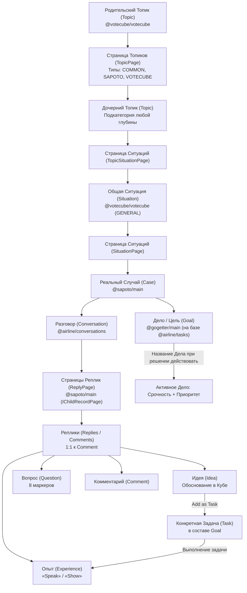
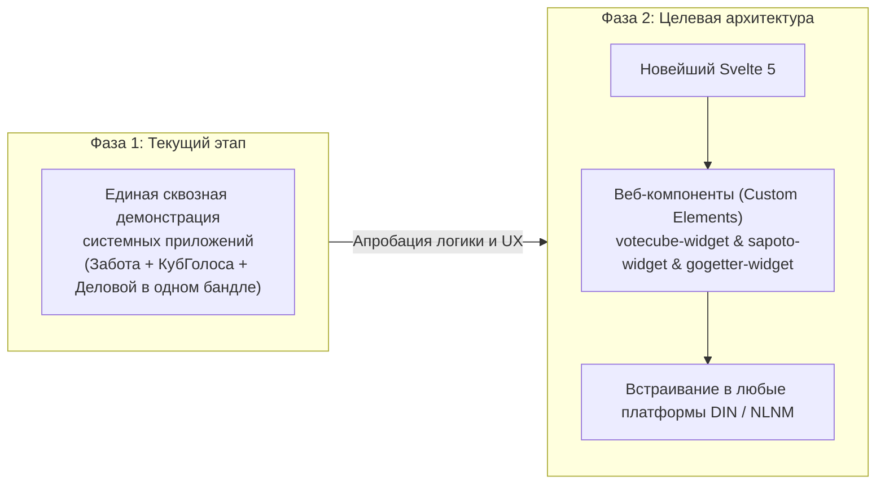

# Sapoto.net («Забота») и КубГолоса (Votecube)
## Полное концептуальное и архитектурное руководство по прототипу

---

## 1. Концепция и видение платформы

### 1.1. Что такое «Забота» (Sapoto.net)?
Название **Sapoto** происходит от японского слова *サポート (Sapōto — «поддержка», «забота»)*. Дополнительный семантический слой обыгрывает испанское слово *sapo («жаба»)* как метафору качественного скачка (*leapfrog*) человеческого общества на качественно новый уровень взаимной помощи, обмена опытом и решения жизненных проблем.

В отличие от традиционных социальных сетей и форумов, где поиск решения превращается в хаотичную линейную ленту комментариев с колоссальным уровнем информационного шума, «Забота» предлагает **структурированную когнитивную архитектуру**:
* Проблемы не обсуждаются абстрактно, а формулируются как конкретные, оцениваемые **Реальные Случаи (Cases)**.
* Случай может быть связан с более абстрактной **Общей Ситуацией (Situation)** из КубГолоса (с определенными дополнениями/изменениями) или построен с нуля.
* В пользовательском интерфейсе Случаи Заботы интегрированы с приложением **«Деловой»**: каждый Случай связывается с потенциальным **Делом (Goal)**, которое наделяет его **Срочностью и Приоритетом**. Сообщество оценивает важность: делать из этого случая Дело или нет.
* **Жизненный цикл Дела**: название самого Дела (`Goal.name`) формулируется, когда пользователь решает, что именно (если вообще что-то) предпринять по поводу этого случая. До этого момента в UI отображается название Случая и Срочность/Приоритет связанного с ним, пока еще возможного Дела.
* **Поддержка на местах (On-the-ground support)**: сеть «Забота» предназначена не только для информационной взаимопомощи онлайн, но и для реальной физической поддержки на местах, поскольку опирается на древовидную логическую топологию **Турбазы** с криптографической проверкой нахождения участников в одном районе, округе или городе.
* Поток ответов строго дифференцирован: **Идеи (Ideas)**, **Жизненный опыт (Experiences)**, **Вопросы (Questions)** и **Комментарии (Comments)**. Все записи заплюсовываются (+1), могут прикреплять опросы КубГолоса и образовывать под-цепочки через платформенную концепцию Страниц.

### 1.2. Место в платформе Data Independence Network (DIN)
«Забота» (Sapoto), «КубГолоса» (Votecube) и «Деловой» (GoGetter) являются фундаментальными, **системообразующими приложениями** экосистемы DIN (Data Independence Network). Они создаются как легковесные, компонуемые модули, способные как работать самостоятельно, так и бесшовно встраиваться друг в друга и во внешние платформы.

### 1.3. Муниципальное деление, топология Турбазы и архитектура без традиционного сервера
* **Отсутствие традиционного сервера и Листья как реляционные СУБД**:
  - В архитектуре платформы **как такового традиционного сервера нет**.
  - **Листья (аппараты пользователей)** получают дополнения в журналах изменений хранилищ (WAL-дельты) и объединяют их непосредственно в своей собственной локальной реляционной базе данных (SQLite / AIRport WASM).
  - Вся бизнес-логика, пользовательские запросы и отображение интерфейса выполняются локально на аппарате.
* **Шлюзы Веток и Ветвей с адаптивным древовидным разделением**:
  - Ветки (муниципальные) и Ветви (кооперативные) — это не серверы приложений, а высокоэффективные **шлюзы координации и маршрутизации данных** (Zero-Rendering Gateways, никогда не рендерящие HTML или UI).
  - С появлением «КубГолоса» и «Заботы» эти шлюзы получают **дополнительные специализированные функции**, поскольку им необходимо работать с **общей информацией**. Для этого шлюзы делят общую информацию **древовидными методами разного подбора в зависимости от вида информации**:
    1. *Древовидные самозапечатывающиеся страницы (`IChildRecordPage`)*: деление связей 1:N (списки случаев, треды сообщений `ReplyPage`, каталоги ситуаций);
    2. *Деревья категорий и топиков*: иерархическая классификация с потоком обработки родительских тем вверх по дереву (**Upstream Category Processing**) на узлах кооперативов;
    3. *Оперативные счетчики (Counters) и Блоки Эпох*: агрегация волеизъявлений, квот и 3D-векторов факторов в оперативной памяти шлюза без дисковых задержек;
    4. *Территориальные деревья*: географический контур видимости и ответственности.
* **Интеграция со внешними поисковиками**:
  - Прямая интеграция со внешними поисковыми системами (Яндекс и др.) через санкционированный экспорт структурированных дельт (JSON-LD Push Stream) существенно помогает гражданам находить нужную информацию в децентрализованной сети.
  - Поисковик приводит пользователя к конкретному топику или случаю, после чего Лист запрашивает журнал изменений целевого хранилища через шлюз Ветки и объединяет его в своей локальной базе данных.
* **Двойная иерархия ветвей (Территориальная vs Категориальная)**:
  1. **Территориальные суверенные Ветки (Territorial Sovereign Branches)**:
     - Дерево административно-территориального деления: Ствол (Федерация) $\to$ Регион $\to$ Город / Округ $\to$ Районная Ветка;
     - Контролируют физический периметр входа (Ingress), защищенный mTLS-конвейер платформы «Турбаза», криптографическую валидацию резидентства через Zero-Knowledge Proofs (ZKP) и ведение каталога локализованных Ситуаций и Случаев района.
  2. **Категориальные Ветки Кооперативов платформы (Categorical Branches of Platform Cooperatives)**:
     - Нелокализованное иерархическое дерево Топиков и Категорий;
     - **Поток обработки направлен вверх (Upstream Category Processing)**: запросы по родительским категориям направляются вверх по дереву категориальных ветвей кооператива, где они обрабатываются и кэшируются на родительских узлах.
* **Двухуровневая модель видимости**:
  1. **Глобальный уровень**: фундаментальные общечеловеческие темы (воспитание детей, психология отношений, здоровье) доступны глобально по всей сети через категориальные ветви кооперативов.
  2. **Локальный / муниципальный уровень**: практические, бытовые и средовые ситуации привязываются к территориальной муниципальной ветке (округ, город, метро-ареал), гарантируя, что участники обсуждения являются реальными локальными жителями, способными оказать физическую поддержку на месте.

### 1.4. Единое дерево Топиков и инфраструктура Кооперативов платформы
Сущности `Theme`, `SubTheme` и `SubTopic` полностью упразднены. Вся тематическая структура и категоризация платформы опирается на единую универсальную древовидную сущность **`Topic`** в схеме `@votecube/votecube` (`parentTopic: Topic`), управляемую через систему Самозапечатывающихся страниц (`TopicPage`):

1. **Кооперативы платформы и локальные юридические лица**:
   - В зависимости от страны и юрисдикции, официальные **кооперативы платформы** (или соответствующие юридические лица) берут на себя техническую поддержку, хостинг и обслуживание этих «общих деревьев, а точнее ветвей» (*shared public trees / branches*).
2. **Экономическая модель и распределение прибыли (FSM `share(...)`)**:
   - Кооперативы/юрлица и операторы узлов получают **гарантированную долю прибыли от рекламы и подписок** (наряду с арендаторами серверных мощностей по смарт-контракту `share(...)`), что обеспечивает устойчивое финансирование инфраструктуры без эксплуатации пользовательских данных.
3. **Инфраструктурные мощности (Синхронизация и Индексирование)**:
   - Серверные мощности кооперативов используются для синхронизации данных и глобального индексирования всех системных и сторонних приложений, где не требуются собственные приватные ветви.
4. **Приватные семейные и групповые хранилища**:
   - Логика и схемы Заботы и КубГолоса полноценно функционируют и в изолированных семейных и командных хранилищах, которые **не индексируются и не попадают в публичные страницы на ветках**.

---

## 2. Иерархия сущностей предметной области



### 2.1. Уровни абстракции:
1. **Топик (`Topic` в `@votecube/votecube`)**: Единая древовидная сущность категоризации (`parentTopic`). Корневые топики заменяют бывшие глобальные Темы, а дочерние — любые уровни подкатегорий. Масштабируется через страницы `TopicPage`.
2. **Общая Ситуация (`Situation` в `@votecube/votecube`)**: Абстрактная проблема или вызов (`type: GENERAL`), аккумулирующая через страницы `SituationPage` множество похожих реальных случаев.
3. **Реальный Случай (`Case` в `@sapoto/main`)**: Составная конструкция Заботы:
   - Ссылка на `Topic` (`@votecube/votecube`);
   - Опциональная ссылка на Общую Ситуацию `situation?: Situation` (`@votecube/votecube`);
   - Ссылка на тред обсуждения `conversation: Conversation` (`@airline/conversations`);
   - Опциональная ссылка на частный опрос ситуации `question?: Question` (`@votecube/votecube`).
4. **Дело (`Goal` в `@gogetter/main` на базе `@airline/tasks`)**:
   - Связано со Случаем (`case: Case`);
   - Обладает Срочностью (`urgency`) и Приоритетом (`importance`);
   - Пока пользователь не решил действовать, в UI отображается название Случая со Срочностью и Приоритетом потенциального Дела;
   - При принятии решения действовать формулируется конкретное имя `Goal.name`.
5. **Задачи (`Task` в составе `Goal`)**: Конкретные исполнительские действия с дедлайнами, создаваемые при нажатии **«Add as Task»** на одобренных Идеях.
6. **Ответ (`Reply` в `@sapoto/main`)**: Связан 1:1 с `Comment` из `@airline/conversations`, принимает одну из 4 ролей (Идея, Опыт, Вопрос, Комментарий), заплюсовывается (+1) и может прикреплять опросы КубГолоса. Под-цепочки сообщений масштабируются через страницы `ReplyPage` (`IChildRecordPage`).


---

## 3. Детальный анализ: Идеи, Опыт, Вопросы и Комментарии

| Параметр сравнения | Идея (Idea / `isIdea`) | Опыт (Experience / `isExperience`) | Вопрос (Question / `isQuestion`) | Комментарий (Comment) |
| :--- | :--- | :--- | :--- | :--- |
| **Семантическая природа** | **Предписывающая (Prescriptive)**: *«Что следует сделать»* | **Описательная (Descriptive)**: *«Что реально произошло на практике»* | **Интеррогативная**: *«Каковы недостающие данные»* | **Дискурсивная**: *«Мысли, поддержка, реакция»* |
| **Когнитивная роль** | Сформулировать метод, гипотезу или план действий для выхода из ситуации. | Представить объективное эмпирическое свидетельство испытания метода. | Устранить неполноту исходных условий ситуации. | Общая эмоциональная или смысловая поддержка. |
| **Оценка истинности** | **КубГолоса (Votecube)**: взвешивание 3 причин и расчет консенсуса. | **Пиринговый рейтинг сообщества** (лайки / дизлайки: `Up-` vs `Down-ratings`). | Отметка полезности автором ситуации. | Базовая реакция сообщества. |
| **Калибровка матрицы** | **Срочность (Urgency) vs. Приоритет (Priority)** (шкала 1–5). | Соответствие контексту и достоверность исхода. | Критичность для понимания проблемы. | Не калибруется. |
| **Структура аргумента** | **Дерево причин (Reasons Tree)** с лингвистической грамматикой. | Нарратив + Мультимедиа: **Голос («Speak»)** и **Видео («Show»)**. | 8 стандартных маркеров (Что, Кто, Где, Когда, Почему, Как и др.). | Свободный текст. |
| **Возможное действие** | **Обосновать в Кубе** (`Reason About`) и преобразовать в задачу (`Add as Task`). | Использовать как доказательство *«За»* или *«Против»* Идеи. | Предоставить уточняющий ответ. | Ответ на комментарий. |

### 3.1. Связывание Опыта с Идеей и Ситуацией (Гибридная модель)
Опыт может быть опубликован в треде в двух форматах:
1. **Как отчет о тестировании конкретной Идеи** (дочерний ответ через `parentReply`):
   - Опыт прикрепляется непосредственно к карточке Идеи.
   - В соответствии с инвариантом «Write-Self» сторонний участник не мутирует исходную запись Идеи автора: создается независимая сущность Опыта (`Experience`), а счетчик `idea.counts.experiences` агрегируется динамически (через SQL-запросы или оперативные счетчики Ветки).
   - Опыт напрямую вносит вклад в **Шкалу Результата** данной идеи и структурированную валидацию ее причин (+1 / 0 / -1), динамически корректируя эмпирический консенсус в зависимости от того, подтвердил ли он успех методики на практике.
2. **Как корневой опыт в треде Ситуации**:
   - Опыт публикуется на уровне всей ситуации в целом.
   - Описывает то, что автор ситуации или участник уже опробовали лично до появления предложенных идей (исторический бэкграунд проблемы).

### 3.2. Жизненный цикл Ситуации и переход в Базу Знаний
1. **Стадия выработки решений (Open)**:
   - Сообщество задает уточняющие вопросы, предлагает Идеи и делится Опытом.
2. **Принятие решения автором (Resolved)**:
   - Когда автор ситуации находит методику, которая реально помогла решить проблему, он отмечает соответствующую Идею как **Принятое решение (Accepted Solution)**.
   - Автор также отмечает конкретные Причины (Reasons), которые сыграли решающую роль.
3. **Фиксация в Базе Знаний топика («Проверенный Рецепт»)**:
   - Связка *«Ситуация + Победившая Идея + Подтверждающий Опыт»* получает статус канонического проверенного рецепта (*Best Practice*) и закрепляется в топе каталога топика.
   - **Тред остается открытым**: другие участники могут продолжать предлагать альтернативные идеи и делиться новым опытом, расширяя вариативность решений.

### 3.3. Жизненный цикл Вопросов и обогащение контекста Ситуации
Уточняющие вопросы играют критическую роль в устранении информационной неопределенности:
* **8 вопросительных маркеров**: реплика-вопрос классифицируется стандартными категориями: *What (Что)*, *Which (Какой/Который)*, *Who (Кто)*, *Where (Где)*, *Why (Почему)*, *When (Когда)*, *How (Как)*, *Whose (Чей)*.
* **Закрытие с обогащением контекста**:
  1. Участник задает вопрос (например: *«How? Каков режим бодрствования ребенка перед сном?»*).
  2. Автор ситуации публикует ответ.
  3. Вопрос помечается статусом **«Отвечен» (Answered)**.
  4. Ключевая фактологическая выжимка автоматически закрепляется в специальном верхнем блоке **«Уточненный контекст Ситуации»** (*Refined Context*).
* **Польза для системы**:
  - Исключаются повторные однотипные вопросы от разных участников.
  - Авторы новых Идей сразу видят полную картину условий, формулируя более точные и действенные решения.
  - Участники, задавшие продуктивные уточняющие вопросы, поощряются очками Хорошего Гражданина.

### 3.4. Мультимодальный Опыт: Аудио («Speak») и Видео («Show») с локальной транскрипцией
Практический опыт людей зачастую трудно передать сухим текстом (интонация успокоения, демонстрация упражнения или бытовой лайфхак):
* **Браузерная запись без плагинов**:
  - Кнопки **«Speak»** (голос) и **«Show»** (видео) активируют стандартный браузерный интерфейс захвата потока через HTML5 `MediaStream` и `MediaRecorder` API.
* **Децентрализованное блоб-хранилище**:
  - Записанные медиафайлы сохраняются в локальном/пиринговом блоб-репозитории ветви AIRport.
* **Локальная On-Device транскрипция (Speech-to-Text)**:
  - Прямо на устройстве пользователя (через Web Speech API или компактную Wasm-модель) аудиопоток переводится в текстовую транскрипцию.
  - Это решает сразу две ключевые задачи:
    1. **Полная индексация и поиск**: содержание голосовых и видео-отзывов мгновенно доступно для поиска по ключевым словам без скачивания тяжелых файлов.
    2. **Приватность и доступность**: участники могут прочитать суть опыта в текстовом виде в любой обстановке.

---

## 4. Интеграция с «КубГолоса» (Votecube)

### 4.1. Концепция трех факторов и сбалансированный анализ (Top-3 Factors & Pro/Contra)
Методология **КубГолоса** гласит: **любое человеческое решение определяется балансом трех главных факторов**.
В геометрии куба три ключевых фактора сопоставлены трем пространственным осям:
* **Ось X**: Фактор 1
* **Ось Y**: Фактор 2
* **Ось Z**: Фактор 3

**Сбалансированный анализ (Pro & Contra на осях Куба)**:
* Каждая причина в системе имеет признак направленности `isPositiveOutcome`:
  - **Аргументы «ЗА» (Достоинства / Плюсы)**: `isPositiveOutcome = true` (положительное содействие результату, полюс $+1$).
  - **Аргументы «ПРОТИВ» (Риски / Побочные эффекты / Минусы)**: `isPositiveOutcome = false` (негативные последствия, барьеры или издержки, полюс $-1$).
* В «КубГолоса» участник может одновременно разместить на трех осях Куба как достоинства, так и риски (например, 2 плюса и 1 сдерживающий риск).
* Вращение куба или перемещение трех карточек распределяет **100 базисных пунктов совокупного влияния** между этими тремя факторами, а итоговый 3D-вектор наглядно демонстрирует, перевешивают ли достоинства возможные риски и побочные эффекты.

### 4.2. Архитектурная модель данных и однонаправленная иерархия схем
Архитектура экосистемы DIN опирается на строгую однонаправленную зависимость схем данных:
$$\text{КубГолоса (VoteCube)} \longleftarrow \text{Забота (Sapoto)} \longleftarrow \text{Деловой (GoGetter)}$$

* **Схема «КубГолоса» (`@votecube/votecube`)** является фундаментальной независимой базовой схемой.
* **Схема «Заботы» (`@sapoto/main`)** напрямую зависит от «КубГолоса». (Пакет `@sapoto/core` полностью упразднен, так как его концепции переехали непосредственно в `@votecube/votecube`).
* **Схема «Делового» (`@gogetter/main` на базе `@airline/tasks`)** напрямую зависит от «Заботы» и «КубГолоса».

В этой архитектуре:
* **`Topic`** (`@votecube/votecube`): универсальная древовидная сущность категоризации, заменившая упраздненные `Theme`, `SubTheme` и `SubTopic`. Поддерживает самореферентную вложенность (`parentTopic`) и постраничную навигацию `TopicPage` (типы страниц: `COMMON = 1`, `SAPOTO = 2`, `VOTECUBE = 3`), а также привязку ситуаций через `TopicSituationPage`.
* **`Situation`** (`@votecube/votecube`): базовая сущность контекста проблемы или обстановки (`type: Situation_Type`: `GENERAL = 1` для общих абстрактных проблем и `SPECIFIC = 2` для частных ситуаций). Содержит `text`, ссылку на `topic`, коллекцию решений `situationIdeas`, а также агрегированные показатели `urgencyTotal` и `importanceTotal` (`@Transient()`, вычисляемые динамически без прямой мутации записи автора сторонними лицами согласно инварианту «Write-Self»). Масштабируется через страницы `SituationPage`.
* **`Case`** (`@sapoto/main`): Реальный Случай в Заботе. Составная сущность, содержащая ссылку на топик `topic: Topic`, опциональную ссылку на общую ситуацию `situation?: Situation`, тред `conversation: Conversation` (из `@airline/conversations`) и частный вопрос-опрос `question?: Question` (из `@votecube/votecube`).
* **`Reply`** (`@sapoto/main`): реплика в треде Случая, имеющая отношение 1:1 к `Comment` из платформенной схемы `@airline/conversations`. Классифицируется 4 модальностями (Идея, Опыт, Вопрос, Комментарий), заплюсовывается пользователями (+1) и может прикреплять опросы КубГолоса.
* **`ReplyPage`** (`@sapoto/main`): сущность страницы реплик, реализующая платформенный контракт `IChildRecordPage`. Разбивает тред сообщений Случая на ограниченные страницы-репозитории (~1000 записей), предотвращая раздувание репозитория при вирусных дискуссиях.
* **`Idea`** (`@votecube/votecube`): гипотеза решения или утверждение. Может существовать глобально в каталоге топика (`IdeaTopic`) и иметь древовидную иерархию (`parent`/`children`), а также привязываться к ситуациям.
* **`SituationIdea`** (`@votecube/votecube`): ключевая связующая сущность внутри КубГолоса, фиксирующая контекст применения Идеи к конкретной Ситуации. Содержит массив `ideaReasons`, локальные соглашения `agreements`, а также локальные вычисляемые метрики (`@Transient()`): `agreementShareTotal`, `numberOfAgreements`, `priorityTotal`, `urgencyTotal`, формируемые динамически на основе соглашений участников без мутации записи автора.
* **`Position`** (`@votecube/votecube`): грамматическая формулировка аргумента в формате `Subject + Action + Object + Text`, повторно используемая в различных идеях.
* **`Factor`** (`@votecube/votecube`): системная или пользовательская категория фактора (ось X/Y/Z, наименование, цветовая палитра RGB).
* **`Reason`** (`@votecube/votecube`): смысловая связка `Factor` + `Position`.
* **`IdeaReason`** (`@votecube/votecube`): привязка конкретной Причины к Идее или Ситуации-Идее с указанием `isPositiveOutcome` и параметров отображения `ReasonCubeDisplay` (`axis`, `dir`, `factorNumber`, `red/green/blue`).
* **`Agreement`** (`@votecube/votecube`): запись факта голосования конкретного пользователя, содержащая `shareTotal` (до 100 б.п.).
* **`AgreementIdeaReason`** (`@votecube/votecube`): детальная разбивка пользовательского голоса, фиксирующая индивидуальную долю `share` (0–100%) по каждой из 3 выбранных причин.


### 4.3. Двухуровневый сценарий голосования (Two-Tier Voting UX Flow)
Для совмещения массовой вовлеченности (минимизация когнитивной нагрузки) и глубины аналитического взвешивания аргументов реализован двухуровневый UX:
1. **Уровень 1: «Быстрый голос» (1-Click Quick Vote)** — сценарий для ~90% участников:
   - На карточке Идеи отображается изометрическая миниатюра Кубика, текущий балл Assent (1–5) и канонические Top-3 причины сообщества.
   - Пользователь нажимает кнопку быстрого согласия в 1 клик.
   - Система автоматически создает `Agreement`, принимая текущий канонический Top-3 причин сообщества с эталонной пропорцией распределения долей (например, 50% / 30% / 20%).
2. **Уровень 2: «Глубокая калибровка в 3D-Кубе» (Deep Cube Calibration)** — сценарий для вдумчивых участников и экспертов:
   - Клик по миниатюре Кубика открывает полнофункциональное интерактивное модальное окно «КубГолоса».
   - Пользователь видит полный пул доступных причин (как «ЗА», так и «ПРОТИВ»), может перетаскивать их, выбирать свои 3 ключевых фактора или добавить новую причину через форму краудсорсинга.
   - Пользователь вращает интерактивный 3D-Куб или перемещает слайдеры трех карточек, точно калибруя баланс влияния (100 б.п.) и полярность (+1 / -1).

### 4.4. Алгоритм попричинной кросс-пользовательской агрегации
Поскольку каждый голосующий на Уровне 2 волен выбрать свою уникальную комбинацию трех причин:
1. **Попричинный накопитель (Per-Reason Accumulator)**:
   - Каждая отдельная Причина $R_i$ накапливает индивидуальные доли (`share` от 0 до 100) и направленность ($\pm 1$) из всех персональных кубов, в которые она была включена.
2. **Динамическое формирование канонического Top-3 причин**:
   - Три причины с наибольшим накопленным весом и результирующим положительным вектором автоматически закрепляются на осях X, Y, Z канонического **Глобального Top-3 факторов Идеи** для всего сообщества.
3. **Расчет совокупного согласия (Assent)**:
   - Интегральный консенсус Идеи в Кубе рассчитывается на базе агрегированного вектора признанных сообществом ключевых причин.

### 4.5. Синтетическая 3D-визуализация и переключение 3 проекций
В миниатюре на карточке и в модальном окне «КубГолоса»:
* **Синтетический 3D-Куб по умолчанию**: трехмерный Куб ориентируется и окрашивается в соответствии со **Сводным байесовским вектором консенсуса**, объединяющим Опыт, Экспертов и Народ.
* **Переключатель трех проекций**: в модальном окне пользователь может в один клик переключить 3D-проекцию Кубика, чтобы увидеть решение глазами разных групп:
  1. **«Результат» (Эмпирика)**: Куб поворачивается в положение, подтвержденное исключительно реальным практическим Опытом практиков.
  2. **«Эксперты»**: Куб демонстрирует баланс аргументов, взвешенный по репутационным баллам экспертов в данном топике ($W_{\text{reputation}}$).
  3. **«Народ»**: Куб показывает чистую прямую демократию сообщества ($1 \text{ человек} = 1 \text{ голос}$).
* Под Кубом выводятся индикаторы доверия по каждой из 3 шкал и общий расчетный балл Assent (1–5).

### 4.6. Замыкание эмпирической петли через Опыт (Experience $\rightarrow$ Reasons Loop)
Ключевая инновация связки «Забота + КубГолоса» состоит в том, что абстрактные гипотезы проверяются эмпирической практикой:
1. **Структурированная попричинная валидация**:
   - Когда автор ситуации или любой участник публикует практический Опыт применения Идеи, он не просто описывает результат текстом/видео/аудио, но и **структурированно оценивает ключевые Причины Идеи**:
     - $+1$ (Подтверждено): данная причина действительно сыграла решающую роль в успехе.
     - $0$ (Нейтрально): фактор не оказал заметного влияния.
     - $-1$ (Опровергнуто): на практике гипотеза оказалась ошибочной или вредной.
2. **Прямое влияние на Шкалу Результата**:
   - Оценки из Опыта поступают непосредственно в эмпирический накопитель соответствующих причин.
   - Если практический опыт опровергает причину, ее вес в Шкале Результата падает до нуля или становится отрицательным, что автоматически корректирует сводный консенсус Идеи.

### 4.7. Гибридный масштаб каталога (Локальные и Глобальные Идеи)
* **Повторная используемость**: Идея не заперта внутри одного треда. Успешные решения из глобального каталога топика (`IdeaTopic`) могут привязываться к новым Ситуациям.
* **Сущность `SituationIdea`**: гарантирует, что локальный контекст проблемы сохраняет свои специфические причины, соглашения и остроту, в то время как глобальная сущность `Idea` накапливает общесистемный авторитет и статистику успешности по всей платформе.

### 4.8. Фрактальность, краудсорсинг и автоматическая инвалидация причин
* **Краудсорсинг при холодном старте**: если у Идеи меньше 3 причин ($0, 1$ или $2$), любой участник прямо в Кубе может добавить новый аргумент или проголосовать с 1–2 активными осями.
* **Фрактальное независимое голосование**: любая Причина может быть отправлена на отдельное независимое голосование через КубГолоса (где она оценивается по 3 собственным под-факторам).
* **Автоматическая инвалидация**: если Причина признана недостоверной в отдельном голосовании, ее вклад в Assent всех опирающихся на нее Идей аннулируется, а в интерфейсе выставляется бейдж **«Оспорено сообществом»**.

### 4.9. Автоматический авторский посев (Seed Vote)
Для устранения проблемы холодного старта при создании новой Идеи:
* Публикация Идеи автором в «Заботе» автоматически генерирует в базе данных первый `Agreement` автора в «КубГолоса».
* Сформулированные автором причины (от 1 до 3) сразу занимают стартовые позиции на осях X, Y, Z с эталонным распределением долей (например, 50% / 30% / 20% при трех причинах) и положительной полярностью $+1$.
* Благодаря этому 3D-Кубик не бывает «пустым» или неинициализированным: с первой же секунды в ленте отображается живая 3D-модель гипотезы автора, готовая к мгновенному согласию в 1 клик или детальной перекалибровке другими участниками.

### 4.10. Серверные технологии: децентрализованное разбиение связей 1:N через Страницы (`IChildRecordPage`) и координация Ветками
* **Невозможность прямого One-to-Many в децентрализованных P2P-репозиториях**:
  - В AIRport и «Турбазе» репозиторий является неделимой единицей хранения, криптографического контроля целостности и синхронизации.
  - Прямая связь `1:N` («одна ситуация $\to$ миллион случаев», «один случай $\to$ тысячи реплик») внутри одного репозитория приводила бы к раздуванию журнала транзакций (WAL) до десятков гигабайт. При первой синхронизации смартфон был бы вынужден скачивать гигабайты данных, а параллельные записи вызывали бы тяжелые конфликты слияния дельт.
* **Решение: Страница как независимый репозиторий (`IChildRecordPage`)**:
  - Каждая страница (`TopicPage`, `TopicSituationPage`, `SituationPage`, `ReplyPage`) — это отдельный компактный репозиторий AIRport.
  - Страница хранит фиксированный массив сносок на дочерние сущности с мягким лимитом около 1000 элементов ($K \approx 1000$).
  - **Запечатывание (Self-Sealing)**: по достижении емкости страница запечатывается (`isSealed: true`), становится неизменяемой (Read-Only) и навсегда кэшируется узлами и клиентами. Следующие записи направляются в порожденную дочернюю страницу (`childPages`).
* **Топология Веток как координаторов (Append-Only Sequencer)**:
  - Топики, Ситуации и территориальные Случаи распределены по дереву Веток (Ствол $\to$ Региональная Ветка $\to$ Районная Ветка).
  - Каждая Ветка ведет закрепленный за ней Топик или Ситуацию, знает текущее состояние активной страницы и заблаговременно подготавливает переход на следующую страницу при заполнении текущей.
  - Погрешность в несколько записей (например, 1015 вместо 1000) не критична; главное — гарантируется константный размер репозиториев $O(1)$ и корректная адресация через уровни дерева Веток.
* **Изоляция приватных хранилищ**:
  - Семейные и закрытые групповые хранилища Заботы работают по E2EE и хранятся в едином зашифрованном репозитории без деления на страницы и без индексации Ветками.
* **Неизменяемость запечатанных страниц (CAS / Immutable Pages навсегда)**:
  - Запечатанные страницы остаются неизменяемым архивом навсегда (`Content-Addressable Storage`).
  - Уплотнение (compaction) не требуется: каждая запечатанная страница кэшируется узлами и устройствами как неизменяемый статичный файл (0 байт повторного сетевого трафика), сохраняя вечную историческую целостность и криптографические хэши.
* **Слияние семантических дубликатов (Aliasing & Redirects)**:
  - Для Ситуаций и Случаев, как и для факторов в КубГолосе, предусмотрен механизм прозрачного алиасинга через поле-редирект (`mergedIntoSituationId` / `mergedIntoCaseId`).
  - Исходная сущность помечается как объединенная и прозрачно перенаправляет запросы на каноническую, сохраняя ссылочную целостность всех внешних связей и тредов.
* **Локальный и ветвевой AI / SLM (Zero-PII On-Device & Edge AI)**:
  - Легковесные локальные и ветвевые нейросетевые модели (Small Language Models, SLM) привлекаются для интеллектуальной поддержки пользователей:
    1. *Автоподбор Топика*: классификация текста Случая и подсказка наиболее точной ветви каталога;
    2. *Выжимка «Уточненного контекста»*: автоматическое извлечение ключевых фактов из ответов автора на вопросы участников;
    3. *Семантический поиск похожих Идей и Причин*: предотвращение дублирования аргументов на этапе ввода.
  - Все модели исполняются строго локально на устройстве пользователя (On-Device WebGPU/Wasm) или на доверенной районной Ветке без передачи персональных данных наружу (Zero-PII).
* **Шлюзы без рендеринга (Zero-Rendering Headless Gateways)**:
  - Серверы Веток **никогда не рендерят HTML, интерфейсные компоненты или графику**. Они функционируют исключительно как легковесные шлюзы координации данных, валидации криптографических подписей и маршрутизации дельт;
  - 100% пользовательского интерфейса (деревья топиков, карточки ситуаций, интерактивный 3D-Куб, матрицы Эйзенхауэра) рендерятся исключительно на клиентских устройствах (Листьях) средствами локального движка/WASM/WebGPU.
* **Двойная иерархия ветвей (Территориальные vs Категориальные Ветки)**:
  1. *Территориальные суверенные Ветки*: административно-территориальное деление (Ствол $\to$ Регион $\to$ Город $\to$ Район). Контролируют физический вход (Ingress), защищенный mTLS-конвейер платформы «Турбаза», крипто-верификацию резидентства (ZKP) и ведут районный каталог Случаев.
  2. *Категориальные Ветки Кооперативов платформы*: нелокализованная иерархия Топиков/Категорий. Запросы по родительским категориям направляются **вверх по дереву (Upstream Category Processing)**, где они агрегируются и кэшируются на родительских узлах кооператива.
* **Гибридная маршрутизация через PassThroughConnection (Территория + Категория)**:
  - При поиске случаев в конкретном топике и районе Лист опрашивает категориальную ветку через районную Ветку с использованием **PassThroughConnection** (защищенный mTLS-конвейер платформы), получая страницы топика, а локальные случаи запрашивает напрямую с районной Ветки. Это защищает категориальные серверы от прямого публичного DDoS-воздействия из открытого интернета.
  - Пересечение и фильтрация выполняются **непосредственно в собственной реляционной базе Листа** (SQLite / AIRport WASM) быстрыми операциями `INTERSECT` / `JOIN` без тяжелого межсерверного проксирования.
* **Криптографическая адресация репозиториев при записи и контекст хронологического чтения**:
  - В архитектуре AIRport/«Турбаза» дельты WAL криптографически подписываются Листом (`ActorId`) строго для конкретного идентификатора репозитория (`RepositoryId`). Хотя Лист не рассчитывает лимиты емкости страниц (~1000 записей) и логику их запечатывания (это задача шлюза-секвенсора Ветки), при записи Лист явно адресует и подписывает транзакцию для **текущей активной страницы** (`currentActivePageRepoId`), публикуемой Веткой.
  - Концепция Страниц (`IChildRecordPage`) служит для Листа как адресом назначения при записи, так и неизменяемой единицей CAS-кэширования при хронологическом чтении тредов (сообщений по порядку появления) или хронологическом чтении других коллекций.
* **Криптографические Анонимные Маски (ZKP Ephemeral ActorId)**:
  - `Actor` в AIRport определяется строго как: *конкретный пользователь, использующий конкретное приложение на конкретном устройстве*.
  - При активации анонимной маски Лист локально генерирует эфемерную пару ключей (`ephemeral ActorId`), действующую **в границах треда конкретного Случая (Thread-Scoped)**.
  - Пост публикуется под эфемерным `ActorId`: Ветка и соседи проверяют ZKP-доказательство резидентства без раскрытия мастер-идентичности, автор может отвечать в треде со статусом «Автор», а зашифрованная репутация накапливается на мастер-профиле.
* **Общий платформенный код суверенных Веток и эволюция примитивов (Страницы и Счетчики)**:
  - Локальные суверенные Ветки содержат **общий платформенный код** ядра «Турбазы» / AIRport.
  - Этот единый код взаимодействует:
    - с **«Заботой»** — через масштабируемые **Страницы** (`IChildRecordPage`), обеспечивая пагинацию деревьев и тредов;
    - с **«КубГолосом»** — через оперативные **Счетчики / Накопители** (сбор баланса факторов, учет квот и закрытие блоков эпох).
  - **Вывод на уровень платформы**: примитивы «Страницы» и «Счетчики» сейчас разрабатываются и тестируются в «Заботе» и «КубГолосе», но в дальнейшем будут полностью выведены на базовый уровень платформы. Любые другие приложения («Деловой», «УраРан» / «УраТур» и сторонние сервисы) будут использовать эти же универсальные платформенные примитивы для работы с данными на суверенных ветках.
* **Автономность и локальный контур взаимопомощи (Offline-First Mesh Mutual Aid)**:
  - В чрезвычайных ситуациях, при авариях связи или в сельской местности Листья организуют локальные P2P-сети (Wi-Fi/Bluetooth mesh) или подключаются к районному микро-серверу.
  - Граждане продолжают публиковать Случаи, обмениваться жизненно важным Опытом и координировать задачи помощи без внешнего интернета.
  - При восстановлении связи локальные WAL-дельты бесконфликтно реконсилируются с вышестоящей Веткой через механизмы CRDT.
* **TreeSearch и превентивная дедупликация Случаев (In-Flight Edge SLM)**:
  - При вводе описания Случая или Ситуации локальная модель (On-Device SLM) Листа строит семантический вектор и опрашивает Trie-индекс Ветки (технология TreeSearch).
  - Интерфейс предлагает: *«Похожая ситуация уже описана в вашем районе (совпадение 85%). Объединить усилия?»*, предотвращая распыление внимания сообщества.
* **Трехуровневая защита от атак Сивиллы (Sybil Resistance)**:
  - *Ценз локальности (ZKP)*: голосовать и открывать районные случаи могут только подтвержденные резиденты района без раскрытия личных данных.
  - *Квоты Ветки*: защита от флуда и спама дельтами на уровне шлюза.
  - *Многошкальная фильтрация*: фальшивые аккаунты не имеют веса в Шкале Экспертов и не могут сгенерировать эмпирический Опыт для Шкалы Результата.
* **Юридический статус и комплаенс 152-ФЗ «О персональных данных» (Self-Custody Zero-PII)**:
  - В сфере взаимопомощи граждане часто делятся чувствительными данными (здоровье, уход за пожилыми, семейные трудности). Все эти данные хранятся **исключительно на личном устройстве гражданина (Листе)** в зашифрованной локальной базе данных (Self-Custody).
  - Шлюзы Веток не хранят и не видят нерасшифрованные медицинские или личные досье (Zero-PII).
  - Муниципалитеты, школы и волонтерские центры, поддерживающие Ветку, **юридически освобождены от статуса «Оператора ПДн»** и рисков штрафов за утечки данных.

---

## 5. Многошкальный консенсус и вероятность правильности

В системе «Забота» консенсус строится на **байесовской многофакторной вероятности истинности**.

### 5.1. Три независимые шкалы
Итоговая вероятность того, что идея или причина является правильной, складывается из трех слагаемых, каждое из которых наглядно отображается в интерфейсе:

1. **Шкала Результата (Результат / Outcome)**:
   - Подтверждение реальным практическим **Опытом (Experiences)** от участников, применивших идею.
   - **Отметка автором ситуации**: автор исходной проблемы отмечает идею как решившую его вызов (автор также подтверждает правильность причин, по которым проблема была решена).
2. **Шкала Экспертов (Экспертный консенсус / Expert Consensus)**:
   - Суммарная оценка идеи и причин участниками, обладающими подтвержденной репутацией (экспертными очками) в данном топике.
   - **Математика веса**: в Экспертной шкале голоса умножаются на репутационный вес эксперта в данном топике:
     $$\text{Вклад голоса эксперта} = \text{Доля в кубе} \times W_{\text{reputation}}$$
3. **Шкала Народа (Народный консенсус / Public Consensus)**:
   - Демократическая оценка широким кругом участников сети через соглашения в Кубе (`Agreements`).
   - **Математика веса**: строго демократический принцип равного веса ($1 \text{ человек} = 1 \text{ голос} = 100 \text{ б.п.}$).

В интерфейсе отображается как **общая вероятность правильности решения**, так и **детальные значения по каждой из 3 шкал**:
$$\text{Итоговый консенсус} = f(\text{Результат}, \text{Эксперты}, \text{Народ})$$

### 5.2. Математика Байесовского консенсуса: Эмпирический приоритет (Принцип научной верификации)
Сводный консенсус $P(\text{Truth})$ рассчитывается динамически в зависимости от объема накопленного эмпирического опыта $n$ (числа подтвержденных Опытов):

$$P(\text{Truth}) = (1 - W_{\text{outcome}}(n)) \cdot \left( w_e \cdot \text{Experts} + w_p \cdot \text{Public} \right) + W_{\text{outcome}}(n) \cdot \text{Outcome}$$

где:
* $w_e$ и $w_p$ — нормированные веса Экспертов и Народа на этапе теоретического обсуждения (обычно $w_e = 0.6$, $w_p = 0.4$, $w_e + w_p = 1.0$).
* $W_{\text{outcome}}(n)$ — динамический вес Шкалы Результата, возрастающий асимптотически:
  $$W_{\text{outcome}}(n) = W_{\text{max}} \cdot \frac{n}{n + k}$$
  где $W_{\text{max}} \approx 0.80$ (максимальный вес эмпирики до 80%), а $k \approx 3$ (коэффициент полунасыщения выборки).

**Поведение модели по этапам жизненного цикла решения**:
1. **Этап гипотезы ($n = 0$)**: $W_{\text{outcome}} = 0$. Консенсус целиком формируется в «КубГолоса» через взвешивание мнений Экспертов и демократических голосов Народа.
2. **Этап первых проверок ($n = 1..3$)**: вес Шкалы Результата возрастает до 40–50%. Первые практические отзывы начинают корректировать теоретические предположения.
3. **Этап эмпирической зрелости ($n \ge 5..10$)**: вес Шкалы Результата достигает 70–80%. **Практика доминирует над теорией**: даже если идея была крайне популярна в Кубе, череда неудачных практических опытов снизит ее итоговый консенсус, защищая участников от заблуждений.

---

## 6. Репутация и поощрение («Токеномика заботы»)

### 6.1. Экспертные очки (Expertise Points)
* **Автор идеи / ответа**: получает **наибольшее количество очков**, когда предложенная им идея подтверждается практикой, экспертами и автором ситуации.
* **Участники, соглашающиеся с идеей/причиной**: получают **меньшее, но значимое количество очков**. Это стимулирует сообщество внимательно анализировать аргументы и голосовать за перспективные решения на раннем этапе (награда за проницательность и распознавание истины).

### 6.2. Очки хорошего гражданина (Good Citizen Points)
* Начисляются за активное участие в жизни сети и проявление заботы о других участниках (*«за заботу о других»*):
  - Помощь новичкам в формулировании ситуаций.
  - Написание подробного практического опыта.
  - Участие в модерировании и валидации аргументов.

---

## 7. Интеграция с менеджером задач «Деловой» (GoGetter)

### 7.1. Жизненный цикл Дела (`Goal`) и связь со Случаем (`Case`)
В схеме данных и интерфейсе действует выверенная связка между «Заботой» и приложением «Деловой»:
$$\text{Случай (Case в @sapoto/main)} \longleftrightarrow \text{Дело (Goal в @gogetter/main на базе @airline/tasks)}$$

1. **Потенциальное Дело при создании Случая**:
   - Когда пользователь публикует Реальный Случай (`Case`) в Заботе, в системе создается связанное потенциальное **Дело (`Goal`)**.
   - Сообщество добавляет свои оценки Срочности (`urgency`) и Приоритета/Важности (`importance`), давая понять автору и участникам, насколько критично решать эту проблему: **стоит ли делать из этого Случая Дело или нет**.
   - **Отображение в интерфейсе**: пока пользователь решает, что именно (если вообще что-то) предпринять, в UI отображается **название Случая** и **Срочность и Приоритет** связанного с ним, пока еще возможного Дела.
2. **Активация и формулирование Дела**:
   - Когда пользователь решает действовать, он формулирует конкретное название самого Дела (`Goal.name`). Если сообщество оценило случай как неважный, Дело может быть отправлено в архив или закрыто без действий.
3. **Импорт Идей как Задач («Add as Task»)**:
   - При клике **«Add as Task»** на одобренной Идее внутри этого Дела (`Goal`) создается конкретная **Задача (`Task`)** с дедлайнами и напоминаниями.
4. **Замыкание обратной связи через Опыт**:
   - При завершении Задачи (`Task`) «Деловой» через программную оболочку (API) Заботы (`@sapoto/main`) приглашает пользователя зафиксировать результат:
     > *«Задача выполнена! Опишите ваш Опыт (Experience) в Заботе, чтобы помочь сообществу!»*
   - Это генерирует подтвержденный практикой Опыт (`Experience`) в треде Случая, обновляя Шкалу Результата.

### 7.2. Двухуровневая матрица Эйзенхауэра и автоклассификация задач
Система матриц Эйзенхауэра действует согласованно на двух уровнях, связывая Заботу, КубГолоса и Деловой:
1. **Уровень Дела (`Goal.urgency` и `Goal.importance`)**:
   - Коллективные оценки сообщества определяют общую важность и неотложность решения проблемы в целом (позиция Дела в глобальной матрице).
2. **Уровень Идеи (`SituationIdea` в КубГолоса)**:
   - В сущности `SituationIdea` вычисляемые показатели `urgencyTotal` и `priorityTotal` (`@Transient()`) аккумулируют оценки участников о характере конкретного решения (на основе динамической агрегации соглашений без прямой мутации записи автора согласно инварианту «Write-Self»): является ли идея неотложной «скорой помощью» или долгосрочной привычкой/методикой.
3. **Автоматическое позиционирование Задач в «Деловом»**:
   - При создании Задачи (`Task`) из Идеи коллективные оценки срочности и приоритета автоматически распределяют задачу по квадрантам персонального органайзера в «Деловом»:
     - **Квадрант 1 (Срочно и Важно / Do First)**: экстренные практические шаги, требующие немедленного выполнения сегодня.
     - **Квадрант 2 (Важно, но Не срочно / Schedule)**: системные долгосрочные методики, автоматически резервирующие слоты в личном календаре.
     - **Квадрант 3 (Срочно, но Не важно / Quick Wins)**: простые разовые советы и быстрые действия.
     - **Квадрант 4 (Низкий приоритет / Backlog)**: фоновые идеи на перспективу.
   - Пользователь освобожден от ручной сортировки: коллективный консенсус сообщества сразу задает правильный ритм исполнения в таск-менеджере.

---

## 8. Приватность, Анонимные Маски и Псевдонимы

При обсуждении деликатных, интимных или кризисных вопросов (семейные конфликты, психологические травмы, сложные медицинские вызовы у детей) пользователи не должны опасаться деанонимизации перед соседями по муниципальной ветке или знакомыми:

1. **Верификация без деанонимизации (ZKP Residency Proof)**:
   - Пользователь криптографически подтверждает резидентство в муниципальной ветке через суверенную DIN-идентичность (что исключает спам и бот-атаки), используя доказательства с нулевым разглашением (Zero-Knowledge Proofs).
2. **Криптографические Анонимные Маски (ZKP Ephemeral ActorId)**:
   - `Actor` в AIRport определяется строго как: *конкретный пользователь, использующий конкретное приложение на конкретном устройстве*;
   - При публикации чувствительной Ситуации или Опыта Лист локально генерирует одноразовую эфемерную пару ключей (`ephemeral ActorId`), которая действует **в границах треда конкретного Случая (Thread-Scoped / Case-Scoped)**;
   - Это позволяет автору последовательно вести диалог и отвечать на уточняющие вопросы участников в статусе «Автор», оставаясь абсолютно анонимным для соседей и внешнего мира;
   - На устройстве формируется ZKP-доказательство резидентства на Ветке;
   - **Сохранение репутации**: полезный вклад (лайки, подтверждения опыта) фиксируется в виде зашифрованного репутационного токена, который автор может позже зачислить на свой мастер-профиль без раскрытия авторства конкретного поста.

---

## 9. Экономическая и Рекламная Модель DIN (Ad-Tech нового поколения)

В экосистеме DIN и «Заботы» отвергается модель «капитализма слежки» (*surveillance capitalism*), основанная на тайном сборе персональных досье, следящих куки-файлах и продаже данных третьим лицам. Монетизация платформы строится на принципах прозрачности, этики и прямого разделения прибыли с пользователем:

### 9.1. Контекстная реклама и подписки
* **Контекстный показ**: реклама привязана строго к теме и топику ветви (например, экологичные детские товары или консультации профильных специалистов в топике *«Время малышей»*), без агрессивного профилирования.
* **Подписки**: пользователи могут оформлять подписки на отключение рекламы и доступ к премиальным экспертным сервисам.

### 9.2. Анонимизированный параметрический profile с участием в прибыли
* Пользователь может добровольно заполнить свой **параметрический профиль** социальных когорт:
  - Возрастной диапазон (например, 25–35 лет), семейный статус (женат/замужем), число детей (2 ребенка), профессиональная сфера (IT) и т.д.
  - **БЕЗ указания персональных данных** (без имени, адреса, телефона, email).
* **Стимулирование полноты профиля (User Revenue Share)**:
  - **Чем полнее заполнен профиль, тем выше персональная доля прибыли пользователя от показанной рекламы!** (От 0% при пустом профиле до максимальной доли при полностью заполненном).

### 9.3. Сетевая анонимизация и On-Device AI Ad Matching
* **Анонимизация через ветку**:
  - Муниципальная ветка (кооперативный узел) маскирует и анонимизирует реальный сетевой (IP) адрес пользователя.
  - Обезличенный профиль передается на рекламную платформу в зашифрованном виде.
* **Локальный подбор рекламы искусственным интеллектом (On-Device AI)**:
  - Дополнительная суверенная опция: локальная модель ИИ, работающая непосредственно на устройстве пользователя, подбирает релевантные рекламные предложения из древовидного каталога/индекса рекламы (*tree-based ad indices*).
  - Личные предпочтения пользователя **никогда не покидают его собственное устройство**.

### 9.4. Модель FSM смарт-контракта share(...) и самоокупаемость мощностей (CBR Whitepaper 06)
В соответствии с концепцией смарт-контрактов Банка России (Whitepaper 06, раздел 4.3):
* **Детерминированный сплит O(1)**: выручка от рекламы и сервисов распределяется через неизменяемый FSM смарт-контракт:
  $$\text{share}(w_1, \text{Citizen}, \; w_2, \text{HostPortal}, \; w_3, \text{SoftwareTree}, \; w_4, \text{CapacityRenters})$$
* **Выделенная доля арендаторам мощностей (Capacity Renters Split)**:
  - Фиксированная гарантированная часть выручки направляется **арендаторам серверных мощностей и операторам узлов Веток**;
  - Это компенсирует затраты на содержание вычислительных нод, каналы связи, CAS-кэширование запечатанных страниц (`IChildRecordPage`) и работу шлюзов координации, обеспечивая полную экономическую независимость инфраструктуры;
* **Доля площадки встраивания (`HostPortal`)**:
  - Внешние сайты, медицинские блоги, сообщества взаимопомощи и порталы ЖКХ, встраивающие `<sapoto-widget>`, автоматически получают прямую долю ($w_2$) от рекламы и подписок;
* **Распределение остатка**:
  - До 10% направляется напрямую гражданину (`Citizen`) за внимание;
  - Оставшаяся часть распределяется по дереву библиотек и приложений (`SoftwareTree`) между разработчиками софта (@votecube, @sapoto, @gogetter и др.).

### 9.5. Не-суверенные коммерческие ветви кооперативов (Статус задачи)
* Категориальные ветви кооперативов поддерживаются преимущественно коммерческими организациями (бизнесами).
* Ключевой вызов для полностью автономных коммерческих веток — определение того, кто несет ответственность и подотчетность (accountability) за бесперебойное поддержание ветви в рабочем состоянии.
* Детальная проработка регламентов и механизмов не-суверенных систем веток вынесена в будущие этапы проектирования, так как на текущей фазе недостаточно практической информации. Фундамент системы ориентирован на суверенные территориальные Ветки и локальную автономию Листьев.

---

## 10. Двухуровневая децентрализованная модерация и безопасность

В децентрализованной сети недопустима как централизованная цензура, так и безнаказанное распространение токсичности, спама или противоправного контента:

1. **Уровень Кооперативов платформы**:
   - Кооперативы модерируют поддерживаемые ими публичные ветви деревьев тем в строгом соответствии с законодательством юрисдикции своей страны.
2. **Уровень Сообщества (Репутационная фильтрация)**:
   - Участники сети размечают недостоверный, опасный или оскорбительный контент репутационными флагами.
   - Контент с критическим числом флагов от участников с высоким гражданским рейтингом автоматически деприоритизируется или скрывается в выдаче.

---

## 11. Лингвистическая модель причин и алгоритм Assent

### 11.1. Стандартизированная грамматика причины
В кодовой базе (`Position.ts`) закреплена семантическая формула построения причины:

$$\text{Причина} = \langle \text{Субъект} \rangle + \langle \text{Глагол} \rangle + \langle \text{Объект} \rangle + \langle \text{Текст предикации} \rangle$$

* **Субъект**: `Это (This)` | `Каждый (Everyone)` | `Никто (No one)` | `Он (He)` | `Она (She)`...
* **Глагол**: `помогает (helps)` | `позволяет (lets)` | `обеспечивает (makes)` | `разрешает (allows)`...
* **Объект**: `вам (you)` | `им (them)` | `ей (her)` | `ему (him)` | `нам (us)`...
* **Текст**: Смысловое завершение утверждения (например: *«закрепить регулярный режим дневного сна»*).

Глагол автоматически инвертируется в отрицательную форму при отключении тумблера согласия (*«помогает» $\leftrightarrow$ «не помогает»*).

### 11.2. Алгоритм расчета весов Assent в интерфейсе
В компоненте `ReasonService` реализовано распределение весов между активными причинами (шкала от 1.0 до 5.0):
* Базовый уровень согласия: $1.0$.
* **1 активная причина**: вес $= [4.0]$ $\rightarrow$ Максимальный балл $= 1.0 + 4.0 = \mathbf{5.0}$.
* **2 активные причины**: веса $= [2.5, 1.5]$ $\rightarrow$ Максимальный балл $= 1.0 + 2.5 + 1.5 = \mathbf{5.0}$.
* **3 активные причины**: веса $= [2.5, 1.0, 0.5]$ $\rightarrow$ Максимальный балл $= 1.0 + 2.5 + 1.0 + 0.5 = \mathbf{5.0}$.
* **Причины 4-я и далее**: получают вес $0.0$ (сохраняются в резервном пуле, пока пользователь не поднимет их в верхнюю тройку).

---

## 12. Двойная матрица Эйзенхауэра

```
                  ВАЖНОСТЬ / ПРИОРИТЕТ (1 - 5)
                               ▲
                  Квадрант 2   │   Квадрант 1
             Стратегическое    │  КРИТИЧЕСКИ СРОЧНО
             планирование      │  И ВАЖНО (Сделать сейчас)
           ────────────────────┼────────────────────► СРОЧНОСТЬ (1 - 5)
                  Квадрант 4   │   Квадрант 3
             Низкий приоритет  │  Оперативное делегирование /
                               ▼  Быстрое устранение
```

1. **Для Ситуаций: Срочность (Urgency) vs. Важность (Importance)**:
   - Определяет степень критичности проблемы для человека и общества.
   - Критические ситуации (высокая срочность + высокая важность) визуально маркируются акцентными индикаторами в списках.
2. **Для Идей: Срочность (Urgency) vs. Приоритет (Priority)**:
   - Определяет характер применения решения:
     - **Приоритет**: глубина устранения корневой причины проблемы.
     - **Срочность**: необходимость немедленного применения в качестве неотложной помощи.

---

## 13. Стратегия интеграции и план развития архитектуры



### Фаза 1 (Текущая реализация):
* Построение **сквозной демонстрации интеграции системных приложений без веб-компонентов как единого приложения (Single-Bundle App)** с 4-вкладочным нижним таб-баром:
  1. **Вкладка 1: «Забота» (Топики и Случаи)** — древовидный каталог топиков, лента Реальных Случаев с фильтрацией по квадрантам матрицы Эйзенхауэра потенциального Дела, карточки Идей, Опыта («Speak» / «Show») и Вопросов.
  2. **Вкладка 2: «Деловой» (Мои дела и Матрица)** — органайзер Дел (`Goal`) и Задач (`Task`) с авто-раскладкой по квадрантам Эйзенхауэра (Q1–Q4) при нажатии «Add as Task», трекинг дедлайнов и кнопка закрытия задачи с переходом к написанию Опыта в Заботу.
  3. **Вкладка 3: «КубГолоса» (Центр консенсуса)** — глобальный мониторинг соглашений, витрина оспоренных причин и интерактивная лаборатория 3D-Куба с переключением 3 проекций (Результат / Эксперты / Народ).
  4. **Вкладка 4: «Профиль / DIN» (Репутация и Муниципалитет)** — выбор и крипто-верификация резидентства муниципальной ветки, баланс очков Эксперта и Гражданина, тумблер анонимной маски и баланс начисленного рекламного дохода (ревшара).
* Проверка сквозного пользовательского пути: публикация Случая $\rightarrow$ связка с потенциальным Делом в Деловом $\rightarrow$ выбор 3 причин в Заботе $\rightarrow$ вызов логики КубГолоса $\rightarrow$ фиксация `Agreement` $\rightarrow$ расчет Байесовского консенсуса $\rightarrow$ принятие Идеи автором $\rightarrow$ перевод в Задачу внутри Дела $\rightarrow$ выполнение Задачи $\rightarrow$ фиксация Опыта $\rightarrow$ начисление репутации.


### Фаза 2 (Перспективная модульная архитектура):
* Все встроенные приложения платформы DIN переписываются на **новейшую версию Svelte** и компилируются в ультралегковесные **Веб-компоненты (Custom Elements)**.
* Виджет КубГолоса (`<votecube-widget>`), Заботы (`<sapoto-widget>`) и Делового (`<gogetter-widget>`) смогут независимо подключаться в любые клиентские окружения без конфликтов рантаймов и без накладных расходов.

### 13.2. Модульность интерфейсов и композиция примитивов (включая «УраРан» / «УраТур»)
> [!NOTE]
> **Асимметрия слоев данных и интерфейсов**:
> Хотя на уровне схем данных и бизнес-логики существует строгая односторонняя иерархия зависимостей:
> $$\text{КубГолоса (VoteCube)} \longleftarrow \text{Забота (Sapoto)} \longleftarrow \text{Деловой (GoGetter)}$$
> **на уровне пользовательских интерфейсов все три системы декомпозированы на независимые атомарные примитивы** (микро-виджеты).

Интерфейсные примитивы «Заботы» (карточка ситуации, лента треда, форма записи мультимодального опыта «Speak»/«Show», чипы вопросов и блок уточненного контекста) могут свободно собираться в единые пользовательские сценарии вместе с примитивами «КубГолоса» и «Делового»:
* **В сквозной демонстрации (Фаза 1)** — как единое приложение с 4-вкладочной организацией рабочего пространства;
* **В веб-компонентах (Фаза 2)** — как модульный элемент `<sapoto-widget>`;
* **В прикладных приложениях платформы, таких как «УраРан» / «УраТур» (Urarun)** — для фиксации оперативных вызовов и нештатных ситуаций на маршрутах, оперативной записи аудио/видео опыта участников («Speak» / «Show») и заполнения уточняющего контекста контрольных точек, дополняясь экспресс-оценкой обстановки («КубГолоса») и оперативными чек-листами задач («Деловой»).


---

## 14. Руководство по запуску текущего прототипа

Прототип снабжен автономным слоем мок-данных и запускается локально:

```bash
cd /Users/parents/Documents/data-independence-network/sapoto.net/ui
npm start
```

Приложение открывается по адресу [http://localhost:4200/](http://localhost:4200/):
* В левом меню доступны все темы и топики с графическими иконками.
* В топиках предзагружены реалистичные ситуации, треды идей с лингвистическими причинами, реальный опыт с рейтингами и уточняющие вопросы.
* Работают модальные окна создания ситуаций, классификации реплик и обоснования идей (`Reason About`).
