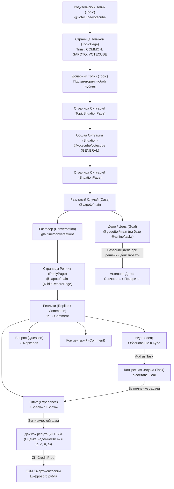

# Sapoto.net («Забота») и КубГолоса (Votecube)
## Полное концептуальное и архитектурное руководство по прототипу

> **Категория:** [Прикладной стек (Applications Suite)](../README.md)  
> **Автор архитектуры:** Артём Владимирович Шамсутдинов  
> **Связанные документы директории:**  
> • [**`Sapoto_architecture_and_functionality.md`**](Sapoto_architecture_and_functionality.md) — Нормативная архитектурная спецификация (1.0)  
> • [**`Sapoto_Reputation_and_Credit_System_Specification.md`**](Sapoto_Reputation_and_Credit_System_Specification.md) — Нормативная спецификация репутационной системы и ZK-кредитования (1.0)  
> • [**`Sapoto_Ecosystem_Impact_Guide.md`**](Sapoto_Ecosystem_Impact_Guide.md) — Социально-экономический потенциал платформы «Забота» на 7 уровнях общества  
> • [**`AGENTS.md`**](AGENTS.md) — Инженерный регламент и системные инварианты Sapoto  
> • [**`../README.md`**](../README.md) — Головной каталог прикладного стека  
> • [**`../votecube/README.md`**](../votecube/README.md) — Полное руководство по платформе «КубГолос»  
> • [**`../../06_cbr_smart_contracts_fsm_whitepaper.md`**](../../06_cbr_smart_contracts_fsm_whitepaper.md) — Белая книга коммерческих смарт-контрактов ЦБ РФ (ПКСК / FSM)  

---

## 1. Концепция и видение платформы

### 1.1. Что такое «Забота» (Sapoto.net)?
Название **Sapoto** происходит от японского слова *サポート (Sapōto — «поддержка», «забота»)*. Дополнительный семантический слой обыгрывает испанское слово *sapo («жаба»)* как метафору качественного скачка (*leapfrog*) человеческого общества на качественно новый уровень взаимной помощи, обмена опытом, открытой репутации и решения жизненных проблем.

В отличие от традиционных социальных сетей и форумов, где поиск решения превращается в хаотичную линейную ленту комментариев с колоссальным уровнем информационного шума, «Забота» предлагает **структурированную когнитивную архитектуру**:
* Проблемы не обсуждаются абстрактно, а формулируются как конкретные, оцениваемые **Реальные Случаи (Cases)**.
* Случай может быть связан с более абстрактной **Общей Ситуацией (Situation)** из КубГолоса (с определенными дополнениями/изменениями) или построен с нуля.
* В пользовательском интерфейсе Случаи Заботы интегрированы с приложением **«Деловой»**: каждый Случай связывается с потенциальным **Делом (Goal)**, которое наделяет его **Срочностью и Приоритетом**. Сообщество оценивает важность: делать из этого случая Дело или нет.
* **Жизненный цикл Дела**: название самого Дела (`Goal.name`) формулируется, когда пользователь решает, что именно (если вообще что-то) предпринять по поводу этого случая. До этого момента в UI отображается название Случая и Срочность/Приоритет связанного с ним, пока еще возможного Дела.
* **Поддержка на местах (On-the-ground support)**: сеть «Забота» предназначена не только для информационной взаимопомощи онлайн, но и для реальной физической поддержки на местах, поскольку опирается на древовидную логическую топологию **Турбазы** с криптографической проверкой нахождения участников в одном районе, округе или городе.
* Поток ответов строго дифференцирован: **Идеи (Ideas)**, **Жизненный опыт (Experiences)**, **Вопросы (Questions)** и **Комментарии (Comments)**. Все записи заплюсовываются (+1), могут прикреплять опросы КубГолоса и образовывать под-цепочки через платформенную концепцию Страниц.
* **Суверенная система децентрализованной репутации**: «Забота» генерирует сквозную децентрализованную репутацию, служащую управляемой людьми альтернативой банковским кредитным рейтингам (через интеграцию с Цифровым рублем) и государственному социальному скорингу.

### 1.2. Место в платформе Data Independence Network (DIN)
«Забота» (Sapoto), «КубГолоса» (Votecube) и «Деловой» (GoGetter) являются фундаментальными, **системообразующими приложениями** экосистемы DIN (Data Independence Network). Они создаются как легковесные, компонуемые модули, способные как работать самостоятельно, так и бесшовно встраиваться друг в друга и во внешние платформы.

### 1.3. Муниципальное деление, топология Турбазы и архитектура без традиционного сервера
* **Отсутствие традиционного сервера и Листья как реляционные СУБД**:
  - В архитектуре платформы **как такового традиционного сервера нет**.
  - **Листья (аппараты пользователей)** получают дополнения в журналах изменений хранилищ (WAL-дельты) и объединяют их непосредственно в своей собственной локальной реляционной базе данных (SQLite / AIRport WASM).
  - Вся бизнес-логика, пользовательские запросы и отображение интерфейса выполняются локально на аппарате.
* **Шлюзы Веток и Ветвей с адаптивным древовидным разделением**:
  - Ветки (муниципальные) и Ветви (кооперативные) — это не серверы приложений, а высокоэффективные **шлюзы координации и маршрутизации данных** (Zero-Rendering Gateways, никогда не рендерящие HTML или UI).
  - С появлением «КубГолоса» и «Заботы» эти шлюзы получают **дополнительные специализированные функции**, поскольку им необходимо работать с **общей информацией**. Для этого шлюзы делят общую информацию **древовидными методами разного подбора в зависимости от вида информации**:
    1. *Древовидные самозапечатывающиеся страницы (`IChildRecordPage`)*: деление связей 1:N (списки случаев, треды сообщений `ReplyPage`, каталоги ситуаций);
    2. *Деревья категорий и топиков*: иерархическая классификация с потоком обработки родительских тем вверх по дереву (**Upstream Category Processing**) на узлах кооперативов;
    3. *Оперативные счетчики (Counters) и Блоки Эпох*: агрегация волеизъявлений, квот и 3D-векторов факторов в оперативной памяти шлюза без дисковых задержек;
    4. *Территориальные деревья*: географический контур видимости и ответственности.
* **Интеграция со внешними поисковиками**:
  - Прямая интеграция со внешними поисковыми системами (Яндекс и др.) через санкционированный экспорт структурированных дельт (JSON-LD Push Stream) существенно помогает гражданам находить нужную информацию в децентрализованной сети.
* **Двойная иерархия ветвей (Территориальная vs Категориальная)**:
  1. **Территориальные суверенные Ветки**: административно-территориальное деление (Ствол $\to$ Регион $\to$ Город $\to$ Районная Ветка), периметр mTLS, ZKP-верификация локального резидентства и ведение каталога районных Случаев.
  2. **Категориальные Ветки Кооперативов платформы**: нелокализованное иерархическое дерево Топиков с потоком обработки запросов вверх по дереву.

---

## 2. Иерархия сущностей предметной области



### 2.1. Уровни абстракции:
1. **Топик (`Topic` в `@votecube/votecube`)**: Единая древовидная сущность категоризации (`parentTopic`). Корневые топики заменяют бывшие глобальные Темы, а дочерние — любые уровни подкатегорий. Масштабируется через страницы `TopicPage`.
2. **Общая Ситуация (`Situation` в `@votecube/votecube`)**: Абстрактная проблема или вызов (`type: GENERAL`), аккумулирующая через страницы `SituationPage` множество похожих реальных случаев.
3. **Реальный Случай (`Case` в `@sapoto/main`)**: Составная ключевая конструкция Заботы:
   - Ссылка на `Topic` (`@votecube/votecube`);
   - Опциональная ссылка на Общую Ситуацию `situation?: Situation` (`@votecube/votecube`);
   - Ссылка на тред обсуждения `conversation: Conversation` (`@airline/conversations`);
   - Опциональная ссылка на частный опрос ситуации `question?: Question` (`@votecube/votecube`).
4. **Дело (`Goal` в `@gogetter/main` на базе `@airline/tasks`)**: Связано со Случаем, наделяя его Срочностью и Приоритетом.
5. **Задачи (`Task` в составе `Goal`)**: Конкретные исполнительские шаги, создаваемые по кнопке **«Add as Task»** на одобренных Идеях.
6. **Ответ (`Reply` в `@sapoto/main`)**: Связан 1:1 с `Comment` из `@airline/conversations`, принимает одну из 4 ролей (Идея, Опыт, Вопрос, Комментарий) и масштабируется через страницы `ReplyPage` (`IChildRecordPage`).

---

## 3. Детальный анализ: Идеи, Опыт, Вопросы и Комментарии

| Параметр сравнения | Идея (Idea / `isIdea`) | Опыт (Experience / `isExperience`) | Вопрос (Question / `isQuestion`) | Комментарий (Comment) |
| :--- | :--- | :--- | :--- | :--- |
| **Семантическая природа** | **Предписывающая (Prescriptive)**: *«Что следует сделать»* | **Описательная (Descriptive)**: *«Что реально произошло на практике»* | **Интеррогативная**: *«Каковы недостающие данные»* | **Дискурсивная**: *«Мысли, поддержка, реакция»* |
| **Когнитивная роль** | Сформулировать метод, гипотезу или план действий. | Представить объективное эмпирическое свидетельство. | Устранить неполноту исходных условий ситуации. | Общая эмоциональная или смысловая поддержка. |
| **Оценка истинности** | **КубГолоса (Votecube)**: взвешивание 3 причин и расчет консенсуса. | **Пиринговый рейтинг сообщества** (лайки / дизлайки: `Up-` vs `Down-ratings`). | Отметка полезности автором ситуации. | Базовая реакция сообщества. |
| **Калибровка матрицы** | **Срочность vs Приоритет** (шкала 1–5). | Соответствие контексту и достоверность исхода. | Критичность для понимания проблемы. | Не калибруется. |
| **Структура аргумента** | **Дерево причин (Reasons Tree)** с лингвистической грамматикой. | Нарратив + Мультимедиа: **Голос («Speak»)** и **Видео («Show»)**. | 8 стандартных маркеров (Что, Кто, Где, Когда, Почему, Как и др.). | Свободный текст. |
| **Влияние на репутацию** | Баллы авторства и раннего признания | Фундамент надежности в EBSL ($r, s$) | Баллы гражданской активности | Не влияет |

### 3.1. Мультимодальный опыт («Speak» / «Show») и On-Device STT
- Запись аудио («Speak») и видео («Show») ведется через стандарты HTML5 `MediaStream` и `MediaRecorder`.
- Локальное распознавание речи (On-Device STT через Web Speech API / WASM) индексирует аудио на клиентском устройстве без утечки голоса на серверы.

---

## 4. Архитектурный мост «Забота — КубГолос» (VoteCube)

«Забота» не дублирует графические и математические механизмы 3D-волеизъявления «КубГолоса», а бесшовно интегрирует их через компонуемый программный интерфейс:
1. **Случай $\to$ Ситуация**: конкретный жизненный Случай (`Case`) связывается с абстрактной Ситуацией (`Situation` в `@votecube/votecube`).
2. **Обоснование Идей в 3D-Кубе**: кнопка *«Обосновать в Кубе»* направляет Идею в компонент `<votecube-modal>`, где сообщество взвешивает аргументы «За» и «Против» по 3 ключевым осям.
3. **Эмпирический цикл (Опыт $\to$ Шкала Результата)**: публикация Опыта тестирования Идеи напрямую передает валидационные баллы (+1 / 0 / -1) в байесовскую **Шкалу Результата (Outcome Scale)** «КубГолоса». Практический опыт участников динамически доминирует над умозрительными рассуждениями.

> ℹ️ *Полная архитектурная спецификация 3D-манипулятора, ротации карточек факторов, divergent-барчартов и байесовского консенсуса представлена в базовых документах:*
> - [**`VoteCube Architecture & Functionality`**](../votecube/VoteCube_architecture_and_functionality.md)  
> - [**`VoteCube README`**](../votecube/README.md)

---

## 5. Децентрализованная репутационная система («Токеномика заботы и доверия»)

Репутационная система «Заботы» — это **центральное смысловое ядро платформы**, предоставляющее децентрализованную, прозрачную и подконтрольную самим людям эволюционную альтернативу централизованным кредитным бюро и рискам одномерного социального скоринга.

> ℹ️ *Полная математическая и криптографическая спецификация (19 разделов) с формулами объемно-взвешенной логики (VW-EBSL), двухкомпонентной декомпозицией (компетентность / добросовестность), ZK-нуллификаторами против одновременных дефолтов, оракулами физического мира TAPO, банковским регуляторным мостом (Положение ЦБ РФ № 590-П), институтом гражданского служения ($S_{\text{civic}}$), протоколом восстановительной реабилитации, институтом наставничества, транзитивными сетями поручительства (First-Loss Waterfall), межрайонными FSM-свопами ликвидности, институциональной интеграцией со Старшими траншами коммерческих банков, B2B смарт-факторингом и восточными моделями партнерского соинвестирования (PLS: Мудараба, Мушарака, Такафул по 377-ФЗ РФ) (автор математического вывода и спецификации: агент Antigravity, Google DeepMind; концептуальный автор и визионер: Артём Владимирович Шамсутдинов) представлена в специальном нормативном документе: [**`Sapoto_Reputation_and_Credit_System_Specification.md`**](Sapoto_Reputation_and_Credit_System_Specification.md).*

### 5.1. Математический аппарат Evidence-Based Subjective Logic (EBSL)

Репутация участника выражается не скалярным баллом, а кортежем субъективного мнения Йёсанга:
$$\omega_A^X(T) = \big(b_A^X(T), \; d_A^X(T), \; u_A^X(T), \; a_A^X(T)\big)$$
где $b$ — уверенность в надежности (Belief), $d$ — уверенность в недобросовестности (Disbelief), $u$ — мера эпистемической неопределенности (Uncertainty), $a \approx 0.5$ — базовая априорная вероятность. Инвариант: $b + d + u = 1$.

Математическое ожидание репутационной надежности:
$$E\big(\omega_A^X(T)\big) = b_A^X(T) + a_A^X(T) \cdot u_A^X(T)$$

#### Преобразование свидетельств практики:
- $r$ — положительные исходы: решенные Ситуации, подтвержденный сообществом Опыт (`isExperience`), выполненные Задачи в «Деловом», успешно закрытые смарт-контракты в Цифровом рубле.
- $s$ — отрицательные исходы: опровергнутый практикой опыт, сорванные задачи, дефолты по P2P-сделкам.
$$b = \frac{r}{r + s + W}, \quad d = \frac{s}{r + s + W}, \quad u = \frac{W}{r + s + W} \quad (W = 2)$$

#### Временной полураспад (Half-Life Memory Decay):
$$r(t) = r_0 \cdot e^{-\lambda \Delta t}, \quad s(t) = s_0 \cdot e^{-\lambda \Delta t}$$
- Для бытовой взаимопомощи: $T_{1/2} = 6 \text{ месяцев}$;
- Для кредитной надежности: $T_{1/2} = 24 \text{ месяца}$.  
Затухание предотвращает концентрацию пожизненного влияния («репутационную монархию») и мотивирует постоянную конструктивную деятельность.

---

### 5.2. Созидательный социальный рейтинг и институт гражданского служения

1. **Векторный профиль компетенций вместо одномерного клейма**: репутация начисляется независимо по отдельным топикам. Человек с нулевой репутацией в спорах об урбанистике может обладать наивысшей репутацией как детский педиатр или сантехник.
2. **Локальное вычисление на Листе (Zero-PII)**: в системе физически не существует «единого реестра неблагонадежных». Мнение о гражданине вычисляется локально на смартфоне запрашивающего лица с учетом персонального круга доверия.
3. **Защита от травли и сговоров**: координированные атаки хейтеров бессильны, так как мнения участников без совместного подтвержденного Опыта получают $u \to 1$ и отсекаются оператором слияния мнений ($\oplus$).
4. **Институт гражданского служения ($S_{\text{civic}}$)**: общественно-полезный труд, донорство и помощь маломобильным соседям формируют признанный социальный капитал, дающий до $+25\%$ к финансовому кредитному потолку ($L_{\text{max}}$) и приоритет в шеринге.
5. **Восстановительная реабилитация (Restorative Justice)**: гражданин, допустивший срыв обязательства по форс-мажорным обстоятельствам, может ускоренно погасить отрицательное свидетельство ($s_{\text{effective}}$) через подтвержденный труд на благо района в «Заботе».

---

### 5.3. Народный кредитный рейтинг и интеграция с Цифровым рублем

Интеграция с Государственной платформой коммерческих смарт-контрактов (ПКСК) Банка России опирается на принципы, доказанные в [Whitepaper 06](../../06_cbr_smart_contracts_fsm_whitepaper.md): расчетное ядро ЦБ РФ функционирует как детерминированный FSM $O(1)$, а «Забота» поставляет верифицированные условия расчетов.

1. **ZK-Credit Attestation ($\pi_{\text{credit}}$)**:
   - Пользователь генерирует ZK-SNARK доказательство прямо на своем Листе (в локальной SQLite):
     $$\pi_{\text{credit}} = \text{ZK-Prove}\big(\{r, s, \Delta t\}, \; \{\text{Rep} \ge 0.85, \text{Defaults} = 0\}\big)$$
   - Кредитор видит только булев результат $\text{Verify}(\pi_{\text{credit}}) = \text{True}$. Персональные данные, история покупок и выписки по счетам не покидают устройство заемщика (152-ФЗ и банковская тайна ст. 26 395-1).
2. **Динамическое снижение залоговых требований**:
   $$C_{\text{ratio}} = \max\Big(0, \; 1.5 - 1.5 \cdot E\big(\omega(T_{\text{credit}})\big)\Big)$$
   - При высоком репутационном капитале ($E \ge 0.95$) залоговое требование обнуляется ($C_{\text{ratio}} = 0\%$), открывая путь к **полностью беззалоговым (бланковым) P2P-займам** в цифровых рублях.
3. **«Депозит-фри» экономика доверия**:
   - При подтвержденной добросовестности $E(\omega_{\text{int}}) \ge 0.85$ обеспечительный залог обнуляется при шеринге бытовой техники («Забота»), B2B-станков и коммунальной техники («Реестр МСП и ЖКХ») и туристического инвентаря («УраТур»).
4. **Социальное поручительство через FSM Multi-Sig Wrappers (ROSCA)**:
   - Соседи и члены кооператива могут выступать поручителями по займам через смарт-контрактные оболочки (Wrappers), получая процент по формуле `share(...)` за предоставление социального капитала.
5. **Государственные и ведомственные Ветки как институциональные гаранты**:
   - Территориальные (районные) и ведомственные Ветки (Росреестр, ФНС, СФР, Минобрнауки, Суды) выступают независимыми гарантами юридических фактов (право собственности на залог, статус самозанятого, подтвержденный диплом, отсутствие открытых исполнительных производств), поставляя суверенные ZK-аттестации ($\pi_{\text{state}}$) без раскрытия персональных баз данных (Zero-PII).
6. **Транзитивные сети социального поручительства (Multi-Hop Trust)**:
   - Формализация поручительства через цепочки $A \to B \to C$ с транзитивным дисконтированием субъективной логики Йёсанга ($\omega_C^{A:B} = \omega_B^A \otimes \omega_C^B$) и каскадным распределением риска (First-Loss Waterfall: залог прямого поручителя $B \ge 60\%$, субсидиарный залог $A \le 40\%$).
7. **Межрайонные беспроцентные FSM-свопы ликвидности (ROSCA Swaps)**:
   - Сезонная балансировка касс взаимопомощи со ставкой $0\%$ между комплементарными районами (аграрными и индустриально-городскими) с товарным контрактом встречных поставок сельхозпродукции без посредников и стабилизационным буфером Ствола.
8. **Институциональная интеграция с коммерческой банковской системой (Раздел 18)**:
   - Синдикация Старших траншей банка (Senior Tranches) для масштабных проектов ROSCA: банк предоставляет оптовое финансирование под низкую ставку, защищенное младшим траншем первого убытка (First-Loss Junior Tranche) сообщества (эквивалент рейтинга AAA);
   - B2B смарт-факторинг накладных по криптографическому Proof-of-Delivery из «Делового» и «Заботы» с моментальным перечислением средств поставщику и нулевым риском подделки документов;
   - Роль банков как операторов Финансовых Веток с регулярным доходом по формуле $O(1)$ `share(...)` и сокращением затрат на IT-инфраструктуру (Zero-PII) на 80–90%.

---

## 6. Интеграция с менеджером задач «Деловой» (GoGetter)

1. **Случай как потенциальное Дело (`Goal`)**: публикация Случая в «Заботе» создает ассоциированную потенциальную Цель в «Деловом». Сообщество голосует за Срочность и Важность (стоит ли брать проблему в работу).
2. **Сценарий «Взять как задачу» (`Add as Task`)**: нажатие кнопки на карточке принятой Идеи создает конкретную исполнительскую Задачу (`Task`) внутри Цели с интеграцией в календарь.
3. **Цикл подтверждения и замыкание репутации**: завершение Задачи инициирует публикацию Опыта в «Заботе», переводя виртуальную рекомендацию в проверенную практику и начисляя исполнителю репутационные баллы $r$.

---

## 7. Двойная матрица Эйзенхауэра

1. **Уровень Цели (`Goal.urgency + Goal.importance`)**: определяет приоритет в общем районном потоке проблем.
2. **Уровень Идеи (`SituationIdea: urgencyTotal + priorityTotal`)**: коллективные оценки участников из «КубГолоса» распределяют задачи по квадрантам персонального органайзера:
   - **Q1 (Срочно и Важно)**: кризисные ситуации, пожары, аварии (Сделать немедленно);
   - **Q2 (Важно, но Не срочно)**: системные практики, образование, профилактика (Запланировать);
   - **Q3 (Срочно, но Не важно)**: оперативные бытовые просьбы соседей (Делегировать / Сделать быстро);
   - **Q4 (Не срочно и Не важно)**: предложения на далекую перспективу (Бэклог).

---

## 8. Приватность, трехуровневая анонимность и суверенитет данных

1. **Уровни регистрации на Ветке**:
   - *Уровень 1 (Branch ID)*: полная анонимность в локальной подсети района;
   - *Уровень 2 (Групповая анонимность / Жеребьевка)*: подтверждение локального резидентства через соседей без раскрытия личности;
   - *Уровень 3 (Верифицированный профиль)*: открытая репутация для специалистов и экспертов.
2. **Суверенитет по 152-ФЗ (Zero-PII)**: личные дневники, медицинские записи и описания семейных проблем хранятся **строго на Листе (устройстве пользователя)** в локальной базе данных SQLite. Шлюзы Веток маршрутизируют только дельты изменений и ZKP-доказательства.

> ℹ️ *Техническое назначение сущности `Actor` (разграничение устройств пользователя без раскрытия личности) подробно рассмотрено в [VoteCube Architecture & Functionality](../votecube/VoteCube_architecture_and_functionality.md).*

---

## 9. Экономическая модель Веток и детерминированный FSM `share(...)`

Финансирование инфраструктуры муниципальных и кооперативных Веток опирается на детерминированный конечный автомат $O(1)$:
$$\text{share}(w_1, \text{Citizen}, \; w_2, \text{HostPortal}, \; w_3, \text{SoftwareTree}, \; w_4, \text{CapacityRenters})$$
- **Гарантированная доля арендаторов мощностей ($w_4$)**: обеспечивает устойчивую окупаемость серверов и mTLS-конвейеров без продажи пользовательских данных.
- **Вознаграждение пользователей ($w_1$)**: граждане, заполнившие обезличенный демографический профиль, получают прямую процентную долю от рекламных доходов.

> ℹ️ *Математический вывод вектора Шепли и комплаенс 115-ФЗ / 152-ФЗ представлены в [Whitepaper 06, раздел 4.3](../../06_cbr_smart_contracts_fsm_whitepaper.md).*

---

## 10. Двухуровневая децентрализованная модерация контента

1. **Кооперативный уровень**: платформенные кооперативы поддерживают чистоту категориальных публичных деревьев в соответствии с законодательством.
2. **Репутационный уровень сообщества**: жалобы от участников с высоким репутационным баллом $E(\omega)$ автоматически понижают видимость токсичного контента, защищая треды от спама без цензуры.

---

## 11. Стратегия интеграции и план развития архитектуры

1. **Фаза 1 (Демонстрационный комплекс)**: единый веб-интерфейс с 4 вкладками («Забота», «Деловой», «КубГолос», «Репутация и Финансы»).
2. **Фаза 2 (Целевая модульная архитектура на Svelte 5)**:
   - Микро-виджеты: `<sapoto-situation-card>`, `<sapoto-thread>`, `<sapoto-media-recorder>`, `<sapoto-reputation-badge>`.
   - Встраивание виджетов на городские порталы, сайты ТСЖ и блоги с прямым роялти по формуле `share(...)`.

---

## 12. Руководство по запуску текущего прототипа

### 12.1. Требования к окружению
- **Node.js**: версия `>= 20.x` (рекомендуется `24.x`).
- **Браузер**: современный браузер с поддержкой Web Components, IndexedDB/WASM и HTML5 MediaRecorder.

### 12.2. Установка и сборка
```bash
# Клонирование и установка зависимостей
git clone https://github.com/beyond-decentralized/AIRport.git
cd AIRport
npm install

# Запуск локального сервера разработки
npm run start
```
После запуска интерфейс доступен по адресу `http://localhost:8080`.
