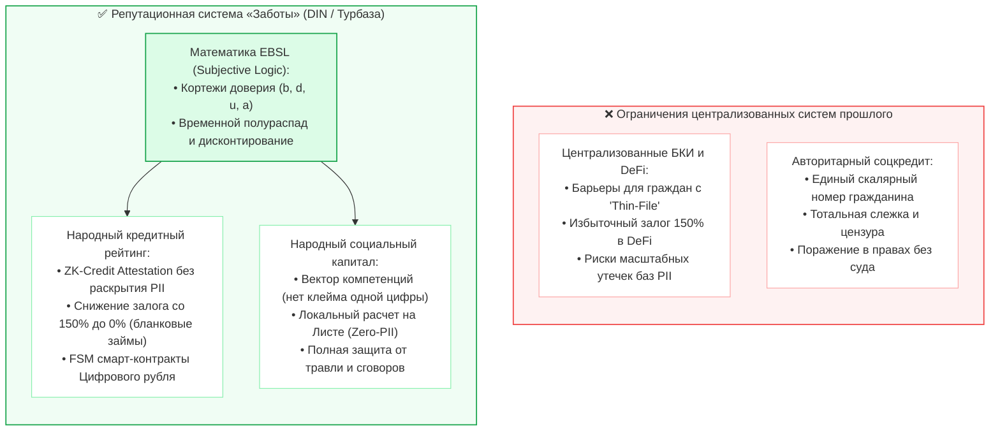
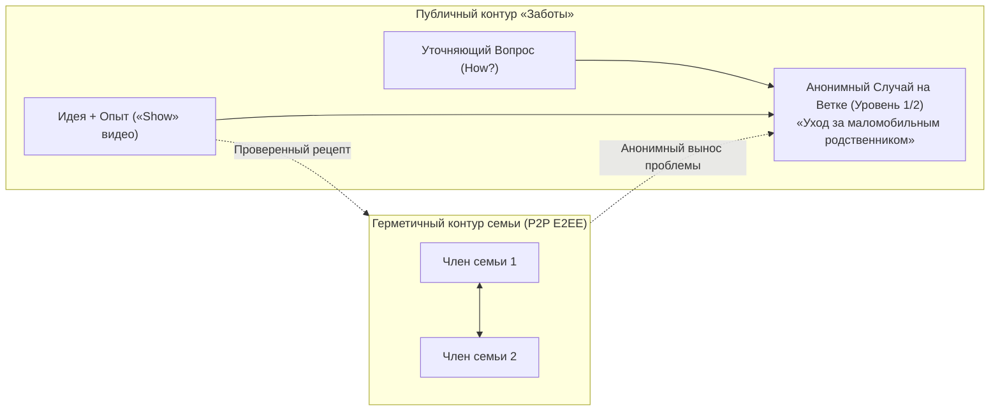
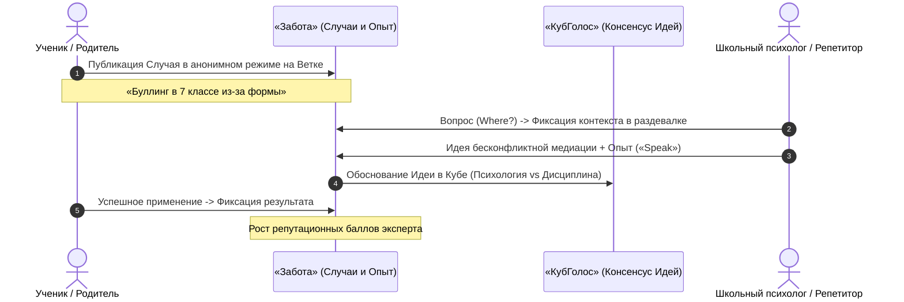
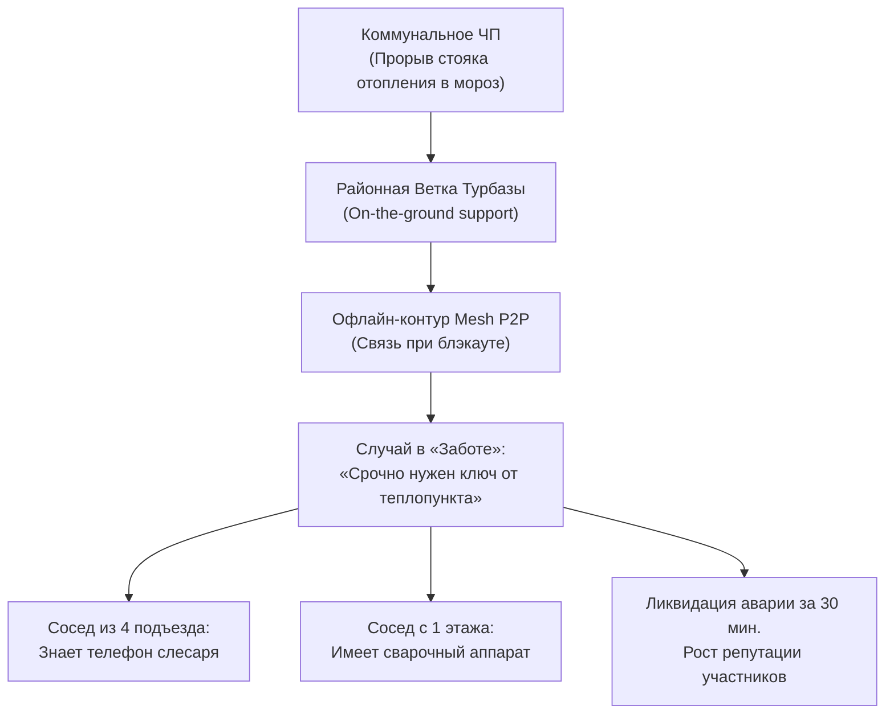

# Социально-экономический и прикладной потенциал платформы «Забота» (Sapoto.net)
## Культура действенной взаимопомощи, открытая децентрализованная репутация и суверенная финансовая эмансипация
*Семьи · Детские сады · Школы · Фирмы · Соседи · Районы · Регионы*

*Классификация: Децентрализованная социальная взаимопомощь, краудсорсинг практического опыта, народный социальный и кредитный рейтинг, интеграция с Цифровым рублем*  
*Концептуальный автор платформы и архитектор: Артём Владимирович Шамсутдинов*  
*Связанные нормативные спецификации: [`Sapoto_Reputation_and_Credit_System_Specification.md`](Sapoto_Reputation_and_Credit_System_Specification.md), [`Sapoto_architecture_and_functionality.md`](Sapoto_architecture_and_functionality.md), [`VoteCube_Ecosystem_Impact_Guide.md`](../votecube/VoteCube_Ecosystem_Impact_Guide.md)*  
*Проектные хранилища: [`sapoto.net`](file:///Users/parents/Documents/data-independence-network/sapoto.net), [`votecube.com`](file:///Users/parents/Documents/data-independence-network/votecube.com), [`votecube-client-logic`](file:///Users/parents/Documents/data-independence-network/votecube-client-logic)*

---

## Содержание
1. [Концептуальное введение: От информационного шума к культуре действенной поддержки](#1-концептуальное-введение-от-информационного-шума-к-культуре-действенной-поддержки)
2. [Репутационная революция «Заботы»: Альтернатива банковским БКИ и авторитарному соцкредиту](#2-репутационная-революция-заботы-альтернатива-банковским-бки-и-авторитарному-соцкредиту)
3. [Уровень 1: Семьи (Малые и большие семейные кланы)](#3-уровень-1-семьи-малые-и-большие-семейные-кланы)
4. [Уровень 2: Детские сады (Родительские группы и воспитатели)](#4-уровень-2-детские-сады-родительские-группы-и-воспитатели)
5. [Уровень 3: Школы (Родители, ученики и педагогический совет)](#5-уровень-3-школы-родители-ученики-и-педагогический-совет)
6. [Уровень 4: Фирмы и бизнес (Команды, стартапы, артели и МСП)](#6-уровень-4-фирмы-и-бизнес-команды-стартапы-артели-и-мсп)
7. [Уровень 5: Соседи (Многоквартирные дома, ТСЖ и локальные дворы)](#7-уровень-5-соседи-многоквартирные-дома-тсж-и-локальные-дворы)
8. [Уровень 6: Район (Муниципалитеты, поликлиники и районные сообщества)](#8-уровень-6-район-муниципалитеты-поликлиники-и-районные-сообщества)
9. [Уровень 7: Регион (Межмуниципальная координация, туризм «УраТур» и ЧС)](#9-уровень-7-регион-межмуниципальная-координация-туризм-уратур-и-чс)
10. [Сводная матрица социально-экономической ценности на семи уровнях](#10-сводная-матрица-социально-экономической-ценности-на-семи-уровнях)
11. [Заключение: Архитектурный синтез человечности, суверенитета и математической строгости](#11-заключение-архитектурный-синтез-человечности-суверенитета-и-математической-строгости)

---

## 1. Концептуальное введение: От информационного шума к культуре действенной поддержки

### 1.1. Кризис современных социальных сетей и кредитно-рейтинговых систем
Современный гражданин и локальный бизнес зажаты между двумя системными пороками цифровой эпохи:
1. **Коммуникационный тупик соцсетей:** В мессенджерах и соцсетях обсуждение острых жизненных вызовов тонет в эмоциональном шуме, троллинге и рекламе. Советы дилетантов неотличимы от рекомендаций опытных практиков, а помощь соседа за стенкой остается недоступной из-за отсутствия локальных инструментов доверия.
2. **Инфраструктурные ограничения централизованных кредитных бюро и риски одномерного скоринга:** 
   - Созданные во второй половине XX века централизованные бюро кредитных историй (БКИ) и традиционные скоринговые алгоритмы строились в условиях ограниченных вычислительных мощностей и дефицита детализированных данных. Из-за этого молодежь, самозанятые, начинающие мастера и микробизнес с «тонкими» кредитными историями (Thin-File Borrowers) сталкиваются с высокими процентными барьерами и вынуждены прибегать к дорогостоящему микрофинансированию (МФО со ставками до 292% годовых).
   - Зарубежные попытки централизованного внедрения одномерных социальных рейтингов создают угрозу поражения граждан в правах, алгоритмической сегрегации и утраты приватности.

### 1.2. Когнитивная и экономическая архитектура «Заботы» (Sapoto.net)
Платформа **«Забота»** кардинально меняет правила игры, объединяя структурированное решение жизненных проблем с децентрализованной экономикой доверия:
* **Реальные Случаи (`Case`) вместо хаоса:** Проблема оформляется структурированно, привязываясь к топику (`Topic`) и контексту (`Situation` в «КубГолосе»);
* **Четыре модальности реплик:** Идеи (`Ideas`), Опыт (`Experiences` с мультимодальными форматами «Speak»-аудио и «Show»-видео), Вопросы (`Questions` по 8 маркерам) и Комментарии (`Comments`);
* **Сквозная децентрализованная репутация:** Каждый подтвержденный факт помощи, успешно закрытое Дело (`Task` в органайзере «Деловой») и завершенная сделка в Цифровом рубле формируют суверенный социальный и кредитный капитал гражданина;
* **Поддержка на местах (*On-the-ground support*):** Криптографическая проверка локального резидентства через ZKP на районных Ветках платформы «Турбаза» объединяет соседей для реальной физической взаимовыручки.

---

## 2. Эволюционная трансформация репутационных и кредитных систем в «Заботе»

Репутационный механизм «Заботы» представляет собой **новое поколение скоринговых и репутационных архитектур**, развивающее достижения классических моделей (FICO, VantageScore, Basel) на базе криптографии доказательств с нулевым разглашением (ZK-Proofs) и суверенных периферийных вычислений:

> ℹ️ *Полная нормативная математическая модель народной кредитной системы, формулы субъективной логики (EBSL), ZK-аттестации для Цифрового рубля, транзитивное поручительство (Multi-Hop Transitive Trust) и балансировка сезонной ликвидности ROSCA подробно специфицированы в отдельном документе: [**`Sapoto_Reputation_and_Credit_System_Specification.md`**](Sapoto_Reputation_and_Credit_System_Specification.md).*

### 2.1. Народный кредитный рейтинг для Цифрового рубля
- В соответствии с [Whitepaper 06 (ПКСК Банка России)](../06_cbr_smart_contracts_fsm_whitepaper.md), расчетное ядро смарт-контрактов ЦБ РФ функционирует как детерминированный автомат $O(1)$.
- Приложение «Забота» во внешнем контуре формирует **ZK-Credit Attestation ($\pi_{\text{credit}}$)**: доказательство с нулевым разглашением того, что заемщик имеет надежность $\ge 85\%$ и нулевую историю дефолтов.
- **Освобождение от залогов**: проверенные участники сообщества получают доступ к **беззалоговым (бланковым) P2P-микрозаймам** напрямую в цифровых рублях без участия дорогостоящих посредников и микрофинансовых организаций с предельными ставками.
- **Социальное поручительство (ROSCA / Кассы взаимопомощи)**: соседи и коллеги могут выступать гарантами сделок через контрактные оболочки (Wrappers), получая справедливое вознаграждение по формуле `share(...)`.

### 2.2. Народный социальный рейтинг без государственного надзора
- **Векторность против одномерного клейма**: репутация начисляется по независимым направлениям (топикам). Профессиональный сантехник или педагог оцениваются по плодам своего труда, а не по взглядам или образу жизни.
- **Отсутствие централизованных «черных списков»**: репутация вычисляется локально на клиентском устройстве (Листе) каждого пользователя на основе его собственной сети доверия (Subjective Logic).
- **Право на исправление (Half-Life Decay)**: репутационные ошибки прошлого со временем затухают ($T_{1/2} = 6..24 \text{ мес.}$), открывая путь к полной социальной реабилитации.

### 2.3. Институциональный симбиоз с банковской системой: Игра с положительной суммой
- **Интеграция вместо конфронтации:** «Турбаза» не пытается заменить банковскую систему, а выступает суверенным периферийным слоем (Edge Enablement Layer), усиливающим классический банкинг. Банки сохраняют свои ключевые общественные функции: трансформацию ликвидности, профессиональный андеррайтинг, доверительное хранение и соблюдение макропруденциальных нормативов.
- **Радикальное снижение банковских издержек:**
  - **-80%...-90% затрат на IT-инфраструктуру:** вынос неструктурированных данных на Листья пользователей (Zero-PII);
  - **Ликвидация рисков утечек данных по 152-ФЗ:** заемщик подтверждает платежеспособность через ZK-Credit Attestation без передачи банку сырых персональных данных;
  - **Снижение стоимости риска (Cost of Risk / NPL) в 2–3 раза:** автоматическое покрытие первого убытка (First-Loss Junior Tranche) поручителями и кассами взаимопомощи ROSCA.
- **Новые высокомаржинальные источники выручки банков:**
  - **Банк как Оператор Финансовой Ветки:** получение доли $w_{\text{branch}}$ в формуле сплитования `share(...)` от всех транзакций обслуживаемого кластера;
  - **Синдикация Старших траншей (Senior Tranches):** банк предоставляет оптовое фондирование крупным проектам касс взаимопомощи под надежную низкую ставку с защитой капитала буфером первого убытка (AAA-эквивалент);
  - **B2B смарт-факторинг на базе Proof-of-Delivery:** мгновенное финансирование поставщиков под уступку проверенной накладной без риска фальсификаций.

---

## 3. Уровень 1: Семьи (Малые и большие семейные кланы)

### 1. Проблемы семейного взаимодействия
* Уход за тяжелобольными родственниками, воспитание детей с особенностями, семейные кризисы.
* Страх стигматизации при обращении в публичные соцсети и утечки деликатных сведений.
* Финансовая уязвимость перед непредвиденными медицинскими расходами и вынужденное обращение к дорогостоящим кредитам МФО.

### 2. Как помогает «Забота»
* **Двойной контур видимости:** Личный закрытый семейный архив в шифрованном P2P-контуре Листьев + анонимный вынос проблемы на районную Ветку (Branch ID / жеребьевка).
* **Семейные кассы взаимопомощи в Цифровом рубле:** Быстрое привлечение средств на лечение или реабилитацию от широкого круга родственников и друзей через защищенный FSM смарт-контракт без банковских комиссий.
* **Мультимодальный опыт («Speak» / «Show»):** Фиксация проверенных методик ухода и воспитания в аудио- и видеоформатах.

### 3. Пример: Адаптация дачи для дедушки на коляске и семейный микрозайм
* **Случай (`Case`):** *«Оборудование пандуса и санузла для маломобильного дедушки при ограниченном бюджете»*.
* **Решение:** Сосед-инженер делится видеоинструкцией («Show») сборки надежного пандуса из стандартного бруса.
* **Финансирование:** Недостающие 30 000 рублей на материалы семья привлекает через P2P-заем у участников семейного клана в Цифровом рубле под $0\%$, возвращая долг частями по графику FSM-автомата.

---

## 4. Уровень 2: Детские сады (Родительские группы и воспитатели)

### 1. Проблемы детсадовских сообществ
* Тревожная адаптация малышей, споры о питании, аллергиях и развивающих методиках.
* Риск найма недобросовестных нянь и репетиторов по поддельным отзывам на досках объявлений.

### 2. Как помогает «Забота»
* **База Знаний группы:** Формирование «Проверенных рецептов» по мягкой адаптации малышей с подтверждением родительским Опытом.
* **Народная репутация нянь и специалистов:** Родители видят подтвержденный жизненный опыт других семей района, исключающий накрученные отзывы.
* **Соседский шеринг:** Безопасный обмен детской одеждой, развивающими играми и автокреслами между проверенными резидентами района.

---

## 5. Уровень 3: Школы (Родители, ученики и педагогический совет)

### 1. Проблемы школьного сообщества
* Скрытая травля (буллинг), стресс перед ОГЭ/ЕГЭ, выгорание педагогов.
* Огромные траты семей на непроверенных репетиторов.

### 2. Как помогает «Забота»
* **Анонимная защита подростков:** Школьник может сообщить о буллинге или психологическом кризисе с гарантией 100% анонимности перед администрацией и сверстниками.
* **Пиринговое репетиторство старшеклассников:** Старшеклассники помогают младшим готовиться к экзаменам, зарабатывая первичный социальный капитал и баллы гражданской активности, которые открывают им высокий кредитный рейтинг во взрослой жизни.

---

## 6. Уровень 4: Фирмы и бизнес (Команды, стартапы, артели и МСП)

### 1. Проблемы малого и среднего предпринимательства
* **Кредитный голод:** Банки требуют жесткие залоги (недвижимость, оборудование), недоступные начинающим предпринимателям и самозанятым.
* **Срыв контрактов из-за простоев:** Поломка редкого оборудования парализует цех, а вызов столичных специалистов стоит сотен тысяч рублей.

### 2. Как помогает «Забота»
* **ZK-кредитование оборотного капитала и B2B смарт-факторинг:** Предприниматель доказывает безупречную репутацию исполнения заказов через ZK-Credit Attestation и получает заем в Цифровом рубле напрямую от локальных инвесторов либо мгновенный смарт-факторинг в коммерческом банке по акту сдачи-приемки (Proof-of-Delivery) без риска отказа и бумажной волокиты.
* **Синдикация Старших траншей банков для артелей и производств:** Малый бизнес объединяется в кассы взаимопомощи, формируя младший транш первого убытка, что позволяет привлекать крупное банковское финансирование (Senior Tranche) по минимальной ставке без неподъемных залогов недвижимости.
* **Шеринг мощностей и запчастей (B2B Peer Support):** Быстрый поиск редких комплектующих и свободного времени станков у соседей по промзоне через видеозапросы «Show».
* **Социальные гарантии артелей:** Кооперативное поручительство пула предпринимателей позволяет брать крупные муниципальные заказы без банковских гарантий.

---

## 7. Уровень 5: Соседи (Многоквартирные дома, ТСЖ и локальные дворы)

### 1. Проблемы соседского общежития
* Коммунальные аварии, беспомощность пожилых жильцов во время снегопадов или болезней, пассивность жильцов.

### 2. Как помогает «Забота»
* **Локальные кассы взаимопомощи дома (ROSCA):** Жильцы аккумулируют средства на благоустройство двора или ремонт подъезда в смарт-контракте Цифрового рубля с прозрачным расходованием без управляющей компании.
* **Рейтинг добрососедства:** Помощь в доставке продуктов пожилым соседям или уборке снега конвертируется в открытую репутацию, дающую льготные условия в сервисах района.
* **Offline-First Mesh:** Связь и координация жителей работают даже при полном отключении электроэнергии и интернета.

---

## 8. Уровень 6: Район (Муниципалитеты, поликлиники и районные сообщества)

### 1. Проблемы районного масштаба
* Засилье заказных отзывов на локальных мастеров (сантехников, автослесарей, строителей).
* Наплыв дублирующих жалоб в коммунальные службы и отсутствие прямой связи граждан с честными исполнителями.

### 2. Как помогает «Забота»
* **«Локальный реестр МСП и ЖКХ» с защитой от накруток:** Рейтинг мастера базируется исключительно на подтвержденном Опыте реальных жителей района, оплаченном через безопасную сделку (`escrow`) в Цифровом рубле.
* **Институциональные гаранты доверия (Территориальные и Ведомственные Ветки):** Муниципалитет и ведомства выступают не надзирателями, а беспристрастными гарантами подлинности прав собственности, лицензий и резидентства через суверенные ZK-аттестации, избавляя район от бюрократии и мошенников.
* **TreeSearch дедупликация инцидентов:** Устранение 80% дублирующих обращений по ямам на дорогах и сугробам благодаря семантическому анализу текста на Листьях.
* **Нулевые риски утечек (152-ФЗ Zero-PII):** Муниципалитет освобожден от содержания тяжелых баз персональных данных граждан.

---

## 9. Уровень 7: Регион (Межмуниципальная координация, туризм «УраТур» и ЧС)

### 1. Проблемы регионального уровня
* Стихийные бедствия (паводки, пожары), безопасность на удаленных туристических маршрутах, информационная изоляция муниципалитетов.

### 2. Как помогает «Забота»
* **Государство как доверенный участник экосистемы:** Интеграция государственных реестров (Росреестр, ФНС, СФР) через суверенные криптографические срезы (ZK-Attestations) дополняет децентрализованные механизмы взаимопомощи гарантией легитимности и решает проблему «холодного старта» для добросовестных граждан.
* **Интеграция с «УраТур» (UraTour):** Туристы и гиды подтверждают надежность друг друга через мультимодальные видеоотчеты («Show»). Гиды с высоким репутационным индексом получают статус сертифицированных проводников без поборов со стороны чиновников.
* **Межмуниципальные гарантийные пулы:** Кооперативы соседних районов объединяют репутационные балансы для реализации совместных инфраструктурных проектов.
* **Гражданский мониторинг ЧС:** Оперативное оповещение о паводках жителями верховий рек спасает жизни и имущество жителей нижележащих районов.

---

## 10. Сводная матрица социально-экономической ценности на семи уровнях

| Уровень масштаба | Ключевой вызов | Репутационный инструмент «Заботы» | Интеграция с Цифровым рублем (Whitepaper 06) | Практический эффект для граждан и общества |
| :--- | :--- | :--- | :--- | :--- |
| **1. Семья** | Интимные кризисы, болезнь близких, нехватка денег | Двойной контур (E2EE + анонимный вынос на Ветку) | Внутрисемейные P2P-кассы взаимопомощи под 0% | Защита от долговой нагрузки и дорогих займов МФО, передача житейского опыта |
| **2. Садик** | Тревожная адаптация детей, поиск надежных нянь | База проверенных рецептов + рейтинг нянь по опыту | Прозрачная оплата родительских инициатив | Спокойствие родителей, безопасная среда для малышей |
| **3. Школа** | Буллинг, дороговизна репетиторов | Анонимный постинг + репутация репетиторов-старшеклассников | Микро-вознаграждения за успехи в учебе по `share(...)` | Искоренение травли, равный доступ к качественному образованию |
| **4. Бизнес** | Кредитный голод МСП, простой станков, кассовые разрывы | B2B шеринг оборудования + рейтинг надежности + Proof-of-Delivery | Беззалоговые займы по ZK-Credit, B2B смарт-факторинг, Старшие транши банков | Снижение ставок по кредитам, мгновенный факторинг дебиторки, защита от банкротства |
| **5. Соседи** | Коммунальные аварии, пассивность жильцов | Рейтинг добрососедства + Offline Mesh при блэкаутах | Домовые кассы взаимопомощи (ROSCA) на благоустройство | Сплоченность подъезда, оперативная помощь в ЧП |
| **6. Район** | Фейковые отзывы, накрутки на рынке услуг | Объективный рейтинг МСП и ЖКХ на базе Опыта | Безопасная сделка (Escrow) с оплатой по факту | Качественный ремонт без обмана, поддержка честных мастеров |
| **7. Регион** | ЧС, пожары, безопасность туризма («УраТур») | Сертификация проводников по «Show» + мониторинг рек | Межмуниципальные гарантийные пулы развития | Спасение жизней при ЧС, расцвет суверенного экотуризма |

---

## 11. Заключение: Архитектурный синтез человечности, суверенитета и математической строгости

Платформа **«Забота» (Sapoto.net)** в связке с **«КубГолосом» (VoteCube)**, органайзером **«Деловой» (GoGetter)** и смарт-контрактами **Цифрового рубля** открывает принципиально новый исторический путь развития общества:

1. **Финансовая доступность и монетизация социального капитала:** Граждане и предприниматели получают прямой доступ к финансовым ресурсам на основе прозрачных и проверяемых математических моделей. Социальный капитал, заработанный честным трудом и взаимопомощью, становится прямым экономическим активом для получения бланковых и низкозалоговых займов в Цифровом рубле.
2. **Иммунитет к цифровой дистопии:** Платформа математически исключает возможность построения тоталитарного социального надзора. Векторный, локально рассчитываемый рейтинг доверия защищает приватность гражданина (152-ФЗ Zero-PII) и служит благу людей, а не контролю над ними.
3. **Возрождение солидарности на местах:** От семьи и подъезда до района и региона «Забота» восстанавливает ткань человеческого доверия, превращая цифровые технологии из источника разобщения в фундамент всенародной взаимовыручки.
