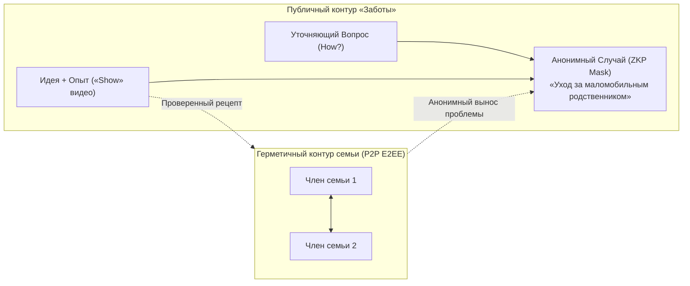
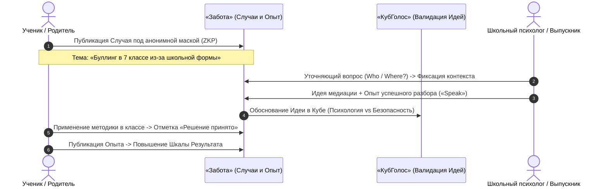
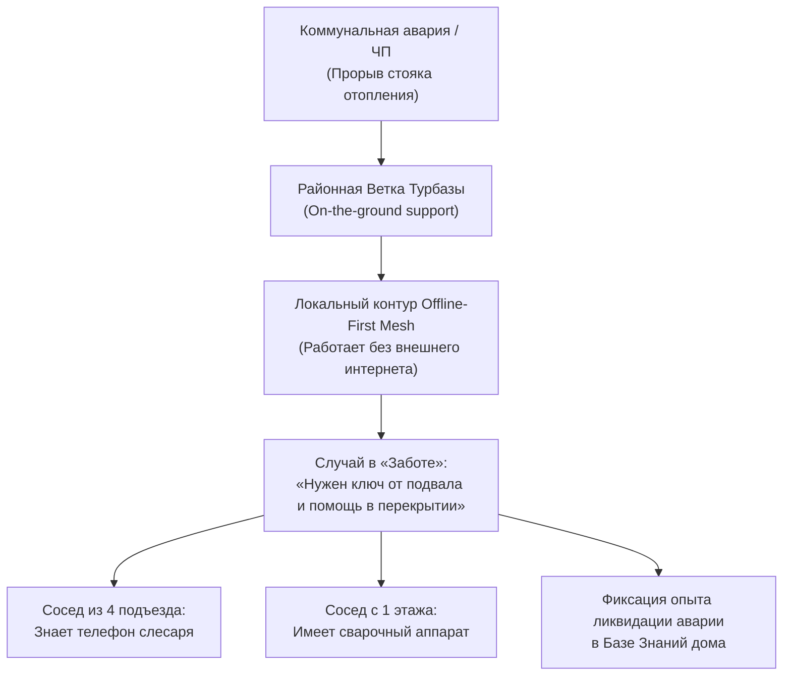

# Социально-экономический и прикладной потенциал платформы «Забота» (Sapoto.net)
## Культура действенной взаимопомощи, обмен проверенным опытом и поддержка на местах
*Семьи · Детские сады · Школы · Фирмы · Соседи · Районы · Регионы*

*Классификация: Децентрализованная социальная взаимопомощь, краудсорсинг практического опыта, P2P-поддержка на местах, трехуровневая топология данных*  
*Проектные репозитории: [`sapoto.net`](file:///Users/parents/Documents/data-independence-network/sapoto.net), [`votecube.com`](file:///Users/parents/Documents/data-independence-network/votecube.com), [`votecube-client-logic`](file:///Users/parents/Documents/data-independence-network/votecube-client-logic)*

---

## Содержание
1. [Концептуальное введение: От информационного шума к культуре действенной поддержки](#1-концептуальное-введение-от-информационного-шума-к-культуре-действенной-поддержки)
2. [Уровень 1: Семьи (Малые и большие семейные кланы)](#2-уровень-1-семьи-малые-и-большие-семейные-кланы)
3. [Уровень 2: Детские сады (Родительские группы и воспитатели)](#3-уровень-2-детские-сады-родительские-группы-и-воспитатели)
4. [Уровень 3: Школы (Родители, ученики и педагогический совет)](#4-уровень-3-школы-родители-ученики-и-педагогический-совет)
5. [Уровень 4: Фирмы и бизнес (Команды, стартапы, артели и МСП)](#5-уровень-4-фирмы-и-бизнес-команды-стартапы-артели-и-мсп)
6. [Уровень 5: Соседи (Многоквартирные дома, ТСЖ и локальные дворы)](#6-уровень-5-соседи-многоквартирные-дома-тсж-и-локальные-дворы)
7. [Уровень 6: Район (Муниципалитеты, поликлиники и районные сообщества)](#7-уровень-6-район-муниципалитеты-поликлиники-и-районные-сообщества)
8. [Уровень 7: Регион (Межмуниципальная координация, туризм «УраТур» и ЧС)](#8-уровень-7-регион-межмуниципальная-координация-туризм-уратур-и-чс)
9. [Сводная матрица ценности на семи уровнях масштабирования](#9-сводная-матрица-ценности-на-семи-уровнях-масштабирования)
10. [Заключение: Архитектурный синтез человечности и математической строгости](#10-заключение-архитектурный-синтез-человечности-и-математической-строгости)

---

## 1. Концептуальное введение: От информационного шума к культуре действенной поддержки

### 1.1. Кризис современных социальных сетей и чатов
Современное цифровое пространство страдает от системного парадокса: при колоссальном изобилии коммуникационных каналов (мессенджеры, городские форумы, социальные сети) человек в трудной жизненной ситуации остается один на один со своей проблемой:
* **Линейные хаотичные ленты:** Обсуждение серьезных вызовов превращается в неконтролируемый поток реплик, где ценные советы моментально тонут в эмоциональном шуме, сарказме и непрошеных оценках;
* **Отсутствие проверяемости опыта:** В обычных сообществах невозможно отличить авторитетный совет практика от абстрактных домыслов диванного комментатора;
* **Изоляция на местах:** Пользователи могут получать сочувствие от людей со всего мира, но не имеют инструмента, чтобы найти практическую помощь от соседа, живущего через два подъезда;
* **Страх стигматизации:** Отсутствие надежной математической анонимности заставляет людей скрывать деликатные проблемы (болезни близких, семейные кризисы, буллинг детей), опасаясь утечки данных и осуждения.

### 1.2. Когнитивная архитектура «Заботы» (Sapoto.net)
Платформа **«Забота»** переводит социальную коммуникацию из плоскости эмоционального шума в русло **структурированного решения проблем и взаимопомощи**:
* **Реальные Случаи (`Case`) вместо абстрактного нытья:** Проблема формулируется как структурированный случай, привязанный к общему тематическому дереву (`Topic`) и контексту (`Situation`);
* **Четыре строгие модальности реплик:**
  1. **Идеи (`Ideas`)** — формулирование методов, гипотез и планов действий;
  2. **Опыт (`Experiences`)** — объективные отчеты участников, применивших конкретный метод на практике, с поддержкой мультимодальных форматов **«Speak»** (голосовые отчеты) и **«Show»** (видеосвидетельства);
  3. **Вопросы (`Questions`)** — устранение информационной неполноты по 8 стандартным маркерам (*What, Which, Who, Where, Why, When, How, Whose*) с закреплением выжимки в блоке **«Уточненный контекст» (Refined Context)**;
  4. **Комментарии (`Comments`)** — эмоциональная и дискурсивная поддержка сообщества;
* **Поддержка на местах (*On-the-ground support*):** Опора на суверенную топологию «Турбазы» (Лист $\to$ Ветка $\to$ Ствол) обеспечивает криптографическую проверку нахождения участников в одном районе или городе (через ZKP-доказательства резидентства), позволяя объединять людей для реальной физической взаимовыручки;
* **Органическая интеграция с «КубГолосом» (VoteCube):** Каждая предложенная Идея может быть обоснована через 3D-Куб факторов, а практический Опыт участников напрямую корректирует эмпирическую **Шкалу Результата (Outcome Scale)**, математически защищая сообщество от популярных, но неработающих заблуждений.

---

## 2. Уровень 1: Семьи (Малые и большие семейные кланы)

### 1. Проблемы семейного взаимодействия
* **Сложные вызовы за закрытыми дверями:** Уход за лежачими пожилыми родственниками, адаптация ребенка с особенностями развития, семейные психологические кризисы требуют огромных знаний и эмоциональных сил.
* **Барьер стыда и страха:** Члены семьи стесняются выносить сокровенные проблемы в публичные соцсети, боясь осуждения знакомых и потери конфиденциальности.
* **Утрата опыта поколений:** Советы старших часто теряются, а молодые семьи заново совершают типичные бытовые и медицинские ошибки.

### 2. Как помогает «Забота»
* **Двойной контур видимости:** Семья может вести закрытый семейный дневник взаимопомощи в полностью зашифрованном локальном P2P-контуре (Лист-к-Листу), который не индексируется публичными серверами.
* **Анонимная маска (ZKP Ephemeral ActorId):** При необходимости запросить помощь сообщества автор публикует Случай под временной маской. Соседи и эксперты видят подтверждение, что вопрос задан реальным жителем района, но личность автора остается абсолютно защищенной.
* **Мультимодальный опыт («Speak» / «Show»):** Возможность записать голосовую заметку («Speak») или приложить короткое видео («Show») позволяет пожилым родственникам передавать кулинарные рецепты, приемы ухода и житейскую мудрость без необходимости утомительного набора текста.

### 3. Пример: Адаптация загородного дома для дедушки на коляске
* **Контекст (в связке с выбором семейного отпуска из «КубГолоса»):** Семья решает провести лето на даче с маломобильным дедушкой.
* **Случай (`Case`):** *«Как своими руками адаптировать деревянное крыльцо дачи под пандус для коляски при бюджете до 25 000 руб.»*.
* **Уточняющий Вопрос (`Question` / маркер *How*):** *«Каков перепад высоты от порога до уровня дорожки и длина свободного пространства перед входом?»*. Автор отвечает: *«Перепад 60 см, длина прямой площадки 4 метра»*. Факт закрепляется в блоке **«Уточненный контекст»**.
* **Предложенная Идея и подтверждающий Опыт:** Участник сообщества предлагает модульный деревянный пандус с антискользящим покрытием и прикладывает свой Опыт с видеозаписью («Show») сборки аналогичной конструкции.
* **Эффект:** Семья получает проверенное инженерное решение без лишних трат, а проверенная методика закрепляется в Базе Знаний топика как ориентир для других семей.

---

## 3. Уровень 2: Детские сады (Родительские группы и воспитатели)

### 1. Проблемы детсадовских сообществ
* **Стресс адаптации:** Первые недели посещения яслей сопровождаются слезами детей, паникой молодых мам и эмоциональным выгоранием воспитателей.
* **Индивидуальные особенности здоровья:** Аллергии, непереносимость глютена или лактозы, особенности сенсорной чувствительности требуют тонкой настройки быта группы, о чем в чатах часто забывают.
* **Потеря полезных вещей:** Дети быстро вырастают из одежды, обуви, автокресел и спортивного инвентаря, в то время как другие семьи остро нуждаются в этих вещах.

### 2. Как помогает «Забота»
* **Формирование «Проверенных рецептов» (Best Practices):** Практики мягкой адаптации детей, успешно опробованные родителями, фиксируются в каталоге топика детского сада и передаются следующим поколениям родителей.
* **Блок «Уточненный контекст»:** Исключает бесконечные переспросы одного и того же в начале каждого учебного года.
* **Соседский шеринг в пешей доступности:** Территориальная привязка к районной Ветке позволяет родителям одной группы мгновенно обмениваться детскими вещами, развивающими играми и манежами прямо во дворе садика.

### 3. Пример: Тяжелая утренняя тревожность при расставании в яслях
* **Случай (`Case`):** *«Ребенок (2.5 года) заходится в истерике при входе в группу, расставание длится по 40 минут»*.
* **Уточняющие вопросы:**
  * *When (Когда):* *«В какое именно время просыпается ребенок и сколько длится дорога до садика?»*
  * *What (Что):* *«Берет ли ребенок с собой знакомый предмет из дома?»*
* **Опыт («Speak» от опытной мамы):** Голосовой отчет с пошаговым описанием методики «игрушки-помощника»: мама дает ребенку маленького плюшевого мишку, которому поручается «побыть в садике до обеда и все запомнить для мамы», дополненный коротким ритуалом поцелуя в ладошку.
* **Шкала Результата в КубГолосе:** Методику пробуют еще 4 мамы из той же группы и отмечают успех. Вес Шкалы Результата возрастает до 75%, выводя рекомендацию на первое место в Базе Знаний садика.

---

## 4. Уровень 3: Школы (Родители, ученики и педагогический совет)

### 1. Проблемы школьного самоуправления
* **Скрытый буллинг и психологическое давление:** Подростки боятся рассказывать родителям и учителям о травле, опасаясь эскалации конфликта и статуса «доносчика».
* **Экзаменационный стресс (ОГЭ/ЕГЭ):** Выпускники и их семьи тратят огромные средства на случайных репетиторов, не имея объективных данных об эффективности методик подготовки.
* **Конфликт поколений в школьной среде:** Учителя перегружены отчетами, а инициативы школьников разбиваются о бюрократические препоны.

### 2. Как помогает «Забота»
* **Полная защищенность через ZKP-маски:** Подросток может открыть тему о психологическом давлении или травле в классе, оставаясь абсолютно неуязвимым для преследования. Ветка гарантирует, что участник — реальный ученик школы, но его имя не раскрывается.
* **Эмпирическая база образовательных практик:** Выпускники прошлых лет делятся реальным Опытом подготовки к сложным предметам (физика, профильная математика), прикладывая свои баллы и ссылки на бесплатные материалы.
* **Фильтрация токсичности сообществом:** Двухуровневая репутационная модерация мгновенно скрывает любые попытки оскорблений или перехода на личности в школьных тредах.

### 3. Пример: Преодоление травли в подростковом коллективе
* **Случай (`Case`):** *«Сын-семиклассник замкнулся, отказывается ходить в школу из-за травли группой сверстников»*.
* **Уточняющие вопросы:** Психологи из числа проверенных резидентов района уточняют динамику инцидентов (маркеры *Where* и *Why*). Уточненный контекст фиксирует: травля происходит в раздевалке спортзала в отсутствие учителя.
* **Решение сообщества:** Совместная инициатива родителей и школьного совета по пересмотру графика дежурств педагогов и вовлечению неформального лидера класса в организацию школьного турнира по настольному теннису.
* **Результат:** Конфликт исчерпан за 2 недели без административных скандалов. Метод бесконфликтной интеграции подростка получает высший рейтинг полезности в школьном топике.

---

## 5. Уровень 4: Фирмы и бизнес (Команды, стартапы, артели и МСП)

### 1. Проблемы малого и среднего предпринимательства
* **Острота локальных сбоев:** Поломка редкого станка, сбой кассового оборудования или внезапная проверка могут парализовать работу небольшого кафе, автосервиса или типографии на недели.
* **Недоступность дорогих консультантов:** Микробизнес не может оплачивать услуги столичных аудиторов и сервисных центров ради разовых вопросов.
* **Разрозненность местных предприятий:** Фирмы, работающие в одном промышленном парке или районе, часто не знают о возможностях друг друга и заказывают простые услуги за сотни километров.

### 2. Как помогает «Забота»
* **Шеринг мощностей и взаимовыручка МСП (B2B Peer Support):** Локальная сеть районной Ветки связывает инженеров, мастеров и предпринимателей для оперативного обмена запчастями, специнструментом и свободным станочным временем.
* **Видеоотчеты «Show» для решения технических проблем:** Мастера могут показать поломку на видео и получить точный видеоответ от коллеги, сталкивавшегося с подобной проблемой.
* **Шкала Экспертов по топикам:** Ответы опытных главных инженеров, бухгалтеров и юристов с подтвержденным рейтингом сразу выделяются в интерфейсе, отсекая некомпетентные советы.

### 3. Пример: Аварийный сбой гидравлического пресса в цехе
* **Случай (`Case`):** *«Пресс с ЧПУ выдает ошибку гидравлического клапана E-42, цех металлообработки простаивает»*.
* **Вопрос (`Question` / маркер *Which*):** *«Какая ревизия платы контроллера установлена и менялось ли гидравлическое масло в последний месяц?»*. Автор прикрепляет фото шильдика.
* **Опыт («Show» с видео):** Главный механик соседней артели, расположенной в том же индустриальном квартале, выкладывает 40-секундное видео правильной продувки дренажного жиклера, которое решает проблему за 15 минут.
* **Эффект:** Экономия 120 000 рублей на вызове сервисного инженера из областного центра и предотвращение срыва коммерческого контракта.

---

## 6. Уровень 5: Соседи (Многоквартирные дома, ТСЖ и локальные дворы)

### 1. Проблемы соседского общежития
* **Паралич при локальных авариях:** Прорыв трубы отопления, залив квартиры, отключение электричества в морозы требуют немедленных скоординированных действий жильцов, но общедомовые чаты превращаются в паническую перепалку.
* **Одиночество пожилых жильцов:** Одинокие пенсионеры и инвалиды часто не могут выйти в аптеку или магазин во время болезни, а соседи за стенкой даже не догадываются о беде.
* **Потерянные домашние животные и забытые вещи:** Поиски пропавшей кошки или связки ключей занимают недели из-за расклеивания бумажных объявлений на подъездах, которые тут же срывают.

### 2. Как помогает «Забота»
* **Поддержка на местах (*On-the-ground support*):** Уведомления о Случае получают только реальные соседи, подтвердившие проживание в данном квартале, что обеспечивает оперативную явку людей на помощь.
* **Работа при блэкаутах (Offline-First Mesh):** Если в доме отключился внешний интернет, жильцы координируют действия через локальную P2P-сеть смартфонов (Wi-Fi роутеры в подъезде или Bluetooth mesh).
* **Модальность Вопросов:** Позволяет моментально отсечь ложные догадки (например: *«Who? Кто перекрыл кран на чердаке?»*) и восстановить порядок в доме.

### 3. Пример: Срочная доставка лекарств одинокой соседке
* **Случай (`Case`):** *«Бабушке с 4 этажа (84 года) стало плохо с сердцем, скорая выписала рецепт, некому сходить в дежурную аптеку в метель»*.
* **Реакция соседей:** Сосед из соседней квартиры откликается в треде, уточняет аптеку, покупает медикаменты и доставляет их за 25 минут.
* **Замыкание цепочки:** Дочь пенсионерки публикует благодарственный Опыт в Заботе, повышая социальный капитал и репутацию неравнодушного соседа в муниципальном топике *«Взаимопомощь / Наш дом»*.

---

## 7. Уровень 6: Район (Муниципалитеты, поликлиники и районные сообщества)

### 1. Проблемы районного масштаба
* **Стихийные последствия непогоды:** Ледяной дождь, ураган или аномальный снегопад парализуют подходы к поликлиникам, школам и остановкам транспорта, пока коммунальные службы перегружены.
* **Дублирование жалоб:** Сотни жителей звонят в диспетчерские по поводу одной и той же упавшей ветки или ямы на дороге, перегружая операторов и сея взаимное раздражение.
* **Экологические инциденты:** Несанкционированные свалки мусора в лесопарках или сбросы стоков в водоемы требуют оперативной фиксации и независимой гражданской верификации.

### 2. Как помогает «Забота»
* **Превентивная дедупликация через TreeSearch:** При попытке опубликовать жалобу на сугроб у поликлиники локальная модель (Edge SLM) мгновенно сопоставляет текст с Trie-индексом Ветки и предлагает присоединиться к существующему Случаю, предотвращая дробление обращений на 60–80%.
* **Координация волонтерских усилий:** Объединение жителей для совместной расчистки дорожек, помощи маломобильным гражданам и мониторинга состояния района.
* **100% комплаенс 152-ФЗ (Zero-PII):** Граждане публикуют фото и геометки инцидентов со своих Листьев без сбора личных досье на серверах префектуры, исключая утечки персональных данных.

### 3. Пример: Расчистка пешеходных подходов к районной больнице после ледяного дождя
* **Случай (`Case`):** *«Тротуар к детской поликлинике покрыт сплошным льдом, пожилые люди и мамы с колясками падают»*.
* **Уточненный контекст:** Участники фиксируют точные координаты 200-метрового аварийного участка и нехватку противогололедного реагента у дворника.
* **Идея сообщества:** Организовать волонтерский сход с лопатами и песком из запасов близлежащих ТСЖ.
* **Результат:** 15 жителей района за 1.5 часа очищают дорожку и посыпают песком опасный склон. Видеоотчет («Show») в Заботе фиксирует устранение проблемы до приезда городской спецтехники.

---

## 8. Уровень 7: Регион (Межмуниципальная координация, туризм «УраТур» и ЧС)

### 1. Проблемы регионального уровня
* **Природные катаклизмы:** Лесные пожары, весенние паводки и сели охватывают десятки районов одновременно, требуя оперативного обмена правдивой информацией между жителями верховий и низовий рек.
* **Безопасность туризма в отдаленных районах:** Путешественники в горах и тайге рискуют жизнями из-за отсутствия актуальных данных о состоянии перевалов, бродов и троп.
* **Изолированность уникального муниципального опыта:** Успешный опыт одного района по организации раздельного сбора отходов или борьбе с борщевиком годами не доходит до соседей.

### 2. Как помогает «Забота»
* **Интеграция с сервисом «УраТур» (Urarun):** Туристы и гиды фиксируют свежий Опыт прохождения сложных участков в формате «Speak» и «Show», предупреждая сообщество об обвалах, разливах рек и диких животных.
* **Межмуниципальные «Проверенные рецепты»:** База Знаний топика регионального масштаба автоматически транслирует успешные практики решения экологических и хозяйственных задач на весь субъект РФ.
* **Бесконфликтное CRDT-слияние данных:** Данные, зафиксированные туристами или спасателями в зонах без сотовой связи (в офлайн-контуре Листьев), автоматически синхронизируются с региональной Веткой при выходе к любому узлу связи.

### 3. Пример: Гражданский мониторинг паводковой обстановки на реке
* **Случай (`Case`):** *«Резкий подъем уровня воды в верховьях реки после таяния снегов в горах, угроза затопления пяти поселков ниже по течению»*.
* **Опыт («Show» с геопривязкой):** Жители верхнего поселка выкладывают короткое видео уровня воды на мерной рейке у моста, подтверждая скорость подъема 15 см/час.
* **Действия низовий:** Жители поселков, расположенных на 40 км ниже по течению, получают заблаговременное предупреждение за 6 часов до прихода волны, успевая эвакуировать скот, поднять ценные вещи из погребов и укрепить береговые дамбы.

---

## 9. Сводная матрица ценности на семи уровнях масштабирования

| Уровень масштаба | Ключевой фокус проблемы | Уникальный инструмент «Заботы» | Роль связки с «КубГолосом» (VoteCube) | Практический результат для человека и общества |
| :--- | :--- | :--- | :--- | :--- |
| **1. Семья** | Интимные кризисы, уход за маломобильными родственниками | E2EE контур + Анонимная маска (ZKP Ephemeral ActorId) | Семейный совет в 3D-Кубе помогает взвесить приоритеты | Сохранение мира в семье, передача живого опыта поколений |
| **2. Садик** | Тревожная адаптация малышей, аллергии, шеринг вещей | Блок «Уточненный контекст» (8 маркеров Вопросов) | КубГолос снимает родительские споры, Забота дает проверенный рецепт | Спокойные дети и родители, доброжелательная атмосфера в группе |
| **3. Школа** | Травля в классе, стресс перед ОГЭ/ЕГЭ, выгорание | Защищенный анонимный постинг для подростков | Байесовская верификация методик подготовки к экзаменам | Безопасная школьная среда, высокий балл без затрат на репетиторов |
| **4. Бизнес** | Простой редких станков, поиск узких специалистов | Локальный B2B-шеринг мощностей + видео «Show» | Экспертная шкала подтверждает компетенцию инженера | Экономия сотен тысяч рублей, устойчивость локального микробизнеса |
| **5. Соседи** | Коммунальные аварии, одинокие пожилые соседи | Поддержка на местах (*On-the-ground*) + Offline Mesh | Контексты `Situation` структурируют взаимовыручку | Возрождение добрососедства, спасение жизней при авариях |
| **6. Район** | Гололед, завалы снега, несанкционированные свалки | TreeSearch дедупликация на лету + 152-ФЗ Zero-PII | Криптографическая проверка локального резидентства (ZKP) | Чистый и безопасный район, оперативная помощь без бюрократии |
| **7. Регион** | Паводки, лесные пожары, безопасность в туризме («УраТур») | Мультимодальный опыт («Speak»/«Show») в офлайн-контуре | Шкала Результата отсекает панические слухи и фейки | Предотвращение ущерба при ЧС, безопасность путешествий по стране |

---

## 10. Заключение: Архитектурный синтез человечности и математической строгости

Платформа **«Забота» (Sapoto.net)** в неразрывной связке с **«КубГолосом» (VoteCube)** и суверенной инфраструктурой **«Турбазы»** реализует принципиально новую парадигму цифрового взаимодействия:

1. **Практика выше теорий (Принцип научной верификации):**
   - Благодаря Байесовской Шкале Результата коллективный консенсус опирается не на громкость лозунгов или количество лайков, а на подтвержденный эмпирический Опыт реальных людей, применивших методику на практике.
2. **Абсолютная неприкосновенность частной жизни (152-ФЗ Self-Custody):**
   - Граждане могут доверять платформе самые сокровенные переживания, болезни и семейные вызовы. Все персональные данные остаются строго на Листе (устройстве пользователя), а шлюзы Веток обрабатывают только обезличенные дельты и ZKP-доказательства (Zero-PII).
3. **Реальная помощь в шаговой доступности (*On-the-ground support*):**
   - «Забота» объединяет людей не по абстрактным алгоритмическим интересам, а по принципу реального соседства и территориальной близости, возрождая культуру взаимной выручки в многоквартирных домах, поселках и районах.
4. **Инфраструктурная неуязвимость (Offline-First Mesh):**
   - Платформа сохраняет полную дееспособность при блэкаутах, техногенных авариях и в удаленных уголках дикой природы, гарантируя передачу жизненно важной информации даже в отсутствие внешнего интернета.
