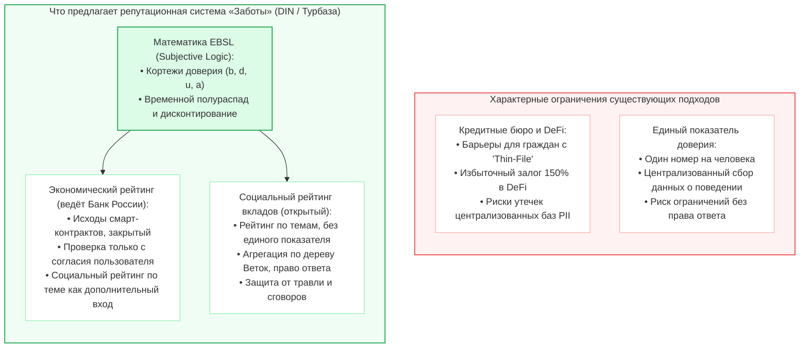
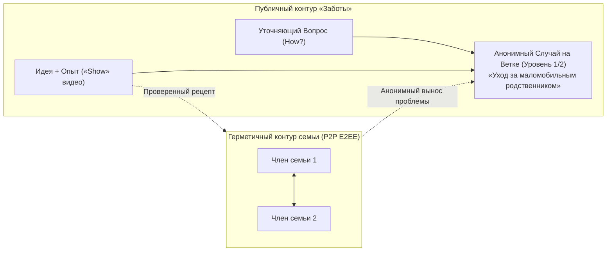
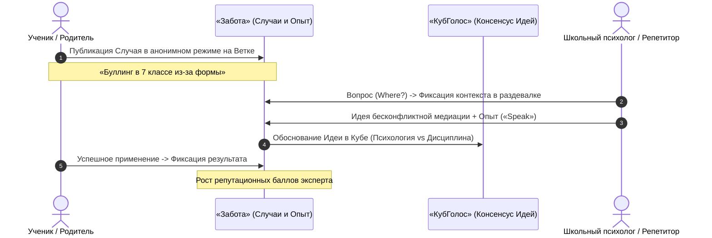
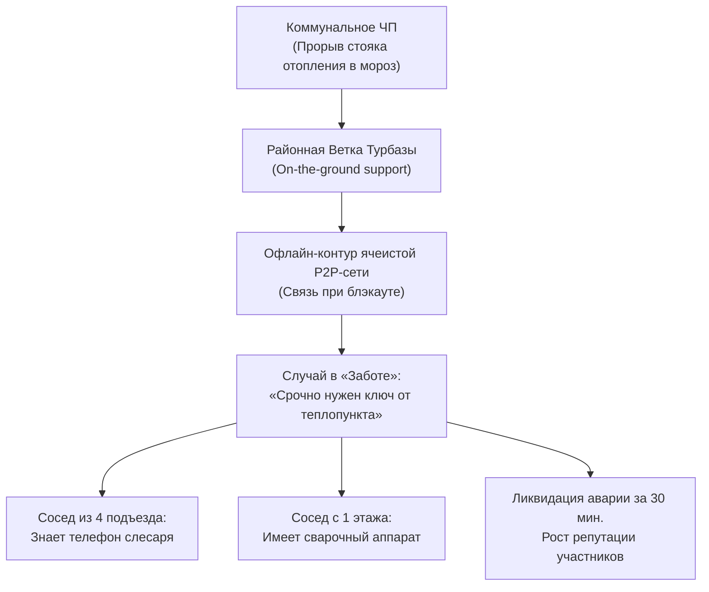

# Социально-экономический и прикладной потенциал платформы «Забота» (Sapoto.net)
## Культура действенной взаимопомощи, открытая децентрализованная репутация и автономная финансовая эмансипация
*Семьи · Детские сады · Школы · Фирмы · Соседи · Районы · Регионы*

*Классификация: Децентрализованная социальная взаимопомощь, краудсорсинг практического опыта, открытый социальный рейтинг вкладов, взаимодействие с экономическим рейтингом Банка России, интеграция с Цифровым рублем*  
*Концептуальный автор платформы и архитектор: Артём Владимирович Шамсутдинов*  
*Связанные нормативные спецификации: [`Sapoto_Reputation_and_Credit_System_Specification.md`](Sapoto_Reputation_and_Credit_System_Specification.md), [`Sapoto_architecture_and_functionality.md`](Sapoto_architecture_and_functionality.md), [`VoteCube_Ecosystem_Impact_Guide.md`](../votecube/VoteCube_Ecosystem_Impact_Guide.md)*  
*Проектные хранилища: [`sapoto.net`](file:///Users/parents/Documents/data-independence-network/sapoto.net), [`votecube.com`](file:///Users/parents/Documents/data-independence-network/votecube.com), [`votecube-client-logic`](file:///Users/parents/Documents/data-independence-network/votecube-client-logic)*

---

## Содержание
1. [Концептуальное введение: От информационного шума к культуре действенной поддержки](#1-концептуальное-введение-от-информационного-шума-к-культуре-действенной-поддержки)
2. [Эволюционная трансформация репутационных и кредитных систем в «Заботе»](#2-эволюционная-трансформация-репутационных-и-кредитных-систем-в-заботе)
3. [Уровень 1: Семьи (Малые и большие семейные кланы)](#3-уровень-1-семьи-малые-и-большие-семейные-кланы)
4. [Уровень 2: Детские сады (Родительские группы и воспитатели)](#4-уровень-2-детские-сады-родительские-группы-и-воспитатели)
5. [Уровень 3: Школы (Родители, ученики и педагогический совет)](#5-уровень-3-школы-родители-ученики-и-педагогический-совет)
6. [Уровень 4: Фирмы и бизнес (Команды, молодые компании, артели и МСП)](#6-уровень-4-фирмы-и-бизнес-команды-молодые-компании-артели-и-мсп)
7. [Уровень 5: Соседи (Многоквартирные дома, ТСЖ и локальные дворы)](#7-уровень-5-соседи-многоквартирные-дома-тсж-и-локальные-дворы)
8. [Уровень 6: Район (Муниципалитеты, поликлиники и районные сообщества)](#8-уровень-6-район-муниципалитеты-поликлиники-и-районные-сообщества)
9. [Уровень 7: Регион (Межмуниципальная координация, туризм «УраТур» и ЧС)](#9-уровень-7-регион-межмуниципальная-координация-туризм-уратур-и-чс)
10. [Сводная матрица социально-экономической ценности на семи уровнях](#10-сводная-матрица-социально-экономической-ценности-на-семи-уровнях)
11. [Заключение: Архитектурный синтез человечности, цифрового суверенитета государства и математической строгости](#11-заключение-архитектурный-синтез-человечности-цифрового-суверенитета-государства-и-математической-строгости)

---

## 1. Концептуальное введение: От информационного шума к культуре действенной поддержки

### 1.1. Кризис современных социальных сетей и кредитно-рейтинговых систем
Современный гражданин и локальный бизнес зажаты между двумя системными пороками цифровой эпохи:
1. **Коммуникационный тупик соцсетей:** В мессенджерах и соцсетях обсуждение острых жизненных вызовов тонет в эмоциональном шуме, троллинге и рекламе. Советы дилетантов неотличимы от рекомендаций опытных практиков, а помощь соседа за стенкой остается недоступной из-за отсутствия локальных инструментов доверия.
2. **Ограничения, которые видны в существующих кредитных бюро и системах рейтингов:** 
   - Бюро кредитных историй (БКИ) и скоринговые алгоритмы, созданные во второй половине XX века, проделали большую работу и дали широким слоям населения доступ к кредитованию. Они строились в условиях ограниченных вычислительных мощностей и ограниченных данных. Поэтому молодёжь, самозанятые, начинающие мастера и микробизнес с «тонкими» кредитными историями (Thin-File Borrowers) нередко сталкиваются с высокими процентными барьерами и обращаются к микрофинансированию со ставками до 292% годовых.
   - Системы социального рейтинга, которые создаются в разных странах, решают реальные задачи доверия и безопасности. Их авторы продолжают совершенствовать свои подходы. Здесь предлагается набор идей, который может дополнить эти системы: рейтинг по темам вместо единого показателя, право ответа на оценку, затухание давних ошибок и ясные правила приватности.

### 1.2. Когнитивная и экономическая архитектура «Заботы» (Sapoto.net)
Платформа **«Забота»** кардинально меняет правила игры, объединяя структурированное решение жизненных проблем с децентрализованной экономикой доверия:
* **Реальные Случаи (`Case`) вместо хаоса:** Проблема оформляется структурированно, привязываясь к топику (`Topic`) и контексту (`Situation` в «КубГолосе»);
* **Четыре модальности реплик:** Идеи (`Ideas`), Опыт (`Experiences` с мультимодальными форматами «Speak»-аудио и «Show»-видео), Вопросы (`Questions` по 8 маркерам) и Комментарии (`Comments`);
* **Сквозная децентрализованная репутация:** Каждый подтвержденный факт помощи, успешно закрытое Дело (`Task` в органайзере «Деловой») и завершенная сделка в Цифровом рубле формируют децентрализованный социальный и кредитный капитал гражданина;
* **Поддержка на местах (*On-the-ground support*):** Криптографическая проверка локального резидентства через ZKP на районных Ветках платформы «Турбаза» объединяет соседей для реальной физической взаимовыручки.

---

## 2. Эволюционная трансформация репутационных и кредитных систем в «Заботе»

Репутационный механизм «Заботы» представляет собой **набор идей, продолжающих работу авторов классических моделей**, и развивает их достижения (FICO, VantageScore, Basel) на базе криптографии доказательств с нулевым разглашением (ZK-Proofs) и автономных периферийных вычислений:

> ℹ️ *Полная нормативная математическая модель народной кредитной системы, формулы субъективной логики (EBSL), ZK-аттестации для Цифрового рубля, транзитивное поручительство (Multi-Hop Transitive Trust) и балансировка сезонной ликвидности ROSCA подробно специфицированы в отдельном документе: [**`Sapoto_Reputation_and_Credit_System_Specification.md`**](Sapoto_Reputation_and_Credit_System_Specification.md).*

```mermaid
graph TD
    subgraph Trap ["Характерные ограничения существующих подходов"]
        direction TB
        BKI["Кредитные бюро и DeFi:<br/>• Барьеры для граждан с 'Thin-File'<br/>• Избыточный залог 150% в DeFi<br/>• Риски утечек централизованных баз PII"]
        AuthSoc["Единый показатель доверия:<br/>• Один номер на человека<br/>• Централизованный сбор данных о поведении<br/>• Риск ограничений без права ответа"]
    end

    subgraph SapotoAlt ["Что предлагает репутационная система «Заботы» (DIN / Турбаза)"]
        direction TB
        RepMath["Математика EBSL (Subjective Logic):<br/>• Кортежи доверия (b, d, u, a)<br/>• Временной полураспад и дисконтирование"]
        PeopleCredit["Экономический рейтинг (ведёт Банк России):<br/>• Исходы смарт-контрактов, закрытый<br/>• Проверка только с согласия пользователя<br/>• Социальный рейтинг по теме как дополнительный вход"]
        PeopleSoc["Социальный рейтинг вкладов (открытый):<br/>• Рейтинг по темам, без единого показателя<br/>• Агрегация по дереву Веток, право ответа<br/>• Защита от травли и сговоров"]
        RepMath --> PeopleCredit
        RepMath --> PeopleSoc
    end

    style Trap fill:#fef2f2,stroke:#ef4444,stroke-width:1.5px
    style SapotoAlt fill:#f0fdf4,stroke:#16a34a,stroke-width:1.5px
    style BKI fill:#ffffff,stroke:#fca5a5,stroke-width:1px
    style AuthSoc fill:#ffffff,stroke:#fca5a5,stroke-width:1px
    style RepMath fill:#dcfce7,stroke:#16a34a,stroke-width:1.5px
    style PeopleCredit fill:#ffffff,stroke:#86efac,stroke-width:1px
    style PeopleSoc fill:#ffffff,stroke:#86efac,stroke-width:1px
```

### 2.1. Экономический рейтинг и Цифровой рубль
- В соответствии с [Whitepaper 06 (ПКСК Банка России)](../06_cbr_smart_contracts_fsm_whitepaper.md), расчетное ядро смарт-контрактов ЦБ РФ функционирует как детерминированный автомат $O(1)$.
- Экономический (кредитный) рейтинг вычисляется Банком России по результатам смарт-контрактов, в которых участвовал пользователь, в отдельной системе, без постороннего просмотра. Он используется как современный кредитный рейтинг только с согласия пользователя на конкретное действие, требующее проверки. Банк России работает со структурами, выводящими рейтинг по разрешённым методикам.
- Участник контракта идентифицируется временной оболочкой, связанной с его кошельком в Банке России (один кошелёк на человека); допустима социальная анонимность: обществу и контрагентам человек не известен, а личность известна только Банку России, и при серьёзном нарушении может быть установлена в судебном порядке.
- «Забота» не рассчитывает кредитный рейтинг: она предоставляет социальный рейтинг по теме как дополнительный вход проверки (достаточно сообщить Банку России темы или теги контракта) и хранит приватные сведения о проведённой работе вместе с «Деловым».
- **Социальное поручительство (ROSCA / Кассы взаимопомощи)** и беззалоговые займы остаются проектными предложениями спецификации репутации; их условия зависят от законодательства и решений Банка России.

### 2.2. Открытый социальный рейтинг вкладов
- **Вклады, а не человек**: оцениваются индивидуальные вклады (реплики, Идеи, Опыт, Дела), сгруппированные по темам; профессиональный сантехник или педагог оцениваются по плодам своего труда, а не по взглядам или образу жизни. Общий рейтинг человека не ведётся, единый балл по умолчанию не выводится.
- **Открытое общественное лицо**: тематические и географические Ветки агрегируют результаты опросов «КубГолоса» вверх по дереву и дублируют их в Ветви региона и Стволе страны, чтобы пользователи и приложения могли находить рейтинг. Права на публичный рейтинг и доступ к отдельным темам прорабатываются отдельно.
- **Право ответа**: люди и бизнесы могут ответить на оценку; разбор рейтинга позволяет спуститься к общественным хранилищам, где оценка сделана, через теги на Листе.
- **Политика оператора темы**: публикацию негативных оценок и другие параметры задаёт оператор темы в рамках закона; запрещённое законом не публикуется.
- **Виды анонимности и поимённый режим**: различаются полная анонимность (никто не знает пользователя, известен только район) и социальная анонимность (человек не известен в общественном контуре, но экономически известен Банку России). Если пользователь регистрируется по имени, имя автоматически помещается в общественный контур; это объясняется до регистрации. Рейтинг привязан к статусу регистрации; при переводе анонимной регистрации в проверенную собранные рейтинги остаются за прежним статусом, чтобы репутацию нельзя было продать.
- **Право на исправление (Half-Life Decay)**: репутационные ошибки прошлого со временем затухают, открывая путь к социальной реабилитации.

### 2.3. Институциональный симбиоз с банковской системой: Игра с положительной суммой
- **Интеграция вместо конфронтации:** «Турбаза» не пытается заменить банковскую систему, а выступает автономным периферийным слоем, усиливающим классический банкинг. Банки сохраняют свои ключевые общественные функции: трансформацию ликвидности, профессиональный андеррайтинг, доверительное хранение и соблюдение макропруденциальных нормативов.
- **Радикальное снижение банковских издержек:**
  - **-80%...-90% затрат на IT-инфраструктуру:** вынос неструктурированных данных на Листья пользователей;
  - **Ликвидация рисков утечек данных по 152-ФЗ:** заёмщик подтверждает условия проверки с согласием на конкретное действие без передачи банку частной информации (проектное предложение);
  - **Снижение стоимости риска (Cost of Risk / NPL) в 2–3 раза:** автоматическое покрытие первого убытка (First-Loss Junior Tranche) поручителями и кассами взаимопомощи ROSCA.
- **Новые высокомаржинальные источники выручки банков:**
  - **Банк как Оператор Финансовой Ветки:** получение доли $w_{\text{branch}}$ в формуле сплитования `share(...)` от всех транзакций обслуживаемого кластера;
  - **Синдикация Старших траншей (Senior Tranches):** банк предоставляет оптовое фондирование крупным проектам касс взаимопомощи под надежную низкую ставку с защитой капитала буфером первого убытка (AAA-эквивалент);
  - **B2B смарт-факторинг на базе Proof-of-Delivery:** мгновенное финансирование поставщиков под уступку проверенной накладной без риска фальсификаций.

### 2.4. Восточные модели долевого партнерского финансирования (PLS): дополнение к ссудному проценту
- **Принцип справедливого разделения рисков (Profit-and-Loss Sharing, PLS):** В русле Федерального закона № 377-ФЗ о партнерском финансировании и многовековых восточных традиций инвестор разделяет реальные предпринимательские риски с исполнителем. Доход инвестора формируется как доля в фактически созданной чистой прибыли ($\alpha \cdot \Pi$), а не как фиксированный процент, начисляемый независимо от исхода дела.
- **Смарт-Мудараба (Mudarabah):** Трастовое партнерство пассивного инвестора (Рабб аль-мал) и предпринимателя (Мудариб). При объективном убытке инвестор теряет капитал, а предприниматель — время и труд (без долговой ямы и конфискации личного имущества). При этом недобросовестность (халатность / Tafrit) строго пресекается оракулами TAPO и арбитражем «КубГолоса».
- **Убывающая Мушарака (Diminishing Musharakah):** Долевое соинвестирование в покупку оборудования и станков для артелей и МСП. Предприниматель постепенно выкупает долю инвестора через транши в Цифровом рубле с одновременным пропорциональным снижением платы за аренду оставшейся доли, без чрезмерных кредитных переплат.
- **Солидарная взаимопомощь Такафул (Takaful):** Создание взаимных резервных фондов на районных Ветках (Табарру'), демпфирующих природные и производственные форс-мажоры с гарантированным возвратом неиспользованных излишков участникам пула.

---

## 3. Уровень 1: Семьи (Малые и большие семейные кланы)

```mermaid
graph LR
    subgraph FamilyCircle["Герметичный контур семьи (P2P E2EE)"]
        Member1["Член семьи 1"] <--> Member2["Член семьи 2"]
    end
    subgraph PublicCare["Публичный контур «Заботы»"]
        CaseAnon["Анонимный Случай на Ветке (Уровень 1/2)<br/>«Уход за маломобильным родственником»"]
        Question["Уточняющий Вопрос (How?)"] --> CaseAnon
        IdeaExp["Идея + Опыт («Show» видео)"] --> CaseAnon
    end
    FamilyCircle -.->|Анонимный вынос проблемы| CaseAnon
    IdeaExp -.->|Проверенный рецепт| FamilyCircle
```

### 1. Проблемы семейного взаимодействия
* Уход за тяжелобольными родственниками, воспитание детей с особенностями, семейные кризисы.
* Опасение осуждения при обращении в публичные соцсети и утечки деликатных сведений.
* Финансовая уязвимость перед непредвиденными медицинскими расходами и вынужденное обращение к дорогостоящим кредитам МФО.

### 2. Как помогает «Забота»
* **Двойной контур видимости:** Личный закрытый семейный архив в шифрованном P2P-контуре Листьев + анонимный вынос проблемы на районную Ветку (Branch ID / жеребьевка).
* **Семейные кассы взаимопомощи в Цифровом рубле:** Быстрое привлечение средств на лечение или реабилитацию от широкого круга родственников и друзей через защищенный FSM смарт-контракт без банковских комиссий.
* **Мультимодальный опыт («Speak» / «Show»):** Фиксация проверенных методик ухода и воспитания в аудио- и видеоформатах.

### 3. Пример: Адаптация дачи для дедушки на коляске и семейный микрозайм
* **Случай (`Case`):** *«Оборудование пандуса и санузла для маломобильного дедушки при ограниченном бюджете»*.
* **Решение:** Сосед-инженер делится видеоинструкцией («Show») сборки надежного пандуса из стандартного бруса.
* **Финансирование:** Недостающие 30 000 рублей на материалы семья привлекает через P2P-заем у участников семейного клана в Цифровом рубле под $0\%$, возвращая долг частями по графику FSM-автомата.

---

## 4. Уровень 2: Детские сады (Родительские группы и воспитатели)

### 1. Проблемы детсадовских сообществ
* Тревожная адаптация малышей, споры о питании, аллергиях и развивающих методиках.
* Риск найма недобросовестных нянь и репетиторов по поддельным отзывам на досках объявлений.

### 2. Как помогает «Забота»
* **База Знаний группы:** Формирование «Проверенных рецептов» по мягкой адаптации малышей с подтверждением родительским Опытом.
* **Народная репутация нянь и специалистов:** Родители видят подтвержденный жизненный опыт других семей района, исключающий накрученные отзывы.
* **Соседский шеринг:** Безопасный обмен детской одеждой, развивающими играми и автокреслами между проверенными резидентами района.

---

## 5. Уровень 3: Школы (Родители, ученики и педагогический совет)

```mermaid
sequenceDiagram
    autonumber
    actor Pupil as Ученик / Родитель
    participant Sapoto as «Забота» (Случаи и Опыт)
    participant VC as «КубГолос» (Консенсус Идей)
    actor Expert as Школьный психолог / Репетитор

    Pupil->>Sapoto: Публикация Случая в анонимном режиме на Ветке
    Note over Pupil,Sapoto: «Буллинг в 7 классе из-за формы»
    Expert->>Sapoto: Вопрос (Where?) -> Фиксация контекста в раздевалке
    Expert->>Sapoto: Идея бесконфликтной медиации + Опыт («Speak»)
    Sapoto->>VC: Обоснование Идеи в Кубе (Психология vs Дисциплина)
    Pupil->>Sapoto: Успешное применение -> Фиксация результата
    Note over Sapoto: Рост репутационных баллов эксперта
```

### 1. Проблемы школьного сообщества
* Скрытая травля (буллинг), стресс перед ОГЭ/ЕГЭ, выгорание педагогов.
* Огромные траты семей на непроверенных репетиторов.

### 2. Как помогает «Забота»
* **Анонимная защита подростков:** Школьник может сообщить о буллинге или психологическом кризисе с гарантией 100% анонимности перед администрацией и сверстниками.
* **Пиринговое репетиторство старшеклассников:** Старшеклассники помогают младшим готовиться к экзаменам, зарабатывая первичный социальный капитал и баллы гражданской активности, которые открывают им высокий кредитный рейтинг во взрослой жизни.

---

## 6. Уровень 4: Фирмы и бизнес (Команды, молодые компании, артели и МСП)

### 1. Проблемы малого и среднего предпринимательства
* **Кредитный голод:** Банки требуют жесткие залоги (недвижимость, оборудование), недоступные начинающим предпринимателям и самозанятым.
* **Срыв контрактов из-за простоев:** Поломка редкого оборудования парализует цех, а вызов столичных специалистов стоит сотен тысяч рублей.

### 2. Как помогает «Забота»
* **Кредитование оборотного капитала и B2B смарт-факторинг (проектное предложение):** Предприниматель подтверждает репутацию исполнения заказов через проверку с согласием (социальный рейтинг по теме плюс экономический рейтинг Банка России) и может получить заем в Цифровом рубле напрямую от локальных инвесторов либо мгновенный смарт-факторинг в коммерческом банке по акту сдачи-приемки без риска отказа и бумажной волокиты.
* **Синдикация Старших траншей банков для артелей и производств:** Малый бизнес объединяется в кассы взаимопомощи, формируя младший транш первого убытка, что позволяет привлекать крупное банковское финансирование (Senior Tranche) по минимальной ставке без неподъемных залогов недвижимости.
* **Партнерское проектное соинвестирование (Мудараба и Убывающая Мушарака):** Артели и молодые компании привлекают капитал от частных инвесторов и банков без ссудного процента по схеме разделения прибыли (PLS / 377-ФЗ). Оборудование и станки приобретаются в совместную собственность и постепенно переходят к артели по мере выкупа долей в Цифровом рубле с автоматическим сокращением арендных платежей.
* **Шеринг мощностей и запчастей (B2B Peer Support):** Быстрый поиск редких комплектующих и свободного времени станков у соседей по промзоне через видеозапросы «Show».
* **Социальные гарантии артелей:** Кооперативное поручительство пула предпринимателей позволяет брать крупные муниципальные заказы без банковских гарантий.

---

## 7. Уровень 5: Соседи (Многоквартирные дома, ТСЖ и локальные дворы)

```mermaid
graph TD
    Incident["Коммунальное ЧП<br/>(Прорыв стояка отопления в мороз)"] --> LocalBranch["Районная Ветка Турбазы<br/>(On-the-ground support)"]
    LocalBranch --> MeshNet["Офлайн-контур ячеистой P2P-сети<br/>(Связь при блэкауте)"]
    MeshNet --> CaseHelp["Случай в «Заботе»:<br/>«Срочно нужен ключ от теплопункта»"]
    CaseHelp --> Neighbor1["Сосед из 4 подъезда:<br/>Знает телефон слесаря"]
    CaseHelp --> Neighbor2["Сосед с 1 этажа:<br/>Имеет сварочный аппарат"]
    CaseHelp --> ExpDone["Ликвидация аварии за 30 мин.<br/>Рост репутации участников"]
```

### 1. Проблемы соседского общежития
* Коммунальные аварии, беспомощность пожилых жильцов во время снегопадов или болезней, пассивность жильцов.

### 2. Как помогает «Забота»
* **Локальные кассы взаимопомощи дома (ROSCA):** Жильцы аккумулируют средства на благоустройство двора или ремонт подъезда в смарт-контракте Цифрового рубля с прозрачным расходованием без управляющей компании.
* **Рейтинг добрососедства:** Помощь в доставке продуктов пожилым соседям или уборке снега конвертируется в открытую репутацию, дающую льготные условия в сервисах района.
* **Автономная работа в ячеистой сети:** Связь и координация жителей работают даже при полном отключении электроэнергии и интернета.

---

## 8. Уровень 6: Район (Муниципалитеты, поликлиники и районные сообщества)

### 1. Проблемы районного масштаба
* Засилье заказных отзывов на локальных мастеров (сантехников, автослесарей, строителей).
* Наплыв дублирующих жалоб в коммунальные службы и отсутствие прямой связи граждан с честными исполнителями.

### 2. Как помогает «Забота»
* **«Локальный реестр МСП и ЖКХ» с защитой от накруток:** Рейтинг мастера базируется исключительно на подтвержденном Опыте реальных жителей района, оплаченном через безопасную сделку (`escrow`) в Цифровом рубле.
* **Институциональные гаранты доверия (Территориальные и Ведомственные Ветки):** Муниципалитет и ведомства выступают не надзирателями, а беспристрастными гарантами подлинности прав собственности, лицензий и резидентства через государственные ZK-аттестации, избавляя район от бюрократии и мошенников.
* **TreeSearch дедупликация инцидентов:** Устранение 80% дублирующих обращений по ямам на дорогах и сугробам благодаря семантическому анализу текста на Листьях.
* **Снижение рисков утечек (152-ФЗ):** Частная информация хранится в частных хранилищах и не попадает на Ветки; муниципалитет освобождён от содержания тяжёлых баз персональных данных граждан. Имя автора становится общественной информацией только при поимённой регистрации и с согласия пользователя.

---

## 9. Уровень 7: Регион (Межмуниципальная координация, туризм «УраТур» и ЧС)

### 1. Проблемы регионального уровня
* Стихийные бедствия (паводки, пожары), безопасность на удаленных туристических маршрутах, информационная изоляция муниципалитетов.

### 2. Как помогает «Забота»
* **Государство как доверенный участник экосистемы:** Интеграция государственных реестров (Росреестр, ФНС, СФР) через государственные криптографические срезы (ZK-Attestations) дополняет децентрализованные механизмы взаимопомощи гарантией легитимности и решает проблему «холодного старта» для добросовестных граждан.
* **Интеграция с «УраТур» (UraTour):** Туристы и гиды подтверждают надежность друг друга через мультимодальные видеоотчеты («Show»). Гиды с высоким репутационным индексом получают статус сертифицированных проводников без поборов со стороны чиновников.
* **Межмуниципальные гарантийные пулы:** Кооперативы соседних районов объединяют репутационные балансы для реализации совместных инфраструктурных проектов.
* **Гражданский мониторинг ЧС:** Оперативное оповещение о паводках жителями верховий рек спасает жизни и имущество жителей нижележащих районов.

---

## 10. Сводная матрица социально-экономической ценности на семи уровнях

| Уровень масштаба | Ключевой вызов | Репутационный инструмент «Заботы» | Интеграция с Цифровым рублем (Whitepaper 06) | Практический эффект для граждан и общества |
| :--- | :--- | :--- | :--- | :--- |
| **1. Семья** | Интимные кризисы, болезнь близких, нехватка денег | Двойной контур (E2EE + анонимный вынос на Ветку) | Внутрисемейные P2P-кассы взаимопомощи под 0% | Защита от долговой нагрузки и дорогих займов МФО, передача житейского опыта |
| **2. Садик** | Тревожная адаптация детей, поиск надежных нянь | База проверенных рецептов + рейтинг нянь по опыту | Прозрачная оплата родительских инициатив | Спокойствие родителей, безопасная среда для малышей |
| **3. Школа** | Буллинг, дороговизна репетиторов | Анонимный постинг + репутация репетиторов-старшеклассников | Микро-вознаграждения за успехи в учебе по `share(...)` | Искоренение травли, равный доступ к качественному образованию |
| **4. Бизнес** | Нехватка кредитов для МСП, долговая нагрузка, простой станков | B2B шеринг оборудования + рейтинг надежности + Proof-of-Delivery | Займы с проверкой рейтинга по согласию (проектное предложение), B2B смарт-факторинг, PLS-соинвестирование (Мудараба / Мушарака) | Снижение ставок, замена кредита разделением прибыли (PLS / 377-ФЗ), выкуп станков без чрезмерной долговой нагрузки |
| **5. Соседи** | Коммунальные аварии, пассивность жильцов | Рейтинг добрососедства + ячеистая сеть при блэкаутах | Домовые кассы взаимопомощи (ROSCA) на благоустройство | Сплоченность подъезда, оперативная помощь в ЧП |
| **6. Район** | Фейковые отзывы, накрутки на рынке услуг | Объективный рейтинг МСП и ЖКХ на базе Опыта | Безопасная сделка (Escrow) с оплатой по факту | Качественный ремонт без обмана, поддержка честных мастеров |
| **7. Регион** | ЧС, пожары, безопасность туризма («УраТур») | Сертификация проводников по «Show» + мониторинг рек | Межмуниципальные гарантийные пулы развития | Спасение жизней при ЧС, расцвет отечественного экотуризма |

---

## 11. Заключение: Архитектурный синтез человечности, цифрового суверенитета государства и математической строгости

Платформа **«Забота» (Sapoto.net)** в связке с **«КубГолосом» (VoteCube)**, органайзером **«Деловой» (GoGetter)** и смарт-контрактами **Цифрового рубля** открывает принципиально новый исторический путь развития общества:

1. **Финансовая доступность и монетизация социального капитала:** Граждане и предприниматели получают прямой доступ к финансовым ресурсам на основе прозрачных и проверяемых математических моделей. Социальный капитал, заработанный честным трудом и взаимопомощью, может учитываться как дополнительный вход при проверках для экономической деятельности (контракты, займы) по правилам Банка России и в рамках закона.
2. **Доверие, которое можно проверить и на которое можно ответить:** Рейтинг вкладов по темам без единого показателя, с правом ответа, затуханием давних ошибок и правилами оператора темы в рамках закона помогает людям находить надёжных исполнителей и советчиков. Экономический рейтинг закрыт и выдаётся только с согласия пользователя. Эти идеи дополняют существующие системы и могут по-разному применяться в разных странах.
3. **Возрождение солидарности на местах:** От семьи и подъезда до района и региона «Забота» восстанавливает ткань человеческого доверия, превращая цифровые технологии из источника разобщения в фундамент всенародной взаимовыручки.
