# Спецификация децентрализованной репутационной системы и суверенного кредитного скоринга (Sapoto Reputation & Credit System Specification 1.0)

> **Категория:** [Прикладной стек (Applications Suite)](../README.md) · Нормативная инженерная спецификация  
> **Автор спецификации и математического вывода:** Интеллектуальный агент Antigravity (Google DeepMind)  
> **Концептуальный автор, визионер и архитектор платформы:** Артём Владимирович Шамсутдинов  
> **Связанные документы директории:**  
> • [**`Sapoto_architecture_and_functionality.md`**](Sapoto_architecture_and_functionality.md) — Базовая архитектурная спецификация «Заботы»  
> • [**`Sapoto_Ecosystem_Impact_Guide.md`**](Sapoto_Ecosystem_Impact_Guide.md) — Социально-экономический потенциал на 7 уровнях общества  
> • [**`../votecube/VoteCube_architecture_and_functionality.md`**](../votecube/VoteCube_architecture_and_functionality.md) — Спецификация 3D-консенсуса «КубГолоса»  
> • [**`../../06_cbr_smart_contracts_fsm_whitepaper.md`**](../../06_cbr_smart_contracts_fsm_whitepaper.md) — Белая книга коммерческих FSM смарт-контрактов ЦБ РФ  

---

## 1. Концепция, преемственность и технологический синтез

Настоящая спецификация устанавливает нормативные инженерные стандарты, математический аппарат и криптографические протоколы **Децентрализованной репутационной системы платформы «Турбаза»**, реализуемой через системообразующее приложение **«Забота» (Sapoto.net)**.

### 1.1. Эволюционная преемственность: Глобальный синтез мировых скоринговых систем и традиций гражданской солидарности
Платформа «Турбаза» строится на фундаментальном принципе глубокого уважения и преемственности по отношению к выдающимся достижениям мировой институциональной мысли:
1. **Западная школа аналитического риск-моделирования (FICO, VantageScore, Basel II/III/IV):**
   - Разработанные во второй половине XX века пятифакторная модель FICO, методология трендовых данных VantageScore 4.0 и базельские компоненты кредитного риска ($\text{PD}, \text{LGD}, \text{EAD}$) доказали непревзойденную математическую точность на массивах данных в сотни миллионов заемщиков.
   - Они выполнили фундаментальную историческую задачу индустриализации кредитования, преодолев субъективизм и обеспечив доступ к цивилизованному финансированию широким слоям населения.
2. **Восточные и мировые традиции гражданской солидарности и экономики доверия:**
   - Передовой опыт стран Востока и Азии (высокая культура взаимной поддержки в Сингапуре и Японии, масштабное развитие «депозит-фри» сервисов шеринга, институты признания общественно-полезного труда) продемонстрировал, что социальная сплоченность, волонтерство и верность слову являются мощнейшими экономическими драйверами.
   - Признание личного вклада гражданина в благополучие общества и института восстановительного заглаживания ошибок открывает путь к органической солидарности без жесткого администрирования.
3. **Возможности периферийных вычислений и криптографии XXI века:**
   - Ключевые технологические вызовы прошлого (угрозы утечек баз данных, транзакционные издержки ведения ИТ-инфраструктуры, информационная асимметрия в отношении граждан с «тонкими» кредитными историями) преодолеваются переносом проверенных принципов на суверенные периферийные вычисления (Edge Computing / ядро AIRport на Листьях) с криптографией доказательств с нулевым разглашением (ZK-SNARKs) и государственной платформой смарт-контрактов Цифрового рубля (Whitepaper 06).

### 1.2. Что заимствуется, что совершенствуется и что трансформируется фундаментально

| Уровень архитектуры | Проверенная мировая классика (FICO / Basel / Восточный опыт) | Эволюционное совершенствование в «Турбазе» | Принципиальная трансформация архитектуры |
| :--- | :--- | :--- | :--- |
| **Факторы риска** | 5 проверенных измерений поведения FICO (платежи, долг, срок, микс, новые заявки) | Прямой маппинг факторов в Evidence-Based Subjective Logic (VW-EBSL) | Расчет факторов выполняется локально на Листе заемщика (On-Device), а не на внешнем сервере |
| **Моделирование дефолта** | Базельские компоненты IRB: вероятность дефолта ($\text{PD}$), потери ($\text{LGD}$), экспозиция ($\text{EAD}$) | Формализация $\text{PD}$ через субъективную неопределенность ($d + a \cdot u$), а $\text{LGD}$ — через залоги и поручительства | Доказательство кредитоспособности передается банку или P2P-займодавцу через ZK-Proof без раскрытия истории счетов |
| **Временной анализ** | Трендовые данные VantageScore 4.0 (динамика во времени вместо статического снимка) | Непрерывная фиксация траектории поведения через журнал WAL-дельт и экспоненциальный полураспад ($\lambda$) | Полная защита банковской тайны (ст. 26 395-1) и Zero-PII: журнал изменений хранится строго у гражданина |
| **Залоговая механика** | Фиксированные залоги в банках или избыточный 150% залог в крипто-DeFi | Плавное динамическое снижение залогового требования по мере роста подтвержденного капитала доверия | Смарт-контракты Цифрового рубля FSM $O(1)$: автоматическое открытие бланковых лимитов и эскроу |
| **«Депозит-фри» шеринг** | Передовые азиатские практики беззалоговой аренды вещей и бронирования | Распространение на B2B-шеринг оборудования, прокат инвентаря в «УраТуре» и бытовую технику | ZK-подтверждение добросовестности $\pi_{\text{credit}}$ без коммерческого профайлинга и продажи данных |
| **Гражданский вклад** | Общественное признание волонтерства, донорства и заботы о старших | Индекс гражданского служения ($S_{\text{civic}}$), расширяющий кредитный лимит и снижающий барьеры | Децентрализованный консенсус: оценка людьми на местах, добровольность, восстановительная реабилитация |

### 1.3. Методология разработки, авторство и распределение интеллектуального вклада

Настоящая спецификация создана в рамках прямого творческого и инженерного диалога между человеком-архитектором и искусственным интеллектом:

1. **Роль и авторство интеллектуального агента Antigravity (Google DeepMind):**
   - Вывод, строгая математическая формализация и параметризация объемно-взвешенной субъективной логики (VW-EBSL), двухкомпонентной декомпозиции ($E_{\text{comp}}$ и $E_{\text{int}}$), тензоров междоменной проекции доверия и функций динамического залогового дисконтирования;
   - Математическое проектирование транзитивных сетей поручительства на базе операторов Йёсанга ($\omega_C^{A:B} = \omega_B^A \otimes \omega_C^B$, $\bigoplus$) и каскадного протокола разделения финансовых рисков (First-Loss Waterfall);
   - Формализация модели сезонной ликвидности и межрайонных беспроцентных FSM-свопов (ROSCA Swaps) со стабилизационными буферами;
   - Математическая модель институциональной синдикации со старшими банковскими траншами ($\mathcal{T}_{\text{senior}}$, $\mathcal{T}_{\text{junior}}$) и FSM-протокол B2B смарт-факторинга на базе Proof-of-Delivery;
   - Математическая и инженерная формализация моделей восточного партнерского финансирования (Profit-and-Loss Sharing, PLS): Смарт-Мудараба (пассивный инвестор Рабб аль-мал и предприниматель Мудариб), Мушарака (долевое соинвестирование с консенсусом), Убывающая Мушарака (Diminishing Musharakah) с формулой выкупа долей $\text{Equity}(t)$ и касс взаимной защиты Такафул (Takaful Tabarru') на базе локальных FSM-контрактов $O(1)$ и Федерального закона № 377-ФЗ;
   - Разработка криптографических схем доказательств с нулевым разглашением (ZK-SNARKs / Plonky2), схемы нуллификаторов на базе хеша Poseidon против одновременных займов, спецификации протокола физических оракулов TAPO и VRF-жеребьевки арбитража;
   - Проектирование полной DDL-схемы реляционного слоя AIRport (`@sapoto/reputation`) и системного интерфейса `IReputationProvider`.

2. **Роль, влияние и концептуальный вклад архитектора Артёма Владимировича Шамсутдинова:**
   - **Фундаментальный архитектурный базис:** Создание всей концепции суверенной платформы «Турбаза», трехуровневой древовидной топологии (Лист $\to$ Ветка $\to$ Ствол) и децентрализованной реляционной СУБД AIRport, автономно работающей на клиентских устройствах без централизованных серверов;
   - **Определение стратегической миссии репутации:** Формулирование основополагающей идеи о том, что репутационная система «Заботы» является главным смысловым ядром платформы, создающим децентрализованную, прозрачную и ведомую самими людьми альтернативу существующим кредитным бюро и рискам одномерного социального рейтинга;
   - **Глобальный философский синтез:** Стратегическая директива по гармоничному объединению аналитической строгости мировых риск-моделей (FICO, VantageScore, Basel) с традициями гражданской солидарности, наставничества и бездепозитной экономики доверия стран Востока и Азии;
   - **Институциональная роль Государства:** Принципиальное концептуальное указание на то, что государственные и ведомственные Ветки (Росреестр, ФНС, СФР, суды/ФССП) задействуются в экосистеме не как серверные мощности, а как независимые институциональные гаранты объективности через Zero-PII аттестации ($\pi_{\text{state}}$);
   - **Эволюционный симбиоз с банковской системой:** Принципиальная концептуальная директива о том, что экономическая система платформы не призвана разрушать классический банкинг, а встраивается в него, обеспечивая банкам сокращение издержек (Zero-PII, разгрузка ЦОД, снижение NPL) и новые потоки высокомаржинальной выручки (BaaS, операторы финансовых Веток, старшие транши) при сохранении их ключевой роли в распределении ликвидности и финансовой стабильности общества;
   - **Стратегическая инициатива партнерского проектного финансирования (PLS):** Постановка концептуальной задачи на исследование и адаптацию восточных моделей проектного соинвестирования (Мудараба, Мушарака, Такафул) как гармоничной, этичной и созидательной альтернативы ссудному проценту и долговой кабале, органично сочетающейся с трехуровневой топологией «Турбазы», реестровым учетом долей на Листьях и российским законодательством о партнерском финансировании (377-ФЗ);
   - **Созидательный настрой и восстановительное правосудие:** Непреклонное требование соблюдать уважительный, неконфронтационный тон по отношению к мировым институтам, ориентация на созидательное будущее и введение протокола восстановительной реабилитации (Restorative Justice) через общественный труд вместо пожизненного поражения в правах;
   - **Инициация системных инноваций:** Постановка прямых инженерных задач на создание многошаговых транзитивных поручительств и межрайонных сезонных свопов ликвидности без ссудного процента.

---

## 2. Математический аппарат: Объемно-взвешенная логика мнений (Volume-Weighted EBSL)

Базовый аппарат субъективной логики (Subjective Logic) Одуна Йёсанга оперирует кортежами мнений $\omega = (b, d, u, a)$, где $b$ — вера (Belief), $d$ — сомнение (Disbelief), $u$ — неопределенность (Uncertainty), $a$ — базовая вероятность ($b + d + u = 1$). 

Для предотвращения манипуляций и атак типа «Exit-Scam» («выход в кэш») в репутационной системе «Заботы» вводится **Объемно-взвешенная модель свидетельств (Volume-Weighted Evidence-Based Subjective Logic, VW-EBSL)**.

### 2.1. Формула объемно-взвешенных свидетельств
Репутационные свидетельства $r$ (положительные) и $s$ (отрицательные) вычисляются не простым подсчетом событий, а с учетом **экономического объема и предметного топика**:

$$r(T) = \sum_{i \in \mathcal{E}^{+}(T)} w_i \cdot \phi(V_i) \cdot \text{Quality}_i \cdot e^{-\lambda_T (t - t_i)}$$

$$s(T) = \sum_{j \in \mathcal{E}^{-}(T)} \mu_j \cdot \phi(V_j) \cdot \text{Severity}_j \cdot e^{-\lambda_T (t - t_j)}$$

где:
- $\mathcal{E}^{+}(T), \mathcal{E}^{-}(T)$ — множества подтвержденных успешных и сорванных обязательств в топике $T$;
- $w_i$ — вес контекста (бытовая взаимопомощь: $w = 1.0$; B2B-контракт: $w = 2.5$; закрытый заем в Цифровом рубле: $w = 5.0$);
- $\phi(V) = \ln\left(1 + \frac{V}{V_0}\right)$ — **логарифмическая функция масштабирования объема** ($V$ — сумма в цифровых рублях, $V_0 = 1000 \text{ руб.}$ — базовый квант масштаба). Логарифмирование предотвращает взрывную накачку репутации олигархическими транзакциями, одновременно исключая накрутку копеечными операциями;
- $\text{Quality}_i \in [0.5, 1.0]$ — оценка качества по шкале «КубГолоса» или отметке заказчика;
- $\text{Severity}_j \ge 1.0$ — коэффициент тяжести нарушения (срыв сроков на 1 день: $\mu = 1.0$; полный отказ от исполнения: $\mu = 3.0$; дефолт по займу: $\mu = 10.0$);
- $e^{-\lambda_T (t - t_i)}$ — **экспоненциальный полураспад (Half-Life Decay)** с коэффициентом $\lambda_T = \frac{\ln 2}{T_{1/2}}$ ($T_{1/2} = 6 \text{ мес.}$ для бытовых дел, $24 \text{ мес.}$ для кредитных обязательств).

### 2.2. Преобразование в компоненты субъективного мнения
$$b = \frac{r}{r + s + W}, \quad d = \frac{s}{r + s + W}, \quad u = \frac{W}{r + s + W}$$
где $W = 2.0$ — эпистемический вес неопределенности.

Ожидаемый репутационный балл (Expected Trust Score):
$$E\big(\omega(T)\big) = b + a \cdot u \quad (a = 0.5)$$

### 2.3. Динамический кредитный потолок ($L_{\text{max}}$)
Максимальный размер беззалогового (бланкового) займа или отсрочки платежа в Цифровом рубле строго ограничен историческим интегралом подтвержденных объемов и подтвержденным гражданским вкладом:

$$L_{\text{max}} = L_{\text{base}} \cdot \left[1 + \alpha \cdot \ln\left(1 + \frac{\sum_{k} V_{\text{repaid}, k}}{V_{\text{norm}}}\right)\right] \cdot \Phi\big(E(\omega_{\text{credit}})\big) \cdot \Big(1 + \eta_{\text{soc}} \cdot S_{\text{civic}}\Big)$$

где:
- $L_{\text{base}} = 10\,000 \text{ цифровых рублей}$ — начальный стартовый лимит для резидента;
- $\alpha = 1.8$ — коэффициент масштабирования доверия;
- $V_{\text{norm}} = 50\,000 \text{ цифровых рублей}$ — нормализующий базовый объем погашенных обязательств;
- $\Phi(E) = \max\left(0, \; \frac{E - 0.70}{0.30}\right)$ — пороговая функция допуска (при $E < 0.70$ доступен только залоговый заем; при $E \ge 0.95$ доступно 100% лимита $L_{\text{max}}$);
- $\eta_{\text{soc}} = 0.25$ — предельный повышающий коэффициент социального доверия (вклад общественно-полезного труда в финансовый лимит ограничен максимум +25%, что защищает систему от искусственного раздувания кредитного потолка без закрытия реальных финансовых займов);
- $S_{\text{civic}} \in [0, 1.0]$ — нормализованный индекс гражданского служения и общественно-полезного труда (рассчитывается в Разделе 12).

### 2.4. Двухкомпонентная декомпозиция репутации: Компетентность ($E_{\text{comp}}$) и Добросовестность ($E_{\text{int}}$)
В реальной социальной практике смешение профессиональных навыков и личной надежности приводит к когнитивной ошибке ложного переноса авторитета (Halo Effect): выдающийся хирург не обязательно возвращает долги вовремя, а блестящий программист может срывать сроки бытовых договоренностей.
В связи с этим вектор репутационного мнения участника в каждом топике $T$ строго декомпозируется на две ортогональные компоненты:

$$\vec{\Omega}(T) = \langle \omega_{\text{comp}}(T), \; \omega_{\text{int}}(T) \rangle$$

где:
1. $\omega_{\text{comp}}(T) = (b_{\text{comp}}, d_{\text{comp}}, u_{\text{comp}}, a)$ — **Предметная компетентность (Domain Competence)**:
   - Характеризует глубину профессиональных знаний, качество выполнения ремесла, точность технических решений (например, сантехника, ремонт кровли, юридическая консультация).
   - Формируется на основе оценок $\text{Quality}_i$ от заказчиков и результатов мультимодальной приемки («Show» видео).
   - **Правило строгой изоляции**: предметная компетентность **никогда не переносится** между разнородными топиками ($\omega_{\text{comp}}(T_1) \not\to \omega_{\text{comp}}(T_2)$ при $T_1 \neq T_2$). Высокий рейтинг хирурга не дает преимуществ при найме его в качестве плотника.
2. $\omega_{\text{int}}(T) = (b_{\text{int}}, d_{\text{int}}, u_{\text{int}}, a)$ — **Общая добросовестность и надежность исполнения обязательств (Generalized Integrity & Conscientiousness)**:
   - Характеризует поведенческую дисциплину: пунктуальность, соблюдение дедлайнов, отсутствие доведения до арбитража, вежливость и выполнение принятых обещаний.
   - Формируется на основе фактов соблюдения временных и процедурных инвариантов чек-листа в органайзере «Деловой» ($r_{\text{int}}$ при сдаче в срок, $s_{\text{int}}$ при срыве обязательства).
   - **Правило демпфированной проекции**: общая добросовестность отражает фундаментальные свойства личности (ответственность) и **может проецироваться** в кредитный скоринг и смежные практические сферы.

### 2.5. Математическая модель междоменного переноса доверия (Cross-Domain Projection Tensor)
Для решения проблемы финансового «холодного старта» гражданина с «тонкой» кредитной историей (Thin-File) локальный движок вычисляет интегральный кредитный балл $E(\omega_{\text{credit}})$ как взвешенную композицию:

$$E(\omega_{\text{credit}}) = \beta_{\text{fin}} \cdot E(\omega_{\text{fin\_direct}}) + (1 - \beta_{\text{fin}}) \cdot \sum_{T \in \mathcal{T}} \kappa_{T \to \text{credit}} \cdot \psi(V_T) \cdot E(\omega_{\text{int}}(T))$$

где:
- $E(\omega_{\text{fin\_direct}})$ — кредитный рейтинг, накопленный непосредственно в финансовых займах в Цифровом рубле (если таких займов еще не было, вес неопределенности $u_{\text{fin}} = 1.0$);
- $\beta_{\text{fin}} \in [0.4, 0.85]$ — вес прямой финансовой истории (динамически возрастает по мере закрытия финансовых займов: $\beta_{\text{fin}} = 0.40 + 0.45 \cdot \frac{N_{\text{loans}}}{N_{\text{loans}} + 5}$);
- $\kappa_{T \to \text{credit}} \in [0.20, 0.50]$ — **коэффициент междоменного демпфирования**. Ограничивает перенос, предотвращая получение гигантских займов только на основе бытовых заслуг:
  - Топик «B2B-контракты и поставки»: $\kappa = 0.50$;
  - Топик «Сложные ремесленные работы с эскроу»: $\kappa = 0.35$;
  - Топик «Бытовая взаимопомощь и соседские поручения»: $\kappa = 0.20$;
- $\psi(V_T) = \frac{\ln(1 + V_T / V_0)}{\sum_{T'} \ln(1 + V_{T'} / V_0)}$ — нормализованный вес подтвержденного объема в топике $T$;
- $E(\omega_{\text{int}}(T))$ — подтвержденный балл общей добросовестности в топике $T$.

Таким образом, гражданин, добросовестно выполнивший 20 сложных ремонтов или бытовых поручений без единого срыва сроков и арбитражей, зарабатывает стартовую финансовую кредитоспособность $E(\omega_{\text{credit}}) \ge 0.78$, что немедленно открывает ему доступ к беззалоговому микрокредиту в Цифровом рубле.

### 2.6. Кривая динамического снижения залогового покрытия (от 150% к 0%)
Традиционный мир финансов поляризован: в классических банках требуется жесткий залог недвижимости или автотранспорта либо заемщики вынуждены обращаться к высоким предельным ставкам микрофинансовых институтов, а в децентрализованных финансах (DeFi) из-за анонимности адресов требуется сверхзалог в 150% (Over-collateralization).
В «Турбазе» залоговое требование $\text{CollateralRatio} \in [0\%, 150\%]$ вычисляется как гладкая убывающая функция подтвержденного репутационного капитала:

$$\text{CollateralRatio} = \max\left(0\%, \; \text{CR}_{\text{base}} \cdot \big(1 - \Delta_{\text{rep}}\big) \cdot \big(1 - \Delta_{\text{vol}}\big) - \Delta_{\text{rosca}}\right)$$

где:
- $\text{CR}_{\text{base}} = 100\%$ (для резидентов) или $150\%$ (для анонимных участников без подтвержденного района);
- $\Delta_{\text{rep}} = \max\left(0, \; \frac{E(\omega_{\text{credit}}) - 0.60}{0.35}\right) \in [0, 1.0]$ — скидка за счет математического доверия (при $E \ge 0.95$ дает $100\%$ скидку к залогу);
- $\Delta_{\text{vol}} = \min\left(0.50, \; 0.15 \cdot \ln\left(1 + \frac{\sum V_{\text{repaid}}}{V_{\text{norm}}}\right)\right)$ — скидка за исторический объем безупречно погашенных обязательств;
- $\Delta_{\text{rosca}} = \frac{\text{Stake}_{\text{guarantors}}}{\text{LoanAmount}} \in [0, 1.0]$ — доля займа, покрытая социальным поручительством соседей, артели или родственников (ROSCA Multi-Sig Wrapper).

**Эволюционная шкала обеспечения:**
1. **Новичок без истории ($E = 0.50, \Delta = 0$):** Залоговое покрытие $100–150\%$ (депозит в цифровых рублях или залог оборудования).
2. **Участник с опытом взаимопомощи ($E = 0.80, \Delta_{\text{rep}} = 57\%$):** Залоговое покрытие снижается до $43\%$.
3. **Участник с поддержкой артели ($\Delta_{\text{rosca}} = 50\%$):** Залоговое требование полностью обнуляется ($\text{CollateralRatio} = 0\%$).
4. **Мастер с многолетней историей ($E \ge 0.95, \sum V \ge 500\,000 \text{ руб.}$):** Полностью **бланковый (беззалоговый)** кредит до потолка $L_{\text{max}}$.

### 2.7. «Депозит-фри» экономика доверия на базе математического капитала
В традиционной практике аренда дорогостоящего оборудования, профессионального инструмента или туристического инвентаря требует оставления крупного обеспечительного депозита (зачастую до 100% стоимости предмета) или паспорта в залог. Это создает ощутимый экономический барьер для начинающих мастеров, малого бизнеса и путешествующих семей, выводя значительные финансовые ресурсы из активного оборота.

В платформе «Турбаза» математический капитал доверия, выраженный через подтвержденную добросовестность $E(\omega_{\text{int}})$ и кредитный рейтинг $E(\omega_{\text{credit}})$, выступает универсальным **бездепозитным пропуском (Deposit-Free Pass)**:
$$\text{DepositRatio} = \max\left(0\%, \; 1.0 - \frac{E(\omega_{\text{int}}) - 0.60}{0.25}\right)$$

При достижении порога $E(\omega_{\text{int}}) \ge 0.85$ обеспечительный денежный залог полностью обнуляется ($\text{DepositRatio} = 0\%$).

**Сквозное действие в экосистеме приложений:**
1. **«Забота»:** Шеринг бытовой техники, дорогостоящего электроинструмента, реабилитационного и медицинского оборудования между соседями без денежных залогов.
2. **«Локальный реестр МСП и ЖКХ»:** B2B-шеринг строительной техники, станков, дизель-генераторов и тракторов между локальными предпринимателями и управляющими компаниями с автоматической фиксацией в смарт-контрактах Цифрового рубля.
3. **«УраТур»:** Беззалоговая аренда туристического инвентаря (байдарки, палатки, альпинистское снаряжение), снегоходов и бронирование гостевых домов без предварительного блокирования страховых депозитов на банковских картах.

**Протокол защиты владельца:**
В случае невозврата или повреждения инвентаря формируется отрицательное свидетельство $s$ с коэффициентом тяжести $\mu \ge 3.0$ и фиксацией через TAPO-видео («Show»), что приводит к моментальному понижению $E_{\text{int}}$, блокировке права на бездепозитную аренду во всех приложениях и автоматическому открытию регрессного требования в FSM-контракте Цифрового рубля.

---

## 3. Маппинг классических мировых систем (FICO, VantageScore, Basel) в архитектуру «Заботы»

### 3.1. Интеграция пяти факторов модели FICO в формулу VW-EBSL
Пятифакторная модель FICO, доказавшая свою устойчивость более чем за шесть десятилетий, находит прямое и строгое математическое отражение в компонентах локального репутационного движка «Заботы»:

1. **Платежная дисциплина (Payment History, 35% в FICO):**
   - В модели FICO своевременность погашения долгов формирует основу кредитоспособности. В «Заботе» этот фактор моделируется через базовый баланс положительных свидетельств $r$ (исполненные в срок этапы договоров, отсутствие арбитражей) и отрицательных свидетельств $s$ (просрочки, дефолты).
   - Любое нарушение наказывается коэффициентом тяжести $\mu_j \ge 1.0$, прямо снижающим компоненту веры $b$ и увеличивающим сомнение $d$.
2. **Объем задолженности и кредитная утилизация (Amounts Owed / Utilization, 30% в FICO):**
   - В FICO оценивается отношение текущего долга к общему кредитному лимиту (Credit Utilization Ratio).
   - В «Заботе» кредитный профиль `CreditProfile` отслеживает отношение текущих обязательств к динамическому потолку:
     $$U_{\text{credit}} = \frac{\text{ActiveDebtRub}}{L_{\text{max}}}$$
     При $U_{\text{credit}} \le 30\%$ заемщик получает максимальный повышающий множитель надежности; при $U_{\text{credit}} > 80\%$ доступ к новым кредитным слотам временно замораживается алгоритмом FSM.
3. **Длина кредитной истории (Length of Credit History, 15% в FICO):**
   - В FICO учитывается возраст старейшего счета и средний возраст счетов.
   - В «Заботе» фактор времени заложен в экспоненциальный полураспад $e^{-\lambda_T \Delta t}$. Для финансовых обязательств установлен расширенный горизонт $T_{1/2} = 24 \text{ месяца}$, обеспечивающий устойчивый учет многолетней финансовой дисциплины гражданина.
4. **Кредитный микс (Credit Mix, 10% в FICO):**
   - В FICO оценивается способность заемщика справляться с различными видами кредитов (револьверные карты, рассрочки, автокредиты, ипотека).
   - В «Заботе» кредитный микс естественным образом обогащается за счет **многомерного дерева топиков (`Topic`)**: успешное выполнение бытовых поручений, локальных B2B-контрактов МСП/ЖКХ, эскроу-сделок и взаимопомощи подтверждает разностороннюю надежность участника.
5. **Динамика новых заявок (New Credit / Inquiries, 10% в FICO):**
   - В FICO множественные запросы кредитной истории за короткий промежуток времени сигнализируют о повышенном финансовом стрессе.
   - В «Заботе» этот риск нейтрализуется на криптографическом уровне через систему **нуллификаторов (`NullifierRecord`)** и ограничение допустимого числа параллельных кредитных слотов (`activeLoanSlots`), предотвращая долговую перегрузку заемщика.

### 3.2. Базельские компоненты оценки кредитного риска (Basel II/III/IV IRB)
Платформа «Турбаза» и смарт-контракты Цифрового рубля (Whitepaper 06, Презентация 08) позволяют банкам использовать модель на основе внутренних рейтингов (Internal Ratings-Based Approach, IRB) непосредственно на клиентских Листьях:

1. **Вероятность дефолта (Probability of Default, $\text{PD}$):**
   - В рамках субъективной логики $\text{PD}$ формализуется как математическое ожидание сомнения и остаточной неопределенности:
     $$\text{PD}(\omega) = d + a \cdot u$$
   - По мере накопления подтвержденной практики ($r \gg W$) неопределенность $u \to 0$, а добросовестность снижает $d \to 0$, обеспечивая падение $\text{PD}$ до сотых долей процента.
2. **Убыток при дефолте (Loss Given Default, $\text{LGD}$):**
   - В «Заботе» потенциальный убыток кредитора минимизируется за счет **Социального поручительства (ROSCA)** и контрактных оболочек (Multi-Sig Wrappers), где пул доверенных поручителей блокирует гарантийное покрытие, снижая расчетный $\text{LGD}$ банка до минимума.
3. **Подверженность дефолту (Exposure at Default, $\text{EAD}$):**
   - Сумма под риском строго ограничена динамическим потолком $L_{\text{max}}$ и логарифмической функцией объема $\phi(V)$.
4. **Ожидаемые потери (Expected Loss, $\text{EL}$):**
   $$\text{EL} = \text{PD} \times \text{LGD} \times \text{EAD}$$
   Как доказано в Презентации 08, расчет компонентов риска на Листе в изолированном анклаве смартфона позволяет кредитным организациям **снижать резервы на возможные потери по ссудам на 30–50%** благодаря непревзойденной точности и актуальности данных.

### 3.3. Принцип трендовых данных (Trended Data) модели VantageScore 4.0
- Традиционный скоринг оценивал кредитоспособность как статическую точку во времени (Snapshot). Модель VantageScore 4.0 совершила важный шаг вперед, внедрив анализ трендовых данных (динамику изменения долга за 24 месяца).
- В «Турбазе» этот принцип доведен до совершенства: реляционное ядро AIRport на Листе непрерывно фиксирует **журнал WAL-дельт (Write-Ahead Log)**. Схема ZKP оценивает не разовый баланс, а гладкую интегральную траекторию платежного поведения, отличая временные финансовые затруднения от злостного неисполнения обязательств.

---

## 4. Криптографическая ZK-спецификация: ZK-Credit Attestation & Nullifier System

В соответствии с архитектурой двухконтурных расчетов ([Whitepaper 06](../../06_cbr_smart_contracts_fsm_whitepaper.md)), государственная платформа коммерческих смарт-контрактов (ПКСК) Банка России выполняет детерминированные FSM-переходы со сложностью $O(1)$, не имея доступа к персональным базам данных граждан.

«Забота» на клиентском Листе формирует компактное доказательство с нулевым разглашением **$\pi_{\text{credit}}$**.

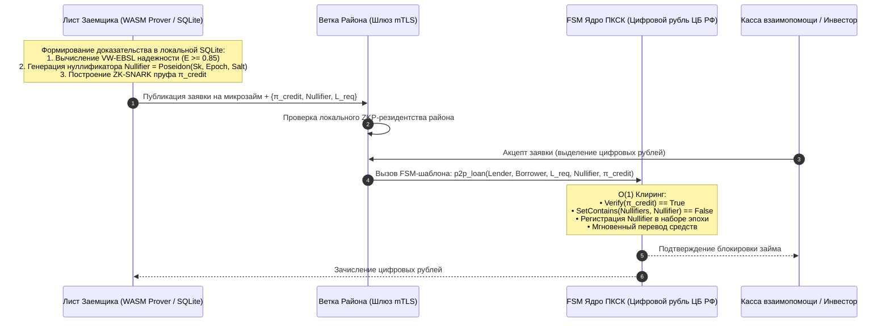

### 4.1. Формальное определение схемы ZK-Credit
Схема доказательства с нулевым разглашением $\mathcal{C}_{\text{credit}}$ строится на базе протокола **Groth16 / Plonky2** с использованием дружественной к ZK хеш-функции **Poseidon**:

$$\pi_{\text{credit}} = \text{ZK-Prove}\big(\mathcal{C}_{\text{credit}}, \; \vec{x}_{\text{public}}, \; \vec{w}_{\text{private}}\big)$$

#### Публичные входы ($\vec{x}_{\text{public}}$):
1. $\text{Rep}_{\text{threshold}} \in [0, 10000]$ — минимально требуемый нормализованный балл (например, 8500 б.п. = 0.85);
2. $\text{Default}_{\text{max}} = 0$ — допустимое число дефолтов за контрольный интервал времени $\Delta t$;
3. $\text{EpochId}$ — текущая эпоха взаиморасчетов (например, идентификатор месяца);
4. $\text{AmountRequested}$ — запрашиваемая сумма займа;
5. $\text{Nullifier}$ — криптографический нуллификатор займа;
6. $\text{BranchRoot}$ — корень дерева Меркла верифицированных резидентов районной Ветки.

#### Приватные входы свидетеля ($\vec{w}_{\text{private}}$):
1. $\text{SecretKey}$ — закрытый ключ пользователя в AIRport;
2. $\vec{\mathcal{E}}_{\text{history}} = \{(r_i, s_i, V_i, t_i, \text{sig}_i)\}$ — массив криптографически подписанных записей об исполненных сделках и подтвержденном Опыте из локальной SQLite;
3. $\text{MerklePath}_{\text{resident}}$ — путь доказательства резидентства в дереве Ветки;
4. $\text{Salt}$ — случайная маскирующая соль сессии.

### 4.2. Система нуллификаторов против одновременных займов (Anti-Sybil Loan Race)
* **Угроза:** Заемщик с высоким рейтингом генерирует 10 одинаковых ZK-доказательств и одновременно запрашивает 10 займов по 100 000 цифровых рублей в разных кассах взаимопомощи, пока информация о дефолте не попала в сеть.
* **Математическое решение:**
  $$\text{Nullifier} = \text{Poseidon}\big(\text{SecretKey}, \; \text{EpochId}, \; \text{LoanSlotId}\big)$$
  - Параметр $\text{LoanSlotId} \in \{1, \dots, K_{\text{max}}\}$ определяет допустимое количество параллельных кредитных линий, разрешенных заемщику его кредитным потолком $L_{\text{max}}$.
  - При попытке взять второй заем в том же кредитном слоте в пределах одной эпохи ядро FSM ЦБ РФ фиксирует коллизию нуллификатора за время $O(1)$:
    $$\text{if } \text{NullifierSet}[\text{EpochId}].\text{contains}(\text{Nullifier}) \implies \mathbf{REVERT}$$
  - Это делает математически невозможным мульти-заимствование без раскрытия личности заемщика.

### 4.3. Государственные и ведомственные Ветки как институциональные гаранты беспристрастности (State-Anchored Zero-PII Attestation)

В архитектуре платформы «Турбаза» **Государство выступает полноправным и доверенным участником экосистемы**. Территориальные (географические) и ведомственные Ветки задействуются не столько как серверные вычислительные мощности, сколько как **независимые институциональные гаранты объективности и беспристрастности**, законно обладающие эталонной юридически значимой информацией о гражданах, организациях и объектах права.

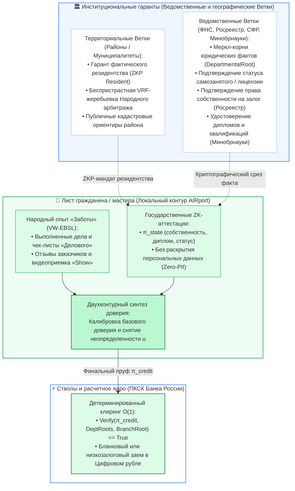

1. **Суверенные государственные ZK-аттестации (State-Anchored ZK-Attestations):**
   - Государственные ведомственные Ветки не раскрывают сырые базы данных и не создают централизованных реестров слежки (полное соблюдение 152-ФЗ и налоговой тайны ст. 102 НК РФ).
   - Ведомственная Ветка периодически подписывает закрытым ключом ведомства корневой хеш Меркла реестра достоверных фактов:
     $$\text{DeptRoot} = \text{MerkleRoot}\big(\{\text{Hash}(\text{UserSecretHash}, \text{AttributeId}, \text{Timestamp})\}\big)$$
   - Гражданин на своем Листе формирует компактное доказательство с нулевым разглашением $\pi_{\text{state}}$, удостоверяющее, что атрибут входит в официальный ведомственный срез:
     - *«Гражданин имеет статус самозанятого или ИП без задолженностей»* (ФНС);
     - *«Гражданин является собственником жилья в данном муниципалитете»* (Росреестр) — для снижения залоговых требований до 0%;
     - *«Гражданин обладает подтвержденным медицинским или строительным образованием»* (Минобрнауки / Рособрнадзор) — объективное подтверждение базовой предметной компетентности $E_{\text{comp}}$.
2. **Калибровка эпистемической неопределенности при «холодном старте»:**
   - В классической субъективной логике новый участник начинает с максимальной неопределенностью $u = 1.0$ ($b = 0, d = 0$).
   - Наличие государственной ZK-аттестации (например, 10 лет официального непрерывного трудового стажа по данным СФР или отсутствие банкротств по реестру Федресурс) позволяет локальному движку мгновенно откалибровать априорный вес:
     $$u_{\text{init}} = \frac{W}{W + \gamma_{\text{state}} \cdot r_{\text{state}}}$$
     где $\gamma_{\text{state}} = 3.0$ — институциональный вес государственного поручительства. Неопределенность $u$ снижается с $1.0$ до $0.35–0.40$ еще до совершения первой P2P-сделки, открывая доступ к доверию сообщества без бумажной волокиты.
3. **Беспристрастный институциональный арбитраж:**
   - В спорах Народного арбитража (Sortition Jury) территориальные и ведомственные Ветки выступают независимыми поставщиками эталонных стандартов:
     - Кадастровые границы участков и градостроительные регламенты (Росреестр / Муниципалитет);
     - Нормативы СНиП, ГОСТ и технические регламенты качества работ (Минстрой / Росстандарт).
   - Присяжные получают юридически заверенные эталоны без бюрократических запросов и судебных экспертиз, что обеспечивает высочайшую объективность вердиктов.
4. **Защита от картельных сговоров и сфабрикованных рейтингов:**
   - Даже при попытке группы недобросовестных лиц создать замкнутый картель взаимных похвал («кольцо накрутки»), требование институционального ZK-подтверждения статуса (например, реального владения производственными мощностями или официальной регистрации бизнеса) блокирует получение крупных финансовых лимитов.

---

## 5. Теоретико-игровая безопасность и модель угроз

| Тип атаки | Механика угрозы | Архитектурная защита в «Заботе» |
| :--- | :--- | :--- |
| **Whitewashing (Exit-Scam)** | Накопление высокого рейтинга на копеечных делах с последующим невозвратом крупного займа | **Логарифмическая функция объема $\phi(V)$:** $1000$ дел по $10$ руб. дают кредитный лимит не более $15\,000$ руб. Лимит на миллион требует многолетней истории крупных контрактов. |
| **Wash Trading (Кольца накрутки)** | Группа сообщников ставит друг другу фиктивные положительные оценки Опыта | **Штраф за кластеризацию (Clustering Penalty):** алгоритм выявляет замкнутые треугольники в графе доверия и применяет дефлятор $D = \frac{1}{1 + \gamma \cdot C_G}$. |
| **Retaliatory Downvoting (Шантаж)** | Заказчик угрожает исполнителю негативным отзывом, требуя бесплатных доработок | **Протокол слепого раскрытия (Dual-Blind Reveal):** отзывы открываются одновременно только после публикации оценок обеими сторонами. При споре спор передается в Народный арбитраж. |
| **Sybil Attack (Накрутка ботами)** | Создание сотен виртуальных аккаунтов для манипуляции Шкалой Экспертов | **Криптографический ценз локальности (ZKP Resident):** аккаунт требует подтверждения реального резидентства через соседей (жеребьевка Уровня 2 на Ветке). |

### 5.1. Алгоритм дефляции картелей доверия (Clustering Coefficient Penalty)
Для каждого репутационного свидетельства от участника $B$ в адрес $A$ локальный движок вычисляет коэффициент локальной кластеризации подграфа взаимных связей:
$$C(A, B) = \frac{2 \cdot |\Delta(A, B)|}{k_A \cdot k_B}$$
где $|\Delta(A, B)|$ — число общих контрагентов первого круга, а $k_A, k_B$ — степени вершин.
Если участники взаимодействуют преимущественно внутри замкнутой изолированной клики ($C(A, B) > 0.6$), вес взаимных свидетельств дисконтируется:
$$w_{\text{effective}} = w_0 \cdot \exp\big(-\beta \cdot (C(A, B) - C_{\text{threshold}})\big)$$
Накручивать репутацию внутри закрытой группы становится экономически бесполезно.

---

## 6. Децентрализованный народный арбитраж (P2P Sortition Jury)

При возникновении неустранимого конфликта между заказчиком и исполнителем (или займодавцем и заемщиком) смарт-контракт переходит в состояние `DISPUTED`.

Вместо обращения в перегруженные государственные суды или закрытые коммерческие третейские инстанции «Забота» активирует **Децентрализованный суд присяжных на жеребьевке (P2P Sortition Jury)**:

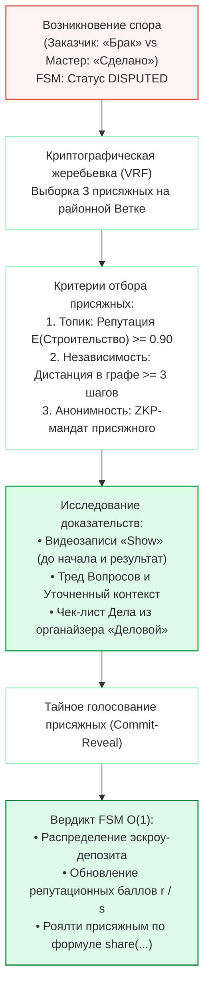

### 6.1. Криптографический отбор присяжных (Sortition)
1. **Случайный выбор через VRF:** Районная Ветка генерирует псевдослучайное зерно на базе хеша последнего запечатанного блока эпохи (`EpochBlock`).
2. **Фильтры отбора:**
   - Высокая предметная репутация в топике спора: $E(\omega(T_{\text{dispute}})) \ge 0.88$;
   - Строгая независимость: отсутствие транзакций и родственных связей с обеими сторонами спора (дистанция в графе связей $d(J_k, \text{Parties}) \ge 3$);
   - Подтвержденное резидентство в том же муниципальном образовании.
3. **Мандат присяжного с нулевым разглашением:** Присяжный получает право голоса через временный ZK-токен, исключающий давление или подкуп со стороны участников тяжбы.

### 6.2. Исследование доказательств на базе мультимодального Опыта («Show»)
- Исполнитель и заказчик обязаны прикрепить видеофиксацию («Show») объекта спора:
  - Короткое видео исходного состояния до начала работ;
  - Видеофиксация финального результата с голосовыми комментариями («Speak»).
- Присяжные просматривают зашифрованные медиафайлы непосредственно на своих Листьях без посредников.

### 6.3. Экономика и стимулы присяжных (FSM Slashing & Share)
- Сторона, инициирующая арбитраж, вносит минимальный залоговый сбор ($500–1000 \text{ цифровых рублей}$).
- При вынесении вердикта:
  - Правая сторона получает возврат залога;
  - С виновной стороны удерживается сумма ущерба и штраф;
  - **Вознаграждение присяжных**: сумма залогового сбора распределяется между присяжными по детерминированной формуле `share(...)` за выполнение гражданского долга;
  - Если решение присяжного единогласно подтверждено другими экспертами, его личный арбитражный репутационный балл возрастает ($r_{\text{jury}} = r_{\text{jury}} + 1$).

---

## 7. Оракулы физического мира: Протокол сдачи-приемки работ (Proof-of-Craft / TAPO)

Одной из фундаментальных проблем смарт-контрактов является «Проблема оракула» (Oracle Problem): как децентрализованный контракт в цифровой среде может объективно удостовериться в том, что сантехник качественно устранил засор, репетитор провел занятие, а строитель смонтировал кровлю, без привлечения дорогостоящих централизованных инспекторов?

В приложении «Забота» и платформе «Турбаза» эта задача решается через **Протокол тройного физического подтверждения (Triple-Attestation Physical Oracle, TAPO)**:

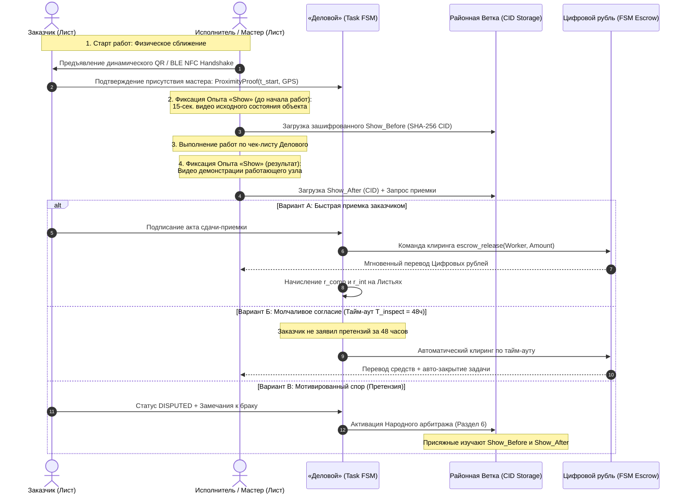

1. **Ближнепольное криптографическое рукопожатие (Proximity Handshake / BLE NFC / QR):**
   - В момент прибытия мастера на объект устройства сторон обмениваются одноразовыми эфемерными ключами через Bluetooth Low Energy или сканирование динамического QR-кода.
   - Фиксируется криптографический факт физического присутствия исполнителя в локации заказчика с временной меткой $t_{\text{start}}$ и гео-привязкой к районной Ветке.
2. **Мультимодальная фиксация Опыта («Show» / «Speak»):**
   - До начала работ: исполнитель делает короткую видеозапись объекта («Show» до начала: состояние труб, стен или неисправного прибора).
   - По завершении работ: исполнитель записывает видео результата с демонстрацией работоспособности («Show» после).
   - Хэш медиа-файла $\text{CID} = \text{SHA-256}(\text{video})$ запечатывается в транзакцию сдачи задачи в органайзере «Деловой» (`TaskCompletion`).
3. **Двусторонний акт сдачи-приемки и арбитражный тайм-аут ($T_{\text{inspect}}$):**
   - Заказчик осматривает работу и подписывает акт приемки со своего Листа. Смарт-контракт мгновенно разблокирует эскроу в Цифровом рубле ($O(1)$) и начисляет репутационные свидетельства $r$.
   - Если заказчик не подписал акт, но не заявил мотивированных претензий в течение $T_{\text{inspect}} = 48 \text{ ч.}$, контракт закрывается автоматически в пользу исполнителя.
   - Если заказчик мотивированно заявляет о браке, контракт переходит в статус `DISPUTED` и передается трем присяжным Народного арбитража (Раздел 6), которые изучают видеозаписи «Show» и выносят окончательный вердикт.

---

## 8. Сквозной жизненный цикл защищенной сделки и взаимного кредита

```
[1. Случай в Заботе] ──> [2. Дело в Деловом] ──> [3. ZK-Attestation] ──> [4. FSM Escrow в ЦР]
         │                       │                      │                     │
         ▼                       ▼                      ▼                     ▼
Формулировка задачи     Чек-лист исполнения    Генерация π_credit     Блокировка средств
и требований            и дедлайны             на Листе в WASM        без банков-посредников
                                                                              │
[8. Капитализация]  <──  [7. Клиринг ЦР]  <──  [6. Приемка «Show»] <── [5. Выполнение]
         │                       │                      │                     │
         ▼                       ▼                      ▼                     ▼
Рост репутации r        Мгновенный перевод     Видеофиксация          Закрытие задачи
и кредитного лимита     в Цифровом рубле       (или P2P-Арбитраж)     в календаре
```

---

## 9. Банковский регуляторный мост: Интеграция с Положением Банка России № 590-П / 611-П

Коммерческие банки (Сбер, ВТБ, Т-Банк) обязаны строго соблюдать нормативы Банка России по формированию резервов на возможные потери по ссудам (Положение ЦБ РФ № 590-П и № 611-П).
Традиционно для присвоения категории качества ссуды банк требует кипу бумажных справок (2-НДФЛ, выписки по счетам, залоговые документы), подвергаясь риску утечек персональных данных и неся колоссальные операционные затраты.

В архитектуре «Турбазы» банк получает **ZK-Regulatory Attestation ($\pi_{\text{reg590}}$)**, генерируемый непосредственно на клиентском Листе:

```mermaid
graph LR
    subgraph ClientLeaf ["Лист гражданина / МСП"]
        AIRport["Реляционное ядро AIRport:<br/>• История 24 мес. WAL-дельт<br/>• Завершенные B2B/P2P сделки<br/>• Отсутствие дефолтов и арбитражей"]
        ZKGen["ZK-Prover (Groth16):<br/>Формирование π_reg590"]
        AIRport --> ZKGen
    end

    subgraph BankBranch ["Контур Коммерческого Банка"]
        BankCore["АБС Банка:<br/>Проверка Verify(π_reg590)"]
        Reserves["Оценка кредитного риска:<br/>• Категория качества I (РВПС = 0%)<br/>• Снижение резервов на 30–50%<br/>• Выдача ипотеки / овердрафта"]
        BankCore --> Reserves
    end

    ZKGen -->|π_reg590 (Zero-PII)| BankCore

    style ClientLeaf fill:#f0fdf4,stroke:#16a34a,stroke-width:1.5px
    style BankBranch fill:#ffffff,stroke:#86efac,stroke-width:1.5px
    style AIRport fill:#dcfce7,stroke:#16a34a,stroke-width:1px
    style Reserves fill:#dcfce7,stroke:#15803d,stroke-width:1.5px
```

1. **Классификация ссуд по категориям качества (Положение 590-П):**
   - **I категория качества (стандартные ссуды, расчетный резерв 0%):** ZK-доказательство подтверждает, что заемщик имеет надежность $E(\omega_{\text{credit}}) \ge 0.90$, нулевую историю просрочек за последние 24 месяца и подтвержденный кредитный потолок $L_{\text{max}} \ge \text{LoanRequested}$.
   - **II категория качества (нестандартные ссуды, умеренный кредитный риск, резерв 1–20%):** Рейтинг $E \in [0.75, 0.89]$, отсутствие текущих просрочек, динамическая утилизация долга $U_{\text{credit}} \le 50\%$.
   - **III–V категории качества (сомнительные и безнадежные ссуды):** Фиксируются при системных дефолтах или наличии незакрытых арбитражных вердиктов.
2. **Нулевое хранение персональных данных в банке (152-ФЗ Zero-PII):**
   - Банк не хранит сырые персональные выписки граждан, защищая себя от регуляторных штрафов и утечек данных.
   - При проверке инспекторами Банка России кредитная организация предъявляет проверяемое криптографическое доказательство $\pi_{\text{reg590}}$ с цифровой подписью районной Ветки, доказывающее правомерность отнесения ссуды к I категории качества и освобождения банковского капитала от избыточных резервов.

---

## 10. Инженерные инварианты репутационной системы

1. **Инвариант «Self-Custody Zero-PII»:** Личные журналы транзакций, выписки по счетам и история взаимопомощи **никогда не покидают клиентский Лист**. Внешний мир видит исключительно булевы результаты ZK-доказательств.
2. **Инвариант «Nullifier Uniqueness»:** Ни один заемщик не может получить более одной кредитной транзакции на один кредитный слот в рамках одной эпохи.
3. **Инвариант «Volume Bounding»:** Доверие в бытовой взаимопомощи математически отделено от финансовых лимитов логарифмической функцией $\phi(V)$. Кредитный потолок зарабатывается подтвержденным исполнением эквивалентных объемов.
4. **Инвариант «Half-Life Decay»:** Прошлые ошибки стираются со временем при условии добросовестного поведения, исключая появление кастового общества с неизменяемыми клеймами.
5. **Инвариант «Social Recovery Integrity»:** Восстановление репутационного профиля возможно строго через пороговую схему $k$-of-$N$ (по умолчанию 3 из 5) доверенных попечителей с обязательным временным замком (Timelock Delay 48 часов) для предотвращения рейдерского захвата аккаунта.
6. **Инвариант «Apprenticeship Bounding»:** Ученик в институте подмастерья не может получить больше 50% репутационного веса наставника за одну совместную задачу, а ответственность за итоговое качество несет наставник.
7. **Инвариант «Two-Component Orthogonality»:** Предметная компетентность ($E_{\text{comp}}$) строго изолирована внутри своего домена и никогда не проецируется на разнородные сферы; переносу подлежит только общая добросовестность ($E_{\text{int}}$) с установленным демпфированием $\kappa \in [0.2, 0.5]$.
8. **Инвариант «TAPO Physical Verification»:** Физическое исполнение работ считается подтвержденным исключительно при наличии двустороннего акта либо истечении таймаута $T_{\text{inspect}} = 48 \text{ ч.}$ при отсутствии мотивированных замечаний с приложением медиадоказательств «Show».

---

## 11. Протокол социального восстановления репутации и ключей (Social Key Recovery)

В децентрализованной среде без централизованного оператора персональных данных (Zero-PII) утеря смартфона или повреждение диска не должны приводить к утрате накопленной годами репутации и кредитного рейтинга.

В платформе «Турбаза» реализуется **Протокол социального восстановления ключей (Social Key Recovery)** на базе пороговой схемы разделения секрета Шамира (Shamir's Secret Sharing, SSS) поверх локальной Сети Доверия «Заботы».

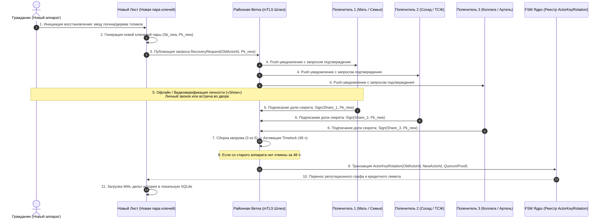

### 11.1. Выбор и верификация попечителей (Guardians)
- При настройке профиля пользователь назначает $N = 5$ попечителей из своего первого круга доверия в «Заботе»:
  - 2 члена семьи (закрытый контур P2P E2EE);
  - 2 проверенных соседа по дому / району с репутацией $E \ge 0.85$;
  - 1 профессиональный коллега / партнер по артели.
- Доли закрытого ключа восстановления $\text{Share}_1, \dots, \text{Share}_5$ шифруются открытыми ключами выбранных попечителей и передаются им в виде запечатанных сообщений в контуре AIRport. Ни один попечитель по отдельности не имеет доступа к ключу пользователя.

### 11.2. Пороговый кворум и защита от захвата (Timelock Delay)
1. **Кворум 3 из 5:** Для восстановления требуется согласие любых 3 попечителей из 5.
2. **Аварийный временной замок (48-Hour Timelock):**
   - В момент сбора 3 подписей шлюз районной Ветки переводит процедуру в режим ожидания на 48 часов.
   - На все ранее авторизованные устройства пользователя отправляются экстренные push-уведомления со звуковой сиреной: *«Инициирована процедура переноса аккаунта. Если это не вы, нажмите кнопку ОТМЕНА»*.
   - Нажатие кнопки отмены со старого активного устройства мгновенно аннулирует процедуру ротации и помечает инцидент как попытку компрометации.
3. **Бесконфликтный перенос данных:**
   - После истечения 48 часов ядро FSM фиксирует ротацию ключа: `ActorKeyRotation(OldActorId -> NewActorId)`.
   - Новый аппарат загружает с Ветки зашифрованные WAL-дельты репутационного графа и реконструирует локальную базу SQLite без участия централизованных удостоверяющих центров.

---

## 12. Институт гражданского служения и восстановительной реабилитации (Civic Contribution & Restorative Rehabilitation)

Эволюционная устойчивость репутационной системы обеспечивается гармоничным балансом между экономической строгостью и механизмами социальной солидарности. Опираясь на мировой опыт общественной взаимопомощи (волонтерские и донорские институты, программы восстановительного правосудия, признание вклада в благоустройство районов), «Забота» внедряет институты **Гражданского служения ($S_{\text{civic}}$)** и **Восстановительной реабилитации (Restorative Justice)**.

### 12.1. Математическая модель индекса гражданского служения ($S_{\text{civic}}$)

Общественно-полезный труд, безвозмездная помощь маломобильным соседям, участие в экологических инициативах и донорство формируют подтвержденный нематериальный социальный капитал:

$$S_{\text{civic}} = \tanh\left(\frac{\sum_{k \in \mathcal{E}_{\text{civic}}} w_k \cdot \text{Hours}_k \cdot e^{-\lambda_{\text{soc}} (t - t_k)}}{H_0}\right) \in [0, 1.0)$$

где:
- $\mathcal{E}_{\text{civic}}$ — множество подтвержденных событий общественно-полезной активности;
- $\text{Hours}_k$ — фактически затраченное и подтвержденное время (в астрономических часах);
- $w_k \in [1.0, 3.0]$ — весовой коэффициент социальной значимости дела:
  - Бытовая помощь соседям, решение локальных вопросов двора: $w_k = 1.0$;
  - Регулярный уход за пожилыми и маломобильными гражданами, волонтерство в детских учреждениях: $w_k = 2.0$;
  - Ликвидация последствий стихийных бедствий, аварийно-спасательные работы, безвозмездное донорство крови: $w_k = 3.0$;
- $H_0 = 100 \text{ часов}$ — базовый квант масштабирования (при накоплении 100 взвешенных часов $S_{\text{civic}} = \tanh(1) \approx 0.76$);
- $\lambda_{\text{soc}} = \frac{\ln 2}{T_{1/2}}$ ($T_{1/2} = 12 \text{ месяцев}$) — полураспад социального капитала, стимулирующий постоянное живое участие в жизни сообщества.

**Принципы функционирования $S_{\text{civic}}$:**
1. **Строго позитивная стимуляция (Positive-Sum):** Отсутствие гражданской активности не влечет за собой никаких штрафов или дискриминации ($S_{\text{civic}} = 0$). Индекс служит исключительно повышающим мультипликатором.
2. **Экономическая капитализация добрых дел:**
   - Повышение финансового кредитного лимита до $+25\%$ ($1 + \eta_{\text{soc}} \cdot S_{\text{civic}}$) в Цифровом рубле;
   - Приоритетное право на бездепозитное использование муниципального оборудования в «Реестре МСП и ЖКХ»;
   - Льготная ставка платформенных отчислений по формуле `share(...)`;
   - Повышенный вес голоса в вопросах благоустройства двора и района в «КубГолосе».

### 12.2. Протокол восстановительного заглаживания (Restorative Justice & Reputation Rehabilitation)

В традиционных кредитных бюро негативная запись сохраняется от 7 до 10 лет вне зависимости от жизненных обстоятельств заемщика. Это порождает глубокую социальную проблему кредитной стигматизации («Credit Exclusion»): добросовестный гражданин, допустивший дефолт из-за внезапной болезни, потери кормильца или кризиса на предприятии, оказывается на долгие годы отрезан от цивилизованных финансовых инструментов.

В платформе «Турбаза» реализован алгоритмический протокол **восстановительного заглаживания вреда**:

$$s_{\text{effective}} = s_0 \cdot \exp\left(-\frac{\gamma_{\text{rehab}} \cdot \sum_{m} \text{Hours}_{\text{rehab}, m}}{H_{\text{debt}}}\right)$$

где:
- $s_0$ — первоначальная величина отрицательного свидетельства дефолта или срыва обязательства;
- $\gamma_{\text{rehab}} = 2.0$ — коэффициент интенсивности восстановительной реабилитации;
- $H_{\text{debt}} = \max\left(20, \; \frac{V_{\text{default}}}{2000 \text{ руб.}}\right)$ — нормативный объем часов восстановительных работ, прямо пропорциональный сумме задолженности;
- $\text{Hours}_{\text{rehab}, m}$ — подтвержденные часы общественно-полезного труда, выполненные гражданином в приложении «Забота».

**Механика реабилитации:**
1. Гражданин, допустивший просрочку или дефолт, открывает в «Заботе» статус реабилитации и берет на себя выполнение общественно-полезных задач района (ремонт детской площадки, уход за сквером, помощь социальным службам).
2. Выполнение каждого часа работ подтверждается свидетелями или TAPO-фиксацией («Show») и снижает вес отрицательного свидетельства $s_{\text{effective}}$ по экспоненциальному закону.
3. При выполнении полного объема нормативных часов $H_{\text{debt}}$ отрицательное свидетельство затухает на $\approx 86\%$, что возвращает добросовестного участника в зеленую зону надежности ($E \ge 0.70$) и разблокирует доступ к постепенному восстановлению кредитных линий.

### 12.3. Интеграция с судебной системой и территориальными Ветками (Защита от недобросовестности)

Платформа строго дифференцирует **добросовестный форс-мажор** (где гражданин стремится урегулировать последствия через реструктуризацию или восстановительный труд) и **умышленное злостное уклонение от исполнения обязательств**:

```mermaid
graph TD
    JudicialBranch["🏛️ Судебные и ведомственные Ветки (ФССП / Суды)"] -->|Публикация Merkle Root исполнительных производств| BranchGate["Шлюз районной Ветки"]
    BranchGate -->|Сверка в O(1) через ZKP| LeafCheck["Лист участника (AIRport SQLite)"]
    
    LeafCheck --> StatusDecision{"Статус обязательства"}
    
    StatusDecision -->|Форс-мажор / Готовность к диалогу| RestorativePath["🌿 Восстановительный протокол:<br/>• Реструктуризация в FSM Цифрового рубля<br/>• Заглаживание через общественный труд (Hours_rehab)<br/>• Экспоненциальное погашение s_effective"]
    
    StatusDecision -->|Злостное уклонение / Судебный акт| RestrictivePath["⚖️ Градуированные системные ограничения:<br/>• Обнуление бланкового лимита L_max = 0<br/>• Отключение бездепозитного шеринга (DepositRatio = 100%)<br/>• Заморозка параллельных кредитных слотов<br/>• Криптографическое уведомление в контуре Ветки"]
    
    RestorativePath --> FullyRestored["✅ Полное восстановление репутации и доверия"]
    RestrictivePath -->|Исполнение судебного решения / Мировое соглашение| RestorativePath

    style JudicialBranch fill:#eff6ff,stroke:#3b82f6,stroke-width:1.5px
    style BranchGate fill:#ffffff,stroke:#86efac,stroke-width:1px
    style RestorativePath fill:#f0fdf4,stroke:#16a34a,stroke-width:1.5px
    style RestrictivePath fill:#fef2f2,stroke:#ef4444,stroke-width:1.5px
    style FullyRestored fill:#dcfce7,stroke:#15803d,stroke-width:2px
```

1. **Судебные Ветки как институциональные валидаторы:**
   - Ведомственные шлюзы судов и службы судебных приставов публикуют криптографические корни вступивших в законную силу решений (`JudicialMerkleRoot`).
   - Наличие открытого исполнительного производства по факту злостного неисполнения обязательств подтверждается компактным ZK-доказательством без раскрытия деталей спора.
2. **Ступенчатая система ограничений:**
   - При подтверждении злостного уклонения FSM-смарт-контракты Цифрового рубля блокируют открытие новых беззалоговых лимитов;
   - Обнуляются права на «Депозит-фри» шеринг инвентаря в «Заботе», «Реестре МСП и ЖКХ» и «УраТуре»;
   - Территориальная Ветка фиксирует статус ограничения в локальном реестре участников.
3. **Приоритет мирового урегулирования и созидания:**
   - Любое ограничение носит обратимый характер.
   - Заключение мирового соглашения с кредитором через смарт-контрактный FSM-эскроу или полное возмещение ущерба немедленно деактивирует все ограничения и открывает гражданину путь к участию в восстановительном протоколе.

---

## 13. DDL-спецификация схемы данных репутационного слоя (`@sapoto/reputation`)

Схема репутационного слоя разрабатывается в стандарте реляционного ядра **AIRport** и исполняется непосредственно в локальной СУБД SQLite на клиентских Листьях и шлюзах Веток.

```typescript
import {
    AirEntity,
    Entity,
    Table,
    Column,
    ManyToOne,
    OneToMany,
    Id,
    Transient
} from '@airport/air-traffic-control';
import { Topic, Situation } from '@votecube/votecube';
import { Case, Reply } from '@sapoto/main';
import { Goal, Task } from '@gogetter/main';

/**
 * Атомарное репутационное событие (свидетельство исхода)
 * Неизменяемая запись в контентно-адресуемом журнале (WAL Append-Only)
 */
@Entity()
@Table({ name: 'SAPOTO_REPUTATION_EVENT' })
export class ReputationEvent extends AirEntity {
    @ManyToOne({ target: 'Topic' })
    topic: Topic;                        // Предметный топик компетенции

    @Column({ name: 'IS_POSITIVE', nullable: false })
    isPositive: boolean;                 // true = успех (r), false = срыв (s)

    @Column({ name: 'VOLUME_RUB', type: 'DECIMAL', precision: 18, scale: 2 })
    volumeRub: number;                   // Финансовый объем сделки в ЦР (V)

    @Column({ name: 'WEIGHT_COEFF', type: 'FLOAT', nullable: false })
    weightCoeff: number;                 // Контекстный вес (w_i: 1.0 - 5.0)

    @Column({ name: 'QUALITY_SCORE', type: 'FLOAT' })
    qualityScore: number;                // Оценка качества ремесла (E_comp: 0.5 - 1.0)

    @Column({ name: 'INTEGRITY_SCORE', type: 'FLOAT' })
    integrityScore: number;              // Оценка добросовестности (E_int: 0.0 - 1.0, соблюдение сроков)

    @Column({ name: 'SEVERITY_COEFF', type: 'FLOAT' })
    severityCoeff: number;               // Тяжесть дефолта (mu_j: 1.0 - 10.0)

    @Column({ name: 'IS_CIVIC_CONTRIBUTION', type: 'BOOLEAN', default: false })
    isCivicContribution: boolean;        // true = общественно-полезный труд (S_civic / Rehab)

    @Column({ name: 'CIVIC_HOURS', type: 'FLOAT' })
    civicHours?: number;                 // Отработанные часы в рамках события

    @ManyToOne({ target: 'Case' })
    case?: Case;                         // Ссылка на жизненный Случай

    @ManyToOne({ target: 'Task' })
    task?: Task;                         // Ссылка на Задачу в «Деловом»

    @Column({ name: 'TAPO_PROOF_HASH', type: 'VARCHAR', length: 66 })
    tapoProofHash?: string;              // Хеш TAPO акта сдачи-приемки (Proof-of-Craft)

    @Column({ name: 'FSM_TX_HASH', type: 'VARCHAR', length: 66 })
    fsmTxHash?: string;                  // Хеш транзакции в Цифровом рубле

    @Column({ name: 'EVENT_TIMESTAMP', nullable: false })
    eventTimestamp: Date;                // Время события для полураспада
}

/**
 * Пиринговое поручительство / Заверение доверия (Trust Attestation)
 */
@Entity()
@Table({ name: 'SAPOTO_TRUST_ATTESTATION' })
export class TrustAttestation extends AirEntity {
    @ManyToOne({ target: 'Topic' })
    topic: Topic;                        // Топик поручительства

    @Column({ name: 'BELIEF', type: 'FLOAT', nullable: false })
    belief: number;                      // b: уверенность в добросовестности

    @Column({ name: 'DISBELIEF', type: 'FLOAT', nullable: false })
    disbelief: number;                   // d: сомнение

    @Column({ name: 'UNCERTAINTY', type: 'FLOAT', nullable: false })
    uncertainty: number;                 // u: эпистемическая неопределенность

    @Column({ name: 'BASE_RATE', type: 'FLOAT', default: 0.5 })
    baseRate: number;                    // a: базовая априорная вероятность

    @Column({ name: 'STAKE_AMOUNT_RUB', type: 'DECIMAL', precision: 18, scale: 2 })
    stakeAmountRub?: number;             // Заблокированный лимит поручителя

    @Column({ name: 'EXPIRY_DATE', nullable: false })
    expiryDate: Date;                    // Срок действия поручительства
}

/**
 * Кредитный профиль пользователя (материализованный срез на Листе)
 */
@Entity()
@Table({ name: 'SAPOTO_CREDIT_PROFILE' })
export class CreditProfile extends AirEntity {
    @Column({ name: 'MAX_CREDIT_LIMIT_RUB', type: 'DECIMAL', precision: 18, scale: 2 })
    maxCreditLimitRub: number;           // Динамический потолок L_max

    @Column({ name: 'ACTIVE_DEBT_RUB', type: 'DECIMAL', precision: 18, scale: 2 })
    activeDebtRub: number;               // Текущая задолженность

    @Column({ name: 'TOTAL_REPAID_VOLUME_RUB', type: 'DECIMAL', precision: 18, scale: 2 })
    totalRepaidVolumeRub: number;        // Исторический объем закрытых сделок

    @Column({ name: 'DEFAULTS_COUNT', type: 'INTEGER', default: 0 })
    defaultsCount: number;               // Число дефолтов (для ZKP: строго 0)

    @Column({ name: 'ACTIVE_LOAN_SLOTS', type: 'INTEGER', default: 1 })
    activeLoanSlots: number;             // Допустимое число параллельных слотов

    @Column({ name: 'INTEGRITY_TRUST_SCORE', type: 'FLOAT', default: 0.5 })
    integrityTrustScore: number;         // Интегральный балл добросовестности E_int

    @Column({ name: 'PROJECTED_CREDIT_SCORE', type: 'FLOAT', default: 0.5 })
    projectedCreditScore: number;        // Итоговый кредитный балл E(omega_credit)

    @Column({ name: 'CIVIC_SCORE', type: 'FLOAT', default: 0.0 })
    civicScore: number;                  // Индекс гражданского служения S_civic in [0, 1.0]

    @Column({ name: 'CIVIC_HOURS', type: 'FLOAT', default: 0.0 })
    civicHours: number;                  // Подтвержденные часы общественно-полезного труда

    @Column({ name: 'REHAB_HOURS', type: 'FLOAT', default: 0.0 })
    rehabHours: number;                  // Отработанные часы восстановительной реабилитации

    @Transient()
    get isCleanCredit(): boolean {
        return this.defaultsCount === 0;
    }
}

/**
 * Реестр использованных кредитных нуллификаторов эпохи
 */
@Entity()
@Table({ name: 'SAPOTO_NULLIFIER_RECORD' })
export class NullifierRecord extends AirEntity {
    @Column({ name: 'NULLIFIER_HASH', type: 'VARCHAR', length: 66, unique: true })
    nullifierHash: string;               // Poseidon(Sk, Epoch, Slot)

    @Column({ name: 'EPOCH_ID', type: 'INTEGER', nullable: false })
    epochId: number;                     // Идентификатор эпохи расчетов

    @Column({ name: 'LOAN_SLOT_ID', type: 'INTEGER', nullable: false })
    loanSlotId: number;                  // Слот кредитной линии

    @Column({ name: 'REGISTERED_AT', nullable: false })
    registeredAt: Date;
}

/**
 * Попечитель социального восстановления (Guardian)
 */
@Entity()
@Table({ name: 'SAPOTO_RECOVERY_GUARDIAN' })
export class RecoveryGuardian extends AirEntity {
    @Column({ name: 'GUARDIAN_ACTOR_ID', type: 'VARCHAR', length: 66, nullable: false })
    guardianActorId: string;             // ActorId доверенного лица

    @Column({ name: 'ENCRYPTED_SHARE_BLOB', type: 'TEXT', nullable: false })
    encryptedShareBlob: string;          // Доля секрета, шифрованная ключом попечителя

    @Column({ name: 'RELATION_TYPE', type: 'VARCHAR', length: 32 })
    relationType: 'FAMILY' | 'NEIGHBOR' | 'COLLEAGUE';

    @Column({ name: 'IS_ACTIVE', type: 'BOOLEAN', default: true })
    isActive: boolean;
}

/**
 * Цепочка транзитивного социального поручительства (Multi-Hop Transitive Vouching)
 */
@Entity()
@Table({ name: 'SAPOTO_TRANSITIVE_VOUCHING_CHAIN' })
export class TransitiveVouchingChain extends AirEntity {
    @Column({ name: 'BORROWER_ACTOR_ID', type: 'VARCHAR', length: 66, nullable: false })
    borrowerActorId: string;             // Заемщик (C)

    @Column({ name: 'INTERMEDIATE_GUARANTOR_ID', type: 'VARCHAR', length: 66, nullable: false })
    intermediateGuarantorId: string;     // Непосредственный поручитель (B)

    @Column({ name: 'UPSTREAM_GUARANTOR_ID', type: 'VARCHAR', length: 66, nullable: false })
    upstreamGuarantorId: string;         // Вышестоящий поручитель (A)

    @Column({ name: 'FIRST_LOSS_STAKE_RUB', type: 'DECIMAL', precision: 18, scale: 2, nullable: false })
    firstLossStakeRub: number;           // Первоочередной залог поручителя B (>= 60%)

    @Column({ name: 'SECOND_LOSS_STAKE_RUB', type: 'DECIMAL', precision: 18, scale: 2, nullable: false })
    secondLossStakeRub: number;          // Субсидиарный залог поручителя A

    @Column({ name: 'DISCOUNTED_BELIEF', type: 'FLOAT', nullable: false })
    discountedBelief: number;            // b_transitive = b_A_B * b_B_C

    @Column({ name: 'DISCOUNTED_UNCERTAINTY', type: 'FLOAT', nullable: false })
    discountedUncertainty: number;       // u_transitive

    @Column({ name: 'STATUS', type: 'VARCHAR', length: 32, default: 'ACTIVE' })
    status: 'ACTIVE' | 'SETTLED' | 'DEFAULTED' | 'WATERFALL_EXECUTED';

    @Column({ name: 'EXPIRES_AT', nullable: false })
    expiresAt: Date;
}

/**
 * Межрайонный беспроцентный FSM-своп сезонной ликвидности
 */
@Entity()
@Table({ name: 'SAPOTO_INTER_BRANCH_LIQUIDITY_SWAP' })
export class InterBranchLiquiditySwap extends AirEntity {
    @Column({ name: 'SOURCE_BRANCH_ID', type: 'VARCHAR', length: 66, nullable: false })
    sourceBranchId: string;              // Ветка-донор (избыточная ликвидность)

    @Column({ name: 'TARGET_BRANCH_ID', type: 'VARCHAR', length: 66, nullable: false })
    targetBranchId: string;              // Ветка-реципиент (дефицит ликвидности)

    @Column({ name: 'SWAP_AMOUNT_RUB', type: 'DECIMAL', precision: 18, scale: 2, nullable: false })
    swapAmountRub: number;               // Объем свопа в цифровых рублях ЦБ РФ

    @Column({ name: 'START_DATE', nullable: false })
    startDate: Date;                     // Дата активации свопа (напр., 1 апреля)

    @Column({ name: 'MATURITY_DATE', nullable: false })
    maturityDate: Date;                  // Плановый срок возврата (напр., 1 ноября)

    @Column({ name: 'BRANCH_QUOTA_HASH', type: 'VARCHAR', length: 66, nullable: false })
    branchQuotaHash: string;             // Хеш гарантийной квоты Ветки-реципиента

    @Column({ name: 'COMMODITY_CONTRACT_REF', type: 'VARCHAR', length: 128 })
    commodityContractRef?: string;       // Ссылка на товарный контракт (сельхозпродукция)

    @Column({ name: 'STATUS', type: 'VARCHAR', length: 32, default: 'ACTIVE' })
    status: 'ACTIVE' | 'REPAID' | 'PROLONGED_EMERGENCY';
}

/**
 * Синдицированное структурное финансирование: Старший транш банка (Senior Tranche)
 */
@Entity()
@Table({ name: 'SAPOTO_SENIOR_TRANCHE_PARTICIPATION' })
export class SeniorTrancheParticipation extends AirEntity {
    @Column({ name: 'PROJECT_FACILITY_ID', type: 'VARCHAR', length: 66, nullable: false })
    projectFacilityId: string;           // Идентификатор проекта / кассы взаимопомощи

    @Column({ name: 'BANK_ACTOR_ID', type: 'VARCHAR', length: 66, nullable: false })
    bankActorId: string;                 // ActorId коммерческого банка-инвестора

    @Column({ name: 'SENIOR_AMOUNT_RUB', type: 'DECIMAL', precision: 18, scale: 2, nullable: false })
    seniorAmountRub: number;             // Объем старшего транша банка (70-80%)

    @Column({ name: 'JUNIOR_BUFFER_RUB', type: 'DECIMAL', precision: 18, scale: 2, nullable: false })
    juniorBufferRub: number;             // Объем младшего транша первого убытка (First-Loss)

    @Column({ name: 'INTEREST_RATE_ANNUAL', type: 'FLOAT', nullable: false })
    interestRateAnnual: number;          // Фиксированная ставка (R_key + alpha_bank)

    @Column({ name: 'MATURITY_DATE', nullable: false })
    maturityDate: Date;

    @Column({ name: 'WATERFALL_STATUS', type: 'VARCHAR', length: 32, default: 'PERFORMING' })
    waterfallStatus: 'PERFORMING' | 'REPAID' | 'JUNIOR_LOSS_TRIGGERED' | 'DEFAULTED';
}

/**
 * B2B Смарт-факторинг на базе криптографического Proof-of-Delivery
 */
@Entity()
@Table({ name: 'SAPOTO_FACTORING_CONTRACT' })
export class FactoringContract extends AirEntity {
    @Column({ name: 'INVOICE_HASH', type: 'VARCHAR', length: 66, unique: true, nullable: false })
    invoiceHash: string;                 // Хеш спецификации/накладной

    @Column({ name: 'BUYER_ACTOR_ID', type: 'VARCHAR', length: 66, nullable: false })
    buyerActorId: string;                // Покупатель (дебитор)

    @Column({ name: 'SUPPLIER_ACTOR_ID', type: 'VARCHAR', length: 66, nullable: false })
    supplierActorId: string;             // Поставщик (кредитор)

    @Column({ name: 'FACTOR_BANK_ID', type: 'VARCHAR', length: 66, nullable: false })
    factorBankId: string;                // Финансирующий банк

    @Column({ name: 'INVOICE_AMOUNT_RUB', type: 'DECIMAL', precision: 18, scale: 2, nullable: false })
    invoiceAmountRub: number;            // Номинал накладной

    @Column({ name: 'ADVANCE_PAYOUT_RUB', type: 'DECIMAL', precision: 18, scale: 2, nullable: false })
    advancePayoutRub: number;            // Сумма аванса поставщику (напр., 95%)

    @Column({ name: 'PROOF_OF_DELIVERY_HASH', type: 'VARCHAR', length: 66, nullable: false })
    proofOfDeliveryHash: string;         // Хеш акта приемки ГОСТ Р 34.10 из «Заботы»

    @Column({ name: 'DUE_DATE', nullable: false })
    dueDate: Date;                       // Срок оплаты покупателем

    @Column({ name: 'STATUS', type: 'VARCHAR', length: 32, default: 'ADVANCED' })
    status: 'ADVANCED' | 'SETTLED' | 'OVERDUE';
}

/**
 * Контракт партнерского проектного соинвестирования Смарт-Мудараба (PLS)
 */
@Entity()
@Table({ name: 'MUDARABAH_CONTRACTS' })
export class MudarabahContract extends AirEntity {

    @ManyToOne({ targetEntity: 'Actor' })
    @JoinColumn({ name: 'INVESTOR_ACTOR_ID', referencedColumnName: 'ACTOR_ID', nullable: false })
    investor: Actor;                     // Инвестор (Рабб аль-мал / Поставщик капитала)

    @ManyToOne({ targetEntity: 'Actor' })
    @JoinColumn({ name: 'MANAGER_ACTOR_ID', referencedColumnName: 'ACTOR_ID', nullable: false })
    manager: Actor;                      // Предприниматель/Управляющий (Мудариб)

    @Column({ name: 'CAPITAL_AMOUNT_RUB', type: 'DECIMAL', precision: 18, scale: 2, nullable: false })
    capitalAmountRub: number;            // Сумма инвестированного капитала в Цифровом рубле

    @Column({ name: 'INVESTOR_PROFIT_SHARE', type: 'DECIMAL', precision: 5, scale: 4, nullable: false })
    investorProfitShare: number;         // Доля чистой прибыли инвестора (alpha in [0.1, 0.9])

    @Column({ name: 'MANAGER_PROFIT_SHARE', type: 'DECIMAL', precision: 5, scale: 4, nullable: false })
    managerProfitShare: number;          // Доля чистой прибыли управляющего (beta = 1 - alpha)

    @Column({ name: 'TOTAL_REVENUE_RUB', type: 'DECIMAL', precision: 18, scale: 2, default: 0 })
    totalRevenueRub: number;             // Накопленная подтвержденная выручка

    @Column({ name: 'TOTAL_EXPENSES_RUB', type: 'DECIMAL', precision: 18, scale: 2, default: 0 })
    totalExpensesRub: number;            // Подтвержденные операционные расходы (OPEX)

    @Column({ name: 'CAPITAL_RETURNED_RUB', type: 'DECIMAL', precision: 18, scale: 2, default: 0 })
    capitalReturnedRub: number;          // Возвращенный объем первоначального капитала

    @Column({ name: 'STATUS', type: 'VARCHAR', length: 32, default: 'DEPLOYED' })
    status: 'DEPLOYED' | 'OPERATING' | 'SETTLING' | 'CLOSED' | 'DEFAULTED';
}

/**
 * Партнерство Смарт-Мушарака и Убывающая Мушарака (Diminishing Musharakah)
 */
@Entity()
@Table({ name: 'MUSHARAKAH_PARTNERSHIPS' })
export class MusharakahPartnership extends AirEntity {

    @ManyToOne({ targetEntity: 'Actor' })
    @JoinColumn({ name: 'PARTNER_A_ACTOR_ID', referencedColumnName: 'ACTOR_ID', nullable: false })
    partnerA: Actor;                     // Партнер А (Инвестор / Банк)

    @ManyToOne({ targetEntity: 'Actor' })
    @JoinColumn({ name: 'PARTNER_B_ACTOR_ID', referencedColumnName: 'ACTOR_ID', nullable: false })
    partnerB: Actor;                     // Партнер Б (Предприниматель / Артель)

    @Column({ name: 'ASSET_VALUATION_RUB', type: 'DECIMAL', precision: 18, scale: 2, nullable: false })
    assetValuationRub: number;           // Базовая стоимость приобретаемого оборудования/актива

    @Column({ name: 'PARTNER_B_EQUITY_SHARE', type: 'DECIMAL', precision: 5, scale: 4, nullable: false })
    partnerBEquityShare: number;         // Текущая доля предпринимателя в активе (от 0.20 до 1.0)

    @Column({ name: 'IS_DIMINISHING', type: 'BOOLEAN', default: true })
    isDiminishing: boolean;              // Флаг убывающей Мушараки (постепенный выкуп оборудования)

    @Column({ name: 'RENTAL_RATE_BPS', type: 'INTEGER', nullable: false })
    rentalRateBps: number;               // Базисные пункты арендной платы за долю инвестора (напр., 400 = 4% годовых)

    @Column({ name: 'STATUS', type: 'VARCHAR', length: 32, default: 'ACTIVE' })
    status: 'ACTIVE' | 'BUYOUT_COMPLETE' | 'LIQUIDATED';
}

/**
 * Пул солидарного взаимного страхования и взаимопомощи Такафул (Takaful Tabarru' Pool)
 */
@Entity()
@Table({ name: 'TAKAFUL_RESERVE_POOLS' })
export class TakafulReservePool extends AirEntity {

    @Column({ name: 'BRANCH_ID', type: 'VARCHAR', length: 64, nullable: false })
    branchId: string;                    // Идентификатор территориальной или отраслевой Ветки

    @Column({ name: 'POOL_NAME', type: 'VARCHAR', length: 128, nullable: false })
    poolName: string;                    // Название фонда взаимной поддержки

    @Column({ name: 'TOTAL_RESERVE_RUB', type: 'DECIMAL', precision: 18, scale: 2, default: 0 })
    totalReserveRub: number;             // Общий объем аккумулированного резерва (Табарру')

    @Column({ name: 'CLAIMS_PAID_RUB', type: 'DECIMAL', precision: 18, scale: 2, default: 0 })
    claimsPaidRub: number;               // Выплачено возмещений по подтвержденным форс-мажорам

    @Column({ name: 'SURPLUS_DISTRIBUTED_RUB', type: 'DECIMAL', precision: 18, scale: 2, default: 0 })
    surplusDistributedRub: number;       // Распределенный излишек (возврат добросовестным участникам)

    @Column({ name: 'TARGET_SOLVENCY_RATIO', type: 'DECIMAL', precision: 5, scale: 2, default: 1.50 })
    targetSolvencyRatio: number;         // Целевой норматив достаточности резервного буфера
}
```

---

## 14. Механика «Холодного старта», онбординг и институт наставничества (Vouching & Apprenticeship)

Одной из фундаментальных проблем кредитных и репутационных систем является **проблема «Холодного старта» (Cold Start)**: новый участник начинает с показателями $u = 1.0$ (полная неопределенность), $E(\omega) = 0.5$ и кредитным лимитом $L_{\text{max}} = 0$.

«Забота» решает эту проблему без централизованных скоринговых анкет через **трехуровневую воронку органического онбординга**:

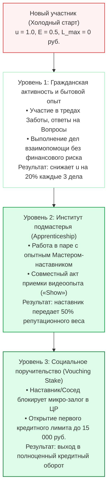

### 14.1. Уровень 1: Гражданская активность и бытовая взаимопомощь
- **Задачи с нулевым риском:** Новичок начинает с простых бытовых задач в «Заботе»: консультации соседей, участие в обсуждении ситуаций двора, ответы на уточняющие Вопросы.
- **Динамика калибровки:** Каждые 3 подтвержденных практикой ответа или бытовых дела снижают неопределенность $u$ с $1.0$ до $0.60$, калибруя базовую добросовестность без денежных операций.

### 14.2. Уровень 2: Институт подмастерья (Apprenticeship)
- **Парная работа:** Начинающий специалист (сантехник, электрик, репетитор) подключается к сложным коммерческим заказам в качестве **Подмастерья** к опытному Мастеру с репутацией $E \ge 0.90$.
- **Совместная видеоприемка («Show»):** После завершения работ Мастер и Подмастерье записывают совместное видео сдачи объекта.
- **Репутационный трансфер:**
  - Подмастерье получает $50\%$ нормативного объема репутационных свидетельств $r$;
  - Скорость набора репутации возрастает в 3 раза по сравнению с самостоятельными попытками;
  - Ответственность за гарантию качества перед заказчиком несет Мастер, что полностью защищает рынок от брака.

### 14.3. Уровень 3: Социальное поручительство (Vouching Stake)
- **Спонсорский залог доверия:** Наставник, родственник или сосед по дому может активировать для новичка стартовый кредитный лимит ($10\,000 – 15\,000 \text{ цифровых рублей}$), заблокировав соразмерную долю своего лимита через FSM-оболочку (Wrapper).
- **Экономический стимул наставника:** За успешное воспитание добросовестного участника Наставник автоматически получает пожизненное микро-роялти ($1–2\%$) от будущих отчислений платформы по формуле `share(...)` с выполненных заказов подопечного.
- **Взаимная выгода:** Новичок получает мгновенный старт в экономике доверия без обращения к дорогостоящим займам в микрофинансовых организациях с предельными процентными ставками, а наставник монетизирует свой социальный капитал.

---

## 15. Архитектурная эволюция: Перенос репутационного ядра в общесистемную платформу «Турбаза» (`@turbase/reputation-core`)

Репутационный механизм, изначально апробированный и откалиброванный в приложении «Забота», представляет собой фундамент для всей суверенной цифровой экономики. В процессе зрелости экосистемы репутационный слой переносится из прикладного уровня в **системное платформенное ядро «Турбазы»**:

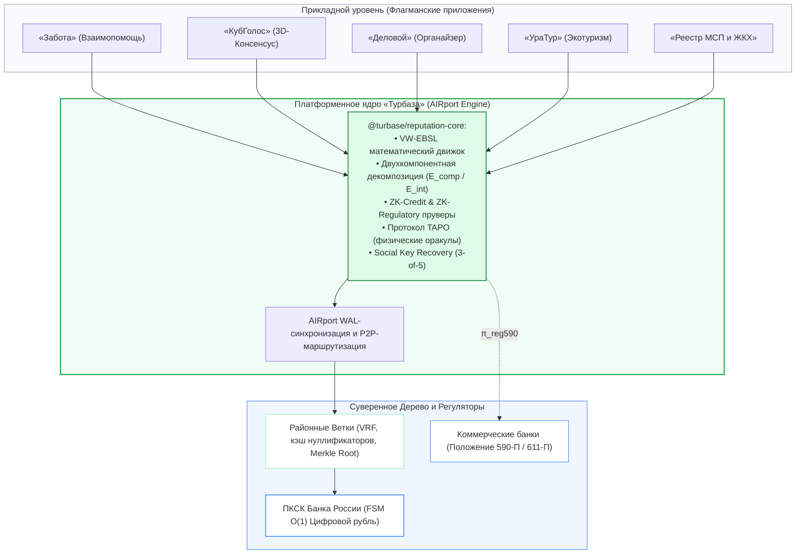

### 15.1. Универсальный системный контракт `IReputationProvider`
После интеграции в системный рантайм платформы «Турбаза» любой разработчик суверенных приложений получает доступ к единому API ядра:

```typescript
export interface IReputationProvider {
    /**
     * Расчет двухкомпонентного мнения по предметному топику на Листе
     */
    getOpinion(actorId: string, topicId: string): Promise<TwoComponentOpinion>;

    /**
     * Запрос демпфированной междоменной проекции доверия
     */
    projectTrust(actorId: string, sourceTopicId: string, targetTopicId: string): Promise<number>;

    /**
     * Расчет транзитивного мнения через цепочку поручителей (Йёсанг: A -> B -> C)
     */
    getTransitiveOpinion(sourceActorId: string, targetActorId: string, path: string[]): Promise<TwoComponentOpinion>;

    /**
     * Регистрация каскадного поручительства (Waterfall First-Loss)
     */
    registerTransitiveVouch(request: TransitiveVouchRequest): Promise<TransactionHash>;

    /**
     * Расчет индекса гражданского служения S_civic и статуса реабилитации
     */
    getCivicContribution(actorId: string): Promise<CivicContributionRecord>;

    /**
     * Построение ZK-Credit доказательства для FSM смарт-контрактов
     */
    generateZkCreditProof(request: ZkCreditRequest): Promise<ZkCreditProof>;

    /**
     * Построение регуляторного ZK-доказательства для банков (Положение 590-П)
     */
    generateZkRegulatoryProof(request: ZkReg590Request): Promise<ZkRegulatoryProof>;

    /**
     * Инициация межрайонного FSM-свопа сезонной ликвидности
     */
    initiateLiquiditySwap(request: LiquiditySwapRequest): Promise<TransactionHash>;

    /**
     * Фиксация факта сдачи-приемки работ физического оракула (TAPO)
     */
    recordTapoCompletion(event: TapoCompletionEvent): Promise<TransactionHash>;

    /**
     * Предоставление старшего институционального транша банка (Senior Tranche) для ROSCA
     */
    fundSeniorTranche(request: SeniorTrancheFundingRequest): Promise<TransactionHash>;

    /**
     * B2B смарт-факторинг накладной на базе криптографического Proof-of-Delivery
     */
    discountFactoringContract(request: FactoringDiscountRequest): Promise<TransactionHash>;

    /**
     * Открытие линии партнерского соинвестирования Смарт-Мудараба (PLS)
     */
    createMudarabahFacility(request: MudarabahFacilityRequest): Promise<TransactionHash>;

    /**
     * Периодический расчет и распределение чистой прибыли (PLS Epoch Split)
     */
    settlePlsEpochSplit(request: PlsEpochSplitRequest): Promise<TransactionHash>;
}
```

### 15.2. Сквозная кросс-прикладная синергия экосистемы
1. **«КубГолос»:** Взвешивание голосов участников по тематическому индексу компетентности $E_{\text{comp}}(T)$, исключая охлократию и засилье ботов без необходимости предъявления государственных дипломов.
2. **«Деловой»:** Задачи календаря и чек-листы автоматически фиксируют соблюдение дедлайнов, формируя подтвержденную базу общей добросовестности $E_{\text{int}}$.
3. **«УраТур»:** Формирование верифицированного реестра проводников и туристических маршрутов на основе видеофиксации «Show» и отзывов туристов без цензуры агрегаторов; беззалоговая аренда туристического инвентаря.
4. **«Локальный реестр МСП и ЖКХ»:** Открытый каталог добросовестных мастеров района, защищенный от накруток алгоритмом дефляции картелей доверия и обеспеченный безопасными сделками в Цифровом рубле; бездепозитный шеринг специализированной строительной и коммунальной техники.
5. **Банковская система:** Аккредитованные кредитные организации получают математически строгое основание для снижения резервов по Положению № 590-П / 611-П Банка России, превращая репутационный капитал граждан в реальный драйвер экономического роста страны.

---

## 16. Транзитивные сети социального поручительства (Multi-Hop Transitive Trust)

В реальных человеческих сообществах доверие редко передается только прямым контактом: начинающий мастер или предприниматель может не иметь прямого знакомства с крупным поручителем или инвестором, но обладать безупречной репутацией в глазах своего наставника или авторитетного соседа по артели.

Для математической формализации многошагового поручительства «Забота» задействует аппарат **транзитивного дисконтирования субъективной логики (Subjective Logic Transitive Trust Discounting)** в сочетании с **каскадным протоколом финансовой ответственности (First-Loss Waterfall)**.

```mermaid
graph LR
    A["Вышестоящий поручитель (A)<br/>(Мастер артели / Инвестор)"] -->|ω_B^A (Прямое доверие к B)| B["Непосредственный поручитель (B)<br/>(Бригадир / Сосед / Наставник)"]
    B -->|ω_C^B (Личное поручительство за C)| C["Заемщик / Мастер (C)<br/>(Исполнитель работ)"]

    A -.->|Транзитивная проекция: ω_C^{A:B} = ω_B^A ⊗ ω_C^B| C

    subgraph WaterfallStake ["Каскадное распределение залога (First-Loss Waterfall)"]
        direction TB
        BStake["Залог B: First-Loss (>= 60%)<br/>Первоочередное списание при дефолте"]
        AStake["Залог A: Second-Loss (<= 40%)<br/>Субсидиарная защита при дефиците"]
        BStake --> AStake
    end

    style A fill:#eff6ff,stroke:#3b82f6,stroke-width:1.5px
    style B fill:#dcfce7,stroke:#16a34a,stroke-width:1.5px
    style C fill:#ffffff,stroke:#10b981,stroke-width:2px
    style WaterfallStake fill:#f8fafc,stroke:#94a3b8,stroke-width:1px
    style BStake fill:#fef2f2,stroke:#ef4444,stroke-width:1px
    style AStake fill:#fff7ed,stroke:#f97316,stroke-width:1px
```

### 16.1. Математический аппарат транзитивного дисконтирования и слияния мнений Йёсанга

#### Оператор транзитивного дисконтирования ($\otimes$):
Если агент $A$ доверяет посреднику $B$ с вектором мнения $\omega_B^A = (b_B^A, d_B^A, u_B^A, a_B^A)$, а поручитель $B$ рекомендует заемщика $C$ с мнением $\omega_C^B = (b_C^B, d_C^B, u_C^B, a_C^B)$, результирующее транзитивное мнение агента $A$ о заемщике $C$ по пути $p = (A \to B \to C)$ вычисляется по формуле:

$$\omega_C^{A:B} = \omega_B^A \otimes \omega_C^B$$

где компоненты субъективного мнения определяются соотношениями:

$$b_C^{A:B} = b_B^A \cdot b_C^B$$

$$d_C^{A:B} = b_B^A \cdot d_C^B$$

$$u_C^{A:B} = d_B^A + u_B^A + b_B^A \cdot u_C^B$$

$$a_C^{A:B} = a_C^B$$

**Фундаментальные математические свойства оператора $\otimes$:**
1. **Сохранение нормализации:** $b_C^{A:B} + d_C^{A:B} + u_C^{A:B} = 1$.
2. **Монотонное возрастание эпистемической неопределенности:**
   $$u_C^{A:B} > u_C^B \quad \text{и} \quad u_C^{A:B} > u_B^A$$
   Каждый дополнительный шаг в цепочке поручительства закономерно увеличивает неопределенность, так как $A$ не имеет прямого опыта взаимодействия с $C$.
3. **Мультипликативное угасание веры:** Вера $b$ дисконтируется пропорционально вере в промежуточное звено ($b_C^{A:B} \le b_C^B$).
4. **Инвариант максимальной глубины транзитивности:**
   В протоколе «Заботы» предельная длина цепочки поручительства строго ограничена $H_{\text{max}} = 2$ (схема $A \to B \to C$). При длине $H > 2$ неопределенность превышает допустимый порог ($u > 0.70$), что автоматически исключает возможность открытия бланкового лимита без прямого залогового обеспечения.

#### Многопутевое кумулятивное слияние доверия (Multi-Path Consensus Fusion $\bigoplus$):
Если заемщика $C$ рекомендуют несколько независимых поручителей по разным путям $p_1, p_2, \dots, p_K$, локальный движок AIRport агрегирует их оценки через кумулятивный оператор слияния Йёсанга:

$$\omega_C^{\text{multi}} = \bigoplus_{k=1}^K \omega_C^{p_k}$$

где объединение независимых цепочек транзитивного поручительства приводит к взаимному погашению сомнений и снижению итоговой неопределенности: $u^{\text{multi}} \to 0$.

### 16.2. Каскадный протокол финансовой ответственности (First-Loss Waterfall)

В отличие от традиционных финансовых схем, где поручитель часто несет слепую солидарную ответственность в полном объеме долга, «Забота» реализует справедливый **каскадный протокол распределения риска**:

1. **Разделение залогового пула:**
   Для обеспечения займа заемщика $C$ на сумму $L_{\text{req}}$ требуется гарантийное обеспечение $\text{Stake}_{\text{total}}$. Залоговые обязательства распределяются между звеньями цепочки:
   - Непосредственный поручитель $B$ (лично знающий $C$) блокирует **залог первого уровня (First-Loss Stake)**:
     $$\text{Stake}_B = \sigma_B \cdot \text{Stake}_{\text{total}} \quad (\sigma_B \ge 0.60)$$
     Поручитель первого контакта обязан нести не менее $60\%$ совокупного финансового риска;
   - Вышестоящий поручитель $A$ (знающий только $B$) предоставляет **субсидиарный залог второго уровня (Second-Loss Contingent Stake)**:
     $$\text{Stake}_A = (1 - \sigma_B) \cdot \text{Stake}_{\text{total}} \le 0.40 \cdot \text{Stake}_{\text{total}}$$
2. **Водопад покрытия убытка при дефолте (Waterfall Settlement):**
   При наступлении дефолта заемщика $C$ на сумму ущерба $D_{\text{loss}}$ ядро FSM ЦБ РФ списывает заблокированные средства в строгой очередности:
   $$\text{Loss}_B = \min(D_{\text{loss}}, \; \text{Stake}_B)$$
   $$\text{Loss}_A = \min\big(\max(0, \; D_{\text{loss}} - \text{Stake}_B), \; \text{Stake}_A\big)$$
   Залог вышестоящего поручителя $A$ затрагивается **только и исключительно в том случае**, если залог непосредственного поручителя $B$ полностью исчерпан.
3. **Дифференцированные репутационные последствия:**
   - Поручитель $B$ получает штрафное отрицательное свидетельство $s_B$ с коэффициентом тяжести $\mu_B = 3.0$ за ошибочную оценку добросовестности подопечного;
   - Вышестоящий поручитель $A$ получает дисконтированное отрицательное свидетельство:
     $$s_A = s_B \cdot (1 - u_B^A) \cdot 0.35$$
     что отражает умеренный сигнал о снижении качества отбора суб-партнеров, исключая катастрофическое обнуление репутации добросовестного наставника.
4. **Транзитивное распределение вознаграждения:**
   При своевременном погашении займа вознаграждение за предоставление капитала по формуле `share(...)` автоматически распределяется смарт-контрактом в пропорции $75\%$ поручителю $B$ и $25\%$ вышестоящему поручителю $A$.

### 16.3. Защита от кругового поручительства и графовых сговоров (Anti-Sybil Graph Defense)

1. **Топологический инвариант ацикличности (DAG Invariant):**
   Граф поручительств обязан представлять собой строго направленный ациклический граф (Directed Acyclic Graph). Перед компиляцией ZK-Credit доказательства локальный движок AIRport и шлюз Ветки запускают алгоритм Тарьяна для поиска сильно связанных компонент. Любая попытка сформировать взаимное кольцо поручительства ($A \to B \to C \to A$) немедленно блокируется с генерацией транзакции реверса (`REVERT: Cyclic vouching detected`).
2. **Лимит совокупной репутационной емкости:**
   Суммарный объем всех активных поручительств участника $\sum \text{Stake}_{\text{vouched}}$ ни при каких условиях не может превышать его персонального динамического кредитного потолка $L_{\text{max}}$. Это исключает мультипликативную эмиссию необеспеченных социальных гарантий.

---

## 17. Управление ликвидностью и межрайонная балансировка касс взаимопомощи (ROSCA Liquidity Swaps)

Локальные кассы взаимопомощи и взаимного P2P-кредитования в Цифровом рубле (ROSCA / Кредитные потребительские кооперативы на Ветках) функционируют автономно в границах своих районов. Однако реальная экономическая жизнь характеризуется объективной неравномерностью денежных потоков во времени.

### 17.1. Проблема сезонных кассовых разрывов в локальных экономиках

В различных секторах экономики сезонные колебания носят противофазный характер:
1. **Аграрные и сельские районы:**
   - Весна (апрель — май): колоссальный дефицит ликвидности (закупка семян, удобрений, топлива, подготовка парка сельхозтехники);
   - Осень (сентябрь — ноябрь): максимальный профицит ликвидности после сбора и реализации урожая.
2. **Строительные и дорожно-ремонтные артели:**
   - Пик потребности в финансировании приходится на весенне-летний период строительного сезона;
   - Завершение расчетов и возврат капитала происходят в конце осени.
3. **Туристические и рекреационные зоны («УраТур»):**
   - Горнолыжные районы аккумулируют избыточную ликвидность зимой, а летние курортные зоны — в середине лета.

В традиционной банковской системе сезонный кассовый разрыв покрывается межбанковскими кредитами под процент, что увеличивает кредитную нагрузку на производителей и приводит к удорожанию продовольствия. В платформе «Турбаза» эта проблема решается через **беспроцентные межрайонные FSM-свопы ликвидности**.

### 17.2. Архитектура двусторонних беспроцентных FSM-свопов между Ветками (Inter-Branch Liquidity Swaps)

Территориальные Ветки комплементарных районов (например, аграрный сельский район и промышленно-индустриальный городской муниципалитет) заключают прямое смарт-контрактное соглашение о сезонной балансировке:

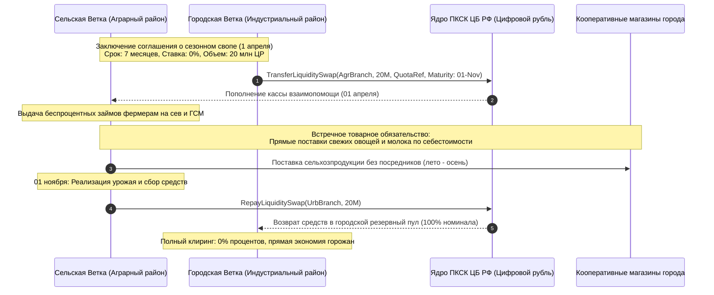

#### Параметры соглашения FSM-свопа ($\mathcal{S}_{\text{swap}}$):
$$\mathcal{S}_{\text{swap}} = \langle \text{Branch}_{\text{donor}}, \; \text{Branch}_{\text{recipient}}, \; V_{\text{swap}}, \; T_{\text{start}}, \; T_{\text{maturity}}, \; \mathcal{Q}_{\text{collateral}}, \; \mathcal{C}_{\text{commodity}} \rangle$$

где:
- $V_{\text{swap}}$ — объем передаваемой ликвидности в цифровых рублях;
- Процентная ставка по свопу строго равна **$0\%$ годовых** (принцип кооперативной беспроцентной солидарности);
- $\mathcal{Q}_{\text{collateral}}$ — гарантийная квота территориальной Ветки-реципиента в региональном расчетном контуре Ствола;
- $\mathcal{C}_{\text{commodity}}$ — встречный контракт товарного покрытия: фермерские хозяйства аграрного района обязуются поставлять продукцию в кооперативные распределительные центры города по фиксированным ценам производителей, исключая посреднические наценки торговых сетей.

### 17.3. Математическая модель динамического буфера ликвидности ($\Lambda_{\text{district}}$)

Шлюз каждой территориальной Ветки непрерывно вычисляет коэффициент достаточности ликвидности:

$$\Lambda_{\text{district}} = \frac{\text{LiquidReserves}_{\text{district}}}{\sum_{j} L_{\text{active}, j} \cdot \bar{U}_j}$$

где:
- $\text{LiquidReserves}_{\text{district}}$ — нераспределенный остаток средств в пуле кассы взаимопомощи Ветки;
- $L_{\text{active}, j}$ — активный кредитный лимит $j$-го заемщика района;
- $\bar{U}_j \in [0, 1.0]$ — статистически прогнозируемая утилизация кредитной линии на текущую декаду.

**Интервалы состояний ликвидности:**
1. $\Lambda_{\text{district}} > 1.4$ — **Зона избытка (Liquidity Surplus):**
   Ветка автоматически генерирует в P2P-сети Дерева криптографическую котировку готовности предоставить временную ликвидность комплементарным Веткам на беспроцентной основе;
2. $0.8 \le \Lambda_{\text{district}} \le 1.4$ — **Зона устойчивого равновесия (Equilibrium):**
   Касса взаимопомощи функционирует автономно в нормальном режиме самофинансирования;
3. $\Lambda_{\text{district}} < 0.8$ — **Зона сезонного дефицита (Liquidity Deficit):**
   Ветка инициирует алгоритмический подбор партнера для заключения свопа ликвидности среди доверенных побратимских муниципалитетов.

### 17.4. Защита от системных каскадных дефолтов (Circuit Breaker & Emergency Stabilizer)

В случае масштабных природных катаклизмов или аномальных климатических явлений (засуха, наводнение, заморозки), угрожающих сезонному сбору урожая, задействуется многоуровневый алгоритмический механизм защиты:

1. **Автоматический временной предохранитель (Circuit Breaker):**
   - При официальной фиксации режима ЧС на территории аграрного района через государственную ведомственную Ветку МЧС, смарт-контракт FSM ЦБ РФ автоматически пролонгирует дату погашения свопа на полный годовой цикл ($T_{\text{maturity}} \to T_{\text{maturity}} + 12 \text{ месяцев}$) без начисления каких-либо штрафов, пени или неустоек;
   - Заемщики аграрного района не признаются дефолтными и сохраняют право на получение семенных микрозаймов на следующий сельскохозяйственный сезон.
2. **Стабилизационный буфер регионального Ствола (Trunk Stabilization Reserve):**
   - Недостающая текущая ликвидность городской Ветки временно компенсируется из неснижаемого гарантийного фонда регионального Ствола платформы;
   - Фермерские хозяйства включаются в программу восстановительной реабилитации (Раздел 12), направляя высвободившиеся трудовые ресурсы на восстановление мелиоративных и защитных сооружений района.

---

## 18. Институциональная интеграция с коммерческой банковской системой: Синдикация капитала, старшие транши (Senior Tranches), B2B-факторинг и инфраструктурный симбиоз

В отличие от ранних концепций криптовалютного DeFi, провозглашавших деструктивный отказ от банковских институтов, экономическая архитектура платформы «Турбаза» строится на принципе **эволюционного симбиоза и игры с положительной суммой (Positive-Sum Game)**. Банковские институты выполняют незаменимые, фундаментальные функции в современной экономике: трансформацию ликвидности и срочности, профессиональный андеррайтинг, управление рисками, доверительное хранение и соблюдение макропруденциальных нормативов.

Платформа «Турбаза» не строит изолированную альтернативную финансовую систему, а предоставляет **суверенный технологический слой (Edge Enablement Layer)**, встраивающийся в существующую банковскую инфраструктуру. Это позволяет банкам радикально снизить операционные и регуляторные издержки, устранить риски утечек данных и сформировать новые высокомаржинальные источники комиссионных и процентных доходов.

### 18.1. Двухконтурная модель «Банк — Турбаза»

В соответствии с принципами Белой книги Банка России № 06 ([`06_cbr_smart_contracts_fsm_whitepaper.md`](../../06_cbr_smart_contracts_fsm_whitepaper.md)), взаимодействие коммерческих банков с платформой реализуется через строгое разделение двух взаимодополняющих контуров:

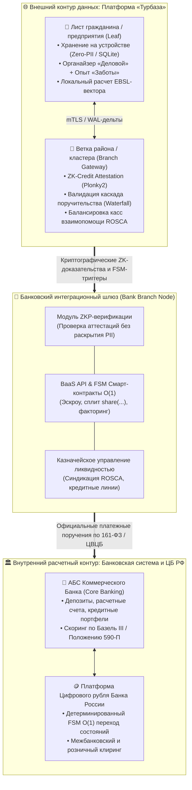

1. **Внутренний расчетный контур (АБС Банка + Платформа Цифрового рубля ЦБ РФ):**
   - Оперирует исключительно балансами счетов, цифровыми кошельками, фиатными остатками и детерминированными $O(1)$ переходами состояний;
   - Полностью защищен от Тьюринг-полных уязвимостей, атак повторного входа (Re-entrancy) и перегрузок сырыми данными;
   - Обеспечивает строгое соблюдение требований 161-ФЗ («О национальной платежной системе») и положений Банка России.
2. **Внешний контур («Турбаза»):**
   - Берет на себя всю вычислительную и информационную нагрузку: товарные накладные, акты сдачи-приемки работ, треды взаимопомощи, матрицу задач и графы взаимного поручительства;
   - В банковский контур передаются исключительно **криптографические доказательства фактов (Zero-Knowledge Proofs)** и подписанные ГОСТ Р 34.10-2012 триггеры исполнения смарт-контрактов.

### 18.2. Радикальное снижение банковских издержек и регуляторных рисков

Интеграция с платформой «Турбаза» устраняет основные статьи затрат, составляющие до 35–50% операционных расходов коммерческих банков:

1. **Сокращение расходов на серверную инфраструктуру и ЦОД (-80%...-90%):**
   - Банк освобождается от необходимости хранения терабайтов неструктурированных данных (истории переписки, медиафайлов подтверждения услуг, кликстрима, промежуточных статусов задач).
   - Вся первичная информация сохраняется на клиентских Листьях и шлюзах Веток в парадигме **Read-Anywhere, Write-Self**. Банк сохраняет в собственной АБС только финансовые проводки и криптографические контрольные хэши.
2. **Ликвидация риска утечек данных и штрафов по 152-ФЗ / банковской тайне:**
   - Банковские базы перестают быть привлекательной мишенью для злоумышленников (Honeypots).
   - Оценка платежеспособности клиента происходит через криптографическую аттестацию **ZK-Credit Attestation**:
     $$\pi_{\text{credit}} = \text{ZKP}\{\text{Score} \ge 720 \land \text{DebtBurden} \le 0.35 \land \text{ReputationCapital} \ge K\}$$
     Банк получает математически неопровержимую гарантию соответствия заемщика критериям надежности, **не получая, не обрабатывая и не сохраняя сырые персональные данные гражданина**.
3. **Снижение стоимости риска (Cost of Risk / NPL) в 2–3 раза:**
   - При бланковом и корпоративном кредитовании банк опирается на многоуровневый каскад поручительства (Раздел 16) и институциональные стабилизационные буферы ($\Lambda_{\text{district}}$).
   - Резервы на возможные потери по ссудам (положения Банка России № 590-П и 611-П) существенно снижаются благодаря автоматическому покрытию первого убытка младшими траншами заемщиков и поручителей.
4. **Ликвидация затрат на POS-терминалы и физический эквайринг:**
   - Закупка, импорт, сертификация по стандартам EMV/PCI-DSS, физический ремонт и инкассация POS-терминалов заменяются бестерминальным эквайрингом (SoftPOS / QR / Offline IOU в Цифровом рубле) на смартфонах продавца и покупателя.

### 18.3. Новые высокомаржинальные источники банковской выручки

«Турбаза» открывает для коммерческих банков масштабные рыночные ниши с высокой маржинальностью:

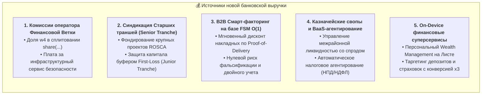

1. **Банк как Оператор Финансовой Ветки (Financial Branch Operator):**
   - Банки разворачивают сертифицированные шлюзы Веток в своих защищенных дата-центрах для обслуживания муниципальных образований, промышленных кластеров и отраслевых ассоциаций.
   - В алгоритмическом сплитовании микроплатежей по формуле $O(1)$ `share(...)`:
     $$\text{Payout} = \sum \left( w_{\text{user}} + w_{\text{portal}} + w_{\text{software}} + w_{\text{branch}} \right)$$
     банк на регулярной основе получает системное вознаграждение ($w_{\text{branch}}$) от каждой транзакции, подписки или коммерческой сделки в обслуживаемом сегменте.
2. **Фондирование Старших траншей для народных касс взаимопомощи (ROSCA Senior Tranche):**
   - Банк выступает институциональным инвестором, предоставляющим недостающий оптовый капитал для крупных проектов (строительство, закупка оборудования, развитие фермерских хозяйств), защищенный институтом поручительства.
3. **B2B Смарт-факторинг с нулевым риском непоставки:**
   - Моментальное финансирование поставщиков под уступку проверенной дебиторской задолженности на основе криптографического акта сдачи-приемки работ (Proof-of-Delivery) в приложении «Деловой» и «Забота».
4. **Автоматическое налоговое и зарплатное агентирование:**
   - Банк получает стабильную комиссию за автоматическое расщепление платежей в Цифровом рубле: удержание налогов (НПД 4–6%, НДФЛ 13–15%) и распределение зарплатного фонда артелей без бумажных реестров.
5. **Интеллектуальные финансовые суперсервисы (On-Device Wealth Management):**
   - Локальный финансовый советник на Листе пользователя анализирует потребности домохозяйства или предприятия и в оптимальный момент предлагает банковские депозиты, накопительные программы или кредитные линии с конверсией в 3–4 раза выше классических холодных звонков и спам-рассылок.

### 18.4. Математическая модель синдицированного кредитования со Старшим банковским траншем

При реализации масштабных социально-экономических и производственных инициатив локальная касса взаимопомощи объединяет усилия с коммерческим банком по модели двухуровневого структурного кредитования:

$$\mathcal{K}_{\text{total}} = \mathcal{T}_{\text{junior}} + \mathcal{T}_{\text{senior}}$$

где:
- $\mathcal{T}_{\text{junior}}$ — **Младший транш первого убытка (First-Loss Junior Tranche)**, формируемый участниками сообщества, заемщиком и его транзитивными поручителями (20–30% от объема проекта);
- $\mathcal{T}_{\text{senior}}$ — **Старший институциональный транш банка (Senior Institutional Tranche)**, составляющий 70–80% объема финансирования.

#### Правило водопада платежей и покрытия убытков (Waterfall Priority):
1. **При возврате займа:**
   Платежи заемщика в первую очередь направляются на полное погашение основного долга и процентов по Старшему банковскому траншу ($\mathcal{T}_{\text{senior}}$):
   $$\text{Payment} \to \min(\text{Payment}, \; \text{Due}_{\text{senior}}) \to \mathcal{T}_{\text{senior}}$$
   Остаток платежей поступает на выплату дохода участникам Младшего транша ($\mathcal{T}_{\text{junior}}$).
2. **При частичном дефолте:**
   Любой убыток в первую очередь списывается за счет Младшего транша:
   $$\Delta \text{Loss}_{\text{senior}} = \max(0, \; \text{TotalLoss} - \mathcal{T}_{\text{junior}})$$
   Поскольку объем Младшего транша ($\mathcal{T}_{\text{junior}}$) существенно превышает исторический уровень дефолтов в системе ($\text{PD} \times \text{LGD} \ll 0.20$), Старший банковский транш обладает **наивысшей категорией надежности (эквивалент кредитного рейтинга AAA)**.

#### Процентные ставки и доходность:
- Ставка по Старшему траншу банка устанавливается на минимальном рыночном уровне:
  $$R_{\text{senior}} = R_{\text{key}} + \alpha_{\text{bank}}$$
  где $R_{\text{key}}$ — ключевая ставка Банка России, а $\alpha_{\text{bank}} \in [0.015, 0.030]$ — чистая банковская маржа без премии за риск дефолта (риск полностью абсорбирован младшим траншем).
- Участники Младшего транша за принятие риска первого убытка получают повышенную доходность за счет остаточного денежного потока проекта.

### 18.5. Протокол B2B смарт-факторинга на базе Proof-of-Delivery

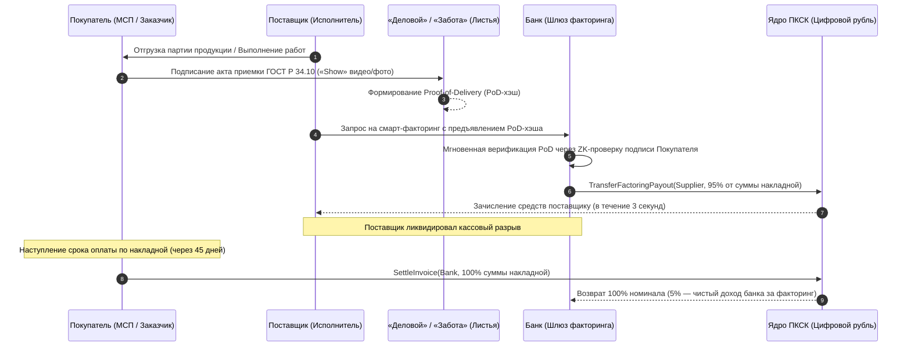

**Преимущества для банка:**
- 100% защита от подделки накладных, фальсификации объема работ и повторного финансирования одного и того же счета;
- Исключение судебных издержек: спорные ситуации разрешаются в момент приемки в «Заботе» до подачи заявки на финансирование;
- Полная автоматизация: время принятия решения и выдачи средств сокращается с нескольких дней до 3–5 секунд.

### 18.6. Сводная матрица институциональной трансформации коммерческого банка

| Измерение | Традиционная банковская модель | Банк в экосистеме «Турбаза» | Экономический и институциональный результат |
| :--- | :--- | :--- | :--- |
| **IT-инфраструктура (CAPEX/OPEX)** | Закупка импортных серверов, лицензий СУБД, поддержка ЦОД для сырых логов | Хранение данных на Листьях пользователей (Zero-PII). Банк хранит лишь финансовые дельты | **Снижение совокупных затрат на IT на 80–90%** |
| **Комплаенс 152-ФЗ и банковская тайна** | Концентрация баз данных создает угрозу взломов и оборотных штрафов | Клиент подтверждает платежеспособность через ZK-Credit Attestation без раскрытия PII | **Полная ликвидация риска утечек клиентских баз и регуляторных санкций** |
| **Скоринг заемщиков** | Дорогие запросы в БКИ, высокий барьер для молодежи и самозанятых («Thin-File») | Локальный расчет многомерного капитала доверия (EBSL) на Листе заемщика | **Расширение клиентской базы на 25–40% при снижении уровня дефолтов** |
| **Залоговое обеспечение** | Жесткие залоги недвижимости/авто либо дорогие бланковые кредиты с NPL > 10% | Синдикация со Старшим траншем (Senior Tranche) и каскад поручительства (First-Loss) | **Снижение стоимости кредитного риска (Cost of Risk) в 2–3 раза** |
| **Эквайринг и расчеты** | Закупка, сертификация и ремонт физических POS-терминалов | Бестерминальный P2P/B2C SoftPOS на смартфонах через шлюзы Веток | **Многомиллиардная экономия на закупке и обслуживании терминалов** |
| **Источники прибыли** | Ссудный процент, комиссии за переводы, навязанные страховки | Доля в `share(...)` как оператор Ветки, B2B смарт-факторинг, структурные транши | **Формирование долгосрочных, этичных и предсказуемых комиссионных доходов** |
| **Отношения с клиентами** | Спам холодных звонков, потеря доверия граждан | On-Device предложение финансовых инструментов в момент реальной потребности | **Рост конверсии предложений в 3–4 раза при лояльности клиентов** |

---

## 19. Восточные модели партнерского проектного финансирования (Profit-and-Loss Sharing, PLS): Смарт-Мудараба, Мушарака и динамическое расщепление маржи

### 19.1. Философские и институциональные основания: Гармония партнерских финансов и архитектуры «Турбазы»

Мировая финансовая мысль веками развивала альтернативные долговым механизмам модели инвестирования, основанные на принципах **сопричастности, справедливого разделения рисков и отказа от ссудного процента (Риба / Riba)**. В восточных и исламских финансовых традициях, а также в российском законодательстве (Федеральный закон № 377-ФЗ от 24.07.2023 «О проведении эксперимента по установлению специального регулирования партнерского финансирования»):
1. **Преодоление паразитарного отчуждения капитала:** В классической кредитной парадигме банк или кредитор перекладывает весь рыночный и операционный риск на заемщика. При банкротстве предприятия кредитор претендует на залоги, разрушая производство и лишая работников занятости. В моделях партнерского финансирования (Profit-and-Loss Sharing, PLS) инвестор становится соратником предпринимателя: доход формируется не из фиксированного процента (начисляемого независимо от успеха дела), а из реально созданной добавленной стоимости.
2. **Ограничение спекуляций (Гарар / Gharar и Майсир / Maysir):** Запрет неопределенности и азартных спекуляций находит идеальное технологическое воплощение в архитектуре «Турбазы»: смарт-контракты Цифрового рубля FSM $O(1)$ строго детерминированы, свободны от непредсказуемых внешних оракулов и опираются на проверяемые факты хозяйственной деятельности в «Деловом» и «Заботе».
3. **Технологическая синергия с децентрализованной топологией:** Модели проектного долевого финансирования исторически страдали от высоких аудиторских издержек и информационной асимметрии (риск сокрытия прибыли управляющим). Платформа «Турбаза» полностью снимает это препятствие: локальные реляционные базы AIRport на Листьях фиксируют цепочки поставок, оракулы TAPO удостоверяют материальный прогресс, а алгоритм автоматического расщепления выручки `share(...)` исключает человеческий фактор при распределении денежных потоков.

---

### 19.2. Смарт-Мудараба (Mudarabah): Трастовое соинвестирование капитала и труда

**Мудараба** представляет собой договор доверительного соинвестирования, где одна сторона выступает пассивным поставщиком капитала (**Рабб аль-мал / Rabb al-mal** — инвестор, банк, фонд или кооператив), а вторая — исключительно предпринимательским и организационным трудом (**Мудариб / Mudarib** — мастер, артель, стартап или МСП):

```mermaid
flowchart TD
    subgraph MudarabahCycle ["🤝 Конвейер Смарт-Мударабы в Цифровом рубле"]
        direction TB
        Inv["Поставщик капитала (Рабб аль-мал)<br/>Инвестиция: K_invest (100% денег)"]
        Mgr["Предприниматель (Мудариб)<br/>Вклад: Управление, ремесло, труд"]
        
        Inv -->|1. Предоставление целевого капитала в ЦР| Facility["Эскроу-счет Мударабы (FSM O(1))<br/>Статус: CAPITAL_DEPLOYED"]
        Mgr -->|2. Исполнение задач в «Деловом» + TAPO| Facility
        
        Facility -->|3. Хозяйственная деятельность| Sales["Клиентская выручка (Revenue)"]
        Sales -->|4. Авто-сплит в ЦР| Settle["Расчет финансового результата<br/>Чистая прибыль: П = Revenue - OPEX"]
        
        Settle -->|Успех: П > 0| Split["Расщепление маржи:<br/>• Инвестор: α · П<br/>• Мудариб: β · П<br/>+ возврат капитала K_invest"]
        Settle -->|Убыток: П <= 0 (без злого умысла)| Loss["Асимметрия покрытия убытка:<br/>• Финансовый убыток: Инвестор (100%)<br/>• Потеря трудозатрат: Мудариб"]
    end
```

#### Математическая модель водопада распределения чистой прибыли:
1. **Формула чистой прибыли эпохи ($\Pi$):**
   $$\Pi = \max\Big(0, \; \text{Revenue} - \text{OPEX} - \text{Depreciation} - \text{TakafulFee}\Big)$$
   где:
   - $\text{Revenue}$ — документально подтвержденная выручка от реализации продукции или услуг в Цифровом рубле;
   - $\text{OPEX}$ — верифицированные операционные расходы (закупка сырья, электроэнергия, логистика), подтвержденные актами приемки в приложении «Деловой»;
   - $\text{Depreciation}$ — амортизационные отчисления на восстановление производственных мощностей;
   - $\text{TakafulFee}$ — взнос в солидарный фонд взаимопомощи (Раздел 19.4).

2. **Пропорция расщепления прибыли ($\alpha : \beta$):**
   Стороны при инициации контракта жестко фиксируют доли распределения чистой прибыли:
   $$\alpha_{\text{investor}} + \beta_{\text{mudarib}} = 1, \quad \alpha \in [0.10, 0.90]$$
   Выплаты производятся детерминированно в Цифровом рубле:
   $$\text{Payout}_{\text{investor}} = \alpha \cdot \Pi, \quad \text{Payout}_{\text{mudarib}} = \beta \cdot \Pi$$

3. **Правило покрытия убытков и защита от морального риска (Moral Hazard):**
   - **При отсутствии вины управляющего (Good-Faith Loss):** если проект потерпел убыток в силу объективных рыночных факторов (изменение конъюнктуры, неблагоприятная погода), финансовый капитал списывается за счет инвестора:
     $$\text{Loss}_{\text{investor}} = \min(K_{\text{invest}}, \; \text{Loss}), \quad \text{Loss}_{\text{mudarib}} = 0$$
     Предприниматель не несет долгового бремени и не попадает в кредитную зависимость, но теряет все вложенное время и труд, что создает мощный экономический стимул к успеху.
   - **При доказанной халатности или злоупотреблении (Ta'addi / Tafrit):** если в ходе жеребьевки арбитража «КубГолоса» (Sortition Jury) или проверки оракулов TAPO доказано, что предприниматель нарушил регламент работ, присвоил сырье или сфальсифицировал отчетность:
     1. Режим ограниченной ответственности Мударабы аннулируется;
     2. Управляющий несет 100% субсидиарную ответственность всем личным имуществом;
     3. Его репутационный индекс в «Заботе» падает до нуля ($E(\omega_{\text{int}}) \to 0, s_{\text{int}} \to \infty$), что навсегда блокирует ему доступ к экосистеме.

---

### 19.3. Смарт-Мушарака (Musharakah) и Убывающая Мушарака (Diminishing Musharakah)

В отличие от Мударабы, в договоре **Мушарака** обе стороны вносят капитал и обладают правом участия в управлении проектом:
$$\mathcal{K}_{\text{total}} = K_A + K_B$$

#### Убывающая Мушарака (Diminishing Musharakah / Мушарака Мутанакиса):
Является флагманским инструментом для приобретения основных средств, станков, сельхозтехники и коммерческой недвижимости малыми артелями без банковского кредита под ссудный процент.

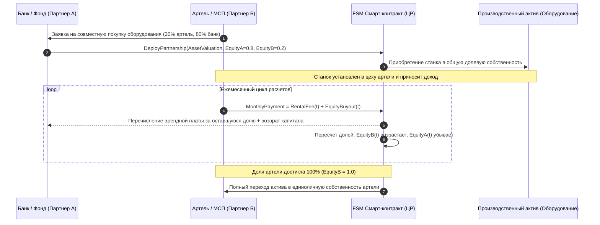

#### Математика выкупа долей и арендных платежей:
1. **Динамика накопления доли предпринимателя:**
   $$\text{Equity}_B(t) = \text{Equity}_B(t-1) + \frac{\Delta C_t}{V_{\text{asset}}}$$
   где $V_{\text{asset}}$ — базовая балансовая стоимость оборудования, $\Delta C_t$ — транш выкупа доли капитала.

2. **Формула регулярного платежа:**
   Платеж артели в эпоху $t$ строго разделяется на две непересекающиеся компоненты:
   $$\text{Payment}(t) = \text{RentalFee}(t) + \Delta C_t$$
   где:
   $$\text{RentalFee}(t) = \rho_{\text{market}} \cdot \big(1 - \text{Equity}_B(t-1)\big) \cdot V_{\text{asset}}$$
   - $\rho_{\text{market}}$ — справедливая рыночная ставка аренды данного класса оборудования;
   - По мере того как артель выкупает станок ($\text{Equity}_B \to 1.0$), база для начисления аренды сжимается. В финале $\text{RentalFee} \to 0$, и оборудование переходит в безусловную собственность артели без остаточных комиссий или скрытых переплат.

---

### 19.4. Взаимное кооперативное страхование (Такафул / Takaful / Табарру')

Классическое коммерческое страхование содержит элементы скрытой доходности и конфликта интересов: акционеры страховой компании заинтересованы в минимизации выплат пострадавшим для максимизации собственной прибыли.

В архитектуре «Заботы» институциональная защита от рисков строится на модели **Такафул (Takaful)** — кооперативного взаимного страхования на основе благотворительного дарения (**Табарру' / Tabarru'**):
1. **Формирование солидарного фонда:**
   Участники кооператива, фермеры или ремесленники отчисляют микро-платежи в защищенный пул на районной Ветке:
   $$S_{\text{takaful}} = \lambda_{\text{risk}} \cdot V_{\text{project}} \cdot \Big(1 - 0.5 \cdot S_{\text{civic}}\Big)$$
   где $S_{\text{civic}} \in [0, 1.0]$ — подтвержденный индекс гражданского служения (Раздел 12), предоставляющий скидку до 50% добросовестным гражданам.
2. **Безусловная выплата при форс-мажоре:**
   При наступлении подтвержденного страхового события (пожар, неурожай, подтвержденный метео-оракулом TAPO и жюри «КубГолоса») FSM смарт-контракт автоматически возмещает доказанный ущерб из средств пула.
3. **Возврат излишков (Surplus Distribution / Истирдад):**
   Если по итогам финансового года объем собранных средств превысил сумму выплат и нормативный буфер платежеспособности ($\text{SolvencyRatio} \ge 1.50$), неиспользованный остаток **не присваивается оператором**, а пропорционально возвращается участникам:
   $$\text{SurplusRefund}_i = \frac{S_i}{\sum_{k} S_k} \cdot \Big(\text{Reserve} - \text{ClaimsPaid} - \text{TargetBuffer}\Big)$$
   Это формирует культуру взаимной бережливости и исключает потребительский эгоизм.

---

### 19.5. FSM-протокол $O(1)$ циклического расщепления маржи в Цифровом рубле (Mudarabah Epoch Split)

В соответствии с принципами Белой книги № 06, партнерские соглашения реализуются в виде детерминированных конечных автоматов с константной вычислительной сложностью $O(1)$:

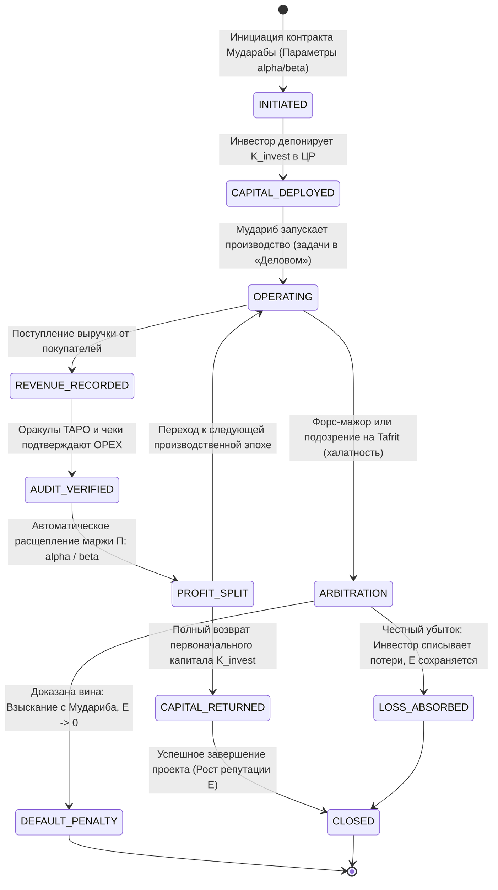

#### Инварианты исполнения FSM-автомата:
1. **Детерминизм вычислений:** все операции расщепления выполняются с целочисленной арифметикой цифровых копеек, исключая погрешности округления.
2. **Изоляция рисков:** средства проекта не смешиваются с другими операционными балансами Ветки или Листьев.
3. **Самозавершение:** при достижении целевого объема возврата капитала или истечении согласованного горизонта контракт переходит в финальный статус `CLOSED` без необходимости ручного администрирования.

---

### 19.6. Сводная матрица: Ссудное кредитование vs. Восточные партнерские модели (PLS) в среде «Турбазы»

| Критерий анализа | Классическое ссудное кредитование (Западная модель) | Восточные партнерские финансы (PLS / 377-ФЗ РФ) | Реализация в среде «Турбаза» |
| :--- | :--- | :--- | :--- |
| **Базис дохода инвестора** | Фиксированный ссудный процент ($R_{\text{loan}}$) независимо от финрезультата | Доля в реальной чистой прибыли ($\alpha \cdot \Pi$) от овеществленного дела | Алгоритмический $O(1)$ сплит выручки в Цифровом рубле по формуле `share(...)` |
| **Распределение риска убытка** | Весь риск несет заемщик (банкротство, конфискация залогов) | Инвестор теряет капитал, предприниматель — труд (при отсутствии вины) | FSM-водопад покрытия убытков, защищенный взаимным пулом Такафул |
| **Обеспечение сделки** | Залог недвижимости, оборудования, личные поручительства | Долевая собственность на актив (Мушарака), доверие и оракулы TAPO | Снижение залогов до 0% на основе подтвержденного капитала доверия $E(\omega)$ |
| **Инфляционное воздействие** | Кредитная эмиссия денег «из воздуха», опережающая товарную массу | Деньги связываются со 100% реальным активом или производством | Полная неинфляционность: каждый цифровой рубль обеспечен продуктом |
| **Отношение к банкротству** | Судебное преследование, ликвидация предприятия, стигматизация | Мораторий, реструктуризация, разделение бремени или реабилитация | Протокол восстановительного правосудия (Restorative Justice) и реабилитация |
| **Стимул инвестора** | Требовать залоги и штрафы за просрочки | Активно помогать предпринимателю компетенциями и рынками | Превращение банка и инвестора в соратников через институциональные Ветки |

---


