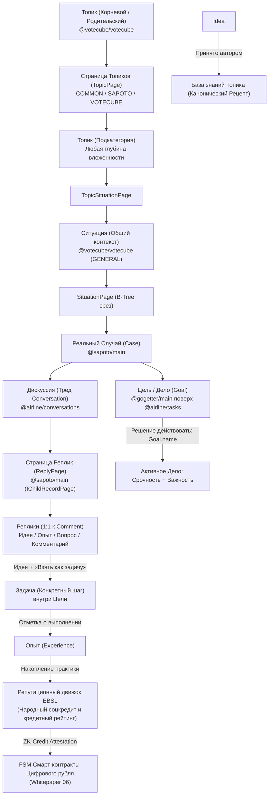
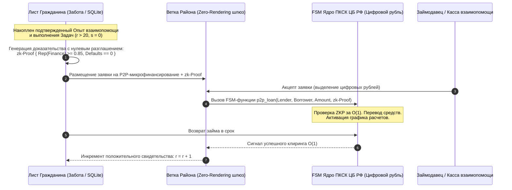

# Архитектура и функциональная спецификация платформы Sapoto.net («Забота»)

## 1. Концепция и ключевое назначение

**Sapoto.net** (*«Забота»*, от японского *サポート* — «поддержка/забота») — это децентрализованная социальная сеть взаимопомощи, обмена проверенным жизненным опытом, формирования децентрализованной репутации и коллективного решения проблем на местах.

«Забота» формирует базовую триаду системных приложений платформы **«Турбаза»** (Сети Независимости Данных — Data Independence Network, DIN) наряду с **«КубГолосом» (VoteCube)** и **«Деловым» (GoGetter)**:
1. **«Забота» (Sapoto)**: фиксация жизненных Ситуаций и Случаев, генерация Идей, подтверждение Опытом, выработка сквозной децентрализованной репутации и формирование общественного консенсуса.
2. **«КубГолос» (VoteCube)**: механизм многомерного 3D-волеизъявления и принятия решений по трем настраиваемым пользователями факторам (подробная спецификация — в [VoteCube Architecture & Functionality](../votecube/VoteCube_architecture_and_functionality.md)).
3. **«Деловой» (GoGetter)**: управление задачами, поручениями и практическими действиями, замыкающее цикл эмпирической обратной связи и наполняющее репутационный капитал.

---

## 2. Каноническая иерархия предметной области



---

## 3. Четыре модальности реплик и цикл обратной связи

### 3.1. Сравнительная матрица реплик
| Измерение | Идея (`isIdea`) | Опыт (`isExperience`) | Вопрос (`isQuestion`) | Комментарий |
| :--- | :--- | :--- | :--- | :--- |
| **Природа** | **Предписывающая**: *«Что следует сделать»* | **Описательная / Эмпирическая**: *«Что произошло на практике»* | **Вопросительная**: *«Недостающий контекст»* | **Дискурсивная**: общее обсуждение |
| **Оценка** | **Консенсус и Согласие в «КубГолосе»** | **Оценки подтверждения / опровержения (+1/-1)** | Отметка полезности автором | Реакции сообщества |
| **Матрица Эйзенхауэра** | **Срочность vs Важность** (1–5) | Реальный результат и достоверность | Критичность проблемы | Отсутствует |
| **Структура** | **Дерево причин** (грамматика факторов) | Текст + **«Голос»** (аудио) и **«Показ»** (видео) | 8 стандартных маркеров вопросов | Свободный текст |
| **Действия** | **«Обосновать в Кубе»** и **«Взять как задачу»** | Подтверждение или опровержение Идей | Уточнение контекста | Ответ в тред |
| **Влияние на репутацию** | Баллы проницательности и авторства | Эмпирический базис надежности ($r, s$) | Гражданская активность | Не влияет |

### 3.2. Гибридная связь «Опыт — Идея»
1. **Как верификация Идеи** (через `parentReply`): прикрепляется к карточке Идеи как независимая запись Опыта (в соответствии с архитектурным инвариантом «Write-Self»). Количество записей Опыта и Шкала Результата динамически агрегируются на Листе (через локальный реляционный SQL-движок) и на Ветке (через счетчики в оперативной памяти), не мутируя исходную сущность Идеи автора.
2. **Как исходный контекст Ситуации**: документирует, что автор или участник уже предприняли до того, как были предложены какие-либо идеи.

### 3.3. Разрешение Ситуации и База знаний
- Когда предложенная Идея успешно решает проблему на практике, автор ситуации переводит её в статус **«Решена» (Resolved)**.
- Триада *(Ситуация + Принятая Идея + Подтвержденный Опыт)* закрепляется в качестве канонического **«Рецепта» (Лучшей практики)** в предметном каталоге Топика.
- При этом тред обсуждения остается открытым для альтернативных и более эффективных подходов.

### 3.4. Жизненный цикл Вопроса и обогащение контекста
- **8 вопросительных маркеров**: *Что*, *Какой*, *Кто*, *Где*, *Почему*, *Когда*, *Как*, *Чей*.
- Когда автор отвечает на Вопрос, он переходит в статус **«Отвечен»**, а ключевые уточняющие факты автоматически закрепляются в блоке **«Уточненный контекст ситуации»**, исключая повторные расспросы и помогая авторам новых Идей.

### 3.5. Мультимодальный опыт: «Голос» («Speak», аудио) и «Показ» («Show», видео)
- Запись мультимедиа осуществляется через стандартные браузерные интерфейсы HTML5 `MediaStream` и `MediaRecorder` без необходимости установки сторонних плагинов.
- Исходные медиафайлы сохраняются в децентрализованном блоб-хранилище Веток платформы AIRport.
- **Локальное распознавание речи (On-Device STT)**: транскрипция аудио в текст выполняется непосредственно на устройстве пользователя (Web Speech API / WASM), обеспечивая мгновенный полнотекстовый поиск и приватное чтение без передачи голоса на внешние облачные серверы.

---

## 4. Интеграция с «КубГолосом» (VoteCube) и инфраструктура данных

### 4.1. Архитектурный мост «Забота — КубГолос»
«Забота» не дублирует механизм трехмерного волеизъявления, а использует «КубГолос» как внешний математический сервис консенсуса:
- **Ситуация и Случай**: абстрактная Ситуация (`Situation` в `@votecube/votecube`) объединяет через самозапечатывающиеся страницы множество частных Случаев (`Case` в `@sapoto/main`), привязанных к конкретным районам или семьям.
- **Обоснование Идей в 3D-Кубе**: любая Идея, выдвинутая в «Заботе», может быть направлена на калибровку в «КубГолос», где участники оценивают ее по 3 ключевым факторам в пространстве $X, Y, Z$.
- **Эмпирический цикл (Опыт $\to$ Шкала Результата)**: публикации Опыта (`isExperience`) в «Заботе» напрямую наполняют эмпирическую **Шкалу Результата (Outcome Scale)** в «КубГолосе», динамически сдвигая байесовский вектор консенсуса от умозрительных споров к проверенной практике.

> ℹ️ *Подробная математическая спецификация 3D-манипулятора, divergent-барчартов, DDL-схем `@votecube/votecube` и байесовской формулы вероятности истинности $P(\text{Truth})$ представлена в нормативном документе [VoteCube Architecture & Functionality](../votecube/VoteCube_architecture_and_functionality.md).*

### 4.2. DDL-спецификация сущностей «Заботы» (`@sapoto/main`)
```typescript
// Реальный Случай (составная конструкция)
@Entity()
export class Case extends AirEntity {
    @ManyToOne({ target: 'Topic' })
    topic: Topic;                     // Категория из @votecube/votecube

    @ManyToOne({ target: 'Situation' })
    situation?: Situation;           // Абстрактная ситуация из @votecube/votecube

    @OneToOne({ target: 'Conversation' })
    conversation: Conversation;       // Тред из @airline/conversations

    @ManyToOne({ target: 'Question' })
    question?: Question;             // Опциональный частный опрос ситуации
}

// Реплика в треде Случая
@Entity()
export class Reply extends AirEntity {
    @OneToOne({ target: 'Comment' })
    comment: Comment;                 // 1:1 к комментарию в @airline/conversations

    @ManyToOne({ target: 'ReplyPage' })
    replyPage: ReplyPage;             // Страница размещения реплики

    isIdea: boolean;                  // Модальность: Идея
    isExperience: boolean;            // Модальность: Опыт
    isQuestion: boolean;              // Модальность: Вопрос
    questionMarker?: QuestionMarker;  // Что, Где, Когда, Как и др.
    
    parentReply?: Reply;              // Ссылка на валидируемую Идею
}

// Самозапечатывающаяся страница реплик (IChildRecordPage)
@Entity()
export class ReplyPage extends AirEntity implements IChildRecordPage {
    @ManyToOne({ target: 'Case' })
    parent: Case;                     // Родительский случай

    recordsCount: number;             // Лимит ~1000 записей
    isSealed: boolean;                // Флаг неизменяемости
    childPages?: ReplyPage[];         // B-дерево вложенных страниц
}
```

### 4.3. Децентрализованное масштабирование через Страницы (`IChildRecordPage`) и Ветки
- **Отсутствие монолитных серверов**: как и во всей архитектуре DIN, Листья пользователей хранят данные в локальной СУБД (SQLite / WASM).
- **Треды реплик без раздувания**: связь 1:N между Случаем и Репликами разбивается на самозапечатывающиеся страницы `ReplyPage` объемом ~1000 элементов. По заполнении страница запечатывается (`isSealed = true`) и кэшируется как CAS-объект (`Cache-Control: immutable`).
- **Zero-Rendering Headless Gateways**: шлюзы Веток не рендерят HTML или интерфейс, выполняя исключительно координацию WAL-дельт, CAS-кэширование и mTLS-маршрутизацию.
- **TreeSearch и дедупликация на лету**: компактная нейросетевая модель на устройстве (On-Device SLM) в момент набора текста сопоставляет формулировку с Trie-индексом локальной Ветки, предотвращая дублирование обращений на 60–80%.
- **Автономный Offline Mesh**: при авариях и отключении интернета Листья координируются по прямой P2P-связи (Wi-Fi / Bluetooth mesh), гарантируя взаимопомощь на местах даже во время блэкаутов.

---

## 5. Система децентрализованной репутации («Суверенная экономика доверия»)

Репутационная система «Заботы» — это **главное системообразующее ядро платформы**, предоставляющее децентрализованную, управляемую самими людьми альтернативу существующим монопольным системам кредитного скоринга и государственного социального рейтинга.

> ℹ️ *Полная математическая и криптографическая спецификация с формулами объемно-взвешенной логики (VW-EBSL), ZK-нуллификаторами против одновременных дефолтов, защитой от Exit-Scam и протоколом децентрализованного суда присяжных (P2P Sortition Jury) представлена в специальном нормативном документе: [**`Sapoto_Reputation_and_Credit_System_Specification.md`**](Sapoto_Reputation_and_Credit_System_Specification.md).*

### 5.1. Архитектурные принципы и сопоставление моделей

| Параметр | Традиционные БКИ (FICO, НБКИ) | Авторитарный соцкредит | Web3 DeFi Скоринг | Репутационная система «Заботы» |
| :--- | :--- | :--- | :--- | :--- |
| **Управление** | Банковская олигополия | Государственный аппарат | Смарт-контракты L1/L2 | **Люди и локальные сообщества (P2P)** |
| **Структура** | Одномерный балл (300–850) | Одномерный скаляр лояльности | Финансовый баланс кошелька | **Многомерный контекстный вектор** |
| **Приватность** | Сбор PII, угрозы утечек | Тотальный надзор и слежка | Публичный граф транзакций | **Строгий Zero-PII, ZKP, хранение на Листе** |
| **Базис оценки** | Просрочки и долговая нагрузка | Послушание и штрафы | Залоговое обеспечение (150%) | **Эмпирический Опыт, Дела и Контракты** |
| **Финансовая роль** | Банковские займы под процент | Административные льготы | Доступ к крипто-пулам | **Смарт-контракты Цифрового рубля (ЦБ РФ)** |

### 5.2. Математический аппарат: Evidence-Based Subjective Logic (EBSL)

Оценка надежности строится на математическом аппарате субъективной логики (Subjective Logic), оперирующей не бинарными вероятностями, а мерой эпистемической неопределенности.

#### 5.2.1. Кортеж субъективного мнения
Мнение наблюдателя $A$ о надежности участника $X$ в контексте предметного топика $T$ выражается кортежем:
$$\omega_A^X(T) = \big(b_A^X(T), \; d_A^X(T), \; u_A^X(T), \; a_A^X(T)\big)$$
где:
- $b$ (**Belief**) — степень уверенности в добросовестности / мастерстве ($b \in [0, 1]$);
- $d$ (**Disbelief**) — степень уверенности в недобросовестности ($d \in [0, 1]$);
- $u$ (**Uncertainty**) — мера нехватки эмпирических данных ($u \in (0, 1]$);
- $a$ (**Base Rate**) — базовая априорная вероятность при нулевых данных ($a \approx 0.5$);
- **Инвариант полноты**: $b + d + u = 1$.

Математическое ожидание репутационной надежности (Expected Trust Score):
$$E\big(\omega_A^X(T)\big) = b_A^X(T) + a_A^X(T) \cdot u_A^X(T)$$

#### 5.2.2. Преобразование эмпирических свидетельств (Evidence Mapping)
Репутация формируется исключительно на основе проверяемых жизненных исходов:
- $r$ (**Положительные свидетельства**):
  - Решенная Ситуация по Идее автора;
  - Подтвержденный сообществом практический Опыт (`isExperience`);
  - Успешно закрытая Задача / Дело (`Task` / `Goal` в «Деловом»);
  - Исполненный без претензий смарт-контракт в Цифровом рубле.
- $s$ (**Отрицательные свидетельства**):
  - Опровергнутая практикой рекомендация;
  - Срыв дедлайна или неисполнение взятой на себя Задачи;
  - Дефолт или арбитражный спор по контракту в Цифровом рубле.

Компоненты мнения вычисляются по формулам:
$$b = \frac{r}{r + s + W}, \quad d = \frac{s}{r + s + W}, \quad u = \frac{W}{r + s + W}$$
где $W = 2$ — эпистемический вес априорной неопределенности. При $r=0, s=0$ неопределенность $u=1$, а ожидание $E = 0.5$. По мере накопления фактов ($r + s \gg W$) неопределенность стремится к нулю, а оценка отражает реальную частоту добросовестности.

#### 5.2.3. Временной полураспад (Half-Life Memory Decay)
Для предотвращения пожизненной концентрации влияния («репутационной монархии») свидетельства затухают по экспоненциальному закону:
$$r(t) = r_0 \cdot e^{-\lambda \Delta t}, \quad s(t) = s_0 \cdot e^{-\lambda \Delta t}, \quad \lambda = \frac{\ln 2}{T_{1/2}}$$
- Для бытовой взаимопомощи: $T_{1/2} = 6 \text{ месяцев}$;
- Для кредитно-финансовой надежности: $T_{1/2} = 24 \text{ месяца}$.

#### 5.2.4. Транзитивное дисконтирование и слияние консенсуса
- **Дисконтирование доверия ($\otimes$)**: если $A$ доверяет поручителю $B$, а $B$ рекомендует исполнителя $C$:
  $$\omega_A^{B:C} = \omega_A^B \otimes \omega_B^C = \big(b_A^B b_B^C, \; b_A^B d_B^C, \; d_A^B + u_A^B + b_A^B u_B^C, \; a_B^C\big)$$
- **Слияние мнений ($\oplus$)**: независимые свидетельства от нескольких соседей объединяются оператором консенсуса Йёсанга, формируя локальный объективный консенсус без центрального сервера.

---

### 5.3. Народный социальный рейтинг vs Авторитарный соцкредит

«Забота» кардинально отвергает концепцию авторитарного государственного или корпоративного социального надзора:

1. **Многомерный вектор вместо единого клейма**: личность не сводится к одной цифре. Гражданин обладает независимыми репутационными оценками в разных топиках (например: $\text{Rep}_{\text{строительство}} = 0.92$, $\text{Rep}_{\text{педиатрия}} = 0.10$, $\text{Rep}_{\text{соседская\_помощь}} = 0.88$). Ошибки в одной сфере не разрушают социальный статус в других.
2. **Локально-субъективное вычисление (No Global Blacklist)**: в системе физически отсутствует глобальный реестр «неблагонадежных». Оценка гражданина вычисляется локально на устройстве (Листе) запрашивающего лица с учетом его личного круга доверия.
3. **Строгий Zero-PII и Self-Custody (152-ФЗ)**: личные журналы дел и помощи хранятся только на аппарате пользователя. Во внешний мир передаются лишь математические криптографические агрегаты.
4. **Защита от травли и сговоров**: координированные атаки хейтеров бессильны, так как мнения участников, не имевших совместного подтвержденного Опыта с пользователем, получают $u \to 1$ и отсекаются алгоритмом.

---

### 5.4. Народный кредитный рейтинг и интеграция с Цифровым рублем (Whitepaper 06)

Взаимодействие «Заботы» с платформой коммерческих смарт-контрактов (ПКСК) Банка России опирается на фундаментальную двухконтурную архитектуру, обоснованную в [Whitepaper 06](../../06_cbr_smart_contracts_fsm_whitepaper.md):
- **Внутренний расчетный контур**: государственное ядро ПКСК со сложностью $O(1)$ над переменными цифровых кошельков;
- **Внешний информационный контур**: суверенная сеть «Турбаза» и приложение «Забота», поставляющие криптографические доказательства наступления условий расчетов.



#### 5.4.1. ZK-Credit Attestation (Доказательство без раскрытия данных)
Заемщик доказывает финансовую добросовестность через ZK-SNARK доказательство:
$$\pi_{\text{credit}} = \text{ZK-Prove}\big(\{r, s, \Delta t\}, \; \{\text{Rep}_{\text{min}}, \text{Default}_{\text{max}} = 0\}\big)$$
- Кредитор видит только истинность утверждения $\text{Verify}(\pi_{\text{credit}}) = \text{True}$.
- Никакие персональные данные (выписки по счетам, паспорта, контакты) не раскрываются, гарантируя банковскую тайну (ст. 26 Федерального закона № 395-1) и суверенитет по 152-ФЗ.

#### 5.4.2. Динамическое снижение залоговых требований
В отличие от крипто-DeFi, требующих 150% залога, народный рейтинг позволяет снижать залог вплоть до полного беззалогового (бланкового) микрофинансирования:
$$C_{\text{ratio}} = \max\Big(0, \; 1.5 - 1.5 \cdot E\big(\omega(T_{\text{credit}})\big)\Big)$$
- При $E = 0.5$ (новый пользователь): залог $75\%$;
- При $E \ge 0.95$ (проверенный участник сообщества): залог $0\%$ (**полностью бланковый P2P-заем**).

#### 5.4.3. Социальное поручительство через FSM Multi-Sig Wrappers
Участники с высоким рейтингом могут выступать поручителями для начинающих соседей:
- Поручитель подписывает контрактную оболочку (Wrapper), блокирующую гарантийный лимит в цифровых рублях;
- При успешном возврате займа поручитель автоматически получает микро-роялти по формуле `share(...)` (Whitepaper 06, раздел 4.3);
- В случае дефолта репутация поручителя дисконтируется, стимулируя осмотрительность.

---

### 5.5. Кросс-экосистемное распространение репутации «Заботы»

Репутационный капитал, сформированный в «Заботе», бесшовно транслируется на все компоненты платформы:
1. **«КубГолос» (VoteCube)**: определяет вес голоса участника в **Шкале Экспертов** ($W_{\text{reputation}}$).
2. **«Деловой» (GoGetter)**: задачи от авторитетных постановщиков получают приоритет при распределении поручений.
3. **«УраТур» (UraTour)**: верификация гидов, спасателей и инструкторов на базе подтвержденного видеоопыта («Show»).
4. **«Локальный реестр МСП и ЖКХ»**: объективный рейтинг локальных мастеров (сантехников, электриков) без возможности накрутки заказными отзывами.
5. **Операторы Веток (Capacity Renters)**: надежность узлов оценивается по качеству маршрутизации и аптайму.

---

## 6. Муниципальные Ветки, конфиденциальность и безопасность

### 6.1. Трехуровневая конфиденциальность на Ветке
Анонимность настраивается пользователем при публикации Случая:
1. **Уровень 1 (Branch ID / Локальный анонимный)**: базовая регистрация на районной ветке без предоставления PII.
2. **Уровень 2 (Групповая анонимность / Жеребьевка)**: офлайн-подтверждение резидентства через соседей. Ветка видит лишь принадлежность идентификатора к доверенной группе $N$.
3. **Уровень 3 (Индивидуально верифицированный)**: открытый подтвержденный профиль с накопленной репутацией для профессионалов и специалистов.

> ℹ️ *Техническое назначение сущности `Actor` (предотвращение коллизий параллельной синхронизации устройств без раскрытия личности) подробно рассмотрено в [VoteCube Architecture](../votecube/VoteCube_architecture_and_functionality.md).*

### 6.2. Экономика Веток и детерминированное распределение прибыли `share(...)`
Финансирование инфраструктуры Веток осуществляется через детерминированный FSM смарт-контракт `share(...)` со сложностью $O(1)$:
$$\text{share}(w_1, \text{Citizen}, \; w_2, \text{HostPortal}, \; w_3, \text{SoftwareTree}, \; w_4, \text{CapacityRenters})$$
- Фиксированная доля дохода ($w_4$) направляется **арендаторам серверных мощностей (Capacity Renters)**, обеспечивая окупаемость шлюзов Веток и CAS-кэширования.
- Пользователи, добровольно заполнившие обезличенный демографический профиль, получают прямую долю ($w_1$) рекламной выручки.

> ℹ️ *Полный математический вывод вектора Шепли и FSM-расчетов представлен в [Whitepaper 06, раздел 4.3](../06_cbr_smart_contracts_fsm_whitepaper.md).*

### 6.3. Комплаенс 152-ФЗ и суверенное хранение (Self-Custody Zero-PII)
- Все чувствительные данные о здоровье, семье и быте хранятся **строго на Листе (устройстве пользователя)** в локальной базе данных SQLite.
- Шлюзы Веток маршрутизируют только зашифрованные дельты и ZKP-доказательства, освобождая операторов узлов от статуса Оператора ПДн и рисков утечек баз данных.

---

## 7. Интеграция с приложением «Деловой» (GoGetter)

### 7.1. Жизненный цикл Цели («Goal») и связь со Случаем
- **Потенциальная Цель**: публикация Случая (`Case`) создает ассоциированную потенциальную Цель (`Goal` в `@gogetter/main`). Сообщество оценивает ее Срочность и Важность.
- **Активация Цели**: когда пользователь решает действовать, он формулирует имя `Goal.name`.
- **Сценарий «Взять как задачу»**: нажатие кнопки на карточке Идеи создает конкретную Задачу (`Task`) внутри Цели.
- **Замыкание цикла**: после завершения Задачи приложение предлагает пользователю опубликовать **Опыт**, замыкая цикл верификации решений и обновляя репутационные баллы $r$.

### 7.2. Двухуровневая матрица Эйзенхауэра
- **Уровень Цели (`Goal.urgency + Goal.importance`)**: определяет общую остроту проблемы в общественном потоке.
- **Уровень Идеи (`SituationIdea: urgencyTotal + priorityTotal`)**: оценки участников из «КубГолоса» определяют специфику рекомендации (Q1 — Срочно/Важно, Q2 — Важно/Не срочно, Q3 — Срочно/Не важно, Q4 — Бэклог).

---

## 8. Стратегический план развития (Roadmap)

### 8.1. Фаза 1: Демонстрационный комплекс (4 вкладки)
1. *Вкладка 1: «Забота» (Sapoto)* — иерархия топиков, лента ситуаций, карточки Идей, мультимодальный Опыт («Speak»/«Show»), треды Вопросов.
2. *Вкладка 2: «Деловой» (GoGetter)* — персональный органайзер задач с матрицей Эйзенхауэра (Q1–Q4).
3. *Вкладка 3: «КубГолос» (VoteCube)* — обсерватория консенсуса, витрина оспоренных причин и 3D-манипулятор.
4. *Вкладка 4: «Репутация и Финансы»* — персональный профиль Subjective Logic, ZK-Credit Attestation, баланс в Цифровом рубле и управление анонимностью.

### 8.2. Фаза 2: Модульные веб-компоненты (Svelte 5)
Реализация независимых микро-виджетов: `<sapoto-situation-card>`, `<sapoto-thread>`, `<sapoto-media-recorder>`, `<sapoto-reputation-badge>`, готовых к встраиванию в любые внешние платформы.
