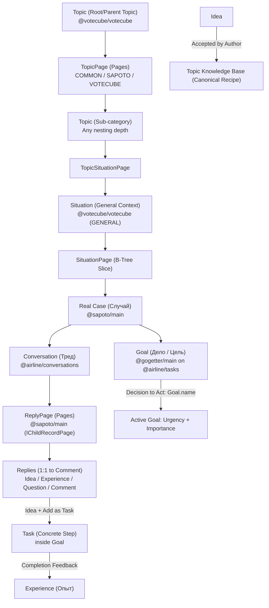

# Sapoto.net Architecture & Functional Specification (Complete)

## 1. Executive Summary & Vision

**Sapoto.net** (*"Забота"*, from Japanese *サポート* "support/care" and Spanish *sapo* "leapfrog") is a decentralized social troubleshooting and peer-support network.

Sapoto forms a core trifecta of system applications within the **Data Independence Network (DIN)** alongside **КубГолоса (Votecube)** and **Деловой (GoGetter)**:
1. **Sapoto («Забота»)**: Formulation of Situations, Ideas, Experiences, and Community consensus.
2. **Votecube («КубГолоса»)**: Multi-dimensional decision-making engine across 3 user-selected factors.
3. **GoGetter («Деловой»)**: Task management and personal action execution, closing the empirical feedback loop.

---

## 2. Core Domain Hierarchy

---

## 3. The 4 Reply Modalities & Feedback Loop

### 3.1. Comparison Matrix
| Dimension | Idea (`isIdea`) | Experience (`isExperience`) | Question (`isQuestion`) | Comment |
| :--- | :--- | :--- | :--- | :--- |
| **Nature** | **Prescriptive**: *"What you should do"* | **Descriptive / Empirical**: *"What actually happened"* | **Interrogative**: *"Missing context"* | **Discursive**: General talk |
| **Evaluation** | **Votecube Consensus & Assent** | **Peer Up/Down Ratings** | Author usefulness mark | Community reactions |
| **Eisenhower** | **Urgency vs. Priority** (1–5) | Reality outcome & credibility | Problem criticality | None |
| **Structure** | **Reason Tree** (linguistic grammar) | Text + **Speak** (audio) & **Show** (video) | 8 standard question types | Free text |
| **Actions** | **Reason About** & **Add as Task** | Evidence for/against Ideas | Provide clarification | Reply |

### 3.2. Hybrid Experience-Idea Linking
1. **As verification of an Idea** (via `parentReply`): Attaches to an Idea card as an independent Experience record (`Write-Self` invariant). The Experience count and Outcome Scale are dynamically aggregated on the Leaf (via local SQL) and Branch (via in-memory Counters), without mutating the author's original Idea entity.
2. **As root background of a Situation**: Documents what the author or participant already attempted before any ideas were suggested.

### 3.3. Situation Resolution & Knowledge Base
- When an Idea works in practice, the situation author marks it as **Resolved**.
- The triad *(Situation + Accepted Idea + Verified Experiences)* becomes a canonical **"Recipe" (Best Practice)** in the topic index.
- The thread remains open for new alternative approaches.

### 3.4. Question Lifecycle & Context Enrichment
- **8 Question Markers**: *What*, *Which*, *Who*, *Where*, *Why*, *When*, *How*, *Whose*.
- When the author answers a Question, it transitions to **«Answered»**, and the key clarifying data is automatically pinned into the **«Refined Situation Context»** block, eliminating duplicate questions and aiding Idea proposers.

### 3.5. Multimodal Experience: «Speak» (Audio) & «Show» (Video)
- Captured via browser HTML5 `MediaStream` and `MediaRecorder` API without plugins.
- Raw media stored in the decentralized AIRport branch blob store.
- **On-Device Speech-to-Text**: Transcription runs locally on the device (Web Speech API / Wasm), enabling instant full-text search and privacy-preserving reading.

---

## 4. Votecube (КубГолоса) Mechanics & Multi-Scale Consensus

### 4.1. 3-Factor Geometry & Pro/Contra Analysis
- Each human decision is modeled across 3 axes ($X, Y, Z$) with bipolar orientations (+1 «For» / -1 «Against»).
- **Balanced Pro & Contra**: Reasons can be positive benefits (`isPositiveOutcome = true`) or risks/side effects (`isPositiveOutcome = false`). Users can map both pros and contras onto the 3 axes of the Cube to determine whether benefits outweigh risks.
- **Two-Tier Voting UX**:
  - *Tier 1 (1-Click Quick Vote)*: ~90% of users vote in 1 click, agreeing with the community's canonical Top-3 reasons with standard default weight distribution (e.g. 50/30/20).
  - *Tier 2 (Deep Cube Calibration)*: Thoughtful users and experts open the 3D-Cube modal, reorder or crowdsource reasons, select any 3 factors, and calibrate weights (100 bp total) via interactive 3D rotation or 3 card sliders.
- **Dynamic Top-3 Accumulation**: Individual reason shares accumulate across all cubes; the top-weighted 3 reasons form the canonical community Top-3.

### 4.2. Synthetic 3D-Cube Visualization & 3 Projections
- **Synthetic Default**: The 3D Cube (thumbnail and modal) displays the combined Bayesian consensus vector synthesizing Outcome, Experts, and Public.
- **Perspective Toggle**: In the voting modal, users can switch the 3D projection between:
  1. *Outcome (Результат)*: Empirical consensus confirmed by real-world Experiences.
  2. *Experts (Эксперты)*: Consensus weighted by topic reputation scores ($W_{\text{reputation}}$).
  3. *Public (Народ)*: Direct democratic equality ($1 \text{ user} = 1 \text{ vote} = 100 \text{ bp}$).

### 4.3. Empirical Bayesian Consensus Formula (Empirical Priority Principle)
Overall truth probability $P(\text{Truth})$ dynamically prioritizes verified empirical data over theoretical deliberation:
$$P(\text{Truth}) = (1 - W_{\text{outcome}}(n)) \cdot (w_e \cdot \text{Experts} + w_p \cdot \text{Public}) + W_{\text{outcome}}(n) \cdot \text{Outcome}$$
where:
- $W_{\text{outcome}}(n) = W_{\text{max}} \cdot \frac{n}{n + k}$ scales asymptotically up to 70–80% as verified Experience count $n$ grows ($k \approx 3$).
- At hypothesis stage ($n=0$), deliberation in Votecube (Experts + Public) governs.
- At empirical maturity ($n \ge 5..10$), practical outcomes dominate over speculative votes, preventing popular but ineffective fallacies.

### 4.4. Empirical Feedback Loop (Experiences $\rightarrow$ Votecube Reasons)
- When submitting an Experience, the author performs a **structured validation of the Idea's reasons** (+1: worked, 0: neutral, -1: contradicted in practice).
- This directly populates the empirical **Outcome Scale** for each reason, instantly adjusting the collective consensus.

### 4.5. Author Seed Vote (Cold-Start Resolution)
- Publishing a new Idea automatically creates the author's initial `Agreement` in Votecube, mapping the author's 1–3 reasons to axes X, Y, Z with baseline shares (e.g. 50/30/20) and polarity $+1$.
- The 3D-Cube is never blank; a live, beautifully balanced 3D model is active immediately.

#### 4.6. Entity DDL Architecture & Unidirectional Schema Hierarchy
- **Strict Dependency Hierarchy**:
  $$\text{КубГолоса (VoteCube)} \longleftarrow \text{Забота (Sapoto)} \longleftarrow \text{Деловой (GoGetter)}$$
- **`Topic` & Pages (`@votecube/votecube`)**: Universal hierarchical category tree (`parentTopic`). Replaces obsolete Theme, SubTheme, and SubTopic. Scaled via Self-Sealing Pages (`TopicPage` with types `COMMON`, `SAPOTO`, `VOTECUBE`, and `TopicSituationPage`).
- **`Situation` (`@votecube/votecube`)**: General problem context or scenario (`type: Situation_Type`: `GENERAL = 1` for abstract problems and `SPECIFIC = 2`). Scaled via `SituationPage`.
- **`Case` (Real Case in `@sapoto/main`)**: Composite core entity of Sapoto. Holds references to `topic: Topic`, `situation?: Situation`, `conversation: Conversation` (`@airline/conversations`), and `question?: Question` (`@votecube/votecube`). (`@sapoto/core` is completely obsolete).
- **`Reply` & `ReplyPage` (`@sapoto/main`)**: `Reply` links 1:1 to `Comment` from `@airline/conversations`. `ReplyPage` implements `IChildRecordPage`, partitioning message replies into bounded page repositories (~1000 items) to prevent thread bloat.
- **`Idea` & `SituationIdea`**: Universal `Idea` can be reused from the global topic catalog (`IdeaTopic`), while `SituationIdea` encapsulates the localized decision consensus, urgency/priority ratings, and reason weights within that specific Situation.
- **`Reason` = `Factor` + `Position`**. `AgreementIdeaReason` stores individual user basis points (0–100 bp) per reason.
- **Recursive / Fractal Voting**: Individual Reasons can themselves be evaluated via a nested Votecube vote; invalidated reasons drop to 0 weight and receive a *"Disputed by Community"* badge.

### 4.7. Server Architecture: Decentralized 1:N Partitioning via Pages (`IChildRecordPage`) & Branch Topology
- **Absence of Traditional Application Servers**:
  - In DIN and Turbaza, **there is no traditional monolithic or backend application server**.
  - **Leaves (user devices)** receive changesets / transaction log deltas (WAL deltas) from repositories and merge them directly into their **own local relational database (SQLite / AIRport WASM)**. 100% of data queries, filtering, and UI rendering execute locally on the device.
- **Branch and Bough Gateways with Adaptive Tree-Based Partitioning**:
  - Branches (municipal) and Boughs (cooperative) are **not application servers**, but high-throughput data and coordination gateways (Zero-Rendering Gateways).
  - With VoteCube and Sapoto, these gateways acquire **specialized coordination functions for shared information**, partitioning it using **different tree-based methods tailored to the specific type of information**:
    1. *Page Trees (`IChildRecordPage`)*: Partitioning unbounded 1:N relations (discussion threads `ReplyPage`, case collections, situation catalogs) into self-sealing, immutable B-tree slices (~1000 items).
    2. *Category and Topic Trees*: Deep hierarchical topic categorization with **Upstream Category Processing** on cooperative branch nodes.
    3. *In-Memory Rollup Counters & Epoch Blocks*: High-speed aggregation of votes, quotas, and 3D factor vectors in gateway RAM without disk contention.
    4. *Territorial Trees*: Geographic hierarchy (District $\to$ City $\to$ Region $\to$ Root) for localized cases and physical peer support.
- **External Search Engine Integration**:
  - Authorized streaming feeds (JSON-LD Push Stream) to external search engines (e.g. Yandex) provide efficient discovery across public decentralized slices.
  - Search engines guide users to specific topics or cases, after which the Leaf fetches the target repository change log through the branch gateway directly into its local relational DB.
- **Hybrid Routing via PassThroughConnection (Territory + Category)**:
  - When searching for cases in a specific topic and district, the Leaf routes categorical requests through the territorial branch via **PassThroughConnection** (shielded mTLS ingress) while querying district cases directly from the territorial branch.
  - Intersection and joins execute **directly in the Leaf's local relational database (SQLite / AIRport WASM)** via fast `INTERSECT` / `JOIN` operations, eliminating redundant proxying and caching on branch gateways while protecting categorical servers from direct internet DDoS exposure.
- **Cryptographic Repository Addressing on Write & Chronological Read Context**:
  - In Turbaza, every write delta is cryptographically signed by the Leaf's `ActorId` strictly for a specific `RepositoryId`. While the Leaf does not calculate page thresholds (~1000 items) or self-sealing logic (managed by the Branch gateway sequencer), the Leaf explicitly addresses and signs deltas targeting the currently active page repository (`currentActivePageRepoId`) advertised by the Branch.
  - The concept of Pages (`IChildRecordPage`) serves both as the target of append-only writes and as an immutable CAS cache abstraction for chronological reading of threads and collections.
- **Zero-Rendering Headless Gateways**:
  - Branch servers **never render HTML, components, or UI graphics**. They operate strictly as headless coordination, data routing, and cryptographic validation gateways.
  - 100% of UI rendering (3D-Cube, topic trees, situation cards, Eisenhower matrices) is executed on Leaf client devices (browsers, mobile apps) via local engines/WASM/WebGPU.
- **Dual Branch Hierarchy (Territorial vs Categorical)**:
  1. *Territorial Sovereign Branches*: Follow administrative-territorial boundaries (Root $\to$ Region $\to$ City $\to$ Municipal District). Handle Ingress, mTLS data pipelines, ZKP residency validation, and district-scoped Cases/Situations.
  2. *Categorical Branches of Platform Cooperatives*: Unlocalized hierarchical Topic/Category tree. **Upstream category processing**: requests for parent categories flow upstream through the cooperative branch tree, where they are aggregated and cached on parent nodes.
- **Why Unbounded 1:N Fails in Decentralized P2P Repositories**:
  - In AIRport / Turbaza, the Repository is the atomic unit of storage, synchronization, access control, and cryptographic history.
  - Direct 1:N relations inside a single repository cause it to bloat to gigabytes, causing mobile initial sync to fail, merge collisions during concurrent writes, and cache destruction.
- **Self-Sealing Pages (`IChildRecordPage`)**:
  - Each Page (`TopicPage`, `TopicSituationPage`, `SituationPage`, `ReplyPage`) is an independent AIRport repository chunked to ~1000 items.
  - When filled, a page is sealed (`isSealed: true`), becoming immutable and permanently cached (`Cache-Control: immutable`). Subsequent writes spawn child pages (`childPages`), forming a self-sealing B-tree.
- **Branch Tree Topology as Append-Only Sequencer**:
  - Topics, Situations, and Cases are mapped to the Turbaza branch hierarchy.
  - Each Branch manages its assigned topics/situations, maintaining the active page pointer and coordinating page transitions.
- **Tag Indexing & Private Storage**:
  - Two-tier tag search: Local Trie/FTS index on the Branch for instant auto-complete + `TagPage` repositories in AIRport for sovereign P2P replication.
  - Private/family repositories operate as a single E2EE repository without public page chunking or branch indexing.
- **Third-Party Extensibility**:
  - Any 3rd-party system can implement `IChildRecordPage` to connect dedicated compute nodes and thematic trees to local branches.
- **Common Platform Code & Primitive Evolution (Pages & Counters)**:
  - Local sovereign branches run a **common platform runtime** (Turbaza / AIRport kernel).
  - This common code coordinates with **Sapoto** via **Pages** (`IChildRecordPage`) for scaling 1:N trees and conversation threads, and with **Votecube** via **Counters** (in-memory accumulators, quota rate-limiting, and epoch snapshots).
  - **Graduation to Platform Layer**: While Pages and Counters are currently prototyped and validated within Sapoto and Votecube, they will ultimately be graduated to core platform primitives. All subsequent applications (GoGetter, Urarun, and third-party tools) will natively consume these branch primitives.
- **CAS Immutability & No Compaction**:
  - Sealed pages remain an immutable archive forever in Content-Addressable Storage (CAS) without compaction, guaranteeing cryptographic integrity and 0-byte repeated traffic.
- **Offline-First & Local Mesh Mutual Aid (Blackout Resilience)**:
  - During internet outages, emergencies, or in rural areas without cellular coverage, Leaves form local peer-to-peer (P2P) Wi-Fi/Bluetooth mesh networks or connect through a local neighborhood micro-branch.
  - Citizens can continuously publish Cases, share life-saving Experiences, and coordinate local relief tasks.
  - Upon reconnection to the municipal Branch and Trunk, all local WAL deltas seamlessly reconcile via CRDT merge without data loss.
- **TreeSearch & Edge SLM In-Flight Deduplication**:
  - To prevent community effort from fragmenting across duplicate issues, an On-Device Small Language Model (SLM) generates semantic embeddings as the author types a Case or Situation.
  - The Leaf queries the local Branch Trie index (TreeSearch), suggesting: *"A similar case (87% match) was published in your district. Join this thread instead?"*, reducing duplication by 60–80%.
- **Zero-PII On-Device & Branch SLM AI**:
  - Lightweight Small Language Models assist users directly on their devices or local municipal branches (automatic topic matching, context fact extraction, and duplicate prevention) with zero external data leakage.

---

## 5. Reputation System («Токеномика заботы»)

1. **Expertise Points**:
   - **Idea Author**: Largest allocation upon idea verification.
   - **Agreeing Voters**: Earn secondary points for early identification of correct ideas or reasons.
2. **Good Citizen Points**:
   - Earned through active participation, formulating situations, and caring for others.

---

## 6. Municipal Branching & Geographic Visibility

- **DIN-Identity Residency Verification**: Protects against bots and DDOS attacks.
- **Two-Tier Visibility**:
   - *Global Tier*: General human topics (parenting, psychology, health).
   - *Municipal Tier*: Environmental, practical, and local issues scoped to city/county branches.

### 6.1. Platform Cooperatives & Shared Public Trees
- **Deep Category Hierarchy**: Global themes are structured as deep hierarchical trees of sub-categories and branches.
- **Cooperative Governance & Monetization**: Platform cooperatives (or legal entities depending on country/jurisdiction) maintain these public shared branches and earn a portion of revenue from advertising and subscriptions.
- **Infrastructure Services (Sync & Indexing)**: Cooperative server capacities provide distributed data synchronization and global indexing across all system and 3rd-party applications where private (personal or group) branches are not required.
- **Non-Sovereign Commercial Cooperative Branches (Future Status)**: These branches are operated mostly by businesses. A key challenge is operational accountability (who is accountable for keeping them running). The exact operational mechanisms of non-sovereign branch systems are intentionally designated for future design once sufficient real-world data is available.

### 6.2. Privacy, Anonymous Masks & Three-Tier Sybil Resistance
- **AIRport Actor Definition**: An `Actor` is strictly defined as: *a given user, using a particular application on a given device* (`(RepositoryId, ActorId, ActorRecordId)`).
- **Verification Without De-anonymization (ZKP Residency Proof)**: Users cryptographically verify residency in their municipal branch via DIN sovereign identity without exposing private credentials.
- **Thread-Scoped Ephemeral Key Pairs**:
  - When publishing sensitive situations or experiences, the Leaf generates an ephemeral key pair (`ephemeral ActorId`) that remains valid **for the scope of that specific Case/thread**.
  - This allows the author to consistently interact as "Author" within the thread, answering clarifying questions, while remaining completely anonymous to external peers.
  - Validated by Zero-Knowledge Proof (ZKP) verifying municipal branch residency.
  - **Reputation Preservation**: Accrued reputation is preserved via encrypted reputation tokens that can be credited to the author's master profile without compromising anonymity.
- **Three-Tier Sybil Resistance**:
  1. *Cryptographic Locality Gate (ZKP)*: Only verified municipal residents can initiate district-scoped Cases or cast local votes; external bot-nets lack the necessary localized credentials.
  2. *Branch Rate Limiting*: Hardware rate-limits on incoming WAL deltas isolate and silence flooding attacks per mTLS session.
  3. *Bayesian Multi-Scale Filtering*: Fabricated accounts cannot manipulate the Outcome Scale (requires verified empirical Experiences) or Expert Scale (requires topic reputation).

### 6.3. Next-Gen DIN Ad-Tech, User Revenue Share & Capacity Renters Split (CBR Whitepaper 06)
- **Ethical Contextual Ads & Subscriptions**: Direct contextual placement based on branch/topic topics; subscriptions for ad removal and premium expert services.
- **Parametric Demographic Profile**: Users can voluntarily specify non-identifiable demographic attributes (age bracket, family status, occupation).
- **User Revenue Share**: The fuller the anonymous profile, the higher the user's direct percentage share of advertising revenue (from 0% up to maximum tier).
- **Deterministic FSM Smart Contract `share(...)` (Whitepaper 06, Section 4.3)**:
  - Ad revenues and subscriptions are split deterministically via an O(1) FSM state machine:
    $$\text{share}(w_1, \text{Citizen}, \; w_2, \text{HostPortal}, \; w_3, \text{SoftwareTree}, \; w_4, \text{CapacityRenters})$$
  - **Guaranteed Capacity Renters Split**: A dedicated, guaranteed share is directly allocated to **server capacity renters / branch node operators** (арендаторам мощностей), ensuring sustainable funding for servers, mTLS ingress, and CAS-caching of sealed pages without data harvesting.
  - **Host Portal Embedding Royalties**: Third-party portals, blogs, and community forums that embed `<sapoto-widget>` automatically receive a direct share ($w_2$) of ad revenue, incentivizing organic platform distribution.
- **Network Anonymization & On-Device AI**: Municipal branch nodes anonymize user IP addresses when querying encrypted ad networks. Alternatively, local **On-Device AI** matches relevant ads using hierarchical tree-based ad indices without data ever leaving the user's device.

### 6.4. Two-Tier Decentralized Content Moderation
- **Cooperative Tier**: Cooperatives moderate their public branch trees in compliance with local legal requirements of their jurisdiction.
- **Community Reputation Tier**: The community flags abusive, toxic, or dangerous content; threshold accumulation from high-reputation members automatically demotes or hides content.

### 6.5. 152-ФЗ Compliance & Self-Custody Zero-PII
- **Self-Custody Health & Family Data**: In mutual aid, users often discuss sensitive health, eldercare, and family challenges. All sensitive narrative data is stored **strictly on the user's Leaf device** in an encrypted SQLite database.
- **Zero-PII Gateway Topology**: Branch gateways only route encrypted deltas and anonymized ZKP proofs; they never hold unencrypted medical or personal dossiers.
- **Immunity from Operator Liability**: Municipalities, healthcare co-ops, and neighborhood groups hosting Branch nodes are **legally exempt from 152-ФЗ Operator status and data breach liability**, as user devices maintain exclusive self-custody over all personal records.

---

## 7. Integration with GoGetter («Деловой»)

### 7.1. «Goal» (Дело) Lifecycle & Case Relationship
- **Potential Goal on Case Creation**: Publishing a Real Case (`Case` in `@sapoto/main`) creates an associated potential **Goal (`Goal` in `@gogetter/main` on `@airline/tasks`)**.
- **Community Urgency & Priority Rating**: The community rates the urgency and importance of the potential Goal (answering: *should this Case become a Goal or not?*).
- **UI Presentation**: Until the user decides what to do, the UI displays the **Case title** and the **Urgency/Priority** of the potential Goal.
- **Goal Activation**: When the user decides to act, they formulate the specific `Goal.name`.
- **«Add as Task» Workflow**: Clicking «Add as Task» on an accepted Idea creates a concrete **`Task`** inside this `Goal` with calendar reminders.
- **Feedback Loop**: Upon Task completion, GoGetter calls the Sapoto API to prompt the user to publish an **Experience**, closing the verification loop.

### 7.2. Two-Tier Eisenhower Matrix & Task Auto-Classification
- **Goal Level (`Goal.urgency + Goal.importance`)**: Defines the overall severity of the problem in the community stream.
- **Idea Level (`SituationIdea: urgencyTotal + priorityTotal`)**: Collective participant ratings from Votecube evaluate the nature of this specific recommendation (emergency first-aid vs long-term systemic habit).
- **GoGetter Auto-Slotting**: Importing an Idea via «Add as Task» automatically positions the action item into the appropriate quadrant of the GoGetter task manager:
  - *Q1 (Urgent & Important / Do First)*: Immediate practical steps scheduled for today.
  - *Q2 (Important & Not Urgent / Schedule)*: Systemic regimens that automatically reserve recurring calendar blocks.
  - *Q3 (Urgent & Not Important / Quick Wins)*: Fast tips and quick-hit actions.
  - *Q4 (Not Urgent & Not Important / Backlog)*: Exploratory concepts.

---

## 8. Strategic Roadmap

### 8.1. Phase 1 (Unified Single-Bundle Application Demo)
- **4-Tab Unified Navigation**:
  1. *Tab 1: «Забота» (Sapoto)* — Category hierarchy, situation stream with Eisenhower filtering, Idea cards, Experience narrative («Speak» / «Show»), and Question threads.
  2. *Tab 2: «Деловой» (GoGetter)* — Personal task organizer with auto-slotted Eisenhower quadrants (Q1–Q4) from «Add as Task», calendar scheduling, and task completion loop.
  3. *Tab 3: «КубГолоса» (Votecube)* — Consensus observatory, disputed reasons showcase, and interactive 3D-Cube laboratory with 3-perspective switching (Outcome / Experts / Public).
  4. *Tab 4: «Профиль / DIN» (Identity & Economics)* — Municipal branch residency verification, expert and good citizen points balance, anonymous persona toggle, and accumulated demographic ad revenue share.
- End-to-end user journey validation from initial problem formulation to task execution and empirical experience verification.

### 8.2. Phase 2 (Target Modular Architecture)
- Full rewrite of embedded modules in modern **Svelte 5** packaged as universal **Web Components (Custom Elements)**: `<votecube-widget>`, `<sapoto-widget>`, `<gogetter-widget>`, ready for zero-overhead embedding into any host platform across the DIN ecosystem.

### 8.3. UI Modularity, Atomic Primitives & Applied Domains (Urarun / UraTour)
- **Data vs. UI Layer Asymmetry**:
  - *Data/Schema Layer*: Strict unidirectional hierarchy: $\text{VoteCube} \longleftarrow \text{Sapoto} \longleftarrow \text{GoGetter}$.
  - *UI/Presentation Layer*: Completely decoupled atomic primitives (micro-widgets):
    - *VoteCube primitives*: `<votecube-miniature>`, `<votecube-modal>`, `<votecube-divergent-barchart>`, `<votecube-factor-card>`.
    - *Sapoto primitives*: `<sapoto-situation-card>`, `<sapoto-thread>`, `<sapoto-media-recorder>` («Speak»/«Show»), `<sapoto-question-chips>`, `<sapoto-refined-context>`.
    - *GoGetter primitives*: `<gogetter-task-list>`, `<gogetter-eisenhower-grid>`, `<gogetter-calendar-slot>`, `<gogetter-complete-dialog>`.
- **Applied Integration (e.g. «УраРан» / «УраТур» - Urarun)**:
  - Applied field mission apps assemble these primitives: VoteCube express situation assessment (group goal, tactical safety, physical readiness) + Sapoto field issues & multimodal audio/video logs («Speak»/«Show») + GoGetter checkpoint checklists & Eisenhower real-time prioritization.

