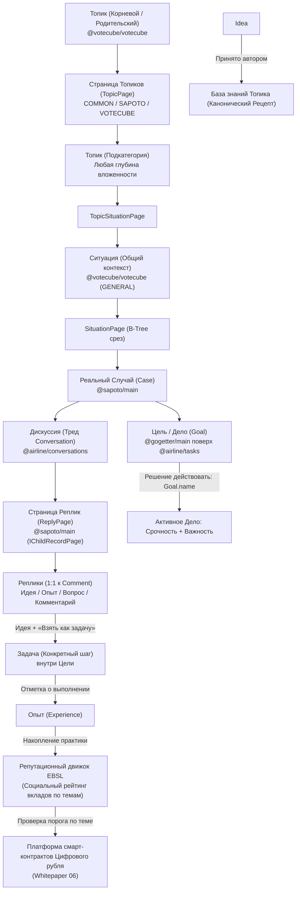
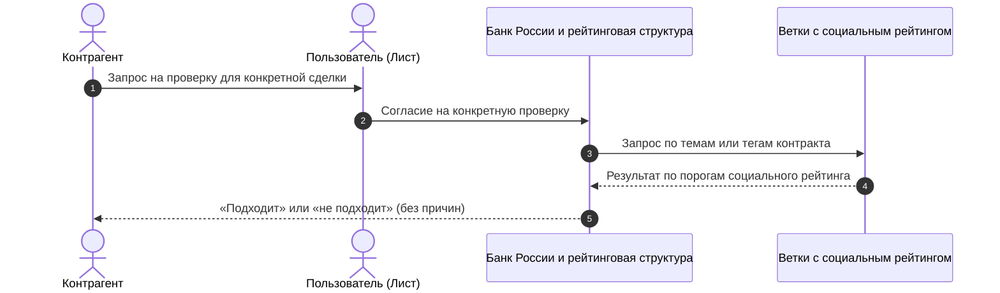

# Архитектура и функциональная спецификация платформы Sapoto.net («Забота»)

*Классификация: Нормативная архитектурно-функциональная спецификация прикладного уровня, Data Independence Network (DIN)*  
*Концептуальный автор платформы и архитектор: Артём Владимирович Шамсутдинов*  
*Связанные нормативные спецификации: [`Sapoto_Reputation_and_Credit_System_Specification.md`](Sapoto_Reputation_and_Credit_System_Specification.md), [`Sapoto_Ecosystem_Impact_Guide.md`](Sapoto_Ecosystem_Impact_Guide.md), [`VoteCube_architecture_and_functionality.md`](../votecube/VoteCube_architecture_and_functionality.md)*

## 1. Концепция и ключевое назначение

**Sapoto.net** (*«Забота»*, от японского *サポート* — «поддержка/забота») — это децентрализованная социальная сеть взаимопомощи, обмена проверенным жизненным опытом, формирования децентрализованной репутации и коллективного решения проблем на местах.

«Забота» формирует базовую триаду системных приложений платформы **«Турбаза»** (Сети Независимости Данных — Data Independence Network, DIN) наряду с **«КубГолосом» (VoteCube)** и **«Деловым» (GoGetter)**:
1. **«Забота» (Sapoto)**: фиксация жизненных Ситуаций и Случаев, генерация Идей, подтверждение Опытом, выработка сквозной децентрализованной репутации и формирование общественного консенсуса.
2. **«КубГолос» (VoteCube)**: механизм многомерного 3D-волеизъявления и принятия решений по трем настраиваемым пользователями факторам (подробная спецификация — в [VoteCube Architecture & Functionality](../votecube/VoteCube_architecture_and_functionality.md)).
3. **«Деловой» (GoGetter)**: управление задачами, поручениями и практическими действиями, замыкающее цикл эмпирической обратной связи и наполняющее репутационный капитал.

---

## 2. Каноническая иерархия предметной области


```mermaid
graph TD
    TopicParent["Топик (Корневой / Родительский)<br/>@votecube/votecube"] --> TopicPage["Страница Топиков (TopicPage)<br/>COMMON / SAPOTO / VOTECUBE"]
    TopicPage --> TopicChild["Топик (Подкатегория)<br/>Любая глубина вложенности"]
    TopicChild --> TopicSitPage["TopicSituationPage"]
    TopicSitPage --> Situation["Ситуация (Общий контекст)<br/>@votecube/votecube (GENERAL)"]
    Situation --> SituationPage["SituationPage (B-Tree срез)"]
    SituationPage --> Case["Реальный Случай (Case)<br/>@sapoto/main"]
    Case --> Conv["Дискуссия (Тред Conversation)<br/>@airline/conversations"]
    Conv --> ReplyPage["Страница Реплик (ReplyPage)<br/>@sapoto/main (IChildRecordPage)"]
    ReplyPage --> Reply["Реплики (1:1 к Comment)<br/>Идея / Опыт / Вопрос / Комментарий"]
    Case --> Goal["Цель / Дело (Goal)<br/>@gogetter/main поверх @airline/tasks"]
    Goal -->|Решение действовать: Goal.name| GoalActive["Активное Дело: Срочность + Важность"]
    Reply -->|Идея + «Взять как задачу»| Task["Задача (Конкретный шаг)<br/>внутри Цели"]
    Task -->|Отметка о выполнении| ReplyExp["Опыт (Experience)"]
    Idea -->|Принято автором| KB["База знаний Топика (Канонический Рецепт)"]
    ReplyExp -->|Накопление практики| RepEngine["Репутационный движок EBSL<br/>(Социальный рейтинг вкладов по темам)"]
    RepEngine -->|Проверка порога по теме| FSM["Платформа смарт-контрактов Цифрового рубля<br/>(Whitepaper 06)"]
```

---

## 3. Четыре модальности реплик и цикл обратной связи

### 3.1. Сравнительная матрица реплик
| Измерение | Идея (`isIdea`) | Опыт (`isExperience`) | Вопрос (`isQuestion`) | Комментарий |
| :--- | :--- | :--- | :--- | :--- |
| **Природа** | **Предписывающая**: *«Что следует сделать»* | **Описательная / Эмпирическая**: *«Что произошло на практике»* | **Вопросительная**: *«Недостающий контекст»* | **Дискурсивная**: общее обсуждение |
| **Оценка** | **Консенсус и Согласие в «КубГолосе»** | **Оценки подтверждения / опровержения (+1/-1)** | Отметка полезности автором | Реакции сообщества |
| **Матрица Эйзенхауэра** | **Срочность vs Важность** (1–5) | Реальный результат и достоверность | Критичность проблемы | Отсутствует |
| **Структура** | **Дерево причин** (грамматика факторов) | Текст + **«Голос»** (аудио) и **«Показ»** (видео) | 8 стандартных маркеров вопросов | Свободный текст |
| **Действия** | **«Обосновать в Кубе»** и **«Взять как задачу»** | Подтверждение или опровержение Идей | Уточнение контекста | Ответ в тред |
| **Влияние на репутацию** | Баллы проницательности и авторства | Эмпирический базис надежности ($r, s$) | Гражданская активность | Не влияет |

### 3.2. Гибридная связь «Опыт — Идея»
1. **Как верификация Идеи** (через `parentReply`): прикрепляется к карточке Идеи как независимая запись Опыта (в соответствии с архитектурным инвариантом «пиши только своё»). Количество записей Опыта и Шкала Результата динамически агрегируются на Листе (через локальный реляционный SQL-движок) и на Ветке (через счетчики в оперативной памяти), не мутируя исходную сущность Идеи автора.
2. **Как исходный контекст Ситуации**: документирует, что автор или участник уже предприняли до того, как были предложены какие-либо идеи.

### 3.3. Разрешение Ситуации и База знаний
- Когда предложенная Идея успешно решает проблему на практике, автор ситуации переводит её в статус **«Решена» (Resolved)**.
- Триада *(Ситуация + Принятая Идея + Подтвержденный Опыт)* закрепляется в качестве канонического **«Рецепта» (Лучшей практики)** в предметном каталоге Топика.
- При этом тред обсуждения остается открытым для альтернативных и более эффективных подходов.

### 3.4. Жизненный цикл Вопроса и обогащение контекста
- **8 вопросительных маркеров**: *Что*, *Какой*, *Кто*, *Где*, *Почему*, *Когда*, *Как*, *Чей*.
- Когда автор отвечает на Вопрос, он переходит в статус **«Отвечен»**, а ключевые уточняющие факты автоматически закрепляются в блоке **«Уточненный контекст ситуации»**, исключая повторные расспросы и помогая авторам новых Идей.

### 3.5. Мультимодальный опыт: «Голос» («Speak», аудио) и «Показ» («Show», видео)
- Запись мультимедиа осуществляется через стандартные браузерные интерфейсы HTML5 `MediaStream` и `MediaRecorder` без необходимости установки сторонних плагинов.
- Исходные медиафайлы сохраняются в децентрализованном блоб-хранилище Веток платформы AIRport.
- **Локальное распознавание речи**: транскрипция аудио в текст выполняется непосредственно на устройстве пользователя (Web Speech API / WASM), обеспечивая мгновенный полнотекстовый поиск и приватное чтение без передачи голоса на внешние облачные серверы.

---

## 4. Интеграция с «КубГолосом» (VoteCube) и инфраструктура данных

### 4.1. Архитектурный мост «Забота — КубГолос»
«Забота» не дублирует механизм трехмерного волеизъявления, а использует «КубГолос» как внешний математический сервис консенсуса:
- **Ситуация и Случай**: абстрактная Ситуация (`Situation` в `@votecube/votecube`) объединяет через самозапечатывающиеся страницы множество частных Случаев (`Case` в `@sapoto/main`), привязанных к конкретным районам или семьям.
- **Обоснование Идей в 3D-Кубе**: любая Идея, выдвинутая в «Заботе», может быть направлена на калибровку в «КубГолос», где участники оценивают ее по 3 ключевым факторам в пространстве $X, Y, Z$.
- **Эмпирический цикл (Опыт $\to$ Шкала Результата)**: публикации Опыта (`isExperience`) в «Заботе» напрямую наполняют эмпирическую **Шкалу Результата (Outcome Scale)** в «КубГолосе», динамически сдвигая байесовский вектор консенсуса от умозрительных споров к проверенной практике.

> ℹ️ *Подробная математическая спецификация 3D-манипулятора, divergent-барчартов, DDL-схем `@votecube/votecube` и байесовской формулы вероятности истинности $P(\text{Truth})$ представлена в нормативном документе [VoteCube Architecture & Functionality](../votecube/VoteCube_architecture_and_functionality.md).*

### 4.2. DDL-спецификация сущностей «Заботы» (`@sapoto/main`)
```typescript
// Реальный Случай (составная конструкция)
@Entity()
export class Case extends AirEntity {
    @ManyToOne({ target: 'Topic' })
    topic: Topic;                     // Категория из @votecube/votecube

    @ManyToOne({ target: 'Situation' })
    situation?: Situation;           // Абстрактная ситуация из @votecube/votecube

    @OneToOne({ target: 'Conversation' })
    conversation: Conversation;       // Тред из @airline/conversations

    @ManyToOne({ target: 'Question' })
    question?: Question;             // Опциональный частный опрос ситуации
}

// Реплика в треде Случая
@Entity()
export class Reply extends AirEntity {
    @OneToOne({ target: 'Comment' })
    comment: Comment;                 // 1:1 к комментарию в @airline/conversations

    @ManyToOne({ target: 'ReplyPage' })
    replyPage: ReplyPage;             // Страница размещения реплики

    isIdea: boolean;                  // Модальность: Идея
    isExperience: boolean;            // Модальность: Опыт
    isQuestion: boolean;              // Модальность: Вопрос
    questionMarker?: QuestionMarker;  // Что, Где, Когда, Как и др.
    
    parentReply?: Reply;              // Ссылка на валидируемую Идею
}

// Самозапечатывающаяся страница реплик (IChildRecordPage)
@Entity()
export class ReplyPage extends AirEntity implements IChildRecordPage {
    @ManyToOne({ target: 'Case' })
    parent: Case;                     // Родительский случай

    recordsCount: number;             // Лимит ~1000 записей
    isSealed: boolean;                // Флаг неизменяемости
    childPages?: ReplyPage[];         // B-дерево вложенных страниц
}
```

### 4.3. Децентрализованное масштабирование через Страницы (`IChildRecordPage`) и Ветки
- **Отсутствие монолитных серверов**: как и во всей архитектуре DIN, Листья пользователей хранят данные в локальной СУБД (SQLite / WASM).
- **Треды реплик без раздувания**: связь 1:N между Случаем и Репликами разбивается на самозапечатывающиеся страницы `ReplyPage` объемом ~1000 элементов. По заполнении страница запечатывается (`isSealed = true`) и кэшируется как CAS-объект (`Cache-Control: immutable`).
- **Zero-Rendering Headless Gateways**: шлюзы Веток не рендерят HTML или интерфейс, выполняя исключительно координацию WAL-дельт, CAS-кэширование и mTLS-маршрутизацию.
- **TreeSearch и дедупликация на лету**: компактная нейросетевая модель на устройстве в момент набора текста сопоставляет формулировку с Trie-индексом локальной Ветки, предотвращая дублирование обращений на 60–80%.
- **Автономная ячеистая сеть**: при авариях и отключении интернета Листья координируются по прямой P2P-связи (Wi-Fi / Bluetooth mesh), гарантируя взаимопомощь на местах даже во время блэкаутов.

---

## 5. Система децентрализованной репутации («Автономная экономика доверия»)

Репутационная система «Заботы» — это **главное системообразующее ядро платформы**, предлагающее набор идей о децентрализованной, управляемой самими людьми репутации как дополнение к существующим системам кредитного скоринга и социального рейтинга. Каждый из этих подходов решает свои задачи и опирается на большую работу своих авторов; часть предлагаемых идей может пригодиться в разных ситуациях и в разных странах, хотя проектируются они для России.

> ℹ️ *Рейтингов два. **Социальный рейтинг** строится из индивидуальных вкладов человека (реплики, Идеи, Опыт, Дела), открыт и агрегируется по дереву Веток (раздел 5.3). **Экономический рейтинг** (кредитный) ведёт Банк России по результатам смарт-контрактов, он закрыт и выдаётся только с согласия пользователя на конкретную проверку (раздел 5.4). Единый общий балл человека по умолчанию не выводится. Разделы подробной спецификации о кредитной функции (потолок займа, залоги, ZK-аттестация, регуляторный мост, поручительство, ликвидность, банковская интеграция, партнёрское финансирование) описывают проектные предложения и входные данные для внешних рейтинговых структур и Банка России.*

> ℹ️ *Полная нормативная математическая и криптографическая спецификация с формулами объемно-взвешенной субъективной логики (VW-EBSL), ZK-нуллификаторами против одновременных дефолтов, защитой от Exit-Scam, протоколом децентрализованного суда присяжных (P2P Sortition Jury), транзитивными цепочками поручительства (Multi-Hop Transitive Trust) и межветвевыми пулами ликвидности касс взаимопомощи (ROSCA Inter-Branch Swaps) представлена в отдельном документе: [**`Sapoto_Reputation_and_Credit_System_Specification.md`**](Sapoto_Reputation_and_Credit_System_Specification.md).*

### 5.1. Архитектурные принципы и сопоставление моделей

Таблица сопоставляет характерные особенности подходов и не является оценкой их авторов.

| Параметр | Кредитные бюро и скоринг (FICO, НБКИ) | Системы социального рейтинга | Web3 DeFi скоринг | Репутационная система «Заботы» |
| :--- | :--- | :--- | :--- | :--- |
| **Управление** | Банки и кредитные бюро | Государство или оператор системы | Смарт-контракты L1/L2 | **Люди и сообщества; политику темы задаёт её оператор в рамках закона** |
| **Структура** | Одномерный балл (300–850) | Единый показатель доверия | Финансовый баланс кошелька | **Многомерный контекстный вектор** |
| **Приватность** | Централизованное хранение персональных данных | Централизованный сбор данных о поведении | Публичный граф транзакций | **Частная информация в частных хранилищах; публичны агрегаты вкладов по теме и имя при поимённой регистрации; экономический рейтинг закрыт** |
| **Базис оценки** | Платёжная дисциплина и долговая нагрузка | Соблюдение правил, поощрения и ограничения | Залоговое обеспечение (150%) | **Эмпирический Опыт, Дела и Контракты** |
| **Финансовая роль** | Банковские займы под процент | Доступ к услугам и льготам | Доступ к крипто-пулам | **Социальный рейтинг как дополнительный вход для проверок; экономический рейтинг ведёт Банк России** |

### 5.2. Математический аппарат: Evidence-Based Subjective Logic (EBSL)

Оценка надежности строится на математическом аппарате субъективной логики (Subjective Logic), оперирующей не бинарными вероятностями, а мерой эпистемической неопределенности.

#### 5.2.1. Кортеж субъективного мнения
Мнение наблюдателя $A$ о надежности участника $X$ в контексте предметного топика $T$ выражается кортежем:
$$\omega_A^X(T) = \big(b_A^X(T), \; d_A^X(T), \; u_A^X(T), \; a_A^X(T)\big)$$
где:
- $b$ (**Belief**) — степень уверенности в добросовестности / мастерстве ($b \in [0, 1]$);
- $d$ (**Disbelief**) — степень уверенности в недобросовестности ($d \in [0, 1]$);
- $u$ (**Uncertainty**) — мера нехватки эмпирических данных ($u \in (0, 1]$);
- $a$ (**Base Rate**) — базовая априорная вероятность при нулевых данных ($a \approx 0.5$);
- **Инвариант полноты**: $b + d + u = 1$.

Математическое ожидание репутационной надежности (Expected Trust Score):
$$E\big(\omega_A^X(T)\big) = b_A^X(T) + a_A^X(T) \cdot u_A^X(T)$$

#### 5.2.2. Преобразование эмпирических свидетельств (Evidence Mapping)
Репутация формируется исключительно на основе проверяемых жизненных исходов:
- $r$ (**Положительные свидетельства**):
  - Решенная Ситуация по Идее автора;
  - Подтвержденный сообществом практический Опыт (`isExperience`);
  - Успешно закрытая Задача / Дело (`Task` / `Goal` в «Деловом»);
  - Положительная добровольная оценка исполнителя участниками контракта в «КубГолосе» по темам и факторам (сам исход контракта учитывает экономический рейтинг, который ведёт Банк России).
- $s$ (**Отрицательные свидетельства**):
  - Опровергнутая практикой рекомендация;
  - Срыв срока или неисполнение взятой на себя Задачи;
  - Отрицательная добровольная оценка исполнителя участниками контракта; подтверждённый арбитражный вердикт.

Компоненты мнения вычисляются по формулам:
$$b = \frac{r}{r + s + W}, \quad d = \frac{s}{r + s + W}, \quad u = \frac{W}{r + s + W}$$
где $W = 2$ — эпистемический вес априорной неопределенности. При $r=0, s=0$ неопределенность $u=1$, а ожидание $E = 0.5$. По мере накопления фактов ($r + s \gg W$) неопределенность стремится к нулю, а оценка отражает реальную частоту добросовестности.

#### 5.2.3. Временной полураспад (Half-Life Memory Decay)
Для предотвращения пожизненной концентрации влияния («репутационной монархии») свидетельства затухают по экспоненциальному закону:
$$r(t) = r_0 \cdot e^{-\lambda \Delta t}, \quad s(t) = s_0 \cdot e^{-\lambda \Delta t}, \quad \lambda = \frac{\ln 2}{T_{1/2}}$$
- Для бытовой взаимопомощи: $T_{1/2} = 6 \text{ месяцев}$;
- Для кредитно-финансовой надежности: $T_{1/2} = 24 \text{ месяца}$.

#### 5.2.4. Транзитивное дисконтирование и слияние консенсуса
- **Дисконтирование доверия ($\otimes$)**: если $A$ доверяет поручителю $B$, а $B$ рекомендует исполнителя $C$:
  $$\omega_A^{B:C} = \omega_A^B \otimes \omega_B^C = \big(b_A^B b_B^C, \; b_A^B d_B^C, \; d_A^B + u_A^B + b_A^B u_B^C, \; a_B^C\big)$$
- **Слияние мнений ($\oplus$)**: независимые свидетельства от нескольких соседей объединяются оператором консенсуса Йёсанга, формируя локальный объективный консенсус без центрального сервера.

---

### 5.3. Социальный рейтинг вкладов: открытый, по темам

Социальный рейтинг — открытое «общественное лицо» пользователя в конкретных темах. Он строится на следующих принципах:

1. **Объект оценки — вклады, а не человек.** Оцениваются индивидуальные вклады: реплики, Идеи, Опыт, Вопросы, выполненные Дела. Вклады группируются по темам и могут иметь теги. Общий рейтинг человека не ведётся: в разных темах он разный. Единый балл по умолчанию не выводится ни Ветками, ни Стволом; допустимы срезы по теме, региону и тегу.
2. **Запись и агрегация.** Первичные записи лежат в хранилищах, где вклад сделан. Вклады оцениваются опросами «КубГолоса», тематические и географические Ветки агрегируют результаты вверх (подтема → тема → супертема → Ствол) и дублируют их в Ветви региона и Стволе страны. Благодаря этому любой пользователь может найти рейтинг, а приложения могут использовать его в контексте своих тем.
3. **Формулы агрегации (значения параметров по умолчанию, начальная калибровка).** Каждый оценивающий $i$ даёт позицию $s_i \in [-1, +1]$ и имеет вес $w_i$. Для вклада $c$:
   $$R_c = \sum_i w_i \frac{1 + s_i}{2}, \qquad S_c = \sum_i w_i \frac{1 - s_i}{2}$$
   Узел Ветки по регистрации автора и теме хранит накопленные суммы $R$ и $S$ по корзинам эпох; родительский узел складывает суммы дочерних (так же, как «КубГолос» суммирует ответы по Веткам). Затухание применяется при чтении. Показатель темы:
   $$E = \frac{R + a W}{R + S + W}, \qquad a = 0.5, \; W = 2$$
   Всегда публикуются два числа: $E$ и масса свидетельств $R + S$, чтобы единичный отзыв и сотня отзывов не выглядели одинаково.
4. **Связь с источником.** Агрегат на Ветке объединяет информацию на тематическом уровне и не хранит связей с отдельными хранилищами. Спуск до хранилищ возможен через агрегацию по тегам в режиме Листа: Лист получает страницы с главной информацией из хранилищ и выходит на сами хранилища. Это требует времени и ресурсов, поэтому выполняется на Листе. Теги также позволяют собрать личный срез по нескольким темам.
5. **Уровни регистрации и конвертация рейтинга.** Ветки знают регистрации авторов. Социальный рейтинг ведётся на всех режимах (полная и социальная анонимность, поимённый режим; см. раздел 6.1). Полностью анонимный пользователь может подключить кошелёк Банка России для участия в экономике, но набранный им полностью анонимный рейтинг остаётся за анонимным номером и не конвертируется (защита от рынка накрученных анонимных репутаций). Социально анонимный рейтинг, напротив, конвертируется в поимённый при добровольном открытии имени гражданином, поскольку за ним уже стояло надёжное подтверждение личности через единственный кошелёк Банка России.
6. **Политика оператора темы.** Публикацию негативных оценок, период затухания, параметры весов и наборы факторов оценки определяют оператор темы (кооператив, который держит Ветку или Ветвь темы, и (или) создатель сводника приложений) совместно с разработчиками приложений и пользователями. Если закон запрещает определённые виды негативных рейтингов, они не публикуются.
7. **Целостность и разрыв цикла «рейтинг взвешивает голоса, голоса формируют рейтинг».** Применяются четыре механизма: (1) голос эпохи $N$ взвешивается рейтингом голосующего, зафиксированным в блоке эпохи $N-1$; (2) масса мнений ограничена относительно внешних свидетельств (закрытое Дело, принятая Идея, подтверждённый Опыт, подписанный акт): $M_{\text{мн}}^{\text{эфф}} = \min(M_{\text{мн}}, \kappa M_{\text{вн}} + m_0)$; (3) вес голосующего растёт сублинейно с нижним порогом: $w_i = w_{\min} + (1 - w_{\min})\sqrt{b_i}$, где $b_i$ — доверие голосующего в теме треда; (4) самооценка исключена, взаимные оценки дисконтируются. Начальные значения: $\kappa = 1$, $m_0 = 2$, $w_{\min} = 0.1$, коэффициент дисконта взаимных оценок $0.5$; подлежат подбору симуляцией. Рядом с взвешенным результатом («Эксперты») показывается невзвешенный («Народ»).
8. **Вес голоса зависит от приложения.** В «Заботе» голосуют все участники треда, их собственный рейтинг влияет на результат; в «Деловом» голосуют только участники Дела; в тематических приложениях действуют их правила.
9. **Право ответа и разбор.** «Забота» позволяет людям и бизнесам отвечать на оценки. Разбор рейтинга позволяет от общей оценки по теме спуститься к общественным хранилищам, где оценка сделана, через приложения, в которых она сделана.
10. **Приватные рейтинги.** В семейных, групповых и бизнес-хранилищах возможны частные рейтинги. Обращение внешних служб (в том числе Банка России) к ним определяется законом и согласием сторон; в таких контурах нет системы контроля, как в общественных Ветках, и возникают риски утечек (например, многократный подбор порога проверки). Эти вопросы прорабатываются отдельно.
11. **Защита прав пользователя.** Права на публичный рейтинг и доступ к отдельным темам рейтинга требуют отдельной проработки по мере разработки системы рейтингов.

**Чем предлагаемый подход отличается от единого показателя доверия:**
- **Многомерность вместо единого показателя.** Гражданин обладает независимыми оценками в разных темах (например, $\text{Rep}_{\text{строительство}} = 0.92$, $\text{Rep}_{\text{педиатрия}} = 0.10$). Ошибки в одной сфере не разрушают статус в других.
- **Вклады, а не лояльность.** Оцениваются реальные дела и подтверждённый опыт, а не взгляды или образ жизни.
- **Право ответа и затухание.** Ошибки прошлого затухают со временем, а человек может ответить на оценку.
- **Защита от травли и сговоров.** Мнения участников, не имевших совместного подтверждённого Опыта с пользователем, получают $u \to 1$ и отсекаются алгоритмом; кольца взаимных оценок дисконтируются.
- **Частная информация остаётся в частных хранилищах.** Личные журналы дел и помощи хранятся на устройстве пользователя и не попадают на Ветки в открытом виде; публичными становятся агрегаты вкладов по теме и имя автора при поимённой регистрации (пользователь предупреждается об этом до регистрации). Юридическую оценку общественного контура с поимённой регистрацией подтверждают юристы.

---

### 5.4. Экономический рейтинг и интеграция с Цифровым рублем (Whitepaper 06)

Экономический (кредитный) рейтинг не рассчитывается ни «Заботой», ни платформой «Турбаза». Он вычисляется по результатам смарт-контрактов, в которых участвовал пользователь, в отдельной системе смарт-контрактов Банка России, без постороннего просмотра, и может использоваться как современный кредитный рейтинг только с согласия пользователя на действие, требующее проверки. Взаимодействие опирается на двухконтурную архитектуру, обоснованную в [Whitepaper 06](../../06_cbr_smart_contracts_fsm_whitepaper.md):
- **Внутренний расчётный контур**: платформа смарт-контрактов Банка России со сложностью $O(1)$ над переменными цифровых кошельков; на ней ведутся исходы контрактов и экономический рейтинг;
- **Внешний информационный контур**: платформа «Турбаза» и приложения «Забота» и «Деловой», где хранятся приватные контракты второго уровня и социальный рейтинг по темам.

Основные положения:
1. **Идентификация.** Участник контракта идентифицируется временной оболочкой, связанной с его кошельком в Банке России. Стороны не знают кошельков друг друга, но могут проверить, что оболочка связана с общественным идентификатором. Допустима социальная анонимность (раздел 6.1): участник остаётся неизвестным обществу и контрагентам, а его личность известна только Банку России.
2. **Рейтинговые структуры.** Банк России работает со структурами, которые выводят рейтинг по разрешённым законом методикам. Ответ контрагенту определяется законом: «подходит», «не подходит» без указания причины или иной допустимый вариант.
3. **Социальный рейтинг как дополнительный вход.** Чтобы учесть социальный рейтинг по теме, достаточно сообщить Банку России, что контракт будет по определённым темам или тегам: Банк России имеет выход на Ветки с социальным рейтингом. Типичное применение: контракт создаётся, если социальный рейтинг в теме и экономический рейтинг (с согласия пользователя) превышают пороги. Обратное использование экономического рейтинга в неэкономических темах, скорее всего, смысла не имеет (покажет практика).
4. **Приватные контуры.** Экономический рейтинг применим и к контрактам в частных хранилищах; ожидается, что большинство экономических дел будут частными, а дела по государственным контрактам, скорее всего, будут иметь общественную открытость. Параллельные частные структуры (банки, крупный бизнес) допускаются в рамках закона.
5. **Риски.** Многократные запросы «подходит / не подходит» с разными условиями позволяют вычислить значение порога («пробинг»); меры защиты (лимит проверок, журнал проверок для владельца, грубые ответы) прорабатываются отдельно с Банком России и юристами.


```mermaid
sequenceDiagram
    autonumber
    actor Counterparty as Контрагент
    actor User as Пользователь (Лист)
    participant CBR as Банк России и рейтинговая структура
    participant Branch as Ветки с социальным рейтингом

    Counterparty->>User: Запрос на проверку для конкретной сделки
    User->>CBR: Согласие на конкретную проверку
    CBR->>Branch: Запрос по темам или тегам контракта
    Branch-->>CBR: Результат по порогам социального рейтинга
    CBR-->>Counterparty: «Подходит» или «не подходит» (без причин)
```

Доказательства с нулевым разглашением остаются возможным инструментом там, где нужно подтвердить условие без раскрытия значения (например, резидентство или превышение порога); расчёт экономического рейтинга они не заменяют.

#### 5.4.1. Социальное поручительство через FSM-оболочки с несколькими подписями (проектное предложение)
Участники с высоким социальным рейтингом могут выступать поручителями для начинающих соседей; условия определяются контрактом первого уровня и Банком России:
- Поручитель подписывает контрактную оболочку, блокирующую гарантийный лимит в цифровых рублях;
- При успешном возврате займа поручитель получает микророялти по формуле `share(...)` (Whitepaper 06, раздел 4.3);
- В случае дефолта репутация поручителя дисконтируется, стимулируя осмотрительность.

---

### 5.5. Кросс-экосистемное распространение репутации «Заботы»

Репутационный капитал, сформированный в «Заботе», бесшовно транслируется на все компоненты платформы:
1. **«КубГолос» (VoteCube)**: определяет вес голоса участника в **Шкале Экспертов** ($W_{\text{reputation}}$) по рейтингу в теме, зафиксированному по эпохам (раздел 5.3).
2. **«Деловой» (GoGetter)**: задачи от авторитетных постановщиков получают приоритет при распределении поручений.
3. **«УраТур» (UraTour)**: верификация гидов, спасателей и инструкторов на базе подтвержденного видеоопыта («Show»).
4. **«Локальный реестр МСП и ЖКХ»**: рейтинг локальных мастеров (сантехников, электриков) по подтверждённому опыту, с механизмами, затрудняющими накрутку.
5. **Операторы Веток (Capacity Renters)**: надежность узлов оценивается по качеству маршрутизации и аптайму.

---

## 6. Муниципальные Ветки, конфиденциальность и безопасность

### 6.1. Регистрация на Ветке: виды анонимности и поимённый режим
Регистрация на Ветке определяет, что именно о пользователе известно в общественном контуре. Пользователь выбирает режим при регистрации; перед поимённой регистрацией платформа обязана ясно объяснить последствия (см. ниже).

**Два вида анонимности:**
1. **Полная анонимность.** Никто не знает, кто этот пользователь; известен только район, в котором он находится (Branch ID: случайный номер в локальной сети района). Вклады и рейтинг привязаны к этому номеру. Экономическая активность в этом режиме ограничена тем, что допускает закон и оператор.
2. **Социальная анонимность.** В общественном контуре человек не известен, но экономически известен: за такой регистрацией стоит реальный человек, потому что Банк России выдаёт один кошелёк на человека. Отсюда следует определённое экономическое, а вместе с ним и социальное доверие: при серьёзном нарушении личность может быть установлена в судебном порядке. Общество и контрагенты личность не видят; её знает только Банк России. Групповая анонимность (подтверждение района, группы или прав через доверенную группу соседей, жеребьёвка) относится к этому же виду и подтверждает принадлежность к группе без раскрытия личности.

**Поимённая регистрация.** Если пользователь регистрируется по имени, он тем самым автоматически помещает своё имя в общественный контур: имя связывается с его вкладами и рейтингом и становится видимым в общественных хранилищах и в индексах Веток. До регистрации приложение объясняет это отдельным экраном, и только после явного согласия пользователя регистрация завершается.

**Конвертация рейтинга и параллельные процессы регистрации.**
- **Разделение полностью анонимного и социально анонимного рейтингов:** Рейтинг, наработанный в режиме полной анонимности, не переносится в социально анонимный статус при привязке кошелька Банка России. Это предотвращает создание и продажу накрученных анонимных аккаунтов.
- **Конвертация социально анонимного рейтинга в поимённый:** Если гражданин, работавший под социально анонимным профилем (с кошельком Банка России), решает зарегистрироваться по имени, его накопленный рейтинг конвертируется в поимённый статус. Личность уже была подтверждена единственным кошельком Банка России, и продать такой профиль технически невозможно.
- **Параллельный социальный контур без экономики:** Пользователи, не заинтересованные в экономических контрактах, могут получить социальную анонимность и доверие сообщества через очные поручительства соседей или жеребьёвку без привязки кошелька. Разные структуры владеют разной информацией: Банк России удостоверяет личность без проверки адреса проживания, а районная Ветка и соседи удостоверяют факт проживания без доступа к счетам.

**Что знают Ветки.** Частная информация (личные журналы, семейные и групповые хранилища, приватные заметки) хранится в частных хранилищах и никогда не попадает на Ветки. Ветки индексируют только общественную информацию, пользуясь древовидными структурами платформы. На данный момент разрабатывается индексация тем и тегов, а также страниц тредов; в будущем возможны и другие виды индексации. Ветки знают регистрации авторов общественной информации в том объёме, который задаёт выбранный режим. Если пользователь выбрал поимённую регистрацию, Ветка знает имя в той же мере, в какой оно опубликовано в общественном контуре.

> ℹ️ *Техническое назначение сущности `Actor` (предотвращение коллизий параллельной синхронизации устройств) подробно рассмотрено в [VoteCube Architecture](../votecube/VoteCube_architecture_and_functionality.md); анонимность `Actor` не обеспечивает.*

### 6.2. Экономика Веток и детерминированное распределение прибыли `share(...)`
Финансирование инфраструктуры Веток осуществляется через детерминированный FSM смарт-контракт `share(...)` со сложностью $O(1)$:
$$\text{share}(w_1, \text{Citizen}, \; w_2, \text{HostPortal}, \; w_3, \text{SoftwareTree}, \; w_4, \text{CapacityRenters})$$
- Фиксированная доля дохода ($w_4$) направляется **арендаторам серверных мощностей (Capacity Renters)**, обеспечивая окупаемость шлюзов Веток и CAS-кэширования.
- Пользователи, добровольно заполнившие обезличенный демографический профиль, получают десятину ($w_1$) — 10% рекламного бюджета.

> ℹ️ *Полный математический вывод вектора Шепли и FSM-расчетов представлен в [Whitepaper 06, раздел 4.3](../06_cbr_smart_contracts_fsm_whitepaper.md).*

### 6.3. Соблюдение 152-ФЗ: частное остаётся частным, общественное индексируется
- Вся частная информация (данные о здоровье, семье и быте, личные журналы, семейные и групповые хранилища) хранится в частных хранилищах на Листе пользователя и никогда не попадает на Ветки.
- Ветки индексируют только общественную информацию: темы и теги, страницы тредов, а в будущем и другие виды индексации.
- Операторы Веток не становятся операторами персональных данных, поскольку не получают и не накапливают частной информации. Исключение составляет имя, которое пользователь сам помещает в общественный контур при поимённой регистрации: это общественная информация, а не частная, поэтому перед такой регистрацией пользователю объясняются последствия и берётся его явное согласие.
- Окончательную правовую квалификацию общественного контура с поимённой регистрацией подтверждают юристы.
---

## 7. Интеграция с приложением «Деловой» (GoGetter)

### 7.1. Жизненный цикл Цели («Goal») и связь со Случаем
- **Потенциальная Цель**: публикация Случая (`Case`) создает ассоциированную потенциальную Цель (`Goal` в `@gogetter/main`). Сообщество оценивает ее Срочность и Важность.
- **Активация Цели**: когда пользователь решает действовать, он формулирует имя `Goal.name`.
- **Сценарий «Взять как задачу»**: нажатие кнопки на карточке Идеи создает конкретную Задачу (`Task`) внутри Цели.
- **Замыкание цикла**: после завершения Задачи приложение предлагает пользователю опубликовать **Опыт**, замыкая цикл верификации решений и обновляя репутационные баллы $r$.

### 7.2. Двухуровневая матрица Эйзенхауэра
- **Уровень Цели (`Goal.urgency + Goal.importance`)**: определяет общую остроту проблемы в общественном потоке.
- **Уровень Идеи (`SituationIdea: urgencyTotal + priorityTotal`)**: оценки участников из «КубГолоса» определяют специфику рекомендации (Q1 — Срочно/Важно, Q2 — Важно/Не срочно, Q3 — Срочно/Не важно, Q4 — отложенное).

---

## 8. Стратегический план развития (Roadmap)

### 8.1. Фаза 1: Демонстрационный комплекс (4 вкладки)
1. *Вкладка 1: «Забота» (Sapoto)* — иерархия топиков, лента ситуаций, карточки Идей, мультимодальный Опыт («Speak»/«Show»), треды Вопросов.
2. *Вкладка 2: «Деловой» (GoGetter)* — персональный органайзер задач с матрицей Эйзенхауэра (Q1–Q4).
3. *Вкладка 3: «КубГолос» (VoteCube)* — обсерватория консенсуса, витрина оспоренных причин и 3D-манипулятор.
4. *Вкладка 4: «Репутация и Финансы»* — персональный профиль социального рейтинга по темам (Subjective Logic), согласия на проверку экономического рейтинга, баланс в Цифровом рубле и управление уровнем регистрации.

### 8.2. Фаза 2: Модульные веб-компоненты (Svelte 5)
Реализация независимых микро-виджетов: `<sapoto-situation-card>`, `<sapoto-thread>`, `<sapoto-media-recorder>`, `<sapoto-reputation-badge>`, готовых к встраиванию в любые внешние платформы.
