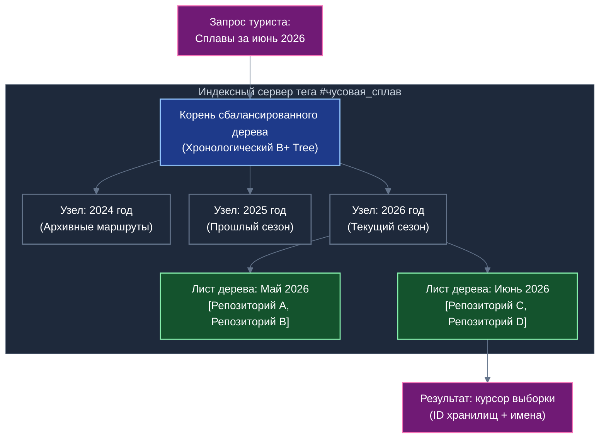
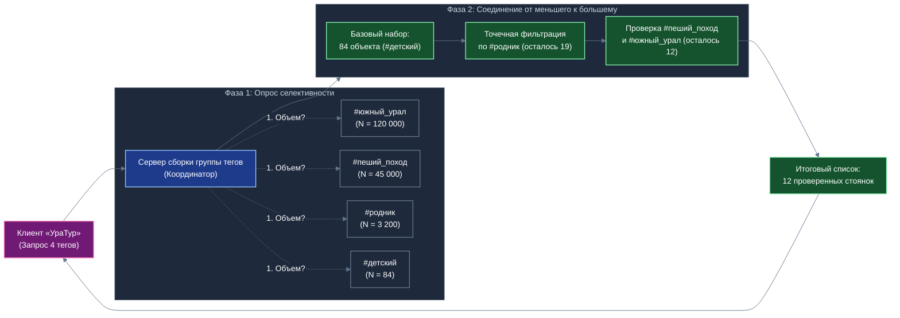

# Общественные теги, самобалансирующиеся хронологические деревья и кооперативная индексная сеть в «УраТуре»

## Концептуальный документ дознания и архитектурных исходных данных для Белой книги и прикладной презентации «УраТур»

---

## 1. Контекст предметной области: туризм, краеведение и открытая навигация

В прикладной сфере путешествий, активного краеведения и экологического туризма («УраТур») структурирование информации принципиально отличается от традиционных каталогов услуг или корпоративных справочников. Природные достопримечательности, туристические тропы, родники, оборудованные стоянки, видовые площадки и перевалы не укладываются в жёсткую иерархию папок или единый классификатор. 

Полнота описания туристического объекта формируется многомерным набором характеристик:
- тематических (`#семейный_отдых`, `#сплав_по_реке`, `#скалолазание`, `#историческое_место`);
- сезонных и временных (`#май_2026`, `#золотая_осень`, `#зимник`, `#паводок`);
- географических и ландшафтных (`#чусовая`, `#таганай`, `#южный_урал`, `#пещера`);
- эксплуатационных и инфраструктурных (`#родник_с_питьевой_водой`, `#оборудованное_кострище`, `#стоянка_с_навесом`, `#доступная_среда`).

### 1.1. Различие между внешними персональными метками и общественными тегами
В органайзере «Деловой» исследован механизм **персональных внешних меток**: пользователь маркирует чужой документ или общественный Случай своей личной меткой, которая сохраняется исключительно на его устройстве (на уровне Листа) и никому во внешнем мире не видна. 

В туристическом навигаторе «УраТур» решается противоположная, коллективная задача: формирование **открытого реестра общественных тегов**, доступного всем путешественникам экосистемы. При этом открытая каталогизация должна быть защищена от двух фундаментальных угроз централизованных интернет-платформ:
1. **Монопольного манипулирования и коммерческой цензуры агрегаторов:** когда независимые туристические маршруты и бесплатные стоянки скрываются алгоритмами в пользу платных гостиничных комплексов и коммерческих туров.
2. **Информационного замусоривания и спама:** когда открытые каталоги деградируют из-за бот-ферм, навязчивой рекламы и нерелевантных отметок.

Платформа «Турбаза» решает эту задачу через синтез **кооперативной экономики энтузиастов** и **децентрализованных самобалансирующихся хронологических деревьев индексов**.

---

## 2. Кооперативы энтузиастов и аренда оборудования индексных узлов

### 2.1. Объединение исследователей и путешественников в тематические кооперативы
Вместо аренды дорогостоящих дата-центров корпоративных облаков индексация открытых общественных тегов в «УраТуре» опирается на естественную заинтересованность профильных сообществ:
- клубов водного туризма и сплавщиков;
- краеведческих обществ и хранителей исторических троп;
- ассоциаций экологического и сельского туризма;
- добровольных спасательных и маркировочных отрядов.

Энтузиасты объединяются в специализированные **кооперативы тегов** (например, «Кооператив водных маршрутов Урала» или «Индексное общество байкальских экотроп»). Кооператив координирует правила верификации меток, поддерживает стандарты картографических описаний и обеспечивает работу распределённой инфраструктуры поиска.

### 2.2. Аренда стационарных компьютеров участников в качестве индексных серверов
Каждый энтузиаст, обладающий стационарным домашним или офисным компьютером с постоянным подключением к сети, может сдать вычислительные мощности и дисковое пространство своего узла в аренду кооперативу для выполнения роли **индексного сервера тега** (Tag Index Server).

При этом соблюдается ключевой архитектурный инвариант легковесности:
- Индексный узел **не хранит** тяжёлые пользовательские медиафайлы, фотографии высокого разрешения, видеоотчёты или полные архивы документов. Все медиаданные остаются в распределённых хранилищах авторов маршрутов и на кэширующих серверах контента.
- Индексный узел обслуживает исключительно **минимальный дескриптор связи тега и хранилища**:
  - глобальный неизменяемый идентификатор общественного хранилища (`RepositoryGlobalId`);
  - общепонятное наименование туристического объекта или маршрута (`RepositoryName`);
  - метку времени создания исходного хранилища (`CreatedAt`);
  - метку времени присвоения тега (`TaggedAt`);
  - географические координаты описания границы (`GeoBoundingBox`);
  - контрольную криптографическую сумму актуального состояния хранилища (`ContentChecksum`).

Такой легковесный дескриптор занимает менее 128 байт. Обычный накопитель потребительского класса объёмом в несколько сотен гигабайт способен содержать сотни миллионов связей, обеспечивая мгновенную отдачу поисковых списков при минимальном потреблении электроэнергии и вычислительных ресурсов.

---

## 3. Самобалансирующееся хронологическое дерево хранилищ

### 3.1. Двумерное время и вставка в середину хронологии
Традиционные журналы событий (Append-only logs) предполагают поступление данных строго в хронологическом порядке. Однако в живой практике туризма и каталогизации меток возникает принципиальное противоречие между двумя шкалами времени:
1. **Шкала времени создания объекта (`CreatedAt`):** туристический приют или историческая тропа могли быть задокументированы в экосистеме пять лет назад.
2. **Шкала времени присвоения тега (`TaggedAt`):** статус «оборудована новая беседка» или «промаркировано волонтёрами» присвоен этому объекту сегодня утром.

Следовательно, индекс тега не может быть простым линейным списком: новые записи могут добавляться как в конец временного ряда (для вновь созданных маршрутов), так и в произвольную середину исторической хронологии (при актуализации архивных объектов).

*Схема 1. Организация самобалансирующегося хронологического дерева на индексном узле энтузиаста.*

### 3.2. Архитектура самобалансирующегося дерева (Temporal B+ Tree / LSM)
Для поддержания стабильной логарифмической сложности поиска $O(\log N)$ при непрерывных вставках в середину массива индекс тега организуется как специализированное **хронологическое B+ дерево** (Temporal B+ Tree) или **двухуровневое LSM-дерево** (Log-Structured Merge Tree) с детерминированным расщеплением узлов:
- **Ключ индекса:** составной кортеж `(ВременнаяМетка, ХэшИдентификатора)`. В качестве ведущей метки времени может выступать как `TaggedAt`, так и `CreatedAt`, формируя два параллельных проекционных индекса.
- **Ветвление и сбалансированность:** при превышении емкости страницы узла (например, более 512 записей) узел делится пополам с переносом медианного ключа в родительский узел. Это гарантирует, что глубина дерева не превышает 3–4 уровней даже для миллионов промаркированных объектов.
- **Двунаправленная связанность листовых страниц:** листовые узлы связаны двунаправленным списком, что обеспечивает мгновенное сканирование диапазона как в сторону более ранних, так и в сторону более поздних записей без возврата к корню.

### 3.3. Поддержка развитых временных срезов и курсорной пагинации
Архитектура дерева предоставляет клиенту богатую палитру временных запросов:
- **Выборка за фиксированный период:** получение всех объектов с тегом за конкретный год, сезон, месяц или точный день (например, экспедиции выходного дня);
- **Относительные временные диапазоны:** запросы вида «найти стоянки, промаркированные *ранее* указанной даты» (поиск исторических стоянок) или «*позже* указанной даты» (поиск только свежих обновлений текущего года);
- **Курсорная пагинация (Cursor-based pagination):** передача клиенту стабильного маркера позиции `(LastTimestamp, LastId)`. Клиент запрашивает следующие 20 записей без риска пропустить строки или получить дубликаты при одновременной вставке новых тегов другими пользователями.

---

## 4. Серверы сборки групп тегов и координация многотеговых соединений

### 4.1. Проблема составных туристических запросов
В реальных условиях турист крайне редко ищет по единственному тегу. Типичный запрос содержит пересечение нескольких разнородных условий:
$$\text{Поиск} = \#\text{южный\_урал} \ \wedge \ \#\text{пеший\_поход} \ \wedge \ \#\text{стоянка\_с\_родником} \ \wedge \ \#\text{детский\_маршрут}$$

Если опрашивать каждый индексный сервер изолированно и передавать на смартфон полные списки результатов, канал связи мобильного устройства мгновенно перегрузится десятками мегабайт избыточных данных.

### 4.2. Архитектура серверов сборки (Query Coordinator / Join Assembler)
Для решения этой задачи в сети выделяются **серверы сборки групп тегов**. Сервер сборки координирует распределённое исполнение составного запроса:
1. **Зондирование селективности (Cardinality & Selectivity Probing):** Сервер сборки отправляет легковесный параллельный запрос на индексные серверы всех указанных тегов, запрашивая исключительно **статистику мощности** — количество актуальных записей, удовлетворяющих временному фильтру.
2. **Оптимизация порядка соединения от меньшего к большему (Join Ordering Heuristics):**
   - Пусть тег `#южный_урал` содержит 120 000 объектов;
   - Тег `#пеший_поход` — 45 000 объектов;
   - Тег `#стоянка_с_родником` — 3 200 объектов;
   - А тег `#детский_маршрут` в выбранном районе — всего 84 объекта.
   
   Вместо сканирования огромного массива в 120 000 записей, сервер сборки выстраивает конвейер соединения, **начиная с наименее объемного результата** (наивысшая избирательность / селективность):
   $$\text{Порядок обработки} = \underbrace{\#\text{детский\_маршрут}}_{84} \ \longrightarrow \ \underbrace{\#\text{стоянка\_с\_родником}}_{3\,200} \ \longrightarrow \ \underbrace{\#\text{пеший\_поход}}_{45\,000} \ \longrightarrow \ \underbrace{\#\text{южный\_урал}}_{120\,000}$$

*Схема 2. Конвейер соединения многотегового запроса с оптимизацией порядка по селективности.*

3. **Точечная верификация (Index Nested Loop / Leapfrog Triejoin):**
   Сервер сборки извлекает 84 идентификатора базового набора и направляет параллельные запросы точечной проверки (Point Existence Checks) в индексы остальных тегов. Сетевой трафик сводится к нескольким десяткам байт, а итоговый результат формируется за миллисекунды.

---

## 5. Сверхоперативное сохранение (кэширование) популярных срезов

Для исключения повторных вычислений и защиты индексных серверов от пиковых нагрузок в выходные дни и в разгар туристического сезона серверы сборки и индексные узлы задействуют многоуровневое сверхоперативное сохранение в оперативной памяти:
1. **Очереди выбытия первого пришедшего (FIFO):** для быстро меняющихся оперативных выборок (например, метеорологические отчёты или временные перекрытия троп).
2. **Статистические срезы популярности (LRU/LFU):** удержание в оперативной памяти наиболее востребованных поисковых пересечений региона.
3. **Кэш «Топ-1000 новейших объектов»:** каждый индексный сервер держит в горячей памяти срез из 1000 последних добавленных или обновленных хранилищ по своему тегу. Поскольку подавляющее большинство запросов туристов направлено на изучение свежих маршрутов и актуального состояния стоянок, свыше 80% запросов обслуживаются непосредственно из оперативной памяти без единого обращения к постоянному накопителю.

---

## 6. Устройства пользователей (Листья) как локальные узлы сборки

Важнейшим принципом децентрализации «Турбазы» является устранение обязательных посредников. Выделенные серверы сборки необходимы лишь для высоконагруженных публичных запросов с широким охватом.

Для малозначимых, узкоспециализированных или персональных комбинаций тегов **устройство самого пользователя (Лист) выступает полноправным локальным узлом сборки**:
- Смартфон туриста напрямую обращается к серверам нужных редких тегов, запрашивая компактные индексные списки (содержащие, как правило, десятки или сотни записей);
- Клиентское приложение «УраТур» выполняет соединение и фильтрацию списков прямо в оперативной памяти мобильного устройства;
- **Преимущества локальной сборки на Листе:**
  1. *Абсолютная конфиденциальность интересов:* внешняя сеть не знает, какую именно комбинацию редких меток ищет путешественник;
  2. *Автономность и экономия ресурсов:* сеть не тратит мощности координаторов на специфические разовые запросы;
  3. *Работа при слабом сигнале связи:* получив один раз базовые индексные срезы, турист может варьировать условия фильтрации прямо в походе без повторных обращений к базовым станциям.

---

## 7. Научно-теоретический базис и технологические аналоги

Предлагаемая архитектура опирается на признанные фундаментальные результаты в области распределённых систем и теории баз данных:
1. **Распределённые инвертированные индексы (Distributed Inverted Indexes):** математический аппарат расщепления поисковых списков по терминам с независимым шардированием (исследования Falkon, Terrier, Lucene Core Architecture).
2. **Временные древовидные структуры (Temporal B-Trees & MVBT):** классические работы П. Зальцберга и В. Цихаса по структурам данных для хранения темпоральных интервалов и версионных записей с гарантированным логарифмическим временем доступа.
3. **Оптимальные алгоритмы соединения без избыточных промежуточных результатов (Worst-Case Optimal Joins & Leapfrog Triejoin):** теоретический прорыв Т. Вельдхёйзена (Todd Veldhuizen) и соавторов, доказавших возможность вычисления сложных конъюнктивных запросов за время, строго пропорциональное размеру итогового ответа, минуя комбинаторный взрыв промежуточных декартовых произведений.
4. **Кооперативные одноранговые поисковые сети (Peer-to-Peer Cooperative Indexing):** адаптация принципов структурированных распределённых сетей (DHT, Kademlia, CAN) к задачам многоатрибутного диапазонного поиска без центрального координатора.

---

## 8. Итоги и интеграция в экосистему

Архитектура общественных тегов в «УраТуре» гармонично замыкает концепцию децентрализованной каталогизации платформы:
- Личные задачи и приватные метки живут на автономном Листе гражданина в приложении «Деловой»;
- Социальные опросы и верификация инициатив происходят в «КубГолосе»;
- Взаимная поддержка и обмен живым опытом формируются в сети «Забота»;
- А открытая коллективная карта природы, троп и общественных благ раскрывается в «УраТуре» через самобалансирующиеся индексные деревья и кооперативную сеть энтузиастов.

Данный архитектурный фундамент служит прямой проектной основой для подготовки будущей Белой книги «УраТура» и сопутствующего представительского слайдового набора.
