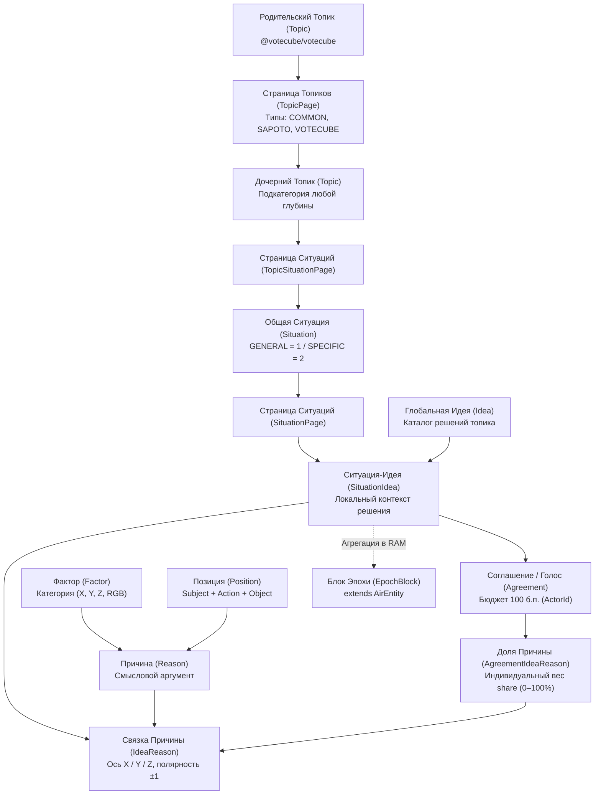
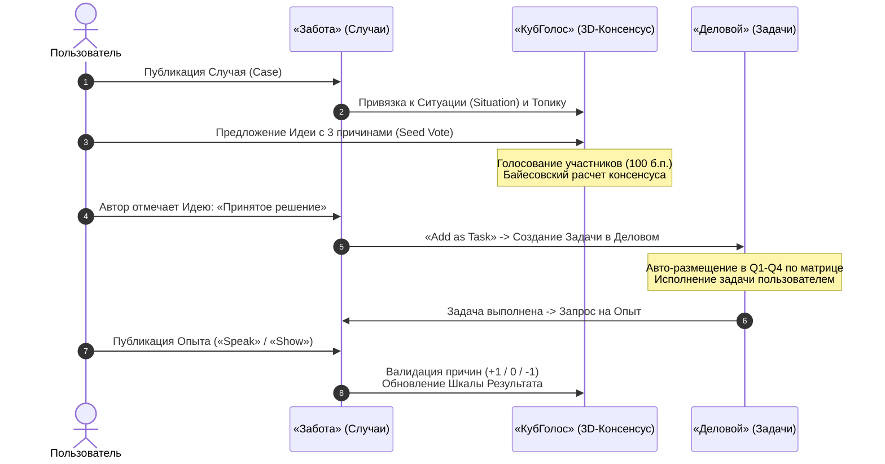
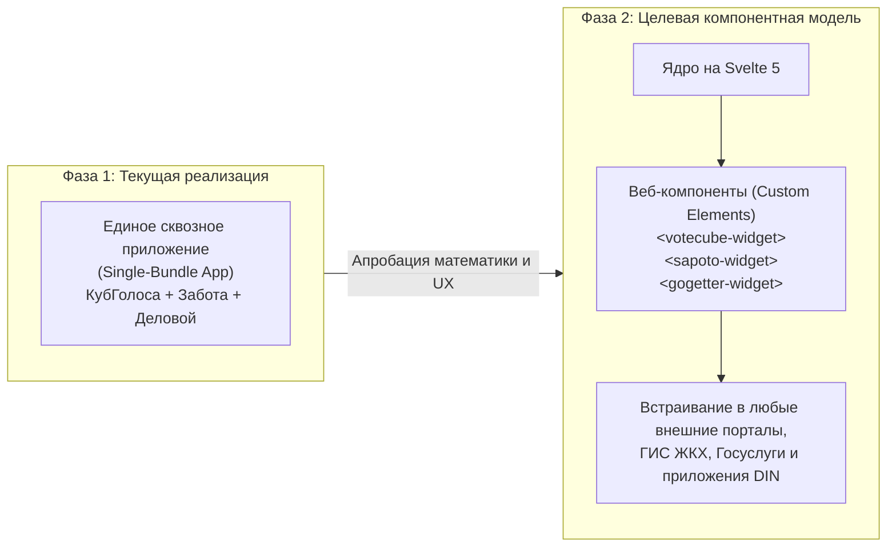

# КубГолоса (VoteCube) и платформа «Турбаза»
## Полное концептуальное и архитектурное руководство по прототипу

---

## 1. Концепция и видение платформы

### 1.1. Что такое «КубГолос» (VoteCube)?
**«КубГолос» (VoteCube)** — это система многомерного коллективного волеизъявления и принятия решений, преодолевающая фундаментальный кризис традиционных бинарных голосований («Да» / «Нет»).

В классических опросных системах гражданам навязывается упрощенный плоский выбор, который поляризует общество, сталкивает группы людей лоб в лоб и скрывает реальную аргументацию сторон. «КубГолос» преобразует процесс голосования из разрушительного конфликта в **конструктивное совместное проектирование решений**:
* **3D-геометрия волеизъявления**: участники голосуют не за абстрактный бинарный лозунг, а распределяют фиксированный бюджет влияния (**100 базисных пунктов**, или 100%) между тремя ортогональными аргументами/причинами на осях $X, Y, Z$ интерактивного трехмерного куба.
* **Баланс значимости и согласия**: система разделяет *значимость фактора* (насколько аргумент важен) и *станс согласия* (положительное или отрицательное отношение к нему), визуализируя результаты на расходящемся барчарте (*Diverging Bar Chart*).
* **Контекстуализация решений (`Situation` $\longleftrightarrow$ `Idea`)**: любое волеизъявление привязано к объективному контексту — общей проблеме (**Ситуации**), для которой сообщество формулирует и оценивает альтернативные гипотезы (**Идеи**).
* **Двухуровневая матрица Эйзенхауэра**: оценка Ситуаций по шкалам *«Срочность vs Важность»* и Идей по шкалам *«Срочность vs Приоритет»* с автоматическим транслированием принятых решений в конкретные исполнительские задачи органайзера **«Деловой» (GoGetter)**.
* **Байесовский многошкальный консенсус**: истинность решения вычисляется как динамический синтез трех независимых шкал — *Результата* (эмпирическая практика из приложения «Забота»), *Экспертов* (оценки специалистов, взвешенные по их репутации) и *Народа* (прямое равноправное волеизъявление граждан).

### 1.2. Место в платформе Data Independence Network (DIN)
«КубГолоса» (`@votecube/votecube`), «Забота» (`@sapoto/main`) и «Деловой» (`@gogetter/main` на базе `@airline/tasks`) формируют базовое трио системообразующих прикладных платформ экосистемы DIN.

В этой архитектуре действует **строгая однонаправленная иерархия схем данных**:
$$\text{КубГолоса (VoteCube)} \longleftarrow \text{Забота (Sapoto)} \longleftarrow \text{Деловой (GoGetter)}$$

Схема `@votecube/votecube` является абсолютно автономной, независимой базовой схемой. Приложения «Забота» и «Деловой» расширяют ее семантику прикладными сущностями (Реальные Случаи, мультимодальный опыт, задачи, дедлайны), опираясь на универсальные математические и координационные примитивы КубГолоса.

### 1.3. Топология «Турбазы» и архитектура без традиционного сервера
* **Отсутствие традиционного бэкенд-сервера**:
  - В трехуровневой архитектуре «Турбазы» (Лист $\to$ Ветка $\to$ Ствол) **традиционный сервер приложений отсутствует**.
  - **Листья (устройства пользователей)** получают дополнения в журналах изменений хранилищ (WAL-дельты) и объединяют их непосредственно в собственной локальной реляционной базе данных (SQLite / AIRport WASM).
  - 100% пользовательских запросов, локальная аналитика и рендеринг интерфейса (включая 3D-манипулятор Куба на WebGPU/WebGL) исполняются на клиентском устройстве.
* **Шлюзы Веток без рендеринга (Zero-Rendering Headless Gateways)**:
  - Узлы Веток не формируют HTML и не отдают графические компоненты. Они функционируют как легковесные шлюзы координации данных, криптографической верификации подписей и маршрутизации дельт.
  - Для работы с общими коллекциями данных шлюзы задействуют **специализированные древовидные примитивы платформы**:
    1. *Самозапечатывающиеся страницы (`IChildRecordPage`)*: масштабирование связей 1:N (страницы топиков `TopicPage`, каталоги ситуаций `TopicSituationPage`, `SituationPage`, страницы реплик `ReplyPage`) блоками ~1000 записей;
    2. *Деревья категорий и топиков*: иерархическая структура классификации с обработкой родительских тем вверх по дереву (**Upstream Category Processing**) на узлах кооперативов;
    3. *Оперативные счетчики в оперативной памяти (In-Memory Accumulators)*: мгновенная агрегация долей голосов и баланса факторов в RAM шлюза без дисковых задержек, с периодической фиксацией снапшотов в синхронизируемые сущности `EpochBlock extends AirEntity`;
    4. *Территориальные деревья*: географический контур видимости и криптографическая проверка локального резидентства (ZKP).
* **Интеграция со внешними поисковыми системами**:
  - Прямой экспорт санкционированных структурированных потоков дельт (JSON-LD Push Stream) в поисковые машины (например, Яндекс) обеспечивает мгновенное обнаружение публичных тем и голосований без раскрытия приватных данных граждан.
  - Пользователь переходит из поисковика к целевому топику, после чего Лист запрашивает журнал изменений соответствующего микро-репозитория через шлюз Ветки в свою локальную базу.

### 1.4. Единое дерево Топиков и инфраструктура Кооперативов платформы
Устаревшие разрозненные сущности `Theme`, `SubTheme` и `SubTopic` полностью упразднены. Вся тематическая навигация платформы опирается на универсальную древовидную сущность **`Topic`** в схеме `@votecube/votecube` (`parentTopic: Topic`):
1. **Кооперативы платформы и локальные юридические лица**:
   - В зависимости от юрисдикции, официальные кооперативы платформы (или аккредитованные юридические лица) берут на себя хостинг и обслуживание публичных категориальных ветвей (*shared public branches*).
2. **Экономическая устойчивость и смарт-контракт `share(...)`**:
   - Операторы узлов и кооперативы получают **гарантированную долю выручки** от этичной рекламы и подписок наряду с арендаторами серверных мощностей через неизменяемый FSM смарт-контракт `share(...)` (согласно Белой книге ЦБ РФ № 06).
3. **Приватные семейные и корпоративные пространства**:
   - Алгоритмы и схемы КубГолоса полноценно функционируют в изолированных семейных, школьных и корпоративных хранилищах, которые не индексируются внешними шлюзами и защищены сквозным шифрованием (E2EE).

---

## 2. Иерархия сущностей предметной области



### 2.1. Уровни абстракции и сущности

| Сущность | Схема | Назначение и семантика | Особенности архитектуры AIRport |
| :--- | :--- | :--- | :--- |
| **`Topic`** | `@votecube/votecube` | Единый узел иерархического каталога тем (`parentTopic`). Корневые топики заменяют глобальные разделы, дочерние — любые подкатегории. | Масштабируется через страницы `TopicPage` (типы: `COMMON`, `SAPOTO`, `VOTECUBE`). |
| **`Situation`** | `@votecube/votecube` | Контекст проблемы или вызова (`type: GENERAL` для абстрактных проблем, `SPECIFIC` для частных ситуаций). | Содержит `text`, ссылку на `topic`. Показатели `urgencyTotal` и `importanceTotal` являются `@Transient()` и рассчитываются динамически. Масштабируется через `SituationPage`. |
| **`Idea`** | `@votecube/votecube` | Гипотеза решения или утверждение. Может существовать глобально в каталоге топика (`IdeaTopic`) и переиспользоваться между ситуациями. | Поддерживает древовидную вложенность (`parent`/`children`). Показатели консенсуса являются `@Transient()`. |
| **`SituationIdea`** | `@votecube/votecube` | Связующая сущность, фиксирующая применение конкретной Идеи к конкретной Ситуации. | Инкапсулирует локальные соглашения `agreements`, массив `ideaReasons`. Показатели `agreementShareTotal`, `numberOfAgreements`, `priorityTotal`, `urgencyTotal` помечены `@Transient()` (инвариант Write-Self). |
| **`Factor`** | `@votecube/votecube` | Категория влияния (системная или пользовательская). Привязывается к оси ($X, Y, Z$) и цветовой палитре RGB. | Нормированный аналитический базис для группировки позиций. |
| **`Position`** | `@votecube/votecube` | Грамматическая формулировка аргумента в строгом формате: `Subject + Action + Object + Text`. | Повторно используемый смысловой блок аргументации. |
| **`Reason`** | `@votecube/votecube` | Смысловой аргумент, объединяющий `Factor` и `Position`. | Является атомарным кирпичиком доказательства «За» или «Против». |
| **`IdeaReason`** | `@votecube/votecube` | Привязка конкретной Причины к Идее или Ситуации-Идее с назначением координаты в 3D-кубе (`axis`, `dir`, `factorNumber`, `red/green/blue`). | Задает проекцию аргумента на одну из граней куба и полярность исхода (`isPositiveOutcome`). |
| **`Agreement`** | `@votecube/votecube` | Факт волеизъявления конкретного участника (`ActorId`), содержащий общий бюджет влияния (`shareTotal` до 100 б.п.). | Создается независимо каждым пользователем в соответствии с инвариантом «Write-Self». |
| **`AgreementIdeaReason`** | `@votecube/votecube` | Детальная разбивка пользовательского голоса: фиксирует индивидуальную долю `share` (0–100%) по каждой из выбранных причин. | Содержит координаты нормали в момент фиксации волеизъявления. |
| **`EpochBlock`** | `@votecube/votecube` | Синхронизируемый блок эпохи голосования, содержащий снапшот агрегированных векторов факторов и весов. | Наследует `AirEntity`. Распространяется на Листья через стандартный механизм синхронизации WAL-дельт. |

---

## 3. Математический аппарат и 3D-геометрия волеизъявления

### 3.1. Геометрическая матрица проекций (`CubeMoveMatrix`)
Математический фундамент манипуляции трехмерным кубом реализован в модуле библиотеки [`libs/cube-logic`](file:///Users/parents/Documents/data-independence-network/votecube.com/libs/cube-logic):
* Сфера вращения разбита на **72 дискретных деления** с шагом квантования $5^\circ$ ($72 \times 5^\circ = 360^\circ$);
* Поддерживаются дискретные шаги углового перемещения: $\Delta \theta \in \{5^\circ, 15^\circ, 45^\circ\}$ (`MoveIncrement`);
* Матрица значений `PositionValues` задает шестерку проекций на три ортогональные оси координат ($X, Y, Z$):
  $$\vec{P} = [P_{X+}, P_{X-}, P_{Y+}, P_{Y-}, P_{Z+}, P_{Z-}]$$
  при этом для любой оси $K \in \{X, Y, Z\}$ выполняется строгий инвариант взаимного исключения противоположных направлений:
  $$P_{K+} \cdot P_{K-} \equiv 0$$

### 3.2. Расчет площадей граней и баланса долей
Для вектора взгляда наблюдателя $\vec{V} = (0, 0, -1)$ и единичных нормалей граней куба $\vec{N}_k$ видимая площадь каждой грани $k \in \{1, 2, 3\}$ вычисляется через скалярное произведение:

$$S_k = \max\left(0, \; \vec{N}_k \cdot \vec{V}\right)$$

Относительный вес фактора $k$ в текущем положении куба:

$$w_k^{\text{cube}} = \frac{S_k}{\sum_{i=1}^3 S_i}$$

Каждому участнику выделяется фиксированный неделимый бюджет влияния в **100 базисных пунктов (100 bp = 100%)**:
$$\sum_{k=1}^3 s_k = 100 \text{ б.п.}$$

Вектор индивидуального волеизъявления:
$$\vec{R}_i = \left( s_{i,x} \cdot v_{i,x}, \; s_{i,y} \cdot v_{i,y}, \; s_{i,z} \cdot v_{i,z} \right)$$
где $v_{i,k} \in \{-1, +1\}$ определяет направление голоса (полярность аргумента: «За» или «Против»).

### 3.3. Двухуровневая нормализация весов (Модель Б)
Если в вопросе участвует расширенный набор факторов $M > 3$, из которых 3 проецируются на грани куба, а остальные $M - 3$ регулируются внешними слайдерами:
* Каждому фактору $j$ назначается абсолютный вес $W_j \ge 0$ при сохранении глобального балансового инварианта:
  $$\sum_{j=1}^M W_j = 100\% \quad (1.0)$$
* Куб контролирует долю $C_{\text{cube}} \in (0, 1]$ от общего бюджета:
  $$W_k = C_{\text{cube}} \times w_k^{\text{cube}}, \quad k \in \{1, 2, 3\}$$
* При активации вспомогательного фактора $m > 3$ со слайдером $W_m$:
  $$C_{\text{cube}} = 1.0 - \sum_{m=4}^M W_m$$
  Куб пропорционально масштабирует видимый объем без искажения относительного баланса внутренних углов.

### 3.4. Двумерная аналитическая выдача (Diverging Bar Chart)
Результаты голосования по каждому фактору $j$ не смешиваются в плоскую скалярную цифру, а выводятся как **два независимых аналитических показателя**:

```
[Фактор: Экология района]
Релевантность: 84% (Толщина полосы)
Против [-100%] ■■■■■■■■■■░░░░░░░░░░ [+100%] За (+45% Баланс)
```

1. **Значимость / Релевантность фактора ($\bar{W}_j$):** Доля суммарного внимания участников, уделенная данному фактору:
   $$\bar{W}_j = \frac{1}{N} \sum_{i=1}^N W_{ij} \quad \in [0, 100\%]$$
   *(Визуализируется толщиной или насыщенностью полосы на барчарте)*.
2. **Позиция / Станс согласия ($\bar{V}_j$):** Баланс мнений среди участников, посчитавших данный фактор значимым ($W_{ij} > 0$):
   $$\bar{V}_j = \frac{\sum_{i=1}^N W_{ij} \cdot v_{ij}}{\sum_{i=1}^N W_{ij}} \quad \in [-100\%, +100\%]$$
   где $v_{ij} \in \{-1, +1\}$ — выбор между позицией «Против» и «За». *(Визуализируется длиной и направлением полосы от центрального нуля)*.
3. **Итоговый интегральный индекс вопроса:**
   $$\text{TotalIndex} = \sum_{j=1}^M \bar{W}_j \cdot \bar{V}_j \quad \in [-100\%, +100\%]$$

### 3.5. Разрешение проблемы «холодного старта» (Author Seed Vote)
При публикации новой Идеи автор автоматически формирует начальное соглашение (`Agreement`), распределяя свои 1–3 ключевые причины по осям $X, Y, Z$ с базовой пропорцией (например, 50% / 30% / 20%) и полярностью $+1$. В результате трехмерная модель никогда не бывает пустой: каждый участник сразу видит сбалансированный визуальный образ решения.

---

## 4. Архитектурные инновации и особенности реализации на платформе «Турбаза»

### 4.1. Инвариант «Write-Self»
В децентрализованной архитектуре AIRport действует фундаментальный принцип: **пользователь никогда напрямую не мутирует строки, созданные другим пользователем**:
* Участники голосования не изменяют поля сущностей `Idea` или `SituationIdea` автора.
* Каждый голосующий создает собственную независимую запись `Agreement` со своим `ActorId`, прикрепляя к ней дочерние записи `AgreementIdeaReason`.
* Поля суммарных показателей (`agreementShareTotal`, `numberOfAgreements`, `priorityTotal`, `urgencyTotal`) в сущностях являются `@Transient()`: они вычисляются динамически локальным SQL-движком Листа либо агрегируются шлюзом Ветки в оперативной памяти.

### 4.2. Самозапечатывающиеся страницы (`IChildRecordPage`)
Прямые реляционные связи 1:N в децентрализованных P2P-хранилищах приводят к раздуванию репозиториев, падению производительности мобильных устройств и конфликтам синхронизации. В «КубГолосе» эта проблема решена через платформенный интерфейс `IChildRecordPage`:
* Страницы `TopicPage`, `TopicSituationPage`, `SituationPage` представляют собой **независимые микро-репозитории AIRport**, ограниченные объемом ~1000 записей.
* По достижении лимита страница запечатывается (`isSealed: true`), становится неизменяемой и переводится в режим постоянного CAS-кэширования (`Cache-Control: immutable`).
* Новые записи адресуются в следующую активную страницу, формируя самозапечатывающееся B-дерево.

### 4.3. Оперативные счетчики в RAM и сущность `EpochBlock extends AirEntity`
Для обеспечения сотен тысяч транзакций волеизъявления в секунду шлюзы Веток не производят дисковых блокировок:
* Поступающие голоса аккумулируются в оперативной памяти шлюза (**In-Memory Accumulators**).
* По расписанию (например, каждые несколько секунд или минут) шлюз формирует агрегированный снапшот — сущность **`EpochBlock extends AirEntity`**, которая реплицируется на Листья через стандартный синхронизационный журнал дельт WAL.
* Для защиты от спама и DoS шлюз ведет внутренние служебные таблицы квот (`user_factor_quotas`), которые функционируют локально на Ветке и не засоряют протокол синхронизации Листьев.

### 4.4. Гибридная маршрутизация через `PassThroughConnection`
Категориальные узлы кооперативов изолированы от прямого публичного интернета для защиты от DDoS-атак:
* Запросы от Листьев направляются на территориальную районную Ветку, которая пересылает категориальные запросы через защищенный внутренний mTLS-конвейер платформы с использованием **`PassThroughConnection`**.
* Объединение, пересечение и фильтрация данных (например, поиск ситуаций в конкретном районе по выбранному топику) выполняются **непосредственно в реляционной базе Листа** (SQLite / AIRport WASM) быстрыми операциями `INTERSECT` / `JOIN` без тяжелого межсерверного проксирования.

### 4.5. Криптографическая адресация репозиториев при записи (`currentActivePageRepoId`)
В архитектуре AIRport дельты WAL подписываются ключом `ActorId` строго для конкретного идентификатора репозитория (`RepositoryId`). 
* Лист не вычисляет моменты заполнения емкости страниц (этим управляет секвенсор Ветки).
* При записи Лист адресует и криптографически подписывает дельту для **текущей активной страницы** (`currentActivePageRepoId`), публикуемой шлюзом Ветки.
* Концепция Страниц служит как целевым адресом при записи, так и неизменяемой единицей CAS-кэширования при хронологическом чтении.

### 4.6. Анонимные маски (ZKP Ephemeral ActorId)
Идентичность в AIRport определяется триплетом: *пользователь + приложение + устройство* (`(RepositoryId, ActorId, ActorRecordId)`).
* При необходимости конфиденциального волеизъявления Лист генерирует эфемерную пару ключей (`ephemeral ActorId`), действующую в границах конкретного голосования или треда.
* Шлюз Ветки и пиры проверяют факт локального резидентства участника с помощью доказательства с нулевым разглашением (Zero-Knowledge Proof, ZKP) без деанонимизации гражданина.

### 4.7. Автономность и локальный контур (Offline-First & Local Mesh Consensus)
Платформа сохраняет 100% функциональности волеизъявления при отсутствии внешнего интернета (в подвалах, при блэкаутах или на изолированных локальных собраниях):
* Листья участников связываются по локальной Wi-Fi/Bluetooth-сети напрямую (P2P) или через микро-сервер локальной Ветки.
* Голоса фиксируются в локальные `Agreement` и агрегируются в локальный `EpochBlock`.
* При восстановлении магистрального соединения все накопленные дельты бесконфликтно реконсилируются с вышестоящими Ветками и Стволом на базе алгоритмов CRDT без потери голосов.

### 4.8. Семантическая дедупликация на лету (TreeSearch & In-Flight Edge SLM)
Для предотвращения распыления голосов по дублирующим формулировкам:
* В момент ввода текста Ситуации, Идеи или Причины локальная нейросеть Листа (On-Device SLM) рассчитывает векторный эмбеддинг и обращается к иерархическому префиксному Trie-индексу Ветки (технология TreeSearch).
* Интерфейс мгновенно предлагает автору: *«Похожая проблема уже обсуждается в вашем районе (совпадение 87%). Присоединиться?»*, что предотвращает фрагментацию базы данных.

### 4.9. Трехуровневая модель защиты от атак Сивиллы (Sybil Resistance)
Отсутствие централизованной паспортизации компенсируется трехуровневой защитой от бот-ферм:
1. *Криптографический ценз локальности (ZKP):* Невозможность голосовать в территориальных опросах без математического доказательства резидентства на данной Ветке.
2. *Квоты и rate-limiting Ветки (`user_factor_quotas`):* Аппаратное ограничение частоты транзакций с автоматической заморозкой спам-сессий.
3. *Байесовский многошкальный фильтр:* Накрутка ботов в «Шкале Народа» изолирована, так как вес ботов в «Шкале Экспертов» равен нулю, а «Шкала Результата» требует реального подтвержденного опыта.

### 4.10. Юридический статус и 152-ФЗ «О персональных данных» (Self-Custody Zero-PII)
* Все персональные данные и закрытые ключи хранятся **исключительно на Листе (устройстве гражданина)**. Гражданин является единственным контролером своего репозитория (модель Self-Custody).
* Шлюзы Веток обрабатывают только обезличенные математические векторы и ZKP-хэши (Zero-PII).
* Муниципалитеты, школы и предприятия, разворачивающие Ветку, **юридически не являются операторами персональных данных**, что полностью исключает риски проверок Роскомнадзора и штрафов за утечки.

---

## 5. Многошкальный консенсус и Байесовская вероятность истинности

В «КубГолосе» и экосистеме DIN консенсус строится на **байесовской многофакторной вероятности истинности**.

### 5.1. Три независимые шкалы
Итоговая вероятность истинности решения $P(\text{Truth})$ складывается из трех слагаемых, отображаемых в интерфейсе в виде независимых проекций:

1. **Шкала Результата (Результат / Outcome)**:
   - Подтверждение практическим **Опытом (Experiences)** участников, реально применивших данную Идею на практике (фиксируется через приложение «Забота»).
   - Отметка автором ситуации: автор проблемы подтверждает, что решение устранило вызов, и валидирует сработавшие причины.
2. **Шкала Экспертов (Экспертный консенсус / Expert Consensus)**:
   - Суммарная оценка идеи участниками, обладающими подтвержденной репутацией (экспертными очками) в данном топике.
   - Голоса экспертов масштабируются их репутационным весом в данной теме:
     $$\text{Вклад голоса эксперта} = \text{Доля в кубе} \times W_{\text{reputation}}$$
3. **Шкала Народа (Народный консенсус / Public Consensus)**:
   - Прямое демократическое волеизъявление широкого круга граждан сети.
   - Строгий демократический паритет: $1 \text{ человек} = 1 \text{ голос} = 100 \text{ б.п.}$

### 5.2. Математика Байесовского консенсуса: Эмпирический приоритет
Сводная вероятность $P(\text{Truth})$ динамически адаптируется по мере накопления практического опыта $n$ (числа верифицированных Опытов):

$$P(\text{Truth}) = (1 - W_{\text{outcome}}(n)) \cdot \left( w_e \cdot \text{Experts} + w_p \cdot \text{Public} \right) + W_{\text{outcome}}(n) \cdot \text{Outcome}$$

где:
* $w_e$ и $w_p$ — базовые веса Экспертов и Народа на этапе теоретического обсуждения ($w_e = 0.6$, $w_p = 0.4$, $w_e + w_p = 1.0$);
* $W_{\text{outcome}}(n)$ — асимптотическая функция веса эмпирического Опыта:
  $$W_{\text{outcome}}(n) = W_{\text{max}} \cdot \frac{n}{n + k}$$
  где $W_{\text{max}} \approx 0.80$ (максимальный вес практики до 80%), а $k \approx 3$ (коэффициент полунасыщения).

```
   Вес Шкалы Результата W_outcome(n)
   80% |                                      ────────────── (Асимптота 80%)
       |                                ─────
   50% |                     ─────
       |              ─────
   20% |        ─────
    0% └────────┬────────────┬────────────┬────────────┬───> n (Число опытов)
               n=1          n=3          n=5         n=10
```

* **Этап гипотезы ($n = 0$)**: $W_{\text{outcome}} = 0$. Консенсус формируется балансом Экспертов и Народа.
* **Этап первичных испытаний ($n = 1..3$)**: вес эмпирики достигает 40–50%, корректируя теоретические построения.
* **Этап эмпирической зрелости ($n \ge 5..10$)**: вес Шкалы Результата достигает 70–80%. Практика доминирует над теорией: если популярная идея терпит неудачу на практике, ее итоговый консенсус снижается независимо от симпатий большинства.

---

## 6. Рекурсивное (фрактальное) голосование и верификация причин

Одной из уникальных возможностей «КубГолоса» является **рекурсивная верификация аргументов**.

### 6.1. Дерево причин и лингвистическая грамматика
Каждая причина в системе строится по формализованной грамматике:
$$\text{Reason} = \text{Factor} + \text{Position}(\text{Subject} + \text{Action} + \text{Object} + \text{Text})$$
Например:
* *Фактор*: «Экономика и бюджет»
* *Позиция*: «Семья» (Subject) + «снижает» (Action) + «расходы на ЖКУ» (Object) + «за счет ночного тарифа» (Text).

### 6.2. Вложенные Кубы для проверки спорных причин
Если участник сообщества считает, что конкретная причина, положенная в основу популярной Идеи, ложна или научно несостоятельна:
1. Любая `Reason` может быть выделена в **самостоятельный вложенный объект голосования** («Обосновать в Кубе» / `Reason About`).
2. Вложенный Куб собирает аргументы «За» и «Против» истинности самой этой причины.
3. Если по результатам вложенного голосования причина признается несостоятельной, ее вес во всех родительских Идеях **автоматически обнуляется**, а карточка причины получает визуальный статус **«Оспорено сообществом» (*Disputed by Community*)**.
4. Это предотвращает манипулятивное использование популистских, но заведомо ложных утверждений.

---

## 7. Двухуровневая матрица Эйзенхауэра и интеграция с приложением «Деловой» (GoGetter)

«КубГолос» органически связан с персональным таск-менеджером и органайзером **«Деловой» (GoGetter)** через единую систему матриц принятия решений:

```
                          Срочность (Urgency)
                   Высокая                      Низкая
         ┌───────────────────────────┬───────────────────────────┐
         │     КВАДРАНТ 1 (Q1)       │     КВАДРАНТ 2 (Q2)       │
 Высокая │  Срочно и Важно (Do First)│Важно, но не Срочно (Plan) │
         │   «Экстренные меры»       │ «Стратегические решения»  │
Важность ├───────────────────────────┼───────────────────────────┤
(Импорт.)│     КВАДРАНТ 3 (Q3)       │     КВАДРАНТ 4 (Q4)       │
         │Срочно, но не Важно (Quick)│Низкий приоритет (Backlog) │
 Низкая  │   «Быстрые фиксы»         │   «Фоновые идеи»          │
         └───────────────────────────┴───────────────────────────┘
```

1. **Для Ситуаций: Срочность (Urgency) vs Важность (Importance)**:
   - Определяет общественную критичность проблемы. Оценивается сообществом, показывая, требует ли ситуация немедленного вмешательства.
2. **Для Идей: Срочность (Urgency) vs Приоритет (Priority)**:
   - Оценивает характер предложенного решения:
     - *Приоритет*: глубина устранения системной первопричины проблемы;
     - *Срочность*: эффективность решения в качестве неотложной первой помощи.
3. **Автоматическая раскладка Задач в «Деловом»**:
   - При нажатии **«Add as Task»** на одобренной Идее коллективный консенсус матрицы автоматически помещает созданную задачу в соответствующий квадрант персонального органайзера:
     - **Q1 (Do First)**: задачи на сегодня с жесткими напоминаниями;
     - **Q2 (Schedule)**: стратегические задачи с бронированием слотов в календаре;
     - **Q3 (Quick Wins)**: простые разовые действия;
     - **Q4 (Backlog)**: задачи для фонового ожидания.
   - Пользователь освобожден от ручной сортировки: коллективный разум сразу структурирует рабочий график.

---

## 8. Сквозная синергия с «Заботой» (Sapoto) и прикладными системами



1. **Единый когнитивный конвейер**:
   - «Забота» предоставляет эмпирическую почву и реальный человеческий контекст (Случаи, мультимодальный опыт, живые истории).
   - «КубГолос» обеспечивает строгую математическую фильтрацию аргументов, исключает манипуляции и вычисляет взвешенный консенсус.
   - «Деловой» переводит одобренные гипотезы в плоскость практических действий и контролирует их исполнение.
2. **Замыкание обратной связи через Опыт**:
   - Выполнение задачи в «Деловом» инициирует создание отчета об Опыте в «Заботе».
   - Опыт валидирует причины Идеи, автоматически корректируя Шкалу Результата в «КубГолосе».
3. **Модульная интеграция в прикладные системы («УраРан» / «УраТур»)**:
   - В автономных сервисах туризма и логистики микро-виджет КубГолоса задействуется для экспресс-оценки безопасности маршрутов, проходимости перевалов и качества придорожного сервиса по трем факторам (Погода, Рельеф, Инфраструктура).

---

## 9. Репутация, экспертные очки и токеномика

### 9.1. Экспертные очки по топикам (`TopicExpertisePoints`)
В экосистеме DIN авторитет строго децентрализован и контекстуален:
* Не существует универсального абстрактного рейтинга «влиятельности». Очки накапливаются **строго в границах конкретных Топиков** (`topicId`).
* Специалист по ремонту автомобилей накапливает экспертный вес в топике *«Авто / ДВС»*, но имеет нулевой вес в топике *«Педиатрия»*.
* Очки начисляются авторам идей, чьи решения доказали свою состоятельность на практике и подтверждены автором ситуации и сообществом.

### 9.2. Детерминированный сплит O(1) смарт-контракта `share(...)`
Монетизация платформы опирается на этичную контекстную рекламу и подписки без слежки и продажи персональных досье (в соответствии с Белой книгой ЦБ РФ № 06):
$$\text{share}(w_1, \text{Citizen}, \; w_2, \text{HostPortal}, \; w_3, \text{SoftwareTree}, \; w_4, \text{CapacityRenters})$$

* **Доля Гражданина ($w_1$)**: прямая выплата пользователям за предоставление обезличенных параметров профиля (до 50–70% рекламной выручки).
* **Доля площадки встраивания ($w_2$, `HostPortal`)**: внешние городские СМИ, порталы ЖКХ, блоги и муниципальные сайты, встраивающие интерактивный виджет `<votecube-widget>`, автоматически получают прямую долю от рекламы и подписок платформы.
* **Доля Дерева ПО ($w_3$, `SoftwareTree`)**: алгоритмическое отчисление разработчикам библиотек, авторам схем данных (`@votecube`, `@sapoto`) и создателям клиентских модулей.
* **Доля Арендаторов мощностей ($w_4$, `CapacityRenters`)**: гарантированная статья доходов операторов серверов и шлюзов Веток, компенсирующая расходы на каналы связи, mTLS-конвейеры и хранение неизменяемого CAS-кэша без эксплуатации данных граждан.

---

## 10. Семь уровней социально-экономического применения

«КубГолос» спроектирован как универсальный инструмент гармонизации интересов на всех масштабах общественной жизни:

| Уровень | Сфера применения | Ключевые решаемые проблемы | Эффект применения «КубГолоса» |
| :--- | :--- | :--- | :--- |
| **1. Семья** | Бюджет, крупные покупки, досуг, воспитание | Обиды, доминирование одного члена семьи, игнорирование скрытых мотивов | Равноправный диалог: каждый член семьи взвешивает свои 3 причины; нахождение неочевидных компромиссов. |
| **2. Детский сад** | Питание, развивающие программы, режим прогулок | Конфликты родительских комитетов, эмоциональное давление, шумные чаты | Конструктивное взвешивание факторов: Здоровье vs Стоимость vs Безопасность; кристаллизация консенсуса. |
| **3. Школа** | Учебная нагрузка, форма, безопасность, цифровизация | Конфликты администрации и родителей, поляризация мнений, пассивность большинства | Структурированная аргументация: Качество знаний vs Здоровье учеников; устранение родительских войн. |
| **4. Фирмы и МСП** | Приоритеты бэклога, распределение бюджета, условия труда | Токсичные споры, продавливание решений руководством, демотивация сотрудников | 3D-матрица приоритетов: Доход vs Затраты vs Риски; прозрачная защита инженерных и бизнес-решений. |
| **5. Соседи (ЖКХ)** | Парковки vs Газоны, консьержи, шлагбаумы, ремонт | Ожесточенные скандалы в чатах домов, срывы очных собраний собственников | Наглядный барчарт: каждый житель видит баланс значимости аргументов соседей без перехода на личности. |
| **6. Район** | Благоустройство скверов, маршруты транспорта, поликлиники | Конфликты между пешеходами и автомобилистами, лоббизм, оторванность чиновников | Проверка территориального резидентства (ZKP); взвешивание градостроительных решений жителями района. |
| **7. Регион** | Экология, инвестпроекты, тарифы, региональные трассы | Общественный резонанс, недоверие к официальным опросам, популизм | Байесовский синтез мнений Экспертов и Народа; научная верификация последствий через Шкалу Результата. |

---

## 11. Стратегия интеграции и план развития архитектуры



### Фаза 1 (Текущий этап):
* Построение **единого комплексного демонстрационного приложения (Single-Bundle App)**, объединяющего КубГолос, Заботу и Деловой:
  1. **Вкладка 1: «Забота»** — каталог топиков, лента Реальных Случаев, фильтрация по квадрантам потенциального Дела, мультимодальный опыт («Speak» / «Show»).
  2. **Вкладка 2: «Деловой»** — персональный органайзер Задач (`Task`) с автоматической раскладкой по квадрантам Q1–Q4, трекинг статусов и закрытие с переходом к публикации Опыта.
  3. **Вкладка 3: «КубГолоса»** — центр консенсуса, интерактивная лаборатория 3D-Куба, переключение проекций (Результат / Эксперты / Народ), витрина оспоренных причин.
  4. **Вкладка 4: «Профиль / DIN»** — верификация территориального резидентства, баланс экспертных очков, тумблер анонимной маски (ZKP) и начисление дохода по смарт-контракту `share(...)`.

### Фаза 2 (Перспективная веб-компонентная архитектура):
* Перевод интерфейсных примитивов на **Svelte 5** и компиляция в легковесные автономные **Веб-компоненты (Custom Elements)**:
  - `<votecube-widget>` — полнофункциональный модуль 3D-волеизъявления;
  - `<votecube-mini-cube>` — компактный индикатор консенсуса для списков;
  - `<votecube-diverging-bar>` — расходящийся барчарт значимости и согласия;
  - `<votecube-factor-card>` — карточка грамматически структурированной причины.
* Возможность бесшовного встраивания в сторонние веб-сайты, муниципальные порталы и корпоративные интранеты без конфликтов JavaScript-фреймворков.

---

## 12. Руководство по запуску локального прототипа

Прототип снабжен автономным слоем демонстрационных данных и запускается локально:

```bash
# Переход в директорию клиентского приложения VoteCube
cd /Users/parents/Documents/data-independence-network/votecube.com

# Установка зависимостей (при первом запуске)
npm install

# Запуск сервера локальной разработки
npm start
```

Приложение доступно в браузере по адресу: [http://localhost:4200/](http://localhost:4200/)
* **Интерактивный 3D-Куб**: поддержка вращения мышью или свайпами с дискретным шагом квантования $5^\circ$ и фиксацией долей нормалей.
* **Библиотека математики**: алгоритмы расчета площадей граней и проекций нормалей изолированы в [`libs/cube-logic`](file:///Users/parents/Documents/data-independence-network/votecube.com/libs/cube-logic).
* **Переключение проекций**: мгновенное переключение между видами «Результат», «Эксперты» и «Народ» с пересчетом сводной байесовской вероятности.
* **Обоснование причин (`Reason About`)**: проверка рекурсивного открытия вложенного Куба для верификации сомнительных аргументов.
