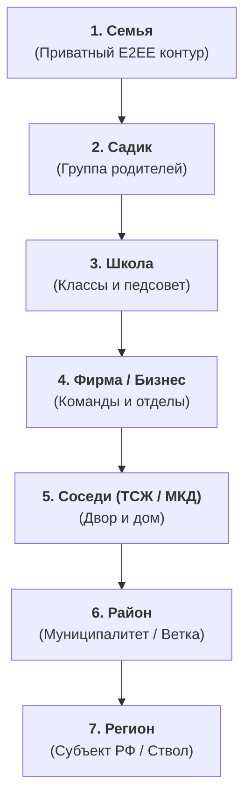
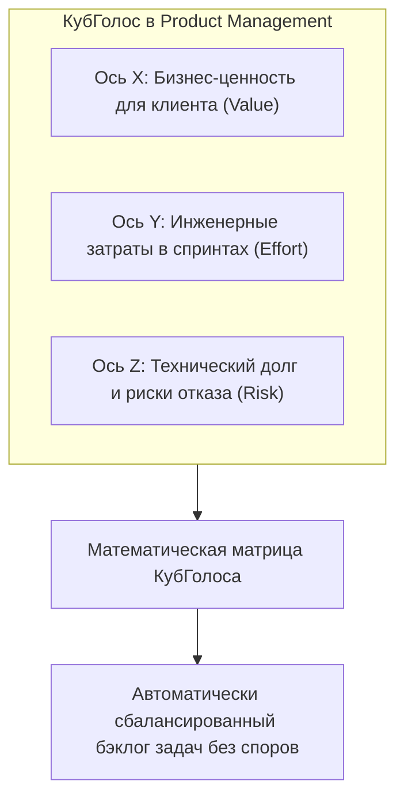
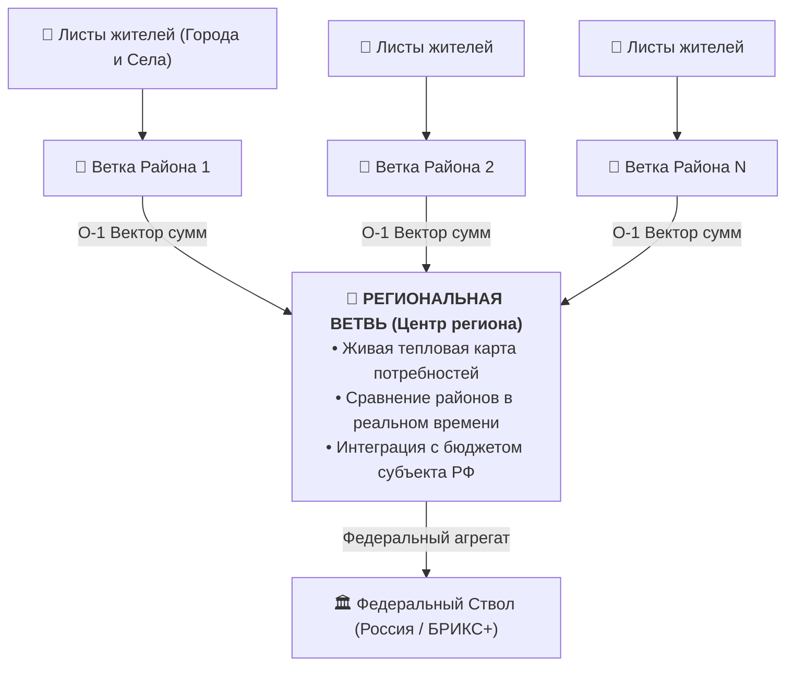

# Социально-экономический и прикладной потенциал платформы «КубГолос» (VoteCube)

**Руководство по применению многомерного волеизъявления на семи уровнях общества:**  
*Семьи · Детские сады · Школы · Фирмы · Соседи · Районы · Регионы*

*Версия: 1.0 (2026)*  
*Автор концепции: Артём Владимирович Шамсутдинов*  
*Базовая среда: Платформа цифрового суверенитета «Турбаза» / Открытый стек AIRport*  
*Связанные документы: [`VoteCube_Architecture_Specification.md`](VoteCube_Architecture_Specification.md), [`authors_note.txt`](authors_note.txt)*

---

## Оглавление

1. [Введение: Концентрические круги доверия и кризис существующих инструментов](#1-введение-концентрические-круги-доверия-и-кризис-существующих-инструментов)
2. [Уровень 1: Семьи (Малые и большие семейные кланы)](#2-уровень-1-семьи-малые-и-большие-семейные-кланы)
3. [Уровень 2: Детские сады (Родительские комитеты и воспитатели)](#3-уровень-2-детские-сады-родительские-комитеты-и-воспитатели)
4. [Уровень 3: Школы (Ученики, родители и педагогический совет)](#4-уровень-3-школы-ученики-родители-и-педагогический-совет)
5. [Уровень 4: Фирмы и бизнес (Команды, стартапы, МСП и корпорации)](#5-уровень-4-фирмы-и-бизнес-команды-стартапы-мсп-и-корпорации)
6. [Уровень 5: Соседи (МКД, ТСЖ и дворовые сообщества)](#6-уровень-5-соседи-мкд-тсж-и-дворовые-сообщества)
7. [Уровень 6: Районы (Муниципалитеты и городские микрорайоны)](#7-уровень-6-районы-муниципалитеты-и-городские-микрорайоны)
8. [Уровень 7: Регионы (Субъекты РФ, министерства и губернаторы)](#8-уровень-7-регионы-субъекты-рф-министерства-и-губернаторы)
9. [Сводная матрица ценности на семи уровнях масштабирования](#9-сводная-матрица-ценности-на-семи-уровнях-масштабирования)

---

## 1. Введение: Концентрические круги доверия и кризис существующих инструментов

Общество устроено как система вложенных социальных кругов: человек сначала принадлежит семье, затем группе детского сада или школы, рабочему коллективу, дому, району и, наконец, региону и государству.



### Почему существующие цифровые инструменты провалились на всех 7 уровнях:
1. **«Ад мессенджеров» (WhatsApp / Telegram):**
   * Обсуждения тонут в сотнях эмоциональных сообщений;
   * Побеждает самый громкий, агрессивный или свободный по времени участник;
   * Невозможно свести конструктивный баланс мнений: вместо аргументов возникают взаимные обиды и раскол.
2. **Примитивные опросы («Да / Нет»):**
   * Заставляют людей выбирать между двумя плохими крайностями;
   * Не отражают силу убеждения и готовность к компромиссу (один человек голосует «Да» равнодушно, а другой голосует «Нет», потому что это разрушает его жизнь);
   * Не показывают, *почему* человек против и на каких условиях он был бы согласен.
3. **Облачная централизация и слежка (BigTech Cloud):**
   * Переписка семей, школьные списки и коммерческие планы фирм утекают из закрытых серверов;
   * Пользователи не владеют своими данными и являются товаром для рекламных сетей.
4. **Анонимные накрутки и боты на муниципальных порталах:**
   * Отсутствие подтвержденного присутствия в районе приводит к накруткам голосов ангажированными группами.

**«КубГолос» (VoteCube)** за счет своей 3D-геометрии, контекстуализации (`Situation` $\longleftrightarrow$ `Idea`) и трехуровневой топологии платформы «Турбаза» (Лист $\to$ Ветка $\to$ Ствол) предлагает принципиально иной подход к каждому из семи уровней.

---

## 2. Уровень 1: Семьи (Малые и большие семейные кланы)

> *«Прежде всего Турбаза задумана для семей. Семьи переплетены с дедушками и бабушками, с дядями и тетями... Почти всегда один человек делится разной информацией с разными людьми... Именно эту задачу и решают хранилища Турбазы».*  
> *(Из заметок автора `shared_docs/comments/2026/08-30_01_Who_is_it_for.md`)*

### 1. Проблемы семейного взаимодействия
Семейные разногласия редко происходят из-за злого умысла. Чаще всего они возникают из-за **несовпадения скрытых приоритетов**:
* Муж думает о стоимости, жена — о пользе для здоровья детей, старшее поколение — о традициях и надежности.
* В обычных разговорах обсуждение крупных решений (отпуск, покупка автомобиля, выбор школы или ремонт) быстро перерастает в эмоциональный спор, где рациональные аргументы обесцениваются.

### 2. Как помогает «КубГолос»
В семейном кругу «КубГолос» запускается в **герметичном зашифрованном контуре (Лист-к-Листу по P2P)**:
* Вопрос не покидает устройства членов семьи;
* Каждый домочадец открывает карточку вопроса на своем смартфоне и настраивает 3D-куб со своей точки зрения;
* Система показывает семейный консенсус: где мнения сходятся, а где ключевой камень преткновения.

### 3. Пример: Выбор формата семейного отпуска
* **Идея (`Idea`):** *«Поездка на автомобиле с палатками на Алтай / Байкал»*.
* **Ситуация (`Situation`):** *«Ограниченный бюджет 150 000 руб., двое детей (6 и 12 лет) и бабушка»*.
* **Грани 3D-куба:**
  * **Ось X (Финансовая нагрузка):**  
    *За:* Экономия на отелях (+70%) vs *Против:* Высокий износ машины и траты на топливо (-30%).
  * **Ось Y (Комфорт и здоровье):**  
    *За:* Свежий воздух, природа (+40%) vs *Против:* Тяжело для бабушки и младшего ребенка (-80%).
  * **Ось Z (Эмоциональная ценность):**  
    *За:* Настоящее приключение, сплочение семьи (+95%) vs *Против:* Высокая утомляемость за рулем (-45%).
* **Результат работы «КубГолоса»:** Семья наглядно видит, что идея всем нравится по духу (Ось Z), но неприемлема по комфорту для старшего поколения (Ось Y). Решение находится автоматически: *«Едем на машине, но ночуем в теплых домиках, сократив маршрут вдвое»*.

---

## 3. Уровень 2: Детские сады (Родительские комитеты и воспитатели)

### 1. Проблема детсадовских сообществ
Родительские чаты в детских садах стали символом токсичности и пустой траты нервов:
* 30 незнакомых между собой родителей с диаметрально разным достатком и взглядами на воспитание вынуждены принимать десятки совместных решений в год (подарки воспитателям, канцтовары, очистители воздуха, выпускной, экскурсии).
* Любое предложение парализуется: 2 человека громко скандалят, 5 спорят ни о чем, остальные 23 родителя отключают уведомления и молча копят раздражение.

### 2. Как помогает «КубГолос»
* Воспитатель или глава родкомитета создает вопрос в приложении «КубГолос» внутри микро-хранилища группы детсада;
* Вместо 500 сообщений в чате каждый родитель тратит **20 секунд**, поворачивая куб факторов;
* Ротация Топ-3 факторов мгновенно показывает реальный баланс интересов группы;
* Исключается буллинг и манипуляции: голосование взвешенное, конструктивное и защищенное.

### 3. Пример: Установка рециркулятора воздуха в группу
* **Идея (`Idea`):** *«Закупка бактерицидного рециркулятора воздуха за счет родителей»*.
* **Ситуация (`Situation`):** *«Сезонный пик ОРВИ, посещаемость группы упала до 40%»*.
* **Грани 3D-куба:**
  * **Фактор 1 (Здоровье детей):**  
    *«Снижает заболеваемость, дети не пропускают садик»* (+85%).
  * **Фактор 2 (Финансовая нагрузка):**  
    *«Сумма сбора 1 200 руб. с семьи — для кого-то ощутимо»* (-40%).
  * **Фактор 3 (Сертификация и безопасность):**  
    *«Прибор должен быть официально одобрен СанПиН и безопасен в присутствии детей»* (+90%).
* **Итог:** Вопрос сразу получает структурированный ответ: 82% за покупку при обязательном условии наличия сертификата СанПиН и компенсации взноса за две многодетные семьи из фонда родкомитета. Спор закрывается за 1 час без единой грубой реплики.

---

## 4. Уровень 3: Школы (Ученики, родители и педагогический совет)

### 1. Проблема школьного самоуправления
* В школах сходятся три силы: **администрация** (отвечает за регламенты и отчеты), **учителя** (перегружены бюрократией), **родители** (переживают за будущее детей) и **сами ученики** (лишены права голоса).
* Решения часто спускаются директивно сверху (школьная форма, питание, охрана), вызывая пассивное сопротивление, скрытый саботаж и конфликты.

### 2. Как помогает «КубГолос»
* **Трехсторонняя матрица волеизъявления:** «КубГолос» позволяет собрать взвешенное мнение отдельно по категориям: ученики старших классов, родители, учителя.
* **Связка с приложением «Деловой» и FSM смарт-контрактами ЦБ:**  
  * Вопросы меню школьной столовой напрямую связываются с FSM-контрактами целевых социальных выплат цифрового рубля (описанными в Белой Книге 06);
  * Ученики со своих смартфонов или школьных терминалов оценивают качество блюд и факультативов.

### 3. Пример: Политика использования смартфонов на уроках
* **Идея (`Idea`):** *«Сдача смартфонов в специальные запираемые боксы перед началом каждого урока»*.
* **Ситуация (`Situation`):** *«Падение успеваемости и отвлечение на соцсети в 7–9 классах»*.
* **Грани 3D-куба:**
  * **Фактор 1 (Концентрация на учебе):**  
    *За:* Ученики не отвлекаются на игры (+90% от учителей, +75% от родителей).
  * **Фактор 2 (Экстренная связь):**  
    *Против:* Родители беспокоятся, что не смогут связаться в экстренной ситуации (-60% от родителей).
  * **Фактор 3 (Личные границы и сохранность вещей):**  
    *Против:* Риск кражи или повреждения дорогого телефона в общем боксе (-85% от учеников).
* **Итог:** Система выявляет точную причину сопротивления — страх за сохранность техники и потеря экстренной связи. Школа принимает компромисс: телефоны не сдаются в общий ящик, а переводятся в беззвучный режим и остаются в личных рюкзаках, а при нарушении — индивидуальное замечание.

---

## 5. Уровень 4: Фирмы и бизнес (Команды, стартапы, МСП и корпорации)

### 1. Проблема корпоративного принятия решений
В современном менеджменте критически распространены две патологии:
1. **«HiPPO-эффект» (Highest Paid Person's Opinion):** Решение принимает самый высокооплачиваемый руководитель на основе личной интуиции, игнорируя реальные сигналы инженеров и клиентов.
2. **Паралич совещаний (Meeting Paralysis):** Команды тратят до 40% рабочего времени на бесконечные споры о приоритизации задач в бэклоге продукта.

### 2. Как помогает «КубГолос»
«КубГолос» выступает как **движок объективной децентрализованной приоритизации (Decision Intelligence)**:
* Используется для оценки продуктовых гипотез (R&D), архитектурных рефакторингов, стратегических развилок и анонимных ретроспектив команды (360° Feedback);
* Каждый член команды голосует через 3D-куб, взвешивая ценность фичи, затраты времени и риски.



### 3. Пример: Внедрение нового программного модуля
* **Идея (`Idea`):** *«Переход на микросервисную архитектуру с заменой монолита»*.
* **Ситуация (`Situation`):** *«Стартап стадии Scale-up, рост нагрузки в 5 раз, дефицит старших разработчиков»*.
* **Грани 3D-куба:**
  * **Value (Масштабируемость):** +70% («Справимся с нагрузкой на Новый год»).
  * **Cost (Трудоемкость):** -90% («Займет 6 месяцев и остановит выпуск бизнес-фичей»).
  * **Risk (Надежность DevOps):** -60% («Команда не умеет отлаживать распределенные транзакции»).
* **Итог:** Руководство наглядно видит, что инженерный риск и цена разработки полностью перевешивают выгоду. Принимается взвешенное решение: вместо глобального переписывания точечно оптимизировать узкие места в текущей базе данных.

---

## 6. Уровень 5: Соседи (МКД, ТСЖ и дворовые сообщества)

### 1. Проблема многоквартирных домов (МКД)
Дворовые территории — арена постоянных конфликтов между жителями:
* Автомобилистам нужны парковочные карманы;
* Молодым семьям нужны детские игровые зоны и тишина;
* Владельцам собак нужны площадки для выгула;
* Пожилым людям нужны зеленые скверы и скамейки.
* Дополнительно: управляющие компании часто фальсифицируют протоколы Общих собраний собственников (ОСС), пользуясь пассивностью жильцов.

### 2. Как помогает «КубГолос»
1. **Локализация на районной Ветке:** Голосовать могут только подтвержденные жители данного дома (через Branch ID или интеграцию с ЕСИА по Zero-PII). Посторонние боты исключены.
2. **Контекстуализация (`SituationIdea`):** Вопрос рассматривается в привязке к конкретной геометрии двора.
3. **Юридическая сила по 63-ФЗ и интеграция с ГИС ЖКХ:** Официальные срезы завершаются формированием неизменяемого блока, подписанного ГОСТ Р 34.10-2012, который признается судами и жилищными инспекциями.

```
┌─────────────────────────────────────────────────────────────┐
│                 МНОГОМЕРНЫЙ БАЛАНС ДВОРА                     │
├──────────────────────────────┬──────────────────────────────┤
│ Аргументы «ЗА» Шлагбаум      │ Аргументы «ПРОТИВ» Шлагбаума │
├──────────────────────────────┼──────────────────────────────┤
│ • Двор освободится от чужих  │ • Ежемесячная плата 450 руб. │
│   машин из офисного центра   │   с каждой квартиры          │
│ • Безопасность детей         │ • Трудности въезда скорой    │
│ • Свободные парковочные места│   помощи и курьеров          │
└──────────────────────────────┴──────────────────────────────┘
```

### 3. Пример: Установка шлагбаума и обустройство двора
* **Идея (`Idea`):** *«Монтаж автоматического шлагбаума с распознаванием номеров»*.
* **Ситуация (`Situation`):** *«Двор в 300 метрах от станции метро, машины паркуют транзитные пассажиры»*.
* **Грани 3D-куба:**
  * **Ось X (Доступность мест):** +95% (жители единодушны).
  * **Ось Y (Цена установки и обслуживания):** -45% (пенсионеры против лишних строк в квитанции).
  * **Ось Z (Беспрепятственный проезд спецслужб):** -30% (опасения сбоев системы).
* **Итог:** Выявлен точный барьер (взнос для пенсионеров). ТСЖ принимает решение: освободить квартиры ветеранов и инвалидов от сбора за установку шлагбаума, компенсировав его из резервного фонда коммерческой аренды фасада. Вопрос принят 88% голосов с соблюдением легитимного кворума.

---

## 7. Уровень 6: Районы (Муниципалитеты и городские микрорайоны)

### 1. Проблема муниципального управления
* Муниципальные власти часто не имеют объективной обратной связи от жителей. Формальные опросы на сайтах администраций собирают менее 0.5% жителей района (в основном ангажированных активистов).
* Жители не верят городским порталам голосований, подозревая их в подтасовках в пользу застройщиков и подрядчиков.

### 2. Как помогает «КубГолос»
* **Децентрализованный сбор инициатив («Снизу вверх»):** Любой активный житель может предложить свой вопрос или добавить новый фактор к существующему.
* **Префиксный Trie-поиск:** Жители легко находят волнующие их темы (например, по слову *«поликлиника»* или *«маршрут №14»*).
* **Временная динамика (Epoch Rollups):** Префектура видит на графике, как меняется настроение микрорайона неделя за неделей в ответ на действия властей.

### 3. Пример: Реорганизация движения на загруженном перекрестке
* **Идея (`Idea`):** *«Организация кругового движения вместо светофорного перекрестка»*.
* **Ситуация (`Situation`):** *«Пересечение ул. Ленина и Заречной, ежедневные утренние пробки на 40 минут»*.
* **Грани 3D-куба:**
  * **Фактор 1 (Пропускная способность транспорта):**  
    *«Непрерывный поток, уменьшение затора на 30%»* (+80%).
  * **Фактор 2 (Безопасность пешеходов и школьников):**  
    *«Нерегулируемый переход через кольцо опасен для детей»* (-85%).
  * **Фактор 3 (Бюджет и сроки дорожных работ):**  
    *«Перекрытие движения на 3 месяца ремонта»* (-60%).
* **Итог:** Районная Ветка показывает четкий сигнал: жители поддерживают круговое движение только при условии строительства надземного или регулируемого пешеходного перехода. Муниципалитет вносит изменения в проект до начала стройки, избегая массовых жалоб и протестов.

---

## 8. Уровень 7: Регионы (Субъекты РФ, министерства и губернаторы)

### 1. Проблема регионального стратегического планирования
* В масштабах области или края (сотни километров, десятки городов и сотни поселков) центр часто не слышит периферию.
* Традиционные соцопросы (ВЦИОМ, ФОМ) дороги, проводятся редко (раз в полгода) и охватывают малые выборки (1 500 человек на весь регион).
* Региональные министерства принимают инвестиционные решения «вслепую».

### 2. Как помогает «КубГолос»
1. **Иерархическая $O(1)$ агрегация в Ствол:**
   * Каждая районная Ветка сжимает ответы миллионов жителей в компактные 128-байтные векторы;
   * Региональная Ветвь суммирует эти векторы за доли миллисекунды, получая **«живой тепловой снимок региона»** в реальном времени;
2. **Topical Expert Score (Экспертные выборки):**
   * Губернатор может переключить фильтр выдачи:
     * *«Народный срез»* (все жители региона);
     * *«Экспертный срез»* (врачи — по вопросам здравоохранения, экологи — по водным ресурсам, предприниматели — по налогам).
3. **Трансграничный обмен через Ствол (БРИКС+):**
   * Регионы могут сопоставлять свои показатели с аналогичными регионами других государств-партнеров по единым международным UUID факторов.



### 3. Пример: Развитие региональной транспортной сети и экотуризма
* **Идея (`Idea`):** *«Строительство скоростной автодороги через природный заказник для соединения двух промышленных центров»*.
* **Ситуация (`Situation`):** *«Субъект РФ с дефицитом связности территорий и уникальной экосистемой»*.
* **Срез результатов в «КубГолосе»:**
  * Районы промышленных центров: Ось «Экономика» (+90%), Ось «Экология» (+10%);
  * Районы заказника и экотуризма: Ось «Экономика» (-20%), Ось «Экология» (-95%).
* **Решение регионального руководства:** Отказ от прямого разрезания заказника в пользу северного обхода с одновременным включением южной зоны в сеть маршрутов «УраТур». Найдено стратегическое согласие между экономическим блоком и природоохранным сообществом.

---

## 9. Сводная матрица ценности на семи уровнях масштабирования

| Уровень масштаба | Ключевой субъект | Главная решаемая проблема | Топологический контур «Турбазы» | Уникальный эффект «КубГолоса» |
| :--- | :--- | :--- | :--- | :--- |
| **1. Семья** | Родители, дети, старшее поколение | Эмоциональные споры, скрытые обиды при выборе покупок, отпуска, жилья | **Лист $\longleftrightarrow$ Лист**<br>(Локальный P2P E2EE) | Взвешивание аргументов без ссор, нахождение скрытых компромиссов |
| **2. Садик** | Родители группы, воспитатели | Токсичность чатов мессенджеров, скандалы из-за сборов и утренников | **Микро-хранилище группы**<br>(Сквозной транзит) | Принятие решений за 20 секунд без флуда, учет возможностей всех семей |
| **3. Школа** | Ученики, педагоги, родительский совет | Диктат администрации, отчуждение учеников, качество питания | **Школьная Ветка / Листы**<br>(Zero-PII анонимность) | Трехсторонняя обратная связь (дети-родители-учителя), связка с FSM-меню |
| **4. Фирма / Бизнес** | Продуктовые команды, инженеры, руководство | HiPPO-эффект (авторитаризм начальства), паралич совещаний по бэклогу | **Корпоративная Ветка**<br>(Изолированный контур) | Объективная приоритизация фичей (Value vs Cost vs Risk) без споров |
| **5. Соседи (ТСЖ)** | Жильцы дома, совет дома, УК | Войны за парковку, апатия, фальсификации протоколов ОСС | **Районная Ветка**<br>(Контексты `Situation` из «Заботы») | Юридически легитимные протоколы ГОСТ Р 34.10-2012 для ГИС ЖКХ, мир во дворе |
| **6. Район** | Жители района, префектура, активисты | Недоверие к городским сайтам, засилье ботов, игнорирование жителей | **Ветка района**<br>(Branch Pipeline + Trie-поиск) | Прямая демократия прямого действия, защита от бот-ферм через привязку к Листам |
| **7. Регион** | Губернатор, министерства, граждане | Оторванность центра от сел, запаздывание соцопросов на полгода | **Региональная Ветвь $\to$ Ствол**<br>(Иерархия $O(1)$) | Живая тепловая карта настроений региона в реальном времени, экспертные срезы |

---

## Заключение

Платформа **«КубГолос»** — это универсальный **квантовый скачок в культуре принятия коллективных решений**.

Благодаря отказу от плоского бинарного выбора в пользу трехмерной призмы аргументов и органической интеграции с платформой цифрового суверенитета данных «Турбаза», «КубГолос»:
1. **Защищает частную жизнь** на персональном и семейном уровне (Zero-PII, шифрование на Листе);
2. **Очищает коммуникацию от агрессии и манипуляций** в локальных сообществах (садики, школы, ТСЖ);
3. **Дает бизнесу математический компас** для эффективного развития без совещательного паралича;
4. **Обеспечивает государству подлинную, защищенную от фальсификаций нервную систему обратной связи** от каждого жителя многоквартирного дома до масштабов целого региона и международного союза;
5. **Гарантирует 100% комплаенс 152-ФЗ «О персональных данных»** (модель Self-Custody: персональные данные никогда не покидают Лист, освобождая школы, садики и ТСЖ от рисков и ответственности оператора ПДн);
6. **Обеспечивает полную автономность при блэкаутах (Offline-First Mesh)**: голосования и консенсус работают локально даже при отсутствии внешнего интернета, с автоматическим бесконфликтным слиянием истории дельт через CRDT при восстановлении связи.
