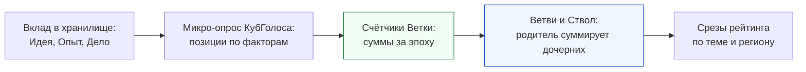

# «КубГолос» как основа инфраструктуры рейтингов: опросы, статистика на Ветках и сводные счётчики

> **Категория:** [Прикладной стек (Applications Suite)](../README.md) · Фокусированный документ (шаг 1 из 3)  
> **Автор архитектуры:** Артём Владимирович Шамсутдинов  
> **Статус:** проектная концепция; сроки реализации не указываются и зависят от материальной поддержки, команды и времени  
> **Связанные документы:**  
> • [VoteCube_architecture_and_functionality.md](VoteCube_architecture_and_functionality.md) — нормативная архитектурная спецификация  
> • [../sapoto/Sapoto_Role_in_Rating_Infrastructure.md](../sapoto/Sapoto_Role_in_Rating_Infrastructure.md) — шаг 2: «Забота»  
> • [../gogetter/GoGetter_Role_in_Rating_Infrastructure.md](../gogetter/GoGetter_Role_in_Rating_Infrastructure.md) — шаг 3: «Деловой»  
> • [../sapoto/Sapoto_architecture_and_functionality.md](../sapoto/Sapoto_architecture_and_functionality.md) — раздел 5.3 (социальный рейтинг вкладов) и раздел 5.4 (экономический рейтинг)

---

## 1. Назначение документа

Системообразующие приложения «Турбазы» прежде всего обеспечивают хранение и обмен базовыми модулями данных, которые вкладываются в хранилища. Однако именно их начальная разработка создаёт техническую инфраструктуру для двух вещей: социальных рейтингов и экономических контрактов второго уровня. Контракты второго уровня становятся связным узлом, соединяющим социальные рейтинги с экономическими.

Три приложения помогают в этом по-разному и в определённой последовательности:

| Шаг | Приложение | Какой слой рейтинговой инфраструктуры закладывает |
|---|---|---|
| 1 | **«КубГолос»** | Опросы как единица оценки, счётчики и статистика на Ветках, агрегация вверх по дереву |
| 2 | «Забота» | Треды, голосование внутри тредов, страницы для просмотра и индексации |
| 3 | «Деловой» | Дела и контракты второго уровня, теги, связь экономического рейтинга с социальным |

Настоящий документ описывает первый шаг. Он подаётся как свод идей: часть из них проектируется для России, но может пригодиться и в других ситуациях и частях мира.

## 2. Что «КубГолос» даёт рейтингам

| Строительный блок | Что это | Зачем он рейтингам |
|---|---|---|
| Микро-опрос по нескольким факторам | Идея и до трёх (в расширенном виде до семи) факторов, у каждого позиция от «за» до «против» в пределах общего бюджета важности | Стандартная форма оценки вклада: оценивается не «хорошо или плохо» одним числом, а позиция по нескольким сторонам вклада |
| Голос как собственная запись голосующего | Каждый участник создаёт свою запись, чужие записи не изменяются; переголосование корректирует итог без двойного учёта | Оценки нельзя подменить; один человек не учитывается дважды |
| Счётчики на Ветках | Ветка накапливает суммы в оперативной памяти и периодически фиксирует блоки эпох (час для «горячих» опросов, сутки для обычных) | Основа для сумм положительных и отрицательных оценок по теме; блоки эпох дают точку фиксации, по которой берётся вес голосующего |
| Агрегация вверх по дереву | Каждая Ветка суммирует ответы по своим вопросам, родительская Ветвь суммирует суммы дочерних | Тот же приём применяется к рейтингу вкладов по теме: подтема → тема → супертема → Ствол |
| Дерево категорий и поиск | Иерархия тем, поиск по буквенному дереву, теги и пересечение тегов | Привязка вклада к теме и поиск рейтинга по теме |
| Три шкалы консенсуса | Результат (практический опыт), Эксперты (вес по репутации в теме), Народ (один человек — один голос) | Готовая схема: рядом показываются взвешенный и невзвешенный результаты |
| Режимы регистрации на Ветке | Полная анонимность, социальная анонимность, поимённая регистрация | Рейтинг привязывается к регистрации и её статусу |
| Квоты и ограничение частоты | Ограничение числа новых факторов и частоты дельт | Первая линия защиты от накрутки |

Счётчики и страницы названы в спецификации двумя платформенными примитивами, которые зарождаются в «КубГолосе» и «Заботе», а затем выводятся на уровень ядра платформы. Счётчики предназначены именно для высокоскоростного сбора метрик, рейтингов и согласий.

## 3. Как из опросов получается рейтинг вкладов

1. **Оцениваемый объект.** Оценивается вклад (реплика, Идея, Опыт, выполненное Дело), а не человек. Вклад лежит в хранилище, где он создан.
2. **Опрос.** К вкладу присоединяется микро-опрос. Набор факторов оценки ведут разработчики приложений и пользователи; в «КубГолосе» уже заложены создание и версионирование факторов и вопросов.
3. **Счётчики.** Ветка складывает позиции участников. Для рейтинга по теме суммируются положительные и отрицательные массы по автору и теме.
4. **Эпохи.** Вес голоса в эпоху N берётся по рейтингу голосующего, зафиксированному в блоке эпохи N−1. Так рейтинг не взвешивает сам себя внутри одного расчёта.
5. **Дерево.** Суммы поднимаются вверх по тематическому и географическому деревьям Веток. Единый общий балл человека по умолчанию не выводится: публикуются срезы по теме, региону, тегу.

Формулы агрегации, ограничения вклада мнений и защитные механизмы приведены в разделе 5.3 архитектурной спецификации «Заботы» и не дублируются здесь.

## 4. Границы роли «КубГолоса»

- «КубГолос» не считает рейтинг человека целиком и не ведёт единого балла. Он поставляет оценки вкладов и счётчики.
- Вес голосующих в рейтинговых расчётах определяется по рейтингу в теме; сам рейтинг «КубГолос» не хранит как отдельную сущность.
- Экономический (кредитный) рейтинг «КубГолос» не затрагивает: его ведёт Банк России. Опросы служат только добровольной обратной связью участников по работе и информации.
- Семейные и групповые опросы остаются в частных хранилищах и на Ветках не индексируются; Ветка передаёт зашифрованные дельты как ретранслятор, а итоги считаются на Листах участников.

## 5. Что потребуется от следующих шагов

- От «Заботы»: треды, где появляются оцениваемые вклады, подтверждающий Опыт (шкала Результата) и страницы, по которым вклады можно просматривать и индексировать.
- От «Делового»: Дела и контракты второго уровня, в которых оценка работы связывается с исполнением обязательств, и теги, позволяющие собрать срез рейтинга по нескольким темам.

## 6. Открытые вопросы

- Какие наборы факторов оценки вклада считать типовыми и кто их утверждает для каждой темы: решается операторами тем, разработчиками приложений и пользователями.
- Параметры сумм, эпох и весов (начальные значения приведены в спецификации «Заботы») подбираются симуляцией.
- Защита прав пользователя на публичный рейтинг, доступ к отдельным темам и меры против подбора порогов проверки прорабатываются отдельно.

## 7. Источники

Авторские заметки по «КубГолосу» (разделы «Агрегация» и «Инфраструктура»), раздел «Экономический потенциал»; `VoteCube_architecture_and_functionality.md`: разделы 3.4, 5.4–5.6, 6.2, 6.5, 7.1, 8.1–8.3; `README.md`: раздел 5 о трёх шкалах консенсуса.
