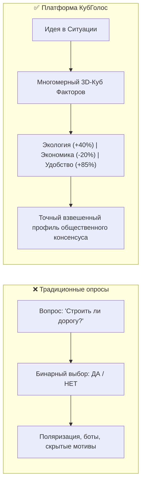
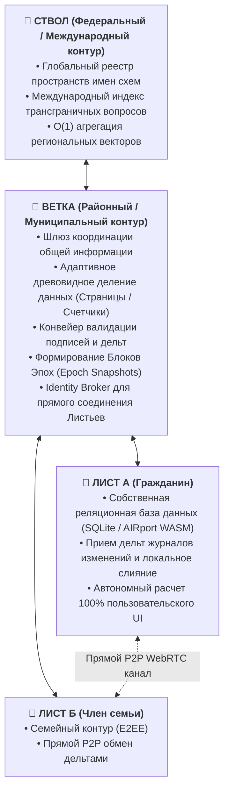
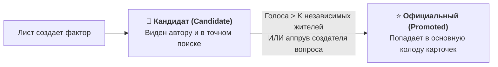

# Архитектурная спецификация платформы «КубГолос» (VoteCube)

**Нормативный инженерно-технический документ**  
*Версия: 1.0 (2026)*  
*Статус: Общественная архитектурная спецификация*  
*Классификация: Распределенные системы принятия решений, многомерное волеизъявление, трехуровневая топология данных*  
*Автор архитектуры: Артём Владимирович Шамсутдинов*  
*Репозитории проекта: [`votecube.com`](file:///Users/parents/Documents/data-independence-network/votecube.com), [`votecube-client-logic`](file:///Users/parents/Documents/data-independence-network/votecube-client-logic), [`sapoto.net`](file:///Users/parents/Documents/data-independence-network/sapoto.net)*  
*Базовая среда: Платформа цифрового суверенитета «Турбаза» / Реляционное ядро [AIRport](https://github.com/beyond-decentralized/AIRport)*

---

## Оглавление

1. [Концептуальное видение и философия волеизъявления](#1-концептуальное-видение-и-философия-волеизъявления)
2. [Эргономика и гибридный интерфейс пользователя (UI/UX)](#2-эргономика-и-гибридный-интерфейс-пользователя-uiux)
3. [Математический аппарат и алгоритмы взвешивания](#3-математический-аппарат-и-алгоритмы-взвешивания)
4. [Реляционная модель данных и DDL-классы (AIRport / SQLite)](#4-реляционная-модель-данных-и-ddl-классы-airport--sqlite)
5. [Сетевая топология, конвейер Ветки и репликация](#5-сетевая-топология-конвейер-ветки-и-репликация)
6. [Антифрод, квотирование и жизненный цикл факторов](#6-антифрод-квотирование-и-жизненный-цикл-факторов)
7. [Временная динамика, блоки эпох и юридическая фиксация](#7-временная-динамика-блоки-эпох-и-юридическая-фиксация)
8. [Древовидный поиск (TreeSearch), Trie-индексация и трансграничная федерация](#8-древовидный-поиск-treesearch-trie-индексация-и-трансграничная-федерация)

---

## 1. Концептуальное видение и философия волеизъявления

### 1.1. Преодоление бинарного кризиса
Традиционные системы голосований и опросов страдают от системного упрощения реальности: гражданам навязываются бинарные формулировки («Да» или «Нет»), которые поляризуют общество, скрывают реальную мотивацию участников и провоцируют манипуляции.

Платформа **«КубГолос» (VoteCube)** вводит принципиально новую культуру волеизъявления: **многофакторный взвешенный консенсус**. Любая сложная социальная, градостроительная, экономическая или семейная проблема декомпозируется на систему взаимосвязанных факторов, где каждый фактор имеет аргументы «ЗА» и «ПРОТИВ».



### 1.2. Метафора 3D-куба
Оригинальная метафора «КубГолоса» опирается на физическую геометрию трехмерного куба:
* Три взаимно-перпендикулярные плоскости пространства соответствуют **трем ключевым факторам** проблемы.
* Противоположные грани каждой плоскости представляют аргументы **«ЗА»** и **«ПРОТИВ»**.
* При любом угле обзора наблюдатель видит **от 1 до 3 граней одновременно**, физически не имея возможности видеть противоположные грани одной и той же плоскости (человек не может одновременно безоговорочно соглашаться с взаимоисключающими крайностями одного фактора).
* Видимая площадь граней математически определяет относительную важность (вес) каждого аргумента, нормализованную к 100%.

### 1.3. Контекстуализация волеизъявления: Ситуация, Идея, Топики и Иерархия Схем
Один из фундаментальных архитектурных прорывов платформы — строгая однонаправленная иерархия схем данных:
$$\text{КубГолоса (VoteCube)} \longleftarrow \text{Забота (Sapoto)} \longleftarrow \text{Деловой (GoGetter)}$$

* **Схема «КубГолоса» (`@votecube/votecube`)** является фундаментальной, независимой базовой схемой платформы DIN. Она не зависит от прикладных социальных или исполнительских модулей.
* **Схема «Заботы» (`@sapoto/main`)** напрямую зависит от «КубГолоса». (Схема `@sapoto/core` полностью упразднена, так как концепции перенесены непосредственно в `@votecube/votecube`).
* **Схема «Делового» (`@gogetter/main` на базе `@airline/tasks`)** напрямую зависит от «Заботы» и «КубГолоса».

В этой модели разграничиваются абстрактный принцип и жизненный контекст:
1. **Единое дерево Топиков (`Topic`):**
   * Сущности `Theme`, `SubTheme` и `SubTopic` полностью упразднены. Вся категоризация и тематические деревья платформы строятся на универсальной самореферентной сущности `Topic` в `@votecube/votecube` (`parentTopic: Topic`).
   * Навигация по дочерним топикам осуществляется через систему **Самозапечатывающихся страниц** `TopicPage` (типы страниц: `COMMON = 1`, `SAPOTO = 2`, `VOTECUBE = 3`), а привязка ситуаций — через страницы `TopicSituationPage` (типы: `GENERAL = 1`, `SPECIFIC = 2`).
2. **Ситуация (`Situation`):**
   * Базовая сущность контекста, обстановки или вызова, определяемая непосредственно в схеме «КубГолоса».
   * Имеет классификацию `type: Situation_Type`:
     - `GENERAL = 1` (Общая ситуация — абстрактная проблема, объединяющая через механизм страниц `SituationPage` множество похожих реальных случаев);
     - `SPECIFIC = 2` (Частная ситуация — конкретная прикладная обстановка).
   * Содержит формулировку проблемы (`text`), общие координаты матрицы Эйзенхауэра (`urgencyTotal`, `importanceTotal`), ссылку на `topic: Topic` и коллекцию оцениваемых решений `situationIdeas: SituationIdea[]`.
   * Приложение «Забота» формулирует **Реальные Случаи (`Case`)**, которые привязаны к Общей Ситуации КубГолоса (отношение $1:N$), используя страницы для агрегации и масштабирования.
3. **Идея (`Idea`):** Абстрактное предложение, метод решения или норма (в схеме «КубГолоса»).
4. **Идея в обстановке (`SituationIdea`):** Внутренний связующий узел в схеме «КубГолоса», фиксирующий применимость конкретной Идеи к конкретной Ситуации. Одна и та же идея в контексте двора жилого дома может получить 95% поддержки, а в промзоне — 5%. Система строит объективную контекстную карту решений, избегая оторванного от реальности «среднего арифметического».


---

## 2. Эргономика и гибридный интерфейс пользователя (UI/UX)

Интерфейс «КубГолоса» объединяет интуитивную наглядность трехмерного манипулятора и функциональную мощь структурированного списка карточек.

### 2.1. Компоновка экрана (Master Layout)

```
┌─────────────────────────────────────────────────────────────────────────┐
│                      ШАПКА ЭКРАНА ОПРОСА (TOP BAR)                      │
├───────────────────┬───────────────────────────────┬─────────────────────┤
│ 🎲 МИНИ-КУБ       │ 📊 ГОРИЗОНТАЛЬНЫЙ БАРЧАРТ     │ 🔲 МИНИ-КАРТОЧКИ   │
│ [Топ-3 фактора]   │    [ ◄ Против | 0 | За ► ]    │    «А» и «Б»        │
│ Нажатие открывает │    Узкий по вертикали,        │    Быстрое пере-    │
│ большой 3D-куб    │    отображает все N факторов  │    ключение видов   │
├───────────────────┴───────────────────────────────┴─────────────────────┤
│               ОСНОВНАЯ ОБЛАСТЬ: ПРОДОЛГОВАТЫЕ КАРТОЧКИ ФАКТОРОВ         │
├─────────────────────────────────────────────────────────────────────────┤
│ 🎴 ФАКТОР 1 (Топ-1 в кубе): [Флип: За / Против] [Слайдер веса: 50%]     │
│ 🎴 ФАКТОР 2 (Топ-2 в кубе): [Флип: За / Против] [Слайдер веса: 30%]     │
│ 🎴 ФАКТОР 3 (Топ-3 в кубе): [Флип: За / Против] [Слайдер веса: 20%]     │
│ ─────────────────────────────────────────────────────────────────────── │
│ 🎴 ФАКТОР 4 (Вне куба):     [Флип: За / Против] [Слайдер веса:  0%]     │
│ 🎴 ФАКТОР 5 (Вне куба):     [Флип: За / Против] [Слайдер веса:  0%]     │
│ ➕ [Предложить свой фактор]                                             │
└─────────────────────────────────────────────────────────────────────────┘
```

### 2.2. Механика взаимодействия компонентов
1. **Мини-куб (вверху слева):**
   * Компактный 3D-виджет, в реальном времени отражающий текущую ориентацию трех доминирующих факторов.
   * Клик по мини-кубу разворачивает полноэкранный модальный манипулятор 3D-куба с поддержкой свободного жестового вращения (Touch / Mouse Drag).
2. **Горизонтальный расходящийся барчарт (вверху по центру):**
   * Отображает распределение голосов по всем доступным факторам вопроса;
   * Точка отсчета $0$ строго по центру: отклонение влево — аргументы «ПРОТИВ», вправо — «ЗА»;
   * Толщина полосы отражает общую значимость фактора в выборке.
3. **Колода продолговатых карточек (основная область):**
   * Каждая карточка представляет собой фактор с аргументами «За» (Грань А) и «Против» (Грань Б);
   * Клик по карточке производит 3D-флип анимацию, инвертируя знак ответа;
   * Ползунок слайдера позволяет тонко задать процентный вес фактора.

### 2.3. Алгоритм ротации Топ-3 (Cube Focus Transition)
Когда пользователь вращает 3D-куб или настраивает слайдеры карточек:
* Сумма площадей трех видимых граней куба всегда проецируется на доступный для куба бюджет весов.
* **Пороговое условие выбывания:** Если при вращении куба площадь одной из граней падает ниже критического порога $\epsilon = 5\%$, активируется механизм перехода:
  * **Мягкое ограничение (Soft Constraint):** Элемент управления кубом оказывает пружинящее сопротивление; при продолжении движения система отображает подтверждение: *«Заменить выбывающий фактор на следующий по приоритету из списка?»*;
  * **Жесткое ограничение (Hard Constraint):** Вращение ограничивается предельным конусом, удерживающим текущую тройку лидеров.
* **Бесшовная смена грани ($S = 0$):** Текстура и текст нового фактора подменяются на грани куба строго в момент, когда грань полностью отвернута от наблюдателя (ее нормаль ортогональна или направлена от камеры, $S = 0$).

### 2.4. Модульность интерфейсов и композиция примитивов (включая «УраРан» / «УраТур»)
> [!NOTE]
> **Асимметрия слоев данных и интерфейсов**:
> Хотя на уровне схем данных и бизнес-логики действует строгая односторонняя иерархия зависимостей:
> $$\text{КубГолоса (VoteCube)} \longleftarrow \text{Забота (Sapoto)} \longleftarrow \text{Деловой (GoGetter)}$$
> **на уровне пользовательских интерфейсов все три системы декомпозированы на независимые атомарные примитивы** (микро-виджеты).

Интерфейсные примитивы «КубГолоса» могут независимо встраиваться и работать в связке с примитивами «Заботы» и «Делового»:
* **В сквозной демонстрации (Фаза 1)** — объединены в единое веб-приложение с 4-вкладочным нижним таб-баром.
* **В веб-компонентах (Фаза 2)** — как переносимый кастомный элемент `<votecube-widget>` на базе **Svelte 5** (включая микро-виджеты: мини-куб, полноэкранный 3D-манипулятор, расходящийся барчарт и карточки факторов).
* **В прикладных приложениях платформы, таких как «УраРан» / «УраТур» (Urarun)** — как компактный виджет экспресс-оценки обстановки на маршруте или полевом мероприятии по 3 ключевым факторам (например: общая цель, тактическая безопасность, физическое состояние группы), дополняемый фиксацией оперативных ситуаций из «Заботы» и чек-листами полевых задач из «Делового».

---

## 3. Математический аппарат и алгоритмы взвешивания

### 3.1. Геометрическая матрица проекций (`CubeMoveMatrix`)
Математический фундамент вращения куба реализован в коде библиотеки [`libs/cube-logic`](file:///Users/parents/Documents/data-independence-network/votecube.com/libs/cube-logic):
* Сфера вращения разбита на **72 дискретных деления** с шагом квантования $5^\circ$ ($72 \times 5^\circ = 360^\circ$);
* Поддерживаются дискретные шаги перемещения: $\Delta \theta \in \{5^\circ, 15^\circ, 45^\circ\}$ (`MoveIncrement`);
* Матрица значений `PositionValues` задает шестерку проекций на 3 ортогональные оси координат ($X, Y, Z$):
  $$\vec{P} = [P_{X+}, P_{X-}, P_{Y+}, P_{Y-}, P_{Z+}, P_{Z-}]$$
  при этом для любой оси $K \in \{X, Y, Z\}$ выполняется инвариант взаимоисключения:
  $$P_{K+} \cdot P_{K-} \equiv 0$$

### 3.2. Расчет площадей граней
Для вектора взгляда камеры $\vec{V} = (0, 0, -1)$ и единичных нормалей граней куба $\vec{N}_k$ видимая площадь грани $k \in \{1, 2, 3\}$ вычисляется через скалярное произведение:

$$S_k = \max\left(0, \; \vec{N}_k \cdot \vec{V}\right)$$

Относительный вес фактора $k$ внутри триады куба:

$$w_k^{\text{cube}} = \frac{S_k}{\sum_{i=1}^3 S_i}$$

### 3.3. Двухуровневая нормализация весов (Модель Б)
Пусть в вопросе участвуют $M$ факторов, из которых 3 находятся в фокусе куба, а $M - 3$ настраиваются дополнительно:
* Каждому фактору $j$ присваивается абсолютный вес $W_j \ge 0$, при этом гарантируется балансовый инвариант:
  $$\sum_{j=1}^M W_j = 100\% \quad (1.0)$$
* Если куб охватывает долю $C_{\text{cube}} \in (0, 1]$ от общего бюджета (по умолчанию $C_{\text{cube}} = 1.0$, если остальные факторы не активированы), то для факторов в кубе:
  $$W_k = C_{\text{cube}} \times w_k^{\text{cube}}, \quad k \in \{1, 2, 3\}$$
* При активации вспомогательного фактора $m > 3$ со слайдером $W_m$:
  $$C_{\text{cube}} = 1.0 - \sum_{m=4}^M W_m$$
  при этом куб пропорционально масштабирует свои грани без нарушения взаимного соотношения углов.

### 3.4. Двумерная метрика аналитической выдачи
Для каждого фактора $j$ при агрегации на Ветке рассчитываются **два независимых показателя**:
1. **Значимость / Релевантность фактора ($\bar{W}_j$):** Доля внимания, которую сообщество уделило данному фактору:
   $$\bar{W}_j = \frac{1}{N} \sum_{i=1}^N W_{ij} \quad \in [0, 100\%]$$
   *(Визуализируется толщиной или яркостью полосы на барчарте)*.
2. **Позиция / Станс согласия ($\bar{V}_j$):** Баланс мнений среди тех, кто посчитал фактор значимым ($W_{ij} > 0$):
   $$\bar{V}_j = \frac{\sum_{i=1}^N W_{ij} \cdot v_{ij}}{\sum_{i=1}^N W_{ij}} \quad \in [-100\%, +100\%]$$
   где $v_{ij} \in \{-1, +1\}$ или $[-100, +100]$ — выбор между аргументом «Против» и «За». *(Визуализируется длиной и направлением полосы от нуля)*.
3. **Итоговый интегральный индекс вопроса:**
   $$\text{TotalIndex} = \sum_{j=1}^M \bar{W}_j \cdot \bar{V}_j \quad \in [-100\%, +100\%]$$

---

## 4. Реляционная модель данных и DDL-классы (AIRport / SQLite)

Архитектура хранения полностью базируется на принципах открытого стека **AIRport**:
* Каждая сущность расширяет базовый класс `AirEntity`;
* Первичный ключ формируется триплетом: `(RepositoryId, ActorId, ActorRecordId)`.

### 4.1. Канонические DDL-классы TypeScript (`@airport/tarmaq-entity`)

#### 1. Универсальный контракт постраничной навигации (`IChildRecordPage.ts`)
```typescript
export interface IChildRecordPage<PageType, ParentRecord, ChildRecord = ParentRecord> {
    type: PageType;
    parent: ParentRecord;
    children: ChildRecord[];
    branchPage?: IChildRecordPage<PageType, ParentRecord, ChildRecord>;
    childPages?: IChildRecordPage<PageType, ParentRecord, ChildRecord>[];
}
```

#### 2. Универсальный Топик (`Topic.ts`)
```typescript
import { AirEntity } from "@airport/final-approach";
import { Entity, ManyToOne, OneToMany, Table } from "@airport/tarmaq-entity";
import { TopicPage } from "./TopicPage";
import { TopicSituationPage } from "./TopicSituationPage";

export type Topic_Name = string;
export type Topic_Description = string;
export type Topic_ImagePath = string;

@Entity()
@Table({ name: 'TOPICS' })
export class Topic extends AirEntity {

    name!: Topic_Name;
    description!: Topic_Description;
    imagePath!: Topic_ImagePath;

    @ManyToOne({ optional: true })
    parentTopic?: Topic;

    // Ссылка на страницу Топиков, в которую входит данный топик (если топик распределен по страницам)
    @ManyToOne({ optional: true })
    parentTopicPage?: TopicPage;

    // Страницы дочерних топиков (для масштабирования связей 1:N)
    @OneToMany({ mappedBy: 'parent' })
    childTopicPages!: TopicPage[];

    // Страницы ситуаций данного топика
    @OneToMany({ mappedBy: 'parent' })
    situationPages!: TopicSituationPage[];
}
```

> [!NOTE]
> **Межрепозиторные связи и «гравитационный кэш» в AIRport**:
> В децентрализованной архитектуре AIRport каждая Страница (`TopicPage`, `SituationPage`) является **независимым Хранилищем (Repository)**. Межрепозиторные ссылки компилируются не в классические внешние ключи единой таблицы, а в **составные ключи `(RepositoryId, ActorId, ActorRecordId)`**. Внутри страницы хранится локально кэшированный срез ссылок и базовых метаданных дочерних записей («гравитационный кэш» денормализации), что позволяет Листу мгновенно рендерить срез без обращения к внешним узлам.

#### 3. Страница Топиков (`TopicPage.ts`)
```typescript
import { Column, Entity, ManyToOne, OneToMany, Table } from "@airport/tarmaq-entity";
import { Topic } from "./Topic";
import { AirEntity } from "@airport/final-approach";
import { IChildRecordPage } from "../../common/IChildRecordPage";

export enum TopicPage_Type {
    COMMON = 1,
    SAPOTO = 2,
    VOTECUBE = 3,
}

@Entity()
@Table({ name: 'TOPIC_PAGES' })
export class TopicPage
    extends AirEntity
    implements IChildRecordPage<TopicPage_Type, Topic> {

    @Column({ name: 'TYPE', nullable: false })
    type!: TopicPage_Type;

    // Родительский топик, к которому относится данная страница
    @ManyToOne()
    parent!: Topic;

    // Дочерние топики, включенные в данную страницу (~1000 элементов)
    @OneToMany({ mappedBy: 'parentTopicPage' })
    children!: Topic[];

    @ManyToOne({ optional: true })
    parentPage?: TopicPage;

    // При заполнении ~1000 дочерних записей создаются новые ветви страниц
    @OneToMany({ mappedBy: 'parentPage' })
    childPages?: TopicPage[];
}
```

#### 4. Страница Ситуаций в Топике (`TopicSituationPage.ts`)
```typescript
import { Column, Entity, ManyToOne, OneToMany, Table } from "@airport/tarmaq-entity";
import { Topic } from "./Topic";
import { AirEntity } from "@airport/final-approach";
import { IChildRecordPage } from "../../common/IChildRecordPage";
import { Situation, Situation_Type } from "../situation/Situation";

@Entity()
@Table({ name: 'TOPIC_SITUATION_PAGES' })
export class TopicSituationPage
    extends AirEntity
    implements IChildRecordPage<Situation_Type, Topic, Situation> {

    @Column({ name: 'TYPE', nullable: false })
    type!: Situation_Type;

    @ManyToOne()
    parent!: Topic;

    @OneToMany({ mappedBy: 'parent' })
    children!: Situation[];

    @ManyToOne()
    parentPage?: TopicSituationPage;

    @OneToMany({ mappedBy: 'parentPage' })
    childPages?: TopicSituationPage[];
}
```

#### 5. Базовый узел контекста обстановки (`Situation.ts`)
```typescript
import { AirEntity } from "@airport/final-approach";
import { Column, Entity, ManyToOne, OneToMany, Table, Transient } from "@airport/tarmaq-entity";
import { SituationRating } from "./SituationRating";
import { Topic } from "../topic/Topic";
import { SituationPage } from "./SituationPage";
import { SituationIdea } from "../idea/SituationIdea";

export enum Situation_Type {
    GENERAL = 1,
    SPECIFIC = 2,
}

export enum SituationRating_Importance {
    VERY_LOW = 1,
    LOW = 2,
    MEDIUM = 3,
    HIGH = 4,
    VERY_HIGH = 5
}

export enum SituationRating_Urgency {
    VERY_LOW = 1,
    LOW = 2,
    MEDIUM = 3,
    HIGH = 4,
    VERY_HIGH = 5
}

@Entity()
@Table({ name: 'SITUATIONS' })
export class Situation extends AirEntity {

    @Column({ name: 'TYPE', nullable: false })
    type!: Situation_Type;

    @Column({ name: 'TEXT', nullable: false })
    text!: string;

    // Инвариант «Write-Self»: внешние участники не мутируют запись автора Situation!
    // Суммарные оценки срочности/важности рассчитываются динамически на Листе через SQL-запросы
    // либо аккумулируются в оперативной памяти Ветки (Counters) и фиксируются в EpochBlock.
    @Transient()
    urgencyTotal?: number = 0;

    @Transient()
    numberOfUrgencyRatings?: number = 0;

    @Transient()
    importanceTotal?: number = 0;

    @Transient()
    numberOfImportanceRatings?: number = 0;

    // Ссылка на страницу Ситуаций, если ситуация включена в самозапечатывающуюся страницу
    @ManyToOne({ optional: true })
    parentSituationPage?: SituationPage;

    // Страницы дочерних ситуаций / случаев (для масштабирования связей 1:N)
    @OneToMany({ mappedBy: 'parent' })
    situationPages: SituationPage[] = [];

    @ManyToOne()
    topic!: Topic;

    @OneToMany({ mappedBy: 'situation' })
    situationIdeas: SituationIdea[] = [];

    @OneToMany({ mappedBy: 'situation' })
    ratings?: SituationRating[];

    @Transient()
    userRating?: SituationRating;
}
```

#### 6. Страница Ситуаций (`SituationPage.ts`)
```typescript
import { Column, Entity, ManyToOne, OneToMany, Table } from "@airport/tarmaq-entity";
import { AirEntity } from "@airport/final-approach";
import { IChildRecordPage } from "../../common/IChildRecordPage";
import { Situation, Situation_Type } from "./Situation";

@Entity()
@Table({ name: 'SITUATION_PAGES' })
export class SituationPage
    extends AirEntity
    implements IChildRecordPage<Situation_Type, Situation> {

    @Column({ name: 'TYPE', nullable: false })
    type!: Situation_Type;

    // Родительская ситуация, к которой привязана данная страница
    @ManyToOne()
    parent!: Situation;

    // Дочерние ситуации или случаи, включенные в данную страницу (~1000 элементов)
    @OneToMany({ mappedBy: 'parentSituationPage' })
    children!: Situation[];

    @ManyToOne({ optional: true })
    parentPage?: SituationPage;

    @OneToMany({ mappedBy: 'parentPage' })
    childPages?: SituationPage[];
}
```


#### 2. Сущность Идеи / Вопроса (`Idea.ts`)
```typescript
import { AirEntity } from '@airport/final-approach'
import {
    Column,
    Entity,
    ManyToOne,
    OneToMany,
    Table,
    Transient
} from '@airport/tarmaq-entity'
import { SituationIdea } from './SituationIdea'
import { Agreement } from '../agreement/Agreement'
import { IdeaReason } from '../reason/IdeaReason'

@Entity()
@Table({ name: 'IDEAS' })
export class Idea extends AirEntity {

    @Column({ name: 'NAME', nullable: false })
    name: string

    // ИНВАРИАНТ «READ-ANYWHERE, WRITE-SELF»:
    // Создатель Idea фиксирует исходный объект. Внешние голосующие НЕ мутируют строку автора!
    // Каждый участник создает собственный независимый Agreement (со своим ActorId).
    // Итоговые показатели рассчитываются на Листе локально через SQL (COUNT/SUM)
    // либо агрегируются в оперативной памяти Ветки (Counters) и фиксируются в EpochBlock.
    @Transient()
    agreementShareTotal: number = 0

    @Transient()
    numberOfAgreements: number = 0

    @Transient()
    urgencyTotal: number = 0

    @Transient()
    numberOfUrgencyRatings: number = 0

    @Transient()
    numberOfReasons: number = 0

    @ManyToOne({ optional: true })
    parent: Idea

    @OneToMany({ mappedBy: 'parent' })
    children: Idea[] = []

    @OneToMany({ mappedBy: 'idea' })
    agreements: Agreement[] = []

    @OneToMany({ mappedBy: 'idea' })
    ideaReasons: IdeaReason[] = []

    @OneToMany({ mappedBy: 'idea' })
    situationIdeas: SituationIdea[] = []
}
```

#### 3. Связующий узел контекста («Идея в обстановке» / `SituationIdea.ts`)
```typescript
import { AirEntity } from "@airport/final-approach"
import {
    Column,
    Entity,
    ManyToOne,
    OneToMany,
    Table,
    Transient
} from "@airport/tarmaq-entity"
import { Situation } from "../Situation"
import { Agreement, Idea } from "../ddl"
import { IdeaReason } from "../reason/IdeaReason"

@Entity()
@Table({ name: 'SITUATION_IDEAS' })
export class SituationIdea extends AirEntity {

    // Инвариант «Write-Self»: агрегированные метрики согласий, срочности и приоритета
    // не мутируют запись, а вычисляются динамически на Листе или Ветке.
    @Transient()
    agreementShareTotal: number = 0

    @Transient()
    numberOfAgreements: number = 0

    @Transient()
    priorityTotal: number = 0

    @Transient()
    numberOfPriorityRatings: number = 0

    @Transient()
    urgencyTotal: number = 0

    @Transient()
    numberOfUrgencyRatings: number = 0

    @Transient()
    numberOfReasons: number = 0

    @ManyToOne()
    idea: Idea

    @ManyToOne()
    situation: Situation

    @OneToMany({ mappedBy: 'situationIdea' })
    agreements: Agreement[] = []

    @OneToMany({ mappedBy: 'situationIdea' })
    ideaReasons: IdeaReason[] = []
}
```

#### 3. Сущность волеизъявления (`Agreement.ts` и `AgreementIdeaReason.ts`)
```typescript
import { AirEntity } from "@airport/final-approach"
import { Column, Entity, ManyToOne, OneToMany, Table } from "@airport/tarmaq-entity"
import { Idea } from "../idea/Idea"
import { SituationIdea } from "../idea/SituationIdea"
import { AgreementIdeaReason } from "./AgreementIdeaReason"

@Entity()
@Table({ name: 'AGREEMENTS' })
export class Agreement extends AirEntity {

    @Column({ name: "SHARE_TOTAL" })
    shareTotal: number

    @ManyToOne({ optional: true })
    situationIdea?: SituationIdea

    @ManyToOne({ optional: true })
    idea?: Idea

    @OneToMany({ mappedBy: 'agreement' })
    agreementIdeaReasons: AgreementIdeaReason[] = []
}

@Entity()
@Table({ name: 'AGREEMENT_IDEA_REASONS' })
export class AgreementIdeaReason extends AirEntity {

    @Column({ name: "SHARE", nullable: false })
    share: number // 0 - 100%

    @ManyToOne()
    agreement: Agreement

    @ManyToOne()
    ideaReason: IdeaReason
}
```

#### 4. Конфигурация отображения куба (`ReasonCubeDisplay.ts`)
```typescript
import { AirEntity } from '@airport/final-approach'
import { Column, DbNumber, DbString, Entity, Table } from '@airport/tarmaq-entity'

@Entity()
@Table({ name: 'REASONS_CUBE_DISPLAYS' })
export class ReasonCubeDisplay extends AirEntity {

    @Column({ name: 'FACTOR_COORDINATE_AXIS', nullable: false })
    @DbString()
    axis: 'x' | 'y' | 'z'

    @Column({ name: 'POSITION_ORIENTATION', nullable: false })
    @DbNumber()
    dir: -1 | 1 // -1 = Против (Грань Б), 1 = За (Грань А)

    @Column({ name: 'FACTOR_NUMBER', nullable: false })
    @DbNumber()
    factorNumber: 1 | 2 | 3

    @Column({ name: 'COLOR_BLUE', nullable: false })
    blue: number

    @Column({ name: 'COLOR_GREEN', nullable: false })
    green: number

    @Column({ name: 'COLOR_RED', nullable: false })
    red: number
}
```

### 4.2. Сущность Блока Эпохи (`EpochBlock.ts`) и схема таблиц SQLite

#### 1. Канонический DDL Блока Эпохи (`EpochBlock.ts`)
Блоки эпох синхронизируются между Веткой и Листьями как стандартные сущности **AIRport (`AirEntity`)**. Ветка публикует `EpochBlock` в репозиторий вопроса, подписывая запись своим `ActorId`:

```typescript
import { AirEntity } from '@airport/final-approach'
import { Column, Entity, Table } from '@airport/tarmaq-entity'

@Entity()
@Table({ name: 'EPOCH_BLOCKS' })
export class EpochBlock extends AirEntity {

    @Column({ name: 'QUESTION_REPO_ID', nullable: false })
    questionRepoId!: string;

    @Column({ name: 'EPOCH_INDEX', nullable: false })
    epochIndex!: number;

    @Column({ name: 'TIMESTAMP_START', nullable: false })
    timestampStart!: number;

    @Column({ name: 'TIMESTAMP_END', nullable: false })
    timestampEnd!: number;

    @Column({ name: 'IS_OFFICIAL', nullable: false })
    isOfficial!: boolean;

    @Column({ name: 'VOTES_COUNT', nullable: false })
    votesCount!: number;

    @Column({ name: 'CUMULATIVE_SCORE', nullable: false })
    cumulativeScore!: number;

    @Column({ name: 'FACTORS_ROLLUP', nullable: false })
    factorsRollup!: string; // Сериализованный JSON-вектор сумм факторов

    @Column({ name: 'SIGNATURE_GOST' })
    signatureGost?: string; // Подпись Ветки ГОСТ Р 34.10-2012 для официальных блоков
}
```

#### 2. Реляционные таблицы SQLite на Листе и оперативная таблица Ветки
```sql
-- Таблица блоков исторических снимков (реплицируется на Лист как AirEntity):
CREATE TABLE IF NOT EXISTS EPOCH_BLOCKS (
    REPOSITORY_LID     INTEGER NOT NULL,
    ACTOR_LID          INTEGER NOT NULL,
    ACTOR_RECORD_ID    INTEGER NOT NULL,
    QUESTION_REPO_ID   TEXT NOT NULL,
    EPOCH_INDEX        INTEGER NOT NULL,
    TIMESTAMP_START    INTEGER NOT NULL,
    TIMESTAMP_END      INTEGER NOT NULL,
    IS_OFFICIAL        BOOLEAN DEFAULT 0,
    VOTES_COUNT        INTEGER NOT NULL,
    CUMULATIVE_SCORE   REAL NOT NULL,
    FACTORS_ROLLUP     TEXT NOT NULL, -- Сериализованный JSON-вектор сумм факторов
    SIGNATURE_GOST     TEXT,          -- Подпись Ветки ГОСТ Р 34.10-2012 для официальных блоков
    PRIMARY KEY (REPOSITORY_LID, ACTOR_LID, ACTOR_RECORD_ID)
);

-- Внутренняя оперативная таблица Ветки (НЕ реплицируется на Листья, используется для Leaky Bucket квот):
CREATE TABLE IF NOT EXISTS user_factor_quotas (
    actor_id           TEXT NOT NULL,
    question_repo_id   TEXT NOT NULL,
    daily_count        INTEGER DEFAULT 0,
    last_action_time   INTEGER NOT NULL,
    reputation_bonus   INTEGER DEFAULT 0,
    PRIMARY KEY (actor_id, question_repo_id)
);
```

---

## 5. Сетевая топология, конвейер Ветки и репликация

### 5.0. Архитектурный принцип: отсутствие традиционного сервера и Листья как реляционные СУБД
* **Отсутствие традиционного сервера приложений:** В архитектуре DIN и «Турбаза» полностью отсутствует понятие традиционного монолитного бэкенд-сервера, исполняющего бизнес-логику и отдающего готовые страницы.
* **Листья как полноценные автономные СУБД:** Аппараты пользователей (Листья) получают дополнения в журналах изменений хранилищ (WAL-дельты) и автономно объединяют их в своей собственной локальной реляционной базе данных (SQLite / AIRport WASM). Вся выборка, фильтрация и реляционные объединения происходят непосредственно на устройстве.
* **Шлюзы Веток и Ветвей с адаптивным древовидным разделением:** Ветки (муниципальные) и Ветви (кооперативные) функционируют не как серверы приложений, а как высокопроизводительные шлюзы данных. Однако в рамках систем «КубГолоса» и «Забота» эти шлюзы берут на себя **дополнительные специализированные функции координации общей информации**:
  * общая информация делится **различными древовидными методами подбора в зависимости от вида информации**:
    1. *Деревья страниц (`IChildRecordPage`)*: структурирование неограниченных связей 1:N (треды реплик, списки случаев) на компактные самозапечатывающиеся репозитории;
    2. *Деревья категорий и топиков*: иерархическая классификация тем с обработкой родительских срезов вверх по дереву (upstream);
    3. *Накопительные счетчики (Counters) и Блоки Эпох*: агрегация волеизъявлений, квот и 3D-векторов факторов в оперативной памяти шлюза без дисковых блокировок;
    4. *Территориальные деревья*: маршрутизация по географическому контуру (Район $\to$ Город $\to$ Регион $\to$ Ствол).
* **Связка со внешними поисковиками:** Прямая интеграция со внешними поисковыми системами (Яндекс и др.) через санкционированный потоковый экспорт дельт позволяет индексировать публичные срезы данных, помогая пользователям быстро находить релевантные темы и случаи, после чего Лист загружает журнал изменений целевого микро-хранилища через шлюз Ветки напрямую в свою базу.

Архитектура строго распределена между тремя уровнями:



### 5.1. Паттерн «Каталог Ветки + Микро-хранилища Вопросов» и шлюзы без рендеринга (Zero-Rendering Gateways)
* **Шлюзы без рендеринга (Zero-Rendering Headless Gateways):**
  * Ветки никогда не рендерят HTML, интерфейсные компоненты или графику. Они функционируют исключительно как легковесные шлюзы координации данных, валидации подписей и синхронизации дельт;
  * 100% пользовательского рендеринга (интерактивный 3D-Куб, дерево аргументов, списки страниц, графики Блоков Эпох) выполняется локально на Листьях (браузеры, мобильные устройства) силами их локального движка/WASM/WebGPU.
* **Отказ от монолитного репозитория:** Вся платформа отказывается от идеи хранения всех вопросов в одном файле. Каждый вопрос и его дерево деривативов — это **отдельное микро-хранилище (микро-блокчейн)**.
* **Витрина Ветки:** Сервер Ветки поддерживает легковесный поисковый каталог (индекс метаданных), из которого Лист за 1 мс загружает только интересующий его вопрос.

### 5.2. Двойная иерархия ветвей (Территориальная vs Категориальная) и защита мощностей
Архитектура Веток строго разделена на два взаимодополняющих дерева:
1. **Территориальные суверенные Ветки (Territorial Sovereign Branches):**
   * Организованы по географическо-административному принципу: Ствол (Федерация) $\to$ Регион $\to$ Город / Округ $\to$ Районная Ветка;
   * Выполняют функции защитного входного шлюза (Ingress Gateway): принимают подключения жителей, осуществляют криптографическую валидацию резидентства через Zero-Knowledge Proofs (ZKP), экранируют вычислительные мощности и ведут районный каталог локализованных Ситуаций и Случаев.
2. **Категориальные Ветки Кооперативов платформы (Categorical Branches of Platform Cooperatives):**
   * Формируют нелокализованное иерархическое дерево Топиков и Категорий любой глубины;
   * Обслуживаются и хостятся соответствующими кооперативами платформы (или уполномоченными юридическими лицами);
   * **Поток обработки направлен вверх (Upstream Category Processing):** запросы по родительским категориям направляются вверх по дереву категориальных ветвей кооператива, где они агрегируются, обрабатываются и кэшируются на родительских узлах кооператива.
3. **Изолированный контур вычислений (Air-Gap Compute Nodes):**
   * Вычислительные мощности «КубГолоса» не имеют открытых публичных IP-адресов и полностью скрыты от прямого неавторизованного доступа из сети Интернет;
   * Пользовательские Листы взаимодействуют исключительно со своими суверенными районными Ветками;
   * Районная Ветка выполняет роль шлюза-брандмауэра: валидирует Лист, применяет квоты и передает очищенные пакеты дельт на сервера КубГолоса по **закрытому доверенному mTLS-конвейеру платформы «Турбаза»**;
   * **Экономический эффект:** Арендаторы мощностей гарантированно работают только с проверенными серверами суверенного дерева и полностью освобождены от расходов на построение дорогостоящих внешних систем защиты от DDoS-атак и WAF.
4. **Суверенный экспорт для поисковых систем (Controlled Search Ingress):**
   * Внешние поисковые системы (Яндекс и др.) не сканируют веб-страницы хаотичными краулерами;
   * На уровне Ствола и региональных Ветвей функционирует **санкционированный потоковый фид дельт (JSON-LD Push Stream)**, передающий структурированные обновления исключительно аккредитованным поисковикам;
   * Это обеспечивает абсолютный цифровой суверенитет государства над потоками данных и снижает сетевую нагрузку на серверы практически до нуля.

### 5.3. Двухконтурность: Общественный vs Семейный контуры
1. **Общественный контур:**
   * Опросы публичны, дельты подписываются `ActorId` Листа, конвейер Ветки накапливает суммы в оперативной памяти и периодически закрывает блоки.
2. **Семейный / Корпоративный контур:**
   * Опрос зашифрован симметричным ключом группы (Keyring);
   * **Ветка выступает как «слепой ретранслятор» (Zero-Knowledge Relay):** у Ветки нет ключей расшифровки, она лишь передает зашифрованные WAL-дельты между Листьями;
   * **Агрегация выполняется локально на Листах участников:** каждый Лист семьи расшифровывает дельты домочадцев и локально суммирует баланс в своем SQLite.

### 5.4. Алгоритм переголосования (Revoting)
Поскольку каждый пользователь зарегистрирован на Ветке (по Branch ID, групповому номеру лотереи или по имени), его персональный опросный лист хранится в его личном хранилище:
1. При изменении мнения Лист фиксирует локальную дельту.
2. Ветка принимает пакет от зарегистрированного `ActorId` и атомарно выполняет коррекцию в памяти:
   $$\text{CurrentTotal} \leftarrow \text{CurrentTotal} - \text{Vote}_{\text{old}}(\text{ActorId}) + \text{Vote}_{\text{new}}(\text{ActorId})$$
3. Лист получает подтверждение квитанцией, исключая задвоение голосов.

### 5.5. Компактный бинарный протокол дельты голоса
Для минимизации трафика пакет волеизъявления упаковывается в ультра-компактный буфер:

```
┌─────────────────────────────────────────────────────────────┐
│                 СТРУКТУРА ПАКЕТА ДЕЛЬТЫ ГОЛОСА             │
├──────────────────────────────┬──────────────┬───────────────┤
│ Поле                         │ Тип          │ Размер        │
├──────────────────────────────┼──────────────┼───────────────┤
│ QuestionRepositoryId         │ GUID         │ 16 байт       │
│ FactorBitmask                │ UINT8        │ 1 байт        │
│ FactorValues (до 7 значений) │ INT8[]       │ 1–7 байт      │
│ ModifierByte (резерв)        │ UINT8        │ 1 байт        │
├──────────────────────────────┼──────────────┼───────────────┤
│ ИТОГО РАЗМЕР ПАКЕТА:         │              │ 19–25 байт!   │
└──────────────────────────────┴──────────────┴───────────────┘
```
Использование 1-байтовой битовой маски `FactorBitmask` (где каждый бит $0..6$ указывает, какой из факторов включен в опросный лист) сокращает размер транзакции со 136 байт **до 19–25 байт**, обеспечивая миллионные пропускные способности конвейера Ветки.

### 5.6. Общий платформенный код суверенных Веток: эволюция примитивов («Страницы» и «Счетчики»)
Локальные суверенные Ветки («Турбаза») функционируют на базе **единого платформенного ядра (Common Platform Engine)**.
Приложения «Забота» и «КубГолоса» выступают первопроходцами и полигоном для кристаллизации двух фундаментальных платформенных примитивов:
1. **Страницы (Pages / `IChildRecordPage`)**:
   * Разрабатываются в «Заботе» и базовой схеме для деления связей 1:N, предотвращения раздувания репозиториев и построения самозапечатывающихся B-деревьев.
   * Позволяют Ветке координировать масштабирование каталогов топиков, ситуаций, тредов реплик и любых связанных списков.
2. **Счетчики / Накопители (Counters & In-Memory Rollups)**:
   * Разрабатываются в «КубГолосе» для высоконагруженной агрегации волеизъявлений, сбора баланса факторов в оперативной памяти, отслеживания квот (`Leaky Bucket`) и формирования квантованных Блоков Эпох (Epoch Snapshots).
   * Обеспечивают бесконфликтную O(1) обработку миллионов входящих дельт без блокировки реляционных таблиц на диске.

**Вывод на уровень платформы (Platform Standardization)**:
Хотя эти механизмы на текущем этапе зарождаются и калибруются внутри прикладной логики «Заботы» и «КубГолоса», в дальнейшем они будут **полностью выведены на уровень ядра платформы («Турбаза» / AIRport)**. Все последующие системные и сторонние приложения («Деловой», «УраРан» / «УраТур» и др.) получат возможность «из коробки» использовать готовый платформенный рантайм Ветки:
* масштабировать любые свои коллекции через платформенные **Страницы**;
* вести высокоскоростной сбор метрик, рейтингов и согласий через платформенные **Счетчики**.

---

## 6. Антифрод, квотирование и жизненный цикл факторов

### 6.1. Инвариант Append-Only (Только добавление)
* **Факторы никогда не удаляются:** Если пользователь убирает фактор из своего голоса, фактор не удаляется из системы, а его локальная сумма уменьшается до нуля.
* **Опросы никогда не заканчиваются:** Завершаются лишь временные Блоки Эпох. Система функционирует как вечный непрерывный мониторинг.
* **Исключение рассинхронизаций в офлайне:** Любой голос, отправленный смартфоном после недели нахождения вне сети, гарантированно и бесконфликтно применяется к репозиторию.

### 6.2. Квотирование добавления факторов (Leaky Bucket)
Для предотвращения спама и замусоривания базы факторов Ветка применяет строгий алгоритм капельного счетчика к каждому `ActorId`:
1. **Базовый суточный лимит:** Не более 3 новых факторов к одному вопросу от одного пользователя.
2. **Экспоненциальное охлаждение:** При исчерпании лимита возможность создания факторов замораживается на 24 часа.
3. **Репутационный возврат:** Если созданный пользователем фактор переходит в категорию официальных (`Promoted`) или используется другими участниками, лимит пользователя увеличивается.

### 6.3. Двухуровневый статус факторов


### 6.4. Семантическая дедупликация на лету (TreeSearch & In-Flight Edge SLM)
Для предотвращения фрагментации консенсуса платформа задействует механизм превентивной фильтрации дубликатов:
* **Интеграция TreeSearch и On-Device SLM**: в момент ввода текста Ситуации, Идеи или Причины локальная нейросетевая модель (Edge SLM) Листа строит компактный векторный эмбеддинг и сопоставляет его с иерархическим Trie-индексом Ветки (технология TreeSearch).
* **Превентивная подсказка (In-Flight Suggestion)**: еще до фиксации транзакции в репозитории интерфейс Листа отображает предупреждение: *«Похожая проблема уже обсуждается в вашем районе (семантическое совпадение 87%). Присоединиться к существующей дискуссии?»*. Это снижает появление дублей на 60–80%.
* **Механизм прозрачного алиасинга (Merge & Aliasing)**: если дубликат все же был опубликован, в сущности `Factor` предусмотрено поле `merged_into_factor_id: UUID`, а в `Situation` и `Case` — `merged_into_situation_id` и `merged_into_case_id`. При объединении голоса и связи автоматически суммируются, а старая сущность становится прозрачным редиректом, сохраняя ссылочную целостность истории.

### 6.5. Каноническое определение Actor и криптографические Анонимные Маски
* **Определение `Actor` в архитектуре AIRport:**
  * В открытом стеке AIRport `Actor` строго определяется как: **конкретный пользователь, использующий конкретное приложение на конкретном устройстве**;
  * Первичный ключ любой записи формируется триплетом: `(RepositoryId, ActorId, ActorRecordId)`.
* **Область действия эфемерного ключа (Thread-Scoped / Case-Scoped):**
  * При активации анонимной маски Лист локально генерирует временную пару ключей (`ephemeral ActorId`), действующую **в границах треда конкретного Случая**;
  * Это позволяет автору оставаться последовательным участником диалога («Автор») внутри данного треда и отвечать на уточняющие вопросы участников, сохраняя полную криптографическую анонимность для внешнего мира;
  * Легитимность участия обеспечивается Zero-Knowledge Proofs (ZKP) резидентства на муниципальной Ветке, а заработанная репутация сохраняется через зашифрованные токены.

### 6.6. Трехуровневая модель защиты от атак Сивиллы (Sybil Resistance)
Отказ от централизованной идентификации по паспортам компенсируется трехуровневой архитектурной защитой от бот-ферм и манипуляций:
1. **Криптографический ценз локальности (ZKP Residency Proof)**:
   - Право голоса в территориальных опросах подтверждается математическим доказательством с нулевым разглашением (ZKP) принадлежности к данной муниципальной Ветке. Внешняя бот-ферма не может сгенерировать валидное доказательство без владения локальным суверенным токеном резидентства.
2. **Лимиты скорости и квоты Ветки (`user_factor_quotas`)**:
   - Шлюз Ветки отслеживает частоту транзакций от конкретного `ActorId`. Попытка высокочастотного спама дельтами приводит к автоматическому замораживанию mTLS-сессии устройства без влияния на легитимных соседей.
3. **Байесовский многошкальный фильтр**:
   - Даже при попытке массовой скупки аккаунтов накрутка голосов в «Шкале Народа» изолирована: вес бот-аккаунтов в «Шкале Экспертов» строго равен нулю ($W_{\text{reputation}} = 0$).
   - В «Шкале Результата» консенсус опирается исключительно на реальный подтвержденный опыт (`Experience`), который невозможно сфабриковать виртуальными транзакциями.

---

## 7. Временная динамика, блоки эпох и юридическая фиксация

### 7.1. Квантование истории: Блоки Эпох (Epoch Snapshots)
Вместо непрерывной записи каждого клика на диск Ветка группирует дельты в оперативной памяти и формирует дискретные **Блоки Эпох** (раз в 1 час для горячих голосований, раз в 1 сутки для стандартных):

```json
{
  "blockId": 1042,
  "questionRepoId": "a1b2c3d4-e5f6-7890-abcd-ef1234567890",
  "epochIndex": 42,
  "timestampStart": 1726524000,
  "timestampEnd": 1726610400,
  "isOfficial": false,
  "votesCountDelta": 156,
  "cumulativeVotes": 8940,
  "cumulativeResult": 54.8,
  "factorRollup": {
    "f_ecol": { "weight": 42.1, "stance": 84.5 },
    "f_econ": { "weight": 35.0, "stance": -22.0 },
    "f_safe": { "weight": 22.9, "stance": 91.0 }
  }
}
```
* **Преимущество:** Размер блока составляет всего **~150 байт**. За 1 год накапливается всего **~55 КБ** данных на вопрос. Лист моментально скачивает этот массив и рендерит плавный интерактивный график изменения общественного мнения во времени.

### 7.2. Разделение юридического протокола и общественного мониторинга
* **Официальный срез (`is_official: true`):** В установленный законом дедлайн (например, окончание Общего собрания собственников жилья в ГИС ЖКХ) Ветка фиксирует блок отсечки, подписывает его усиленной квалифицированной электронной подписью (УКЭП) ГОСТ Р 34.10-2012 и выгружает протокол в государственные реестры.
* **Непрерывный мониторинг (`is_official: false`):** Опрос не блокируется для жителей. Следующий блок открывается автоматически, позволяя отслеживать пост-проектную реакцию людей.

### 7.3. Пакетная диспетчеризация уведомлений (Batch Notifications)
Оповещения об активности в вопросах передаются с Ветки на подписанные Листы пакетными интервалами (раз в 1–5 минут):
* Ветка формирует единый дифференциальный отчет: *«В вопросе "Парковка" изменились веса 2 факторов, добавлено 30 голосов»*.
* Это исключает сетевой шторм и сохраняет заряд аккумуляторов мобильных устройств.

### 7.4. Автономность и локальный контур консенсуса (Offline-First & Local Mesh Consensus)
Фундаментальным преимуществом трехуровневой архитектуры «Турбазы» является сохранение полной работоспособности систем волеизъявления даже при полном отключении внешнего магистрального интернета:
* **Локальная устойчивость при блэкаутах (Blackout Resilience)**:
  - В условиях стихийных бедствий, аварий каналов связи или на закрытых собраниях (например, сход жителей в цокольном помещении без мобильной связи) устройства граждан (Листья) организуют прямое пиринговое P2P-взаимодействие через локальный Wi-Fi роутер или Bluetooth-mesh.
  - Если в локальном контуре присутствует локальный микро-сервер Ветки, он принимает на себя функции координатора эпох.
* **Локальные соглашения и локальные Блоки Эпох**:
  - Участники продолжают предлагать Идеи, формулировать Причины и фиксировать волеизъявления (`Agreement`).
  - Локальный узел агрегирует голоса в оперативной памяти и создает локальный блок эпохи (`EpochBlock`), фиксируя промежуточный консенсус для участников локального собрания.
* **Автоматическая реконсилиация без конфликтов**:
  - При восстановлении связи с районной Веткой и магистральным Стволом локально созданные дельты WAL и блоки эпох автоматически синхронизируются с вышестоящими узлами.
  - Благодаря математическим свойствам CRDT-репликации в AIRport и инварианту «Write-Self» слияние данных происходит абсолютно бесконфликтно и без потери единого голоса.

---

## 8. Древовидный поиск (TreeSearch), Trie-индексация и трансграничная федерация

### 8.1. Иерархическое дерево категорий и Trie-поиск
Поиск вопросов и факторов строится по принципу двойной индексации:
1. **Тематическо-географическое дерево:** Категории и подкатегории строго привязаны к топологии Веток (Район $\to$ Город $\to$ Регион $\to$ Страна). На каждом уровне выводятся наиболее популярные вопросы среза.
2. **Посимвольное префиксное дерево (Prefix Trie):**
   * Ключевые слова заголовков и тегов разбиваются посимвольно (1-я буква $\to$ 2-я $\to$ 3-я);
   * На Листе и Ветке применяется предварительный стемминг (отсечение окончаний для русского языка) и транслитерация (пиньинь для иероглифических языков);
   * Локальный кэш на Листе обслуживает мгновенный автокомплит за 0.5 мс.

### 8.1.1. Маршрутизация гибридного запроса (Территория + Категория) через PassThroughConnection
Когда гражданин выполняет поиск, совмещающий категориальный и территориальный контекст (например, топик *«Детские сады»* + фильтр по своему району):
* **Единый защищенный шлюз и сквозное соединение (`PassThroughConnection`):** Лист не открывает прямые незащищенные сетевые подключения к серверам различных кооперативов (что нарушило бы модель экранирования и DDoS-защиты). Вместо этого Лист обращается к своей доверенной районной Ветке, которая:
  1. Локально отдает срез Ситуаций и Случаев своего территориального района;
  2. Предоставляет сквозное туннелированное соединение (`PassThroughConnection`) по закрытому доверенному mTLS-конвейеру к категориальной ветви кооператива для получения среза страниц Топика.
* **Локальное вычисление пересечения в SQLite:** Лист получает оба потока дельт и выполняет пересечение и фильтрацию **непосредственно в собственной локальной реляционной базе данных** (SQLite / AIRport WASM) с помощью быстрых локальных реляционных операций (`INTERSECT` / `JOIN`);
* **Преимущество:** Исключается сложное межсерверное проксирование и дублирующий кэш на районных шлюзах при сохранении полной изоляции внутренних серверов от публичного интернета.

### 8.2. Разделение связей «Один-ко-Многим» (1:N) в децентрализованных репозиториях через «Самозапечатывающиеся страницы» (`IChildRecordPage`)

#### 8.2.1. Проблема неограниченных связей 1:N в децентрализованных P2P-репозиториях
В традиционных централизованных реляционных СУБД (PostgreSQL, MySQL) связь «один-ко-многим» решается тривиально: дочерние строки содержат внешний ключ `parent_id`, а сервер выбирает нужный срез данных через `SELECT ... WHERE parent_id = ? LIMIT 50 OFFSET 1000`. При этом таблица может содержать миллионы строк без деградации сетевого протокола.

В пиринговых децентрализованных архитектурах (AIRport / «Турбаза») **Репозиторий (Repository)** является неделимой единицей хранения, криптографической верификации, контроля доступа и синхронизации транзакций:
1. **Раздувание репозитория (Repository Bloat) и провал первичной синхронизации**: Если бы родительская сущность (`Topic`, `Situation` или тред `Case`) хранила прямую неограниченную коллекцию дочерних записей (`OneToMany`) в рамках одного репозитория, его журнал транзакций (WAL) разрастался бы до десятков гигабайт. При первой синхронизации мобильный клиент (Лист) был бы вынужден скачивать весь массив истории до того, как сможет отобразить интерфейс, что делает работу на мобильных устройствах и в офлайне невозможной.
2. **Конфликты конкурентной записи (Write Contention)**: Одновременное добавление записей сотнями распределенных участников в один репозиторий вызывает лавину конфликтов сериализации и огромные накладные расходы на мерж дельт.
3. **Разрушение неизменяемости и кэширования**: Любая новая дочерняя запись модифицирует хэш состояния родительского репозитория, делая невозможным перманентное кэширование данных на промежуточных узлах и устройствах.

#### 8.2.2. Архитектура «Самозапечатывающейся страницы» (`IChildRecordPage`) как независимого репозитория
Для устранения проблемы платформой введен универсальный паттерн пагинации, где связь 1:N разбивается на цепочку дискретных ограниченных страниц:
* **Каждая Страница — независимый репозиторий AIRport**: `TopicPage`, `TopicSituationPage`, `SituationPage` (в схеме `@votecube/votecube`), а также `ReplyPage` (в схеме `@sapoto/main`) являются отдельными репозиториями с собственным идентификатором.
* **Структура страницы (две взаимосвязанные зоны)**:
  1. **Зона А: Полезная нагрузка записей (`Payload List`)**:
     * Фиксированный массив сносок на дочерние сущности (`children: ChildRecord[]`) с мягким лимитом около 1000 записей ($K \approx 1000$).
     * **Автоматическое запечатывание (Self-Sealing)**: При приближении к лимиту страница помечается флагом `isSealed: true`, ее криптографический хэш фиксируется, и она становится **абсолютно неизменяемой (Immutable / Read-Only)**.
     * **Вечный кэш (Content-Addressable Cache)**: Запечатанная страница кэшируется Листьями и Ветками навсегда (`Cache-Control: immutable`). Повторный сетевой трафик на чтение равен 0 байт.
  2. **Зона Б: Ссылки на дочерние страницы (`Child Branch Links`)**:
     * Журнал ссылок на порожденные подстраницы (`childPages`), формирующий самобалансирующееся B-дерево.
     * При запечатывании текущей страницы порождается новая страница-репозиторий, куда направляются все последующие записи (Append-Only).
* **Мягкий лимит (~1000 записей)**:
  * Порог в ~1000 элементов не является жесткой физической отсечкой на уровне одного байта: если из-за параллельных транзакций в странице окажется чуть больше 1000 сносок (например, 1015), ссылочная целостность не нарушается. 
  * Принципиально то, что объем страницы остается строго ограниченным константным размером $O(1)$, предотвращая раздувание репозитория.
* **Постоянство CAS-архива (Отсутствие уплотнения / No Compaction)**:
  * Запечатанные страницы остаются неизменяемым архивом навсегда (`Content-Addressable Storage`). Уплотнение (compaction) страниц не требуется, так как каждая страница является самодостаточным статическим файлом с константным размером $O(1)$, сохраняющим историческую целостность и криптографические подписи.

#### 8.2.3. Топологическое распределение по дереву Веток (Branch Tree Topology)
Координация перехода между страницами опирается на естественную древовидную топологию «Турбазы»:
* **Распределение ответственности**: Топики, Ситуации и другие сущности распределены по уровням дерева Веток (Ствол $\to$ Региональная Ветка $\to$ Муниципальная / Районная Ветка). Каждая ветвь или районная ветка работает над закрепленным за ней Топиком или Ситуацией (территориальным срезом).
* **Ветка как Append-Only Sequencer**: Поскольку Ветка непрерывно обслуживает свой узел дерева, она знает текущее состояние активной страницы и заблаговременно подготавливает переход на следующую страницу при заполнении текущей.
* **Гарантия корректной адресации**: Лист гарантированно адресует запись в нужную страницу, так как весь маршрут записи детерминирован распределением сущностей по уровням веток.

#### 8.2.4. Изоляция семейных и групповых (приватных) хранилищ
Для семейных и закрытых групповых хранилищ, работающих по сквозному шифрованию (E2EE):
* Деление на публичные страницы `IChildRecordPage` **не применяется**.
* Семейный контур использует **единый зашифрованный репозиторий**, поскольку объем данных семьи невелик (сотни записей), а сквозное шифрование и ротация ключей группы (Keyring) в рамках одного репозитория работают надежнее и с меньшими накладными расходами.
* Данные семейных хранилищ никогда не индексируются Ветками и не попадают в публичные деревья страниц.

#### 8.2.5. Открытый платформенный контракт `IChildRecordPage` для сторонних систем
Платформа AIRport предоставляет интерфейс `IChildRecordPage` как базовый платформенный стандарт. Любые сторонние приложения, подключающие свои вычислительные мощности к территориальным веткам Турбазы, могут объявлять собственные сущности страниц (`CustomAppPage`), соблюдающие контракт запечатывания и дочерних страниц, обеспечивая неограниченную масштабируемость собственных тематических деревьев данных.

#### 8.2.6. Отношение Листа к страницам: криптографическая адресация при записи и хронологическое чтение
* **Криптографическая адресация Хранилища при записи:** В архитектуре «Турбаза» любая транзакция и дельта подписываются закрытым ключом `ActorId` Листа строго для конкретного идентификатора Хранилища (`RepositoryId`). Лист не рассчитывает моменты запечатывания и не отслеживает переполнение страницы в ~1000 элементов — этим управляет секвенсор Ветки. Секвенсор Ветки непрерывно передает Листам актуальный идентификатор **текущей открытой страницы-репозитория** (`currentActivePageRepoId`). Лист формирует и криптографически подписывает WAL-дельту именно для этого Хранилища;
* **Секвенсирование и переход на новые страницы:** Когда страница запечатывается (`isSealed: true`), секвенсор Ветки регистрирует дочернюю страницу и обновляет указатель активной страницы (`currentActivePageRepoId`), направляя последующие транзакции в новый репозиторий без нарушения криптографической валидности старых подписей;
* **Страницы как абстракция упорядоченного чтения:** Для Листа концепция Страниц (`IChildRecordPage`) служит базовым механизмом **хронологического чтения тредов (сообщений по порядку появления) и постраничной навигации коллекций** с гарантией 100% неизменяемости запечатанных срезов в кэше Листа.

### 8.3. Поиск и кластеризация по тегам (Двухуровневая модель)
Для обеспечения быстрого поиска по тегам (`#детскийсад`, `#парковка`, `#экология`) в условиях сотен тысяч распределенных страниц-репозиториев применяется двухуровневая схема:
1. **Оперативный локальный индекс Ветки (Trie / SQLite FTS)**:
   * Сервер Ветки ведет легковесный вторичный индекс по метаданным всех запечатанных страниц своего территориального сектора.
   * Обеспечивает мгновенный автокомплит и поиск по префиксам за 0.5 мс.
2. **Индексные страницы тегов в AIRport (`TagPage` как `IChildRecordPage`)**:
   * Для каждого тега формируется собственное дерево страниц-репозиториев, содержащих криптографические ссылки на релевантные Ситуации и Случаи.
   * Обеспечивает полную суверенность данных: даже при отключении внешней инфраструктуры пиры могут синхронизировать каталог тега напрямую по P2P-каналам.
   * **Многотеговое пересечение (Multi-Tag Intersection)**: пересечение нескольких тегов (например, `#детскийсад` AND `#питание`) вычисляется непосредственно в локальном SQLite Листа с использованием битовых масок или операции `INTERSECT`.

### 8.4. Трансграничная федерация через Ствол (БРИКС+)
Когда государство помечает категорию вопросов как открытую для международного обмена:
* Вопрос получает глобальный **Международный UUID** в реестре Ствола;
* Тексты аргументов «За» и «Против» локализуются на национальные языки стран-участниц, при этом сохраняется единый идентификатор факторов;
* Ствол производит параллельную агрегацию $O(1)$ векторов от национальных деревьев, позволяя выводить глобальные срезы мирового мнения по научным, экологическим и культурным темам.

### 8.5. Экономика API, модель FSM share(...) и самоокупаемость вычислительных узлов
* **Финансирование мощностей без эксплуатации данных:**
  * Вычислительные мощности территориальных и категориальных Веток финансируются за счет суверенной модели распределения прибыли от рекламы и коммерческих аналитических срезов;
  * Отказ от монопольной модели Web2 в пользу открытой модели композитных микророялти, формализованной в Whitepaper 06 (раздел 4.3 «Рекурсивное распределение выручки разработчиков и прямое вознаграждение пользователя»);
* **Детерминированный смарт-контракт `share(...)` (Сложность O(1)):**
  * Прибыль от рекламного бюджета и подписок расщепляется детерминированной функцией механизма состояний (FSM) по аксиомам Вектора Шепли:
    $$\text{share}(w_1, \text{Citizen}, \; w_2, \text{HostPortal}, \; w_3, \text{SoftwareTree}, \; w_4, \text{CapacityRenters})$$
  * **Гарантированное выделение доли арендаторам мощностей (Capacity Renters Split):**
    * В отличие от традиционных платформ, где серверные расходы ложатся бременем на энтузиастов или ведут к продаже данных, смарт-контракт `share(...)` выделяет **фиксированную гарантированную долю выручки непосредственно арендаторам мощностей / операторам узлов Веток**;
    * Это обеспечивает полную экономическую самоокупаемость серверов, покрывает затраты на хостинг, хранение неизменяемого архива CAS-страниц (`IChildRecordPage`) и работу mTLS-конвейера без рекламы «слежки» и без деанонимизации граждан;
  * **Композитная цепочка выплат:**
    * До 10% направляется напрямую гражданину (`Citizen`) за внимание (при заполнении параметрического профиля);
    * Доля площадки встраивания (`HostPortal`): когда интерактивный виджет `<votecube-widget>` встраивается на независимые внешние ресурсы (городские СМИ, порталы управляющих компаний, блоги), принимающий сайт регистрируется как участник смарт-контракта и получает прямую долю выручки, стимулируя органическое распространение опросов;
    * Доля программного стека (`SoftwareTree`) рекурсивно делится между авторами библиотек, схем (`@votecube`, `@sapoto`) и клиентских приложений;
    * Выделенная доля инфраструктуры направляется операторам и арендаторам серверов районных и кооперативных Веток.
  * Схлопывание дерева контрактов (Tree Flattening) гарантирует мгновенный O(1) клиринг неделимых сумм без комиссий за газ и без аукционов приоритета.

### 8.6. Не-суверенные системы веток (коммерческие ветви кооперативов) — статус задачи
* **Коммерческая природа и проблема подотчетности:** Категориальные ветви кооперативов обслуживаются преимущественно коммерческими организациями (бизнесами). Ключевой вызов для полностью автономных коммерческих веток состоит в определении субъекта ответственности и подотчетности (accountability) за бесперебойность их поддержания и хостинга;
* **Статус проектирования (Будущая фаза):** Определение детального регламента работы не-суверенных систем веток вынесено в предмет будущих этапов проектирования, поскольку на текущей стадии недостаточно практических эксплуатационных данных для окончательного решения. Текущий архитектурный фундамент ориентирован на надежную работу территориальных суверенных Веток и автономность Листьев.

### 8.7. Юридический статус и комплаенс 152-ФЗ «О персональных данных» (Self-Custody Zero-PII)
Внедрение традиционных опросных и диалоговых систем в школах, детских садах, медицинских учреждениях и органах местного самоуправления сопряжено с колоссальными рисками нарушения 152-ФЗ («О персональных данных»), угрозой утечек баз данных и административной ответственностью оператора.

Архитектура «Турбазы» и «КубГолоса» обеспечивает **полный архитектурный иммунитет к регуляторным рискам**:
1. **Модель суверенного самохранения (Self-Custody)**:
   - Все персональные параметры, история просмотров и закрытые ключи хранятся **исключительно на Листе (устройстве самого гражданина)** в локально зашифрованном репозитории SQLite.
   - Пользователь является единственным физическим и юридическим контролером собственных данных.
2. **Нулевое знание на серверах (Zero-PII Gateways)**:
   - Шлюзы Веток оперируют исключительно обезличенными математическими векторами факторов, анонимными ZKP-доказательствами резидентства и дельтами WAL. На серверах Веток физически отсутствуют базы телефонных номеров, ФИО, паспортных данных или IP-адресов пользователей.
3. **Отсутствие статуса «Оператора ПДн» у хостинг-провайдера**:
   - Муниципалитеты, школы, товарищества собственников жилья или коммерческие предприятия, разворачивающие Ветку «КубГолоса», **юридически не становятся операторами персональных данных** участников голосований, поскольку сервера платформы не собирают, не систематизируют и не накапливают личные сведения граждан. Это снимает регуляторные барьеры и устраняет риски миллионных штрафов за утечки данных.

---

## Резюме спецификации

Настоящая архитектурная спецификация связывает воедино:
1. **Геометрическую математику 3D-куба** (`libs/cube-logic`) с пороговой ротацией Топ-3 факторов;
2. **Контекстуальную реляционную модель** (`SituationIdea` + `Agreement`) на стыке с сетью «Забота» (`@sapoto/main`);
3. **Бесконфликтную репликацию Append-Only** и блочное квантование истории (Epoch Snapshots) на Ветке;
4. **Скрытую защищенную топологию вычислений** (mTLS-конвейер Ветки и потоковый суверенный шлюз поисковиков);
5. **Двухрежимную древовидную пагинацию (B-Tree + Immutable Blocks)** с многотеговым поиском и разбиением 1:N через `IChildRecordPage`;
6. **Суверенную защиту данных (Zero-PII)** на базе клиентского runtime AIRport и трехуровневой топологии «Турбазы».
