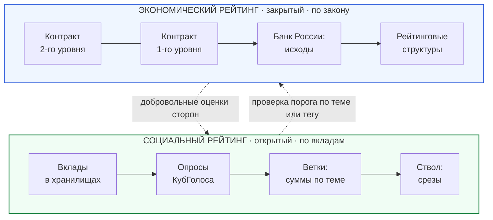
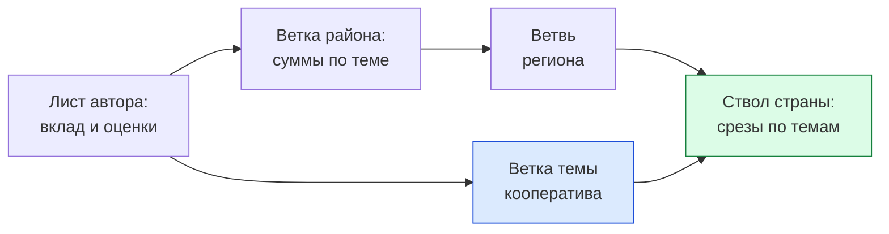
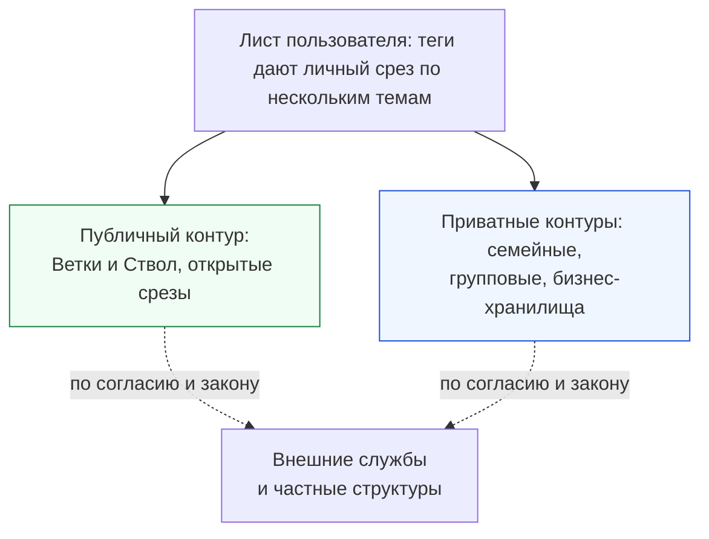
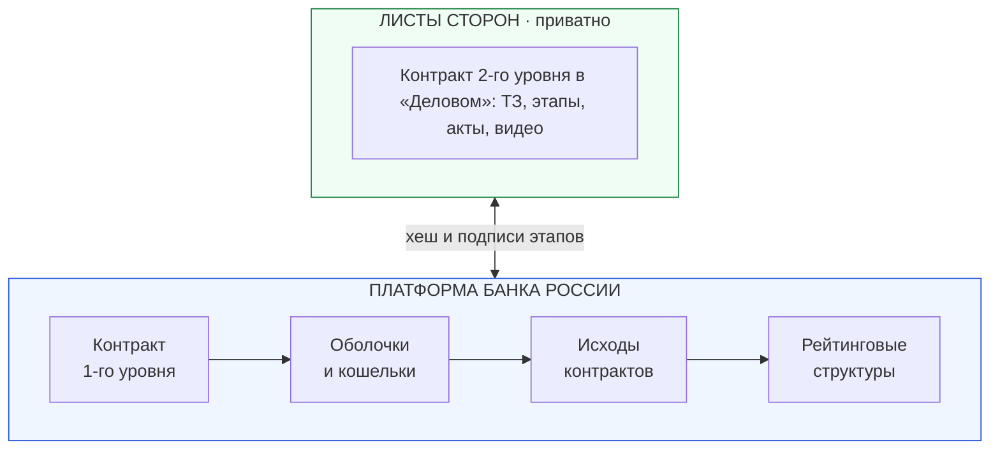
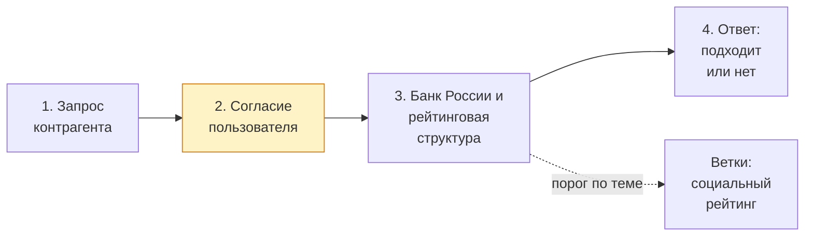
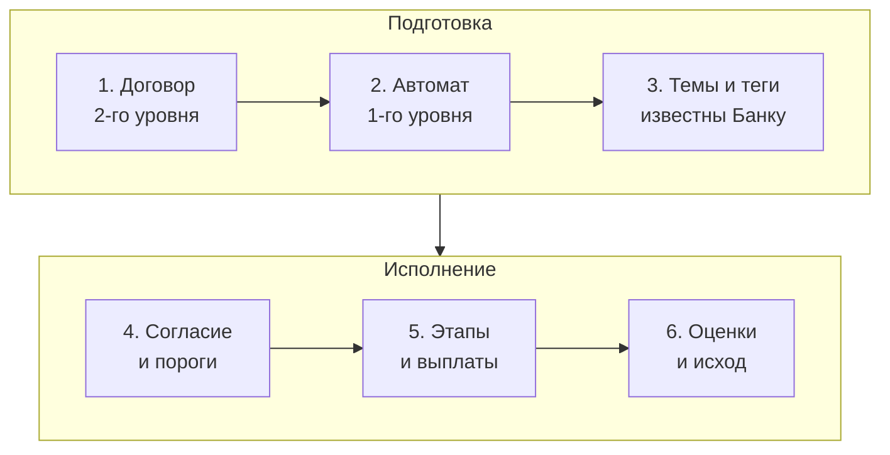
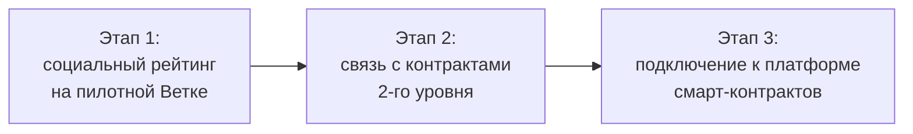

# ИНФОРМАЦИЯ К ПЛАНУ Белой книги № 07 — Социальный и экономический рейтинги

**Назначение.** Рабочий справочник для исполнителя плана `ПЛАН_07_Социальный_и_экономический_рейтинги.md`. Собирает в одном месте всё, что нужно для написания, вёрстки и регистрации книги `07_social_economic_ratings_whitepaper.md`: решения автора, правила, проверенные факты, формулы с числовыми примерами, готовые схемы, паспорта страниц, технические особенности сборки, контрольные списки.

**Для кого.** Исполнитель — модель Flash 3.8 (так её называет автор), которой автору удобнее пользоваться по ресурсам; планирование выполнила модель Claude Sonnet 5.5 (автор называет её «Соната 5.5»). Предполагается, что исполнитель не видел предыдущих обсуждений. Документ написан так, чтобы ничего не додумывать: где данные взяты у автора, где выведены составителем, где не проверены — указано явно.

**Границы задачи исполнителя.** Исполнитель пишет только книгу `07_social_economic_ratings_whitepaper.md`. Правки в связанных документах (раздел 12) и регистрацию книги в каталогах и скриптах (раздел 13.1) выполняет автор плана, а не исполнитель. Эти разделы оставлены для справки. Если для текста книги не хватает сведений, исполнитель задаёт вопрос автору, а не домысливает.

**Это не часть книги.** Здесь допустимы названия файлов, номера разделов, технические детали. В текст книги они не переносятся (см. раздел 2).

**Дата подготовки:** 3 октября 2026 г.; обновлено по ответам автора Файлы-источники на эту дату не менялись.

---

## 0. Как пользоваться документом

1. Прочитать разделы 1–3 (решения, правила, техника). Без них книга не пройдёт проверку.
2. Для каждой страницы взять паспорт из раздела 7: что писать, из каких файлов брать факты, какая схема, сколько знаков.
3. Формулы и числа брать только из раздела 6 (они пересчитаны).
4. Схемы брать из раздела 8 (размеры измерены в реальной сборке).
5. Перед сборкой пройти контрольный список раздела 13.
6. Раздел 14 содержит ответы автора на ранее открытые вопросы; новые вопросы по ходу написания задавать автору.

**Три принципа, из которых вытекает всё остальное:**
- Платформа задаёт механизм, а политику по каждой теме задаёт оператор темы в рамках закона.
- Экономический рейтинг по замыслу автора ведёт Банк России с подключёнными им по закону структурами. Социальный рейтинг строится из вкладов человека и открыт.
- Книга описывает проектную концепцию и прототипы. Ничего из описанного не подаётся как работающее, согласованное с регулятором или юридически проверенное.

---

## 1. Решения автора (обязательны для книги)

Источник: интервью с автором, сентябрь–октябрь 2026. Формулировки ниже — близкий пересказ слов автора.

### 1.1. Модель двух рейтингов

| № | Решение | Пояснение исполнителю |
|---|---|---|
| 1 | Рейтингов два: экономический и социальный | Единого общего балла человека не ведётся. Его можно вывести по дереву (есть суверенный ствол государства), но по умолчанию Ветки и Ствол его не показывают |
| 2 | Экономический рейтинг вычисляется по результатам смарт-контрактов, в которых участвовал пользователь, в отдельной системе смарт-контрактов Банка России, без постороннего просмотра | Используется как современный кредитный рейтинг, только с согласия пользователя на конкретное действие, требующее проверки |
| 3 | Идентификация в контракте: временная оболочка, связанная с кошельком пользователя в Банке России | Стороны не знают номеров кошельков друг друга, но могут проверить, что оболочка связана с общественным идентификатором человека через Банк России. Банк знает участие человека во всех контрактах и исходы |
| 4 | Банк России работает со структурами, которые выводят рейтинг по разрешённым методикам | Пользователь разрешает проверку своего рейтинга в соответствии с законом. Ответ определяется законом: «подходит», «не подходит» без причины, или иной допустимый вариант |
| 5 | Социальный рейтинг строится на индивидуальных вкладах человека. Вклады группируются по темам и могут иметь теги | Общий рейтинг человека не ведётся: в разных темах он разный |
| 6 | Первичные записи рейтинга лежат в хранилищах, где вклад сделан. Рейтинг выводится в статистику Веток через механизм КубГолоса, который уже агрегирует результаты опросов | Тематические и географические Ветки агрегируют вверх: подтема → тема → супертема → Ствол. Рейтинг дублируется в Ветви региона и Стволе страны, чтобы все пользователи и приложения могли его находить |
| 7 | Социальный рейтинг открыт для всех | Это «общественное лицо» пользователя. Защита прав пользователя на рейтинг и доступ к отдельным темам нужно проработать позднее |
| 8 | Агрегат на Ветке не хранит связей с отдельными хранилищами. Спуск до хранилищ возможен только через агрегацию по тегам в режиме Листа | Теги получают страницы с главной информацией из хранилищ и позволяют выйти на сами хранилища. Это занимает время и ресурсы, поэтому делается на Листе |
| 9 | Вес голоса зависит от приложения | В «Заботе» голосуют все участники треда, их собственный рейтинг влияет на результат. В «Деловом» голосуют только участники дела. В тематических приложениях — по их правилам |
| 10 | Политику по теме задаёт оператор темы | Это кооператив, который держит Ветку или Ветвь темы, и (или) создатель сводника приложений темы. Если закон запрещает какой-либо вид негативных рейтингов, он не публикуется: «нет значит нет» |
| 11 | Разрыв цикла «рейтинг взвешивает голоса, голоса формируют рейтинг»: четыре механизма | См. раздел 6.4. Согласовано автором («Да, все понятно, я согласен») |
| 12 | Приватные рейтинги допускаются: в групповых, семейных и бизнес-хранилищах | Решает закон и согласие сторон. Банк России может работать и с параллельными частными структурами. Отдельно упомянуть в книге (см. раздел 9) |
| 13 | Приложения дают право ответа на оценку | «Забота» позволяет бизнесам и людям отвечать на их рейтинги. Разбор рейтинга позволяет спуститься от общего рейтинга по теме до отдельных общественных хранилищ, где оценка сделана, через приложения, в которых она сделана |
| 14 | Рейтинги по топикам, но можно собрать индивидуально через теги на Листе | Если тег покрывает несколько тем |
| 15 | Государственные ведомства допускаются | Как внутренние тематические Ветки либо как внешние сервисы, которые стыкуются |
| 16 | Социальный рейтинг можно использовать в экономическом контексте | Пример автора: в теме человек «знает что делает» и экономический рейтинг (с согласием на проверку) выше порога, значит контракт создаётся. Обратное использование экономического рейтинга в неэкономических темах, скорее всего, смысла не имеет (подтвердит практика) |
| 17 | Приватная проверка социального рейтинга банком | Банк России имеет выход на Ветки с социальным рейтингом. Достаточно сообщить Банку, что контракт будет по определённым темам, тегам. Банк даёт ответ по закону (подходит, не подходит без пояснений, иное) |
| 18 | Экономика делает платформу реальной | Платформа без экономики существует, но двухуровневые контракты (первый уровень — автомат с универсальными ссылками, вся информация кроме сумм — на втором уровне платформы) без неё невозможны. Не везде нужна экономическая составляющая |
| 19 | Основная польза приложений остаётся в обмене и хранении информации | Экономика — дополнительное преимущество (из заметки автора 09-20). Книга не должна превращаться в текст про кредитование |

### 1.2. Решения по оформлению и подаче

| № | Решение | Следствие |
|---|---|---|
| 20 | Адресата нет, книгу может прочитать любой человек или организация на сайте | Простой язык, термины поясняются, без «Исх. №» и обращений к органам |
| 21 | Книга самостоятельная | № 06 и № 02 — только дополнительное чтение |
| 22 | Название файла книги подходит | `07_social_economic_ratings_whitepaper.md` |
| 23 | Детали дорабатывает модель, которой автору удобнее пользоваться по ресурсам | Название модели автор не указал, поэтому в книге его не писать, оставить поле для автора (раздел 2.4) |
| 24 | Дат нет | Нужны материальная поддержка, сильная команда и время; наступят ли условия и когда, неизвестно |
| 25 | Статьи законов — только общие ссылки | Без номеров статей и частей |
| 26 | Параллельные структуры упомянуть | Раздел 9 |
| 27 | Контактов не нужно | Контактный блок убран из плана; кроме открытого приглашения без адресов в заключении |
| 28 | Примеры берутся из руководств по социально-экономическому влиянию | Три примера, разбор в разделе 10 |

### 1.2а. Решения по уровням регистрации (интервью, октябрь 2026)

В плане они значатся как решения 17–19 и 22–24, здесь нумеруются 29–31 и 35–37.

| № | Решение | Пояснение |
|---|---|---|
| 29 | Социальный рейтинг ведётся на всех режимах регистрации. Различаются **полная анонимность** (никто не знает пользователя, известен только район; Branch ID) и **социальная анонимность** (в общественном контуре человек не известен, но экономически известен; в том числе групповая анонимность через жеребьёвку соседей). Есть также **поимённая регистрация** | Источник: `VoteCube_architecture_and_functionality.md`, §6.5 (обновлён). Прежнее описание «три уровня» заменено на «два вида анонимности и поимённый режим» |
| 30 | В экономических контрактах допустима социальная анонимность | Полностью анонимная регистрация всегда может быть соединена с кошельком Банка России, давая экономическую ступень, без которой участие в экономической активности невозможно. Человек остаётся анонимным для общества и контрагентов, а кто он, знает только Банк России: **Банк России даёт только один кошелёк на человека**. За такой регистрацией стоит реальный человек, отсюда определённое экономическое и вытекающее социальное доверие (при серьёзном нарушении личность устанавливается через суд). Разные структуры имеют разную информацию: экономическая регистрация проводится без проверки места жительства на Ветке |
| 31 | Дифференцированная конвертация рейтинга при смене статуса | Рейтинг, набранный полностью анонимным пользователем, строго отделён от социально анонимного и **не конвертируется** при привязке кошелька, чтобы исключить продажу наработанных анонимных репутаций. Но **социально анонимный рейтинг конвертируется в поимённый**, если гражданин решает открыть имя: за ним уже стояло надёжное подтверждение личности через Банк России, поэтому продать или накрутить такой профиль невозможно |
| 31а | Параллельный процесс социальной анонимности без экономики | Пользователи, не имеющие интереса в экономических расчётах, получают возможность социальной анонимности с подтверждением статуса жителя (через соседей, жеребьёвку) без открытия кошелька в Банке России. Это параллельные независимые процессы: районное доверие без финансов и экономическое доверие без проверки адреса |
| 32 | Наборы факторов для оценки вкладов ведут разработчики приложений и пользователи | Не только оператор темы. Обновляет прежнее допущение из раздела 6.5 |
| 33 | PDF книги выпускается как готовый публикационный документ | «Тема важная». Образец — № 06 |
| 34 | Название модели-исполнителя записывается как есть | Планирование — Claude Sonnet 5.5 («Соната 5.5»), детальная проработка — Flash 3.8 |
| 35 | **Ветки не являются операторами персональных данных**, потому что вся частная информация хранится в частных хранилищах и никогда не попадает на Ветки | Общественная информация индексируется Ветками с помощью древовидных структур платформы. Сейчас разрабатывается индексация тем и тегов, а также страниц тредов; в будущем возможны другие виды индексации. Слова «Ветки видят только обезличенные векторы» больше не использовать |
| 36 | Пользователь, регистрируясь по имени, **автоматически помещает своё имя в общественный контур** | Это нужно объяснять до регистрации (отдельный экран), регистрация завершается только после явного согласия. В книге описать как требование к приложениям |
| 37 | **Тон книги: свод идей на благо всех** | Автор считает слово «карательный» (корень «кара») и подобные обесценивающие формулировки неуважительными к тем, кто провёл большую работу по созданию существующих систем и сейчас думает, как сделать лучше. Книга подаёт идеи, часть которых может пригодиться в разных ситуациях и частях мира, хотя проектируются они для России. Подробные правила — раздел 2.5 |

### 1.3. Слова автора, которые стоит сохранить по смыслу

- «Социальный рейтинг открыт для всех, являясь общественным лицом пользователя».
- «По мере разработки системы рейтингов нужно будет отработать систему защиты прав пользователей и их рейтинга, а также доступа к нему или определённых тем рейтингов».
- «Агрегация на Ветках объединяет на тематическом уровне и теряет связь с хранилищами. Агрегация по тегам сохраняет это».
- «Платформа без экономики может существовать… но даже небольшое её присутствие даёт большую пользу».
- «Практически всё, связанное с определённой темой, — структура для этого даётся в приложениях “Забота” и “Деловой”».
- О приватных структурах: «нет той системы контроля, которая есть в общественных ветках, и есть вопросы безопасности и утечки информации — пробинг порога и т. д.».

---

## 2. Правила для текста книги

### 2.1. Запреты (проверяются в `whitepapers/AGENTS.md`)

1. Нет коллективных местоимений первого лица («мы», «наш», «в нашей платформе»). Допустимы: «здесь», «в настоящем документе», «автор платформы предлагает», «архитектура предусматривает», «платформа решает задачу». Патриотические обороты («наша страна») допустимы, но здесь не нужны.
2. Нет семантических меток с префиксом процента (токены из `comments/LABELS.md`). Символ процента перед буквой не ставить.
3. Нет кода, DDL-описаний, классов и сырых примеров данных (блоки JSON, TypeScript). Допускаются: понятийные схемы, потоки, Mermaid, формулы в KaTeX, таблицы.
4. Нет номеров статей и частей законов (решение 25). Общие ссылки: «законодательство о кредитных историях», «законодательство о персональных данных», «законодательство о кредитных рейтинговых агентствах».
5. Нет дат и сроков в дорожной карте.
6. Нет контактов.
6а. Нет обесценивающих формулировок о существующих системах и их авторах (раздел 2.5): ни «карательный», ни «антиутопия», ни «токсичный» и т. п.
7. Нет утверждений, что решения согласованы или одобрены Банком России, юристами, ведомствами.
8. Нет утверждений об экономии или эффективности, которых нет в источниках. Числа брать только из раздела 6 этого документа.
9. Нет программных терминов из DDL (названия таблиц, полей).

### 2.2. Как формулировать спорные места

| Нельзя | Можно |
|---|---|
| «Банк России присваивает рейтинг» | «В предлагаемой модели расчёт экономического рейтинга выполняют Банк России и подключённые им по закону рейтинговые структуры» |
| «Рейтинг соответствует закону» | «Окончательная квалификация за Банком России и профильными ведомствами; документ не является юридическим заключением» |
| «Система работает» | «Проектная концепция; отдельные механики реализованы в прототипах» |
| «Банк России согласился» | Не упоминать согласование вовсе |
| «Единый рейтинг гражданина» | «Рейтинг по темам; единый показатель по умолчанию не выводится» |
| «Публичная оценка человека» без оговорок | «Публичный рейтинг вкладов человека с правом ответа; права и защита прорабатываются отдельно» |

### 2.3. Тон и язык для широкого читателя

- Каждый термин при первом упоминании — коротко пояснить (см. глоссарий, раздел 4).
- Термин «социальный рейтинг» у разных читателей вызывает разные ассоциации. Дать ясное определение и описать особенности предлагаемого подхода (не противопоставляя его чужим системам): рейтинг вкладов, а не человека; по темам; без единого балла по умолчанию; с правом ответа; в границах закона; оператор темы ограничен законом. Ориентиры в источниках: `applications/sapoto/Sapoto_architecture_and_functionality.md`, §5.1 (нейтральная таблица сопоставления) и §5.3; в `02_applications_suite_whitepaper.md` — «многомерная репутация (рейтинг по темам)».
- Не использовать английские аббревиатуры без пояснения (EBSL, FSM, ZK и т. п.). FSM пояснять как «конечный автомат»: набор состояний и разрешённых переходов.
- Не перегружать формулами: на стр. 6 и 7 допустимы 3–4 формулы, остальные страницы без формул.

### 2.4. Атрибуция (решение автора: писать как есть)

В `06_cbr_smart_contracts_fsm_whitepaper.md` принята запись вида «Концептуальное видение, принципы и базовые направления сформированы автором; детальная научно-техническая проработка выполнена искусственным интеллектом». Для № 07 использовать ту же структуру с конкретными названиями, как продиктовал автор:

> *Автор: Артём Владимирович Шамсутдинов, разработчик платформы «Турбаза» — интернета суверенных и частных данных / открытого стека AIRport.*
> *Методология подготовки: модель двух рейтингов, принципы открытости социального рейтинга, передачи экономического рейтинга Банку России, политики оператора темы и уровней регистрации сформированы автором. Планирование документа выполнено моделью Claude Sonnet 5.5; схема агрегации вкладов по дереву Веток и четыре механизма разрыва цикла предложены ею в ходе работы над документами и приняты автором. Детальная проработка текста выполнена моделью Flash 3.8.*

Примечание: «Флаш 3.8» — название, которое дал автор; разработчика модели автор не указал, поэтому в записи он не называется. В репутационной спецификации `Sapoto_Reputation_and_Credit_System_Specification.md` атрибуция относится к другому агенту (Antigravity, Google DeepMind); к № 07 это не относится.

### 2.5. Тон: свод идей на благо всех (решение автора, обязательно)

Автор считает неуважительным слово «карательный» (от «кара»), а также обесценивающие слова о чужих системах («антиутопия», «дистопия», «тоталитарный», «токсичный», «кабала», «паразитарный», «деструктивный», «тупик», «ловушка» и подобные). За ними стоит большой труд людей, которые придумывали и реализовывали существующие кредитные бюро, скоринг, системы социального рейтинга и другие подходы и сейчас думают, как сделать лучше. Цель книги та же: улучшить положение дел для всех.

Правила:
1. Книга подаёт **свод идей**, а не «альтернативу» чужим системам и не «победу над» ними. Предпочтительные слова: «предлагается», «может дополнить», «идея», «вариант», «подход».
2. Существующие системы описываются по их особенностям нейтрально и с признанием их заслуг («дали широким слоям доступ к кредитованию», «решают задачи доверия и безопасности»). Если нужно показать, чем предлагаемый подход отличается, говорить «отличие», «особенность», а не «недостаток».
3. Нельзя называть конкретные страны или системы в негативном ключе и приписывать им «слежку», «поражение в правах» и т. п.
4. Идеи проектируются для России, но часть из них может пригодиться в разных ситуациях и частях мира. Так и писать, без обещаний, что система подойдёт всем.
5. Нельзя называть собственный подход «единственно правильным» или «лучшим».
6. Перед сборкой проверить текст поиском запрещённых корней (раздел 13.2).

---

## 3. Техника: сборка и вёрстка (проверено на этом компьютере 3.10.2026)

### 3.1. Что нужно и как собирать

- Версия окружения: node 24, Playwright с установленным Chromium, Ghostscript, `pdftoppm`/`pdftotext`, Python 3 с Pillow — всё есть.
- Сборка одной командой, из корня репозитория `presentations/`:
  ```
  node scripts/build_whitepaper_pdf.js shared_docs/whitepapers/07_social_economic_ratings_whitepaper.md shared_docs/whitepapers/07_social_economic_ratings_whitepaper.pdf
  ```
  Первая сборка книги 02 заняла около 18 секунд. Переменная `NODE_PATH` не понадобилась.
- **Нужен интернет:** вёрстка подтягивает KaTeX, Mermaid и шрифты с внешних сетей (jsdelivr и Google Fonts). Без сети формулы и схемы не отрисуются.
- Предпросмотровый HTML после сборки удаляется. Для проверки пользоваться самим PDF.
- Проверка числа страниц: `gs -q -dNODISPLAY -c "(путь.pdf) (r) file runpdfbegin pdfpagecount = quit"` (команда из `AGENTS.md`; на этой машине работает без дополнительных ключей).
- Постраничный просмотр: `pdftoppm -png -r 70 файл.pdf /tmp/p` и открыть картинки.

### 3.2. Шапка файла (front matter)

Парсер простой: строки `ключ: значение`, кавычки по краям снимаются. Используемые ключи:

```
---
title: Два рейтинга для суверенной экономики доверия
subtitle: Открытый социальный рейтинг вкладов и защищённый экономический рейтинг
header_title: ТУРБАЗА · БЕЛАЯ КНИГА № 07
header_subtitle: Социальный и экономический рейтинги
whitepaper_footer: Социальный и экономический рейтинги платформы «Турбаза»
accent_color: "#0284c7"
---
```

Для книги без адресата **не** использовать `cover_style: memorandum` (он включает письмо-отзыв Банку России с «Исх. №»). Без этого ключа верхняя часть первой страницы — тёмный баннер с названием и подзаголовком, затем заголовок `#` ещё раз. Допустимо задать `whitepaper_tag` (подпись над названием на баннере, по умолчанию «Аналитический отчет · Спецификация»).

### 3.3. Строение документа (по образцу книг 01, 02)

```
# Название книги
**Белая Книга: …**
*Версия: 1.0 (2026)*
*Статус: Общественный концептуальный документ*
*Классификация: …*
---
## Аннотация
текст
<!-- pagebreak -->
## Содержание
<div class="toc-container"> … строки toc-row … </div>
## Ключевые показатели
<div class="scorecard-grid"> … карточки … </div>
<!-- pagebreak -->
## 1. Название главы
…
```

Строка оглавления:
```
<div class="toc-row"><span class="toc-title">1. <a href="#1-…" class="doc-link">Название</a></span><span class="toc-page">Стр. 3</span></div>
```
Для подглав добавлять `style="padding-left: 14px;"`. По исходнику сборщика заголовки не получают идентификаторов, поэтому ссылки декоративны; формат оставить единым с другими книгами.

Карточка показателей:
```
<div class="scorecard-card"><div class="scorecard-metric">2</div><div class="scorecard-title">рейтинга</div><div class="scorecard-desc">Пояснение одной фразой.</div></div>
```
Карточки идут в сетке по три в ряд. На странице 2 удобно 3 или 4 карточки.

### 3.4. Особенности разметки (выявлены тестовыми сборками)

1. **Разрыв страницы** — только `<!-- pagebreak -->`. Заголовки `##` сами страницу не начинают.
2. **Заголовки:** `## N. Текст` (с цифрой) получает стиль раздела, `## Текст` без цифры — вводный. `### Текст` — подзаголовок.
3. **Абзац — одна строка.** Перенос внутри абзаца превращается в принудительный разрыв строки.
4. **Списки хрупкие.** Все пункты нумерованных списков отображаются маркерами (нумерация теряется). Абзацы и подзаголовки между двумя списками могут оказаться внутри списка с отступом. Если нумерация нужна, писать «1)» в тексте абзаца или использовать таблицу. Использовать списки скупо и сразу проверять результат на странице.
5. **Таблицы:** строка, в ячейке которой встречается `---`, воспринимается как разделитель и **пропадает**. Не писать `---` в ячейках (тире — символом «—»). Ячейка, содержащая только `O(1)`, превращается в значок. Формулы в ячейках работают.
6. **Плашки:** строка, начинающаяся с `> `, превращается в плашку. Если в строке есть слова «риск», «уязвимост», «EVM», «WASM» — жёлтая. Если есть «Банк России» (именно в таком падеже), «Концепци», «161-ФЗ», «259-ФЗ» — синяя (`callout-cbr`). Иначе зелёная. Проверка риска идёт первой. Многострочная цитата — несколько отдельных плашек.
7. **Формулы:** блок `$$…$$` и строка `$…$` обрабатываются KaTeX. Не использовать знак доллара для других целей. Символ `\to` заменяется на стрелку.
8. **Код-блоки** без языка превращаются в карточку «ASCII-схема», с языком — в код. В белой книге не использовать ни то, ни другое, кроме Mermaid.
9. **Mermaid:** блок ` ```mermaid ` рисуется контейнером шириной около 670 px, максимальная высота 480 px. Параметры шрифта схемы: 13 px (потоки), 12 px (подписи участников в последовательностях). При масштабировании ниже 0,75 текст становится мелким.
10. **Колонтитулы:** сверху `header_title` слева и `header_subtitle` справа; снизу `whitepaper_footer` и «Стр. N из M». На первой странице верхний колонтитул не скрывается (скрывается только для memorandum или при `hide_first_page_header: true`).

### 3.5. Ёмкость страницы

Измерено на PDF книги 06 (A4, подсчёт знаков без пробелов, свободное место в пикселях при 150 DPI):

| Тип страницы | Знаков без пробелов | Свободно снизу |
|---|---|---|
| Текст без схемы | 2 300–2 970 | 40–190 px |
| Текст со схемой | 1 700–2 100 | 6–200 px |

Требование `AGENTS.md`: запас не менее 80 px. Сама книга 06 этому требованию соблюдает не везде (есть страницы с запасом 6–60 px), поэтому ориентироваться на нижнюю границу, а не на максимум. Бюджет для планирования: **до 2 400 знаков на страницу без схемы, до 1 700 со схемой высотой 250–330 px, до 1 300 со схемой и таблицей**. Точное значение даст только замер.

Скрипт замера запаса снизу (запускать после сборки; порог колонтитула 93,5 процента высоты страницы):
```
pdftoppm -png -r 50 книга.pdf /tmp/h && python3 - <<'EOF'
from PIL import Image
import glob
for f in sorted(glob.glob('/tmp/h-*.png')):
    im=Image.open(f).convert('L'); w,h=im.size; px=im.load()
    top=int(h*0.935); last=0
    for y in range(top,0,-1):
        if any(px[x,y]<200 for x in range(int(w*0.06),int(w*0.94),2)): last=y;break
    print(f[-6:-4], (top-last)*3, 'px при 150 DPI')
EOF
```

### 3.6. Что было отдельно проверено

- Схемы Mermaid (поток слева направо, дерево сверху вниз, последовательность) и формулы KaTeX в тестовой сборке отображаются корректно. Целиком книга 07 не собиралась.
- Размеры схем из раздела 8 измерены в браузере при ширине контейнера 670 px (см. таблицу там). Реальный размер в PDF может немного отличаться: сборщик ограничивает высоту 480 px и подгоняет ширину.
- Плашки, таблицы, карточки показателей — отрисовываются, особенности — в 3.4.

---

## 4. Глоссарий для широкого читателя

Определения короткие, для первого упоминания в книге.

| Термин | Пояснение простыми словами | Источник |
|---|---|---|
| Турбаза | Платформа, в которой данные остаются у владельцев, а приложения работают поверх общей древовидной сети | `01_platform_overview_whitepaper.md` |
| Лист | Устройство пользователя (телефон, компьютер) с локальной базой данных. Автономно работает без сети | `comments/2026/09-07_01_Architecture_overview.md` |
| Ветка | Узел сети для района, города, темы или ведомства. Синхронизирует хранилища между Листами и хранит общественную информацию | там же |
| Ветвь, Ствол | Узлы выше по дереву; Ствол — верхний узел страны, соединяет с международными узлами | там же |
| Хранилище | Автономная единица данных по одной теме, с собственным журналом изменений. Может быть общественным, семейным, групповым, бизнес-хранилищем | там же |
| Вклад | Единица, которую оценивают: реплика, Идея, Опыт, Вопрос, выполненное Дело. Объект социального рейтинга | решения 5, раздел 1 |
| Тема, подтема, супертема | Узлы дерева категорий. Рейтинг считается по теме | `comments/2026/09-19_01_Votecube.md` |
| Тег | Метка, которую пользователь ставит на Листе. Позволяет собрать личный срез по нескольким темам | `comments/2026/09-25_01_Go-Getter.md`, раздел «Теги» |
| «КубГолос» | Приложение микроопросов: идея оценивается по нескольким факторам, у каждого есть «за» и «против» | `applications/votecube/README.md` |
| «Забота» | Сеть взаимной поддержки: Случаи, треды с Идеями, Опытом, Вопросами и комментариями | `applications/sapoto/README.md` |
| «Деловой» | Органайзер дел и задач; дело может быть «живым контрактом» между сторонами | `applications/gogetter/README.md` |
| Опыт «Speak» и «Show» | Подтверждение на практике: голосовая запись (Speak) или видео (Show). Транскрипция голоса — на устройстве | `applications/sapoto/AGENTS.md`, п. 3 |
| Конечный автомат | Набор состояний и разрешённых переходов. Умеет только проверить, что условия выполнены в нужном порядке нужными сторонами | `comments/2026/09-12_01_Smart_Contracts.md` |
| Контракт 1-го уровня | Публичный автомат на платформе Банка России: формула исполнения, суммы, состояния | `comments/2026/09-25_01_Go-Getter.md`, «Контракты второго уровня» |
| Контракт 2-го уровня | Приватное хранилище в «Деловом»: вся информация о договорённости и работе | там же |
| Эскроу | Деньги блокируются до выполнения условий и выплачиваются по этапам | `applications/gogetter/GoGetter_Ecosystem_Impact_Guide.md`, §4.2 |
| Цифровой рубль | Цифровая форма национальной валюты Банка России | `06_cbr_smart_contracts_fsm_whitepaper.md` |
| Платформа коммерческих смарт-контрактов (ПКСК) | Платформа Банка России, описанная в его концепции 2026 г. Сокращение первый раз расшифровывать | там же, гл. 1 |
| Оболочка | Временный «переходник» между устройством и кошельком; при потере телефона её отзывают, кошелёк остаётся нетронутым | `06_cbr_smart_contracts_fsm_whitepaper.md`, §5.1–5.2 |
| Оператор темы | Кооператив, держащий Ветку или Ветвь темы, и (или) создатель сводника приложений по теме. Задаёт политику рейтинга в рамках закона | решение 10 |
| Рейтинговая структура | Организация, которая по разрешённой законом методике выводит экономический рейтинг | решение 4 |
| Эпоха | Период (час для «горячих» опросов, сутки для обычных), по итогам которого Ветка фиксирует блок агрегатов | `applications/votecube/VoteCube_architecture_and_functionality.md`, §7.1 |
| Право ответа | Возможность человека или бизнеса ответить на оценку так, чтобы ответ был виден | решение 13 |
| Пробинг порога | Многократные запросы «подходит / не подходит» с разными условиями, чтобы вычислить значение рейтинга | слова автора, раздел 1.3 |
| Частная информация и Ветки | Частная информация хранится в частных хранилищах на устройстве владельца и никогда не попадает на Ветки; Ветки индексируют только общественную информацию. Имя автора становится общественной информацией при поимённой регистрации | `whitepapers/applications/AGENTS.md`, инвариант 5 |
| Полная анонимность | Никто не знает пользователя, известен только район | решение 29 |
| Социальная анонимность | В общественном контуре человек не известен, но экономически известен Банку России (один кошелёк на человека) | решения 29–30 |
| Поимённая регистрация | Имя автоматически помещается в общественный контур; об этом предупреждают до регистрации | решение 36 |

---

## 5. Источники по темам

Названия разделов приведены, а не номера строк. Пути относительно `shared_docs/` (корень: `/home/anastasiya/Documents/presentations/shared_docs/`).

### 5.1. Авторские заметки (`comments/2026/`, читать, не менять)

| Файл | Что даёт книге |
|---|---|
| `09-25_02_Sapoto_social_rating.md` | Исходная идея социального рейтинга: индексация Случаев, агрегация по тематическим и географическим Веткам вверх, дублирование в Ветви региона и Стволе страны |
| `09-20_01_Economic_potential.md` | Связка трёх приложений как основа экономической инфраструктуры; обратная связь КубГолоса; контракты второго уровня; «Присоединение» социального рейтинга и экономического; польза в обмене и хранении информации, экономика — дополнительное преимущество |
| `09-25_01_Go-Getter.md` | Раздел «Контракты второго уровня»; «Интеграция с КубГолосом» (группы опросов); «Интеграция с Заботой»; «Теги» |
| `09-19_02_Sapoto.md` | Раздел «Репутация» (выявление экспертов, использование репутации в экономике); «Составная конструкция» |
| `09-19_01_Votecube.md` | Раздел «Агрегация»: ветка суммирует ответы по каждому вопросу, родитель суммирует суммы своих веток. Это прецедент аддитивной агрегации вверх по дереву |
| `09-12_01_Smart_Contracts.md` | Конечный автомат; «Внешний контур»; примечания: защита номеров кошельков, оболочки, идентификаторы |
| `09-07_01_Architecture_overview.md` | Ветки и Ствол дублируют общественную информацию, строят древовидные сводные хранилища поиска |
| `08-30_01_Who_is_it_for.md` | Семьи, соседи, герметичные отсеки данных, местная общественная информация (контекст приватных структур) |

### 5.2. Белые книги и спецификации (`whitepapers/`)

| Файл и раздел | Что брать | Что не брать |
|---|---|---|
| `06_cbr_smart_contracts_fsm_whitepaper.md`, гл. 3 | Схема двух контуров: внутренний расчётный (Банк России) и внешний информационный («Турбаза») | Диаграммы целиком не копировать |
| `06_…`, §5.1–5.2 | Оболочки; для Банка России и надзорных органов система прозрачна, для контрагентов реквизиты скрыты; сменяемые прокси-оболочки | Номера нормативных актов (по решению 25) |
| `02_applications_suite_whitepaper.md`, гл. 4 | «Многомерная репутация (рейтинг по темам)» | — |
| `applications/sapoto/Sapoto_architecture_and_functionality.md`, §5.1 | Нейтральная таблица сопоставления подходов (кредитные бюро и скоринг, системы социального рейтинга, DeFi, «Забота»); формулировки обновлены под модель двух рейтингов | Не переносить таблицу в книгу в виде противопоставления |
| `…/Sapoto_Reputation_and_Credit_System_Specification.md`, §2.1–2.2, §2.4 | Формула свидетельств, затухание, компоненты мнения, разделение предметной компетентности и добросовестности | Коэффициенты как «окончательные» (они начальные) |
| `…`, §5 и §5.1 | Таблица угроз и защит; штраф за кластеризацию | Ничего |
| `…`, §6, §7 | Народный арбитраж, физическое подтверждение работ (TAPO) как оракулы для экономического контракта | Подробности процедур |
| `…`, §12.1–12.2 | Индекс гражданского служения; реабилитация | — |
| `…`, §14.1–14.2 | Холодный старт: бытовая взаимопомощь, подмастерье | §14.3 о кредитном поручительстве |
| `applications/votecube/VoteCube_architecture_and_functionality.md`, §3.4 | Две метрики результата опроса: значимость фактора и позиция | Матрицу проекций |
| `…`, §5.2–5.3 | Территориальные и категориальные Ветки; общественный и семейный контуры (у семейных Ветка — слепой ретранслятор, агрегация на Листах) | Подробности mTLS |
| `…`, §6.5–6.6 | Три уровня анонимности регистрации; защита от Сивиллы | — |
| `…`, §7.1 | Блоки эпох как фиксация агрегатов | JSON-пример (запрещён в книге) |
| `…`, §8.6–8.7 | Статус негосударственных (коммерческих) Веток: проектируются в будущей фазе; юридический статус операторов Веток | Обещания «полного иммунитета» |
| `applications/votecube/README.md`, §5 | Три шкалы консенсуса (Результат, Эксперты, Народ) и вес практики | — |
| `applications/gogetter/GoGetter_architecture_and_functionality.md`, §9.2, §9.4, гл. 10 | Двухуровневая модель сделки; формирование рейтинга; группы опросов | Фрагменты кода |
| `…GoGetter_Ecosystem_Impact_Guide.md`, §4.1–4.4, §5, §6.4 | Двухуровневый контракт, эскроу, кейс артели | — |
| `applications/votecube/VoteCube_Role_in_Rating_Infrastructure.md` | Последовательность строительства: опросы как форма оценки, счётчики и блоки эпох на Ветках, агрегация вверх по дереву, граница роли «КубГолоса» (шаг 1 из 3). Читать целиком, документ короткий | Номера разделов спецификаций в текст книги не переносить |
| `applications/sapoto/Sapoto_Role_in_Rating_Infrastructure.md` | Вклады, треды, логика голосования внутри тредов, страницы для просмотра и индексации, спуск к источнику через теги (шаг 2 из 3) | То же |
| `applications/gogetter/GoGetter_Role_in_Rating_Infrastructure.md` | Дело как контракт второго уровня и связный узел двух рейтингов; теги сегодня и в перспективе (шаг 3 из 3). Раздел «Теги»: перспективу общественных тегов пересказывать только на уровне идеи, без технических деталей | Технические детали серверов тегов (их нет и в документе) |

**Не читалось при подготовке:** разделы 3, 11, 13 и основной текст разделов 16–19 репутационной спецификации; полный текст Impact Guide для «Забота» и «КубГолос» (читались разделы с примерами). Если исполнителю нужны факты из них, прочитать самому.

---

## 6. Математика, параметры, примеры (все числа пересчитаны)

Эти формулы — предложение ассистента, основанное на математике репутационной спецификации и на том, как КубГолос уже суммирует ответы по Веткам. Автор принял механизмы разрыва цикла. Параметры — **начальные значения по умолчанию**, оператор темы вправе их менять, значения подлежат подбору симуляцией. В книге так и писать.

### 6.1. Оценка одного вклада

Каждый оценивающий $i$ даёт позицию $s_i\in[-1;+1]$ (шкала «против/за» КубГолоса, значения $[-100;+100]$ делятся на 100). Его вес $w_i$ — см. 6.3.

$$R_c=\sum_i w_i\,\frac{1+s_i}{2},\qquad S_c=\sum_i w_i\,\frac{1-s_i}{2}$$

Пример. Три голоса: вес 1,0 («за»), вес 0,5 («за»), вес 0,1 («против»). Тогда $R=1{,}5$, $S=0{,}1$.

### 6.2. Узел дерева и показатель темы

Для человека $p$ и темы $T$ узел хранит суммы $R_T(p)$ и $S_T(p)$ по корзинам эпох. Родительский узел складывает суммы дочерних. Затухание применяется при чтении:

$$\text{коэффициент затухания}=2^{-\Delta t/T_{1/2}}$$

($T_{1/2}$ задаёт оператор темы; в спецификации репутации для бытовой взаимопомощи принято 6 месяцев, для кредитных обязательств 24 месяца). Примеры: через 3 месяца при $T_{1/2}=6$ множитель 0,707; через 12 месяцев — 0,25.

Показатель темы (байесовская оценка, $a=0{,}5$, $W=2$):

$$E=\frac{R+aW}{R+S+W}=\frac{R+1}{R+S+2}$$

Всегда публикуются два числа: $E$ и масса свидетельств $R+S$ (или неопределённость $u=W/(R+S+W)$).

| Ситуация | $R$ | $S$ | $E$ |
|---|---|---|---|
| Нет данных | 0 | 0 | 0,50 |
| Один восторженный отзыв | 1 | 0 | 0,67 |
| Три «за» | 3 | 0 | 0,80 |
| 18 «за», 2 «против» | 18 | 2 | 0,86 |
| Сто «за» | 100 | 0 | 0,99 |
| Три голоса из 6.1 | 1,5 | 0,1 | 0,69 |

Аддитивность: ветка района ($R=5$, $S=1$) и ветка района ($R=7$, $S=0$) дают в родительской ветви $R=12$, $S=1$, $E=0{,}87$. Тот же результат получает Лист при сборе по тегу из тех же вкладов (принцип согласованности).

Почему не среднее: среднее скрывает объём, новичок с одной отличной репликой получил бы единицу.

### 6.3. Четыре механизма разрыва цикла (согласованы автором)

**Механизм 1. Эпохи.** Голос в эпоху $N$ взвешивается рейтингом голосующего, зафиксированным в блоке эпохи $N-1$. Пересчёт рейтинга не использует сам себя в одном расчёте. Блоки эпох в платформе уже есть (КубГолос, §7.1).

**Механизм 2. Ограничение вклада мнений относительно внешних свидетельств.** Внешние свидетельства — закрытое Дело, принятая Идея, подтверждённый Опыт, подписанный акт приёмки. Масса мнений ограничена:

$$M_{\text{мн}}^{\text{эфф}}=\min\bigl(M_{\text{мн}},\;\kappa\,M_{\text{вн}}+m_0\bigr)$$

На эту величину пропорционально уменьшаются $R$ и $S$, пришедшие из мнений. Начальные значения: $\kappa=1$ (мнения не больше внешних свидетельств), $m_0=2$ (небольшой стартовый запас).

| Пример | Внешние $R/S$ | Мнения $R/S$ | $E$ без ограничения | $E$ с ограничением |
|---|---|---|---|---|
| Кольцо из 40 взаимных «за», без внешних данных | 0 / 0 | 40 / 0 | 0,98 | 0,75 |
| Те же 40 «за», шесть внешних подтверждений | 6 / 0 | 40 / 0 | 0,98 | 0,94 |
| Обычная картина | 6 / 0 | 10 / 2 | 0,85 | 0,85 |

**Механизм 3. Вес голосующего.** Вес растёт сублинейно и имеет нижний порог, чтобы голос одного «звёздного» участника не перевешивал остальных:

$$w_i=w_{\min}+(1-w_{\min})\sqrt{b_i},\qquad b_i=\frac{R_i}{R_i+S_i+W}$$

$b_i$ — доверие голосующего в теме треда по итогам предыдущей эпохи. Начальное $w_{\min}=0{,}1$. Значения веса: новичок (0/0) — 0,10; два «за» — 0,74; 10 «за» и 1 «против» — 0,89; 40 «за» и 2 «против» — 0,96. Вес берётся по теме треда, а не по общему рейтингу.

**Механизм 4. Защита от взаимных оценок.** Самооценка не учитывается. Если два участника оценили друг друга в рамках одного окна, веса взаимных голосов умножаются на $\rho$ (начальное $\rho=0{,}5$). Для замкнутых групп действует дисконт кластеризации из репутационной спецификации, §5.1: $w_{\text{эфф}}=w_0\exp(-\beta\,(C-C_{\text{порог}}))$ при $C>C_{\text{порог}}$, порог 0,6. Пример при $\beta=2$ и $C=0{,}8$: множитель 0,67 (значение $\beta$ в источнике не найдено, пример иллюстративный).

**Дополнительно:** рядом показывать две цифры: «Народ» (без весов) и «Эксперты» (с весами). Расхождение информативно (идея трёх шкал есть в КубГолосе).

### 6.4. Что не брать из репутационной спецификации

Формулы потолка займа, кривой залога, междоменной проекции и «депозит-фри» (разделы 2.3, 2.5–2.7), схему ZK-аттестации (раздел 4), регуляторный мост (раздел 9), поручительство, ликвидность, банковскую интеграцию, партнёрские модели (разделы 16–19). Они описывают расчёт кредитной функции платформой, что не совпадает с решением 2 (экономический рейтинг ведёт Банк России).

Расхождения, которые пока не исправлены и из-за которых эти формулы нельзя цитировать: порог допуска $\Phi(E)$ в §2.3 даёт 83 процента лимита при $E=0{,}95$, а текст обещает 100 процентов; формула залога $C_{\text{ratio}}=\max(0,1{,}5-1{,}5E)$ в `sapoto/README.md` §5.3 даёт 7,5 процента при $E=0{,}95$, а текст обещает 0.

### 6.5. Открытые параметры

- Набор факторов опроса для оценки вклада (например: полезность, точность, тон). Наборы ведут разработчики приложений и пользователи (решение 32). В книге привести как пример, не как решение.
- Значения $T_{1/2}$ по темам, $\kappa$, $m_0$, $w_{\min}$, $\rho$, $\beta$: подбираются симуляцией.

---

## 7. Паспорта страниц

Для каждой страницы: цель, что написать, факты и источники, визуал, объём. Оглавление на странице 2 должно содержать указанные номера.

### Стр. 1. Обложка и аннотация
- Цель: ясно сказать, о чём книга, и что это проектная концепция.
- Содержание: название; блок «Версия 1.0 (2026), Статус: Общественный концептуальный документ, Классификация: Социальные и экономические рейтинги, суверенные данные»; автор и методология (раздел 2.4); аннотация 7–9 строк.
- Тезисы аннотации: два рейтинга; социальный рейтинг строится из вкладов и открыт; экономический ведёт Банк России с подключёнными по закону структурами (в предлагаемой модели); связь через пороги и согласие; единый балл человека по умолчанию не выводится; политику по теме задаёт оператор темы в рамках закона.
- Объём: до 1 800 знаков вместе с баннером.

### Стр. 2. Содержание и показатели
- Оглавление 13 глав, номера страниц — из таблицы плана (глава 1 — стр. 3, глава 2 — стр. 4 … глава 13 — стр. 15).
- Карточки показателей (качественные, из решений автора): «2 — рейтинга: социальный и экономический»; «0 — единых баллов человека по умолчанию»; «3 — приложения-источника вкладов: КубГолос, Забота, Деловой»; «2 — уровня контрактов: приватный и публичный».
- Объём: около 1 500 знаков.

### Стр. 3. Глава 1. Задача и принципы
- Проблема: централизованные рейтинги и отзывы (кредитные бюро, маркетплейсы, одномерные «социальные кредиты») не дают человеку владения своим общественным лицом, не связывают оценку с реальным делом и не разделяют темы.
- Принципы (пять): объект оценки — вклад, а не человек; единица рейтинга — тема; закон выше политики оператора; защищённый рейтинг — только с согласия; экономика усиливает, но не является целью.
- Явно определить «социальный рейтинг» и отличить от «социального кредита» (раздел 2.3).
- Источники: `09-20_01`, `09-25_02`, `Sapoto_architecture_and_functionality.md` §5.1.
- Визуал: таблица «рейтинг является / не является» (4–5 строк).
- Объём: до 2 300 знаков.

### Стр. 4. Глава 2. Модель двух рейтингов
- Сводная таблица (раздел 1.1, строки: объект оценки, где записывается, агрегация, доступ, общий балл, приватные варианты, идентификация), 7 строк по 2 колонки.
- Схема D1 (раздел 8). Высота около 330 px; если страница не умещается, сократить таблицу до 5 строк или убрать подписи стрелок в схеме.
- Источники: раздел 1.1 этого справочника; `06_…`, гл. 3.
- Объём: до 1 300 знаков (с таблицей и схемой).

### Стр. 5. Глава 3. Социальный рейтинг: объект и источники
- Три источника вкладов: «КубГолос» (оценка идей и вкладов, три шкалы), «Забота» (Случаи, Идеи, Опыт «Speak» и «Show», Вопросы), «Деловой» (Дела и Задачи, акты приёмки).
- Идентификация вклада: каждый создаёт собственные записи, чужие не меняет (принцип «пишешь только свои записи»); оценки других участников — их собственные записи. Рейтинг ведётся на всех режимах регистрации: полная анонимность, социальная анонимность, поимённая регистрация (решения 29–30). Частная информация на Ветки не попадает, Ветки индексируют общественную (решение 35).
- Вес голоса по приложениям (решение 9).
- Таблица «приложение — вид вклада — кто оценивает» (3 строки).
- Источники: три документа `…_Role_in_Rating_Infrastructure.md` (основной источник структуры главы: КубГолос → Забота → Деловой); `Sapoto_architecture_and_functionality.md`, гл. 3–4; `VoteCube_architecture_and_functionality.md`, §3.4; `GoGetter_architecture_and_functionality.md`, гл. 10; `comments/2026/09-19_02_Sapoto.md`.
- Порядок изложения главы: опросы и счётчики на Ветках (КубГолос), затем вклады, треды и страницы (Забота), затем Дела и теги (Деловой). Подчеркнуть: приложения прежде всего хранят и обменивают базовые модули данных; на этой основе строится инфраструктура рейтингов и контрактов второго уровня.
- Объём: до 2 300 знаков.

### Стр. 6. Глава 4. Агрегация по дереву
- Принцип: узел Ветки по человеку и теме хранит суммы положительных и отрицательных масс; родитель складывает суммы дочерних, как КубГолос уже суммирует ответы по Веткам.
- Формулы 6.1–6.2 (три блока), таблица примеров $E$ (4 строки).
- Политика оператора: затухание, публикация негативных оценок, параметры весов — значения по умолчанию, меняются оператором в рамках закона.
- Правило: единый балл по умолчанию не выводится; допустимы срезы по теме, региону, тегу.
- Ключ узла: регистрация автора вместе со статусом (решение 31); рейтинги разных регистраций не сливаются.
- Принцип согласованности: расчёт на Листе по тегу и на Ветке по теме даёт одинаковый результат.
- Схема D2 (дерево, 168 px).
- Объём: до 1 500 знаков (с формулами и схемой).

### Стр. 7. Глава 5. Целостность: разрыв цикла и защита от накруток
- Четыре механизма (6.3) по 2–3 предложения.
- Таблица «угроза — механизм защиты»: накачка копеечными делами (вес по объёму и теме), кольца взаимных оценок (дисконт взаимных и кластеризации), месть в ответ на оценку (одновременное раскрытие отзывов), боты (проверка резидентства, режимы регистрации). Источники: `Sapoto_Reputation_and_Credit_System_Specification.md`, §5; `VoteCube_architecture_and_functionality.md`, §6.6.
- Плашка с оговоркой: параметры начальные, подбираются симуляцией. Цвет плашки зависит от слов (раздел 3.4, п. 6): без слов «риск», «Банк России» плашка будет зелёной.
- Объём: до 2 000 знаков.

### Стр. 8. Глава 6. Права пользователя, доступ и приватные контуры
- Право ответа: «Забота» позволяет человеку и бизнесу ответить на оценку.
- Спуск до источника: через теги на Листе, а не через Ветки; дорого по времени и ресурсам.
- Приватные рейтинги: семейные, групповые, бизнес-хранилища; в семейном контуре Ветка — слепой ретранслятор, агрегация на Листах (`VoteCube_architecture_and_functionality.md`, §5.3).
- Оператор темы: что вправе менять и что нет (закон). Наборы факторов оценки ведут также разработчики приложений и пользователи (решение 32).
- Виды анонимности, поимённый режим и правила конвертации (решения 29–31а, 36): описать полную анонимность, социальную анонимность через Банк России и параллельную социальную регистрацию без финансов; экран предупреждения перед поимённой регистрацией. Рейтинг полностью анонимного профиля не переносится (защита от продажи аккаунтов), а социально анонимный рейтинг конвертируется в поимённый при открытии имени, так как подтверждение личности уже состоялось. Пояснить на одном простом примере без выдуманных цифр.
- Параллельные структуры: короткий подраздел по таблице раздела 9 (4–5 строк).
- Права на публичный рейтинг и доступ к отдельным темам: «прорабатывается отдельно».
- Схема D3 (269 px).
- Объём: до 1 700 знаков.

### Стр. 9. Глава 7. Экономический рейтинг
- Два уровня контрактов: приватный (в «Деловом», детали работы) и публичный (автомат на платформе Банка России: суммы и состояния).
- Оболочки: временная связь с кошельком; стороны не видят кошельков друг друга; Банк знает участие и исходы (`06_…`, §5.1).
- Анонимные регистрации допустимы в экономических контрактах: человек анонимен для общества и контрагентов, личность знает только Банк России (решение 30).
- Банк России и подключаемые им рейтинговые структуры по разрешённым законом методикам.
- Предложение автора: развить роль доверенных поставщиков данных так, чтобы включить рейтинговые структуры (в источниках Банка России рейтинги не упоминаются — подавать как предложение, не как позицию Банка).
- Источники: `06_…`, гл. 3 и §5.1; `GoGetter_Role_in_Rating_Infrastructure.md` (контракт второго уровня как связный узел рейтингов); `GoGetter_Ecosystem_Impact_Guide.md`, §4.1–4.2; `comments/2026/09-12_01_Smart_Contracts.md`, `09-25_01_Go-Getter.md`.
- Схема D4 (288 px).
- Объём: до 1 700 знаков.

### Стр. 10. Глава 8. Согласие и проверка порогов
- Порядок: запрос контрагента, согласие пользователя на конкретное действие, проверка Банком и рейтинговой структурой, ответ «подходит / не подходит» без причины или иной допустимый законом.
- Проверка порога по социальному рейтингу: Банк сообщает темы и теги, получает ответ с Веток.
- Общая ссылка: законодательство о кредитных историях и о персональных данных (согласие, ограниченный срок, право возразить против решения, принятого только автоматически). Без номеров статей.
- Угроза: пробинг порогов. Направления мер (лимит проверок на пару сторон и контракт за период, грубые ответы, журнал проверок для владельца рейтинга). Подробности — отдельная задача с юристами и Банком России.
- Схема S1 (раздел 8, поток слева направо, 204 px).
- Объём: до 1 700 знаков.

### Стр. 11. Глава 9. Связка двух рейтингов: сквозной сценарий
- Шесть шагов: 1) приватный договор в «Деловом»; 2) связанный автомат с эскроу; 3) уведомление Банка о темах и тегах; 4) проверка двух порогов с согласием; 5) этапы и выплаты; 6) добровольные оценки в КубГолосе и исход контракта у Банка.
- Что куда записывается и что остаётся приватным (таблица из 3 строк: социальный рейтинг, экономический рейтинг, детали работы).
- Роль тегов: сообщают Банку России темы контракта и позволяют собрать срез рейтинга по нескольким темам; общественные теги упомянуть как перспективу одной фразой (децентрализованно, артелями провайдеров тегов), без технических деталей.
- Правило: социальный рейтинг обогащает экономическое решение; обратное влияние не закладывается.
- Схема D6 (308 px).
- Объём: до 1 400 знаков.

### Стр. 12. Глава 10. Практические примеры
- Три примера (раздел 10). Для каждого: вклад, кто оценивает, социальный след, экономический след.
- Сводная таблица 3 строки × 4 колонки.
- Объём: до 2 300 знаков.

### Стр. 13. Глава 11. Нормативная карта
- Таблица «область регулирования — что регулирует — как соотносится с моделью» с общими ссылками, без номеров статей (6–7 строк).
- Строки: кредитные истории; кредитные рейтинговые агентства (применимость к рейтингам людей требует юридической оценки); персональные данные; идентификация клиентов и противодействие отмыванию; платформа коммерческих смарт-контрактов Банка России (концепция 2026 г.); партнёрское финансирование (только если упоминается).
- Роли: Банк России, рейтинговые структуры, операторы Веток, кооперативы, ведомства.
- Плашка: «Окончательная квалификация за Банком России и профильными ведомствами; книга не является юридическим заключением» (содержит «Банк России» — будет синей).
- Общие ссылки на официальные порталы (cbr.ru, pravo.gov.ru).
- Внутренняя справка с проверенными фактами — раздел 11 этого документа, в книгу не переносить.
- Объём: до 2 000 знаков.

### Стр. 14. Глава 12. Риски, открытые вопросы, дорожная карта
- Риски: превращение «выводимого» балла в единый показатель; пробинг; сговор и накрутка; несколько полностью анонимных регистраций у одного человека (рейтинги не объединяются, а голоса подчиняются тем же механизмам защиты; при социальной анонимности один кошелёк на человека ограничивает число таких регистраций в экономических контурах); конфликт политик операторов тем; юридическая оценка общественного контура с поимённой регистрацией и приватных структур (раздел 11, вопрос 5).
- Открытые вопросы (решаются отдельно): права пользователя на рейтинг; меры против пробинга; юридические рамки приватных структур; подбор параметров симуляцией.
- Дорожная карта: схема D7 без дат; плашка «Реализация зависит от материальной поддержки, сильной команды и времени. Наступят ли эти условия и когда, неизвестно».
- Объём: до 1 800 знаков.

### Стр. 15. Глава 13. Заключение и открытое приглашение
- Выводы 4–5 тезисов: два рейтинга; вклад, а не человек; тема, а не единый балл; закон выше политики оператора; польза в обмене и хранении информации, экономика усиливает.
- Открытое приглашение без адресата и без контактов: поддержать разработку материально, войти в команду, проверить решения (юристы, математики, операторы Веток, разработчики). Первый шаг — пилот на районной Ветке, если появятся условия главы 12.
- Объём: до 1 800 знаков.

---

## 8. Готовые схемы (Mermaid; размеры измерены в браузере при ширине 670 px)

| Код | Страница | Размер (ширина × высота, px) | Заметка |
|---|---|---|---|
| D1 | 4 | 638 × 326 | чуть выше ориентира 300; при нехватке места сократить таблицу страницы |
| D2 | 6 | 662 × 168 | — |
| D3 | 8 | 566 × 269 | — |
| D4 | 9 | 623 × 288 | — |
| S1 | 10 | 735 × 204 | масштаб 0,91: подписи чуть мельче обычных; форма «поток слева направо» выбрана вместо диаграммы последовательности, которая сжималась до 0,58 |
| D6 | 11 | 497 × 308 | — |
| D7 | 14 | 664 × 85 | — |

Правила: не добавлять эмодзи, не менять шрифты; подписи узлов в 2–3 строки; цвета — зелёный (`#f0fdf4`, рамка `#15803d`) для социального контура, синий (`#eff6ff`, рамка `#1d4ed8`) для экономического.

**D1. Модель двух рейтингов (стр. 4)**


**D2. Агрегация по дереву (стр. 6)**


**D3. Контуры видимости (стр. 8)**


**D4. Два уровня контрактов (стр. 9)**


**S1. Согласие и проверка (стр. 10)**

Причины в ответе не раскрываются, число проверок ограничено: это пояснить в тексте страницы.

**D6. Сквозной сценарий (стр. 11)**


**D7. Дорожная карта без дат (стр. 14)**


Схемы D1–D7 и S1 проверены на отрисовку отдельно от книги. После вставки в книгу посмотреть страницы глазами.

---

## 9. Параллельные структуры (решение 26)

Автор: Банк России может работать и с параллельными частными структурами; большие бизнесы могут иметь собственные частные ветви, работающие с Банком России; семьи и группы могут разрешать проверку. Но там «нет той системы контроля, которая есть в общественных ветках», есть вопросы безопасности и утечек (пробинг порога). Всё зависит от закона и согласия сторон.

| Структура | Кто | Что получает и откуда | Что известно из источников | Статус |
|---|---|---|---|---|
| Государственные ведомственные Ветки | ведомства | Участвуют как тематические внутренние Ветки или как внешние сервисы, которые стыкуются (решение автора, интервью) | В репутационной спецификации ведомственные Ветки описаны как поставщики подтверждений без раскрытия данных (раздел 4.3); в книгу переносить только идею | Концепция |
| Кооперативы-операторы тематических Веток | кооперативы | Задают политику рейтинга по теме, хостят категориальные Ветки | `VoteCube_architecture_and_functionality.md`, §5.2 | Концепция |
| Коммерческие (негосударственные) Ветки | компании, кооперативы | Свои Ветки и сводники приложений | Вопрос подотчётности и ответственности не решён; регламент вынесен в будущую фазу (§8.6) | Будущая фаза проектирования |
| Банки и финансовые организации | банки | Могут выступать операторами финансовых Веток и интеграционных шлюзов | Репутационная спецификация, §18.1, как проектное предложение; не подавать как согласованное | Предложение |
| Крупный бизнес с частными ветвями | компании | Частные ветви, работающие с Банком России (слова автора) | Подробностей в документах нет | Идея |
| Семейные и групповые контуры | семьи, группы | Приватные рейтинги внутри групп; Ветка — слепой ретранслятор, агрегация на Листах | `VoteCube_architecture_and_functionality.md`, §5.3; автор: проверка по согласию и закону возможна | Концепция |
| Рейтинговые структуры | организации по закону | Выводят экономический рейтинг по разрешённым методикам, работают через Банк России | решение 4 | Идея |
| Параллельные системы веток | другие системы | Присоединяются к дереву платформы | `comments/2026/09-19_01_Votecube.md` (раздел «Инфраструктура») | Концепция |

Как подавать в книге: одна таблица или абзац (4–5 строк) на стр. 8, одно предложение на стр. 14 в рисках. Три мысли: допускаются; решает закон и согласие сторон; контроля, как в общественных Ветках, нет, поэтому есть риски утечки и пробинга, и они прорабатываются отдельно.

---

## 10. Три примера (решение 28)

Источники — руководства по социально-экономическому влиянию. Разбор «вклад → социальный след → экономический след» составлен ассистентом как иллюстрация; в тексте книги отметить, что это пример применения модели.

### 10.1. Дача для дедушки на коляске (`applications/sapoto/Sapoto_Ecosystem_Impact_Guide.md`, §3 «Уровень 1: Семьи», раздел «Пример»)
- Факты источника: Случай «Оборудование пандуса и санузла для маломобильного дедушки при ограниченном бюджете»; сосед-инженер делится видеоинструкцией («Show») сборки пандуса из стандартного бруса; недостающие 30 000 рублей на материалы семья привлекает через заём внутри семейного клана в цифровом рубле под 0 процентов, возврат частями по графику автомата.
- Вклад: видеоинструкция соседа; оценивают те, кто применил и подтвердил (Опыт), и участники треда.
- Социальный след: оценка вклада в теме «пандусы и доступная среда» (или близкой).
- Экономический след: заём в семейном контуре — приватный; попадает ли исход в экономический рейтинг, определяют закон и согласие сторон. В книге не утверждать, что это происходит.

### 10.2. Мебельная артель (`applications/gogetter/GoGetter_Ecosystem_Impact_Guide.md`, §6.4, «Сквозной практический кейс»)
- Факты источника: артель из 6 мастеров изготавливает индивидуальную кухню за 350 000 рублей; заказчик подписывает договор второго уровня в «Деловом» и кладёт 350 000 рублей в эскроу цифрового рубля; три этапа: проект и визуализация (3 дня, 50 000), закупка фурнитуры и фасадов (150 000), монтаж и пусконаладка (150 000, приёмка по чек-листу из 25 пунктов). Сумма этапов 350 000. Результат: нулевой риск для заказчика, нет кассового разрыва у мастеров; налог самозанятых удерживается автоматически; артель, по источнику, «повысила свой публичный рейтинг надёжности до уровня Топ-5 региона».
- Вклад: исполненные этапы и акты; добровольные оценки в КубГолосе по факторам (качество, сроки, соблюдение сметы).
- Социальный след: оценки вклада артели в теме «изготовление мебели»; право ответа.
- Экономический след: исход контракта у Банка России, рейтинговая структура учитывает его по своей методике.
- **Исправить при цитировании:** формулировку про «публичный рейтинг надёжности Топ-5 региона» нельзя переносить: по решению автора экономический рейтинг ведёт Банк России и он закрыт; публично виден только социальный рейтинг по теме. Написать, например: «артель накапливает открытые оценки своих работ по теме и подтверждённую историю исполнения контрактов, видимую только с согласия».

### 10.3. Шлагбаум во дворе (`applications/votecube/VoteCube_Ecosystem_Impact_Guide.md`, §6 «Уровень 5: Соседи», раздел «Пример»)
- Факты источника: Идея «Монтаж автоматического шлагбаума с распознаванием номеров»; Ситуация «Двор в 300 метрах от станции метро, машины паркуют транзитные пассажиры»; грани куба: доступность мест +95, цена установки и обслуживания −45 (пенсионеры против лишних строк в квитанции), беспрепятственный проезд спецслужб −30; ТСЖ принимает решение освободить квартиры ветеранов и инвалидов от сбора, компенсировав его из резервного фонда коммерческой аренды фасада; вопрос принят 88 процентами голосов с соблюдением кворума.
- Вклад: идея и её аргументы по факторам; реплики в треде.
- Социальный след: оценка вклада автора идеи в теме «благоустройство двора»; вес голосов жителей — по правилам «Заботы» (участвуют все участники треда).
- Экономический след: отсутствует. Пример показывает, что у социального рейтинга есть самостоятельная ценность без экономики (решение 18).

---

## 11. Внутренняя справка по внешним источникам (не переносить в книгу)

Результаты веб-поиска при подготовке плана. Использовались фрагменты текстов из результатов поиска; документы целиком не читались. Редакции норм перед любой публикацией сверять с официальными источниками.

**Проверено поиском:**
- Концепция платформы коммерческих смарт-контрактов, Банк России, Департамент финансовых технологий, 2026 г., 22 с. Опубликована 18.06.2026 (cbr.ru). Замечания принимались до 30.09.2026 включительно на fintech@cbr.ru (срок на дату подготовки истёк). Оператор на первом этапе — Банк России. Роли: оператор, разработчики, проверяющие организации, доверенные поставщики внешних данных, пользователи. Доступ иностранных лиц не рассматривается. Обмен данными ПКСК с платформой цифрового рубля, государственными и коммерческими информационными системами и открытыми источниками идёт через контролируемые интерфейсы; доступ только идентифицированным и авторизованным участникам по принципу минимально необходимого доступа. Технические и правовые вопросы, включая распределение ответственности, Банк России намерен прорабатывать отдельно.
- Законодательство о кредитных историях: согласие субъекта на получение кредитного отчёта действует 6 месяцев; 1 год для субъектов МСП и для физического лица, давшего согласие ради сделки с таким субъектом; для договоров займа и ряда иных договоров согласие сохраняет силу на срок их действия; по истечении срока основную часть кредитной истории запрашивать нельзя (ч. 10, 10.1, редакция по закону от 15.12.2025).
- Законодательство о кредитных рейтингах: кредитный рейтинг — мнение о способности рейтингуемого лица исполнять финансовые обязательства; рейтингуемое лицо — юридическое лицо или публично-правовое образование. К рейтингам физлиц и самозанятых этот закон напрямую не применим.
- Законодательство о персональных данных: запрет решений, порождающих юридические последствия, исключительно на основании автоматизированной обработки, кроме случаев письменного согласия или федерального закона; обязанность оператора разъяснить порядок и последствия, дать возможность возражения и рассмотреть его в течение 30 дней.

**Не проверялось:** законодательство об идентификации клиентов и противодействии отмыванию; закон о партнёрском финансировании (в документах платформы он упоминается как 377-ФЗ в спецификации репутации «Заботы» и её README; в книгу не переносить, внешней проверки не было); положения Банка России 590-П и 611-П; право на апелляцию по закону о кредитных рейтингах; полный текст концепции; отношение Банка России к рейтингам на основе исходов контрактов (в найденных фрагментах рейтинги не упоминаются); режим идентификации пользователей на ПКСК за пределами приведённых фрагментов.

**Вопросы для юристов (до публикации):**
1. Попадают ли исходы контрактов на ПКСК в бюро кредитных историй и на каком основании.
2. Кто в этой модели «рейтинговая структура» для физических лиц и самозанятых.
3. Как согласуется «Банк знает участие человека во всех контрактах» с режимом идентификации и доступа пользователей на ПКСК.
4. Допустим ли ответ «подходит / не подходит» как решение по закону о персональных данных.
5. Подтвердить юридическую оценку общественного контура: частная информация на Ветки не попадает, имя при поимённой регистрации помещается в общественный контур самим пользователем после предупреждения (решения 35–36).

---

## 12. Правки в связанных документах (справка; выполняет автор плана, не исполнитель)

Решение автора: после готовности плана и справочника автор плана правит остальные документы. Исполнитель их не трогает, потому что для верных правок ему не хватает сведений. **Статус: правки в `applications/` внесены автором плана** (все строки таблицы ниже, кроме отдельно отмеченных). Для исполнителя важно, что нормативные спецификации «Забота» (разделы 5.3–5.4 архитектурной спецификации и 5.2–5.3 README), «Деловой» (разделы 9.2 и 9.4) и «КубГолос» (разделы 6.5–6.6) теперь согласованы с моделью двух рейтингов; на них можно ссылаться по смыслу, но в тексте книги номера разделов не указывать. Разделы 16–19 репутационной спецификации прочитаны по оглавлению и вступлениям, не подробно; они помечены как проектные предложения. В презентациях `applications_presentations/` и `detailed_overall_impact_presentations/` правки не вносились (см. раздел 14).

| Файл и раздел | Что сейчас | Что нужно |
|---|---|---|
| `applications/sapoto/Sapoto_architecture_and_functionality.md`, §5 (вводная врезка), §5.3, п. 2 «No Global Blacklist» | Глобального реестра нет, оценка локально на Листе запрашивающего | Открытый рейтинг вкладов по деревьям Веток; единый балл не выводится по умолчанию; право ответа; приватные рейтинги отдельно; уровни регистрации |
| Там же, §5.4 с диаграммой ZK | Лист строит доказательство для кредитора | Экономический рейтинг ведёт Банк России |
| `applications/sapoto/README.md`, §5.2 (п. 2), §5.3 | То же + формула залога, расходящаяся с текстом | Привести к модели; исправить формулу |
| `applications/sapoto/AGENTS.md`, инвариант 6 | Локальный расчёт, нет глобальных чёрных списков | Привести к модели |
| `applications/sapoto/Sapoto_Ecosystem_Impact_Guide.md`, §2.1–2.2 | «Вычисляется локально на Листе» | Открытый рейтинг вкладов |
| `applications/sapoto/Sapoto_Reputation_and_Credit_System_Specification.md`, §2.3, §2.5–2.7, §4, §15 | Платформа считает кредитную функцию | Перенести в «входные данные для рейтинговых служб»; исправить порог допуска |
| Там же, §2.1, §2.4, §5, §12 | Формулы по топикам, кластеризация, гражданское служение | Сохранить; добавить агрегацию по узлам дерева |
| Там же, разделы 16–19 | Кредитная логика | Прочитать и решить |
| `applications/gogetter/*`, §9.4, §9.2, §4.4, кейс артели | «Деловой» формирует открытый экономический рейтинг; «Топ-5 региона» | Контракт 2-го уровня; рейтинг ведёт Банк России |
| `applications/votecube/*`, §5.1, §6.6 | Шкала Экспертов весит по рейтингу | Вес по эпохам; дисконт взаимных оценок; уровни регистрации |

---

## 13. Регистрация книги и контрольный список

### 13.1. Где зарегистрировать (выполняет автор плана)

Исполнитель этого не делает. **Статус:** запись о книге 07 («в разработке») добавлена в `shared_docs/whitepapers/README.md`, `shared_docs/whitepapers/AGENTS.md`, `shared_docs/README.md` и корневой `README.md`; в `shared_docs/package.json` добавлены `build-07` и `build-whitepaper-07`, в общую цепочку `build` они намеренно не включены, пока нет текста книги (иначе сборка всех книг упадёт). Не сделано: корневой `AGENTS.md`, массив `WHITEPAPERS` в `scripts/generate_portal.js` и `shared_docs/docs_bundle.js` (после появления файла книги: добавить запись с признаком «не готово» и пересобрать портал командой `node scripts/generate_portal.js`).

| Файл | Что сделать |
|---|---|
| `shared_docs/package.json` | Добавить `build-07` и `build-whitepaper-07` по образцу `build-06`; дописать `&& npm run build-07` в `build` |
| `shared_docs/whitepapers/README.md` | Строка 07 в таблицу; исправить слова «шести» и «Собрать все 6» |
| `shared_docs/whitepapers/AGENTS.md` | Строка 07 в таблицу каталога |
| `shared_docs/README.md` | Строка 07 в список; исправить «Комплект из 6» |
| `README.md` (корень), таблица Белых Книг | Строка 07 |
| `AGENTS.md` (корень) | Исправить «6-Part» и диапазон `01 … 06` |
| `scripts/generate_portal.js`, массив `WHITEPAPERS` | Запись для 07 по образцу 06 |
| `shared_docs/docs_bundle.js` | Генерируется командой `node scripts/generate_portal.js`; файл отслеживается в git |
| `.gitignore` | Решение автора: PDF книги 07 выпускается и хранится в git. Проверено: действующие правила PDF не игнорируют (правило `!shared_docs/whitepapers/*.pdf`), отдельных строк не нужно |

### 13.2. Перед сборкой

- [ ] Нет обесценивающих слов (раздел 2.5). Проверка: `grep -n -i -P "карател|кара[нт]|антиутоп|дистоп|тоталитар|авторитарн|токсичн|кабал|паразит|деструктив|тупик|ловушк|олигопол|слежк|цензур|стигматиз|клейм" файл.md`; найденное заменить нейтральным описанием
- [ ] Нет коллективных местоимений первого лица. Проверка: `grep -n -i -P "(?<![а-яё])(мы|наш[а-яё]*)(?![а-яё])" файл.md` (покажет и слова вроде «нашествие»; смотреть глазами)
- [ ] Нет меток с префиксом процента: `grep -n -P "%[A-Za-zА-Яа-я]" файл.md`
- [ ] Нет номеров статей и частей законов, дат дорожной карты, контактов
- [ ] Нет кода, JSON, названий таблиц и полей
- [ ] Нет знака доллара вне формул
- [ ] В таблицах нет `---` внутри ячеек
- [ ] Каждый абзац в одной строке
- [ ] Нет упоминаний «согласовано с Банком России»
- [ ] Есть право ответа, приватные рейтинги, параллельные структуры, пробинг, оговорка про юридическое заключение
- [ ] Формулы и числа совпадают с разделом 6

### 13.3. После сборки

- [ ] Ровно 15 страниц
- [ ] Номера в оглавлении совпали с реальными страницами начала глав
- [ ] Запас снизу не менее 80 px на каждой странице (скрипт раздела 3.5)
- [ ] Постраничный просмотр: схемы читаемы, формулы отрисованы, списки не «съехали»
- [ ] PDF собран и лежит рядом с книгой (хранится в git по решению автора; коммит делает автор)

---

## 14. Ответы автора на ранее открытые вопросы

| № | Вопрос | Ответ автора | Как отражено |
|---|---|---|---|
| 1 | Публичный рейтинг человека и операторы персональных данных | Ветки не операторы персональных данных, потому что частная информация хранится в частных хранилищах и на Ветки не попадает; общественная информация индексируется. Регистрируясь по имени, пользователь автоматически помещает имя в общественный контур, это объясняется до регистрации. Есть два вида анонимности: полная (известен только район) и социальная (экономически известен Банку России, один кошелёк на человека). Рейтинг привязан к статусу регистрации | Решения 29–31, 35–36; паспорта страниц 5, 6, 8, 9, 14 |
| 2 | PDF книги 07 в git | PDF делать, тема важная | Решение 33; раздел 13.1 |
| 3 | Регистрация книги | Выполнять после правки всех связанных документов; из плана убрать запрос на правки, потому что у исполнителя для этого не хватит сведений | Разделы 0, 12, 13.1: выполняет автор плана |
| 4 | Атрибуция и название модели | Писать как есть: планирование — Sonnet 5.5, детальная проработка — Flash 3.8 | Решение 34; раздел 2.4 |
| 5 | Набор факторов оценки | Ведут разработчики приложений и пользователи | Решение 32 |
| 6 | Порядок правок в `applications/` | Сначала план и справочник полностью, затем автор плана правит остальные документы; при вопросах спрашивать автора | Раздел 12 |

**Не исправлено и требует решения автора:** в презентациях (`detailed_overall_impact_presentations/08_fintech_banking_presentation`, `03_business_sme_presentation`, `applications_presentations/02_zabota_app_presentation`) остались формулировки о локальном ZK-скоринге и о хранении репутации на устройстве. Они озвучены дикторским текстом и собираются в слайды и видео, поэтому правка требует перегенерации; без решения автора файлы не менялись.

**Вопрос, возникавший при подготовке, закрыт ответом автора** (строка 1 таблицы выше и решения 35–36). Для книги остаётся обязательное требование: объяснять поимённую регистрацию до её совершения и отмечать, что окончательную юридическую оценку подтверждают юристы.

Новые вопросы, которые появятся при написании книги, исполнитель задаёт автору.

---

## 15. Что осталось неизвестным

- Режим идентификации пользователей на платформе Банка России и порядок доступа рейтинговых структур: в открытых фрагментах концепции не раскрыт, в документах платформы описан только как замысел.
- Как именно Банк России получает и использует данные социальных рейтингов с Веток: описано автором на уровне идеи («дать знать Банку, что контракт будет по темам, тегам»).
- Конкретные значения параметров: определяются симуляцией.
- Юридическая квалификация: не проверялась.
- Юридическая оценка общественного контура с поимённой регистрацией: см. раздел 14 и 11.
- Разделы 3, 11, 13 и основной текст разделов 16–19 репутационной спецификации не читались.
