# ИНФОРМАЦИЯ К ПЛАНУ Белой книги № 08 — «КубГолос»

**Назначение.** Рабочий справочник для исполнителя плана `ПЛАН_08_КубГолос.md`. Собирает всё, что нужно для написания книги `08_votecube_whitepaper.md`: решения автора, правила, проверенные факты, формулы с пересчитанными примерами, готовые схемы, шаблон атрибуции, расхождения источников, контрольные списки.

**Для кого.** Исполнитель — модель Gemini 3.8 Flash (так её называет автор). Планирование выполнила модель Claude Sonnet 5.5 (автор называет её «Соната 5.5»). Предполагается, что исполнитель не видел предыдущих обсуждений. Где данные взяты у автора, где выведены составителем, где не проверены — указано явно.

**Это не часть книги.** Здесь допустимы названия файлов, номера разделов, имена программных сущностей. В текст книги они не переносятся (раздел 2).

**Границы задачи исполнителя.** Только книга `08_votecube_whitepaper.md`. Правки в других документах и регистрацию книги выполняет автор плана. Если не хватает сведений, исполнитель задаёт вопрос автору.

**Формат выпуска.** Markdown. PDF не собирается, поэтому ограничений на страницы нет; всё, что написано в `whitepapers/AGENTS.md` про 15 страниц, оглавление с номерами страниц и запас высоты, к этой книге **не относится**. Остальные стандарты (тон, запреты, русская речь, формулы, схемы) действуют.

---

## 0. Как пользоваться документом

1. Прочитать общий план `ОБЩИЙ_ПЛАН_08-10_…` (разделы 1–6 и 10–12) и `ПЛАН_08_КубГолос.md`.
2. Для каждой главы взять тезисы из плана и факты из разделов 4–8 этого справочника.
3. Формулы и числа брать только из раздела 6 (пересчитаны).
4. Схемы — из раздела 7 (заготовки, подгонять под размер).
5. Перед сдачей пройти контрольный список (раздел 11).

**Три принципа, из которых вытекает остальное:**
- Книга о вкладе приложения в платформу, а не о возможностях приложения для пользователя.
- Приложение «КубГолос» не зависит от других приложений; всё, что приходит из «Заботы» и «Делового», в этой книге — «слот» (место, куда другое приложение приносит свидетельство).
- Книга описывает проектную концепцию и прототипы. Ничего не подаётся как работающее, согласованное с регулятором или юридически проверенное.

---

## 1. Решения автора

Источник: постановка задачи (две реплики пользователя) и ранее принятые решения по книге № 07. Формулировки — близкий пересказ.

| № | Решение |
|---|---|
| 1 | Три книги, по одной на приложение. Эта — первая |
| 2 | Книгу можно читать отдельно; термины поясняются в тексте |
| 3 | Книга сосредоточена на вкладе «КубГолоса» в платформу и на базовых понятиях для платформенных систем |
| 4 | Страницы описаны в «КубГолосе», но нужнее всего «Заботе»: в этой книге страницы упоминаются одним предложением; подробности — в книге № 09 |
| 5 | Все основные конструкции в конце концов станут базовыми модулями платформы; в книге есть раздел об этом (глава 14), без дат |
| 6 | Выпуск только в `.md` |
| 7 | Атрибуция как в книге № 07: запись планирования («Соната 5.5») и проработки (Gemini 3.8 Flash) «как есть» |
| 8 | Тон: свод идей, уважение к труду других (правило 14 репозитория); нет слов «карательный», «тупик» и т. п. |
| 9 | Идеи проектируются для России, часть может пригодиться в других ситуациях и частях мира; без обещаний, что подойдёт всем |
| 10 | Нет «мы/наш», нет кода и DDL, нет меток с процентом, нет англицизмов вне допустимых исключений |
| 11 | Виды регистрации и правило «частное остаётся частным, общественное индексируется» — как в книге № 07 (решения 17–19, 22–23 её плана) |
| 12 | Нет дат и сроков дорожной карты; нет контактов |

---

## 2. Правила для текста и шаблон атрибуции

### 2.1. Запреты

См. общий план, раздел 10.1. Для этой книги дополнительно:
1. Не использовать слова «тупик», «порок», «кризис» (об опросах и социологии), «манипуляции» (об отрасли), «заказные опросы», «фабрики ботов» как оценки.
2. Не использовать «0% ботов», «100% анонимность», «абсолютный иммунитет», «исключено», «технически невозможно».
3. Не писать «Землячество» без пояснения (в спецификациях термин не определён).
4. Не писать «итоги опросов автоматически создают задачи».
5. Не писать «ключ на защищённом чипе» (в спецификациях не найдено).
6. Не писать «один человек — одно устройство — один голос» (в книге: «в шкале «Народ» один участник — один голос»).
7. Не писать числа «3 секунды», «90% экономии», «60% голосов ботов» как факты.

### 2.2. Как формулировать спорные места

См. общий план, раздел 10.2. Дополнительно:

| Нельзя | Можно |
|---|---|
| «Традиционная социология зашла в тупик» | «Классические опросы решают важные задачи; у бинарной формы вопроса есть особенность: она не показывает, почему человек выбрал ответ и насколько он убеждён» |
| «Опросы заказывают, чтобы получить нужный результат» | «Формулировка вопроса влияет на ответы; поэтому в «КубГолосе» формулировки создают и дополняют участники, а любая формулировка может получить версию-ответвление» |
| «В соцсетях до 60% голосов — боты» | Не использовать |
| «Подпись исключает накрутку» | «Подпись защищает запись от подмены; право голоса удостоверяет регистрация на Ветке» |
| «Результат за 3 секунды» | «Проектная цель: сводка по крупному городу за единицы секунд» |

### 2.3. Шаблон атрибуции (вставить в начало книги)

> *Автор: Артём Владимирович Шамсутдинов, разработчик платформы «Турбаза» — интернета суверенных и частных данных / открытого стека AIRport.*
> *Методология подготовки: замысел приложения «КубГолос», его место в платформе, принципы работы с оценками, счётчиками и деревьями Веток, режимы регистрации и двухконтурная модель сформированы автором. Планирование документа выполнено моделью Claude Sonnet 5.5; распределение понятий между тремя книгами комплекта и порядок изложения предложены ею для утверждения автором. Детальная проработка текста выполнена моделью Gemini 3.8 Flash.*

Примечания:
- «Флаш 3.8» — название, которое дал автор; разработчика модели автор не указал, поэтому он не называется.
- Слова «для утверждения автором» заменить на «и приняты автором» только после того, как автор подтвердит общий план (вопрос 1 в разделе 13 общего плана).
- В этой книге не нужна строка об агенте Antigravity (репутационная спецификация относится к книге № 09).

---

## 3. Формат книги (Markdown)

Общий план, раздел 6.3. Коротко: заголовок `#`; строки «Белая книга № 08», версия, статус «проектная концепция», классификация, автор, методология; главы `## N.`; подразделы `###`; один абзац — одна строка; таблицы без `---` в ячейках и без вертикальной черты; формулы `$…$`; схемы только Mermaid, не шире примерно 680 пикселей, до 12 узлов; никаких других блоков кода. Для просмотра есть `viewer.html` (marked, KaTeX, Mermaid подключены).

Рекомендуемый заголовок:

```
# «КубГолос»: измерять и складывать
**Белая книга № 08: форма оценки, счётчики и сложение вверх по дереву**
*Версия: 1.0 (2026)*
*Статус: проектная концепция*
*Классификация: прикладной уровень платформы «Турбаза»*
```

---

## 4. Глоссарий для читателя

Короткие определения для первого упоминания. Использовать единые названия (общий план, раздел 10.3).

| Термин | Пояснение |
|---|---|
| Турбаза | Платформа, в которой данные остаются у владельцев, а приложения работают поверх общей древовидной сети |
| Лист | Устройство пользователя (телефон, компьютер) с локальной базой данных; работает автономно |
| Ветка | Узел сети для района, города, темы или ведомства; синхронизирует хранилища между Листами и держит общественную информацию |
| Ветвь, Ствол | Узлы выше по дереву; Ствол — верхний узел страны, соединяет с узлами других стран |
| Хранилище | Автономная единица данных по одной теме с собственным журналом изменений |
| Общественное и частное | Общественная информация открыта и индексируется Ветками; частная (семейные, групповые, деловые хранилища) на Ветки не попадает |
| Идея, Ситуация | Идея — предложение, метод решения или норма. Ситуация — контекст: общая проблема или частная обстановка |
| Фактор, позиция | Сторона вопроса, например «цена» или «безопасность»; позиция — от «за» до «против» |
| Базисный пункт | Сотая доля бюджета влияния; у участника на один вопрос сто базисных пунктов |
| Блок эпохи | Зафиксированный снимок накопленных сумм за час или сутки |
| Счётчик | Накопитель в оперативной памяти Ветки: принимает изменения, прибавляет, периодически фиксируется блоком |
| «Пиши только своё» | Участник создаёт собственные записи и не меняет чужие |
| Слепой ретранслятор | Ветка, которая передаёт зашифрованные данные частной группы, не имея ключей |
| Социальная анонимность | В общественном контуре человек не известен, но экономически известен Банку России (один кошелёк на человека); личность устанавливается только в судебном порядке при серьёзном нарушении |
| Полная анонимность | Никто не знает пользователя, известен только район |
| Оператор темы | Кооператив, держащий Ветку или Ветвь темы, и (или) создатель сводника приложений |
| Малая модель на устройстве | Небольшая нейросеть, работающая на самом устройстве, без передачи текста в сеть |

---

## 5. Факты по главам (с источниками)

Источники относительно `shared_docs/whitepapers/applications/votecube/` (если не указано иначе); `VC-арх` = `VoteCube_architecture_and_functionality.md`; `VC-readme` = `README.md`; `VC-влияние` = `VoteCube_Ecosystem_Impact_Guide.md`; `VC-роль` = `VoteCube_Role_in_Rating_Infrastructure.md`; `Заметка` = `shared_docs/comments/2026/09-19_01_Votecube.md`.

### 5.1. Глава 1 (задача и место)

- В заметке автора: оригинальный «КубГолос» — идея и три фактора, каждый с аргументами «за» и «против». Можно взять кубик и написать аргументы фактора на противоположных гранях. Видна только одна из двух противоположных граней каждой оси; общая видимая площадь граней (одной–трёх) принимается за сто процентов важности аргументов.
- Позиция каждого фактора от 100% «за» до 100% «против» умещается в один байт; до семи голосующих факторов, один байт резерва. Идентификаторы факторов шестнадцать байт плюс идентификатор вопроса. В заметке: опрос одного человека укладывается в 40–136 байт, оригинальный трёхмерный максимум 56. Спецификация VC-арх §5.5 после оптимизации даёт 19–25 байт.
- «КубГолос» — базовое приложение со своими вычислительными мощностями в каждой стране: они принадлежат кооперативу или другому разрешённому юридическому лицу и растут с популярностью; часть выручки идёт арендаторам, поэтому система окупает себя. Деревья «КубГолоса» — дочерние ветви общего суверенного дерева государства; государство может помечать категории и вопросы открытыми для международного обмена.
- Инфраструктура «КубГолоса» скрыта от внешнего доступа; выход на неё идёт через районные Ветки (Заметка, «Инфраструктура»).
- Роль в платформе (VC-роль §1): «КубГолос» — шаг 1 из 3 в строительстве инфраструктуры двух вещей: социальных рейтингов и контрактов второго уровня.
- Иерархия схем данных (VC-арх §1.3; VC-readme §1.2): «КубГолос» не зависит от прикладных социальных и исполнительских модулей; «Забота» зависит от него; «Деловой» зависит от обоих. В книге написать одно предложение: «Схема данных «КубГолоса» не зависит от других приложений; другие приложения могут ссылаться на её записи».
- Асимметрия слоёв: данные зависят строго в одну сторону, а интерфейсные блоки всех трёх приложений независимы и могут встраиваться друг в друга (VC-арх §2.4). В этой книге достаточно одного предложения; полное объяснение в книге № 09.

### 5.2. Глава 2 (форма оценки)

- Двухуровневая нормализация весов (VC-арх §3.3): каждому фактору абсолютный вес $W_j \ge 0$, сумма всех весов 100%. Куб охватывает долю бюджета $C_{\text{cube}}$; вспомогательные факторы вне куба настраиваются слайдерами; при активации вспомогательного фактора доля куба уменьшается.
- Две метрики результата (VC-арх §3.4):
  - значимость $\bar W_j = \frac1N\sum_i W_{ij}$ (от 0 до 100%);
  - позиция $\bar V_j = \frac{\sum_i W_{ij} v_{ij}}{\sum_i W_{ij}}$ (от −100% до +100%); учитываются только те, кто счёл фактор значимым;
  - итоговый индекс $\sum_j \bar W_j \bar V_j$.
- Интерфейс (VC-арх §2): карточка на каждый фактор; переворот карточки обозначает позицию «за» или «против»; перетаскивание или ползунок задают вес; мини-куб показывает три ведущих фактора; расходящаяся столбчатая диаграмма (ноль в центре, влево «против», вправо «за», толщина полосы — значимость). Если площадь грани при вращении падает ниже порога (5%), фактор заменяется следующим по приоритету после подтверждения.
- Начальное голосование автора (VC-readme §3.5): при публикации новой Идеи автор автоматически создаёт начальное соглашение: одна–три ключевые причины с базовой пропорцией (например, 50%, 30%, 20%) и полярностью «за».
- Рекурсивное голосование (VC-readme §6): любая причина (фактор плюс позиция) может быть вынесена во вложенный опрос о её истинности; если причина признана несостоятельной, её вес во всех родительских идеях обнуляется, ей присваивается статус «оспорено сообществом». Формальная грамматика причины: фактор плюс позиция (субъект, действие, объект, текст).
- Статусы факторов (VC-арх §6.3): «кандидат» виден автору и в точном поиске; «официальный» попадает в основную колоду, если за него высказались более K независимых участников или его одобрил создатель вопроса.

### 5.3. Глава 3 (контекст и версии)

- Ситуация бывает общая (абстрактная проблема, объединяет множество похожих реальных случаев) и частная (конкретная обстановка). Идея — абстрактное предложение. «Идея в ситуации» фиксирует применимость конкретной идеи к конкретной ситуации; пример из спецификации: во дворе жилого дома идея может получить 95% поддержки, в промзоне 5% (VC-арх §1.3).
- Ранее были отдельные уровни «тема, подтема, под-тема»; теперь единая универсальная единица «тема», самоссылающаяся (у темы может быть родительская тема). Навигация по дочерним темам идёт страницами (в этой книге — только упомянуть).
- Версии (Заметка, «Структура»): если пользователю нравится вопрос или фактор, он может изменить его, и получится новый вопрос; каждый вопрос и фактор — отдельное хранилище, имеющее сам вопрос, ссылку на вопрос-прототип и копию вопросов, для которых он прототип; так пользователи просматривают деревья похожих вопросов.
- Двухуровневая общественная матрица (VC-readme §7; VC-арх §1.3): для Ситуаций «срочность — важность» (общественная критичность проблемы); для Идей «срочность — приоритет» (приоритет — глубина устранения первопричины; срочность — эффективность как неотложной первой помощи). Шкалы пятибалльные. В книге № 10 подробно рассматривается личная матрица «Делового»; здесь — одно предложение-указатель и без числовых диапазонов.

### 5.4. Глава 4 (голос как собственная запись)

- «Пиши только своё» (VC-readme §4.1): голосующий не меняет поля сущностей автора; каждый создаёт собственную запись согласия с собственным идентификатором участника; итоговые показатели не хранятся, а вычисляются на Листе или накапливаются Веткой в памяти.
- Идентификатор записи (VC-арх §6.5): записи различаются по хранилищу, субъекту и номеру записи; субъект — это приложение и устройство, через которые сделано изменение; он нужен, чтобы записи одного пользователя с разных устройств не сталкивались; анонимность он не обеспечивает.
- Переголосование (VC-арх §5.4): при изменении мнения Лист фиксирует дельту; Ветка атомарно заменяет прежний вклад участника на новый: $\text{Итог}\leftarrow\text{Итог}-\text{Голос}_{\text{старый}}+\text{Голос}_{\text{новый}}$; Лист получает квитанцию, поэтому задвоение исключено.
- Только добавление (VC-арх §6.1): факторы не удаляются, убранный фактор получает нулевую сумму; опросы не заканчиваются, завершаются блоки эпох.
- Работа без сети: голос, отправленный после недели вне связи, применяется без конфликтов.

### 5.5. Глава 5 (счётчики и блоки эпох)

- Ветка как шлюз координации (VC-арх §5.0–5.1): не рендерит интерфейс; на Ветке — каталог вопросов (метаданные) для быстрого поиска; Лист за одну миллисекунду загружает нужный вопрос (проектное значение).
- Четыре вида деления общей информации на Ветке: страницы (деление связей «один ко многим»), деревья тем (обработка вверх), счётчики и блоки эпох (агрегация в памяти), территориальные деревья (VC-арх §5.0).
- Счётчики (VC-арх §5.6; VC-readme §4.3): накапливают голоса, баланс факторов, квоты; периодически формируют блок эпохи, который реплицируется на Листы стандартным журналом; служебные таблицы квот остаются на Ветке.
- Блок эпохи (VC-арх §7.1): час для горячих вопросов, сутки для обычных; размер порядка 150 байт; за год при суточных блоках примерно 55 килобайт на вопрос (проверено: $150\times365=54750$ байт); при почасовых блоках примерно 1,3 мегабайта в год. Блок содержит накопленные значения и по каждому фактору значимость и позицию. **Пример JSON из спецификации в книгу не переносить.**
- Пакет голоса (VC-арх §5.5): идентификатор вопроса 16 байт, маска факторов 1 байт, значения 1–7 байт, резерв 1 байт, итого 19–25 байт (вместо 136).
- Пакетные уведомления (VC-арх §7.3): раз в 1–5 минут единый отчёт об изменениях, чтобы избежать сетевого шторма и сохранить заряд.
- Платформенное значение (VC-арх §5.6): счётчики названы одним из двух платформенных примитивов (второй — страницы), которые зарождаются в «КубГолосе» и «Заботе», а затем переходят в ядро платформы.

### 5.6. Глава 6 (сложение вверх)

- Заметка, «Агрегация»: каждая ветка с принадлежащим ей вопросом суммирует ответы всех факторов вопроса и количество ответов; для вопросов, связанных с географическим суверенным деревом, родительская ветвь суммирует суммы своих веток.
- Двойная иерархия (VC-арх §5.2): территориальные Ветки: Ствол → регион → город или округ → район; они принимают подключения жителей, проверяют принадлежность к району, экранируют вычислительные мощности и ведут районный каталог. Категориальные Ветки кооперативов: дерево тем любой глубины; запросы по родительским категориям идут вверх по дереву, агрегируются и кэшируются на родительских узлах.
- Гибридный запрос (VC-арх §8.1.1): Лист обращается к своей районной Ветке; она отдаёт срез своего района и устанавливает сквозное соединение к категориальной ветви за срезом по теме; пересечение и фильтрацию Лист выполняет в своей локальной базе. Преимущество: нет межсерверного проксирования и дублирующего кэша.
- Международные вопросы (VC-арх §8.4): государство помечает категорию открытой; вопрос получает международный идентификатор в реестре Ствола; тексты факторов локализуются; Ствол складывает векторы национальных деревьев.
- «Живая тепловая карта региона» (VC-влияние §8): районные Ветки передают компактные векторы (в документе 128 байт; значение из книги № 03; проектное).
- **Не использовать** «за 3 секунды» как факт.

### 5.7. Глава 7 (поиск и дедупликация)

- Поиск (Заметка, «Интерфейс»; VC-арх §8.1): спуск по дереву тем; на каждом уровне, включая общий, выводятся самые популярные вопросы; поиск по тексту идёт по буквенному дереву; ключевые слова выбирает создатель фактора; для иероглифических языков — пиньинь или эквивалент; популярные вопросы кэшируются. Автодополнение за порядка полумиллисекунды (проектное значение).
- Дедупликация (VC-арх §6.4): малая модель на устройстве строит компактное числовое представление текста и сравнивает с индексом Ветки; подсказка вроде «Похожая проблема уже обсуждается в вашем районе (совпадение 87%). Присоединиться?»; снижение числа дублей на 60–80% (оценка из спецификации); если дубликат всё же создан, возможно объединение: старая запись становится прозрачным перенаправлением, голоса и связи суммируются.

### 5.8. Глава 8 (три шкалы)

- Три шкалы (VC-readme §5; AGENTS «КубГолоса», инвариант 3):
  - Народ: один человек — один голос — сто базисных пунктов;
  - Эксперты: вклад голоса = доля в кубе × вес по репутации в теме. Вес берётся по рейтингу голосующего в теме опроса, зафиксированному в блоке предыдущей эпохи; растёт сублинейно с нижним порогом; самооценка исключена; взаимные оценки дисконтируются; невзвешенный результат «Народ» всегда рядом;
  - Результат: подтверждение практическим Опытом, который поступает из другого приложения; плюс отметка автора ситуации, что решение сработало.
- Сводный показатель: $P=(1-W_{\text{р}}(n))\,(w_{\text{э}}\,\text{Эксперты}+w_{\text{н}}\,\text{Народ})+W_{\text{р}}(n)\,\text{Результат}$; $w_{\text{э}}=0{,}6$, $w_{\text{н}}=0{,}4$; $W_{\text{р}}(n)=W_{\max}\frac{n}{n+k}$, $W_{\max}=0{,}8$, $k=3$. В источнике показатель называется «вероятностью истинности». В книге писать «сводный показатель» и оговорить, что это не статистическая вероятность, а взвешенное сочетание трёх шкал; значения параметров начальные.
- **Расхождение источника с формулой:** README пишет, что при 1–3 Опытах вес практики достигает 40–50%, а при 5–10 — 70–80%. По формуле при $W_{\max}=0{,}8$, $k=3$ вес равен 20% при $n=1$, 40% при $n=3$, 50% при $n=5$, около 61,5% при $n=10$ и достигает 70% только при $n=21$. В книге использовать числа **по формуле** (раздел 6.3).

### 5.9. Глава 9 (регистрация и защита)

- Режимы (VC-арх §6.5; общий план): полная анонимность — случайный номер на районной Ветке в локальной сети района без персональных данных; социальная анонимность — один кошелёк Банка России на человека, личность устанавливается в судебном порядке при серьёзном нарушении; сюда же групповая анонимность: доказательство гражданства и территориального ценза через доверенную группу соседей (офлайн-жеребьёвка): Ветка видит, что номер принадлежит легитимной группе N, сопоставить с человеком технически нельзя (по спецификации); поимённая регистрация — имя автоматически становится общественным; до регистрации отдельный экран, завершение только после явного согласия.
- Рейтинг по режимам: социальный рейтинг ведётся во всех режимах; рейтинг полной анонимности не конвертируется при привязке кошелька (защита от торговли накрученными анонимными профилями); социально анонимный рейтинг конвертируется в поимённый при добровольном открытии имени; пользователи без экономических целей получают социальную анонимность через соседей без кошелька. В книге № 08 достаточно 3–4 предложений; полностью — в книге № 09.
- Защита от Сивиллы (VC-арх §6.6): (1) ценз района (доказательство принадлежности к Ветке без раскрытия данных); (2) лимиты скорости и квоты на Ветке (автоматическое замораживание сессии при высокочастотном потоке); (3) многошкальный фильтр: вес «ботов» в шкале Экспертов равен нулю; шкала Результата опирается на подтверждённый Опыт.
- Квоты факторов (VC-арх §6.2): не более трёх новых факторов в сутки на участника на вопрос; при исчерпании заморозка на 24 часа; лимит растёт, если фактор стал официальным или им пользуются другие.
- Подпись записи: каждый голос подписан ключом участника; в презентации это подано как гарантия против ботов — в книге писать: «подпись защищает запись от подмены».
- Остаточные риски: см. раздел 8.2.

### 5.10. Глава 10 (два контура)

- Общественный контур (VC-арх §5.3): опросы публичны; дельты подписаны; Ветка копит суммы в памяти и закрывает блоки.
- Частный контур: опрос зашифрован симметричным ключом группы; Ветка — слепой ретранслятор: ключей нет, только передаёт зашифрованные дельты; агрегация на Листах участников (каждый Лист расшифровывает дельты домочадцев и суммирует локально). Деление на публичные страницы к частным хранилищам не применяется; они не индексируются Ветками.
- «Частное остаётся частным, общественное индексируется» (VC-арх §8.7): вся частная информация хранится в частных хранилищах и на Ветки не попадает; Ветки индексируют только общественную информацию (сейчас темы и теги, страницы тредов; в будущем возможны другие виды). Для голосований Ветки оперируют векторами факторов, доказательствами принадлежности к району и дельтами. Имя автора становится общественной информацией только при поимённой регистрации. Окончательную юридическую оценку подтверждают юристы. **Не использовать формулировки «полный иммунитет к регуляторным рискам» и «оператор персональных данных не возникает»**: в этой книге писать «Ветки не накапливают частной информации, поэтому снижаются риски и ответственность; юридическая оценка подтверждается юристами».

### 5.11. Глава 11 (время и право)

- Официальный срез (VC-арх §7.2): в установленный законом срок (пример: окончание общего собрания собственников) Ветка фиксирует блок отсечки, подписывает его усиленной квалифицированной электронной подписью по ГОСТ Р 34.10-2012 и выгружает протокол в государственные реестры; мониторинг продолжается следующим блоком.
- Работа без сети (VC-арх §7.4): сход в подвале или авария связи; устройства обмениваются напрямую по локальной сети (Wi-Fi, Bluetooth); если рядом есть микро-узел Ветки, он координирует эпохи; участники продолжают голосовать; локальный блок эпохи фиксирует промежуточный консенсус; при восстановлении связи дельты и блоки синхронизируются без конфликтов и без потери голоса (за счёт принципа «Пиши только своё» и устройства репликации).
- Оговорка: «признаётся судами и жилищными инспекциями» (VC-влияние §6) — формулировка цели; писать «проектируется для признания».

### 5.11а. Глава 12 (экономика узлов)

- Модель (VC-арх §8.5; VC-readme §9.2; Заметка «Инфраструктура»): арендаторы мощностей и кооперативы держат Ветки и получают гарантированную долю; программный стек (авторы библиотек, схем и клиентов) получает долю рекурсивно; площадка встраивания (портал, СМИ), показывающая виджет опроса, получает долю; гражданин — долю за внимание при заполнении обезличенного профиля. Всё делится функцией `share(...)` (сложность O(1)) по аксиомам вектора Шепли (подробно — Белая книга № 06, как дополнительное чтение).
- В книге называть функцию «функцией распределения выручки», а имя `share` давать один раз в скобках.
- Закрытый контур вычислительных мощностей: у них нет публичных адресов, обмен идёт через районные Ветки по доверенному защищённому каналу; арендаторам не нужно строить собственную внешнюю защиту.
- Санкционированная выгрузка для поисковых систем: Ствол и региональные Ветви передают структурированные обновления аккредитованным поисковикам (вместо хаотичного обхода страниц); государство контролирует, какие поисковики имеют доступ.
- Статус коммерческих (негосударственных) Веток: проектируется в будущей фазе; ключевой вопрос — кто отвечает за бесперебойность (VC-арх §8.6).

### 5.12. Глава 13 (примеры)

Брать из `VoteCube_Ecosystem_Impact_Guide.md`. Подавать как «условный пример из руководства».

**Пример 1. Шлагбаум во дворе (§6).** Идея: автоматический шлагбаум с распознаванием номеров. Ситуация: двор в 300 метрах от станции метро, машины паркуют транзитные пассажиры. Оси: доступность мест +95% (жители единодушны); цена установки и обслуживания −45% (пенсионеры против лишних строк в квитанции); беспрепятственный проезд спецслужб −30% (опасения сбоев). Выявленный барьер: взнос для пенсионеров. Решение ТСЖ в примере: освободить квартиры ветеранов и инвалидов от сбора, компенсировав из резервного фонда аренды фасада; в примере «принят 88% голосов при кворуме» (это условный итог, не измерение).

**Пример 2. Отпуск (§2).** Идея: поездка на машине с палатками. Ситуация: бюджет 150 000 рублей, двое детей 6 и 12 лет и бабушка. Финансовая нагрузка: «за» +70%, «против» −30%. Комфорт и здоровье: +40% против −80%. Эмоциональная ценность: +95% против −45%. Вывод: идея нравится по духу, но неприемлема по комфорту для старшего поколения; предложено ночевать в домиках и сократить маршрут вдвое. (Примечание: в источнике для каждой оси приведены два числа «за» и «против»; в книге объяснить, что они отражают две стороны одного фактора.)

**Пример 3. Круговое движение (§7).** Идея: кольцо вместо светофора. Ситуация: пересечение ул. Ленина и Заречной, пробки до 40 минут. Факторы: пропускная способность +80%; безопасность пешеходов и школьников −85%; бюджет и сроки −60%. Итог в примере: жители поддерживают кольцо только при наличии безопасного перехода; муниципалитет меняет проект до начала работ.

**Запасной пример. Рециркулятор в детском саду (§3).** Факторы: здоровье +85%, финансовая нагрузка −40%, сертификация и безопасность +90%; условный итог: «82% за при условии сертификата и компенсации взноса малообеспеченным семьям».

---

## 6. Числа и формулы (пересчитаны, проверены в вычислениях при подготовке)

### 6.1. Две метрики: пример на четырёх участниках

Три фактора A, B, C. Каждый участник распределил 100 базисных пунктов. Позиция «за» = +1, «против» = −1, 0 = фактор не выбран.

| Участник | Вес A | Вес B | Вес C | Позиция A | Позиция B | Позиция C |
|---|:-:|:-:|:-:|:-:|:-:|:-:|
| 1 | 50 | 30 | 20 | за | против | за |
| 2 | 20 | 20 | 60 | против | за | против |
| 3 | 70 | 30 | 0 | за | против | не выбран |
| 4 | 0 | 40 | 60 | не выбран | за | за |

Результат:
- Значимость: A 35, B 30, C 35 (проценты бюджета; сумма 100).
- Позиция: A = (50 − 20 + 70)/140 = +71,4%; B = (−30 + 20 − 30 + 40)/120 = 0%; C = (20 − 60 + 60)/140 = +14,3%.
- Итоговый индекс (значимость как доля × позиция в процентных пунктах): $0{,}35\cdot71{,}4+0{,}30\cdot0+0{,}35\cdot14{,}3=30{,}0$.
- Смысл для читателя: фактор B важен для 30% участников, но мнения уравновешены (ноль); одного числа «30» недостаточно, видно: фактор A — главный и спорный в меньшей степени, фактор B важен и расколот.

### 6.2. Суммы, а не средние

Для одного фактора: район X — 100 участников, средняя позиция +80; район Y — 900 участников, средняя позиция +20.
- Среднее средних: $(80+20)/2=50$ — неверно.
- Сложение сумм: $(100\cdot80+900\cdot20)/1000=26$ — верно.
Вывод: поэтому Ветки передают вверх суммы (и количества), а не готовые средние.

### 6.3. Сводный показатель по трём шкалам

Пусть Эксперты = 0,7, Народ = 0,5. Базовая часть $0{,}6\cdot0{,}7+0{,}4\cdot0{,}5=0{,}62$.

| Число подтверждённых Опытов $n$ | Вес практики $W_{\text{р}}$ | Результат = 0,9 | Результат = 0,2 |
|:-:|:-:|:-:|:-:|
| 0 | 0 | 0,620 | 0,620 |
| 1 | 0,200 | 0,676 | 0,536 |
| 3 | 0,400 | 0,732 | 0,452 |
| 5 | 0,500 | 0,760 | 0,410 |
| 10 | 0,615 | 0,792 | 0,362 |
| 21 | 0,700 | 0,816 | 0,326 |

Смысл: чем больше подтверждённых практикой Опытов, тем больше показатель следует за практикой, даже если мнения экспертов и народа остаются прежними. Параметры $0{,}6;\,0{,}4;\,0{,}8;\,3$ — начальные.

### 6.4. Блок эпохи и пакет

- Размер блока порядка 150 байт; $150\cdot365=54\,750$ байт (около 55 килобайт) в год при суточных блоках; при почасовых около 1,3 мегабайта.
- Пакет голоса 19–25 байт: 16 (идентификатор вопроса) + 1 (маска) + от 1 до 7 (значения) + 1 (резерв).

### 6.5. Затухание и квоты

- В этой книге затухание свидетельств не рассматривается (это глава книги № 09).
- Квоты: три новых фактора в сутки на участника на вопрос; заморозка на 24 часа.

---

## 7. Готовые схемы (Mermaid, единый стиль комплекта)

### 7.0. Правила оформления схем (обязательные для книги)

Все схемы книги оформляются по единому образцу. Вставлять готовые блоки ниже целиком, вместе с первой строкой настройки (она начинается с `%%{init:`); сочинять схемы с нуля не нужно.

1. **Палитра** (одинакова во всём комплекте, читается в светлой и тёмной теме просмотра): синий — Лист; зелёный — Ветка и Ветвь; янтарный — Ствол; фиолетовый — Банк России, договоры и публикуемые числа; серый — частные хранилища; красный — риск или угроза.
2. **Тёмная подложка**: просмотр сам рисует схемы с настройкой на тёмном фоне в обеих темах; светлый фон не использовать.
3. **Размер**: ширина колонки статьи 760 px; шрифт схемы 15 px (в настройке задан шрифт Arial для подписей: это нужно, чтобы подписи не обрезались в узлах); схема не должна уменьшаться более чем до 0,73 (шрифт не менее 11 px). Не делать узлы в одну строку шире 4 слов: переносить через `<br/>`.
4. **Вид схемы по задаче**: поток слева направо — для процесса (`flowchart LR`); сверху вниз — для дерева и иерархии; последовательность — для обмена между участниками (не более 8 стрелок, имена участников короткие); диаграмма состояний — для жизненного цикла; столбцы и линии (`xychart-beta`) — для формул и числовых примеров; четыре квадранта (`quadrantChart`) — для матриц.
5. **Подписи**: только русские слова; английские названия не использовать; текст узла — не более трёх коротких строк; без программных имён.
6. **Подпись под схемой**: одна строка курсивом, что показано и какой вывод.
7. **Проверка**: перед сдачей прогнать книгу через `node scripts/check_markdown_mermaid.js <книга.md> --viewer` (запускается из корня репозитория, нужен интернет и установленный Playwright). Результат: «замечаний: 0».
8. **Цифры на графиках**: брать только из таблиц раздела 6; на графике указывать, что значения условные или начальные.
9. **Не использовать**: изображения, ASCII-рамки, сложные диаграммы Ганта и круговые диаграммы.

### 7.1. Готовые схемы

**Схема 1. Платформа и место приложения (глава 1)**

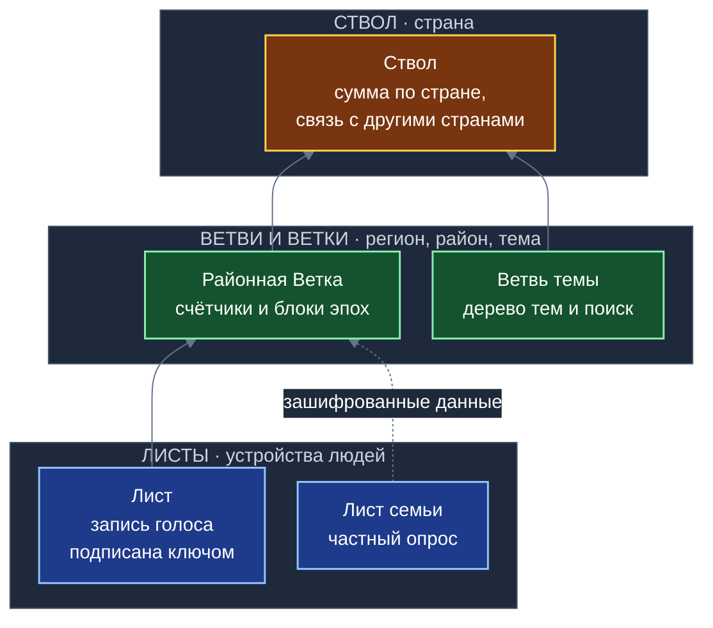

**Схема 2. От идеи к двум метрикам (глава 2)**


**Схема 3. Пример на четырёх участниках (глава 2)**

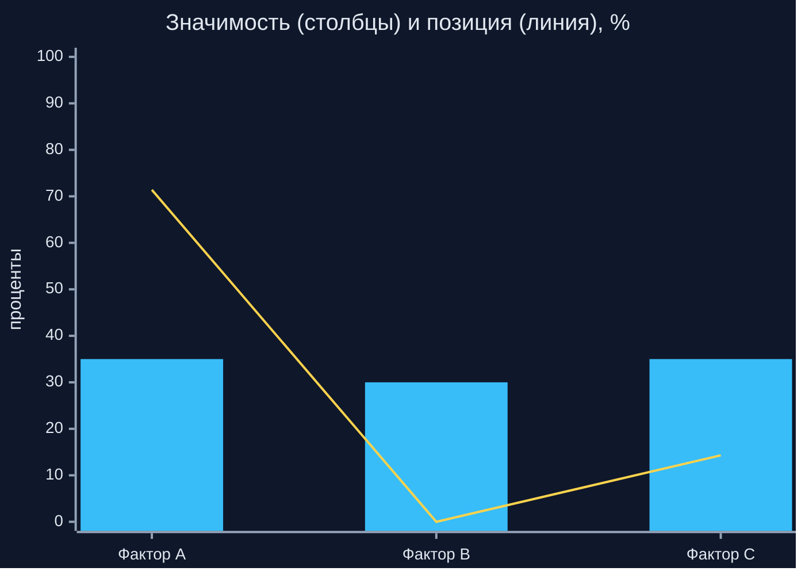

**Схема 4. Дерево версий (глава 3)**

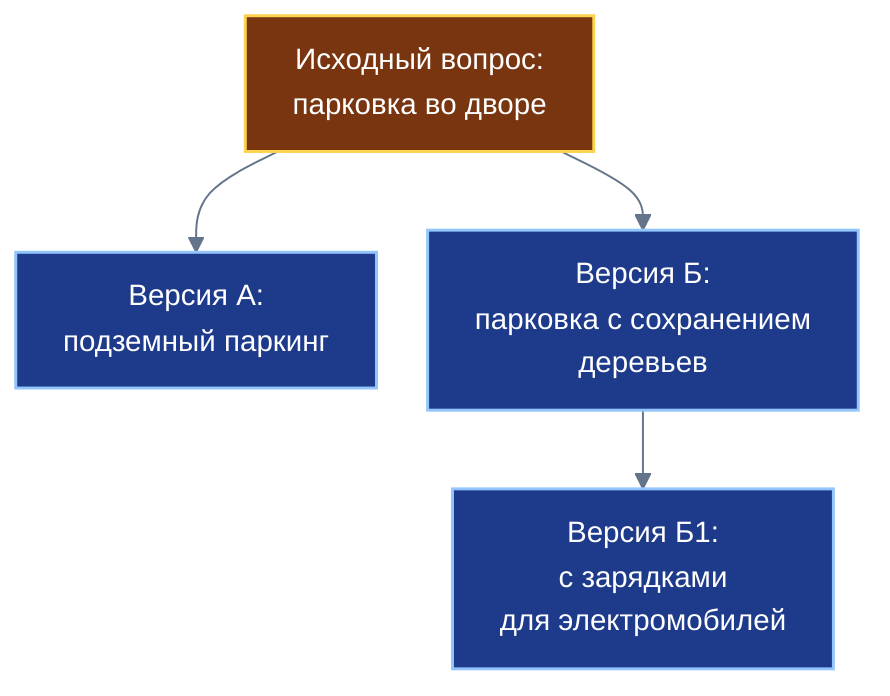

**Схема 5. Переголосование (глава 4)**

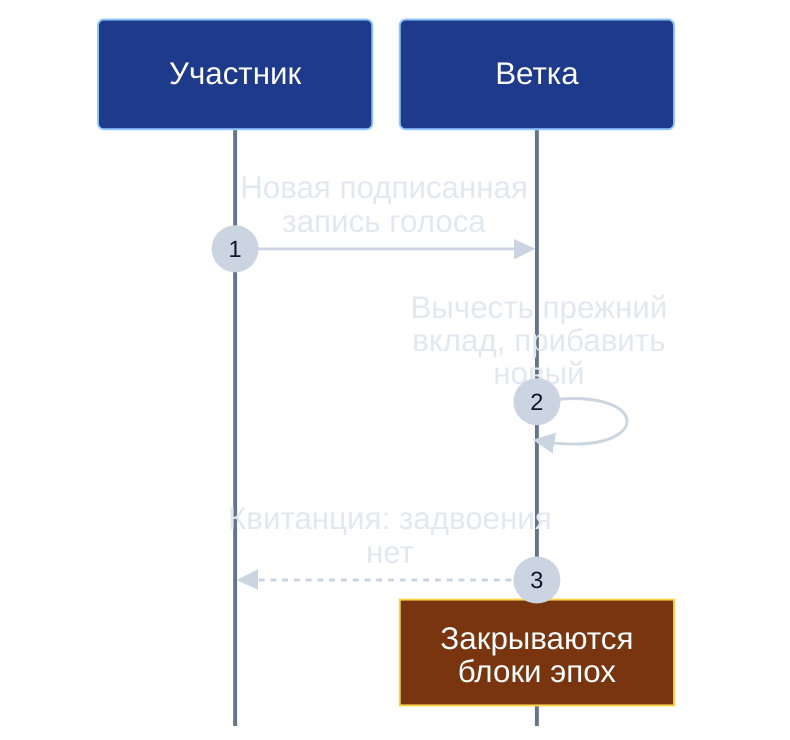

**Схема 6. Конвейер Ветки: счётчики и блоки эпох (глава 5)**

```mermaid
%%{init: {"theme":"base","themeVariables":{"background":"#0f172a","fontFamily":"Arial, Helvetica, sans-serif","fontSize":"15px","primaryColor":"#1e3a8a","primaryTextColor":"#ffffff","primaryBorderColor":"#93c5fd","secondaryColor":"#14532d","tertiaryColor":"#1e293b","lineColor":"#64748b","textColor":"#94a3b8","mainBkg":"#1e3a8a","nodeBorder":"#93c5fd","clusterBkg":"#1e293b","clusterBorder":"#475569","titleColor":"#cbd5e1","edgeLabelBackground":"#1e293b"},"themeCSS":"foreignObject *{font-family:Arial,Helvetica,sans-serif !important}","flowchart":{"curve":"basis","htmlLabels":true,"nodeSpacing":26,"rankSpacing":40,"padding":12,"useMaxWidth":true}}}%%
flowchart LR
    L1["Лист<br/>подписанная запись<br/>голоса"] --> B["Ветка<br/>проверка и счётчики<br/>в памяти"] --> E["Блок эпохи<br/>снимок сумм<br/>за час или сутки"] --> L2["Листы<br/>график мнений<br/>во времени"]
    class L1,L2 leaf
    class B branch
    class E trunk
    classDef leaf fill:#1e3a8a,stroke:#93c5fd,stroke-width:1.5px,color:#ffffff
    classDef branch fill:#14532d,stroke:#86efac,stroke-width:1.5px,color:#ffffff
    classDef trunk fill:#78350f,stroke:#fcd34d,stroke-width:1.5px,color:#ffffff
    classDef bank fill:#4c1d95,stroke:#c4b5fd,stroke-width:1.5px,color:#ffffff
    classDef priv fill:#334155,stroke:#cbd5e1,stroke-width:1.5px,color:#ffffff
    classDef risk fill:#7f1d1d,stroke:#fca5a5,stroke-width:1.5px,color:#ffffff
```

**Схема 7. Суммы, а не средние (глава 6)**

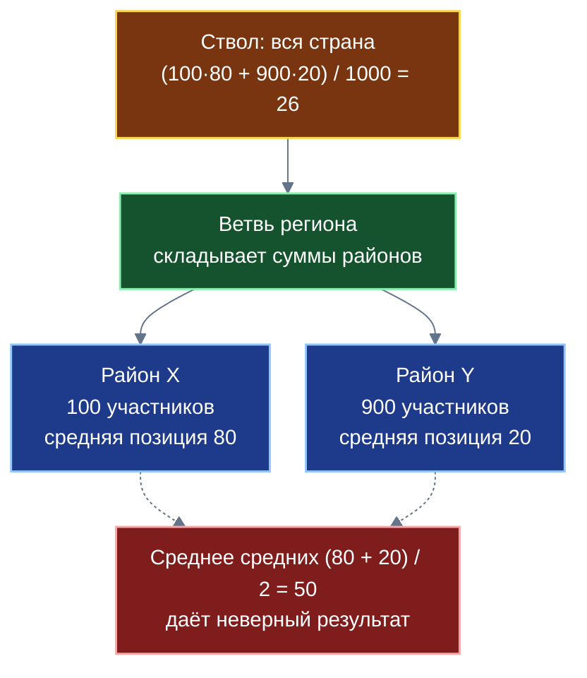

**Схема 8. Вес практики растёт с числом Опытов (глава 8)**

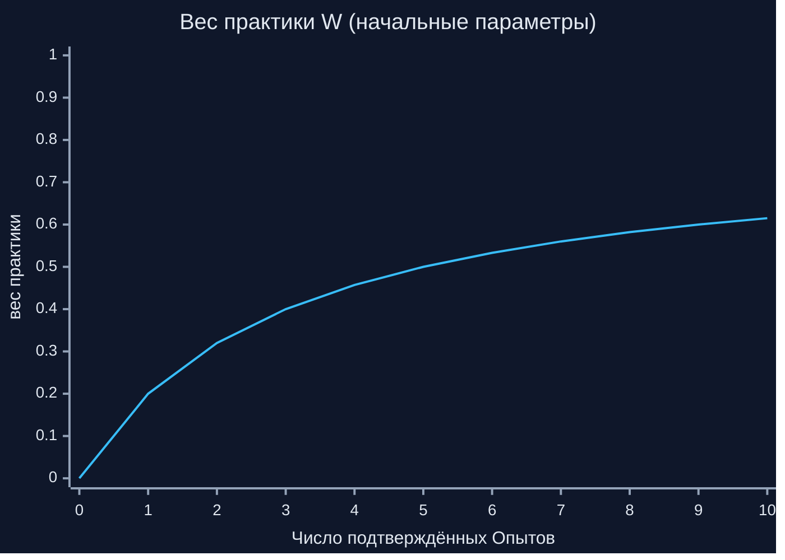

**Схема 9. Сводный показатель при высоком и низком Результате (глава 8)**

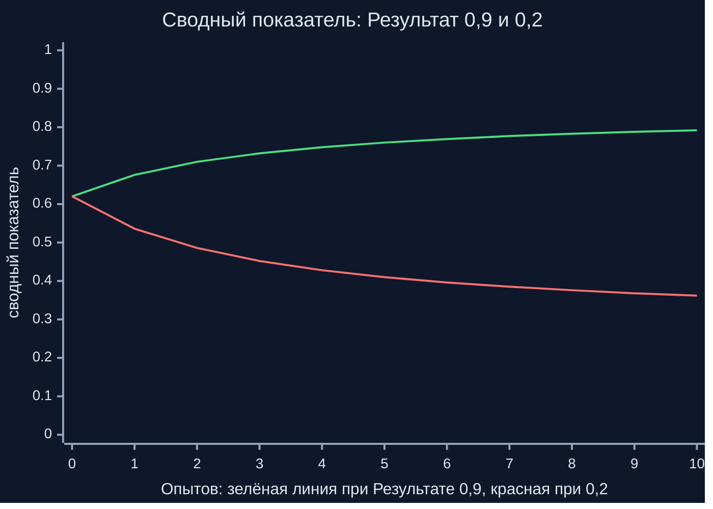

**Схема 10. Три уровня защиты и остаточный риск (глава 9)**

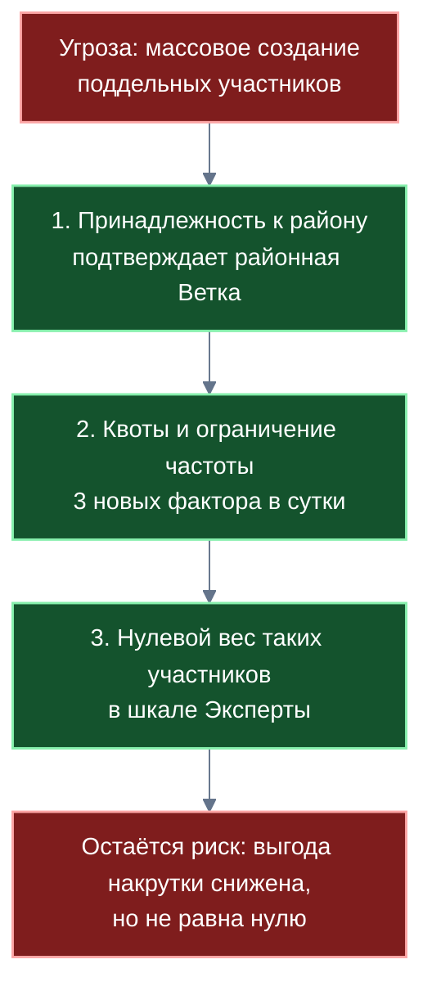

**Схема 11. Два контура (глава 10)**

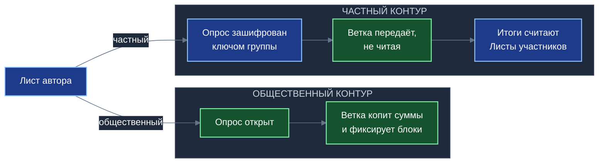

**Схема 12. Официальный срез и непрерывный мониторинг (глава 11)**

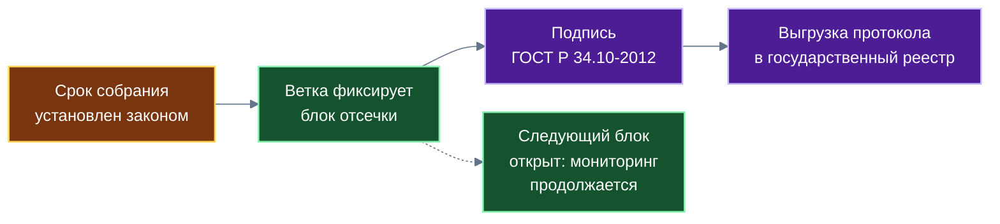

**Схема 13. Приложение и общие модули (глава 14)**

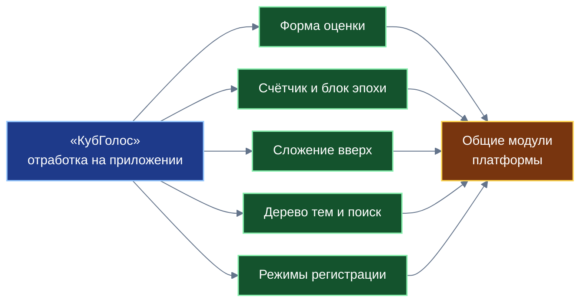

---

## 8. Таблицы для книги

### 8.1. Угрозы и защиты (глава 9)

| Угроза | Механизм защиты | Остаточный риск |
|---|---|---|
| Массовое создание поддельных участников | Ценз района при регистрации; квоты и ограничение частоты; нулевой вес таких участников в шкале Экспертов | Без централизованного удостоверения полная защита невозможна; защита снижает выгоду, но не обнуляет |
| Подмена или двойной учёт голоса | Подписанная запись; переголосование с заменой старого вклада; квитанция | Подпись не удостоверяет, что за ключом один человек |
| Всплеск новых факторов (спам) | Не более трёх в сутки на участника; заморозка; возврат лимита за признанные факторы | Участники могут координированно использовать несколько регистраций |
| Дублирование вопросов | Подсказка на устройстве; объединение с перенаправлением | Подсказка опирается на качество малой модели и индекса |
| Давление на группу при групповом голосовании | Групповая анонимность, жеребьёвка | Зависит от честности и состава группы |
| Накрутка шкалы Народа | Ценз района; шкала Результата не зависит от мнений | Шкала Народа остаётся чувствительной к массовому подключению новых регистраций; потому рядом всегда показываются две шкалы |

### 8.2. Остаточные риски (текст для подраздела главы 9)

1. Без логически централизованного органа, удостоверяющего участников, предотвратить атаку Сивиллы полностью нельзя (Дусер, 2002). Платформа делает такую атаку более дорогой и менее выгодной, но не отменяет её.
2. Групповая анонимность через соседей зависит от честности группы.
3. Ценз района зависит от надёжности первичной регистрации.
4. Шкала Результата зависит от того, что подтверждённый Опыт приходит из другого приложения и честен (его защита — в книге № 09).
5. Один человек может иметь несколько регистраций; рейтинги разных регистраций не объединяются (книга № 07).

### 8.3. Таблица «приложение → модуль» (глава 14)

| Что отработано на «КубГолосе» | Что станет общим модулем |
|---|---|
| Многофакторная оценка с бюджетом | Форма оценки, которую любое приложение подключает «из коробки» |
| Счётчики в памяти Ветки и блок эпохи | Платформенный счётчик для метрик, рейтингов и согласий |
| Сложение сумм вверх по дереву | Модуль агрегации по дереву |
| Дерево тем, поиск по буквенному дереву | Единый тематический каркас и поиск |
| Подсказка о дубликатах | Модуль дедупликации |
| Режимы регистрации | Общие режимы регистрации на Ветке |
| Слепой ретранслятор | Режим частного контура для всех приложений |
| Подписанный блок отсечки | Юридически значимая фиксация среза |

---

## 9. Что отсутствует в презентации и должно быть в книге

Презентация подаёт приложение как продукт. Для книги нужно добавить: счётчики и блоки эпох; сложение вверх; две метрики; три шкалы; контекст Ситуации и Идеи; переголосование; частный контур со слепым ретранслятором; подписанный блок; дедупликацию; режимы регистрации; остаточные риски; модули платформы.

Из презентации можно взять (после проверки): идею снизу вверх («любой житель может создать вопрос»); ветвление версий; повторное использование готовых блоков факторов как идею.

Аудит презентации — в общем плане, раздел 7.1.

---

## 10. Внешние источники (проверено поиском; документы целиком не читались)

- Дусер Дж. Р. (2002), «The Sybil Attack» (Microsoft Research, IPTPS 2002): в системе без логически централизованного органа, удостоверяющего личности, атака Сивиллы возможна всегда, кроме нереалистичных условий равенства ресурсов и согласованности участников. Используется только в главе 9.
- Остальное — внутренние источники.

---

## 11. Контрольный список перед сдачей

Общий контрольный список (общий план, раздел 11) плюс пункты из плана, раздел 6. Кроме того:
- [ ] Метафору куба объяснить один раз и не злоупотреблять; без математики проекций.
- [ ] Страницы, теги, рейтинг вкладов и контракты — по одному предложению-указателю.
- [ ] Расхождение вес практики 40–50% (README) и формула: использована формула (раздел 6.3).
- [ ] Для чисел указан статус (проектное значение, условный пример, оценка из спецификации).
- [ ] Просмотр в `viewer.html`.

---

## 12. Что осталось неизвестным

- Состояние прототипов (`votecube.com`, `votecube-client-logic`): в этой среде хранилищ нет; в книге писать «отдельные механики реализованы в прототипах».
- Результаты измерений быстродействия и пропускной способности отсутствуют.
- Состав типовых наборов факторов и их утверждающий орган.
- Доли программного стека, площадки встраивания и арендаторов мощностей: определяются функцией распределения; число называется только для гражданина (десятина, 10%). Расхождение С1 снято решением автора.
- Юридическая квалификация подписанного блока эпохи как доказательства.
- Статус и ответственность коммерческих Веток.

Новые вопросы, возникающие при написании, исполнитель задаёт автору.
