# ИНФОРМАЦИЯ К ПЛАНУ Белой книги № 09 — «Забота»

**Назначение.** Рабочий справочник для исполнителя плана `ПЛАН_09_Забота.md`. Собирает всё, что нужно для написания книги `09_sapoto_whitepaper.md`: решения автора, правила, проверенные факты, формулы с пересчитанными примерами, схемы, шаблон атрибуции, расхождения источников, контрольные списки.

**Для кого.** Исполнитель — модель Flash 3.8 (так её называет автор). Планирование выполнила модель Claude Sonnet 5.5 (автор называет её «Соната 5.5»). Предполагается, что исполнитель не видел предыдущих обсуждений. Где данные взяты у автора, где выведены составителем, где не проверены — указано явно.

**Это не часть книги.** Здесь допустимы названия файлов, номера разделов, имена программных сущностей. В текст книги они не переносятся (раздел 2).

**Границы задачи исполнителя.** Только книга `09_sapoto_whitepaper.md`. Правки в других документах и регистрацию книги выполняет автор плана. Если не хватает сведений, исполнитель задаёт вопрос автору.

**Формат выпуска.** Markdown. PDF не собирается, поэтому страничного бюджета и оглавления с номерами страниц нет. Остальные стандарты (тон, запреты, русская речь, формулы, схемы) действуют.

---

## 0. Как пользоваться документом

1. Прочитать общий план `ОБЩИЙ_ПЛАН_08-10_…` (разделы 1–6, 10–12), книгу № 08 (если она написана; согласовать термины), `ПЛАН_09_Забота.md`.
2. Для каждой главы взять тезисы плана и факты из разделов 4–8.
3. Формулы и числа — только из раздела 6.
4. Схемы — из раздела 7.
5. Перед сдачей пройти контрольный список (раздел 11).

**Три принципа:**
- Книга о вкладе приложения в платформу: страницы, составная конструкция, свидетельство, рейтинг вкладов и его целостность.
- Рейтингов два (социальный открытый; экономический закрытый, его ведёт Банк России). В этой книге подробно только социальный; экономический — указатель на книги № 07 и № 10.
- Книга описывает проектную концепцию и прототипы. Ничего не подаётся как работающее, согласованное с регулятором или юридически проверенное.

---

## 1. Решения автора

| № | Решение |
|---|---|
| 1 | Три книги, по одной на приложение. Эта — вторая; опирается на № 08 |
| 2 | Книгу можно читать отдельно: врезка «Из предыдущих книг комплекта» содержит 4–6 понятий из № 08 |
| 3 | Сосредоточение на вкладе «Заботы» в платформу |
| 4 | **Технология страниц описана в «КубГолосе», но нужнее всего «Заботе»; полное описание страниц — здесь** (глава 5) |
| 5 | Связка социального и экономического рейтингов описана в «Заботе», но строится в «Деловом»; здесь — только указатель |
| 6 | В конце концов все основные конструкции станут базовыми модулями (глава 14), без дат |
| 7 | Выпуск только в `.md` |
| 8 | Атрибуция как в книге № 07 («Соната 5.5» планирует, Flash 3.8 прорабатывает) «как есть» |
| 9 | Тон: свод идей; уважение к труду других; нет «карательный», «тупик» и т. п. |
| 10 | Модель двух рейтингов, виды анонимности и правило «частное остаётся частным» — как в книге № 07 (решения 1–24 её плана) |
| 11 | Нет дат, контактов, кода, DDL, меток с процентом, «мы/наш» |
| 12 | Математическая спецификация репутации подготовлена агентом Antigravity (Google DeepMind) под руководством автора; это указывается в атрибуции (допущение 6 общего плана) |

---

## 2. Правила для текста и шаблон атрибуции

### 2.1. Запреты

Общий план, раздел 10.1. Дополнительно для этой книги:
1. Не использовать «ад мессенджеров», «одиночество в цифровом муравейнике», «грабительские комиссии», «слежка» (об организациях), «фабрики ботов».
2. Не использовать «0% спама», «100% реальные люди, ноль фейков», «100% анонимность», «исключено», «невозможно».
3. Не использовать потолок займа, залоговую кривую, «депозит-фри», ZK-аттестации, транзитивное поручительство, свопы ликвидности, ROSCA, синдикацию и партнёрское финансирование в основных главах (проектные предложения; допустимо одно перечисление в границах роли).
4. Не использовать «Assent», «VoteCube Assent», шкалу «1..5» как числовой диапазон, веса «[2,5; 1,0; 0,5]».
5. Не использовать «5W1H» для Вопросов «Заботы» (это «Деловой»).
6. Не использовать «радиус 50 метров», «за две миллисекунды».
7. Не писать «репутационный след хранится на устройстве и подписывается локальным ключом» как описание рейтинга: по модели двух рейтингов социальный рейтинг открыт и собирается на Ветках из вкладов.
8. Не писать «Ветки — не операторы персональных данных» как факт.
9. Не писать «рейтинг можно купить/продать» — писать, что конвертация анонимного рейтинга запрещена именно для защиты от этого.

### 2.2. Как формулировать спорные места

Общий план, раздел 10.2. Дополнительно:

| Нельзя | Можно |
|---|---|
| «Забота» создаёт общий рейтинг человека» | «Рейтинг вкладов человека по теме; единый показатель по умолчанию не выводится» |
| «Кредитные бюро и системы социального рейтинга устарели» | «Кредитные бюро, скоринг и системы социального рейтинга решают реальные задачи доверия, и за ними стоит большой труд; здесь предлагаются идеи, которые могут их дополнить: рейтинг вкладов по темам, право ответа, затухание давних ошибок, ясные правила приватности» |
| «Рейтинг защищён от накруток» | «Рейтинг защищают четыре механизма, они снижают выгоду накрутки; остаточные риски описаны отдельно» |
| «Опыт нельзя сфабриковать» | «Подтверждённый Опыт труднее подделать, чем мнение: он опирается на видео, голос и внешние свидетельства; полностью исключить подделку нельзя» |
| «Забота выдаёт займы» | «Положения о займах — проектные предложения для внешних рейтинговых структур и Банка России» |

### 2.3. Шаблон атрибуции (вставить в начало книги)

> *Автор: Артём Владимирович Шамсутдинов, разработчик платформы «Турбаза» — интернета суверенных и частных данных / открытого стека AIRport.*
> *Методология подготовки: замысел приложения «Забота», его место в платформе, модель двух рейтингов, принципы открытости социального рейтинга, политики оператора темы и режимов регистрации сформированы автором. Математическая и алгоритмическая спецификация репутационной системы разработана интеллектуальным агентом Antigravity (Google DeepMind) на основе замысла и архитектурных инвариантов автора и при его методическом руководстве. Планирование документа выполнено моделью Claude Sonnet 5.5; распределение понятий между тремя книгами комплекта и порядок изложения предложены ею для утверждения автором. Детальная проработка текста выполнена моделью Flash 3.8.*

Примечания: «Флаш 3.8» — название, которое дал автор; разработчик не указывается. Слова «для утверждения автором» заменить на «и приняты автором» после подтверждения общего плана.

---

## 3. Формат книги (Markdown)

Общий план, раздел 6.3. Заголовок:

```
# «Забота»: вкладывать и просматривать
**Белая книга № 09: страницы, вклады и открытый рейтинг вкладов**
*Версия: 1.0 (2026)*
*Статус: проектная концепция*
*Классификация: прикладной уровень платформы «Турбаза»*
```

---

## 4. Глоссарий для читателя

| Термин | Пояснение |
|---|---|
| Случай | Запись конкретной жизненной проблемы, сделанная конкретным человеком; привязан к теме |
| Ситуация | Общий контекст («КубГолос»); объединяет любое число похожих Случаев |
| Разговор, тред | Цепочка реплик под Случаем |
| Реплика | Запись в треде: Идея, Опыт, Вопрос или Комментарий |
| Идея | Предписание: что следует сделать |
| Опыт | Описание: что произошло на практике; может быть текстом, голосом («Голос») или видео («Показ») |
| Вопрос | Запрос недостающего контекста; восемь вопросительных маркеров |
| Рецепт | Закреплённая в каталоге темы триада: Ситуация, принятая Идея, подтверждённый Опыт |
| Страница | Ограниченная часть связи «один ко многим», которая запечатывается при заполнении |
| Вклад | Единица, которую оценивают: реплика, Идея, Опыт, Вопрос, выполненное Дело |
| Тема, тег | Тема — узел дерева категорий; тег — личная метка, собирающая срез по нескольким темам (подробно — книга № 10) |
| Показатель темы | Число от 0 до 1: ожидаемая надёжность вклада в теме с учётом неопределённости |
| Масса свидетельств | Сумма весов положительных и отрицательных оценок; показывает, на скольких данных основан показатель |
| Эпоха | Час (горячие вопросы) или сутки (обычные); по итогам Ветка фиксирует блок |
| Право ответа | Возможность человека или бизнеса ответить на оценку так, чтобы ответ был виден |
| Оператор темы | Кооператив, держащий Ветку или Ветвь темы, и (или) создатель сводника приложений; задаёт политику рейтинга в рамках закона |
| Субъективная логика | Математический аппарат (Йёсанг), оперирующий мнением, в котором отдельно учитывается неопределённость |
| Затухание (полураспад) | Свидетельства теряют вес со временем по заданному периоду |
| Герметичный отсек | Закрытое сообщество (подъезд, класс, садовое товарищество, община) с шифрованием общим ключом группы |

---

## 5. Факты по главам (с источниками)

Условные обозначения: `С-арх` = `applications/sapoto/Sapoto_architecture_and_functionality.md`; `С-readme` = `applications/sapoto/README.md`; `С-репут` = `Sapoto_Reputation_and_Credit_System_Specification.md`; `С-влияние` = `Sapoto_Ecosystem_Impact_Guide.md`; `С-роль` = `Sapoto_Role_in_Rating_Infrastructure.md`; `VC-арх` = `applications/votecube/VoteCube_architecture_and_functionality.md`; `Заметка` = `comments/2026/09-19_02_Sapoto.md`.

### 5.1. Глава 1

- Заметка: «Забота» — сеть социальной поддержки информацией, но может быть связана и с поддержкой на местах, потому что опирается на древовидную топологию платформы, где можно проверить, что пользователи находятся в одном районе или городе. Забота — второе системообразующее приложение.
- Название (С-арх §1; С-readme §1.1): от японского слова «поддержка»; дополнительный смысловой слой в README обыгрывает испанское «sapo» (жаба) как «скачок»: в книгу его не переносить.
- Роль (С-роль §1): первый шаг («КубГолос») даёт форму оценки, счётчики и агрегацию; «Забота» создаёт среду, в которой появляются вклады людей, и добавляет голосование внутри тредов и страницы.

### 5.2. Глава 2 (составная конструкция)

- Заметка, «Составная конструкция»: Случаи Заботы — составные конструкции: Ситуация «КубГолоса» (общая, связана с любым числом похожих Случаев), собственно Случай, соединённый с Разговором из другой встроенной в платформу схемы. В интерфейсе «Заботы» используется Дело «Делового» со срочностью и приоритетом, включающее Случай. Конструкция позволяет приложениям и интерфейсам использовать именно то, что нужно, без строгого правила брать все схемы. Пример: другое приложение, работающее с Разговорами на другом уровне, может соединять свою Дискуссию с Разговором «Заботы», минуя схему и оболочку «Заботы». Это позволяет обойти монополизацию рынка, экономит ресурсы и снижает энергозатраты.
- Заметка: то же устройство позволяет другим приложениям использовать мощности платформы: они создают Случаи и Ситуации через оболочки «Заботы» и «КубГолоса» и ссылаются на них из своих таблиц; не все Случаи и вопросы создаются через интерфейсы «Заботы» и «КубГолоса».
- Заметка, «Структура»: «Забота» использует ту же систему категорий и тегов, что «КубГолос»; её схема данных и программная оболочка могут быть использованы любыми другими приложениями; она сама использует схему и оболочку «КубГолоса»; интерфейс «Заботы» использует оболочку задач «Делового», которая добавляет срочность и приоритет, потому что интерфейсы отделены от серверной части приложений.
- Заметка, «Инфраструктура»: общественно открытые Случаи сохраняются как страницы, привязанные к Ситуациям «КубГолоса»; поэтому «Забота» использует то же серверное дерево; некоторые Случаи имеют административно-территориальный характер, и «КубГолос» и «Забота» работают прямо на Ветках; в перспективе другие системы могут присутствовать на суверенных ветках с теми же концепциями, подключая собственные мощности для тематических деревьев данных. Логика приложений и схема «Заботы» и «КубГолоса» используются и в семейных и групповых хранилищах, которые не индексируются и на страницы Веток не попадают.
- Асимметрия слоёв (VC-арх §2.4): данные строго «КубГолос» ← «Забота» ← «Деловой»; интерфейсы всех трёх разложены на независимые строительные блоки и могут встраиваться друг в друга.

### 5.3. Глава 3 (вклады)

Таблица реплик (С-арх §3.1; С-readme §3):

| Измерение | Идея | Опыт | Вопрос | Комментарий |
|---|---|---|---|---|
| Природа | Предписывающая: что следует сделать | Описательная: что произошло на практике | Недостающий контекст | Общее обсуждение |
| Оценка | Согласие в «КубГолосе» | Подтверждение или опровержение | Отметка полезности автором | Реакции сообщества |
| Срочность и важность | Шкала срочности и важности | Достоверность результата | Критичность для понимания | Не оценивается |
| Структура | Дерево причин (факторы) | Текст плюс «Голос» и «Показ» | Восемь маркеров | Свободный текст |
| Действия | «Обосновать в кубе» и «Взять как задачу» | Подтверждение или опровержение Идей | Уточнение контекста | Ответ в тред |
| Влияние на рейтинг | Авторство и проницательность | Основа надёжности (положительные и отрицательные свидетельства) | Гражданская активность | Не влияет |

- Восемь вопросительных маркеров (С-арх §3.4): Что, Какой, Кто, Где, Почему, Когда, Как, Чей. Ответ автора переводит Вопрос в статус «Отвечен» и закрепляет уточняющие факты в блоке «Уточнённый контекст Ситуации».
- Решение Ситуации и Рецепт (С-арх §3.3): когда Идея успешно решает проблему на практике, автор Ситуации переводит её в статус «Решена»; триада «Ситуация, принятая Идея, подтверждённый Опыт» закрепляется как Рецепт (лучшая практика) в каталоге темы; тред остаётся открытым для альтернатив.
- Заметка, «Интерфейс»: пользователи оценивают срочность и приоритет Случаев; в цепочках четыре вида сообщений (Идея, жизненный опыт, дополнительные Вопросы, комментарии); все записи «заплюсовываются» другими, выделяя лучшие; как и сам Случай, записи в тредах могут использовать вопросы «КубГолоса» для опросов по теме, создавая новые или используя существующие.
- Случай как потенциальное Дело (С-арх §7.1): публикация Случая создаёт связанное потенциальное Дело; сообщество оценивает срочность и важность; когда человек решает действовать, формулируется название Дела. В книге № 09 — одно предложение-указатель на № 10.

### 5.4. Глава 4 (Опыт)

- Связь Опыт — Идея (С-арх §3.2): Опыт прикрепляется к Идее как независимая запись (принцип «Пиши только своё»); число записей Опыта и шкала Результата агрегируются на Листе и на Ветке (счётчики в памяти), не изменяя запись Идеи автора. Опыт также может быть исходным контекстом Ситуации (то, что человек уже предпринял до идей).
- Опыт валидирует причины Идеи: +1, 0, −1 (VC-readme §8; С-readme §4); это наполняет шкалу Результата «КубГолоса».
- «Голос» и «Показ» (С-арх §3.5): запись через стандартные интерфейсы браузера без плагинов; исходные файлы хранятся в блоб-хранилище Веток платформы; распознавание речи в текст выполняется на устройстве (локально), обеспечивая поиск и приватное чтение без передачи голоса на внешние облачные серверы.
- Цикл (VC-readme §8; С-арх §7.1): публикация Случая → привязка к Ситуации → Идея с тремя причинами → голосование → автор отмечает Идею принятой → «Взять как задачу» создаёт Задачу в Деле → выполнение → «Забота» предлагает опубликовать Опыт → причины Идеи подтверждаются или опровергаются → обновляется шкала Результата.

### 5.5. Глава 5 (страницы): подробный материал

Источники: `VC-арх` §8.2.1–8.2.6, §5.6; `С-арх` §4.3; `Технический документ платформы Турбаза.md` §3.5; `VC-readme` §4.2, §4.5.

**5.5.1. Проблема.** В централизованной базе связь «один ко многим» решается просто: выбирают нужный срез. В децентрализованных хранилищах хранилище — неделимая единица хранения, проверки, доступа и синхронизации. Если родительская запись (тема, Ситуация, тред Случая) хранит неограниченное число дочерних записей в одном хранилище:
1. **Раздувание.** Журнал изменений разрастается (в спецификации — до десятков гигабайт); при первой синхронизации Лист вынужден скачать всю историю, прежде чем показать интерфейс; работа на мобильных устройствах и без сети невозможна.
2. **Конфликты записи.** Одновременное добавление записей сотнями участников в одно хранилище вызывает конфликты сериализации и большие расходы на слияние.
3. **Потеря неизменяемости и кэша.** Каждая новая дочерняя запись меняет состояние родительского хранилища, поэтому данные нельзя навсегда кэшировать на промежуточных узлах и устройствах.

**5.5.2. Решение: самозапечатывающаяся страница.**
- Связь «один ко многим» делится на цепочку ограниченных страниц. Страница оформлена как полноценное хранилище, но аккумулирует не полные дочерние записи, а лёгкие проекции и ссылки на записи из других хранилищ («Агрегативное хранилище» в спецификации; в книге: «хранилище-список»).
- Почему страница сделана хранилищем: Лист обрабатывает её тем же конвейером, что и любые данные (репликация в локальную базу, проверка подписей, кэш, живые запросы); не нужны особые сетевые протоколы списков; страницы реплицируются, версионируются и синхронизируются единым механизмом журнала изменений; список доступен без сети.
- Две зоны страницы: (А) полезная нагрузка — массив проекций детей; мягкий предел около 1000; при приближении к пределу страница запечатывается: фиксируется хеш, она становится неизменяемой и навсегда кэшируется на Листах и Ветках (повторное чтение сети не нагружает); (Б) ссылки на дочерние страницы, образующие самобалансирующееся B-дерево; после запечатывания создаётся новая страница, куда идут последующие записи (только добавление).
- Мягкий предел: если из-за параллельных записей на странице окажется чуть больше 1000 записей (например, 1015), целостность не нарушается; важно, что размер страницы ограничен константой.
- Нет уплотнения: запечатанные страницы — неизменяемый архив; каждая страница — самодостаточный файл ограниченного размера.

**5.5.3. Распределение по дереву Веток.** Темы, Ситуации и другие сущности распределены по уровням дерева Веток; каждая Ветка отвечает за свой узел (тему или территориальный срез). Ветка последовательно ведёт текущую страницу и заранее готовит переход на следующую; поэтому маршрут записи детерминирован. Для одной темы можно вести несколько потоков страниц разных типов (например, общие Ситуации «КубГолоса» и автоматические Ситуации «Заботы»), не смешивая их в одном списке.

**5.5.4. Что делает Ветка, что Лист.**

| Участник | Что делает |
|---|---|
| Лист | Создаёт и подписывает собственное хранилище записи (Случая, реплики) и отправляет Ветке со ссылкой на родителя. Страницы **не изменяет и в них не пишет**. Читает постранично: запрашивает первую страницу, показывает облегченные карточки, по мере прокрутки запрашивает следующие |
| Ветка | Управляет страницами темы: находит открытую страницу нужного типа и добавляет проекцию записи; при заполнении создаёт новую страницу и добавляет в родительский журнал ссылку-заглушку (только идентификатор); при изменении названия или статуса записи обновляет страницу |

- «Листовая» (списочная) информация: идентификатор, название и минимум столбцов для вида списка; полная запись (описание, история, вложенные списки) лежит в собственном хранилище. Благодаря этому список показывается мгновенно.
- Синхронизация обновлений: при редактировании записи соответствующая страница получает обновление, поэтому заголовки в списках актуальны.

**5.5.5. Частные хранилища.** К семейным и групповым хранилищам (сквозное шифрование) деление на общественные страницы не применяется; они остаются изолированными; Ветки их не индексируют и в публичные деревья страниц не включают.

**5.5.6. Открытый контракт.** Страницы — платформенный стандарт: сторонние приложения, подключающие собственные мощности к территориальным Веткам, могут объявлять свои виды страниц, соблюдающие правила запечатывания и дочерних страниц, и получают неограниченное масштабирование собственных деревьев данных.

**5.5.7. Страницы и поиск.** Текстовый поиск идёт через дерево поиска без использования страниц; страницы отвечают за списки и просмотр. Для тегов предусмотрено собственное дерево страниц-хранилищ со ссылками на Ситуации и Случаи (VC-арх §8.3): пересечение нескольких тегов Лист вычисляет в локальной базе (подробно о тегах — книга № 10).

**5.5.8. Страницы и рейтинг (С-роль §4).** Лист показывает тред постранично; запечатанные страницы неизменяемы, поэтому вид рейтинга можно воспроизвести; Ветки индексируют страницы общественных тредов; агрегат на Ветке не хранит связей с отдельными хранилищами; спуск от оценки к источнику идёт через теги на Листе.

**5.5.9. Место в платформе.** VC-арх §5.6: страницы названы одним из двух платформенных примитивов (второй — счётчики), которые зарождаются в «Заботе» и «КубГолосе», а затем целиком выводятся на уровень ядра платформы; все последующие приложения получат возможность масштабировать любые коллекции через платформенные страницы.

**Чего не писать:** имена интерфейсов и сущностей; названия заголовков HTTP; слова «B-Tree» без пояснения («дерево страниц»); числа «десятки гигабайт» как измерения (писать «разрастается»).

### 5.6. Глава 6 (голосование в треде)

- Кто голосует (С-арх §5.3 п. 8): в «Заботе» все участники треда; их рейтинг влияет на результат; в «Деловом» только участники Дела; в тематических приложениях действуют их правила.
- Вес: $w_i=w_{\min}+(1-w_{\min})\sqrt{b_i}$, $b_i=R_i/(R_i+S_i+W)$ — доверие голосующего в теме треда, зафиксированное в блоке прошлой эпохи; $w_{\min}=0{,}1$.
- Эксперты и Народ — два результата рядом; невзвешенный показывается всегда.
- Другие формы оценки: плюс на репликах; микро-опросы «КубГолоса» на Идеях и Случаях; оценка срочности и приоритета.

### 5.7. Глава 7 (язык доверия)

- Мнение (С-арх §5.2): $\omega=(b,d,u,a)$; $b+d+u=1$; $E=b+a\,u$.
- Из свидетельств: $b=\frac{r}{r+s+W}$, $d=\frac{s}{r+s+W}$, $u=\frac{W}{r+s+W}$, $W=2$; при $r=s=0$ имеем $u=1$ и $E=0{,}5$.
- Положительные свидетельства: решённая Ситуация по Идее автора; подтверждённый сообществом Опыт; успешно закрытая Задача или Дело; добровольная положительная оценка исполнителя участниками контракта. Отрицательные: опровергнутая практикой рекомендация; срыв срока или неисполнение принятой Задачи; отрицательная оценка; подтверждённый арбитражный вердикт. **В этой книге «исход контракта» не называть свидетельством социального рейтинга: исход учитывает экономический рейтинг, который ведёт Банк России** (С-арх §5.2.2).
- Затухание: $r(t)=r_0 e^{-\lambda\Delta t}$, $\lambda=\ln2/T_{1/2}$; для бытовой взаимопомощи $T_{1/2}=6$ месяцев (начальное значение; период задаёт оператор темы). Значение 24 месяцев относится к кредитной надёжности (проектное предложение) — не использовать.
- Показатель темы $E=(R+aW)/(R+S+W)$ — это ожидание мнения $\omega$ при $r\to R$, $s\to S$; значит, формула рейтинга не новая, а прямое применение субъективной логики. Подчеркнуть читателю.
- Изоляция предметной компетентности и добросовестности (С-репут §2.4): компетентность не переносится между разными темами; общая добросовестность, возможно, переносится. **В книге № 09 упомянуть только первое («рейтинг одной темы не переносится в другую»)**: «общую добросовестность» подавать как идею, не вводя дополнительных обозначений.
- Холодный старт (С-репут §14): три шага: гражданская активность и бытовой опыт; наставничество (подмастерье); поручительство — третий шаг относится к проектным предложениям (не использовать).

### 5.8. Глава 8 (рейтинг вкладов)

См. С-арх §5.3 (п. 1–5) и С-репут §5.2. Тезисы плана; формулы — в разделе 6.1.

- «Открытое общественное лицо» пользователя по темам.
- Ключ узла: регистрация автора вместе с её статусом (рейтинг одной регистрации не сливается с другой).
- Дублирование: Ветви региона и Ствол страны.
- «Единый балл не выводится ни Ветками, ни Стволом»; допустимы срезы по теме, региону и тегу.
- Согласованность Лист/Ветка: на одном наборе вкладов результат одинаков.
- Экономические пороги и экономический рейтинг — в этой книге не раскрывать.

### 5.9. Глава 9 (целостность)

- Четыре механизма (С-арх §5.3 п. 7; С-репут §5.2): (1) вес эпохи $N$ по рейтингу в блоке эпохи $N-1$; (2) $M_{\text{мн}}^{\text{эфф}}=\min(M_{\text{мн}},\kappa M_{\text{вн}}+m_0)$; (3) $w_i=w_{\min}+(1-w_{\min})\sqrt{b_i}$; (4) самооценка исключена, дисконт взаимных оценок 0,5. Начальные значения: $\kappa=1$, $m_0=2$, $w_{\min}=0{,}1$.
- Угрозы (С-репут §5): накрутка колец (дефлятор по коэффициенту кластеризации); месть и шантаж (двойное слепое раскрытие: отзывы открываются одновременно после публикации оценок обеими сторонами; спор — арбитраж; арбитраж в книге упомянуть одним предложением: «процедуры народного арбитража проектируются отдельно»); накрутка ботами (ценз района и квоты, нулевой вес в шкале Экспертов); «выход в кэш» (логарифм объёма в рублях) — **не использовать**: относится к кредитной функции.
- Штраф за кластеризацию (С-репут §5.1): $C(A,B)=\frac{2|\Delta(A,B)|}{k_Ak_B}$; при $C>0{,}6$ вес взаимных свидетельств дисконтируется: $w_{\text{эфф}}=w_0\exp(-\beta(C-C_{\text{порог}}))$. В книге: словами и одной формулой без значения $\beta$ (значение задаёт симуляция).
- Защита от травли (С-арх §5.3): мнения участников, не имевших совместного подтверждённого Опыта с оцениваемым, получают $u\to1$ и отсекаются при слиянии мнений.
- Остаточные риски: см. раздел 8.2.

### 5.10. Глава 10 (права, контуры, оператор темы)

- Право ответа и разбор (С-арх §5.3 п. 9).
- Оператор темы (С-арх §5.3 п. 6).
- Приватные рейтинги (С-арх §5.3 п. 10).
- Защита прав пользователя (п. 11).
- Двухуровневая модерация (С-readme §10): кооперативный уровень поддерживает чистоту публичных деревьев по закону; репутационный: жалобы участников с высоким показателем понижают видимость вредного контента, защищая треды от спама без цензуры. Формулировку «без цензуры» не использовать: писать «понижение видимости, а не удаление».
- Герметичные отсеки (презентация, слайд 10; заметка `08-30_01_Who_is_it_for.md`): подъездное хранилище, родительские комитеты, садоводческие товарищества, общины; шифруются общими ключами группы; Ветки не читают. В книге — по образцу «Для кого задумана Турбаза» (семьи, соседи; «не всё нужно выносить на весь квартал»).
- Частный контур: те же схемы и логика работают в семейных и групповых хранилищах без индексации.

### 5.11. Глава 11 (регистрация и перенос)

См. С-арх §6.1. Содержание плана; таблица — раздел 8.3.

### 5.12. Глава 12 (открытые схемы)

- Кросс-экосистемное использование (С-арх §5.5): «КубГолос» (вес голоса); «Деловой» (приоритет задач авторитетных постановщиков); «УраТур» (проводники по видеоопыту); «Локальный реестр МСП и ЖКХ» (рейтинг мастеров по подтверждённому опыту); операторы Веток (качество маршрутизации).
- Заметка, «Репутация»: репутационная наработка позволяет выявлять экспертов и давать дополнительную фильтрацию идей, опыта и вопросов; в дальнейшем репутация может быть использована в экономической и других реальных деятельностях. Заметка «Экономический потенциал»: основная польза остаётся в обмене и хранении информации; экономика — дополнительное преимущество.
- Открытый стандарт схем (презентация, слайд 11): другие разработчики используют схемы вместо проприетарных; совместимость данных между приложениями. В книге писать «открытые схемы» без названий сущностей.

### 5.13. Глава 13 (примеры)

**Пример 1. Дача для дедушки (С-влияние §3).** Случай: оборудование пандуса и санузла для маломобильного дедушки при ограниченном бюджете. Решение: сосед-инженер делится видеоинструкцией («Показ») сборки пандуса из стандартного бруса. Финансирование: недостающие 30 000 рублей семья привлекает через заём у участников семейного клана в цифровых рублях под 0% (проектное предложение). Что показать в книге: Случай, Идея, Опыт «Показ», Рецепт; социальный след — вклад соседа-инженера в теме; **заём не раскрывать**, одним предложением: «финансирование — проектное предложение, см. книги № 07 и № 10».

**Пример 2. Коммунальная авария (С-влияние §7).** Прорыв стояка отопления в мороз; Случай: «Срочно нужен ключ от теплопункта»; отклики: сосед из четвёртого подъезда знает телефон слесаря, сосед с первого этажа имеет сварочный аппарат; результат в примере: ликвидация аварии за 30 минут и рост репутации участников. Условный пример. Что показать: срочность и важность; связь Случай → Дело; режим без сети (ячеистая связь) одним предложением; рейтинг добрососедства.

**Пример 3. Выбор няни по подтверждённому опыту (С-влияние §4).** Риск найма недобросовестных нянь и репетиторов по накрученным отзывам; в «Заботе» родители видят подтверждённый жизненный опыт других семей района; формируется «База знаний группы» — Рецепты мягкой адаптации малышей. Что показать: вклад — Опыт семьи; кто оценивает — участники треда; социальный след — вклад в теме «адаптация малышей»; право ответа.

---

## 6. Числа и формулы (пересчитаны при подготовке)

### 6.1. Рейтинг одного вклада

Вклад оценили четыре участника. Позиции: $s_1=+1$, $s_2=+1$, $s_3=-1$, $s_4=+0{,}5$. Доверие голосующих в теме треда: $b_1=0{,}8$, $b_2=0{,}5$, $b_3=0{,}1$, $b_4=0$. Веса: $w=0{,}1+0{,}9\sqrt b$.

| Участник | Доверие $b$ | Вес $w$ | Позиция $s$ | Вклад в $R$ | Вклад в $S$ |
|---|:-:|:-:|:-:|:-:|:-:|
| 1 | 0,8 | 0,905 | +1 | 0,905 | 0 |
| 2 | 0,5 | 0,736 | +1 | 0,736 | 0 |
| 3 | 0,1 | 0,385 | −1 | 0 | 0,385 |
| 4 | 0 | 0,100 | +0,5 | 0,075 | 0,025 |

Итого $R=1{,}716$, $S=0{,}410$. Показатель темы $E=(1{,}716+1)/(1{,}716+0{,}410+2)=0{,}658$; масса свидетельств $R+S=2{,}126$. Читателю: «показатель умеренно положительный, но свидетельств мало; поэтому всегда публикуется и масса».

### 6.2. Единичный отзыв и сотня

| $R$ | $S$ | $E$ | Масса $R+S$ |
|:-:|:-:|:-:|:-:|
| 0 | 0 | 0,500 | 0 |
| 1 | 0 | 0,667 | 1 |
| 0 | 1 | 0,333 | 1 |
| 80 | 20 | 0,794 | 100 |
| 100 | 0 | 0,990 | 100 |

Смысл: один положительный отзыв и сотня положительных не должны выглядеть одинаково, поэтому показатель всегда публикуется вместе с массой.

### 6.3. Показатель при разном числе свидетельств (положительные $r$, отрицательные $s$)

| $r$ | $s$ | вера $b$ | сомнение $d$ | неопределённость $u$ | $E=b+0{,}5u$ |
|:-:|:-:|:-:|:-:|:-:|:-:|
| 0 | 0 | 0 | 0 | 1,000 | 0,500 |
| 3 | 0 | 0,600 | 0 | 0,400 | 0,800 |
| 5 | 1 | 0,625 | 0,125 | 0,250 | 0,750 |

### 6.4. Вес голосующего

| Доверие голосующего $b$ | Вес $w$ |
|:-:|:-:|
| 0 | 0,100 |
| 0,5 | 0,736 |
| 0,571 (например, $R=8,\;S=4$) | 0,780 |
| 0,8 | 0,905 |
| 0,96 | 0,982 |

Смысл: новичок не обнулён (0,1); опытный не перевешивает остальных кратно (максимум единица): вес растёт медленнее доверия.

### 6.5. Ограничение вклада мнений относительно внешних свидетельств

$M_{\text{мн}}^{\text{эфф}}=\min(M_{\text{мн}},\,\kappa M_{\text{вн}}+m_0)$, $\kappa=1$, $m_0=2$.

| Масса мнений | Масса внешних свидетельств | Учтено |
|:-:|:-:|:-:|
| 10 | 0 | 2 |
| 10 | 1 | 3 |
| 10 | 3 | 5 |
| 2 | 5 | 2 |

Смысл: без подтверждения делом, Опытом или актом мнения не могут перевесить; с подтверждением потолок растёт.

### 6.6. Затухание

Период полураспада 6 месяцев (начальное значение). Доля веса свидетельства через 3, 6, 12, 18, 24 месяца: 0,707; 0,500; 0,250; 0,125; 0,063.

Пример: корзины эпох (возраст в месяцах: положительные, отрицательные): (0: 2; 0), (3: 1; 0), (6: 1; 1), (12: 2; 0). Без затухания $R=6$, $S=1$, $E=0{,}778$. С затуханием $R=3{,}707$, $S=0{,}500$, масса 4,207, $E=0{,}758$.

### 6.7. Страницы

Предел около 1000 записей; запечатывание; размер проекций ограничен. Числа о гигабайтах не использовать.

---

## 7. Готовые схемы (Mermaid, единый стиль комплекта)

### 7.0. Правила оформления схем (обязательные для книги)

Все схемы книги оформляются по единому образцу. Вставлять готовые блоки ниже целиком, вместе с первой строкой настройки (она начинается с `%%{init:`); сочинять схемы с нуля не нужно.

1. **Палитра** (одинакова во всём комплекте, читается в светлой и тёмной теме просмотра): синий — Лист; зелёный — Ветка и Ветвь; янтарный — Ствол; фиолетовый — Банк России, договоры и публикуемые числа; серый — частные хранилища; красный — риск или угроза.
2. **Тёмная подложка**: просмотр сам рисует схемы с настройкой на тёмном фоне в обеих темах; светлый фон не использовать.
3. **Размер**: ширина колонки статьи 760 px; шрифт схемы 15 px (в настройке задан шрифт Arial для подписей: это нужно, чтобы подписи не обрезались в узлах); схема не должна уменьшаться более чем до 0,73 (шрифт не менее 11 px). Не делать узлы в одну строку шире 4 слов: переносить через `<br/>`.
4. **Вид схемы по задаче**: поток слева направо — для процесса (`flowchart LR`); сверху вниз — для дерева и иерархии; последовательность — для обмена между участниками (не более 8 стрелок, имена участников короткие); диаграмма состояний — для жизненного цикла; столбцы и линии (`xychart-beta`) — для формул и числовых примеров; четыре квадранта (`quadrantChart`) — для матриц.
5. **Подписи**: только русские слова; английские названия не использовать; текст узла — не более трёх коротких строк; без программных имён.
6. **Подпись под схемой**: одна строка курсивом, что показано и какой вывод.
7. **Проверка**: перед сдачей прогнать книгу через `node scripts/check_markdown_mermaid.js <книга.md> --viewer` (запускается из корня репозитория, нужен интернет и установленный Playwright). Результат: «замечаний: 0».
8. **Цифры на графиках**: брать только из таблиц раздела 6; на графике указывать, что значения условные или начальные.
9. **Не использовать**: изображения, ASCII-рамки, сложные диаграммы Ганта и круговые диаграммы.

### 7.1. Готовые схемы

**Схема 1. Случай как сборка (глава 2)**

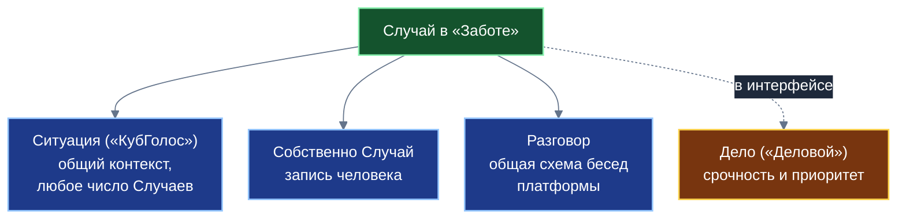

**Схема 2. Цикл вклада (глава 4)**

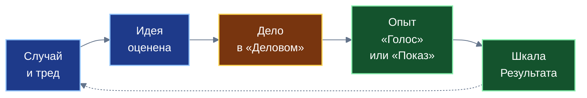

**Схема 3. Дерево страниц (глава 5)**

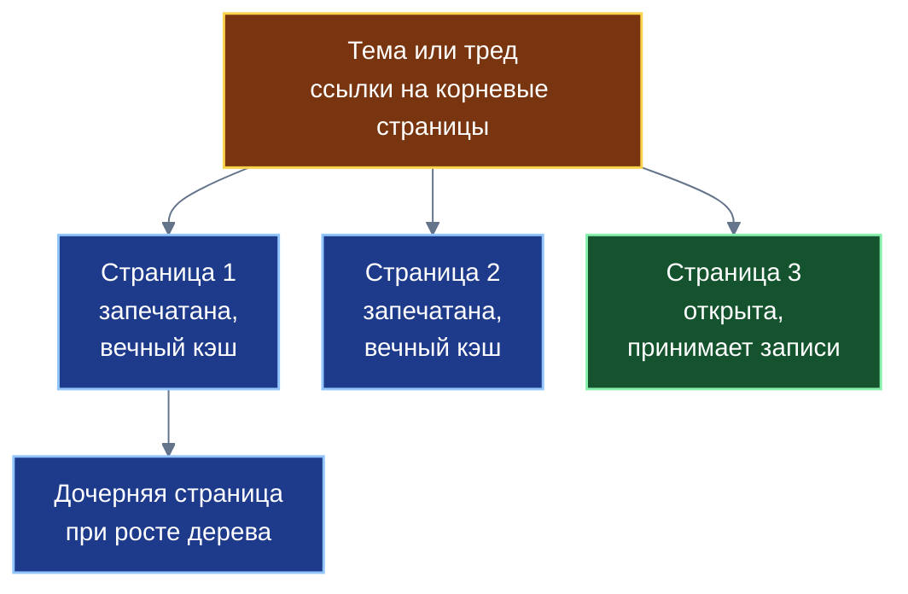

**Схема 4. Кто что делает со страницей (глава 5)**

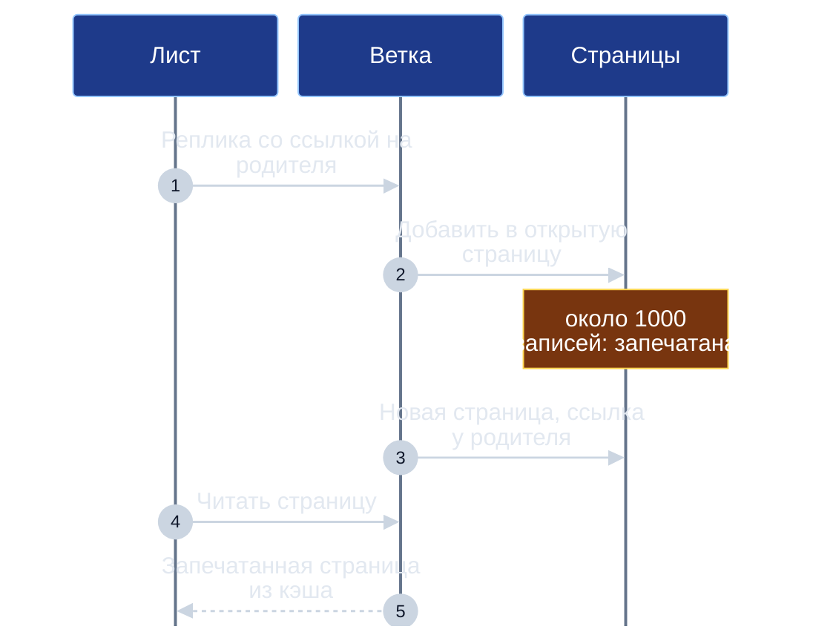

**Схема 5. Затухание свидетельств (глава 7)**

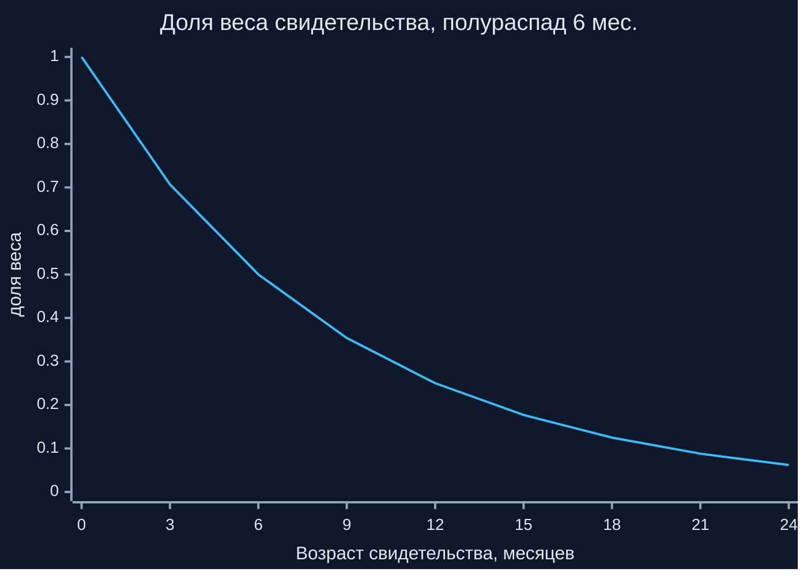

**Схема 6. Вес голосующего растёт медленнее его доверия (глава 7)**

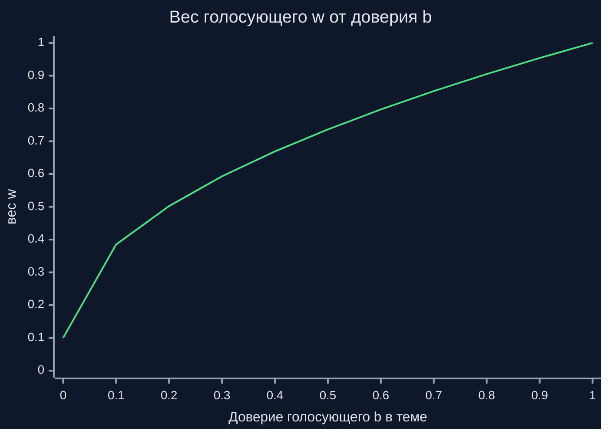

**Схема 7. Узел рейтинга и подъём вверх (глава 8)**

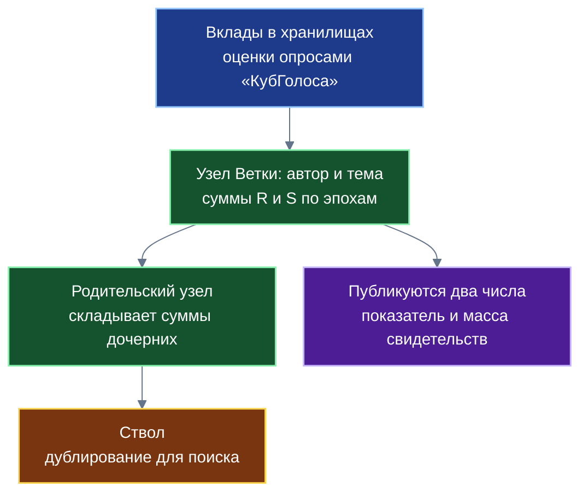

**Схема 8. Четыре механизма разрыва цикла (глава 9)**

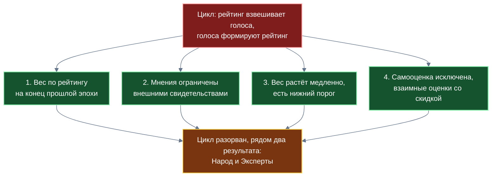

**Схема 9. Уровни видимости (глава 10)**

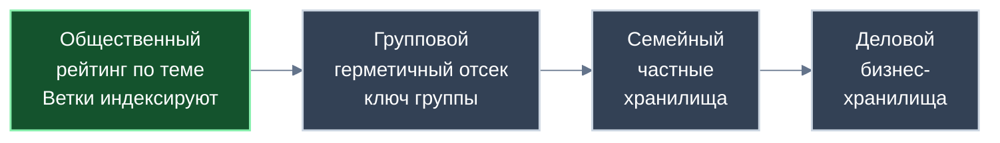

**Схема 10. Режимы регистрации и перенос рейтинга (глава 11)**

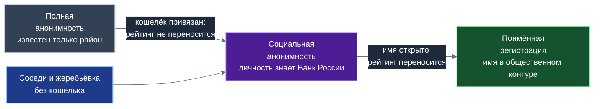

**Схема 11. Приложение и общие модули (глава 14)**

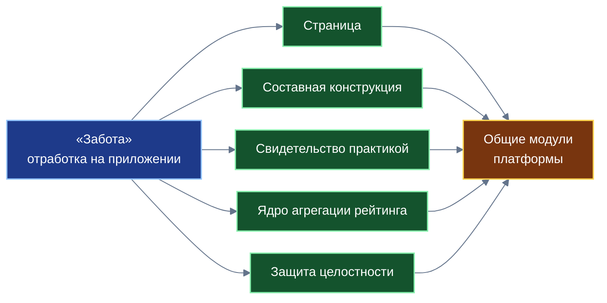

---

## 8. Таблицы для книги

### 8.1. Проблема → решение (глава 5)

| Проблема неограниченных связей | Что делает страница |
|---|---|
| Хранилище раздувается, первая синхронизация медленная | Каждая страница ограничена по размеру; Лист загружает только нужные |
| Конфликты при одновременных записях | Новые записи идут только в открытую страницу; Ветка последовательно ведёт её |
| Изменения родителя ломают кэш | Заполненная страница запечатывается, не меняется и кэшируется навсегда |
| Нужны особые протоколы списков | Страница — обычное хранилище; единый механизм на Листе |
| Список недоступен без сети | Страницы реплицируются на Лист и работают офлайн |

### 8.2. Остаточные риски (глава 9)

1. Единая защита невозможна без централизованного удостоверения (Дусер, 2002); механизмы снижают выгоду накрутки.
2. Замкнутые группы взаимных оценок обнаруживаются по структуре связей; хорошо замаскированный сговор может остаться незамеченным.
3. Подтверждённый Опыт труднее подделать, чем мнение, но не невозможно; арбитраж и подтверждение независимыми участниками проектируются отдельно.
4. Параметры (вес минимума, предел мнений, дисконт) подлежат симуляции; неудачный выбор может исказить рейтинг.
5. Несколько регистраций одного человека: рейтинги разных регистраций не объединяются, но вес их голосов подчиняется тем же механизмам.
6. Политика оператора темы может быть разной у разных тем; конфликт политик требует правил.

### 8.3. Режим → что переносится (глава 11)

| Режим регистрации | Что известно | Что с рейтингом |
|---|---|---|
| Полная анонимность | Только район | Ведётся за номером; не переносится в социальную анонимность при привязке кошелька (защита от продажи накрученных анонимных репутаций) |
| Социальная анонимность | Обществу не известен; Банк России знает личность (один кошелёк на человека) | Ведётся; может быть переведён в поимённый при добровольном открытии имени |
| Групповая (в рамках социальной) | Принадлежность к группе соседей | Ведётся; без привязки кошелька |
| Поимённая регистрация | Имя в общественном контуре (автоматически) | Ведётся под именем; до регистрации объясняется, завершение после явного согласия |

### 8.4. Кто решает что (глава 10)

| Вопрос | Кто решает |
|---|---|
| Публикация негативных оценок | Оператор темы в рамках закона |
| Период затухания, веса, наборы факторов | Оператор темы совместно с разработчиками приложений и пользователями |
| Приватные рейтинги | Участники контура; внешние службы — по закону и согласию |
| Право на публичный рейтинг | Прорабатывается отдельно |
| Что запрещено законом | Не публикуется |

### 8.5. Таблица «приложение → модуль» (глава 14)

| Что отработано на «Заботе» | Что станет общим модулем |
|---|---|
| Деление связей «один ко многим» на запечатываемые страницы | Платформенные страницы |
| Составная конструкция Случая | Способ сборки приложений из нужных частей |
| Опыт как запись с голосом, видео и связью с причинами идеи | Модуль свидетельства практикой |
| Узлы рейтинга с корзинами эпох и затуханием | Ядро агрегации рейтинга по теме |
| Четыре механизма и штраф за кластеризацию | Модуль целостности |
| Правила переноса рейтинга между режимами | Общие правила регистрации |
| Право ответа и разбор до источника | Общие права пользователя |

---

## 9. Что отсутствует в презентации и должно быть в книге

Страницы; составная конструкция; связь Опыта с шкалой Результата; рейтинг как агрегат по дереву; право ответа; оператор темы; разбор до источника; режимы регистрации и перенос рейтинга; четыре механизма целостности; остаточные риски.

Из презентации можно взять после проверки: идею структурированного обращения вместо потока сообщений; идею типизированных ответов; идею открытых схем. Аудит презентации — общий план, раздел 7.2.

---

## 10. Внешние источники (проверено поиском; документы целиком не читались)

- Субъективная логика (Йёсанг): мнение $(b,d,u,a)$, $b+d+u=1$; соответствие положительным и отрицательным свидетельствам $(r,s)$: $b=r/(r+s+2)$, $d=s/(r+s+2)$, $u=2/(r+s+2)$; ожидание $E=b+au$. Совпадает с формулами спецификации.
- Дусер (2002), «The Sybil Attack»: без логически централизованного органа, удостоверяющего личности, атака Сивиллы возможна всегда, кроме нереалистичных условий.

---

## 11. Контрольный список перед сдачей

Общий контрольный список (общий план, раздел 11) плюс пункты плана, раздел 6. Кроме того:
- [ ] В атрибуции есть строка об агенте Antigravity (Google DeepMind).
- [ ] Страницы описаны полностью (подразделы 5.5.1–5.5.9 справочника отражены).
- [ ] Показатель темы показан как ожидание мнения.
- [ ] Всегда публикуются два числа.
- [ ] Нет кредитной функции, потолка займа, залогов, ZK-аттестаций, поручительства, ликвидности, партнёрского финансирования (кроме одного перечисления в границах роли).
- [ ] В примерах заём и «ликвидация за 30 минут» помечены как условные.
- [ ] Просмотр в `viewer.html`.

---

## 12. Что осталось неизвестным

- Параметры весов, эпох, затухания, лимита мнений и дисконта подлежат симуляции.
- Состав типовых наборов факторов оценки вкладов.
- Права пользователя на публичный рейтинг; юридическая оценка общественного контура с поимённой регистрацией; режим «рейтинговых структур» для физических лиц (см. справочник № 07, раздел 11).
- Процедуры народного арбитража и проверки физическим оракулом (в книгу не включаются).
- Состояние прототипов (`sapoto.net`): хранилища в этой среде нет; писать «отдельные механики реализованы в прототипах».
- Шкала срочности и важности: в разных документах «1–5» и «0–4»; числовой диапазон не использовать.

Новые вопросы, возникающие при написании, исполнитель задаёт автору.
