# ИНФОРМАЦИЯ К ПЛАНУ Белой книги № 10 — «Деловой»

**Назначение.** Рабочий справочник для исполнителя плана `ПЛАН_10_Деловой.md`. Собирает всё, что нужно для написания книги `10_gogetter_whitepaper.md`: решения автора, правила, проверенные факты, формулы с пересчитанными примерами, схемы, шаблон атрибуции, расхождения источников, контрольные списки.

**Для кого.** Исполнитель — модель Flash 3.8 (так её называет автор). Планирование выполнила модель Claude Sonnet 5.5 (автор называет её «Соната 5.5»). Предполагается, что исполнитель не видел предыдущих обсуждений. Где данные взяты у автора, где выведены составителем, где не проверены — указано явно.

**Это не часть книги.** Здесь допустимы названия файлов, номера разделов, имена программных сущностей. В текст книги они не переносятся (раздел 2).

**Границы задачи исполнителя.** Только книга `10_gogetter_whitepaper.md`. Правки в других документах и регистрацию книги выполняет автор плана. Если не хватает сведений, исполнитель задаёт вопрос автору.

**Формат выпуска.** Markdown. PDF не собирается, поэтому страничного бюджета и оглавления с номерами страниц нет. Остальные стандарты (тон, запреты, русская речь, формулы, схемы) действуют.

---

## 0. Как пользоваться документом

1. Прочитать общий план `ОБЩИЙ_ПЛАН_08-10_…` (разделы 1–6, 10–12), книги № 08 и № 09 (если они написаны; согласовать термины), `ПЛАН_10_Деловой.md`.
2. Для каждой главы взять тезисы плана и факты из разделов 4–8.
3. Формулы и числа — только из раздела 6.
4. Схемы — из раздела 7.
5. Перед сдачей пройти контрольный список (раздел 11).

**Три принципа:**
- Книга о вкладе приложения в платформу: хранилище на Дело, сборка на Листе, теги, группы опросов, мандатный API, композиция кода, контракт второго уровня, связка рейтингов.
- Рейтингов два. «Деловой» **не рассчитывает и не публикует** экономический рейтинг: его ведёт Банк России, он закрыт и выдаётся только с согласия пользователя на конкретную проверку. «Деловой» даёт место, где социальные оценки работы и исход контракта соединяются.
- Книга описывает проектную концепцию и прототипы. Ничего не подаётся как работающее, согласованное с регулятором или юридически проверенное.

---

## 1. Решения автора

| № | Решение |
|---|---|
| 1 | Три книги, по одной на приложение. Эта — третья; опирается на № 08 и № 09 |
| 2 | Книгу можно читать отдельно: врезка «Из предыдущих книг комплекта» содержит 6–8 понятий |
| 3 | Сосредоточение на вкладе «Делового» в платформу |
| 4 | **Связка социального и экономического рейтингов описана в «Заботе», но строится в «Деловом»; полное описание связки — здесь** (глава 9) |
| 5 | Теги нужны «Забота» и «Деловому» и принадлежат «Деловому»: полное описание — здесь (глава 4) |
| 6 | В конце концов все основные конструкции станут базовыми модулями (глава 13), без дат |
| 7 | Выпуск только в `.md` |
| 8 | Атрибуция как в книге № 07 («Соната 5.5» планирует, Flash 3.8 прорабатывает) «как есть» |
| 9 | Тон: свод идей; уважение к труду других; нет «тупик», «слежка», «превосходит» |
| 10 | Модель двух рейтингов и все решения автора по ним (решения 1–24 плана № 07, особенно 2–4, 8, 11–19а) соблюдаются без отступлений |
| 11 | Общественные теги — только на уровне идеи (автор не раскрывал деталей) |
| 12 | Нет дат, контактов, кода, DDL, меток с процентом, «мы/наш» |

---

## 2. Правила для текста и шаблон атрибуции

### 2.1. Запреты

Общий план, раздел 10.1. Дополнительно для этой книги:
1. Не использовать «тупик», «ловушка», «слежка», «коммерческая слежка», «грабительские комиссии», «превосходит зарубежные облачные сервисы», «источник стресса».
2. Не использовать «+40% выполненных дел», «850 мс против 0,8 мс», «до полутора секунд», «0 байт в облаке», «0% комиссии», «железобетонная гарантия», «абсолютная тайна жизни», «абсолютно/беспрецедентно тщательный аудит».
3. Не использовать «в 9 случаях из 10 начатая работа доводится до результата», «на 300% повышает вероятность».
4. Не подавать голосовой ввод, «искусственный интеллект на устройстве», подсказки времени звонков и группировку дел по местам как возможности «Делового»: в спецификации их нет.
5. Не использовать «итоги опросов автоматически создают задачи».
6. Не использовать номера статей законов и ссылки вида «статья 5, 8 161-ФЗ».
7. Не писать, что «Деловой» формирует публичный рейтинг надёжности «Топ-5 региона»: такой формулировки в модели двух рейтингов нет.
8. Не писать «Банк России присваивает рейтинг», «рейтинг согласован», «закон разрешает».
9. Не использовать названия протоколов и стандартов сверх одного упоминания в скобках (AES, XChaCha, QUIC, WebTransport, Ed25519, mTLS, CSP, AST). Допустимо «быстрый транспорт между Листом и Веткой».

### 2.2. Как формулировать спорные места

Общий план, раздел 10.2. Дополнительно:

| Нельзя | Можно |
|---|---|
| «Облачные планировщики следят за пользователем» | «Облачные планировщики хранят данные на серверах поставщика и требуют связи; у «Делового» другое устройство: данные у пользователя, работа возможна без связи» |
| «Деловой рассчитывает экономический рейтинг» | «Исход контракта фиксируется на платформе Банка России; экономический рейтинг ведёт Банк России с подключёнными им по закону рейтинговыми структурами» |
| «Банк России знает участие человека во всех контрактах» | «В предлагаемой модели Банк России знает участие человека в контрактах; согласованность с режимом доступа платформы не проверялась» |
| «Контракт без комиссий» | «Комиссии и их распределение определяются правилами платформы Банка России и функцией распределения выручки; здесь они не рассматриваются» |
| «Налог удерживается автоматически» | «Удержание налога платформой — проектное предложение, требующее правового решения» |
| «Данные никогда не утекут» | «Приняты четыре заслона от утечек; никакая проверка не даёт абсолютных гарантий» |

### 2.3. Шаблон атрибуции (вставить в начало книги)

> *Автор: Артём Владимирович Шамсутдинов, разработчик платформы «Турбаза» — интернета суверенных и частных данных / открытого стека AIRport.*
> *Методология подготовки: замысел приложения «Деловой», его место в платформе, идея контрактов второго уровня и связки социального и экономического рейтингов, модель двух рейтингов, принципы открытости социального рейтинга, передачи экономического рейтинга Банку России и режимы регистрации сформированы автором. Планирование документа выполнено моделью Claude Sonnet 5.5; распределение понятий между тремя книгами комплекта и порядок изложения предложены ею для утверждения автором. Детальная проработка текста выполнена моделью Flash 3.8.*

Примечания: «Флаш 3.8» — название, которое дал автор; разработчик не указывается. Слова «для утверждения автором» заменить на «и приняты автором» после подтверждения общего плана.

---

## 3. Формат книги (Markdown)

Общий план, раздел 6.3. Заголовок:

```
# «Деловой»: исполнять и связывать
**Белая книга № 10: Дело как хранилище и контракт, теги, группы опросов и связь двух рейтингов**
*Версия: 1.0 (2026)*
*Статус: проектная концепция*
*Классификация: прикладной уровень платформы «Турбаза»*
```

---

## 4. Глоссарий для читателя

| Термин | Пояснение |
|---|---|
| Дело | Единица исполнения: объединяет Цели и коренную Задачу; хранится в собственном хранилище |
| Цель, Задача | Цель — стратегический ориентир; Задача — атомарный шаг; коренная Задача может ветвиться на подзадачи |
| Хранилище | Автономная единица данных с собственным ключом шифрования и журналом изменений |
| Тег | Личная метка, собирающая срез по нескольким темам |
| Группа опросов | Набор опросов «КубГолоса», привязанный к Делу или к Задаче |
| Мандат | Разрешение внешнему сервису ставить задачи пользователю: с ограничением срока, числа задач и области |
| Снимок контекста | Сохранённая краткая копия сути записи по ссылке: название, область, контрольный хеш |
| Контракт первого уровня | Публичный конечный автомат на платформе Банка России: формула условий, суммы, состояния |
| Контракт второго уровня | Приватное хранилище сторон: задание, этапы, акты, переписка |
| Конечный автомат | Набор состояний и разрешённых переходов; проверяет, что условия выполнены в нужном порядке нужными сторонами |
| Эскроу | Деньги блокируются до выполнения условий и выплачиваются по этапам |
| Оболочка | Временный «переходник» между устройством и кошельком (контрактная) либо готовый программный блок приложения (программная) |
| Рейтинговая структура | Организация, которая по разрешённой законом методике выводит экономический рейтинг |
| Проверка порога | Запрос «подходит / не подходит» по рейтингу с согласия пользователя |
| Подбор порога | Многократные запросы с разными условиями, чтобы вычислить значение рейтинга |
| Экономическая ступень | Соединение регистрации с кошельком Банка России (один кошелёк на человека) |
| Невидящая Ветка | Ветка, которая передаёт зашифрованные данные и не может их прочитать |
| Затухание | Потеря веса со временем по заданному периоду полураспада |
| Эпоха, блок эпохи | Период (час/сутки) и зафиксированный снимок накопленных сумм за него |
| Оператор темы | Кооператив, держащий Ветку или Ветвь темы, и (или) создатель сводника приложений |

---

## 5. Факты по главам (с источниками)

Условные обозначения: `Г-арх` = `applications/gogetter/GoGetter_architecture_and_functionality.md`; `Г-readme` = `applications/gogetter/README.md`; `Г-роль` = `GoGetter_Role_in_Rating_Infrastructure.md`; `Г-влияние` = `GoGetter_Ecosystem_Impact_Guide.md`; `Заметка` = `comments/2026/09-25_01_Go-Getter.md`; `С-арх` = `applications/sapoto/Sapoto_architecture_and_functionality.md`.

### 5.1. Глава 1

- Заметка: базовая идея — связать Дело с ответом на вопросы «кто, что, где, когда, зачем/почему, как» и оценить Срочность и Приоритет; понятные дела и понимание их важности позволяют выбрать, что делать следующим.
- Миссия (Г-арх §1.2): автономность на Листе, быстрый локальный отклик (менее 1 миллисекунды — проектное значение), когнитивный комфорт, ссылки на первичные источники, базис контрактов второго уровня.
- Слияние данных на аппарате (Г-арх §1.4): Лист собирает дела из разнородных источников (рабочий трекер, семейные чаты, заказы клиентов, общественные поручения), каждое Дело в своём хранилище.
- Иерархия (Г-арх §1.3; общий план, С12): «КубГолос» ← «Забота» ← «Деловой» (данные); интерфейсы независимы.
- Роль (Г-роль §1): «Деловой» замыкает цепочку: Дело может стать живым контрактом второго уровня, связанным с публичным контрактом первого уровня; Дело становится связным узлом, где социальные рейтинги соединяются с экономическими. Кроме того, «Деловой» даёт теги.

### 5.2. Глава 2

- Дело как конструкция (Г-арх §4.1): объединяет (1) коренную Задачу, (2) одну или несколько Целей, (3) каркас вопросов «кто, что, где, когда, зачем, как» (сократический диалог «зачем?», тест «цена бездействия», связка «если — то»), (4) параметры внимания (срочность, приоритет, затухание, координаты на экране).
- Повышение подзадачи (Г-арх §4.1): любая подзадача в один клик становится самостоятельным Делом: она становится коренной Задачей нового Дела, получает собственное хранилище и ключ, наследует или связывается с родительской Целью, запускает собственный жизненный цикл и таймер затухания.
- Хранилище на каждое Дело (Г-арх §5.1): каждое Дело — своё хранилище; свой ключ шифрования; свой журнал; свой круг участников. Виды: личное; семейное; служебное; заказ мастера или самозанятого; общественное. Нет монолитных хранилищ-агрегаторов («общее семейное хранилище»). Преимущества: открытие одного Дела не даёт доступа к другим; автономия жизненного цикла; адресный контроль.
- Антимонопольная композиция (Заметка «Схема данных»; Г-арх §4.1): схема и код «Делового» основаны на встроенном в платформу базовом приложении «Цели» с понятиями Цель и Задача; связки нескольких таблиц для более сложных конструкций — стандарт платформы, позволяющий обходить монополии на базовые схемы; базы на аппаратах работают в оперативной памяти каркаса, дополнительные соединения не мешают производительности. Спецификация указывает время соединения порядка долей миллисекунды (проектное значение).
- Зависимость схем (Г-арх §12, инв. 1): «Деловой» зависит от «Заботы» и «КубГолоса»; ни один из них не зависит от «Делового».

Таблица «виды Дел и круг участников»:

| Вид Дела | Пример | Кто в круге | Что известно Веткам |
|---|---|---|---|
| Личное | здоровье, приватные цели | только владелец | Содержимое не читается |
| Семейное | «Купить молоко и хлеб», «Ремонт детской» | члены семьи, включённые в круг | Содержимое не читается |
| Служебное | рабочая задача | сотрудник и коллеги | Содержимое не читается Веткой предприятия сверх прав, заданных контуром предприятия |
| Заказ мастера | договор на услугу | мастер и заказчик | Содержимое не читается |
| Общественное | гражданская инициатива, совет дома | участники районного сообщества | Общественная информация индексируется |

### 5.3. Глава 3

- Сборка (Г-арх §5.3): Лист загружает данные из всех доступных хранилищ, объединяет в оперативной памяти, обрабатывает (квадранты, сферы, зависимости); вычисляет сводную статистику (распределение энергии по сферам жизни, процент выполнения в срок); при изменении определяет, в какое хранилище принадлежит Дело, и отправляет изменение (дельту журнала) строго туда.
- Нулевые утечки (Г-арх §5.4; инв. 6, 9): проектные меры: (1) статический анализ потоков данных и происхождения переменных: запись ограничивается хранилищем, из которого получены данные; (2) проверка кода моделями искусственного интеллекта; (3) двусторонний взаимный аудит разработчиков (глава 7).
- Двойная топология (Г-арх §5.2): (1) прямое соединение с зарегистрированными Ветками предприятий и организаций; (2) для малого бизнеса, самозанятых, локальных организаций — через районную Ветку подключения (шлюз), что сводит их инфраструктурные расходы к минимуму (в источнике: «TCO → 0»; в книге: «к минимуму»).
- Невидящая Ветка (Г-арх §5.7; инв. 7): промежуточная Ветка — доверенный ретранслятор зашифрованных блоков; физически не может прочитать данные частных, семейных, групповых и бизнес-хранилищ. Две подсистемы: симметричный ключ хранилища (хранится у участников) и личный ключ подписи участника (каждая запись подписана; участник не может отрицать авторство).
- Транспорт (Г-арх §5.8): быстрая первичная загрузка и до-загрузка после офлайна по современному мультиплексному транспорту между Листом и Веткой; затем переход на прямой обмен между устройствами (локальная сеть, Bluetooth, прямое соединение): после рукопожатия Ветка в обмене не участвует. В книге: одно предложение без названий.
- Семья (Г-арх §7): каждое семейное Дело — отдельное хранилище; доступ — включением ключей домочадцев в список участников; личные Дела не доступны другим; статусы «взял на себя», «купил», «выполнено» синхронизируются; синхронизация без внешней сети по локальной сети или Bluetooth; зашифрованные «почтовые ящики» на районной Ветке при выходе за пределы дома (Ветка не расшифровывает); Семейная летопись: завершённые дела не удаляются, образуют архив с долговременными метками времени.
- Презентация показывает «резервную копию на районной Ветке»: в книге писать «зашифрованная копия на Ветке; содержимое Ветка не читает».

Таблица «четыре заслона от утечек»:

| № | Заслон | Что делает | Статус |
|---|---|---|---|
| 1 | Запись только в хранилище-источник | Данные из одного хранилища записываются обратно только в него | Проектный инвариант |
| 2 | Проверка кода | Анализ потоков данных и проверка моделями ИИ | Проектная |
| 3 | Допуск через Ветку | Ветка допускает к исполнению только прошедший проверку код и ограничивает внешние обращения | Проектный |
| 4 | Шифрование хранилищ | Свой ключ у каждого хранилища; Ветка не читает | Проектный; реализовано в ядре платформы по описанию спецификации |

### 5.4. Глава 4 (теги): подробный материал

Источники: `Заметка` «Теги»; Г-арх §6; Г-роль §4; VC-арх §8.3 (для сравнения).

**5.4.1. Что и зачем (Г-арх §6.1).** Тегирование решает задачу гибкой каталогизации без жёстких иерархий. Все операции с тегами выполняются на Листах пользователей в изолированных хранилищах. Индекс — префиксные деревья поиска; автодополнение порядка полумиллисекунды (проектное значение).

**5.4.2. Уровни видимости.** Заметка: «на персональном, семейном и групповом уровне «Деловой» будет поддерживать теги; теги ставятся и используются только на Листах пользователей через хранилища с деревом поиска». Три уровня:
1. Персональные: личные метки, видны только владельцу устройства.
2. Семейные: метки семейного хранилища тегов (например, «дети», «дача», «ремонт»).
3. Групповые и корпоративные: метки рабочих групп и малых предприятий (например, «клиент_иванов», «монтаж_этап1»).

**5.4.3. Ветвление.** Заметка: «когда хранилище становится достаточно большим, создаются дополнительные хранилища с под-деревьями для расширения количества тегов и хранилищ, относящихся к тегам». Г-арх §6.2: порог порядка 50 000 связок «тег — задача» (проектное значение); корневое хранилище создаёт дочерние поддеревья по префиксам или предметным областям; поиск обходит дерево локальных хранилищ в оперативной памяти как единое логическое пространство.

**5.4.4. Внешние метки на чужих записях.** Заметка: «пользователи, семьи и группы смогут добавлять теги и к общественным хранилищам в своих хранилищах тегов». Г-арх §6.3: пользователь присваивает собственный тег общественному Случаю «Заботы» или общественному опросу «КубГолоса», не изменяя оригинал (принцип «Пиши только своё»); в хранилище тегов создаётся локальная запись-ссылка на чужую запись; автор оригинала и другие участники тег не видят; личный индекс находит общественный объект по личным ассоциациям.

**5.4.5. Роль тегов в рейтингах (Г-роль §4; С-арх §5.3 п. 4; С-арх §5.4 п. 3).**
- Срез рейтинга по нескольким темам (личный срез).
- Спуск от общей оценки по теме к хранилищам и приложениям, где оценка поставлена: агрегат на Ветке не хранит связей с отдельными хранилищами; поэтому спуск идёт через теги в режиме Листа: Лист получает страницы с главной информацией из хранилищ и выходит на сами хранилища; требует времени и ресурсов, потому выполняется на Листе.
- Сообщение Банку России тем или тегов контракта (глава 9).

**5.4.6. Перспектива общественных тегов (Г-роль §4, «Перспектива»): ТОЛЬКО идея.** Предусматриваются общественные теги. Общая идея: сервер древовидного по времени листинга, позволяющий искать по дереву любую дату; сборка тегов на специализированных серверах, начиная с самых малочисленных тегов и переходя к более крупным; запрос передаёт накопленный результат предыдущих фильтров следующему серверу тега; предполагается, что это делается децентрализованно артелями провайдеров тегов. Детали проектирования автором не раскрыты; в книге писать: «Детали проектирования в книгу не входят».

**5.4.7. Сравнение с тегами «КубГолоса» (VC-арх §8.3).** Для общественных тегов в «КубГолосе» предусмотрено дерево страниц-хранилищ со ссылками на Ситуации и Случаи; многотеговое пересечение вычисляется в базе Листа. Это и есть «общественные теги» в ближайшем виде; полностью описывать не нужно: одно предложение со ссылкой на № 09 (страницы).

### 5.5. Глава 5

- Ссылка на запись другого приложения (Г-арх §8.1): задача ссылается на запись трёхкомпонентным ключом (хранилище, субъект, запись) без копирования (рецепт, чек, билет, поверка прибора, чек-лист снаряжения).
- Снимок контекста (Г-арх §8.2): краткое наименование, область, контрольный хеш оригинала; пользователь видит суть дела даже без связи.
- Общественная оболочка поручений (Г-арх §8.3): курьер ставит задачу с окном доставки; управляющая компания — напоминание о поверке приборов; автомастерская — уведомление об окончании диагностики.
- Мандат (Г-арх §8.4): (1) без заранее выданного пользователем разрешения внешний сервис не может поместить задачу; (2) разрешение с ограничениями: срок, число задач, предметная область; (3) входящая задача попадает в буфер согласования: принять, скорректировать приоритет, навсегда заблокировать источник.
- Принцип «Пиши только своё»: внешний сервис не пишет в чужие записи; он предлагает задачу, пользователь принимает.

### 5.6. Глава 6

- Группа опросов (Г-арх §10.1): промежуточная группирующая сущность: к Делу в целом или к отдельной Задаче (подзадача, веха) привязывается произвольное число опросов «КубГолоса» (бюджет, сроки, материалы). На Листах участников считается персональный консенсус и мера соответствия группы приоритетам участника; на серверных Листах обработки данных предприятий, артелей и ведомств — сводные многомерные распределения и совокупный байесовский консенсус группы. Пример (Г-влияние §5.3): к Делу «Благоустройство двора» прикрепляется группа из четырёх опросов (генеральный план, предельная смета и т. п.).
- Соединительная сущность Дело — Случай (Г-арх §10.2): частное Дело присоединяется к общественным Случаям «Заботы»; при создании общественного Случая сообщество формирует пример канонического Дела (публичный шаблон); любой гражданин, семья или артель копирует его в свой органайзер; задачи уже упорядочены по зависимостям и снабжены инструкциями, проверенными практическим опытом.
- Цикл (Г-арх §10.3; Г-влияние §5.1): человек публикует Случай («Забота») → Идеи и калибровка («КубГолос») → «Взять как задачу» («Деловой») → исполнение → «Дело завершено» → публикация Опыта («Забота») → валидация причин Идеи (шкала Результата «КубГолоса») → рейтинг вкладов (книга № 09).
- Две формулировки роли «Делового» (Заметка «Интеграция с Заботой»): в «Заботе» изображается экземпляр соединительной сущности ДелоСлучай; при создании общественного Случая создаётся новое Дело для этого Случая.

### 5.7. Глава 7

- Оболочка «Делового» (Г-арх §5.6): оптимизирована для произвольного числа независимых источников; другие приложения («УраТур», реестр ЖКХ, сервисы малого бизнеса, медицинские дневники) встраивают её как базовое исполнительское ядро; радикальное снижение объёма исполняемого кода на Листе; поскольку оболочку используют многие, любое изменение проходит перекрёстную проверку зависимых разработчиков; весь код открыт.
- Трёхзвенная проверка (Г-арх §5.4): (1) статический анализ потоков данных и происхождения; (2) проверка искусственным интеллектом на скрытые каналы, побочные эффекты, несанкционированные сетевые вызовы; (3) двусторонний экономически мотивированный взаимный аудит: договор на использование оболочек (долевое разделение выручки от рекламы и подписок между авторами базовых оболочек и авторами модулей); проверка «снизу вверх» (клиент → оболочка) и «сверху вниз» (оболочка → клиент); приложение не получает права подключения к оболочке и участия в пуле дохода без встречного аудита кода обеими сторонами.
- Допуск через Ветку (Г-арх §5.5): районная Ветка, поставляющая код платформы и приложений на обслуживаемом ею веб-сайте, имеет исключительное право отбора: допускает только прошедшие трёхзвенную проверку приложения; контролирует, какой код может обрабатывать информацию на Ветке и к каким внешним источникам разрешён доступ; несанкционированные сетевые запросы отсекаются политиками безопасности. Цель: исключить скрытые модули и рекламные трекеры, обеспечить обработку данных в границах доверенного контура (соответствие 152-ФЗ и требованиям регуляторов — писать «проектируется для соответствия»; формулировку «гарантия» не использовать).
- Связь с распределением выручки: функция распределения (подробно в Белой книге № 06) делит выручку между авторами; в «КубГолосе» она описана через арендаторов мощностей; в «Деловом» — через цепочку авторов оболочек. Числа не называть.
- Оговорки: проверка ИИ вспомогательная; формулировку «сертификат формальной математической и семантической чистоты» из спецификации в книгу не переносить.

### 5.8. Глава 8

- Контракт второго уровня (Г-арх §9.1; Г-влияние §4.1): Дело может быть живым исполняемым контрактом между сторонами; конфиденциальная информация (ТЗ, чертежи, сметы, этапы, фотоотчёты, переписка) хранится в зашифрованных базах на Листах участников; контракт распадается на пул задач для всех сторон (задачи подрядчика — выполнение этапов и фотофиксация; задачи заказчика — приёмка и доступ к объекту).
- Контракт первого уровня (Г-арх §9.2): развёртывается вне платформы на инфраструктуре Банка России; детерминированный конечный автомат с формулой расчётов, условным эскроу и правилами сплита платежей. Контракт второго уровня содержит идентификатор контракта первого уровня и хеш формулы; по мере завершения задач участники подписывают транзакции смены состояния и направляют их на платформу первого уровня.
- Состояния (Г-арх §9.3, только смысл): черновик; средства внесены; в работе; расчёт завершён; спор.
- Последовательность (Г-арх §9.2; Г-влияние §4.1): согласование задания и этапов; заказчик депонирует сумму (эскроу); платформа подтверждает; активируются задачи этапа 1; исполнитель завершает этап и прикладывает отчёт; заказчик принимает и подписывает акт; отправляется переход состояния; платформа выплачивает транш; исход учитывается в экономическом рейтинге (ведёт Банк России).
- Приватность (инв. 9): подробные чертежи и ТЗ остаются на Листах; на платформу первого уровня передаются только суммы и состояния автомата.
- Роли в контракте (Г-арх §9.3, смысл): заказчик, исполнитель, арбитр или эксперт.
- Налоговое агентирование и распределение выручки (Г-влияние §4.3): при платеже ядро платформы применяет функцию распределения: удержание налога на профессиональный доход (4% с физических лиц, 6% с организаций и индивидуальных предпринимателей) и доля программного стека; **проектное предложение**; решение о роли платформы как налогового агента не принято; ставки подтверждены по закону № 422-ФЗ (ст. 10). В книге: одно предложение с пометкой «проектное предложение».
- Дополнительное чтение: Белая книга № 06 (гл. 3, §4.2 о безопасной сделке, §5.1–5.2 об оболочках).

Таблица «состояния контракта»:

| Состояние | Смысл | Кто переводит |
|---|---|---|
| Черновик | Стороны согласуют задание и этапы | Стороны |
| Средства внесены | Сумма заблокирована у Банка России | Заказчик |
| В работе | Исполнитель выполняет этап | Исполнитель |
| Расчёт завершён | Все этапы приняты, транши выплачены | Подписи сторон |
| Спор | Стороны расходятся в приёмке; применяется заранее определённая ветка расчёта | Любая из сторон |

### 5.9. Глава 9 (связка рейтингов): подробный материал

Источники: Г-арх §9.4; Г-роль §2–3, §5; Г-влияние §4.4; С-арх §5.3–5.4; заметка `09-20_01_Economic_potential.md`; `ПЛАН_07_…` (решения 1–4, 8, 11, 14–15).

**5.9.1. Определения (напомнить в 2–3 предложениях).**
- Социальный рейтинг строится из индивидуальных вкладов человека (реплика, Идея, Опыт, Дело), сгруппирован по темам и тегам, открыт; единого балла по умолчанию нет.
- Экономический рейтинг вычисляется по результатам смарт-контрактов, в которых участвовал пользователь, в отдельной системе Банка России без постороннего просмотра; используется как современный кредитный рейтинг только с согласия пользователя на конкретное действие, требующее проверки.

**5.9.2. Заметка автора («Экономический потенциал»).** Связка приложений может быть базисом экономической инфраструктуры; «КубГолос» создаёт систему опросов, которая работает как механизм обратной связи: оценка информации в «Заботе» и оценка работы; интеграция с цифровым рублём и использование хранилищ как контрактов второго уровня с информацией о проведённой работе позволяет интегрировать отчётность в «Деловом» с механизмом оценки «КубГолоса», создавая систему экономического рейтинга; так можно объединить систему социального рейтинга «Заботы» с системой экономического рейтинга, получив новую разностороннюю рейтинговую систему. Оговорка автора: «основная польза остаётся в обмене и хранении информации; экономическая составляющая — лишь дополнительное преимущество».
- **Важно:** в 2026 году модель уточнена: экономический рейтинг ведёт Банк России; «Деловой» его не рассчитывает. Формулировку заметки «система экономического рейтинга» понимать через уточнённую модель.

**5.9.3. Дело как связный узел (Г-роль §1–2).** Сведения о проведённой работе остаются у сторон (контракт второго уровня, на Ветки не попадают). На платформу Банка России уходят суммы и состояния автомата: своевременность закрытия этапов, отсутствие дефолта, объём исполненных обязательств. Оценки работы попадают в открытый рейтинг по теме.

**5.9.4. Социальная составляющая (Г-арх §9.4).** Участники контракта добровольно оценивают работу через опросы «КубГолоса» по темам и факторам, как в современных системах отзывов о бизнесах. Оценки идут в открытый социальный рейтинг вкладов по теме. Голосуют только участники Дела. Бизнес и человек могут ответить на оценку через «Забота» (право ответа).

**5.9.5. Социальный рейтинг как дополнительный вход проверки (Г-арх §9.4; С-арх §5.4 п. 3).** Достаточно сообщить Банку России, что контракт будет по определённым темам или тегам: Банк России имеет выход на Ветки с социальным рейтингом. Типичное применение: контракт создаётся, если социальный рейтинг в теме и экономический рейтинг (с согласия пользователя) превышают пороги. Обратное использование экономического рейтинга в неэкономических темах, скорее всего, смысла не имеет (покажет практика).

**5.9.6. Рейтинговые структуры (С-арх §5.4 п. 2).** Банк России работает со структурами, выводящими рейтинг по разрешённым законом методикам; ответ контрагенту определяется законом: «подходит», «не подходит» без причины, иные допустимые варианты. Законодательно защищённые рейтинги ведут рейтинговые службы, подключённые Банком России к контрактам первого уровня (Г-арх §9.4).

**5.9.7. Шесть шагов сквозного сценария (общий план № 07, стр. 11; Г-роль §3).**
1. Стороны создают приватное Дело (контракт второго уровня) и связывают его с публичным контрактом первого уровня.
2. Банку России сообщаются темы или теги контракта; он может учесть социальный рейтинг по теме как дополнительный вход при проверке с согласия пользователя.
3. Проверка двух порогов (социального и экономического) с согласием на конкретное действие; ответ «подходит» или «не подходит».
4. Этапы закрываются подписанными актами; переходы автомата и выплаты проходят на стороне Банка России.
5. По итогам участники добровольно оценивают работу; оценки идут в социальный рейтинг вклада по теме.
6. Исход контракта фиксируется у Банка России и входит в экономический рейтинг.

**5.9.8. Таблица «кто что знает».**

| Участник | Что знает | Чего не знает |
|---|---|---|
| Стороны контракта | Всё содержание контракта второго уровня; общественные идентификаторы друг друга | Кошельки друг друга |
| Ветки | Общественную информацию (темы, теги, страницы), агрегаты социального рейтинга | Содержимое частных хранилищ и контрактов второго уровня |
| Платформа Банка России | Суммы и состояния контрактов первого уровня; в предлагаемой модели — участие человека в контрактах и их исходы | Подробное содержание работы (чертежи, переписка, состав заказа) |
| Рейтинговая структура | В пределах разрешённых методик и согласия пользователя | Приватные сведения за пределами методики |
| Общество | Открытый социальный рейтинг по темам | Экономический рейтинг; кошельки; личность при анонимности |

**5.9.9. Приватные рейтинги и параллельные структуры (С-арх §5.3 п. 10; §5.4 п. 4).** Экономический рейтинг применим и к контрактам в частных хранилищах; ожидается, что большинство экономических дел будут частными; дела по государственным контрактам, скорее всего, будут иметь общественную открытость; параллельные частные структуры (банки, крупный бизнес) допускаются в рамках закона. В частных хранилищах контроль слабее, чем на общественных Ветках; возможны риски утечек (подбор порога); эти вопросы прорабатываются отдельно.

**5.9.10. Правило.** Социальный рейтинг обогащает экономическое решение; обратное влияние не закладывается. Платформа без экономики существует; двухуровневые контракты без неё невозможны (решение 15 плана № 07).

**5.9.11. Соответствие концепции ПКСК Банка России.** См. `ПЛАН_07_…`, раздел 0 (стр. 9) и раздел 5: концепция содержит роли (оператор, разработчики, проверяющие организации, доверенные поставщики внешних данных, пользователи); в найденных фрагментах рейтинги не упоминаются. В книге № 10 — одна врезка: «Раздел о рейтинговых структурах — предложение автора к развитию роли доверенных поставщиков внешних данных, а не позиция Банка России». Ссылаться на № 07 и № 06.

**5.9.12. Оговорка (обязательная врезка).** «Окончательная квалификация за Банком России и профильными ведомствами; книга не является юридическим заключением». Вопросы для юристов: см. справочник № 07, раздел 11 (попадают ли исходы контрактов в бюро кредитных историй; кто «рейтинговая структура» для физических лиц; согласованность «Банк знает участие человека во всех контрактах» с режимом доступа; допустим ли ответ «подходит / не подходит» как решение по закону о персональных данных).

### 5.10. Глава 10

- Идентификация (С-арх §5.4 п. 1; Г-арх §9.4; книга № 06 §5.1–5.2; заметка «Смарт-контракты»): участник контракта идентифицируется временной оболочкой, связанной с кошельком в Банке России; стороны не знают кошельков друг друга, но могут проверить, что оболочка связана с общественным идентификатором; оболочки легко удалить при потере телефона и создать новые; в оболочки встраиваются ограничения и целевые назначения (например, суточный лимит).
- Заметка автора: «каждый участник цифрового контракта знает номер собственного кошелька, но не знает номеров кошельков других участников».
- Экономическая ступень (решения 18, 19а плана № 07): полностью анонимная регистрация может быть соединена с кошельком Банка России и перейти в социальную анонимность; человек анонимен для общества и контрагентов, Банк России знает личность через номер кошелька (один кошелёк на человека); из этого вытекает экономическое и связанное социальное доверие; пользователи без интереса к экономике получают социальную анонимность через соседей и жеребьёвку без кошелька; разные структуры владеют разной информацией (экономическая регистрация не требует проверки места жительства; районная Ветка не знает банковских счетов).
- Порядок проверки: запрос на проверку → согласие на конкретное действие → ответ структуры.
- Подбор порога (С-арх §5.4 п. 5): многократные запросы с разными условиями позволяют вычислить значение порога; меры (лимит проверок, журнал проверок для владельца, грубые ответы) прорабатываются отдельно с Банком России и юристами. Для иллюстрации: при двоичном поиске по шкале из 1000 делений хватит порядка десяти запросов (вычислено при подготовке: $\lceil\log_2 1000\rceil=10$).
- Доказательства с нулевым разглашением остаются возможным инструментом для подтверждения условия без раскрытия значения; расчёт рейтинга не заменяют (С-арх §5.4).

Таблица «режим → экономическая ступень»:

| Режим регистрации | Экономическая ступень | Что знает Банк России | Что знает общество |
|---|---|---|---|
| Полная анонимность | Нет (доступ к экономике ограничен законом и оператором) | Ничего | Только район |
| Полная анонимность плюс кошелёк | Переход в социальную анонимность; рейтинг полной анонимности не переносится | Личность по кошельку | Человек не известен |
| Социальная анонимность | Есть | Личность по кошельку | Человек не известен |
| Групповая (соседи, жеребьёвка) | Нет (без кошелька) | Ничего | Принадлежность к группе |
| Поимённая | Возможна | Личность | Имя (общественный контур) |

### 5.11. Глава 11

- Вопросы (Г-арх §2.1; Заметка): кто, что, где, когда, зачем, как; сократический диалог: «зачем мне это делать?» на 2–3 шага; если задача навязана или не имеет ценности — отсекается; тест «цена бездействия»: «что произойдёт, если я не сделаю это Дело никогда?»; формула «если — то» (намерение реализации).
- Шкала (Г-арх §2.2): пятибалльная; срочность и приоритет от 0 до 4. **В книге писать «пятибалльная шкала» без диапазона** (в разных документах «1–5» и «0–4»).
- Квадранты (Г-арх §2.3): «срочно и важно» (критический фокус); «важно, но не срочно» (стратегическое развитие; защитить от вытеснения); «срочно, но не важно» (делегировать или автоматизировать); «не срочно и не важно» (архивировать без чувства вины). Условие: срочность ≥ 2 и приоритет ≥ 2 для первого квадранта и т. д.
- Заметка автора: в оригинальном прототипе срочность росла по мере приближения срока; в финальной версии по умолчанию приоритет уменьшается по мере просроченности; пользователь контролирует скорость; «если нет настоящей заинтересованности пользователя, дело всё равно не будет сделано».
- Затухание (Г-арх §2.4): $P(t)=\max\bigl(0,\lfloor P_{\text{base}}\,e^{-\ln2\,(t-T_{\text{срок}})/T_{1/2}}\rfloor\bigr)$ при $t>T_{\text{срок}}$. Режимы: быстрый 24 часа; по умолчанию 72 часа; плавный 168 часов; фиксированный без угасания (налоговые, судебные, договорные обязательства).
- Угасшее дело ($P=0$): шар сжимается и уходит на периферию; при нажатии диалог без обвинений: «актуализировать срок и подтвердить важность» или «архивировать».
- Гравитационные сферы (Г-арх §3; Заметка): размер шара — приоритет, цвет — срочность и квадрант; конечное положение не определено заранее и меняется при каждом открытии; сферы притягиваются к центру, самые срочные первыми; детали по запросу после выбора. В книге: один абзац без сил и интегратора.
- «Случайный шаг» (Г-арх §3.5): пул $Q1\cup Q2$ готовых задач; вес $w_k=(P_k+1)^2(U_k+1)$; вероятность пропорциональна весу; таймер «первые 15 минут».
- Социальная ответственность (Г-арх §2.6): прозрачность статусов в семье и артелях.
- Оценка эффекта «если — то» (внешние источники): см. раздел 9.
- Разные матрицы: в «КубГолосе» и «Заботе» — общественная оценка Ситуации и Идеи; в «Деловом» — личная матрица.

### 5.12. Глава 12 (примеры)

Брать из `GoGetter_Ecosystem_Impact_Guide.md`. Подавать как «условный пример из руководства».

**Пример 1. Мебельная артель (§6.4).** Артель из шести мастеров (дизайнер, распиловщик, кромщик, маляр, сборщик, монтажник) изготавливает индивидуальную кухню стоимостью 350 000 рублей. Контракт второго уровня в «Деловом»; заказчик депонирует сумму в эскроу; три этапа: проект и визуализация (срок 3 дня, транш 50 000), закупка фурнитуры и фасадов (150 000; перевод поставщикам по ссылкам на чеки), монтаж и пусконаладка (150 000; приёмка по чек-листу из 25 пунктов). Результат в примере: нулевой риск для клиента, отсутствие кассового разрыва; артель накапливает открытые оценки своих работ по теме и подтверждённую историю исполнения контрактов, видимую только с её согласия. Проверено: 50 000 + 150 000 + 150 000 = 350 000.
- Что показать: контракт второго уровня (глава 8), невидящая Ветка (3), ссылки на чеки (5), группа опросов для оценки (6); в социальный рейтинг идут добровольные оценки по теме (например, «изготовление кухонь»); в экономический — исход контракта, у Банка России. **Не** писать про «публичный рейтинг надёжности Топ-5 региона» и «налог удержан автоматически».

**Пример 2. Ремонт детской комнаты (§6.1).** Семья с двумя детьми, бюджет 200 000 рублей, дедушка помогает со сборкой и электрикой. Триада: «КубГолос» — семья настраивает многофакторную оценку вариантов планировки; «Забота» — мама находит опыт семьи из соседнего района по безопасной шумоизоляции; «Деловой» — семейное Дело «Ремонт детской», задачи распределены (закупка — папа, дизайн текстиля — мама, электрика — дедушка, стеллажи — дети). Результат в примере: дедушка видит свои задачи без родительских чатов; закупки по общему чек-листу. Числа «4 дня раньше срока» и «экономия 35 000» — иллюстрация, не использовать.
- Что показать: цикл трёх приложений (6), Дела в собственных хранилищах (2), семейная синхронизация без внешней сети (3), Семейная летопись.

**Пример 3. Шлагбаум во дворе (§6.5).** 120-квартирный дом; жильцы через «КубГолос» согласовали смету и конфигурацию; в «Деловом» сформировано общественное Дело; четыре инициативных соседа разделили контроль (согласование с ГИБДД и пожарными, тендер поставщиков, контроль монтажа); результат в примере: без посреднических наценок, каждый рубль сметы подтверждён актами. Числа «экономия 180 000 рублей» не использовать.
- Что показать: общественные Дела (2), группа опросов (6), фотоакты в вехах (8).

---

## 6. Числа и формулы (пересчитаны при подготовке)

### 6.1. Этапы контракта (пример артели)

$50\,000+150\,000+150\,000=350\,000$ рублей. Доли: 14,3%; 42,9%; 42,9%.

### 6.2. Налог на профессиональный доход (контекст, проектное предложение)

Ставки: 4% с физических лиц, 6% с организаций и индивидуальных предпринимателей. На платёж 100 000 рублей: 4 000 или 6 000 рублей. Как иллюстрацию в книгу не переносить (только упоминание проектного предложения).

### 6.3. Затухание приоритета

Начальный приоритет $P_{\text{base}}=4$. В таблице: значение до округления и результат с округлением вниз через $h$ часов просрочки (каждый период полураспада значение уменьшается вдвое).

| Режим | 0 ч | 24 ч | 72 ч | 168 ч | 336 ч |
|---|:-:|:-:|:-:|:-:|:-:|
| Быстрый (24 ч) | 4,00 → 4 | 2,00 → 2 | 0,50 → 0 | 0,03 → 0 | 0,00 → 0 |
| По умолчанию (72 ч) | 4,00 → 4 | 3,17 → 3 | 2,00 → 2 | 0,79 → 0 | 0,16 → 0 |
| Плавный (168 ч) | 4,00 → 4 | 3,62 → 3 | 2,97 → 2 | 2,00 → 2 | 1,00 → 1 |

Смысл: из-за округления вниз приоритет снижается ступенями; при быстром режиме дело теряет значимость за трое суток, при плавном остаётся заметным около двух недель. В книге достаточно двух строк таблицы и объяснения «приоритет уменьшается вдвое за каждый период полураспада».

### 6.4. «Случайный шаг»

Пул: A (приоритет 4, срочность 4), B (4, 1), C (2, 3). Веса $(P+1)^2(U+1)$: A = 25·5 = 125; B = 25·2 = 50; C = 9·4 = 36. Сумма 211. Вероятности: A 59,2%; B 23,7%; C 17,1%. Смысл: важное и срочное выбирается чаще, но остальные не исключены.

### 6.5. Подбор порога

Если ответ «подходит / не подходит» можно получать на произвольный порог, то двоичным поиском значение на шкале из 1000 делений определяется примерно за 10 запросов ($\lceil\log_2 1000\rceil=10$). Поэтому нужны лимит проверок и грубые ответы.

### 6.6. Порог ветвления тегов

Порядка 50 000 связок «тег — задача» (проектное значение).

---

## 7. Готовые схемы (Mermaid, единый стиль комплекта)

### 7.0. Правила оформления схем (обязательные для книги)

Все схемы книги оформляются по единому образцу. Вставлять готовые блоки ниже целиком, вместе с первой строкой настройки (она начинается с `%%{init:`); сочинять схемы с нуля не нужно.

1. **Палитра** (одинакова во всём комплекте, читается в светлой и тёмной теме просмотра): синий — Лист; зелёный — Ветка и Ветвь; янтарный — Ствол; фиолетовый — Банк России, договоры и публикуемые числа; серый — частные хранилища; красный — риск или угроза.
2. **Тёмная подложка**: просмотр сам рисует схемы с настройкой на тёмном фоне в обеих темах; светлый фон не использовать.
3. **Размер**: ширина колонки статьи 760 px; шрифт схемы 15 px (в настройке задан шрифт Arial для подписей: это нужно, чтобы подписи не обрезались в узлах); схема не должна уменьшаться более чем до 0,73 (шрифт не менее 11 px). Не делать узлы в одну строку шире 4 слов: переносить через `<br/>`.
4. **Вид схемы по задаче**: поток слева направо — для процесса (`flowchart LR`); сверху вниз — для дерева и иерархии; последовательность — для обмена между участниками (не более 8 стрелок, имена участников короткие); диаграмма состояний — для жизненного цикла; столбцы и линии (`xychart-beta`) — для формул и числовых примеров; четыре квадранта (`quadrantChart`) — для матриц.
5. **Подписи**: только русские слова; английские названия не использовать; текст узла — не более трёх коротких строк; без программных имён.
6. **Подпись под схемой**: одна строка курсивом, что показано и какой вывод.
7. **Проверка**: перед сдачей прогнать книгу через `node scripts/check_markdown_mermaid.js <книга.md> --viewer` (запускается из корня репозитория, нужен интернет и установленный Playwright). Результат: «замечаний: 0».
8. **Цифры на графиках**: брать только из таблиц раздела 6; на графике указывать, что значения условные или начальные.
9. **Не использовать**: изображения, ASCII-рамки, сложные диаграммы Ганта и круговые диаграммы.

### 7.1. Готовые схемы

**Схема 1. Дело (глава 2)**

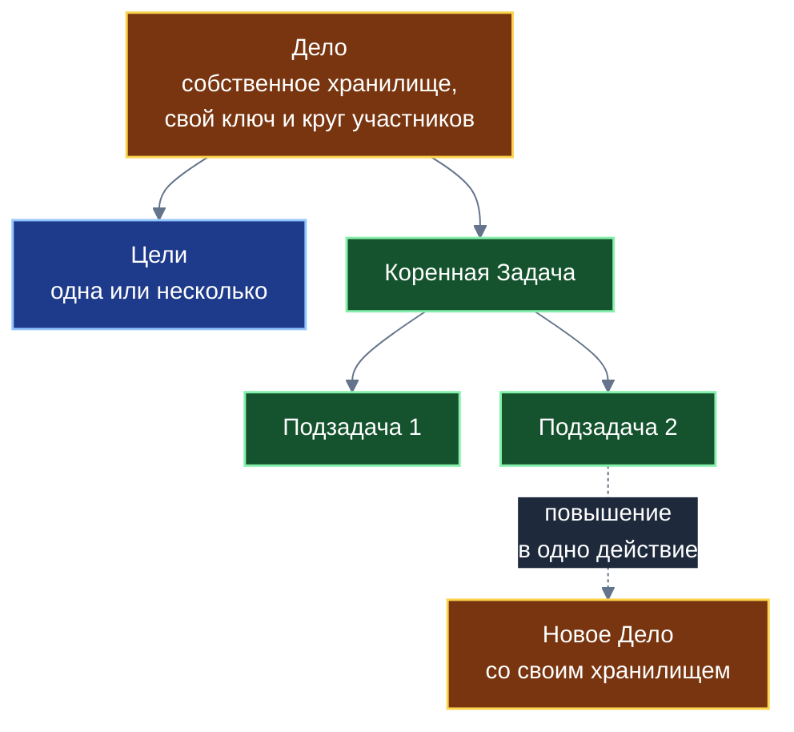

**Схема 2. Лист: сборка и возврат изменений (глава 3)**

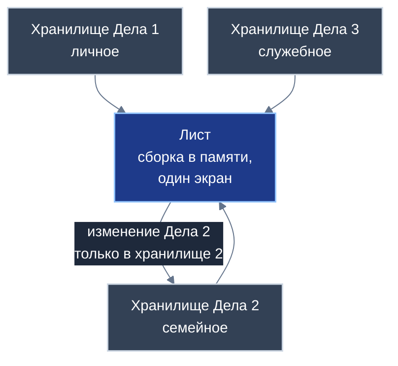

**Схема 3. Теги (глава 4)**

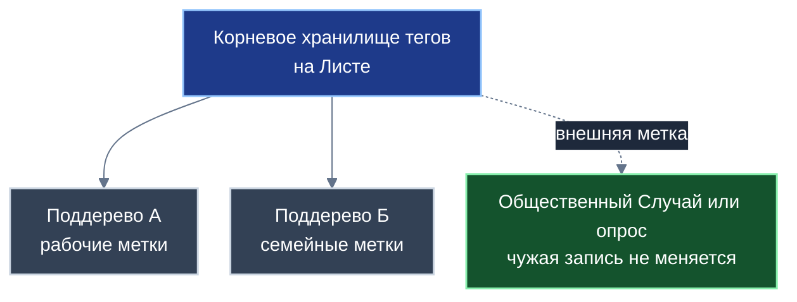

**Схема 4. Входящие поручения и мандат (глава 5)**


**Схема 5. Цикл трёх приложений (глава 6)**


**Схема 6. Взаимный аудит (глава 7)**

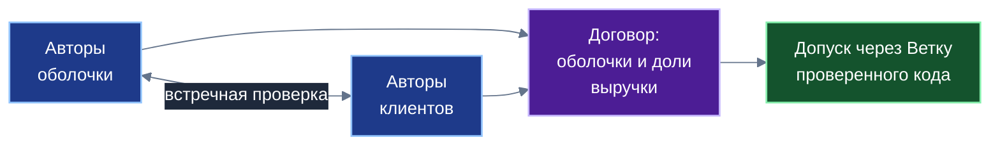

**Схема 7. Два уровня контракта (глава 8)**

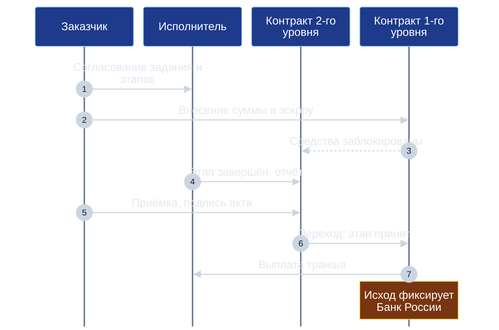

**Схема 8. Состояния контракта (глава 8)**

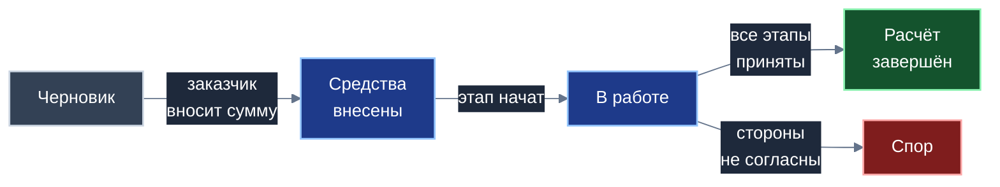

**Схема 9. Дело как связный узел двух рейтингов (глава 9)**

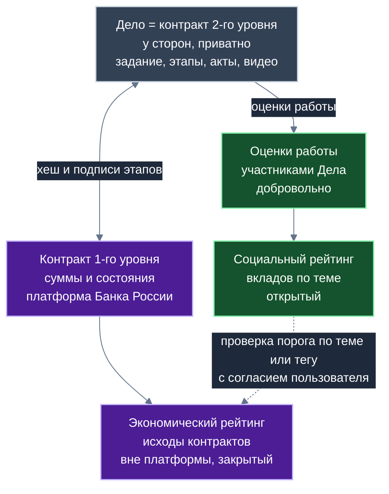

**Схема 10. Проверка с согласием (глава 10)**

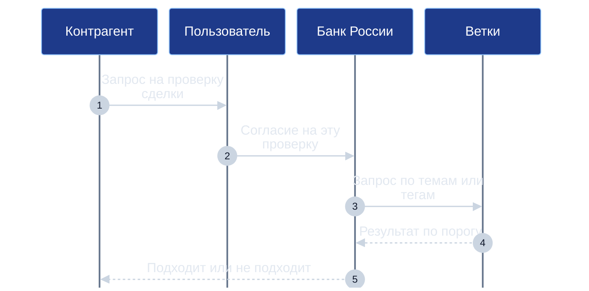

**Схема 11. Матрица срочности и важности (глава 11)**

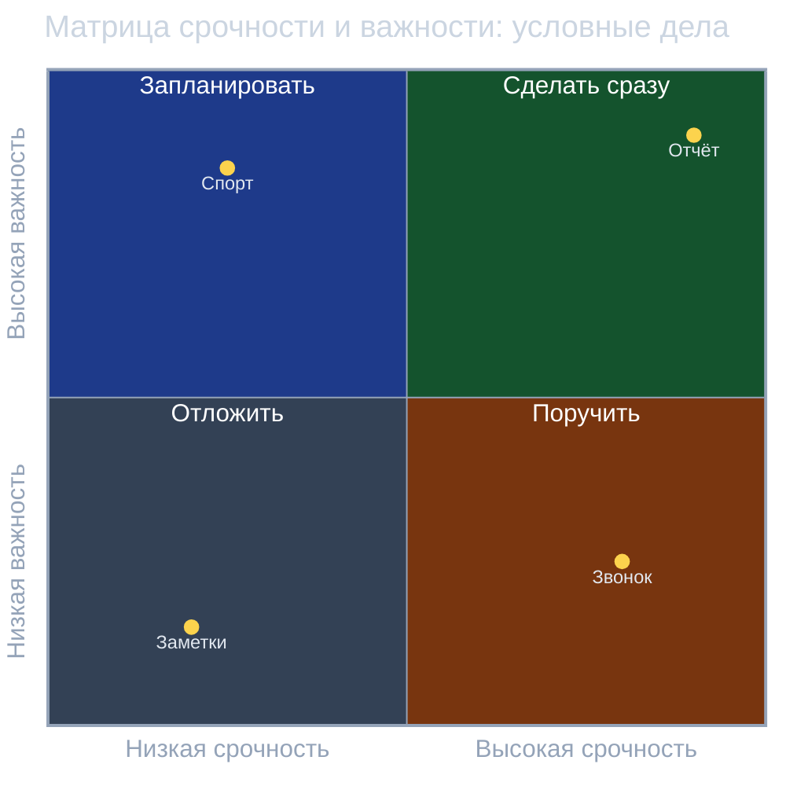

**Схема 12. Затухание приоритета в трёх режимах (глава 11)**

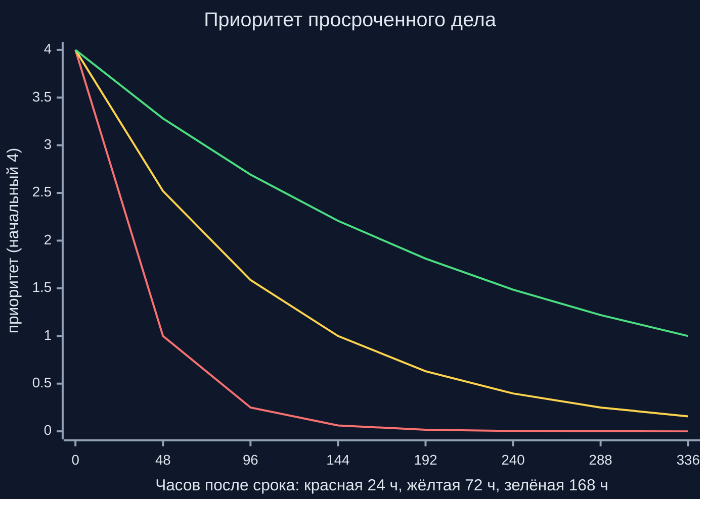

**Схема 13. Приложение и общие модули (глава 13)**

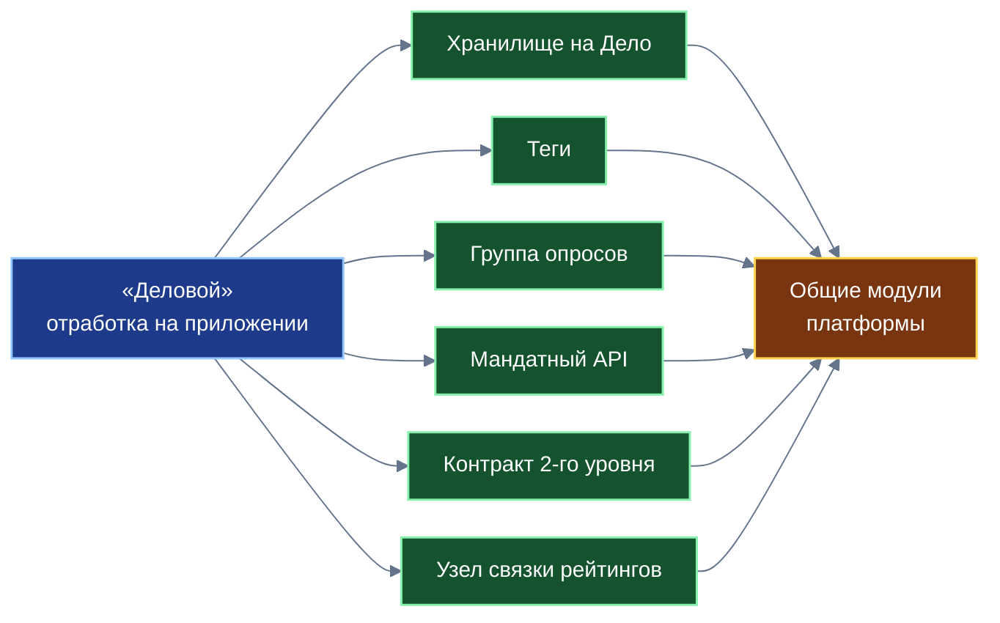

---

## 8. Таблицы для книги

### 8.1. Что ограничивает мандат (глава 5)

| Параметр | Смысл |
|---|---|
| Срок | Разрешение действует ограниченное время |
| Число задач | Не более заданного числа поручений |
| Предметная область | Только задачи, относящиеся к заданной теме (например, «доставка», «поверка приборов») |
| Согласование | Каждая входящая задача попадает во входящие; пользователь решает |
| Отзыв | Источник можно заблокировать навсегда |

### 8.2. Три уровня видимости тегов (глава 4)

| Уровень | Где хранится | Кто видит |
|---|---|---|
| Личные | Хранилище тегов на устройстве | Только владелец |
| Семейные | Хранилище тегов семьи | Члены семьи |
| Групповые и корпоративные | Хранилище тегов группы | Участники группы |
| Внешние метки на общественных записях | В хранилище тегов того, кто ставит метку | Только тот, кто поставил |

### 8.3. Три звена проверки кода (глава 7)

| Звено | Что проверяется | Кто |
|---|---|---|
| Статический анализ | Потоки данных и происхождение переменных | Платформенный загрузчик |
| Проверка ИИ | Скрытые каналы, побочные эффекты, лишние сетевые вызовы | Специализированные модели (вспомогательно) |
| Взаимный аудит | Код оболочки и код приложения-клиента | Разработчики обеих сторон (договор о долевом распределении выручки) |

### 8.4. Таблица «приложение → модуль» (глава 13)

| Что отработано на «Деловом» | Что станет общим модулем |
|---|---|
| Хранилище на каждое Дело; сборка на Листе | Модуль «много хранилищ — один экран» |
| Теги личные, семейные, групповые; ветвление | Платформенные теги; общественные теги — перспектива |
| Группа опросов к Делу или Задаче | Модуль группы опросов |
| Мандатный API поручений | Модуль безопасного приёма задач |
| Ссылка со снимком контекста | Модуль ссылок между приложениями |
| Проверка кода и допуск через Ветку; взаимный аудит | Модуль безопасной композиции |
| Контракт второго уровня | Модуль двухуровневых контрактов |
| Узел связки рейтингов | Модуль передачи тем контракта и проверки порогов |
| Затухание | Общий принцип затухания |

---

## 9. Что отсутствует в презентации и должно быть в книге; внешние источники

### 9.1. Что отсутствует в презентации

Контракты второго уровня и связка двух рейтингов; группы опросов; теги; соединительная сущность Дело — Случай; шаблоны Дел; мандатный API с ограничениями (частично есть); многоуровневая проверка кода; допуск через Ветку; экономическая ступень. Аудит — общий план, раздел 7.3.

Из презентации можно взять после проверки: идею Дела, объединяющего Цели и коренную Задачу; хранилище на каждое Дело; идею семейного круга; идею ссылок без дублирования.

### 9.2. Внешние источники (проверены поиском; документы целиком не читались)

- Gollwitzer, Sheeran (2006), мета-анализ 94 независимых проверок (8461 участник): эффект намерений реализации d = 0,65 (доверительный интервал 0,60–0,70), «средний-крупный». Gollwitzer, Brandstätter (1997): сложные цели выполнялись примерно втрое чаще (22% → 62% и 32% → 71%); для простых целей разница была мала и незначима (78% → 84%). Использовать так: «в лабораторных исследованиях конкретный план вида «если случится X, я сделаю Y» заметно повышал долю выполненных целей, особенно сложных». Числа можно давать со ссылкой на источники; «300%» и «в 9 случаях из 10» не использовать.
- Матрица Эйзенхауэра: 19 августа 1954 года Эйзенхауэр в Эванстоне процитировал безымянного бывшего президента университета: «срочное не важно, а важное никогда не срочно»; четырёхклеточная матрица оформлена позже, популяризована Стивеном Кови (1989). В книге: «матрица, известная под именем Эйзенхауэра».
- Налог на профессиональный доход: закон № 422-ФЗ, ст. 10: 4% с физических лиц, 6% с индивидуальных предпринимателей и организаций; редакцию сверять перед публикацией. Использовать только в одном предложении (проектное предложение).
- Концепция ПКСК Банка России (2026): см. план № 07, раздел 5.

---

## 10. Контрольный список перед сдачей

Общий контрольный список (общий план, раздел 11) плюс пункты плана, раздел 6. Кроме того:
- [ ] Врезка «Из предыдущих книг» содержит 6–8 понятий.
- [ ] Глава 9: определения; шесть шагов; таблица «кто что знает»; оговорка.
- [ ] Теги: три уровня; ветвление; внешние метки; роль в рейтингах; общественные теги только идеей.
- [ ] В главе 11 затухание показано таблицей из раздела 6.3 (исправленные значения плавного режима).
- [ ] Эффект «если — то» подан по внешним источникам, не «+300%».
- [ ] Просмотр в `viewer.html`.

---

## 11. Что осталось неизвестным

- Режим идентификации пользователей на платформе Банка России и порядок доступа рейтинговых структур: в открытых фрагментах концепции не раскрыт.
- Как именно Банк России получает и использует данные социальных рейтингов с Веток: описано автором на уровне идеи («сообщить Банку темы или теги»).
- Детали общественных тегов и артелей провайдеров тегов.
- Параметры проверки порога и меры против подбора.
- Юридическая квалификация рейтингов на основе исходов контрактов, приватных структур, налогового агентирования платформой.
- Состояние прототипов (`Hans_the_Organizator`): хранилища в этой среде нет; писать «отдельные механики реализованы в прототипах».
- Шкала срочности и приоритета: «0–4» в спецификации «Делового», «1–5» в презентации «Заботы»; диапазон не использовать.

Новые вопросы, возникающие при написании, исполнитель задаёт автору.
