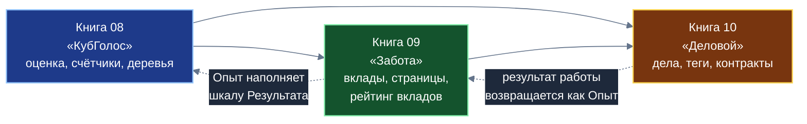

# ОБЩИЙ ПЛАН трёх Белых книг о системообразующих приложениях: «КубГолос» (№ 08), «Забота» (№ 09), «Деловой» (№ 10)

**Статус:** общий план, аудит и исправления выполнены; тексты книг пока не написаны. Решения автора, принятые в разговоре, зафиксированы в разделе 1; допущения составителя, требующие подтверждения, собраны в разделе 2 и в разделе 13. Нарушения правил в презентациях и спецификациях исправлены (раздел 7.5); схемы всех справочников проверены (раздел 6.4).
**Кто что делает:** общий план, планы книг и справочники подготовлены моделью Claude Sonnet 5.5 (автор называет её «Соната 5.5»). Детальную проработку текстов книг выполняет модель Gemini 3.8 Flash (так назвал её автор). Исполнитель пишет только книги. Правки в других документах репозитория, регистрацию книг в каталогах и коммиты выполняет автор плана.
**Состав комплекта документов:**

| Файл | Назначение |
|---|---|
| `ОБЩИЙ_ПЛАН_08-10_Белые_книги_прикладных_приложений.md` | Этот файл: распределение концепций между книгами, сквозные нити, аудит презентаций и спецификаций, общие правила |
| `ПЛАН_08_КубГолос.md` и `ИНФОРМАЦИЯ_К_ПЛАНУ_08_КубГолос.md` | План и справочник книги № 08 |
| `ПЛАН_09_Забота.md` и `ИНФОРМАЦИЯ_К_ПЛАНУ_09_Забота.md` | План и справочник книги № 09 |
| `ПЛАН_10_Деловой.md` и `ИНФОРМАЦИЯ_К_ПЛАНУ_10_Деловой.md` | План и справочник книги № 10 |

**Предполагаемые файлы книг:** `shared_docs/whitepapers/08_votecube_whitepaper.md`, `09_sapoto_whitepaper.md`, `10_gogetter_whitepaper.md`.
**Формат выпуска:** только Markdown. PDF не собираются, страничного бюджета и оглавления с номерами страниц нет (решение автора). Книги в цепочку сборки PDF (`shared_docs/package.json`) не включаются.
**Концептуальный автор платформы:** Артём Владимирович Шамсутдинов.

**Порядок чтения этих документов исполнителем:** сначала этот файл целиком (разделы 1–6, 10–12), затем план и справочник той книги, которую он пишет. Справочники написаны так, чтобы не требовать знания предыдущих обсуждений.

---

## 1. Решения автора (из постановки задачи)

| № | Решение |
|---|---|
| 1 | Книг три, по одной на каждое приложение: «КубГолос», «Забота», «Деловой». У каждой книги свой план |
| 2 | Каждую книгу можно читать отдельно от остальных. Понятия, нужные для понимания, поясняются в самой книге при первом упоминании |
| 3 | Книги строят базовые понятия друг на друге: «Забота» опирается на «КубГолос», «Деловой» опирается на «Заботу» и «КубГолос». Книга о «КубГолосе» ни на какие другие книги этого комплекта по содержанию не опирается |
| 4 | Каждая книга сосредоточена на вкладе именно своего приложения в платформу: какие базовые механизмы оно позволяет разработать и отладить. Это не пересказ возможностей приложения для пользователя |
| 5 | Понятие описывается в той книге, где оно по-настоящему строится и нужно больше всего, даже если в нынешних документах оно описано в другом месте. Образцы автора: технология страниц описана в «КубГолосе», но нужнее всего в «Заботе»; связка социального и экономического рейтингов описана в «Заботе», но строится в «Деловом» |
| 6 | В конечном счёте все основные конструкции будут переведены в базовые модули платформы. Каждая книга заканчивается разделом о том, что из её содержания станет базовым модулем (без дат и сроков) |
| 7 | Книги о приложениях выпускаются только в виде `.md`; прорабатывать PDF не нужно |
| 8 | Атрибуция в планах и книгах оформляется так же, как в плане № 07: планирование выполнила модель Claude Sonnet 5.5 («Соната 5.5»), детальную проработку выполняет модель Gemini 3.8 Flash. Названия моделей записываются «как есть» (решение автора, действует и для этих книг) |
| 9 | Планы и справочники должны содержать всю информацию, которая нужна более экономичной модели для написания книг без дополнительных обсуждений |
| 10 | Для аудита допускаются все источники: репозиторий и интернет. Если вопросов к автору нет, исполнитель их не придумывает; если вопросы появляются, он их задаёт |
| 11 | **Две рейтинговые системы работают так:** каждый голос микро-опроса рейтинга и других инструментов «Заботы» подписывает тот, кто его поставил, как изменение в соответствующем хранилище. Социальные рейтинги собираются и индексируются на Ветках. Экономические рейтинги находятся вне платформы «Турбаза» и вычисляются по статистике смарт-контрактов Банка России соответствующими структурами (ответ автора на аудит, находки З6 и связанные) |
| 12 | **Доля гражданина в распределении рекламной выручки — десятина: 10%** (`share(0,1; гражданин; 0,9; программный стек)`). Расхождение С1 снято: число 10% можно называть в книгах и использовать в примерах |
| 13 | **Нарушения правил репозитория нужно исправить и в источниках, и в планах.** Исправлены: презентации «КубГолос», «Забота», «Деловой» (слайды, дикторский текст, планы) и спецификации в `applications/` вместе с книгой № 02 (раздел 7.5) |
| 14 | **Три книги выпускаются только в `.md`, графики Mermaid должны быть очень хорошо проработаны и хорошо выглядеть.** В справочниках каждой книги лежат готовые проверенные схемы единого стиля (раздел 6.4)

---

## 2. Допущения составителя (подтвердить или поправить)

Составитель принял эти допущения, чтобы не останавливать работу. Каждое можно изменить, не переписывая комплект целиком.

| № | Допущение | Что изменится, если это не так |
|---|---|---|
| 1 | Нумерация книг продолжает комплект: № 08, № 09, № 10 (№ 07 занята книгой о рейтингах) | Только имена файлов и перекрёстные ссылки «Белая книга № N» |
| 2 | Формат: все три книги выпускаются только в `.md` (решение 14: автор подтвердил формат `.md` для трёх бумаг) | Для книги, которая всё-таки выйдет в PDF, надо будет добавить страничный бюджет и оглавление по образцу плана № 07 |
| 3 | Объём каждой книги: 45–60 тысяч знаков без пробелов (примерно 25–30 страниц при чтении с экрана). Объём по главам указан в планах | Масштабируются бюджеты глав |
| 4 | Ссылки вперёд допускаются только как одно предложение в блоке «Что передаётся следующей книге» (например, «КубГолос» говорит: «подробно о страницах — в следующей книге комплекта»). Ни одно понимание не должно зависеть от прочтения «следующей» книги | Можно убрать блоки вперёд, оставив только ссылки назад |
| 5 | Книга № 07 о двух рейтингах остаётся самостоятельной. Книги № 08–10 могут ссылаться на неё как на «дополнительное чтение о полной картине двух рейтингов» и на № 06 как на «дополнительное чтение о смарт-контрактах». Прочтение этих книг для понимания не требуется | Убрать ссылки |
| 6 | В книге № 09 используются формулы репутационной спецификации, подготовленной интеллектуальным агентом Antigravity (Google DeepMind) под руководством автора. Поэтому в атрибуцию книги № 09 включается строка об этом | Убрать строку, если автор решит иначе |
| 7 | Читатель, как в книге № 07: любой человек или организация, адресата нет; открытая публикация | Меняется тон обращения, не структура |
| 8 | Контактов и дат дорожной карты в книгах нет (как в № 07) | — |

---

## 3. Замысел комплекта

Три книги описывают три слоя платформенных механизмов. Приложения нужны платформе не только как программы для людей: на них отрабатываются конструкции, которые затем становятся общими модулями.

| Книга | Девиз слоя | Что приложение позволяет разработать и отладить |
|---|---|---|
| № 08 «КубГолос» | **Измерять и складывать** | Форму многофакторной оценки; счётчики и блоки эпох; сложение сумм вверх по дереву; дерево тем и поиск по нему; защиту от накруток; режимы регистрации; двухконтурность (общественный и частный контуры) |
| № 09 «Забота» | **Вкладывать и просматривать** | Страницы (деление связей «один ко многим»); треды и четыре вида реплик; составную конструкцию «Ситуация + Случай + Разговор»; свидетельство Опыта; социальный рейтинг вкладов по темам; защиту целостности рейтинга; право ответа и разбор до источника |
| № 10 «Деловой» | **Исполнять и связывать** | Хранилище на каждое Дело и сборку из многих хранилищ на Листе; теги; группы опросов; общественный API поручений с мандатами; безопасную композицию кода; контракты второго уровня; связку социального и экономического рейтингов |



Обратите внимание на асимметрию, заложенную в платформе: на уровне схем данных зависимость строго однонаправленная (схема «КубГолоса» не зависит от «Заботы», схема «Заботы» не зависит от «Делового»), а на уровне интерфейсов все три приложения разложены на независимые строительные блоки, которые могут встраиваться друг в друга. Поэтому «замыкание цикла» (Опыт возвращается в «КубГолос» через «Заботу») реализуется как обмен записями через открытые оболочки, а не как обратная зависимость схем. Книги должны объяснять это различие один раз (в № 09) и опираться на него в № 10.

---

## 4. Матрица владения концепциями

Колонки «08», «09», «10» показывают, как понятие раскрывается в каждой книге: **О** — основное изложение (владелец), **К** — краткое пояснение и использование (с отсылкой к владельцу), **П** — одно предложение-указатель вперёд, **—** — не упоминается.

| № | Понятие | Где описано сейчас | Где строится по-настоящему (владелец) | 08 | 09 | 10 |
|---|---|---|---|:-:|:-:|:-:|
| 1 | Многофакторная оценка (факторы, позиции, 100 базисных пунктов, две метрики) | «КубГолос» | «КубГолос» | **О** | К | К |
| 2 | Три шкалы консенсуса (Народ, Эксперты, Результат) и формула Байеса | «КубГолос» | «КубГолос» (форма), «Забота» (наполнение шкалы Результата), «Деловой» (подписанные акты как свидетельство) | **О** | К | К |
| 3 | Счётчики в оперативной памяти и блоки эпох | «КубГолос» | «КубГолос» | **О** | К | К |
| 4 | Сложение сумм вверх по дереву Веток | «КубГолос» (ответы опросов), «Забота» (рейтинг вкладов) | «КубГолос» (приём), «Забота» (применение к вкладам) | **О** | **О** (применение) | К |
| 5 | Дерево тем, двойная иерархия Веток, поиск по дереву, дедупликация на лету | «КубГолос» | «КубГолос» | **О** | К | К |
| 6 | **Страницы** (самозапечатывающиеся, около 1000 записей) | «КубГолос» (§8.2, 5.6), «Забота» (§4.3) | **«Забота»** (треды и списки случаев — главный потребитель) | П | **О** | К |
| 7 | Принцип «Пиши только своё» | «КубГолос», «Деловой», «Забота» | «КубГолос» (первое применение к голосам) | **О** | К | К |
| 8 | Режимы регистрации (полная анонимность, социальная анонимность, поимённая) | «КубГолос» (§6.5), «Забота» (§6.1) | Ввод режимов — «КубГолос»; правила переноса рейтинга между режимами — «Забота»; экономическая ступень (кошелёк Банка России) — «Деловой» | **О** | **О** (перенос рейтинга) | **О** (экономическая ступень) |
| 9 | Защита от накруток (ценз района, квоты, многошкальный фильтр) | «КубГолос» | «КубГолос»; расширение для рейтинга — «Забота» | **О** | **О** (штраф за кластеризацию, дисконт взаимных оценок) | К |
| 10 | Двухконтурность: общественный и частный (слепой ретранслятор) | «КубГолос» | «КубГолос»; для сообществ — «Забота»; для сделок и семьи — «Деловой» | **О** | **О** (герметичные отсеки) | **О** (невидящая Ветка) |
| 11 | Составная конструкция и антимонопольная композиция | Авторские заметки («Забота», «Деловой»), «Деловой» §4.1 | «Забота» (Случай = Ситуация + Случай + Разговор), затем «Деловой» (Дело = Цели + коренная Задача) | — | **О** | **О** (применение) |
| 12 | Четыре вида реплик, треды, Рецепт, Уточнённый контекст | «Забота» | «Забота» | — | **О** | К |
| 13 | Опыт «Голос» и «Показ» как внешнее свидетельство | «Забота» | «Забота» | — | **О** | К |
| 14 | **Социальный рейтинг вкладов** (формулы, затухание, два числа) | «Забота» (§5.3), книга № 07 | «Забота» (вклады и треды), в агрегации — «КубГолос» | К | **О** | К |
| 15 | Разрыв цикла «рейтинг взвешивает голоса»: четыре механизма | «Забота» (§5.3), «КубГолос» (§6.6) | (1) эпохи — «КубГолос»; (2–4) — «Забота»; внешние свидетельства (закрытое Дело, подписанный акт) — «Деловой» | О (1) | **О** (2–4) | **О** (свидетельства) |
| 16 | Право ответа, разбор до источника, оператор темы | «Забота» | «Забота» | — | **О** | К |
| 17 | Субъективная логика (мнение: вера, сомнение, неопределённость) как язык доверия | «Забота» | «Забота» | — | **О** (на понятийном уровне) | — |
| 18 | **Теги** (личные, семейные, групповые; поддеревья; внешние метки) | «Деловой» | **«Деловой»** (нужны «Заботе» для разбора рейтинга и «Деловому» для сообщения Банку тем контракта) | — | П | **О** |
| 19 | Группы опросов (к Делу и к Задаче) | «Деловой» | «Деловой» | К (опрос как переиспользуемая форма) | К | **О** |
| 20 | **Связка социального и экономического рейтингов** | «Забота» (§5.4), книга № 07 | **«Деловой»** (контракты второго уровня) | — | П | **О** |
| 21 | Контракт второго уровня и связь с контрактом первого уровня | «Деловой» (§9), книга № 06 | «Деловой» | — | — | **О** |
| 22 | Экономический рейтинг (ведёт Банк России), согласие, пороги, подбор порога | «Забота», «Деловой», книга № 07 | «Деловой» (как часть связки) | — | — | **О** (кратко; полная картина — № 07) |
| 23 | Общественный API поручений и мандаты (разрешения с ограничениями) | «Деловой» | «Деловой» | — | — | **О** |
| 24 | Ссылки на записи других хранилищ (трёхколоночный внешний ключ) и снимок контекста | «Деловой», основной документ платформы | «Деловой» | — | К | **О** |
| 25 | Хранилище на каждое Дело; сборка из многих хранилищ на Листе; нулевые утечки | «Деловой» | «Деловой» | — | — | **О** |
| 26 | Многоуровневая проверка кода, допуск через Ветку, открытый код, переиспользование оболочек | «Деловой» (§5.4–5.6) | «Деловой» | — | К (открытые схемы) | **О** |
| 27 | Экономика Веток и распределение выручки `share(...)` | «КубГолос», «Забота», «Деловой», № 06 | Арендаторы мощностей — «КубГолос»; цепочка авторов оболочек и взаимный аудит — «Деловой» | **О** | К | **О** |
| 28 | Затухание (полураспад) | «Забота» (свидетельства), «Деловой» (приоритет дел) | Общий принцип; в «Заботе» применяется к рейтингу, в «Деловом» — к личным приоритетам | — | **О** | **О** |
| 29 | Двухуровневая матрица срочности и важности | «КубГолос» (общественная оценка Ситуации и Идеи), «Деловой» (личная матрица 2.0) | Общественная шкала — «КубГолос»; личная — «Деловой» | **О** (общественная) | К | **О** (личная) |
| 30 | Автономность (работа без сети) и локальный консенсус | «КубГолос» (§7.4), «Деловой» (§7) | «КубГолос» (сход жителей), «Деловой» (семья) | **О** | К | **О** |
| 31 | Юридическая фиксация (подписанный блок эпохи) | «КубГолос» (§7.2) | «КубГолос» | **О** | — | К (подписанные акты) |
| 32 | Открытые схемы как общий стандарт; кросс-приложенческое использование | «Забота» (презентация, §5.5) | «Забота» | — | **О** | К |
| 33 | Перевод конструкций в базовые модули платформы | Спецификации (§5.6 «КубГолоса», §15 репутационной) | Каждая книга в своём разделе-заключении | **О** | **О** | **О** |

**Правило пользования таблицей.** Если понятие помечено **О** в книге, исполнитель этой книги обязан раскрыть его полностью. Если **К**, то нужно один-два абзаца: что это, зачем оно здесь, где подробно («Белая книга № N»). Нельзя раскрывать понятие полностью там, где оно помечено **К** или **П**: это дублирует книги и нарушает принцип «каждая книга о своём вкладе».

---

## 5. Сквозные нити комплекта

Нити нужны, чтобы три книги читались как последовательность, а не как три отдельных описания. Каждая нить проходит по всем книгам и в каждой имеет своё ударение.

| Нить | В № 08 | В № 09 | В № 10 |
|---|---|---|---|
| **Оценка** | Форма: многофакторная оценка идеи в ситуации | Объект: вклад (реплика, Идея, Опыт, Вопрос) и его оценка в треде | Результат: оценка работы участниками Дела, добровольная, по темам |
| **Сложение вверх** | Суммы по Веткам и Ветвям; эпохи как точки фиксации | Суммы положительных и отрицательных масс вклада по теме; показатель темы и масса свидетельств | Срез по нескольким темам через теги; темы контракта сообщаются Банку России |
| **Пиши только своё** | Голос — собственная запись голосующего | Оценка, реплика, Опыт — собственные записи; чужое не меняется | Теги на чужих записях хранятся в своём хранилище; каждое Дело — своё хранилище |
| **Частное и общественное** | Слепой ретранслятор: частные опросы считаются на Листах | Герметичные отсеки сообществ; страницы только для общественных хранилищ | Невидящая Ветка; контракт второго уровня остаётся у сторон |
| **Свидетельство и затухание** | Результат как слот для внешнего свидетельства | Опыт «Голос» и «Показ»; затухание давних свидетельств | Подписанный акт, закрытое Дело; затухание приоритета |
| **Анонимность и доверие** | Три режима регистрации и защита от накруток | Перенос рейтинга между режимами; предупреждение перед поимённой регистрацией | Экономическая ступень: кошелёк Банка России, один на человека |
| **От композиции к базовым модулям** | Счётчики, блок эпохи, дерево тем, форма оценки | Страницы, составная конструкция, свидетельство, ядро агрегации рейтинга | Хранилище на дело, теги, группа опросов, мандатный API, контракт второго уровня |

---

## 6. Единая структура книги и правила перекрёстных ссылок

### 6.1. Каркас каждой книги

1. Аннотация и атрибуция (по шаблону из справочника книги).
2. Задача и место в комплекте: что приложение даёт платформе; таблица «блок — для чего платформе».
3. Основные главы по вкладам (по плану книги).
4. Практические примеры (из руководств по социально-экономическому влиянию; в книге № 10 дополнительно пример из руководства по «Деловому»).
5. Что станет базовым модулем платформы (без дат).
6. Границы роли приложения и открытые вопросы.
7. Заключение и связь с комплектом.

### 6.2. Правила ссылок между книгами

1. Ссылка оформляется так: «подробно — в Белой книге № 08 «КубГолос»». Только номер и название; путей к файлам в тексте книг нет.
2. Перед ссылкой понятие поясняется одним-двумя предложениями, чтобы читатель, не читавший другую книгу, понимал, о чём идёт речь.
3. Ссылки назад (от «Заботы» к «КубГолосу», от «Делового» к обеим) допускаются свободно. Ссылки вперёд (от «КубГолоса» к «Заботе») допускаются только как одно предложение в блоке «Что передаётся следующей книге».
4. Каждая книга содержит короткую врезку «Из предыдущих книг комплекта» (в № 09 — про «КубГолос», в № 10 — про «КубГолос» и «Заботу»), где перечислены 4–6 используемых понятий с одной строкой пояснения.
5. Одно и то же понятие во всех книгах называется одинаково (см. терминологический словарь, раздел 10.3).
6. Ссылки на книги № 06 (смарт-контракты), № 07 (два рейтинга), № 03 (инженерная архитектура), № 02 (прикладной стек) допускаются как «дополнительное чтение».

### 6.3. Единое оформление Markdown (без PDF)

1. Заголовок первого уровня `#` — название книги. Далее строки: «Белая книга № N», версия, статус (проектная концепция), классификация, автор, методология подготовки.
2. Главы: `## N. Название`. Подразделы: `### Название`.
3. Один абзац — одна строка файла (так проще проверять и безопаснее отображать).
4. Таблицы Markdown; в ячейках не использовать знак `---` и вертикальную черту.
5. Формулы: `$...$` и `$$...$$` (KaTeX). Не использовать знак доллара для других целей.
6. Схемы: блоки ` ```mermaid `, каждая не шире примерно 680 пикселей и не более 12 узлов. Не более одной схемы на главу, если в главе нет таблицы; тогда схема, таблица и текст должны читаться без прокрутки вправо.
7. Блоки кода без языка и с языком, кроме Mermaid, не использовать. Никакого кода, DDL, классов, JSON.
8. Проверить отображение в `viewer.html` (в нём подключены marked, KaTeX и Mermaid): открыть файл через `start_presentation.sh` и просмотреть каждую главу.

---

### 6.4. Схемы Mermaid в справочниках и проверка

В справочник каждой книги (раздел 7) включены готовые схемы единого стиля: 13 схем для книги № 08, 11 для № 09, 13 для № 10. Это блоки Mermaid разных видов: потоки, деревья, диаграммы последовательности, столбцы и линии для формул, четыре квадранта для матрицы. Палитра единая: синий — Лист, зелёный — Ветка, янтарный — Ствол, фиолетовый — Банк России и договоры, серый — частные хранилища, красный — риск. Схемы на тёмной подложке читаются и в светлой, и в тёмной теме просмотра.

Проверка выполняется скриптом `scripts/check_markdown_mermaid.js`: он открывает документ в самом `viewer.html` (через локальный сервер), в обеих темах, и для каждой схемы проверяет, что она отрисована без ошибок, что шрифт не меньше 11 пикселей при ширине колонки статьи 760 пикселей и что высота не больше 760 пикселей.

```
node scripts/check_markdown_mermaid.js shared_docs/whitepapers/08_votecube_whitepaper.md --viewer
node scripts/check_markdown_mermaid.js shared_docs/whitepapers/09_sapoto_whitepaper.md --viewer
node scripts/check_markdown_mermaid.js shared_docs/whitepapers/10_gogetter_whitepaper.md --viewer
```

С ключом `--out каталог --shots` рядом сохраняются снимки каждой схемы в обеих темах, их нужно просмотреть глазами. Требование к сдаче каждой книги: «замечаний: 0».

Результат на момент подготовки: проверено 74 отрисовки (37 схем, 2 темы), замечаний 0. Для проверки нужны сеть (скрипт загружает Mermaid и шрифты, как `viewer.html`) и установленный Playwright с браузером Chromium.

**Что исправлено в `viewer.html` при проверке** (всё это нужно знать автору, потому что правки в репозитории остались):
- служебные метки, которыми просмотр заменял блоки схем и формул до разбора Markdown, начинались и заканчивались двойным подчёркиванием, и разбор превращал их в полужирный курсив; из-за этого в документах со схемами не отрисовывалась ни одна схема. Метки заменены на безопасные (`TURBASEMERMAIDSLOT…END`);
- схемы, начинающиеся с настройки `%%{init:`, помещаются на тёмную подложку в обеих темах (класс `mermaid-styled`).

**Особенность подписей.** Шрифт Inter подгружается просмотром с опозданием, а Mermaid измеряет подписи до загрузки и затем обрезает последние буквы. Поэтому в настройку каждой схемы включён шрифт Arial для подписей внутри узлов. Менять эту настройку не нужно.

## 7. Аудит презентаций «КубГолос», «Забота», «Деловой»

Аудит выполнен по `presentation_outline.md` и `presentation_deck.md` (включая дикторский текст) каждой из трёх презентаций и сопоставлен со спецификациями (`applications/*`), авторскими заметками, книгами № 02, 03, 06, 07. На момент составления таблиц файлы презентаций и спецификаций не изменялись. По решению автора (решение 13) нарушения затем исправлены (раздел 7.5). Таблицы ниже сохраняют историю находок; актуальное состояние — в разделе 7.5. Исполнитель книг материал презентаций как источник фактов **использует** только после сверки с этим разделом.

Обозначения важности: **В** — высокая (противоречит спецификации или правилам репозитория), **С** — средняя (расхождение или неточность), **Н** — низкая (пробел или стиль).

### 7.1. «КубГолос» (`01_kubgolos_app_presentation`)

| № | Находка | Где | Важность | Что делать в книге № 08 |
|---|---|---|:-:|---|
| К1 | «0% ботов», «абсолютный иммунитет к фальсификациям», «эмулировать миллион устройств технически невозможно». Спецификация описывает многоуровневую защиту (ценз района с доказательством без разглашения, квоты и ограничение частоты, многошкальный фильтр), а не полную неуязвимость. Научная работа Дусера (2002) показывает, что без логически централизованного удостоверения атака Сивиллы возможна всегда, кроме нереалистичных условий равенства ресурсов | Слайды 1, 8, 14; KPI | **В** | Писать «многоуровневая защита, снижающая выгоду накрутки»; остаточные риски назвать. Не использовать «0%», «исключено», «невозможно» |
| К2 | «Один человек — одно устройство — один голос» и «ключ Листа на защищённом чипе смартфона». В спецификации ключ идентифицирует приложение и устройство, а не человека; анонимность обеспечивается регистрацией на Ветке. Упоминание «защищённого чипа» в спецификациях КубГолоса не найдено | Слайд 8 | **В** | Объяснить, что подпись защищает от подмены записей, а право голоса удостоверяет регистрация на Ветке |
| К3 | «Стопроцентная анонимность каждого участника» и «Ветка суммирует криптографические подписи». В общественном контуре дельты голосов видны Ветке в объёме выбранного режима регистрации; Ветка суммирует векторы факторов. Анонимность зависит от режима | Слайды 10, 12 | **В** | Описать три режима и что видит Ветка в каждом |
| К4 | «Привязка к Землячеству», «очные поручительства сети «Забота»». Термин «Землячество» в спецификациях не определён; право голоса в спецификации подтверждается регистрацией на районной Ветке (ценз района, групповая анонимность через соседей и жеребьёвку). Схема «КубГолоса» не зависит от «Заботы» | Слайд 9 | **В** | Не использовать «Землячество» без пояснения; объяснять через районную Ветку и групповую регистрацию |
| К5 | «Итоги голосований автоматически создают задачи в «Деловом» и формируют тропы в «УраТуре»». В спецификации задачу создаёт человек кнопкой «Взять как задачу» в «Заботе»; «КубГолос» от «Делового» не зависит | Слайд 15 | **С** | В № 08 не обещать автоматических задач; сказать, что результат опроса — вход для решения, которое принимает человек |
| К6 | «3 секунды на миллионный город» и «128-байтные векторы (Federated OLAP)»: цифры взяты из книги № 03 и руководства; замеров в репозитории нет. Блок эпохи по спецификации около 150 байт, пакет голоса 19–25 байт | Слайды 12, 14 | **С** | Приводить как проектные значения, с пометкой «целевой показатель»; не использовать «3 секунды» как факт |
| К7 | «До 60% голосов в соцсетях создаются ботами» и «государство и бизнес экономят до 90% бюджетов на исследованиях»: источников нет (цифра 60% в книге № 04 относится к кликфроду для рекламодателей, а не к голосованиям) | Слайды 2, 14; дикторский текст | **С** | Не переносить |
| К8 | Заголовок слайда 2 «ТУПИК ТРАДИЦИОННЫХ ОПРОСОВ И АНКЕТ», «манипулятивна», «порок»; нарушает правило 14 (не называть чужие подходы «тупиком», не приписывать манипуляцию целой отрасли) | Слайд 2; outline | **В** | Описывать особенности и ограничения опросов нейтрально; отдать должное социологам |
| К9 | Англицизмы в заголовках и тексте («Federated OLAP», «Lego-опросы», «Forking», «Leaf») | Слайды 6, 7, 12 | **Н** | В книге: «федеративная аналитика (Federated OLAP)» один раз в скобках; «ветвление версий»; «Лист» |
| К10 | Номер в тексте диктора: «Во второй презентации прикладной серии…» (диктор), а по мастер-плану это первая. Слайд 15: «До встречи в третьей части» | Слайды 1, 15 | **С** | В книгах не используется |
| К11 | В презентации нет: счётчиков и блоков эпох, трёх шкал консенсуса, двух метрик (значимость и позиция), контекста Ситуации и Идеи, переголосования, семейного контура со слепым ретранслятором, юридической фиксации подписанным блоком, дедупликации, режимов регистрации, роли в рейтингах | Вся презентация | **Н** | Это и есть содержание книги № 08 |

### 7.2. «Забота» (`02_zabota_app_presentation`)

| № | Находка | Где | Важность | Что делать в книге № 09 |
|---|---|---|:-:|---|
| З1 | Слайды 4, 6, 11 показывают программные имена (`Situation`, `SituationThread`, `Reply`, `UserRating`, `SituationRating`, `Theme`, `Topic`, `app-media-recorder`). Правило 13 запрещает код и классы в представительских материалах. Кроме того, сущности `Theme`, `SubTheme`, `SubTopic` в спецификации упразднены; единица темы теперь `Topic` | Слайды 4, 6, 11 | **В** | Только понятийные названия: Ситуация, Случай, Разговор, реплика, тема |
| З2 | Шкала срочности и важности «1..5» в презентации, «1–5» в части спецификации «Заботы» и «0..4» (пятибалльная) в спецификации «Делового» | Слайд 5 | **С** | Не приводить числовой диапазон; сказать «пятибалльная шкала» |
| З3 | «Радиус 50 метров» и «доставка соседям за 2 миллисекунды». В спецификациях такого механизма нет (есть районная Ветка и подтверждение района); радиус отсутствует | Слайд 5; дикторский текст | **В** | Не переносить |
| З4 | Уточняющие вопросы описаны как «5W1H/7W1H». В спецификации «Заботы» — восемь вопросительных маркеров (Что, Какой, Кто, Где, Почему, Когда, Как, Чей). 5W1H относится к «Деловому» | Outline, слайд 6 | **С** | Использовать восемь маркеров |
| З5 | Слайд 7: «веса [2,5; 1,0; 0,5] для трёх доводов» и «затухающие коэффициенты». В спецификациях такой формулы нет (в «КубГолосе» 100 базисных пунктов делятся между осями; в части «Заботы» упомянуты оценки согласия от 1 до 5) | Слайд 7 | **С** | Не переносить |
| З6 | Слайд 12: «хранение на устройстве гражданина. Репутационный след принадлежит самому человеку и подписывается его локальным ключом» и «отзыв фиксируется только после обоюдного закрытия ситуации». По модели двух рейтингов социальный рейтинг открытый, оценки ставят все участники треда, а первичные записи лежат в хранилищах, где вклад сделан; агрегаты по теме лежат на Ветках. Книга № 07 (справочник, раздел 14) уже отмечала остаточные формулировки о локальном скоринге и хранении репутации на устройстве | Слайд 12 | **В** | Следовать модели из спецификации §5.3 |
| З7 | Слайд 14: «грабительские комиссии», «агрегаторы забирают до 30%»; слайд 3: «комиссия в двадцать процентов»; слайд 15: «не слежке и рекламе», «0% слежки». Источников для цифр нет; формулировки противоречат правилу 14 | Слайды 3, 14, 15 | **В** | Не переносить |
| З8 | «100% реальные люди, ноль фейков», «0% спама» | Слайды 1, 9 | **С** | Как в К1: многоуровневая защита |
| З9 | Слайд 14 («каталог мастеров», «оплата через смарт-контракт в Цифровых рублях») относится к «Локальному реестру МСП и ЖКХ» и экономике «Делового», а не к вкладу «Заботы» в платформу | Слайд 14 | **Н** | Не включать в книгу № 09 |
| З10 | Слайд 8: «аудио и видео сжимаются на телефоне и передаются соседям по локальной сети подъезда». В спецификации: файлы хранятся в блоб-хранилище Веток; распознавание речи локально; прямая передача по локальной сети — режим работы без внешней связи | Слайд 8 | **Н** | Описывать по спецификации |
| З11 | Номер в тексте диктора: «В третьей презентации…» при нумерации «02» | Слайд 1 | **С** | Не используется |
| З12 | В презентации нет: страниц, составной конструкции, связи Опыта и Идеи с шкалой Результата, социального рейтинга как агрегата по дереву, права ответа, оператора темы, разбора до источника, режимов регистрации и переноса рейтинга | Вся презентация | **Н** | Это содержание книги № 09 |

### 7.3. «Деловой» (`03_delovoy_app_presentation`)

| № | Находка | Где | Важность | Что делать в книге № 10 |
|---|---|---|:-:|---|
| Д1 | Заголовок слайда 2 «ТУПИК ТРАДИЦИОННЫХ ТАСК-МЕНЕДЖЕРОВ», «инструмент слежки», «коммерческая слежка», «корпорации знают, когда вы просыпаетесь», «санкционные блокировки». Правило 14: не называть подходы «тупиком», не приписывать организациям слежку | Слайд 2; outline | **В** | Описывать ограничения облачных планировщиков нейтрально (зависимость от связи, хранение данных на чужих серверах) |
| Д2 | «+40% выполненных дел» (слайд 14); «850 мс против 0,8 мс» (слайд 10); «до полутора секунд» (дикторский текст); «десятки тысяч рублей экономии». В спецификациях и в репозитории замеров нет. В спецификации: отклик менее 1 мс, слияние менее 0,1 мс как проектная цель; экономия на лицензиях «30 000–120 000 рублей в год» как оценка | Слайды 10, 14 | **В** | Не переносить цифры эффективности; быстродействие давать как проектную цель без сравнения с конкретными продуктами |
| Д3 | «0 байт в облаке» (слайды 1, 14). Резервная копия семейных дел хранится на районной Ветке в зашифрованном виде, а общественные Дела видны Ветке | Слайды 1, 13, 14 | **С** | Формулировать: «содержимое частных хранилищ на Ветках не читается» |
| Д4 | Слайд 11 «Голосовой ввод и ИИ на устройстве»: «анализирует ритм дня, подсказывает время для звонков, группирует дела по местам». В спецификации «Делового» голосового ввода и ИИ нет (локальное распознавание речи описано в «Заботе»; малая языковая модель на устройстве — в «КубГолосе» для дедупликации) | Слайд 11 | **В** | Не включать как возможность приложения; при желании упомянуть как перспективу с пометкой «в спецификации не описано» |
| Д5 | Слайд 15: «Задачи и чек-листы станут основой сборов в «УраТуре» и поручений в сети «Забота»» и «приложение с прямым владением данными превосходит зарубежные облачные сервисы». Сравнительные оценки противоречат правилу 14 («лучший», «превосходит») | Слайд 15 | **С** | Не переносить |
| Д6 | Номер в тексте диктора: «Первое приложение серии… До встречи во второй части (КубГолос)». По нынешнему порядку (01 «КубГолос», 02 «Забота», 03 «Деловой») презентация третья | Слайды 1, 15 | **С** | Не используется |
| Д7 | В презентации нет самого важного для платформы: контрактов второго уровня и связки двух рейтингов, групп опросов, тегов, соединительной сущности с Случаем «Заботы», мандатного API с ограничениями (есть частично на слайде 9), многоуровневой проверки кода, допуска через Ветку | Вся презентация | **Н** | Это содержание книги № 10 |
| Д8 | Угасание приоритета: на слайде 3 не названы режимы (24 часа, 72 часа по умолчанию, 168 часов, без угасания) | Слайд 3 | **Н** | Использовать значения из справочника |

### 7.4. Общие находки по трём презентациям

| № | Находка | Важность |
|---|---|:-:|
| О1 | Порядок серии: мастер-план и каталог «01 КубГолос, 02 Забота, 03 Деловой» (так и в данном комплекте книг), но дикторский текст написан для порядка «Деловой — КубГолос — Забота» (на слайдах 1 и 15 нарушена нумерация и анонсы). Это не влияет на книги, но влияет на видео | **С** |
| О2 | Во всех трёх презентациях не показан вклад приложения в платформу (счётчики, страницы, теги, контракты второго уровня): в слайдах приложение подано как продукт. Книги № 08–10 восполняют этот пробел | **Н** |
| О3 | Англицизмы в заголовках («Federated OLAP», «Gravity Balls», «Serendipity Task», «Lego-опросы», «Forking», «Before/After», «On-Device Edge AI», «CRM»). Правило 15 разрешает названия и общепринятые термины без аналога, но требует русского пояснения при первом упоминании | **Н** |
| О4 | Количественные показатели в презентациях подаются как факты. Для белых книг требуется источник или пометка «проектное значение» | **С** |

---

### 7.5. Исправления по результатам аудита (решение автора 13)

Решение автора: нарушения всех правил нужно исправить и в источниках, и в планах. Выполнено.

| Область | Что исправлено |
|---|---|
| Презентация «КубГолос» (слайды и дикторский текст) | Убраны «тупик», «порок», «заказные опросы», «бот-фермы до 60%», «0% ботов», «абсолютный иммунитет», «технически невозможно», «Землячество», «чип смартфона», «3 секунды» и «-90% расходов» как факты. Показатели переведены в проектные цели; «ботов нет» заменено на описание трёх уровней защиты. Убраны названия «Federated OLAP», «Forking», «Lego» в заголовках; номера «второй», «третьей» презентации |
| Презентация «Забота» | Убраны программные имена сущностей, «Assent», веса «[2,5; 1,0; 0,5]», «5W1H» для вопросов, «радиус 50 метров», «2 мс», «до 30% комиссий агрегаторов», «грабительские комиссии», «0% слежки», «100% реальные люди», цифры «15 000 рублей в месяц» и «в 4,5 раза». Слайд 12 приведён к модели двух рейтингов: оценку подписывает тот, кто её ставит; тематические Ветки собирают и индексируют общественные оценки; экономический рейтинг ведётся вне платформы по статистике смарт-контрактов Банка России. Слайд 7 переписан на оценку Идеи по нескольким причинам в «КубГолосе» |
| Презентация «Деловой» | Убраны «тупик», «слежка», «порок», «санкционные блокировки», «+40% выполненных дел», «850 мс», «0 байт в облаке», «9 из 10», «превосходит облачные сервисы», «экономия до 30% маржинальности». Слайд 11 (голосовой ввод и ИИ, которых нет в спецификации) заменён слайдом о тегах. Слайд 15 приведён к цепочке «КубГолос → Забота → Деловой → Опыт» |
| Планы презентаций (`presentation_outline.md`) | Приведены в соответствие со слайдами. Число слайдов в каждой презентации по-прежнему 15 |
| Спецификации `applications/` | Убраны «слежка», «тупик», «BigTech», «грабительские комиссии», «железобетонная гарантия», «беспрецедентный аудит», «в 9 случаях из 10», «на 300%», «100% защита», «полный иммунитет к регуляторным рискам», «ликвидация» как цель. «Если — то»: вместо «+300%» приведены данные Gollwitzer и Brandstätter (1997) и Gollwitzer и Sheeran (2006). Доля гражданина: десятина, 10% (решение 12) |
| Книга № 02 | Куб с тремя жёсткими факторами «от 0 до 10» заменён описанием многофакторной оценки; «0% бот-трафика» и «0% комиссии» заменены; ASCII-схемы приведены в порядок |
| Корневые документы | Не менялись (правит автор плана при регистрации книг) |

**Что осталось и требует решения автора:**
1. Дикторский текст трёх презентаций изменился, поэтому аудио (`generated/artifacts/audio/`) и собранные веб-колоды нужно перегенерировать командами `regen-*` (нужен ключ синтеза речи). Я их не запускал.
2. В этих презентациях остаются слова вроде «Federated OLAP» и «SQLite» в заголовках и на плашках: это названия технологий, правило их допускает с пояснением; пояснение при желании добавить при следующей правке.
3. В презентации «Деловой» новый слайд 11 «Теги» описывает возможности, которых раньше в презентации не было; визуальные компоненты слайда (иконки, карточки) собраны из существующих стилей и не проверялись в браузере на переполнение (инвариант «ноль переполнения» из корневого `AGENTS.md`). Его нужно проверить при пересборке.
4. Презентации других серий (`platform_overview`, `detailed_overall_impact_presentations`, `overall_presentations`, `architecture_presentations`) в этой задаче не правились, хотя в них есть те же слова («слежка», «ZK-скоринг на устройстве», «60% кликфрода», «грабительские комиссии»). Это отдельная работа.

---

## 8. Аудит спецификаций и книг: расхождения, которые надо учесть при написании

Это расхождения между самими документами репозитория. Исполнитель не исправляет документы; он выбирает значение по столбцу «Что принять в книгах».

| № | Расхождение | Где | Что принять в книгах |
|---|---|---|---|
| С1 | **Снято (решение 12).** Доля гражданина — десятина, 10%. Прежние документы называли «до 10%» (спецификация «КубГолоса» §8.5, книга № 06) и «до 50–70%» (README «КубГолоса» §9.2); значения в `applications/` приведены к 10% | `VoteCube_architecture…` §8.5; `votecube/README.md` §9.2; `06_…` | Называть 10% («десятина»), со ссылкой на № 06 как на дополнительное чтение |
| С2 | Размер пакета голоса: «от 40 до 136 байт (оригинальный максимум 56)» в авторской заметке и «19–25 байт» в спецификации §5.5 (после оптимизации битовой маской) | Заметка `09-19_01`; спецификация §5.5 | «Около 20 байт после оптимизации» как проектное значение |
| С3 | «Затухание» свидетельств: 6 месяцев для быта и 24 месяца для кредитных обязательств (спецификация репутации §2.1) — а период для темы задаёт оператор темы | `Sapoto_Reputation…` §2.1, §5.2; `Sapoto_architecture…` §5.3 | Значение 6 месяцев — начальное для бытовых тем; период задаёт оператор темы |
| С4 | Холодный старт: схема говорит «снижает неопределённость на 20% каждые 3 дела», текст — «с 1,0 до 0,60» | `Sapoto_Reputation…` §14, схема и §14.1 | Числа не использовать; описать идею словами |
| С5 | Пул для «Случайного шага»: Q2 (книга № 02, презентация) и Q1 ∪ Q2 с весами $(P+1)^2(U+1)$ (спецификация «Делового» §3.5) | `02_…` гл. 2; `GoGetter_architecture…` §3.5 | Принять спецификацию |
| С6 | Куб «КубГолоса» в книге № 02 показан с тремя жёстко заданными факторами «Важность проблемы, Реалистичность решения, Готовность участвовать» от 0 до 10. В спецификации факторы задаются создателем вопроса, позиция каждого от −100% до +100%, всего 100 базисных пунктов | `02_…` гл. 3; `VoteCube_architecture…` §3, §6 | Принять спецификацию |
| С7 | Подтверждение места жительства: через районную Ветку и жеребьёвку (спецификации), через очное поручительство и «шлюз ЕСИА» (книга № 02, руководство по влиянию «КубГолоса»). Спецификации указывают, что Ветка работает без персональных данных; шлюз ЕСИА — внешний адаптер | `02_…` гл. 3, 7; `VoteCube_Ecosystem_Impact_Guide.md` §6 | Описывать районную Ветку и групповую регистрацию; ЕСИА — как возможный внешний шлюз, без подробностей |
| С8 | «В 3 раза/на 300% повышает вероятность старта задачи» («Если — То»): в спецификации «Делового» §2.1.3. По проверенным источникам (Gollwitzer, Brandstätter, 1997) сложные цели выполнялись примерно втрое чаще (22% → 62%; 32% → 71%); общий эффект по 94 исследованиям d = 0,65 (Gollwitzer, Sheeran, 2006). Выражение «на 300%» неточно | `GoGetter_architecture…` §2.1.3 | См. справочник № 10, раздел 9 |
| С9 | «В 9 случаях из 10 начатая работа доводится до результата»: в спецификации «Делового», источника нет | `GoGetter_architecture…` §2.6 | Не использовать |
| С10 | Матрица Эйзенхауэра: в документах она подана как изобретение Эйзенхауэра. В 1954 году он процитировал мысль безымянного бывшего президента университета; четырёхклеточная схема сложилась позже (Кови, 1989) | Все три приложения | В книге № 10: «матрица, известная под именем Эйзенхауэра» |
| С11 | Налоговое агентирование платформой (удержание налога на профессиональный доход 4% и 6% «через `share(...)`»): ставки верны (4% с физлиц, 6% с юрлиц и ИП, ст. 10 закона № 422-ФЗ); но то, что платформа удерживает и перечисляет налог, — проектное предложение, требующее отдельного правового решения | `GoGetter_Ecosystem_Impact_Guide.md` §4.3, §6.4 | Подавать как проектное предложение |
| С12 | Приоритет схем: «Деловой» зависит от «Заботы» и «КубГолоса» (схемы), но «Забота» использует оболочку задач «Делового» на уровне интерфейса. Это не противоречие, а асимметрия слоёв данных и интерфейсов (спецификация «КубГолоса» §2.4) | Авторские заметки; спецификации | Объяснить в № 09 и № 10 |
| С13 | Числовые примеры из руководств (кухня 350 000 рублей, три транша; ремонт детской на 200 000 рублей; шлагбаум на 120 квартир, экономия 180 000 рублей) подаются как иллюстрации, а не как измерения | Руководство «Делового» §6 | Подавать как «условный пример из руководства» |
| С14 | Число Белых книг: в корневых описаниях сохраняется формулировка «6-Part» (в `AGENTS.md`, `README.md`); книга № 07 в разработке | Корневые документы | Правит автор плана при регистрации книг |

---

## 9. Внешние источники (проверено поиском в интернете; использовались найденные фрагменты, документы целиком не читались)

| Тема | Что установлено | Как использовать |
|---|---|---|
| «Если — то» (намерения реализации) | Gollwitzer, Sheeran (2006), мета-анализ 94 независимых проверок, 8461 участник: эффект d = 0,65 (доверительный интервал 0,60–0,70), «средний-крупный». Gollwitzer, Brandstätter (1997): сложные цели выполнялись примерно втрое чаще (22% → 62% и 32% → 71%); для простых целей разница была мала (78% → 84%, незначима) | В № 10 заменить «+300%» на «примерно втрое чаще для сложных целей в лабораторных исследованиях» со ссылкой |
| Матрица Эйзенхауэра | 19 августа 1954 года Эйзенхауэр в Эванстоне процитировал безымянного бывшего президента университета: «срочное не важно, а важное никогда не срочно»; четырёхклеточная матрица оформлена позже, популяризована Стивеном Кови (1989) | В № 10 осторожная формулировка (см. С10) |
| Субъективная логика | Мнение $(b,d,u,a)$ с $b+d+u=1$; соответствие положительным и отрицательным свидетельствам $(p,n)$: $(b,d,u)=(p,n,2)/(p+n+2)$; ожидание $E=b+au$. Следовательно, $E=(R+aW)/(R+S+W)$ при $W=2$ в формуле рейтинга — это ожидание такого мнения | В № 09 пояснить, что показатель темы совпадает с ожиданием мнения субъективной логики |
| Атака Сивиллы | Дусер (2002): без логически централизованного органа, удостоверяющего личности, атака Сивиллы возможна всегда, кроме нереалистичных условий равенства ресурсов и согласованности участников | В № 08 честно сказать, что защита снижает выгоду, а не обнуляет риск |
| Налог на профессиональный доход | Закон № 422-ФЗ, ст. 10: 4% с физических лиц, 6% с индивидуальных предпринимателей и организаций; предельный годовой доход 2,4 млн рублей (ст. 4); эксперимент указан до 31.12.2028 | В № 10, как контекст, с пометкой, что правовое решение о роли платформы не принято. Редакцию закона сверять перед публикацией |
| Концепция ПКСК Банка России (2026) | См. ПЛАН № 07, раздел 5 (проверено при его подготовке) | Только ссылка на № 06 и № 07 |

Редакции норм перед публикацией сверить по официальным источникам.

---

## 10. Общие правила текста книг

### 10.1. Запреты (проверяются по `whitepapers/AGENTS.md` и корневому `AGENTS.md`)

1. Нет коллективных местоимений первого лица («мы», «наш», «в нашей платформе»). Допустимо: «здесь», «в настоящей книге», «автор платформы предлагает», «архитектура предусматривает», «платформа решает задачу». Общегражданские обороты («наша страна») допустимы, но здесь не нужны.
2. Нет семантических меток с префиксом процента (токены из `comments/LABELS.md`). Знак процента перед буквой не ставить.
3. Нет кода, DDL, классов, JSON, названий таблиц и полей, имён пакетов (`@votecube/votecube` и подобных), имён сущностей в виде идентификаторов. Допускаются понятийные схемы, потоки, диаграммы состояний, формулы и таблицы.
4. Нет обесценивающих слов о существующих системах и их авторах («тупик», «ловушка», «порок», «карательный», «грабительский» и т. п.). Описывать особенности и ограничения нейтрально, с признанием заслуг. Не приписывать странам и организациям слежку и дискриминацию. Не называть свой подход «лучшим», «единственным», «альтернативой»; не писать «превосходит».
5. Нет утверждений об абсолютной защите («0%», «невозможно», «исключено», «иммунитет»).
6. Нет утверждений, что решения согласованы или одобрены Банком России, регуляторами, юристами.
7. Нет числовых эффектов и сравнений, которых нет в справочнике. Цифры брать только из таблиц «Числа» справочников и указывать их статус («проектное значение», «условный пример», «оценка из руководства»).
8. Нет дат и сроков дорожной карты; нет контактов.
9. Нет англицизмов и жаргона (правило 15). Английское название давать один раз в скобках после русского и только если оно необходимо.
10. Идеи проектируются для России; часть может пригодиться и в других частях мира. Писать без обещаний, что система подойдёт всем.
11. Название «Деловой» не склоняется в творительном падеже в неудобных оборотах: писать «приложением «Деловой»» вместо «Деловым» (как принято в репозитории, коммит `f2d90fc`). В остальных падежах допускаются формы из спецификаций («в «Деловом»»). «КубГолос» и «Забота» склоняются.

### 10.2. Как формулировать спорные места

| Нельзя | Можно |
|---|---|
| «В «КубГолосе» накрутка ботов исключена» | «Многоуровневая защита снижает выгоду накрутки; остаточные риски описаны в главе 7» |
| «Рейтинг человека» | «Рейтинг вкладов человека по теме; единый показатель по умолчанию не выводится» |
| «Банк России присваивает рейтинг» | «В предлагаемой модели расчёт экономического рейтинга выполняют Банк России и подключённые им по закону рейтинговые структуры» |
| «Всё работает» | «Проектная концепция; отдельные механики реализованы в прототипах» |
| «Это решение согласовано» | Не упоминать согласование |
| «Забота заменяет мессенджеры» | «Забота» предлагает структурированную среду; мессенджеры решают свои задачи» |
| «Деловой лучше облачных планировщиков» | «У «Делового» другое устройство: данные хранятся у пользователя; это даёт работу без связи» |

### 10.3. Терминологический словарь комплекта (единые названия)

| Предпочтительное название | Не использовать в книгах | Примечание |
|---|---|---|
| Лист, Ветка, Ветвь, Ствол | Leaf, Branch, Trunk (кроме однократного пояснения) | С заглавной буквы |
| хранилище | репозиторий, Repository | Единица данных с собственным журналом изменений |
| принцип «Пиши только своё» | Write-Self | Участник создаёт собственные записи и не меняет чужие |
| счётчики | Counters, накопители | Накопление сумм в оперативной памяти Ветки |
| блок эпохи | Epoch Block, снимок | Зафиксированный блок накопленных значений за эпоху |
| страница (самозапечатывающаяся) | IChildRecordPage, Page | Единица деления связей «один ко многим» |
| многофакторная оценка; фактор; позиция | куб, 3D-голосование (только как метафора) | Метафора куба допустима с пояснением |
| базисный пункт (б.п.) | basis point | Сто базисных пунктов — весь бюджет влияния участника |
| Ситуация, Идея, Случай, реплика, Опыт, Вопрос, Комментарий | Situation, Case, Reply и т. п. | С заглавной буквой для сущностей платформы |
| Опыт «Голос» и «Показ» | Speak / Show | Допустимо один раз в скобках |
| Дело, Цель, Задача | Deed, Goal, Task | С заглавной буквой |
| контракт первого уровня; контракт второго уровня | L1, L2 | Первый — публичный автомат на платформе Банка России; второй — приватное хранилище сторон |
| оболочка (контрактная, программная) | wrapper, shell | Пояснять, о какой оболочке идёт речь |
| оператор темы | topic operator | Кооператив, держащий Ветку или Ветвь темы, и (или) создатель сводника приложений |
| социальный рейтинг вкладов; экономический рейтинг | социальный рейтинг человека | Рейтингов два |
| затухание (полураспад) | half-life decay | |
| субъективная логика | EBSL, Subjective Logic | Один раз в скобках в книге № 09 |
| проверка порога; подбор порога | probing | |
| «Пиши только своё» к оболочке: «обращаться через общественную оболочку приложения» | «вызвать API» | |

---

## 11. Контрольный список перед сдачей каждой книги (выполняет исполнитель)

Проверки выполняются из корня репозитория (`/home/anastasiya/Documents/presentations`).

- [ ] Нет обесценивающих слов:
  `grep -n -i -P "карател|антиутоп|дистоп|тоталитар|авторитарн|токсичн|кабал|паразит|деструктив|тупик|ловушк|порок|грабител|слежк|цензур|стигматиз|клейм" <файл>`
  Найденное заменить нейтральным описанием.
- [ ] Нет коллективных местоимений: `grep -n -i -P "(?<![а-яё])(мы|наш[а-яё]*)(?![а-яё])" <файл>` (смотреть глазами, чтобы не принять за ошибку слова вроде «нашествие»).
- [ ] Нет меток с префиксом процента: `grep -n -P "%[A-Za-zА-Яа-я]" <файл>`.
- [ ] Нет англицизмов: `grep -n -i -P "(?<![а-яё])(кейс|дедлайн|фидб[эе]к|б[эе]кенд|фронтенд|стартап|комплаенс|онбординг|дашборд|апдейт|апрув|юзер|фич|тренд|менеджмент|челлендж|лайфхак|хайп|аутсорс)[а-яё]*" <файл>`.
- [ ] Нет кода: поиск строк, начинающихся с тройного обратного апострофа (`grep -n "^\x60\x60\x60" <файл>`), должен показывать только блоки с пометкой mermaid; нет знака «@» перед именами пакетов; нет имён вида IChildRecordPage, ActorId, RepositoryId.
- [ ] Нет абсолютных утверждений: `grep -n -i -P "0\s?%|100\s?%|исключен|невозможн|иммунитет|абсолютн|непробиваем" <файл>`; каждое совпадение проверить по смыслу.
- [ ] Нет дат и контактов; нет «согласовано с Банком России».
- [ ] Числа только из справочника, с указанием статуса.
- [ ] Каждая ссылка на другую книгу оформлена по правилам раздела 6.2.
- [ ] Каждое понятие, помеченное **О** в матрице (раздел 4) для этой книги, раскрыто; понятия **К** раскрыты не более чем на 1–2 абзаца.
- [ ] Есть раздел «Что станет базовым модулем» и «Границы роли».
- [ ] Просмотр в `viewer.html`: схемы читаются, формулы отрисованы, таблицы не «съехали».
- [ ] Модель-исполнитель не правила другие документы репозитория.

---

## 12. Порядок работы

1. Исполнитель (Gemini 3.8 Flash) пишет книги строго по порядку: сначала № 08, затем № 09, затем № 10, потому что каждая следующая опирается на предыдущие.
2. После каждой книги исполнитель проходит контрольный список (раздел 11) и сообщает автору результат.
3. После трёх книг исполнитель выполняет сводную сверку: терминология (раздел 10.3), ссылки между книгами, соответствие матрице (раздел 4), одинаковые формулировки решений автора. Результат сверки записывает в сообщении, а не в книги.
4. Автор плана регистрирует книги в каталогах (`shared_docs/whitepapers/README.md`, `AGENTS.md`, `shared_docs/README.md`, корневые `README.md` и `AGENTS.md`, портал и пакет сборки по решению автора) и делает коммиты.
5. Правки презентаций и спецификаций по результатам аудита (разделы 7 и 8) — по решению автора, отдельной задачей.

---

## 13. Вопросы автору

Ответов не требуется для начала работы: принятые значения указаны. Ответы можно давать в любой момент.

| № | Вопрос | Принято по умолчанию |
|---|---|---|
| 1 | Подтвердить нумерацию 08–10 | Да |
| 2 | Три книги — все только в `.md`? | **Ответ получен (решение 14):** да |
| 3 | Объём каждой книги 45–60 тысяч знаков без пробелов | Да |
| 4 | Допустимы ли указатели вперёд в одном предложении («подробно — в следующей книге»)? | Да, только в блоке «Что передаётся следующей книге» |
| 5 | Включить в атрибуцию книги № 09 строку о том, что математическая спецификация репутации подготовлена агентом Antigravity (Google DeepMind) под руководством автора? | Да |
| 6 | Какие расхождения из раздела 8 считать верными для спецификаций? | **Ответ получен частично:** С1 решён (10%, решение 12). Остальные — по столбцу «Что принять в книгах» |
| 7 | Исправлять ли презентации и спецификации по итогам аудита (разделы 7–8)? | **Ответ получен (решение 13):** нужно исправить и в источниках, и в планах. Исправления выполнены (раздел 7.5). Аудио и видео презентаций «КубГолос», «Забота», «Деловой» нужно перегенерировать: дикторский текст изменился |
| 8 | Нужен ли в книге № 08 краткий раздел об интерфейсе (карточки факторов, «куб»)? | Да, одна глава о форме оценки включает карточный интерфейс кратко |

---

## 14. Что осталось неизвестным

- Результаты измерений быстродействия («менее 1 миллисекунды», «3 секунды на миллионный город») в репозитории отсутствуют; в книгах они подаются только как проектные значения.
- Юридическая квалификация общественного контура с поимённой регистрацией, публичного рейтинга и «рейтинговых структур» для физических лиц не проверялась (см. вопросы для юристов в справочнике № 07, раздел 11).
- Подробности общественных тегов (серверы тегов, артели провайдеров тегов) автором не раскрыты; в книге № 10 даются только на уровне идеи.
- Доли программного стека, площадки встраивания и арендаторов мощностей в распределении выручки: определяются функцией распределения; число зафиксировано только для гражданина (десятина, 10%, решение 12).
- Параметры весов, эпох, затухания и лимита вклада мнений подлежат подбору симуляцией; в книгах подаются как начальные значения.
- Состояние прототипов (какие механики реально работают) в репозитории с кодом не проверялось: хранилища `votecube.com`, `sapoto.net`, `Hans_the_Organizator` в этой среде отсутствуют. В книгах прототипы упоминаются только как «отдельные механики реализованы в прототипах», как в № 07.
