# Технический документ платформы «Турбаза»

## Концептуальные основы и мотивация платформы «Турбаза»

Основными движущими силами создания платформы «Турбаза» являются обеспечение цифрового суверенитета, внедрение принципов справедливого владения данными и развитие независимой экосистемы разработки программного обеспечения.

- Цифровой суверенитет: Архитектура платформы позволяет государству сохранять контроль над данными своих граждан в пределах юрисдикции, обеспечивая при этом возможность контролируемого межгосударственного обмена информацией при соблюдении высочайших стандартов безопасности и государственного управления.

- Справедливое владение данными: Мы исходим из фундаментального принципа: каждый человек и каждая семья должны обладать полным правом собственности на свою частную информацию и единолично контролировать доступ к ней, в то время как общественно значимые данные должны оставаться в распоряжении общества, исключая их монополизацию частными корпорациями.

- Независимая разработка ПО: Платформа создает открытую экосистему, в которой частные лица и представители малого бизнеса могут равноправно участвовать в создании и интеграции кооперативных приложений, обеспечивая технологическую независимость и инновационное развитие.

# Часть I: Базовая инфраструктура

## 1. Концептуальное видение и суверенная архитектура

### 1.1. Миссия

Обеспечение технологического суверенитета через создание защищенного цифрового контура.  Платформа возвращает контроль над данными и их монетизацией обратно в национальное поле, предотвращая утечку информации в коммерческий сектор и исключая несанкционированное использование данных ведомствами, посторонними определенным данным.  Государство выступает как гарант прозрачности и безопасности, при этом дизайн системы гарантирует, что даже внутри государственной сети данные строго изолированы.  Ключевая цель — дать независимым разработчикам возможность создавать узкоспециализированные, «лучшие в своем классе» (best-in-breed) приложения, работающие поверх суверенной инфраструктуры.

### 1.2. Основные компоненты системы

Лист (Leaf): Базовая инфраструктура и среда исполнения (runtime), обеспечивающая выполнение приложений пользователя.  Это полноценная платформа исполнения (runtime environment) для модульных приложений, работающих с кооперативными схемами в локальной базе данных.  «Лист» может работать в браузере на ПК или телефоне пользователя или быть встроен в «Ветку» как пункт доступа в другую Ветку.

Ветвь (Branch): Инфраструктурный шлюз районного, регионального или ведомственного уровня. Обеспечивает хостинг государственных данных, маршрутизацию зашифрованных логов и проверку прав доступа.

Репозитории: Изолированные сегменты данных (Государственные, Частные, Коммерческие), защищенные уникальными ключами.

### 1.3. Репозитории и хранение

Система базируется на множестве независимых блокчейнов-репозиториев, обеспечивающих физическую изоляцию данных.  В этой архитектуре используется одна физическая реляционная база данных для хранения и управления несколькими "виртуальными" репозиториями данных. Эта схема позволяет изолировать данные разных приложений или отделов друг от друга (что обеспечивает их автономное обслуживание), но при этом оставляет возможность выполнять совместные SQL-запросы к данным из разных репозиториев без необходимости в сложных механизмах интеграции или копирования данных.

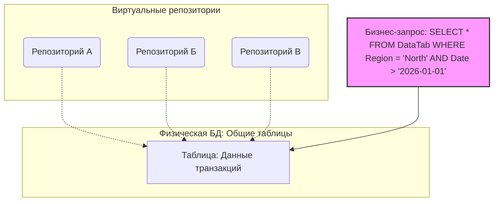

Стирание одного репозитория не влияет на другие поскольку каждый из них это отдельный блокчейн.  Репозитории могут ссылаться на друг друга и могут кэшировать ссылки для скорости выведения информации и навигации дополнительных ссылок.

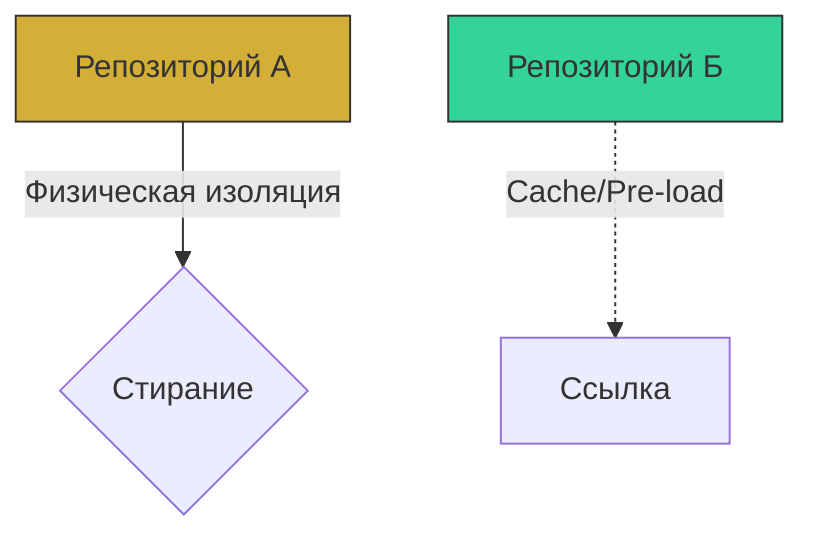

Государственные репозитории: Хранятся на узлах соответствующих «Ветвей».  Ветвь служит «хостом» для локальных, муниципальных и региональных данных.

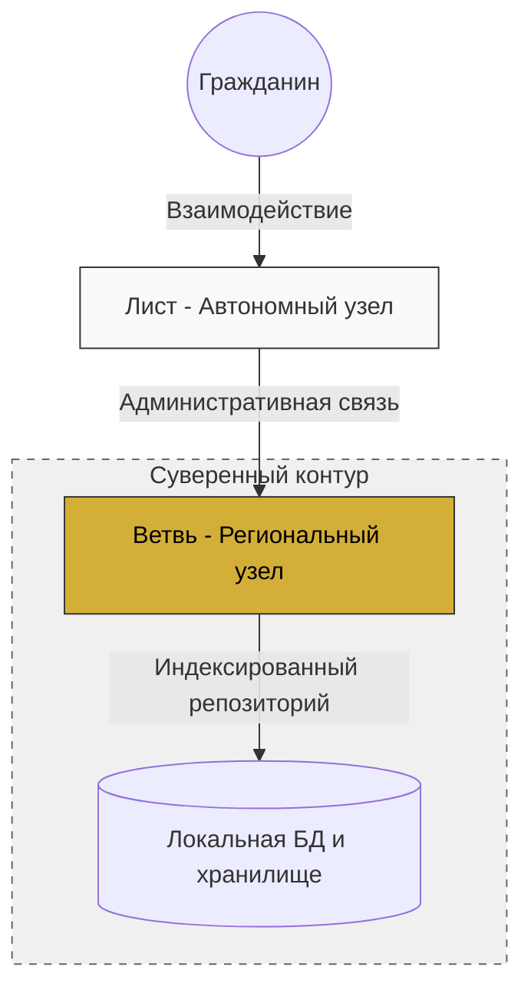

Частные репозитории: Пользователи/группы/бизнес могут разворачивать собственные «Ветки» в входящие в общую платформу как «Листы».  Пользователи могут входить в частные и бизнес «ветки» на прямую но для получение доступа к государственным репозиторям связанными с ними или бизнесом им надо пройти через аутентификацию с государственной веткой.

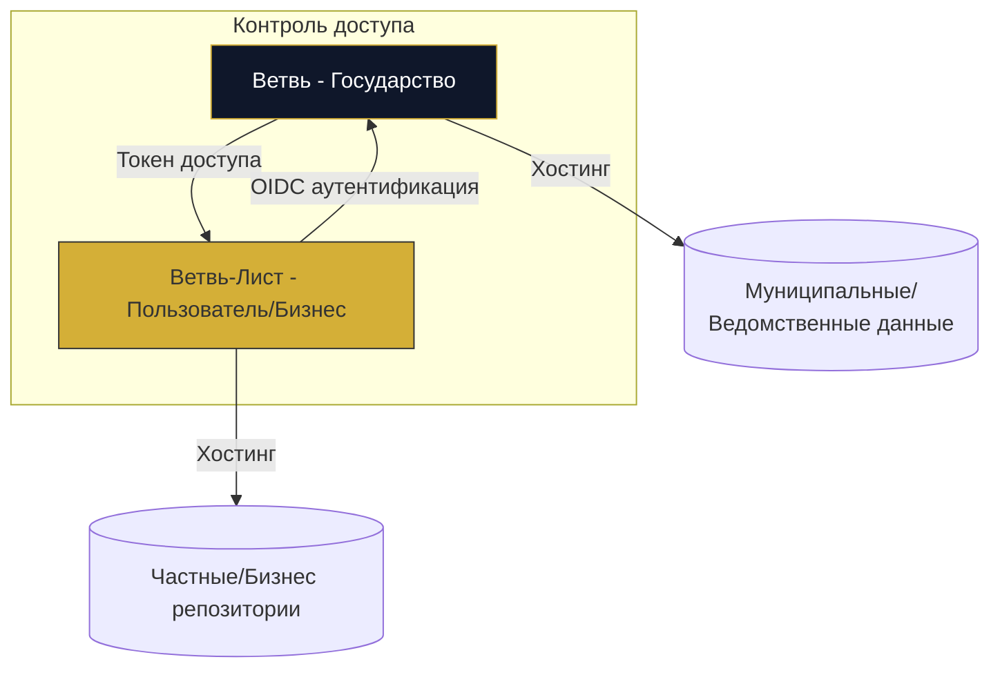

Приватность: Данные в частных репозиториях полностью зашифрованы на стороне владельца.

### 1.4. Принципы кооперативной интероперабельности

Система спроектирована для поддержки независимых разработчиков, создающих «лучшие в своем классе» (best-in-breed) приложения построена и на принципах открытой интероперабельности:

Лист (Leaf): Базовая инфраструктура, обеспечивающая выполнение приложений.

Кооперативные репозитории: Реляционные базы данных, где схемы приложений могут ссылаться друг на друга.

Принцип «Read-Anywhere, Write-Self»: Приложения имеют право записи только в свои схемы, но могут читать данные из любых других схем (при наличии разрешений владельца), что создает синергию без дублирования.

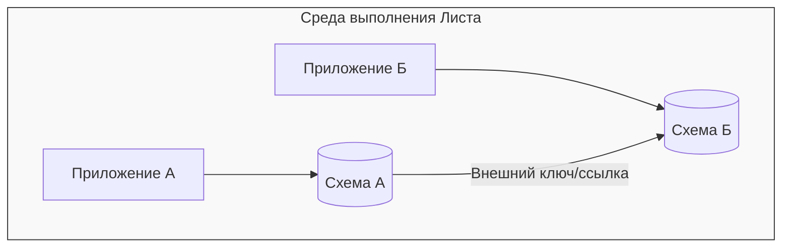

### 1.5. Протокол аутентификации OIDC

Для доступа к государственным данным или для взаимодействия между частными репозиториями и государственными реестрами используется протокол OpenID Connect (OIDC).

Процесс: Пользователь аутентифицируется через свою локальную «Ветвь».

Результат: Получение защищенного токена, который позволяет «Листу» пользователя безопасно запрашивать данные, разрешенные к публикации/обмену.

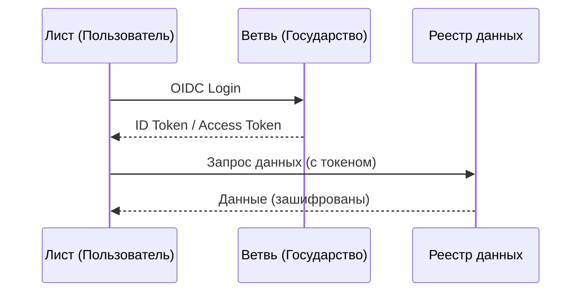

### 1.6. Протокол безопасности и Zero-Knowledge

Лист обменивается с Веткой записями об изменениях в логах транзакций в репозитории.   Все записи подписываются частным ключём пользователя на локально на листе, до отправления в ветку и гарантируя что именоо этой пользователь произвел эту запись.  Частные данные (включая Keyring) шифруются локально на стороне пользователя (Лист). «Ветвь» не имеет доступа к частному контенту — она выступает как защищенный шлюз для передачи зашифрованных логов транзакций, что исключает возможность пассивного чтения данных.

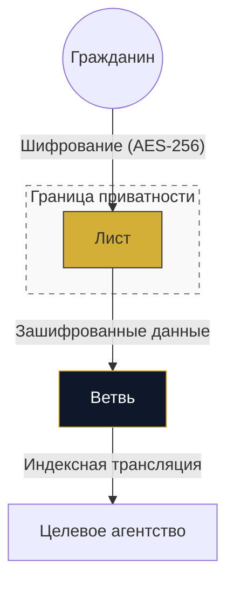

### 1.7. Регистрация пользователей

Пользователи анонимно регистрируются в локальной (районной) Ветке.

Процесс инициализации личного крипто-контура

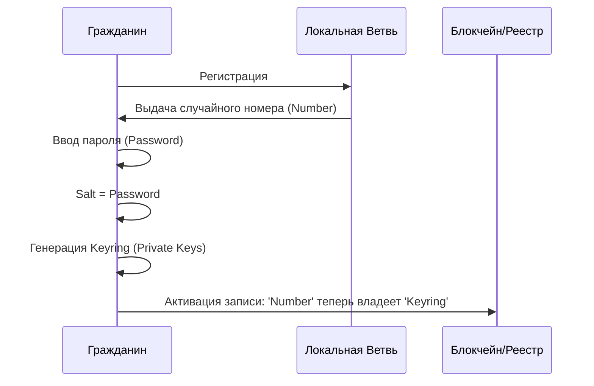

Платформа оставляет за Веткой право фиксировать IP-адреса, с которых осуществляется сетевая активность, чтобы подтвердить статус пользователя как жителя данного района и поддерживать его репутацию.

Для повышения репутации, необходимой для использования в приложениях, участники могут добровольно пройти процедуру жеребьевки.

Механизм формирования анонимной группы:

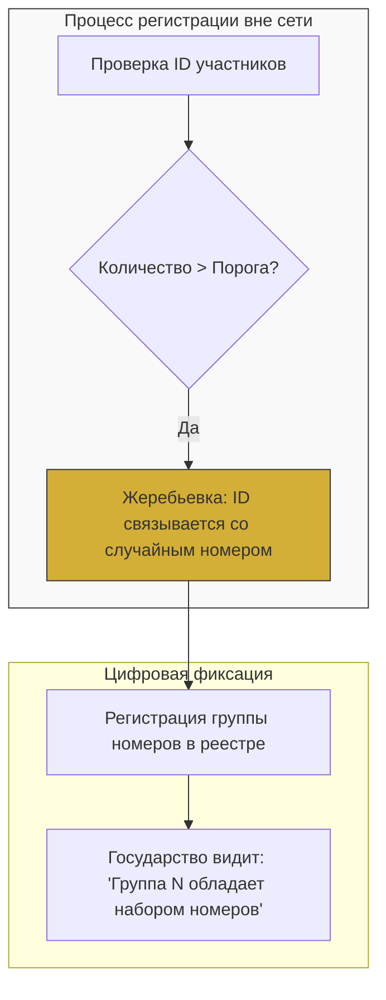

Верифицированные пользователи также могут подтвердить свою личность, чтобы гарантировать остальным, что их записи в публичных или приватных репозиториях сделаны именно ими.

### 1.8. Аутентификация и миграция

OIDC-авторизация: Для доступа к данным и интероперабельности используется стандарт OpenID Connect, где «Ветвь» выступает доверенным центром аутентификации.

Anti-Linkability: При смене локации или ключей пользователь выполняет перешифрование репозиториев (Keyring v1 -> Keyring v2). Это гарантирует, что метаданные инфраструктуры старого региона не могут быть использованы для корреляции активности пользователя в новом.

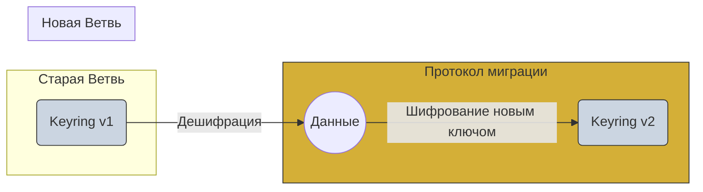

## 2. Сетевая топология и взаимодействие узлов

### 2.1. Иерархическая структура сети

Система построена как логическая древовидная иерархия. 

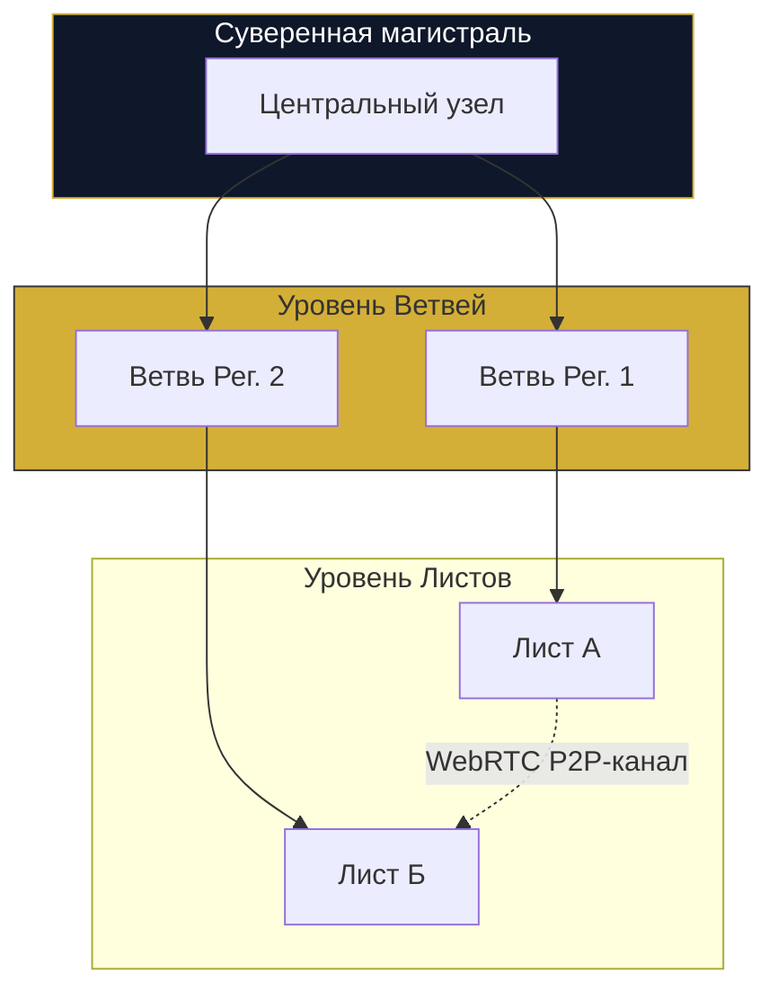

Такая топология:

- Ограничивает поверхность атаки: «Ветви» принимают только локальный трафик, предотвращая DDoS-атаки извне.

- Обеспечивает производительность: Быстрый доступ к локальным данным для региональных пользователей.

- Масштабируемость: Каждый уровень иерархии (федеральный округ/область/район) выполняет роль агрегатора для вышестоящего уровня. Данные в системе дублируются «вверх» для аналитики, избавляя от необходимости создавать монолитные узлы.

### 2.2. Протокол взаимодействия и P2P-обмен

Пепозитория это распределенный сигнальный сервер. Вместо того чтобы полагаться на централизованный или «Ветвевой» сервис сигнализации (как в классическом WebRTC), используется сама архитектура репозиториев как асинхронный механизм установления соединения.

Пользователи «общаются» через обновление состояний в общих публичных репозиториях, которые служат своего рода «доской объявлений», видимой для целевого узла. Это избавляет систему от необходимости иметь выделенные STUN/TURN серверы в каждой «Ветви».

После успешного рукопожатия «Листы» устанавливают прямое WebRTC-соединение, минуя инфраструктуру «Ветвей» для передачи тяжелых данных.

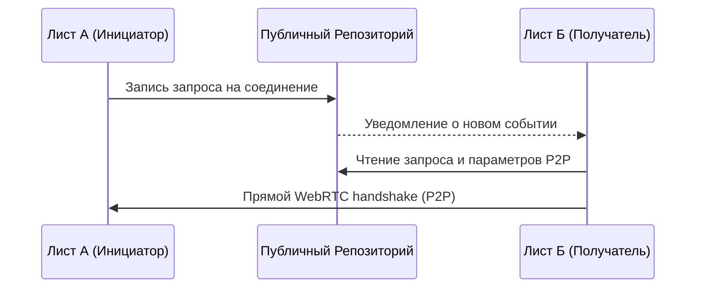

Таким образом, «Ветвь» работает как контрольно-пропускной пункт (Control Plane), а WebRTC обеспечивает высокоскоростной транспортный уровень (Data Plane).

### 2.3. Иерархическое распределенное индексирование

Поиск данных реализован через рекурсивный спуск по дереву индексов. Каждый узел (от Листа до Ветви) хранит только метаданные для следующего уровня вниз, что делает поиск высокопроизводительным и защищенным.

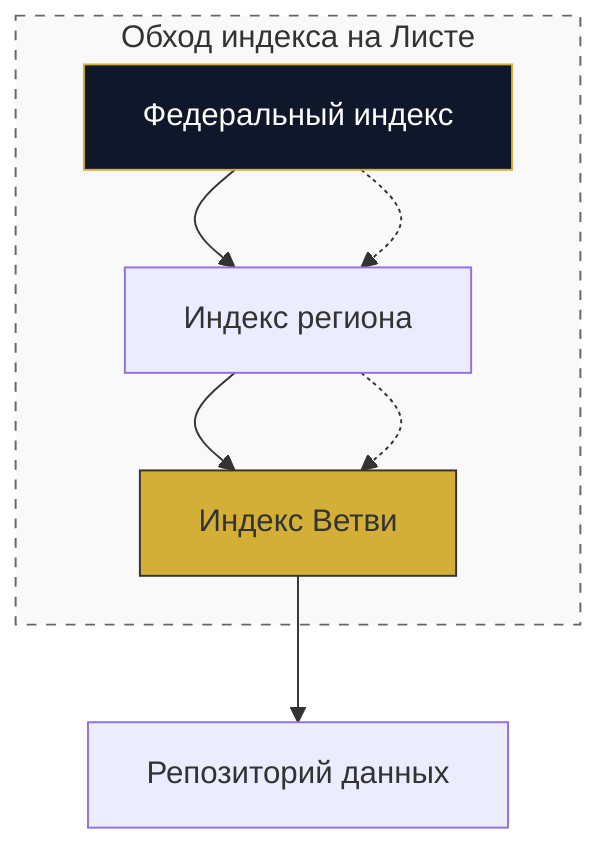

Применяется принцип распределенного индексирования, при котором каждый узел (от Листа до Ветви) хранит лишь необходимый объем метаданных для навигации, а не всю глобальную базу данных. Это превращает поиск по системе в процесс рекурсивного спуска по дереву индексов, что обеспечивает высокую производительность и масштабируемость.

Поскольку «Лист» может самостоятельно обходить индексы, это снимает нагрузку с государственных серверов и сохраняет приватность — пользователь сам «запрашивает» путь к нужным данным, не раскрывая запрос полностью перед «Ветвью».

### 2.4. Репликация через Transaction Log

Обновления происходят в реальном времени посредством событийной рассылки записей лога транзакций. «Листы» подписываются на изменения, и новые данные автоматически доставляются («пушатся») вниз по иерархии к заинтересованным пользователям.  «Лист» получает только то, на что он подписан, и ровно в тот момент, когда данные обновляются на «Ветви».  «Листы» подписываются на поток изменений, и дерево иерархии работает как естественная сеть распространения (Content Distribution Network).

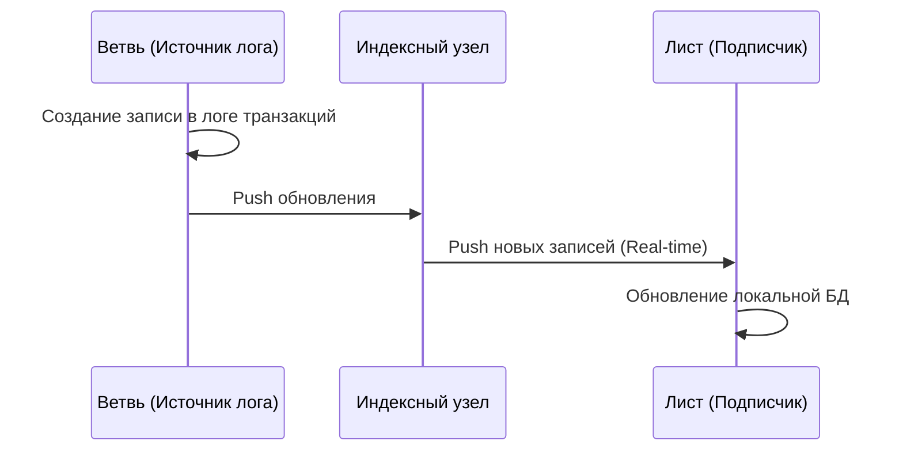

### 2.5. Физическая изоляция (Runtime Isolation)

Для обеспечения максимальной стабильности и безопасности каждая «Ветвь» работает в изолированном контейнерном/виртуальном контуре. Это исключает риск «утечки памяти» (Memory Leakage) и конфликтов ресурсов. Изоляция является стандартом, так как аналитическая обработка данных и избыточность обеспечиваются за счет дублирования логов «вверх» по иерархии, а не за счет объединения процессов внутри одного сервера.

## 3. Архитектура хранилищ и данных 

### 3.1. Репозиторий как блокчейн-объект

Каждый репозиторий функционирует как автономный блокчейн. Транзакции подписываются ключевой парой владельца, что гарантирует:

Неизменность (Immutability): Никто, включая инфраструктуру «Ветвей», не может подделать данные.

Верифицируемость: «Лист» проверяет каждую входящую транзакцию, обеспечивая подлинность контента.

Конвергенция (Reconciliation): При работе в оффлайн-режиме (разветвление данных) блокчейн-структура позволяет безошибочно объединить (reconcile) состояния всех «Листов» при восстановлении связи.

### 3.2. Согласованность данных через версионные лог-записи
Система использует идемпотентное обновление:

Версионность: Каждая копия записи в кэше репозитория сопровождается номером версии.

Автоматическое обновление: При получении нового лога транзакций «Лист» сверяет версии. Если версия новее, локальная БД обновляется.

Идемпотентность: Повторная обработка одного и того же обновления от разных «Листов» не вызывает избыточных операций, так как состояние БД уже соответствует актуальной версии.

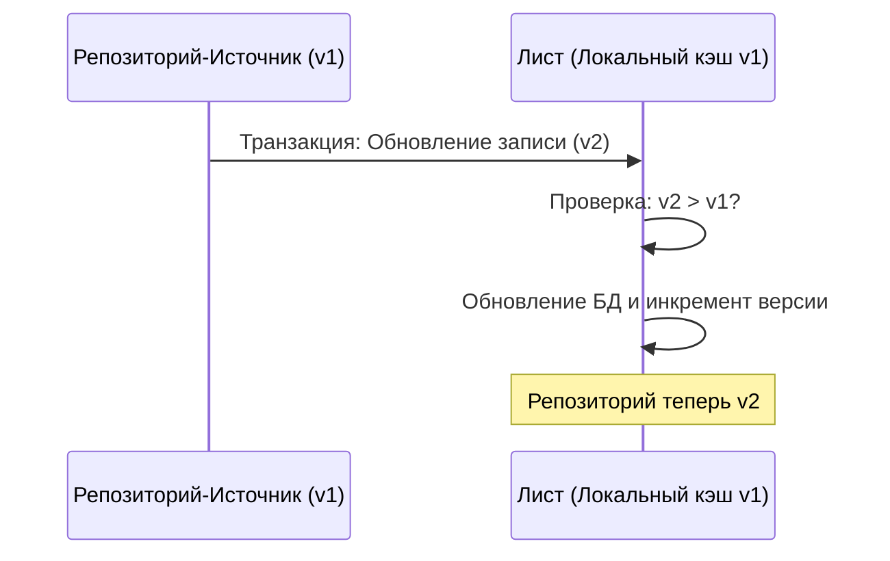

Каждая репозитория это «активный объект», который знает свою версию и автоматически обновляется при получении новых данных из потока транзакций без централизованной «блокировки» или протокола двухфазной фиксации (2PC).

### 3.3. Динамичное управление данными

Виртуализация: Репозитории существуют как «объекты-ссылки», которые активируются только в контексте выполнения задачи.

Авто-загрузка зависимостей: «Лист» отслеживает связи между схемами и автоматически подгружает связанные репозитории.  Это системный кэш данных с ленивой загрузкой (Lazy Loading), где «Лист» сам управляет графом зависимостей между репозиториями, подгружая их в оперативную реляционную БД по мере необходимости и выгружая их, когда они становятся неактуальными.

Управление памятью: IndexedDB используется как «холодное» хранилище для зашифрованных логов транзакций, из которых «Лист» восстанавливает состояние БД в момент обращения (re-hydration).

### 3.4. Кэширование ссылочной целостности

В каждый репозиторий встраивается копия связанных записей. Это создает «гравитационный эффект» данных: основной репозиторий притягивает контекст, необходимый для его обработки, минимизируя потребность в подгрузке зависимостей при каждом обращении.

Это механизм локального кэширования связей.  Используется модель денормализации через кэширование ссылок (копирование связанных записей непосредственно в репозиторий), что превращает репозиторий в самодостаточный объект (self-contained object). Это позволяет просматривать данные сразу — все «соседние» данные уже под рукой.  Одновременно, в зависимости от настройки Листа все репозитории использующееся загруженной репозиторией могут быть подзагружены до того как пользователь обратится к ним.

Копированные связанные записи обновляются по мере обновления ссылаемых репозиторий.

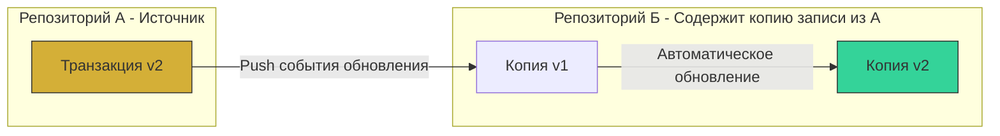

### 3.6. Управление жизненным циклом и очистка (Pruning)

Система использует идемпотентное обновление. Удаление или модификация записей происходит путем добавления новых транзакций, а оптимизация локальной БД («pruning») выполняется «Листами» при загрузке новых блоков транзакций, удаляя записи, которые больше не являются актуальными в текущем состоянии блокчейна.

Активное удаление: При обработке нового транзакционного лога система выполняет проверку актуальности. Если запись помечена как удаленная или неактуальная (pruned), она изымается из активной реляционной БД.

Оптимизация связей: Если запись удаляется, «Лист» автоматически очищает (prune) все зависимости и ссылки в связанных репозиториях, предотвращая наличие «битых» связей (broken references).

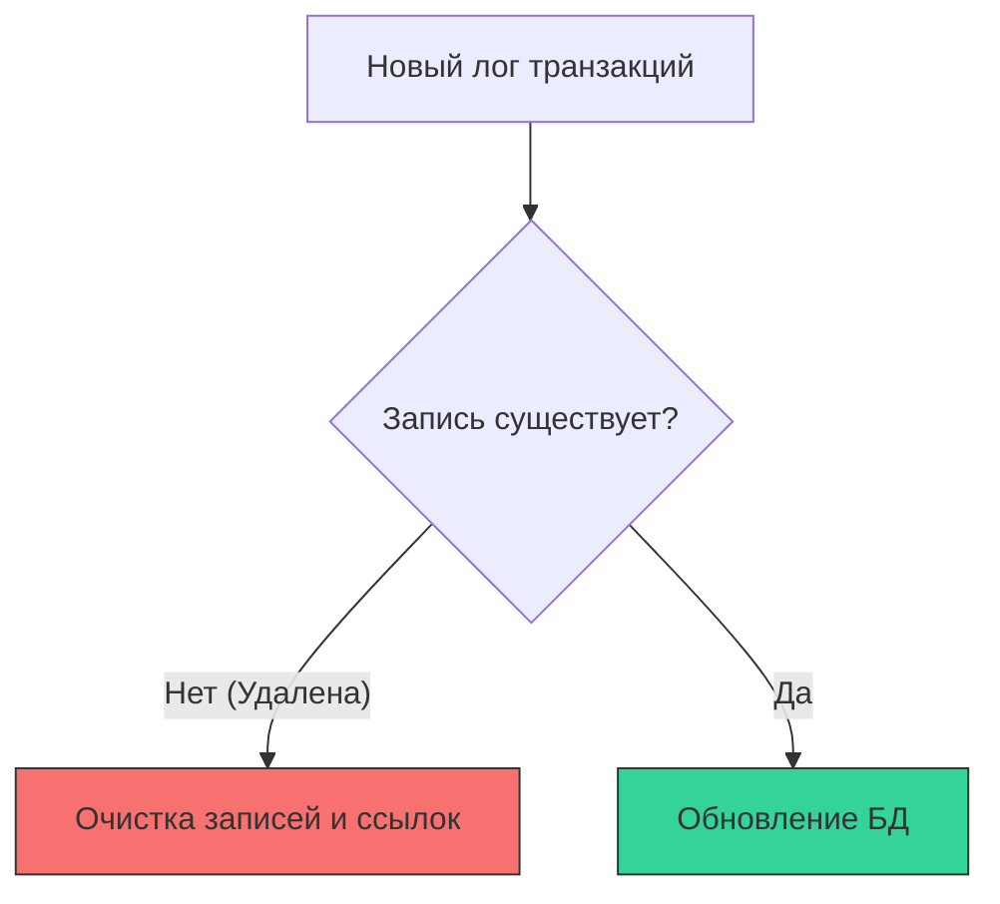

### 3.7. Многослойная система индексов

Система поддерживает три уровня навигации:

Топики/Хронология: Статичная иерархия для глубокого поиска.

Приложения: Индексы по логике взаимодействия.

История доступа: Динамический «легкий» индекс для быстрого возврата к недавним данным.

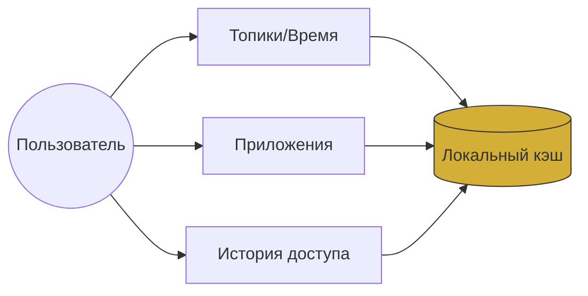

## 4. Управление ключами и безопасность

### 4.1. Keyring как доверенный объект

Ключи не являются «системными файлами»; они живут в Keyring Repository. Ключ — это не просто статичный файл, а объект в репозитории (Keyring), который может быть разделен между участниками группы.

Это позволяет:

Делегировать доступ: Копирование Keyring между устройствами или доверенными членами группы (семья/коллеги).

Синхронизировать доверие: Использование Keyring как объекта в сети репозиториев, который подчиняется общим правилам распространения логов.

### 4.2. Безопасность через ветвление (Security Forking)

Вместо попыток «отозвать» ключ у скомпрометированного участника, система использует форкинг репозиториев. При изменении состава группы старый репозиторий «замораживается», а данные переносятся в новый контейнер с новым ключом. Это гарантирует математически чистое разделение доступа.

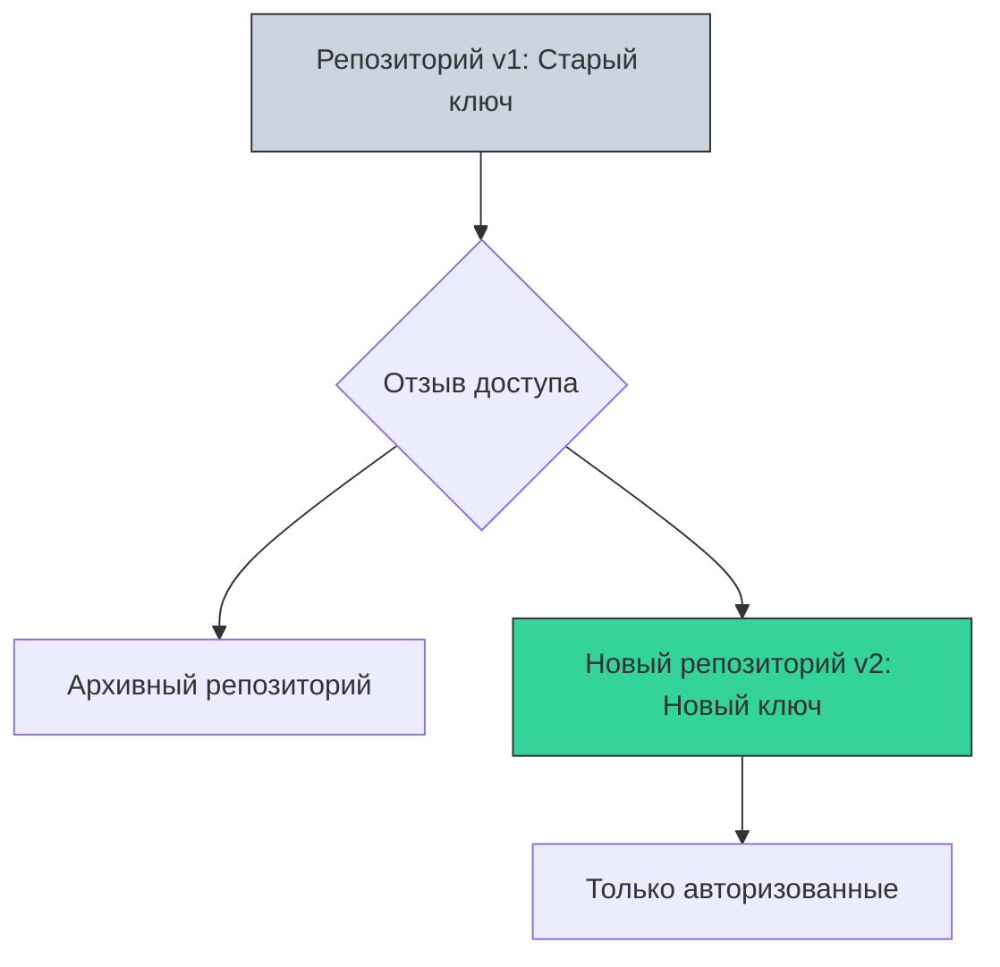

Создание Fork-репозитория: Система генерирует новый репозиторий с обновленными правами доступа и новым шифрующим ключом.

Перенос связей: Существующая история (до момента разделения) сохраняется для всех участников, но доступ к будущим «веткам» транзакций получают только авторизованные пользователи.

Разрыв цепочки: Старый репозиторий становится «архивным» для группы; новые данные в него не добавляются.

### 4.3. Автоматизированная ротация ключей

Для минимизации рисков компрометации система поддерживает:

Default Automatic Rotation: Периодическое обновление ключей в Keyring для поддержания высокого уровня безопасности без участия пользователя.

On-Demand Manual Rotation: Возможность принудительного обновления ключей по требованию владельца.

### 4.4. Модель делегированного доступа (Keyring Sharing)

Keyring переходит от одного «Листа» к другому через доверенные репозитории, позволяя членам группы (например, семье) иметь синхронизированный доступ к одним и тем же данным.

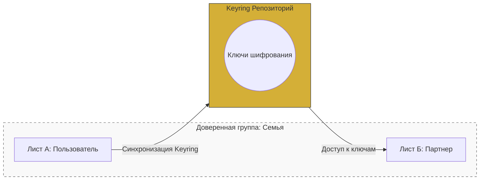

Потеря доступа не становится катастрофой, если есть «доверенные узлы» (члены семьи или коллеги), у которых есть копия ключей.

# Часть II: Безопасность, Изоляция и Комплаенс

## 5. Архитектура внешнего взаимодействия

### 5.1. Интеграция через OpenID Connect (OIDC)

Платформа использует стандарт OIDC для первичной аутентификации всех узлов, включая корпоративные серверы. Это позволяет внешним системам выступать в роли «Листов» или «Ветвей», сохраняя при этом безопасность через привязку к Keyring-репозиторию.

```mermaid
graph TD
    External_Sys[Внешняя система / Корп. сервер] --> |1. OAuth2/OIDC Auth| IdP[Identity Provider платформы]
    
    subgraph Platform_Data [Платформа]
        IdP --> |2. Token/Access| Leaf_Node[Ветвь платформы]
        Leaf_Node --> |3. Интеграция схем| Platform_Repo[(Репозиторий платформы)]
        Platform_Repo
    end
    
    style Leaf_Node fill:#34D399,stroke:#333
    style Platform_Repo fill:#D4AF37,stroke:#333
```

Любой внешний узел (корпоративный сервер или стороннее приложение) проходит аутентификацию через OIDC для входа в сеть. После успешного подтверждения личности он получает статус «Листа» или «Ветви» в зависимости от своих задач и полномочий.

Внешний узел является «Листом» если он работает с государственными репозиториями и является «Веткой» если он позволяет государству работать со своими репозиториями.

### 5.2. Синхронизация через WebSocket

Для обеспечения работы в реальном времени, внешние системы поддерживают постоянное WebSocket-соединение с «Ветвью». Это позволяет автоматически получать новые записи лога транзакций без необходимости постоянного опроса (polling).

```mermaid
graph LR
    subgraph Third_Party [Внешняя система]
        DB[(Корпоративная БД)]
        Leaf1[Корпоративная Лист-Ветка А]
        Leaf2[Корпоративная Лист-Ветка Б]
    end
    
    subgraph Platform [Сеть платформы]
        Branch1[Ветвь 1]
        Branch2[Ветвь 2]
    end
    
    Leaf1 -- WebSocket (Transaction Logs) --> Branch1
    Leaf2 -- WebSocket (Transaction Logs) --> Branch2
    
    Leaf1 -.-> DB
    Leaf2 -.-> DB
    
    style DB fill:#f9f9f9,stroke:#333
    style Leaf1 fill:#34D399,stroke:#333
    style Leaf2 fill:#34D399,stroke:#333
    style Branch1 fill:#D4AF37,stroke:#333
    style Branch2 fill:#D4AF37,stroke:#333
```

Сторонняя система развертывает один или несколько «Листов», каждый из которых держит постоянный WebSocket-канал с соответствующей «Ветвью». Это превращает внешнюю БД в динамический участник сети, который автоматически актуализирует свои данные при любых изменениях в репозиториях платформы.

### 5.3. Разрешение конфликтов и Time-Traveling

Система использует иерархический арбитраж времени: «Ветвь» рассылает подписанные временные метки, которые «Листы» используют для подписи своих транзакций. В случае конфликта (например, одновременной записи) применяется политика Last-Write-Wins (последний по времени побеждает), а для исправления ошибок используется концепция «путешествия во времени» — откат к точке до конфликта и очистка лога.

```mermaid
graph TD
    Branch[Ветвь: Источник времени] --> |Подписанная метка| Leaf[Лист: Корп. система]
    Leaf --> |Транзакция v2| Branch
    
    subgraph Conflict_Handling [Обработка конфликтов]
        Detected{Конфликт?}
        Detected -- Да --> Rollback[Time-Travel: Откат к v1]
        Rollback --> Edit[Ручное/Автоматическое исправление]
        Edit --> Replay[Перезапуск лога]
    end
    
    style Branch fill:#D4AF37,stroke:#333
    style Rollback fill:#F87171,stroke:#333
    style Replay fill:#34D399,stroke:#333
```

«Ветвь» выступает как «арбитр времени», синхронизируя все «Листы» через подписываемые временные метки, а окончательное решение конфликтов остается за пользователем, который может «отмотать» состояние БД и внести правки.

## 6. Механизмы синхронизации и оффлайн-режим

### 6.1. Политики синхронизации

Система поддерживает гибкие подходы к синхронизации в зависимости от критичности данных:

Sync Timestamp Policy (синхронизация по времени «Ветви»): Используется для высококритичных данных (например, финансовых транзакций). Локальные записи «Листа» привязываются к временной шкале «Ветви», обеспечивая единый объективный порядок событий.

Trust Offline Leaf Policy (использование локальных меток): Используется для персональных или общественных данных. Система доверяет локальной последовательности событий (self-signed timestamps), что позволяет работать полностью автономно без привязки к глобальному времени «Ствола».  Применяется для персональных или общественных данных (форумы, заметки), где приоритет — доступность и скорость.

Если два «Листа» синхронизируются в одну точку, алгоритм внутри репозитория гарантирует, что порядок записей будет вычислен одинаково на всех узлах, избегая «разночтений» в истории.

```mermaid
sequenceDiagram
    participant Leaf as Оффлайн-Лист
    participant Branch as Ветвь
    
    Leaf->>Leaf: Создание записей (Self-signed)
    Note over Leaf: Режим ожидания сети
    Leaf->>Branch: Синхронизация: передача лога
    Branch-->>Leaf: Присвоение Sync Timestamp
    Note over Branch: Применение Sync policy или Trust policy
```

### 6.2. Иерархическое согласование «Истинного времени»

Для поддержания единой временной шкалы в межгосударственной сети используется протокол многостороннего согласования между корневыми узлами — Стволами (Trunks).

Стволы: Участвуют в межузловом протоколе для вычисления «True Time».

Ветви (Branches): Получают эталонное время от своих родительских «Стволов», обеспечивая согласованность для всех подчиненных «Листов».

Если «Стволы» фиксируют расхождение, они обмениваются серией сообщений для вычисления общего «времени согласия» (True Time), которое затем транслируется вниз по иерархии к «Ветвям» и «Листам».

```mermaid
sequenceDiagram
    participant ForeignTrunk as Ствол зарубежного государства Ствол
    participant Trunk as Ствол (Trunk)
    participant Branch as Ветвь (Branch)
    
    ForeignTrunk->>Trunk: Запрос согласования (Negotiation)
    Trunk->>ForeignTrunk: Обмен временными метками
    Note over ForeignTrunk,Trunk: Вычисление "True Time"
    Trunk-->>Branch: Трансляция согласованного времени
    Branch-->>Branch: Обновление шкалы "Листов"
```

### 6.3. Гибридная синхронизация (Delta & P2P)

Для оптимизации трафика и работы в реальном времени используется двухслойная передача данных:

WebRTC P2P-синхронизация: «Листы» обмениваются изменениями напрямую, уведомляя «Ветви» лишь о факте успешной доставки. Это снижает нагрузку на центральную инфраструктуру.

Инкрементальный Push: Узлы передают на «Листы» только записи транзакционных логов репозиторий, не имеющие подтверждения синхронизации.

```mermaid
graph TD
    LeafA[Лист А: Инициатор изменений]
    LeafB[Лист Б: Получатель]
    Branch[Ветвь]
    
    LeafA -- 1. Прямая передача изменений (WebRTC) --> LeafB
    LeafA -- 2. Уведомление о транзакции --> Branch
    LeafB -- 3. Подтверждение получения --> Branch
    
    style LeafA fill:#34D399,stroke:#333
    style LeafB fill:#34D399,stroke:#333
    style Branch fill:#D4AF37,stroke:#333
```

Используется гибридная модель передачи данных, которая сочетает централизованный контроль (через «Стволы» и «Ветви») с децентрализованной доставкой (через WebRTC между «Листами»). Это минимизирует нагрузку на инфраструктуру и обеспечивает невероятную скорость работы, так как «Ветка» не должна отправлять данные на остальные «Листы» если она она уже получила подтверждение синхронизации между «Листами» и данные уже были доставлены напрямую.

## 7. Регуляторный комплаенс, атомарность и жизненный цикл данных

### 12.1. Независимые блокчейны-репозитории и «Право на забвение»

В отличие от монолитных блокчейнов, архитектура системы базируется на множестве независимых блокчейнов-репозиториев. Каждый из них представляет собой самостоятельный «юнит работы» (unit of work), что обеспечивает уникальную гибкость в управлении данными.

Физическая изоляция: Поскольку каждый репозиторий является отдельным блокчейном без связей с другими, удаление истории транзакций одного репозитория не нарушает целостность системы.

Право на забвение: Соответствие юридическим нормам (например, GDPR) достигается через физическое удаление конкретного репозитория на всех Ветвях и Листах, где он был сохранен. Это гарантирует полное уничтожение данных без необходимости «вырезания» их из глобального лога.

```mermaid
graph TD
    subgraph Repo1 [Репозиторий А: Юнит работы]
        Log1[Лог транзакций]
    end
    
    subgraph Repo2 [Репозиторий Б: Другой юнит]
        Log2[Лог транзакций]
    end
    
    subgraph Cache [Кэширование]
        Ref[Ссылка на Repo1]
    end
    
    Repo1 -- "Полное физическое удаление" --> Delete{Стирание}
    Repo2 -.->|Cache/Pre-load| Ref
    
    style Delete fill:#F87171,stroke:#333
    style Repo1 fill:#D4AF37,stroke:#333
    style Repo2 fill:#34D399,stroke:#333
```

Независимость репозиториев: Позволяет соблюдать «Право на забвение» путем удаления конкретных юнитов работы (репозиториев).

### 12.2. Атомарность транзакций на уровне Листа

Система исключает необходимость в сложных протоколах распределенных транзакций (например, 2PC), перенося ответственность за их консистентность на уровень «Листа».

Лист как Runtime: Лист является изолированной доверенной средой исполнения (Runtime), объединяющей UI, API-вызовы и базы данных (репозиториев), он фактически является локальным транзакционным менеджером.  «Лист» всегда знает конечное состояние всех измененных репозиториев перед их отправкой в цепочки Ветвей/Стволов.

Атомарность: Все изменения в различных репозиториях, инициированные одной операцией, фиксируются как единый «снимок» (snapshot). Транзакция подписывается пользователем локально, гарантируя, что все изменения либо будут приняты одновременно, либо не будут приняты вовсе.

```mermaid
graph TD
    UI[Пользовательский интерфейс] -->|Команда на транзакцию| Leaf[Лист: Runtime & DB]
    
    subgraph Local_Atomic_Update [Локальная атомарная транзакция]
        R1[Репозиторий 1]
        R2[Репозиторий 2]
        R3[Репозиторий 3]
    end
    
    Leaf --> R1
    Leaf --> R2
    Leaf --> R3
    
    Leaf -->|Подпись пользователя| Final[Подписанный Snapshot]
    Final --> Sync[Асинхронная отправка в Ветви/Стволы]
    
    style Leaf fill:#D4AF37,stroke:#333
    style Final fill:#34D399,stroke:#333
```

Лист работает как изолированный контейнер состояний. Все изменения в различных репозиториях (Кошелек, История, API-логи) происходят в рамках одного «снимка» (snapshot) и подписываются пользователем как единое целое.

Аудируемость: Каждая транзакция, подписанная на Листе, является юридически значимым актом владения и изменения данных.

### 12.3. Юридическая значимость и аудит

Аудируемость: Каждая транзакция, подписанная на Листе, является юридически значимым актом владения и изменения данных.

Управление рисками: Разработчики приложений могут структурировать схемы данных, предотвращая утечку чувствительной информации в «gateway-рекорды», при этом сохраняя возможности для эффективного кэширования и предварительной загрузки.

Compliance: Государственные органы могут аудировать конкретные репозитории, не имея доступа ко всей экосистеме, что упрощает прохождение проверок.

# Часть III: Программное Обеспечение Листа

## 8. Интерфейс пользователя и прикладной уровень

### 7.1. Архитектура исполнения и изоляция

Каждый «Лист» представляет собой автономную изолированную среду (песочницу), внутри которой приложения работают без прямого доступа к сетевым ресурсам или API веб-платформы.

Слой данных: Активные репозитории обрабатываются в памяти через WASM SQLite, а постоянное хранилище обеспечивается IndexedDB.

Прикладной уровень: Приложения инкапсулируют свою логику в отдельных схемах и общаются друг с другом через строго определенные публичные API, что обеспечивает высокий уровень безопасности и стабильности.

```mermaid
graph TD
    subgraph Leaf_Container [Лист: Изолированная среда]
        UI[Пользовательский интерфейс]
        App1[Приложение А: Схема 1]
        App2[Приложение Б: Схема 2]
        
        WASM_DB[(WASM SQLite)]
        Storage[(IndexedDB)]
        
        UI -->|Вызов CRUD| App1
        App1 <-->|Public API| App2
        App1 <--> WASM_DB
        WASM_DB <--> Storage
    end
    
    style Leaf_Container fill:#f3f4f6,stroke:#333
    style WASM_DB fill:#D4AF37,stroke:#333
```

### 7.2. Композиция UI и управление состоянием

Интерфейсы пользователей реализованы как полноэкранные SvelteJS Web Components, которые управляются централизованным маршрутизатором платформы.

Жизненный цикл: Платформа «Листа» берет на себя управление монтированием и переходами (Routing API), обеспечивая мгновенный отклик за счет фонового кэширования неактивных интерфейсов.

Платформенное меню: Доступ к глобальным настройкам и навигации осуществляется через выделенный элемент управления («Icon Overlay»), скрытый от прямого доступа приложений.

```mermaid
graph TD
    LeafPlatform[Платформа Листа: Маршрутизатор]
    
    subgraph UI_Registry [Активные UI в памяти]
        UI1[Web Component: UI A - Активный]
        UI2[Web Component: UI B - Кэширован]
    end
    
    Icon[Системная иконка: Admin] --> LeafPlatform
    LeafPlatform -- "Управление состоянием (Mount/Unmount)" --> UI1
    LeafPlatform -- "Фоновое хранение" --> UI2
    
    style LeafPlatform fill:#D4AF37,stroke:#333
    style UI1 fill:#34D399,stroke:#333
    style UI2 fill:#cbd5e1,stroke:#333
```

## 9. Управление жизненным циклом и обновление системы

### 8.1. Иерархия доверия и верификация кода

Для обеспечения безопасности системы используется строгая модель доверия, исключающая установку несанкционированного ПО.

Двойная подпись: Каждое приложение (Web Component) и обновление платформы подписывается двумя сторонами: разработчиком и суверенным «Стволом» (Trunk).

Белый список «Ветвей»: Только приложения, одобренные «Ветвью», доступны для загрузки и исполнения на «Листах».

Прозрачность: Исходный код является открытым, что позволяет проводить независимый аудит безопасности и использование AI-инструментов для анализа потоков данных.

```mermaid
graph TD
    Developer[Разработчик приложения] -- 1. Исходный код --> Trunk[Суверенный Ствол]
    Trunk -- 2. Аудит & Подпись --> Package[Подписанный пакет App]
    
    Branch[Ветвь] -- 3. Белый список --> Package
    Package -- 4. Загрузка в Лист --> Leaf[Лист: Web Site]
    
    subgraph Trust_Model [Модель Доверия]
        Transparency[Открытый код]
        AI_Trace[AI верификация переменных]
        Verification[Проверка подписи]
    end
    
    style Trunk fill:#D4AF37,stroke:#333
    style Leaf fill:#34D399,stroke:#333
    style Package fill:#f97316,stroke:#333
```

Open Source & AI-Audit: Весь код открыт, что позволяет сторонним суверенным государствам и пользователям проверять отсутствие «закладок» и утечек данных.

Модель двойной подписи (Разработчик + Суверенный Ствол) в сочетании с открытым исходным кодом создает прозрачную среду, где безопасность проверяется не «на слово», а через верифицируемый путь от исходного кода до исполняемого WASM-модуля.


### 8.2. Инъекция патчей и эволюция схем данных

Система поддерживает непрерывное обновление без простоев и принудительных миграций данных.

Hot Patching (Инъекция классов): Обновление кода платформы и приложений происходит путем «горячей» подмены классов в рантайме (class injection). Платформа ожидает завершения активных транзакций, обеспечивая целостность состояния системы.

Аддитивная модель схем: Структура данных (таблицы и столбцы) может только расширяться. Это гарантирует 100% обратную совместимость, позволяя старым и новым версиям приложений работать с одними и теми же репозиториями.

Ответственность разработчика: При необходимости радикальных изменений структуры данных, логика миграции остается в зоне ответственности разработчика приложения, при этом система поощряет стабильность через экономические стимулы API.

```mermaid
graph TD
    Update[Подписанный патч: Ствол + Разработчик] --> Branch[Ветвь]
    Branch --> |1. Ожидание завершения транзакций| Leaf[Лист]
    Leaf --> |2. Инъекция классов| Runtime[Исполняемая среда]
    
    subgraph Data_Integrity [Целостность данных]
        Growth[Только расширение схемы]
        Compatibility[Обратная совместимость]
    end
    
    Runtime -.-> Growth
    Runtime -.-> Compatibility
    
    style Update fill:#f97316,stroke:#333
    style Leaf fill:#34D399,stroke:#333
```

## 10. Кооперативные приложения и изоляция данных

### 13.1. Архитектура кооперативного доступа

В данной системе приложения не работают в вакууме. Для совместного использования данных они используют Gateway-репозитории, которые выступают в роли контролируемых точек входа. Безопасность обеспечивается тем, что любое межприложенческое взаимодействие проходит через API-вызовы, валидируемые на уровне «Листа» (Runtime).

Пример «Календарь + Задачи»: Приложение «Задачи» запрашивает доступ к данным «Календаря» для автоматического создания напоминаний.

Изоляция: Приложение «Задачи» не имеет прямого доступа к базе данных «Календаря». Оно обязано вызвать API-метод ReadCalendarEvents(), который проходит проверку Runtime-контроля.

```mermaid
graph TD
    subgraph UI_Layer [Уровень пользовательского интерфейса]
        CalendarUI[Интерфейс Календаря]
        TasksUI[Интерфейс Задач]
    end
    
    subgraph Leaf_Runtime [Лист: Runtime и Контроль]
        App1[Приложение: Календарь]
        App2[Приложение: Задачи]
        
        Gateway{Gateway-репозиторий}
        
        App1 -->|Write/Read| Repo1[Репозиторий: События]
        App2 -->|Read via API| Gateway
        Gateway -->|Verify Access| Repo1
        
        App2 -->|Write| Repo2[Репозиторий: Задачи]
    end
    
    style Gateway fill:#D4AF37,stroke:#333
    style Leaf_Runtime fill:#f3f4f6,stroke:#333
```

Через свою настройку приложения могут открыть право прямого доступа к таблицам в своей схеме данных для создания запросов с соединением SQL (SQL join queries) но не могут дать право изменения.  Все изменения данных в схеме приложения должны быть сделаны через API-методы этого приложения.

### 13.2. Обеспечение безопасности и целостности
Система предотвращает утечки данных и злоупотребления через многоуровневый аудит:

Deployment Lockdown (Уровень Ветви): Установка приложения на «Лист» возможна только из доверенного списка Ветви. Приложение, не прошедшее верификацию, физически не загружается и не имеет доступа к API.

Runtime-валидация (Уровень Листа): При совершении транзакции записи, Лист проверяет, было ли получено право на запись в рамках текущей сессии UI. Это предотвращает сценарий, когда «злонамеренный» UI пытается подменить данные, используя API другого приложения.

Анализ исходного кода: Поскольку все приложения — Open Source, система использует AI-ревью для отслеживания переменных и потоков данных (data flow analysis), что позволяет автоматически помечать «подозрительные» приложения как нежелательные для определенных типов репозиториев.

```mermaid
graph TD
    Branch[Ветвь: Список разрешенных приложений] -->|Deployment| Leaf[Лист: Runtime]
    
    subgraph Runtime_Check [Runtime-контроль транзакций]
        App_A[Приложение А] -->|Read| Repo_A[Репозиторий А]
        App_A -->|Write Request| Validator{Runtime Validation}
        App_B[Приложение Б: API] -->|Write Permission| Validator
        Validator -->|Commit| Atomic_TX[Атомарная транзакция]
    end
    
    style Validator fill:#F87171,stroke:#333
    style Branch fill:#D4AF37,stroke:#333
```

### 13.3. Применение в кооперативных сценариях

Приложения могут вызывать API других приложений для чтения или читать напрямую, но обязаны использовать API для записи. Это гарантирует, что любое изменение данных фиксируется как «транзакция приложения», которая проходит проверку на легитимность.

Примечание: Если приложение пытается совершить запись в репозиторий, к которому оно не имеет явного права доступа в текущем контексте (session context), транзакция блокируется на уровне ядра Листа, обеспечивая полную изоляцию данных даже при активной кооперации приложений.

# Часть IV: Идентичность и Федерация

## 11. Идентичность пользователя, Keyring и портативность

### 11.1. Архитектура управления доступом (Keyring System)

Система идентичности строится на принципе сегментированного владения правами. Пользователь не ограничен единым ключом, а управляет множеством «Keyring-репозиториев», каждый из которых привязан к конкретной Ветви (личной, государственной или бизнес-ветви).

Сегментация: Разделение на «Рабочий», «Личный» и другие Keyring-и позволяет физически разграничить данные разного уровня секретности.

Индексная модель: Индексный репозиторий Keyring является «связующим звеном», объединяющим все миры пользователя в единую логическую систему без необходимости физического смешивания данных.

```mermaid
graph TD
    User((Пользователь)) --> KR1[Личный Keyring]
    User --> KR2[Рабочий Keyring]
    
    KR1 --> BranchP[Личная Ветвь]
    KR2 --> BranchB[Корпоративная Ветвь]
    
    BranchP --> TrunkP[Личный Ствол]
    BranchB --> TrunkB[Корпоративный Ствол]
    
    User --> Index[Индексный репозиторий: Объединение]
    
    style KR1 fill:#34D399,stroke:#333
    style KR2 fill:#D4AF37,stroke:#333
    style Index fill:#cbd5e1,stroke:#333
```

### 11.2. Резистентность и восстановление (Disaster Recovery)

Поскольку данные и транзакционные логи хранятся не на клиентском устройстве («Листе»), а реплицируются вверх по иерархии (вплоть до Ствола), система обеспечивает высокую живучесть данных.

Автономное восстановление: При потере физического устройства (Листа), пользователь инициализирует новый Лист и восстанавливает свое состояние путем синхронизации с Ветвью/Стволом.

Избыточность: Индексный репозиторий Keyring копируется на уровне Стволов и может быть дублирован на доверенных Листах (например, устройствах семьи или доверенных лиц), что исключает риск безвозвратной потери ключей.

```mermaid
graph TD
    subgraph Recovery_Path [Путь восстановления]
        Trunk[Ствол: Резервная копия] --> Branch[Ветвь: Источник правды]
        Branch --> Leaf_New[Новый Лист пользователя]
        Leaf_Other[Лист члена семьи: Копия] -->|P2P Sync| Leaf_New
    end
    
    subgraph Redundancy [Уровни избыточности]
        Gov[Государственная Ветвь]
        Personal[Личный Ствол/Сервер]
        Family[Устройства семьи]
    end
    
    Gov & Personal & Family -.-> Trunk
    
    style Leaf_New fill:#34D399,stroke:#333
    style Trunk fill:#D4AF37,stroke:#333
```

Fork & Lock: В корпоративной среде, при прекращении отношений с сотрудником, организация использует механизм «форка» (копирования) репозиториев для блокировки доступа пользователя и изъятия прав владения корпоративными данными.

## 12. Межсуверенное взаимодействие и федерация

### 10.1. Иерархический протокол соединения (Cross-Sovereign Link)

Взаимодействие между «Листами» разных юрисдикций организовано через иерархическую структуру, обеспечивающую суверенный контроль над входящим и исходящим трафиком.

Маршрутизация: Все запросы на соединение проходят через цепочку «Лист → Ветвь → Ствол». Это позволяет суверенным агентствам контролировать, с какими регионами или конкретными «Листами» разрешен обмен данными.

Черный ящик (Black Box): По умолчанию, идентификация «Листа» из другой страны ограничена идентификатором и страной происхождения, что обеспечивает баланс между прозрачностью и безопасностью.

Data Plane: После успешного установления доверительного соединения (Handshake) через «Стволы», передача данных между «Листами» осуществляется напрямую по протоколу WebRTC для минимизации задержек.

```mermaid
graph TD
    subgraph SovA [Суверенитет А]
        LeafA[Лист А] --> BranchA[Ветвь А]
        BranchA --> TrunkA[Ствол А]
    end
    
    subgraph SovB [Суверенитет Б]
        TrunkB[Ствол Б] --> BranchB[Ветвь Б]
        BranchB --> LeafB[Лист Б]
    end
    
    TrunkA -- "Маршрутизация через Стволы" --> TrunkB
    LeafA -. "Direct WebRTC (после авторизации)" .-> LeafB
    
    style TrunkA fill:#D4AF37,stroke:#333
    style TrunkB fill:#D4AF37,stroke:#333
```

### 10.2. Резистентность и локальная автономность

Архитектура обеспечивает живучесть приложений даже при возникновении «геополитического разрыва» (прерывании связи между «Стволами»).

Локальный контроль: Каждая «Ветвь» физически владеет копиями исходного кода установленных приложений. Система не зависит от доступности «Ствола» страны-разработчика для функционирования уже установленного ПО.

Автономная работа: При потере связи с внешними «Стволами», локальные «Листы» продолжают функционировать, используя кэшированные данные и локально установленные приложения.


```mermaid
graph TD
    subgraph Local_Sovereignty [Суверенитет: Локальная инфраструктура]
        BranchA[Ветвь А: Локальный архив кода]
        LeafA1[Лист А1]
    end
    
    BranchA -->|Control/Sync| LeafA1
    LeafA1 <==>|WebRTC Data Plane| LeafA2
    
    subgraph Foreign_Sovereignty [Другой Суверенитет]
        BranchB[Ветвь Б]
        BranchB -->|Control/Sync| LeafA2
        LeafA2[Лист А2]
    end
    
    BranchA -.->|Межгосударственная связь| BranchB
    
    style BranchA fill:#D4AF37,stroke:#333
    style Local_Sovereignty fill:#f3f4f6,stroke:#333
```

Иерархия коммуникации: * Control Plane: (Логи, транзакции, регистрация) — всегда через «Ветви»/«Стволы».

Data Plane: (Peer-to-Peer) — WebRTC напрямую между «Листами» (минимизирует нагрузку при работе внутри одной страны).

### 10.3. Экономика трансграничных операций

Локализация валюты: Пользователь всегда платит в валюте своей страны (согласно регистрации его Листа).

Абстракция разработчика: Приложение получает доход в валюте «Листа» пользователя, а вопросы конвертации токенов между юрисдикциями остаются на усмотрение самих поставщиков приложений.

Контроль доступа: Суверенитеты могут гибко настраивать «прозрачность» своих ветвей (от Black Box до открытого распределенного индекса), что позволяет доверять данным иностранных приложений, не раскрывая внутреннюю топологию сети.

# Часть V: Экономика Платформы

## 13. Система экономики API

### 9.1. Разделение прибыли

Платформа обеспечивается прибылью от рекламы и подписок.  Прибыль делится между арендаторами мощностей,  разработчиками ПО и пользователем, в случае просмотра рекламы.  Прибыль полученная пользователем частично обслуживает хранение его зашифрованных репозиторий на общественной ветке и частично накапливается и может быть использована в качестве разработчикам ПО оплаты за премиальные функции 
приложений.

### 9.2. Ликвидность

Платформа может использовать суверенную цифровую валюту государства на прямую или использовать систему жетонов или токенов ().   В случае использования жетонов валюты арендаторы и разработчики смогут обменивать их через финансовую систему государства.   Ликвидность жетонов полученных пользователями за просмотр рекламы в сфере компетенции суверенных государств.

### 9.3. Технический аудит и запись API-вызовов

Платформа обеспечивает неизменяемый учет вызовов через интеграцию платформенного кода и суверенного блокчейна жетонов или цифровой валюты.

Виртуальный стек вызовов: Платформа автоматически записывает путь API-вызовов для каждой операции рендеринга страницы.

Смарт-контракт: Записанный хэш пути вызовов сравнивается с публично согласованным контрактом (через GitHub PR), что определяет автоматическое распределение вознаграждений.

Прозрачность: Данные записываются в блокчейн анонимно, без привязки к профилю пользователя, сохраняя приватность.

```mermaid
graph TD
    UI[Пользовательский интерфейс] -->|Вызов API 1| App1[Приложение 1]
    App1 -->|Вызов API 2| App2[Приложение 2]
    App2 -->|Вызов API 3| App3[Приложение 3]
    
    subgraph Audit_Layer [Слой аудита и исполнения]
        Trace[Запись виртуального стека вызовов]
        Contract{Проверка контракта: Хэш пути}
        SmartContract[Смарт-контракт: Распределение токенов]
    end
    
    App1 & App2 & App3 --> Trace
    Trace --> Contract
    Contract -- "Соответствует" --> SmartContract
    Contract -- "Нет контракта" --> Burn[Proof of Burn: Токены сгорают]
    
    style SmartContract fill:#D4AF37,stroke:#333
    style Burn fill:#F87171,stroke:#333
```

### 9.4. Алгоритм разрешения споров и распределения долей

Система автоматически вычисляет долю, основываясь на статусе участия разработчика в процессе согласования:

Автоматическое включение: Если разработчик API не был добавлен в ревью, он автоматически получает арифметическую среднюю долю.

Игнорирование (молчание): Если разработчик не ответил в течение 31 дня (конфигурируемо), его доля сгорает.

Недостижение согласия: Если стороны вели переговоры, но не сошлись в цене, участнику полагается урезанная часть от его «средней арифметической» доли.

```mermaid
graph TD
    Start{Статус ревью}
    Start -- "Не добавлен в список" --> Auto[Автоматическое назначение: 1/N]
    Start -- "Добавлен и молчит > 31 дня" --> Burn[Burn: Доля сгорает]
    Start -- "Добавлен, но нет согласия" --> Cut[Урезанная часть]
    Start -- "Успешное согласование" --> Contract[Установленная контрактом доля]
    
    style Burn fill:#F87171,stroke:#333
    style Auto fill:#34D399,stroke:#333
    style Contract fill:#D4AF37,stroke:#333
```

### 9.5. Механизм разрешения конфликтов (Game Theory)

Для обеспечения консенсуса между разработчиками, система применяет жесткие штрафные санкции при отсутствии соглашения о распределении доходов.

Компромиссная модель: Использование штрафов для принуждения к переговорам.

#### Матрица распределения долей:

| Участник | При достижении согласия | При отсутствии согласия |
| -------- | ----------------------- | ----------------------- |
| Сторона, согласившаяся на компромисс | Полная доля (по умолчанию 1/N) | 1/4/N |
| Сторона, отказавшаяся от компромисса | — | 1/4 доли |
| Сторона отказавшаяся договариваться | 0 | 0 |

Если стороны не достигают консенсуса, система применяет «агрессивное сокращение» долей, чтобы принудить участников к диалогу.

```mermaid
graph TD
    Conflict{Конфликт при ревью}
    Conflict --> |Все стороны не согласны| Half[Все: 1/4/N]
    Conflict --> |Часть не согласна| Agree[Согласные: 1/2/N]
    Conflict --> |Часть не согласна| Disagree[Несогласные: 1/4/N]
    
    Half --> Burn1[Остаток: BURN]
    Agree --> Burn2[Остаток: BURN]
    Disagree --> Burn2
    
    style Conflict fill:#F87171,stroke:#333
    style Burn1 fill:#F87171,stroke:#333
    style Burn2 fill:#F87171,stroke:#333
```

Этот механизм защищает систему от «захвата» прибыли (rent-seeking) и заставляет участников быть конструктивными.

### 9.6. Управление монетарной политикой

Смарт-контракты оперируют токенами UTXO или суверенной цифровой валютой. Механизм «сжигания» (Burn) не является окончательным уничтожением активов:

Контроль суверена: Регулирующее Агентство управляет кошельками, куда поступают «сожженные» токены.

Гибкость: Агентство может принимать решение об окончательной дефляции или перенаправлении средств на субсидирование критической инфраструктуры, обеспечивая ликвидность экономики платформы.

### 9.7 Экономика API

Разработчики финансово мотивированы сохранять структуру таблиц (для поддержки внешних ссылок и API-вызовов), что естественным образом ограничивает хаотичные изменения схем.


.

.

.


# Часть VI: Прикладные кейсы

## 14. Приватный чат и доверенная инициация соединений

### 14.1. Разделение Control Plane и Data Plane

Для обеспечения суверенитета при сохранении приватности, система разделяет функции идентификации и обмена данными. Государственные или корпоративные Ветви выступают в роли «брокеров идентификации» (Identity Broker), в то время как само общение происходит напрямую между пользователями (P2P).

```mermaid
graph TD
    BranchA[Ветвь А] -- "Обмен IP" --> BranchB[Ветвь Б]
    LeafA[Лист А] <==>|Direct WebRTC E2EE| LeafB[Лист Б]
    style BranchA fill:#D4AF37,stroke:#333
    style LeafA fill:#34D399,stroke:#333
```

Инициация (Control Plane): Ветви обмениваются IP-адресами и информацией об идентификации Листов, чтобы установить доверенное соединение.

Данные (Data Plane): После установления соединения Листы общаются напрямую через протокол WebRTC, используя сквозное шифрование (E2EE), которое не проходит через серверы Ветви.

```mermaid
graph TD
    subgraph Identity_Broker [Ветви: Control Plane]
        BranchA[Ветвь А]
        BranchB[Ветвь Б]
    end
    
    subgraph P2P_Chat [Листы: Data Plane - E2EE]
        LeafA[Лист А]
        LeafB[Лист Б]
    end
    
    LeafA -- "Запрос на соединение" --> BranchA
    BranchA -- "Обмен IP/Identity" --> BranchB
    BranchB -->|IP/Connection Info| LeafB
    
    LeafA <==>|Direct WebRTC E2EE| LeafB
    
    style P2P_Chat fill:#34D399,stroke:#333
    style Identity_Broker fill:#D4AF37,stroke:#333
```

### 14.2. Управление историей и составом участников (Fork-механизм)

Для обеспечения безопасности групповых чатов система использует механизм «Форка» репозитория. Это позволяет добавлять новых участников в беседу без необходимости повторного шифрования исторического контента, доступ к которому должен быть ограничен.

Изоляция прошлого: Старый репозиторий остается доступным только первоначальным участникам с их ключами.

Динамика состава: Новый репозиторий создается («форкается») в момент добавления участника C, содержит новые ключи и доступен всем участникам (A, B и C).

```mermaid
graph TD
    subgraph Repo_Old [Репозиторий 1: История до T0]
        History1[Транзакции 1-100]
        Keys1[Ключи участников A, B]
    end
    
    subgraph Repo_New [Репозиторий 2: Fork после T0]
        History2[Транзакции 101+]
        Keys2[Ключи участников A, B, C]
    end
    
    UserA((User A)) --> Repo_Old
    UserB((User B)) --> Repo_Old
    
    UserA --> Repo_New
    UserB --> Repo_New
    UserC((User C)) --> Repo_New
    
    style Repo_Old fill:#D4AF37,stroke:#333
    style Repo_New fill:#34D399,stroke:#333
```

Преимущества такого подхода:

Гарантированная изоляция: Новый участник физически не может получить доступ к данным до момента его добавления, так как у него нет доступа к ключам старого репозитория.

Целостность истории: Старая переписка остается «замороженной» в исходном репозитории, защищенной от несанкционированного чтения.

Упрощенная криптография: Нет нужды в ротации ключей или перешифровании огромных объемов данных — просто создается новая ветка с новым доверенным кругом лиц.

### 14.3. Сохранение данных

Пользователи имеют полное управление над тем, что сохранять из сессии WebRTC в их репозитории:

Шифрование данных в ихрепозитории использует ключи, которыми владеют только участники беседы, что обеспечивает приватность даже после завершения разговора.

Бинарные данные: Видео или аудио потоки могут быть зашифрованы ключом репозитория и сохранены для последующего воспроизведения.

Транскрипты: Текстовые логи бесед сохраняются как структурированные транзакционные записи, обеспечивая неизменяемость и возможность аудита внутри круга доверенных лиц.

## 15. Локализованные социальные сети и многоуровневое доверие

### 15.1. Трехуровневая модель верификации личности

Для создания доверенной среды система «Забота» использует трехуровневую иерархию идентификации, где уровень доверия определяется способом регистрации пользователя через Ветви (Branches).

Уровень 1 (Branch ID): Базовая идентификация в Ветви.

Уровень 2 (Group Anonymity): Регистрация через ID группы, где паспортные данные проверяются «на входе», но пользователь остается анонимным внутри сети, получая случайный номер.

Уровень 3 (Individual Verified): Полная верификация личности, предоставляющая максимальный уровень доверия для экономической деятельности.

```mermaid
graph TD
    Branch[Ветвь: Источник доверия] --> L1[Уровень: Branch ID]
    Branch --> L2[Уровень: Group ID / Anonymity]
    Branch --> L3[Уровень: Verified Individual]
    
    L2 -.->|Random ID| App[Социальная сеть Забота]
    L3 -.->|Verified Name| App
    
    style Branch fill:#D4AF37,stroke:#333
    style App fill:#34D399,stroke:#333
```

### 15.2. Защита от атак «Сибилла» (Anti-Sybil Architecture)

Для обеспечения честности репутационной системы «Забота» применяет статистический анализ метаданных, который выявляет попытки искусственного завышения рейтинга.

Сетевой антифрод: Ветви отслеживают плотность аккаунтов на один IP-адрес. Подозрительная активность (большое количество аккаунтов с одного узла) помечается флагами.

Мета-индексация: Все действия пользователей индексируются в репозиториях Ветвей, что позволяет вычислять доверие на основе истории деятельности и взаимных подтверждений (Cross-Verification).  Репутация не просто «накапливается», она анализируется через мета-индексы, что позволяет другим пользователям видеть не только рейтинг, но и статистический «профиль доверия».

Платформенный UI: Пользователи могут открыть встроенный UI-экран, чтобы увидеть свою «статистику доверия» и провести собственный анализ верификации других участников.  Это создает петлю обратной связи: честные пользователи получают высокий рейтинг, а попытки манипуляций становятся видимыми для всего сообщества.

```mermaid
graph TD
    subgraph Sybil_Detection [Система защиты от атак]
        IP_Stats[IP-мониторинг: Плотность аккаунтов] --> Branch_Flags[Флаги Ветви]
        Activity_Log[Транзакции сети Забота] --> Meta_Index[Мета-индексация на Ветви]
        Meta_Index --> Trust_Score[Итоговый Trust Score]
    end
    
    Branch_Flags --> Trust_Score
    Trust_Score --> User_UI[Платформенный UI: Проверка доверия]
    
    style Sybil_Detection fill:#f3f4f6,stroke:#333
    style Trust_Score fill:#34D399,stroke:#333
```

### 15.3. Репутационный граф и экономическое доверие

Репутация в сети «Забота» не является статичным показателем. Она подкрепляется:

Взаимным подтверждением: Высокорейтинговые пользователи подтверждают действия других, что повышает общий вес сети доверия.

Экономической активностью: Прозрачность транзакций через суверенный токен-чейн (с сохранением конфиденциальности деталей контрактов) позволяет другим участникам верифицировать серьезность намерений партнера по сделке.

```mermaid
graph LR
    UserA((User A: High Rep)) -->|Verify| UserB((User B))
    UserC((User C: High Rep)) -->|Verify| UserB
    
    UserB -->|Action Log| Repo[Репозиторий действий]
    UserB -->|Economic Activity| TokenChain[Токен-чейн]
    
    style UserA fill:#fde68a,stroke:#333
    style UserC fill:#fde68a,stroke:#333
    style UserB fill:#34D399,stroke:#333
```

Интерфейсная прозрачность: Использование «платформенных экранов» (Platform Screens), которые гарантируют, что данные получены из доверенного репозитория, а не подменены злонамеренным UI.


## 16. КубГолос

### 16.1. КубГолос как инструмент государственного управления

Для государства «КубГолос» представляет собой критический актив. Это механизм «обратной связи» с населением, работающий в реальном времени, который позволяет:

Мониторинг общественного мнения: Государство получает возможность анализировать инициативные опросы граждан, которые часто являются более точными и менее предвзятыми, чем официальные  замеры.

Масштабируемая демократия: Возможность проводить опросы любого уровня — от локальных административных единиц до общенациональных, обеспечивая высокую точность данных благодаря верификации участников через уровни регистрации (Блок 15).

Экспертиза по требованию: Возможность быстрого сбора мнений от профессиональных сообществ для принятия взвешенных управленческих решений.

### 16.2. Иерархическая топология и производительность

Система индексации использует древовидную топологию (Tree-Topology), где каждый узел (Ветвь) агрегирует данные локально. Это обеспечивает:

Высокую скорость: Агрегация происходит в реальном времени на каждом уровне иерархии.

Эффективность (DDoS-устойчивость): Доступ к опросу лимитирован участниками конкретной Ветви, что предотвращает внешние атаки.

Гибкость: Пользователь или администратор может запрашивать отчеты на любом уровне детализации: локальный район, регион или страна.

```mermaid
graph TD
    User((Пользователь)) --> Filter{Фильтр уровня агрегации}
    
    subgraph Data_Tree [Древовидная агрегация]
        Leaf[Листы: Первичные данные]
        Branch[Ветвь: Региональный индекс]
        Trunk[Ствол: Глобальный индекс]
    end
    
    Leaf -->|Транзакции| Branch
    Branch -->|Суммарный индекс| Trunk
    
    Filter --> Branch
    Filter --> Trunk
    
    style Branch fill:#34D399,stroke:#333
    style Trunk fill:#D4AF37,stroke:#333
```

Иерархическая топология позволяет собирать экспертные мнения и общественную статистику в реальном времени, превращая систему в глобальную «нервную систему».

```mermaid
graph TD
    Leaf[Листы: Данные] --> Branch[Ветвь: Регион]
    Branch --> Trunk[Ствол: Страна]
    style Branch fill:#34D399,stroke:#333
    style Trunk fill:#D4AF37,stroke:#333
```

### 16.3. Модель верификации и саморегулирования

В отличие от анонимных систем, «КубГолос» опирается на прозрачность регистрации.

Ответственность: Так как каждый голос подкреплен верифицированным статусом пользователя в Ветви, данные обладают высокой достоверностью.

Выбор участия: Пользователь сам решает, участвовать ли в опросе анонимно (через групповую регистрацию) или публично (от своего имени), исходя из личного уровня комфорта и требуемого доверия.

Аналитическая ценность: Ветви предоставляют статистику не только по количеству голосов, но и по «качеству» выборки (репутация участников, их экспертность в теме), что дает правительству возможность лучше понимать структуру общественного мнения.

```mermaid
graph TD
    Poll[Опрос КубГолос] --> Participation{Уровень регистрации}
    Participation -->|Групповой| Anon[Анонимно: Случайный ID]
    Participation -->|Индивидуальный| Public[Публично: Имя + Репутация]
    
    Public --> Scoring[Topical Expert Score]
    Scoring --> Zhabota[Сеть Забота: Экспертный рейтинг]
    
    style Anon fill:#9ca3af,stroke:#333
    style Public fill:#60a5fa,stroke:#333
```

### 16.4. Достоверность через верификацию и экспертизу

Данные в «КубГолос» обладают высокой ценностью благодаря интеграции с репутационной системой «Забота»:

Topical Expert Score: Ответы экспертов оцениваются не «в целом», а по конкретной теме. Пользователь видит не просто мнение, а уровень компетенции отвечающего.

Прозрачность: Система предоставляет пользователям инструменты для анализа уровня агрегации данных, позволяя самостоятельно определять, является ли мнение региональным или отражает глобальный экспертный консенсус.

### 16.6. КубГолос как «Золотая мечта» глобального знания

Помимо административной функции, система реализует модель глобального интеллектуального обмена. Это «We-система», где любой пользователь — от ребенка до ученого — может задать вопрос и получить верифицированные ответы от экспертов со всего мира в режиме реального времени, зная регион эксперта и принимая это во внимание.

```mermaid
graph TD
    User((Пользователь)) --> Question{Вопрос любой сложности}
    
    subgraph Global_Expertise [Глобальная экспертная сеть]
        ExpertA[Эксперт: Регион А]
        ExpertB[Эксперт: Регион Б]
        ExpertC[Эксперт: Регион В]
    end
    
    Question --> ExpertA
    Question --> ExpertB
    Question --> ExpertC
    
    ExpertA -->|Ответ + Topical Score| User
    ExpertB -->|Ответ + Topical Score| User
    ExpertC -->|Ответ + Topical Score| User
    
    style User fill:#fde68a,stroke:#333
    style Global_Expertise fill:#e0f2fe,stroke:#333
```

# Заключение

Использование ПК и телефонов пользователей как серверов обрабатывающих репозитории на совместных схемах данных, а так же использование логической древовидной структуры веток и соответствующей индексации информации на базе современных облачных оптимизаций позволяет:

- Обеспечить совместный доступ к данным
- Централизовать обработку данных
- Оптимизировать вычислительные мощности
- Обеспечить суверенитет данных в международной платформе
- Владеть своими данными
- Добровольно идентифицироваться, локально или лично
- Создавать приложения совместной обработки данных
- Обеспечить логическую изоляцию данных
- Обмениваться данными напрямую
- Прикреплять сообщества к местности